# Azure Architecture & Flow Diagrams

This document is the central visual reference for the **Azure-Cloud-Engineer** repository.
It consolidates global platform concepts, workload patterns, networking foundations, data flows, and delivery pipelines into one Azure-centric reference.

Use it as the first stop for visual orientation, then jump to the linked deep-dive guide for implementation details.
Each major section includes a Mermaid diagram, a short explanation, architecture cues, and a deeper reference link.

## Table of Contents

- [How to Use This Guide](#how-to-use-this-guide)
- [Azure Color Key](#azure-color-key)
- [1. Azure Global Infrastructure](#azure-global-infrastructure)
- [2. Where Should I Run My Stuff? (Compute Decision Guide)](#compute-decision-guide)
- [3. Azure Full Service Map](#azure-full-service-map)
- [4. VM Lifecycle](#vm-lifecycle)
- [5. Virtual Network Architecture](#virtual-network-architecture)
- [6. Application Gateway / Front Door Flow](#application-gateway-front-door-flow)
- [7. Azure Storage Account](#azure-storage-account)
- [8. AKS Cluster Architecture](#aks-cluster-architecture)
- [9. Azure Functions Request Flow](#azure-functions-request-flow)
- [10. Azure SQL HA Architecture](#azure-sql-ha-architecture)
- [11. Cosmos DB Architecture](#cosmos-db-architecture)
- [12. Azure AD / Entra ID](#azure-ad-entra-id)
- [13. Azure Front Door + CDN](#azure-front-door-cdn)
- [14. 3-Tier Web Application](#three-tier-web-application)
- [15. Event-Driven Architecture](#event-driven-architecture)
- [16. Azure DevOps CI/CD Pipeline](#azure-devops-cicd-pipeline)
- [17. Data Lake Architecture](#data-lake-architecture)
- [18. Disaster Recovery](#disaster-recovery)
- [19. Well-Architected Framework](#well-architected-framework)
- [20. On-Premises to Azure Migration](#on-premises-to-azure-migration)
- [Appendix A: Repo Domain Map](#appendix-a-repo-domain-map)
- [Appendix B: Azure Service Quick Index](#appendix-b-azure-service-quick-index)
- [Appendix C: Architecture Review Prompts](#appendix-c-architecture-review-prompts)
- [Appendix D: Diagram Maintenance Notes](#appendix-d-diagram-maintenance-notes)

<a id="how-to-use-this-guide"></a>
## How to Use This Guide

- Start with the **compute decision guide** when you need to pick the right runtime or hosting model.
- Use the **service map** when you need to orient a workload inside the wider Azure catalog.
- Use **networking, identity, storage, and database** sections to validate your foundation before app-specific design.
- Use **application, event-driven, CI/CD, migration, and DR** sections for end-to-end delivery and recovery patterns.
- Cross-reference sections instead of reading them in isolation because Azure architecture choices are interdependent.
- Keep this file aligned with sibling repo areas as deeper guides are added over time.

<a id="azure-color-key"></a>
## Azure Color Key

The diagrams use a consistent Azure brand-inspired palette so repeated patterns are easy to scan.

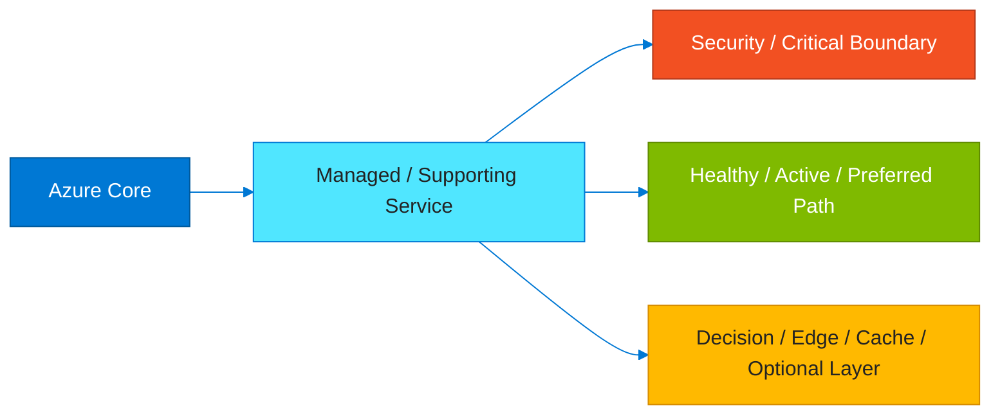

- **Azure blue** (`fill:#0078D4,color:#fff`) marks core Azure services and primary control planes.
- **Light blue** (`fill:#50E6FF,color:#232323`) marks shared services, actors, and supporting components.
- **Red** (`fill:#F25022,color:#fff`) highlights security controls, failure-sensitive boundaries, or critical transitions.
- **Green** (`fill:#7FBA00,color:#fff`) highlights active paths, healthy components, or recommended target states.
- **Yellow** (`fill:#FFB900,color:#232323`) marks decision points, gateways, caches, probes, or optional accelerators.

<a id="azure-global-infrastructure"></a>
## 1. Azure Global Infrastructure

**Deep dive:** [Azure regions, geographies, and region pairs](https://learn.microsoft.com/azure/reliability/regions-list)

Azure is organized as geographies, region pairs, regions, availability zones, and edge locations.
That hierarchy drives residency, latency, resiliency, and disaster recovery decisions for every serious deployment.

### Brief explanation
The diagram below focuses on **Azure Global Infrastructure** as a reusable Azure reference pattern.
It is intended to speed up design conversations, solution reviews, and cross-team alignment before implementation details are finalized.

### Key ideas
- The section shows the essential Azure control path or data path for the pattern.
- How Azure groups 60+ regions into geographies and region pairs.
- How availability zones add in-region fault isolation for zonal workloads.
- How edge zones and edge POPs shorten the distance to end users.
- How compliance and residency requirements influence placement choices.

### Mermaid diagram

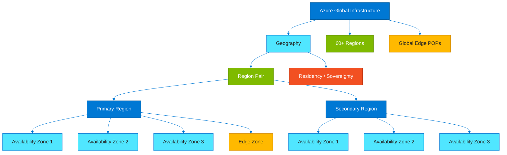

### Design takeaways
- Prefer the highest-level Azure capability that still satisfies security, performance, and governance requirements.
- How Azure groups 60+ regions into geographies and region pairs.
- How availability zones add in-region fault isolation for zonal workloads.
- How edge zones and edge POPs shorten the distance to end users.
- How compliance and residency requirements influence placement choices.

### Build checklist
- Treat this pattern as a starting blueprint and adapt it to landing zone standards, naming, and ownership.
- Validate service availability in the target region and its paired region.
- Check zone support for the SKUs and managed services you plan to use.
- Document latency needs for users, branches, factories, and partner systems.
- Align geography selection with regulatory and sovereignty constraints.

### Watch-outs
- Assuming every Azure service exists in every region leads to late redesigns.
- Confusing region pairs with complete business continuity planning creates false confidence.
- Ignoring quota and capacity behavior in popular regions can delay scale-out.
- Skipping paired-region testing hides replication and failover gaps.

### Typical pairings
- Azure Front Door for global ingress and routing.
- Traffic Manager for DNS-based failover patterns.
- Geo-redundant storage and database replication.
- Azure Site Recovery for VM-based disaster recovery.

### Questions to ask
- Which geography satisfies compliance and latency at the same time?
- Can the workload survive a zonal failure without regional failover?
- What data must remain inside a specific geography?
- What is the plan if the primary region is unavailable for hours?

<a id="compute-decision-guide"></a>
## 2. Where Should I Run My Stuff? (Compute Decision Guide)

**Deep dive:** [Azure compute decision tree](https://learn.microsoft.com/azure/architecture/guide/technology-choices/compute-decision-tree)

Azure compute ranges from raw virtual machines to fully managed web and event-driven runtimes.
The best choice depends on control requirements, packaging model, scale pattern, and operational appetite.

### Brief explanation
The diagram below focuses on **Where Should I Run My Stuff? (Compute Decision Guide)** as a reusable Azure reference pattern.
It is intended to speed up design conversations, solution reviews, and cross-team alignment before implementation details are finalized.

### Key ideas
- The section shows the essential Azure control path or data path for the pattern.
- How to split infrastructure-heavy workloads from managed platform workloads.
- When Kubernetes is justified versus when App Service or Container Apps are enough.
- When serverless Functions fit bursty event-driven APIs and jobs.
- Where Batch, Container Instances, and Spring Apps solve specialized needs.

### Mermaid diagram

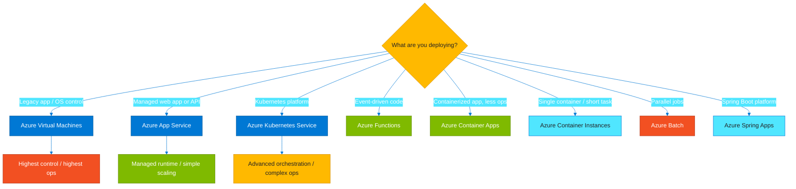

### Design takeaways
- Prefer the highest-level Azure capability that still satisfies security, performance, and governance requirements.
- How to split infrastructure-heavy workloads from managed platform workloads.
- When Kubernetes is justified versus when App Service or Container Apps are enough.
- When serverless Functions fit bursty event-driven APIs and jobs.
- Where Batch, Container Instances, and Spring Apps solve specialized needs.

### Build checklist
- Treat this pattern as a starting blueprint and adapt it to landing zone standards, naming, and ownership.
- List language, runtime, networking, and compliance requirements before picking a service.
- Estimate whether the load is steady, bursty, scheduled, or highly parallel.
- Assess the team’s appetite for OS patching, cluster operations, and runtime upgrades.
- Model baseline and burst cost across production and non-production environments.

### Watch-outs
- Choosing AKS for simple apps often adds more operational work than value.
- Treating VMs as the default keeps patching and image maintenance burdens alive.
- Using Container Instances as a long-term app platform creates gaps in durability and operations.
- Ignoring cold-start or connection limits can make serverless APIs feel unreliable.

### Typical pairings
- Azure Container Registry for image supply chain management.
- Application Insights and Azure Monitor for runtime visibility.
- Key Vault for certificates and secrets.
- Azure DevOps or GitHub Actions for deployment automation.

### Questions to ask
- How much host-level control is truly required?
- Does the workload need orchestration or just a place to run code?
- What should trigger autoscaling?
- Which option minimizes future operational debt?

<a id="azure-full-service-map"></a>
## 3. Azure Full Service Map

**Deep dive:** [Azure architecture center](https://learn.microsoft.com/azure/architecture/browse/)

Azure spans compute, data, security, networking, analytics, AI, and software delivery services.
A category map helps teams frame solutions by capability domain before drilling into service-level decisions.

### Brief explanation
The diagram below focuses on **Azure Full Service Map** as a reusable Azure reference pattern.
It is intended to speed up design conversations, solution reviews, and cross-team alignment before implementation details are finalized.

### Key ideas
- The section shows the essential Azure control path or data path for the pattern.
- How core Azure categories group services into logical architecture domains.
- Where compute, storage, and database services fit in layered workload design.
- How networking and security act as shared foundations instead of optional add-ons.
- How analytics, AI, and DevOps connect to the broader platform.

### Mermaid diagram

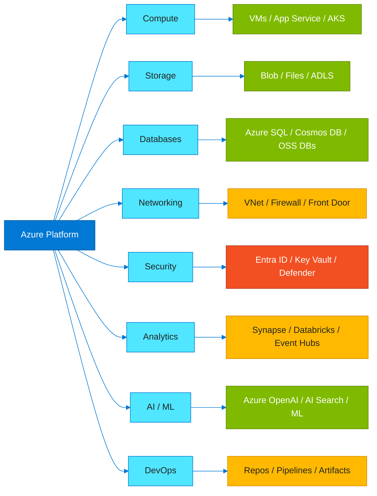

### Design takeaways
- Prefer the highest-level Azure capability that still satisfies security, performance, and governance requirements.
- How core Azure categories group services into logical architecture domains.
- Where compute, storage, and database services fit in layered workload design.
- How networking and security act as shared foundations instead of optional add-ons.
- How analytics, AI, and DevOps connect to the broader platform.

### Build checklist
- Treat this pattern as a starting blueprint and adapt it to landing zone standards, naming, and ownership.
- Map every major requirement to a domain before choosing an individual service.
- Separate shared platform services from application-specific services.
- Document identity, network, and data flows that cross category boundaries.
- Keep naming and tagging aligned so services remain searchable and governable.

### Watch-outs
- A category map is useful, but it does not replace landing zone design and ownership decisions.
- Using overlapping services without standards creates sprawl and inconsistent operations.
- Ignoring security and monitoring in early architecture sketches hides major dependencies.
- Outdated service names can confuse readers and weaken this document over time.

### Typical pairings
- Azure Landing Zones for enterprise platform baselines.
- Azure Monitor for shared observability.
- Defender for Cloud for posture and workload protection.
- Cost Management for spend visibility across categories.

### Questions to ask
- Which category owns each major requirement?
- Where do shared platform teams stop and app teams start?
- Are multiple teams solving the same problem with different Azure services?
- Does the diagram represent build, run, secure, observe, and recover?

<a id="vm-lifecycle"></a>
## 4. VM Lifecycle

**Deep dive:** [Azure VM states and billing](https://learn.microsoft.com/azure/virtual-machines/states-billing)

Azure virtual machines move through provisioning, running, stopping, deallocated, and deleted states.
Those states affect billing, automation, backups, and operational runbooks.

### Brief explanation
The diagram below focuses on **VM Lifecycle** as a reusable Azure reference pattern.
It is intended to speed up design conversations, solution reviews, and cross-team alignment before implementation details are finalized.

### Key ideas
- The section shows the essential Azure control path or data path for the pattern.
- How provisioning creates a VM and allocates compute resources.
- How running differs from stopped and from stopped/deallocated.
- How delete operations interact with disks and other attached resources.
- How lifecycle transitions should map to automation and cost control.

### Mermaid diagram

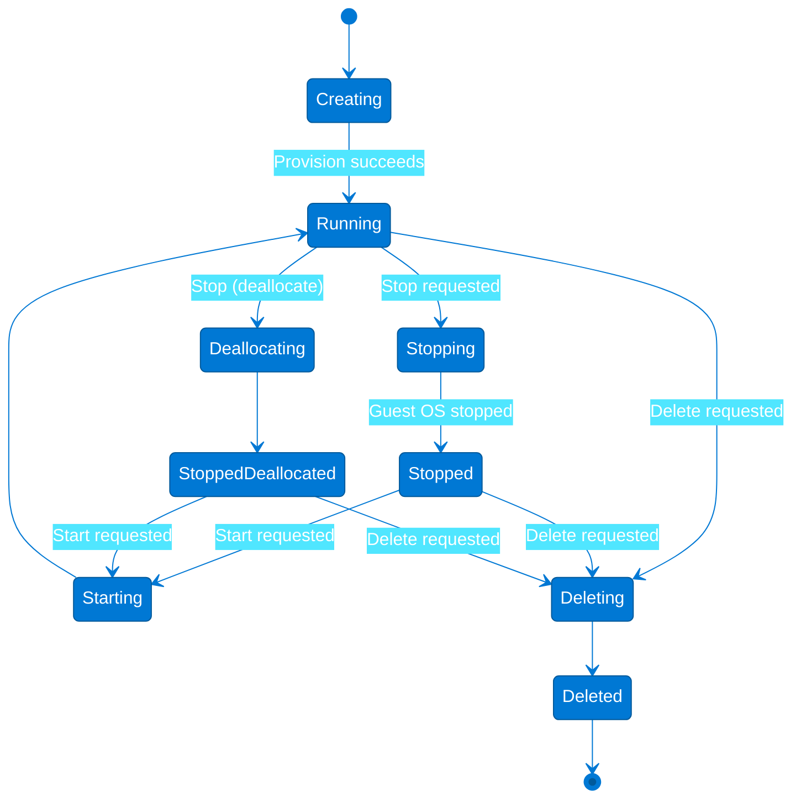

### Design takeaways
- Prefer the highest-level Azure capability that still satisfies security, performance, and governance requirements.
- How provisioning creates a VM and allocates compute resources.
- How running differs from stopped and from stopped/deallocated.
- How delete operations interact with disks and other attached resources.
- How lifecycle transitions should map to automation and cost control.

### Build checklist
- Treat this pattern as a starting blueprint and adapt it to landing zone standards, naming, and ownership.
- Decide which environments should auto-deallocate outside business hours.
- Validate backups before resize, patch, or delete operations.
- Document disk-retention and delete-lock behavior for critical servers.
- Monitor both Azure power state and guest-level heartbeat signals.

### Watch-outs
- Guest shutdown does not always deallocate compute, so charges may continue.
- Deleting a VM can leave behind NICs, disks, and public IPs if cleanup is not explicit.
- Manual lifecycle actions create drift outside approved automation.
- Runbooks that blur restart, stop, deallocate, and delete cause avoidable outages.

### Typical pairings
- Azure Backup for restore depth.
- Azure Automation or Update Manager for schedules and patching.
- VM Scale Sets for fleet lifecycle control.
- Azure Monitor for power and guest health.

### Questions to ask
- Which environments can safely deallocate on a schedule?
- What happens to disks when a VM is deleted?
- Who is allowed to stop or deallocate production servers?
- Do runbooks separate guest actions from Azure control-plane actions?

<a id="virtual-network-architecture"></a>
## 5. Virtual Network Architecture

**Deep dive:** [Hub-and-spoke networking in Azure](https://learn.microsoft.com/azure/architecture/reference-architectures/hybrid-networking/hub-spoke)

The virtual network is the basic isolation and routing boundary for Azure IaaS and many private PaaS integrations.
A resilient design combines subnets, NSGs, route tables, NAT, and Azure Firewall with zone-aware workloads.

### Brief explanation
The diagram below focuses on **Virtual Network Architecture** as a reusable Azure reference pattern.
It is intended to speed up design conversations, solution reviews, and cross-team alignment before implementation details are finalized.

### Key ideas
- The section shows the essential Azure control path or data path for the pattern.
- How subnets separate application, data, and management roles.
- How NSGs and UDRs create policy and traffic steering boundaries.
- How NAT Gateway centralizes outbound internet egress.
- How Azure Firewall adds centralized inspection and policy enforcement.

### Mermaid diagram

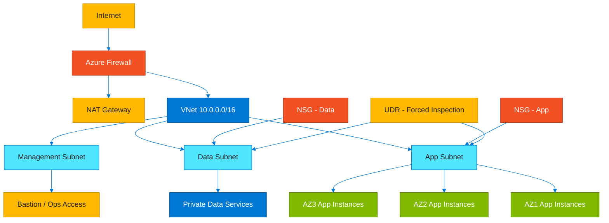

### Design takeaways
- Prefer the highest-level Azure capability that still satisfies security, performance, and governance requirements.
- How subnets separate application, data, and management roles.
- How NSGs and UDRs create policy and traffic steering boundaries.
- How NAT Gateway centralizes outbound internet egress.
- How Azure Firewall adds centralized inspection and policy enforcement.

### Build checklist
- Treat this pattern as a starting blueprint and adapt it to landing zone standards, naming, and ownership.
- Reserve subnet space for private endpoints, gateways, and future growth.
- Define fixed egress, forced tunneling, and DNS requirements early.
- Model east-west and north-south traffic before writing NSG rules.
- Confirm hybrid routing and address overlap constraints before peering.

### Watch-outs
- Overlapping CIDR ranges become a major problem during hybrid or peering expansion.
- Too many bespoke NSG rules create audit and troubleshooting complexity.
- UDRs can break platform traffic if exceptions are missing.
- Private endpoint sprawl without DNS governance creates hard-to-find failures.

### Typical pairings
- Azure Bastion for admin access without public jump boxes.
- ExpressRoute or VPN Gateway for hybrid connectivity.
- Private Link for private PaaS access.
- Network Watcher for diagnostics and topology analysis.

### Questions to ask
- Where should inspection happen, and who owns the policy?
- Which subnets must remain internet-isolated?
- Is outbound connectivity deterministic enough for allowlists?
- How will app teams consume standardized network services?

<a id="application-gateway-front-door-flow"></a>
## 6. Application Gateway / Front Door Flow

**Deep dive:** [Azure Front Door overview](https://learn.microsoft.com/azure/frontdoor/front-door-overview)

Front Door gives applications a global edge entry point with routing, TLS, and WAF protection.
Application Gateway adds regional L7 routing and private backend access close to workload VNets.

### Brief explanation
The diagram below focuses on **Application Gateway / Front Door Flow** as a reusable Azure reference pattern.
It is intended to speed up design conversations, solution reviews, and cross-team alignment before implementation details are finalized.

### Key ideas
- The section shows the essential Azure control path or data path for the pattern.
- How a global WAF and routing layer sits in front of regional application delivery.
- How health probes drive failover between backend origins and regions.
- How backend pools can include App Service, AKS ingress, or VM scale sets.
- How private backend access reduces direct internet exposure.

### Mermaid diagram

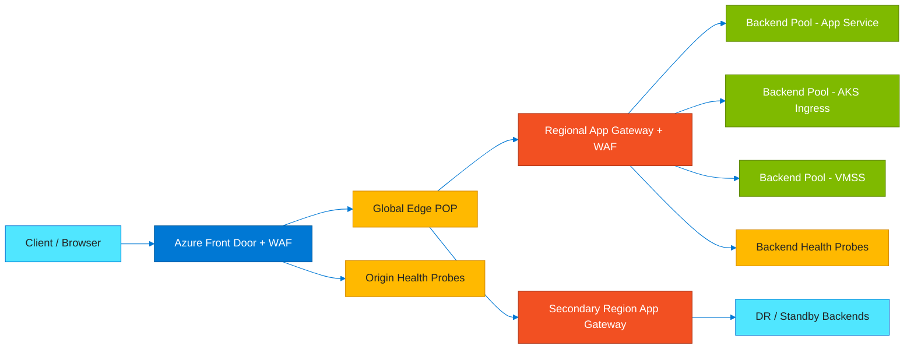

### Design takeaways
- Prefer the highest-level Azure capability that still satisfies security, performance, and governance requirements.
- How a global WAF and routing layer sits in front of regional application delivery.
- How health probes drive failover between backend origins and regions.
- How backend pools can include App Service, AKS ingress, or VM scale sets.
- How private backend access reduces direct internet exposure.

### Build checklist
- Treat this pattern as a starting blueprint and adapt it to landing zone standards, naming, and ownership.
- Decide whether the app is active-active or active-passive across regions.
- Choose where TLS terminates and where certificates are managed.
- Map path-based routing, host headers, and affinity requirements to gateway rules.
- Enable logs and probe telemetry for incident analysis.

### Watch-outs
- Duplicating redirects or rewrites at multiple layers can create loops.
- Bad health probes can mark healthy apps down or unhealthy apps up.
- WAF tuning that is not versioned can drift between environments.
- Regional backends stay exposed if private access assumptions are not enforced.

### Typical pairings
- Key Vault for certificates.
- Private Link or internal load balancers for backend isolation.
- Azure Monitor and Sentinel for edge analytics.
- Azure DNS for domain delegation and naming.

### Questions to ask
- Should users hit the nearest healthy region or a pinned home region?
- What happens when an entire region is unhealthy?
- Can teams separate edge issues from regional app delivery issues quickly?
- Are WAF policies managed like code?

<a id="azure-storage-account"></a>
## 7. Azure Storage Account

**Deep dive:** [Azure Storage account overview](https://learn.microsoft.com/azure/storage/common/storage-account-overview)

Azure storage accounts group Blob, Files, Tables, Queues, and ADLS Gen2 capabilities under one governance boundary.
Lifecycle tiers and policies make storage architecture as much about retention and economics as it is about durability.

### Brief explanation
The diagram below focuses on **Azure Storage Account** as a reusable Azure reference pattern.
It is intended to speed up design conversations, solution reviews, and cross-team alignment before implementation details are finalized.

### Key ideas
- The section shows the essential Azure control path or data path for the pattern.
- How Blob tiers span Hot, Cool, Cold, and Archive access profiles.
- How Azure Files, Tables, and Queues support different app integration patterns.
- How ADLS Gen2 adds hierarchical namespace semantics for analytics.
- How lifecycle policies automate movement and retention decisions.

### Mermaid diagram

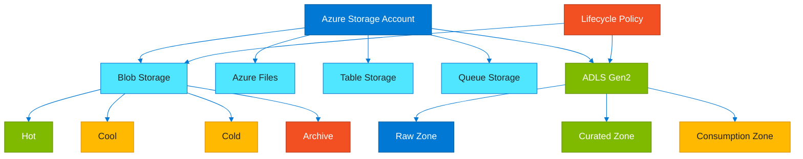

### Design takeaways
- Prefer the highest-level Azure capability that still satisfies security, performance, and governance requirements.
- How Blob tiers span Hot, Cool, Cold, and Archive access profiles.
- How Azure Files, Tables, and Queues support different app integration patterns.
- How ADLS Gen2 adds hierarchical namespace semantics for analytics.
- How lifecycle policies automate movement and retention decisions.

### Build checklist
- Treat this pattern as a starting blueprint and adapt it to landing zone standards, naming, and ownership.
- Choose the right redundancy model such as LRS, ZRS, GRS, or RA-GRS.
- Decide whether hierarchical namespace, NFS, SMB, or SFTP is required.
- Enable soft delete, versioning, or immutability where the business demands it.
- Plan private endpoints, firewalls, and DNS before broad rollout.

### Watch-outs
- Archive tier data is not instantly available for restore or read patterns.
- Throughput and namespace limits can appear at scale if accounts are badly partitioned.
- Mixing unrelated security domains in one account complicates governance.
- Skipping lifecycle policy leaves easy storage cost savings unrealized.

### Typical pairings
- Azure Data Factory, Synapse, or Databricks for ingestion and analytics.
- Azure CDN or Front Door for content distribution.
- Purview for cataloging and governance.
- Backup, snapshots, and versioning for recovery depth.

### Questions to ask
- Which data needs millisecond access and which can be tiered?
- How will the team separate raw, curated, and consumer-ready data?
- What storage access should stay private-only?
- What lifecycle rules are safe to automate?

<a id="aks-cluster-architecture"></a>
## 8. AKS Cluster Architecture

**Deep dive:** [AKS clusters and workloads](https://learn.microsoft.com/azure/aks/concepts-clusters-workloads)

AKS separates a Microsoft-managed control plane from customer-managed worker node pools.
A production cluster also needs ingress, identity, images, autoscaling, and observability patterns.

### Brief explanation
The diagram below focuses on **AKS Cluster Architecture** as a reusable Azure reference pattern.
It is intended to speed up design conversations, solution reviews, and cross-team alignment before implementation details are finalized.

### Key ideas
- The section shows the essential Azure control path or data path for the pattern.
- How system and user node pools isolate platform components from app workloads.
- How services and ingress expose pods to internal and external consumers.
- How Azure Container Registry and workload identity connect the supply chain and runtime.
- How virtual nodes or burst options absorb temporary demand.

### Mermaid diagram

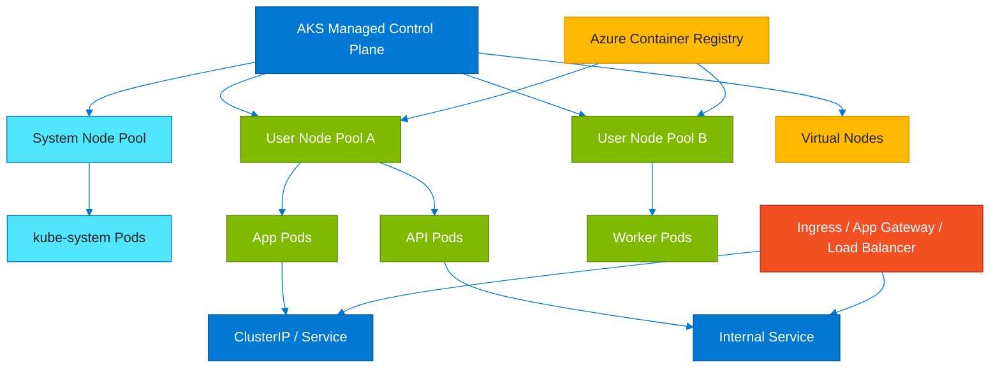

### Design takeaways
- Prefer the highest-level Azure capability that still satisfies security, performance, and governance requirements.
- How system and user node pools isolate platform components from app workloads.
- How services and ingress expose pods to internal and external consumers.
- How Azure Container Registry and workload identity connect the supply chain and runtime.
- How virtual nodes or burst options absorb temporary demand.

### Build checklist
- Treat this pattern as a starting blueprint and adapt it to landing zone standards, naming, and ownership.
- Decide whether the cluster is private, internet-facing, or integrated into a hub-spoke network.
- Plan node pool separation for system, general, batch, GPU, or Windows workloads.
- Define upgrade cadence for Kubernetes, node images, and add-ons.
- Set autoscaling and resource requests before production load testing.

### Watch-outs
- One huge shared cluster can become a noisy-neighbor and upgrade bottleneck.
- Poor IP planning causes painful network exhaustion later.
- Ingress and certificate patterns become operationally heavy without standards.
- Cluster-admin access is often over-granted and under-reviewed.

### Typical pairings
- Azure Container Registry for image storage and provenance.
- Azure Monitor Container Insights for cluster visibility.
- Defender for Cloud for Kubernetes posture.
- Application Gateway Ingress or Gateway API patterns.

### Questions to ask
- Does this workload really need Kubernetes?
- How many node pools are required for safe isolation?
- Can the cluster be upgraded inside the maintenance window?
- Are identities and network policies tight enough for multi-team use?

<a id="azure-functions-request-flow"></a>
## 9. Azure Functions Request Flow

**Deep dive:** [Azure Functions overview](https://learn.microsoft.com/azure/azure-functions/functions-overview)

Azure Functions runs code on demand in response to HTTP, timer, queue, and event triggers.
A common request path enters a Function App and then uses managed identity to reach Cosmos DB or Azure SQL.

### Brief explanation
The diagram below focuses on **Azure Functions Request Flow** as a reusable Azure reference pattern.
It is intended to speed up design conversations, solution reviews, and cross-team alignment before implementation details are finalized.

### Key ideas
- The section shows the essential Azure control path or data path for the pattern.
- How the HTTP request enters the Function App and triggers business logic.
- How managed identity removes embedded credentials from data access.
- How the same API shape can route to document or relational storage.
- How end-to-end telemetry should follow the full dependency path.

### Mermaid diagram

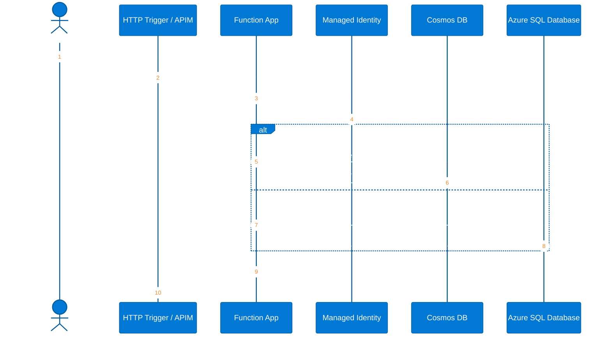

### Design takeaways
- Prefer the highest-level Azure capability that still satisfies security, performance, and governance requirements.
- How the HTTP request enters the Function App and triggers business logic.
- How managed identity removes embedded credentials from data access.
- How the same API shape can route to document or relational storage.
- How end-to-end telemetry should follow the full dependency path.

### Build checklist
- Treat this pattern as a starting blueprint and adapt it to landing zone standards, naming, and ownership.
- Pick the right hosting plan for startup, networking, and throughput needs.
- Define authentication, authorization, and API ownership up front.
- Set retry and timeout behavior for downstream data stores explicitly.
- Capture correlation IDs and dependency telemetry from day one.

### Watch-outs
- Cold starts matter for latency-sensitive APIs on the wrong hosting plan.
- Long-lived or chatty database patterns can erase serverless efficiency.
- Too many unrelated functions in one app hurt security and release isolation.
- Bindings can hide retry or serialization behavior if teams do not validate them.

### Typical pairings
- API Management for governance and throttling.
- Service Bus or Event Grid for asynchronous fan-out.
- Application Insights for traces and exceptions.
- Key Vault for configuration and secretless references.

### Questions to ask
- Can the API tolerate serverless cold-start behavior?
- Which persistence path is authoritative: Cosmos, SQL, or both?
- How do retries affect idempotency?
- Can downstream dependencies survive function-scale bursts?

<a id="azure-sql-ha-architecture"></a>
## 10. Azure SQL HA Architecture

**Deep dive:** [Azure SQL HA and DR](https://learn.microsoft.com/azure/azure-sql/database/high-availability-sla-local-zone-redundancy)

Azure SQL provides local high availability plus optional cross-region disaster recovery patterns.
Zone redundancy, active geo-replication, failover groups, and Always On solve different scopes of failure.

### Brief explanation
The diagram below focuses on **Azure SQL HA Architecture** as a reusable Azure reference pattern.
It is intended to speed up design conversations, solution reviews, and cross-team alignment before implementation details are finalized.

### Key ideas
- The section shows the essential Azure control path or data path for the pattern.
- How zone redundancy protects against datacenter-level failures inside a region.
- How active geo-replication and failover groups enable cross-region recovery.
- How readable secondaries support reporting and read scale.
- How SQL on Azure VMs changes the ownership model compared with PaaS.

### Mermaid diagram

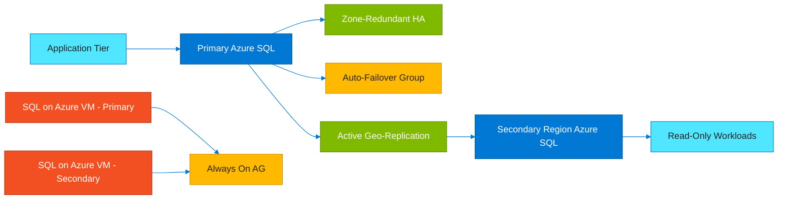

### Design takeaways
- Prefer the highest-level Azure capability that still satisfies security, performance, and governance requirements.
- How zone redundancy protects against datacenter-level failures inside a region.
- How active geo-replication and failover groups enable cross-region recovery.
- How readable secondaries support reporting and read scale.
- How SQL on Azure VMs changes the ownership model compared with PaaS.

### Build checklist
- Treat this pattern as a starting blueprint and adapt it to landing zone standards, naming, and ownership.
- Define whether the business need is local HA, DR, read scale, or all three.
- Measure acceptable data loss and downtime before choosing the pattern.
- Test application connection strings and reconnection logic during failover.
- Align backups and long-term retention with database criticality.

### Watch-outs
- Readable secondaries do not replace restore testing or DR exercises.
- Replication lag may be unacceptable for strict zero-data-loss assumptions.
- Applications that cache DNS or lack retries often fail during failover.
- SQL on VMs adds clustering and patching complexity that PaaS avoids.

### Typical pairings
- Private endpoints for secure data-plane access.
- Azure Monitor for replication and failover telemetry.
- Key Vault for credentials or tokens.
- Backup and long-term retention policies.

### Questions to ask
- Is the workload optimizing for zero downtime, zero data loss, or a balance?
- How quickly must applications reconnect after failover?
- Which read-heavy workloads can move to secondaries?
- Does the team want managed database HA or full SQL Server control?

<a id="cosmos-db-architecture"></a>
## 11. Cosmos DB Architecture

**Deep dive:** [Global distribution in Azure Cosmos DB](https://learn.microsoft.com/azure/cosmos-db/global-dist-under-the-hood)

Cosmos DB is a globally distributed database built for elastic scale, low latency, and configurable consistency.
Its architecture depends heavily on partitioning, RU planning, consistency, and regional write strategy.

### Brief explanation
The diagram below focuses on **Cosmos DB Architecture** as a reusable Azure reference pattern.
It is intended to speed up design conversations, solution reviews, and cross-team alignment before implementation details are finalized.

### Key ideas
- The section shows the essential Azure control path or data path for the pattern.
- How partition keys spread logical data across physical partitions.
- How consistency levels trade strictness for latency and availability.
- How multi-region writes improve locality and resilience.
- How RU consumption makes data modeling an economic decision as well as a technical one.

### Mermaid diagram

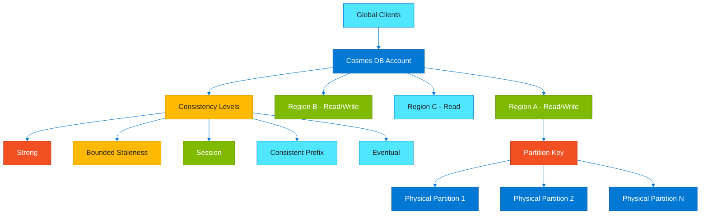

### Design takeaways
- Prefer the highest-level Azure capability that still satisfies security, performance, and governance requirements.
- How partition keys spread logical data across physical partitions.
- How consistency levels trade strictness for latency and availability.
- How multi-region writes improve locality and resilience.
- How RU consumption makes data modeling an economic decision as well as a technical one.

### Build checklist
- Treat this pattern as a starting blueprint and adapt it to landing zone standards, naming, and ownership.
- Validate the partition key against cardinality and access patterns.
- Choose the minimum consistency level that still meets correctness needs.
- Test preferred region and failover behavior from every app region.
- Model RU use for reads, writes, indexing, and cross-partition queries.

### Watch-outs
- A poor partition key creates hotspots that throughput alone cannot fix.
- Strong consistency across distant regions can hurt latency and cost.
- Cross-partition scans become expensive quickly.
- Multi-region writes need clear conflict resolution semantics.

### Typical pairings
- Azure Functions and Event Grid for event-driven processing.
- Synapse Link for analytics over operational data.
- Private endpoints and RBAC for secure access.
- Application Insights for request diagnostics.

### Questions to ask
- What attribute best distributes load?
- Which consistency level actually matches the user experience?
- How many regions need local writes?
- Can the RU budget survive peak traffic and indexing together?

<a id="azure-ad-entra-id"></a>
## 12. Azure AD / Entra ID

**Deep dive:** [Microsoft Entra fundamentals](https://learn.microsoft.com/entra/fundamentals/whatis)

Microsoft Entra ID is the control plane for Azure users, groups, applications, and managed identities.
The architecture becomes useful when directory objects are shown together with the RBAC scopes where they act.

### Brief explanation
The diagram below focuses on **Azure AD / Entra ID** as a reusable Azure reference pattern.
It is intended to speed up design conversations, solution reviews, and cross-team alignment before implementation details are finalized.

### Key ideas
- The section shows the essential Azure control path or data path for the pattern.
- How tenants contain users, groups, app registrations, and service principals.
- How managed identities replace embedded secrets for Azure-hosted workloads.
- How RBAC inheritance flows from management groups down to resources.
- How identity governance and least privilege fit into platform design.

### Mermaid diagram

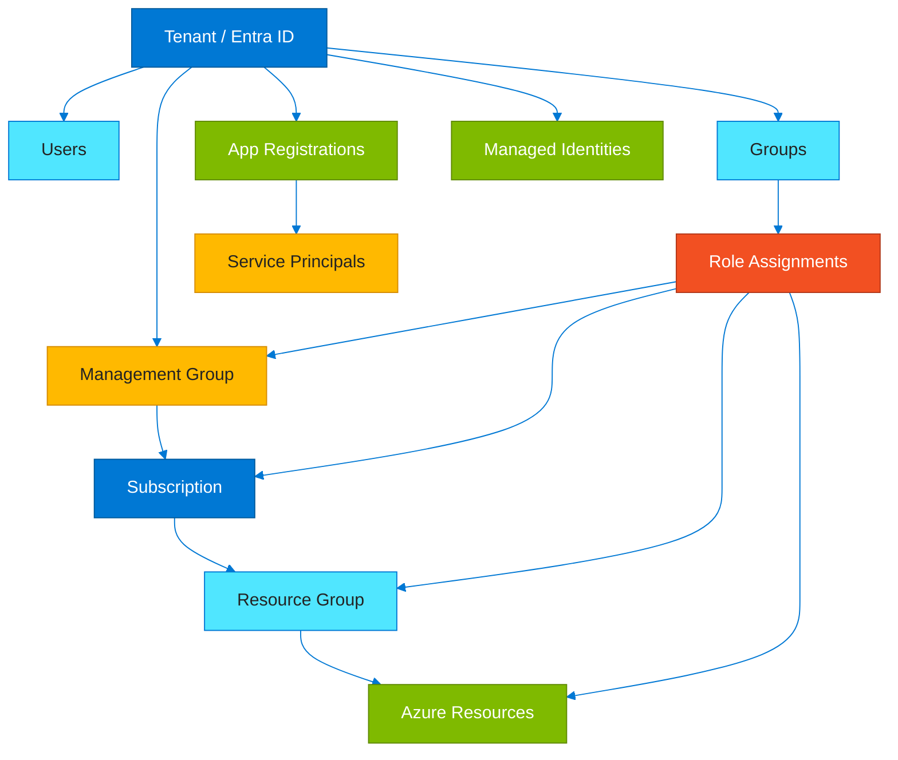

### Design takeaways
- Prefer the highest-level Azure capability that still satisfies security, performance, and governance requirements.
- How tenants contain users, groups, app registrations, and service principals.
- How managed identities replace embedded secrets for Azure-hosted workloads.
- How RBAC inheritance flows from management groups down to resources.
- How identity governance and least privilege fit into platform design.

### Build checklist
- Treat this pattern as a starting blueprint and adapt it to landing zone standards, naming, and ownership.
- Define the tenant strategy for production, sandbox, and partner scenarios.
- Create access groups that align with real job functions.
- Replace embedded secrets with managed identity or certificate-backed credentials.
- Document RBAC scope boundaries for critical subscriptions and resource groups.

### Watch-outs
- Direct user role assignments become messy and hard to audit.
- Applications accumulate unused secrets and API permissions over time.
- Managed identities still fail if downstream permissions are too broad.
- RBAC alone does not solve every data-plane authorization problem.

### Typical pairings
- Key Vault for certificates and key material.
- Privileged Identity Management for JIT elevation.
- Azure Policy for identity-related guardrails.
- Defender for Cloud for permission and posture recommendations.

### Questions to ask
- Which identities are human and which are workloads?
- Where should RBAC inheritance stop?
- Can every app use managed identity?
- How will privileged access be reviewed?

<a id="azure-front-door-cdn"></a>
## 13. Azure Front Door + CDN

**Deep dive:** [Azure Front Door overview](https://learn.microsoft.com/azure/frontdoor/front-door-overview)

Front Door plus CDN accelerates global delivery by caching content near users and routing traffic to healthy origins.
The pattern improves latency, protects public apps, and reduces load on regional origins.

### Brief explanation
The diagram below focuses on **Azure Front Door + CDN** as a reusable Azure reference pattern.
It is intended to speed up design conversations, solution reviews, and cross-team alignment before implementation details are finalized.

### Key ideas
- The section shows the essential Azure control path or data path for the pattern.
- How edge POPs terminate and inspect user traffic close to the client.
- How CDN caching reduces repeated origin fetches for static or semi-static content.
- How origin groups drive global load balancing and failover.
- How WAF and cache behavior form part of the internet edge strategy.

### Mermaid diagram

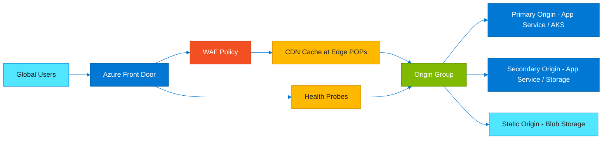

### Design takeaways
- Prefer the highest-level Azure capability that still satisfies security, performance, and governance requirements.
- How edge POPs terminate and inspect user traffic close to the client.
- How CDN caching reduces repeated origin fetches for static or semi-static content.
- How origin groups drive global load balancing and failover.
- How WAF and cache behavior form part of the internet edge strategy.

### Build checklist
- Treat this pattern as a starting blueprint and adapt it to landing zone standards, naming, and ownership.
- Classify routes as static, dynamic, personalized, or non-cacheable.
- Define cache headers, TTLs, and purge triggers for release flows.
- Choose probe paths that reflect true app health.
- Measure hit ratio and origin offload after rollout.

### Watch-outs
- Caching personalized responses without the right keys leaks content.
- Very short TTLs reduce cache value while long TTLs preserve stale content.
- Origin failover does not solve application data consistency by itself.
- WAF and cache rules drift quickly if not versioned like code.

### Typical pairings
- Blob Storage for static origins.
- App Service or AKS for dynamic origins.
- Azure Monitor for edge analytics.
- Key Vault for certificate management.

### Questions to ask
- What should be cached and for how long?
- How quickly must updates become visible globally?
- Which routes must bypass cache entirely?
- Does failover preserve compliance and session behavior?

<a id="three-tier-web-application"></a>
## 14. 3-Tier Web Application

**Deep dive:** [Basic web app reference architecture](https://learn.microsoft.com/azure/architecture/reference-architectures/app-service-web-app/basic-web-app)

The three-tier pattern separates presentation, application logic, and data storage for scale and maintainability.
In Azure that often means App Gateway, App Service or AKS, Azure SQL, and Redis working together.

### Brief explanation
The diagram below focuses on **3-Tier Web Application** as a reusable Azure reference pattern.
It is intended to speed up design conversations, solution reviews, and cross-team alignment before implementation details are finalized.

### Key ideas
- The section shows the essential Azure control path or data path for the pattern.
- How the web tier handles public HTTPS entry and WAF protection.
- How the app tier hosts business logic and APIs.
- How Redis accelerates repeated reads and session-heavy behavior.
- How Azure SQL anchors the transactional data tier.

### Mermaid diagram

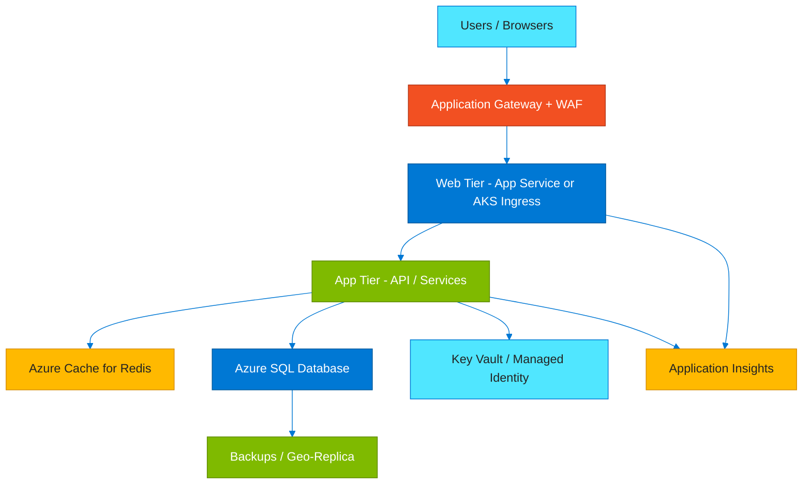

### Design takeaways
- Prefer the highest-level Azure capability that still satisfies security, performance, and governance requirements.
- How the web tier handles public HTTPS entry and WAF protection.
- How the app tier hosts business logic and APIs.
- How Redis accelerates repeated reads and session-heavy behavior.
- How Azure SQL anchors the transactional data tier.

### Build checklist
- Treat this pattern as a starting blueprint and adapt it to landing zone standards, naming, and ownership.
- Decide whether web and app tiers share a runtime platform or deploy independently.
- Design retries and timeouts between API, cache, and SQL paths.
- Choose the session strategy: stateless, cache-backed, token-based, or sticky.
- Set autoscaling thresholds for web/app tiers and monitor DB headroom separately.

### Watch-outs
- Treating Redis as a source of truth complicates recovery.
- Premature microservices can add more complexity than value.
- Database bottlenecks often show up after web and app tiers scale well.
- Health probes and readiness paths must reflect real app behavior.

### Typical pairings
- Front Door for global entry ahead of the stack.
- Azure Monitor for tracing across all tiers.
- Private endpoints for data-tier isolation.
- CI/CD pipelines for staged promotion through environments.

### Questions to ask
- Which tier scales first?
- How much state can move out of the web tier?
- Can the database fail without collapsing the entire experience?
- What deployment strategy minimizes tier-by-tier risk?

<a id="event-driven-architecture"></a>
## 15. Event-Driven Architecture

**Deep dive:** [Event-driven architecture style on Azure](https://learn.microsoft.com/azure/architecture/guide/architecture-styles/event-driven)

Event-driven systems decouple producers from consumers so new reactions can be added without rewriting the source.
Azure Event Grid, Functions, Logic Apps, and Service Bus form a practical Azure event backbone.

### Brief explanation
The diagram below focuses on **Event-Driven Architecture** as a reusable Azure reference pattern.
It is intended to speed up design conversations, solution reviews, and cross-team alignment before implementation details are finalized.

### Key ideas
- The section shows the essential Azure control path or data path for the pattern.
- How producers emit events instead of calling every consumer directly.
- How Event Grid handles fan-out and notification routing.
- How Functions and Logic Apps react to events in code and workflow form.
- How Service Bus adds durable messaging and dead-letter behavior when needed.

### Mermaid diagram

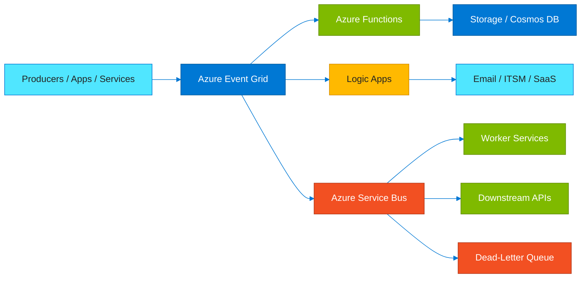

### Design takeaways
- Prefer the highest-level Azure capability that still satisfies security, performance, and governance requirements.
- How producers emit events instead of calling every consumer directly.
- How Event Grid handles fan-out and notification routing.
- How Functions and Logic Apps react to events in code and workflow form.
- How Service Bus adds durable messaging and dead-letter behavior when needed.

### Build checklist
- Treat this pattern as a starting blueprint and adapt it to landing zone standards, naming, and ownership.
- Define event schema, ownership, and versioning policy up front.
- Choose between notification-style events and durable messaging per workload.
- Set retry, poison-message, and dead-letter behavior explicitly.
- Capture correlation IDs so a single event can be traced end to end.

### Watch-outs
- Event-driven does not guarantee eventual success without strong observability.
- Overly coarse or overly chatty events both create downstream pain.
- Synchronous dependencies inside consumers reintroduce coupling.
- Without ownership and schema discipline, event topics turn into vague contracts.

### Typical pairings
- Azure Monitor and Log Analytics for observability.
- API Management for synchronous edges around asynchronous cores.
- Cosmos DB or Storage for replay context.
- Azure DevOps for infrastructure and workflow deployment.

### Questions to ask
- Is this really an event or a hidden command?
- How will replay work without duplicating side effects?
- Which consumers truly need real time?
- Can operators trace one business event across subscribers?

<a id="azure-devops-cicd-pipeline"></a>
## 16. Azure DevOps CI/CD Pipeline

**Deep dive:** [What is Azure Pipelines?](https://learn.microsoft.com/azure/devops/pipelines/get-started/what-is-azure-pipelines)

A strong Azure delivery pipeline turns source changes into tested artifacts and promotes them through guarded environments.
Azure Repos, Pipelines, Artifacts, and environments provide the control points for safe repeatable delivery.

### Brief explanation
The diagram below focuses on **Azure DevOps CI/CD Pipeline** as a reusable Azure reference pattern.
It is intended to speed up design conversations, solution reviews, and cross-team alignment before implementation details are finalized.

### Key ideas
- The section shows the essential Azure control path or data path for the pattern.
- How source control and branch policy start the CI process.
- How builds, tests, and security scans produce a trustworthy artifact.
- How staged environments and approvals support progressive delivery.
- How monitoring closes the loop after deployment.

### Mermaid diagram

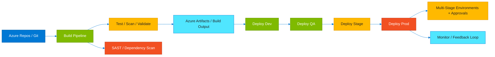

### Design takeaways
- Prefer the highest-level Azure capability that still satisfies security, performance, and governance requirements.
- How source control and branch policy start the CI process.
- How builds, tests, and security scans produce a trustworthy artifact.
- How staged environments and approvals support progressive delivery.
- How monitoring closes the loop after deployment.

### Build checklist
- Treat this pattern as a starting blueprint and adapt it to landing zone standards, naming, and ownership.
- Define branch strategy, pull-request checks, and release cadence clearly.
- Run unit, integration, security, and infrastructure checks as early as practical.
- Promote one immutable artifact instead of rebuilding per environment.
- Wire runtime health signals back into deployment decisions.

### Watch-outs
- Rebuilding for each stage undermines reproducibility.
- Pipelines without rollback plans turn minor failures into long incidents.
- Hidden scripts on custom agents create non-portable build dependencies.
- Too many approvals slow delivery without materially improving safety.

### Typical pairings
- Key Vault for secrets and service connections.
- Azure Policy and IaC validation.
- Application Insights and Azure Monitor for release health.
- Container Registry or package feeds for immutable inputs.

### Questions to ask
- Can every deployment be traced back to a specific commit and approval?
- Are tests early enough to stop bad changes before artifact promotion?
- What is the rollback path if production degrades?
- How much of the release still depends on tribal knowledge?

<a id="data-lake-architecture"></a>
## 17. Data Lake Architecture

**Deep dive:** [End-to-end Azure data platform architecture](https://learn.microsoft.com/azure/architecture/example-scenario/dataplate2e/data-platform-end-to-end)

A modern Azure data lake stores raw source data, curates it through processing layers, and serves BI or analytics consumers.
ADLS Gen2, Synapse, and Power BI are a common pattern for enterprise reporting and downstream data products.

### Brief explanation
The diagram below focuses on **Data Lake Architecture** as a reusable Azure reference pattern.
It is intended to speed up design conversations, solution reviews, and cross-team alignment before implementation details are finalized.

### Key ideas
- The section shows the essential Azure control path or data path for the pattern.
- How raw zones preserve source data for replay and traceability.
- How curated zones apply cleansing and business rules.
- How Synapse transforms and models data for analytics.
- How semantic layers expose governed business metrics to Power BI consumers.

### Mermaid diagram

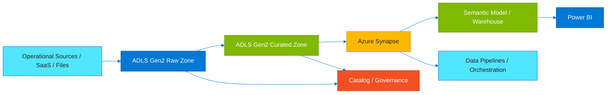

### Design takeaways
- Prefer the highest-level Azure capability that still satisfies security, performance, and governance requirements.
- How raw zones preserve source data for replay and traceability.
- How curated zones apply cleansing and business rules.
- How Synapse transforms and models data for analytics.
- How semantic layers expose governed business metrics to Power BI consumers.

### Build checklist
- Treat this pattern as a starting blueprint and adapt it to landing zone standards, naming, and ownership.
- Define naming, partitioning, and folder standards for every lake zone.
- Decide which flows are batch, streaming, or near-real-time.
- Implement identity-based access and least privilege for engineers and analysts.
- Track lineage and data quality between ingestion and BI publication.

### Watch-outs
- A lake without governance becomes a dumping ground that no one trusts.
- Too many file formats and partitioning rules increase complexity.
- Direct BI access to raw data bypasses curation and security intent.
- Weak data quality controls produce polished dashboards with poor truthfulness.

### Typical pairings
- Data Factory or Synapse pipelines for orchestration.
- Purview for cataloging and lineage.
- Databricks for advanced engineering and ML patterns.
- Private endpoints and Key Vault for secure integration.

### Questions to ask
- Which zone is authoritative for replay, transformation, and consumption?
- How is poor-quality data quarantined?
- What partitioning supports both ingestion and analytics?
- Can business users trust the semantic layer without raw storage knowledge?

<a id="disaster-recovery"></a>
## 18. Disaster Recovery

**Deep dive:** [Azure Site Recovery overview](https://learn.microsoft.com/azure/site-recovery/site-recovery-overview)

Disaster recovery includes far more than backups: it also covers failover, dependency order, communications, and recovery validation.
Azure Site Recovery and platform-native geo-replication help connect technology recovery to business recovery goals.

### Brief explanation
The diagram below focuses on **Disaster Recovery** as a reusable Azure reference pattern.
It is intended to speed up design conversations, solution reviews, and cross-team alignment before implementation details are finalized.

### Key ideas
- The section shows the essential Azure control path or data path for the pattern.
- How VM replication and platform-native replication support different recovery strategies.
- How runbooks and failover plans sequence apps, data, networking, and identity.
- How RTO and RPO should drive pattern selection rather than habit.
- How failback matters after the primary region returns.

### Mermaid diagram

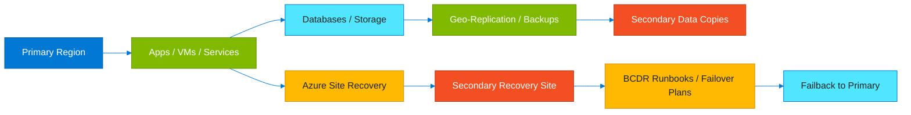

### Design takeaways
- Prefer the highest-level Azure capability that still satisfies security, performance, and governance requirements.
- How VM replication and platform-native replication support different recovery strategies.
- How runbooks and failover plans sequence apps, data, networking, and identity.
- How RTO and RPO should drive pattern selection rather than habit.
- How failback matters after the primary region returns.

### Build checklist
- Treat this pattern as a starting blueprint and adapt it to landing zone standards, naming, and ownership.
- Set target RTO and RPO for each workload or business capability.
- Identify dependencies such as DNS, identity, secrets, and third-party endpoints.
- Choose backup retention, replication, and failover automation levels intentionally.
- Run tabletop exercises and controlled failover drills regularly.

### Watch-outs
- Backups alone do not provide service continuity.
- Untested failover scripts often fail on DNS, secrets, or firewall rules.
- Replication may protect data while application dependencies still block recovery.
- Many organizations define RTO/RPO but never prove the architecture can meet them.

### Typical pairings
- Azure Backup for retention and restore depth.
- Front Door or Traffic Manager for entry-point failover.
- Azure Monitor for incident detection and recovery telemetry.
- Automation runbooks for orchestration.

### Questions to ask
- What does downtime really cost this workload?
- Can the team recover without restoring every non-critical dependency first?
- How quickly can the business validate recovered service?
- What is the failback plan after the primary region returns?

<a id="well-architected-framework"></a>
## 19. Well-Architected Framework

**Deep dive:** [Azure Well-Architected Framework](https://learn.microsoft.com/azure/well-architected/)

The Well-Architected Framework gives Azure teams a shared language for evaluating trade-offs and improving workloads.
Its five pillars keep review conversations grounded in business outcomes instead of service bias.

### Brief explanation
The diagram below focuses on **Well-Architected Framework** as a reusable Azure reference pattern.
It is intended to speed up design conversations, solution reviews, and cross-team alignment before implementation details are finalized.

### Key ideas
- The section shows the essential Azure control path or data path for the pattern.
- How reliability, security, cost, operations, and performance influence every design.
- How trade-offs between pillars should be made explicitly instead of accidentally.
- How platform and application teams can use the same review structure.
- How telemetry and ownership turn framework findings into action.

### Mermaid diagram

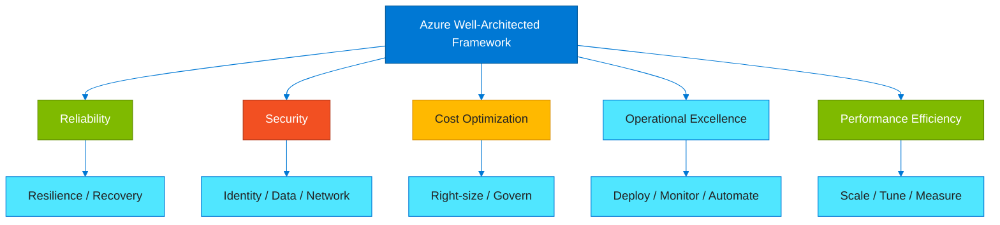

### Design takeaways
- Prefer the highest-level Azure capability that still satisfies security, performance, and governance requirements.
- How reliability, security, cost, operations, and performance influence every design.
- How trade-offs between pillars should be made explicitly instead of accidentally.
- How platform and application teams can use the same review structure.
- How telemetry and ownership turn framework findings into action.

### Build checklist
- Treat this pattern as a starting blueprint and adapt it to landing zone standards, naming, and ownership.
- Review workloads against all five pillars during design and major change.
- Capture measurable risks and owners instead of vague best-practice notes.
- Balance cost, resilience, and performance against business priorities.
- Use runtime telemetry to validate intended architecture qualities.

### Watch-outs
- Over-focusing on cost often weakens security or reliability until an incident forces change.
- Checklists without context lead to cargo-cult architecture.
- Technically elegant systems can still be operationally weak.
- Review findings lose value when not tied to backlog actions and owners.

### Typical pairings
- Azure Advisor for improvement recommendations.
- Azure Policy for enforceable guardrails.
- Cost Management for spend evidence.
- Azure Monitor for runtime proof points.

### Questions to ask
- Which pillar is weakest today?
- Where are trade-offs intentional and where are they accidental?
- What telemetry proves the design is meeting goals?
- Which improvements should be funded now versus tracked as debt?

<a id="on-premises-to-azure-migration"></a>
## 20. On-Premises to Azure Migration

**Deep dive:** [Azure Migrate services overview](https://learn.microsoft.com/azure/migrate/migrate-services-overview)

Migration is a portfolio exercise that mixes discovery, assessment, right-sizing, data movement, and post-cutover optimization.
Azure Migrate, DMS, and Data Box help move servers, databases, and bulk data into Azure landing zones.

### Brief explanation
The diagram below focuses on **On-Premises to Azure Migration** as a reusable Azure reference pattern.
It is intended to speed up design conversations, solution reviews, and cross-team alignment before implementation details are finalized.

### Key ideas
- The section shows the essential Azure control path or data path for the pattern.
- How Azure Migrate inventories dependencies and target readiness.
- How Database Migration Service accelerates supported database moves.
- How Data Box handles large data transfers that exceed practical network windows.
- How migration waves should reflect business criticality and dependency order.

### Mermaid diagram

```mermaid
%%{init: {'theme':'base','themeVariables': {'primaryColor':'#0078D4','primaryTextColor':'#ffffff','primaryBorderColor':'#005A9C','secondaryColor':'#50E6FF','tertiaryColor':'#F25022','lineColor':'#0078D4','fontFamily':'Segoe UI'}} }%%
flowchart LR
OP[On-Prem Servers / DBs / Files]:::light --> AM[Azure Migrate]:::azure
AM --> ASSESS[Assessment / Dependency Mapping]:::yellow
ASSESS --> WAVE[Migration Waves]:::green
WAVE --> VM[Azure VMs / App Service / AKS]:::azure
OP --> DMS[Database Migration Service]:::red
DMS --> SQLT[Azure SQL / Managed Instance / PostgreSQL]:::green
OP --> DBX[Azure Data Box]:::yellow
DBX --> ST[Azure Storage / ADLS]:::light
WAVE --> OPT[Post-Migration Optimization]:::green
classDef azure fill:#0078D4,color:#fff,stroke:#005A9C,stroke-width:1px
classDef light fill:#50E6FF,color:#232323,stroke:#0078D4,stroke-width:1px
classDef red fill:#F25022,color:#fff,stroke:#B2381A,stroke-width:1px
classDef green fill:#7FBA00,color:#fff,stroke:#5F8A00,stroke-width:1px
classDef yellow fill:#FFB900,color:#232323,stroke:#D68C00,stroke-width:1px
```

### Design takeaways
- Prefer the highest-level Azure capability that still satisfies security, performance, and governance requirements.
- How Azure Migrate inventories dependencies and target readiness.
- How Database Migration Service accelerates supported database moves.
- How Data Box handles large data transfers that exceed practical network windows.
- How migration waves should reflect business criticality and dependency order.

### Build checklist
- Treat this pattern as a starting blueprint and adapt it to landing zone standards, naming, and ownership.
- Inventory servers, databases, integrations, and usage patterns before sizing targets.
- Choose a landing zone with networking, IAM, policy, and monitoring already in place.
- Group workloads into migration waves using dependency mapping and change windows.
- Plan cutover validation, rollback, and business communications for each move.

### Watch-outs
- Skipping dependency mapping causes outages even when a server migrates successfully.
- Lift-and-shift without governance creates unmanaged cloud sprawl.
- Database migration may succeed technically while drivers or authentication still fail cutover.
- Large data movement and bandwidth constraints are frequently underestimated.

### Typical pairings
- Azure Landing Zones for governance-ready targets.
- Azure Backup and Site Recovery during transition periods.
- Cost Management for right-sizing after migration.
- Azure Monitor for cutover validation and onboarding.

### Questions to ask
- Which workloads should be rehosted quickly and which deserve modernization?
- Are target landing zones ready before production migration?
- How will business validation work wave by wave?
- What optimization work must happen after cutover?

<a id="appendix-a-repo-domain-map"></a>
## Appendix A: Repo Domain Map

This repo is organized by Azure capability domain so readers can move from architecture diagrams into deeper implementation tracks.

- **Compute/** — VMs, App Service, AKS, Container Apps, Batch, and runtime choice patterns.
- **Containers/** — Container-focused guidance for AKS, images, ingress, and cluster operations.
- **Database/** — Azure SQL, Cosmos DB, open-source DB services, and HA/DR patterns.
- **DataPipeline/** — Ingestion, lakes, orchestration, analytics, and BI delivery patterns.
- **IAM-Security/** — Entra ID, RBAC, Key Vault, Defender, and access architecture guidance.
- **Networking/** — VNet, DNS, Front Door, Application Gateway, Firewall, and hybrid connectivity.
- **Serverless/** — Functions, Logic Apps, eventing, and lightweight integration patterns.
- **Storage/** — Blob, Files, Queues, Tables, ADLS Gen2, and lifecycle strategy.
- **Migration/** — Assessment, landing zones, DMS, Data Box, and modernization decisions.
- **Monitoring/** — Azure Monitor, Log Analytics, and Application Insights.
- **CICD/** — Repos, Pipelines, Artifacts, approvals, and release management.
- **CostOptimization/** — Rightsizing, reservations, lifecycle cleanup, and spend governance.
- **Architecture/** — This visual reference and cross-domain architecture index.

- The **Architecture/** folder is the visual hub and should stay aligned with all sibling topic folders.
- The **Networking/**, **IAM-Security/**, and **Monitoring/** domains influence almost every workload pattern in this repository.
- The **Compute/**, **Containers/**, **Serverless/**, and **Database/** folders usually combine to form workload delivery patterns.
- The **Migration/** and **CostOptimization/** tracks apply across the full lifecycle rather than to one runtime only.
- The **CICD/** and **DataPipeline/** tracks support how solutions are delivered and how data moves across the estate.

<a id="appendix-b-azure-service-quick-index"></a>
## Appendix B: Azure Service Quick Index

Use this quick index when you know the Azure capability domain but not yet the exact service or pattern.

### Compute

- Virtual Machines
- Virtual Machine Scale Sets
- App Service
- Azure Kubernetes Service
- Azure Functions
- Container Apps
- Container Instances
- Azure Batch
- Spring Apps
- Dedicated Host

### Storage

- Storage Accounts
- Blob Storage
- Azure Files
- Queue Storage
- Table Storage
- ADLS Gen2
- Managed Disks
- Azure NetApp Files
- Backup Vault
- Import/Export

### Databases

- Azure SQL Database
- SQL Managed Instance
- SQL on Azure VMs
- Cosmos DB
- Azure Database for PostgreSQL
- Azure Database for MySQL
- Azure Cache for Redis
- Data Explorer
- Elastic Pools
- Managed Cassandra

### Networking

- Virtual Network
- NSG
- UDR
- Azure Firewall
- NAT Gateway
- Load Balancer
- Application Gateway
- Front Door
- Traffic Manager
- ExpressRoute

### Identity & Security

- Entra ID
- RBAC
- Managed Identities
- Key Vault
- Defender for Cloud
- Sentinel
- Azure Policy
- Private Link
- DDoS Protection
- PIM

### Integration

- Event Grid
- Event Hubs
- Service Bus
- Logic Apps
- API Management
- Data Factory
- Functions
- Web PubSub
- Notification Hubs
- Relay

### Analytics & AI

- Synapse
- Databricks
- Power BI
- Azure Machine Learning
- Azure OpenAI
- AI Search
- Stream Analytics
- Purview
- HDInsight
- Fabric integration

### DevOps & Ops

- Azure Repos
- Azure Pipelines
- Azure Artifacts
- Azure Boards
- Azure Test Plans
- Azure Monitor
- Log Analytics
- Application Insights
- Automation
- Update Manager

- When multiple services overlap, compare them on operating model, scaling pattern, networking support, and security controls.
- Prefer managed services when they satisfy the requirement because they reduce patching and platform maintenance.
- Use specialized runtimes only when their opinionated model or unique capability adds clear value.
- Revisit service choices periodically because Azure capabilities, pricing, and regional support evolve over time.

<a id="appendix-c-architecture-review-prompts"></a>
## Appendix C: Architecture Review Prompts

Use these prompts during design reviews, platform standardization sessions, incident retrospectives, and migration planning.

- Can this workload lose a full Availability Zone and still meet its objective?
- Is every secretless path really using managed identity or equivalent federation?
- What is the most expensive component, and has it been right-sized recently?
- Which service owns the internet edge and TLS policy?
- Does the deployment process promote one artifact or rebuild per environment?
- Where does business-critical data live, and how is it replicated and restored?
- What telemetry would an on-call engineer need in the first five minutes of an outage?
- Can the architecture scale horizontally, or does a shared state bottleneck block growth?
- Which dependencies fail if outbound egress or DNS resolution changes unexpectedly?
- Does every production resource map to an owner and cost center?
- What recovery step is still manual, and how long would it take under pressure?
- Which synchronous calls should become asynchronous events?
- How is certificate rotation handled for gateways and APIs?
- If a region fails, which data path becomes authoritative?
- Can security audit role assignments without one-off user exceptions?
- Which workloads are candidates for serverless instead of steady reserved capacity?
- Have lifecycle policies been applied to storage, logs, backups, and snapshots?
- What would break first during a sudden 10x traffic increase?
- Are health probes checking readiness or only port reachability?
- What part of the current design reflects legacy habits rather than present business needs?

<a id="appendix-d-diagram-maintenance-notes"></a>
## Appendix D: Diagram Maintenance Notes

- Keep Mermaid diagrams simple enough to render reliably in common Markdown viewers.
- Reuse the same Azure color classes across new diagrams so the visual language stays consistent.
- Update the Table of Contents whenever a section or appendix changes.
- Prefer current Microsoft Learn naming and branding for Azure services.
- When a repo deep dive exists for a topic, add it alongside the official reference link.
- Keep explanations architectural and move step-by-step setup detail into topic-specific guides.
- Split overly dense areas into sibling guides and keep this file as the visual index.
- Review regional availability assumptions yearly because service rollout and quotas change.
- Keep diagrams aligned with actual landing zone standards instead of historical one-off experiments.
- Treat this file as living architecture documentation, not a static one-time deliverable.

