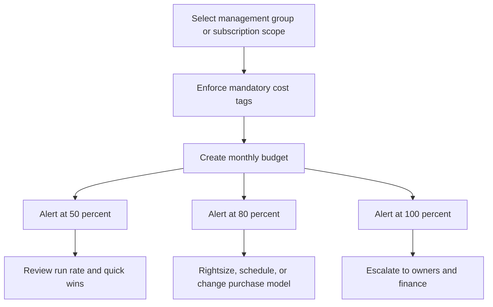

# Budgeting and Cost Management on Azure

## Cost Management setup

### Setup step 1: Confirm access

Why: Cost Management data is only useful when finance and platform owners can view the right scopes.

```bash
az role assignment create --assignee <finopsGroupObjectId> --role "Cost Management Contributor" --scope /subscriptions/<subscriptionId>
```

- Keep setup step 1 documented in the operating model and review quarterly.

### Setup step 2: Set scope

Why: Budgets and analysis are more actionable when scoped to management group, subscription, or resource group intentionally.

```bash
az account show --output table
az group list --output table
```

- Keep setup step 2 documented in the operating model and review quarterly.

### Setup step 3: Enable tags

Why: Cost allocation depends on consistent application, environment, and cost center tags.

```bash
az tag create --name CostCenter
az tag create --name Environment
az tag create --name Application
```

- Keep setup step 3 documented in the operating model and review quarterly.

### Setup step 4: Connect alerts

Why: Budgets need action groups or notification lists so overspend signals reach humans quickly.

```bash
az monitor action-group create --resource-group rg-finops --name ag-cost-alerts --short-name costops --action email FinOps finops@example.com
```

- Keep setup step 4 documented in the operating model and review quarterly.

### Setup step 5: Review exports

Why: Regular exports let finance and FinOps teams build trend analysis outside the portal when needed.

```bash
az costmanagement export create --name daily-cost-export --scope /subscriptions/<subscriptionId> --type ActualCost --timeframe MonthToDate --storage-account-id /subscriptions/<subscriptionId>/resourceGroups/rg-finops/providers/Microsoft.Storage/storageAccounts/stcostexports --storage-container exports --recurrence Daily
```

- Keep setup step 5 documented in the operating model and review quarterly.

## Budgets with 50%, 80%, and 100% alerts

```bash
az consumption budget create --budget-name sub-monthly-budget --amount 10000 --category cost --time-grain monthly --start-date 2025-01-01 --end-date 2025-12-31 --scope /subscriptions/<subscriptionId> --notifications contactEmails=finops@example.com operator=GreaterThan threshold=50 thresholdType=Actual
az consumption budget update --budget-name sub-monthly-budget --scope /subscriptions/<subscriptionId> --set notifications.actual80.contactEmails[0]=finops@example.com notifications.actual80.operator=GreaterThan notifications.actual80.threshold=80 notifications.actual80.thresholdType=Actual
az consumption budget update --budget-name sub-monthly-budget --scope /subscriptions/<subscriptionId> --set notifications.actual100.contactEmails[0]=finops@example.com notifications.actual100.operator=GreaterThan notifications.actual100.threshold=100 notifications.actual100.thresholdType=Actual
```

Why this choice:

- 50% alerts catch early run-rate problems.
- 80% alerts trigger optimization actions before the month closes.
- 100% alerts escalate to leadership and workload owners for immediate action.

## RI vs Savings Plans vs Spot VMs

| Option | When to choose | Why | Watch-outs |
| --- | --- | --- | --- |
| Reserved Instances | Stable long-running compute with predictable SKU and region | Highest savings when usage is steady and commitment confidence is high | Less flexible than savings plans if workload shape changes |
| Savings Plans | Broad and somewhat variable compute usage across eligible services | Good discount with more flexibility than RI commitments | Savings may be lower than perfect-fit reservations |
| Spot VMs | Interruptible batch, CI, render, analytics, and fault-tolerant jobs | Lowest cost for elastic workloads | Eviction risk means you must design for interruption |

## Tag-based cost allocation

| Tag | Purpose | Why it matters |
| --- | --- | --- |
| CostCenter | Finance ownership and chargeback | Maps spending to budget owners and approvals |
| Application | Product or platform identifier | Separates shared platform from business workloads |
| Environment | prod, nonprod, dev, test, sandbox | Supports lifecycle reporting and optimization focus |
| Owner | Technical owner or team alias | Speeds alert routing and accountability |

### Example tag policy pattern

```bash
az policy assignment create --name require-cost-tags --display-name "Require cost tags" --scope /providers/Microsoft.Management/managementGroups/landingzones --policy-set-definition /providers/Microsoft.Authorization/policySetDefinitions/<initiativeId>
```

## Per-service cost breakdown

| Service area | Main cost drivers | Optimization examples |
| --- | --- | --- |
| Compute | VM size, runtime hours, OS license, autoscale floor | Rightsize, schedule shutdowns, buy commitments, use Spot for tolerant jobs |
| Storage | Redundancy, tier, transactions, snapshots, replication | Move cold data to cool or archive, remove unused disks, optimize retention |
| Networking | Egress, firewall policy, NAT, VPN, public IPs, Front Door/App Gateway | Reduce internet egress, consolidate policies, review idle gateways and IPs |
| AKS | Node pools, overprovisioning, load balancers, managed disks, log ingestion | Use cluster autoscaler, separate system and user pools, trim log volume |
| Database | vCore or DTU size, storage, backup retention, replicas, throughput | Rightsize tiers, use serverless where fit, review replica necessity and retention |

## FinOps practices

- Create weekly engineering and finance review of top cost deltas.
- Track unit economics such as cost per tenant, order, API call, or environment.
- Set tagging compliance targets and remediate drift automatically.
- Review idle resources, unattached disks, orphaned IPs, and underused gateways monthly.
- Use budgets, anomaly detection, and commitment coverage reports together.
- Treat observability costs as first-class platform costs and tune log volume deliberately.
- Tie architecture reviews to cost reviews so performance decisions include financial impact.
- Benchmark production autoscaling and floor settings after each major release.

## Cost governance flow



## Microsoft Learn references

- [Cost Management + Billing](https://learn.microsoft.com/azure/cost-management-billing/cost-management-billing-overview)
- [Create budgets](https://learn.microsoft.com/azure/cost-management-billing/costs/tutorial-acm-create-budgets)
- [Reservations](https://learn.microsoft.com/azure/cost-management-billing/reservations/save-compute-costs-reservations)
- [Savings plan](https://learn.microsoft.com/azure/cost-management-billing/savings-plan/savings-plan-compute-overview)
- [Tag policies](https://learn.microsoft.com/azure/governance/policy/tutorials/govern-tags)
- [FinOps on Azure](https://learn.microsoft.com/cloud-computing/finops/toolkit/azure/finops-toolkit-overview)

### Cost management note 1

- Confirm scope, ownership, and rollback steps for cost management note 1.
- Capture the az command output in change records so auditors can trace decision 1.
- Revisit naming, tags, and RBAC boundaries before promoting to production wave 1.
- Validate dependencies, DNS paths, routing, and policy assignments after milestone 1.

### Cost management note 2

- Confirm scope, ownership, and rollback steps for cost management note 2.
- Capture the az command output in change records so auditors can trace decision 2.
- Revisit naming, tags, and RBAC boundaries before promoting to production wave 2.
- Validate dependencies, DNS paths, routing, and policy assignments after milestone 2.

### Cost management note 3

- Confirm scope, ownership, and rollback steps for cost management note 3.
- Capture the az command output in change records so auditors can trace decision 3.
- Revisit naming, tags, and RBAC boundaries before promoting to production wave 3.
- Validate dependencies, DNS paths, routing, and policy assignments after milestone 3.

### Cost management note 4

- Confirm scope, ownership, and rollback steps for cost management note 4.
- Capture the az command output in change records so auditors can trace decision 4.
- Revisit naming, tags, and RBAC boundaries before promoting to production wave 4.
- Validate dependencies, DNS paths, routing, and policy assignments after milestone 4.

### Cost management note 5

- Confirm scope, ownership, and rollback steps for cost management note 5.
- Capture the az command output in change records so auditors can trace decision 5.
- Revisit naming, tags, and RBAC boundaries before promoting to production wave 5.
- Validate dependencies, DNS paths, routing, and policy assignments after milestone 5.

### Cost management note 6

- Confirm scope, ownership, and rollback steps for cost management note 6.
- Capture the az command output in change records so auditors can trace decision 6.
- Revisit naming, tags, and RBAC boundaries before promoting to production wave 6.
- Validate dependencies, DNS paths, routing, and policy assignments after milestone 6.

### Cost management note 7

- Confirm scope, ownership, and rollback steps for cost management note 7.
- Capture the az command output in change records so auditors can trace decision 7.
- Revisit naming, tags, and RBAC boundaries before promoting to production wave 7.
- Validate dependencies, DNS paths, routing, and policy assignments after milestone 7.

### Cost management note 8

- Confirm scope, ownership, and rollback steps for cost management note 8.
- Capture the az command output in change records so auditors can trace decision 8.
- Revisit naming, tags, and RBAC boundaries before promoting to production wave 8.
- Validate dependencies, DNS paths, routing, and policy assignments after milestone 8.

### Cost management note 9

- Confirm scope, ownership, and rollback steps for cost management note 9.
- Capture the az command output in change records so auditors can trace decision 9.
- Revisit naming, tags, and RBAC boundaries before promoting to production wave 9.
- Validate dependencies, DNS paths, routing, and policy assignments after milestone 9.

### Cost management note 10

- Confirm scope, ownership, and rollback steps for cost management note 10.
- Capture the az command output in change records so auditors can trace decision 10.
- Revisit naming, tags, and RBAC boundaries before promoting to production wave 10.
- Validate dependencies, DNS paths, routing, and policy assignments after milestone 10.

### Cost management note 11

- Confirm scope, ownership, and rollback steps for cost management note 11.
- Capture the az command output in change records so auditors can trace decision 11.
- Revisit naming, tags, and RBAC boundaries before promoting to production wave 11.
- Validate dependencies, DNS paths, routing, and policy assignments after milestone 11.

### Cost management note 12

- Confirm scope, ownership, and rollback steps for cost management note 12.
- Capture the az command output in change records so auditors can trace decision 12.
- Revisit naming, tags, and RBAC boundaries before promoting to production wave 12.
- Validate dependencies, DNS paths, routing, and policy assignments after milestone 12.

### Cost management note 13

- Confirm scope, ownership, and rollback steps for cost management note 13.
- Capture the az command output in change records so auditors can trace decision 13.
- Revisit naming, tags, and RBAC boundaries before promoting to production wave 13.
- Validate dependencies, DNS paths, routing, and policy assignments after milestone 13.

### Cost management note 14

- Confirm scope, ownership, and rollback steps for cost management note 14.
- Capture the az command output in change records so auditors can trace decision 14.
- Revisit naming, tags, and RBAC boundaries before promoting to production wave 14.
- Validate dependencies, DNS paths, routing, and policy assignments after milestone 14.

### Cost management note 15

- Confirm scope, ownership, and rollback steps for cost management note 15.
- Capture the az command output in change records so auditors can trace decision 15.
- Revisit naming, tags, and RBAC boundaries before promoting to production wave 15.
- Validate dependencies, DNS paths, routing, and policy assignments after milestone 15.

### Cost management note 16

- Confirm scope, ownership, and rollback steps for cost management note 16.
- Capture the az command output in change records so auditors can trace decision 16.
- Revisit naming, tags, and RBAC boundaries before promoting to production wave 16.
- Validate dependencies, DNS paths, routing, and policy assignments after milestone 16.

### Cost management note 17

- Confirm scope, ownership, and rollback steps for cost management note 17.
- Capture the az command output in change records so auditors can trace decision 17.
- Revisit naming, tags, and RBAC boundaries before promoting to production wave 17.
- Validate dependencies, DNS paths, routing, and policy assignments after milestone 17.

### Cost management note 18

- Confirm scope, ownership, and rollback steps for cost management note 18.
- Capture the az command output in change records so auditors can trace decision 18.
- Revisit naming, tags, and RBAC boundaries before promoting to production wave 18.
- Validate dependencies, DNS paths, routing, and policy assignments after milestone 18.

### Cost management note 19

- Confirm scope, ownership, and rollback steps for cost management note 19.
- Capture the az command output in change records so auditors can trace decision 19.
- Revisit naming, tags, and RBAC boundaries before promoting to production wave 19.
- Validate dependencies, DNS paths, routing, and policy assignments after milestone 19.

### Cost management note 20

- Confirm scope, ownership, and rollback steps for cost management note 20.
- Capture the az command output in change records so auditors can trace decision 20.
- Revisit naming, tags, and RBAC boundaries before promoting to production wave 20.
- Validate dependencies, DNS paths, routing, and policy assignments after milestone 20.

### Cost management note 21

- Confirm scope, ownership, and rollback steps for cost management note 21.
- Capture the az command output in change records so auditors can trace decision 21.
- Revisit naming, tags, and RBAC boundaries before promoting to production wave 21.
- Validate dependencies, DNS paths, routing, and policy assignments after milestone 21.

### Cost management note 22

- Confirm scope, ownership, and rollback steps for cost management note 22.
- Capture the az command output in change records so auditors can trace decision 22.
- Revisit naming, tags, and RBAC boundaries before promoting to production wave 22.
- Validate dependencies, DNS paths, routing, and policy assignments after milestone 22.

### Cost management note 23

- Confirm scope, ownership, and rollback steps for cost management note 23.
- Capture the az command output in change records so auditors can trace decision 23.
- Revisit naming, tags, and RBAC boundaries before promoting to production wave 23.
- Validate dependencies, DNS paths, routing, and policy assignments after milestone 23.

### Cost management note 24

- Confirm scope, ownership, and rollback steps for cost management note 24.
- Capture the az command output in change records so auditors can trace decision 24.
- Revisit naming, tags, and RBAC boundaries before promoting to production wave 24.
- Validate dependencies, DNS paths, routing, and policy assignments after milestone 24.

### Cost management note 25

- Confirm scope, ownership, and rollback steps for cost management note 25.
- Capture the az command output in change records so auditors can trace decision 25.
- Revisit naming, tags, and RBAC boundaries before promoting to production wave 25.
- Validate dependencies, DNS paths, routing, and policy assignments after milestone 25.

### Cost management note 26

- Confirm scope, ownership, and rollback steps for cost management note 26.
- Capture the az command output in change records so auditors can trace decision 26.
- Revisit naming, tags, and RBAC boundaries before promoting to production wave 26.
- Validate dependencies, DNS paths, routing, and policy assignments after milestone 26.

### Cost management note 27

- Confirm scope, ownership, and rollback steps for cost management note 27.
- Capture the az command output in change records so auditors can trace decision 27.
- Revisit naming, tags, and RBAC boundaries before promoting to production wave 27.
- Validate dependencies, DNS paths, routing, and policy assignments after milestone 27.

### Cost management note 28

- Confirm scope, ownership, and rollback steps for cost management note 28.
- Capture the az command output in change records so auditors can trace decision 28.
- Revisit naming, tags, and RBAC boundaries before promoting to production wave 28.
- Validate dependencies, DNS paths, routing, and policy assignments after milestone 28.

### Cost management note 29

- Confirm scope, ownership, and rollback steps for cost management note 29.
- Capture the az command output in change records so auditors can trace decision 29.
- Revisit naming, tags, and RBAC boundaries before promoting to production wave 29.
- Validate dependencies, DNS paths, routing, and policy assignments after milestone 29.

### Cost management note 30

- Confirm scope, ownership, and rollback steps for cost management note 30.
- Capture the az command output in change records so auditors can trace decision 30.
- Revisit naming, tags, and RBAC boundaries before promoting to production wave 30.
- Validate dependencies, DNS paths, routing, and policy assignments after milestone 30.

### Cost management note 31

- Confirm scope, ownership, and rollback steps for cost management note 31.
- Capture the az command output in change records so auditors can trace decision 31.
- Revisit naming, tags, and RBAC boundaries before promoting to production wave 31.
- Validate dependencies, DNS paths, routing, and policy assignments after milestone 31.

### Cost management note 32

- Confirm scope, ownership, and rollback steps for cost management note 32.
- Capture the az command output in change records so auditors can trace decision 32.
- Revisit naming, tags, and RBAC boundaries before promoting to production wave 32.
- Validate dependencies, DNS paths, routing, and policy assignments after milestone 32.

### Cost management note 33

- Confirm scope, ownership, and rollback steps for cost management note 33.
- Capture the az command output in change records so auditors can trace decision 33.
- Revisit naming, tags, and RBAC boundaries before promoting to production wave 33.
- Validate dependencies, DNS paths, routing, and policy assignments after milestone 33.

### Cost management note 34

- Confirm scope, ownership, and rollback steps for cost management note 34.
- Capture the az command output in change records so auditors can trace decision 34.
- Revisit naming, tags, and RBAC boundaries before promoting to production wave 34.
- Validate dependencies, DNS paths, routing, and policy assignments after milestone 34.

### Cost management note 35

- Confirm scope, ownership, and rollback steps for cost management note 35.
- Capture the az command output in change records so auditors can trace decision 35.
- Revisit naming, tags, and RBAC boundaries before promoting to production wave 35.
- Validate dependencies, DNS paths, routing, and policy assignments after milestone 35.

### Cost management note 36

- Confirm scope, ownership, and rollback steps for cost management note 36.
- Capture the az command output in change records so auditors can trace decision 36.
- Revisit naming, tags, and RBAC boundaries before promoting to production wave 36.
- Validate dependencies, DNS paths, routing, and policy assignments after milestone 36.

### Cost management note 37

- Confirm scope, ownership, and rollback steps for cost management note 37.
- Capture the az command output in change records so auditors can trace decision 37.
- Revisit naming, tags, and RBAC boundaries before promoting to production wave 37.
- Validate dependencies, DNS paths, routing, and policy assignments after milestone 37.

### Cost management note 38

- Confirm scope, ownership, and rollback steps for cost management note 38.
- Capture the az command output in change records so auditors can trace decision 38.
- Revisit naming, tags, and RBAC boundaries before promoting to production wave 38.
- Validate dependencies, DNS paths, routing, and policy assignments after milestone 38.

### Cost management note 39

- Confirm scope, ownership, and rollback steps for cost management note 39.
- Capture the az command output in change records so auditors can trace decision 39.
- Revisit naming, tags, and RBAC boundaries before promoting to production wave 39.
- Validate dependencies, DNS paths, routing, and policy assignments after milestone 39.

### Cost management note 40

- Confirm scope, ownership, and rollback steps for cost management note 40.
- Capture the az command output in change records so auditors can trace decision 40.
- Revisit naming, tags, and RBAC boundaries before promoting to production wave 40.
- Validate dependencies, DNS paths, routing, and policy assignments after milestone 40.

### Cost management note 41

- Confirm scope, ownership, and rollback steps for cost management note 41.
- Capture the az command output in change records so auditors can trace decision 41.
- Revisit naming, tags, and RBAC boundaries before promoting to production wave 41.
- Validate dependencies, DNS paths, routing, and policy assignments after milestone 41.

### Cost management note 42

- Confirm scope, ownership, and rollback steps for cost management note 42.
- Capture the az command output in change records so auditors can trace decision 42.
- Revisit naming, tags, and RBAC boundaries before promoting to production wave 42.
- Validate dependencies, DNS paths, routing, and policy assignments after milestone 42.

### Cost management note 43

- Confirm scope, ownership, and rollback steps for cost management note 43.
- Capture the az command output in change records so auditors can trace decision 43.
- Revisit naming, tags, and RBAC boundaries before promoting to production wave 43.
- Validate dependencies, DNS paths, routing, and policy assignments after milestone 43.

### Cost management note 44

- Confirm scope, ownership, and rollback steps for cost management note 44.
- Capture the az command output in change records so auditors can trace decision 44.
- Revisit naming, tags, and RBAC boundaries before promoting to production wave 44.
- Validate dependencies, DNS paths, routing, and policy assignments after milestone 44.

### Cost management note 45

- Confirm scope, ownership, and rollback steps for cost management note 45.
- Capture the az command output in change records so auditors can trace decision 45.
- Revisit naming, tags, and RBAC boundaries before promoting to production wave 45.
- Validate dependencies, DNS paths, routing, and policy assignments after milestone 45.

### Cost management note 46

- Confirm scope, ownership, and rollback steps for cost management note 46.
- Capture the az command output in change records so auditors can trace decision 46.
- Revisit naming, tags, and RBAC boundaries before promoting to production wave 46.
- Validate dependencies, DNS paths, routing, and policy assignments after milestone 46.

### Cost management note 47

- Confirm scope, ownership, and rollback steps for cost management note 47.
- Capture the az command output in change records so auditors can trace decision 47.
- Revisit naming, tags, and RBAC boundaries before promoting to production wave 47.
- Validate dependencies, DNS paths, routing, and policy assignments after milestone 47.

### Cost management note 48

- Confirm scope, ownership, and rollback steps for cost management note 48.
- Capture the az command output in change records so auditors can trace decision 48.
- Revisit naming, tags, and RBAC boundaries before promoting to production wave 48.
- Validate dependencies, DNS paths, routing, and policy assignments after milestone 48.

### Cost management note 49

- Confirm scope, ownership, and rollback steps for cost management note 49.
- Capture the az command output in change records so auditors can trace decision 49.
- Revisit naming, tags, and RBAC boundaries before promoting to production wave 49.
- Validate dependencies, DNS paths, routing, and policy assignments after milestone 49.

### Cost management note 50

- Confirm scope, ownership, and rollback steps for cost management note 50.
- Capture the az command output in change records so auditors can trace decision 50.
- Revisit naming, tags, and RBAC boundaries before promoting to production wave 50.
- Validate dependencies, DNS paths, routing, and policy assignments after milestone 50.

### Cost management note 51

- Confirm scope, ownership, and rollback steps for cost management note 51.
- Capture the az command output in change records so auditors can trace decision 51.
- Revisit naming, tags, and RBAC boundaries before promoting to production wave 51.
- Validate dependencies, DNS paths, routing, and policy assignments after milestone 51.

### Cost management note 52

- Confirm scope, ownership, and rollback steps for cost management note 52.
- Capture the az command output in change records so auditors can trace decision 52.
- Revisit naming, tags, and RBAC boundaries before promoting to production wave 52.
- Validate dependencies, DNS paths, routing, and policy assignments after milestone 52.

### Cost management note 53

- Confirm scope, ownership, and rollback steps for cost management note 53.
- Capture the az command output in change records so auditors can trace decision 53.
- Revisit naming, tags, and RBAC boundaries before promoting to production wave 53.
- Validate dependencies, DNS paths, routing, and policy assignments after milestone 53.

### Cost management note 54

- Confirm scope, ownership, and rollback steps for cost management note 54.
- Capture the az command output in change records so auditors can trace decision 54.
- Revisit naming, tags, and RBAC boundaries before promoting to production wave 54.
- Validate dependencies, DNS paths, routing, and policy assignments after milestone 54.

### Cost management note 55

- Confirm scope, ownership, and rollback steps for cost management note 55.
- Capture the az command output in change records so auditors can trace decision 55.
- Revisit naming, tags, and RBAC boundaries before promoting to production wave 55.
- Validate dependencies, DNS paths, routing, and policy assignments after milestone 55.

### Cost management note 56

- Confirm scope, ownership, and rollback steps for cost management note 56.
- Capture the az command output in change records so auditors can trace decision 56.
- Revisit naming, tags, and RBAC boundaries before promoting to production wave 56.
- Validate dependencies, DNS paths, routing, and policy assignments after milestone 56.

### Cost management note 57

- Confirm scope, ownership, and rollback steps for cost management note 57.
- Capture the az command output in change records so auditors can trace decision 57.
- Revisit naming, tags, and RBAC boundaries before promoting to production wave 57.
- Validate dependencies, DNS paths, routing, and policy assignments after milestone 57.

### Cost management note 58

- Confirm scope, ownership, and rollback steps for cost management note 58.
- Capture the az command output in change records so auditors can trace decision 58.
- Revisit naming, tags, and RBAC boundaries before promoting to production wave 58.
- Validate dependencies, DNS paths, routing, and policy assignments after milestone 58.

### Cost management note 59

- Confirm scope, ownership, and rollback steps for cost management note 59.
- Capture the az command output in change records so auditors can trace decision 59.
- Revisit naming, tags, and RBAC boundaries before promoting to production wave 59.
- Validate dependencies, DNS paths, routing, and policy assignments after milestone 59.

### Cost management note 60

- Confirm scope, ownership, and rollback steps for cost management note 60.
- Capture the az command output in change records so auditors can trace decision 60.
- Revisit naming, tags, and RBAC boundaries before promoting to production wave 60.
- Validate dependencies, DNS paths, routing, and policy assignments after milestone 60.

### Cost management note 61

- Confirm scope, ownership, and rollback steps for cost management note 61.
- Capture the az command output in change records so auditors can trace decision 61.
- Revisit naming, tags, and RBAC boundaries before promoting to production wave 61.
- Validate dependencies, DNS paths, routing, and policy assignments after milestone 61.

### Cost management note 62

- Confirm scope, ownership, and rollback steps for cost management note 62.
- Capture the az command output in change records so auditors can trace decision 62.
- Revisit naming, tags, and RBAC boundaries before promoting to production wave 62.
- Validate dependencies, DNS paths, routing, and policy assignments after milestone 62.

### Cost management note 63

- Confirm scope, ownership, and rollback steps for cost management note 63.
- Capture the az command output in change records so auditors can trace decision 63.
- Revisit naming, tags, and RBAC boundaries before promoting to production wave 63.
- Validate dependencies, DNS paths, routing, and policy assignments after milestone 63.

### Cost management note 64

- Confirm scope, ownership, and rollback steps for cost management note 64.
- Capture the az command output in change records so auditors can trace decision 64.
- Revisit naming, tags, and RBAC boundaries before promoting to production wave 64.
- Validate dependencies, DNS paths, routing, and policy assignments after milestone 64.

### Cost management note 65

- Confirm scope, ownership, and rollback steps for cost management note 65.
- Capture the az command output in change records so auditors can trace decision 65.
- Revisit naming, tags, and RBAC boundaries before promoting to production wave 65.
- Validate dependencies, DNS paths, routing, and policy assignments after milestone 65.

### Cost management note 66

- Confirm scope, ownership, and rollback steps for cost management note 66.
- Capture the az command output in change records so auditors can trace decision 66.
- Revisit naming, tags, and RBAC boundaries before promoting to production wave 66.
- Validate dependencies, DNS paths, routing, and policy assignments after milestone 66.

### Cost management note 67

- Confirm scope, ownership, and rollback steps for cost management note 67.
- Capture the az command output in change records so auditors can trace decision 67.
- Revisit naming, tags, and RBAC boundaries before promoting to production wave 67.
- Validate dependencies, DNS paths, routing, and policy assignments after milestone 67.

### Cost management note 68

- Confirm scope, ownership, and rollback steps for cost management note 68.
- Capture the az command output in change records so auditors can trace decision 68.
- Revisit naming, tags, and RBAC boundaries before promoting to production wave 68.
- Validate dependencies, DNS paths, routing, and policy assignments after milestone 68.

### Cost management note 69

- Confirm scope, ownership, and rollback steps for cost management note 69.
- Capture the az command output in change records so auditors can trace decision 69.
- Revisit naming, tags, and RBAC boundaries before promoting to production wave 69.
- Validate dependencies, DNS paths, routing, and policy assignments after milestone 69.

### Cost management note 70

- Confirm scope, ownership, and rollback steps for cost management note 70.
- Capture the az command output in change records so auditors can trace decision 70.
- Revisit naming, tags, and RBAC boundaries before promoting to production wave 70.
- Validate dependencies, DNS paths, routing, and policy assignments after milestone 70.

### Cost management note 71

- Confirm scope, ownership, and rollback steps for cost management note 71.
- Capture the az command output in change records so auditors can trace decision 71.
- Revisit naming, tags, and RBAC boundaries before promoting to production wave 71.
- Validate dependencies, DNS paths, routing, and policy assignments after milestone 71.

### Cost management note 72

- Confirm scope, ownership, and rollback steps for cost management note 72.
- Capture the az command output in change records so auditors can trace decision 72.
- Revisit naming, tags, and RBAC boundaries before promoting to production wave 72.
- Validate dependencies, DNS paths, routing, and policy assignments after milestone 72.

### Cost management note 73

- Confirm scope, ownership, and rollback steps for cost management note 73.
- Capture the az command output in change records so auditors can trace decision 73.
- Revisit naming, tags, and RBAC boundaries before promoting to production wave 73.
- Validate dependencies, DNS paths, routing, and policy assignments after milestone 73.

### Cost management note 74

- Confirm scope, ownership, and rollback steps for cost management note 74.
- Capture the az command output in change records so auditors can trace decision 74.
- Revisit naming, tags, and RBAC boundaries before promoting to production wave 74.
- Validate dependencies, DNS paths, routing, and policy assignments after milestone 74.

### Cost management note 75

- Confirm scope, ownership, and rollback steps for cost management note 75.
- Capture the az command output in change records so auditors can trace decision 75.
- Revisit naming, tags, and RBAC boundaries before promoting to production wave 75.
- Validate dependencies, DNS paths, routing, and policy assignments after milestone 75.

### Cost management note 76

- Confirm scope, ownership, and rollback steps for cost management note 76.
- Capture the az command output in change records so auditors can trace decision 76.
- Revisit naming, tags, and RBAC boundaries before promoting to production wave 76.
- Validate dependencies, DNS paths, routing, and policy assignments after milestone 76.

### Cost management note 77

- Confirm scope, ownership, and rollback steps for cost management note 77.
- Capture the az command output in change records so auditors can trace decision 77.
- Revisit naming, tags, and RBAC boundaries before promoting to production wave 77.
- Validate dependencies, DNS paths, routing, and policy assignments after milestone 77.

### Cost management note 78

- Confirm scope, ownership, and rollback steps for cost management note 78.
- Capture the az command output in change records so auditors can trace decision 78.
- Revisit naming, tags, and RBAC boundaries before promoting to production wave 78.
- Validate dependencies, DNS paths, routing, and policy assignments after milestone 78.

### Cost management note 79

- Confirm scope, ownership, and rollback steps for cost management note 79.
- Capture the az command output in change records so auditors can trace decision 79.
- Revisit naming, tags, and RBAC boundaries before promoting to production wave 79.
- Validate dependencies, DNS paths, routing, and policy assignments after milestone 79.

### Cost management note 80

- Confirm scope, ownership, and rollback steps for cost management note 80.
- Capture the az command output in change records so auditors can trace decision 80.
- Revisit naming, tags, and RBAC boundaries before promoting to production wave 80.
- Validate dependencies, DNS paths, routing, and policy assignments after milestone 80.

### Cost management note 81

- Confirm scope, ownership, and rollback steps for cost management note 81.
- Capture the az command output in change records so auditors can trace decision 81.
- Revisit naming, tags, and RBAC boundaries before promoting to production wave 81.
- Validate dependencies, DNS paths, routing, and policy assignments after milestone 81.

### Cost management note 82

- Confirm scope, ownership, and rollback steps for cost management note 82.
- Capture the az command output in change records so auditors can trace decision 82.
- Revisit naming, tags, and RBAC boundaries before promoting to production wave 82.
- Validate dependencies, DNS paths, routing, and policy assignments after milestone 82.

### Cost management note 83

- Confirm scope, ownership, and rollback steps for cost management note 83.
- Capture the az command output in change records so auditors can trace decision 83.
- Revisit naming, tags, and RBAC boundaries before promoting to production wave 83.
- Validate dependencies, DNS paths, routing, and policy assignments after milestone 83.

### Cost management note 84

- Confirm scope, ownership, and rollback steps for cost management note 84.
- Capture the az command output in change records so auditors can trace decision 84.
- Revisit naming, tags, and RBAC boundaries before promoting to production wave 84.
- Validate dependencies, DNS paths, routing, and policy assignments after milestone 84.

### Cost management note 85

- Confirm scope, ownership, and rollback steps for cost management note 85.
- Capture the az command output in change records so auditors can trace decision 85.
- Revisit naming, tags, and RBAC boundaries before promoting to production wave 85.
- Validate dependencies, DNS paths, routing, and policy assignments after milestone 85.

### Cost management note 86

- Confirm scope, ownership, and rollback steps for cost management note 86.
- Capture the az command output in change records so auditors can trace decision 86.
- Revisit naming, tags, and RBAC boundaries before promoting to production wave 86.
- Validate dependencies, DNS paths, routing, and policy assignments after milestone 86.

### Cost management note 87

- Confirm scope, ownership, and rollback steps for cost management note 87.
- Capture the az command output in change records so auditors can trace decision 87.
- Revisit naming, tags, and RBAC boundaries before promoting to production wave 87.
- Validate dependencies, DNS paths, routing, and policy assignments after milestone 87.

### Cost management note 88

- Confirm scope, ownership, and rollback steps for cost management note 88.
- Capture the az command output in change records so auditors can trace decision 88.
- Revisit naming, tags, and RBAC boundaries before promoting to production wave 88.
- Validate dependencies, DNS paths, routing, and policy assignments after milestone 88.

### Cost management note 89

- Confirm scope, ownership, and rollback steps for cost management note 89.
- Capture the az command output in change records so auditors can trace decision 89.
- Revisit naming, tags, and RBAC boundaries before promoting to production wave 89.
- Validate dependencies, DNS paths, routing, and policy assignments after milestone 89.

### Cost management note 90

- Confirm scope, ownership, and rollback steps for cost management note 90.
- Capture the az command output in change records so auditors can trace decision 90.
- Revisit naming, tags, and RBAC boundaries before promoting to production wave 90.
- Validate dependencies, DNS paths, routing, and policy assignments after milestone 90.

### Cost management note 91

- Confirm scope, ownership, and rollback steps for cost management note 91.
- Capture the az command output in change records so auditors can trace decision 91.
- Revisit naming, tags, and RBAC boundaries before promoting to production wave 91.
- Validate dependencies, DNS paths, routing, and policy assignments after milestone 91.

### Cost management note 92

- Confirm scope, ownership, and rollback steps for cost management note 92.
- Capture the az command output in change records so auditors can trace decision 92.
- Revisit naming, tags, and RBAC boundaries before promoting to production wave 92.
- Validate dependencies, DNS paths, routing, and policy assignments after milestone 92.

### Cost management note 93

- Confirm scope, ownership, and rollback steps for cost management note 93.
- Capture the az command output in change records so auditors can trace decision 93.
- Revisit naming, tags, and RBAC boundaries before promoting to production wave 93.
- Validate dependencies, DNS paths, routing, and policy assignments after milestone 93.

### Cost management note 94

- Confirm scope, ownership, and rollback steps for cost management note 94.
- Capture the az command output in change records so auditors can trace decision 94.
- Revisit naming, tags, and RBAC boundaries before promoting to production wave 94.
- Validate dependencies, DNS paths, routing, and policy assignments after milestone 94.

### Cost management note 95

- Confirm scope, ownership, and rollback steps for cost management note 95.
- Capture the az command output in change records so auditors can trace decision 95.
- Revisit naming, tags, and RBAC boundaries before promoting to production wave 95.
- Validate dependencies, DNS paths, routing, and policy assignments after milestone 95.

### Cost management note 96

- Confirm scope, ownership, and rollback steps for cost management note 96.
- Capture the az command output in change records so auditors can trace decision 96.
- Revisit naming, tags, and RBAC boundaries before promoting to production wave 96.
- Validate dependencies, DNS paths, routing, and policy assignments after milestone 96.

### Cost management note 97

- Confirm scope, ownership, and rollback steps for cost management note 97.
- Capture the az command output in change records so auditors can trace decision 97.
- Revisit naming, tags, and RBAC boundaries before promoting to production wave 97.
- Validate dependencies, DNS paths, routing, and policy assignments after milestone 97.

### Cost management note 98

- Confirm scope, ownership, and rollback steps for cost management note 98.
- Capture the az command output in change records so auditors can trace decision 98.
- Revisit naming, tags, and RBAC boundaries before promoting to production wave 98.
- Validate dependencies, DNS paths, routing, and policy assignments after milestone 98.

### Cost management note 99

- Confirm scope, ownership, and rollback steps for cost management note 99.
- Capture the az command output in change records so auditors can trace decision 99.
- Revisit naming, tags, and RBAC boundaries before promoting to production wave 99.
- Validate dependencies, DNS paths, routing, and policy assignments after milestone 99.

### Cost management note 100

- Confirm scope, ownership, and rollback steps for cost management note 100.
- Capture the az command output in change records so auditors can trace decision 100.
- Revisit naming, tags, and RBAC boundaries before promoting to production wave 100.
- Validate dependencies, DNS paths, routing, and policy assignments after milestone 100.

### Cost management note 101

- Confirm scope, ownership, and rollback steps for cost management note 101.
- Capture the az command output in change records so auditors can trace decision 101.
- Revisit naming, tags, and RBAC boundaries before promoting to production wave 101.
- Validate dependencies, DNS paths, routing, and policy assignments after milestone 101.

### Cost management note 102

- Confirm scope, ownership, and rollback steps for cost management note 102.
- Capture the az command output in change records so auditors can trace decision 102.
- Revisit naming, tags, and RBAC boundaries before promoting to production wave 102.
- Validate dependencies, DNS paths, routing, and policy assignments after milestone 102.

### Cost management note 103

- Confirm scope, ownership, and rollback steps for cost management note 103.
- Capture the az command output in change records so auditors can trace decision 103.
- Revisit naming, tags, and RBAC boundaries before promoting to production wave 103.
- Validate dependencies, DNS paths, routing, and policy assignments after milestone 103.

### Cost management note 104

- Confirm scope, ownership, and rollback steps for cost management note 104.
- Capture the az command output in change records so auditors can trace decision 104.
- Revisit naming, tags, and RBAC boundaries before promoting to production wave 104.
- Validate dependencies, DNS paths, routing, and policy assignments after milestone 104.

### Cost management note 105

- Confirm scope, ownership, and rollback steps for cost management note 105.
- Capture the az command output in change records so auditors can trace decision 105.
- Revisit naming, tags, and RBAC boundaries before promoting to production wave 105.
- Validate dependencies, DNS paths, routing, and policy assignments after milestone 105.

### Cost management note 106

- Confirm scope, ownership, and rollback steps for cost management note 106.
- Capture the az command output in change records so auditors can trace decision 106.
- Revisit naming, tags, and RBAC boundaries before promoting to production wave 106.
- Validate dependencies, DNS paths, routing, and policy assignments after milestone 106.

### Cost management note 107

- Confirm scope, ownership, and rollback steps for cost management note 107.
- Capture the az command output in change records so auditors can trace decision 107.
- Revisit naming, tags, and RBAC boundaries before promoting to production wave 107.
- Validate dependencies, DNS paths, routing, and policy assignments after milestone 107.

### Cost management note 108

- Confirm scope, ownership, and rollback steps for cost management note 108.
- Capture the az command output in change records so auditors can trace decision 108.
- Revisit naming, tags, and RBAC boundaries before promoting to production wave 108.
- Validate dependencies, DNS paths, routing, and policy assignments after milestone 108.

### Cost management note 109

- Confirm scope, ownership, and rollback steps for cost management note 109.
- Capture the az command output in change records so auditors can trace decision 109.
- Revisit naming, tags, and RBAC boundaries before promoting to production wave 109.
- Validate dependencies, DNS paths, routing, and policy assignments after milestone 109.
