# Enterprise Architecture Planning for Azure (10–50+ Applications)

> Architect-level planning guide for designing Azure enterprise platforms that support 10 to 50+ applications, align business priorities with cloud capabilities, standardize platform foundations, and establish repeatable governance, security, and cost controls across the Azure estate.

## Table of Contents

1. [1. Customer Needs Assessment](#1-customer-needs-assessment)
2. [2. Landing Zone Architecture](#2-landing-zone-architecture)
3. [3. Resource Planning for 10 Applications](#3-resource-planning-for-10-applications)
4. [4. Resource Planning for 50+ Applications](#4-resource-planning-for-50-applications)
5. [5. High-Level Design Diagrams](#5-high-level-design-diagrams)
6. [6. Governance & Compliance](#6-governance-compliance)
7. [7. Sizing & Cost Estimation](#7-sizing-cost-estimation)
8. [8. Real-World Examples](#8-real-world-examples)

This planning guide assumes an enterprise portfolio made up of business-critical line-of-business systems, customer-facing applications, data platforms, shared integrations, and security-sensitive workloads that require a governed Azure operating model.
The content is written for enterprise architects, cloud platform leads, security architects, networking teams, and delivery managers who must define a repeatable Azure target state before scaling implementation.
Each section can be used independently during workshops, yet the greatest value comes from sequencing the material from business discovery through landing zones, resource planning, governance, cost engineering, and production review.

---

## 1. Customer Needs Assessment

Microsoft Learn reference: [Cloud Adoption Framework strategy methodology](https://learn.microsoft.com/en-us/azure/cloud-adoption-framework/strategy/)

### 1.1 Assessment objectives

- Establish why the organization is investing in Azure and which outcomes must be visible within the first 6, 12, and 24 months.
- Separate executive aspirations from measurable architecture constraints so that platform design decisions can be justified later.
- Identify which applications are differentiating, which are sustaining, and which can be modernized with minimal redesign.
- Capture regulatory, data residency, resiliency, and identity requirements before solution teams start requesting subscriptions.
- Understand operational maturity across networking, identity, security, application support, and financial governance.
- Document current-state debt such as unsupported operating systems, manual releases, hard-coded secrets, and fragile integrations.
- Define which capabilities must be centralized in the platform team versus delegated to domain or product teams.
- Prioritize a phased migration and modernization roadmap rather than treating every workload as a simultaneous candidate.
- Clarify expected service levels, recovery objectives, and audit evidence needs for the first production wave.
- Produce a decision log that can be reused during landing zone and high-level design reviews.

### 1.2 Stakeholder interview framework

| Stakeholder role | Core question | Topics to probe | Expected output |
|---|---|---|---|
| Executive sponsor | What business outcome justifies Azure investment? | Growth targets, merger synergy, digital channel expansion | Strategic outcome statement and funding guardrails |
| CIO or CTO | Which platforms must be standardized across the enterprise? | Technology sprawl, platform simplification, operating model | Target architecture principles and platform ownership model |
| CISO | Which security controls are non-negotiable? | Identity, key management, logging, breach response, segmentation | Security baseline requirements and risk acceptance criteria |
| Head of infrastructure | What current hosting pain points are driving change? | Datacenter constraints, hardware refreshes, DR gaps | Infrastructure problem statement and transition urgency |
| Network architect | How will Azure connect to core corporate networks? | ExpressRoute, VPN, address space overlap, inspection | Connectivity assumptions and network constraints |
| Identity architect | What is the target for authentication and privileged access? | Entra ID integration, MFA, PIM, service principals | Identity target state and admin model |
| Application owner | What makes the application business critical? | Peak periods, dependencies, outage cost, support model | Workload criticality and migration risk profile |
| Product manager | Which features or release cadence improvements are expected? | Agility goals, deployment frequency, user demand | Modernization value case and delivery expectations |
| Operations manager | Who will monitor and support the application in Azure? | On-call model, tooling, support handoffs | Operational responsibility matrix |
| Database lead | How sensitive is data and what continuity level is required? | Backup windows, encryption, HA, DR, retention | Data protection and resiliency design inputs |
| Compliance officer | Which standards must be evidenced continuously? | SOC 2, PCI-DSS, HIPAA, ISO 27001, internal controls | Compliance scope and evidence requirements |
| Finance partner | What cost governance model will be used? | Budget owners, chargeback, reservation strategy | Financial accountability model |
| Procurement | Are there licensing or contract dependencies? | Azure hybrid benefit, third-party tooling, SaaS commitments | Commercial constraints and optimization opportunities |
| Service desk lead | How will incidents and changes flow post-migration? | ITSM, escalation paths, CMDB, support tiers | Support process integration requirements |
| Data governance lead | What data classification or residency issues exist? | PII, sovereign data, retention, data sharing | Data governance rules and zoning guidance |
| Business continuity lead | What downtime is acceptable by scenario? | Regional failure, cyber event, dependency outage | Resiliency objectives and DR scenarios |

### 1.3 Interview facilitation playbook

1. Circulate a pre-read that explains the scope, current portfolio assumptions, and desired workshop outputs.
2. Schedule executive interviews before technical sessions so architects hear the language of business value first.
3. Run dedicated sessions for identity, networking, security, data, and operations rather than combining specialist topics.
4. Capture both stated requirements and implicit assumptions, especially around compliance and outage tolerance.
5. Challenge requests that are framed as solutions rather than needs, such as a default demand for Kubernetes or dedicated subscriptions.
6. Map each requirement to an owner who can later validate the target architecture decision.
7. Quantify the cost of current pain points where possible, such as release delays, incident volume, or audit effort.
8. Differentiate between day-one must-haves, day-two improvements, and longer-term transformation aspirations.
9. Consolidate findings into a single architecture intake pack with explicit decisions, constraints, and open issues.
10. Close the discovery phase with a readout meeting where executives confirm priorities and sequencing.

### 1.4 Application portfolio assessment

| Application | Criticality | Current state | Target state |
|---|---|---|---|
| FinanceCore | Tier 0 | Legacy VM-based ERP with SQL Server | Refactor selected modules; retain core database on Azure SQL Managed Instance |
| ClaimsHub | Tier 1 | Three-tier .NET application on VMware | Rehost to Azure App Service plus Azure SQL with improved release automation |
| RetailWeb | Tier 1 | Customer-facing web application with CDN gaps | Modernize to Front Door, App Service, Redis, and autoscale patterns |
| PartnerAPI | Tier 1 | API workload on virtual machines | Containerize on AKS or App Service for Containers |
| OrderBatch | Tier 2 | Nightly batch jobs and file transfers | Move to Functions, Logic Apps, and Storage queues |
| HRPortal | Tier 2 | Internal portal with AD dependencies | Modernize identity to Entra ID and App Proxy alternatives |
| RiskAnalytics | Tier 1 | On-prem analytics workload with manual scaling | Adopt Azure Synapse, Data Lake, and governed pipelines |
| DocArchive | Tier 2 | NAS-based document repository | Migrate to Blob Storage, lifecycle policies, and immutable backups |
| BillingEngine | Tier 1 | Monolithic service with licensing constraints | Hybrid approach using Azure VMs and managed integration services |
| SalesMobileAPI | Tier 1 | REST API with spiky traffic | Deploy to AKS with managed identity, autoscale, and APIM |
| FactoryTelemetry | Tier 2 | IoT ingestion on local servers | Adopt IoT Hub, Event Hubs, Stream Analytics, and data lake landing zone |
| MarketingCMS | Tier 3 | Vendor-hosted CMS with limited controls | Integrate with Azure edge, identity, and logging only |
| ServiceDeskPlus | Tier 2 | Internal ITSM application | Assess SaaS retention or migrate support integrations to Azure services |
| DataExchange | Tier 1 | B2B integration hub using SFTP | Replace with Logic Apps, API Management, Key Vault, and managed connectors |
| LegalHold | Tier 2 | Evidence retention application | Move to immutable storage and policy-governed subscriptions |

### 1.5 Business driver analysis

| Driver | What it means | Architecture implication | Success measure |
|---|---|---|---|
| Cost reduction | Datacenter exit, hardware refresh avoidance, license optimization | Azure Hybrid Benefit, reserved capacity, PaaS-first design | Monthly run-rate variance and avoided capital spend |
| Agility | Faster releases and self-service environments | IaC, CI/CD, platform templates, API-driven subscription onboarding | Lead time for change and deployment frequency |
| Compliance | Continuous control evidence and stronger segregation | Policy as Code, centralized logging, PIM, managed key services | Control coverage and audit finding reduction |
| Innovation | Enable data, AI, and event-driven architecture use cases | Managed analytics, serverless integration, platform APIs | Time to pilot and number of new digital products |
| Resiliency | Reduce downtime for critical services | Zone-aware deployment, region pair DR, tested runbooks | RTO and RPO adherence |
| Security modernization | Reduce credential sprawl and improve visibility | Managed identities, Defender for Cloud, Key Vault, centralized monitoring | Identity hygiene and threat coverage |
| Operational simplicity | Lower support burden from bespoke environments | Standard landing zones, golden paths, shared observability | Incident volume and mean time to recover |
| Scalability | Handle acquisitions, growth, and seasonal peaks | Subscription vending, reusable network patterns, autoscale | Time to onboard new applications |
| Data sovereignty | Constrain workloads by region and handling rules | Region-specific policies, tagging, isolation patterns | Number of compliant deployments |
| Developer productivity | Reduce environment provisioning time | Developer platform services, templates, secrets automation | Environment lead time and reuse rate |

### 1.6 Needs assessment process flow

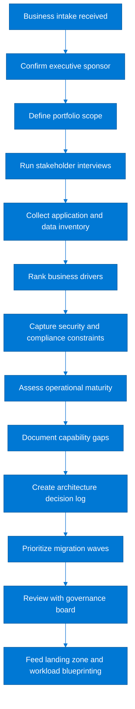

### 1.7 Requirements gathering template

| Requirement area | Prompt | Example answer | Why it matters |
|---|---|---|---|
| Business capability | Which business process is enabled? | Policy servicing | Clarifies strategic value and dependency prioritization |
| User communities | Who uses the solution and from where? | Internal users in North America and EMEA | Influences identity, latency, and edge design |
| Peak transaction profile | What are normal and peak loads? | 3,000 TPS during month-end | Drives sizing, autoscale, and queue design |
| Availability objective | What uptime is required? | 99.95% for customer journeys | Determines HA pattern and service SKUs |
| Recovery target | What RTO and RPO are required? | RTO 2 hours, RPO 15 minutes | Shapes backup, replication, and DR cost |
| Data classification | What data sensitivity is handled? | Confidential and regulated PII | Triggers encryption, segmentation, and logging needs |
| Data residency | Can data leave a region or country? | No for customer records | Constrains region selection and replication |
| Identity model | How are humans and workloads authenticated? | Entra ID with managed identity | Eliminates credential sprawl |
| Integration pattern | What dependencies exist? | SOAP ERP, REST partners, SFTP settlement | Defines network and middleware requirements |
| Release cadence | How often will changes be shipped? | Biweekly with emergency hotfixes | Influences CI/CD design and environment count |
| Support model | Who owns level 1 to level 3 support? | Central operations plus product squad | Affects monitoring, on-call, and alert routing |
| Change window | Are there blackout periods? | Month-end financial close | Affects maintenance and patch scheduling |
| Performance target | What latency is acceptable? | P95 API latency under 250 ms | Drives region placement and caching |
| Observability need | What telemetry is mandatory? | Centralized logs, metrics, and traces | Shapes monitoring platform standards |
| Retention policy | How long must data and logs remain? | Seven years for audit logs | Impacts storage tiers and archive costs |
| Third-party constraints | What vendor dependencies exist? | Licensed middleware bound to Windows | May require IaaS retention or hybrid design |
| Resilience scenario | What failures must be tolerated? | Zone loss, dependency outage, operator error | Guides fault-domain design |
| Budget envelope | What financial ceiling exists? | Initial migration budget plus steady-state target | Ensures feasibility and prioritization |
| Automation scope | What must be automated from day one? | Provisioning, policy assignment, deployments | Supports repeatability and speed |
| Exit criteria | How is success judged? | Reduced incidents and faster releases | Supports post-migration measurement |

### 1.8 Capability gap heatmap prompts

| Capability | Assessment question | Typical baseline | Recommended response |
|---|---|---|---|
| Identity governance | Are privileged roles centrally controlled? | Low | Adopt PIM, group-based RBAC, and privileged access workflows |
| Network standardization | Is IP planning consistent across business units? | Low | Create enterprise address strategy and connectivity review board |
| Platform automation | Can subscriptions be deployed through templates? | Medium | Implement vending automation and baseline deployment pipelines |
| Monitoring maturity | Can teams correlate logs, metrics, and traces? | Medium | Standardize Azure Monitor, Log Analytics, and alert routing |
| Cost accountability | Can spend be mapped to owners and products? | Low | Enforce tags, budgets, showback, and policy gates |
| Backup discipline | Are recovery tests executed and evidenced? | Medium | Set policy-driven backups and periodic failover drills |
| Developer enablement | Do teams have reusable platform patterns? | Low | Publish reference architectures and golden path templates |
| Data governance | Is data classification embedded into provisioning? | Medium | Tag data assets and apply region-specific controls |
| Security operations | Are cloud alerts triaged by a defined function? | Medium | Integrate Defender, Sentinel, and incident response playbooks |
| Change management | Are releases traceable to approvals and artifacts? | High | Integrate CI/CD, approvals, and configuration history |

### 1.9 Architecture principles confirmed during discovery

1. Cloud investments must be traceable to business value, control improvement, or measurable operational simplification.
2. Platform services should be centralized when they reduce risk or provide economies of scale.
3. Application teams should consume guardrailed self-service patterns instead of designing bespoke foundations.
4. Identity is the primary control plane; shared credentials and unmanaged secrets are unacceptable.
5. Network connectivity and IP planning must be approved before workload migrations are scheduled.
6. Production workloads require defined service levels, documented ownership, and tested recovery procedures.
7. Tagging, budget ownership, and cost visibility are required on every subscription and resource group.
8. Observability must be designed in, not retrofitted after go-live.
9. Prefer managed services when they meet functional and regulatory requirements.
10. Architectural exceptions must have an owner, an expiry date, and a remediation path.

### 1.10 Discovery deliverables

- Executive outcome statement and prioritized business drivers.
- Application inventory with criticality, dependencies, and modernization intent.
- Data classification and residency summary.
- Network and identity constraints register.
- Operational maturity snapshot and capability gap log.
- Initial migration wave plan and sequencing rationale.
- Financial guardrails, tagging model, and ownership map.
- Decision log for contested topics such as landing zone boundaries, DR scope, and management model.
- Architecture review agenda for the next phase.
- RACI draft showing platform-team versus workload-team responsibilities.

---

## 2. Landing Zone Architecture

Microsoft Learn reference: [Azure landing zone implementation guidance](https://learn.microsoft.com/en-us/azure/cloud-adoption-framework/ready/landing-zone/)

### 2.1 Core concepts

- A landing zone is the governed target environment in which subscriptions, identity, policy, networking, management, and security controls are pre-positioned before workloads arrive.
- Enterprise architects should treat the landing zone as a product with versioned capabilities, service-level expectations, and a documented roadmap.
- Management groups provide inheritance boundaries for policy, RBAC, and platform standards across multiple subscriptions.
- Subscriptions provide cost, quota, and administrative isolation, but they are not a substitute for disciplined workload architecture.
- Policy should implement the default security and governance position so that teams spend time on business design rather than reinventing controls.
- Connectivity patterns must balance central inspection and shared services with application autonomy and scalability.
- Shared platform services such as logging, backup, DNS, and connectivity should be designed for enterprise scale before onboarding the first production workload.
- Landing zones should enable both greenfield deployments and migration waves without creating special-case exceptions for every team.
- Reference architecture decisions should include clear criteria for when a workload can diverge from the baseline.
- The landing zone should expose repeatable deployment automation, not manual ticket-based provisioning.

### 2.2 Landing zone capability layers

| Capability layer | Representative services | Typical owner |
|---|---|---|
| Identity | Entra ID tenant integration, PIM, break-glass accounts, workload identities | Platform security and identity architecture |
| Management group hierarchy | Platform, landing zones, sandbox, decommissioned, and domain-aligned groups | Enterprise architecture and platform team |
| Subscriptions | Environment or domain subscriptions with budget ownership and vending controls | Platform team with finance oversight |
| Connectivity | Hub-and-spoke, DNS, firewalling, ExpressRoute, VPN, private endpoints | Network team |
| Policy | Required tags, location restrictions, diagnostics, encryption, SKU constraints | Governance team |
| Security | Defender plans, key management, vulnerability posture, just-in-time access | Security operations |
| Management | Log Analytics, alerts, dashboards, backup, update management, service health | Operations team |
| Platform services | Container registries, integration runtimes, API gateways, build agents | Platform engineering |
| Automation | Bicep modules, CI/CD pipelines, vending workflows, approval logic | Cloud engineering |
| Operations model | Incident routing, escalation matrix, architecture review, exception management | Service management office |

### 2.3 Hub-and-spoke topology

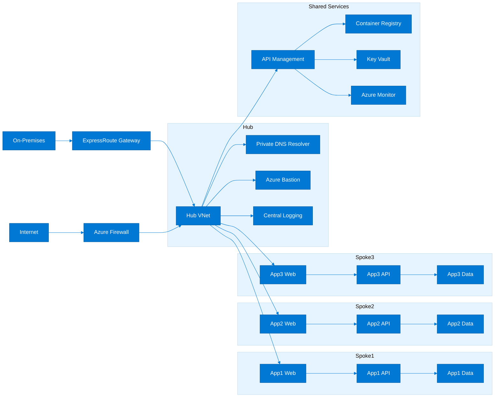

The hub centralizes connectivity, inspection, name resolution, privileged access, and cross-cutting management services while spokes isolate application blast radius and ownership domains.
Shared services can live in the hub or a dedicated shared-services spoke depending on scale, compliance, and platform-team operating preferences.

### 2.4 Management group hierarchy

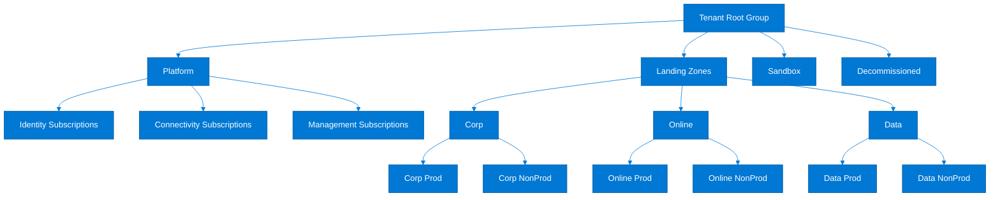

### 2.5 Subscription design patterns

| Pattern | Use case | Pros | Cons |
|---|---|---|---|
| Environment-based | Separate prod and non-prod per domain | Strong cost and change separation | Can multiply subscription count quickly |
| Application-based | Dedicated subscription per critical app | Clear ownership and isolation | Less efficient for small workloads |
| Domain-based | Shared subscription for a product or business domain | Balances isolation and platform reuse | Requires disciplined RBAC and tagging |
| Platform-shared | Common platform services such as logging or connectivity | Centralized control and scale efficiency | Must avoid becoming a bottleneck |
| Data-platform | Enterprise analytics, lake, and data integration services | Clear data ownership boundaries | Can become complex if product data domains are immature |
| Regulated-workload | PCI or HIPAA isolated estates | Simplifies evidence and restriction policies | Higher operational overhead |
| Sandbox | Innovation, experiments, and low-risk prototyping | Supports learning without harming production baseline | Requires strict cost and expiry controls |
| M&A transitional | Short-term landing place for acquired workloads | Accelerates onboarding without immediate redesign | Technical debt can linger if not governed |

### 2.6 Connectivity and shared service decisions

| Service or pattern | Decision objective | Recommended when |
|---|---|---|
| ExpressRoute | High-throughput private connectivity to datacenters | Mission-critical enterprise hybrid workloads |
| Site-to-site VPN | Lower-cost connectivity or backup path | Branch offices, initial migration waves, DR fallback |
| Azure Firewall Premium | Centralized egress and east-west inspection | Regulated environments with TLS inspection |
| Private DNS Resolver | Consistent hybrid name resolution | Private endpoint-heavy estates |
| Bastion | No public IP administration path | Privileged access to VMs in isolated networks |
| API Management | Shared API facade and product governance | Application integration and developer enablement |
| Container Registry | Central image curation and vulnerability scanning | Container platforms at scale |
| Key Vault | Enterprise secrets and keys service | Any production workload handling secrets or certificates |
| Log Analytics | Central telemetry workspace or federated model | Security operations and platform observability |
| Azure Backup | Recovery standardization | VM, SQL, and file workload protection |

### 2.7 Policy packages for landing zones

| Policy category | Example policies | Enforcement | Purpose |
|---|---|---|---|
| Mandatory tags | Require cost center, owner, environment, data classification tags | Deny or modify | Cost accountability and operations |
| Allowed regions | Restrict deployments to approved Azure regions | Deny | Compliance and latency control |
| Diagnostics | Deploy diagnostic settings to central workspace or storage | DeployIfNotExists | Logging completeness |
| Encryption | Require managed disks, storage encryption, and CMK where needed | Audit or deny | Security baseline |
| Networking | Deny public IPs or restrict public endpoints by type | Deny | Network exposure control |
| Backup | Ensure Azure Backup or workload-specific protection exists | AuditIfNotExists | Recoverability |
| Defender plans | Enable Defender for relevant resource types | DeployIfNotExists | Security posture |
| SKU control | Restrict unsupported or high-cost SKUs | Deny | Standards and spend governance |
| Resource provider registration | Ensure needed providers are registered through automation | Deploy | Operational consistency |
| Naming standards | Audit name patterns through policy or pipeline rules | Audit | Discoverability and supportability |
| Private endpoints | Enforce private connectivity for supported PaaS services | Audit or deny | Zero-trust network posture |
| Managed identity | Promote identity-based access over secrets | Audit | Credential reduction |

### 2.8 Azure CLI commands for landing zone setup

```azurecli
az account management-group create --name platform --display-name "Platform"
az account management-group create --name landingzones --display-name "Landing Zones"
az account management-group create --name corp --display-name "Corp" --parent landingzones
az account management-group create --name online --display-name "Online" --parent landingzones
az account management-group create --name data --display-name "Data" --parent landingzones
az group create --name rg-platform-network-eastus --location eastus
az network vnet create --resource-group rg-platform-network-eastus --name vnet-hub-eastus --address-prefix 10.10.0.0/16 --subnet-name snet-firewall --subnet-prefix 10.10.0.0/24
az network vnet subnet create --resource-group rg-platform-network-eastus --vnet-name vnet-hub-eastus --name AzureBastionSubnet --address-prefixes 10.10.1.0/26
az network public-ip create --resource-group rg-platform-network-eastus --name pip-bastion-eastus --sku Standard
az network bastion create --name bastion-eastus --resource-group rg-platform-network-eastus --vnet-name vnet-hub-eastus --public-ip-address pip-bastion-eastus
az monitor log-analytics workspace create --resource-group rg-platform-network-eastus --workspace-name law-platform-eastus --location eastus
az keyvault create --name kv-platform-eastus-001 --resource-group rg-platform-network-eastus --location eastus --enable-rbac-authorization true
az policy assignment create --name pa-allowed-regions --scope /providers/Microsoft.Management/managementGroups/landingzones --policy-set-definition <initiative-id>
az policy assignment create --name pa-tagging --scope /providers/Microsoft.Management/managementGroups/landingzones --policy-set-definition <tag-initiative-id>
az network private-dns resolver create --name pdr-hub-eastus --resource-group rg-platform-network-eastus --location eastus --virtual-network vnet-hub-eastus
az network firewall create --name afw-hub-eastus --resource-group rg-platform-network-eastus --location eastus --sku AZFW_VNet --tier Premium
az network vnet subnet create --resource-group rg-platform-network-eastus --vnet-name vnet-hub-eastus --name AzureFirewallSubnet --address-prefixes 10.10.2.0/26
az role assignment create --assignee-object-id <group-object-id> --role Reader --scope /providers/Microsoft.Management/managementGroups/landingzones
az role assignment create --assignee-object-id <group-object-id> --role Contributor --scope /subscriptions/<subscription-id>
az monitor diagnostic-settings create --resource /subscriptions/<subscription-id> --name send-to-platform-law --workspace <workspace-id> --logs "[{"category":"Administrative","enabled":true}]"
```

### 2.9 Landing zone rollout guidance

1. Create the management group hierarchy and validate inheritance paths before deploying workload subscriptions.
2. Establish central platform subscriptions for connectivity, identity-adjacent services, and management tooling.
3. Deploy baseline networking, DNS, logging, key management, and firewall capabilities through Infrastructure as Code.
4. Assign policy initiatives in audit mode first when validating their operational impact on early adopters.
5. Transition approved policies to deny or deploy-if-not-exists after exception handling is proven.
6. Onboard a pilot production application and one non-production domain to validate RBAC, diagnostics, DNS, and support workflows.
7. Operationalize subscription vending with automated policy, budget, tag, and RBAC assignment.
8. Publish platform service catalog documentation and reference patterns for common workload types.
9. Review performance, support friction, and exception patterns after the first wave and refine the landing zone product backlog.
10. Scale onboarding to additional domains only after operational evidence shows the baseline is supportable.

### 2.10 Common anti-patterns to avoid

- Using one large subscription for every application because procurement wants fewer billing artifacts.
- Deferring tag, budget, and logging decisions until after migration waves are already in motion.
- Treating hub resources as a networking-only estate and neglecting management, monitoring, and identity dependencies.
- Creating bespoke exceptions for each team rather than publishing approved patterns and expiry-managed exceptions.
- Assuming all workloads need the same network topology regardless of data sensitivity or integration dependency.
- Deploying platform services manually, which makes scale, auditability, and recovery significantly harder.
- Ignoring private endpoint and DNS implications until after PaaS adoption creates name-resolution incidents.
- Over-centralizing every service into the hub when domain autonomy or scale would be better served by shared-services spokes.

---

## 3. Resource Planning for 10 Applications

### 3.1 Planning objectives

For a ten-application estate, architects can still optimize for clarity over extreme scale. The goal is to establish consistent naming, network segmentation, subscription placement, environment separation, and shared-platform reuse without overengineering every workload boundary.

### 3.2 Multi-tier architecture for 10 applications

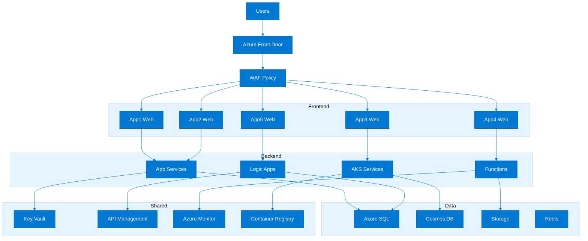

### 3.3 Resource naming convention

| Resource type | Pattern | Example | Notes |
|---|---|---|---|
| Subscription | sub-<domain>-<env>-<region>-<nnn> | sub-retail-prod-eastus-001 | Supports vending automation and reporting |
| Resource group | rg-<app>-<tier>-<env>-<region>-<nnn> | rg-claimshub-app-prod-eastus-001 | Reflects app and tier |
| Virtual network | vnet-<scope>-<env>-<region>-<nnn> | vnet-online-prod-eastus-001 | Scope may be hub, domain, or app |
| Subnet | snet-<purpose>-<env>-<region>-<nnn> | snet-appsvc-prod-eastus-001 | Use purpose-oriented names |
| Network security group | nsg-<scope>-<env>-<region>-<nnn> | nsg-claims-prod-eastus-001 | Aligns with subnet or NIC ownership |
| Route table | rt-<scope>-<env>-<region>-<nnn> | rt-spoke-prod-eastus-001 | Supports policy-based routing |
| Public IP | pip-<service>-<env>-<region>-<nnn> | pip-agw-prod-eastus-001 | Only when public exposure is approved |
| Application Gateway | agw-<app>-<env>-<region>-<nnn> | agw-retail-prod-eastus-001 | For app-specific L7 entry points |
| Front Door | afd-<portfolio>-<env>-<nnn> | afd-customer-prod-001 | Global edge resource |
| App Service plan | asp-<domain>-<env>-<region>-<nnn> | asp-digital-prod-eastus-001 | Can host multiple apps when sized correctly |
| Web app | app-<app>-<env>-<region>-<nnn> | app-claimshub-prod-eastus-001 | Use app token that business teams recognize |
| Function app | func-<app>-<env>-<region>-<nnn> | func-orderbatch-prod-eastus-001 | Pairs with shared or dedicated plan |
| AKS cluster | aks-<domain>-<env>-<region>-<nnn> | aks-online-prod-eastus-001 | Domain-level shared compute |
| Container registry | acr<domain><env><region><nnn> | acronlineprodeus001 | Registry naming omits hyphens by Azure constraint |
| Key Vault | kv-<scope>-<env>-<region>-<nnn> | kv-shared-prod-eastus-001 | Use RBAC authorization mode |
| Storage account | st<app><env><region><nnn> | stdocarchiveprodeus001 | Constrained character set |
| SQL server | sql-<domain>-<env>-<region>-<nnn> | sql-finance-prod-eastus-001 | Logical server or MI cluster naming |
| Managed instance | mi-<domain>-<env>-<region>-<nnn> | mi-finance-prod-eastus-001 | For lift-and-transform database targets |
| Cosmos account | cos-<app>-<env>-<region>-<nnn> | cos-salesapi-prod-eastus-001 | Align with data domain |
| Log Analytics workspace | law-<scope>-<env>-<region>-<nnn> | law-platform-prod-eastus-001 | Shared or domain-specific |
| Recovery vault | rsv-<scope>-<env>-<region>-<nnn> | rsv-platform-prod-eastus-001 | Backup ownership clarity |
| Action group | ag-<scope>-<env>-<region>-<nnn> | ag-online-prod-eastus-001 | Operational alert routing |

### 3.4 Resource group strategy

| Strategy | Best for | Benefits | Trade-offs |
|---|---|---|---|
| Per application per environment | Most line-of-business applications | Clear lifecycle and ownership boundaries | May duplicate shared services if used indiscriminately |
| Per tier shared by domain | Multiple small web apps sharing compute | Simpler management for low-complexity workloads | Requires disciplined deployment separation |
| Per platform service | Key Vault, APIM, logging, registry | Matches centralized ownership | Must define tenanting and service-level expectations |
| Per application plus shared data | Apps with tightly coupled compute but central data service | Supports phased modernization | Need clear ownership of cross-app databases |
| Per environment shared integration | Logic Apps, Service Bus, Event Hubs | Makes common integration controls easier | Can create hidden coupling without quotas |
| Per compliance boundary | PCI, regulated health, sovereign data | Simplifies evidence and restriction policy | Operational overhead is higher |

### 3.5 IP address planning

| Zone | VNet range | Subnet ranges | Notes |
|---|---|---|---|
| Hub East US | 10.10.0.0/16 | Firewall 10.10.0.0/24; Bastion 10.10.1.0/26; Gateway 10.10.2.0/27; Shared 10.10.10.0/24 | Central connectivity and shared services |
| Spoke App01 Prod | 10.20.0.0/22 | Web 10.20.0.0/24; App 10.20.1.0/24; Data 10.20.2.0/25; Private Endpoints 10.20.2.128/26 | ClaimsHub |
| Spoke App02 Prod | 10.20.4.0/22 | Web 10.20.4.0/24; App 10.20.5.0/24; Data 10.20.6.0/25; Private Endpoints 10.20.6.128/26 | RetailWeb |
| Spoke App03 Prod | 10.20.8.0/22 | Web 10.20.8.0/24; App 10.20.9.0/24; Data 10.20.10.0/25; Private Endpoints 10.20.10.128/26 | PartnerAPI |
| Spoke App04 Prod | 10.20.12.0/22 | Web 10.20.12.0/24; App 10.20.13.0/24; Data 10.20.14.0/25; Private Endpoints 10.20.14.128/26 | OrderBatch |
| Spoke App05 Prod | 10.20.16.0/22 | Web 10.20.16.0/24; App 10.20.17.0/24; Data 10.20.18.0/25; Private Endpoints 10.20.18.128/26 | HRPortal |
| Spoke App06 Prod | 10.20.20.0/22 | Web 10.20.20.0/24; App 10.20.21.0/24; Data 10.20.22.0/25; Private Endpoints 10.20.22.128/26 | RiskAnalytics |
| Spoke App07 Prod | 10.20.24.0/22 | Web 10.20.24.0/24; App 10.20.25.0/24; Data 10.20.26.0/25; Private Endpoints 10.20.26.128/26 | DocArchive |
| Spoke App08 Prod | 10.20.28.0/22 | Web 10.20.28.0/24; App 10.20.29.0/24; Data 10.20.30.0/25; Private Endpoints 10.20.30.128/26 | BillingEngine |
| Spoke App09 Prod | 10.20.32.0/22 | Web 10.20.32.0/24; App 10.20.33.0/24; Data 10.20.34.0/25; Private Endpoints 10.20.34.128/26 | SalesMobileAPI |
| Spoke App10 Prod | 10.20.36.0/22 | Web 10.20.36.0/24; App 10.20.37.0/24; Data 10.20.38.0/25; Private Endpoints 10.20.38.128/26 | DataExchange |
| Shared NonProd | 10.30.0.0/20 | Dev and test spokes carved in /22 blocks | Non-production environment pool |

### 3.6 Application resource plan for the first 10 apps

| Application | Compute | Primary data | Network pattern | Planning note |
|---|---|---|---|---|
| ClaimsHub | App Service | Azure SQL Database | App Gateway + APIM | Tier 1 internal/external mix |
| RetailWeb | App Service + Front Door | Azure SQL + Redis | Front Door + WAF | Customer-facing seasonal peaks |
| PartnerAPI | AKS | Cosmos DB | APIM private integration | API-first with partner onboarding |
| OrderBatch | Functions Premium | Storage + SQL | Private endpoints | Timer and queue processing |
| HRPortal | App Service | Azure SQL | Application Proxy or private access | Internal workforce application |
| RiskAnalytics | Synapse + Data Factory | Data Lake + SQL pools | Private connectivity | Analytics platform integration |
| DocArchive | Static Web + Functions | Blob Storage | Front Door optional | Archive and retrieval workload |
| BillingEngine | Azure VMs | SQL Managed Instance | Internal load balancer | Vendor constraints and Windows dependencies |
| SalesMobileAPI | AKS or Container Apps | Cosmos DB + Redis | APIM + Front Door | Mobile traffic spikes |
| DataExchange | Logic Apps + Functions | Storage + Key Vault | Private endpoint patterns | B2B integration and managed secrets |

### 3.7 Azure CLI resource planning commands

```azurecli
az group create --name rg-claimshub-app-prod-eastus-001 --location eastus
az group create --name rg-retailweb-app-prod-eastus-001 --location eastus
az appservice plan create --name asp-digital-prod-eastus-001 --resource-group rg-retailweb-app-prod-eastus-001 --location eastus --sku P1v3 --is-linux
az webapp create --name app-retailweb-prod-eastus-001 --resource-group rg-retailweb-app-prod-eastus-001 --plan asp-digital-prod-eastus-001 --runtime "DOTNETCORE:8.0"
az sql server create --name sql-digital-prod-eastus-001 --resource-group rg-retailweb-app-prod-eastus-001 --location eastus --enable-public-network false --admin-user sqladmin --admin-password <password>
az sql db create --resource-group rg-retailweb-app-prod-eastus-001 --server sql-digital-prod-eastus-001 --name sqldb-retailweb-prod-eastus-001 --service-objective GP_Gen5_4
az redis create --name redis-retailweb-prod-eastus-001 --resource-group rg-retailweb-app-prod-eastus-001 --location eastus --sku Premium --vm-size p1
az network vnet create --resource-group rg-claimshub-app-prod-eastus-001 --name vnet-claimshub-prod-eastus-001 --address-prefix 10.20.0.0/22 --subnet-name snet-web-prod-eastus-001 --subnet-prefix 10.20.0.0/24
az network vnet subnet create --resource-group rg-claimshub-app-prod-eastus-001 --vnet-name vnet-claimshub-prod-eastus-001 --name snet-app-prod-eastus-001 --address-prefixes 10.20.1.0/24
az network vnet subnet create --resource-group rg-claimshub-app-prod-eastus-001 --vnet-name vnet-claimshub-prod-eastus-001 --name snet-pe-prod-eastus-001 --address-prefixes 10.20.2.128/26
az keyvault create --name kv-shared-prod-eastus-001 --resource-group rg-platform-network-eastus --location eastus --enable-rbac-authorization true
az monitor autoscale create --resource-group rg-retailweb-app-prod-eastus-001 --resource app-retailweb-prod-eastus-001 --resource-type Microsoft.Web/sites --name autoscale-retailweb-prod
az monitor autoscale rule create --resource-group rg-retailweb-app-prod-eastus-001 --autoscale-name autoscale-retailweb-prod --condition "CpuPercentage > 70 avg 10m" --scale out 1
az monitor autoscale rule create --resource-group rg-retailweb-app-prod-eastus-001 --autoscale-name autoscale-retailweb-prod --condition "CpuPercentage < 35 avg 20m" --scale in 1
```

### 3.8 Sizing recommendations

| App type | Compute | Storage | Network | Sizing note |
|---|---|---|---|---|
| Small internal web app | App Service P0v3 or B3 for non-prod | Azure SQL S2 or GP serverless | Standard VNet integration | Use autoscale only when demand is variable |
| Customer-facing transactional app | App Service P1v3/P2v3 or AKS node pool sized for peak | Azure SQL GP/BC or Cosmos DB | Front Door, WAF, App Gateway when regional ingress needed | Plan for zone redundancy |
| API workload | AKS, Container Apps, or App Service | Cosmos DB or SQL depending consistency needs | APIM and private endpoints | Right-size for concurrency and payload profile |
| Batch processing | Functions Premium or Container Apps Jobs | Storage queues and SQL/Blob | Private outbound and scheduler triggers | Prefer event-driven design over idle VMs |
| Analytics workload | Synapse, Databricks, or Fabric integration | Data Lake + warehouse engines | Private networking and managed VNet where supported | Separate dev/test/prod data paths |
| Legacy Windows app | Azure VMs with scale set where possible | SQL MI or SQL on VM | Bastion and load balancer | Document modernization roadmap to avoid permanent IaaS |
| Document archive | Static Web Apps + Functions | Blob hot/cool/archive tiers | Front Door optional; private endpoints for admin paths | Lifecycle management is primary cost lever |
| Integration hub | Logic Apps Standard + Functions | Service Bus, Storage, Key Vault | APIM and private connectors | Throughput depends on connector mix and retry policy |

### 3.9 Ten-application operational checklist

- Reserve address space for at least five additional applications so a ten-app design does not become a dead end.
- Separate production from non-production subscriptions even if some shared services remain centralized.
- Define whether monitoring is centralized in one workspace or federated by domain before onboarding the first team.
- Document standard Key Vault patterns for certificates, secrets rotation, and access reviews.
- Establish backup, retention, and recovery test patterns per workload class rather than per application.
- Align DNS zone ownership with the landing zone design to avoid private endpoint conflicts later.
- Set budgets for each subscription and application owner before production cutover.
- Create a single intake pattern for app teams requesting new resources so naming and tags remain consistent.
- Publish a golden path for web, API, integration, and data workloads to reduce architecture drift.
- Review service quotas early, especially for vCPU limits, private endpoints, and PaaS capacity constraints.

---

## 4. Resource Planning for 50+ Applications

### 4.1 Enterprise-scale planning principles

- At 50+ applications, platform standardization, delegation boundaries, and automation quality matter more than any single application architecture choice.
- Architects should plan for domain-based operating models where product teams own workload delivery inside centrally governed guardrails.
- Subscription design must support parallel delivery, acquisition onboarding, regulated enclaves, and cost accountability without overwhelming the platform team.
- Reusable Infrastructure as Code modules become a strategic asset because they reduce review friction and accelerate consistent compliance.
- Shared services should be intentionally productized with published service levels, support paths, and onboarding guardrails.
- The platform backlog should be prioritized based on developer enablement value, control maturity, and risk reduction, not only technical elegance.

### 4.2 Enterprise-scale architecture

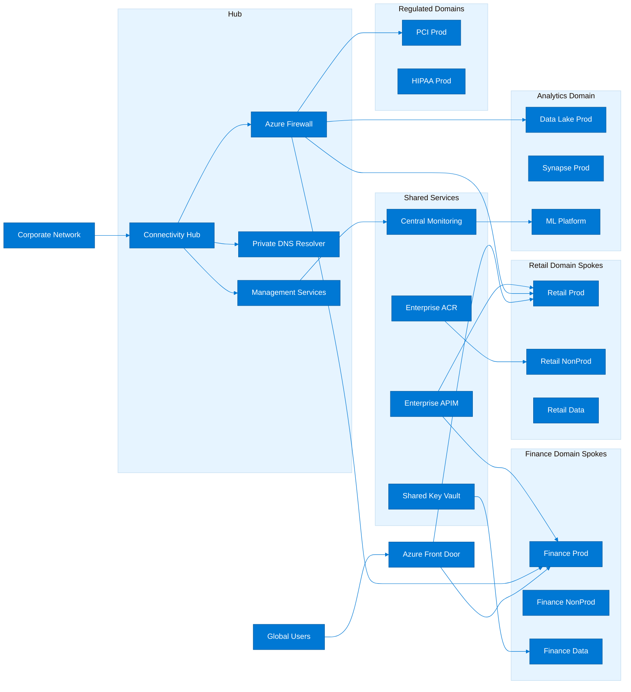

### 4.3 Platform versus application team model

| Team | Primary responsibilities | Why it matters |
|---|---|---|
| Platform team | Management groups, policy, connectivity, shared services, vending, observability baseline | Reduces duplicated effort and enforces enterprise controls |
| Security team | Control requirements, threat modeling, incident response, regulatory mappings | Ensures consistent security posture and evidence quality |
| Network team | Address planning, ExpressRoute, DNS, firewall policies, private connectivity standards | Avoids scale-breaking overlap and inspection gaps |
| Application teams | Application code, data model, CI/CD, service ownership, app-specific dashboards | Keeps product knowledge close to delivery |
| Data platform team | Shared analytics services, data zones, governance, ingestion standards | Prevents uncontrolled data sprawl |
| FinOps function | Budgets, showback, reservations, anomaly management, cost reporting | Creates financial discipline as scale increases |
| Architecture board | Reference patterns, exception approval, target-state evolution | Maintains coherence while allowing controlled flexibility |

### 4.4 Subscription vending machine concept

1. Requestor submits a subscription request with business owner, environment, domain, data classification, and intended workload pattern.
2. Workflow validates whether an existing domain subscription or a new subscription is the appropriate outcome.
3. Approval gates route to platform, security, and finance where exceptions or special handling are needed.
4. Automation creates the subscription in the correct management group and registers required resource providers.
5. Baseline RBAC assignments are applied using Entra ID groups, not individual user assignments.
6. Budgets, tags, policy assignments, diagnostic settings, and security plans are deployed automatically.
7. Networking artifacts such as VNet templates or spoke peering requests are created based on approved patterns.
8. Subscription metadata is written into CMDB or service catalog systems for operational traceability.
9. The requestor receives onboarding guidance, quotas, and golden-path templates rather than a raw empty subscription.
10. Periodic attestation reviews confirm that owners, tags, and cost center mappings remain accurate.

### 4.5 Resource hierarchy for 50+ applications

| Layer | Purpose | Architecture concern |
|---|---|---|
| Management group | Domain or control boundary | Policy inheritance and guardrail placement |
| Subscription | Environment, regulated boundary, or high-value domain | Cost isolation and operational ownership |
| Resource group | Application, tier, or platform service lifecycle boundary | Change control and deployment packaging |
| VNet and subnets | Application communication zones | Security segmentation and IP governance |
| Shared PaaS services | Reusable API, secrets, logging, integration, registry capabilities | Economies of scale and consistent controls |
| Application resources | Compute, storage, databases, messaging | Product-specific execution and data handling |
| Tags and metadata | Owner, environment, cost center, business service, confidentiality | Searchability, automation, and reporting |

### 4.6 Enterprise domain catalog example

| Domain | Representative applications | Key planning factor |
|---|---|---|
| Finance | ERP, billing, treasury, reconciliation | High control and month-end stability requirements |
| Retail | Commerce, pricing, loyalty, product catalog | Customer scale and campaign elasticity |
| SupplyChain | Warehouse, procurement, shipment tracking | Integration-heavy and partner connectivity |
| Manufacturing | MES, telemetry, scheduling | Operational technology segmentation |
| CustomerService | CRM integrations, self-service portals, knowledge systems | Case volume peaks and omnichannel flows |
| HR | Employee services, payroll, talent systems | PII sensitivity and internal access focus |
| Legal | eDiscovery, legal hold, contract management | Retention and evidentiary controls |
| Analytics | Enterprise lake, BI, ML services | Shared data governance and throughput |
| Marketing | Campaign, segmentation, content delivery | Burst traffic and third-party integrations |
| CorporateIT | ITSM, endpoint integrations, admin tools | Operational reliability and privileged access |
| Partner | B2B APIs, partner onboarding, settlement | Identity federation and external access |
| Regulated | PCI or healthcare workloads | Isolated subscriptions and strict policies |

### 4.7 Automation with Bicep and Terraform

```bicep
targetScope = "subscription"
param location string = resourceGroup().location
param appName string
param env string
param tags object
resource rg_app "Microsoft.Resources/resourceGroups@2023-07-01" = {
  name: "rg-${appName}-app-${env}-${location}-001"
  location: location
  tags: tags
}
module kv "./modules/keyvault.bicep" = {
  name: "deploy-kv-${appName}-${env}"
  scope: rg_app
  params: {
    vaultName: "kv-${appName}-${env}-${location}-001"
    location: location
    tags: tags
  }
}
module diag "./modules/diagnostics.bicep" = {
  name: "diag-${appName}-${env}"
  scope: rg_app
  params: {
    workspaceResourceId: "/subscriptions/<sub>/resourceGroups/rg-platform-monitor/providers/Microsoft.OperationalInsights/workspaces/law-platform-prod-eastus-001"
  }
}
```

```hcl
module "subscription_baseline" {
  source              = "./modules/subscription-baseline"
  subscription_id     = var.subscription_id
  environment         = var.environment
  cost_center         = var.cost_center
  management_group_id = var.management_group_id
  mandatory_tags      = var.mandatory_tags
  log_analytics_id    = var.log_analytics_id
  enable_defender     = true
}
```

### 4.8 Azure CLI for bulk operations

```azurecli
for sub in $(az account subscription list --query "[?contains(displayName, `Prod`)].subscriptionId" -o tsv); do
  az account set --subscription "$sub"
  az group list --query "[].name" -o tsv
done
for sub in $(az account subscription list --query "[].subscriptionId" -o tsv); do
  az account set --subscription "$sub"
  az consumption budget create --amount 5000 --budget-name monthly-guardrail --category Cost --time-grain Monthly --resource-group-name rg-finops-shared --time-period start-date=2025-01-01 end-date=2026-12-31
done
az graph query -q "Resources | summarize count() by type, subscriptionId"
az policy state summarize --management-group landingzones
az resource list --tag environment=prod --query "[].{name:name,type:type,rg:resourceGroup}" -o table
```

### 4.9 Guardrails that become mandatory at scale

| Guardrail | Reason |
|---|---|
| Tag enforcement | Incomplete metadata destroys cost transparency and ownership clarity |
| Quota management | Large estates hit regional CPU, IP, and private endpoint quotas unexpectedly |
| Golden path templates | Reduce architecture drift and review overload |
| Central diagnostics baseline | Supports security operations and platform incident triage |
| Subscription vending | Prevents manual inconsistency and provisioning bottlenecks |
| Exception register | Tracks risk and prevents permanent one-off designs |
| Service catalog | Makes shared platform capabilities consumable and supportable |
| Domain accountability | Clarifies which team owns production support and optimization |
| Platform metrics | Demonstrates whether the landing zone product is improving delivery speed and control quality |
| Roadmap governance | Aligns platform evolution with acquisitions, modernization waves, and regulatory changes |

### 4.10 Enterprise scaling recommendations

- Group applications by domain and operational criticality, not just by technology stack.
- Use shared domain AKS clusters or App Service plans when it lowers operational overhead without violating isolation requirements.
- Provide regulated enclaves with their own stronger policies rather than over-constraining every subscription equally.
- Automate cost and configuration reporting so architecture reviews discuss facts instead of manually assembled spreadsheets.
- Refresh reference patterns quarterly as Azure services, policy capabilities, and internal controls evolve.
- Plan for acquisitions and divestitures by treating the management group and subscription model as adaptable products.

---

## 5. High-Level Design Diagrams

### 5.1 HLD template structure

| HLD section | Purpose |
|---|---|
| Executive summary | Why this workload exists, expected business outcomes, and major architecture choices |
| Scope and assumptions | Which systems, users, and environments are in scope, plus explicit exclusions |
| Current state summary | Legacy footprint, debt, constraints, and migration rationale |
| Target-state architecture | Narrative plus diagrams covering compute, data, network, security, and operations |
| Application flows | Critical user journeys, integration patterns, and dependency map |
| Environment model | Dev, test, stage, prod, and any training or DR environments |
| Identity and access | Human and workload identities, admin boundaries, privileged access model |
| Network architecture | Ingress, egress, segmentation, DNS, hybrid connectivity, private endpoints |
| Data architecture | Stores, retention, backup, encryption, residency, and lifecycle controls |
| Security controls | Threat model summary, baseline controls, monitoring, and incident pathways |
| Resiliency and DR | Availability zones, recovery region, backup strategy, and test cadence |
| Observability | Logs, metrics, traces, dashboards, alerts, and support model |
| Deployment architecture | CI/CD, artifact flow, approvals, rollbacks, and release windows |
| Sizing and cost | Capacity assumptions, scale profile, and financial guardrails |
| Operational model | Support RACI, escalation paths, runbooks, and change ownership |
| Risks and exceptions | Known gaps, mitigations, compensating controls, and decision dates |
| Appendices | Detailed dependency inventory, naming map, and references |

### 5.2 Three-tier web application HLD

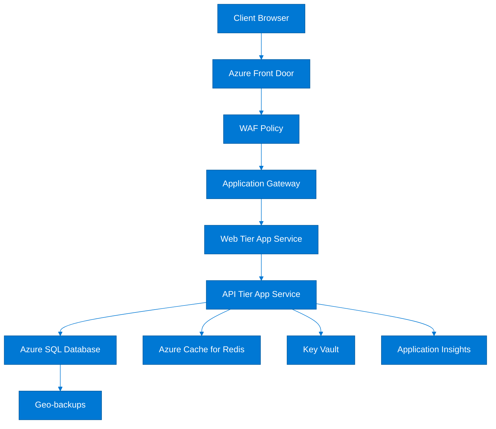

### 5.3 Disaster recovery topology

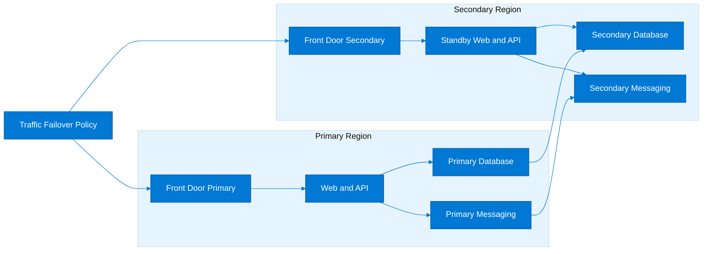

### 5.4 CI/CD pipeline flow


### 5.5 Security layers pattern

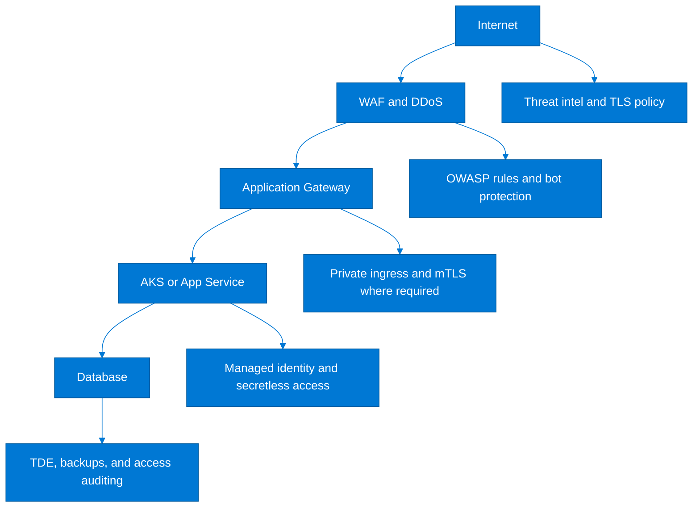

### 5.6 Network topology decision tree

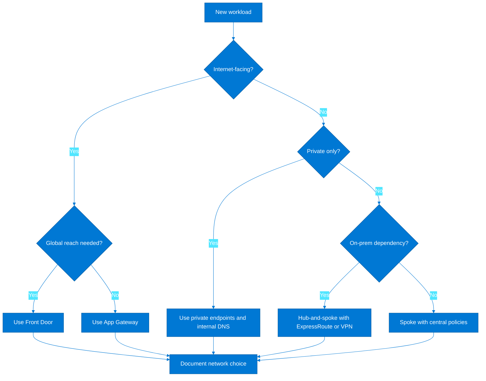

### 5.7 HLD narrative guidance

- Lead with business and operational context before introducing the diagram so reviewers understand why certain services were selected.
- State the identity, networking, and data assumptions explicitly, because these are common sources of hidden design risk.
- Describe normal runtime paths, administrative paths, and recovery paths separately.
- Annotate where controls live: edge filtering, network isolation, secrets access, database protection, and monitoring.
- Call out which components are shared platform services and which are application-owned.
- Show dependencies on external vendors or on-premises systems because these often dominate resilience planning.
- Document region selection rationale including latency, service availability, sovereignty, and paired-region recovery options.
- Explain how the design supports operational supportability, not only functional delivery.
- Include a concise ADR-style decision summary for major trade-offs such as AKS versus App Service or SQL versus Cosmos DB.
- Avoid diagrams that only show Azure icons without flow direction or ownership boundaries.

### 5.8 Non-functional requirement reference

| NFR | Typical design content | Primary stakeholder |
|---|---|---|
| Availability | Target uptime, zone awareness, failover approach | Business service owner |
| Performance | Latency, throughput, peak concurrency | Product and architecture |
| Scalability | Expected growth, autoscale triggers, seasonal events | Product and operations |
| Security | Identity, segmentation, encryption, logging | Security architecture |
| Compliance | Applicable standards and evidence model | Compliance office |
| Resilience | RTO, RPO, backup, restore validation | Operations and continuity |
| Maintainability | Patch, pipeline, upgrade, and configuration management model | Platform and application team |
| Observability | Metrics, logs, traces, alerting ownership | Operations |
| Cost | Budget envelope, scaling strategy, reservation posture | FinOps and product owner |
| Supportability | Runbooks, escalation, ownership, support window | Service management |

### 5.9 Architecture decision examples

| Decision | Rationale | Trade-off |
|---|---|---|
| Use Front Door rather than region-specific public endpoints | Global routing, WAF centralization, failover flexibility | Requires origin hardening and certificate strategy |
| Prefer App Service for CRUD web applications | Operational simplicity and rapid delivery | May not fit highly customized runtime or sidecar needs |
| Adopt AKS for domain APIs with many microservices | Container scheduling and platform consistency | Needs stronger cluster operations discipline |
| Use SQL Managed Instance for ERP migration | Compatibility with existing SQL features | Higher cost than database PaaS and slower modernization path |
| Centralize Key Vault at domain level | Stronger standards and reduced sprawl | Need clear RBAC boundaries and naming discipline |
| Use private endpoints for data services | Reduces public exposure and supports zero-trust model | Adds DNS and subnet planning complexity |
| Keep non-production in separate subscriptions | Budget and control isolation | Slightly higher administrative count |
| Standardize on Bicep modules | Native Azure IaC alignment and reusable modules | Requires internal module versioning discipline |
| Deploy central Log Analytics plus app-specific tables and queries | Shared security visibility with app-team flexibility | Needs data retention and cost tuning |
| Implement blue/green for customer channels only | Balances release safety and platform cost | Not every internal app merits full dual-path deployment |

### 5.10 HLD review checkpoints

| Checkpoint | Review question |
|---|---|
| Business alignment | Does the design clearly support the stated outcomes and constraints? |
| Landing zone fit | Is the workload aligned to approved subscription, policy, and network patterns? |
| Identity model | Are human and workload identities least privilege and lifecycle managed? |
| Data handling | Are classification, retention, encryption, and residency controls explicit? |
| Resilience | Are HA and DR patterns proportional to the business impact? |
| Operations | Are telemetry, support ownership, and incident pathways defined? |
| Automation | Can the design be deployed repeatably through code and pipelines? |
| Cost | Are sizing assumptions and optimization levers documented? |
| Exceptions | Are deviations time-bound with clear owners and remediation paths? |
| Approval readiness | Can architecture, security, and operations sign off without hidden assumptions? |

### 5.11 Step-by-step HLD creation process

1. Start from the needs assessment outputs and confirm critical business and regulatory requirements.
2. Choose the deployment topology that best fits the landing zone and workload profile.
3. Draft logical diagrams before selecting exact Azure services to avoid premature bias.
4. Map every major dependency including identity, data, networking, batch, and external interfaces.
5. Select Azure services and SKUs that satisfy the non-functional requirements and support model.
6. Add resilience, monitoring, and security controls directly onto the diagrams and supporting tables.
7. Review costs and right-size assumptions with FinOps or engineering leads.
8. Socialize the draft with platform, security, and operations teams to remove hidden blockers.
9. Update the decision log and exception register based on review outcomes.
10. Publish the final HLD with version control and ownership metadata.

---

## 6. Governance & Compliance

Microsoft Learn reference: [Azure governance documentation](https://learn.microsoft.com/en-us/azure/governance/)

### 6.1 Governance goals

- Governance should reduce risk and operational ambiguity without making the Azure platform unusable for delivery teams.
- Controls should be automated wherever possible so compliance evidence is produced continuously rather than reconstructed manually.
- Role design, policy inheritance, and telemetry baselines should reflect how the enterprise actually operates, not only idealized org charts.
- Governance artifacts must be reviewable by auditors, security teams, and product leaders using a shared control vocabulary.
- Architects should design for exceptions as a managed process, not a hidden side channel.

### 6.2 Azure Policy framework

| Policy category | Example policies | Enforcement |
|---|---|---|
| Identity and access | Require managed identity where supported; audit overly permissive role assignments | Audit or deny |
| Tagging | Enforce owner, cost center, app id, environment, data classification | Modify or deny |
| Region control | Restrict resources to approved geographies and sovereign scopes | Deny |
| Networking | Deny public IPs on internal workloads; require private endpoints for data services | Deny or audit |
| Security baseline | Enable Defender plans, secure transfer, TLS minimums, and encryption standards | DeployIfNotExists |
| Logging | Deploy diagnostic settings and activity log export | DeployIfNotExists |
| Backup and recovery | Audit or deploy protection policies for supported resource types | AuditIfNotExists |
| SKU governance | Block unsupported, legacy, or unapproved cost-heavy SKUs | Deny |
| Naming and consistency | Audit naming patterns and required metadata | Audit |
| Data services | Require CMK, disable public access, or enforce retention configurations where needed | Audit or deny |
| Kubernetes | Apply AKS baseline policies for pod security, diagnostic settings, and authorized networks | DeployIfNotExists |
| Storage | Require secure transfer, versioning, and lifecycle configuration | Deny or deploy |

### 6.3 RBAC design matrix

| Role | Scope | Permissions | Use case |
|---|---|---|---|
| Reader | Management group, subscription, resource group | View configuration and status only | Audit users, architecture reviewers |
| Contributor | Resource group or app subscription | Create and manage resources but not RBAC | Application engineering teams |
| Owner | Limited to subscription or RG where justified | Full management including RBAC | Platform automation identities and tightly controlled admins |
| User Access Administrator | Management group or subscription | Manage RBAC assignments only | Central IAM administrators |
| Network Contributor | Network RG or spoke subscription | Manage VNets, subnets, NSGs, routes | Network operations |
| Key Vault Secrets User | Specific Key Vault | Read secrets at runtime | Managed identities for applications |
| Key Vault Administrator | Specific Key Vault | Manage vault configuration and objects | Platform or security admins |
| Monitoring Contributor | Monitoring RG or workspace | Create alerts and dashboards | Operations engineers |
| Cost Management Contributor | Subscription or billing scope | Budgets and cost exports | FinOps and finance analysts |
| Security Admin | Security center scope | Manage Defender and recommendations | Security operations |

### 6.4 Defender for Cloud integration

- Enable Defender plans selectively but consistently for servers, containers, SQL, Storage, App Service, and Key Vault based on workload usage.
- Route Defender alerts into the enterprise SIEM or Sentinel workspace with ownership and triage severity mappings.
- Use secure score trends as a portfolio-level improvement signal rather than a simplistic target metric.
- Integrate vulnerability findings into engineering backlogs with explicit service ownership and remediation SLA.
- Use Defender recommendations to validate landing zone drift, especially for public exposure, missing diagnostics, and weak configurations.
- Establish exception handling where compensating controls exist, and time-box those exceptions so they do not become permanent blind spots.

### 6.5 Compliance frameworks alignment

| Framework | Architecture focus | Typical Azure considerations |
|---|---|---|
| SOC 2 | Security, availability, confidentiality controls | Logging, access review, change traceability, incident evidence |
| ISO 27001 | Information security management controls | Policy mapping, asset inventory, access controls, monitoring |
| PCI-DSS | Cardholder data environment protection | Segmentation, logging, encryption, vulnerability management, strict admin control |
| HIPAA | Protected health information handling | Access logging, encryption, BAAs, least privilege, retention |
| GDPR | Personal data processing and residency obligations | Data minimization, retention, access requests, regional governance |
| NIST 800-53 | Federal-style control catalog | Control inheritance, evidence, continuous monitoring |

### 6.6 Governance automation with Policy as Code

```bicep
targetScope = "managementGroup"
param mgName string
param policyDefinitionId string
resource policyAssignment "Microsoft.Authorization/policyAssignments@2022-06-01" = {
  name: "pa-required-tags"
  properties: {
    displayName: "Required Tags"
    policyDefinitionId: policyDefinitionId
    enforcementMode: "Default"
  }
  scope: tenantResourceId("Microsoft.Management/managementGroups", mgName)
}
```

```powershell
$mgScope = "/providers/Microsoft.Management/managementGroups/landingzones"
New-AzPolicyAssignment -Name "pa-diagnostics" -Scope $mgScope -PolicySetDefinition $policySet -IdentityType SystemAssigned
Get-AzPolicyStateSummary -ManagementGroupName "landingzones"
```

### 6.7 Azure CLI governance commands

```azurecli
az policy assignment list --scope /providers/Microsoft.Management/managementGroups/landingzones -o table
az policy state summarize --management-group landingzones
az role assignment list --scope /subscriptions/<subscription-id> --include-inherited -o table
az security pricing list -o table
az monitor activity-log alert create --name aal-policy-change --resource-group rg-platform-monitor --scopes /subscriptions/<subscription-id> --condition category=Administrative and operationName=Microsoft.Authorization/policyAssignments/write --action-group <action-group-id>
az tag create --resource-id /subscriptions/<subscription-id> --tags owner=platform-team costCenter=IT environment=prod
```

### 6.8 Operating cadence for governance

| Cadence | Governance activity |
|---|---|
| Daily | Review high-severity security alerts, failed policy deployments, and privileged access activations |
| Weekly | Assess new exceptions, onboarding requests, and drift reports for priority subscriptions |
| Monthly | Run access recertification, policy compliance trend review, and cost governance review |
| Quarterly | Refresh control mappings, architecture exceptions, and golden path standards |
| Semiannual | Test disaster recovery, review region strategy, and validate evidence packages |
| Annual | Re-baseline governance objectives against business strategy and regulatory changes |

### 6.9 Control design recommendations

- Use groups for RBAC assignment and avoid direct user assignment except for break-glass scenarios.
- Model policy initiatives by platform capability area so teams can understand and consume them more easily.
- Separate advisory policies from blocking policies and communicate transition timelines clearly.
- Capture every exception with a business owner, security approver, expiry date, and remediation plan.
- Automate evidence exports from policy, activity logs, and Defender rather than depending on screenshots.
- Use Azure Resource Graph for near-real-time inventory and control coverage reporting.
- Integrate governance checks into CI/CD so issues are caught before deployment hits deny policies.
- Align regulatory scopes to management groups or subscriptions instead of ad hoc spreadsheets where possible.

---

## 7. Sizing & Cost Estimation

Microsoft Learn reference: [Azure Cost Management and Billing](https://learn.microsoft.com/en-us/azure/cost-management-billing/)

### 7.1 Cost estimation methodology

1. Define workload classes and map them to candidate Azure services before estimating individual applications.
2. Capture baseline and peak demand assumptions separately because many enterprise systems have extreme reporting or retail peaks.
3. Separate one-time migration costs from steady-state run costs so investment decisions remain transparent.
4. Model production, non-production, DR, backup, monitoring, and network egress rather than only primary compute.
5. Use three scenarios: conservative, expected, and peak-growth, particularly for customer-facing applications.
6. Validate whether licensing optimization, reservations, or savings plans are realistic given the deployment pattern.
7. Include operational tooling costs such as monitoring, security plans, and pipeline infrastructure.
8. Review estimates with platform, product, and finance stakeholders so assumptions are owned and updated.

### 7.2 Azure Pricing Calculator guidance

- Build calculator estimates by environment and region so production costs are not diluted by dev/test assumptions.
- Model availability zones, premium storage, and geo-redundancy explicitly because these are common cost deltas.
- Add networking components such as Front Door, Application Gateway, Firewall, and data transfer early.
- Estimate Log Analytics ingestion and retention using realistic telemetry volume from comparable workloads.
- Track assumptions in the HLD so future variance analysis is tied to documented design intent.
- Refresh estimates after performance testing and after the first month of production telemetry is available.

### 7.3 Reserved Instances vs Spot vs Pay-as-you-go

| Option | Best fit | Pros | Cons |
|---|---|---|---|
| Pay-as-you-go | Variable or uncertain demand, pilot phases, rapid architecture change | Maximum flexibility | Highest steady-state unit cost |
| Reserved Instances | Predictable always-on compute or databases | Strong discount and budget predictability | Less flexible if architecture changes quickly |
| Savings Plan | Mixed compute consumption patterns with moderate predictability | Discount with more flexibility than reserved instances | Needs usage analysis to avoid underutilization |
| Spot | Interruptible batch, stateless jobs, disposable environments | Lowest potential cost | No guarantee of availability |

### 7.4 Cost by tier model

| Tier | Common pattern | Cost posture | Architecture note |
|---|---|---|---|
| Development | Smaller SKUs, business-hours schedules, shared plans where safe | Lowest cost, speed over HA | Automated shutdown and lower retention |
| Test/QA | Representative but not peak sizing | Moderate | Needs performance realism for critical integration tests |
| Staging | Production-like topology with constrained scale | Higher | Supports release validation and DR rehearsal |
| Production | Business-driven performance and resilience sizing | Highest | Use reservations and right-sizing reviews |
| DR | Pilot light, warm standby, or active-active based on RTO/RPO | Variable | Tie cost to proven business recovery need |

### 7.5 FinOps practices for enterprise

| FinOps capability | Architectural implication |
|---|---|
| Ownership | Every subscription and major service has an accountable business or platform owner |
| Visibility | Tagging, budgets, dashboards, and showback enable transparent conversations |
| Optimization | Right-size, schedule non-prod, use reservations, and eliminate orphaned resources |
| Forecasting | Use growth projections, release roadmaps, and migration plans to update spend outlook |
| Governance | Cost policies, SKU restrictions, and anomaly alerts reinforce desired behavior |
| Benchmarking | Compare workload classes and environments to spot outliers quickly |
| Culture | Embed cost awareness into architecture reviews and engineering retrospectives |

### 7.6 Workload cost drivers

| Driver | Examples | Common workload impact |
|---|---|---|
| Ingress and edge | Front Door, WAF policies, CDN, TLS transactions | Customer-facing global applications |
| Compute runtime | App Service plans, AKS nodes, Functions premium, VM uptime | All applications |
| Data tier | SQL vCores, Cosmos throughput, managed instance storage, backups | Transactional and analytics workloads |
| Network security | Azure Firewall, App Gateway, NAT Gateway, private endpoints | Regulated or hybrid-heavy estates |
| Observability | Log ingestion, retention, Application Insights volume, alert rules | Large estates and chatty applications |
| Data transfer | Inter-region replication and internet egress | DR-enabled or content-heavy systems |
| Security services | Defender plans, Sentinel ingestion, key operations | Security-sensitive workloads |
| Storage lifecycle | Hot/cool/archive tiers and immutable retention | Document and backup-heavy workloads |
| Environment multiplication | Dev, test, stage, prod, DR copies of services | Mature release pipelines |
| Operational tooling | Build agents, registries, package feeds, management services | Platform and delivery teams |

### 7.7 Cost optimization decision flow

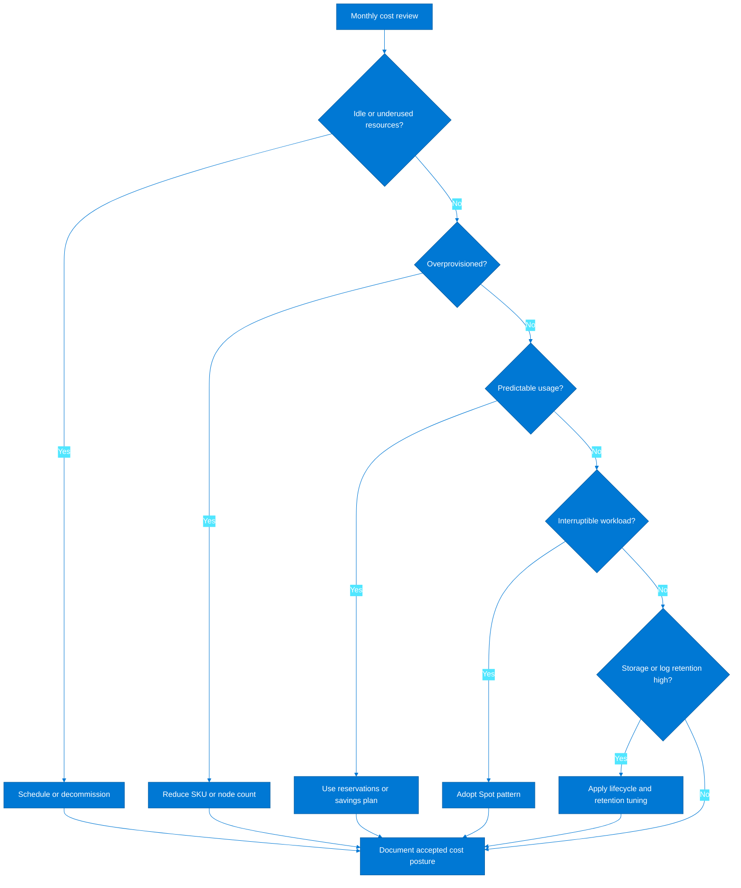

### 7.8 Azure Cost Management commands

```azurecli
az consumption usage list --top 20 --subscription <subscription-id> -o table
az consumption budget list --subscription <subscription-id> -o table
az consumption reservation summary list --grain monthly -o table
az advisor recommendation list --category Cost -o table
az resource list --tag environment=dev --query "[].{name:name,type:type,rg:resourceGroup}" -o table
```

### 7.9 Monthly estimation worksheet example

| Scope | Item | Estimation note |
|---|---|---|
| RetailWeb prod | App Service P2v3 x 3 instances | Expected baseline with autoscale headroom |
| RetailWeb prod | Azure SQL Business Critical 8 vCores | High availability transactional database |
| RetailWeb prod | Front Door Premium + WAF | Global edge and security |
| RetailWeb prod | Redis Premium | Session and cache acceleration |
| RetailWeb prod | Log Analytics ingestion | Telemetry estimate based on 60 GB/day |
| ClaimsHub prod | App Service P1v3 x 2 instances | Internal/external mixed usage |
| ClaimsHub prod | Azure SQL General Purpose 4 vCores | Transactional workload |
| PartnerAPI prod | AKS node pool 3 x D4ds_v5 | Containerized APIs |
| PartnerAPI prod | Cosmos DB autoscale | Variable partner throughput |
| OrderBatch prod | Functions Premium EP1 x 2 | Timer and queue jobs |
| RiskAnalytics prod | Synapse SQL and Spark | Analytics compute windows |
| Shared platform | Azure Firewall Premium | Central inspection service |
| Shared platform | Key Vault premium operations | Certificates and keys |
| Shared platform | Monitor and Defender | Central operations and security |

### 7.10 Enterprise cost recommendations

- Forecast spend by application wave and platform capability rather than a single undifferentiated Azure total.
- Create separate cost KPIs for migration savings, modernization value, and unplanned optimization debt.
- Treat monitoring and security costs as core platform investments, not optional overhead.
- Review reservations quarterly against real usage to avoid both waste and missed savings.
- Use business-hours shutdown for non-production by default, with exceptions documented for integration needs.
- Tie autoscale thresholds to user experience and transaction metrics, not only CPU.
- Analyze log verbosity and retention before blaming Azure for observability cost growth.
- Make cost variance a standard architecture review input after each production go-live.

---

## 8. Real-World Examples

### 8.1 Financial services company migrating 10 LOB apps

A regional financial services company needed to exit two datacenters within eighteen months while improving resilience for ten line-of-business applications supporting lending, servicing, treasury, and partner integrations.
The discovery phase showed that four applications were truly Tier 1, three were integration-heavy but non-customer-facing, and three could be modernized opportunistically during migration.
The architecture team adopted a domain-oriented landing zone with separate production and non-production subscriptions for finance and integration workloads plus centralized connectivity and management subscriptions.
Front Door and Application Gateway were introduced only for customer and partner touchpoints; internal workloads used private ingress patterns and APIM for controlled exposure.
SQL Managed Instance was selected for the ERP-adjacent database footprint because compatibility was more important than immediate PaaS simplification.
Two integration applications were redesigned around Logic Apps, Service Bus, and managed identities, eliminating legacy service accounts and reducing release coordination overhead.
The platform team published Bicep modules for VNets, diagnostics, Key Vault, App Service, and SQL, enabling the first production workloads to be deployed with consistent tagging and policies.
Monthly governance reviews focused on access hygiene, private endpoint sprawl, and telemetry cost, which were the main early operational pain points.
After six months, the organization reduced release lead time from four weeks to under one week for two modernized applications and established repeatable production support patterns across the first migration wave.

### 8.2 Retail company scaling to 50+ microservices

A retail enterprise with multiple brands needed a cloud platform capable of supporting more than fifty microservices, high seasonal peaks, frequent promotions, and rapid onboarding of acquisition targets.
The architecture team used domain-aligned subscriptions for commerce, pricing, loyalty, fulfillment, and analytics while keeping shared edge, observability, and integration services in platform-managed subscriptions.
AKS was selected for service-dense domains that needed service mesh and custom runtime control, while App Service and Functions were used for simpler workloads to avoid unnecessary platform burden.
A subscription vending workflow integrated with the service catalog so new product teams received approved tags, budgets, RBAC groups, and monitoring baselines automatically.
FinOps reviews identified that log retention, duplicate non-production environments, and oversized node pools were the largest avoidable cost levers, leading to significant savings without functional compromise.
Governance teams used Policy as Code and Azure Resource Graph dashboards to measure compliance drift across dozens of subscriptions and hundreds of resource groups.
The enterprise architecture board maintained golden paths for APIs, web channels, data products, and event-driven services, which reduced solution review time and improved consistency during rapid expansion.
By the second peak trading season, the retailer had proven autoscale, failover, and deployment rollback patterns across core customer journeys and could integrate newly acquired brands into the Azure foundation within weeks rather than months.

### 8.3 Lessons learned

| Lesson | Interpretation |
|---|---|
| Start with platform outcomes, not service catalogs | Teams adopt patterns faster when they understand why the control or service exists |
| Treat landing zones as products | Backlog, service levels, and ownership prevent platform stagnation |
| Automate subscription onboarding early | Manual provisioning does not scale past a handful of applications |
| Private connectivity changes DNS complexity | Architects must plan name resolution at the same time as private endpoints |
| Observability cost can surprise programs | Telemetry design is as important as compute right-sizing |
| Shared services need clear tenancy rules | Without quotas and ownership, central services become contention points |
| Document exceptions aggressively | Untracked exceptions quietly become the de facto standard |
| FinOps belongs in architecture reviews | Cost is a design variable, not an afterthought |
| Resilience must be tested, not assumed | Failover runbooks and drills expose dependency gaps |
| Product teams still need autonomy | Over-centralization slows delivery and encourages shadow IT |

### 8.4 Architecture review checklist

| Review area | Question |
|---|---|
| Business alignment | Is the business objective explicit and measurable? |
| Stakeholders | Are executive, security, networking, data, operations, and finance stakeholders identified? |
| Landing zone fit | Does the workload map to an approved management group and subscription pattern? |
| Naming and tagging | Are names, tags, and ownership fields compliant with standards? |
| Identity model | Are human and workload identities least privilege and group managed? |
| Secrets management | Are secrets, certificates, and keys stored in approved services? |
| Network ingress | Is public exposure justified and protected with edge controls? |
| Network egress | Are outbound dependencies, NAT, and inspection requirements documented? |
| Private endpoints | Are private endpoint, DNS, and subnet implications fully designed? |
| Data classification | Is data sensitivity and residency explicitly captured? |
| Encryption | Are encryption at rest, in transit, and key ownership requirements defined? |
| Availability | Is the workload architecture aligned to target uptime and failure domains? |
| Recovery | Are RTO, RPO, and failover mechanisms documented and costed? |
| Monitoring | Are metrics, logs, traces, dashboards, and alerts designed with owners? |
| Security operations | Will alerts flow to a triage function with runbooks? |
| Compliance | Are framework-specific controls or evidence needs mapped? |
| Automation | Can the full design be deployed and updated through code? |
| CI/CD | Are build, test, approval, rollback, and artifact controls defined? |
| Cost model | Does the estimate include platform, DR, monitoring, and networking? |
| Environment strategy | Are dev, test, stage, prod, and DR environments justified and right-sized? |
| Shared service dependency | Are shared platform services sized and governed for this workload? |
| Operational handoff | Is support ownership and escalation documented? |
| Runbooks | Are backup, restore, failover, and incident runbooks identified? |
| Exception management | Are deviations from standards approved, tracked, and time-bound? |
| Go-live readiness | Are quotas, budgets, diagnostics, and security baselines verified? |

### 8.5 Enterprise architecture planning prompts

1. What business events would force us to onboard ten more applications in under six months, and is the platform ready for that pace?
2. Which controls truly need central enforcement, and which can be delegated through reusable patterns?
3. Where are the largest sources of architecture review friction today: networking, identity, data, or approvals?
4. How will acquired or divested business units be integrated or separated cleanly within the Azure hierarchy?
5. What platform metrics would prove that self-service is working as intended?
6. Which workloads should never share a subscription or shared service, and why?
7. What evidence will auditors request, and how can we produce it automatically?
8. What is the smallest landing zone product that still makes production onboarding safe?
9. How do we ensure cost conversations happen early enough to influence design choices?
10. What does a successful architecture review mean for a product team in practical terms?

### 8.6 Sample KPI set for enterprise architecture planning

| KPI | Definition | Why it matters |
|---|---|---|
| Platform onboarding lead time | Days from request to usable subscription | Measures vending and approval efficiency |
| Golden path adoption rate | Percentage of new workloads using approved patterns | Measures platform product effectiveness |
| Policy compliance rate | Percentage of resources compliant with mandatory controls | Measures governance coverage |
| Production telemetry coverage | Percentage of critical apps with full logs, metrics, and alert ownership | Measures support readiness |
| Access review completion | Timeliness of RBAC recertification | Measures identity governance discipline |
| Budget variance | Actual versus forecast by domain or product | Measures FinOps maturity |
| Exception age | Average days open for architectural exceptions | Measures control debt |
| DR test success rate | Percentage of planned recovery tests completed successfully | Measures resilience readiness |
| Deployment frequency | Releases per application or domain | Measures agility improvement |
| Mean time to recover | Time to restore service during incidents | Measures operational maturity |

### 8.7 Risk register examples

| Risk | Potential impact | Mitigation |
|---|---|---|
| Address space overlap with acquired company | Cannot integrate new networks quickly | Reserve non-overlapping ranges and define M&A onboarding pattern |
| Unmanaged secrets in legacy applications | Security incident or audit failure | Use Key Vault and managed identity remediation backlog |
| No subscription vending automation | Platform team becomes provisioning bottleneck | Prioritize workflow automation in early roadmap |
| Inconsistent telemetry design | Security and operations lose visibility | Publish diagnostics baseline and review it at HLD stage |
| Oversized non-production estates | Cloud spend grows faster than value | Apply schedules, shared services, and size policies |
| Weak exception management | Temporary deviations become permanent risk | Govern exceptions with owner and expiry date |
| Shared service saturation | Multiple apps suffer during peak load | Model tenancy limits and monitor platform services separately |
| Unproven DR processes | Outage duration exceeds business tolerance | Run failover exercises and update runbooks |

### 8.8 Final recommendations

- Use discovery outputs to define platform priorities before debating individual Azure services.
- Invest early in landing zone automation, identity governance, and network design because these decisions compound at scale.
- Publish concise but authoritative high-level designs for each major workload type and require teams to start from them.
- Integrate FinOps, governance, and resilience testing into the architecture lifecycle rather than treating them as separate tracks.
- Measure platform success using onboarding speed, control coverage, operational outcomes, and product-team adoption—not resource counts alone.

### 8.9 Extended architecture review domains

Microsoft Learn references: [Azure Well-Architected Framework](https://learn.microsoft.com/en-us/azure/well-architected/), [Azure Architecture Center](https://learn.microsoft.com/en-us/azure/architecture/)

Use the following domains to structure enterprise architecture boards, migration wave approvals, and design authority reviews for Azure-hosted portfolios.

| Review domain | Primary architect focus | Required evidence | Typical escalation |
|---|---|---|---|
| Business alignment | Confirm measurable outcomes, KPIs, and budget ownership | Business case, KPI baseline, target operating model | Portfolio steering committee |
| Identity | Confirm Entra ID integration, privileged access, and workload identity patterns | Access model, break-glass process, PIM design | Identity governance board |
| Network | Confirm address planning, ingress, egress, inspection, and hybrid connectivity | Topology diagrams, route design, firewall rules | Network architecture board |
| Platform governance | Confirm management groups, policy assignments, and subscription model | Policy initiative map, exception register, subscription matrix | Cloud platform council |
| Security | Confirm control layering, secrets management, threat detection, and incident workflow | Threat model, key management, SOC integration | Security review board |
| Resilience | Confirm RTO, RPO, zonal strategy, and regional failover testing | DR pattern, backup validation, failover runbook | Business continuity forum |
| Data | Confirm classification, sovereignty, encryption, lifecycle, and lineage requirements | Data map, retention rules, data owner approvals | Data governance council |
| Delivery | Confirm CI/CD controls, environment promotion, and release approvals | Pipeline design, branch policy, rollback plan | Release governance forum |
| Observability | Confirm logging, metrics, tracing, and alert ownership | Monitoring baseline, dashboard plan, alert matrix | Operations leadership |
| FinOps | Confirm tagging, budget ownership, reservation strategy, and unit economics | Forecast, chargeback model, optimization backlog | FinOps committee |
| Operations | Confirm incident, change, and problem management integration | Support model, service maps, runbooks, escalation paths | Service operations board |
| Compliance | Confirm control mapping, evidence generation, and exception handling | Audit matrix, evidence store, policy attestations | Risk and compliance office |

### 8.10 Migration wave planning matrix

A practical way to scale from 10 to 50+ applications is to group workloads into migration or modernization waves with explicit technical and organizational dependencies.

| Wave | Application group | Dependency focus | Exit criteria | Executive checkpoint |
|---|---|---|---|---|
| Wave 0 | Platform foundations | Management groups, identity, network, policy, logging | Landing zone operational and validated | Platform sponsor sign-off |
| Wave 1 | Low-risk internal apps | SSO, backup, basic monitoring | Two pilot apps live with operational support | CIO review |
| Wave 2 | Shared integration services | API gateway, DNS, certificates, messaging | Shared services hardened and documented | Enterprise architect approval |
| Wave 3 | Medium criticality web apps | WAF, App Gateway, autoscale, release automation | NFR targets met in non-production | Digital channel governance |
| Wave 4 | Core data platforms | Data zoning, encryption, retention, ETL orchestration | Data governance controls audited | Data board approval |
| Wave 5 | Critical business APIs | Contract management, throttling, DR test rehearsal | API uptime and rollback patterns proven | Integration board review |
| Wave 6 | Customer-facing transactional apps | Peak load, fraud controls, support runbooks | Load test and security review completed | Business sponsor sign-off |
| Wave 7 | Regulated workloads | Evidence automation, segregation, private access | Control evidence accepted by compliance | Risk committee approval |
| Wave 8 | High-availability workloads | Active-active or warm standby architecture | DR test result within target RTO and RPO | BCM checkpoint |
| Wave 9 | Legacy decompositions | Domain decoupling, eventing, data migration | Technical debt backlog accepted and funded | Architecture board |
| Wave 10 | Platform optimization | RI coverage, cleanup, policy refinement | Optimization KPIs trending positively | FinOps review |

Recommended wave-planning practices:

1. Keep each wave small enough that operating teams can absorb support ownership without creating alert fatigue.
2. Sequence shared identity, network, DNS, and certificate dependencies before application moves.
3. Use architecture gates that check readiness of people, process, and technology rather than infrastructure alone.
4. Require a clear rollback decision point for every production wave.
5. Update the enterprise roadmap when a shared service slips because downstream workload dates will move with it.
6. Track exception approvals centrally so urgent business deadlines do not create unmanaged policy drift.

### 8.11 Architecture review board agenda

1. Reconfirm the business outcome, critical success measures, and go-live decision date.
2. Review current-state pain points and what the Azure target state is explicitly expected to solve.
3. Validate landing zone placement, subscription ownership, and management group alignment.
4. Validate inbound and outbound network paths including inspection, private DNS, and dependency reachability.
5. Validate identity design for users, administrators, applications, and automation principals.
6. Review workload topology, environment strategy, and region placement.
7. Review data flows, data classification, retention, and encryption approach.
8. Review resilience design, backup patterns, and disaster recovery testing assumptions.
9. Review monitoring, logging, tracing, and alert routing to support teams.
10. Review deployment automation, rollback, and change approval controls.
11. Review policy compliance, known exceptions, and mitigation dates.
12. Review cost baseline, budget owner, and optimization plan for the first 90 days.
13. Review operational support ownership, runbooks, and major incident escalation paths.
14. Capture decisions, actions, owners, and due dates in a formal architecture decision log.

### 8.12 Operational readiness decision flow

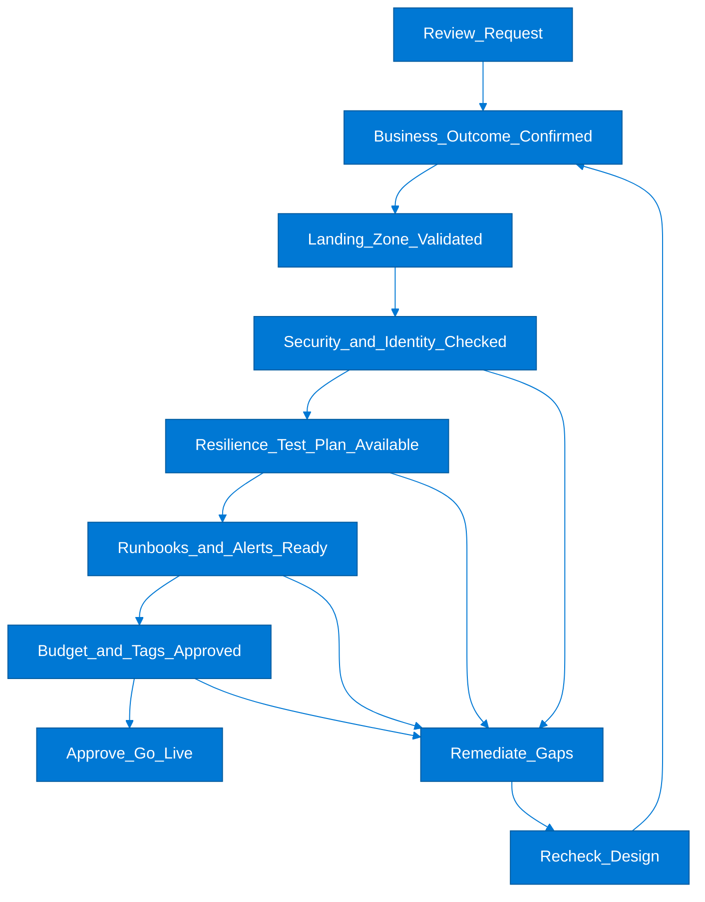

### 8.13 Azure CLI commands for go-live validation

Use CLI validation to confirm foundational Azure controls before architecture sign-off.

```azurecli
az account set --subscription "prod-digital-001"
az group list --tag Environment=prod --output table
az monitor diagnostic-settings list --resource-group rg-retail-prod
az policy state summarize --management-group mg-prod-platform
az network private-dns zone list --output table
az network vnet list --query "[].{name:name,address:addressSpace.addressPrefixes}" --output table
az network firewall policy list --output table
az keyvault list --query "[].{name:name,networkAcls:properties.networkAcls.defaultAction}" --output table
az backup vault list --output table
az aks list --query "[].{name:name,privateFqdn:privateFqdn}" --output table
az appservice plan list --output table
az monitor action-group list --output table
az consumption budget list --output table
```

Validation guidance:

- Run the command set first in the non-production subscription that mirrors production controls.
- Compare policy summary results against the exception register rather than expecting zero non-compliance by default.
- Include CLI evidence in change records when architecture boards require proof of implemented controls.
- Extend the validation set with service-specific commands for Azure SQL, Storage, Event Hubs, or API Management as needed.

### 8.14 PowerShell example for tag and lock audit

```powershell
$subscriptionId = "00000000-0000-0000-0000-000000000000"
Set-AzContext -SubscriptionId $subscriptionId
$requiredTags = @("Application","BusinessOwner","Environment","CostCenter","DataClassification")
$groups = Get-AzResourceGroup
foreach ($group in $groups) {
    $missing = @()
    foreach ($tag in $requiredTags) {
        if (-not $group.Tags.ContainsKey($tag)) {
            $missing += $tag
        }
    }
    $locks = Get-AzResourceLock -ResourceGroupName $group.ResourceGroupName -ErrorAction SilentlyContinue
    [PSCustomObject]@{
        ResourceGroup = $group.ResourceGroupName
        MissingTags = ($missing -join ",")
        LockCount = ($locks | Measure-Object).Count
        Location = $group.Location
    }
} | Sort-Object ResourceGroup | Format-Table -AutoSize
```

Why this matters:

- Architects need simple evidence that foundational governance controls are visible at the resource group layer.
- Missing business-owner or cost-center tags undermine FinOps, incident routing, and lifecycle accountability.
- Deletion locks should be applied selectively to critical shared resources such as hubs, firewalls, DNS zones, and vaults.

### 8.15 Business outcome and portfolio alignment

- Review question 1: Which business capability becomes measurably faster, safer, or cheaper after the Azure change?
- Review question 2: Which executive KPI will improve first and how will the team prove it?
- Review question 3: What business event would make the current architecture unacceptable within the next 12 months?
- Review question 4: Which applications in the same domain depend on this workload even if they are not in the current release scope?
- Review question 5: What level of architectural standardization is required across this portfolio for supportability?
- Review question 6: Which parts of the design are strategic differentiators and which should conform to common platform patterns?
- Review question 7: How will architecture decisions affect release cadence, onboarding time, and service restoration speed?
- Review question 8: What funding model supports both migration delivery and ongoing platform operations?
- Review question 9: Which capabilities must be centralized for control and which can be delegated to product teams?
- Review question 10: What are the explicit non-goals so the review board can prevent scope expansion?
- Review question 11: Which decisions must be irreversible by launch date and therefore deserve early escalation?
- Review question 12: What evidence shows that the proposed design aligns with the enterprise roadmap rather than a local optimization?

### 8.16 Identity and access architecture

- Review question 1: How will workforce identities, external users, and workload identities be separated?
- Review question 2: Which administrative roles remain permanently assigned and why can they not be eligible through PIM?
- Review question 3: How are managed identities preferred over secrets for runtime authentication?
- Review question 4: Where will break-glass accounts be stored, monitored, and tested?
- Review question 5: How will privileged actions be logged and reviewed after production go-live?
- Review question 6: Which APIs or legacy components still require service principal secrets and what is the retirement path?
- Review question 7: How will application-to-application trust be established across subscriptions or tenants?
- Review question 8: Which directory synchronization or federation dependencies could delay rollout?
- Review question 9: How are access reviews, group lifecycle, and role recertification handled?
- Review question 10: What is the boundary between platform-team access and application-team access?
- Review question 11: How will deployment pipelines authenticate without creating hidden privileged paths?
- Review question 12: What user journeys fail if Entra ID or a federation dependency is degraded?

### 8.17 Network and connectivity architecture

- Review question 1: What overlapping IP ranges exist with on-premises networks, partner networks, or acquired businesses?
- Review question 2: Where is ingress terminated and inspected before requests reach application tiers?
- Review question 3: Which services must be private-only and how will private DNS resolution be managed?
- Review question 4: How are outbound internet dependencies discovered, approved, and monitored?
- Review question 5: What route tables, NVAs, or Azure Firewall policies enforce segmentation requirements?
- Review question 6: Which shared services must remain reachable during an ExpressRoute outage?
- Review question 7: How will domain teams request new address space without fragmenting the enterprise plan?
- Review question 8: Which latency-sensitive flows require region proximity or edge acceleration?
- Review question 9: How are certificates, DNS records, and public IP ownership governed centrally?
- Review question 10: What is the fallback path if an inspection component becomes unavailable?
- Review question 11: How will network changes be tested safely before production rollout?
- Review question 12: Which network metrics best indicate hidden coupling between spokes and shared services?

### 8.18 Platform and subscription architecture

- Review question 1: What management group path should the workload inherit and why?
- Review question 2: Which policy initiatives apply by default and which need scoped exceptions?
- Review question 3: Does the subscription model support ownership clarity for cost, operations, and compliance?
- Review question 4: How will new environments be vended consistently with required role assignments and tags?
- Review question 5: Which shared services belong in the platform subscription versus the domain subscription?
- Review question 6: How will the team prevent application-specific customizations from contaminating the landing zone baseline?
- Review question 7: What lifecycle process retires unused subscriptions and resource groups?
- Review question 8: How is regional expansion handled without manually recreating governance artifacts?
- Review question 9: Which platform services require dedicated subscriptions because of scale or blast radius concerns?
- Review question 10: How are service limits monitored before they disrupt onboarding?
- Review question 11: What architecture rule prevents direct production creation of resources outside IaC pipelines?
- Review question 12: How does the design accommodate future mergers, acquisitions, or divestitures?

### 8.19 Security architecture

- Review question 1: Where are the highest-value assets and how are they segmented from less trusted tiers?
- Review question 2: What is the threat model for internet exposure, administrative compromise, and data exfiltration?
- Review question 3: How are keys, secrets, and certificates generated, rotated, and revoked?
- Review question 4: Which Microsoft Defender for Cloud plans are enabled and how are recommendations triaged?
- Review question 5: What evidence proves encryption in transit and at rest across all critical paths?
- Review question 6: How will the design detect suspicious east-west traffic or privilege escalation?
- Review question 7: What compensating controls exist when a platform capability cannot meet a regulatory expectation out of the box?
- Review question 8: How are secure build artifacts, container images, and package repositories governed?
- Review question 9: Which controls protect diagnostic logs from tampering or premature deletion?
- Review question 10: How will penetration test findings flow back into architecture standards?
- Review question 11: What is the process for approving temporary public exposure during migration cutover?
- Review question 12: Which security controls are inherited from the landing zone and which remain workload-specific?

### 8.20 Data architecture

- Review question 1: What authoritative data sources exist and how will the Azure design preserve integrity?
- Review question 2: How is data classified by sensitivity, residency, retention, and usage rights?
- Review question 3: Which data stores require private connectivity or customer-managed keys?
- Review question 4: How will backup, restore, and point-in-time recovery be validated?
- Review question 5: What patterns prevent uncontrolled data duplication across analytics, operational, and archive tiers?
- Review question 6: How will data lifecycle policies handle legal hold, retention, and disposal obligations?
- Review question 7: Which integrations depend on batch windows and how will cloud elasticity alter those windows?
- Review question 8: How are schema changes governed when multiple applications depend on the same datasets?
- Review question 9: What data quality metrics matter to the business and where are they surfaced?
- Review question 10: How will analytics workloads be isolated from transactional performance risks?
- Review question 11: What lineage or catalog tooling is required for regulated or high-value data domains?
- Review question 12: How will the design support future AI or advanced analytics use without replatforming core data services?

### 8.21 Resilience and continuity architecture

- Review question 1: What are the true business RTO and RPO values by workload and dependency, not just aspirational targets?
- Review question 2: Which components are zone-redundant, regionally replicated, or manually recoverable?
- Review question 3: How are shared services protected so a single hub failure does not stop many workloads?
- Review question 4: Which dependencies lack native cross-region capabilities and require compensating process controls?
- Review question 5: How often are failover drills scheduled and who certifies the results?
- Review question 6: What failure modes have been simulated for identity, DNS, firewall, and pipeline dependencies?
- Review question 7: How will the application degrade gracefully if a secondary service is unavailable?
- Review question 8: What backup retention design aligns with both recovery needs and compliance obligations?
- Review question 9: Which runbooks define authority for failover, failback, and business communication?
- Review question 10: How will the architecture prevent DR environments from drifting away from primary design standards?
- Review question 11: What evidence proves that data restore performance meets business expectations at realistic scale?
- Review question 12: Which components justify active-active investment and which only need well-rehearsed warm standby?

### 8.22 Delivery and DevOps architecture

- Review question 1: Which artifacts are immutable across environments and which values are environment-specific?
- Review question 2: How will the platform enforce separation of duties across code approval, deployment approval, and runtime access?
- Review question 3: What branch and release strategy supports frequent change without bypassing controls?
- Review question 4: How is infrastructure as code versioned, validated, and promoted through environments?
- Review question 5: Which pre-deployment tests prove compatibility with platform policies and networking constraints?
- Review question 6: How will secrets, certificates, and variable groups be injected securely into pipelines?
- Review question 7: What rollback pattern is used for schema changes, network changes, and application binaries?
- Review question 8: How are emergency changes handled without creating permanent exceptions to the standard pipeline?
- Review question 9: What telemetry from the deployment process informs platform improvement?
- Review question 10: How will multiple product teams reuse common templates without forking them excessively?
- Review question 11: Which dependencies on self-hosted agents, package feeds, or signing services create delivery fragility?
- Review question 12: How will architecture boards validate that deployed resources still match approved templates?

### 8.23 Observability and operations architecture

- Review question 1: What minimum logging, metrics, and tracing baseline applies to every production workload?
- Review question 2: How are alerts prioritized so product teams act on meaningful signals rather than noise?
- Review question 3: Which dashboards are required for executives, operators, and service owners?
- Review question 4: How will diagnostic settings be enforced and verified across new subscriptions?
- Review question 5: What is the retention plan for operational, security, and audit logs?
- Review question 6: How are service maps maintained when microservices or integrations change rapidly?
- Review question 7: Which synthetic tests validate customer journeys from outside the network boundary?
- Review question 8: How are major incident reviews translated into architecture improvements?
- Review question 9: Which SLOs exist and what error-budget policy governs release pacing?
- Review question 10: How will the support model operate during wave migrations when old and new environments coexist?
- Review question 11: What escalation path exists when a shared platform component causes multi-application impact?
- Review question 12: How are monitoring costs managed as telemetry volume grows across dozens of workloads?

### 8.24 FinOps and commercial architecture

- Review question 1: Who owns monthly forecast accuracy for each subscription and workload?
- Review question 2: Which tags are mandatory for chargeback, showback, and service ownership?
- Review question 3: What commitment strategy exists for reserved instances, savings plans, or license benefits?
- Review question 4: How will the team detect idle compute, oversized SKUs, and orphaned resources automatically?
- Review question 5: Which architecture decisions intentionally trade cost for resilience or speed and how are they justified?
- Review question 6: How are shared platform costs allocated across domains and environments?
- Review question 7: What unit metrics such as cost per transaction or cost per customer session will be tracked?
- Review question 8: How are cost anomalies escalated before they affect business confidence in Azure?
- Review question 9: Which non-production environments can be paused, rightsized, or scheduled to reduce waste?
- Review question 10: How will optimization findings feed back into template defaults and design standards?
- Review question 11: What is the process for reviewing third-party marketplace spend and SaaS dependencies?
- Review question 12: How will the architecture team balance central control with domain accountability for spend?

### 8.25 Compliance and risk architecture

- Review question 1: Which control frameworks are in scope for the workload and where is control ownership defined?
- Review question 2: How are policy non-compliance findings triaged, remediated, and evidenced?
- Review question 3: What exceptions exist today and when do they expire?
- Review question 4: How will audit evidence be generated without manual screenshots wherever possible?
- Review question 5: Which logs or configuration states must be immutable for evidentiary purposes?
- Review question 6: What data transfer or residency constraints apply when using paired regions or global services?
- Review question 7: How are supplier, partner, and subcontractor access paths governed?
- Review question 8: What architecture assumptions would fail under a regulator-led control walkthrough?
- Review question 9: How are periodic access reviews, backup checks, and control attestations scheduled?
- Review question 10: Which risks are accepted by the business and which must be mitigated before launch?
- Review question 11: How will the design support future control expansion without redesigning core foundations?
- Review question 12: Where is the single source of truth for risk decisions related to the Azure platform?

### 8.26 Migration and modernization strategy

- Review question 1: Which workloads are best rehosted first to prove landing zone readiness?
- Review question 2: Which applications should be refactored because a lift-and-shift move would preserve unacceptable debt?
- Review question 3: What integration seams allow the portfolio to be split into safe modernization increments?
- Review question 4: How will data migration, cutover rehearsal, and rollback be practiced?
- Review question 5: Which legacy operational dependencies must be kept temporarily and how long are they funded?
- Review question 6: How will the team measure whether modernization created business agility rather than just new infrastructure?
- Review question 7: Which shared services should be built once for all applications rather than repeated per workload?
- Review question 8: How will architectural runway be created for microservices, eventing, or API-led patterns later?
- Review question 9: What migration factory standards are required for naming, tagging, template structure, and evidence capture?
- Review question 10: How are domain teams coached to adopt platform patterns instead of rebuilding them independently?
- Review question 11: Which modernization choices improve resilience, security, and cost simultaneously?
- Review question 12: What backlog items must remain visible after go-live so technical debt does not disappear from governance?

### 8.27 Evidence checklist by control family

Use these evidence prompts to convert design reviews into auditable implementation checkpoints.

#### Identity evidence

- Export of privileged role assignments at tenant, management group, subscription, and resource group scope.
- Proof that break-glass accounts are excluded from conditional access lockout scenarios and are monitored.
- Evidence that managed identities are used for runtime service-to-service authentication where supported.
- Access review schedule for privileged groups and application administration groups.
- Documented ownership of federated identity and external identity onboarding processes.
- Approval trail for service principals that still use client secrets.
- Breakdown of directory roles versus Azure RBAC roles to show least-privilege boundaries.
- Alert configuration for risky sign-ins, impossible travel, or privileged assignment changes.
- Runbook for emergency identity provider outage scenarios.
- Evidence that PIM activation requires justification and, where needed, approval.

#### Network evidence

- Approved IP plan covering hubs, spokes, private endpoints, and hybrid connectivity.
- Firewall rule inventory with owner, justification, and review date.
- Private DNS zone ownership model and delegation plan.
- ExpressRoute or VPN design with throughput assumptions and failure procedures.
- Route table review showing forced tunneling or direct internet egress decisions.
- Validation of NSG and ASG patterns for application segmentation.
- Certificate lifecycle and TLS termination ownership for ingress paths.
- Outbound dependency list for patching, package feeds, SaaS integrations, and CRL endpoints.
- Evidence of network monitoring for latency, packet loss, and firewall health.
- Test results from failover or inspection-bypass scenarios where business continuity requires them.

#### Security evidence

- Threat model signed off by security and application representatives.
- Defender for Cloud plan enablement and secure score remediation backlog.
- Key Vault access model with network restrictions and purge protection status.
- Evidence of vulnerability scanning for VM, container, and code artifacts.
- Baseline for encryption settings across storage, databases, disks, and backups.
- Logging configuration for administrative activity and sensitive data access.
- Security incident response matrix with named roles and communication paths.
- Approved process for penetration testing and remediation tracking.
- Data exfiltration controls for storage, analytics, and AI services.
- Exception register for unresolved security findings with mitigation dates.

#### Operations evidence

- Support model that identifies L1, L2, L3, and vendor escalation ownership.
- Runbooks for common incidents, restarts, certificate expiry, scale-out, and dependency failure.
- Monitoring dashboard inventory mapped to service owners.
- Alert tuning record showing noisy signals removed or downgraded.
- Synthetic transaction design for customer-facing journeys.
- Service mapping for upstream and downstream dependencies.
- Change calendar integration with production deployment windows.
- Post-incident review template that captures action items and architecture debt.
- ServiceNow or ITSM integration evidence for incident and change ticketing.
- Operational readiness sign-off from the team taking on production support.

#### Resilience evidence

- Documented business RTO and RPO per workload and critical dependency.
- Backup schedule, retention, immutability, and restore-validation results.
- DR topology showing region pair or cross-region strategy.
- Failover runbook with decision authority and communication steps.
- Results from restore testing at realistic data volume.
- Inventory of components that are zone-redundant versus single-zone.
- Plan for protecting shared services such as identity, DNS, firewall, and secrets.
- Manual workaround documentation for dependencies that lack automated failover.
- Evidence of capacity reservation or quota readiness in secondary regions.
- Agreed cadence for future continuity exercises.

#### Compliance evidence

- Control matrix mapping Azure services and configurations to in-scope regulations.
- Retention and deletion policy approval for regulated data types.
- Evidence of policy assignments that enforce required regional or service restrictions.
- Audit trail showing review of policy exceptions by risk owners.
- Log retention settings aligned to compliance obligations.
- Evidence store structure that avoids ad-hoc screenshot collection.
- Segregation-of-duties mapping across development, operations, and security roles.
- Third-party connectivity review for partner or supplier integrations.
- Periodic attestation schedule with accountable owners.
- Record of regulator or internal audit findings incorporated into architecture standards.

### 8.28 Workload onboarding backlog example

| Backlog item | Owner | Dependency | Azure service focus | Definition of done |
|---|---|---|---|---|
| Create shared DNS request process | Platform networking | Hub DNS zones | Azure DNS Private Resolver | Teams can request records through standard workflow |
| Publish application tagging standard | FinOps lead | Governance baseline | Azure Policy | Required tags enforced in all new subscriptions |
| Finalize AKS cluster baseline | Platform engineering | Identity and network patterns | AKS, Container Registry, Monitor | Cluster template approved and reusable |
| Build App Service web baseline | Platform engineering | WAF and diagnostics | App Service, Front Door, Key Vault | Pattern deployed in sandbox and validated |
| Define SQL connectivity standard | Data platform | Private endpoint and DNS design | Azure SQL, Private Link | Connectivity pattern documented with examples |
| Automate subscription vending | Cloud platform | Management group structure | ARM, Bicep, Azure CLI | New subscription provisioned in less than one hour |
| Establish central logging workspace model | Operations | RBAC and retention policy | Log Analytics, Azure Monitor | Workspace standards approved |
| Create action group standard | Operations | Escalation matrix | Azure Monitor | Alert routing approved and tested |
| Validate backup patterns for IaaS | Infrastructure team | Recovery policy | Recovery Services vault | Restore test completed for pilot workload |
| Publish Key Vault naming and RBAC rules | Security | Identity model | Key Vault | Secrets pattern approved by security board |
| Define private endpoint approval workflow | Network and security | DNS, firewall policy | Private Link | Approval SLA and process documented |
| Create production readiness checklist | Architecture office | Operational baseline | Azure Monitor, Policy, RBAC | Checklist used in first go-live review |
| Establish cost anomaly review | FinOps | Tag hygiene | Cost Management | Monthly anomaly process operational |
| Publish API ingress standard | Integration platform | WAF and APIM decisions | API Management, Application Gateway | Secure north-south pattern documented |
| Define VM exception process | Architecture board | PaaS-first policy | Virtual Machines | Exception template approved and time-bounded |
| Create DR exercise calendar | Business continuity | Resilience design | Site Recovery, Backup | Calendar agreed for all critical apps |
| Standardize certificate lifecycle | Security operations | DNS ownership | Key Vault, App Gateway | Renewal automation tested |
| Build landing zone KPI dashboard | Cloud platform | Logging and tagging | Azure Monitor Workbook | Dashboard published to stakeholders |
| Publish policy exception template | Governance | Risk approval process | Azure Policy | Time-bound exception workflow implemented |
| Define service catalog for product teams | Enterprise architecture | Platform baselines | Multiple Azure services | Product teams can choose approved patterns quickly |

### 8.29 Example architecture decision record set

A mature enterprise portfolio maintains architecture decision records that explain why patterns were selected, what trade-offs were accepted, and when the decision must be revisited.

| ADR ID | Decision | Context | Consequence | Review trigger |
|---|---|---|---|---|
| ADR-001 | Use hub-and-spoke as default network topology | Shared connectivity and inspection required for multiple domains | Central operations improve control but create hub dependency | New region or M&A event |
| ADR-002 | Use PaaS-first policy for web workloads | Reduce patching and improve deployment velocity | Some legacy agents need exceptions | Vendor dependency requiring VM agents |
| ADR-003 | Use centralized Key Vault pattern per environment tier | Consistent secret governance and reduced duplication | Strong RBAC and naming discipline required | Secret volume exceeds platform limits |
| ADR-004 | Use private endpoints for regulated data stores | Reduce public exposure and simplify control narrative | DNS complexity increases | Large-scale analytics or partner access change |
| ADR-005 | Use Azure Policy initiatives for baseline enforcement | Standardized guardrails across all subscriptions | Exception handling must be governed | New regulation or control change |

Minimal ADR template:

1. Decision title and identifier.
2. Date, approver, and participating architects.
3. Problem statement and business impact.
4. Considered options and reasons rejected.
5. Selected option and design rationale.
6. Risks, assumptions, dependencies, and mitigations.
7. Review trigger and expiry date for re-evaluation.

### 8.30 Bicep example for enterprise diagnostics baseline

```bicep
param logAnalyticsWorkspaceId string
param storageAccountName string

resource storage 'Microsoft.Storage/storageAccounts@2023-05-01' existing = {
  name: storageAccountName
}

resource diagnostics 'Microsoft.Insights/diagnosticSettings@2021-05-01-preview' = {
  name: 'send-to-central-logging'
  scope: storage
  properties: {
    workspaceId: logAnalyticsWorkspaceId
    logs: [
      {
        category: 'StorageRead'
        enabled: true
      }
      {
        category: 'StorageWrite'
        enabled: true
      }
      {
        category: 'StorageDelete'
        enabled: true
      }
    ]
    metrics: [
      {
        category: 'Transaction'
        enabled: true
      }
    ]
  }
}
```

Architect guidance for this baseline:

- Deploy diagnostic settings through reusable modules so every domain team inherits the same operational baseline.
- Pair Bicep modules with Azure Policy initiatives that audit or deny missing diagnostics on critical services.
- Keep the central workspace retention, RBAC, and cost model under platform-team governance.

### 8.31 Dependency coordination map

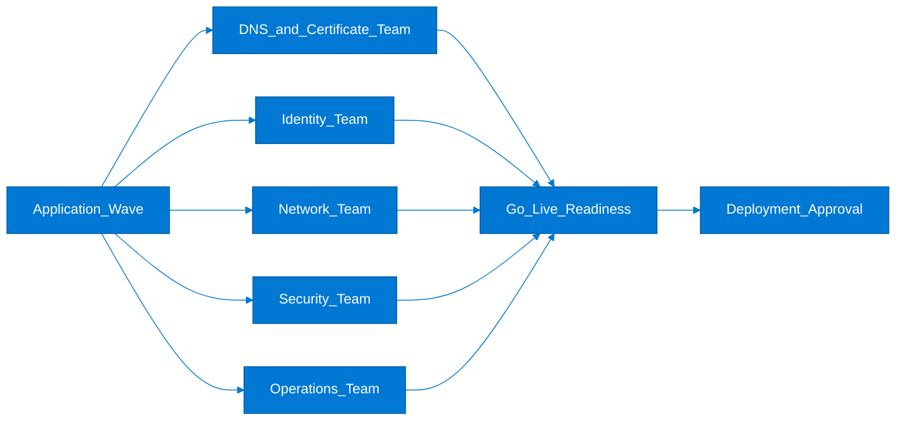

Coordination rules:

1. Every wave should nominate a single dependency manager who owns cross-team status tracking.
2. Shared-service teams should publish standard lead times so application plans are realistic.
3. Unplanned dependency discoveries should be recorded as reusable platform backlog items, not hidden in project notes.
4. If a shared dependency slips, architects should re-sequence lower-risk workloads rather than waiting idly.

### 8.32 Enterprise architecture scorecard

| Metric | Definition | Target direction | Review cadence |
|---|---|---|---|
| Subscription onboarding lead time | Hours from approved request to usable subscription | Down | Monthly |
| Baseline compliance coverage | Percentage of subscriptions inheriting mandatory initiatives | Up | Monthly |
| Diagnostic settings coverage | Percentage of critical resources sending logs centrally | Up | Monthly |
| Tag completeness | Percentage of production resources with required tags | Up | Weekly |
| Cost forecast accuracy | Variance between forecast and actual spend | Down | Monthly |
| Exception age | Average age of open policy exceptions | Down | Monthly |
| DR exercise completion | Percentage of critical apps tested in period | Up | Quarterly |
| Mean time to onboard application team | Days from kickoff to platform readiness | Down | Monthly |
| Deployment success rate | Percentage of production deployments without rollback | Up | Monthly |
| Security backlog burn-down | Rate of high-severity findings closed | Up | Monthly |
| Shared-service incident recurrence | Repeat incidents caused by platform components | Down | Monthly |
| Reserved capacity coverage | Share of steady-state compute covered by commitments | Up | Monthly |

### 8.33 Ninety-day governance calendar

| Timeframe | Primary activity | Expected outcome |
|---|---|---|
| Week 1 | Confirm executive sponsors and approve architecture board charter | Decision rights and escalation path agreed |
| Week 2 | Validate management groups, subscription taxonomy, and policy inheritance | Platform hierarchy approved |
| Week 3 | Review identity baseline and privileged access model | Admin model approved |
| Week 4 | Review network topology, IP plan, and private access standards | Network baseline approved |
| Week 5 | Review monitoring baseline and operational support model | Operations ready for pilot workloads |
| Week 6 | Review first migration wave architecture packs | Wave 1 design sign-off |
| Week 7 | Validate cost tags, budgets, and showback dashboards | FinOps controls operational |
| Week 8 | Review resilience and DR designs for critical applications | DR backlog prioritized |
| Week 9 | Audit policy exceptions and remediation progress | Drift controlled |
| Week 10 | Review second-wave shared services and integration dependencies | Shared-service readiness confirmed |
| Week 11 | Hold production readiness review for initial go-live workloads | Go-live decision made |
| Week 12 | Run lessons-learned session and update reference patterns | Standards improved for future waves |

### 8.34 Closing guidance for enterprise architects

- Treat enterprise architecture as an operating rhythm, not a one-time design artifact.
- Make landing zone patterns easy to consume so product teams do not create shadow platforms.
- Tie every Azure design choice back to business outcomes, control obligations, and measurable operating improvements.
- Prefer evidence-generating automation over manual review steps whenever possible.
- Revisit foundational decisions whenever the application count, regulatory scope, or regional footprint changes materially.
- Keep the Microsoft Learn references current in your internal standards library so implementation teams work from authoritative guidance.

Additional Microsoft Learn references:

- [Cloud Adoption Framework for Azure](https://learn.microsoft.com/en-us/azure/cloud-adoption-framework/)
- [Azure enterprise-scale landing zones](https://learn.microsoft.com/en-us/azure/cloud-adoption-framework/ready/enterprise-scale/)
- [Azure Well-Architected Framework reliability guidance](https://learn.microsoft.com/en-us/azure/well-architected/reliability/)
- [Azure Well-Architected Framework cost optimization guidance](https://learn.microsoft.com/en-us/azure/well-architected/cost-optimization/)
- [Azure architecture best practices](https://learn.microsoft.com/en-us/azure/architecture/best-practices/)

### 8.35 Enterprise review prompts by delivery stage

Use stage-specific prompts to keep architecture reviews relevant to the maturity of each application or shared platform component.

#### Discovery stage prompts

- Which business capability will be affected if the Azure initiative is delayed by one quarter?
- Which legacy constraints are genuinely immovable and which are assumptions that should be challenged?
- What evidence exists that the current application demand justifies platform investment beyond a single project?
- Which shared services will be needed by at least three workloads and therefore deserve early standardization?
- Which application owners are prepared to adopt platform standards without bespoke exceptions?
- Which regulatory obligations drive design choices from day one rather than later phases?
- What skills gaps exist across networking, security, operations, and application teams?
- Which dependencies on datacenter hardware, contracts, or licensing affect migration sequencing?
- What failure scenarios would executives consider unacceptable even during pilot migration?
- Which KPIs will confirm that the initiative improved agility, resilience, or cost control?

#### Design stage prompts

- Does the proposed subscription structure align to ownership, cost accountability, and control boundaries?
- Are region, availability zone, and service-tier choices consistent with business continuity requirements?
- Do all internet-exposed paths pass through approved ingress and inspection controls?
- Are private endpoint, DNS, and certificate dependencies explicitly documented?
- Does the identity pattern eliminate unnecessary secrets and standing privilege?
- Are diagnostics, alerts, and retention settings defined as reusable templates?
- Have service quotas, naming conventions, and deployment dependencies been validated?
- Which design elements intentionally trade higher cost for lower risk, and who approved that trade-off?
- Which policy initiatives will enforce the intended guardrails automatically?
- What design assumptions depend on future platform backlog items that are not yet delivered?

#### Build stage prompts

- Are infrastructure modules versioned and promoted through environments with the same rigor as application code?
- Has the team proven that templates deploy successfully in subscriptions that inherit full policy baselines?
- Are role assignments created through automation rather than manual portal actions?
- Is configuration drift detection in place for critical resources?
- Are deployment pipelines isolated from production runtime privileges?
- Has the team tested certificate rotation, secret rotation, and rollback procedures?
- Do monitoring dashboards and alerts exist before production traffic is enabled?
- Has the support team reviewed runbooks and operational dependencies?
- Are backup and restore jobs configured and verified in the build stage where possible?
- Which unresolved findings must be accepted formally before go-live?

#### Go-live stage prompts

- Is there a named executive decision-maker for cutover, rollback, and customer communication?
- Has the change freeze window been coordinated across application, network, identity, and service desk teams?
- Are action groups, on-call schedules, and escalation paths active for the exact production environment?
- Have synthetic tests and health probes been validated against production endpoints?
- Is the DNS and certificate plan ready for cutover timing and rollback timing?
- Have business owners approved the residual risk and known exception list?
- Are cost budgets, anomaly alerts, and tagging checks active from day one?
- Has a major incident bridge process been prepared for hypercare?
- Are partner, vendor, and downstream dependency contacts available during the cutover window?
- What objective signal defines a successful cutover versus a triggered rollback?

#### Operate and optimize stage prompts

- Are policy exceptions closing on schedule or becoming permanent debt?
- Which recurring incidents indicate a platform pattern needs redesign?
- Are cost optimization actions being pushed back into template defaults and service catalogs?
- Which new business capabilities can now be onboarded faster because of the standard platform?
- Are DR exercises, access reviews, and control attestations occurring at the committed cadence?
- Has telemetry growth changed the cost model for logging and retention?
- Which shared services are reaching scale limits and require capacity planning?
- Are application teams asking for the standard patterns because they are useful, or avoiding them because they are too rigid?
- Which metrics demonstrate that architecture governance is improving outcomes rather than slowing delivery?
- What platform backlog items should be prioritized for the next quarter based on operational evidence?

### 8.36 Runbook acceptance criteria for enterprise workloads

| Runbook type | Minimum content | Owner | Acceptance signal |
|---|---|---|---|
| Service restart | Preconditions, safe restart order, verification checks | Application operations | Restart tested in non-production |
| Dependency outage | Upstream system impact, fallback behavior, communication path | Service owner | Tabletop exercise completed |
| Secret rotation | Rotation schedule, rollback, validation steps | Security engineering | Rotation performed successfully |
| Certificate renewal | Issuance, deployment, DNS dependencies, expiry alerts | Platform security | Renewal rehearsal completed |
| Scale-out event | Triggers, thresholds, quota checks, rollback | Platform or app team | Load test validated thresholds |
| Region failover | Decision authority, sequencing, failback, customer communications | Business continuity owner | DR exercise passed |
| Data restore | Restore source, target validation, business reconciliation | Data operations | Restore within RTO target |
| Pipeline failure | Artifact traceability, rollback, approval contacts | DevOps owner | Failed deployment drill completed |
| Security incident | Containment, evidence capture, escalation, legal contacts | SOC lead | Incident response playbook approved |
| Cost anomaly | Triage flow, owner notification, immediate controls | FinOps lead | Anomaly alert routed and tested |

Runbook review checklist:

1. Confirm every production workload has runbooks for both technical recovery and business communication.
2. Confirm runbooks name owners rather than generic teams.
3. Confirm steps reference current Azure resource names, subscription IDs, and monitoring locations.
4. Confirm runbooks specify when automation is safe and when manual approval is required.
5. Confirm validation steps prove service health, not just infrastructure status.
6. Confirm evidence from rehearsal exercises is retained with the architecture pack.
7. Confirm the service desk knows where runbooks are stored and how to escalate quickly.
8. Confirm platform changes that alter topology trigger runbook updates automatically.
9. Confirm runbooks are tested at a cadence aligned to workload criticality.
10. Confirm post-incident actions update both the runbook and the reusable platform pattern where relevant.

Reference CLI snippets for runbook verification:

```azurecli
az monitor metrics list --resource "/subscriptions/00000000-0000-0000-0000-000000000000/resourceGroups/rg-retail-prod/providers/Microsoft.Web/sites/app-retail-prod" --metric Requests --interval PT5M
az monitor activity-log list --offset 7d --status Failed --max-events 20 --output table
az network watcher test-connectivity --source-resource app-retail-prod --dest-address sql-retail-prod.database.windows.net --dest-port 1433
az backup job list --status Completed --output table
az resource list --tag Application=RetailWeb --query "[].{name:name,type:type,group:resourceGroup}" --output table
```

Final architect note: enterprise planning quality improves when reference patterns, evidence checks, and operational runbooks are reviewed together rather than in isolated forums.
