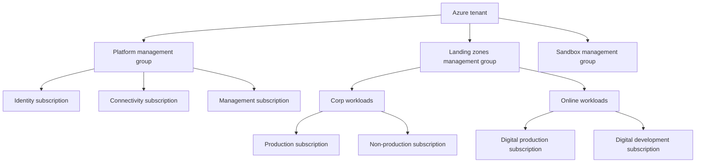

# Azure Landing Zone Setup Guide

## What is a Landing Zone?

An Azure Landing Zone is a pre-governed target operating model for subscriptions, identity, networking, policy, logging, and security.
It gives platform teams a repeatable place to host workloads without redesigning guardrails for every project.
Use a Landing Zone when you need consistent resource organization, least-privilege access, shared connectivity, and centralized observability.
Without it, teams usually end up with inconsistent virtual networks, duplicated security controls, and weak subscription boundaries.

## Why it is needed

- Separate platform controls from workload delivery so application teams can move faster.
- Apply Azure Policy, RBAC, tags, and cost controls at scale through management groups.
- Standardize shared services such as DNS, firewalls, VPN/ExpressRoute, and monitoring.
- Limit blast radius by isolating workloads into dedicated subscriptions and spokes.
- Support future growth, mergers, region expansion, and regulatory requirements without re-architecture.

## Management Group hierarchy



## Reference build sequence

### Step 1: Create management groups

Why this choice: Management groups let you apply policy, RBAC, and governance before teams deploy resources.

```bash
az account management-group create --name platform --display-name "Platform"
az account management-group create --name landingzones --display-name "Landing Zones"
az account management-group create --name sandbox --display-name "Sandbox"
az account management-group create --name corp --display-name "Corp" --parent landingzones
az account management-group create --name online --display-name "Online" --parent landingzones
```

- Start with a small hierarchy and expand only when you have a clear operating reason.
- Keep shared platform subscriptions out of workload groups so guardrails remain distinct.
- Reserve sandbox for experimentation and looser policy sets.

Implementation notes:
- Record naming conventions, tags, regions, and responsible owners during step 1.
- Capture change windows and rollback actions before running the step 1 commands in production.
- Validate route tables, DNS flow, and RBAC inheritance immediately after step 1.

### Step 2: Create subscriptions

Why this choice: Subscriptions separate billing, quotas, and security boundaries for platform and workload services.

```bash
az billing account list --output table
az account alias create --name connectivity-sub --billing-scope <billingScope> --display-name "Connectivity"
az account alias create --name management-sub --billing-scope <billingScope> --display-name "Management"
az account alias create --name identity-sub --billing-scope <billingScope> --display-name "Identity"
az account management-group subscription add --name platform --subscription <connectivitySubscriptionId>
az account management-group subscription add --name platform --subscription <managementSubscriptionId>
```

- Use separate subscriptions for platform services to simplify quotas, policy assignment, and break-glass recovery.
- Put production and non-production workloads in different subscriptions to reduce blast radius.

Implementation notes:
- Record naming conventions, tags, regions, and responsible owners during step 2.
- Capture change windows and rollback actions before running the step 2 commands in production.
- Validate route tables, DNS flow, and RBAC inheritance immediately after step 2.

### Step 3: Build hub VNet

Why this choice: The hub centralizes shared network services, inspection, and private name resolution.

```bash
az group create --name rg-connectivity-hub --location eastus
az network vnet create --resource-group rg-connectivity-hub --name vnet-hub-eastus --location eastus --address-prefixes 10.0.0.0/16 --subnet-name AzureFirewallSubnet --subnet-prefixes 10.0.0.0/24
az network vnet subnet create --resource-group rg-connectivity-hub --vnet-name vnet-hub-eastus --name GatewaySubnet --address-prefixes 10.0.1.0/24
az network vnet subnet create --resource-group rg-connectivity-hub --vnet-name vnet-hub-eastus --name SharedServices --address-prefixes 10.0.2.0/24
```

- Keep gateway, firewall, and shared services in separate subnets to avoid route conflicts and simplify troubleshooting.
- Plan enough address space for future DNS forwarders, bastion, or connectivity appliances.

Implementation notes:
- Record naming conventions, tags, regions, and responsible owners during step 3.
- Capture change windows and rollback actions before running the step 3 commands in production.
- Validate route tables, DNS flow, and RBAC inheritance immediately after step 3.

### Step 4: Build spoke VNets

Why this choice: Spokes isolate applications and environments while using shared hub capabilities.

```bash
az group create --name rg-spoke-app1-prod --location eastus
az network vnet create --resource-group rg-spoke-app1-prod --name vnet-app1-prod --location eastus --address-prefixes 10.10.0.0/16 --subnet-name snet-app --subnet-prefixes 10.10.1.0/24
az network vnet subnet create --resource-group rg-spoke-app1-prod --vnet-name vnet-app1-prod --name snet-data --address-prefixes 10.10.2.0/24
```

- Give each workload its own address range to avoid future overlap with peering, VPN, and mergers.
- Separate app and data subnets to apply more specific NSG, UDR, and private endpoint controls.

Implementation notes:
- Record naming conventions, tags, regions, and responsible owners during step 4.
- Capture change windows and rollback actions before running the step 4 commands in production.
- Validate route tables, DNS flow, and RBAC inheritance immediately after step 4.

### Step 5: Configure peering

Why this choice: Peering provides low-latency private routing between hub and spoke networks.

```bash
az network vnet peering create --resource-group rg-connectivity-hub --vnet-name vnet-hub-eastus --name hub-to-app1-prod --remote-vnet /subscriptions/<spokeSub>/resourceGroups/rg-spoke-app1-prod/providers/Microsoft.Network/virtualNetworks/vnet-app1-prod --allow-vnet-access --allow-forwarded-traffic
az network vnet peering create --resource-group rg-spoke-app1-prod --vnet-name vnet-app1-prod --name app1-prod-to-hub --remote-vnet /subscriptions/<hubSub>/resourceGroups/rg-connectivity-hub/providers/Microsoft.Network/virtualNetworks/vnet-hub-eastus --allow-vnet-access --use-remote-gateways
```

- Use bidirectional peering and document whether gateway transit is enabled.
- Allow forwarded traffic when traffic inspection through the hub firewall is part of the design.

Implementation notes:
- Record naming conventions, tags, regions, and responsible owners during step 5.
- Capture change windows and rollback actions before running the step 5 commands in production.
- Validate route tables, DNS flow, and RBAC inheritance immediately after step 5.

### Step 6: Deploy Azure Firewall

Why this choice: A managed firewall reduces operational burden compared with patching and scaling NVAs.

```bash
az network public-ip create --resource-group rg-connectivity-hub --name pip-azfw-eastus --sku Standard --location eastus
az network firewall create --resource-group rg-connectivity-hub --name azfw-hub-eastus --location eastus
az network firewall ip-config create --resource-group rg-connectivity-hub --firewall-name azfw-hub-eastus --name azfw-ipcfg --public-ip-address pip-azfw-eastus --vnet-name vnet-hub-eastus
az network firewall network-rule create --collection-name core-network --firewall-name azfw-hub-eastus --resource-group rg-connectivity-hub --name allow-dns --protocols UDP TCP --source-addresses 10.0.0.0/8 --destination-addresses 168.63.129.16 --destination-ports 53 --action Allow --priority 100
```

- Azure Firewall integrates with policy, availability zones, and managed updates.
- Start with required egress only; expand from measured application needs rather than broad allow rules.

Implementation notes:
- Record naming conventions, tags, regions, and responsible owners during step 6.
- Capture change windows and rollback actions before running the step 6 commands in production.
- Validate route tables, DNS flow, and RBAC inheritance immediately after step 6.

### Step 7: Configure Private DNS

Why this choice: Private DNS zones keep private endpoint and service name resolution consistent.

```bash
az network private-dns zone create --resource-group rg-connectivity-hub --name privatelink.database.windows.net
az network private-dns link vnet create --resource-group rg-connectivity-hub --zone-name privatelink.database.windows.net --name link-hub-sql --virtual-network /subscriptions/<hubSub>/resourceGroups/rg-connectivity-hub/providers/Microsoft.Network/virtualNetworks/vnet-hub-eastus --registration-enabled false
az network private-dns link vnet create --resource-group rg-connectivity-hub --zone-name privatelink.database.windows.net --name link-app1-sql --virtual-network /subscriptions/<spokeSub>/resourceGroups/rg-spoke-app1-prod/providers/Microsoft.Network/virtualNetworks/vnet-app1-prod --registration-enabled false
```

- Host private DNS centrally in the connectivity subscription so all spokes resolve the same private endpoints.
- Use explicit zone naming based on Azure Private Link conventions to avoid split-brain DNS issues.

Implementation notes:
- Record naming conventions, tags, regions, and responsible owners during step 7.
- Capture change windows and rollback actions before running the step 7 commands in production.
- Validate route tables, DNS flow, and RBAC inheritance immediately after step 7.

### Step 8: Assign Azure Policy

Why this choice: Policy enforces allowed locations, SKUs, tags, diagnostics, and security baselines.

```bash
az policy assignment create --name require-tags --display-name "Require cost center tag" --policy /providers/Microsoft.Authorization/policyDefinitions/<policyId> --scope /providers/Microsoft.Management/managementGroups/landingzones
az policy assignment create --name deploy-diag --display-name "Deploy diagnostics" --policy-set-definition /providers/Microsoft.Authorization/policySetDefinitions/<initiativeId> --scope /providers/Microsoft.Management/managementGroups/platform
```

- Assign policies at management group scope for consistency, then use exemptions for approved exceptions.
- Prefer initiatives for security baselines so remediation and reporting stay grouped.

Implementation notes:
- Record naming conventions, tags, regions, and responsible owners during step 8.
- Capture change windows and rollback actions before running the step 8 commands in production.
- Validate route tables, DNS flow, and RBAC inheritance immediately after step 8.

### Step 9: Set RBAC model

Why this choice: RBAC ensures platform teams, security teams, and app teams get only the access they need.

```bash
az role assignment create --assignee <platformOpsGroupObjectId> --role Contributor --scope /subscriptions/<connectivitySubscriptionId>
az role assignment create --assignee <securityTeamGroupObjectId> --role "Security Admin" --scope /providers/Microsoft.Management/managementGroups/platform
az role assignment create --assignee <appTeamGroupObjectId> --role Contributor --scope /subscriptions/<workloadSubscriptionId>/resourceGroups/rg-spoke-app1-prod
```

- Assign roles to Entra ID groups, not individuals, to simplify lifecycle management and audits.
- Keep broad roles at the lowest practical scope and reserve Owner for a tiny break-glass set.

Implementation notes:
- Record naming conventions, tags, regions, and responsible owners during step 9.
- Capture change windows and rollback actions before running the step 9 commands in production.
- Validate route tables, DNS flow, and RBAC inheritance immediately after step 9.

### Step 10: Enable monitoring

Why this choice: Centralized logs and metrics make platform health, drift detection, and incident response possible.

```bash
az monitor log-analytics workspace create --resource-group rg-management-ops --workspace-name law-platform-eastus --location eastus
az monitor diagnostic-settings create --name send-to-law --resource /subscriptions/<hubSub>/resourceGroups/rg-connectivity-hub/providers/Microsoft.Network/azureFirewalls/azfw-hub-eastus --workspace /subscriptions/<mgmtSub>/resourceGroups/rg-management-ops/providers/Microsoft.OperationalInsights/workspaces/law-platform-eastus --logs "[{"category":"AzureFirewallApplicationRule","enabled":true}]" --metrics "[{"category":"AllMetrics","enabled":true}]"
az monitor action-group create --resource-group rg-management-ops --name ag-platform-ops --short-name platops
```

- Central monitoring enables correlation across subscriptions and network tiers.
- Forward activity logs, diagnostic logs, and key platform metrics before onboarding workloads.

Implementation notes:
- Record naming conventions, tags, regions, and responsible owners during step 10.
- Capture change windows and rollback actions before running the step 10 commands in production.
- Validate route tables, DNS flow, and RBAC inheritance immediately after step 10.

## Decision table: single vs multi-subscription

| Option | When to choose | Why | Watch-outs |
| --- | --- | --- | --- |
| Single subscription | Small proof of concept, one team, low compliance burden | Fastest setup and lowest admin overhead | Weak isolation, quota contention, shared blast radius |
| Multi-subscription | Multiple teams, prod vs non-prod split, regulated workloads, shared platform team | Better governance, billing split, RBAC isolation, quota separation | Requires management group design and automation discipline |

## Decision table: hub-spoke vs Virtual WAN

| Option | When to choose | Why | Watch-outs |
| --- | --- | --- | --- |
| Hub-spoke | Predictable regional topology, custom routing, shared firewall, moderate scale | Strong control over routes, DNS, inspection, and peering | More platform engineering effort |
| Azure Virtual WAN | Large global footprint, many branches, simplified SD-WAN/VPN connectivity | Managed transit and branch connectivity at scale | Less granular control for bespoke routing patterns |

## Decision table: Azure Firewall vs NVA

| Option | When to choose | Why | Watch-outs |
| --- | --- | --- | --- |
| Azure Firewall | Default choice for cloud-native platform teams | Managed updates, autoscaling, policy integration, zone support | Premium features add cost |
| NVA | Existing vendor requirement, advanced feature dependency, established operations team | Reuse specialized capabilities and staff experience | Patch, scale, high availability, and upgrades are your responsibility |

## Microsoft Learn references

- [Azure landing zones](https://learn.microsoft.com/azure/cloud-adoption-framework/ready/landing-zone/)
- [Management groups](https://learn.microsoft.com/azure/governance/management-groups/overview)
- [Azure Policy](https://learn.microsoft.com/azure/governance/policy/overview)
- [Hub-spoke topology](https://learn.microsoft.com/azure/architecture/networking/architecture/hub-spoke)
- [Azure Firewall](https://learn.microsoft.com/azure/firewall/overview)
- [Private DNS](https://learn.microsoft.com/azure/dns/private-dns-overview)

## Operational checklist

- Confirm tenant root governance ownership and emergency access accounts.
- Define naming standards for management groups, subscriptions, VNets, subnets, and firewall policy objects.
- Approve IP addressing plan for current and future regions.
- Document DNS ownership, forwarding, and private endpoint zone strategy.
- Set baseline policy initiatives for tags, allowed locations, diagnostics, and security standards.
- Decide on centralized versus delegated RBAC administration.
- Enable cost management and mandatory tags before workload onboarding.
- Run a workload onboarding pilot in non-production before broad rollout.

### Landing zone review item 1

- Confirm scope, ownership, and rollback steps for landing zone review item 1.
- Capture the az command output in change records so auditors can trace decision 1.
- Revisit naming, tags, and RBAC boundaries before promoting to production wave 1.
- Validate dependencies, DNS paths, routing, and policy assignments after milestone 1.

### Landing zone review item 2

- Confirm scope, ownership, and rollback steps for landing zone review item 2.
- Capture the az command output in change records so auditors can trace decision 2.
- Revisit naming, tags, and RBAC boundaries before promoting to production wave 2.
- Validate dependencies, DNS paths, routing, and policy assignments after milestone 2.

### Landing zone review item 3

- Confirm scope, ownership, and rollback steps for landing zone review item 3.
- Capture the az command output in change records so auditors can trace decision 3.
- Revisit naming, tags, and RBAC boundaries before promoting to production wave 3.
- Validate dependencies, DNS paths, routing, and policy assignments after milestone 3.

### Landing zone review item 4

- Confirm scope, ownership, and rollback steps for landing zone review item 4.
- Capture the az command output in change records so auditors can trace decision 4.
- Revisit naming, tags, and RBAC boundaries before promoting to production wave 4.
- Validate dependencies, DNS paths, routing, and policy assignments after milestone 4.

### Landing zone review item 5

- Confirm scope, ownership, and rollback steps for landing zone review item 5.
- Capture the az command output in change records so auditors can trace decision 5.
- Revisit naming, tags, and RBAC boundaries before promoting to production wave 5.
- Validate dependencies, DNS paths, routing, and policy assignments after milestone 5.

### Landing zone review item 6

- Confirm scope, ownership, and rollback steps for landing zone review item 6.
- Capture the az command output in change records so auditors can trace decision 6.
- Revisit naming, tags, and RBAC boundaries before promoting to production wave 6.
- Validate dependencies, DNS paths, routing, and policy assignments after milestone 6.

### Landing zone review item 7

- Confirm scope, ownership, and rollback steps for landing zone review item 7.
- Capture the az command output in change records so auditors can trace decision 7.
- Revisit naming, tags, and RBAC boundaries before promoting to production wave 7.
- Validate dependencies, DNS paths, routing, and policy assignments after milestone 7.

### Landing zone review item 8

- Confirm scope, ownership, and rollback steps for landing zone review item 8.
- Capture the az command output in change records so auditors can trace decision 8.
- Revisit naming, tags, and RBAC boundaries before promoting to production wave 8.
- Validate dependencies, DNS paths, routing, and policy assignments after milestone 8.

### Landing zone review item 9

- Confirm scope, ownership, and rollback steps for landing zone review item 9.
- Capture the az command output in change records so auditors can trace decision 9.
- Revisit naming, tags, and RBAC boundaries before promoting to production wave 9.
- Validate dependencies, DNS paths, routing, and policy assignments after milestone 9.

### Landing zone review item 10

- Confirm scope, ownership, and rollback steps for landing zone review item 10.
- Capture the az command output in change records so auditors can trace decision 10.
- Revisit naming, tags, and RBAC boundaries before promoting to production wave 10.
- Validate dependencies, DNS paths, routing, and policy assignments after milestone 10.

### Landing zone review item 11

- Confirm scope, ownership, and rollback steps for landing zone review item 11.
- Capture the az command output in change records so auditors can trace decision 11.
- Revisit naming, tags, and RBAC boundaries before promoting to production wave 11.
- Validate dependencies, DNS paths, routing, and policy assignments after milestone 11.

### Landing zone review item 12

- Confirm scope, ownership, and rollback steps for landing zone review item 12.
- Capture the az command output in change records so auditors can trace decision 12.
- Revisit naming, tags, and RBAC boundaries before promoting to production wave 12.
- Validate dependencies, DNS paths, routing, and policy assignments after milestone 12.

### Landing zone review item 13

- Confirm scope, ownership, and rollback steps for landing zone review item 13.
- Capture the az command output in change records so auditors can trace decision 13.
- Revisit naming, tags, and RBAC boundaries before promoting to production wave 13.
- Validate dependencies, DNS paths, routing, and policy assignments after milestone 13.

### Landing zone review item 14

- Confirm scope, ownership, and rollback steps for landing zone review item 14.
- Capture the az command output in change records so auditors can trace decision 14.
- Revisit naming, tags, and RBAC boundaries before promoting to production wave 14.
- Validate dependencies, DNS paths, routing, and policy assignments after milestone 14.

### Landing zone review item 15

- Confirm scope, ownership, and rollback steps for landing zone review item 15.
- Capture the az command output in change records so auditors can trace decision 15.
- Revisit naming, tags, and RBAC boundaries before promoting to production wave 15.
- Validate dependencies, DNS paths, routing, and policy assignments after milestone 15.

### Landing zone review item 16

- Confirm scope, ownership, and rollback steps for landing zone review item 16.
- Capture the az command output in change records so auditors can trace decision 16.
- Revisit naming, tags, and RBAC boundaries before promoting to production wave 16.
- Validate dependencies, DNS paths, routing, and policy assignments after milestone 16.

### Landing zone review item 17

- Confirm scope, ownership, and rollback steps for landing zone review item 17.
- Capture the az command output in change records so auditors can trace decision 17.
- Revisit naming, tags, and RBAC boundaries before promoting to production wave 17.
- Validate dependencies, DNS paths, routing, and policy assignments after milestone 17.

### Landing zone review item 18

- Confirm scope, ownership, and rollback steps for landing zone review item 18.
- Capture the az command output in change records so auditors can trace decision 18.
- Revisit naming, tags, and RBAC boundaries before promoting to production wave 18.
- Validate dependencies, DNS paths, routing, and policy assignments after milestone 18.

### Landing zone review item 19

- Confirm scope, ownership, and rollback steps for landing zone review item 19.
- Capture the az command output in change records so auditors can trace decision 19.
- Revisit naming, tags, and RBAC boundaries before promoting to production wave 19.
- Validate dependencies, DNS paths, routing, and policy assignments after milestone 19.

### Landing zone review item 20

- Confirm scope, ownership, and rollback steps for landing zone review item 20.
- Capture the az command output in change records so auditors can trace decision 20.
- Revisit naming, tags, and RBAC boundaries before promoting to production wave 20.
- Validate dependencies, DNS paths, routing, and policy assignments after milestone 20.

### Landing zone review item 21

- Confirm scope, ownership, and rollback steps for landing zone review item 21.
- Capture the az command output in change records so auditors can trace decision 21.
- Revisit naming, tags, and RBAC boundaries before promoting to production wave 21.
- Validate dependencies, DNS paths, routing, and policy assignments after milestone 21.

### Landing zone review item 22

- Confirm scope, ownership, and rollback steps for landing zone review item 22.
- Capture the az command output in change records so auditors can trace decision 22.
- Revisit naming, tags, and RBAC boundaries before promoting to production wave 22.
- Validate dependencies, DNS paths, routing, and policy assignments after milestone 22.

### Landing zone review item 23

- Confirm scope, ownership, and rollback steps for landing zone review item 23.
- Capture the az command output in change records so auditors can trace decision 23.
- Revisit naming, tags, and RBAC boundaries before promoting to production wave 23.
- Validate dependencies, DNS paths, routing, and policy assignments after milestone 23.

### Landing zone review item 24

- Confirm scope, ownership, and rollback steps for landing zone review item 24.
- Capture the az command output in change records so auditors can trace decision 24.
- Revisit naming, tags, and RBAC boundaries before promoting to production wave 24.
- Validate dependencies, DNS paths, routing, and policy assignments after milestone 24.

### Landing zone review item 25

- Confirm scope, ownership, and rollback steps for landing zone review item 25.
- Capture the az command output in change records so auditors can trace decision 25.
- Revisit naming, tags, and RBAC boundaries before promoting to production wave 25.
- Validate dependencies, DNS paths, routing, and policy assignments after milestone 25.

### Landing zone review item 26

- Confirm scope, ownership, and rollback steps for landing zone review item 26.
- Capture the az command output in change records so auditors can trace decision 26.
- Revisit naming, tags, and RBAC boundaries before promoting to production wave 26.
- Validate dependencies, DNS paths, routing, and policy assignments after milestone 26.

### Landing zone review item 27

- Confirm scope, ownership, and rollback steps for landing zone review item 27.
- Capture the az command output in change records so auditors can trace decision 27.
- Revisit naming, tags, and RBAC boundaries before promoting to production wave 27.
- Validate dependencies, DNS paths, routing, and policy assignments after milestone 27.

### Landing zone review item 28

- Confirm scope, ownership, and rollback steps for landing zone review item 28.
- Capture the az command output in change records so auditors can trace decision 28.
- Revisit naming, tags, and RBAC boundaries before promoting to production wave 28.
- Validate dependencies, DNS paths, routing, and policy assignments after milestone 28.

### Landing zone review item 29

- Confirm scope, ownership, and rollback steps for landing zone review item 29.
- Capture the az command output in change records so auditors can trace decision 29.
- Revisit naming, tags, and RBAC boundaries before promoting to production wave 29.
- Validate dependencies, DNS paths, routing, and policy assignments after milestone 29.

### Landing zone review item 30

- Confirm scope, ownership, and rollback steps for landing zone review item 30.
- Capture the az command output in change records so auditors can trace decision 30.
- Revisit naming, tags, and RBAC boundaries before promoting to production wave 30.
- Validate dependencies, DNS paths, routing, and policy assignments after milestone 30.

### Landing zone review item 31

- Confirm scope, ownership, and rollback steps for landing zone review item 31.
- Capture the az command output in change records so auditors can trace decision 31.
- Revisit naming, tags, and RBAC boundaries before promoting to production wave 31.
- Validate dependencies, DNS paths, routing, and policy assignments after milestone 31.

### Landing zone review item 32

- Confirm scope, ownership, and rollback steps for landing zone review item 32.
- Capture the az command output in change records so auditors can trace decision 32.
- Revisit naming, tags, and RBAC boundaries before promoting to production wave 32.
- Validate dependencies, DNS paths, routing, and policy assignments after milestone 32.

### Landing zone review item 33

- Confirm scope, ownership, and rollback steps for landing zone review item 33.
- Capture the az command output in change records so auditors can trace decision 33.
- Revisit naming, tags, and RBAC boundaries before promoting to production wave 33.
- Validate dependencies, DNS paths, routing, and policy assignments after milestone 33.

### Landing zone review item 34

- Confirm scope, ownership, and rollback steps for landing zone review item 34.
- Capture the az command output in change records so auditors can trace decision 34.
- Revisit naming, tags, and RBAC boundaries before promoting to production wave 34.
- Validate dependencies, DNS paths, routing, and policy assignments after milestone 34.

### Landing zone review item 35

- Confirm scope, ownership, and rollback steps for landing zone review item 35.
- Capture the az command output in change records so auditors can trace decision 35.
- Revisit naming, tags, and RBAC boundaries before promoting to production wave 35.
- Validate dependencies, DNS paths, routing, and policy assignments after milestone 35.

### Landing zone review item 36

- Confirm scope, ownership, and rollback steps for landing zone review item 36.
- Capture the az command output in change records so auditors can trace decision 36.
- Revisit naming, tags, and RBAC boundaries before promoting to production wave 36.
- Validate dependencies, DNS paths, routing, and policy assignments after milestone 36.

### Landing zone review item 37

- Confirm scope, ownership, and rollback steps for landing zone review item 37.
- Capture the az command output in change records so auditors can trace decision 37.
- Revisit naming, tags, and RBAC boundaries before promoting to production wave 37.
- Validate dependencies, DNS paths, routing, and policy assignments after milestone 37.

### Landing zone review item 38

- Confirm scope, ownership, and rollback steps for landing zone review item 38.
- Capture the az command output in change records so auditors can trace decision 38.
- Revisit naming, tags, and RBAC boundaries before promoting to production wave 38.
- Validate dependencies, DNS paths, routing, and policy assignments after milestone 38.

### Landing zone review item 39

- Confirm scope, ownership, and rollback steps for landing zone review item 39.
- Capture the az command output in change records so auditors can trace decision 39.
- Revisit naming, tags, and RBAC boundaries before promoting to production wave 39.
- Validate dependencies, DNS paths, routing, and policy assignments after milestone 39.

### Landing zone review item 40

- Confirm scope, ownership, and rollback steps for landing zone review item 40.
- Capture the az command output in change records so auditors can trace decision 40.
- Revisit naming, tags, and RBAC boundaries before promoting to production wave 40.
- Validate dependencies, DNS paths, routing, and policy assignments after milestone 40.

### Landing zone review item 41

- Confirm scope, ownership, and rollback steps for landing zone review item 41.
- Capture the az command output in change records so auditors can trace decision 41.
- Revisit naming, tags, and RBAC boundaries before promoting to production wave 41.
- Validate dependencies, DNS paths, routing, and policy assignments after milestone 41.

### Landing zone review item 42

- Confirm scope, ownership, and rollback steps for landing zone review item 42.
- Capture the az command output in change records so auditors can trace decision 42.
- Revisit naming, tags, and RBAC boundaries before promoting to production wave 42.
- Validate dependencies, DNS paths, routing, and policy assignments after milestone 42.

### Landing zone review item 43

- Confirm scope, ownership, and rollback steps for landing zone review item 43.
- Capture the az command output in change records so auditors can trace decision 43.
- Revisit naming, tags, and RBAC boundaries before promoting to production wave 43.
- Validate dependencies, DNS paths, routing, and policy assignments after milestone 43.

### Landing zone review item 44

- Confirm scope, ownership, and rollback steps for landing zone review item 44.
- Capture the az command output in change records so auditors can trace decision 44.
- Revisit naming, tags, and RBAC boundaries before promoting to production wave 44.
- Validate dependencies, DNS paths, routing, and policy assignments after milestone 44.

### Landing zone review item 45

- Confirm scope, ownership, and rollback steps for landing zone review item 45.
- Capture the az command output in change records so auditors can trace decision 45.
- Revisit naming, tags, and RBAC boundaries before promoting to production wave 45.
- Validate dependencies, DNS paths, routing, and policy assignments after milestone 45.

### Landing zone review item 46

- Confirm scope, ownership, and rollback steps for landing zone review item 46.
- Capture the az command output in change records so auditors can trace decision 46.
- Revisit naming, tags, and RBAC boundaries before promoting to production wave 46.
- Validate dependencies, DNS paths, routing, and policy assignments after milestone 46.

### Landing zone review item 47

- Confirm scope, ownership, and rollback steps for landing zone review item 47.
- Capture the az command output in change records so auditors can trace decision 47.
- Revisit naming, tags, and RBAC boundaries before promoting to production wave 47.
- Validate dependencies, DNS paths, routing, and policy assignments after milestone 47.

### Landing zone review item 48

- Confirm scope, ownership, and rollback steps for landing zone review item 48.
- Capture the az command output in change records so auditors can trace decision 48.
- Revisit naming, tags, and RBAC boundaries before promoting to production wave 48.
- Validate dependencies, DNS paths, routing, and policy assignments after milestone 48.

### Landing zone review item 49

- Confirm scope, ownership, and rollback steps for landing zone review item 49.
- Capture the az command output in change records so auditors can trace decision 49.
- Revisit naming, tags, and RBAC boundaries before promoting to production wave 49.
- Validate dependencies, DNS paths, routing, and policy assignments after milestone 49.

### Landing zone review item 50

- Confirm scope, ownership, and rollback steps for landing zone review item 50.
- Capture the az command output in change records so auditors can trace decision 50.
- Revisit naming, tags, and RBAC boundaries before promoting to production wave 50.
- Validate dependencies, DNS paths, routing, and policy assignments after milestone 50.

### Landing zone review item 51

- Confirm scope, ownership, and rollback steps for landing zone review item 51.
- Capture the az command output in change records so auditors can trace decision 51.
- Revisit naming, tags, and RBAC boundaries before promoting to production wave 51.
- Validate dependencies, DNS paths, routing, and policy assignments after milestone 51.

### Landing zone review item 52

- Confirm scope, ownership, and rollback steps for landing zone review item 52.
- Capture the az command output in change records so auditors can trace decision 52.
- Revisit naming, tags, and RBAC boundaries before promoting to production wave 52.
- Validate dependencies, DNS paths, routing, and policy assignments after milestone 52.

### Landing zone review item 53

- Confirm scope, ownership, and rollback steps for landing zone review item 53.
- Capture the az command output in change records so auditors can trace decision 53.
- Revisit naming, tags, and RBAC boundaries before promoting to production wave 53.
- Validate dependencies, DNS paths, routing, and policy assignments after milestone 53.

### Landing zone review item 54

- Confirm scope, ownership, and rollback steps for landing zone review item 54.
- Capture the az command output in change records so auditors can trace decision 54.
- Revisit naming, tags, and RBAC boundaries before promoting to production wave 54.
- Validate dependencies, DNS paths, routing, and policy assignments after milestone 54.

### Landing zone review item 55

- Confirm scope, ownership, and rollback steps for landing zone review item 55.
- Capture the az command output in change records so auditors can trace decision 55.
- Revisit naming, tags, and RBAC boundaries before promoting to production wave 55.
- Validate dependencies, DNS paths, routing, and policy assignments after milestone 55.

### Landing zone review item 56

- Confirm scope, ownership, and rollback steps for landing zone review item 56.
- Capture the az command output in change records so auditors can trace decision 56.
- Revisit naming, tags, and RBAC boundaries before promoting to production wave 56.
- Validate dependencies, DNS paths, routing, and policy assignments after milestone 56.

### Landing zone review item 57

- Confirm scope, ownership, and rollback steps for landing zone review item 57.
- Capture the az command output in change records so auditors can trace decision 57.
- Revisit naming, tags, and RBAC boundaries before promoting to production wave 57.
- Validate dependencies, DNS paths, routing, and policy assignments after milestone 57.

### Landing zone review item 58

- Confirm scope, ownership, and rollback steps for landing zone review item 58.
- Capture the az command output in change records so auditors can trace decision 58.
- Revisit naming, tags, and RBAC boundaries before promoting to production wave 58.
- Validate dependencies, DNS paths, routing, and policy assignments after milestone 58.

### Landing zone review item 59

- Confirm scope, ownership, and rollback steps for landing zone review item 59.
- Capture the az command output in change records so auditors can trace decision 59.
- Revisit naming, tags, and RBAC boundaries before promoting to production wave 59.
- Validate dependencies, DNS paths, routing, and policy assignments after milestone 59.

### Landing zone review item 60

- Confirm scope, ownership, and rollback steps for landing zone review item 60.
- Capture the az command output in change records so auditors can trace decision 60.
- Revisit naming, tags, and RBAC boundaries before promoting to production wave 60.
- Validate dependencies, DNS paths, routing, and policy assignments after milestone 60.

### Landing zone review item 61

- Confirm scope, ownership, and rollback steps for landing zone review item 61.
- Capture the az command output in change records so auditors can trace decision 61.
- Revisit naming, tags, and RBAC boundaries before promoting to production wave 61.
- Validate dependencies, DNS paths, routing, and policy assignments after milestone 61.

### Landing zone review item 62

- Confirm scope, ownership, and rollback steps for landing zone review item 62.
- Capture the az command output in change records so auditors can trace decision 62.
- Revisit naming, tags, and RBAC boundaries before promoting to production wave 62.
- Validate dependencies, DNS paths, routing, and policy assignments after milestone 62.

### Landing zone review item 63

- Confirm scope, ownership, and rollback steps for landing zone review item 63.
- Capture the az command output in change records so auditors can trace decision 63.
- Revisit naming, tags, and RBAC boundaries before promoting to production wave 63.
- Validate dependencies, DNS paths, routing, and policy assignments after milestone 63.

### Landing zone review item 64

- Confirm scope, ownership, and rollback steps for landing zone review item 64.
- Capture the az command output in change records so auditors can trace decision 64.
- Revisit naming, tags, and RBAC boundaries before promoting to production wave 64.
- Validate dependencies, DNS paths, routing, and policy assignments after milestone 64.

### Landing zone review item 65

- Confirm scope, ownership, and rollback steps for landing zone review item 65.
- Capture the az command output in change records so auditors can trace decision 65.
- Revisit naming, tags, and RBAC boundaries before promoting to production wave 65.
- Validate dependencies, DNS paths, routing, and policy assignments after milestone 65.

### Landing zone review item 66

- Confirm scope, ownership, and rollback steps for landing zone review item 66.
- Capture the az command output in change records so auditors can trace decision 66.
- Revisit naming, tags, and RBAC boundaries before promoting to production wave 66.
- Validate dependencies, DNS paths, routing, and policy assignments after milestone 66.

### Landing zone review item 67

- Confirm scope, ownership, and rollback steps for landing zone review item 67.
- Capture the az command output in change records so auditors can trace decision 67.
- Revisit naming, tags, and RBAC boundaries before promoting to production wave 67.
- Validate dependencies, DNS paths, routing, and policy assignments after milestone 67.

### Landing zone review item 68

- Confirm scope, ownership, and rollback steps for landing zone review item 68.
- Capture the az command output in change records so auditors can trace decision 68.
- Revisit naming, tags, and RBAC boundaries before promoting to production wave 68.
- Validate dependencies, DNS paths, routing, and policy assignments after milestone 68.

### Landing zone review item 69

- Confirm scope, ownership, and rollback steps for landing zone review item 69.
- Capture the az command output in change records so auditors can trace decision 69.
- Revisit naming, tags, and RBAC boundaries before promoting to production wave 69.
- Validate dependencies, DNS paths, routing, and policy assignments after milestone 69.

### Landing zone review item 70

- Confirm scope, ownership, and rollback steps for landing zone review item 70.
- Capture the az command output in change records so auditors can trace decision 70.
- Revisit naming, tags, and RBAC boundaries before promoting to production wave 70.
- Validate dependencies, DNS paths, routing, and policy assignments after milestone 70.

### Landing zone review item 71

- Confirm scope, ownership, and rollback steps for landing zone review item 71.
- Capture the az command output in change records so auditors can trace decision 71.
- Revisit naming, tags, and RBAC boundaries before promoting to production wave 71.
- Validate dependencies, DNS paths, routing, and policy assignments after milestone 71.

### Landing zone review item 72

- Confirm scope, ownership, and rollback steps for landing zone review item 72.
- Capture the az command output in change records so auditors can trace decision 72.
- Revisit naming, tags, and RBAC boundaries before promoting to production wave 72.
- Validate dependencies, DNS paths, routing, and policy assignments after milestone 72.

### Landing zone review item 73

- Confirm scope, ownership, and rollback steps for landing zone review item 73.
- Capture the az command output in change records so auditors can trace decision 73.
- Revisit naming, tags, and RBAC boundaries before promoting to production wave 73.
- Validate dependencies, DNS paths, routing, and policy assignments after milestone 73.

### Landing zone review item 74

- Confirm scope, ownership, and rollback steps for landing zone review item 74.
- Capture the az command output in change records so auditors can trace decision 74.
- Revisit naming, tags, and RBAC boundaries before promoting to production wave 74.
- Validate dependencies, DNS paths, routing, and policy assignments after milestone 74.

### Landing zone review item 75

- Confirm scope, ownership, and rollback steps for landing zone review item 75.
- Capture the az command output in change records so auditors can trace decision 75.
- Revisit naming, tags, and RBAC boundaries before promoting to production wave 75.
- Validate dependencies, DNS paths, routing, and policy assignments after milestone 75.

### Landing zone review item 76

- Confirm scope, ownership, and rollback steps for landing zone review item 76.
- Capture the az command output in change records so auditors can trace decision 76.
- Revisit naming, tags, and RBAC boundaries before promoting to production wave 76.
- Validate dependencies, DNS paths, routing, and policy assignments after milestone 76.

### Landing zone review item 77

- Confirm scope, ownership, and rollback steps for landing zone review item 77.
- Capture the az command output in change records so auditors can trace decision 77.
- Revisit naming, tags, and RBAC boundaries before promoting to production wave 77.
- Validate dependencies, DNS paths, routing, and policy assignments after milestone 77.

### Landing zone review item 78

- Confirm scope, ownership, and rollback steps for landing zone review item 78.
- Capture the az command output in change records so auditors can trace decision 78.
- Revisit naming, tags, and RBAC boundaries before promoting to production wave 78.
- Validate dependencies, DNS paths, routing, and policy assignments after milestone 78.

### Landing zone review item 79

- Confirm scope, ownership, and rollback steps for landing zone review item 79.
- Capture the az command output in change records so auditors can trace decision 79.
- Revisit naming, tags, and RBAC boundaries before promoting to production wave 79.
- Validate dependencies, DNS paths, routing, and policy assignments after milestone 79.

### Landing zone review item 80

- Confirm scope, ownership, and rollback steps for landing zone review item 80.
- Capture the az command output in change records so auditors can trace decision 80.
- Revisit naming, tags, and RBAC boundaries before promoting to production wave 80.
- Validate dependencies, DNS paths, routing, and policy assignments after milestone 80.

### Landing zone review item 81

- Confirm scope, ownership, and rollback steps for landing zone review item 81.
- Capture the az command output in change records so auditors can trace decision 81.
- Revisit naming, tags, and RBAC boundaries before promoting to production wave 81.
- Validate dependencies, DNS paths, routing, and policy assignments after milestone 81.

### Landing zone review item 82

- Confirm scope, ownership, and rollback steps for landing zone review item 82.
- Capture the az command output in change records so auditors can trace decision 82.
- Revisit naming, tags, and RBAC boundaries before promoting to production wave 82.
- Validate dependencies, DNS paths, routing, and policy assignments after milestone 82.

### Landing zone review item 83

- Confirm scope, ownership, and rollback steps for landing zone review item 83.
- Capture the az command output in change records so auditors can trace decision 83.
- Revisit naming, tags, and RBAC boundaries before promoting to production wave 83.
- Validate dependencies, DNS paths, routing, and policy assignments after milestone 83.

### Landing zone review item 84

- Confirm scope, ownership, and rollback steps for landing zone review item 84.
- Capture the az command output in change records so auditors can trace decision 84.
- Revisit naming, tags, and RBAC boundaries before promoting to production wave 84.
- Validate dependencies, DNS paths, routing, and policy assignments after milestone 84.

### Landing zone review item 85

- Confirm scope, ownership, and rollback steps for landing zone review item 85.
- Capture the az command output in change records so auditors can trace decision 85.
- Revisit naming, tags, and RBAC boundaries before promoting to production wave 85.
- Validate dependencies, DNS paths, routing, and policy assignments after milestone 85.

### Landing zone review item 86

- Confirm scope, ownership, and rollback steps for landing zone review item 86.
- Capture the az command output in change records so auditors can trace decision 86.
- Revisit naming, tags, and RBAC boundaries before promoting to production wave 86.
- Validate dependencies, DNS paths, routing, and policy assignments after milestone 86.

### Landing zone review item 87

- Confirm scope, ownership, and rollback steps for landing zone review item 87.
- Capture the az command output in change records so auditors can trace decision 87.
- Revisit naming, tags, and RBAC boundaries before promoting to production wave 87.
- Validate dependencies, DNS paths, routing, and policy assignments after milestone 87.

### Landing zone review item 88

- Confirm scope, ownership, and rollback steps for landing zone review item 88.
- Capture the az command output in change records so auditors can trace decision 88.
- Revisit naming, tags, and RBAC boundaries before promoting to production wave 88.
- Validate dependencies, DNS paths, routing, and policy assignments after milestone 88.

### Landing zone review item 89

- Confirm scope, ownership, and rollback steps for landing zone review item 89.
- Capture the az command output in change records so auditors can trace decision 89.
- Revisit naming, tags, and RBAC boundaries before promoting to production wave 89.
- Validate dependencies, DNS paths, routing, and policy assignments after milestone 89.

### Landing zone review item 90

- Confirm scope, ownership, and rollback steps for landing zone review item 90.
- Capture the az command output in change records so auditors can trace decision 90.
- Revisit naming, tags, and RBAC boundaries before promoting to production wave 90.
- Validate dependencies, DNS paths, routing, and policy assignments after milestone 90.

### Landing zone review item 91

- Confirm scope, ownership, and rollback steps for landing zone review item 91.
- Capture the az command output in change records so auditors can trace decision 91.
- Revisit naming, tags, and RBAC boundaries before promoting to production wave 91.
- Validate dependencies, DNS paths, routing, and policy assignments after milestone 91.
