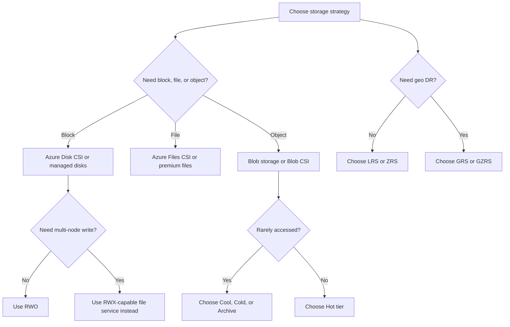

# Storage Classes and Data Strategy

## Storage account types

| Type | When to choose | Why | Watch-outs |
| --- | --- | --- | --- |
| Standard HDD-backed | General purpose blobs, files, queues, tables, backup, logs | Lowest cost and broadest flexibility | Higher latency than premium |
| Premium SSD-backed block blob or file workloads | Performance-sensitive workloads, VDI profiles, shared file systems, high IOPS apps | Predictable low latency and higher throughput | Higher cost, size planning matters |

## Redundancy decisions

| Redundancy | When to choose | Why | Watch-outs |
| --- | --- | --- | --- |
| LRS | Dev, test, non-critical data, cost-sensitive local resilience | Lowest cost and three copies in one region | No zonal or geo protection |
| ZRS | Production apps needing zone resilience in one region | Survives zonal failures with synchronous copies | Slightly higher cost and region support varies |
| GRS | Disaster recovery to paired region without zonal requirement | Asynchronous geo copy for regional disaster scenarios | Secondary is not instantly writable and RPO exists |
| GZRS | High-availability plus geo disaster recovery | Combines zonal durability with paired-region copy | Highest cost among common redundancy options |

## Access tiers

| Tier | When to use | Why | Relative cost profile |
| --- | --- | --- | --- |
| Hot | Frequently read or updated objects | Lowest access cost and fastest regular retrieval expectations | Highest storage cost, lowest read cost |
| Cool | Infrequently accessed data kept online for weeks or months | Lower storage cost with moderate retrieval charges | Lower storage cost, higher access cost |
| Cold | Rarely accessed operational retention with occasional restore | Useful between cool and archive when retrieval is infrequent | Lower storage cost than cool, higher retrieval cost |
| Archive | Long-term retention and compliance data with long restore times | Lowest storage price for very cold data | Highest retrieval latency and rehydration overhead |

## AKS StorageClasses comparison

| StorageClass | Access pattern | Best for | Why |
| --- | --- | --- | --- |
| Azure Disk CSI | Block storage per node-attached volume | Databases, single-writer workloads, durable app state | Strong performance and simple Kubernetes PV semantics |
| Azure Files CSI | SMB or NFS shared file system | Shared content, lift-and-shift apps, multiple pod readers and writers | Supports RWX patterns with managed file shares |
| Azure Blob CSI | Object-style mounted access patterns | Content repositories, model/data access, read-heavy object consumption | Useful when applications can tolerate object-storage semantics |

### Azure Disk CSI example

```yaml
apiVersion: storage.k8s.io/v1
kind: StorageClass
metadata:
  name: managed-csi-premium
provisioner: disk.csi.azure.com
parameters:
  skuName: Premium_LRS
reclaimPolicy: Delete
allowVolumeExpansion: true
volumeBindingMode: WaitForFirstConsumer
```

### Azure Files CSI example

```yaml
apiVersion: storage.k8s.io/v1
kind: StorageClass
metadata:
  name: azurefile-csi-premium
provisioner: file.csi.azure.com
parameters:
  skuName: Premium_LRS
reclaimPolicy: Delete
allowVolumeExpansion: true
mountOptions:
  - dir_mode=0770
  - file_mode=0660
  - cache=strict
  - nosharesock
volumeBindingMode: Immediate
```

### Azure Blob CSI example

```yaml
apiVersion: storage.k8s.io/v1
kind: StorageClass
metadata:
  name: azureblob-fuse-premium
provisioner: blob.csi.azure.com
parameters:
  skuName: Premium_LRS
  protocol: fuse2
reclaimPolicy: Delete
volumeBindingMode: Immediate
allowVolumeExpansion: false
```

## Access modes

| Mode | When to choose | Why | Common Azure fit |
| --- | --- | --- | --- |
| RWO | One node writes to the volume at a time | Best for most databases and stateful sets needing block semantics | Azure Disk CSI |
| RWX | Multiple nodes need shared read and write access | Good for shared content, CMS assets, build caches, and legacy shared storage apps | Azure Files CSI |
| ROX | Many readers with no writers from Kubernetes workload path | Good for reference content, static datasets, and immutable configuration bundles | Azure Blob CSI or Azure Files read-only patterns |

## Database storage decisions

| Workload | Recommended storage decision | Why |
| --- | --- | --- |
| Azure SQL Database | Choose General Purpose for balanced cost, Business Critical for low latency and HA-sensitive OLTP, Hyperscale for very large databases | Match compute, IOPS, and HA to transaction profile |
| SQL Managed Instance | Use when near-full SQL Server compatibility is required | Reduces app change effort while still using managed platform operations |
| Cosmos DB consistency | Strong for strict correctness, Bounded Staleness for controlled lag, Session for most app sessions, Consistent Prefix or Eventual for highest distribution tolerance | Consistency directly affects latency, throughput, and user experience |

## Decision flowchart



## Microsoft Learn references

- [Storage account overview](https://learn.microsoft.com/azure/storage/common/storage-account-overview)
- [Redundancy options](https://learn.microsoft.com/azure/storage/common/storage-redundancy)
- [Access tiers](https://learn.microsoft.com/azure/storage/blobs/access-tiers-overview)
- [AKS storage concepts](https://learn.microsoft.com/azure/aks/concepts-storage)
- [Azure Disk CSI](https://learn.microsoft.com/azure/aks/azure-disk-csi)
- [Cosmos DB consistency](https://learn.microsoft.com/azure/cosmos-db/consistency-levels)

### Storage strategy note 1

- Confirm scope, ownership, and rollback steps for storage strategy note 1.
- Capture the az command output in change records so auditors can trace decision 1.
- Revisit naming, tags, and RBAC boundaries before promoting to production wave 1.
- Validate dependencies, DNS paths, routing, and policy assignments after milestone 1.

### Storage strategy note 2

- Confirm scope, ownership, and rollback steps for storage strategy note 2.
- Capture the az command output in change records so auditors can trace decision 2.
- Revisit naming, tags, and RBAC boundaries before promoting to production wave 2.
- Validate dependencies, DNS paths, routing, and policy assignments after milestone 2.

### Storage strategy note 3

- Confirm scope, ownership, and rollback steps for storage strategy note 3.
- Capture the az command output in change records so auditors can trace decision 3.
- Revisit naming, tags, and RBAC boundaries before promoting to production wave 3.
- Validate dependencies, DNS paths, routing, and policy assignments after milestone 3.

### Storage strategy note 4

- Confirm scope, ownership, and rollback steps for storage strategy note 4.
- Capture the az command output in change records so auditors can trace decision 4.
- Revisit naming, tags, and RBAC boundaries before promoting to production wave 4.
- Validate dependencies, DNS paths, routing, and policy assignments after milestone 4.

### Storage strategy note 5

- Confirm scope, ownership, and rollback steps for storage strategy note 5.
- Capture the az command output in change records so auditors can trace decision 5.
- Revisit naming, tags, and RBAC boundaries before promoting to production wave 5.
- Validate dependencies, DNS paths, routing, and policy assignments after milestone 5.

### Storage strategy note 6

- Confirm scope, ownership, and rollback steps for storage strategy note 6.
- Capture the az command output in change records so auditors can trace decision 6.
- Revisit naming, tags, and RBAC boundaries before promoting to production wave 6.
- Validate dependencies, DNS paths, routing, and policy assignments after milestone 6.

### Storage strategy note 7

- Confirm scope, ownership, and rollback steps for storage strategy note 7.
- Capture the az command output in change records so auditors can trace decision 7.
- Revisit naming, tags, and RBAC boundaries before promoting to production wave 7.
- Validate dependencies, DNS paths, routing, and policy assignments after milestone 7.

### Storage strategy note 8

- Confirm scope, ownership, and rollback steps for storage strategy note 8.
- Capture the az command output in change records so auditors can trace decision 8.
- Revisit naming, tags, and RBAC boundaries before promoting to production wave 8.
- Validate dependencies, DNS paths, routing, and policy assignments after milestone 8.

### Storage strategy note 9

- Confirm scope, ownership, and rollback steps for storage strategy note 9.
- Capture the az command output in change records so auditors can trace decision 9.
- Revisit naming, tags, and RBAC boundaries before promoting to production wave 9.
- Validate dependencies, DNS paths, routing, and policy assignments after milestone 9.

### Storage strategy note 10

- Confirm scope, ownership, and rollback steps for storage strategy note 10.
- Capture the az command output in change records so auditors can trace decision 10.
- Revisit naming, tags, and RBAC boundaries before promoting to production wave 10.
- Validate dependencies, DNS paths, routing, and policy assignments after milestone 10.

### Storage strategy note 11

- Confirm scope, ownership, and rollback steps for storage strategy note 11.
- Capture the az command output in change records so auditors can trace decision 11.
- Revisit naming, tags, and RBAC boundaries before promoting to production wave 11.
- Validate dependencies, DNS paths, routing, and policy assignments after milestone 11.

### Storage strategy note 12

- Confirm scope, ownership, and rollback steps for storage strategy note 12.
- Capture the az command output in change records so auditors can trace decision 12.
- Revisit naming, tags, and RBAC boundaries before promoting to production wave 12.
- Validate dependencies, DNS paths, routing, and policy assignments after milestone 12.

### Storage strategy note 13

- Confirm scope, ownership, and rollback steps for storage strategy note 13.
- Capture the az command output in change records so auditors can trace decision 13.
- Revisit naming, tags, and RBAC boundaries before promoting to production wave 13.
- Validate dependencies, DNS paths, routing, and policy assignments after milestone 13.

### Storage strategy note 14

- Confirm scope, ownership, and rollback steps for storage strategy note 14.
- Capture the az command output in change records so auditors can trace decision 14.
- Revisit naming, tags, and RBAC boundaries before promoting to production wave 14.
- Validate dependencies, DNS paths, routing, and policy assignments after milestone 14.

### Storage strategy note 15

- Confirm scope, ownership, and rollback steps for storage strategy note 15.
- Capture the az command output in change records so auditors can trace decision 15.
- Revisit naming, tags, and RBAC boundaries before promoting to production wave 15.
- Validate dependencies, DNS paths, routing, and policy assignments after milestone 15.

### Storage strategy note 16

- Confirm scope, ownership, and rollback steps for storage strategy note 16.
- Capture the az command output in change records so auditors can trace decision 16.
- Revisit naming, tags, and RBAC boundaries before promoting to production wave 16.
- Validate dependencies, DNS paths, routing, and policy assignments after milestone 16.

### Storage strategy note 17

- Confirm scope, ownership, and rollback steps for storage strategy note 17.
- Capture the az command output in change records so auditors can trace decision 17.
- Revisit naming, tags, and RBAC boundaries before promoting to production wave 17.
- Validate dependencies, DNS paths, routing, and policy assignments after milestone 17.

### Storage strategy note 18

- Confirm scope, ownership, and rollback steps for storage strategy note 18.
- Capture the az command output in change records so auditors can trace decision 18.
- Revisit naming, tags, and RBAC boundaries before promoting to production wave 18.
- Validate dependencies, DNS paths, routing, and policy assignments after milestone 18.

### Storage strategy note 19

- Confirm scope, ownership, and rollback steps for storage strategy note 19.
- Capture the az command output in change records so auditors can trace decision 19.
- Revisit naming, tags, and RBAC boundaries before promoting to production wave 19.
- Validate dependencies, DNS paths, routing, and policy assignments after milestone 19.

### Storage strategy note 20

- Confirm scope, ownership, and rollback steps for storage strategy note 20.
- Capture the az command output in change records so auditors can trace decision 20.
- Revisit naming, tags, and RBAC boundaries before promoting to production wave 20.
- Validate dependencies, DNS paths, routing, and policy assignments after milestone 20.

### Storage strategy note 21

- Confirm scope, ownership, and rollback steps for storage strategy note 21.
- Capture the az command output in change records so auditors can trace decision 21.
- Revisit naming, tags, and RBAC boundaries before promoting to production wave 21.
- Validate dependencies, DNS paths, routing, and policy assignments after milestone 21.

### Storage strategy note 22

- Confirm scope, ownership, and rollback steps for storage strategy note 22.
- Capture the az command output in change records so auditors can trace decision 22.
- Revisit naming, tags, and RBAC boundaries before promoting to production wave 22.
- Validate dependencies, DNS paths, routing, and policy assignments after milestone 22.

### Storage strategy note 23

- Confirm scope, ownership, and rollback steps for storage strategy note 23.
- Capture the az command output in change records so auditors can trace decision 23.
- Revisit naming, tags, and RBAC boundaries before promoting to production wave 23.
- Validate dependencies, DNS paths, routing, and policy assignments after milestone 23.

### Storage strategy note 24

- Confirm scope, ownership, and rollback steps for storage strategy note 24.
- Capture the az command output in change records so auditors can trace decision 24.
- Revisit naming, tags, and RBAC boundaries before promoting to production wave 24.
- Validate dependencies, DNS paths, routing, and policy assignments after milestone 24.

### Storage strategy note 25

- Confirm scope, ownership, and rollback steps for storage strategy note 25.
- Capture the az command output in change records so auditors can trace decision 25.
- Revisit naming, tags, and RBAC boundaries before promoting to production wave 25.
- Validate dependencies, DNS paths, routing, and policy assignments after milestone 25.

### Storage strategy note 26

- Confirm scope, ownership, and rollback steps for storage strategy note 26.
- Capture the az command output in change records so auditors can trace decision 26.
- Revisit naming, tags, and RBAC boundaries before promoting to production wave 26.
- Validate dependencies, DNS paths, routing, and policy assignments after milestone 26.

### Storage strategy note 27

- Confirm scope, ownership, and rollback steps for storage strategy note 27.
- Capture the az command output in change records so auditors can trace decision 27.
- Revisit naming, tags, and RBAC boundaries before promoting to production wave 27.
- Validate dependencies, DNS paths, routing, and policy assignments after milestone 27.

### Storage strategy note 28

- Confirm scope, ownership, and rollback steps for storage strategy note 28.
- Capture the az command output in change records so auditors can trace decision 28.
- Revisit naming, tags, and RBAC boundaries before promoting to production wave 28.
- Validate dependencies, DNS paths, routing, and policy assignments after milestone 28.

### Storage strategy note 29

- Confirm scope, ownership, and rollback steps for storage strategy note 29.
- Capture the az command output in change records so auditors can trace decision 29.
- Revisit naming, tags, and RBAC boundaries before promoting to production wave 29.
- Validate dependencies, DNS paths, routing, and policy assignments after milestone 29.

### Storage strategy note 30

- Confirm scope, ownership, and rollback steps for storage strategy note 30.
- Capture the az command output in change records so auditors can trace decision 30.
- Revisit naming, tags, and RBAC boundaries before promoting to production wave 30.
- Validate dependencies, DNS paths, routing, and policy assignments after milestone 30.

### Storage strategy note 31

- Confirm scope, ownership, and rollback steps for storage strategy note 31.
- Capture the az command output in change records so auditors can trace decision 31.
- Revisit naming, tags, and RBAC boundaries before promoting to production wave 31.
- Validate dependencies, DNS paths, routing, and policy assignments after milestone 31.

### Storage strategy note 32

- Confirm scope, ownership, and rollback steps for storage strategy note 32.
- Capture the az command output in change records so auditors can trace decision 32.
- Revisit naming, tags, and RBAC boundaries before promoting to production wave 32.
- Validate dependencies, DNS paths, routing, and policy assignments after milestone 32.

### Storage strategy note 33

- Confirm scope, ownership, and rollback steps for storage strategy note 33.
- Capture the az command output in change records so auditors can trace decision 33.
- Revisit naming, tags, and RBAC boundaries before promoting to production wave 33.
- Validate dependencies, DNS paths, routing, and policy assignments after milestone 33.

### Storage strategy note 34

- Confirm scope, ownership, and rollback steps for storage strategy note 34.
- Capture the az command output in change records so auditors can trace decision 34.
- Revisit naming, tags, and RBAC boundaries before promoting to production wave 34.
- Validate dependencies, DNS paths, routing, and policy assignments after milestone 34.

### Storage strategy note 35

- Confirm scope, ownership, and rollback steps for storage strategy note 35.
- Capture the az command output in change records so auditors can trace decision 35.
- Revisit naming, tags, and RBAC boundaries before promoting to production wave 35.
- Validate dependencies, DNS paths, routing, and policy assignments after milestone 35.

### Storage strategy note 36

- Confirm scope, ownership, and rollback steps for storage strategy note 36.
- Capture the az command output in change records so auditors can trace decision 36.
- Revisit naming, tags, and RBAC boundaries before promoting to production wave 36.
- Validate dependencies, DNS paths, routing, and policy assignments after milestone 36.

### Storage strategy note 37

- Confirm scope, ownership, and rollback steps for storage strategy note 37.
- Capture the az command output in change records so auditors can trace decision 37.
- Revisit naming, tags, and RBAC boundaries before promoting to production wave 37.
- Validate dependencies, DNS paths, routing, and policy assignments after milestone 37.

### Storage strategy note 38

- Confirm scope, ownership, and rollback steps for storage strategy note 38.
- Capture the az command output in change records so auditors can trace decision 38.
- Revisit naming, tags, and RBAC boundaries before promoting to production wave 38.
- Validate dependencies, DNS paths, routing, and policy assignments after milestone 38.

### Storage strategy note 39

- Confirm scope, ownership, and rollback steps for storage strategy note 39.
- Capture the az command output in change records so auditors can trace decision 39.
- Revisit naming, tags, and RBAC boundaries before promoting to production wave 39.
- Validate dependencies, DNS paths, routing, and policy assignments after milestone 39.

### Storage strategy note 40

- Confirm scope, ownership, and rollback steps for storage strategy note 40.
- Capture the az command output in change records so auditors can trace decision 40.
- Revisit naming, tags, and RBAC boundaries before promoting to production wave 40.
- Validate dependencies, DNS paths, routing, and policy assignments after milestone 40.

### Storage strategy note 41

- Confirm scope, ownership, and rollback steps for storage strategy note 41.
- Capture the az command output in change records so auditors can trace decision 41.
- Revisit naming, tags, and RBAC boundaries before promoting to production wave 41.
- Validate dependencies, DNS paths, routing, and policy assignments after milestone 41.

### Storage strategy note 42

- Confirm scope, ownership, and rollback steps for storage strategy note 42.
- Capture the az command output in change records so auditors can trace decision 42.
- Revisit naming, tags, and RBAC boundaries before promoting to production wave 42.
- Validate dependencies, DNS paths, routing, and policy assignments after milestone 42.

### Storage strategy note 43

- Confirm scope, ownership, and rollback steps for storage strategy note 43.
- Capture the az command output in change records so auditors can trace decision 43.
- Revisit naming, tags, and RBAC boundaries before promoting to production wave 43.
- Validate dependencies, DNS paths, routing, and policy assignments after milestone 43.

### Storage strategy note 44

- Confirm scope, ownership, and rollback steps for storage strategy note 44.
- Capture the az command output in change records so auditors can trace decision 44.
- Revisit naming, tags, and RBAC boundaries before promoting to production wave 44.
- Validate dependencies, DNS paths, routing, and policy assignments after milestone 44.

### Storage strategy note 45

- Confirm scope, ownership, and rollback steps for storage strategy note 45.
- Capture the az command output in change records so auditors can trace decision 45.
- Revisit naming, tags, and RBAC boundaries before promoting to production wave 45.
- Validate dependencies, DNS paths, routing, and policy assignments after milestone 45.

### Storage strategy note 46

- Confirm scope, ownership, and rollback steps for storage strategy note 46.
- Capture the az command output in change records so auditors can trace decision 46.
- Revisit naming, tags, and RBAC boundaries before promoting to production wave 46.
- Validate dependencies, DNS paths, routing, and policy assignments after milestone 46.

### Storage strategy note 47

- Confirm scope, ownership, and rollback steps for storage strategy note 47.
- Capture the az command output in change records so auditors can trace decision 47.
- Revisit naming, tags, and RBAC boundaries before promoting to production wave 47.
- Validate dependencies, DNS paths, routing, and policy assignments after milestone 47.

### Storage strategy note 48

- Confirm scope, ownership, and rollback steps for storage strategy note 48.
- Capture the az command output in change records so auditors can trace decision 48.
- Revisit naming, tags, and RBAC boundaries before promoting to production wave 48.
- Validate dependencies, DNS paths, routing, and policy assignments after milestone 48.

### Storage strategy note 49

- Confirm scope, ownership, and rollback steps for storage strategy note 49.
- Capture the az command output in change records so auditors can trace decision 49.
- Revisit naming, tags, and RBAC boundaries before promoting to production wave 49.
- Validate dependencies, DNS paths, routing, and policy assignments after milestone 49.

### Storage strategy note 50

- Confirm scope, ownership, and rollback steps for storage strategy note 50.
- Capture the az command output in change records so auditors can trace decision 50.
- Revisit naming, tags, and RBAC boundaries before promoting to production wave 50.
- Validate dependencies, DNS paths, routing, and policy assignments after milestone 50.

### Storage strategy note 51

- Confirm scope, ownership, and rollback steps for storage strategy note 51.
- Capture the az command output in change records so auditors can trace decision 51.
- Revisit naming, tags, and RBAC boundaries before promoting to production wave 51.
- Validate dependencies, DNS paths, routing, and policy assignments after milestone 51.

### Storage strategy note 52

- Confirm scope, ownership, and rollback steps for storage strategy note 52.
- Capture the az command output in change records so auditors can trace decision 52.
- Revisit naming, tags, and RBAC boundaries before promoting to production wave 52.
- Validate dependencies, DNS paths, routing, and policy assignments after milestone 52.

### Storage strategy note 53

- Confirm scope, ownership, and rollback steps for storage strategy note 53.
- Capture the az command output in change records so auditors can trace decision 53.
- Revisit naming, tags, and RBAC boundaries before promoting to production wave 53.
- Validate dependencies, DNS paths, routing, and policy assignments after milestone 53.

### Storage strategy note 54

- Confirm scope, ownership, and rollback steps for storage strategy note 54.
- Capture the az command output in change records so auditors can trace decision 54.
- Revisit naming, tags, and RBAC boundaries before promoting to production wave 54.
- Validate dependencies, DNS paths, routing, and policy assignments after milestone 54.

### Storage strategy note 55

- Confirm scope, ownership, and rollback steps for storage strategy note 55.
- Capture the az command output in change records so auditors can trace decision 55.
- Revisit naming, tags, and RBAC boundaries before promoting to production wave 55.
- Validate dependencies, DNS paths, routing, and policy assignments after milestone 55.

### Storage strategy note 56

- Confirm scope, ownership, and rollback steps for storage strategy note 56.
- Capture the az command output in change records so auditors can trace decision 56.
- Revisit naming, tags, and RBAC boundaries before promoting to production wave 56.
- Validate dependencies, DNS paths, routing, and policy assignments after milestone 56.

### Storage strategy note 57

- Confirm scope, ownership, and rollback steps for storage strategy note 57.
- Capture the az command output in change records so auditors can trace decision 57.
- Revisit naming, tags, and RBAC boundaries before promoting to production wave 57.
- Validate dependencies, DNS paths, routing, and policy assignments after milestone 57.

### Storage strategy note 58

- Confirm scope, ownership, and rollback steps for storage strategy note 58.
- Capture the az command output in change records so auditors can trace decision 58.
- Revisit naming, tags, and RBAC boundaries before promoting to production wave 58.
- Validate dependencies, DNS paths, routing, and policy assignments after milestone 58.

### Storage strategy note 59

- Confirm scope, ownership, and rollback steps for storage strategy note 59.
- Capture the az command output in change records so auditors can trace decision 59.
- Revisit naming, tags, and RBAC boundaries before promoting to production wave 59.
- Validate dependencies, DNS paths, routing, and policy assignments after milestone 59.

### Storage strategy note 60

- Confirm scope, ownership, and rollback steps for storage strategy note 60.
- Capture the az command output in change records so auditors can trace decision 60.
- Revisit naming, tags, and RBAC boundaries before promoting to production wave 60.
- Validate dependencies, DNS paths, routing, and policy assignments after milestone 60.

### Storage strategy note 61

- Confirm scope, ownership, and rollback steps for storage strategy note 61.
- Capture the az command output in change records so auditors can trace decision 61.
- Revisit naming, tags, and RBAC boundaries before promoting to production wave 61.
- Validate dependencies, DNS paths, routing, and policy assignments after milestone 61.

### Storage strategy note 62

- Confirm scope, ownership, and rollback steps for storage strategy note 62.
- Capture the az command output in change records so auditors can trace decision 62.
- Revisit naming, tags, and RBAC boundaries before promoting to production wave 62.
- Validate dependencies, DNS paths, routing, and policy assignments after milestone 62.

### Storage strategy note 63

- Confirm scope, ownership, and rollback steps for storage strategy note 63.
- Capture the az command output in change records so auditors can trace decision 63.
- Revisit naming, tags, and RBAC boundaries before promoting to production wave 63.
- Validate dependencies, DNS paths, routing, and policy assignments after milestone 63.

### Storage strategy note 64

- Confirm scope, ownership, and rollback steps for storage strategy note 64.
- Capture the az command output in change records so auditors can trace decision 64.
- Revisit naming, tags, and RBAC boundaries before promoting to production wave 64.
- Validate dependencies, DNS paths, routing, and policy assignments after milestone 64.

### Storage strategy note 65

- Confirm scope, ownership, and rollback steps for storage strategy note 65.
- Capture the az command output in change records so auditors can trace decision 65.
- Revisit naming, tags, and RBAC boundaries before promoting to production wave 65.
- Validate dependencies, DNS paths, routing, and policy assignments after milestone 65.

### Storage strategy note 66

- Confirm scope, ownership, and rollback steps for storage strategy note 66.
- Capture the az command output in change records so auditors can trace decision 66.
- Revisit naming, tags, and RBAC boundaries before promoting to production wave 66.
- Validate dependencies, DNS paths, routing, and policy assignments after milestone 66.

### Storage strategy note 67

- Confirm scope, ownership, and rollback steps for storage strategy note 67.
- Capture the az command output in change records so auditors can trace decision 67.
- Revisit naming, tags, and RBAC boundaries before promoting to production wave 67.
- Validate dependencies, DNS paths, routing, and policy assignments after milestone 67.

### Storage strategy note 68

- Confirm scope, ownership, and rollback steps for storage strategy note 68.
- Capture the az command output in change records so auditors can trace decision 68.
- Revisit naming, tags, and RBAC boundaries before promoting to production wave 68.
- Validate dependencies, DNS paths, routing, and policy assignments after milestone 68.

### Storage strategy note 69

- Confirm scope, ownership, and rollback steps for storage strategy note 69.
- Capture the az command output in change records so auditors can trace decision 69.
- Revisit naming, tags, and RBAC boundaries before promoting to production wave 69.
- Validate dependencies, DNS paths, routing, and policy assignments after milestone 69.

### Storage strategy note 70

- Confirm scope, ownership, and rollback steps for storage strategy note 70.
- Capture the az command output in change records so auditors can trace decision 70.
- Revisit naming, tags, and RBAC boundaries before promoting to production wave 70.
- Validate dependencies, DNS paths, routing, and policy assignments after milestone 70.

### Storage strategy note 71

- Confirm scope, ownership, and rollback steps for storage strategy note 71.
- Capture the az command output in change records so auditors can trace decision 71.
- Revisit naming, tags, and RBAC boundaries before promoting to production wave 71.
- Validate dependencies, DNS paths, routing, and policy assignments after milestone 71.

### Storage strategy note 72

- Confirm scope, ownership, and rollback steps for storage strategy note 72.
- Capture the az command output in change records so auditors can trace decision 72.
- Revisit naming, tags, and RBAC boundaries before promoting to production wave 72.
- Validate dependencies, DNS paths, routing, and policy assignments after milestone 72.

### Storage strategy note 73

- Confirm scope, ownership, and rollback steps for storage strategy note 73.
- Capture the az command output in change records so auditors can trace decision 73.
- Revisit naming, tags, and RBAC boundaries before promoting to production wave 73.
- Validate dependencies, DNS paths, routing, and policy assignments after milestone 73.

### Storage strategy note 74

- Confirm scope, ownership, and rollback steps for storage strategy note 74.
- Capture the az command output in change records so auditors can trace decision 74.
- Revisit naming, tags, and RBAC boundaries before promoting to production wave 74.
- Validate dependencies, DNS paths, routing, and policy assignments after milestone 74.

### Storage strategy note 75

- Confirm scope, ownership, and rollback steps for storage strategy note 75.
- Capture the az command output in change records so auditors can trace decision 75.
- Revisit naming, tags, and RBAC boundaries before promoting to production wave 75.
- Validate dependencies, DNS paths, routing, and policy assignments after milestone 75.

### Storage strategy note 76

- Confirm scope, ownership, and rollback steps for storage strategy note 76.
- Capture the az command output in change records so auditors can trace decision 76.
- Revisit naming, tags, and RBAC boundaries before promoting to production wave 76.
- Validate dependencies, DNS paths, routing, and policy assignments after milestone 76.

### Storage strategy note 77

- Confirm scope, ownership, and rollback steps for storage strategy note 77.
- Capture the az command output in change records so auditors can trace decision 77.
- Revisit naming, tags, and RBAC boundaries before promoting to production wave 77.
- Validate dependencies, DNS paths, routing, and policy assignments after milestone 77.

### Storage strategy note 78

- Confirm scope, ownership, and rollback steps for storage strategy note 78.
- Capture the az command output in change records so auditors can trace decision 78.
- Revisit naming, tags, and RBAC boundaries before promoting to production wave 78.
- Validate dependencies, DNS paths, routing, and policy assignments after milestone 78.

### Storage strategy note 79

- Confirm scope, ownership, and rollback steps for storage strategy note 79.
- Capture the az command output in change records so auditors can trace decision 79.
- Revisit naming, tags, and RBAC boundaries before promoting to production wave 79.
- Validate dependencies, DNS paths, routing, and policy assignments after milestone 79.

### Storage strategy note 80

- Confirm scope, ownership, and rollback steps for storage strategy note 80.
- Capture the az command output in change records so auditors can trace decision 80.
- Revisit naming, tags, and RBAC boundaries before promoting to production wave 80.
- Validate dependencies, DNS paths, routing, and policy assignments after milestone 80.

### Storage strategy note 81

- Confirm scope, ownership, and rollback steps for storage strategy note 81.
- Capture the az command output in change records so auditors can trace decision 81.
- Revisit naming, tags, and RBAC boundaries before promoting to production wave 81.
- Validate dependencies, DNS paths, routing, and policy assignments after milestone 81.

### Storage strategy note 82

- Confirm scope, ownership, and rollback steps for storage strategy note 82.
- Capture the az command output in change records so auditors can trace decision 82.
- Revisit naming, tags, and RBAC boundaries before promoting to production wave 82.
- Validate dependencies, DNS paths, routing, and policy assignments after milestone 82.

### Storage strategy note 83

- Confirm scope, ownership, and rollback steps for storage strategy note 83.
- Capture the az command output in change records so auditors can trace decision 83.
- Revisit naming, tags, and RBAC boundaries before promoting to production wave 83.
- Validate dependencies, DNS paths, routing, and policy assignments after milestone 83.

### Storage strategy note 84

- Confirm scope, ownership, and rollback steps for storage strategy note 84.
- Capture the az command output in change records so auditors can trace decision 84.
- Revisit naming, tags, and RBAC boundaries before promoting to production wave 84.
- Validate dependencies, DNS paths, routing, and policy assignments after milestone 84.

### Storage strategy note 85

- Confirm scope, ownership, and rollback steps for storage strategy note 85.
- Capture the az command output in change records so auditors can trace decision 85.
- Revisit naming, tags, and RBAC boundaries before promoting to production wave 85.
- Validate dependencies, DNS paths, routing, and policy assignments after milestone 85.

### Storage strategy note 86

- Confirm scope, ownership, and rollback steps for storage strategy note 86.
- Capture the az command output in change records so auditors can trace decision 86.
- Revisit naming, tags, and RBAC boundaries before promoting to production wave 86.
- Validate dependencies, DNS paths, routing, and policy assignments after milestone 86.

### Storage strategy note 87

- Confirm scope, ownership, and rollback steps for storage strategy note 87.
- Capture the az command output in change records so auditors can trace decision 87.
- Revisit naming, tags, and RBAC boundaries before promoting to production wave 87.
- Validate dependencies, DNS paths, routing, and policy assignments after milestone 87.

### Storage strategy note 88

- Confirm scope, ownership, and rollback steps for storage strategy note 88.
- Capture the az command output in change records so auditors can trace decision 88.
- Revisit naming, tags, and RBAC boundaries before promoting to production wave 88.
- Validate dependencies, DNS paths, routing, and policy assignments after milestone 88.

### Storage strategy note 89

- Confirm scope, ownership, and rollback steps for storage strategy note 89.
- Capture the az command output in change records so auditors can trace decision 89.
- Revisit naming, tags, and RBAC boundaries before promoting to production wave 89.
- Validate dependencies, DNS paths, routing, and policy assignments after milestone 89.

### Storage strategy note 90

- Confirm scope, ownership, and rollback steps for storage strategy note 90.
- Capture the az command output in change records so auditors can trace decision 90.
- Revisit naming, tags, and RBAC boundaries before promoting to production wave 90.
- Validate dependencies, DNS paths, routing, and policy assignments after milestone 90.

### Storage strategy note 91

- Confirm scope, ownership, and rollback steps for storage strategy note 91.
- Capture the az command output in change records so auditors can trace decision 91.
- Revisit naming, tags, and RBAC boundaries before promoting to production wave 91.
- Validate dependencies, DNS paths, routing, and policy assignments after milestone 91.

### Storage strategy note 92

- Confirm scope, ownership, and rollback steps for storage strategy note 92.
- Capture the az command output in change records so auditors can trace decision 92.
- Revisit naming, tags, and RBAC boundaries before promoting to production wave 92.
- Validate dependencies, DNS paths, routing, and policy assignments after milestone 92.

### Storage strategy note 93

- Confirm scope, ownership, and rollback steps for storage strategy note 93.
- Capture the az command output in change records so auditors can trace decision 93.
- Revisit naming, tags, and RBAC boundaries before promoting to production wave 93.
- Validate dependencies, DNS paths, routing, and policy assignments after milestone 93.

### Storage strategy note 94

- Confirm scope, ownership, and rollback steps for storage strategy note 94.
- Capture the az command output in change records so auditors can trace decision 94.
- Revisit naming, tags, and RBAC boundaries before promoting to production wave 94.
- Validate dependencies, DNS paths, routing, and policy assignments after milestone 94.

### Storage strategy note 95

- Confirm scope, ownership, and rollback steps for storage strategy note 95.
- Capture the az command output in change records so auditors can trace decision 95.
- Revisit naming, tags, and RBAC boundaries before promoting to production wave 95.
- Validate dependencies, DNS paths, routing, and policy assignments after milestone 95.

### Storage strategy note 96

- Confirm scope, ownership, and rollback steps for storage strategy note 96.
- Capture the az command output in change records so auditors can trace decision 96.
- Revisit naming, tags, and RBAC boundaries before promoting to production wave 96.
- Validate dependencies, DNS paths, routing, and policy assignments after milestone 96.

### Storage strategy note 97

- Confirm scope, ownership, and rollback steps for storage strategy note 97.
- Capture the az command output in change records so auditors can trace decision 97.
- Revisit naming, tags, and RBAC boundaries before promoting to production wave 97.
- Validate dependencies, DNS paths, routing, and policy assignments after milestone 97.

### Storage strategy note 98

- Confirm scope, ownership, and rollback steps for storage strategy note 98.
- Capture the az command output in change records so auditors can trace decision 98.
- Revisit naming, tags, and RBAC boundaries before promoting to production wave 98.
- Validate dependencies, DNS paths, routing, and policy assignments after milestone 98.

### Storage strategy note 99

- Confirm scope, ownership, and rollback steps for storage strategy note 99.
- Capture the az command output in change records so auditors can trace decision 99.
- Revisit naming, tags, and RBAC boundaries before promoting to production wave 99.
- Validate dependencies, DNS paths, routing, and policy assignments after milestone 99.

### Storage strategy note 100

- Confirm scope, ownership, and rollback steps for storage strategy note 100.
- Capture the az command output in change records so auditors can trace decision 100.
- Revisit naming, tags, and RBAC boundaries before promoting to production wave 100.
- Validate dependencies, DNS paths, routing, and policy assignments after milestone 100.

### Storage strategy note 101

- Confirm scope, ownership, and rollback steps for storage strategy note 101.
- Capture the az command output in change records so auditors can trace decision 101.
- Revisit naming, tags, and RBAC boundaries before promoting to production wave 101.
- Validate dependencies, DNS paths, routing, and policy assignments after milestone 101.

### Storage strategy note 102

- Confirm scope, ownership, and rollback steps for storage strategy note 102.
- Capture the az command output in change records so auditors can trace decision 102.
- Revisit naming, tags, and RBAC boundaries before promoting to production wave 102.
- Validate dependencies, DNS paths, routing, and policy assignments after milestone 102.

### Storage strategy note 103

- Confirm scope, ownership, and rollback steps for storage strategy note 103.
- Capture the az command output in change records so auditors can trace decision 103.
- Revisit naming, tags, and RBAC boundaries before promoting to production wave 103.
- Validate dependencies, DNS paths, routing, and policy assignments after milestone 103.

### Storage strategy note 104

- Confirm scope, ownership, and rollback steps for storage strategy note 104.
- Capture the az command output in change records so auditors can trace decision 104.
- Revisit naming, tags, and RBAC boundaries before promoting to production wave 104.
- Validate dependencies, DNS paths, routing, and policy assignments after milestone 104.

### Storage strategy note 105

- Confirm scope, ownership, and rollback steps for storage strategy note 105.
- Capture the az command output in change records so auditors can trace decision 105.
- Revisit naming, tags, and RBAC boundaries before promoting to production wave 105.
- Validate dependencies, DNS paths, routing, and policy assignments after milestone 105.

### Storage strategy note 106

- Confirm scope, ownership, and rollback steps for storage strategy note 106.
- Capture the az command output in change records so auditors can trace decision 106.
- Revisit naming, tags, and RBAC boundaries before promoting to production wave 106.
- Validate dependencies, DNS paths, routing, and policy assignments after milestone 106.

### Storage strategy note 107

- Confirm scope, ownership, and rollback steps for storage strategy note 107.
- Capture the az command output in change records so auditors can trace decision 107.
- Revisit naming, tags, and RBAC boundaries before promoting to production wave 107.
- Validate dependencies, DNS paths, routing, and policy assignments after milestone 107.

### Storage strategy note 108

- Confirm scope, ownership, and rollback steps for storage strategy note 108.
- Capture the az command output in change records so auditors can trace decision 108.
- Revisit naming, tags, and RBAC boundaries before promoting to production wave 108.
- Validate dependencies, DNS paths, routing, and policy assignments after milestone 108.

### Storage strategy note 109

- Confirm scope, ownership, and rollback steps for storage strategy note 109.
- Capture the az command output in change records so auditors can trace decision 109.
- Revisit naming, tags, and RBAC boundaries before promoting to production wave 109.
- Validate dependencies, DNS paths, routing, and policy assignments after milestone 109.

### Storage strategy note 110

- Confirm scope, ownership, and rollback steps for storage strategy note 110.
- Capture the az command output in change records so auditors can trace decision 110.
- Revisit naming, tags, and RBAC boundaries before promoting to production wave 110.
- Validate dependencies, DNS paths, routing, and policy assignments after milestone 110.
