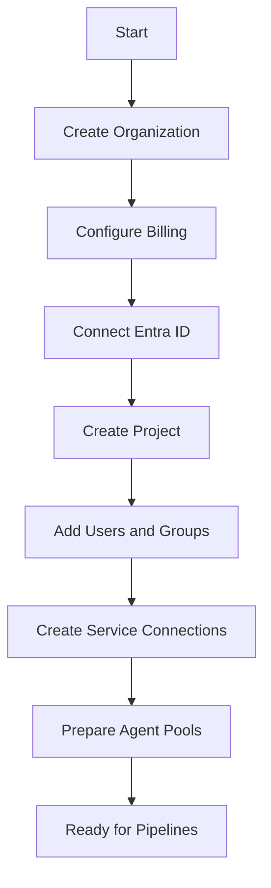
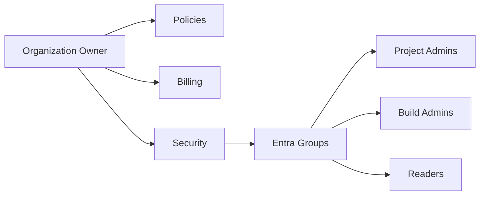
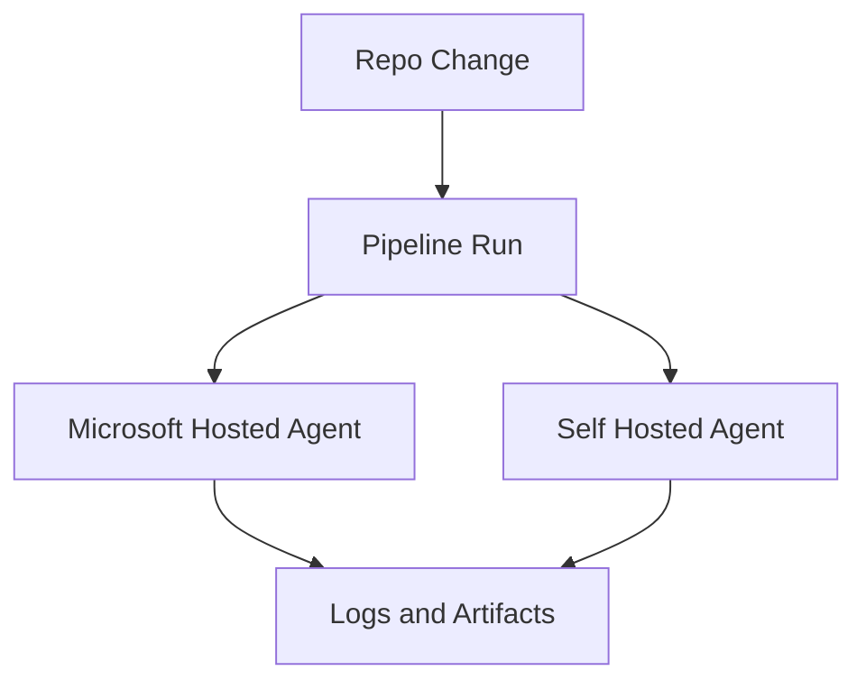

# 01 Organization Setup

> Build an Azure DevOps foundation that is secure, traceable, and ready for project teams.
>
> Disclaimer: Third party identity providers, registries, source platforms, and scanners referenced here should be validated against your security baseline and official vendor guidance.

## 1. Overview

- Scope: organization creation, projects, user access, service connections, and agent pools.
- Primary portals:
  - `dev.azure.com` for Azure DevOps administration
  - `Azure Portal` for Entra ID groups, subscriptions, service principals, managed identities, and target Azure resources
- Recommended bootstrap order:
  1. Create organization
  2. Configure billing and policies
  3. Connect Entra ID
  4. Create projects
  5. Add users and groups
  6. Create service connections
  7. Prepare agent pools

## 1.1 Organization setup flow



## 1.2 Administration model



## 1.3 Agent execution model



## 2. Creating an Azure DevOps organization

### 2.1 Create the organization

- Navigation: `dev.azure.com` → `New organization`.
- Required inputs:
  - organization name
  - region for data residency where offered
  - default owner account
- Best practice:
  - use a business aligned short name such as `contoso-platform`
  - avoid person specific names
  - document owner and backup owner

### 2.2 What the screen looks like

- A clean creation form with the Microsoft header on top.
- Center panel shows a text box for organization name and region selection.
- Right side or lower section shows a short explanation of privacy, terms, and region placement.
- Primary action button reads `Continue` or `Create organization`.

### 2.3 After creation what you see

- Left rail with service hubs such as Boards, Repos, Pipelines, Test Plans, and Artifacts.
- Top project selector with a prompt to create your first project.
- A welcome card that highlights import repo, create project, invite users, and install extensions.

### 2.4 Quick bootstrap commands

```bash
az extension add --name azure-devops
az devops configure --defaults organization=https://dev.azure.com/contoso
az devops project list --organization https://dev.azure.com/contoso --output table
```

Expected output:
- The extension installs or reports it is already present.
- Project list is empty for a new organization or displays existing projects with visibility columns.

## 3. Organization settings

### 3.1 Navigation and scope

- Navigation: `dev.azure.com` → organization home → lower left `Organization settings`.
- Major blades:
  - Overview
  - Users
  - Billing
  - Policies
  - Security
  - Permissions
  - Audit logs
  - Extensions
  - Agent pools
  - Parallel jobs

### 3.2 Policies

- Navigation: `dev.azure.com` → `Organization settings` → `Policies`.
- Common policies:
  - application connection restrictions
  - SSH connection restrictions
  - policy for third party application access
  - repository creation restrictions in some governance models
- Recommended baseline:
  - review OAuth app access regularly
  - restrict personal access token lifetime if your org permits it
  - disable unused preview features for regulated teams

### 3.3 Security

- Navigation: `dev.azure.com` → `Organization settings` → `Security`.
- Review these groups first:
  - Project Collection Administrators
  - Project Collection Build Administrators
  - Project Collection Service Accounts
  - Readers or limited access groups
- Use Entra groups instead of direct user assignments.
- Keep break glass accounts documented and monitored.

### 3.4 Billing

- Navigation: `dev.azure.com` → `Organization settings` → `Billing`.
- Tasks:
  - link Azure subscription if required
  - assign user access levels
  - review parallel job purchases and artifact storage
- What you see:
  - a billing summary panel
  - current subscription or payment linkage
  - user counts by access tier
  - links to manage paid extensions or extra capacity

### 3.5 Audit logs

- Navigation: `dev.azure.com` → `Organization settings` → `Audit logs`.
- Use for tracking:
  - permission changes
  - policy changes
  - service connection updates
  - feed permission changes
- Export audit logs if your compliance process requires long retention.

## 4. Connecting to Microsoft Entra ID

### 4.1 Why connect Entra ID

- Centralizes identity lifecycle.
- Simplifies group based access.
- Supports conditional access and governance.
- Reduces manual onboarding and offboarding effort.

### 4.2 Connection workflow

- Navigation in Azure DevOps: `dev.azure.com` → `Organization settings` → `Microsoft Entra ID`.
- Supporting navigation in Azure: `Azure Portal` → `Microsoft Entra ID` → `Groups` or `Enterprise applications`.
- Steps:
  1. Confirm tenant ownership and organization owner rights.
  2. Open Azure DevOps organization settings.
  3. Choose the Entra ID connection option.
  4. Select the tenant.
  5. Review impact on existing users.
  6. Confirm and synchronize.

### 4.3 What the user sees

- A tenant selection dialog with tenant name, domain, and confirmation text.
- A warning section explains how user identities will be matched.
- A confirmation screen shows the selected tenant and an action button to finalize connection.

### 4.4 Entra design tips

- Create groups by platform role, not by individual repository.
- Example groups:
  - `ado-org-admins`
  - `ado-project-admins-platform`
  - `ado-build-admins`
  - `ado-readers`
  - `ado-release-approvers`
- Use PIM in Entra for highly privileged groups where possible.

## 5. Project creation

### 5.1 Create a project

- Navigation: `dev.azure.com` → organization home → `New project`.
- Inputs:
  - project name
  - optional description
  - visibility
  - process template
  - version control type

### 5.2 What the screen looks like

- Modal or full page form with a large project name text box.
- Dropdowns for visibility, work item process, and source control.
- Informational helper text under each dropdown.
- Create button is disabled until a valid project name is entered.

### 5.3 Public vs private projects

| Type | When to use | Advantages | Risks |
|---|---|---|---|
| Private | Enterprise and internal delivery | Access controlled, safer defaults, best for most teams | Requires user licensing management |
| Public | Open source and public collaboration | Community visibility and open contributions | Review exposure, dependency disclosure, stronger moderation needs |

### 5.4 Process templates

| Template | Best fit | Default work items | Notes |
|---|---|---|---|
| Agile | General software delivery | Epic, Feature, User Story, Task, Bug | Balanced default for most teams |
| Scrum | Teams using strict Scrum language | Epic, Feature, Product Backlog Item, Task, Bug | Good if ceremonies and backlog terminology already follow Scrum |
| CMMI | Formal governance environments | Epic, Feature, Requirement, Change Request, Review | Heavier lifecycle and approval model |
| Basic | Small lightweight teams | Epic, Issue, Task | Simplest entry point but less structured |

### 5.5 Version control choice

| Option | Best fit | Strengths | Watch out |
|---|---|---|---|
| Git | Modern engineering teams | Branching, PRs, distributed development, CI integration | Requires branch policy discipline |
| TFVC | Legacy centralized workflows | File locking, centralized check in | Limited fit for cloud native workflows and GitOps |

### 5.6 CLI example

```bash
az devops project create   --name Platform   --description "Platform engineering project"   --process Agile   --source-control git   --visibility private   --organization https://dev.azure.com/contoso
```

Expected output:
- JSON or table response showing project id, name, visibility, and process.

## 6. User management

### 6.1 Access levels

| Access level | Typical audience | Notes |
|---|---|---|
| Stakeholder | Business owners, approvers, support users | Low cost option for limited collaboration |
| Basic | Developers, cloud engineers, project admins | Standard daily working license |
| Basic plus Test Plans | QA analysts and manual testers | Adds Test Plans functionality |
| Visual Studio subscriber | Users with eligible subscriptions | Often maps to Basic entitlement, verify current terms |

### 6.2 Add users

- Navigation: `dev.azure.com` → `Organization settings` → `Users` → `Add users`.
- Provide:
  - user email or Entra backed identity
  - access level
  - project assignment
  - group membership
- What you see:
  - a side pane with email field and access dropdown
  - selected project and group selectors
  - invitation summary before save

### 6.3 Teams and groups

- Navigation: `dev.azure.com` → project → `Project settings` → `Teams`.
- Use teams to map sprint boards and backlogs.
- Use groups to manage permissions.
- Typical model:
  - organization groups for enterprise roles
  - project groups for local administration
  - team groups for backlog and sprint ownership

### 6.4 Permissions matrix

| Role group | Core permissions | Recommended membership |
|---|---|---|
| Organization admins | Billing, policy, extensions, agent pools | Small platform admin group |
| Project admins | Repo creation, pipeline admin, board config | Product or platform leads |
| Repo contributors | Commit, branch, PR, tag | Engineers |
| Build admins | Manage pipeline definitions and queues | DevOps or platform engineers |
| Release approvers | Approve environment checks | Release managers or service owners |
| Readers | View only access | Auditors and stakeholders |

### 6.5 Security group examples

| Group | Scope | Why |
|---|---|---|
| `ado-org-admins` | Organization | Central governance |
| `ado-proj-platform-admins` | Project | Project settings ownership |
| `ado-proj-platform-contributors` | Project | Daily engineering work |
| `ado-pipeline-approvers-prod` | Environment | Production deployment approvals |
| `ado-feed-consumers` | Feed | Package read access |

## 7. Service connections

### 7.1 Overview

- Navigation: `dev.azure.com` → project → `Project settings` → `Service connections`.
- Service connections store authentication for Azure and external systems.
- Use least privilege and prefer workload identity or managed identity where supported.

### 7.2 Azure Resource Manager service connection

#### Option A Service Principal

- Navigation: `Project settings` → `Service connections` → `New service connection` → `Azure Resource Manager`.
- Select authentication method and scope:
  - subscription
  - management group
  - resource group where supported by use case
- What you see:
  - wizard with sign in button
  - subscription picker
  - scope selector
  - checkbox to grant pipeline access

#### Option B Managed Identity

- Best for self hosted agents running in Azure.
- Agent VM or scale set uses a system or user assigned managed identity.
- Azure service connection references that identity and avoids client secret rotation.

### 7.3 Docker Registry service connection

- Navigation: `Project settings` → `Service connections` → `New service connection` → `Docker Registry`.
- Use for Docker Hub or private registries when ACR is not used.
- Store credentials in secure secret scope only.

### 7.4 Kubernetes service connection

- Navigation: `Project settings` → `Service connections` → `New service connection` → `Kubernetes`.
- Options commonly include Azure subscription backed AKS or generic kubeconfig.
- What you see:
  - cluster type selector
  - namespace input
  - auth mode options

### 7.5 GitHub service connection

- Use for repo checkout, PR status updates, and workflows involving GitHub repositories.
- Prefer GitHub App or fine grained token models where supported.

### 7.6 SSH service connection

- Use for secure shell based copy or command execution to VMs and appliances.
- Store private key securely and rotate it.

### 7.7 Step by step creation checklist

1. Confirm target system owner and access scope.
2. Create or select the least privilege identity.
3. Open `Project settings` → `Service connections`.
4. Select the connection type.
5. Enter name, description, and authentication details.
6. Disable broad pipeline access unless needed.
7. Test the connection.
8. Record owner, expiration, and rotation method.

### 7.8 Azure CLI examples

```bash
az devops service-endpoint list --project Platform --organization https://dev.azure.com/contoso --output table
az ad sp create-for-rbac --name ado-sp-platform-dev --role Contributor --scopes /subscriptions/<subscriptionId>/resourceGroups/rg-app-dev
```

Expected output:
- Service endpoint list shows `name`, `type`, and `authorization` details.
- Service principal creation returns `appId`, `tenant`, and either a secret or cert metadata.

## 8. Agent pools

### 8.1 Microsoft hosted agents

| Image | Best use | Strengths | Constraints |
|---|---|---|---|
| `ubuntu-latest` | Most CI workloads | Fast startup, broad tooling, strong container support | Ephemeral cache only unless pipeline caching is configured |
| `windows-latest` | Windows builds and desktop workloads | MSBuild, Visual Studio tooling, PowerShell support | Slower startup and different path conventions |
| `macos-latest` | Apple platform builds | Required for native iOS and macOS builds | Higher scarcity and typically slower queue times |

### 8.2 Self hosted agents

- Best when you need:
  - private network access
  - custom tools and pre cached dependencies
  - hardware acceleration
  - controlled cost at scale
- Installation path:
  - `dev.azure.com` → `Organization settings` → `Agent pools` → select pool → `New agent`
- What you see:
  - OS tabs for Windows, Linux, and macOS
  - step list for download, configure, and run scripts
  - generated personal access token or registration guidance depending on flow

### 8.3 Linux installation example

```bash
mkdir -p ~/azagent && cd ~/azagent
curl -fkSL -o agent.tar.gz https://vstsagentpackage.azureedge.net/agent/<version>/vsts-agent-linux-x64-<version>.tar.gz
tar zxvf agent.tar.gz
./config.sh --url https://dev.azure.com/contoso --auth pat --token <pat> --pool LinuxPool --agent build01 --acceptTeeEula
./svc.sh install
./svc.sh start
```

Expected output:
- Config script confirms agent name and pool registration.
- Service script reports successful install and running service state.

### 8.4 Windows installation example

```powershell
mkdir C:zagent
cd C:zagent
Invoke-WebRequest https://vstsagentpackage.azureedge.net/agent/<version>/vsts-agent-win-x64-<version>.zip -OutFile agent.zip
Expand-Archive agent.zip -DestinationPath .
.\config.cmd --url https://dev.azure.com/contoso --auth pat --token <pat> --pool WindowsPool --agent build01
.\svc.cmd install
.\svc.cmd start
```

Expected output:
- Console reports the agent was configured and the Windows service is running.

### 8.5 Capabilities and demands

- Capabilities describe tools available on an agent.
- Demands let a job target agents with required tools.
- Examples:
  - `java`
  - `DotNetFramework`
  - `Agent.OS -equals Linux`
- Use custom capabilities for specialized tooling such as Terraform version or Docker daemon availability.

### 8.6 Pool configuration and scaling

- Central pools for shared build workers.
- Dedicated pools for regulated deployments or privileged release jobs.
- Scale options:
  - VM scale sets
  - container based ephemeral agents
  - Kubernetes hosted agents
- Governance tips:
  - separate build and deployment pools
  - isolate production deployment agents
  - patch base images regularly
  - rotate registration tokens and PATs

## 9. Screen by screen checklist

| Screen | Navigation | What you see | Action |
|---|---|---|---|
| Organization home | `dev.azure.com` | Recent projects and create project button | Start project creation |
| Organization settings | lower left settings | Left admin rail and summary cards | Configure users, billing, policies |
| Users | `Organization settings` → `Users` | User table with access levels | Add users and assign license |
| Billing | `Organization settings` → `Billing` | Subscription and user counts | Link billing and review paid usage |
| Project creation | organization home → `New project` | Form with visibility and process | Create project |
| Service connections | `Project settings` → `Service connections` | Table of endpoints and new button | Create Azure and external connections |
| Agent pools | `Organization settings` → `Agent pools` | Pool list and agent tabs | Add hosted or self hosted agents |

## 10. Recommended bootstrap sequence

1. Create the organization and name it for the enterprise or platform domain.
2. Connect Entra ID before broad user onboarding.
3. Create a private platform project using the Agile process and Git.
4. Add Entra backed admin and contributor groups.
5. Create Azure Resource Manager service connections for dev first.
6. Prepare at least one hosted pool and one controlled self hosted pool if private access is required.
7. Document naming, owners, and expiration dates for every privileged connection.

## 11. Official Microsoft references

- [Create an organization](https://learn.microsoft.com/azure/devops/organizations/accounts/create-organization)
- [Organization settings and security](https://learn.microsoft.com/azure/devops/organizations/security/about-security-identity)
- [Connect Azure DevOps to Microsoft Entra ID](https://learn.microsoft.com/azure/devops/organizations/accounts/connect-organization-to-azure-ad)
- [Projects and process templates](https://learn.microsoft.com/azure/devops/organizations/projects/about-projects)
- [Service connections](https://learn.microsoft.com/azure/devops/pipelines/library/service-endpoints)
- [Agents and agent pools](https://learn.microsoft.com/azure/devops/pipelines/agents/agents)
