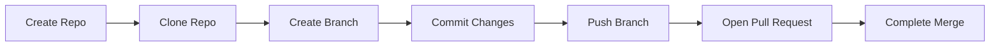
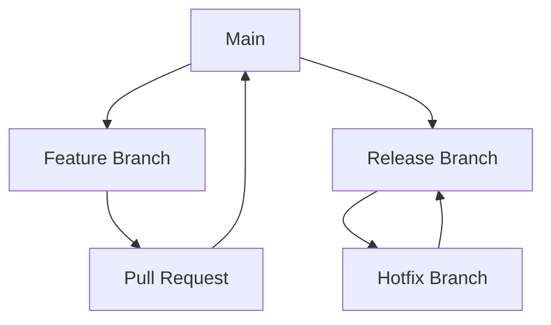
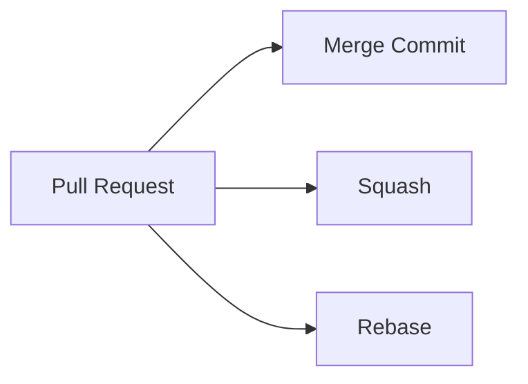

> **Screenshot Disclaimer:** Screenshots in this guide are sourced from [Microsoft Learn](https://learn.microsoft.com/en-us/azure/devops/) documentation. © Microsoft Corporation. All rights reserved. Used here for educational and reference purposes only. For the latest UI and features, always refer to the official documentation.

# 02 Azure Repos

Azure Repos provides the source control workflow that Azure DevOps delivery depends on. This guide explains how to choose a repository model, protect important branches, keep pull requests reviewable, and use Git in a way that supports both developer speed and controlled change management.

> [!NOTE]
> Repository design should follow ownership and release boundaries, not personal preference. Strong default-branch protection and simple merge rules usually matter more than exotic Git workflows.

> [!TIP]
> Make the safe path the easy path: short-lived branches, clear PR templates, fast validation, and small numbers of merge strategies.

> [!IMPORTANT]
> If `main` or a release branch feeds production, direct unreviewed pushes should be rare or fully blocked. Branch policies are a baseline control, not an optional refinement.

## Guide objectives

- Choose a repository topology that matches team boundaries.
- Apply branch protection and pull request policy consistently.
- Improve traceability between work items, commits, PRs, and pipeline runs.
- Keep day-two Git operations maintainable at scale.

## Microsoft Learn screenshots

> 
>
> *Screenshot source: [Microsoft Learn — What is Azure DevOps?](https://learn.microsoft.com/en-us/azure/devops/user-guide/what-is-azure-devops?view=azure-devops). © Microsoft Corporation. Used for educational reference only.*

> 
>
> *Screenshot source: [Microsoft Learn — What is Azure DevOps?](https://learn.microsoft.com/en-us/azure/devops/user-guide/what-is-azure-devops?view=azure-devops). © Microsoft Corporation. Used for educational reference only.*

> 
>
> *Screenshot source: [Microsoft Learn — What is Azure DevOps?](https://learn.microsoft.com/en-us/azure/devops/user-guide/what-is-azure-devops?view=azure-devops). © Microsoft Corporation. Used for educational reference only.*

## Prerequisites

- An Azure DevOps project with Repos enabled.
- Git installed locally and on build agents.
- A basic branch and merge strategy decision.
- At least one CI pipeline design to use as branch validation.

## Quick decision guide

| Decision area | Why it matters | Recommended baseline |
|---|---|---|
| Single repo | Best for clear product ownership | Use for one application or bounded codebase |
| Monorepo | Best for closely related services | Use only with strong path filtering and ownership |
| Squash merge | Keeps history readable | Good default for feature branches |
| Build validation | Prevents unsafe merges | Require it on release-feeding branches |
| Required reviewers | Protects critical code paths | Use selectively to avoid review bottlenecks |

## 2. Overview

- Azure Repos supports Git and TFVC.
- Git is the default choice for modern cloud engineering teams.
- Core goals:
  - safe collaboration
  - controlled merges
  - fast feedback through PR validation
  - traceability to work items and releases

## 2.1 Repository flow



## 2.2 Branch strategy map



## 2.3 Merge strategy map



## 3. Creating repositories

### 3.1 Create a new repository

- Navigation: `dev.azure.com` → project → `Repos` → repository picker → `New repository`.
- Inputs:
  - repository name
  - optional import source
- Portal landmarks:
  - repository selector at the top left so users can switch between repos without leaving the hub
  - a focused creation form with repository name and optional import or initialization choices
  - onboarding actions that may offer a README seed or import workflow depending on the experience

### 3.2 CLI example

```bash
az repos create --name platform-infra --project Platform --organization https://dev.azure.com/contoso
az repos list --project Platform --organization https://dev.azure.com/contoso --output table
```

Expected output:
- Create returns repository id and remote URL.
- List shows repo names and default branch values.

### 3.3 Clone the repository

```bash
git clone https://dev.azure.com/contoso/Platform/_git/platform-infra
cd platform-infra
git branch -a
```

Expected output:
- `git clone` downloads the repository and configures `origin`.
- `git branch -a` shows the local branch and remote references.

## 4. Branch policies and protection

### 4.1 Why branch policies matter

- Prevent direct unreviewed merges to protected branches.
- Enforce build validation and comment resolution.
- Keep release branches stable.
- Improve compliance and audit evidence.

### 4.2 Configure branch policies

- Navigation: `dev.azure.com` → project → `Repos` → `Branches` → branch context menu → `Branch policies`.
- Key options:
  - minimum number of reviewers
  - required reviewers
  - comment resolution
  - linked work items
  - build validation
  - merge strategy restrictions

### 4.3 Branch policy page landmarks

- The branch list shows each branch with a context menu that leads to policy management.
- The policy experience is organized into expandable sections so reviewers can compare options such as minimum reviewers, linked work items, and build validation in one place.
- Numeric selectors, toggles, and pipeline pickers make it clear which protections are advisory and which are blocking.

### 4.4 Example policy baseline

| Branch | Minimum reviewers | Build validation | Comment resolution | Suggested merge types |
|---|---|---|---|---|
| `main` | 2 | Required | Required | Squash or Rebase |
| `release/*` | 1 or 2 | Required | Required | Merge Commit or Rebase |
| `hotfix/*` | 1 | Required | Required | Merge Commit |

### 4.5 CLI examples

```bash
REPO_ID=$(az repos show --repository platform-infra --project Platform --organization https://dev.azure.com/contoso --query id -o tsv)
az repos policy approver-count create --project Platform --organization https://dev.azure.com/contoso --repository-id $REPO_ID --branch main --blocking true --enabled true --minimum-approver-count 2
az repos policy comment-required create --project Platform --organization https://dev.azure.com/contoso --repository-id $REPO_ID --branch main --blocking true --enabled true
```

Expected output:
- Policy create commands return policy ids and enabled state.

## 5. Pull request workflow

### 5.1 Standard PR sequence

1. Create a feature branch from `main`.
2. Commit small changes with meaningful messages.
3. Push the branch.
4. Create a pull request.
5. Request reviewers.
6. Wait for validation pipelines.
7. Resolve comments.
8. Complete using the approved merge strategy.

### 5.2 Creating a pull request

- Navigation: `dev.azure.com` → project → `Repos` → `Pull requests` → `New pull request`.
- Portal landmarks:
  - source and target branch selectors sit at the top of the pull request form so the merge direction is obvious
  - title and description fields give authors room to explain intent, testing, and rollout considerations
  - reviewer, work item, and build panels keep approval and traceability details visible alongside the code diff

### 5.3 Review and approval states

| State | Meaning | Action |
|---|---|---|
| Waiting | Review not completed | Add reviewers or remind owners |
| Approved | Reviewer accepts change | Complete after validation passes |
| Approved with suggestions | Reviewer is okay with minor follow up | Address suggestions or log follow up item |
| Waiting for author | Reviewer requires changes | Update branch and re request review |
| Rejected | Reviewer blocks merge | Resolve design issue before proceeding |

### 5.4 Merge strategies

| Strategy | Use when | Benefits | Trade off |
|---|---|---|---|
| Merge commit | Preserve branch history | Full context retained | Noisier graph |
| Squash | Keep main clean | One commit per PR and easy rollback | Individual commits disappear |
| Rebase and fast forward | Prefer linear history | Clean history without merge commits | Rewrites branch commit ids |
| Semi linear with merge policies | Teams with strong audit needs | Predictable merge model | Requires discipline and training |

## 6. Branch strategies

### 6.1 GitFlow

- Branches include `main`, `develop`, `feature/*`, `release/*`, and `hotfix/*`.
- Best for products with planned release trains and multiple supported versions.
- Watch for merge overhead and long lived branches.

### 6.2 GitHub Flow

- Short lived branches off `main` and PR back to `main`.
- Good for continuous deployment and frequent small releases.
- Requires strong automation and feature toggles.

### 6.3 Trunk based development

- Very short lived branches or direct commits through guarded automation.
- Best for high performing engineering teams with excellent CI discipline.
- Requires fast tests and branch policy automation.

### 6.4 Comparison table

| Strategy | Best for | Release cadence | Complexity | Key guardrail |
|---|---|---|---|---|
| GitFlow | Enterprise apps with formal releases | Slower or scheduled | High | Release branch governance |
| GitHub Flow | Web apps and services | Frequent | Medium | Strong PR validation |
| Trunk based | Fast cloud native teams | Very frequent | Low to medium | Small changes and feature flags |

## 7. Code review best practices

### 7.1 Required reviewers and auto reviewers

- Configure required reviewers for security sensitive paths such as `infra/`, `network/`, or `pipelines/`.
- Use path based auto reviewers for ownership boundaries.
- Keep reviewer groups small enough to respond quickly.

### 7.2 Pull request templates

- Use a default PR template in the repository root or `.azuredevops` docs folder.
- Include:
  - summary of change
  - test evidence
  - rollback plan
  - security impact
  - related work item

### 7.3 Review checklist

- Does the code solve the linked requirement?
- Are tests added or updated?
- Are secrets excluded from code and logs?
- Are failure and rollback paths clear?
- Is documentation updated when behavior changes?
- Are naming and ownership boundaries preserved?

## 8. IDE integration

### 8.1 Visual Studio Code

- Use built in Git support and Azure Repos extension options where approved.
- Common actions:
  - clone repo
  - switch branch
  - resolve merge conflicts
  - push and create PR links

### 8.2 Visual Studio

- Strong support for enterprise Git workflows and Azure DevOps authentication.
- Helpful for .NET repos, TFVC history, and work item linking.

### 8.3 IntelliJ IDEA

- Supports Git clone, pull request review plugins, and external terminal workflows.
- Good for Java, Kotlin, and polyglot repos.

### 8.4 What users see in IDE flows

- Source control panel with changed files.
- Branch dropdown showing local and remote branches.
- Commit box and sync buttons.
- Azure or Git provider sign in prompt if integration is enabled.

## 9. Git commands reference for Azure Repos

```bash
git clone https://dev.azure.com/contoso/Platform/_git/orders-api
git checkout -b feature/add-health-endpoint
git add .
git commit -m "Add health endpoint"
git push -u origin feature/add-health-endpoint
git fetch origin
git rebase origin/main
git pull --rebase origin main
git tag v1.0.0
git push origin v1.0.0
```

Expected output:
- `git push -u` sets the upstream branch.
- `git rebase origin/main` replays local commits onto the latest mainline.
- `git push origin v1.0.0` publishes the release tag.


## 10. Repository permissions and governance

### 10.1 Common repository permissions

| Permission | Why it matters | Recommended default |
|---|---|---|
| Read | View source and history | Most engineers and auditors |
| Contribute | Push commits and create branches | Engineering contributors |
| Create branch | Start new work safely | Contributors |
| Force push | Rewrite history | Avoid except in controlled admin scenarios |
| Bypass policies when completing PRs | Skip validation | Keep disabled for almost all users |
| Delete repository | Destructive action | Platform or project admins only |

### 10.2 Naming conventions

- Keep repository names short and stable.
- Example branch prefixes:
  - `feature/`
  - `bugfix/`
  - `hotfix/`
  - `release/`
  - `chore/`
- Tag releases with semantic versions where applicable.

### 10.3 Importing or mirroring repos

- Navigation: `Repos` → repository picker → `Import repository`.
- Use for migrations from GitHub, Bitbucket, or another Git remote.
- Portal landmarks:
  - the import wizard requests the source URL first so the service can inspect the remote repository
  - authentication options appear only when the import source requires credentials
  - the destination repository choice stays visible so teams can validate where the migrated history will land
- Validate large file history and branch protection settings after import.

## 11. Pull request completion options

- Common completion controls in the PR screen:
  - delete source branch after merge
  - squash changes when merging
  - set auto complete after approvals and checks
  - bypass policies if authorized
- Prefer auto complete for large teams so PRs merge as soon as required checks pass.
- Require linked work items and resolved conversations for production branches.

## 12. Troubleshooting and daily tips

- Failed clone often means missing access or expired credentials.
- PR validation failures should link directly to the pipeline summary.
- Rebase conflicts are easier to handle when branches are short lived.
- If commit author mapping is wrong, verify local Git email and Azure DevOps identity alignment.
- Use draft PRs for early design feedback without signaling merge readiness.

## 13. Official Microsoft references

- [Azure Repos overview](https://learn.microsoft.com/azure/devops/repos/get-started/what-is-repos)
- [Branch policies](https://learn.microsoft.com/azure/devops/repos/git/branch-policies)
- [Pull requests](https://learn.microsoft.com/azure/devops/repos/git/pull-requests)
- [Import and manage Git repos](https://learn.microsoft.com/azure/devops/repos/git/create-new-repo)
- [TFVC overview](https://learn.microsoft.com/azure/devops/repos/tfvc/what-is-tfvc)

## Real-world scenarios and examples

### Scenario 1: Infrastructure-as-code repository for landing zones

Landing zone code often governs policy, networking, and identity guardrails. Azure Repos gives teams a place to protect those changes with strong review and validation requirements.


Implementation flow:

1. Create a dedicated infrastructure repo.
2. Require linked work items and reviewer approval.
3. Run CI validation before merge.
4. Tag or record release points clearly.


Success indicators:

- Infrastructure history is auditable.
- Unsafe changes are blocked early.
- Release inputs are easier to identify.

### Scenario 2: Application team adopting trunk-based development

A product team wants to merge frequently with small PRs. Azure Repos works well for this model when validation stays fast and branch protection stays strict.


Implementation flow:

1. Use short feature branches.
2. Require fast CI and a small reviewer set.
3. Prefer squash merge.
4. Delete feature branches after merge.


Success indicators:

- Cycle time improves.
- Merge conflicts fall.
- PR review becomes more consistent.

### Scenario 3: Monorepo with many services and libraries

A monorepo can simplify shared refactoring, but only when ownership, path filters, and review patterns are explicit. Azure Repos plus Azure Pipelines can support that operating model well.


Implementation flow:

1. Define directory ownership.
2. Use path-aware pipelines.
3. Apply branch policies at the right branch level.
4. Document service-specific release rules.


Success indicators:

- Refactoring across services becomes easier.
- Unrelated pipelines run less often.
- Review ownership stays understandable.

## Operating model checklist

- Review branch policy drift regularly across repositories.
- Archive or lock inactive repositories instead of leaving them ambiguous.
- Keep contribution guidance near the code and update it when branch rules change.
- Use release tags or references that map clearly to deployment evidence.

## Official Microsoft References

- [Git branch policies and settings](https://learn.microsoft.com/en-us/azure/devops/repos/git/branch-policies?view=azure-devops)
- [Complete, abandon, or revert pull requests](https://learn.microsoft.com/en-us/azure/devops/repos/git/complete-pull-requests?view=azure-devops)
- [Git branching guidance](https://learn.microsoft.com/en-us/azure/devops/repos/git/git-branching-guidance?view=azure-devops)
- [Set Git repository permissions](https://learn.microsoft.com/en-us/azure/devops/repos/git/set-git-repository-permissions?view=azure-devops)
- [What is Azure DevOps?](https://learn.microsoft.com/en-us/azure/devops/user-guide/what-is-azure-devops?view=azure-devops)
- [Azure DevOps CLI reference](https://learn.microsoft.com/en-us/azure/devops/cli/?view=azure-devops)
