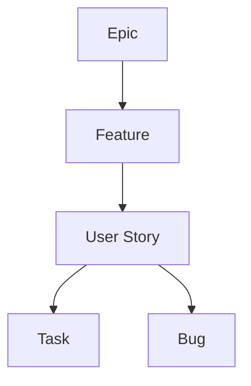
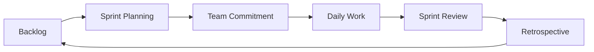
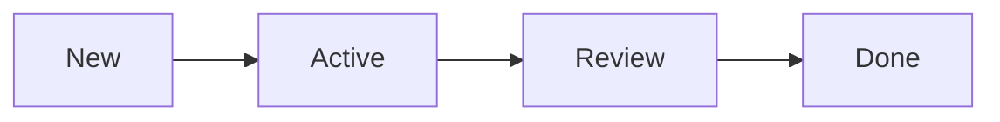

> **Screenshot Disclaimer:** Screenshots in this guide are sourced from [Microsoft Learn](https://learn.microsoft.com/en-us/azure/devops/) documentation. © Microsoft Corporation. All rights reserved. Used here for educational and reference purposes only. For the latest UI and features, always refer to the official documentation.

# 03 Azure Boards

Azure Boards turns planning into a structured, queryable system that connects product intent to engineering execution. This guide explains how to design a practical work-item hierarchy, run backlogs and sprints, manage Kanban flow, and use dashboards that actually help teams make decisions.

> [!NOTE]
> Boards is strongest when it stays close to real team behavior. Lightweight, consistent work-item usage is usually better than heavy customization.

> [!TIP]
> Use a small set of states, tags, and hierarchy levels. Teams maintain data quality better when the process feels natural rather than bureaucratic.

> [!IMPORTANT]
> Do not customize the process model just because the platform allows it. Standard Agile, Scrum, or Basic processes are usually enough until reporting needs are proven.

## Guide objectives

- Create a clear hierarchy for epics, features, stories, tasks, and bugs.
- Run backlogs and sprints with repeatable team practices.
- Use boards, queries, and dashboards for real operational visibility.
- Link work items meaningfully to code, tests, and releases.

## Microsoft Learn screenshots

> 
>
> *Screenshot source: [Microsoft Learn — What is Azure Boards](https://learn.microsoft.com/en-us/azure/devops/boards/get-started/what-is-azure-boards?view=azure-devops). © Microsoft Corporation. Used for educational reference only.*

> 
>
> *Screenshot source: [Microsoft Learn — What is Azure DevOps?](https://learn.microsoft.com/en-us/azure/devops/user-guide/what-is-azure-devops?view=azure-devops). © Microsoft Corporation. Used for educational reference only.*

> 
>
> *Screenshot source: [Microsoft Learn — What is Azure DevOps?](https://learn.microsoft.com/en-us/azure/devops/user-guide/what-is-azure-devops?view=azure-devops). © Microsoft Corporation. Used for educational reference only.*

## Prerequisites

- An Azure DevOps project with a defined process template.
- Team, area path, and iteration path decisions.
- A shared definition of what constitutes a story, task, and bug.
- A basic reporting model for sprint, roadmap, or operations metrics.

## Quick decision guide

| Decision area | Why it matters | Recommended baseline |
|---|---|---|
| Process template | Shapes planning defaults | Start with Agile unless a strong reason exists otherwise |
| Area paths | Represent ownership or product domains | Keep them aligned to real team boundaries |
| Iteration paths | Drive sprint or timebox reporting | Create only the cadence you need |
| Bug policy | Affects backlog and dashboard clarity | Decide early whether bugs appear with stories |
| Dashboards | Support decision-making | Show only widgets that answer real questions |

## 3. Overview

- Azure Boards provides work tracking for product, platform, and operations teams.
- Common capabilities:
  - work item hierarchy
  - product backlog and sprint planning
  - Kanban boards and delivery policies
  - dashboards and queries
  - traceability to code and deployments

## 3.1 Work item hierarchy



## 3.2 Sprint planning flow



## 3.3 Kanban flow



## 4. Work item types

### 4.1 Hierarchy model

| Level | Purpose | Typical owner |
|---|---|---|
| Epic | Large business objective | Product leader or platform lead |
| Feature | Deliverable capability | Product manager or technical lead |
| User Story or Product Backlog Item | User value statement | Product owner |
| Task | Implementation work | Engineer or operator |
| Bug | Defect or operational issue | Engineering or support team |

### 4.2 What the work item screen looks like

- Header with title, state, assigned user, and board tags.
- Tabs for description, discussion, history, links, and development.
- Sidebar or lower pane for parent child relationships and iteration path.
- Buttons for save, follow, and copy link.

### 4.3 Good work item hygiene

- Keep titles outcome focused.
- Use tags sparingly and consistently.
- Link child tasks only when they represent real executable work.
- Use acceptance criteria for stories and reproduction details for bugs.

## 5. Backlogs and sprints

### 5.1 Product backlog management

- Navigation: `dev.azure.com` → project → `Boards` → `Backlogs`.
- What you see:
  - backlog level selector on the top left
  - flat or hierarchical item list in the center
  - forecasting, mapping, and filter controls on the top bar
- Common actions:
  - add new stories
  - map stories to features
  - reorder by priority
  - estimate effort

### 5.2 Sprint planning

- Navigation: `Boards` → `Sprints`.
- Use team iterations to separate work by cadence.
- Plan around capacity, planned time off, and focus factor.

### 5.3 Capacity planning

- Team members enter hours per day and days off.
- Azure Boards calculates available capacity against assigned tasks.
- Use it as a planning guide, not a perfect forecast.

### 5.4 Burndown and burnup charts

- Burndown shows remaining work over time.
- Burnup shows completed work against total scope.
- Use burndown to detect scope creep or blocked execution.

## 6. Kanban boards

### 6.1 Customizing columns

- Navigation: `Boards` → `Boards` → gear icon → `Columns`.
- Typical columns:
  - New
  - Ready
  - In Progress
  - Review
  - Done
- Keep columns aligned to observable workflow states.

### 6.2 Swim lanes

- Separate expedite work, production incidents, or priority initiatives.
- Avoid too many lanes or the board becomes difficult to scan.

### 6.3 WIP limits

- Apply work in progress limits to focus team throughput.
- Review breaches during standup and retrospectives.

### 6.4 Card styles and rules

- Use card colors for risk, class of service, or blocked state.
- Show critical fields on cards such as owner, effort, and tags.
- Add rules to highlight blocked work or overdue items.

### 6.5 What the board screen looks like

- Horizontal columns with cards stacked vertically.
- Filters near the top for assignee, tags, and keywords.
- Gear icon for board settings.
- Context menu on each card for move, edit, assign, and convert actions.

## 7. Queries and dashboards

### 7.1 Query types

| Query type | Use case | Result style |
|---|---|---|
| Flat list | Open bugs or sprint tasks | One level list |
| Tree of work items | Epic to feature to story tracking | Parent child hierarchy |
| Work items and direct links | Dependency tracing and linked defects | Linked item results |

### 7.2 Create a query

- Navigation: `Boards` → `Queries` → `New query`.
- What you see:
  - clause builder with field, operator, and value selectors
  - save button and folder tree on the left
  - result grid below the filter area

### 7.3 Example query filters

- Iteration path equals current sprint.
- State not equal done.
- Assigned to current user.
- Area path under platform team.

### 7.4 Dashboards

- Navigation: `Overview` → `Dashboards`.
- Useful widgets:
  - burndown
  - velocity
  - cycle time
  - lead time
  - query tiles
  - markdown note tiles

### 7.5 Dashboard design tips

- One executive dashboard for outcomes.
- One team dashboard for sprint health.
- One operations dashboard for bugs, incidents, and blockers.

## 8. Integrations

### 8.1 GitHub integration

- Link commits and PRs to work items.
- Use it when source code remains in GitHub but planning is in Boards.

### 8.2 Microsoft Teams integration

- Post board updates or dashboard snapshots to team channels.
- Use for standup summaries and sprint change visibility.

### 8.3 Slack integration

- Notify channels about work item state changes or sprint events.
- Confirm retention and data handling requirements with your security team.

## 9. Practical commands and outputs

```bash
az boards query --id <queryId> --organization https://dev.azure.com/contoso --output table
az boards work-item create --title "Enable hub firewall logging" --type Task --project Platform --organization https://dev.azure.com/contoso
az boards work-item show --id <workItemId> --organization https://dev.azure.com/contoso --output table
```

Expected output:
- Query command returns rows with id, title, state, and assigned user.
- Create command returns the new work item id and URL.
- Show command displays fields such as area path, iteration path, and state.

## 10. Best practices checklist

- Keep hierarchy shallow and meaningful.
- Align area paths to ownership and iteration paths to cadence.
- Limit custom fields to real reporting needs.
- Review WIP breaches weekly.
- Keep dashboards role specific and simple.
- Use queries as reusable views for operations and release readiness.


## 11. Team settings and sprint controls

### 11.1 Area paths and iteration paths

- Area paths define ownership.
- Iteration paths define time boxes.
- Good pattern:
  - one project for a product or platform domain
  - multiple area paths for teams or service domains
  - shared sprint cadence through team iteration settings

### 11.2 Team configuration path

- Navigation: `Project settings` → `Teams` → select team → `Iterations and areas`.
- What you see:
  - tabs for team membership, iterations, and area paths
  - tree picker for selecting owned paths
  - defaults for backlog visibility and board behavior

### 11.3 Sprint execution tips

- Keep sprint scope stable after day two where possible.
- Track blocked work explicitly with tags or board rules.
- Split large tasks before the sprint starts.
- Review carryover items during retrospective, not just at sprint close.

## 12. Query and dashboard examples

### 12.1 Example flat query

- Work item type equals Bug.
- State not in Closed and Removed.
- Area path under Online.
- Assigned to current user.

### 12.2 Example tree query

- Return Epics with child Features and Stories.
- Filter parent state not equal Done.
- Use for executive readiness review.

### 12.3 Dashboard widget guidance

| Widget | Best audience | Why |
|---|---|---|
| Velocity | Product and delivery leads | Forecast next sprint capacity |
| Burndown | Team members | Track sprint completion trend |
| Cycle time | Flow managers | Understand delivery speed |
| Lead time | Stakeholders | Measure request to completion |
| Query tile | Operations teams | Watch open incidents or blockers |


## 13. Integration patterns and examples

### 13.1 Link code to boards

- Include work item ids in branch names or commit messages where your standard allows it.
- Link pull requests to stories, bugs, or change items.
- Use this linkage to show deployment traceability on the work item development tab.

### 13.2 Operational dashboards

- Create one dashboard for incident and bug queues.
- Add query widgets for blocked tasks, open Sev1 bugs, and deployment readiness.
- Show cycle time and lead time to identify workflow bottlenecks.

### 13.3 Common mistakes to avoid

- Too many states that nobody updates.
- Too many tags with overlapping meaning.
- Sprint plans based on wishful capacity rather than actual team availability.
- Dashboards with dozens of widgets and no clear audience.

## 14. Best practices for work item governance

- Review old tags and custom fields quarterly.
- Archive or simplify unused dashboards.
- Use states that match real workflow events, not generic status labels.
- Keep work item discussions factual and linked to evidence.
- Train teams to update state during actual workflow transitions.

## 15. Official Microsoft references

- [Azure Boards overview](https://learn.microsoft.com/azure/devops/boards/get-started/what-is-azure-boards)
- [Plan and track work](https://learn.microsoft.com/azure/devops/boards/backlogs/overview)
- [Kanban boards](https://learn.microsoft.com/azure/devops/boards/boards/kanban-overview)
- [Queries](https://learn.microsoft.com/azure/devops/boards/queries/using-queries)
- [Dashboards](https://learn.microsoft.com/azure/devops/report/dashboards/overview)

## Real-world scenarios and examples

### Scenario 1: Platform engineering backlog for cloud landing zone adoption

A platform team needs to plan identity, networking, governance, and onboarding work in one shared backlog. Azure Boards helps turn that cross-functional roadmap into visible deliverables and dependencies.


Implementation flow:

1. Create epics by platform domain.
2. Break them into features and sprint-sized stories.
3. Link work to repos and pipelines.
4. Use dashboards for roadmap and release health.


Success indicators:

- Dependencies are easier to spot.
- Stakeholders see delivery progress.
- Operational and engineering work can coexist in one model.

### Scenario 2: Product team running two-week sprints

A feature team wants predictable sprint planning, honest capacity review, and useful burndown data. Azure Boards provides this when backlog items are ready and board hygiene stays strong.


Implementation flow:

1. Plan from a refined backlog.
2. Assign sprint capacity and days off.
3. Keep board states current daily.
4. Use sprint review and retro metrics to improve.


Success indicators:

- Sprint commitments become more realistic.
- Blocked work surfaces earlier.
- Reports are easier to trust.

### Scenario 3: Operations team using Kanban rather than sprint delivery

Not every team works in sprints. Boards also supports flow-based work such as incidents, changes, and maintenance through columns, swim lanes, and WIP-aware dashboards.


Implementation flow:

1. Create observable workflow states.
2. Use swim lanes for expedite work.
3. Track ownership with area paths.
4. Measure aging and throughput with queries and widgets.


Success indicators:

- Flow bottlenecks are visible.
- Urgent work is easier to separate from planned work.
- Managers get more credible throughput data.

## Operating model checklist

- Review stale backlog items and unused queries regularly.
- Keep area-path and iteration-path ownership current.
- Use retrospectives to improve board states and completion definitions.
- Archive or simplify dashboards that no longer influence decisions.

## Official Microsoft References

- [What is Azure Boards](https://learn.microsoft.com/en-us/azure/devops/boards/get-started/what-is-azure-boards?view=azure-devops)
- [Backlogs, boards, and plans](https://learn.microsoft.com/en-us/azure/devops/boards/backlogs/backlogs-boards-plans?view=azure-devops)
- [Define area paths and assign to a team](https://learn.microsoft.com/en-us/azure/devops/organizations/settings/set-area-paths?view=azure-devops)
- [Set iteration paths and configure team iterations](https://learn.microsoft.com/en-us/azure/devops/boards/sprints/set-iteration-paths-sprints?view=azure-devops)
- [About teams and Agile tools](https://learn.microsoft.com/en-us/azure/devops/organizations/settings/about-teams-and-settings?view=azure-devops)
- [Azure DevOps CLI reference](https://learn.microsoft.com/en-us/azure/devops/cli/?view=azure-devops)
