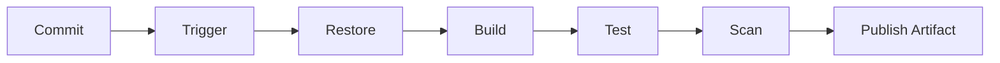
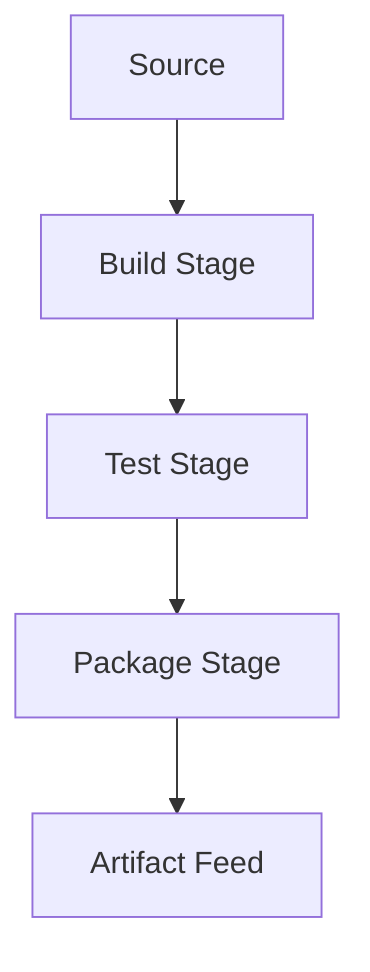
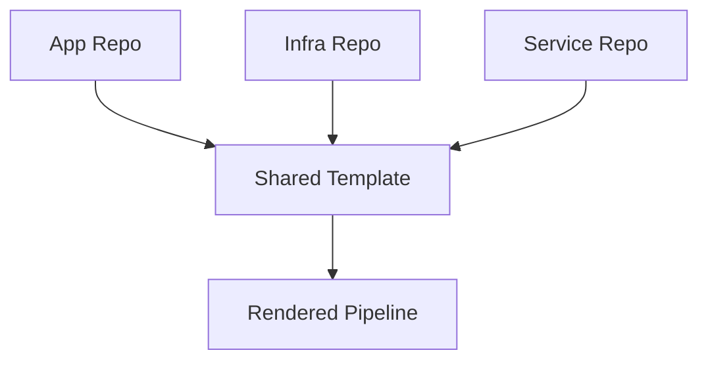

# 04 Azure Pipelines CI

> YAML first continuous integration guide for Azure Pipelines across common language stacks.
>
> Disclaimer: SonarQube, Trivy, Docker Hub, and other third party scanners or registries are referenced as common examples. Confirm support, licensing, and security controls before enterprise rollout.

## 4. Overview

- CI pipelines should validate code quickly and publish reproducible artifacts.
- Keep pipelines declarative, versioned, and reusable.
- Standard CI stages usually include restore, build, test, scan, and publish.

## 4.1 CI pipeline flow



## 4.2 Multi stage build map



## 4.3 Template reuse model



## 5. YAML pipeline fundamentals

### 5.1 Core structure

| Element | Purpose | Example |
|---|---|---|
| `trigger` | Starts pipeline on branch or path change | `main` and `feature/*` |
| `pr` | Runs validation for pull requests | `main` only |
| `pool` | Chooses hosted or self hosted agent | `ubuntu-latest` |
| `variables` | Reusable values and secrets | image names, build config |
| `stages` | High level lifecycle groups | Build, Test, Package |
| `jobs` | Agent scoped units of work | .NET build, container scan |
| `steps` | Tasks or scripts | `DotNetCoreCLI`, `Bash`, `PublishTestResults` |

### 5.2 Basic YAML skeleton

```yaml
trigger:
  branches:
    include:
      - main
pr:
  branches:
    include:
      - main
pool:
  vmImage: ubuntu-latest
variables:
  buildConfiguration: Release
steps:
  - checkout: self
  - script: echo Build starts here
```

### 5.3 What the pipeline screen looks like

- Left navigation path: `dev.azure.com` → project → `Pipelines`.
- Pipeline creation page shows source selection such as Azure Repos Git or GitHub.
- YAML editor or repository file picker is centered on screen.
- Run summary shows stage badges, job duration, logs panel, artifact panel, and test summary tabs.

## 6. Complete YAML examples by stack

### 6.1 Complete .NET pipeline

```yaml
trigger:
  branches:
    include:
      - main
      - feature/*
pr:
  branches:
    include:
      - main
pool:
  vmImage: ubuntu-latest
variables:
  buildConfiguration: Release
stages:
  - stage: BuildTest
    jobs:
      - job: DotNet
        steps:
          - checkout: self
          - task: UseDotNet@2
            inputs:
              packageType: sdk
              version: 8.0.x
          - script: dotnet restore
            displayName: Restore
          - script: dotnet build --configuration $(buildConfiguration) --no-restore
            displayName: Build
          - script: dotnet test --configuration $(buildConfiguration) --no-build --collect:"XPlat Code Coverage"
            displayName: Test
          - task: PublishTestResults@2
            inputs:
              testResultsFormat: VSTest
              testResultsFiles: '**/*.trx'
          - task: PublishCodeCoverageResults@2
            inputs:
              codeCoverageTool: Cobertura
              summaryFileLocation: '**/coverage.cobertura.xml'
```

### 6.2 Complete Java Maven pipeline

```yaml
trigger:
  branches:
    include:
      - main
pool:
  vmImage: ubuntu-latest
steps:
  - task: Maven@4
    inputs:
      mavenPomFile: pom.xml
      goals: clean verify
      publishJUnitResults: true
      testResultsFiles: '**/surefire-reports/TEST-*.xml'
      javaHomeOption: JDKVersion
      jdkVersionOption: '1.17'
  - task: PublishBuildArtifacts@1
    inputs:
      PathtoPublish: target
      ArtifactName: drop
```

### 6.3 Complete Node pipeline

```yaml
trigger:
  branches:
    include:
      - main
pool:
  vmImage: ubuntu-latest
steps:
  - task: NodeTool@0
    inputs:
      versionSpec: 20.x
  - script: npm ci
    displayName: Install
  - script: npm run lint
    displayName: Lint
  - script: npm test -- --ci
    displayName: Test
  - script: npm run build
    displayName: Build
  - task: PublishPipelineArtifact@1
    inputs:
      targetPath: dist
      artifact: web-dist
```

### 6.4 Complete Python pipeline

```yaml
trigger:
  branches:
    include:
      - main
pool:
  vmImage: ubuntu-latest
steps:
  - task: UsePythonVersion@0
    inputs:
      versionSpec: '3.11'
  - script: |
      python -m pip install --upgrade pip
      pip install -r requirements.txt
      pip install pytest flake8
    displayName: Install
  - script: flake8 .
    displayName: Lint
  - script: pytest -q --junitxml=test-results.xml
    displayName: Test
  - task: PublishTestResults@2
    inputs:
      testResultsFormat: JUnit
      testResultsFiles: test-results.xml
```

### 6.5 Complete Docker pipeline

```yaml
trigger:
  branches:
    include:
      - main
pool:
  vmImage: ubuntu-latest
variables:
  imageRepository: app-api
steps:
  - task: Docker@2
    inputs:
      command: build
      Dockerfile: Dockerfile
      repository: $(imageRepository)
  - script: |
      docker image ls $(imageRepository)
      trivy image --exit-code 1 $(imageRepository):$(Build.BuildId)
    displayName: Scan image
  - task: Docker@2
    inputs:
      command: push
      repository: $(imageRepository)
      containerRegistry: acr-service-connection
```

## 7. Variables, secrets, and variable groups

### 7.1 Inline variables

```yaml
variables:
  vmImage: ubuntu-latest
  buildConfiguration: Release
```

### 7.2 Variable groups

- Navigation: `dev.azure.com` → project → `Pipelines` → `Library` → `Variable groups`.
- Use for shared config across pipelines.
- Keep environment specific values grouped.

```yaml
variables:
  - group: vg-platform-dev
  - name: vmImage
    value: ubuntu-latest
```

### 7.3 Secret variables

- Use secret variables for tokens, passwords, and API keys.
- Do not echo secrets in scripts.
- Prefer Key Vault linked groups for Azure based secrets.

## 8. Templates and template expressions

### 8.1 Step template example

```yaml
steps:
  - template: templates/install-node.yml
    parameters:
      nodeVersion: 20.x
```

### 8.2 Job template example

```yaml
jobs:
  - template: templates/job-build-dotnet.yml
    parameters:
      sdkVersion: 8.0.x
      buildConfiguration: Release
```

### 8.3 Template expression example

```yaml
parameters:
  - name: runSecurityScan
    type: boolean
    default: true
steps:
  - ${{ if eq(parameters.runSecurityScan, true) }}:
      - script: echo Running scan
```

## 9. Build triggers

### 9.1 CI trigger

```yaml
trigger:
  branches:
    include:
      - main
      - release/*
  paths:
    include:
      - src/*
    exclude:
      - docs/*
```

### 9.2 PR trigger

```yaml
pr:
  branches:
    include:
      - main
      - release/*
```

### 9.3 Scheduled trigger

```yaml
schedules:
  - cron: '0 2 * * *'
    displayName: Nightly build
    branches:
      include:
        - main
    always: true
```

### 9.4 Pipeline trigger

```yaml
resources:
  pipelines:
    - pipeline: baseImage
      source: build-base-image
      trigger: true
```

## 10. Caching and optimization

### 10.1 Node cache example

```yaml
- task: Cache@2
  inputs:
    key: 'npm | "$(Agent.OS)" | package-lock.json'
    path: $(Pipeline.Workspace)/.npm
- script: npm ci --cache $(Pipeline.Workspace)/.npm
```

### 10.2 Maven cache example

```yaml
- task: Cache@2
  inputs:
    key: 'maven | "$(Agent.OS)" | pom.xml'
    path: $(HOME)/.m2/repository
```

### 10.3 Pip cache example

```yaml
- task: Cache@2
  inputs:
    key: 'pip | "$(Agent.OS)" | requirements.txt'
    path: $(Pipeline.Workspace)/.pip
```

### 10.4 Parallel jobs and conditions

```yaml
jobs:
  - job: Lint
    steps:
      - script: npm run lint
  - job: Test
    dependsOn: []
    steps:
      - script: npm test
```

```yaml
- script: echo Only on main
  condition: eq(variables['Build.SourceBranch'], 'refs/heads/main')
```

## 11. Artifacts in CI

### 11.1 Pipeline artifacts vs build artifacts

| Type | Best use | Notes |
|---|---|---|
| Pipeline artifacts | Modern pipelines and fast internal transfers | Preferred for YAML pipelines |
| Build artifacts | Legacy or classic scenarios | Older model still supported |

### 11.2 Publish artifacts examples

```yaml
- task: PublishPipelineArtifact@1
  inputs:
    targetPath: $(Build.SourcesDirectory)/dist
    artifact: app-drop
```

```yaml
- task: PublishBuildArtifacts@1
  inputs:
    PathtoPublish: $(Build.ArtifactStagingDirectory)
    ArtifactName: legacy-drop
```

### 11.3 Azure Artifacts package types

- NuGet for .NET libraries.
- npm for JavaScript packages.
- Maven for Java artifacts.
- Python for wheel or source packages.
- Universal packages for generic binary drops.

## 12. Security scanning in CI

### 12.1 SonarQube example

```yaml
- task: SonarQubePrepare@5
  inputs:
    SonarQube: sonar-service-connection
    scannerMode: CLI
    configMode: manual
    cliProjectKey: app-api
    cliSources: src
- script: npm test
- task: SonarQubeAnalyze@5
- task: SonarQubePublish@5
```

### 12.2 Trivy image scan example

```yaml
- script: |
    curl -sfL https://raw.githubusercontent.com/aquasecurity/trivy/main/contrib/install.sh | sh
    ./bin/trivy image --severity HIGH,CRITICAL --exit-code 1 $(imageRepository):$(Build.BuildId)
  displayName: Trivy scan
```

### 12.3 SAST and DAST guidance

- SAST belongs early in CI close to code changes.
- DAST typically runs after a deployable environment exists.
- Use quality gates so severe findings fail the build where appropriate.

## 13. Useful commands and expected output

```bash
az pipelines create --name app-ci --repository app-api --branch main --repository-type tfsgit --yaml-path azure-pipelines.yml --project Platform --organization https://dev.azure.com/contoso
az pipelines run --name app-ci --branch main --project Platform --organization https://dev.azure.com/contoso
az pipelines runs list --project Platform --organization https://dev.azure.com/contoso --output table
```

Expected output:
- Pipeline create returns pipeline id and web URL.
- Run command returns a queued run id.
- Runs list shows status, result, source branch, and queue time.

## 14. Best practices checklist

- Keep CI under ten to fifteen minutes for common changes when possible.
- Use templates to standardize logging, scanning, and artifact naming.
- Split slow integration tests into separate stages or nightly pipelines.
- Publish test results and coverage every run.
- Cache dependencies only when cache integrity is understood.
- Protect service connections and variable groups with least privilege.

## 15. Official Microsoft references

- [Azure Pipelines overview](https://learn.microsoft.com/azure/devops/pipelines/get-started/what-is-azure-pipelines)
- [YAML schema](https://learn.microsoft.com/azure/devops/pipelines/yaml-schema)
- [Variables](https://learn.microsoft.com/azure/devops/pipelines/process/variables)
- [Templates](https://learn.microsoft.com/azure/devops/pipelines/process/templates)
- [Caching](https://learn.microsoft.com/azure/devops/pipelines/release/caching)
- [Publish artifacts](https://learn.microsoft.com/azure/devops/pipelines/artifacts/pipeline-artifacts)
