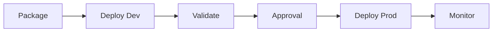
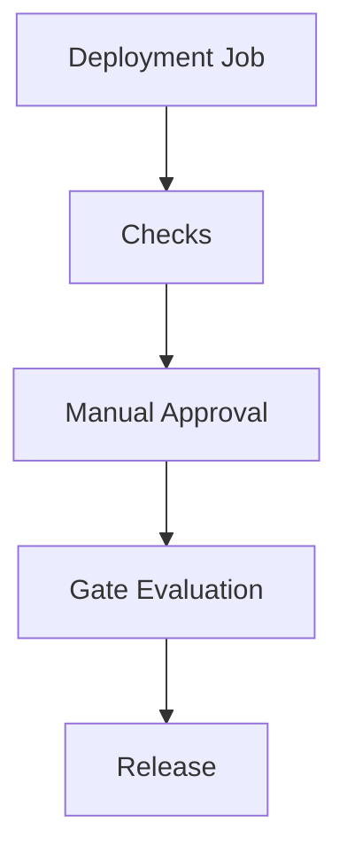
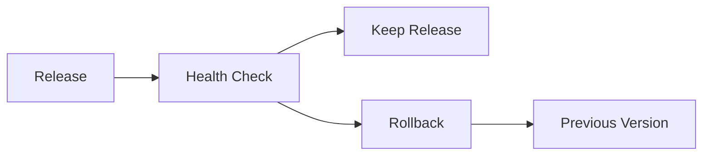
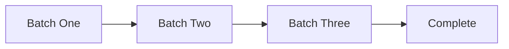
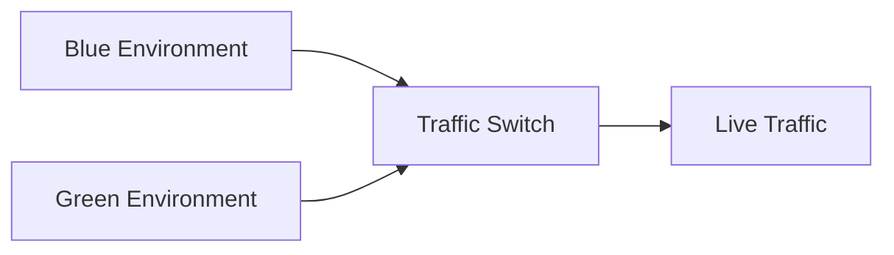
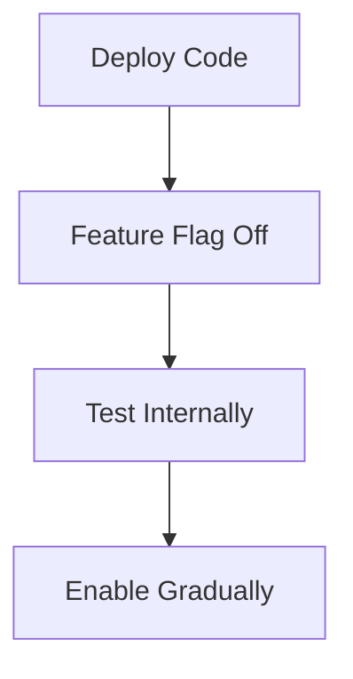

# 05 Azure Pipelines CD

> Delivery and deployment guide for Azure Pipelines using environments, approvals, checks, and safe rollout strategies.
>
> Disclaimer: Feature flag platforms, Ansible, Terraform modules, and external approval systems are included as reference patterns. Review vendor specific controls before production use.

## 5. Overview

- Modern Azure DevOps delivery should prefer YAML multi stage pipelines.
- Classic release pipelines remain useful for legacy estates and teams still transitioning.
- Production delivery should always include approvals, observability, and rollback planning.

## 5.1 Deployment strategy overview



## 5.2 Environment approval flow



## 5.3 Rollback model



## 6. Classic release pipelines vs YAML multi stage

| Model | Best fit | Strengths | Limitations |
|---|---|---|---|
| Classic release pipeline | Legacy environments or existing approvals in UI | Visual editor and familiar release gates | Configuration drift and less version control |
| YAML multi stage | Modern platform engineering | Versioned, reviewable, template friendly | Requires YAML discipline and repo governance |

## 7. Deployment strategies

### 7.1 Rolling deployment



- Deploys to a subset of targets at a time.
- Best for VM scale sets or cluster nodes.
- Validate each batch before continuing.

### 7.2 Blue green deployment



- Maintain two full environments.
- Cut traffic over only after validation.
- Costs more but rollback is fast.

### 7.3 Canary deployment


- Sends a small percentage of traffic to the new version.
- Best when strong monitoring and feature metrics exist.
- Roll back quickly if error rates rise.

### 7.4 Feature flags



- Decouple deployment from release.
- Useful for trunk based development and low risk rollback.

## 8. Environments and approvals

### 8.1 Create environments

- Navigation: `dev.azure.com` → project → `Pipelines` → `Environments` → `New environment`.
- Common environments:
  - dev
  - test
  - staging
  - production
- What the user sees:
  - environment list page with status badges
  - creation dialog with name and optional target resource type
  - deployment history when the environment already exists

### 8.2 Manual approvals and checks

- Navigation: `Pipelines` → `Environments` → select environment → `Approvals and checks`.
- Available controls commonly include:
  - manual approval
  - business hours
  - Azure Monitor query or alert checks
  - REST API checks
  - exclusive lock
  - branch control

### 8.3 Pre and post deployment conditions

- Pre deployment:
  - approvals
  - branch control
  - change window checks
- Post deployment:
  - smoke tests
  - monitoring gates
  - ticket updates or notifications

## 9. Deployment targets and YAML task examples

### 9.1 Azure App Service

```yaml
- task: AzureWebApp@1
  inputs:
    azureSubscription: sc-azure-dev
    appType: webAppLinux
    appName: app-web-dev
    package: $(Pipeline.Workspace)/app-drop/*.zip
```

### 9.2 Azure Kubernetes Service

```yaml
- task: KubernetesManifest@1
  inputs:
    action: deploy
    kubernetesServiceConnection: sc-aks-dev
    namespace: app
    manifests: |
      k8s/deployment.yml
      k8s/service.yml
    containers: |
      contoso.azurecr.io/app-api:$(Build.BuildId)
```

### 9.3 Azure Container Instances

```yaml
- task: AzureCLI@2
  inputs:
    azureSubscription: sc-azure-dev
    scriptType: bash
    scriptLocation: inlineScript
    inlineScript: |
      az container create --resource-group rg-demo --name app-api-demo --image contoso.azurecr.io/app-api:$(Build.BuildId) --ip-address Public
```

### 9.4 Azure Functions

```yaml
- task: AzureFunctionApp@2
  inputs:
    azureSubscription: sc-azure-dev
    appType: functionAppLinux
    appName: fn-orders-dev
    package: $(Pipeline.Workspace)/app-drop/*.zip
```

### 9.5 Azure VM Scale Sets

```yaml
- task: AzureCLI@2
  inputs:
    azureSubscription: sc-azure-prod
    scriptType: bash
    scriptLocation: inlineScript
    inlineScript: |
      az vmss extension set --resource-group rg-prod --vmss-name vmss-app-prod --name CustomScript --publisher Microsoft.Azure.Extensions --version 2.1 --settings '{"fileUris":[],"commandToExecute":"/opt/deploy.sh $(Build.BuildId)"}'
```

## 10. Infrastructure as Code in pipelines

### 10.1 Terraform pipeline steps

```yaml
- task: AzureCLI@2
  inputs:
    azureSubscription: sc-azure-platform
    scriptType: bash
    scriptLocation: inlineScript
    inlineScript: |
      terraform init
      terraform plan -out tfplan
      terraform apply -auto-approve tfplan
```

### 10.2 ARM or Bicep deployment

```yaml
- task: AzureResourceManagerTemplateDeployment@3
  inputs:
    deploymentScope: Resource Group
    azureResourceManagerConnection: sc-azure-dev
    subscriptionId: $(subscriptionId)
    action: Create Or Update Resource Group
    resourceGroupName: rg-app-dev
    location: eastus
    templateLocation: Linked artifact
    csmFile: infra/main.bicep
```

### 10.3 Ansible integration

```yaml
- task: Ansible@0
  inputs:
    ansibleInterface: agentMachine
    playbookPathOnAgentMachine: ansible/site.yml
```

## 11. Secrets management

### 11.1 Azure Key Vault integration

- Navigation: `Pipelines` → `Library` → `Variable groups` → `Link secrets from an Azure key vault as variables`.
- Use Key Vault for secret rotation and central management.

```yaml
variables:
  - group: vg-kv-prod
steps:
  - task: AzureKeyVault@2
    inputs:
      azureSubscription: sc-azure-prod
      KeyVaultName: kv-prod-platform
      SecretsFilter: db-password,api-key
      RunAsPreJob: true
```

### 11.2 Secret variable guidance

- Mark secrets as secret variables.
- Avoid command line arguments for highly sensitive values when logs may capture them.
- Use managed identity for agent to Azure auth when feasible.

## 12. Monitoring deployments and rollback

### 12.1 Deployment gates

- Azure Monitor alert based checks.
- REST API validation checks.
- Query work item or CAB system before promotion where required.

### 12.2 Rollback strategies

- Redeploy previous artifact.
- Switch traffic back in blue green pattern.
- Revert flag state for feature flag release.
- Run infrastructure rollback only when state model supports it safely.

## 13. End to end multi stage pipeline

```yaml
trigger:
  branches:
    include:
      - main
pool:
  vmImage: ubuntu-latest
variables:
  - group: vg-app-common
stages:
  - stage: Build
    jobs:
      - job: BuildAndTest
        steps:
          - script: npm ci
          - script: npm test
          - script: npm run build
          - task: PublishPipelineArtifact@1
            inputs:
              targetPath: dist
              artifact: app-drop
  - stage: DeployDev
    dependsOn: Build
    jobs:
      - deployment: DevDeploy
        environment: dev
        strategy:
          runOnce:
            deploy:
              steps:
                - download: current
                  artifact: app-drop
                - task: AzureWebApp@1
                  inputs:
                    azureSubscription: sc-azure-dev
                    appName: app-web-dev
                    package: $(Pipeline.Workspace)/app-drop/*.zip
  - stage: ProdApproval
    dependsOn: DeployDev
    jobs:
      - job: WaitForApproval
        pool: server
        steps:
          - script: echo Approval handled by environment checks
  - stage: DeployProd
    dependsOn: ProdApproval
    jobs:
      - deployment: ProdDeploy
        environment: production
        strategy:
          runOnce:
            deploy:
              steps:
                - download: current
                  artifact: app-drop
                - task: AzureWebApp@1
                  inputs:
                    azureSubscription: sc-azure-prod
                    appName: app-web-prod
                    package: $(Pipeline.Workspace)/app-drop/*.zip
```

## 14. CLI commands and expected output

```bash
az pipelines release definition list --organization https://dev.azure.com/contoso --project Platform --output table
az pipelines runs show --id <runId> --organization https://dev.azure.com/contoso --project Platform --output table
```

Expected output:
- Release definition list shows classic release definitions if present.
- Run details show stage state, result, and links to logs.

## 15. Best practices checklist

- Use environments for every real deployment target.
- Keep deployment logic versioned in YAML.
- Separate build artifacts from deploy configuration.
- Require approval and monitoring for production.
- Prefer progressive delivery over all at once release.
- Test rollback regularly.


## 16. Classic release pipeline screen guide

- Navigation: `dev.azure.com` → project → `Pipelines` → `Releases`.
- What the user sees:
  - stage boxes aligned left to right
  - artifact sources at the top
  - lightning icons for triggers and pre deployment conditions
  - task list within each stage
- Use classic release only when you must preserve a legacy process that is not yet modeled in YAML.

## 17. Environment checks examples

### 17.1 Branch control

- Permit deployments only from protected branches such as `main` or `release/*`.
- Useful for production environments that should never deploy directly from feature branches.

### 17.2 Exclusive lock

- Prevent concurrent deployments into the same target.
- Important for shared test or production environments.

### 17.3 REST API gate

- Query an approval or CAB system before allowing deployment.
- Fail closed when the downstream system is unavailable unless policy states otherwise.

## 18. Operational best practices

- Keep deployment jobs idempotent.
- Record artifact version, git commit, and environment name in deployment logs.
- Run smoke tests immediately after deployment.
- Notify teams through approved chat or incident systems.
- Restrict production service connections to deployment jobs only.

## 19. Official Microsoft references

- [Deployment jobs](https://learn.microsoft.com/azure/devops/pipelines/process/deployment-jobs)
- [Environments](https://learn.microsoft.com/azure/devops/pipelines/process/environments)
- [Approvals and checks](https://learn.microsoft.com/azure/devops/pipelines/process/approvals)
- [Deploy to App Service](https://learn.microsoft.com/azure/devops/pipelines/apps/cd/deploy-webdeploy-webapps)
- [Deploy to AKS](https://learn.microsoft.com/azure/devops/pipelines/ecosystems/kubernetes/deploy)
- [Azure Key Vault task](https://learn.microsoft.com/azure/devops/pipelines/tasks/reference/azure-key-vault-v2)
