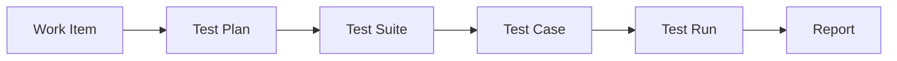
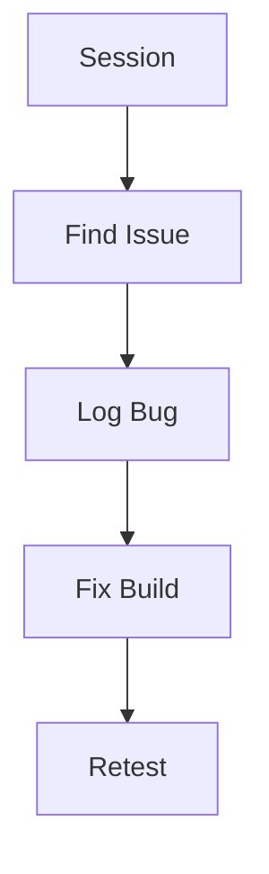
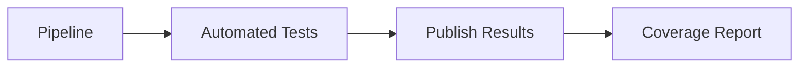

> **Screenshot Disclaimer:** Screenshots in this guide are sourced from [Microsoft Learn](https://learn.microsoft.com/en-us/azure/devops/) documentation. © Microsoft Corporation. All rights reserved. Used here for educational and reference purposes only. For the latest UI and features, always refer to the official documentation.

# 06 Azure Test Plans

Azure Test Plans helps teams organize manual validation, exploratory testing, and release-quality evidence in the same platform used for work, code, and pipelines. This guide explains what Test Plans is for, when to use it, and how to turn testing into a meaningful part of release readiness rather than an isolated activity.

> [!NOTE]
> Test Plans adds the most value when it supports release and risk decisions. Focus on high-value coverage, traceability, and reusable evidence rather than building huge libraries of rarely used test cases.

> [!TIP]
> Structure plans and suites around releases, products, or major workflows. When test organization follows real ownership and release scope, maintenance becomes much easier.

> [!IMPORTANT]
> Manual test management features depend on the correct Azure DevOps access level. Confirm licensing before you design a process around Test Plans.

## Guide objectives

- Explain where Test Plans fits alongside Boards and Pipelines.
- Create reusable manual and exploratory test structures.
- Publish and combine automated evidence with manual validation.
- Support release readiness and defect triage with stronger traceability.

## Microsoft Learn screenshots

> 
>
> *Screenshot source: [Microsoft Learn — What is Azure DevOps?](https://learn.microsoft.com/en-us/azure/devops/user-guide/what-is-azure-devops?view=azure-devops). © Microsoft Corporation. Used for educational reference only.*

> 
>
> *Screenshot source: [Microsoft Learn — What is Azure DevOps?](https://learn.microsoft.com/en-us/azure/devops/user-guide/what-is-azure-devops?view=azure-devops). © Microsoft Corporation. Used for educational reference only.*

> 
>
> *Screenshot source: [Microsoft Learn — What is Azure Boards](https://learn.microsoft.com/en-us/azure/devops/boards/get-started/what-is-azure-boards?view=azure-devops). © Microsoft Corporation. Used for educational reference only.*

## Prerequisites

- An Azure DevOps project with Test Plans available and licensed users.
- A backlog or requirement model in Azure Boards.
- Defined release or quality gates that testing should inform.
- Owners for test design, execution, defect triage, and sign-off.

## Quick decision guide

| Decision area | Why it matters | Recommended baseline |
|---|---|---|
| Plan scope | Controls ownership and reporting | Use release, product, or milestone boundaries |
| Suite type | Shapes how cases are grouped | Choose static, requirement-based, or query-based intentionally |
| Manual vs automated | Determines evidence model | Use both where they add distinct value |
| Exploratory testing | Finds unknown risks | Use for discovery and edge cases |
| Defect flow | Connects quality to backlog and engineering | Log actionable bugs with clear context |

## Portal-view fallback references

> **Portal view fallback:** Microsoft Learn does not expose stable image assets for every Test Plans screen. Use the live article to compare the current plan, suite, and run experience in your tenant.
>
> For the most current Microsoft Learn walkthrough, review [What is Azure Test Plans?](https://learn.microsoft.com/en-us/azure/devops/test/overview?view=azure-devops).

> **Portal view fallback:** For the latest test runner layout and controls, compare your environment with the current Microsoft Learn walkthrough.
>
> For the most current Microsoft Learn walkthrough, review [Run manual tests](https://learn.microsoft.com/en-us/azure/devops/test/run-manual-tests?view=azure-devops).

## 6. Overview

- Azure Test Plans supports manual testing, exploratory sessions, traceability, and reporting.
- It works best when linked to Boards and Pipelines.

## 6.1 Test flow



## 6.2 Exploratory loop



## 6.3 Automated result flow



## 7. Manual testing

- Navigation: `dev.azure.com` → project → `Test Plans`.
- Core objects:
  - test plan
  - test suite
  - test case
  - test run
- Portal landmarks:
  - the left pane organizes plans and suites so testers can move between release scopes and feature areas quickly
  - the center grid lists cases, assignments, and outcomes for the currently selected suite
  - the toolbar exposes execution, assignment, cloning, and export actions that support day-to-day test management

## 8. Exploratory testing

- Use the Test and Feedback browser extension for session capture.
- Record notes, screenshots, and bugs while exploring the app.
- Link findings directly to work items.

## 9. Automated test integration

### 9.1 Publish results in pipelines

```yaml
- task: PublishTestResults@2
  inputs:
    testResultsFormat: JUnit
    testResultsFiles: '**/test-results.xml'
```

### 9.2 Code coverage

```yaml
- task: PublishCodeCoverageResults@2
  inputs:
    codeCoverageTool: Cobertura
    summaryFileLocation: '**/coverage.xml'
```

### 9.3 Expected output

- Pipeline summary shows passed and failed counts.
- Tests tab displays duration, owner, and failure details.
- Coverage tab or attached report shows line coverage percentage.

## 10. Load testing overview

- Azure DevOps no longer provides the old cloud load testing service.
- Common pattern is to run load tests with external tooling and publish results back to dashboards or work items.
- Keep environment sizing and realistic test data documented.

## 11. Analytics and reporting

- Track pass rate by suite, area, and release.
- Use dashboards for failure trends and release readiness.
- Link defects to failed tests for root cause visibility.


## 12. Test plan structure details

### 12.1 Suite types

| Suite type | Best use | Notes |
|---|---|---|
| Static suite | Hand curated cases | Good for stable regression sets |
| Requirement based suite | Trace to backlog items | Useful for release evidence |
| Query based suite | Dynamic membership | Good for bug or risk focused test sets |

### 12.2 Test case design tips

- Write one observable intent per test case.
- Keep expected results explicit.
- Attach screenshots or data prerequisites only when needed.
- Link each case to the owning requirement or bug.

## 13. Screen guide

- Plan list screen shows plans on the left and suites nested below.
- Test runner opens as a guided execution panel with pass, fail, block, and pause actions.
- Result summary screen shows outcome counts, tester identity, attachments, and comments.
- Exploratory extension panel shows captured notes, screenshots, browser details, and bug creation shortcuts.

## 14. Reporting metrics to watch

- Passed rate by suite.
- Failed rate by environment.
- Reopened bug count after release.
- Manual versus automated coverage by feature.
- Mean time from failed test to fixed build.

## 15. Practical workflow example

1. Create a plan for the release.
2. Add requirement based suites from committed backlog items.
3. Assign test cases to testers.
4. Run manual tests in staging.
5. Log defects with screenshots and reproduction steps.
6. Rerun affected tests after the fix pipeline succeeds.
7. Capture final evidence in dashboards or release records.


## 16. Suite execution and evidence collection

### 16.1 Manual runner guidance

- Use pass, fail, and block consistently.
- Capture exact observed result when failing a step.
- Attach logs, screenshots, and environment details only when they add value.
- Record the build number and environment name in run comments.

### 16.2 Traceability guidance

- Link test cases to user stories or PBIs.
- Link failed runs to bugs.
- Link release evidence to the final validation run.
- Use requirement based suites when auditors need direct requirement mapping.

### 16.3 Test analytics signals

| Signal | Why it matters |
|---|---|
| High failure concentration in one suite | May show unstable feature area |
| Repeated blocked tests | Often points to environment problems |
| Low coverage on critical features | Increases release risk |
| High rerun rate | May indicate flaky tests or poor data quality |

## 17. Best practices checklist

- Keep regression suites stable and small enough to finish on time.
- Retire duplicate or obsolete test cases.
- Publish automated results into the same release evidence stream.
- Use exploratory testing for new or high risk features.
- Review flaky automated tests weekly.

## 18. Official Microsoft references

- [Azure Test Plans overview](https://learn.microsoft.com/azure/devops/test/overview)
- [Manual test plans and suites](https://learn.microsoft.com/azure/devops/test/create-a-test-plan)
- [Publish test results](https://learn.microsoft.com/azure/devops/pipelines/test/publish-test-results)
- [Publish code coverage](https://learn.microsoft.com/azure/devops/pipelines/test/review-code-coverage-results)

## Real-world scenarios and examples

### Scenario 1: Release validation for landing zone onboarding

A platform team needs manual regression checks for onboarding a new Azure subscription into the landing zone pattern. Test Plans helps structure that validation and connect it to defects and releases.


Implementation flow:

1. Create a release-specific test plan.
2. Organize suites by policy, networking, identity, and logging.
3. Execute manual runs and log bugs from failures.
4. Review outcomes before production rollout.


Success indicators:

- Release blockers are visible.
- Defects are linked to the right requirements.
- Validation is easier to repeat.

### Scenario 2: Product team combining exploratory and automated testing

A product team already has CI-based regression, but still needs exploratory coverage for usability and edge cases. Azure DevOps can host both evidence types without forcing separate tools and disconnected reports.


Implementation flow:

1. Publish automated test results from pipelines.
2. Run exploratory sessions before significant releases.
3. Log defects directly into Boards.
4. Review both evidence types together at release time.


Success indicators:

- Quality conversations are more complete.
- Exploratory findings are not lost.
- Release approval becomes more evidence-based.

### Scenario 3: QA team generating audit-friendly release evidence

A QA team in a regulated environment needs repeatable manual evidence and explicit defect posture for sign-off. Test Plans provides a stronger path than ad hoc spreadsheets or email trails.


Implementation flow:

1. Create plans by release or milestone.
2. Link cases to requirements.
3. Record pass, fail, and blocked outcomes formally.
4. Use bug queries and test outcomes during sign-off.


Success indicators:

- Evidence retrieval improves.
- Sign-off is more consistent.
- Defect traceability is easier to explain.

## Operating model checklist

- Review stale test cases and redundant suites on a release cadence.
- Track which manual checks could become automated over time.
- Use defect trends and escaped defects to improve plan quality.
- Keep release-quality summaries concise enough to influence real decisions.

## Official Microsoft References

- [What is Azure Test Plans?](https://learn.microsoft.com/en-us/azure/devops/test/overview?view=azure-devops)
- [Create test plans and test suites](https://learn.microsoft.com/en-us/azure/devops/test/create-a-test-plan?view=azure-devops)
- [Run manual tests](https://learn.microsoft.com/en-us/azure/devops/test/run-manual-tests?view=azure-devops)
- [Perform exploratory testing](https://learn.microsoft.com/en-us/azure/devops/test/perform-exploratory-tests?view=azure-devops)
- [Publish test results task](https://learn.microsoft.com/en-us/azure/devops/pipelines/tasks/reference/publish-test-results-v2?view=azure-pipelines)
- [Azure DevOps CLI reference](https://learn.microsoft.com/en-us/azure/devops/cli/?view=azure-devops)
