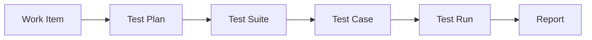
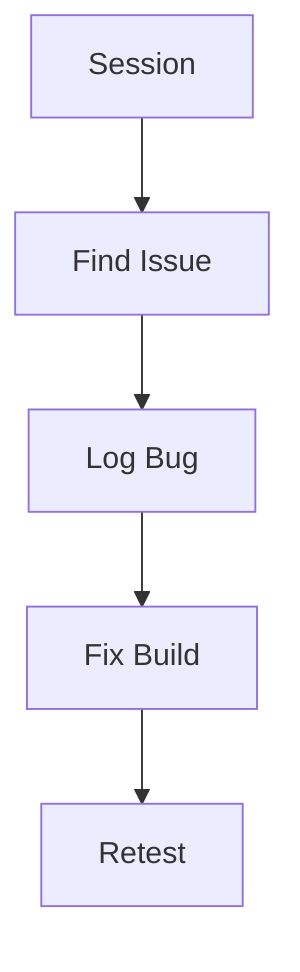

# 06 Azure Test Plans

> Test management guide for manual, exploratory, and automated validation in Azure DevOps.
>
> Disclaimer: Browser extensions and external load testing tools are mentioned for reference. Validate browser policies, telemetry retention, and vendor support before rollout.

## 6. Overview

- Azure Test Plans supports manual testing, exploratory sessions, traceability, and reporting.
- It works best when linked to Boards and Pipelines.

## 6.1 Test flow



## 6.2 Exploratory loop



## 6.3 Automated result flow


## 7. Manual testing

- Navigation: `dev.azure.com` → project → `Test Plans`.
- Core objects:
  - test plan
  - test suite
  - test case
  - test run
- What the user sees:
  - left tree with plans and suites
  - center grid listing cases and outcomes
  - toolbar for run, assign, clone, and export actions

## 8. Exploratory testing

- Use the Test and Feedback browser extension for session capture.
- Record notes, screenshots, and bugs while exploring the app.
- Link findings directly to work items.

## 9. Automated test integration

### 9.1 Publish results in pipelines

```yaml
- task: PublishTestResults@2
  inputs:
    testResultsFormat: JUnit
    testResultsFiles: '**/test-results.xml'
```

### 9.2 Code coverage

```yaml
- task: PublishCodeCoverageResults@2
  inputs:
    codeCoverageTool: Cobertura
    summaryFileLocation: '**/coverage.xml'
```

### 9.3 Expected output

- Pipeline summary shows passed and failed counts.
- Tests tab displays duration, owner, and failure details.
- Coverage tab or attached report shows line coverage percentage.

## 10. Load testing overview

- Azure DevOps no longer provides the old cloud load testing service.
- Common pattern is to run load tests with external tooling and publish results back to dashboards or work items.
- Keep environment sizing and realistic test data documented.

## 11. Analytics and reporting

- Track pass rate by suite, area, and release.
- Use dashboards for failure trends and release readiness.
- Link defects to failed tests for root cause visibility.


## 12. Test plan structure details

### 12.1 Suite types

| Suite type | Best use | Notes |
|---|---|---|
| Static suite | Hand curated cases | Good for stable regression sets |
| Requirement based suite | Trace to backlog items | Useful for release evidence |
| Query based suite | Dynamic membership | Good for bug or risk focused test sets |

### 12.2 Test case design tips

- Write one observable intent per test case.
- Keep expected results explicit.
- Attach screenshots or data prerequisites only when needed.
- Link each case to the owning requirement or bug.

## 13. Screen guide

- Plan list screen shows plans on the left and suites nested below.
- Test runner opens as a guided execution panel with pass, fail, block, and pause actions.
- Result summary screen shows outcome counts, tester identity, attachments, and comments.
- Exploratory extension panel shows captured notes, screenshots, browser details, and bug creation shortcuts.

## 14. Reporting metrics to watch

- Passed rate by suite.
- Failed rate by environment.
- Reopened bug count after release.
- Manual versus automated coverage by feature.
- Mean time from failed test to fixed build.

## 15. Practical workflow example

1. Create a plan for the release.
2. Add requirement based suites from committed backlog items.
3. Assign test cases to testers.
4. Run manual tests in staging.
5. Log defects with screenshots and reproduction steps.
6. Rerun affected tests after the fix pipeline succeeds.
7. Capture final evidence in dashboards or release records.


## 16. Suite execution and evidence collection

### 16.1 Manual runner guidance

- Use pass, fail, and block consistently.
- Capture exact observed result when failing a step.
- Attach logs, screenshots, and environment details only when they add value.
- Record the build number and environment name in run comments.

### 16.2 Traceability guidance

- Link test cases to user stories or PBIs.
- Link failed runs to bugs.
- Link release evidence to the final validation run.
- Use requirement based suites when auditors need direct requirement mapping.

### 16.3 Test analytics signals

| Signal | Why it matters |
|---|---|
| High failure concentration in one suite | May show unstable feature area |
| Repeated blocked tests | Often points to environment problems |
| Low coverage on critical features | Increases release risk |
| High rerun rate | May indicate flaky tests or poor data quality |

## 17. Best practices checklist

- Keep regression suites stable and small enough to finish on time.
- Retire duplicate or obsolete test cases.
- Publish automated results into the same release evidence stream.
- Use exploratory testing for new or high risk features.
- Review flaky automated tests weekly.

## 18. Official Microsoft references

- [Azure Test Plans overview](https://learn.microsoft.com/azure/devops/test/overview)
- [Manual test plans and suites](https://learn.microsoft.com/azure/devops/test/create-a-test-plan)
- [Publish test results](https://learn.microsoft.com/azure/devops/pipelines/test/publish-test-results)
- [Publish code coverage](https://learn.microsoft.com/azure/devops/pipelines/test/review-code-coverage-results)
