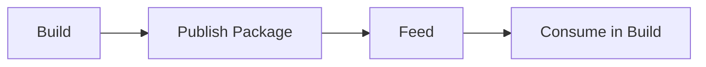
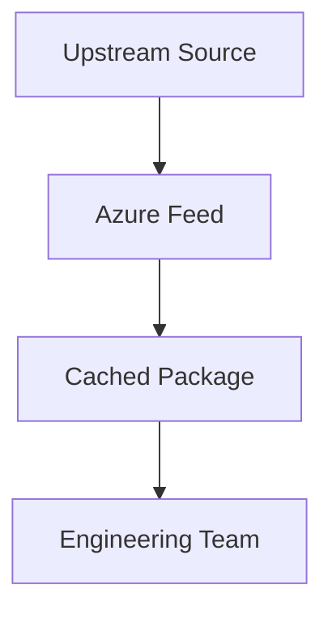
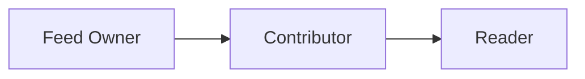

# 07 Azure Artifacts

> Feed design and package management guide for Azure Artifacts.
>
> Disclaimer: Upstream package ecosystems such as npmjs, NuGet, Maven Central, and PyPI are external services. Review licensing, provenance, and package trust controls before allowing consumption in production.

## 7. Overview

- Azure Artifacts hosts private packages and proxies approved upstream sources.
- It reduces dependency sprawl and helps standardize internal package consumption.

## 7.1 Feed lifecycle



## 7.2 Upstream model



## 7.3 Permission model



## 8. Feed creation and management

- Navigation: `dev.azure.com` → project → `Artifacts` → `Create Feed`.
- Choose:
  - feed name
  - project or organization scope
  - upstream sources
- What the user sees:
  - feed wizard with scope and visibility options
  - package type guidance cards
  - connection instructions after creation

## 9. Package types

- NuGet
- npm
- Maven
- Python
- Universal packages

## 10. Upstream sources

- `nuget.org`
- `npmjs.com`
- `Maven Central`
- `PyPI` where configured
- Use upstreams to cache approved packages closer to the org.

## 11. Publishing from pipelines

```yaml
- task: UniversalPackages@0
  inputs:
    command: publish
    publishDirectory: $(Build.ArtifactStagingDirectory)
    vstsFeedPublish: platform-feed
    vstsFeedPackagePublish: app-drop
    versionOption: patch
```

## 12. Consuming packages in builds

```bash
az artifacts universal download --organization https://dev.azure.com/contoso --project Platform --feed platform-feed --name app-drop --version 1.0.0 --path .
```

Expected output:
- Download command retrieves the package into the local path and reports package version metadata.

## 13. Retention and permissions

- Use retention rules to remove unneeded old versions.
- Separate publish permissions from read permissions.
- Keep feed owners limited to package platform admins.
- Use project scoped feeds where teams should not share packages broadly.


## 14. Feed scope and permission models

### 14.1 Scope choices

| Scope | Best fit | Trade off |
|---|---|---|
| Project scoped feed | Team specific dependencies | Less sharing across projects |
| Organization scoped feed | Shared platform packages | Needs stronger central governance |

### 14.2 Permission examples

| Role | Typical action |
|---|---|
| Owner | Manage feed settings and permissions |
| Contributor | Publish and update packages |
| Reader | Download and restore packages |
| Collaborator | Consume upstream and selected feed actions |

## 15. Publishing examples by package type

### 15.1 NuGet

```bash
dotnet nuget push ./nupkgs/Contoso.Platform.1.0.0.nupkg --source "https://pkgs.dev.azure.com/contoso/_packaging/platform-feed/nuget/v3/index.json" --api-key az
```

### 15.2 npm

```bash
npm publish --registry https://pkgs.dev.azure.com/contoso/_packaging/platform-feed/npm/registry/
```

### 15.3 Python

```bash
python -m twine upload --repository-url https://pkgs.dev.azure.com/contoso/_packaging/platform-feed/pypi/upload/ dist/*
```

Expected output:
- Publish commands report uploaded package name, version, and feed endpoint.

## 16. Retention and cleanup guidance

- Keep enough versions for rollback and support.
- Remove pre release packages that are no longer referenced.
- Monitor storage growth in high volume feeds.
- Promote packages through versioning and views rather than copying manual files.


## 17. Feed views and package promotion

- Use views such as `local`, `test`, and `release` when teams need a promotion model.
- Promote approved packages rather than rebuilding the same version in multiple places.
- Document who can promote packages into the release view.

## 18. Authentication and security guidance

- Prefer service connections or pipeline scoped authentication over personal accounts.
- Rotate publish credentials on a defined schedule.
- Restrict who can publish to shared feeds.
- Review package provenance and signing options where your ecosystem supports them.

## 19. Operational checklist

- Audit feed permissions quarterly.
- Remove obsolete prerelease versions.
- Track storage growth and upstream cache behavior.
- Keep `.npmrc`, `NuGet.config`, and similar source files standardized in templates.

## 20. Consumption tips

- Use feed views for dev, test, and release promotion if your package model requires separation.
- Centralize package source configuration in build templates.
- Pin versions for reproducible builds.
- Review upstream caching behavior for security sensitive packages.

## 21. Official Microsoft references

- [Azure Artifacts overview](https://learn.microsoft.com/azure/devops/artifacts/start-using-azure-artifacts)
- [Create and connect to feeds](https://learn.microsoft.com/azure/devops/artifacts/get-started-nuget)
- [Upstream sources](https://learn.microsoft.com/azure/devops/artifacts/concepts/upstream-sources)
- [Universal packages](https://learn.microsoft.com/azure/devops/artifacts/quickstarts/universal-packages)
