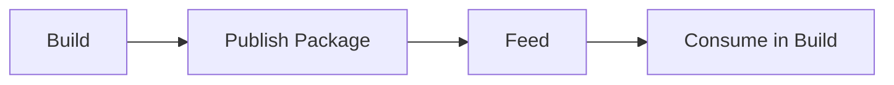
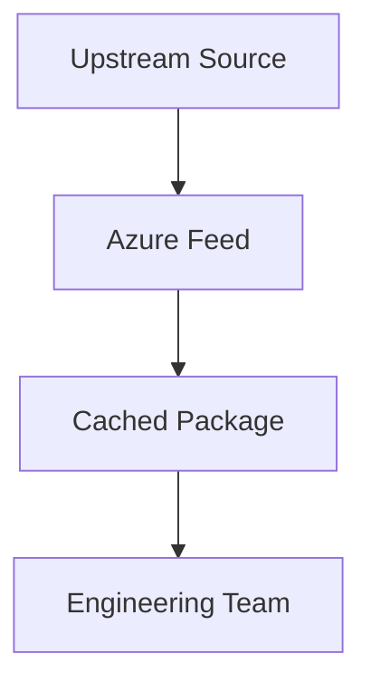

> **Screenshot Disclaimer:** Screenshots in this guide are sourced from [Microsoft Learn](https://learn.microsoft.com/en-us/azure/devops/) documentation. © Microsoft Corporation. All rights reserved. Used here for educational and reference purposes only. For the latest UI and features, always refer to the official documentation.

# 07 Azure Artifacts

Azure Artifacts helps teams publish, store, and consume trusted packages without depending on unmanaged public package flows. This guide explains how to design feeds, enable upstream sources intentionally, publish through CI, and operate package governance as part of the software supply chain.

> [!NOTE]
> Artifacts is most useful when it reduces dependency sprawl and strengthens provenance. If teams keep restoring directly from public sources, the platform loses much of its governance value.

> [!TIP]
> Design feeds around ownership and trust boundaries first. Clear feed scope makes permissions, retention, and onboarding much easier to understand.

> [!IMPORTANT]
> Publishing is a change-control event. Separate package publish rights from package read rights and review publisher access regularly.

## Guide objectives

- Create feed structures that match team ownership and package-sharing needs.
- Use upstream sources intentionally instead of letting public package usage sprawl.
- Publish versioned packages from reviewed pipelines.
- Manage retention and deprecation without losing rollback capability.

## Microsoft Learn screenshots

> 
>
> *Screenshot source: [Microsoft Learn — What is Azure DevOps?](https://learn.microsoft.com/en-us/azure/devops/user-guide/what-is-azure-devops?view=azure-devops). © Microsoft Corporation. Used for educational reference only.*

> 
>
> *Screenshot source: [Microsoft Learn — What is Azure DevOps?](https://learn.microsoft.com/en-us/azure/devops/user-guide/what-is-azure-devops?view=azure-devops). © Microsoft Corporation. Used for educational reference only.*

> 
>
> *Screenshot source: [Microsoft Learn — Use an Azure Resource Manager service connection](https://learn.microsoft.com/en-us/azure/devops/pipelines/library/connect-to-azure?view=azure-devops). © Microsoft Corporation. Used for educational reference only.*

## Prerequisites

- An Azure DevOps organization or project with Artifacts enabled.
- An agreed package strategy covering internal packages and approved upstreams.
- Package-manager tooling on developer workstations and build agents.
- A retention and package-ownership model.

## Quick decision guide

| Decision area | Why it matters | Recommended baseline |
|---|---|---|
| Project-scoped feed | Best for team-local packages | Use when reuse is limited |
| Organization-scoped feed | Best for shared platform packages | Use with strong ownership and permission control |
| Upstream sources | Control public ingress | Enable only approved sources |
| Retention | Balances rollback and storage | Base it on support windows |
| Publish identity | Controls package provenance | Prefer CI-driven publishing |

## Portal-view fallback references

> **Portal view fallback:** Connection screens and package-manager instructions change over time. Use the live Microsoft Learn articles for current feed setup and authentication details.
>
> For the most current Microsoft Learn walkthrough, review [What is Azure Artifacts?](https://learn.microsoft.com/en-us/azure/devops/artifacts/start-using-azure-artifacts?view=azure-devops).

> **Portal view fallback:** For current package-manager examples, compare your tenant with the latest Microsoft Learn connection walkthrough.
>
> For the most current Microsoft Learn walkthrough, review [Connect to a feed as a NuGet source](https://learn.microsoft.com/en-us/azure/devops/artifacts/get-started-nuget?view=azure-devops).

## 7. Overview

- Azure Artifacts hosts private packages and proxies approved upstream sources.
- It reduces dependency sprawl and helps standardize internal package consumption.

## 7.1 Feed lifecycle



## 7.2 Upstream model



## 7.3 Permission model


## 8. Feed creation and management

- Navigation: `dev.azure.com` → project → `Artifacts` → `Create Feed`.
- Choose:
  - feed name
  - project or organization scope
  - upstream sources
- Portal landmarks:
  - the feed wizard emphasizes scope, visibility, and upstream settings because those choices define long-term governance
  - package-type guidance cards help teams pick the right client configuration path for NuGet, npm, Maven, Python, or universal packages
  - after creation, Azure DevOps surfaces connection instructions so developers can onboard their tools immediately

## 9. Package types

- NuGet
- npm
- Maven
- Python
- Universal packages

## 10. Upstream sources

- `nuget.org`
- `npmjs.com`
- `Maven Central`
- `PyPI` where configured
- Use upstreams to cache approved packages closer to the org.

## 11. Publishing from pipelines

```yaml
- task: UniversalPackages@0
  inputs:
    command: publish
    publishDirectory: $(Build.ArtifactStagingDirectory)
    vstsFeedPublish: platform-feed
    vstsFeedPackagePublish: app-drop
    versionOption: patch
```

## 12. Consuming packages in builds

```bash
az artifacts universal download --organization https://dev.azure.com/contoso --project Platform --feed platform-feed --name app-drop --version 1.0.0 --path .
```

Expected output:
- Download command retrieves the package into the local path and reports package version metadata.

## 13. Retention and permissions

- Use retention rules to remove unneeded old versions.
- Separate publish permissions from read permissions.
- Keep feed owners limited to package platform admins.
- Use project scoped feeds where teams should not share packages broadly.


## 14. Feed scope and permission models

### 14.1 Scope choices

| Scope | Best fit | Trade off |
|---|---|---|
| Project scoped feed | Team specific dependencies | Less sharing across projects |
| Organization scoped feed | Shared platform packages | Needs stronger central governance |

### 14.2 Permission examples

| Role | Typical action |
|---|---|
| Owner | Manage feed settings and permissions |
| Contributor | Publish and update packages |
| Reader | Download and restore packages |
| Collaborator | Consume upstream and selected feed actions |

## 15. Publishing examples by package type

### 15.1 NuGet

```bash
dotnet nuget push ./nupkgs/Contoso.Platform.1.0.0.nupkg --source "https://pkgs.dev.azure.com/contoso/_packaging/platform-feed/nuget/v3/index.json" --api-key az
```

### 15.2 npm

```bash
npm publish --registry https://pkgs.dev.azure.com/contoso/_packaging/platform-feed/npm/registry/
```

### 15.3 Python

```bash
python -m twine upload --repository-url https://pkgs.dev.azure.com/contoso/_packaging/platform-feed/pypi/upload/ dist/*
```

Expected output:
- Publish commands report uploaded package name, version, and feed endpoint.

## 16. Retention and cleanup guidance

- Keep enough versions for rollback and support.
- Remove pre release packages that are no longer referenced.
- Monitor storage growth in high volume feeds.
- Promote packages through versioning and views rather than copying manual files.


## 17. Feed views and package promotion

- Use views such as `local`, `test`, and `release` when teams need a promotion model.
- Promote approved packages rather than rebuilding the same version in multiple places.
- Document who can promote packages into the release view.

## 18. Authentication and security guidance

- Prefer service connections or pipeline scoped authentication over personal accounts.
- Rotate publish credentials on a defined schedule.
- Restrict who can publish to shared feeds.
- Review package provenance and signing options where your ecosystem supports them.

## 19. Operational checklist

- Audit feed permissions quarterly.
- Remove obsolete prerelease versions.
- Track storage growth and upstream cache behavior.
- Keep `.npmrc`, `NuGet.config`, and similar source files standardized in templates.

## 20. Consumption tips

- Use feed views for dev, test, and release promotion if your package model requires separation.
- Centralize package source configuration in build templates.
- Pin versions for reproducible builds.
- Review upstream caching behavior for security sensitive packages.

## 21. Official Microsoft references

- [Azure Artifacts overview](https://learn.microsoft.com/azure/devops/artifacts/start-using-azure-artifacts)
- [Create and connect to feeds](https://learn.microsoft.com/azure/devops/artifacts/get-started-nuget)
- [Upstream sources](https://learn.microsoft.com/azure/devops/artifacts/concepts/upstream-sources)
- [Universal packages](https://learn.microsoft.com/azure/devops/artifacts/quickstarts/universal-packages)

## Real-world scenarios and examples

### Scenario 1: Shared platform feed for reusable deployment bundles

A platform team publishes reusable packages and deployment bundles for many application teams. A well-governed feed lets them share those assets without turning package distribution into an unmanaged file-copy problem.


Implementation flow:

1. Create a shared feed with clear owners.
2. Publish from reviewed pipelines.
3. Expose read access to approved consumer teams.
4. Track deprecation and support windows.


Success indicators:

- Package reuse increases.
- Consumers have a trusted source.
- Publish quality is easier to control.

### Scenario 2: Application team consuming approved npm and NuGet dependencies

An app team wants restore paths that are easier to review and support than direct public-source access from every developer machine and build agent.


Implementation flow:

1. Enable only the approved upstreams.
2. Update package sources to use Azure Artifacts.
3. Validate restore from CI and developer workstations.
4. Monitor dependency usage and stale versions.


Success indicators:

- Dependency sources are clearer.
- Builds are more consistent.
- Support is easier because teams use the same restore path.

### Scenario 3: Regulated team preserving rollback-capable package history

A regulated environment needs enough retained versions for rollback and audit, but not infinite package growth. Azure Artifacts supports that balance when retention is tied to real support commitments.


Implementation flow:

1. Define supported versions and retention windows.
2. Tag or document packages used in production releases.
3. Test that rollback versions remain downloadable.
4. Deprecate obsolete packages deliberately.


Success indicators:

- Rollback packages remain available.
- Storage stays under control.
- Package provenance is easier to demonstrate.

## Operating model checklist

- Review publish permissions and feed owners on a schedule.
- Track stale versions and deprecations before storage becomes noisy.
- Keep package connection guidance current for each ecosystem you support.
- Validate that retained versions still satisfy rollback assumptions.

## Official Microsoft References

- [What is Azure Artifacts?](https://learn.microsoft.com/en-us/azure/devops/artifacts/start-using-azure-artifacts?view=azure-devops)
- [Get started with Azure Artifacts feeds](https://learn.microsoft.com/en-us/azure/devops/artifacts/artifacts-get-started?view=azure-devops)
- [Connect to a feed as a NuGet source](https://learn.microsoft.com/en-us/azure/devops/artifacts/get-started-nuget?view=azure-devops)
- [Use Azure Artifacts with npm](https://learn.microsoft.com/en-us/azure/devops/artifacts/npm/npmrc?view=azure-devops)
- [Publish and download Universal Packages](https://learn.microsoft.com/en-us/azure/devops/artifacts/quickstarts/universal-packages?view=azure-devops)
- [Azure DevOps CLI reference](https://learn.microsoft.com/en-us/azure/devops/cli/?view=azure-devops)
