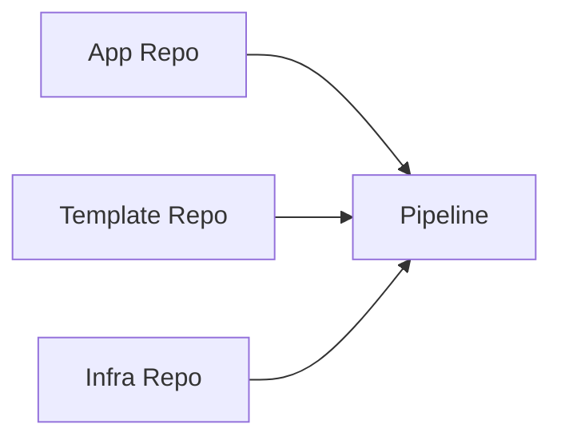
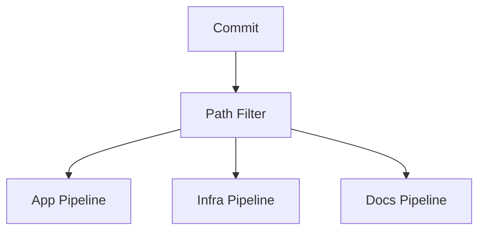
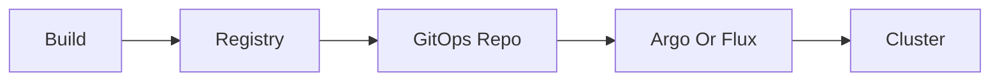

> **Screenshot Disclaimer:** Screenshots in this guide are sourced from [Microsoft Learn](https://learn.microsoft.com/en-us/azure/devops/) documentation. © Microsoft Corporation. All rights reserved. Used here for educational and reference purposes only. For the latest UI and features, always refer to the official documentation.

# 08 Advanced Patterns

Advanced Azure DevOps patterns help platform teams scale beyond a small number of repositories and pipelines. This guide explains how to reuse YAML through template libraries, support monorepos and multi-repo delivery, add GitOps-style handoff, govern shared controls, and manage self-hosted agents responsibly.

> [!NOTE]
> Advanced patterns amplify both strengths and weaknesses. If your core repo, pipeline, environment, and package standards are unstable, fix those first before adding more platform abstraction.

> [!TIP]
> Treat shared pipeline templates, decorators, and agent images as products. They need versioning, support, documentation, and release discipline, not just a convenient repository.

> [!IMPORTANT]
> Centralized controls should reduce unsafe variation without turning every delivery change into a platform bottleneck. Use guardrails, not needless bureaucracy.

## Guide objectives

- Scale Azure DevOps across many repositories, teams, and environments.
- Introduce reusable platform assets without losing team clarity.
- Choose between monorepo, multi-repo, and GitOps-style delivery intentionally.
- Operate self-hosted agents and governance controls with a product mindset.

## Microsoft Learn screenshots

> 
>
> *Screenshot source: [Microsoft Learn — What is Azure DevOps?](https://learn.microsoft.com/en-us/azure/devops/user-guide/what-is-azure-devops?view=azure-devops). © Microsoft Corporation. Used for educational reference only.*

> 
>
> *Screenshot source: [Microsoft Learn — What is Azure DevOps?](https://learn.microsoft.com/en-us/azure/devops/user-guide/what-is-azure-devops?view=azure-devops). © Microsoft Corporation. Used for educational reference only.*

> 
>
> *Screenshot source: [Microsoft Learn — Use an Azure Resource Manager service connection](https://learn.microsoft.com/en-us/azure/devops/pipelines/library/connect-to-azure?view=azure-devops). © Microsoft Corporation. Used for educational reference only.*

## Prerequisites

- Stable baseline practice for organization setup, repos, boards, CI, CD, and artifacts.
- A platform or architecture team that owns shared standards.
- An inventory of current repositories, pipelines, agents, and environments.
- A migration goal if replacing Jenkins or other legacy tooling.

## Quick decision guide

| Decision area | Why it matters | Recommended baseline |
|---|---|---|
| Template library | Reduces YAML duplication | Use once a reference pipeline pattern is proven |
| Monorepo | Improves coordinated change | Use only with strong ownership and path-aware automation |
| Multi-repo | Preserves team autonomy | Use when release cadence and ownership differ strongly |
| GitOps handoff | Separates build from reconciliation | Adopt when runtime operations prefer controller-based deployment |
| Self-hosted agents | Provide private reach or custom tooling | Limit to workloads that truly need them |

## Portal-view fallback references

> **Portal view fallback:** Template and shared-pipeline guidance evolves frequently. Use the live article to compare the current YAML authoring experience with your tenant.
>
> For the most current Microsoft Learn walkthrough, review [How to use YAML templates for reusable and secure pipelines](https://learn.microsoft.com/en-us/azure/devops/pipelines/process/templates?view=azure-devops).

> **Portal view fallback:** For ephemeral environment and deployment-history details, compare your UI with the latest Microsoft Learn environments article.
>
> For the most current Microsoft Learn walkthrough, review [Create and target Azure DevOps environments for pipelines](https://learn.microsoft.com/en-us/azure/devops/pipelines/process/environments?view=azure-devops).

## 8. Overview

- These patterns help when one project evolves into a platform with many repos, teams, and environments.
- Focus areas include reuse, governance, cost, and migration.

## 8.1 Multi repo pattern



## 8.2 Monorepo trigger pattern



## 8.3 GitOps handoff



## 9. Multi repo pipelines

- Use `resources.repositories` to pull templates or shared deployment code.
- Version pin shared templates with tags or protected branches.

```yaml
resources:
  repositories:
    - repository: templates
      type: git
      name: Platform/shared-templates
      ref: refs/heads/main
```

## 10. Pipeline template library

- Maintain centralized templates for build, scan, package, and deploy jobs.
- Require template reviews by platform engineering.
- Use semantic versioned tags for breaking changes.

## 11. Monorepo CI and CD with path triggers

```yaml
trigger:
  branches:
    include:
      - main
  paths:
    include:
      - services/orders/*
      - libs/common/*
```

- Pair path filters with ownership rules and service specific templates.

## 12. Feature branch deployments and PR environments

- Create short lived review apps for pull requests.
- Name environments predictably such as `pr-123`.
- Auto destroy ephemeral environments after merge or close.

## 13. GitOps with Azure DevOps

- Use Azure DevOps for build and manifest update.
- Use Argo CD or Flux for cluster reconciliation.
- Keep deployment manifests in a separate protected repository.

## 14. Infrastructure pipeline patterns

### 14.1 Terraform remote state in Azure Storage

```hcl
terraform {
  backend "azurerm" {
    resource_group_name  = "rg-tfstate"
    storage_account_name = "sttfstateprod001"
    container_name       = "tfstate"
    key                  = "platform/prod.tfstate"
  }
}
```

### 14.2 Multi environment Terraform pipeline

```yaml
stages:
  - stage: PlanDev
  - stage: ApplyDev
  - stage: PlanProd
  - stage: ApplyProd
```

## 15. Compliance and governance

- Pipeline decorators add mandatory steps across pipelines.
- Required templates enforce baseline controls.
- Audit logs track pipeline changes, permission changes, and service connection updates.
- Store evidence such as approvals, work item links, and scan outputs.

## 16. Migration from Jenkins to Azure Pipelines

| Jenkins concept | Azure Pipelines equivalent |
|---|---|
| Controller and agents | Pipelines service and agent pools |
| Jenkinsfile | `azure-pipelines.yml` |
| Shared libraries | YAML templates |
| Credentials store | Variable groups and service connections |
| Build parameters | Runtime parameters and variables |

## 17. Azure DevOps REST API usage

```bash
curl -s -u :$ADO_PAT https://dev.azure.com/contoso/Platform/_apis/pipelines?api-version=7.1
```

Expected output:
- JSON payload with pipeline ids, names, folders, and URLs.

## 18. Azure DevOps CLI examples

```bash
az extension add --name azure-devops
az devops configure --defaults organization=https://dev.azure.com/contoso project=Platform
az repos list --output table
az pipelines list --output table
az boards work-item list --project Platform --organization https://dev.azure.com/contoso
```

## 19. Cost optimization

- Buy only the parallel jobs you need.
- Use self hosted agents for steady high volume workloads.
- Cache dependencies carefully.
- Reuse templates to avoid duplicate build logic.
- Delete stale feeds, environments, and long retained artifacts.


## 20. Shared template operating model

- Store templates in a dedicated protected repo.
- Review template changes like product code because they affect many pipelines.
- Publish change notes for breaking template updates.
- Use template parameters for environment names, service connections, and artifact names.

## 21. PR environment lifecycle

- Create ephemeral environments on PR open.
- Deploy a short lived namespace or web app slot.
- Run smoke tests and optional preview links.
- Destroy the environment on PR close or merge.
- Track spend so preview environments do not linger.

## 22. GitOps detailed guidance

- Build image in Azure Pipelines.
- Push image to ACR.
- Update a deployment manifest or Helm values repo.
- Let Argo CD or Flux reconcile cluster state.
- Keep cluster credentials away from general purpose build pipelines when a pull based model is possible.

## 23. Governance at scale

### 23.1 Required templates

- Use required templates for security scanning, logging, and approved deployment jobs.
- Block teams from bypassing the mandatory baseline unless a governed exception exists.

### 23.2 Audit and evidence

- Review audit logs for service connection changes.
- Track who changed environment approvals or checks.
- Keep evidence for compliance reviews in a central workspace.

## 24. Migration playbook from Jenkins

1. Inventory Jenkins jobs and shared libraries.
2. Classify builds by language, risk, and deployment target.
3. Convert common logic into YAML templates.
4. Migrate credentials to service connections and variable groups.
5. Run pipelines in parallel during cutover.
6. Retire Jenkins agents gradually after stable validation.

## 25. REST API examples

```bash
curl -s -u :$ADO_PAT "https://dev.azure.com/contoso/Platform/_apis/build/definitions?api-version=7.1"
curl -s -u :$ADO_PAT "https://dev.azure.com/contoso/Platform/_apis/release/releases?api-version=7.1"
```

Expected output:
- Build API returns definitions with ids and names.
- Release API returns release records and environment state.

## 26. Additional CLI commands

```bash
az repos pr list --status active --output table
az pipelines runs artifact list --run-id <runId> --output table
az devops invoke --area distributedtask --resource pools --route-parameters organization=contoso --api-version 7.1
```

## 27. Cost optimization table

| Lever | Benefit | Watch out |
|---|---|---|
| Self hosted agents | Lower unit cost for steady demand | You patch and secure the hosts |
| Caching | Faster builds and fewer downloads | Stale cache issues |
| Parallel jobs | Faster lead time | Higher license cost |
| Monorepo path filters | Fewer unnecessary runs | Missed triggers if filters are wrong |
| Template reuse | Less duplicated work | Central template failures affect many pipelines |


## 28. Multi repo design guidance

### 28.1 When to split repositories

- Split repos when release cadence, access model, or ownership differs significantly.
- Keep a shared template repo for platform controls.
- Keep infrastructure repos separated when approval paths differ from application repos.

### 28.2 When to keep a monorepo

- Keep a monorepo when services share libraries, release together, or require unified refactoring.
- Use path filters, code owners, and service specific templates to reduce noise.

## 29. Governance control examples

### 29.1 Policy driven pipeline model

- Required templates inject security scanning.
- Pipeline decorators add organization wide logging or metadata steps.
- Protected branches gate changes to core templates.
- Environment checks protect production from unapproved releases.

### 29.2 Audit questions

- Which service connection deployed the release?
- Which template version was used?
- Who approved the production deployment?
- Which artifact version was promoted?

## 30. Migration risk management

| Risk | Mitigation |
|---|---|
| Pipeline logic changes during migration | Freeze core job behavior and compare outputs |
| Missing credentials or secrets | Inventory and move them early |
| Different agent tools | Standardize tool versions in templates |
| Slower builds after move | Add caching and right size pools |

## 31. Example multi repo pipeline snippet

```yaml
resources:
  repositories:
    - repository: templates
      type: git
      name: Platform/shared-templates
    - repository: infra
      type: git
      name: Platform/platform-infra
stages:
  - stage: Build
    jobs:
      - template: templates/jobs/build-node.yml@templates
  - stage: Deploy
    jobs:
      - template: templates/jobs/deploy-app.yml@templates
```

## 32. Troubleshooting tips

- If path triggers do not fire, validate include and exclude patterns carefully.
- If multi repo checkout fails, confirm repository permissions for the build identity.
- If GitOps sync lags, check controller health and manifest repo commit history.
- If pools back up, review queue time, parallel job limits, and large monorepo fan out.

## 33. Operating checklist

- Review queue times by pool each week.
- Delete unused service connections and stale feeds.
- Rotate secrets and tokens on a fixed schedule.
- Validate template and decorator behavior after platform changes.
- Keep migration runbooks and rollback paths documented.

## 34. Official Microsoft references

- [Pipeline resources and multi repo checkout](https://learn.microsoft.com/azure/devops/pipelines/repos/multi-repo-checkout)
- [Templates](https://learn.microsoft.com/azure/devops/pipelines/process/templates)
- [Pipeline decorators](https://learn.microsoft.com/azure/devops/extend/develop/add-pipeline-decorator)
- [Audit logs](https://learn.microsoft.com/azure/devops/organizations/audit/auditing)
- [Azure DevOps REST API](https://learn.microsoft.com/rest/api/azure/devops)
- [Azure DevOps CLI](https://learn.microsoft.com/azure/devops/cli/)

## Real-world scenarios and examples

### Scenario 1: Enterprise platform team standardizing dozens of repositories

A central platform team needs consistent CI and CD behavior across many codebases. Shared templates and targeted governance controls are the main scaling mechanism.


Implementation flow:

1. Create a protected template library.
2. Pilot the templates with representative teams.
3. Track exceptions and unsupported use cases.
4. Roll out gradually with versioned changes.


Success indicators:

- Pipeline consistency improves.
- Repository onboarding gets faster.
- Exceptions are more visible and manageable.

### Scenario 2: Monorepo supporting many services plus shared libraries

A development organization wants easier cross-service refactoring and shared dependency management, but also needs path-aware automation and clear ownership to avoid chaos.


Implementation flow:

1. Define directory ownership.
2. Use path filters in pipelines.
3. Apply shared branch protections.
4. Review monorepo health as the codebase grows.


Success indicators:

- Cross-service changes are easier.
- Unrelated builds run less often.
- Ownership stays clear.

### Scenario 3: Jenkins migration into Azure DevOps with private agents

A team moving from Jenkins still needs private network access and specialized build tools. Azure DevOps can support that through phased migration and well-governed self-hosted pools.


Implementation flow:

1. Inventory Jenkins jobs by pattern.
2. Create purpose-built agent pools.
3. Rebuild the first wave in reviewed YAML.
4. Retire legacy jobs after trust is established.


Success indicators:

- Migration risk falls.
- Agent usage becomes more intentional.
- Legacy automation debt is reduced rather than copied forward.

## Operating model checklist

- Version and test shared templates like production code.
- Track which workloads truly require self-hosted agents.
- Review centralized controls with engineering stakeholders regularly.
- Measure whether advanced patterns improve speed, consistency, or security instead of assuming complexity is helpful.

## Official Microsoft References

- [How to use YAML templates for reusable and secure pipelines](https://learn.microsoft.com/en-us/azure/devops/pipelines/process/templates?view=azure-devops)
- [Create and target Azure DevOps environments for pipelines](https://learn.microsoft.com/en-us/azure/devops/pipelines/process/environments?view=azure-devops)
- [Git branch policies and settings](https://learn.microsoft.com/en-us/azure/devops/repos/git/branch-policies?view=azure-devops)
- [Deployment jobs](https://learn.microsoft.com/en-us/azure/devops/pipelines/process/deployment-jobs?view=azure-devops)
- [Agent pools and queues](https://learn.microsoft.com/en-us/azure/devops/pipelines/agents/pools-queues?view=azure-devops)
- [Azure DevOps CLI reference](https://learn.microsoft.com/en-us/azure/devops/cli/?view=azure-devops)
