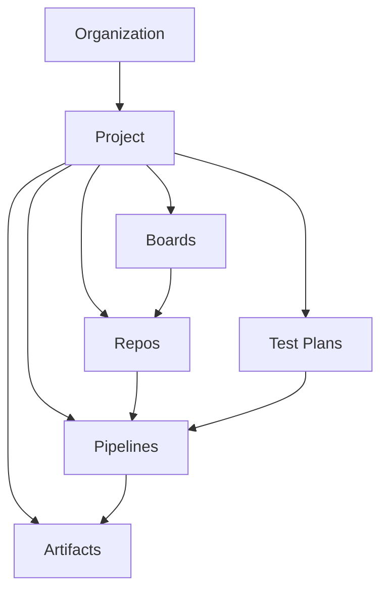
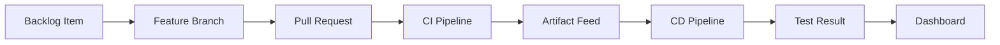
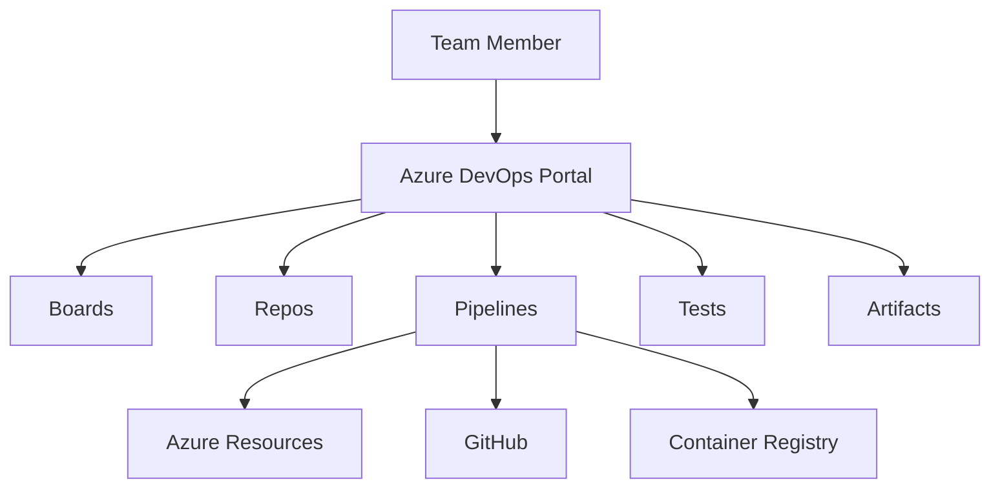

> **Screenshot Disclaimer:** Screenshots in this guide are sourced from [Microsoft Learn](https://learn.microsoft.com/en-us/azure/devops/) documentation. © Microsoft Corporation. All rights reserved. Used here for educational and reference purposes only. For the latest UI and features, always refer to the official documentation.

# Azure DevOps Complete Guide

Azure DevOps is Microsoft's application lifecycle platform for planning, coding, testing, packaging, and releasing software. Use this overview guide to understand the service map, the recommended learning order, and the practical decisions teams should align on before they standardize delivery on Azure DevOps.

> [!NOTE]
> This README is intentionally written as the orientation layer for the other eight guides. It explains what each service does and when to read the deep-dive document for implementation detail.

> [!TIP]
> If you are leading an internal enablement program, share this README first with product leads, platform engineers, QA leads, and security reviewers so everyone starts with the same vocabulary.

> [!IMPORTANT]
> Azure DevOps evolves regularly. Always compare these notes with current Microsoft Learn guidance before baselining screenshots, entitlements, or approval workflows for production teams.

## Guide objectives

- Explain the role of Boards, Repos, Pipelines, Test Plans, and Artifacts in one connected delivery system.
- Show a recommended reading order for the eight detailed guides in this folder.
- Highlight the day-zero decisions that most strongly influence governance, traceability, and delivery speed.
- Provide a fast path into official Microsoft documentation for each major service.

## Microsoft Learn screenshots

> 
>
> *Screenshot source: [Microsoft Learn — What is Azure DevOps?](https://learn.microsoft.com/en-us/azure/devops/user-guide/what-is-azure-devops?view=azure-devops). © Microsoft Corporation. Used for educational reference only.*

> 
>
> *Screenshot source: [Microsoft Learn — What is Azure DevOps?](https://learn.microsoft.com/en-us/azure/devops/user-guide/what-is-azure-devops?view=azure-devops). © Microsoft Corporation. Used for educational reference only.*

> 
>
> *Screenshot source: [Microsoft Learn — Create a project](https://learn.microsoft.com/en-us/azure/devops/organizations/projects/create-project?view=azure-devops). © Microsoft Corporation. Used for educational reference only.*

## Prerequisites

- An Azure DevOps organization, or a plan to create one in the next guide.
- A target Azure subscription and Microsoft Entra tenant if pipelines will deploy Azure resources.
- Agreement on who owns platform standards, approvals, project onboarding, and audit review.
- At least one pilot team willing to adopt the guides in sequence.

## Quick decision guide

| Decision area | Why it matters | Recommended baseline |
|---|---|---|
| Organization scope | Minimize sprawl and centralize standards | Use as few organizations as practical |
| Project model | Balance autonomy and shared governance | Create projects around product or platform domains |
| Source strategy | Support safe collaboration | Protect `main` early and standardize PR policies |
| Pipeline model | Keep build and release reproducible | Prefer source-controlled YAML and shared templates |
| Evidence model | Support release confidence and audit | Link work, code, tests, packages, and deployments |

## Guide table of contents

- [01-organization-setup.md](01-organization-setup.md)
- [02-azure-repos.md](02-azure-repos.md)
- [03-azure-boards.md](03-azure-boards.md)
- [04-azure-pipelines-ci.md](04-azure-pipelines-ci.md)
- [05-azure-pipelines-cd.md](05-azure-pipelines-cd.md)
- [06-azure-test-plans.md](06-azure-test-plans.md)
- [07-azure-artifacts.md](07-azure-artifacts.md)
- [08-advanced-patterns.md](08-advanced-patterns.md)

## Suggested learning path

1. Establish the organization, project, identity, and access model.
2. Standardize repository strategy, pull requests, and branch protection.
3. Align work management, sprint planning, and dashboards in Azure Boards.
4. Build fast, trusted CI pipelines that publish test and artifact evidence.
5. Add controlled CD with environments, checks, and rollback discipline.
6. Expand into structured testing and feed-based package governance.
7. Adopt advanced patterns only after the core operating model is stable.

## What is Azure DevOps

- Azure DevOps is Microsofts application lifecycle platform for planning, source control, build, test, package management, and deployment.
- It supports end to end traceability from work item to commit, pull request, pipeline run, package, deployment, and test result.
- Common users include platform teams, developers, QA engineers, security reviewers, and release managers.
- Core access pattern:
  - Browser UI at `https://dev.azure.com/<organization>`
  - Azure DevOps CLI through `az devops`
  - REST API for automation and reporting

## Azure DevOps Services vs Azure DevOps Server

| Option | Description | Best fit | Notes |
|---|---|---|---|
| Azure DevOps Services | Microsoft hosted SaaS service | Most teams | Fastest onboarding, managed updates, internet accessible |
| Azure DevOps Server | Self hosted on Windows Server and SQL Server | Regulated or disconnected environments | You manage patching, scale, backups, and upgrades |
| Azure DevOps Server with ExpressRoute or private access | Hybrid enterprise deployment | Large enterprises with network constraints | Higher operational overhead but more control |

## Key components overview

| Service | Purpose | Typical outcomes | Key admin scope |
|---|---|---|---|
| Boards | Agile planning and work tracking | Epics, features, stories, bugs, dashboards | Process, area paths, iterations |
| Repos | Git or TFVC source control | Branches, PRs, policies, tags | Repo permissions, branch policies |
| Pipelines | CI and CD automation | Build, test, package, deploy, approvals | Agent pools, environments, checks |
| Test Plans | Manual and exploratory testing | Test suites, runs, outcomes, traceability | Test configuration, testers, reports |
| Artifacts | Package and dependency management | NuGet, npm, Maven, Python, Universal feeds | Feed scope, upstreams, retention |

## Pricing tiers

| Tier | Typical users | Includes | Excludes |
|---|---|---|---|
| Stakeholder | Business users and occasional approvers | Basic Boards access, dashboards, limited work item editing | Full Repos, most Pipelines authoring, Test Plans execution |
| Basic | Developers and most engineers | Boards, Repos, Pipelines, Artifacts, dashboard usage | Advanced manual test management |
| Basic plus Test Plans | QA and release validation teams | Basic plus Test Plans capabilities | Does not replace external test tooling if already standardized |
| Visual Studio subscriber | Users with eligible subscriptions | Often maps to Basic level entitlements and more | Still verify exact entitlement in current Microsoft pricing page |

- Always verify pricing and entitlements at [Azure DevOps pricing](https://azure.microsoft.com/pricing/details/devops/azure-devops-services/).
- Parallel jobs, hosted agent minutes, and artifact storage can affect total cost beyond user licensing.

## Architecture diagram



## Delivery flow



## Service interaction map



## Navigation model

- Sign in path: `dev.azure.com` → Organization → Project → Service hub.
- Admin path: `dev.azure.com` → Organization settings → Users, Billing, Security, Policies, Audit logs, Agent pools.
- Project path: `dev.azure.com` → Project settings → Repositories, Pipelines, Service connections, Boards, Test management, Teams.
- Azure integration path: `Azure Portal` → `Microsoft Entra ID` → groups and applications, then return to `dev.azure.com` for organization mapping and service connections.

## Azure DevOps navigation landmarks

- The left navigation rail exposes the service hubs such as Boards, Repos, Pipelines, Test Plans, and Artifacts.
- The top header keeps the organization name, project selector, search box, and profile controls visible across services.
- The project home experience usually highlights dashboards, recent activity, and onboarding shortcuts.
- Organization settings uses a two-pane administrative layout:
  - the left rail groups blades such as Users, Billing, Policies, Security, Extensions, and Agent pools
  - the main pane shows tables, action buttons, inline validation, and contextual help links

## Quick start commands

```bash
az extension add --name azure-devops
az devops configure --defaults organization=https://dev.azure.com/contoso project=platform
az devops project list --organization https://dev.azure.com/contoso --output table
```

Expected output:
- CLI confirms the `azure-devops` extension is installed.
- Project list returns columns such as `name`, `visibility`, and `lastUpdateTime`.

## Recommended reading order

1. [01 Organization Setup](./01-organization-setup.md)
2. [02 Azure Repos](./02-azure-repos.md)
3. [03 Azure Boards](./03-azure-boards.md)
4. [04 Azure Pipelines CI](./04-azure-pipelines-ci.md)
5. [05 Azure Pipelines CD](./05-azure-pipelines-cd.md)
6. [06 Azure Test Plans](./06-azure-test-plans.md)
7. [07 Azure Artifacts](./07-azure-artifacts.md)
8. [08 Advanced Patterns](./08-advanced-patterns.md)

## Table of contents

- [What is Azure DevOps](#what-is-azure-devops)
- [Azure DevOps Services vs Azure DevOps Server](#azure-devops-services-vs-azure-devops-server)
- [Key components overview](#key-components-overview)
- [Pricing tiers](#pricing-tiers)
- [Architecture diagram](#architecture-diagram)
- [Navigation model](#navigation-model)
- [Azure DevOps navigation landmarks](#azure-devops-navigation-landmarks)
- [Quick start commands](#quick-start-commands)
- [Recommended reading order](#recommended-reading-order)
- [Official Microsoft references](#official-microsoft-references)

## File map

| File | Focus |
|---|---|
| `README.md` | Azure DevOps platform overview and navigation |
| `01-organization-setup.md` | Organization, project, users, service connections, agent pools |
| `02-azure-repos.md` | Git workflows, branch policies, PR reviews, IDE integration |
| `03-azure-boards.md` | Work tracking, sprints, Kanban, dashboards, integrations |
| `04-azure-pipelines-ci.md` | YAML CI pipelines, triggers, caching, scanning, artifacts |
| `05-azure-pipelines-cd.md` | Release strategies, environments, approvals, deployment patterns |
| `06-azure-test-plans.md` | Manual testing, exploratory testing, analytics |
| `07-azure-artifacts.md` | Feed design, package publishing, retention, permissions |
| `08-advanced-patterns.md` | Multi repo, templates, GitOps, governance, migration, CLI |

## Operational tips

- Keep one organization per enterprise boundary unless there is a legal or isolation reason to split.
- Standardize project templates, area paths, environment names, and service connection names.
- Prefer YAML pipelines for versioned automation and auditability.
- Use Entra groups for access instead of direct user assignment.
- Separate shared platform pipelines from workload pipelines when approval models differ.
- Link work items, commits, pull requests, builds, and deployments for traceability.

## Official Microsoft references

- [Azure DevOps overview](https://learn.microsoft.com/azure/devops/user-guide/what-is-azure-devops)
- [Azure DevOps pricing](https://azure.microsoft.com/pricing/details/devops/azure-devops-services/)
- [Azure DevOps CLI](https://learn.microsoft.com/azure/devops/cli/)
- [Choose Azure DevOps Services or Server](https://learn.microsoft.com/azure/devops/user-guide/about-azure-devops-services-tfs)
- [Security and permissions](https://learn.microsoft.com/azure/devops/organizations/security/about-security-identity)

## Real-world scenarios and examples

### Scenario 1: Platform team enabling Azure DevOps for many application teams

A platform group needs a common Microsoft-native workflow for planning, coding, testing, packaging, and release. The README provides the service map and the implementation order that reduces rework later.


Implementation flow:

1. Create one reference project and platform baseline.
2. Roll the deep-dive guides out in the recommended order.
3. Capture standards for repos, pipelines, environments, and feeds.
4. Use dashboards and references to support onboarding.


Success indicators:

- Teams share a common operating vocabulary.
- Tool sprawl decreases.
- Governance is easier to explain and enforce.

### Scenario 2: Enterprise migration from fragmented ALM tools

An enterprise moving from separate planning, Git, CI, package, and release tools can use the guide set as a migration backbone rather than introducing Azure DevOps piecemeal.


Implementation flow:

1. Map each existing tool to the Azure DevOps service that replaces it.
2. Pilot one product or platform domain.
3. Measure traceability from work item to deployment.
4. Retire duplicate tooling intentionally.


Success indicators:

- Migration stays sequenced instead of chaotic.
- Traceability improves.
- Teams gain confidence through visible standards.

### Scenario 3: Regulated delivery requiring stronger release evidence

A regulated team needs more than just builds and deployments; it needs linked approvals, test evidence, and package provenance. This overview helps identify which Azure DevOps services matter most for that outcome.


Implementation flow:

1. Start with organization and access governance.
2. Protect repositories and require validation.
3. Publish tests and artifacts through pipelines.
4. Use feeds and dashboards as part of release evidence.


Success indicators:

- Audit preparation is easier.
- Evidence is centralized.
- Release decisions rely on connected records rather than manual screenshots.

## Operating model checklist

- Review project, pipeline, and feed standards quarterly.
- Keep Microsoft Learn links current in internal onboarding content.
- Track which guides are complete for each onboarded team.
- Treat the guide set as living platform documentation, not one-time migration notes.

## Official Microsoft References

- [What is Azure DevOps?](https://learn.microsoft.com/en-us/azure/devops/user-guide/what-is-azure-devops?view=azure-devops)
- [Create an organization](https://learn.microsoft.com/en-us/azure/devops/organizations/accounts/create-organization?view=azure-devops)
- [Create a project](https://learn.microsoft.com/en-us/azure/devops/organizations/projects/create-project?view=azure-devops)
- [What is Azure Boards](https://learn.microsoft.com/en-us/azure/devops/boards/get-started/what-is-azure-boards?view=azure-devops)
- [What is Azure Pipelines?](https://learn.microsoft.com/en-us/azure/devops/pipelines/get-started/what-is-azure-pipelines?view=azure-devops)
- [What is Azure Test Plans?](https://learn.microsoft.com/en-us/azure/devops/test/overview?view=azure-devops)
- [What is Azure Artifacts?](https://learn.microsoft.com/en-us/azure/devops/artifacts/start-using-azure-artifacts?view=azure-devops)
