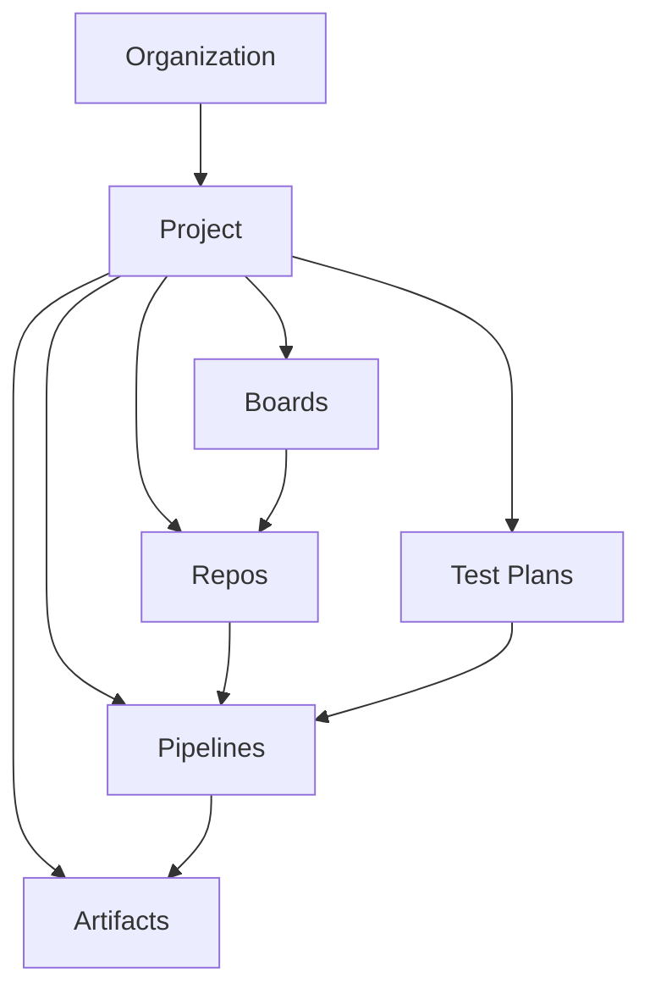
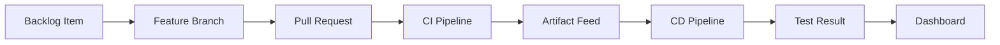
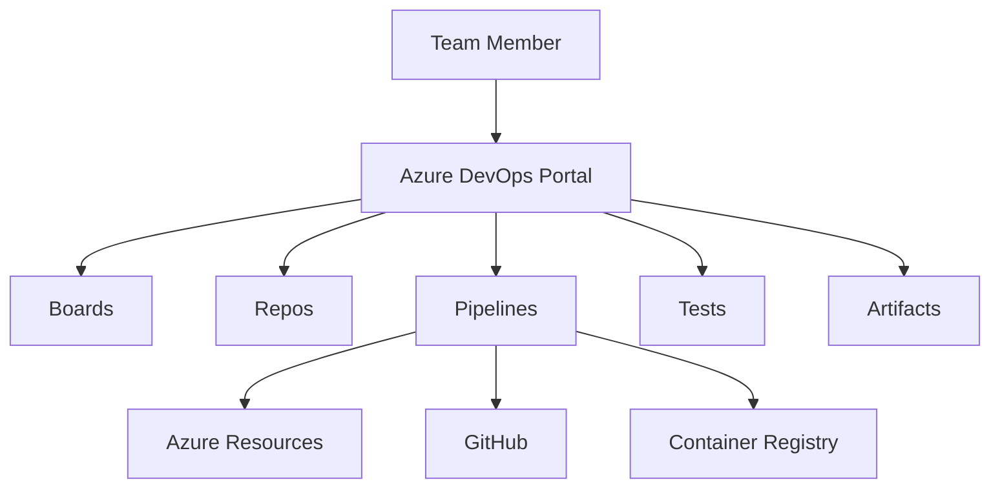

# Azure DevOps Complete Guide

> Practical reference for Azure DevOps organizations, Repos, Boards, Pipelines, Test Plans, and Artifacts.
>
> Disclaimer: Third party integrations such as GitHub, Slack, Docker, SonarQube, Trivy, Argo CD, Flux, and Jenkins are included as examples. Validate licensing, support, and security requirements against the official vendor documentation before production use.

## What is Azure DevOps

- Azure DevOps is Microsofts application lifecycle platform for planning, source control, build, test, package management, and deployment.
- It supports end to end traceability from work item to commit, pull request, pipeline run, package, deployment, and test result.
- Common users include platform teams, developers, QA engineers, security reviewers, and release managers.
- Core access pattern:
  - Browser UI at `https://dev.azure.com/<organization>`
  - Azure DevOps CLI through `az devops`
  - REST API for automation and reporting

## Azure DevOps Services vs Azure DevOps Server

| Option | Description | Best fit | Notes |
|---|---|---|---|
| Azure DevOps Services | Microsoft hosted SaaS service | Most teams | Fastest onboarding, managed updates, internet accessible |
| Azure DevOps Server | Self hosted on Windows Server and SQL Server | Regulated or disconnected environments | You manage patching, scale, backups, and upgrades |
| Azure DevOps Server with ExpressRoute or private access | Hybrid enterprise deployment | Large enterprises with network constraints | Higher operational overhead but more control |

## Key components overview

| Service | Purpose | Typical outcomes | Key admin scope |
|---|---|---|---|
| Boards | Agile planning and work tracking | Epics, features, stories, bugs, dashboards | Process, area paths, iterations |
| Repos | Git or TFVC source control | Branches, PRs, policies, tags | Repo permissions, branch policies |
| Pipelines | CI and CD automation | Build, test, package, deploy, approvals | Agent pools, environments, checks |
| Test Plans | Manual and exploratory testing | Test suites, runs, outcomes, traceability | Test configuration, testers, reports |
| Artifacts | Package and dependency management | NuGet, npm, Maven, Python, Universal feeds | Feed scope, upstreams, retention |

## Pricing tiers

| Tier | Typical users | Includes | Excludes |
|---|---|---|---|
| Stakeholder | Business users and occasional approvers | Basic Boards access, dashboards, limited work item editing | Full Repos, most Pipelines authoring, Test Plans execution |
| Basic | Developers and most engineers | Boards, Repos, Pipelines, Artifacts, dashboard usage | Advanced manual test management |
| Basic plus Test Plans | QA and release validation teams | Basic plus Test Plans capabilities | Does not replace external test tooling if already standardized |
| Visual Studio subscriber | Users with eligible subscriptions | Often maps to Basic level entitlements and more | Still verify exact entitlement in current Microsoft pricing page |

- Always verify pricing and entitlements at [Azure DevOps pricing](https://azure.microsoft.com/pricing/details/devops/azure-devops-services/).
- Parallel jobs, hosted agent minutes, and artifact storage can affect total cost beyond user licensing.

## Architecture diagram



## Delivery flow



## Service interaction map



## Navigation model

- Sign in path: `dev.azure.com` → Organization → Project → Service hub.
- Admin path: `dev.azure.com` → Organization settings → Users, Billing, Security, Policies, Audit logs, Agent pools.
- Project path: `dev.azure.com` → Project settings → Repositories, Pipelines, Service connections, Boards, Test management, Teams.
- Azure integration path: `Azure Portal` → `Microsoft Entra ID` → groups and applications, then return to `dev.azure.com` for organization mapping and service connections.

## What the user sees in the UI

- Left navigation rail with service hubs such as Boards, Repos, Pipelines, Test Plans, and Artifacts.
- Top header showing organization name, project selector, search box, and user profile.
- Project home with recent activity, favorite dashboards, and quick links.
- Organization settings page with a two pane admin layout:
  - left rail for Users, Billing, Policies, Security, Extensions, Agent pools
  - main pane with tables, action buttons, and inline help links

## Quick start commands

```bash
az extension add --name azure-devops
az devops configure --defaults organization=https://dev.azure.com/contoso project=platform
az devops project list --organization https://dev.azure.com/contoso --output table
```

Expected output:
- CLI confirms the `azure-devops` extension is installed.
- Project list returns columns such as `name`, `visibility`, and `lastUpdateTime`.

## Recommended reading order

1. [01 Organization Setup](./01-organization-setup.md)
2. [02 Azure Repos](./02-azure-repos.md)
3. [03 Azure Boards](./03-azure-boards.md)
4. [04 Azure Pipelines CI](./04-azure-pipelines-ci.md)
5. [05 Azure Pipelines CD](./05-azure-pipelines-cd.md)
6. [06 Azure Test Plans](./06-azure-test-plans.md)
7. [07 Azure Artifacts](./07-azure-artifacts.md)
8. [08 Advanced Patterns](./08-advanced-patterns.md)

## Table of contents

- [What is Azure DevOps](#what-is-azure-devops)
- [Azure DevOps Services vs Azure DevOps Server](#azure-devops-services-vs-azure-devops-server)
- [Key components overview](#key-components-overview)
- [Pricing tiers](#pricing-tiers)
- [Architecture diagram](#architecture-diagram)
- [Navigation model](#navigation-model)
- [What the user sees in the UI](#what-the-user-sees-in-the-ui)
- [Quick start commands](#quick-start-commands)
- [Recommended reading order](#recommended-reading-order)
- [Official Microsoft references](#official-microsoft-references)

## File map

| File | Focus |
|---|---|
| `README.md` | Azure DevOps platform overview and navigation |
| `01-organization-setup.md` | Organization, project, users, service connections, agent pools |
| `02-azure-repos.md` | Git workflows, branch policies, PR reviews, IDE integration |
| `03-azure-boards.md` | Work tracking, sprints, Kanban, dashboards, integrations |
| `04-azure-pipelines-ci.md` | YAML CI pipelines, triggers, caching, scanning, artifacts |
| `05-azure-pipelines-cd.md` | Release strategies, environments, approvals, deployment patterns |
| `06-azure-test-plans.md` | Manual testing, exploratory testing, analytics |
| `07-azure-artifacts.md` | Feed design, package publishing, retention, permissions |
| `08-advanced-patterns.md` | Multi repo, templates, GitOps, governance, migration, CLI |

## Operational tips

- Keep one organization per enterprise boundary unless there is a legal or isolation reason to split.
- Standardize project templates, area paths, environment names, and service connection names.
- Prefer YAML pipelines for versioned automation and auditability.
- Use Entra groups for access instead of direct user assignment.
- Separate shared platform pipelines from workload pipelines when approval models differ.
- Link work items, commits, pull requests, builds, and deployments for traceability.

## Official Microsoft references

- [Azure DevOps overview](https://learn.microsoft.com/azure/devops/user-guide/what-is-azure-devops)
- [Azure DevOps pricing](https://azure.microsoft.com/pricing/details/devops/azure-devops-services/)
- [Azure DevOps CLI](https://learn.microsoft.com/azure/devops/cli/)
- [Choose Azure DevOps Services or Server](https://learn.microsoft.com/azure/devops/user-guide/about-azure-devops-services-tfs)
- [Security and permissions](https://learn.microsoft.com/azure/devops/organizations/security/about-security-identity)
