# Azure CI/CD & DevOps

This README is a comprehensive Azure CI/CD and DevOps guide covering Azure DevOps, Azure-native CI/CD, GitHub Actions for Azure, ARM, Bicep, Terraform, deployment strategies, GitOps, and Azure Container Registry Tasks.

## Table of contents

- [1. Azure DevOps Overview](#1-azure-devops-overview)
- [2. Azure Repos](#2-azure-repos)
- [3. Azure Pipelines](#3-azure-pipelines)
- [4. Build Pipeline](#4-build-pipeline)
- [5. Release Pipeline](#5-release-pipeline)
- [6. Azure Artifacts](#6-azure-artifacts)
- [7. Azure Boards](#7-azure-boards)
- [8. GitHub Actions for Azure](#8-github-actions-for-azure)
- [9. Azure Resource Manager (ARM) Templates](#9-azure-resource-manager-arm-templates)
- [10. Bicep](#10-bicep)
- [11. Terraform on Azure](#11-terraform-on-azure)
- [12. Azure CLI & PowerShell](#12-azure-cli--powershell)
- [13. Deployment Strategies](#13-deployment-strategies)
- [14. GitOps with Azure](#14-gitops-with-azure)
- [15. Infrastructure as Code Comparison](#15-infrastructure-as-code-comparison)
- [16. Azure Container Registry Tasks](#16-azure-container-registry-tasks)

## 1. Azure DevOps Overview

Azure DevOps brings together planning, source control, pipelines, package management, and test management. The usual hierarchy is **organization -> project -> services** like Repos, Boards, Pipelines, Artifacts, and Test Plans.

### Mermaid diagram

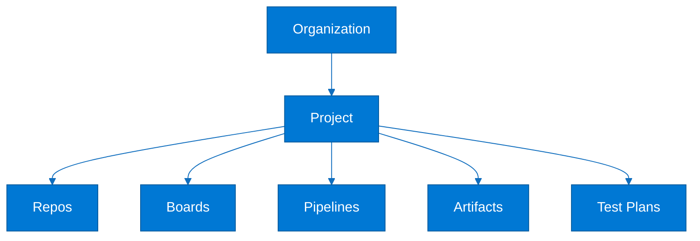

### Explanation

- Organizations are top-level security and billing boundaries.
- Projects group code, work items, pipelines, feeds, and tests for a product or team.
- Azure Repos provides Git and TFVC source control.
- Azure Boards provides backlog, sprint, Kanban, and dashboard capabilities.
- Azure Pipelines automates build, test, package, and deployment workflows.
- Azure Artifacts hosts internal package feeds and universal packages.
- Azure Test Plans supports exploratory and manual testing.
- Traceability ties work items to commits, PRs, builds, artifacts, and releases.

### CLI commands / YAML examples

#### Azure DevOps CLI bootstrap

```bash
az extension add --name azure-devops
az devops configure --defaults organization=https://dev.azure.com/contoso project=cloud-platform
az devops project list --organization https://dev.azure.com/contoso --output table
az repos list --project cloud-platform --output table
az pipelines list --project cloud-platform --output table
```

#### Service inventory YAML

```yaml
organization: contoso
project: cloud-platform
services:
  repos: enabled
  boards: enabled
  pipelines: multi-stage-yaml
  artifacts: platform-feed
  testPlans: enabled
```

### Best practices

- Use Entra ID groups instead of direct user assignments.
- Standardize project, repo, environment, and service connection naming.
- Enable auditing and retention policies early.
- Prefer YAML pipelines for versioned automation.
- Link commits and PRs to work items.
- Treat secrets and service connections as platform-owned assets.

### Common pitfalls

- Creating too many organizations and losing governance.
- Granting broad administrator access.
- Keeping delivery logic only in the UI.
- Storing secrets in repositories.

### Review questions

- How does Azure DevOps Overview improve traceability, speed, or reliability?
- Which approvals, policies, or checks are most important for Azure DevOps Overview?
- Which identities, secrets, or service connections used by Azure DevOps Overview need least privilege?
- What telemetry or evidence should be retained for Azure DevOps Overview?

### Operational checklist

1. Define ownership and naming for Azure DevOps Overview.
2. Protect identities, secrets, and access paths used by Azure DevOps Overview.
3. Add validation and reusable automation for Azure DevOps Overview.
4. Capture evidence, logs, and rollback guidance for Azure DevOps Overview.
5. Review Azure DevOps Overview regularly for drift, failures, or policy gaps.

## 2. Azure Repos

Azure Repos supports Git workflows for modern DevOps and TFVC for centralized version control scenarios. Git with protected branches, pull requests, and build validation is the standard approach for cloud-native teams.

### Mermaid diagram

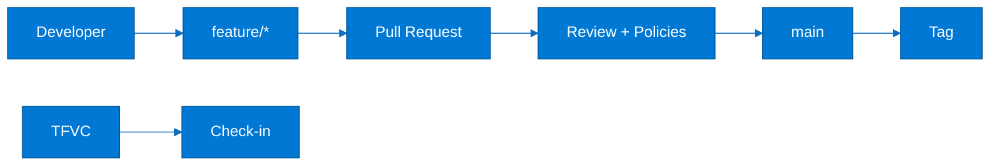

### Explanation

- Git repos support branches, tags, PRs, history, and code review.
- Branch policies can require reviewers, linked work items, and successful builds.
- Protected branches usually include main and release branches.
- PR validation reduces integration risk before merge.
- Squash merge is common for clean history.
- TFVC still exists for teams that need locking or centralized check-in.
- Path-based validation helps large monorepos.
- Draft PRs help collaborate before merge readiness.

### CLI commands / YAML examples

#### Branch policy commands

```bash
az repos create --name orders-api --project cloud-platform
az repos policy approver-count create --branch main --blocking true --enabled true --minimum-approver-count 2 --repository-id orders-api
az repos policy build create --branch main --blocking true --enabled true --build-definition-id 12 --display-name main-ci --repository-id orders-api
```

#### Branch policy model

```yaml
branchPolicies:
  main:
    reviewers: 2
    linkedWorkItems: required
    commentResolution: required
    buildValidation:
      - pipeline: main-ci
        blocking: true
  release/*:
    reviewers: 1
```

### Best practices

- Protect mainline branches with reviewer and build policies.
- Keep feature branches short-lived.
- Use PR templates with testing and rollback notes.
- Tag release commits.
- Use path ownership for sensitive folders.
- Plan TFVC migration if modern GitOps-style workflows are needed.

### Common pitfalls

- Allowing policy bypass without governance.
- Long-lived branches drifting from main.
- No ownership boundaries in monorepos.
- Treating TFVC and Git control models as the same.

### Review questions

- How does Azure Repos improve traceability, speed, or reliability?
- Which approvals, policies, or checks are most important for Azure Repos?
- Which identities, secrets, or service connections used by Azure Repos need least privilege?
- What telemetry or evidence should be retained for Azure Repos?

### Operational checklist

1. Define ownership and naming for Azure Repos.
2. Protect identities, secrets, and access paths used by Azure Repos.
3. Add validation and reusable automation for Azure Repos.
4. Capture evidence, logs, and rollback guidance for Azure Repos.
5. Review Azure Repos regularly for drift, failures, or policy gaps.

## 3. Azure Pipelines

Azure Pipelines automates CI/CD with YAML or classic definitions. YAML is preferred because stages, jobs, steps, variables, templates, and triggers live in source control.

### Mermaid diagram

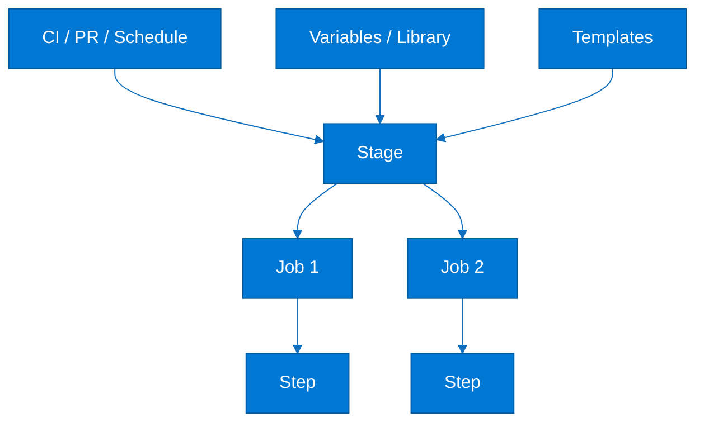

### Explanation

- Pipelines are built from stages, jobs, and steps.
- CI triggers run on branch updates while PR triggers validate pull requests.
- Schedules are useful for nightly validation and maintenance runs.
- Templates reduce duplication across services and repos.
- Variables can be inline, runtime, in variable groups, or from Key Vault.
- The Library stores variable groups, secure files, and shared assets.
- Deployment jobs add environment awareness and audit history.
- Conditions and expressions control promotion flow.

### CLI commands / YAML examples

#### Core pipeline skeleton

```yaml
trigger:
  branches:
    include: [ main, release/* ]
pr:
  branches:
    include: [ main ]
variables:
  - name: buildConfiguration
    value: Release
  - group: shared-platform-secrets
stages:
  - stage: Build
    jobs:
      - job: build
        steps:
          - script: echo Build
  - stage: Deploy
    dependsOn: Build
    jobs:
      - deployment: deploy_dev
        environment: dev
        strategy:
          runOnce:
            deploy:
              steps:
                - script: echo Deploy
```

#### Variable group commands

```bash
az pipelines variable-group create --name shared-platform-secrets --authorize true --variables region=eastus environment=dev
az pipelines variable-group variable create --group-id 5 --name sqlAdminUser --value platformadmin
```

### Best practices

- Keep pipeline logic in the repo with the app or platform code.
- Use templates for shared stages and tasks.
- Store secrets outside plain YAML.
- Use PR validation separately from merge CI.
- Apply path filters in monorepos.
- Use deployment jobs for environment promotion.

### Common pitfalls

- Confusing compile-time and runtime expressions.
- Duplicating the same steps across repos.
- Running prod deployments in generic jobs.
- Echoing secrets to logs.

### Review questions

- How does Azure Pipelines improve traceability, speed, or reliability?
- Which approvals, policies, or checks are most important for Azure Pipelines?
- Which identities, secrets, or service connections used by Azure Pipelines need least privilege?
- What telemetry or evidence should be retained for Azure Pipelines?

### Operational checklist

1. Define ownership and naming for Azure Pipelines.
2. Protect identities, secrets, and access paths used by Azure Pipelines.
3. Add validation and reusable automation for Azure Pipelines.
4. Capture evidence, logs, and rollback guidance for Azure Pipelines.
5. Review Azure Pipelines regularly for drift, failures, or policy gaps.

## 4. Build Pipeline

A build pipeline restores dependencies, compiles code, runs tests and scans, and publishes artifacts or container images. It is the fastest feedback loop in CI/CD and should stay optimized for speed and determinism.

### Mermaid diagram

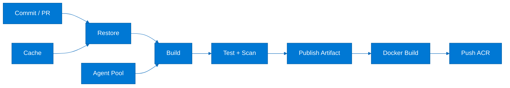

### Explanation

- Microsoft-hosted agents are easy to use and ephemeral.
- Self-hosted agents are used for custom tooling or private network access.
- Agent pools route jobs to approved workers.
- Pipeline cache speeds up dependency restores.
- Container builds make the artifact immutable and portable.
- Build numbers and commit SHAs should flow into image tags.
- CI should publish evidence such as test results and coverage.
- Self-hosted agents must be isolated and patched.

### CLI commands / YAML examples

#### Multi-stage build YAML

```yaml
variables:
  imageRepository: contoso/orders-api
  dockerfilePath: src/Orders.Api/Dockerfile
  tag: $(Build.BuildId)
stages:
  - stage: BuildAndTest
    jobs:
      - job: dotnet
        pool:
          vmImage: ubuntu-latest
        steps:
          - task: Cache@2
            inputs:
              key: 'nuget | "$(Agent.OS)" | **/*.csproj'
              path: $(NUGET_PACKAGES)
          - script: dotnet restore
          - script: dotnet build --configuration Release --no-restore
          - script: dotnet test --configuration Release --no-build
  - stage: Containerize
    dependsOn: BuildAndTest
    jobs:
      - job: docker
        steps:
          - task: Docker@2
            inputs:
              command: buildAndPush
              containerRegistry: acr-sc
              repository: $(imageRepository)
              Dockerfile: $(dockerfilePath)
              tags: $(tag)
```

#### Self-hosted agent registration concept

```bash
mkdir azagent && cd azagent
curl -fkSL -o agent.tar.gz https://vstsagentpackage.azureedge.net/agent/3.248.0/vsts-agent-linux-x64-3.248.0.tar.gz
tar zxvf agent.tar.gz
./config.sh --url https://dev.azure.com/contoso --auth pat --token <PAT> --pool linux-private --agent aks-build-01
sudo ./svc.sh install
sudo ./svc.sh start
```

### Best practices

- Keep PR validation fast.
- Cache only deterministic dependency content.
- Use immutable artifact and image versions.
- Publish test and scan evidence.
- Prefer hosted agents unless there is a clear need otherwise.
- Separate trust zones for self-hosted pools.

### Common pitfalls

- Using latest tags only.
- Sharing one self-hosted pool across very different trust levels.
- Publishing unnecessary source as artifacts.
- Not cleaning workspaces on persistent agents.

### Review questions

- How does Build Pipeline improve traceability, speed, or reliability?
- Which approvals, policies, or checks are most important for Build Pipeline?
- Which identities, secrets, or service connections used by Build Pipeline need least privilege?
- What telemetry or evidence should be retained for Build Pipeline?

### Operational checklist

1. Define ownership and naming for Build Pipeline.
2. Protect identities, secrets, and access paths used by Build Pipeline.
3. Add validation and reusable automation for Build Pipeline.
4. Capture evidence, logs, and rollback guidance for Build Pipeline.
5. Review Build Pipeline regularly for drift, failures, or policy gaps.

## 5. Release Pipeline

Release pipelines promote artifacts into environments with approvals, checks, service connections, and deployment strategies. In modern Azure DevOps, YAML deployment jobs and environments are preferred over purely classic release definitions.

### Mermaid diagram

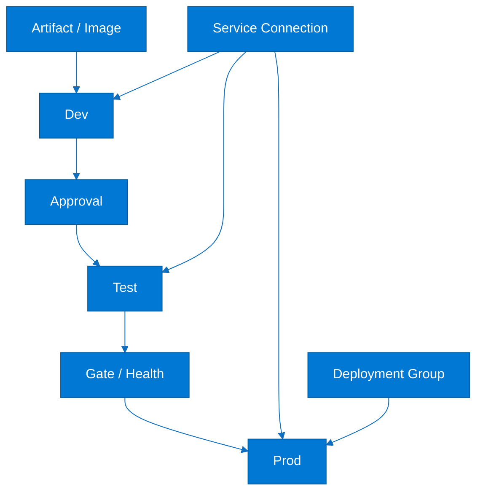

### Explanation

- Deployment jobs track environment history and deployment outcomes.
- Approvals are useful at meaningful risk boundaries, especially production.
- Checks and gates can use APIs, monitoring, or compliance systems.
- Service connections grant Azure access to pipelines.
- Deployment groups are mostly associated with classic VM-based releases.
- Rollback or forward-fix logic should be planned before go-live.
- Health validation after deploy is mandatory for reliable promotion.
- RBAC should differ by environment sensitivity.

### CLI commands / YAML examples

#### Deployment job YAML

```yaml
stages:
  - stage: DeployProd
    jobs:
      - deployment: prod_web
        environment: prod
        strategy:
          runOnce:
            deploy:
              steps:
                - task: AzureCLI@2
                  inputs:
                    azureSubscription: prod-subscription-sc
                    scriptType: bash
                    scriptLocation: inlineScript
                    inlineScript: |
                      az webapp deploy --resource-group rg-prod-app --name prod-orders-web --src-path $(Pipeline.Workspace)/drop/app.zip
```

#### Classic release model

```yaml
classicRelease:
  stages:
    - name: Dev
      approvals: none
    - name: Test
      approvals:
        - qa-manager
      gates:
        - azure-monitor-alerts
    - name: Prod
      approvals:
        - ops-manager
        - product-owner
```

### Best practices

- Use environment-aware deployment jobs.
- Separate prod and non-prod service connections.
- Prefer workload identity federation over secrets.
- Add smoke tests and health checks after deploy.
- Keep release evidence and logs for audits.
- Use approvals where they genuinely reduce risk.

### Common pitfalls

- One identity used across every environment.
- Approvals replacing automation.
- No rollback or forward-fix path.
- No post-deployment validation.

### Review questions

- How does Release Pipeline improve traceability, speed, or reliability?
- Which approvals, policies, or checks are most important for Release Pipeline?
- Which identities, secrets, or service connections used by Release Pipeline need least privilege?
- What telemetry or evidence should be retained for Release Pipeline?

### Operational checklist

1. Define ownership and naming for Release Pipeline.
2. Protect identities, secrets, and access paths used by Release Pipeline.
3. Add validation and reusable automation for Release Pipeline.
4. Capture evidence, logs, and rollback guidance for Release Pipeline.
5. Review Release Pipeline regularly for drift, failures, or policy gaps.

## 6. Azure Artifacts

Azure Artifacts provides internal package management for npm, NuGet, Maven, pip, Cargo, and Universal Packages. It reduces dependency risk by centralizing package governance and CI-friendly authentication.

### Mermaid diagram

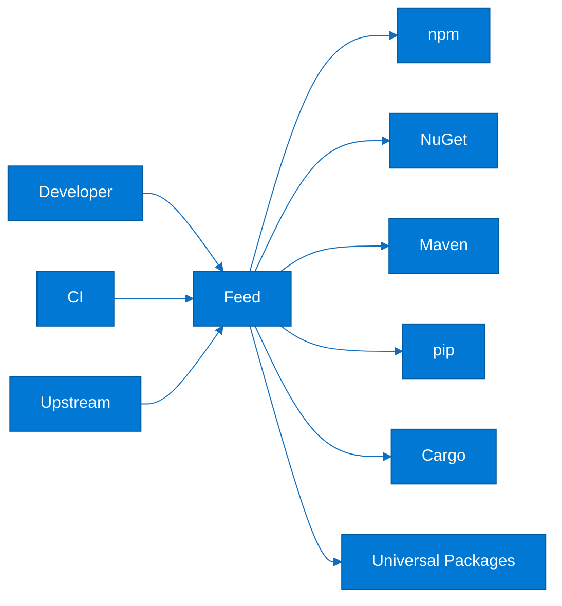

### Explanation

- Feeds can be project-scoped or organization-scoped.
- Upstream sources cache and govern public dependencies.
- Universal Packages handle generic bundles and binaries.
- Retention policies limit storage growth.
- Feeds integrate directly with pipelines.
- Permissions control who can read, publish, or administer packages.
- Internal package sources improve supply-chain governance.
- Promotion patterns separate prerelease and approved versions.

### CLI commands / YAML examples

#### Universal package publish/download

```bash
az artifacts universal publish --organization https://dev.azure.com/contoso --project cloud-platform --feed platform-shared --name aks-manifests --version 1.0.0 --path deploy/
az artifacts universal download --organization https://dev.azure.com/contoso --project cloud-platform --feed platform-shared --name aks-manifests --version 1.0.0 --path ./downloaded
```

#### Feed use in pipeline

```yaml
steps:
  - task: npmAuthenticate@0
    inputs:
      workingFile: .npmrc
  - script: npm ci
  - task: NuGetAuthenticate@1
  - script: dotnet restore --source https://pkgs.dev.azure.com/contoso/_packaging/platform-shared/nuget/v3/index.json
  - script: dotnet nuget push bin/Release/*.nupkg --source platform-shared --api-key az
```

### Best practices

- Create feeds by trust boundary or platform domain.
- Use upstreams instead of direct public restores from build agents.
- Publish immutable versions only.
- Limit publish rights to CI identities where possible.
- Apply retention aligned with rollback and compliance needs.
- Use Universal Packages for non-language artifacts.

### Common pitfalls

- Broad human publish permissions.
- Deleting packages too aggressively.
- No internal control over public dependencies.
- Confusing package feeds with runtime artifact storage.

### Review questions

- How does Azure Artifacts improve traceability, speed, or reliability?
- Which approvals, policies, or checks are most important for Azure Artifacts?
- Which identities, secrets, or service connections used by Azure Artifacts need least privilege?
- What telemetry or evidence should be retained for Azure Artifacts?

### Operational checklist

1. Define ownership and naming for Azure Artifacts.
2. Protect identities, secrets, and access paths used by Azure Artifacts.
3. Add validation and reusable automation for Azure Artifacts.
4. Capture evidence, logs, and rollback guidance for Azure Artifacts.
5. Review Azure Artifacts regularly for drift, failures, or policy gaps.

## 7. Azure Boards

Azure Boards manages epics, features, stories, tasks, bugs, sprints, Kanban flow, queries, and dashboards. It becomes especially useful when work items are linked directly to branches, commits, pull requests, and releases.

### Mermaid diagram

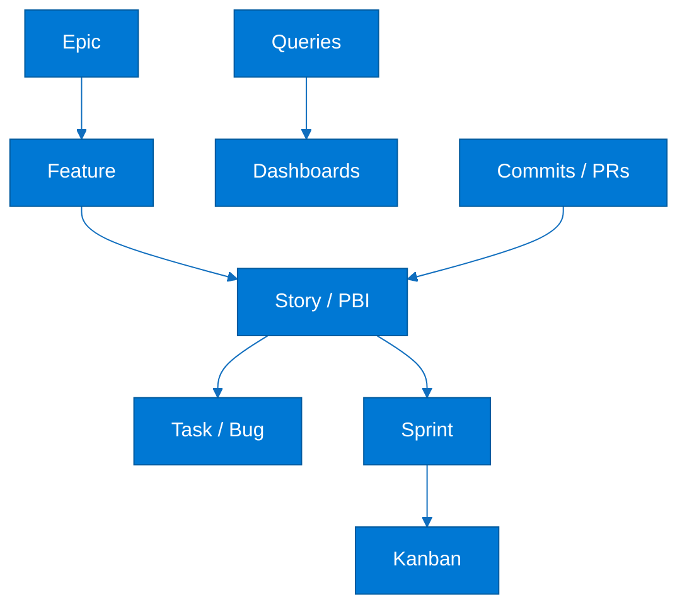

### Explanation

- Work items usually flow from epic to feature to story to task or bug.
- Backlogs help prioritization, forecasting, and release planning.
- Sprint boards support capacity and burndown tracking.
- Kanban boards visualize flow and blocked work.
- Queries create reusable work views for teams and leadership.
- Dashboards combine build, release, and work-item widgets.
- Traceability improves when branch names and commit messages reference work items.
- Processes can be Agile, Scrum, CMMI, or inherited custom models.

### CLI commands / YAML examples

#### Create and show work items

```bash
az boards work-item create --title "Provision AKS production cluster" --type "User Story" --project cloud-platform --fields "System.AssignedTo=platform.team@contoso.com"
az boards work-item show --id 1234
az boards query --id <shared-query-id>
```

#### Traceability convention

```yaml
traceability:
  branch: feature/1234-add-private-endpoint
  commit: "AB#1234 Configure ACR private endpoint"
  pullRequest: "AB#1234 Add ACR private endpoint automation"
  releaseNote: "Released AB#1234 to prod"
```

### Best practices

- Keep work item states simple.
- Use area paths for ownership and iteration paths for timeboxes.
- Require PRs to link to work items.
- Use dashboards as live operational views.
- Measure lead time and blocked work, not just velocity.
- Align board columns with real delivery stages.

### Common pitfalls

- Too many custom states and fields.
- Using Boards as an archive instead of a flow system.
- Tracking delivery in spreadsheets outside DevOps.
- Ignoring dependencies and blocked-state visibility.

### Review questions

- How does Azure Boards improve traceability, speed, or reliability?
- Which approvals, policies, or checks are most important for Azure Boards?
- Which identities, secrets, or service connections used by Azure Boards need least privilege?
- What telemetry or evidence should be retained for Azure Boards?

### Operational checklist

1. Define ownership and naming for Azure Boards.
2. Protect identities, secrets, and access paths used by Azure Boards.
3. Add validation and reusable automation for Azure Boards.
4. Capture evidence, logs, and rollback guidance for Azure Boards.
5. Review Azure Boards regularly for drift, failures, or policy gaps.

## 8. GitHub Actions for Azure

GitHub Actions is commonly used for Azure deployments with official actions such as azure/login, azure/webapps-deploy, azure/aks-set-context, and azure/functions-action. OpenID Connect is the preferred authentication model.

### Mermaid diagram

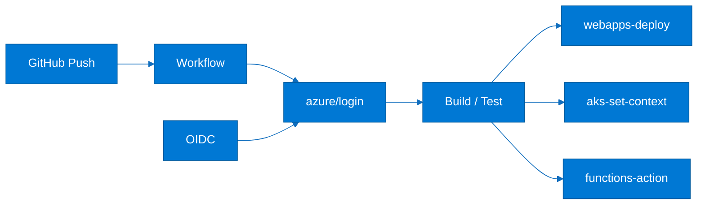

### Explanation

- azure/login authenticates the workflow to Azure.
- OIDC federation avoids long-lived secrets in GitHub.
- azure/webapps-deploy targets App Service and Web Apps.
- azure/aks-set-context prepares kubectl access to AKS.
- azure/functions-action deploys Azure Functions.
- GitHub Environments add approval boundaries and scoped secrets.
- Reusable workflows help standardize deployment logic.
- Immutable build artifacts should be promoted across environments.

### CLI commands / YAML examples

#### Deploy Azure Web App

```yaml
name: deploy-webapp
on:
  push:
    branches: [ main ]
permissions:
  id-token: write
  contents: read
jobs:
  deploy:
    runs-on: ubuntu-latest
    steps:
      - uses: actions/checkout@v4
      - uses: azure/login@v2
        with:
          client-id: ${{ secrets.AZURE_CLIENT_ID }}
          tenant-id: ${{ secrets.AZURE_TENANT_ID }}
          subscription-id: ${{ secrets.AZURE_SUBSCRIPTION_ID }}
      - uses: azure/webapps-deploy@v3
        with:
          app-name: contoso-web-prod
          package: app.zip
```

#### Deploy to AKS

```yaml
name: deploy-aks
on: workflow_dispatch
permissions:
  id-token: write
  contents: read
jobs:
  deploy:
    runs-on: ubuntu-latest
    steps:
      - uses: actions/checkout@v4
      - uses: azure/login@v2
        with:
          client-id: ${{ secrets.AZURE_CLIENT_ID }}
          tenant-id: ${{ secrets.AZURE_TENANT_ID }}
          subscription-id: ${{ secrets.AZURE_SUBSCRIPTION_ID }}
      - uses: azure/aks-set-context@v4
        with:
          resource-group: rg-aks-prod
          cluster-name: aks-prod-eastus
      - run: kubectl apply -f k8s/
```

### Best practices

- Use OIDC instead of client secrets.
- Restrict workflow token permissions.
- Use GitHub environments for sensitive deployments.
- Pin action versions.
- Build once and deploy the same artifact.
- Reuse workflow logic across repos.

### Common pitfalls

- Keeping long-lived Azure secrets in GitHub.
- Deploying raw source instead of a tested artifact.
- One service principal for all subscriptions.
- Skipping health checks after deploy.

### Review questions

- How does GitHub Actions for Azure improve traceability, speed, or reliability?
- Which approvals, policies, or checks are most important for GitHub Actions for Azure?
- Which identities, secrets, or service connections used by GitHub Actions for Azure need least privilege?
- What telemetry or evidence should be retained for GitHub Actions for Azure?

### Operational checklist

1. Define ownership and naming for GitHub Actions for Azure.
2. Protect identities, secrets, and access paths used by GitHub Actions for Azure.
3. Add validation and reusable automation for GitHub Actions for Azure.
4. Capture evidence, logs, and rollback guidance for GitHub Actions for Azure.
5. Review GitHub Actions for Azure regularly for drift, failures, or policy gaps.

## 9. Azure Resource Manager (ARM) Templates

ARM templates are JSON-based declarative files for Azure resource deployment. Even when teams prefer Bicep, ARM concepts remain important because Bicep compiles to ARM under the hood.

### Mermaid diagram

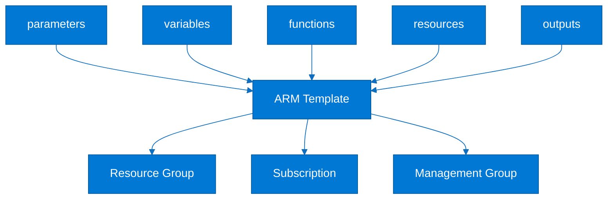

### Explanation

- ARM documents contain schema, contentVersion, parameters, variables, resources, and outputs.
- Parameters externalize names, locations, and sizes.
- Variables reduce repetition inside verbose JSON.
- Functions build resource IDs and dynamic values.
- Nested and linked templates help modularity.
- Deployment scopes include resource group, subscription, management group, and tenant.
- Incremental mode is safer than Complete mode for most CI/CD.
- What-if previews should be part of production change control.

### CLI commands / YAML examples

#### ARM template example

```json
{
  "$schema": "https://schema.management.azure.com/schemas/2019-04-01/deploymentTemplate.json#",
  "contentVersion": "1.0.0.0",
  "parameters": {
    "storageAccountName": { "type": "string" },
    "location": { "type": "string", "defaultValue": "eastus" }
  },
  "variables": {
    "storageSku": "Standard_LRS"
  },
  "resources": [
    {
      "type": "Microsoft.Storage/storageAccounts",
      "apiVersion": "2023-01-01",
      "name": "[parameters('storageAccountName')]",
      "location": "[parameters('location')]",
      "sku": { "name": "[variables('storageSku')]" },
      "kind": "StorageV2",
      "properties": {}
    }
  ]
}
```

#### Deploy with what-if

```bash
az group create --name rg-arm-demo --location eastus
az deployment group what-if --resource-group rg-arm-demo --template-file infra/storage.json --parameters storageAccountName=stcontosodemo001
az deployment group create --resource-group rg-arm-demo --template-file infra/storage.json --parameters storageAccountName=stcontosodemo001
```

### Best practices

- Run what-if before production deployment.
- Prefer Incremental mode.
- Use parameter files per environment.
- Split large templates into linked or nested parts.
- Keep templates in source control.
- Use secure references instead of embedded secrets.

### Common pitfalls

- Accidentally deleting resources with Complete mode.
- Hard-coding environment-specific values.
- One huge JSON file with no modularity.
- Treating exported portal JSON as production-ready.

### Review questions

- How does Azure Resource Manager (ARM) Templates improve traceability, speed, or reliability?
- Which approvals, policies, or checks are most important for Azure Resource Manager (ARM) Templates?
- Which identities, secrets, or service connections used by Azure Resource Manager (ARM) Templates need least privilege?
- What telemetry or evidence should be retained for Azure Resource Manager (ARM) Templates?

### Operational checklist

1. Define ownership and naming for Azure Resource Manager (ARM) Templates.
2. Protect identities, secrets, and access paths used by Azure Resource Manager (ARM) Templates.
3. Add validation and reusable automation for Azure Resource Manager (ARM) Templates.
4. Capture evidence, logs, and rollback guidance for Azure Resource Manager (ARM) Templates.
5. Review Azure Resource Manager (ARM) Templates regularly for drift, failures, or policy gaps.

## 10. Bicep

Bicep is the Azure-first Infrastructure as Code language that compiles to ARM. It improves readability and modularity while staying fully aligned with Azure Resource Manager.

### Mermaid diagram

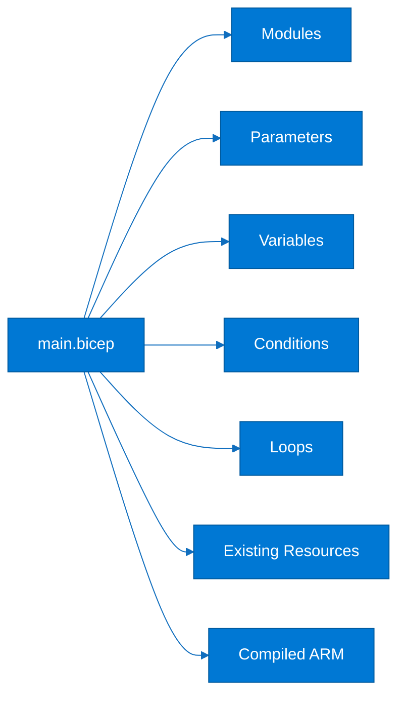

### Explanation

- Bicep is easier to read than raw ARM JSON.
- Modules package reusable infrastructure patterns.
- Parameters and variables separate input from computed values.
- Conditions control optional resources.
- Loops create repeated resources without copy-paste.
- Existing resources can be referenced directly.
- The decompile command helps migrate from ARM JSON.
- Bicep works at resource group and higher scopes.

### CLI commands / YAML examples

#### Bicep resource and output

```bicep
param location string = resourceGroup().location
param storageAccountName string
resource stg 'Microsoft.Storage/storageAccounts@2023-01-01' = {
  name: storageAccountName
  location: location
  sku: {
    name: 'Standard_LRS'
  }
  kind: 'StorageV2'
  properties: {
    minimumTlsVersion: 'TLS1_2'
    allowBlobPublicAccess: false
  }
}
output storageId string = stg.id
```

#### Build and decompile

```bash
az bicep install
az bicep build --file infra/main.bicep
az deployment group what-if --resource-group rg-bicep-demo --template-file infra/main.bicep --parameters storageAccountName=stcontosobicep01
az bicep decompile --file exported-template.json
```

### Best practices

- Create reusable modules with clear inputs and outputs.
- Run what-if and linting in CI.
- Use existing references for shared platform services.
- Keep environment composition thin.
- Publish trusted modules to a registry if needed.
- Document module scope and ownership.

### Common pitfalls

- One giant Bicep file for everything.
- Hard-coded IDs and names.
- Variables used for secrets.
- Blind trust in decompiled output.

### Review questions

- How does Bicep improve traceability, speed, or reliability?
- Which approvals, policies, or checks are most important for Bicep?
- Which identities, secrets, or service connections used by Bicep need least privilege?
- What telemetry or evidence should be retained for Bicep?

### Operational checklist

1. Define ownership and naming for Bicep.
2. Protect identities, secrets, and access paths used by Bicep.
3. Add validation and reusable automation for Bicep.
4. Capture evidence, logs, and rollback guidance for Bicep.
5. Review Bicep regularly for drift, failures, or policy gaps.

## 11. Terraform on Azure

Terraform is widely used on Azure through the AzureRM provider, especially when organizations need one IaC workflow across multiple clouds or vendors. Remote state and plan review are central to safe operations.

### Mermaid diagram

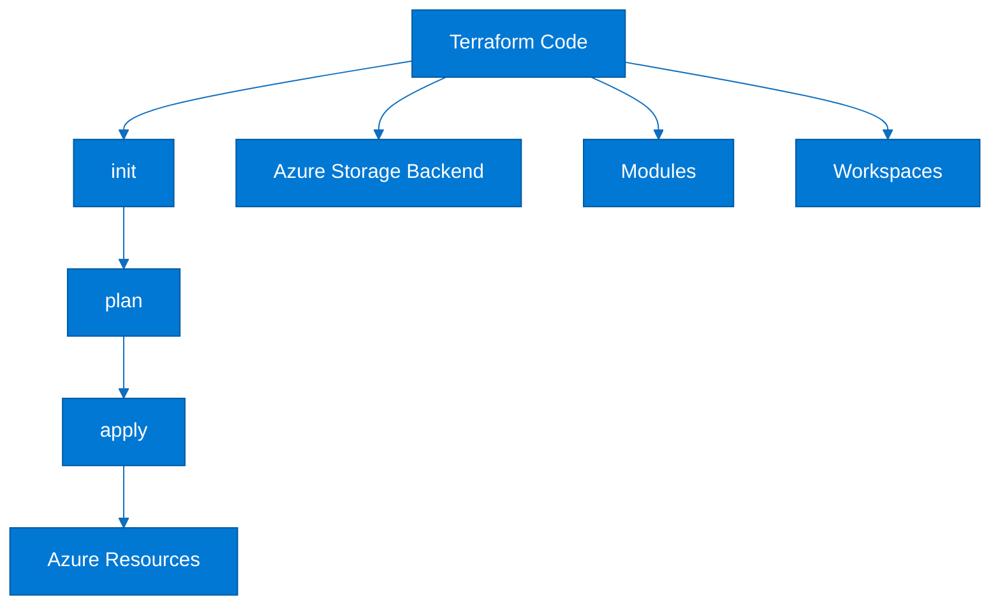

### Explanation

- AzureRM manages Azure resources through Terraform.
- State should usually live remotely in Azure Storage.
- Locking helps avoid concurrent state corruption.
- Modules package reusable infrastructure patterns.
- Workspaces can isolate environments, though separate state files are often clearer.
- Reviewed plan output reduces production risk.
- Version pinning keeps provider behavior stable.
- Authentication can use service principals, managed identity, or federation.

### CLI commands / YAML examples

#### Provider and backend

```hcl
terraform {
  required_version = ">= 1.7.0"
  required_providers {
    azurerm = {
      source  = "hashicorp/azurerm"
      version = "~> 3.110"
    }
  }
  backend "azurerm" {
    resource_group_name  = "rg-tfstate-prod"
    storage_account_name = "stcontosotfstate01"
    container_name       = "tfstate"
    key                  = "platform/network/prod.tfstate"
  }
}
provider "azurerm" {
  features {}
}
```

#### Init, workspace, plan

```bash
terraform init
terraform workspace new dev
terraform workspace select dev
terraform plan -out dev.tfplan
terraform apply dev.tfplan
```

### Best practices

- Store state remotely with RBAC and network controls.
- Pin Terraform and provider versions.
- Keep modules focused and documented.
- Review plan output before production apply.
- Separate state by environment or blast radius.
- Protect apply permissions more tightly than plan permissions.

### Common pitfalls

- Local state on laptops.
- One workspace for every environment with no boundaries.
- Secrets in tfvars files.
- Applying with no reviewed plan.

### Review questions

- How does Terraform on Azure improve traceability, speed, or reliability?
- Which approvals, policies, or checks are most important for Terraform on Azure?
- Which identities, secrets, or service connections used by Terraform on Azure need least privilege?
- What telemetry or evidence should be retained for Terraform on Azure?

### Operational checklist

1. Define ownership and naming for Terraform on Azure.
2. Protect identities, secrets, and access paths used by Terraform on Azure.
3. Add validation and reusable automation for Terraform on Azure.
4. Capture evidence, logs, and rollback guidance for Terraform on Azure.
5. Review Terraform on Azure regularly for drift, failures, or policy gaps.

## 12. Azure CLI & PowerShell

Azure CLI and Azure PowerShell are the main imperative automation interfaces for Azure. They are used in local shells, Cloud Shell, Azure DevOps tasks, GitHub Actions, and day-two operational runbooks.

### Mermaid diagram

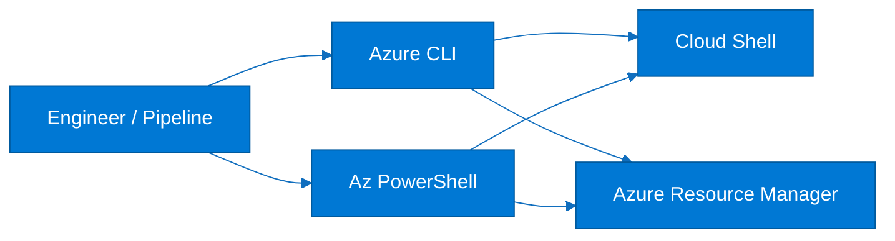

### Explanation

- Azure CLI is concise and popular in Bash-centric automation.
- Azure PowerShell is useful for object-based scripting.
- Cloud Shell provides preinstalled tools and authenticated context.
- Scripts should be idempotent and parameterized.
- Structured output is safer than parsing human-formatted text.
- Managed identity and federation are preferred authentication models.
- Retry logic matters for eventually consistent APIs.
- Many pipeline tasks wrap CLI or PowerShell commands.

### CLI commands / YAML examples

#### Azure CLI pattern

```bash
set -euo pipefail
RESOURCE_GROUP=rg-cli-demo
LOCATION=eastus
STORAGE=stcontosocli01
az group create --name "$RESOURCE_GROUP" --location "$LOCATION"
az storage account create --name "$STORAGE" --resource-group "$RESOURCE_GROUP" --location "$LOCATION" --sku Standard_LRS --min-tls-version TLS1_2 --allow-blob-public-access false
az resource list --resource-group "$RESOURCE_GROUP" --query "[].{name:name,type:type}" --output table
```

#### Azure PowerShell pattern

```powershell
$ErrorActionPreference = 'Stop'
$ResourceGroup = 'rg-ps-demo'
$Location = 'East US'
$StorageAccount = 'stcontosops01'
Connect-AzAccount
New-AzResourceGroup -Name $ResourceGroup -Location $Location
New-AzStorageAccount -ResourceGroupName $ResourceGroup -Name $StorageAccount -Location $Location -SkuName Standard_LRS -Kind StorageV2 -MinimumTlsVersion TLS1_2
Get-AzResource -ResourceGroupName $ResourceGroup | Select-Object Name, ResourceType
```

### Best practices

- Use strict error handling in scripts.
- Prefer JSON or object output over table parsing.
- Make scripts idempotent.
- Use managed identity or federation for automation.
- Test common scripts in Cloud Shell.
- Version reusable scripts and runbooks.

### Common pitfalls

- Parsing table output in automation.
- Embedding secrets in scripts.
- Ignoring exit codes.
- Assuming the current subscription context.

### Review questions

- How does Azure CLI & PowerShell improve traceability, speed, or reliability?
- Which approvals, policies, or checks are most important for Azure CLI & PowerShell?
- Which identities, secrets, or service connections used by Azure CLI & PowerShell need least privilege?
- What telemetry or evidence should be retained for Azure CLI & PowerShell?

### Operational checklist

1. Define ownership and naming for Azure CLI & PowerShell.
2. Protect identities, secrets, and access paths used by Azure CLI & PowerShell.
3. Add validation and reusable automation for Azure CLI & PowerShell.
4. Capture evidence, logs, and rollback guidance for Azure CLI & PowerShell.
5. Review Azure CLI & PowerShell regularly for drift, failures, or policy gaps.

## 13. Deployment Strategies

Deployment strategy defines how new code reaches users and how risk is controlled. Azure platforms commonly use rolling, blue-green, canary, and A/B-oriented release models.

### Mermaid diagram

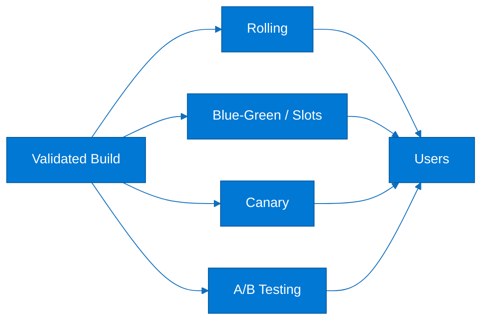

### Explanation

- Rolling updates replace instances in batches.
- Blue-green runs two environments and switches traffic when ready.
- App Service slots are a common Azure blue-green mechanism.
- Canary sends a small percentage of users to the new version first.
- A/B testing routes user groups to different variants for product decisions.
- Health checks and telemetry control promotion or rollback.
- State compatibility matters during partial rollout.
- Feature flags complement deployment strategies well.

### CLI commands / YAML examples

#### Rolling and canary model

```yaml
apiVersion: apps/v1
kind: Deployment
metadata:
  name: orders-api
spec:
  replicas: 6
  strategy:
    type: RollingUpdate
    rollingUpdate:
      maxSurge: 1
      maxUnavailable: 1
---
canary:
  steps:
    - weight: 5
      duration: 10m
    - weight: 25
      duration: 20m
    - weight: 100
      duration: manual-approval
```

#### Blue-green with App Service slots

```bash
az webapp deployment slot create --resource-group rg-app-prod --name contoso-web-prod --slot staging
az webapp deploy --resource-group rg-app-prod --name contoso-web-prod --slot staging --src-path app.zip
az webapp deployment slot swap --resource-group rg-app-prod --name contoso-web-prod --slot staging --target-slot production
```

### Best practices

- Pick strategy per workload and risk profile.
- Define rollback thresholds using SLO-based metrics.
- Make schema changes backward compatible during phased rollout.
- Practice rollback and slot swap scenarios.
- Use feature flags to separate release from exposure.
- Measure user impact, not only process health.

### Common pitfalls

- Blue-green without cost planning.
- Canaries with no telemetry baseline.
- Schema-breaking rolling updates.
- Confusing A/B testing with safe-release engineering.

### Review questions

- How does Deployment Strategies improve traceability, speed, or reliability?
- Which approvals, policies, or checks are most important for Deployment Strategies?
- Which identities, secrets, or service connections used by Deployment Strategies need least privilege?
- What telemetry or evidence should be retained for Deployment Strategies?

### Operational checklist

1. Define ownership and naming for Deployment Strategies.
2. Protect identities, secrets, and access paths used by Deployment Strategies.
3. Add validation and reusable automation for Deployment Strategies.
4. Capture evidence, logs, and rollback guidance for Deployment Strategies.
5. Review Deployment Strategies regularly for drift, failures, or policy gaps.

## 14. GitOps with Azure

GitOps uses Git as the desired-state source for Kubernetes configuration and application delivery. On Azure this usually means AKS with Flux or Argo CD.

### Mermaid diagram

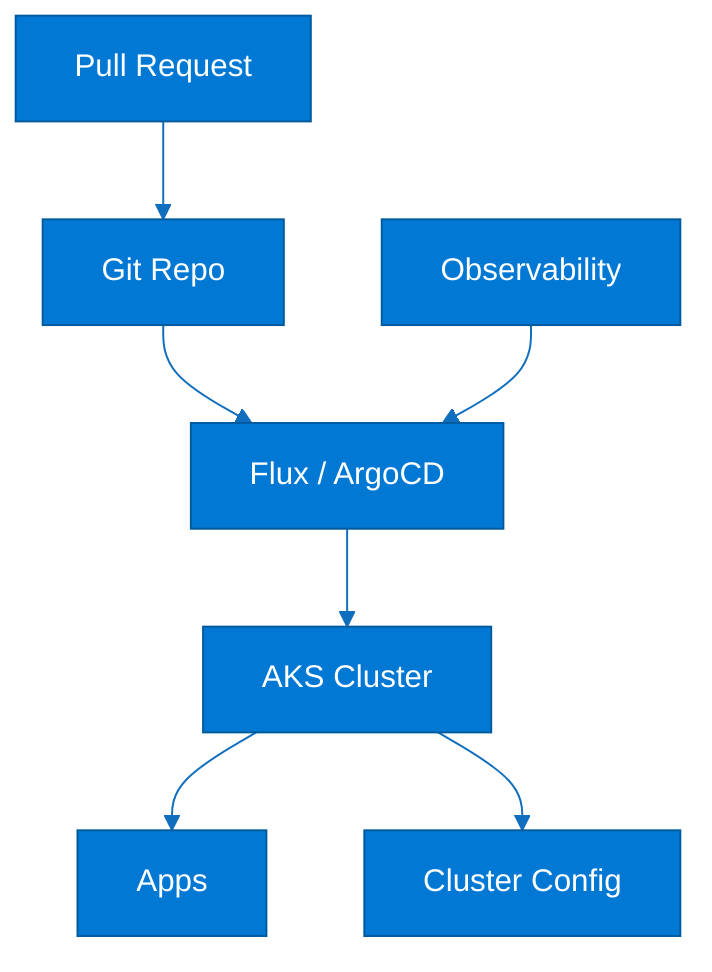

### Explanation

- The cluster reconciles actual state to desired state in Git.
- Flux is strongly aligned with AKS and Azure extensions.
- Argo CD is another strong GitOps controller with a rich UI model.
- Pull requests become the main change-management path.
- Reconciliation detects and corrects drift.
- Secrets should be externalized through approved patterns.
- Platform and application repos are often separated by ownership.
- Immutable image references make promotion deterministic.

### CLI commands / YAML examples

#### Enable Flux on AKS

```bash
az aks create --resource-group rg-aks-demo --name aks-demo --node-count 3 --enable-managed-identity --generate-ssh-keys
az k8s-configuration flux create --cluster-name aks-demo --resource-group rg-aks-demo --name cluster-config --namespace flux-system --cluster-type managedClusters --scope cluster --url https://github.com/contoso/platform-gitops --branch main --kustomization name=infra path=./clusters/prod prune=true
```

#### Argo CD application

```yaml
apiVersion: argoproj.io/v1alpha1
kind: Application
metadata:
  name: orders-api-prod
  namespace: argocd
spec:
  source:
    repoURL: https://github.com/contoso/platform-gitops
    targetRevision: main
    path: apps/orders-api/overlays/prod
  destination:
    server: https://kubernetes.default.svc
    namespace: production
  syncPolicy:
    automated:
      prune: true
      selfHeal: true
```

### Best practices

- Use PR review and branch protection because Git is the control plane.
- Separate platform and app ownership where needed.
- Use overlays or charts instead of copying manifests.
- Keep secrets out of Git.
- Alert on sync failures and drift.
- Use immutable image references.

### Common pitfalls

- Routine manual kubectl changes.
- Plaintext secrets in Git.
- One giant repo with no ownership boundaries.
- Ignoring failed sync state.

### Review questions

- How does GitOps with Azure improve traceability, speed, or reliability?
- Which approvals, policies, or checks are most important for GitOps with Azure?
- Which identities, secrets, or service connections used by GitOps with Azure need least privilege?
- What telemetry or evidence should be retained for GitOps with Azure?

### Operational checklist

1. Define ownership and naming for GitOps with Azure.
2. Protect identities, secrets, and access paths used by GitOps with Azure.
3. Add validation and reusable automation for GitOps with Azure.
4. Capture evidence, logs, and rollback guidance for GitOps with Azure.
5. Review GitOps with Azure regularly for drift, failures, or policy gaps.

## 15. Infrastructure as Code Comparison

Azure teams often choose among ARM, Bicep, Terraform, and Pulumi. The decision depends on Azure depth, multi-cloud needs, state model, team skills, and governance.

### Mermaid diagram

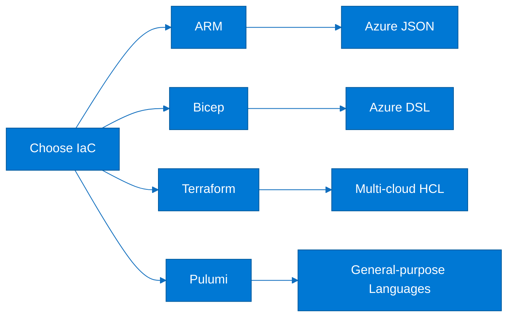

### Explanation

- ARM is native Azure deployment JSON.
- Bicep is the preferred Azure-first authoring language.
- Terraform is strong for multi-cloud estates.
- Pulumi uses TypeScript, Python, Go, or C# for IaC.
- State handling differs significantly across tools.
- Module maturity and reuse matter as much as syntax.
- Standardization is often more important than theoretical feature differences.
- Mixed estates are possible but should have clear boundaries.

### CLI commands / YAML examples

#### Comparison matrix

```yaml
iacComparison:
  ARM:
    scope: Azure only
    state: Azure deployment history
  Bicep:
    scope: Azure only
    state: Azure deployment history
  Terraform:
    scope: Multi-cloud
    state: External tfstate
  Pulumi:
    scope: Multi-cloud
    state: Pulumi backend
```

#### Pulumi example on Azure

```typescript
import * as azure from "@pulumi/azure-native";
const rg = new azure.resources.ResourceGroup("rg-pulumi-demo", { location: "EastUS" });
const storage = new azure.storage.StorageAccount("stpulumidemo", {
  resourceGroupName: rg.name,
  location: rg.location,
  sku: { name: azure.storage.SkuName.Standard_LRS },
  kind: azure.storage.Kind.StorageV2,
});
```

### Best practices

- Pick one primary IaC standard per platform layer.
- Use Bicep for Azure-first platform work unless a strong exception exists.
- Use Terraform when multi-cloud consistency is a core requirement.
- Treat Pulumi as code-first IaC requiring strong engineering discipline.
- Document when mixed-tool exceptions are allowed.
- Standardize module versioning and policy checks across tools.

### Common pitfalls

- Every team choosing a different tool with no standard.
- Ignoring state management implications.
- Choosing based on syntax alone.
- Mixing tools within one small deployment unit without clear ownership.

### Review questions

- How does Infrastructure as Code Comparison improve traceability, speed, or reliability?
- Which approvals, policies, or checks are most important for Infrastructure as Code Comparison?
- Which identities, secrets, or service connections used by Infrastructure as Code Comparison need least privilege?
- What telemetry or evidence should be retained for Infrastructure as Code Comparison?

### Operational checklist

1. Define ownership and naming for Infrastructure as Code Comparison.
2. Protect identities, secrets, and access paths used by Infrastructure as Code Comparison.
3. Add validation and reusable automation for Infrastructure as Code Comparison.
4. Capture evidence, logs, and rollback guidance for Infrastructure as Code Comparison.
5. Review Infrastructure as Code Comparison regularly for drift, failures, or policy gaps.

## 16. Azure Container Registry Tasks

Azure Container Registry Tasks builds images in Azure close to the registry. It supports quick builds, multi-step tasks, source triggers, base-image triggers, and scheduled rebuilds.

### Mermaid diagram

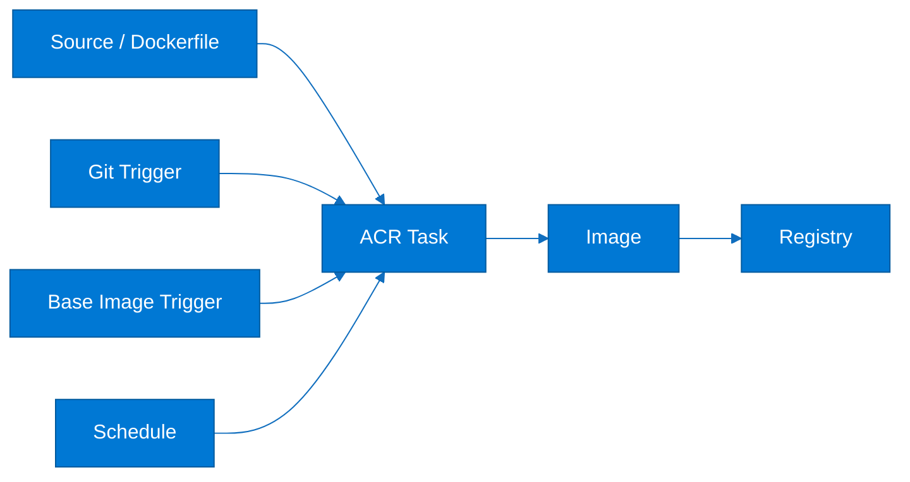

### Explanation

- az acr build performs a quick build in Azure.
- ACR Tasks can run multi-step YAML definitions.
- Source triggers rebuild when code changes.
- Base-image triggers rebuild dependent images when patch images change.
- Scheduled tasks support regular security refreshes.
- Registry-side builds reduce self-managed build infrastructure needs.
- Task logs provide evidence for troubleshooting and compliance.
- Immutable tags are still essential even when latest is also published.

### CLI commands / YAML examples

#### Quick build

```bash
az acr build --registry contosoacr --image orders-api:{{.Run.ID}} --file src/Orders.Api/Dockerfile .
```

#### Multi-step task with schedule

```yaml
version: v1.1.0
steps:
  - build: -t {{.Run.Registry}}/orders-api:{{.Run.ID}} -f src/Orders.Api/Dockerfile .
  - push:
      - {{.Run.Registry}}/orders-api:{{.Run.ID}}
      - {{.Run.Registry}}/orders-api:latest
# az acr task create --registry contosoacr --name orders-api-build --context https://github.com/contoso/orders-api.git --file acr-task.yaml --branch main --base-image-trigger-enabled true
# az acr task timer add --registry contosoacr --name orders-api-build --timer-name nightly-rebuild --schedule "0 3 * * *"
```

### Best practices

- Use ACR Tasks when Azure-hosted image builds reduce operational burden.
- Enable base-image triggers.
- Keep task definitions versioned.
- Capture immutable tags and provenance.
- Restrict registry RBAC and network access.
- Review task logs and failure history.

### Common pitfalls

- No source-to-image traceability.
- Broad registry admin access.
- Ignoring failed patch rebuilds.
- Undocumented scheduled rebuilds.

### Review questions

- How does Azure Container Registry Tasks improve traceability, speed, or reliability?
- Which approvals, policies, or checks are most important for Azure Container Registry Tasks?
- Which identities, secrets, or service connections used by Azure Container Registry Tasks need least privilege?
- What telemetry or evidence should be retained for Azure Container Registry Tasks?

### Operational checklist

1. Define ownership and naming for Azure Container Registry Tasks.
2. Protect identities, secrets, and access paths used by Azure Container Registry Tasks.
3. Add validation and reusable automation for Azure Container Registry Tasks.
4. Capture evidence, logs, and rollback guidance for Azure Container Registry Tasks.
5. Review Azure Container Registry Tasks regularly for drift, failures, or policy gaps.

## 17. End-to-end reference flow

This section links planning, code, CI, package management, infrastructure delivery, release orchestration, and runtime feedback into one Azure operating model.

### Mermaid diagram

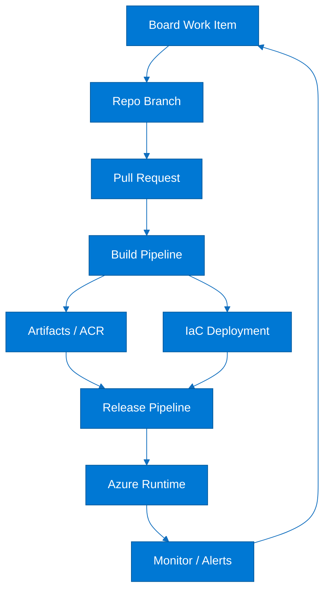

### Explanation

- A work item defines the change and its business context.
- A branch and PR capture implementation plus review evidence.
- CI validates code and creates immutable artifacts.
- IaC provisions or updates the platform safely.
- Release automation promotes the approved artifact into environments.
- Monitoring closes the loop by feeding incidents and improvements back to planning.
- This flow is the operational core of Azure DevOps platform engineering.
- Traceability simplifies audits, rollbacks, and incident response.

### CLI commands / YAML examples

#### Promotion skeleton

```yaml
stages:
  - stage: Validate
    jobs:
      - job: ci
        steps:
          - script: echo lint
          - script: echo test
  - stage: Package
    dependsOn: Validate
    jobs:
      - job: artifact
        steps:
          - script: echo publish artifact
  - stage: Provision
    dependsOn: Package
    jobs:
      - deployment: infra_dev
        environment: dev
        strategy:
          runOnce:
            deploy:
              steps:
                - script: echo deploy bicep or terraform
  - stage: Deploy
    dependsOn: Provision
    jobs:
      - deployment: app_prod
        environment: prod
        strategy:
          runOnce:
            deploy:
              steps:
                - script: echo deploy app
```

### Best practices

- Build once and promote the same immutable artifact.
- Link planning, code, pipeline, artifact, and deployment records.
- Separate platform and application ownership where needed.
- Automate checks and approvals only at meaningful boundaries.
- Keep rollback and observability in the design.

### Common pitfalls

- Rebuilding artifacts separately in each environment.
- Breaking traceability between work items and releases.
- Promoting mutable image tags.
- Mixing emergency fixes with unrelated scope.

### Review questions

- Where is artifact immutability enforced in the flow?
- How do infrastructure and application delivery interact?
- What evidence should be retained after production deployment?
- How should monitoring feed back into planning?

### Operational checklist

1. Define naming, versioning, and ownership standards.
2. Protect repos, pipelines, feeds, and service connections.
3. Publish immutable artifacts and capture provenance.
4. Automate health checks and rollback logic.
5. Review incidents against the full delivery chain.

## 18. Quick command cheat sheet

This section collects compact commands used repeatedly across Azure delivery work.

### Mermaid diagram

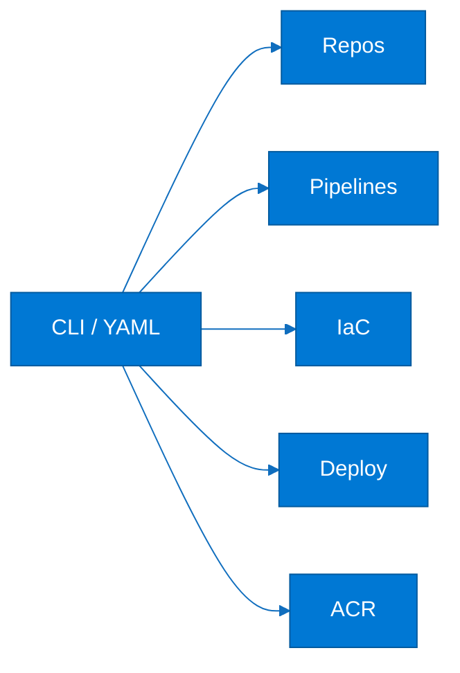

### Explanation

- Use preview commands before destructive changes whenever possible.
- Prefer declarative provisioning and imperative diagnostics.
- Validate organization, tenant, subscription, and environment context.
- Capture logs and outputs as evidence for releases and incidents.

### CLI commands / YAML examples

#### Common commands

```bash
az devops project list --organization https://dev.azure.com/contoso --output table
az repos list --project cloud-platform --output table
az pipelines list --project cloud-platform --output table
az boards work-item show --id 1234
az deployment group what-if --resource-group rg-demo --template-file main.bicep
az deployment group create --resource-group rg-demo --template-file main.bicep
terraform init && terraform plan
az webapp deploy --resource-group rg-web --name contoso-web --src-path app.zip
az aks get-credentials --resource-group rg-aks --name aks-prod --overwrite-existing
az acr task list --registry contosoacr --output table
```

#### Minimal YAML starter

```yaml
trigger:
  - main
pool:
  vmImage: ubuntu-latest
steps:
  - checkout: self
  - script: echo Restore
  - script: echo Build
  - script: echo Test
  - script: echo Package
```

### Best practices

- Version command sequences in reusable scripts or runbooks.
- Use placeholders consistently in examples.
- Preview infrastructure changes before applying them.
- Record final environment and artifact details after execution.

### Common pitfalls

- Running in the wrong subscription or tenant.
- Skipping what-if or plan previews.
- Using ad-hoc commands instead of approved automation for prod.
- Printing sensitive output into logs.

### Review questions

- Which commands should only run through approved automation?
- Why should preview commands precede apply commands?
- What context must be validated before Azure CLI execution?
- How should command evidence be retained?

### Operational checklist

1. Confirm organization, project, tenant, and subscription context.
2. Validate access and approval level.
3. Run preview or plan commands where available.
4. Capture logs and outputs.
5. Record the artifact, environment, and operator context.

