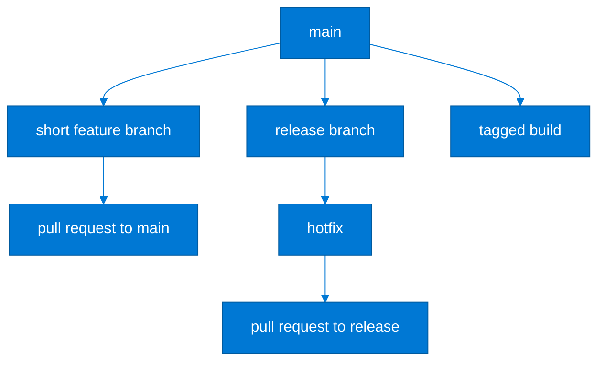
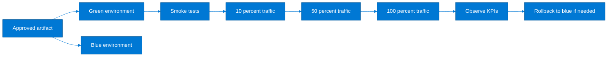

# Azure DevOps Complete Setup & Configuration Guide

> Detailed setup guide for Azure DevOps organizations, projects, Repos, Pipelines, Artifacts, Boards, approvals, agents, governance, and real-world delivery patterns.
>
> Use this guide together with [CICD/README.md](./README.md) for broader Azure CI/CD concepts and with [Containers/aks-production-setup.md](../Containers/aks-production-setup.md) when your deployment targets are production AKS clusters.

## How to use this guide

- Start with organization and project setup if you are building a new Azure DevOps tenant.
- Skip directly to the pipeline examples if your organization already exists and you only need reusable YAML baselines.
- Keep service connections, variable groups, environments, and branch policies versioned as much as the platform allows.
- Favor YAML multi-stage pipelines for repeatability unless classic release pipelines are required for a legacy control process.

## Table of contents

1. [Reference workflow](#1-reference-workflow)
2. [Organization and project setup](#2-organization-and-project-setup)
3. [Azure Repos](#3-azure-repos)
4. [Azure Pipelines build CI](#4-azure-pipelines-build-ci)
5. [Azure Pipelines release CD](#5-azure-pipelines-release-cd)
6. [Azure Artifacts](#6-azure-artifacts)
7. [Azure Boards integration](#7-azure-boards-integration)
8. [Security and governance](#8-security-and-governance)
9. [Real-world pipeline examples](#9-real-world-pipeline-examples)
10. [Operational checklist](#10-operational-checklist)

## 1. Reference workflow


## 2. Organization and project setup

### 2.1 Create the organization and bootstrap Azure DevOps CLI

```bash
az extension add --name azure-devops
az devops configure --defaults organization=https://dev.azure.com/contoso project=Platform
az devops project create   --name Platform   --description "Central platform engineering project"   --process Agile   --source-control git   --visibility private
```

### 2.2 Recommended project structure

| Project | Purpose | Typical repos | Who owns it |
|---|---|---|---|
| Platform | Shared platform engineering assets | terraform-platform, aks-baseline, shared-pipelines | Platform engineering |
| Applications | Business applications and services | orders-api, web-frontend, background-workers | App teams |
| Data | Pipelines, schemas, integration jobs | etl-jobs, db-migrations, analytics-iac | Data engineering |

### 2.3 Team settings, iterations, and area paths

```bash
az boards team create --name Platform --project Platform
az boards area project create --project Platform --path Platform\SharedServices
az boards area project create --project Platform --path Platform\AKS
az boards area project create --project Platform --path Platform\Networking
az boards iteration project create --project Platform --path Platform\FY25
az boards iteration project create --project Platform --path Platform\FY25\Sprint-01
az boards iteration project create --project Platform --path Platform\FY25\Sprint-02
```

- Use area paths to map ownership boundaries such as platform, security, networking, and app domains.
- Use iterations for sprint cadence, not for component ownership.
- Grant team-level permissions to area paths so boards remain relevant to each delivery team.

### 2.4 Process templates: Agile vs Scrum vs CMMI

| Template | Best fit | Strengths | When to avoid |
|---|---|---|---|
| Agile | Most platform and application teams | Balanced user stories, bugs, epics, and boards | Avoid only if an enterprise PMO requires formal change workflow |
| Scrum | Teams already running strict Scrum ceremonies | Backlog items align to Scrum terminology and sprint planning | Less convenient if you heavily use user story language in existing tooling |
| CMMI | Highly controlled regulated environments | Change requests, reviews, and governance workflow out of the box | Too heavy for most cloud-native teams |

## 3. Azure Repos

### 3.1 Create repositories and seed policy files

```bash
az repos create --name platform-infra --project Platform
az repos create --name orders-api --project Platform
az repos create --name web-frontend --project Platform

git clone https://dev.azure.com/contoso/Platform/_git/orders-api
cd orders-api
cat <<'EOF' > README.md
# Orders API
EOF
git add README.md
git commit -m "Initial repository scaffold"
git push origin main
```

### 3.2 Branch policies

```bash
REPO_ID=$(az repos show --repository orders-api --project Platform --query id -o tsv)
MAIN_REF=refs/heads/main

az repos policy approver-count create   --project Platform   --repository-id $REPO_ID   --branch $MAIN_REF   --blocking true   --enabled true   --minimum-approver-count 2   --creator-vote-counts false   --reset-on-source-push true

az repos policy build create   --project Platform   --repository-id $REPO_ID   --branch $MAIN_REF   --blocking true   --enabled true   --build-definition-id 1   --queue-on-source-update-only true   --valid-duration 720
```

### 3.3 PR policies that matter most

| Policy | Why it matters | Suggested baseline |
|---|---|---|
| Minimum reviewers | Reduces single-person merge risk | 2 reviewers for shared services, 1 for low-risk app repos |
| Build validation | Prevents untested code from merging | Mandatory on main and release branches |
| Work item linking | Keeps traceability to Boards or change tickets | Require at least one linked work item on protected branches |
| Comment resolution | Prevents open review concerns from being ignored | Required before completion |
| Merge strategy | Keeps history readable and reproducible | Squash or rebase for application repos, rebase or merge for infra where commit history matters |

### 3.4 Branch strategy: GitFlow vs trunk-based



| Strategy | Best fit | Advantages | Trade-offs |
|---|---|---|---|
| Trunk-based | Cloud-native teams shipping daily or several times per week | Lower merge debt, simpler automation, fast feedback | Requires good feature flagging and disciplined CI |
| GitFlow | Products with long-lived release hardening or multiple supported versions | Clear release branch semantics and hotfix process | More branching complexity and slower feedback loops |

### 3.5 Example trunk-based settings

- Protect `main` with PR validation, 2 reviewers, and mandatory linked work item.
- Keep feature branches short lived and merge within 1 to 3 days.
- Use deployment environments and release tags instead of long-running integration branches.

## 4. Azure Pipelines build CI

### 4.1 YAML pipeline building blocks

| Element | Purpose | Good practice |
|---|---|---|
| Stage | High-level phase such as build, test, deploy, promote | Use stages for environment or lifecycle boundaries |
| Job | Runs on one agent with its own workspace | Separate build, scan, and package jobs when parallelism helps |
| Step | Task, script, or template invocation | Keep scripts idempotent and short |
| Template | Reusable YAML fragment | Centralize repeated jobs, variables, or step sequences |
| Environment | Deployment target with approvals and checks | Use for stage/prod governance and audit trails |

### 4.2 Common variables and variable groups

```bash
az pipelines variable-group create   --name vg-platform-prod   --project Platform   --variables azureServiceConnection=sc-azure-prod acrName=acrprodplatform001 aksCluster=aks-prod-eastus-01 aksResourceGroup=rg-aks-platform-prod
```

```yaml
variables:
  - group: vg-platform-prod
  - name: buildConfiguration
    value: Release
  - name: vmImage
    value: ubuntu-latest
```

### 4.3 Key Vault integration for secrets

```yaml
variables:
  - group: vg-platform-prod
steps:
  - task: AzureKeyVault@2
    inputs:
      azureSubscription: $(azureServiceConnection)
      KeyVaultName: kv-prod-platform
      SecretsFilter: db-password,acr-push-password
      RunAsPreJob: true
```

### 4.4 Complete `azure-pipelines.yml` for a .NET application

```yaml
trigger:
  branches:
    include:
      - main
      - feature/*
pr:
  branches:
    include:
      - main

variables:
  - name: vmImage
    value: ubuntu-latest
  - name: buildConfiguration
    value: Release

stages:
  - stage: Build
    displayName: Build and Test
    jobs:
      - job: DotNet
        pool:
          vmImage: $(vmImage)
        steps:
          - task: UseDotNet@2
            inputs:
              packageType: sdk
              version: 8.0.x
          - task: Cache@2
            inputs:
              key: 'nuget | "$(Agent.OS)" | **/*.csproj'
              restoreKeys: |
                nuget | "$(Agent.OS)"
              path: $(Pipeline.Workspace)/.nuget/packages
          - script: dotnet restore src/Orders.Api/Orders.Api.csproj
            displayName: Restore
          - script: dotnet build src/Orders.Api/Orders.Api.csproj --configuration $(buildConfiguration) --no-restore
            displayName: Build
          - script: dotnet test tests/Orders.Api.Tests/Orders.Api.Tests.csproj --configuration $(buildConfiguration) --collect:"XPlat Code Coverage" --logger trx
            displayName: Test
          - task: PublishTestResults@2
            inputs:
              testResultsFormat: VSTest
              testResultsFiles: '**/*.trx'
          - task: DotNetCoreCLI@2
            inputs:
              command: publish
              publishWebProjects: false
              projects: src/Orders.Api/Orders.Api.csproj
              arguments: '--configuration $(buildConfiguration) --output $(Build.ArtifactStagingDirectory)/publish'
          - publish: $(Build.ArtifactStagingDirectory)/publish
            artifact: drop
```

### 4.5 Complete `azure-pipelines.yml` for a Node.js or React application

```yaml
trigger:
  branches:
    include:
      - main

pool:
  vmImage: ubuntu-latest

variables:
  nodeVersion: '20.x'

steps:
  - task: NodeTool@0
    inputs:
      versionSpec: $(nodeVersion)
  - task: Cache@2
    inputs:
      key: 'npm | "$(Agent.OS)" | package-lock.json'
      restoreKeys: |
        npm | "$(Agent.OS)"
      path: $(Pipeline.Workspace)/.npm
  - script: npm ci
    displayName: Install dependencies
  - script: npm run lint
    displayName: Lint
  - script: npm test -- --ci --reporters=default --reporters=jest-junit
    displayName: Run unit tests
  - script: npm run build
    displayName: Build static assets
  - task: PublishBuildArtifacts@1
    inputs:
      PathtoPublish: build
      ArtifactName: webapp
```

### 4.6 Docker build and push to ACR

```yaml
trigger:
  branches:
    include:
      - main

variables:
  imageRepository: orders-api
  containerRegistry: sc-acr-prod
  dockerfilePath: src/Orders.Api/Dockerfile
  tag: '$(Build.SourceBranchName)-$(Build.BuildId)'

stages:
  - stage: BuildContainer
    jobs:
      - job: Docker
        pool:
          vmImage: ubuntu-latest
        steps:
          - task: Docker@2
            inputs:
              command: buildAndPush
              repository: $(imageRepository)
              dockerfile: $(dockerfilePath)
              containerRegistry: $(containerRegistry)
              tags: |
                $(tag)
                latest
```

### 4.7 Terraform plan and apply pipeline

```yaml
trigger:
  branches:
    include:
      - main
      - feature/*

variables:
  tfVersion: 1.8.5
  workingDirectory: infra/prod

stages:
  - stage: Validate
    jobs:
      - job: TerraformValidate
        pool:
          vmImage: ubuntu-latest
        steps:
          - task: TerraformInstaller@1
            inputs:
              terraformVersion: $(tfVersion)
          - task: AzureCLI@2
            inputs:
              azureSubscription: sc-azure-prod
              scriptType: bash
              scriptLocation: inlineScript
              workingDirectory: $(workingDirectory)
              inlineScript: |
                terraform init -backend-config=backend.prod.hcl
                terraform fmt -check
                terraform validate
                terraform plan -out=tfplan
          - publish: $(workingDirectory)/tfplan
            artifact: tfplan
  - stage: Apply
    dependsOn: Validate
    condition: and(succeeded(), eq(variables['Build.SourceBranch'], 'refs/heads/main'))
    jobs:
      - deployment: TerraformApply
        environment: prod-infra
        strategy:
          runOnce:
            deploy:
              steps:
                - download: current
                  artifact: tfplan
                - task: TerraformInstaller@1
                  inputs:
                    terraformVersion: $(tfVersion)
                - task: AzureCLI@2
                  inputs:
                    azureSubscription: sc-azure-prod
                    scriptType: bash
                    scriptLocation: inlineScript
                    workingDirectory: $(workingDirectory)
                    inlineScript: |
                      terraform init -backend-config=backend.prod.hcl
                      terraform apply -auto-approve tfplan
```

### 4.8 Pipeline caching for faster builds

- Cache package manager directories keyed by lock files so dependency restores are reproducible and fast.
- Do not cache build outputs that contain environment-specific secrets or machine-specific paths.
- Use restore keys for warm-start behavior across branches, but ensure exact keys rely on lock files for correctness.

### 4.9 Self-hosted Linux agent on a VM

```bash
export AGENT_VERSION=4.255.0
export AGENT_POOL=linux-prod
mkdir -p ~/azdo-agent && cd ~/azdo-agent
curl -L -o agent.tar.gz https://vstsagentpackage.azureedge.net/agent/${AGENT_VERSION}/vsts-agent-linux-x64-${AGENT_VERSION}.tar.gz
tar zxvf agent.tar.gz
./config.sh --url https://dev.azure.com/contoso --auth pat --token <personal-access-token> --pool $AGENT_POOL --agent aks-runner-01 --acceptTeeEula
sudo ./svc.sh install
sudo ./svc.sh start
```

- Use a dedicated subnet and NSG for self-hosted agents that deploy into private AKS or private endpoints.
- Harden the VM with managed identity, Defender, patching, and minimal outbound access.
- Treat agent VMs as privileged infrastructure because they hold deployment capability to production.

### 4.10 Reusable templates

```yaml
# templates/steps/docker-build.yml
parameters:
  imageRepository: ''
  dockerfilePath: ''
  containerRegistry: ''
  tag: ''
steps:
  - task: Docker@2
    inputs:
      command: buildAndPush
      repository: ${{ parameters.imageRepository }}
      dockerfile: ${{ parameters.dockerfilePath }}
      containerRegistry: ${{ parameters.containerRegistry }}
      tags: |
        ${{ parameters.tag }}
```

```yaml
# azure-pipelines.yml
stages:
  - stage: ContainerBuild
    jobs:
      - job: BuildImage
        steps:
          - template: templates/steps/docker-build.yml
            parameters:
              imageRepository: orders-api
              dockerfilePath: src/Orders.Api/Dockerfile
              containerRegistry: sc-acr-prod
              tag: $(Build.BuildId)
```

### 4.11 Multi-stage pipeline baseline


```yaml
stages:
  - stage: Build
  - stage: SecurityScan
  - stage: Package
  - stage: DeployDev
  - stage: DeployStage
  - stage: DeployProd
```

## 5. Azure Pipelines release CD

### 5.1 Release pipelines vs YAML multi-stage

| Approach | Use when | Pros | Cons |
|---|---|---|---|
| Classic release pipeline | Existing estate depends on GUI-defined gates or older release governance | Easy to visualize for some ops teams | Harder to version control and templatize |
| YAML multi-stage | New platform and application delivery workflows | Versioned in Git, reviewable, templatized, consistent with CI | Requires more YAML fluency |

### 5.2 Environments with approval gates

```bash
az pipelines environment create --name dev-aks --project Platform
az pipelines environment create --name stage-aks --project Platform
az pipelines environment create --name prod-aks --project Platform
```

- Configure checks on `prod-aks` for manual approval, change calendar review, business hours, and required service health queries if your process needs them.
- Keep environment names stable across repositories so shared deployment templates remain reusable.

### 5.3 Deployment strategies: rolling, canary, blue-green

| Strategy | Best fit | How to implement | Rollback approach |
|---|---|---|---|
| Rolling | Most stateless services | Native Kubernetes rolling update or App Service slot swaps | Undo deployment or redeploy previous image |
| Canary | User-facing APIs and web apps where progressive exposure is desired | Ingress weighting, service mesh routing, or Traffic Manager split | Shift traffic back to stable slice |
| Blue-green | High-confidence release with near-instant cutover | Parallel environment or slot and traffic switch | Point traffic back to blue |

### 5.4 Deploy to AKS with kubectl

```yaml
- stage: DeployAKS
  jobs:
    - deployment: DeployOrders
      environment: prod-aks
      strategy:
        runOnce:
          deploy:
            steps:
              - task: KubernetesManifest@1
                inputs:
                  action: deploy
                  connectionType: azureResourceManager
                  azureSubscriptionConnection: sc-azure-prod
                  azureResourceGroup: rg-aks-platform-prod
                  kubernetesCluster: aks-prod-eastus-01
                  namespace: orders
                  manifests: |
                    manifests/deployment.yml
                    manifests/service.yml
                  containers: |
                    acrprodplatform001.azurecr.io/orders-api:$(Build.BuildId)
```

### 5.5 Deploy to AKS with Helm

```yaml
- task: HelmDeploy@0
  inputs:
    connectionType: Azure Resource Manager
    azureSubscription: sc-azure-prod
    azureResourceGroup: rg-aks-platform-prod
    kubernetesCluster: aks-prod-eastus-01
    namespace: orders
    command: upgrade
    chartType: FilePath
    chartPath: charts/orders-api
    releaseName: orders-api
    overrideValues: image.repository=acrprodplatform001.azurecr.io/orders-api,image.tag=$(Build.BuildId),ingress.host=orders.contoso.com
    install: true
```

### 5.6 Deploy to App Service

```yaml
- task: AzureWebApp@1
  inputs:
    azureSubscription: sc-azure-prod
    appType: webAppLinux
    appName: app-orders-prod
    package: $(Pipeline.Workspace)/drop/**/*.zip
```

### 5.7 Deploy to Azure Functions

```yaml
- task: AzureFunctionApp@2
  inputs:
    azureSubscription: sc-azure-prod
    appType: functionAppLinux
    appName: func-orders-prod
    package: $(Pipeline.Workspace)/drop/function.zip
    deploymentMethod: zipDeploy
```

### 5.8 Canary and blue-green flow



### 5.9 Rollback strategies

- Keep deployment artifacts immutable so the last known-good build can be redeployed quickly.
- Store Helm release history or Kubernetes manifests so `helm rollback` or `kubectl rollout undo` is available without rebuilding.
- Automate smoke tests immediately after deployment and fail fast before promotion to the next environment.

```yaml
- script: kubectl rollout status deployment/orders-api -n orders --timeout=180s
  displayName: Wait for rollout
- script: kubectl rollout undo deployment/orders-api -n orders
  displayName: Roll back on failure
  condition: failed()
```

## 6. Azure Artifacts

### 6.1 Feed setup for NuGet, npm, and Maven

```bash
az artifacts universal publish   --organization https://dev.azure.com/contoso   --project Platform   --scope project   --feed platform-packages   --name infra-modules   --version 1.0.0   --path ./dist
```

| Feed type | Use for | Key setup note |
|---|---|---|
| NuGet | .NET internal libraries and SDKs | Authenticate using `NuGetAuthenticate@1` |
| npm | Shared frontend packages and build tooling | Use `.npmrc` with Azure Artifacts registry |
| Maven | Java service libraries and plugins | Configure feed in `settings.xml` |

### 6.2 Upstream sources and retention

- Enable upstream sources to cache approved external dependencies closer to your build system.
- Use retention policies to remove stale pre-release packages while keeping released versions for reproducibility.
- Separate internal stable feeds from experimental feeds so consuming applications do not accidentally ingest preview libraries.

## 7. Azure Boards integration

### 7.1 Work item tracking and sprint planning

```bash
az boards work-item create   --type "User Story"   --title "Deploy orders API to production AKS"   --area-path Platform\AKS   --iteration-path Platform\FY25\Sprint-01
```

- Link pull requests and pipeline runs to work items for end-to-end traceability.
- Use delivery plans or dashboards to align infrastructure, application, and security work in the same release cadence.

### 7.2 Dashboard creation

| Widget | Purpose | Recommended audience |
|---|---|---|
| Sprint burndown | Track active sprint completion | Team leads and scrum masters |
| Pipeline status | Visualize CI/CD health | Engineering managers and release leads |
| Bugs by state | See production support load | Support and SRE teams |
| Deployment frequency | Track throughput | Leadership and platform engineering |

## 8. Security and governance

### 8.1 Service connections

| Connection type | Use for | Baseline recommendation |
|---|---|---|
| Azure Resource Manager | Deploy to Azure resources including AKS, App Service, Functions, Key Vault | Use workload identity federation or managed identity instead of stored secrets when possible |
| Docker Registry | Push/pull images from ACR or third-party registries | Prefer ACR service connection tied to least-privileged identity |
| Kubernetes | Legacy direct cluster auth | Prefer ARM-connected tasks for AKS over static kubeconfig |

### 8.2 Pipeline permissions and approvals

- Restrict who can edit production pipelines, variable groups, and environments.
- Use approvals and checks on environments rather than ad-hoc manual gates embedded in scripts.
- Require permissions for secure files, service connections, and variable groups to be granted explicitly per pipeline.

### 8.3 Audit logs and secure files

```yaml
- task: DownloadSecureFile@1
  name: downloadSigningKey
  inputs:
    secureFile: codesign.pfx
```

### Governance controls

| Control | Why it matters | How to verify |
|---|---|---|
| Audit log review | Detects permission changes and risky admin activity | Review weekly or forward to SIEM |
| PAT minimization | Reduces secret sprawl | Prefer Entra-based auth or service principals |
| Secret rotation | Limits blast radius of leaked credentials | Rotate service connections and secure files on schedule |
| Template governance | Shared templates can introduce widespread change | Protect template repos with stronger review |

## 9. Real-world pipeline examples

### 9.1 Full microservices pipeline

```yaml
trigger:
  branches:
    include:
      - main

variables:
  - group: vg-platform-prod

stages:
  - stage: Build
    jobs:
      - job: BuildServices
        strategy:
          matrix:
            orders:
              servicePath: services/orders
              imageName: orders-api
            payments:
              servicePath: services/payments
              imageName: payments-api
        pool:
          vmImage: ubuntu-latest
        steps:
          - checkout: self
          - task: Docker@2
            inputs:
              command: buildAndPush
              repository: $(imageName)
              dockerfile: $(servicePath)/Dockerfile
              containerRegistry: sc-acr-prod
              tags: |
                $(Build.BuildId)
          - script: trivy image acrprodplatform001.azurecr.io/$(imageName):$(Build.BuildId) --exit-code 1 --severity HIGH,CRITICAL
            displayName: Vulnerability scan
  - stage: DeployStage
    dependsOn: Build
    jobs:
      - deployment: DeployStage
        environment: stage-aks
        strategy:
          runOnce:
            deploy:
              steps:
                - task: HelmDeploy@0
                  inputs:
                    connectionType: Azure Resource Manager
                    azureSubscription: $(azureServiceConnection)
                    azureResourceGroup: rg-aks-stage
                    kubernetesCluster: aks-stage-eastus-01
                    namespace: release
                    command: upgrade
                    chartType: FilePath
                    chartPath: charts/platform
                    releaseName: platform-stage
                    install: true
                    overrideValues: image.tag=$(Build.BuildId)
  - stage: DeployProd
    dependsOn: DeployStage
    jobs:
      - deployment: DeployProd
        environment: prod-aks
        strategy:
          runOnce:
            deploy:
              steps:
                - task: HelmDeploy@0
                  inputs:
                    connectionType: Azure Resource Manager
                    azureSubscription: $(azureServiceConnection)
                    azureResourceGroup: $(aksResourceGroup)
                    kubernetesCluster: $(aksCluster)
                    namespace: release
                    command: upgrade
                    chartType: FilePath
                    chartPath: charts/platform
                    releaseName: platform-prod
                    install: true
                    overrideValues: image.tag=$(Build.BuildId)
```

### 9.2 Infrastructure pipeline with approval

```yaml
stages:
  - stage: TerraformValidate
    jobs:
      - job: Validate
        steps:
          - script: terraform fmt -check
          - script: terraform init -backend-config=backend.prod.hcl
          - script: terraform validate
          - script: terraform plan -out=tfplan
  - stage: ManualApproval
    jobs:
      - deployment: WaitForApproval
        environment: prod-infra
        strategy:
          runOnce:
            deploy:
              steps:
                - script: echo "Approved plan moving to apply"
  - stage: TerraformApply
    dependsOn: ManualApproval
    jobs:
      - job: Apply
        steps:
          - script: terraform apply -auto-approve tfplan
```

### 9.3 Database migration pipeline

```yaml
stages:
  - stage: ValidateSql
    jobs:
      - job: SqlLint
        pool:
          vmImage: ubuntu-latest
        steps:
          - script: sqlfluff lint db/migrations
  - stage: PreDeployBackup
    jobs:
      - job: Backup
        steps:
          - task: AzureCLI@2
            inputs:
              azureSubscription: sc-azure-prod
              scriptType: bash
              scriptLocation: inlineScript
              inlineScript: |
                az sql db export --admin-user $(sqlAdminUser) --admin-password $(sqlAdminPassword) --name ordersdb --resource-group rg-data-prod --server sql-prod-eastus --storage-key-type StorageAccessKey --storage-key $(backupStorageKey) --storage-uri https://stgdbbackup001.blob.core.windows.net/sql/ordersdb-$(Build.BuildId).bacpac
  - stage: ApplyMigrations
    jobs:
      - job: Flyway
        steps:
          - script: flyway migrate -configFiles=flyway-prod.conf
```

## 10. Operational checklist

### Azure DevOps operating baseline

| Control | Why it matters | How to verify |
|---|---|---|
| Project created with correct process template | Changing process later is disruptive | Project settings show approved template |
| Protected branches configured | Mainline safety depends on branch protection | Policy list exported for audit |
| YAML templates centralized | Reduces duplicated pipeline logic | Shared templates repo exists and is versioned |
| Environment approvals configured | Production changes need governance | Prod environment has checks and approvers |
| Service connections least privileged | Deployment identities should not be over-scoped | Role assignments reviewed |
| Self-hosted agents hardened | Agents are privileged execution nodes | Patch and Defender reports are healthy |
| Artifacts retention defined | Storage costs and reproducibility need balance | Feed retention policy documented |
| Audit review cadence set | Admin changes must be visible | Audit logs reviewed weekly or streamed to SIEM |

### Cross-reference map

- Use [CICD/README.md](./README.md) for broad Azure delivery concepts including GitHub Actions, ARM, Bicep, Terraform, and deployment strategies.
- Use [Containers/aks-production-setup.md](../Containers/aks-production-setup.md) to prepare the production AKS target that these deployment examples assume.
- Use [Storage/blob-storage-complete-guide.md](../Storage/blob-storage-complete-guide.md) when pipelines need secure artifact, backup, or static website storage patterns.

