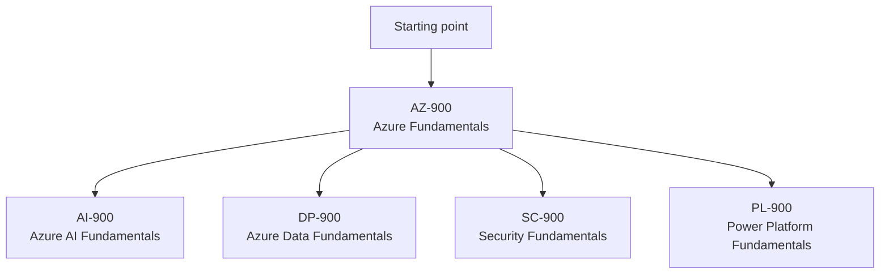

# 01 Fundamentals Certifications

> **Disclaimer:** Exam details, domains, and weightages are based on publicly available information from [Microsoft Learn](https://learn.microsoft.com/en-us/credentials/certifications/). Always verify current exam objectives on the official page before preparing, as Microsoft updates exam content periodically.

## Why fundamentals matter

- Fundamentals exams help you learn Microsoft terminology, portal navigation, and core service categories without requiring deep prior Azure experience.
- They are ideal for students, career switchers, support engineers, analysts, project managers, sales engineers, and technical professionals moving into cloud.
- The best first exam for almost everyone in Azure is `AZ-900`.

> **Important:** `AZ-900` is the most important entry point in this directory because it builds vocabulary that shows up in `AZ-104`, `AZ-305`, `AZ-400`, and day to day Azure work.

## Fundamentals path map

## Fundamentals exam comparison

| Exam | Cost | Duration | Passing score | Suggested study window | Best first audience |
|---|---|---|---|---|---|
| AZ-900 | About `$99` USD | 45 minutes | `700/1000` | 2 to 4 weeks | New Azure learners |
| AI-900 | About `$99` USD | 45 minutes | `700/1000` | 2 to 3 weeks | AI curious professionals |
| DP-900 | About `$99` USD | 45 minutes | `700/1000` | 2 to 3 weeks | Data beginners |
| SC-900 | About `$99` USD | 45 minutes | `700/1000` | 2 to 3 weeks | Security starters |
| PL-900 | About `$99` USD | 45 minutes | `700/1000` | 2 to 3 weeks | Low code and business app users |

## How to approach fundamentals exams

- Focus on service purpose before configuration details.
- Learn the differences between similar services.
- Memorize only what matters repeatedly, such as shared responsibility, CapEx vs OpEx, regions, availability options, and governance tools.
- Use Microsoft Learn first because the wording style often matches exam language.
- Practice translating business scenarios into service choices.

## AZ-900: Azure Fundamentals

### Exam snapshot

| Item | Details |
|---|---|
| Exam code | `AZ-900` |
| Official certification | Microsoft Certified: Azure Fundamentals |
| Cost | About `$99` USD depending on region |
| Duration | 45 minutes |
| Passing score | `700/1000` |
| Level | Fundamentals |
| Study window | 2 to 4 weeks |
| Official page | https://learn.microsoft.com/en-us/credentials/certifications/azure-fundamentals/ |
| Browse training | https://learn.microsoft.com/en-us/training/browse/?products=azure&terms=AZ-900 |

### Who should take AZ-900

- Students exploring cloud careers.
- Help desk or systems administrators moving into Azure.
- Project managers or sales engineers who need credible Azure vocabulary.
- Developers who plan to work with Azure but are not yet ready for a role based exam.
- Anyone who wants a low risk first certification to learn the Microsoft exam process.

### Prerequisites

- No mandatory prerequisites.
- Basic IT awareness helps, but deep cloud experience is not required.
- Familiarity with concepts like networking, virtual machines, storage, security, or databases will make the exam easier.

> **Note:** AZ-900 is not a hands on admin exam, but a little portal exploration makes the theory far more memorable.

### Exam domains and weightage

| Domain | Weightage | What Microsoft expects |
|---|---|---|
| Cloud concepts | 25 to 30 percent | Understand why organizations use cloud and the economic model behind it |
| Azure architecture and services | 35 to 40 percent | Know core service families and architectural building blocks |
| Azure management and governance | 30 to 35 percent | Understand subscriptions, governance, security, and monitoring tools |

### Domain 1: Cloud concepts

#### Key topics to know

- **Cloud computing definition**: Understand on demand resource consumption, elasticity, metered billing, and provider managed infrastructure.
- **Shared responsibility model**: Know what Microsoft manages and what the customer still owns.
- **Cloud service models**: Compare IaaS, PaaS, and SaaS using practical examples.
- **Public, private, and hybrid cloud**: Know where each model fits.
- **Consumption based pricing**: Understand why OpEx is central to public cloud economics.
- **Benefits of cloud**: High availability, scalability, reliability, agility, and geographic reach.
- **Serverless basics**: Know why event driven services reduce infrastructure management.
- **Economies of scale**: Understand how hyperscale providers reduce per unit cost.

#### What to practice mentally

- Match a scenario to IaaS, PaaS, or SaaS.
- Explain why a startup prefers OpEx over CapEx.
- Identify when hybrid cloud is chosen for compliance or latency reasons.
- Compare elasticity vs scalability.

### Domain 2: Azure architecture and services

#### Core architecture topics

- **Regions**: Geographic areas with one or more datacenters.
- **Region pairs**: Recovery and update planning concept.
- **Availability zones**: Physically separate datacenters within a region.
- **Resource groups**: Logical containers for related resources.
- **Subscriptions**: Billing, governance, and quota boundary.
- **Management groups**: Hierarchical governance layer above subscriptions.
- **Azure Resource Manager**: Control plane for deployment and management.

#### Core service families

- **Compute**: Virtual Machines, App Service, Azure Functions, Container Instances, AKS.
- **Networking**: Virtual Network, Load Balancer, Application Gateway, VPN Gateway, ExpressRoute, DNS, CDN, Front Door.
- **Storage**: Blob Storage, Azure Files, Managed Disks, Archive tier concepts, redundancy options.
- **Databases**: Azure SQL Database, Azure Database for PostgreSQL, Azure Cosmos DB.
- **Identity**: Microsoft Entra ID, authentication, conditional access awareness.
- **Analytics and integration**: Synapse, Data Factory, Event Hubs, Service Bus at a high level.

#### Key comparisons to remember

- Azure VM vs App Service vs Functions.
- Blob Storage vs Azure Files.
- Azure SQL vs Cosmos DB.
- Load Balancer vs Application Gateway vs Front Door.
- VPN Gateway vs ExpressRoute.

### Domain 3: Azure management and governance

#### Governance topics

- **RBAC**: Role based access control for least privilege.
- **Azure Policy**: Enforce and audit compliance rules.
- **Resource locks**: Prevent accidental deletion or modification.
- **Tags**: Organize costs, ownership, and environment metadata.
- **Blueprint mindset**: Standardize governance, even though Microsoft guidance now favors policy driven landing zones.

#### Monitoring and operations topics

- **Azure Monitor**: Unified monitoring platform.
- **Log Analytics**: Query workspace logs.
- **Service Health**: Track Azure incidents and planned maintenance.
- **Advisor**: Recommendations for cost, reliability, performance, and security.
- **Cost Management**: Budgets, analysis, and optimization.

#### Security basics to remember

- Microsoft Defender for Cloud is security posture and workload protection.
- Key Vault stores secrets, keys, and certificates.
- Microsoft Entra ID is identity, not a virtual network feature.
- Governance tools do not replace architecture design; they enforce and monitor it.

### AZ-900 study plan: 4 week version

#### Week 1: Learn cloud language

- Read the official certification page and skim the study guide.
- Complete Microsoft Learn modules for cloud concepts.
- Build flashcards for IaaS, PaaS, SaaS, CapEx, OpEx, elasticity, availability, and shared responsibility.
- Watch a portal walkthrough to see subscriptions, resource groups, and regions.

#### Week 2: Learn core Azure services

- Study compute, networking, storage, and database service families.
- Create comparison notes for similar services.
- Spend at least one session in the Azure portal reviewing service menus.
- Use an Azure free account to create a resource group and inspect VM, storage, and VNet wizards.

#### Week 3: Learn management and governance

- Study RBAC, Azure Policy, locks, tags, Cost Management, and Monitor.
- Review Microsoft Learn modules on security and governance.
- Practice identifying which tool solves which governance problem.
- Take a first practice assessment to find weak areas.

#### Week 4: Revision and exam readiness

- Revisit only the weak areas from the practice assessment.
- Use the exam sandbox so you are comfortable with the UI.
- Review notes daily in short sessions.
- Book the exam only when you consistently understand service selection questions.

### AZ-900 study resources

| Resource type | URL | How to use it |
|---|---|---|
| Certification page | https://learn.microsoft.com/en-us/credentials/certifications/azure-fundamentals/ | Use for latest structure, duration, practice assessment, and scheduling |
| Exam page shortcut | https://learn.microsoft.com/en-us/credentials/certifications/exams/az-900/ | Review current exam scope and policies |
| Microsoft Learn browse | https://learn.microsoft.com/en-us/training/browse/?products=azure&terms=AZ-900 | Find modules and learning paths by exam code |
| Study guide | https://aka.ms/AZ900-StudyGuide | Verify official objectives and updates |
| Practice prep hub | https://learn.microsoft.com/en-us/credentials/certifications/prepare-exam | Read Microsoft guidance on practice assessments |
| Exam sandbox | https://go.microsoft.com/fwlink/?linkid=2226877 | Learn the exam interface |
| Azure free account | https://azure.microsoft.com/en-us/free/ | Explore the portal and core services |

### Tips and tricks for passing AZ-900

- Read every answer choice fully before selecting one.
- Eliminate obviously wrong options first.
- Beware of questions that ask for the **best** or **most cost effective** answer.
- Learn service intent, not feature trivia.
- Practice with the Microsoft wording style because many distractors use almost correct terms.
- When confused between two services, ask what layer is being managed for you.
- Remember that Microsoft Entra ID is identity, Azure Policy is governance, and Azure Monitor is observability.
- Understand why region, zone, and redundancy choices matter to resilience.
- Use a personal Microsoft account when registering.
- Do not over rely on third party dumps or memorized question banks.

> **Tip:** If a question sounds very operational and detailed, pause. AZ-900 usually tests service purpose and category, not deep implementation steps.

### Sample question formats for AZ-900

#### Multiple choice example

A company wants to avoid buying servers up front and prefers a pay as you go billing model.

- A. Capital expenditure only
- B. Operational expenditure aligned to usage
- C. Dedicated hardware purchase cycle
- D. Long term fixed asset accounting

**Why this matters:** This tests cloud economic concepts rather than Azure specific configuration.

#### Scenario selection example

A team needs a web application platform where Microsoft manages the operating system and runtime patching.

- Best fit thinking: Compare IaaS VM vs App Service vs Functions.
- Expected exam skill: Choose the managed platform that best matches the requirement.

#### Drag and drop style example

Match the Azure service to its category.

- Blob Storage → Storage
- Virtual Network → Networking
- Azure Monitor → Monitoring
- Microsoft Entra ID → Identity

### Common AZ-900 mistakes

- Memorizing service names without understanding purpose.
- Confusing governance tools with security tools.
- Mixing up availability zones and regions.
- Assuming every Azure service is PaaS.
- Ignoring Cost Management and Policy because they seem less technical.

## AI-900: Azure AI Fundamentals

### Exam snapshot

| Item | Details |
|---|---|
| Exam code | `AI-900` |
| Cost | About `$99` USD |
| Duration | 45 minutes |
| Passing score | `700/1000` |
| Study window | 2 to 3 weeks |
| Official page | https://learn.microsoft.com/en-us/credentials/certifications/azure-ai-fundamentals/ |
| Browse training | https://learn.microsoft.com/en-us/training/browse/?terms=AI-900 |

### Who should take it

- Beginners interested in AI, machine learning, and generative AI concepts.
- Business analysts and presales engineers discussing AI solutions.
- Developers who want vocabulary before using Azure AI services.

### Main domains

- Describe AI workloads and responsible AI principles.
- Describe machine learning principles on Azure.
- Describe computer vision workloads on Azure.
- Describe natural language processing workloads on Azure.
- Describe generative AI workloads on Azure.

### Key topics to understand

- Responsible AI principles such as fairness, reliability, privacy, inclusiveness, and transparency.
- Difference between traditional ML, deep learning, and generative AI.
- Azure AI services for vision, language, speech, and document intelligence.
- Azure Machine Learning basics for model training and deployment.
- Copilot and prompt engineering concepts at a high level.

### 2 to 3 week study plan

- Week 1: Learn AI terminology and responsible AI.
- Week 2: Review Azure AI services, computer vision, NLP, and speech.
- Week 3: Take practice assessments and compare service fit by scenario.

### Resources

| Resource | URL |
|---|---|
| Certification page | https://learn.microsoft.com/en-us/credentials/certifications/azure-ai-fundamentals/ |
| Exam search and learning modules | https://learn.microsoft.com/en-us/training/browse/?terms=AI-900 |
| Azure AI documentation | https://learn.microsoft.com/en-us/azure/ai-services/ |
| Responsible AI overview | https://learn.microsoft.com/en-us/azure/ai-services/responsible-use-of-ai-overview |

### Tips

- Focus on use cases and service categories, not deep model mathematics.
- Be able to distinguish vision, language, speech, search, and generative AI scenarios quickly.

## DP-900: Azure Data Fundamentals

### Exam snapshot

| Item | Details |
|---|---|
| Exam code | `DP-900` |
| Cost | About `$99` USD |
| Duration | 45 minutes |
| Passing score | `700/1000` |
| Study window | 2 to 3 weeks |
| Official page | https://learn.microsoft.com/en-us/credentials/certifications/azure-data-fundamentals/ |
| Browse training | https://learn.microsoft.com/en-us/training/browse/?terms=DP-900 |

### Who should take it

- Learners entering data engineering, analytics, or database paths.
- SQL professionals moving into Azure data platforms.
- Cloud engineers who need a cross service data foundation.

### Main domains

- Describe core data concepts.
- Identify relational data considerations in Azure.
- Describe non relational data considerations in Azure.
- Describe analytics workloads in Azure.

### Key topics to understand

- Structured vs semi structured vs unstructured data.
- OLTP vs OLAP workloads.
- Relational databases and normalization basics.
- NoSQL models including key value and document stores.
- Azure SQL, Cosmos DB, Synapse, and Data Lake positioning.

### 2 to 3 week study plan

- Week 1: Review core data concepts and relational basics.
- Week 2: Study NoSQL, analytics, and Azure service mapping.
- Week 3: Practice scenario matching and take assessments.

### Resources

| Resource | URL |
|---|---|
| Certification page | https://learn.microsoft.com/en-us/credentials/certifications/azure-data-fundamentals/ |
| Exam search and learning modules | https://learn.microsoft.com/en-us/training/browse/?terms=DP-900 |
| Azure SQL docs | https://learn.microsoft.com/en-us/azure/azure-sql/ |
| Azure Cosmos DB docs | https://learn.microsoft.com/en-us/azure/cosmos-db/ |
| Azure Synapse docs | https://learn.microsoft.com/en-us/azure/synapse-analytics/ |

### Tips

- Do not treat every data problem as relational.
- Learn the differences between transactional, analytical, and globally distributed workloads.

## SC-900: Security, Compliance, and Identity Fundamentals

### Exam snapshot

| Item | Details |
|---|---|
| Exam code | `SC-900` |
| Cost | About `$99` USD |
| Duration | 45 minutes |
| Passing score | `700/1000` |
| Study window | 2 to 3 weeks |
| Official page | https://learn.microsoft.com/en-us/credentials/certifications/security-compliance-and-identity-fundamentals/ |
| Browse training | https://learn.microsoft.com/en-us/training/browse/?terms=SC-900 |

### Who should take it

- Beginners targeting security operations or identity work.
- Azure administrators who want a stronger security vocabulary.
- Anyone considering `AZ-500` later.

### Main domains

- Describe basic concepts of security, compliance, and identity.
- Describe capabilities of Microsoft Entra.
- Describe capabilities of Microsoft security solutions.
- Describe capabilities of Microsoft compliance solutions.

### Key topics to understand

- Zero Trust principles.
- Authentication vs authorization.
- MFA, Conditional Access, and identity protection basics.
- Microsoft Defender family and Sentinel positioning.
- Compliance concepts such as insider risk, eDiscovery, and data loss prevention.

### 2 to 3 week study plan

- Week 1: Learn security concepts and Zero Trust.
- Week 2: Study Entra, Defender, Sentinel, and compliance products.
- Week 3: Take practice questions and focus on product purpose.

### Resources

| Resource | URL |
|---|---|
| Certification page | https://learn.microsoft.com/en-us/credentials/certifications/security-compliance-and-identity-fundamentals/ |
| Exam search and learning modules | https://learn.microsoft.com/en-us/training/browse/?terms=SC-900 |
| Microsoft Entra documentation | https://learn.microsoft.com/en-us/entra/fundamentals/ |
| Microsoft Defender overview | https://learn.microsoft.com/en-us/defender/ |
| Microsoft Sentinel overview | https://learn.microsoft.com/en-us/azure/sentinel/overview |

### Tips

- Learn product purpose and licensing family at a high level.
- Separate identity controls from threat protection controls.

## PL-900: Power Platform Fundamentals

### Exam snapshot

| Item | Details |
|---|---|
| Exam code | `PL-900` |
| Cost | About `$99` USD |
| Duration | 45 minutes |
| Passing score | `700/1000` |
| Study window | 2 to 3 weeks |
| Official page | https://learn.microsoft.com/en-us/credentials/certifications/power-platform-fundamentals/ |
| Browse training | https://learn.microsoft.com/en-us/training/browse/?terms=PL-900 |

### Who should take it

- Business analysts and citizen developers.
- IT professionals supporting Power Platform governance.
- Azure engineers who collaborate with low code application teams.

### Main domains

- Describe the business value of Power Platform.
- Identify foundational components of Power Platform.
- Demonstrate capabilities of Power BI.
- Demonstrate capabilities of Power Apps.
- Demonstrate capabilities of Power Automate and Power Pages.

### Key topics to understand

- Dataverse basics.
- Low code app creation patterns.
- Workflow automation with Power Automate.
- Dashboarding with Power BI.
- Governance, connectors, and environment strategy.

### 2 to 3 week study plan

- Week 1: Learn the product family and common use cases.
- Week 2: Build small app and flow examples.
- Week 3: Review governance, licensing basics, and practice items.

### Resources

| Resource | URL |
|---|---|
| Certification page | https://learn.microsoft.com/en-us/credentials/certifications/power-platform-fundamentals/ |
| Exam search and learning modules | https://learn.microsoft.com/en-us/training/browse/?terms=PL-900 |
| Power Platform docs | https://learn.microsoft.com/en-us/power-platform/ |
| Power BI docs | https://learn.microsoft.com/en-us/power-bi/ |

### Tips

- Focus on business capability mapping.
- Understand which tool builds apps, which tool automates, and which tool analyzes data.

## Which fundamentals exam should you pick after AZ-900

| Goal | Best next exam |
|---|---|
| Security path | `SC-900` |
| Data path | `DP-900` |
| AI path | `AI-900` |
| Citizen development / business apps | `PL-900` |
| Broad cloud admin path | Move directly to `AZ-104` |

## Final recommendations

- If you want an Azure operations career, prioritize `AZ-900` then `AZ-104`.
- If you want a non technical but credible Azure starting point, `AZ-900` alone still has value.
- If your employer uses Microsoft 365 security heavily, `SC-900` is a great second fundamentals exam.
- If you are unsure about specialization, pick only one additional fundamentals exam after `AZ-900` and then move up a level.
