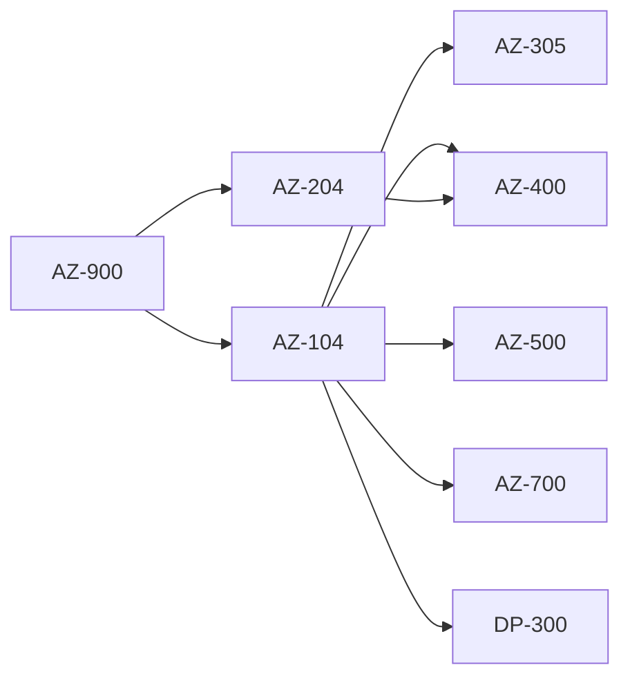

# 02 Associate Level Certifications

> **Disclaimer:** Exam details, domains, and weightages are based on publicly available information from [Microsoft Learn](https://learn.microsoft.com/en-us/credentials/certifications/). Always verify current exam objectives on the official page before preparing, as Microsoft updates exam content periodically.

## Why associate level matters

- Associate certifications prove that you can do real work in Azure, not just describe service families.
- For this repository audience, `AZ-104` is the most important exam because it touches identity, governance, networking, storage, compute, monitoring, and basic automation.
- Associate level is where employers begin to see direct job relevance.

> **Important:** If you only earn one Azure certification for a cloud engineer role, make it `AZ-104`.

## Associate and adjacent path map



## Exam comparison table

| Exam | Level | Cost | Duration | Passing score | Best for |
|---|---|---|---|---|---|
| AZ-104 | Associate | About `$165` USD | 100 minutes | `700/1000` | Azure administrators and cloud engineers |
| AZ-204 | Associate | About `$165` USD | 100 to 120 minutes | `700/1000` | Developers building Azure applications |
| AZ-500 | Associate | About `$165` USD | 100 to 120 minutes | `700/1000` | Security engineers |
| AZ-700 | Associate | About `$165` USD | 100 to 120 minutes | `700/1000` | Network engineers |
| DP-300 | Associate | About `$165` USD | 100 to 120 minutes | `700/1000` | Azure DBAs |
| AZ-400 | Expert | About `$165` USD | 100 to 120 minutes | `700/1000` | DevOps and platform engineers |

## AZ-104: Azure Administrator Associate

### Why AZ-104 matters most for this repo

- It directly supports the landing zones, governance, networking, identity, storage, and operations topics already covered across this repository.
- It gives you practical skill depth for Azure subscriptions, RBAC, VNets, NSGs, storage accounts, VMs, monitoring, backups, and policy.
- It is the strongest launchpad into architecture, DevOps, security, and specialty exams.

### Exam snapshot

| Item | Details |
|---|---|
| Exam code | `AZ-104` |
| Official certification | Microsoft Certified: Azure Administrator Associate |
| Cost | About `$165` USD depending on region |
| Duration | 100 minutes |
| Passing score | `700/1000` |
| Study window | 6 to 8 weeks |
| Official page | https://learn.microsoft.com/en-us/credentials/certifications/azure-administrator/ |
| Browse training | https://learn.microsoft.com/en-us/training/browse/?terms=AZ-104 |
| Study guide | https://aka.ms/AZ104-StudyGuide |

### Recommended prerequisites

- Comfortable with basic Azure concepts, ideally from `AZ-900`.
- Basic networking knowledge such as subnets, routing, and DNS.
- Familiarity with Linux or Windows server administration.
- Willingness to practice with the portal, Azure CLI, and optionally PowerShell or Bicep.

### Full domain breakdown

| Domain | Weightage | What to be able to do |
|---|---|---|
| Manage Azure identities and governance | 20 to 25 percent | Implement Entra objects, RBAC, policy, subscriptions, and governance controls |
| Implement and manage storage | 15 to 20 percent | Deploy storage accounts, secure data access, configure replication, lifecycle, and files |
| Deploy and manage Azure compute resources | 20 to 25 percent | Create and manage VMs, containers, app hosting, backups, and availability features |
| Implement and manage virtual networking | 15 to 20 percent | Configure VNets, subnets, NSGs, DNS, peering, load balancing, and secure network access |
| Monitor and maintain Azure resources | 10 to 15 percent | Use Azure Monitor, alerts, backups, updates, and governance reporting |

### Domain 1: Manage Azure identities and governance

#### Core services to know

- Microsoft Entra ID tenants, users, groups, and administrative units.
- Role Based Access Control at management group, subscription, resource group, and resource scope.
- Azure Policy definitions, initiatives, assignments, exemptions, and remediation.
- Subscriptions, management groups, tags, locks, and cost awareness.
- Managed identities for workloads.

#### Typical exam scenarios

- Grant a team least privilege access to one resource group but not the entire subscription.
- Enforce tags on all new resources with Azure Policy.
- Prevent accidental deletion of production resource groups.
- Allow an application to read secrets without storing credentials in code.

#### Practical focus

- Know when to use built in roles versus custom roles.
- Understand inheritance of RBAC assignments.
- Be comfortable with the difference between policy audit and deny effects.
- Recognize when a system assigned identity is simpler than a user assigned identity.

### Domain 2: Implement and manage storage

#### Core services to know

- Storage account kinds and performance tiers.
- Replication models such as LRS, ZRS, GRS, and RA-GRS.
- Blob containers, shared access signatures, lifecycle management, and soft delete.
- Azure Files, file sync concepts, and private endpoints.
- Managed disks, snapshots, and encryption basics.

#### Typical exam scenarios

- Choose the right replication option for cost vs resilience.
- Limit blob access without exposing account keys.
- Configure lifecycle policies to move data to cool or archive tiers.
- Secure a storage account with network rules and private endpoints.

#### Practical focus

- Memorize what changes are online versus disruptive.
- Learn which auth method fits users, applications, and temporary external access.
- Practice data protection settings such as versioning and soft delete.

### Domain 3: Deploy and manage Azure compute resources

#### Core services to know

- Virtual Machines, availability sets, availability zones, scale sets, and VM extensions.
- App Service plans and web apps.
- Azure Container Instances and AKS at a basic operational level.
- Backups, snapshots, VM sizing, and autoscale concepts.
- Bastion, managed disks, and image concepts.

#### Typical exam scenarios

- Migrate a small workload into Azure VMs with minimal downtime.
- Deploy two VMs behind a load balancer with zone resilience.
- Secure administration with Bastion instead of opening RDP or SSH publicly.
- Resize a VM or change its disk configuration after deployment.

#### Practical focus

- Understand when to use App Service instead of VMs.
- Practice availability options and maintenance behavior.
- Learn basic backup and restore flows.

### Domain 4: Implement and manage virtual networking

#### Core services to know

- Virtual Networks, subnets, NSGs, ASGs, route tables, and service endpoints.
- VNet peering, Private Link, VPN Gateway, ExpressRoute concepts.
- DNS zones, custom DNS, and name resolution.
- Public IPs, Load Balancer, Application Gateway, and Azure Firewall positioning.
- Private endpoints for PaaS services.

#### Typical exam scenarios

- Connect two application tiers securely across VNets.
- Restrict storage or database access to private network paths.
- Publish a web application with layer 7 routing.
- Diagnose why traffic is blocked by NSGs or routes.

#### Practical focus

- Know inbound vs outbound NSG evaluation order.
- Understand differences between service endpoints and private endpoints.
- Know when to use peering vs gateway based connectivity.

### Domain 5: Monitor and maintain Azure resources

#### Core services to know

- Azure Monitor, Log Analytics workspaces, alerts, action groups, workbooks.
- Backup vaults and recovery services concepts.
- Update management awareness and maintenance operations.
- Advisor, Service Health, and change tracking style tooling.

#### Typical exam scenarios

- Trigger alerts on CPU or availability conditions.
- Send notifications to the operations team when a service metric breaches threshold.
- Investigate a failed deployment or unhealthy VM.
- Validate compliance posture using Azure Policy and Monitor data.

#### Practical focus

- Know where logs, metrics, alerts, and workbooks fit.
- Learn the difference between platform metrics and diagnostic logs.
- Understand backup scope and retention basics.

### Key services to know cold for AZ-104

| Service | Why it matters |
|---|---|
| Virtual Machines | Core compute scenario and operations questions |
| Virtual Networks | Central to topology, secure connectivity, and workload isolation |
| Network Security Groups | Frequent traffic filtering and troubleshooting scenarios |
| Storage Accounts | Repeated questions on replication, access, lifecycle, and networking |
| Microsoft Entra ID | Identity and access anchor for Azure administration |
| RBAC | Core least privilege control mechanism |
| Azure Policy | Governance and compliance enforcement |
| Azure Monitor | Monitoring, alerting, and operational insight |
| Key Vault | Secret management and workload security |
| Load Balancer / Application Gateway | Common network publishing comparisons |

### Hands on lab recommendations

| Lab environment | Why use it |
|---|---|
| Microsoft Learn sandbox | Safe guided tasks without heavy setup |
| Azure free account | Best for portal, CLI, and cost awareness practice |
| Personal subscription with budgets | Useful for repeated experimentation and teardown practice |
| GitHub Actions or Azure DevOps free tier | Helpful when combining admin tasks with automation |

> **Tip:** Do not study AZ-104 only from videos. The exam becomes much easier after you create, secure, connect, and monitor real Azure resources yourself.

### Azure CLI commands to practice

#### Resource groups and basic inventory

```bash
az group create --name rg-az104-lab --location eastus
az group list --output table
az resource list --resource-group rg-az104-lab --output table
```

#### Storage account basics

```bash
az storage account create   --name az104storagedemo123   --resource-group rg-az104-lab   --location eastus   --sku Standard_LRS   --kind StorageV2

az storage account show   --name az104storagedemo123   --resource-group rg-az104-lab
```

#### VNet and subnet basics

```bash
az network vnet create   --resource-group rg-az104-lab   --name vnet-az104-demo   --address-prefix 10.10.0.0/16   --subnet-name app   --subnet-prefix 10.10.1.0/24

az network vnet subnet create   --resource-group rg-az104-lab   --vnet-name vnet-az104-demo   --name data   --address-prefixes 10.10.2.0/24
```

#### NSG rules

```bash
az network nsg create --resource-group rg-az104-lab --name nsg-app
az network nsg rule create   --resource-group rg-az104-lab   --nsg-name nsg-app   --name allow-https   --priority 100   --direction Inbound   --access Allow   --protocol Tcp   --destination-port-ranges 443
```

#### VM deployment and inspection

```bash
az vm create   --resource-group rg-az104-lab   --name vm-az104-demo   --image Ubuntu2204   --admin-username azureuser   --generate-ssh-keys

az vm list --resource-group rg-az104-lab -d --output table
```

#### RBAC and policy awareness

```bash
az role assignment list --scope /subscriptions/<subscription-id> --output table
az policy assignment list --output table
az policy definition list --query "[?contains(displayName, 'tag')]" --output table
```

#### Monitoring basics

```bash
az monitor metrics list   --resource /subscriptions/<subscription-id>/resourceGroups/rg-az104-lab/providers/Microsoft.Compute/virtualMachines/vm-az104-demo   --metric "Percentage CPU"

az monitor activity-log list --max-events 10 --output table
```

### 8 week AZ-104 study plan

#### Week 1

- Review `AZ-900` level concepts if needed.
- Set up Azure CLI and portal access.
- Create resource groups, tags, locks, and role assignments.

#### Week 2

- Study Entra users, groups, identities, and RBAC inheritance.
- Practice Azure Policy assignments and remediation concepts.

#### Week 3

- Study storage accounts, blob access, Azure Files, and replication models.
- Practice private access and storage protection settings.

#### Week 4

- Study VM deployment, disks, scaling, availability sets, zones, and backups.
- Create and delete test VMs to learn the lifecycle.

#### Week 5

- Study VNets, subnets, NSGs, peering, DNS, load balancing, and private endpoints.
- Practice packet path reasoning using security and routing examples.

#### Week 6

- Study Azure Monitor, Log Analytics, alerts, and Service Health.
- Build alerts for a lab VM or App Service.

#### Week 7

- Take practice assessments and identify weak areas.
- Repeat CLI and portal tasks without looking at notes.

#### Week 8

- Review only weak domains.
- Use the exam sandbox.
- Book the exam for a day when you can focus without interruption.

### Common AZ-104 exam scenarios

- A company wants to delegate access to one app team without granting subscription wide rights.
- A storage account must be accessible only from a private network path.
- Two VNets in different regions need simple private connectivity.
- A production VM must be protected from accidental deletion.
- Logs must be centralized for alerting and troubleshooting.
- A workload needs resilient storage but has a strict cost ceiling.
- A team needs secrets in Azure without storing passwords in scripts.
- A web app should be internet facing while a database remains private.

### AZ-104 resources

| Resource | URL |
|---|---|
| Certification page | https://learn.microsoft.com/en-us/credentials/certifications/azure-administrator/ |
| Exam scope and updates | https://learn.microsoft.com/en-us/credentials/certifications/exams/az-104/ |
| Training browse | https://learn.microsoft.com/en-us/training/browse/?terms=AZ-104 |
| Study guide | https://aka.ms/AZ104-StudyGuide |
| Azure CLI docs | https://learn.microsoft.com/en-us/cli/azure/ |
| Azure governance docs | https://learn.microsoft.com/en-us/azure/governance/ |
| Azure networking docs | https://learn.microsoft.com/en-us/azure/networking/ |

## AZ-204: Azure Developer Associate

### Exam snapshot

| Item | Details |
|---|---|
| Exam code | `AZ-204` |
| Cost | About `$165` USD |
| Duration | About 100 to 120 minutes |
| Passing score | `700/1000` |
| Study window | 6 to 8 weeks |
| Official page | https://learn.microsoft.com/en-us/credentials/certifications/azure-developer/ |
| Browse training | https://learn.microsoft.com/en-us/training/browse/?terms=AZ-204 |

### Focus areas

- Develop Azure compute solutions such as App Service, Functions, and container based apps.
- Develop for Azure storage.
- Implement Azure security and identity in applications.
- Monitor, troubleshoot, and optimize Azure solutions.
- Connect to and consume Azure services and third party services.

### Key services and tools

- Azure App Service
- Azure Functions
- Azure Storage SDKs
- Managed identities and Key Vault
- Event Grid, Service Bus, and API integrations
- Application Insights and monitoring instrumentation

### Study plan

- Weeks 1 to 2: App hosting and Functions.
- Weeks 3 to 4: Storage, identity, secrets, and integrations.
- Weeks 5 to 6: Monitoring, performance, and deployment patterns.
- Weeks 7 to 8: Practice tests and architecture trade off review.

### Resources

| Resource | URL |
|---|---|
| Certification page | https://learn.microsoft.com/en-us/credentials/certifications/azure-developer/ |
| Training browse | https://learn.microsoft.com/en-us/training/browse/?terms=AZ-204 |
| Azure developer docs | https://learn.microsoft.com/en-us/azure/developer/ |
| Functions docs | https://learn.microsoft.com/en-us/azure/azure-functions/ |

## AZ-500: Azure Security Engineer Associate

### Exam snapshot

| Item | Details |
|---|---|
| Exam code | `AZ-500` |
| Cost | About `$165` USD |
| Duration | About 100 to 120 minutes |
| Passing score | `700/1000` |
| Study window | 6 to 8 weeks |
| Official page | https://learn.microsoft.com/en-us/credentials/certifications/azure-security-engineer/ |
| Browse training | https://learn.microsoft.com/en-us/training/browse/?terms=AZ-500 |

### Focus areas

- Manage identity and access.
- Secure networking.
- Secure compute, storage, and databases.
- Manage security operations with Defender for Cloud and Sentinel awareness.

### Key services and tools

- Microsoft Entra ID, Conditional Access, PIM.
- Key Vault, managed identities, encryption.
- NSGs, Azure Firewall, DDoS, Private Link.
- Defender for Cloud, Defender for Servers, Microsoft Sentinel.

### Study plan

- Weeks 1 to 2: Identity and access control.
- Weeks 3 to 4: Platform protection for network and data.
- Weeks 5 to 6: Security operations and governance.
- Weeks 7 to 8: Scenario practice and control mapping.

### Resources

| Resource | URL |
|---|---|
| Certification page | https://learn.microsoft.com/en-us/credentials/certifications/azure-security-engineer/ |
| Training browse | https://learn.microsoft.com/en-us/training/browse/?terms=AZ-500 |
| Azure security docs | https://learn.microsoft.com/en-us/azure/security/ |
| Defender for Cloud docs | https://learn.microsoft.com/en-us/azure/defender-for-cloud/ |

## AZ-700: Azure Network Engineer Associate

### Exam snapshot

| Item | Details |
|---|---|
| Exam code | `AZ-700` |
| Cost | About `$165` USD |
| Duration | About 100 to 120 minutes |
| Passing score | `700/1000` |
| Study window | 6 to 8 weeks |
| Official page | https://learn.microsoft.com/en-us/credentials/certifications/azure-network-engineer-associate/ |
| Browse training | https://learn.microsoft.com/en-us/training/browse/?terms=AZ-700 |

### Focus areas

- Design and implement core networking infrastructure.
- Design and implement hybrid connectivity.
- Design and implement application delivery services.
- Design and implement private access to Azure services.
- Monitor and secure Azure networks.

### Key services and tools

- VNets, subnets, NSGs, route tables.
- Load Balancer, Application Gateway, Front Door.
- VPN Gateway and ExpressRoute.
- Private Link, DNS, Firewall, DDoS.

### Study plan

- Weeks 1 to 2: Core VNet building blocks.
- Weeks 3 to 4: Hybrid networking and routing.
- Weeks 5 to 6: Application delivery and private access.
- Weeks 7 to 8: Troubleshooting, monitoring, and case studies.

### Resources

| Resource | URL |
|---|---|
| Certification page | https://learn.microsoft.com/en-us/credentials/certifications/azure-network-engineer-associate/ |
| Training browse | https://learn.microsoft.com/en-us/training/browse/?terms=AZ-700 |
| Azure networking docs | https://learn.microsoft.com/en-us/azure/networking/ |
| Private Link docs | https://learn.microsoft.com/en-us/azure/private-link/ |

## DP-300: Azure Database Administrator Associate

### Exam snapshot

| Item | Details |
|---|---|
| Exam code | `DP-300` |
| Cost | About `$165` USD |
| Duration | About 100 to 120 minutes |
| Passing score | `700/1000` |
| Study window | 6 to 8 weeks |
| Official page | https://learn.microsoft.com/en-us/credentials/certifications/azure-database-administrator-associate/ |
| Browse training | https://learn.microsoft.com/en-us/training/browse/?terms=DP-300 |

### Focus areas

- Plan and implement data platform resources.
- Implement a secure environment.
- Monitor, configure, and optimize operational resources.
- Optimize query performance and automate tasks.
- Plan for high availability and disaster recovery.

### Key services and tools

- Azure SQL Database and Managed Instance.
- Authentication and authorization for SQL in Azure.
- Backups, HA, geo replication, and performance tuning.
- Monitoring with Query Store, metrics, and alerts.

### Study plan

- Weeks 1 to 2: Azure SQL platform options and deployment.
- Weeks 3 to 4: Security and administration.
- Weeks 5 to 6: Performance, automation, and HA/DR.
- Weeks 7 to 8: Practice scenarios and tuning exercises.

### Resources

| Resource | URL |
|---|---|
| Certification page | https://learn.microsoft.com/en-us/credentials/certifications/azure-database-administrator-associate/ |
| Training browse | https://learn.microsoft.com/en-us/training/browse/?terms=DP-300 |
| Azure SQL docs | https://learn.microsoft.com/en-us/azure/azure-sql/ |
| Managed Instance docs | https://learn.microsoft.com/en-us/azure/azure-sql/managed-instance/ |

## AZ-400: DevOps Engineer Expert

### Why it appears here

- Officially `AZ-400` is an Expert certification.
- Practically, many Azure engineers study it soon after `AZ-104` because it extends infrastructure skills into pipelines, GitHub Actions, Azure DevOps, and platform automation.
- This repository has strong Azure DevOps and landing zone content, so it is highly relevant.

### Exam snapshot

| Item | Details |
|---|---|
| Exam code | `AZ-400` |
| Cost | About `$165` USD |
| Duration | About 100 to 120 minutes |
| Passing score | `700/1000` |
| Study window | 6 to 8 weeks |
| Official page | https://learn.microsoft.com/en-us/credentials/certifications/devops-engineer/ |
| Browse training | https://learn.microsoft.com/en-us/training/browse/?terms=AZ-400 |

### Focus areas

- Build secure source control and collaboration practices.
- Design and implement CI and CD.
- Implement infrastructure as code and configuration management.
- Implement observability and feedback loops.
- Build security into pipelines and releases.

### Key services and tools

- Azure DevOps Repos, Boards, and Pipelines.
- GitHub Actions and GitHub Advanced Security awareness.
- Bicep, ARM, and Terraform.
- Azure Monitor, Application Insights, and release gates.

### Study plan

- Weeks 1 to 2: Git, branching, compliance, and work item traceability.
- Weeks 3 to 4: CI/CD pipeline design and artifact strategy.
- Weeks 5 to 6: IaC, secrets, approvals, environments, and security scanning.
- Weeks 7 to 8: Monitoring, incident feedback loops, and case practice.

### Resources

| Resource | URL |
|---|---|
| Certification page | https://learn.microsoft.com/en-us/credentials/certifications/devops-engineer/ |
| Training browse | https://learn.microsoft.com/en-us/training/browse/?terms=AZ-400 |
| Azure DevOps docs | https://learn.microsoft.com/en-us/azure/devops/ |
| GitHub Actions docs | https://docs.github.com/en/actions |
| Terraform on Azure docs | https://learn.microsoft.com/en-us/azure/developer/terraform/ |

## Choosing the right next exam after AZ-104

| If you enjoy... | Next exam |
|---|---|
| Operating subscriptions and designing landing zones | `AZ-305` |
| Pipeline automation and platform engineering | `AZ-400` |
| Identity and threat protection | `AZ-500` |
| Hybrid and cloud networking | `AZ-700` |
| Azure application development | `AZ-204` |
| Azure SQL administration | `DP-300` |

## AZ-104 lab blueprint

### Lab 1: Identity and governance baseline

- Create a resource group for governance testing.
- Create a custom tag strategy such as `env`, `owner`, and `costCenter`.
- Apply a resource lock to a production style resource group.
- Assign reader, contributor, and least privilege roles at different scopes.
- Create or review a policy assignment that requires tags.

### Lab 2: Storage and data protection

- Deploy a general purpose v2 storage account.
- Review replication options and change allowed settings.
- Create a blob container and test secure access methods.
- Enable soft delete and versioning awareness.
- Apply network restrictions and compare public vs private access behavior.

### Lab 3: Compute and resilience

- Deploy a Linux VM and a Windows VM.
- Compare availability set and availability zone choices.
- Review VM size changes, disk attachment, and backup options.
- Use Bastion or at least understand how it changes admin access design.

### Lab 4: Networking and private access

- Create a VNet with multiple subnets.
- Attach NSGs and validate rule priority reasoning.
- Peer two VNets and test simple connectivity assumptions.
- Compare service endpoints and private endpoints for PaaS security.
- Review DNS resolution behavior in hybrid style designs.

### Lab 5: Monitoring and operations

- Create an action group.
- Build a metric alert for CPU or failed health checks.
- Explore activity logs and platform metrics.
- Review Log Analytics workspace concepts and data collection patterns.
- Use Advisor and Service Health to understand operational visibility.

## AZ-104 portal navigation habits to build

- `Portal` → `Microsoft Entra ID` for users, groups, and roles.
- `Portal` → `Subscriptions` → `Access control (IAM)` for RBAC.
- `Portal` → `Policy` for assignments, compliance, and remediation.
- `Portal` → `Storage accounts` for data protection and networking controls.
- `Portal` → `Virtual networks` → `Subnets` → `NSGs` for traffic path thinking.
- `Portal` → `Monitor` for alerts, metrics, workbooks, and activity logs.

## AZ-104 common pitfalls

- Choosing broad permissions when a narrower scope would work.
- Confusing storage authentication methods.
- Forgetting that NSG rules are evaluated by priority.
- Mixing up service endpoints and private endpoints.
- Ignoring monitoring and governance because they feel less exciting than compute.

## Quick scenarios for the other exams

### AZ-204 common scenarios

- A function app needs secrets without hard coded credentials.
- A web API must publish events to downstream systems asynchronously.
- An application needs monitoring data for failures and latency.
- A developer must choose between App Service, Functions, and containers.

### AZ-500 common scenarios

- Enforce MFA and conditional access for privileged users.
- Protect workloads with Defender for Cloud recommendations.
- Secure network boundaries while preserving private connectivity.
- Store and rotate secrets centrally with Key Vault.

### AZ-700 common scenarios

- Connect hub and spoke VNets across regions.
- Publish internet applications with WAF and layer 7 routing.
- Secure PaaS traffic with Private Link and custom DNS.
- Choose between VPN and ExpressRoute for hybrid connectivity.

### DP-300 common scenarios

- Configure secure authentication for Azure SQL.
- Improve performance using monitoring and tuning features.
- Plan backups, geo redundancy, and restore workflows.
- Automate recurring administration tasks.

### AZ-400 common scenarios

- Build reusable pipeline templates.
- Secure deployment secrets and approvals.
- Promote artifacts across environments without rebuilding.
- Integrate monitoring into release quality decisions.

## Associate level study tips

- Pick one primary exam and one secondary exam target.
- Use hands on repetition to reinforce service comparisons.
- Read architecture diagrams in this repository while studying for `AZ-104`.
- Use CLI and portal together because exam questions can describe either workflow.

## Final recommendations

- Prioritize hands on repetition over passive video watching.
- For cloud engineer roles, `AZ-104` gives the strongest return on effort.
- If you are a developer, `AZ-204` is valuable, but knowing some `AZ-104` topics still helps a lot in real teams.
- If you work on landing zones, hub and spoke, governance, or platform operations, do not skip `AZ-104`.
