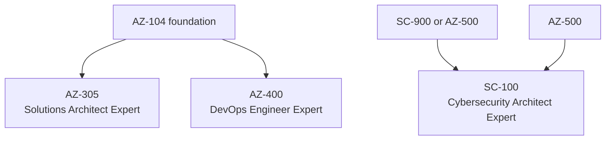

# 03 Expert Level Certifications

> **Disclaimer:** Exam details, domains, and weightages are based on publicly available information from [Microsoft Learn](https://learn.microsoft.com/en-us/credentials/certifications/). Always verify current exam objectives on the official page before preparing, as Microsoft updates exam content periodically.

## Why expert level matters

- Expert exams test architecture judgment, trade off analysis, and cross domain decision making.
- You are expected to connect identity, networking, security, operations, automation, and business requirements into one coherent solution.
- These exams reward both experience and structured study.

## Expert journey map

## Expert exam comparison

| Exam | Best for | Core theme |
|---|---|---|
| AZ-305 | Architects and senior cloud engineers | End to end solution design on Azure |
| AZ-400 | DevOps and platform engineers | Delivery systems, governance, security, and feedback loops |
| SC-100 | Security architects | Enterprise security architecture across Microsoft platforms |

## AZ-305: Azure Solutions Architect Expert

### Exam snapshot

| Item | Details |
|---|---|
| Exam code | `AZ-305` |
| Cost | About `$165` USD |
| Duration | About 120 minutes |
| Passing score | `700/1000` |
| Study window | 6 to 10 weeks |
| Official page | https://learn.microsoft.com/en-us/credentials/certifications/azure-solutions-architect/ |
| Exam page | https://learn.microsoft.com/en-us/credentials/certifications/exams/az-305/ |
| Browse training | https://learn.microsoft.com/en-us/training/browse/?terms=AZ-305 |

### Recommended prerequisites

- `AZ-104` is strongly recommended even when not always enforced as a hard requirement.
- You should understand Azure administration, networking, identity, governance, compute, storage, and monitoring.
- Basic familiarity with development and DevOps practices helps when evaluating architecture options.

> **Important:** `AZ-305` is much easier after real Azure implementation experience. It is not just a theory exam.

### Domain breakdown

| Domain | Weightage | Focus |
|---|---|---|
| Design identity, governance, and monitoring solutions | 25 to 30 percent | Multi subscription governance, access design, and observability |
| Design data storage solutions | 25 to 30 percent | Relational, non relational, analytical, and data protection decisions |
| Design business continuity solutions | 10 to 15 percent | Backup, DR, RPO/RTO, failover patterns |
| Design infrastructure solutions | 25 to 30 percent | Compute, networking, migration, resilience, and hybrid design |

### What the exam really tests

- Can you turn business requirements into Azure architecture decisions?
- Can you justify why one design is better than another based on cost, risk, scale, and operability?
- Can you identify the trade offs between managed services, custom builds, and hybrid models?

### Architecture patterns to know

#### Hub and spoke

- Centralize connectivity, security controls, and shared services.
- Good for multiple landing zones and controlled east west traffic.
- Common in enterprise Azure environments.

#### Landing zone based subscription design

- Separate platform subscriptions from workload subscriptions.
- Use management groups, policies, and shared monitoring.
- Aligns strongly with the Cloud Adoption Framework.

#### Active active vs active passive

- Know cost vs resilience trade offs.
- Use active active when low RTO and high availability justify complexity.
- Use active passive when standby economics are acceptable.

#### Event driven architectures

- Useful for decoupling services and scaling independently.
- Understand Event Grid, Service Bus, Event Hubs, and Functions roles.

#### Data tier separation

- Pick the right store for transactional, analytical, search, and globally distributed needs.
- Understand when polyglot persistence is justified.

#### Zero Trust aligned architecture

- Private access where possible.
- Least privilege access.
- Explicit verification and segmentation.

### Case study format explained

- `AZ-305` may include case studies where you read a business scenario, technical environment, constraints, and requirements.
- Questions can ask for the best design choice, the most secure option, or the most cost efficient approach.
- Some case study questions depend on reading tables carefully rather than memorizing product trivia.

### How to answer case study questions

- Read business goals before technical requirements.
- Identify constraints such as budget, compliance, latency, and team skill level.
- Highlight keywords tied to RPO, RTO, global reach, private connectivity, and managed service preference.
- Eliminate designs that technically work but violate cost or operational simplicity requirements.

### Comparison with AWS and GCP architect exams

| Azure | Rough comparison | Similar theme |
|---|---|---|
| AZ-305 | AWS Solutions Architect Professional | Architecture breadth, business trade offs, hybrid design |
| AZ-305 | Google Professional Cloud Architect | Designing secure, scalable, resilient cloud solutions |

### AZ-305 study plan

#### Weeks 1 to 2

- Review Azure governance, identity, management groups, and landing zone design.
- Revisit `AZ-104` topics where you feel weak.

#### Weeks 3 to 4

- Study data platform choices, backup models, HA, DR, and recovery planning.
- Practice comparing Azure SQL, Cosmos DB, storage tiers, and data lake patterns.

#### Weeks 5 to 6

- Study infrastructure design, hybrid connectivity, migration, VM scale, App Service, containers, and networking patterns.
- Draw architecture diagrams from business scenarios.

#### Weeks 7 to 8

- Focus on case studies and design trade offs.
- Review Well Architected Framework and Cloud Adoption Framework guidance.
- Take timed practice exams.

### Resources

| Resource | URL |
|---|---|
| Certification page | https://learn.microsoft.com/en-us/credentials/certifications/azure-solutions-architect/ |
| Exam page | https://learn.microsoft.com/en-us/credentials/certifications/exams/az-305/ |
| Training browse | https://learn.microsoft.com/en-us/training/browse/?terms=AZ-305 |
| Azure Architecture Center | https://learn.microsoft.com/en-us/azure/architecture/ |
| Azure Well-Architected Framework | https://learn.microsoft.com/en-us/azure/well-architected/ |
| Cloud Adoption Framework | https://learn.microsoft.com/en-us/azure/cloud-adoption-framework/ |

## AZ-400: DevOps Engineer Expert

### Exam snapshot

| Item | Details |
|---|---|
| Exam code | `AZ-400` |
| Cost | About `$165` USD |
| Duration | About 100 to 120 minutes |
| Passing score | `700/1000` |
| Study window | 6 to 8 weeks |
| Official page | https://learn.microsoft.com/en-us/credentials/certifications/devops-engineer/ |
| Browse training | https://learn.microsoft.com/en-us/training/browse/?terms=AZ-400 |

### Core domains to master

- Source control and collaboration strategy.
- Continuous integration design.
- Continuous delivery and release management.
- Infrastructure as code and configuration management.
- Security and compliance in the delivery lifecycle.
- Monitoring, feedback, and operational improvement.

### Tools to know

- Azure DevOps Repos, Pipelines, Boards, and Artifacts.
- GitHub, pull request workflows, and GitHub Actions.
- Terraform, Bicep, ARM templates, and policy based governance.
- Key Vault, secret rotation, and workload identities.
- Azure Monitor, Application Insights, and log driven feedback.

### What strong candidates can do

- Build repeatable CI/CD systems, not just one pipeline.
- Choose the right repository strategy and branching model.
- Secure secrets, approvals, environments, and deployment identities.
- Design a release process that balances speed and safety.
- Measure deployment quality using telemetry and rollback signals.

### Study emphasis

- Learn why certain pipeline designs fail at scale.
- Be able to explain immutable artifacts, environment promotion, and gated releases.
- Understand GitHub Actions and Azure DevOps similarities and differences.
- Practice Terraform or Bicep enough to reason about real platform automation.

### Resources

| Resource | URL |
|---|---|
| Certification page | https://learn.microsoft.com/en-us/credentials/certifications/devops-engineer/ |
| Training browse | https://learn.microsoft.com/en-us/training/browse/?terms=AZ-400 |
| Azure DevOps docs | https://learn.microsoft.com/en-us/azure/devops/ |
| GitHub Actions docs | https://docs.github.com/en/actions |
| Azure developer Terraform docs | https://learn.microsoft.com/en-us/azure/developer/terraform/ |

## SC-100: Cybersecurity Architect Expert

### Exam snapshot

| Item | Details |
|---|---|
| Exam code | `SC-100` |
| Cost | About `$165` USD |
| Duration | About 120 minutes |
| Passing score | `700/1000` |
| Study window | 6 to 8 weeks |
| Official page | https://learn.microsoft.com/en-us/credentials/certifications/cybersecurity-architect-expert/ |
| Browse training | https://learn.microsoft.com/en-us/training/browse/?terms=SC-100 |

### Core domains to master

- Design security solutions that align to Zero Trust principles.
- Design security operations, posture, and incident response capabilities.
- Design identity and access protection architecture.
- Design data and application protection strategies.
- Design infrastructure resilience and governance guardrails.

### Tools and platforms to know

- Microsoft Entra ID and Conditional Access.
- Microsoft Defender XDR and Defender for Cloud.
- Microsoft Sentinel.
- Purview, DLP, and compliance controls.
- Azure networking security services and Key Vault.

### Study emphasis

- Think like an architect rather than an analyst.
- Learn to map risk and threat scenarios to layered controls.
- Understand integration across Microsoft 365, Azure, endpoints, identities, and cloud workloads.

### Resources

| Resource | URL |
|---|---|
| Certification page | https://learn.microsoft.com/en-us/credentials/certifications/cybersecurity-architect-expert/ |
| Training browse | https://learn.microsoft.com/en-us/training/browse/?terms=SC-100 |
| Zero Trust guidance | https://learn.microsoft.com/en-us/security/zero-trust/ |
| Microsoft Sentinel docs | https://learn.microsoft.com/en-us/azure/sentinel/ |
| Defender for Cloud docs | https://learn.microsoft.com/en-us/azure/defender-for-cloud/ |

## AZ-305 decision checklist

When evaluating an answer in `AZ-305`, ask:

- Does it satisfy security and compliance requirements?
- Does it align to the stated budget constraint?
- Does it minimize operational complexity where possible?
- Does it meet latency, availability, and recovery goals?
- Does it use managed services appropriately instead of over engineering?

## Common AZ-305 scenario themes

- Multi region application design.
- Private connectivity to PaaS services.
- Subscription and governance design for multiple teams.
- Choosing between VMs, App Service, containers, and serverless.
- Selecting the right storage or database for a workload profile.
- Designing backup and disaster recovery around business continuity targets.

## AZ-305 lab and reading recommendations

- Review hub and spoke and landing zone content in this repository.
- Use Azure Architecture Center reference architectures as case study material.
- Draw your own architecture diagrams from sample business requirements.
- Revisit Well Architected Framework pillars and tie them to service choices.

## AZ-400 domain view

| Domain theme | What to know well |
|---|---|
| Source control | Branching, PR policy, collaboration, trunk based vs feature branch trade offs |
| CI | Build quality gates, caching, test strategy, artifact versioning |
| CD | Environments, approvals, deployment rings, rollback, progressive delivery |
| Security | Secret handling, workload identities, policy checks, supply chain awareness |
| Observability | Telemetry, dashboards, alerts, release health feedback loops |

## AZ-400 practice ideas

- Build one pipeline in Azure DevOps and one in GitHub Actions.
- Store secrets in Key Vault and consume them securely in CI/CD.
- Create an IaC deployment pipeline using Bicep or Terraform.
- Add test, lint, and security scanning stages.
- Add manual approvals or environment protection rules.

## AZ-400 common mistakes

- Treating CI/CD as only a YAML syntax exercise.
- Ignoring artifact immutability and promotion strategy.
- Forgetting security checks in the delivery path.
- Using long lived credentials when identity federation is available.

## SC-100 architecture lens

Strong `SC-100` answers usually:

- Start with Zero Trust assumptions.
- Protect identities before workloads.
- Use layered controls across endpoint, identity, application, data, and network.
- Prefer central visibility and incident response integration.
- Balance prevention, detection, and recovery.

## SC-100 practice ideas

- Map a business requirement to identity, network, and data protection controls.
- Compare Sentinel, Defender, Purview, and Entra roles in a complete architecture.
- Review security reference architectures and breach response workflows.

## Expert level study pattern

### Phase 1: Refresh broad Azure knowledge

- Review any weak `AZ-104` topics.
- Rebuild your service comparison notes.

### Phase 2: Practice scenario design

- Read one architecture scenario at a time.
- Write down the requirement, constraints, and recommended design.
- Compare your answer to Microsoft guidance.

### Phase 3: Practice exam pacing

- Use timed sessions.
- Train yourself to make trade off decisions quickly.
- Review why distractor answers fail the requirement set.

## Architecture trade offs to practice for AZ-305

| Decision area | Trade off to think through |
|---|---|
| Compute | Managed platform simplicity vs VM level control |
| Network | Private connectivity and security vs implementation complexity |
| Data | Operational familiarity vs globally distributed scalability |
| Resilience | Better uptime vs higher steady state cost |
| Governance | Central standards vs workload team flexibility |

## What strong expert level notes look like

- One page per domain.
- One comparison table per similar service group.
- One architecture diagram per common scenario.
- One section called `why not the other option` for distractor analysis.

## Expert level interview value

- These certifications help most when you can explain the design reasoning behind them.
- In interviews, connect your exam knowledge to governance, cost, resiliency, and delivery experience.
- Use them to tell a story about better decision making, not just test success.

## Quick comparison of expert outcomes

- `AZ-305` improves architecture communication and design trade off judgment.
- `AZ-400` improves automation, release governance, and platform delivery credibility.
- `SC-100` improves enterprise security architecture and control mapping skills.

## Recommended reading order inside this repository

- Read `LandingZones/` and `Architecture/` before deep `AZ-305` revision.
- Read `AzureDevOps/` and `CICD/` before `AZ-400` practice exams.
- Read `IAM-Security/`, `Networking/`, and `Monitoring/` before `SC-100` scenario review.

## Which expert exam should you choose

| Goal | Best fit |
|---|---|
| Design Azure platforms and landing zones | `AZ-305` |
| Build enterprise delivery systems and platform automation | `AZ-400` |
| Design end to end security architecture | `SC-100` |

## AZ-400 study plan

### Weeks 1 to 2

- Review Git fundamentals, branching strategy, pull request policy, and work tracking.
- Compare Azure DevOps and GitHub feature sets.

### Weeks 3 to 4

- Build CI pipelines with tests, artifacts, and caching.
- Practice secure secret injection and environment separation.

### Weeks 5 to 6

- Build CD pipelines with approvals, rollback thinking, and infrastructure as code.
- Add telemetry, alerting, and deployment health review.

### Weeks 7 to 8

- Review practice questions and architecture style scenarios.
- Focus on trade offs, not memorizing UI steps.

## SC-100 study plan

### Weeks 1 to 2

- Review Zero Trust, identity protection, and access control architecture.
- Map Entra capabilities to business risk scenarios.

### Weeks 3 to 4

- Study Defender, Sentinel, and Purview roles in an integrated security architecture.
- Practice layered protection thinking across identities, endpoints, apps, and data.

### Weeks 5 to 6

- Review hybrid and multicloud considerations.
- Practice mapping requirements to security controls and reference architectures.

### Weeks 7 to 8

- Use practice assessments and architecture scenarios.
- Revisit weak domains and update your decision framework.

## Expert level lab ideas

### For AZ-305

- Design a hub and spoke landing zone diagram for a multi team company.
- Compare App Service, AKS, and Functions for three different workloads.
- Plan RPO and RTO targets for a business critical application.

### For AZ-400

- Build a release pipeline with dev, test, and production environments.
- Add a manual approval, a security scan, and an artifact promotion flow.
- Publish telemetry and create an alert tied to deployment quality.

### For SC-100

- Create a layered control map for a regulated workload.
- Design identity, endpoint, and cloud workload protection together.
- Build a simple incident response workflow using Sentinel concepts.

## Expert exam mindset

- Expect Microsoft to test judgment rather than memorization.
- Translate every requirement into security, reliability, cost, and operations consequences.
- Ask whether the answer is technically correct but operationally poor.
- Prefer solutions that fit the stated constraints instead of the fanciest architecture.

## Exam specific pitfalls to avoid

### AZ-305 pitfalls

- Optimizing for one requirement while ignoring the others.
- Choosing services because they are popular rather than because they fit the workload.
- Ignoring governance or operational support in architecture answers.

### AZ-400 pitfalls

- Designing pipelines without secure identity and secret handling.
- Treating deployment speed as more important than traceability and rollback.
- Forgetting to measure release quality after deployment.

### SC-100 pitfalls

- Focusing only on Azure services and missing the broader Microsoft security ecosystem.
- Proposing isolated controls without an overall architecture model.
- Ignoring identity as the first security control plane.

## Turning expert study into real work value

- Use `AZ-305` preparation to improve architecture review documents.
- Use `AZ-400` preparation to improve pipeline guardrails and deployment standards.
- Use `SC-100` preparation to improve control mapping and security design discussions.
- Bring one exam concept each week back into your team workflow.
- Expert certifications create the most value when they change how you design systems.

## Final recommendations

- `AZ-305` is the best expert exam for cloud engineers who want architecture credibility.
- `AZ-400` is the best expert exam for engineers who love automation, pipelines, and platform delivery.
- `SC-100` is best taken after some hands on security exposure, usually after `SC-900` or `AZ-500`.
