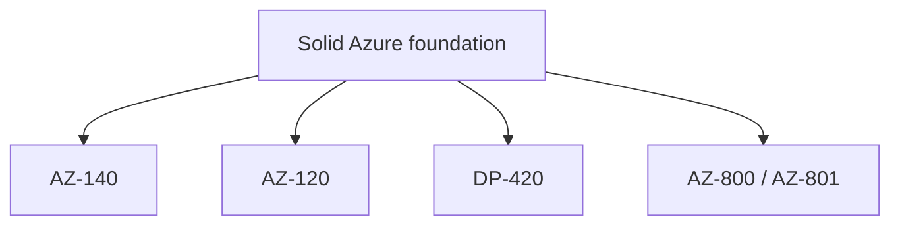

# 04 Specialty Certifications

> **Disclaimer:** Exam details, domains, and weightages are based on publicly available information from [Microsoft Learn](https://learn.microsoft.com/en-us/credentials/certifications/). Always verify current exam objectives on the official page before preparing, as Microsoft updates exam content periodically.

## What specialty certifications are for

- Specialty exams validate focused expertise in a narrower area than a broad role based certification.
- They make the most sense after you already have a solid Azure foundation.
- In most cases, you should complete `AZ-104`, `AZ-305`, `AZ-500`, or an equivalent broad role based path before specializing.

## Specialty overview table

| Exam | Focus | Best for | Official page |
|---|---|---|---|
| AZ-140 | Azure Virtual Desktop | End user computing, VDI, workplace engineering | https://learn.microsoft.com/en-us/credentials/certifications/azure-virtual-desktop-specialty/ |
| AZ-120 | Azure for SAP Workloads | SAP basis and enterprise infrastructure teams | https://learn.microsoft.com/en-us/credentials/certifications/azure-for-sap-workloads-specialty/ |
| DP-420 | Azure Cosmos DB Developer Specialty | Developers using globally distributed NoSQL | https://learn.microsoft.com/en-us/credentials/certifications/azure-cosmos-db-developer-specialty/ |
| AZ-800 / AZ-801 | Windows Server Hybrid Administrator | Windows admins operating hybrid estates | https://learn.microsoft.com/en-us/credentials/certifications/windows-server-hybrid-administrator/ |

## Specialty decision diagram

## AZ-140: Azure Virtual Desktop Specialty

### Snapshot

| Item | Details |
|---|---|
| Exam code | `AZ-140` |
| Cost | About `$165` USD |
| Duration | About 100 to 120 minutes |
| Passing score | `700/1000` |
| Study window | 4 to 6 weeks |
| Browse training | https://learn.microsoft.com/en-us/training/browse/?terms=AZ-140 |

### What it covers

- Design Azure Virtual Desktop architecture.
- Implement host pools, session hosts, profiles, and user access.
- Secure and monitor virtual desktop environments.
- Optimize user experience, scaling, and cost.

### Best fit candidates

- Workplace engineering teams.
- Infrastructure engineers managing virtual desktop estates.
- Architects designing secure remote work platforms.

## AZ-120: Azure for SAP Workloads Specialty

### Snapshot

| Item | Details |
|---|---|
| Exam code | `AZ-120` |
| Cost | About `$165` USD |
| Duration | About 100 to 120 minutes |
| Passing score | `700/1000` |
| Study window | 4 to 8 weeks |
| Browse training | https://learn.microsoft.com/en-us/training/browse/?terms=AZ-120 |

### What it covers

- Migrate SAP workloads to Azure.
- Design SAP certified infrastructure on Azure.
- Plan high availability, disaster recovery, and performance.
- Operate SAP workloads with Azure governance and monitoring.

### Best fit candidates

- SAP basis administrators.
- Enterprise architects responsible for SAP modernization.
- Infrastructure engineers supporting mission critical ERP workloads.

## DP-420: Azure Cosmos DB Developer Specialty

### Snapshot

| Item | Details |
|---|---|
| Exam code | `DP-420` |
| Cost | About `$165` USD |
| Duration | About 100 to 120 minutes |
| Passing score | `700/1000` |
| Study window | 4 to 6 weeks |
| Browse training | https://learn.microsoft.com/en-us/training/browse/?terms=DP-420 |

### What it covers

- Design data models for Cosmos DB.
- Optimize partitioning strategy and throughput.
- Build resilient applications with SDKs and consistency options.
- Monitor performance and cost in globally distributed systems.

### Best fit candidates

- Application developers using NoSQL at scale.
- Architects designing globally distributed applications.
- Engineers who need deep Cosmos DB performance awareness.

## AZ-800 and AZ-801: Windows Server Hybrid Administrator

### Snapshot

| Item | Details |
|---|---|
| Exams | `AZ-800` and `AZ-801` |
| Cost | About `$165` USD each |
| Duration | About 100 to 120 minutes each |
| Passing score | `700/1000` each |
| Study window | 6 to 10 weeks combined |
| Browse training | https://learn.microsoft.com/en-us/training/browse/?terms=AZ-800 |
| Browse training | https://learn.microsoft.com/en-us/training/browse/?terms=AZ-801 |

### What they cover

- Hybrid identity and Windows Server administration.
- Migration of on premises workloads to Azure.
- High availability, disaster recovery, and monitoring.
- Integration with Azure services for hybrid operations.

### Best fit candidates

- Traditional Windows administrators modernizing into Azure.
- Hybrid infrastructure teams.
- Organizations not fully cloud native yet.

## Recommended prerequisites by specialty

| Exam | Helpful background before you start |
|---|---|
| AZ-140 | `AZ-104`, Azure networking basics, identity basics, Windows admin awareness |
| AZ-120 | `AZ-104` or architect level Azure knowledge, SAP basis familiarity, HA/DR understanding |
| DP-420 | `AZ-204` or strong development experience, NoSQL concepts, Cosmos DB basics |
| AZ-800 / AZ-801 | Windows Server administration, Active Directory, hybrid networking, backup and recovery |

## Study plans by specialty

### AZ-140 study plan

- Week 1: Host pools, session hosts, images, and identity basics.
- Week 2: FSLogix, profiles, app delivery, and user experience.
- Week 3: Security, monitoring, scaling, and troubleshooting.
- Week 4: Architecture review and practice scenarios.

### AZ-120 study plan

- Weeks 1 to 2: SAP on Azure foundations and certified infrastructure patterns.
- Weeks 3 to 4: High availability, DR, storage, and network design.
- Weeks 5 to 6: Operations, monitoring, backup, and migration considerations.

### DP-420 study plan

- Week 1: Data modeling, containers, partition keys, and SDK basics.
- Week 2: Consistency levels, throughput, scaling, and performance.
- Week 3: Security, monitoring, and cost optimization.
- Week 4: Scenario practice focused on globally distributed apps.

### AZ-800 and AZ-801 study plan

- Weeks 1 to 2: Hybrid identity and administration foundations.
- Weeks 3 to 4: Storage, migration, and recovery operations.
- Weeks 5 to 6: Advanced services, HA, DR, and security hardening.
- Weeks 7 to 8: Practice tests and hybrid scenario review.

## Official training shortcuts

| Exam | Training browse URL |
|---|---|
| AZ-140 | https://learn.microsoft.com/en-us/training/browse/?terms=AZ-140 |
| AZ-120 | https://learn.microsoft.com/en-us/training/browse/?terms=AZ-120 |
| DP-420 | https://learn.microsoft.com/en-us/training/browse/?terms=DP-420 |
| AZ-800 | https://learn.microsoft.com/en-us/training/browse/?terms=AZ-800 |
| AZ-801 | https://learn.microsoft.com/en-us/training/browse/?terms=AZ-801 |

## Signals that a specialty exam is worth it

- Your production environment already uses the exact workload.
- Your team needs deep operational ownership, not just general cloud skills.
- You want internal credibility in a niche domain.
- Your employer is funding the exam because it matches project demand.

## Signals that you should wait

- You still struggle with core Azure identity, networking, or governance topics.
- You do not yet have a broad associate level certification.
- You want the widest external job market signal first.

## When to pursue specialty vs associate or expert

| Situation | Better choice |
|---|---|
| You are new to Azure | Start with fundamentals or associate, not specialty |
| You need broad job market value | `AZ-104` or `AZ-305` usually beats a niche specialty |
| Your daily job is already niche | Specialty can be high value |
| Your employer runs SAP, AVD, or heavy hybrid Windows | Specialty is highly relevant |
| You want architecture leadership | Expert before specialty is usually better |

> **Tip:** Specialty exams are strongest when they map directly to your production responsibilities.

## How managers usually view specialty certifications

- They rarely replace a broad Azure admin or architect certification.
- They are powerful when they match a funded program or platform team mandate.
- They can accelerate trust if your team owns the exact workload in production.

## Specialty exam preparation tips

- Read product specific documentation more deeply than you would for broad role based exams.
- Build or review real deployment diagrams.
- Focus on operational edge cases and failure modes, not just provisioning steps.
- Pair vendor guidance with hands on labs whenever possible.

## Career impact

- Specialty certifications signal depth rather than breadth.
- They help inside enterprises with specific technology stacks more than in generic cloud job searches.
- On résumés, they work best when paired with a broader Azure credential like `AZ-104`, `AZ-305`, or `AZ-500`.
- For internal promotion, specialty exams can be persuasive when your team owns the exact workload.

## Common specialty exam scenarios

### AZ-140 scenarios

- A company needs secure remote desktops for a distributed workforce.
- User profile performance is inconsistent and needs optimization.
- Session host scaling must balance cost and user experience.

### AZ-120 scenarios

- A mission critical SAP landscape needs HA and DR on Azure.
- Storage and network design must align with SAP certification guidance.
- Migration planning must minimize business disruption.

### DP-420 scenarios

- A globally distributed app needs the right partition key strategy.
- Throughput and cost are rising because of poor data model choices.
- Developers must choose consistency settings that match business requirements.

### AZ-800 and AZ-801 scenarios

- An organization is extending Active Directory into Azure.
- Windows workloads require backup, HA, and secure hybrid administration.
- Legacy servers are being modernized gradually, not all at once.

## Specialty resources

| Exam | Extra docs to review |
|---|---|
| AZ-140 | https://learn.microsoft.com/en-us/azure/virtual-desktop/ |
| AZ-120 | https://learn.microsoft.com/en-us/azure/sap/ |
| DP-420 | https://learn.microsoft.com/en-us/azure/cosmos-db/ |
| AZ-800 / AZ-801 | https://learn.microsoft.com/en-us/windows-server/ |

## Career positioning by specialty

| Specialty | Career signal |
|---|---|
| AZ-140 | Strong signal for workplace engineering and end user computing teams |
| AZ-120 | High value in large enterprises with SAP estates |
| DP-420 | Strong niche signal for developers building on Cosmos DB |
| AZ-800 / AZ-801 | Valuable for hybrid Windows modernization roles |

## Specialty vs broad certification summary

| Goal | Better path |
|---|---|
| Maximum external job mobility | Broad associate or expert first |
| Deep internal credibility on one platform | Specialty can be excellent |
| Career switch into Azure | Fundamentals plus `AZ-104` first |
| Team already owns SAP, AVD, Cosmos DB, or hybrid Windows | Specialty can deliver fast value |

## Good sequencing examples

- `AZ-900` → `AZ-104` → `AZ-140` for endpoint and virtual desktop teams.
- `AZ-900` → `AZ-104` → `AZ-305` → `AZ-120` for enterprise infrastructure and SAP.
- `AZ-900` → `AZ-204` → `DP-420` for application developers using Cosmos DB.
- `AZ-900` → `AZ-104` → `AZ-800` and `AZ-801` for hybrid Windows operations.

## Final specialty screening questions

- Does this certification match my current production workload?
- Will it help me solve a real problem for my team in the next 6 to 12 months?
- Do I already have a solid broad Azure foundation?
- Will this depth be visible and useful in my target job market?

> **Note:** Specialty exams are strongest when they are paired with an obvious production use case.

## Final recommendation

- Do not use specialty certifications as your first Azure credential.
- Earn them when they strengthen your real work story.
- If you are unsure, choose `AZ-104` or `AZ-305` first and specialize later.
