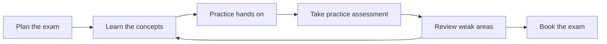
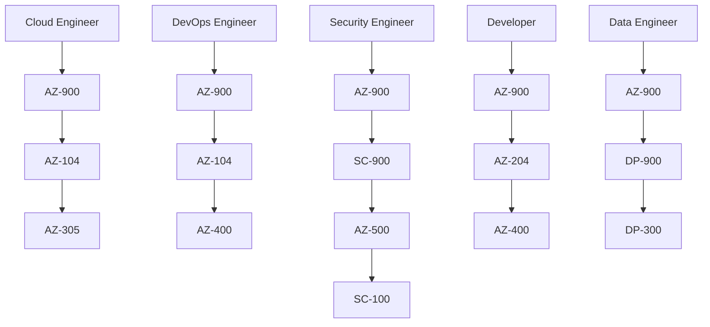

# 05 Study Strategies for Azure Certifications

> **Disclaimer:** Exam details, domains, and weightages are based on publicly available information from [Microsoft Learn](https://learn.microsoft.com/en-us/credentials/certifications/). Always verify current exam objectives on the official page before preparing, as Microsoft updates exam content periodically.

## Why study strategy matters

- Azure exams reward pattern recognition, service comparison, and repeated hands on practice.
- Most failures come from shallow study, not from a lack of intelligence.
- A good study system reduces stress and improves retention.

## Study loop

## Core study principles

- Use official Microsoft Learn material first.
- Build a personal glossary of Azure terms.
- Compare services side by side instead of studying them in isolation.
- Practice in the portal and CLI so theory maps to reality.
- Revise weak domains more often than strong domains.
- Study in shorter sessions several times a week rather than one long weekend cram.

## Free resources

| Resource | Why it helps | URL |
|---|---|---|
| Microsoft Learn certifications hub | Official certification pages, renewals, study guides, and scheduling links | https://learn.microsoft.com/en-us/credentials/certifications/ |
| Microsoft Learn training browse | Search modules and collections by exam code | https://learn.microsoft.com/en-us/training/browse/ |
| Microsoft Virtual Training Days | Free instructor led events and occasional voucher opportunities | https://www.microsoft.com/en-us/trainingdays |
| Azure free account | Hands on practice with credits and common free services | https://azure.microsoft.com/en-us/free/ |
| GitHub Student Developer Pack | Student benefits and tooling access | https://education.github.com/pack |
| Azure CLI docs | Command reference for daily repetition | https://learn.microsoft.com/en-us/cli/azure/ |
| Azure Architecture Center | Architecture examples for scenario based exams | https://learn.microsoft.com/en-us/azure/architecture/ |
| Azure Well-Architected Framework | Design trade offs for expert exams | https://learn.microsoft.com/en-us/azure/well-architected/ |

> **Tip:** If budget is tight, Microsoft Learn plus an Azure free account is enough to pass many fundamentals and associate exams when used consistently.

## Paid resources

| Resource | Typical use | Notes |
|---|---|---|
| Udemy courses | Structured video learning | Popular instructors often include Scott Duffy and Alan Rodrigues |
| MeasureUp | High quality practice exams | Often closest to enterprise style exam practice |
| Whizlabs | Budget practice tests and labs | Good for repetition, but verify against official objectives |
| Pluralsight | Deeper technical explanation | Strong for Azure operations and architecture context |
| A Cloud Guru | Guided cloud learning paths | Useful for broad cloud comparison, not just Azure |

## Hands on practice platforms

| Platform | Best use | URL |
|---|---|---|
| Microsoft Learn Sandbox | Guided labs without major setup overhead | https://learn.microsoft.com/en-us/training/ |
| Azure Free Account | Best for portal, CLI, and real resource experience | https://azure.microsoft.com/en-us/free/ |
| KillerCoda | Kubernetes practice, useful for AKS adjacent study | https://killercoda.com/ |
| Azure DevOps free tier | Pipeline and work tracking practice | https://azure.microsoft.com/en-us/pricing/details/devops/azure-devops-services/ |
| GitHub Actions | CI/CD practice for `AZ-400` and developer paths | https://docs.github.com/en/actions |

## How to study effectively for Azure exams

### Step 1: Start with the official exam page

- Read the certification page.
- Read the exam study guide if Microsoft provides an `aka.ms` link.
- Note the domain names and official weightings.
- Build your study checklist directly from those domains.

### Step 2: Build a service comparison sheet

Create a simple table for each exam showing:

- Service name.
- Primary use case.
- Similar services.
- Key difference.
- Common exam trap.

### Step 3: Learn with both theory and action

For every major topic:

- Read Microsoft Learn content.
- Open the Azure portal or CLI.
- Create or inspect the service.
- Write one sentence explaining when you would use it.

### Step 4: Test yourself early

- Do not wait until the end to try practice questions.
- Take a first assessment after your first pass through the syllabus.
- Use wrong answers as a map for what to revisit.

### Step 5: Review weak areas intentionally

- Spend more time on domains with high weighting.
- Review missed questions by theme, not one by one.
- Rebuild the mental model that caused the miss.

## Study plan templates

### 4 week template

#### Week 1

- Read exam page and study guide.
- Complete first half of Microsoft Learn content.
- Build glossary and comparison notes.

#### Week 2

- Complete the remaining Microsoft Learn content.
- Begin hands on portal or CLI practice.
- Summarize each domain in your own words.

#### Week 3

- Take practice assessments.
- Revisit weak areas.
- Repeat the most important labs.

#### Week 4

- Use the exam sandbox.
- Review flashcards and comparison sheets.
- Book the exam or confirm your date.

### 8 week template

#### Weeks 1 to 2

- Build the foundation with Microsoft Learn and overview videos.
- Create your study tracker.

#### Weeks 3 to 4

- Focus on the highest weight domains.
- Start hands on labs.

#### Weeks 5 to 6

- Add scenario practice and practice assessments.
- Review weak topics with deeper docs.

#### Weeks 7 to 8

- Do final revision.
- Practice pacing and question review strategy.
- Sit the exam.

### 12 week template

#### Weeks 1 to 4

- Learn the platform slowly and thoroughly.
- Ideal for people studying while working full time.

#### Weeks 5 to 8

- Expand hands on practice and architecture reasoning.
- Build mini labs that reflect your work environment.

#### Weeks 9 to 12

- Focus on mock exams, revision cycles, and production scenario mapping.
- Best for expert and specialty exams.

## Exam day tips

### Pearson VUE process

- Test your system well before the exam if taking it online.
- Join the check in process early.
- Keep your government ID ready.
- Ensure the room is quiet, clean, and compliant with proctoring rules.
- Expect a photo and room scan process.

### Online proctored vs test center

| Option | Advantages | Trade offs |
|---|---|---|
| Online proctored | Convenient, no travel, flexible scheduling | More rules about room setup and technical checks |
| Test center | Stable environment, fewer home distractions | Travel time and fixed location logistics |

### Time management

- Do not spend too long on one difficult question.
- Use **Mark for review** when unsure and move on.
- Return later with fresh context after easier questions are done.
- Leave a small buffer at the end for flagged items.

### Question types to expect

| Question type | What to do |
|---|---|
| Multiple choice | Eliminate obviously wrong answers first |
| Multiple select | Verify the prompt asks for more than one answer |
| Drag and drop | Match concepts carefully and watch for near synonyms |
| Case studies | Read requirements before proposed solutions |
| Labs or interactive items | Stay calm and follow the task rather than exploring randomly |

### Using mark for review effectively

- Use it when two answers both seem plausible.
- Use it when a case study feels long and you want to preserve time.
- Do not mark half the exam; reserve it for genuinely uncertain items.

## Common mistakes that cause failures

- Watching videos without hands on practice.
- Using outdated exam dumps instead of current objectives.
- Ignoring the official study guide.
- Over studying low value trivia while missing high weight domains.
- Not practicing Microsoft style wording and scenario framing.

## Renewal process

- Most role based and specialty certifications expire after one year unless renewed.
- Renewal is done through a free online assessment on Microsoft Learn.
- You can usually start the renewal process before the expiration date.
- Renewals are shorter and more update focused than the original exam.

> **Important:** Fundamentals certifications typically do not require the same annual renewal cycle as role based and specialty certifications.

## Role based certification path recommendations

### Cloud Engineer

- `AZ-900` → `AZ-104` → `AZ-305`
- Good for infrastructure, platform, and general Azure engineering roles.

### DevOps Engineer

- `AZ-900` → `AZ-104` → `AZ-400`
- Best for engineers working with pipelines, IaC, release governance, and platform automation.

### Security Engineer

- `AZ-900` → `SC-900` → `AZ-500` → `SC-100`
- Good for identity, posture management, and cloud security roles.

### Data Engineer / DBA path

- `AZ-900` → `DP-900` → `DP-300`
- Add specialized platform training depending on analytics or developer focus.

### Developer

- `AZ-900` → `AZ-204` → `AZ-400`
- Best for developers deploying and operating applications on Azure.

## Role path diagram

## Note taking and retention methods

### Use a three column note format

- Column 1: Service or concept.
- Column 2: When to use it.
- Column 3: Common confusion or similar services.

### Build flashcards only for high value facts

Use flashcards for:

- Domain weightings.
- Similar service differences.
- Governance tool purpose.
- Availability and resiliency concepts.
- Security terminology.

Avoid flashcards for:

- Long feature lists without context.
- Obscure limits that rarely appear in official objectives.

## How to use practice tests correctly

- Do not take ten practice tests in a row without review.
- After each attempt, categorize mistakes into concepts, wording, or pacing.
- Re study the topic before retesting.
- Use practice scores as feedback, not as a guarantee of passing.

## Hands on lab ideas by exam family

### Fundamentals

- Create a resource group.
- Explore the portal menus for compute, networking, and storage.
- Review Cost Management and Azure Policy screens.

### AZ-104 and infrastructure exams

- Deploy VNets, VMs, NSGs, and storage accounts.
- Practice RBAC and policy assignments.
- Create alerts and inspect logs.

### Developer and DevOps exams

- Deploy an app with App Service or Functions.
- Build a CI/CD workflow using GitHub Actions or Azure DevOps.
- Store secrets in Key Vault and reference them securely.

### Security exams

- Review Conditional Access concepts.
- Explore Defender for Cloud recommendations.
- Walk through Sentinel architecture and data flow.

## Sample weekly study rhythm for working professionals

| Day | Suggested activity |
|---|---|
| Monday | Read one domain topic on Microsoft Learn |
| Tuesday | Watch one focused explanation video and take notes |
| Wednesday | Do one hands on lab |
| Thursday | Review notes and flashcards |
| Friday | Solve practice questions |
| Saturday | Deep study session for weak areas |
| Sunday | Light review or rest |

## Last 48 hours before the exam

- Stop collecting new resources.
- Review your own notes instead of binge watching videos.
- Confirm your exam time zone and check in instructions.
- Sleep properly; fatigue hurts judgment based questions.

## What to do after the exam

### If you pass

- Download or share your badge.
- Update your résumé and LinkedIn profile.
- Pick a hands on project that uses the certified skills within two weeks.

### If you fail

- Read the score report by domain.
- Rebuild your plan around weak areas.
- Wait long enough to improve before retaking.
- Do not react by cramming random practice questions.

## Renewal workflow

1. Track your expiration date in your calendar.
2. Start renewal prep several weeks early.
3. Review recent Azure updates for your certification area.
4. Complete the free online assessment on Microsoft Learn.
5. Repeat yearly for role based and specialty credentials.

## When to book the exam

Book the exam when:

- You have completed at least one full pass of the syllabus.
- Your weak domains are shrinking rather than shifting randomly.
- You can explain major service choices without looking at notes.
- Your practice results are stable enough to show readiness.

Do not book the exam when:

- You are still collecting resources and changing plans every few days.
- You have no hands on practice for an operational exam.
- You are relying only on memorized answers.

## Final study checklist

- I reviewed the current official skills outline.
- I know the highest weight domains.
- I can compare similar Azure services.
- I completed hands on practice for the major topics.
- I used a practice assessment and reviewed weak areas.
- I know the exam format and check in process.
- I am registering with a personal Microsoft account.
- I have a calm and realistic exam day plan.

## Quick pre exam checklist

- Government ID ready.
- Pearson VUE profile verified.
- Personal Microsoft account confirmed.
- Internet connection tested if online.
- Notes and phone removed from the room.
- Water and comfort items handled before check in.

## Resource selection strategy

- Use one official source as your base.
- Add one video course if you learn well visually.
- Add one practice test source for assessment.
- Avoid juggling too many overlapping resources.

## Final advice

- Choose one exam and finish it before starting another.
- Build real skills while studying so the certification compounds your career value.
- For most Azure infrastructure learners, the highest return path is still `AZ-900` → `AZ-104` → `AZ-305` or `AZ-400`.
