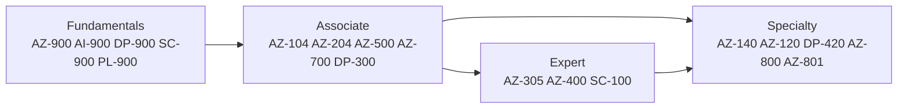
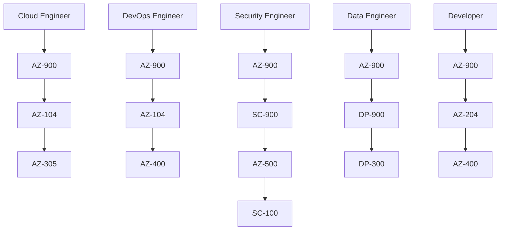

# Azure Certifications Guide

> **Disclaimer:** Exam details, domains, and weightages are based on publicly available information from [Microsoft Learn](https://learn.microsoft.com/en-us/credentials/certifications/). Always verify current exam objectives on the official page before preparing, as Microsoft updates exam content periodically.

## Why this directory exists

- This directory gives Azure learners a practical certification roadmap aligned to cloud engineering, platform engineering, DevOps, security, and architecture roles.
- The content is written for people who want both exam context and hands on relevance.
- The recommended order strongly favors building Azure fundamentals first, then operational depth, then architecture or specialty depth.

> **Tip:** If you are new to Azure, start with `AZ-900`, then move to `AZ-104`. That combination unlocks almost every other path in this repository.

## Certification journey at a glance

## How to use this folder

1. Read this `README.md` first.
2. Pick the track that matches your current role or target role.
3. Use the detailed guide for your exam level.
4. Build a study plan from `05-study-strategies.md`.
5. Schedule the exam only after you have done both content review and hands on practice.

## Detailed guide index

| Guide | Purpose |
|---|---|
| [01 Fundamentals](./01-fundamentals.md) | Entry level Azure, AI, data, security, and Power Platform exams |
| [02 Associate Level](./02-associate-level.md) | Core role based certifications, with heavy focus on `AZ-104` |
| [03 Expert Level](./03-expert-level.md) | Architecture, DevOps, and cybersecurity architect paths |
| [04 Specialty](./04-specialty.md) | Niche certifications that matter after broad Azure experience |
| [05 Study Strategies](./05-study-strategies.md) | Planning, resources, exam day advice, and renewal guidance |

## Certification families

| Family | Typical purpose | Recommended first exam |
|---|---|---|
| Fundamentals | Build vocabulary and platform awareness | `AZ-900` |
| Associate | Prove job ready implementation skills | `AZ-104` |
| Expert | Prove design, automation, or strategy depth | `AZ-305` or `AZ-400` |
| Specialty | Prove focused domain depth | `AZ-140`, `DP-420`, or hybrid tracks |

## Certification table

| Exam | Certification | Level | Focus area | Best for |
|---|---|---|---|---|
| AZ-900 | Azure Fundamentals | Fundamentals | Cloud concepts and core Azure services | Beginners, managers, career switchers |
| AI-900 | Azure AI Fundamentals | Fundamentals | AI workloads and Azure AI services | AI curious learners, presales, analysts |
| DP-900 | Azure Data Fundamentals | Fundamentals | Relational, non relational, and analytics basics | Data newcomers |
| SC-900 | Security, Compliance, and Identity Fundamentals | Fundamentals | Security principles, compliance, Entra, Defender | Security beginners |
| PL-900 | Power Platform Fundamentals | Fundamentals | Low code apps, automation, BI, copilots | Citizen developers, business analysts |
| AZ-104 | Azure Administrator Associate | Associate | Identity, storage, compute, networking, monitoring | Cloud engineers, platform admins |
| AZ-204 | Azure Developer Associate | Associate | Azure application development and integrations | Developers |
| AZ-500 | Azure Security Engineer Associate | Associate | Cloud security controls and operations | Security engineers |
| AZ-700 | Azure Network Engineer Associate | Associate | Connectivity, hybrid networking, private access | Network engineers |
| DP-300 | Azure Database Administrator Associate | Associate | Azure SQL administration and optimization | DBAs |
| AZ-400 | DevOps Engineer Expert | Expert | CI/CD, source control, security, IaC, observability | Platform and DevOps engineers |
| AZ-305 | Azure Solutions Architect Expert | Expert | End to end Azure solution design | Architects, senior cloud engineers |
| SC-100 | Cybersecurity Architect Expert | Expert | Security architecture across Microsoft security stack | Security architects |
| AZ-140 | Azure Virtual Desktop Specialty | Specialty | Azure Virtual Desktop design and operations | EUC and VDI teams |
| AZ-120 | Azure for SAP Workloads Specialty | Specialty | SAP on Azure planning and operations | SAP and infrastructure teams |
| DP-420 | Azure Cosmos DB Developer Specialty | Specialty | Cosmos DB data modeling and application development | NoSQL developers |
| AZ-800 | Windows Server Hybrid Administrator Associate | Associate/Hybrid | Windows Server in hybrid environments | Windows admins |
| AZ-801 | Configuring Windows Server Hybrid Advanced Services | Associate/Hybrid | Advanced hybrid identity, HA, migration, recovery | Senior Windows admins |

> **Important:** `AZ-400` is officially an Expert certification, but many Azure engineers study it soon after `AZ-104` because it complements IaC, GitHub Actions, and Azure DevOps workflows.

## Recommended paths by role

## How to choose your starting point

| If you are currently... | Start with | Then move to |
|---|---|---|
| Completely new to cloud | `AZ-900` | `AZ-104` |
| A Linux, Windows, or virtualization admin | `AZ-900` or directly `AZ-104` if experienced | `AZ-305` or `AZ-400` |
| A software developer using Azure | `AZ-900` | `AZ-204`, then `AZ-400` |
| A security analyst | `AZ-900` | `SC-900`, then `AZ-500` |
| A network engineer | `AZ-900` | `AZ-104`, then `AZ-700` |
| A DBA or SQL professional | `AZ-900` | `DP-900`, then `DP-300` |

## Exam registration process

1. Create or use a personal Microsoft account.
2. Visit the official certification or exam page on Microsoft Learn.
3. Click **Schedule exam**.
4. Choose Pearson VUE or Certiport where applicable.
5. Select online proctored or test center delivery.
6. Pay using your local regional pricing.
7. Save the confirmation email and verify your name matches your government ID.

> **Note:** Microsoft explicitly recommends registering with a personal Microsoft account instead of a work or school account so your transcript is not lost when you change employers.

## Exam format quick reference

| Item | Fundamentals | Associate / Expert / Specialty |
|---|---|---|
| Typical duration | 45 to 60 minutes | 100 to 150 minutes |
| Typical cost in US | About `$99` | About `$165` |
| Passing score | `700/1000` scaled score | `700/1000` scaled score |
| Delivery | Online proctored or test center | Online proctored or test center |
| Common question types | Multiple choice, drag and drop, case fragments | Multiple choice, drag and drop, case studies, architecture scenarios, labs when offered |
| Retake policy | 24 hours after first fail, then longer wait windows | Same policy family |

## What passing scores really mean

- Microsoft uses a scaled score model.
- The passing threshold is usually `700`.
- The number of questions can vary by exam and by delivery version.
- Not all questions carry identical scoring weight.
- Case studies and scenario based items usually test judgment, not memorization.

## Free learning resources overview

| Resource | Why it matters | URL |
|---|---|---|
| Microsoft Learn certifications hub | Official certification pages and study guides | https://learn.microsoft.com/en-us/credentials/certifications/ |
| Microsoft Learn training browse | Search modules and learning paths by exam code | https://learn.microsoft.com/en-us/training/browse/ |
| Practice assessments | Familiarize yourself with question style | https://learn.microsoft.com/en-us/credentials/certifications/prepare-exam |
| Exam sandbox | See Microsoft question UI before exam day | https://go.microsoft.com/fwlink/?linkid=2226877 |
| Azure free account | Hands on Azure practice with credit | https://azure.microsoft.com/en-us/free/ |
| Microsoft Virtual Training Days | Free events and sometimes discounted or free vouchers | https://www.microsoft.com/en-us/trainingdays |
| GitHub Student Developer Pack | Student access to developer tooling and offers | https://education.github.com/pack |
| Azure CLI docs | Practice command line operations | https://learn.microsoft.com/en-us/cli/azure/ |

## Official exam page shortcuts

| Exam | Official page |
|---|---|
| AZ-900 | https://learn.microsoft.com/en-us/credentials/certifications/azure-fundamentals/ |
| AI-900 | https://learn.microsoft.com/en-us/credentials/certifications/azure-ai-fundamentals/ |
| DP-900 | https://learn.microsoft.com/en-us/credentials/certifications/azure-data-fundamentals/ |
| SC-900 | https://learn.microsoft.com/en-us/credentials/certifications/security-compliance-and-identity-fundamentals/ |
| PL-900 | https://learn.microsoft.com/en-us/credentials/certifications/power-platform-fundamentals/ |
| AZ-104 | https://learn.microsoft.com/en-us/credentials/certifications/azure-administrator/ |
| AZ-204 | https://learn.microsoft.com/en-us/credentials/certifications/azure-developer/ |
| AZ-500 | https://learn.microsoft.com/en-us/credentials/certifications/azure-security-engineer/ |
| AZ-700 | https://learn.microsoft.com/en-us/credentials/certifications/azure-network-engineer-associate/ |
| DP-300 | https://learn.microsoft.com/en-us/credentials/certifications/azure-database-administrator-associate/ |
| AZ-400 | https://learn.microsoft.com/en-us/credentials/certifications/devops-engineer/ |
| AZ-305 | https://learn.microsoft.com/en-us/credentials/certifications/azure-solutions-architect/ |
| SC-100 | https://learn.microsoft.com/en-us/credentials/certifications/cybersecurity-architect-expert/ |
| AZ-140 | https://learn.microsoft.com/en-us/credentials/certifications/azure-virtual-desktop-specialty/ |
| AZ-120 | https://learn.microsoft.com/en-us/credentials/certifications/azure-for-sap-workloads-specialty/ |
| DP-420 | https://learn.microsoft.com/en-us/credentials/certifications/azure-cosmos-db-developer-specialty/ |
| AZ-800 / AZ-801 | https://learn.microsoft.com/en-us/credentials/certifications/windows-server-hybrid-administrator/ |

## Suggested order for this repository audience

1. `AZ-900` for terminology and platform framing.
2. `AZ-104` for operational Azure depth.
3. One specialization depending on job focus:
   - `AZ-400` for DevOps and automation.
   - `AZ-500` for security.
   - `AZ-700` for networking.
   - `DP-300` for database operations.
4. `AZ-305` once you can connect implementation detail to architecture trade offs.

## Renewal and maintenance

- Most role based and specialty certifications require renewal every year.
- Renewal is completed on Microsoft Learn through a free online assessment.
- Fundamentals certifications do not usually require annual renewal.
- Renew at least several weeks before expiry so you can retry if needed.

> **Tip:** Treat renewal as a structured annual review of Azure updates, not as a last minute admin task.

## Practical advice before you spend money

- Do not book the exam first and then start studying.
- Take a practice assessment only after your first full pass of the syllabus.
- Build hands on repetition around the topics most likely to show up in real jobs.
- Use the certification to improve delivery skills, not just your résumé.

## Read next

- Start here for entry level exams: [01 Fundamentals](./01-fundamentals.md)
- Go deep on the most valuable admin exam: [02 Associate Level](./02-associate-level.md)
- Move into architecture and DevOps: [03 Expert Level](./03-expert-level.md)
- Review niche options: [04 Specialty](./04-specialty.md)
- Build your study system: [05 Study Strategies](./05-study-strategies.md)
