# Azure Compute Guide

## Purpose

This guide is a practical field reference for Azure compute services.
It focuses on the most common design and operations topics for cloud engineers.
It is intentionally CLI-first.
It uses Mermaid diagrams for quick visual recall.
It also includes best practices for production deployments.

<!-- workflow-diagram:start -->
## Workflow Snapshot

```mermaid
%%{init: {'theme':'base','themeVariables': {'primaryColor':'#0078D4','primaryTextColor':'#ffffff','primaryBorderColor':'#005A9E','lineColor':'#0078D4','secondaryColor':'#50E6FF','tertiaryColor':'#E6F4FF'}}}%%
flowchart LR
  subgraph Plan[Provisioning Plan]
    A[Workload Request] --> B[Choose VM / VMSS / App Service]
    B --> C[Select Size, Image, Disk]
    C --> D[Pick Zone / Availability Model]
  end
  subgraph Configure[Configuration]
    D --> E[Create Compute Resource]
    E --> F[Cloud-init / Extensions]
    F --> G[Join VNet, NSG, Bastion]
  end
  subgraph Operate[Scale & Operate]
    G --> H[Enable Backup & Monitoring]
    H --> I{Healthy after validation?}
    I -- Yes --> J[Serve Production Traffic]
    I -- No --> K[Patch, Resize, or Rebuild]
  end
  subgraph Improve[Continuous Improvement]
    J --> L{Demand increasing?}
    L -- Yes --> M[Scale Out / Scale Up]
    L -- No --> N[Maintain Baseline]
    K --> E
    M --> O[Review Cost & Performance]
    N --> O
  end
  classDef compute fill:#0078D4,stroke:#005A9E,color:#ffffff,stroke-width:2px;
  classDef platform fill:#50E6FF,stroke:#0078D4,color:#002050,stroke-width:2px;
  classDef decision fill:#FFF4CE,stroke:#FFB900,color:#5C2D00,stroke-width:2px;
  classDef ops fill:#107C10,stroke:#0B5A0B,color:#ffffff,stroke-width:2px;
  class A,B,C,D,E compute;
  class F,G,H,J,M,N platform;
  class I,L decision;
  class K,O ops;
```

This VM-centric workflow follows Azure compute from sizing and deployment through configuration, scaling, monitoring, and continuous optimization.
<!-- workflow-diagram:end -->

## How to read this guide

- Use the VM Series section to select a compute family.
- Use the Lifecycle section to understand power and billing behavior.
- Use the Purchasing section to minimize cost.
- Use the Availability section to improve resiliency.
- Use the VMSS section for large-scale stateless compute.
- Use the App Service section for managed web workloads.
- Use the Managed Disks section to pick storage tiers.
- Use the Batch, Bastion, and PPG sections for supporting compute patterns.

## Placeholder convention

Replace these placeholders before running commands:

- `<subscription-id>`
- `<resource-group>`
- `<location>`
- `<vm-name>`
- `<vnet-name>`
- `<subnet-name>`
- `<nsg-name>`
- `<public-ip-name>`
- `<vmss-name>`
- `<app-name>`
- `<plan-name>`
- `<disk-name>`
- `<batch-account>`
- `<bastion-name>`
- `<ppg-name>`

## Table of contents

1. [Azure Compute Overview](#azure-compute-overview)
2. [VM Series](#vm-series)
3. [VM Lifecycle](#vm-lifecycle)
4. [Purchasing Options](#purchasing-options)
5. [Availability Sets and Zones](#availability-sets-and-zones)
6. [Virtual Machine Scale Sets](#virtual-machine-scale-sets)
7. [App Service](#app-service)
8. [Managed Disks](#managed-disks)
9. [Azure Batch](#azure-batch)
10. [Azure Bastion](#azure-bastion)
11. [Proximity Placement Groups](#proximity-placement-groups)
12. [Quick Decision Matrix](#quick-decision-matrix)
13. [CLI Reference Checklist](#cli-reference-checklist)

---

# Azure Compute Overview

## Diagram

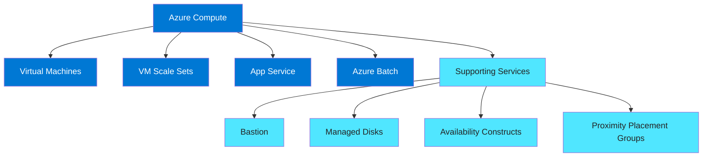

## Explanation

Azure compute is not one service.
It is a portfolio of services optimized for different control models.

- Virtual Machines provide full operating system control.
- Scale Sets provide fleet-level VM automation.
- App Service provides a managed PaaS runtime.
- Azure Batch provides scheduled high-scale job execution.
- Managed Disks provide persistent block storage for VMs.
- Bastion provides browser-based or native client access without public VM IPs.
- Availability Sets, Zones, and PPGs improve resiliency and performance placement.

The first architectural decision is control versus abstraction.
If you need kernel access, custom agents, or domain-joined hosts, use VMs.
If you need horizontal scale with similar nodes, use VMSS.
If you need rapid web deployment with minimal infrastructure management, use App Service.
If you need queue-driven or task-driven batch execution, use Azure Batch.

## az CLI commands

```bash
az login
az account set --subscription <subscription-id>
az account show --output table
az provider list --query "[?namespace=='Microsoft.Compute'].{Namespace:namespace,RegistrationState:registrationState}" --output table
az vm list-skus --location <location> --resource-type virtualMachines --output table
az vm image list --offer UbuntuServer --publisher Canonical --all --output table
az appservice plan list --output table
az vm list --output table
az vmss list --output table
az disk list --output table
```

## Best practices

- Start with workload requirements, not with favorite services.
- Separate resiliency decisions from cost decisions.
- Prefer managed services when they meet requirements.
- Use zones where regional support exists and the workload needs fault isolation.
- Use tags for owner, application, environment, cost center, and recovery tier.
- Standardize naming so automation can query resources predictably.
- Enable diagnostics early rather than after an incident.
- Use RBAC and managed identities instead of embedded credentials.
- Document patching and backup expectations per compute service.
- Validate service quotas before major deployments.

---

# VM Series

## Diagram

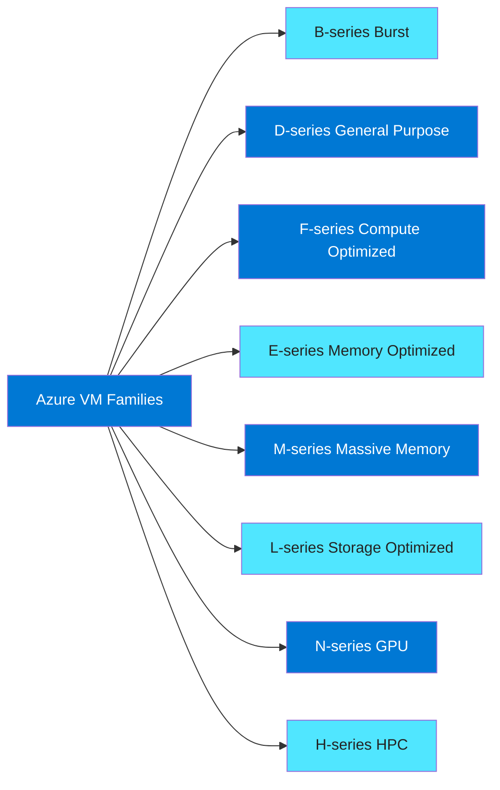

## Explanation

Azure VM families group sizes by resource balance and intended workload profile.
The key trade-offs are CPU, memory, storage throughput, GPU presence, and cost profile.
Choosing the right family reduces both spend and performance risk.

### Comparison table

| Family | Core trait | Typical workload | Strength | Watch out for |
|---|---|---|---|---|
| B | Burstable CPU | Low/medium steady state with spikes | Lowest cost for intermittent CPU | CPU credits can exhaust |
| D | Balanced CPU/memory | App servers, domain controllers, dev/test | Versatile default choice | Not ideal for extreme memory or IOPS |
| F | Higher CPU to memory ratio | APIs, batch workers, gaming backends | Strong compute per dollar | Lower memory density |
| E | Higher memory to CPU ratio | Databases, caches, analytics | Good RAM footprint | Higher cost than D/F |
| M | Very large memory footprint | SAP HANA, large in-memory DBs | Huge scale-up capacity | Expensive and specialized |
| L | High local/NVMe throughput | NoSQL, log processing, data-intensive apps | Excellent storage performance | Local disk planning matters |
| N | GPU acceleration | AI, rendering, visualization | GPU options for compute/graphics | Regional scarcity and quota limits |
| H | High performance computing | MPI, simulations, scientific compute | Fast interconnect and HPC focus | Specialized placement requirements |

### Family selection heuristics

- Choose B when the VM is mostly idle and occasionally bursts.
- Choose D when you need a safe default for mixed enterprise workloads.
- Choose F when the workload is CPU-bound and memory-light.
- Choose E when memory pressure drives performance.
- Choose M only when a scale-up requirement cannot be redesigned away.
- Choose L when throughput and latency to local storage are critical.
- Choose N when a software stack explicitly benefits from GPUs.
- Choose H when tightly coupled HPC jobs require specialized hardware.

### B-series details

- B-series uses CPU credits.
- Credits accumulate below baseline usage.
- Credits burn above baseline usage.
- Best for jump boxes, small web apps, lightweight services, and dev workloads.
- Poor choice for constant CPU-intensive applications.
- Monitor CPU credit metrics if the workload is business-critical.

### D-series details

- D-series is a broad general-purpose family.
- It balances vCPU and memory for mixed use.
- It is often the first family evaluated for enterprise application servers.
- It works well for line-of-business apps, middleware, and test environments.
- Variants may include local SSD or premium storage support.
- Newer generations typically improve price-performance materially.

### F-series details

- F-series emphasizes compute density.
- It is useful for APIs, CI agents, game servers, and CPU-heavy services.
- It is usually not the best choice for memory-hungry Java or database workloads.
- It can reduce cost for horizontally scaled stateless services.
- Load testing is important because memory can become the first bottleneck.
- Consider F when response time correlates strongly with CPU availability.

### E-series details

- E-series provides more memory per vCPU.
- It is common for relational databases and medium/large caches.
- It suits analytic engines and business applications with large working sets.
- It can improve consolidation where memory is the main limit.
- It may cost more than D-series but prevent paging and performance collapse.
- Watch memory growth trends and right-size over time.

### M-series details

- M-series is for very large memory workloads.
- It is common in SAP HANA and large in-memory database scenarios.
- It supports scale-up patterns that simpler families cannot.
- It requires careful cost governance.
- It may need reserved capacity and availability design up front.
- Always validate support matrices for enterprise applications.

### L-series details

- L-series is storage optimized.
- It offers fast local NVMe or SSD characteristics depending on generation.
- It suits Cassandra, Elasticsearch, Splunk, log ingestion, and data processing tiers.
- It is ideal when application design explicitly leverages local fast storage.
- It requires resilience planning because local disks are ephemeral.
- Pair it with replication at the application layer.

### N-series details

- N-series adds GPUs.
- Some subfamilies target AI training.
- Some target inferencing.
- Some target VDI and graphics rendering.
- Drivers, CUDA versions, and quota planning are essential.
- GPU workloads often need regional flexibility due to capacity constraints.

### H-series details

- H-series is tuned for HPC.
- It is used for simulations, finite element analysis, computational chemistry, and MPI.
- It may include fast interconnect features that matter for tightly coupled jobs.
- It is generally paired with Batch or specialized schedulers.
- Placement and network topology matter more than with normal enterprise VMs.
- Benchmarking with real job shapes is mandatory.

## az CLI commands

```bash
# List available VM sizes in a region
az vm list-sizes --location <location> --output table

# Search for B-series SKUs
az vm list-skus \
  --location <location> \
  --resource-type virtualMachines \
  --query "[?contains(name, 'Standard_B')].{Name:name,Tier:tier,Size:size,Family:family}" \
  --output table

# Search for D-series SKUs
az vm list-skus \
  --location <location> \
  --resource-type virtualMachines \
  --query "[?contains(name, 'Standard_D')].{Name:name,Family:family,Size:size}" \
  --output table

# Search for F-series SKUs
az vm list-skus \
  --location <location> \
  --resource-type virtualMachines \
  --query "[?contains(name, 'Standard_F')].{Name:name,Family:family,Size:size}" \
  --output table

# Search for E-series SKUs
az vm list-skus \
  --location <location> \
  --resource-type virtualMachines \
  --query "[?contains(name, 'Standard_E')].{Name:name,Family:family,Size:size}" \
  --output table

# Search for M-series SKUs
az vm list-skus \
  --location <location> \
  --resource-type virtualMachines \
  --query "[?contains(name, 'Standard_M')].{Name:name,Family:family,Size:size}" \
  --output table

# Search for L-series SKUs
az vm list-skus \
  --location <location> \
  --resource-type virtualMachines \
  --query "[?contains(name, 'Standard_L')].{Name:name,Family:family,Size:size}" \
  --output table

# Search for N-series SKUs
az vm list-skus \
  --location <location> \
  --resource-type virtualMachines \
  --query "[?contains(name, 'Standard_N')].{Name:name,Family:family,Size:size}" \
  --output table

# Search for H-series SKUs
az vm list-skus \
  --location <location> \
  --resource-type virtualMachines \
  --query "[?contains(name, 'Standard_H')].{Name:name,Family:family,Size:size}" \
  --output table

# Create a sample D-series VM
az vm create \
  --resource-group <resource-group> \
  --name <vm-name> \
  --location <location> \
  --image Ubuntu2204 \
  --size Standard_D4s_v5 \
  --admin-username azureuser \
  --generate-ssh-keys

# Resize an existing VM to E-series
az vm deallocate --resource-group <resource-group> --name <vm-name>
az vm resize --resource-group <resource-group> --name <vm-name> --size Standard_E4s_v5
az vm start --resource-group <resource-group> --name <vm-name>
```

## Best practices

- Default to D-series when requirements are not yet characterized.
- Move to F-series when CPU is the dominant pressure metric.
- Move to E-series when memory utilization is consistently high.
- Use B-series only when burst behavior is acceptable to the business.
- Avoid over-sizing just to handle short-lived peaks.
- Use autoscaling or horizontal scale before choosing larger sizes.
- Validate disk and network caps for each size, not just vCPU and RAM.
- Check regional availability before finalizing architecture.
- Request quota increases for GPU and HPC families early.
- Align family choice with licensing rules for Windows and SQL Server.
- Benchmark with representative data and concurrency.
- Revisit size choice every quarter.
- Prefer current generations unless an application support matrix blocks them.
- Document why a specialized family was selected.
- Track cost per transaction or cost per workload unit after deployment.

---

# VM Lifecycle

## Diagram

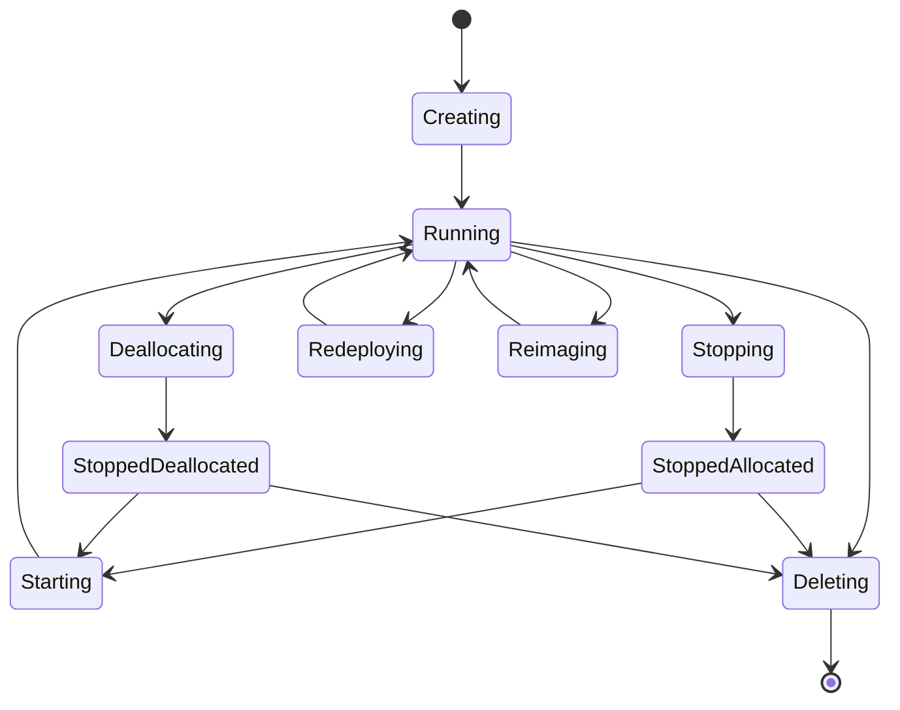

## Explanation

VM state affects billing, maintenance, and automation behavior.
The biggest operational distinction is between stopped and deallocated.

- Running means the VM is powered on and compute charges apply.
- Stopped (allocated) usually means the guest OS is shut down but compute resources remain reserved.
- Stopped (deallocated) means compute capacity is released and compute charges stop.
- Starting moves the VM back to running.
- Redeploy moves the VM to a new host while preserving configuration.
- Reimage reinstalls the OS from the source image and can remove local changes.
- Delete removes the VM resource, and optionally associated resources depending on configuration.

### Important billing behavior

- Running incurs compute charges.
- Stopped allocated usually still incurs compute charges.
- Deallocated stops compute billing.
- Managed disks continue to bill even when a VM is deallocated.
- Reserved instances continue to apply based on matching scope and size flexibility rules.

### Important operational behavior

- Public IP behavior depends on SKU and configuration.
- Dynamic public IP addresses may change after deallocation.
- Ephemeral OS disks and temp disks are not the same as managed OS disks.
- VM extensions may run during provisioning and updates.
- Backups and patching windows should account for lifecycle state.

### Common lifecycle actions

- Start for recovery or scheduled hours.
- Stop for guest OS shutdown before maintenance.
- Deallocate for cost savings.
- Restart after patches.
- Redeploy to recover host-level issues.
- Reapply when metadata and infrastructure state need resync.
- Reimage for immutable rebuild patterns.

## az CLI commands

```bash
# Show VM power state
az vm get-instance-view \
  --resource-group <resource-group> \
  --name <vm-name> \
  --query "instanceView.statuses[?starts_with(code, 'PowerState/')].displayStatus" \
  --output tsv

# Start a VM
az vm start --resource-group <resource-group> --name <vm-name>

# Stop a VM (may remain allocated)
az vm stop --resource-group <resource-group> --name <vm-name>

# Deallocate a VM
az vm deallocate --resource-group <resource-group> --name <vm-name>

# Restart a VM
az vm restart --resource-group <resource-group> --name <vm-name>

# Redeploy a VM to a new host
az vm redeploy --resource-group <resource-group> --name <vm-name>

# Reapply VM state
az vm reapply --resource-group <resource-group> --name <vm-name>

# Generalize a VM before image capture
az vm deallocate --resource-group <resource-group> --name <vm-name>
az vm generalize --resource-group <resource-group> --name <vm-name>

# Delete a VM
az vm delete --resource-group <resource-group> --name <vm-name> --yes
```

## Best practices

- Use deallocate, not just stop, when cost savings are the goal.
- Use automation schedules for non-production shutdowns.
- Document whether public IP retention matters before deallocating.
- Treat reimage as destructive unless proven otherwise.
- Use golden image or image builder workflows for reproducible rebuilds.
- Monitor activity logs for lifecycle changes.
- Restrict delete permissions with RBAC and resource locks.
- Use backup policies before maintenance windows.
- Validate extension health after redeploy or reapply.
- Test application recovery from deallocated state.
- For scale-out workloads, prefer immutable replacement over in-place repairs.
- Separate guest shutdown procedures from infrastructure deallocation.
- Capture stateful data on managed disks or external services, not temp disks.

---

# Purchasing Options

## Diagram

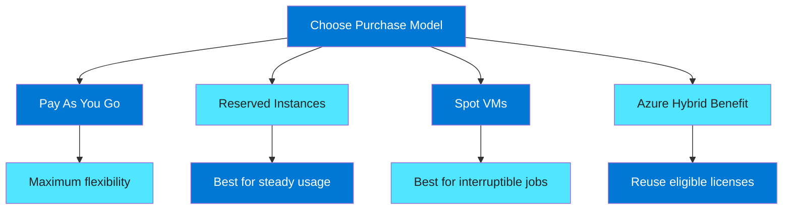

## Explanation

Azure offers multiple pricing levers for compute.
These are not mutually exclusive in every case.
A strong cost strategy combines them based on workload predictability and tolerance for interruption.

### Comparison summary

| Option | Best for | Main benefit | Main risk |
|---|---|---|---|
| PAYG | New workloads, variable usage, unknown demand | Maximum flexibility | Highest unit cost |
| Reserved | Steady-state production | Significant discount | Commitment risk |
| Spot | Fault-tolerant interruption-friendly work | Deep discount | Eviction at any time |
| Hybrid Benefit | Existing eligible Windows or SQL licenses | License cost reduction | Requires compliance tracking |

### PAYG

- No long-term commitment.
- Best during discovery, migration, or uneven demand.
- Ideal when architecture is still being tuned.
- Usually the simplest default operationally.
- Often paired with autoscale for efficiency.

### Reserved instances

- Commit to one-year or three-year capacity pricing terms.
- Good for baseline production usage.
- Effective for stable application tiers.
- Can materially reduce compute cost.
- Requires governance to avoid unused reservations.

### Spot VMs

- Azure can evict these VMs when capacity is needed.
- Best for batch jobs, render farms, CI, test, and fault-tolerant workers.
- Do not place irreplaceable state on a Spot VM.
- Pair with checkpointing or queue reprocessing.
- Expect occasional capacity scarcity.

### Azure Hybrid Benefit

- Applies eligible existing licenses to reduce cost.
- Common for Windows Server and SQL Server scenarios.
- Requires licensing compliance and audit readiness.
- Often combined with reservations for maximum savings.
- Should be coordinated with licensing and finance teams.

## az CLI commands

```bash
# Create a PAYG VM
az vm create \
  --resource-group <resource-group> \
  --name payg-vm \
  --location <location> \
  --image Win2022AzureEdition \
  --size Standard_D2s_v5 \
  --admin-username azureuser \
  --admin-password '<StrongPasswordHere>'

# Create a Spot VM with eviction policy
az vm create \
  --resource-group <resource-group> \
  --name spot-vm \
  --location <location> \
  --image Ubuntu2204 \
  --size Standard_D4s_v5 \
  --priority Spot \
  --max-price -1 \
  --eviction-policy Deallocate \
  --admin-username azureuser \
  --generate-ssh-keys

# Show Spot eviction simulation or metadata from instance side is handled in-guest.
# Query VM priority
az vm show \
  --resource-group <resource-group> \
  --name spot-vm \
  --query "priority" \
  --output tsv

# Create a Windows VM with Azure Hybrid Benefit
az vm create \
  --resource-group <resource-group> \
  --name ahb-vm \
  --location <location> \
  --image Win2022AzureEdition \
  --size Standard_D4s_v5 \
  --license-type Windows_Server \
  --admin-username azureuser \
  --admin-password '<StrongPasswordHere>'

# Enable Azure Hybrid Benefit on an existing Windows VM
az vm update \
  --resource-group <resource-group> \
  --name ahb-vm \
  --set licenseType=Windows_Server

# List VMs with license type
az vm list \
  --query "[].{Name:name,LicenseType:licenseType,Priority:priority,Location:location}" \
  --output table
```

## Best practices

- Start workloads on PAYG until utilization is understood.
- Shift stable baselines to reservations after trend validation.
- Use Spot only for workloads designed for interruption.
- Combine Spot with queue-based retry and checkpointing.
- Track reservation coverage and utilization monthly.
- Standardize eligible instance families where reservations are used.
- Review size flexibility rules before purchase.
- Coordinate Hybrid Benefit with licensing governance.
- Use policy and tagging to identify purchase model intent.
- Separate baseline capacity from burst capacity in cost planning.
- Use PAYG or Spot for burst tiers and Reserved for steady tiers.
- Build dashboards that show coverage, savings, and orphaned reservations.
- Test how workloads react to Spot eviction before production use.
- Keep critical quorum nodes off Spot.

---

# Availability Sets and Zones

## Diagram

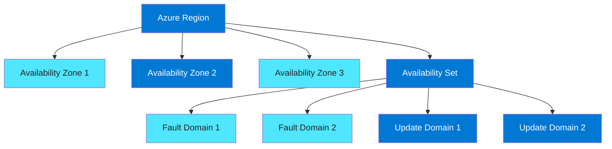

## Explanation

Availability Sets and Availability Zones solve related but different resilience problems.

### Availability Sets

Availability Sets distribute VMs across fault domains and update domains within a datacenter scope.
They are designed to reduce simultaneous failure from rack or maintenance events.

- Fault domains separate power/network/rack failure boundaries.
- Update domains stagger planned maintenance.
- Useful for older or simpler two-to-three node deployments.
- Less fault isolation than zones.
- Usually chosen when zones are unavailable or unnecessary.

### Availability Zones

Availability Zones place resources in separate physical datacenters within a region.
They provide stronger fault isolation than availability sets.

- Zones are physically separate.
- Zone-aware architectures improve regional resilience.
- They can support active-active or active-passive patterns.
- Not all services and VM sizes are available in all zones.
- Cross-zone traffic and latency should be considered.

### When to use which

- Use zones first for critical production systems when supported.
- Use availability sets for simpler resilience patterns when zones are not viable.
- Do not assume all SKUs are zone-redundant.
- Combine with load balancers, managed disks, and resilient data tiers.

### Related concepts

- Zone-redundant services spread service components across zones.
- Zonal services place a resource in a single explicit zone.
- Regional services abstract the zone detail away.
- Architecture documents must say whether each tier is zonal, zone-redundant, or regional.

## az CLI commands

```bash
# List zone support for a VM SKU
az vm list-skus \
  --location <location> \
  --resource-type virtualMachines \
  --query "[?name=='Standard_D4s_v5'].{Name:name,Zones:locationInfo[0].zones}" \
  --output table

# Create an availability set
az vm availability-set create \
  --resource-group <resource-group> \
  --name app-avset \
  --location <location> \
  --platform-fault-domain-count 2 \
  --platform-update-domain-count 5 \
  --output table

# Create two VMs in an availability set
az vm create \
  --resource-group <resource-group> \
  --name appvm01 \
  --availability-set app-avset \
  --image Ubuntu2204 \
  --size Standard_D2s_v5 \
  --admin-username azureuser \
  --generate-ssh-keys

az vm create \
  --resource-group <resource-group> \
  --name appvm02 \
  --availability-set app-avset \
  --image Ubuntu2204 \
  --size Standard_D2s_v5 \
  --admin-username azureuser \
  --generate-ssh-keys

# Create a zonal VM in zone 1
az vm create \
  --resource-group <resource-group> \
  --name zonevm01 \
  --location <location> \
  --zone 1 \
  --image Ubuntu2204 \
  --size Standard_D2s_v5 \
  --admin-username azureuser \
  --generate-ssh-keys

# Show availability set membership
az vm show \
  --resource-group <resource-group> \
  --name appvm01 \
  --query "availabilitySet.id" \
  --output tsv

# Show zone assignment
az vm show \
  --resource-group <resource-group> \
  --name zonevm01 \
  --query "zones" \
  --output json
```

## Best practices

- Prefer Availability Zones for tier-1 production workloads.
- Validate zone support for every required SKU and dependent service.
- Use Standard Load Balancer for zone-aware front ends.
- Design databases and caches for zone failure, not just VM failure.
- Use managed disks that align with zonal architecture requirements.
- Keep at least two instances per critical stateless tier.
- Avoid putting all stateful dependencies in a single zone.
- Use availability sets only when zones are unavailable or overkill.
- Document recovery objectives for zonal versus regional outages.
- Test failover behavior regularly.
- Track cross-zone bandwidth and latency in performance-sensitive systems.
- Coordinate backup and disaster recovery outside the primary region.
- Ensure monitoring dashboards show zone placement clearly.
- Align load balancer probes with application readiness.

---

# Virtual Machine Scale Sets

## Diagram

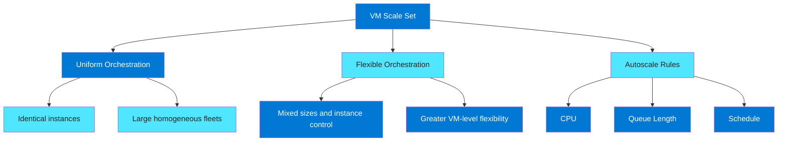

## Explanation

VM Scale Sets provide fleet management for VMs.
They are the preferred way to run large numbers of similar compute instances.

### Uniform orchestration

Uniform mode is optimized for highly consistent fleets.
It assumes instances are largely identical.

- Best for stateless web or worker tiers.
- Strong alignment with autoscaling.
- Simple operational model.
- Great for large homogeneous clusters.
- Easier when custom per-instance changes are not required.

### Flexible orchestration

Flexible mode offers more per-instance control.
It is useful when a fleet still benefits from VMSS grouping but needs instance variation.

- Supports more VM-like management behavior.
- Useful for applications needing varied instance sizing or naming.
- Better when scale set membership is important but full homogeneity is not.
- Good bridge between standalone VMs and Uniform VMSS.
- Operationally richer but sometimes more complex.

### Autoscale

Autoscale changes instance count based on demand.
Typical triggers include:

- CPU percentage.
- Memory through guest metrics or external signals.
- Queue length.
- HTTP request volume.
- Schedule-based business hours.

### VMSS patterns

- Web front ends behind load balancers.
- API worker pools.
- Batch or queue-processing workers.
- Container host fleets.
- Build agents.

## az CLI commands

```bash
# Create a Uniform VM Scale Set
az vmss create \
  --resource-group <resource-group> \
  --name <vmss-name> \
  --location <location> \
  --image Ubuntu2204 \
  --orchestration-mode Uniform \
  --vm-sku Standard_D2s_v5 \
  --instance-count 2 \
  --admin-username azureuser \
  --generate-ssh-keys \
  --upgrade-policy-mode Automatic

# Create a Flexible VM Scale Set
az vmss create \
  --resource-group <resource-group> \
  --name flex-vmss \
  --location <location> \
  --image Ubuntu2204 \
  --orchestration-mode Flexible \
  --vm-sku Standard_D2s_v5 \
  --instance-count 2 \
  --admin-username azureuser \
  --generate-ssh-keys

# List VMSS instances
az vmss list-instances \
  --resource-group <resource-group> \
  --name <vmss-name> \
  --output table

# Manually scale out
az vmss scale \
  --resource-group <resource-group> \
  --name <vmss-name> \
  --new-capacity 4

# Install autoscale settings extension by defining autoscale rules
az monitor autoscale create \
  --resource-group <resource-group> \
  --resource <vmss-name> \
  --resource-type Microsoft.Compute/virtualMachineScaleSets \
  --name vmss-autoscale \
  --min-count 2 \
  --max-count 10 \
  --count 2

# Scale out when average CPU > 70% for 10 minutes
az monitor autoscale rule create \
  --resource-group <resource-group> \
  --autoscale-name vmss-autoscale \
  --condition "Percentage CPU > 70 avg 10m" \
  --scale out 2

# Scale in when average CPU < 30% for 20 minutes
az monitor autoscale rule create \
  --resource-group <resource-group> \
  --autoscale-name vmss-autoscale \
  --condition "Percentage CPU < 30 avg 20m" \
  --scale in 1

# Apply custom script extension to VMSS instances
az vmss extension set \
  --resource-group <resource-group> \
  --vmss-name <vmss-name> \
  --name CustomScript \
  --publisher Microsoft.Azure.Extensions \
  --version 2.1 \
  --settings '{"commandToExecute":"sudo apt-get update"}'
```

## Best practices

- Use Uniform for stateless homogeneous fleets.
- Use Flexible when instance-level control is a real requirement.
- Keep application state outside the instances.
- Pair VMSS with load balancers or Application Gateway as needed.
- Use health probes that reflect application readiness, not just process liveness.
- Define both scale-out and scale-in rules.
- Add cooldown periods to avoid scaling oscillation.
- Base autoscale on business metrics when possible.
- Bake images instead of relying on slow bootstrap steps.
- Patch via rolling upgrades or instance replacement patterns.
- Use multiple fault domains or zones where supported.
- Validate extension behavior during instance churn.
- Use managed identity for instance access to Azure services.
- Log scale events for capacity reviews.
- Test how the application behaves during rapid scale changes.

---

# App Service

## Diagram

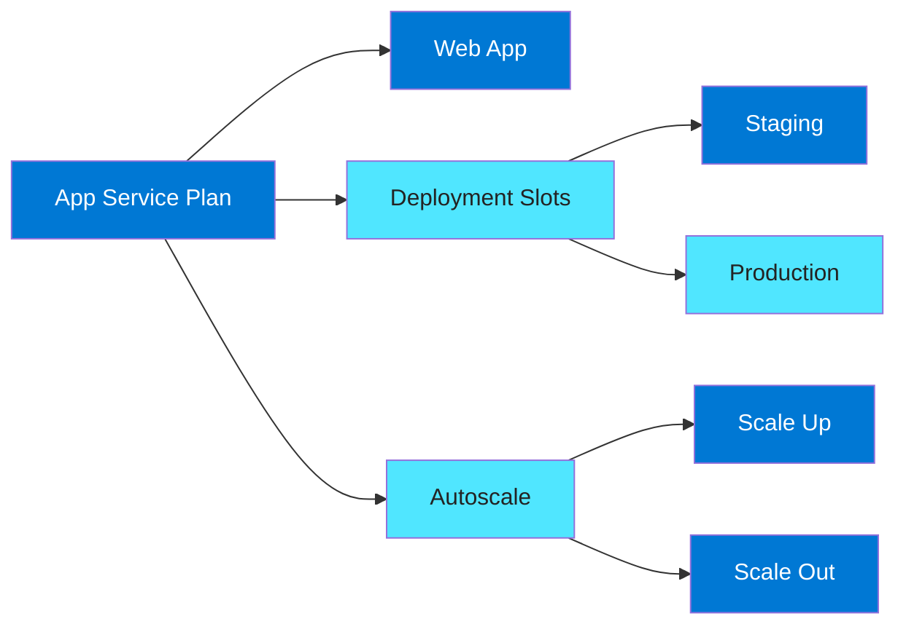

## Explanation

App Service is a managed platform for web apps, APIs, and background tasks.
It removes most OS and runtime management responsibilities.
It is ideal when the workload fits supported runtime and platform assumptions.

### App Service Plan basics

An App Service Plan defines the compute workers used by hosted apps.
Multiple apps can share one plan.
The plan determines:

- Pricing tier.
- CPU and memory capacity.
- Zone redundancy support in some tiers.
- Scaling limits.
- Feature availability such as deployment slots.

### Common pricing tiers

- Free and Shared for experiments only.
- Basic for low-cost dedicated workloads.
- Standard for production basics and slots.
- Premium for autoscale, higher performance, and advanced networking features.
- Isolated for App Service Environment scenarios.

### Deployment slots

Deployment slots let you deploy to non-production endpoints before swapping.
Common use:

- Deploy to staging.
- Warm up the app.
- Validate config and health.
- Swap staging into production.
- Roll back quickly by swapping back if needed.

### Autoscale in App Service

App Service supports scale-up and scale-out.

- Scale up changes the plan tier or worker size.
- Scale out changes instance count.
- Autoscale typically uses CPU, memory, schedule, or HTTP queue metrics depending on configuration.

### When App Service is a strong fit

- Stateless web apps.
- REST APIs.
- Internal business apps.
- Workloads that benefit from platform-managed TLS and deployment integration.

### When VMs or AKS may fit better

- Need for unsupported runtimes.
- Deep OS customization.
- Complex sidecar needs.
- Very specific network appliances.
- Specialized kernel modules or drivers.

## az CLI commands

```bash
# Create resource group
az group create --name <resource-group> --location <location>

# Create an App Service Plan
az appservice plan create \
  --name <plan-name> \
  --resource-group <resource-group> \
  --location <location> \
  --sku P1v3 \
  --is-linux

# Create a web app
az webapp create \
  --resource-group <resource-group> \
  --plan <plan-name> \
  --name <app-name> \
  --runtime "NODE:20-lts"

# Create a deployment slot
az webapp deployment slot create \
  --resource-group <resource-group> \
  --name <app-name> \
  --slot staging

# Swap staging slot into production
az webapp deployment slot swap \
  --resource-group <resource-group> \
  --name <app-name> \
  --slot staging \
  --target-slot production

# Configure autoscale on the App Service Plan
az monitor autoscale create \
  --resource-group <resource-group> \
  --resource <plan-name> \
  --resource-type Microsoft.Web/serverfarms \
  --name appservice-autoscale \
  --min-count 2 \
  --max-count 6 \
  --count 2

# Scale out when CPU is high
az monitor autoscale rule create \
  --resource-group <resource-group> \
  --autoscale-name appservice-autoscale \
  --condition "Percentage CPU > 70 avg 10m" \
  --scale out 1

# Scale in when CPU is low
az monitor autoscale rule create \
  --resource-group <resource-group> \
  --autoscale-name appservice-autoscale \
  --condition "Percentage CPU < 30 avg 20m" \
  --scale in 1

# Update app settings
az webapp config appsettings set \
  --resource-group <resource-group> \
  --name <app-name> \
  --settings APP_ENV=prod LOG_LEVEL=info

# Show current plan details
az appservice plan show \
  --resource-group <resource-group> \
  --name <plan-name> \
  --output table
```

## Best practices

- Use App Service when you want managed hosting over VM administration.
- Pick Premium for serious production workloads requiring autoscale and better performance.
- Separate plans by workload criticality and noisy-neighbor risk.
- Use deployment slots for safe rollouts.
- Mark sensitive settings as slot settings when they should not swap.
- Warm up staging before swap.
- Enable health checks for faster bad-instance detection.
- Use autoscale rules that reflect actual traffic behavior.
- Integrate with VNet only when required and understand subnet sizing.
- Use managed identity for database and secret access.
- Keep apps stateless to simplify scaling.
- Send logs and metrics to central monitoring.
- Review plan utilization to avoid overpaying for idle workers.
- Use custom domains and certificates with automated renewal paths.
- Validate startup time because cold behavior affects scaling user experience.

---

# Managed Disks

## Diagram

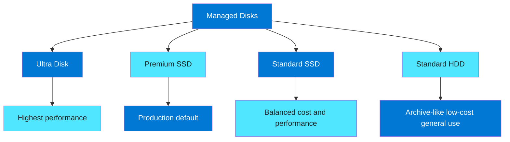

## Explanation

Managed Disks abstract the storage account management required by older unmanaged disk models.
Disk choice matters because IOPS, throughput, latency, redundancy, and cost affect application behavior.

### Disk tiers

#### Ultra Disk

- Highest configurable performance.
- Designed for mission-critical IO-intensive workloads.
- Useful for demanding databases.
- Supports dynamic performance tuning in supported scenarios.
- Not available everywhere and may require specific VM support.

#### Premium SSD

- Strong production default for many business apps.
- Good balance of predictable low latency and cost.
- Common for OS disks and production data disks.
- Premium SSD v2 may offer additional flexibility in supported scenarios.

#### Standard SSD

- Lower-cost SSD option.
- Good for dev/test and less latency-sensitive applications.
- Better than HDD for many general workloads.
- Often good for smaller services or non-critical tiers.

#### Standard HDD

- Lowest-cost option.
- Suitable for backups, infrequent access, and non-performance-sensitive workloads.
- Usually not appropriate for transactional production databases.

### Disk concepts

- OS disk contains the operating system.
- Data disks store application data.
- Temp storage is host-local and ephemeral.
- Snapshots support point-in-time copy patterns.
- Disk encryption and key management are part of security posture.

### Design considerations

- VM size can cap aggregate disk performance.
- Disk striping may be required for higher throughput.
- Application caching can reduce disk pressure.
- Backup and snapshot frequency should match RPO.
- Zone alignment matters for zonal VMs and zonal disks.

## az CLI commands

```bash
# Create a Premium SSD disk
az disk create \
  --resource-group <resource-group> \
  --name premium-data01 \
  --location <location> \
  --sku Premium_LRS \
  --size-gb 256

# Create a Standard SSD disk
az disk create \
  --resource-group <resource-group> \
  --name standardssd-data01 \
  --location <location> \
  --sku StandardSSD_LRS \
  --size-gb 256

# Create an Ultra disk
az disk create \
  --resource-group <resource-group> \
  --name ultra-data01 \
  --location <location> \
  --sku UltraSSD_LRS \
  --size-gb 1024 \
  --disk-iops-read-write 5000 \
  --disk-mbps-read-write 200

# Attach a disk to a VM
az vm disk attach \
  --resource-group <resource-group> \
  --vm-name <vm-name> \
  --name premium-data01

# List disks
az disk list --resource-group <resource-group> --output table

# Create a snapshot
az snapshot create \
  --resource-group <resource-group> \
  --name premium-data01-snap01 \
  --source premium-data01

# Update disk SKU where supported migration paths allow
az disk update \
  --resource-group <resource-group> \
  --name standardssd-data01 \
  --sku Premium_LRS

# Show disk performance and state
az disk show \
  --resource-group <resource-group> \
  --name premium-data01 \
  --output json
```

## Best practices

- Choose disk tier based on measured IOPS and latency needs.
- Use Premium SSD for most production VM workloads.
- Use Ultra only when benchmarks justify it.
- Remember the VM size can throttle disk performance.
- Stripe multiple data disks when a single disk is insufficient.
- Keep OS and data roles separate where useful.
- Do not store critical data on temp disks.
- Align backup policy with business RPO and RTO.
- Use encryption at rest and customer-managed keys when required.
- Tag disks with application, owner, and data classification.
- Snapshot before risky maintenance.
- Monitor queue depth, latency, and throughput trends.
- Validate disk zone and availability alignment.
- Right-size disks periodically to reduce waste.
- Remove unattached disks to avoid silent spend.

---

# Azure Batch

## Diagram

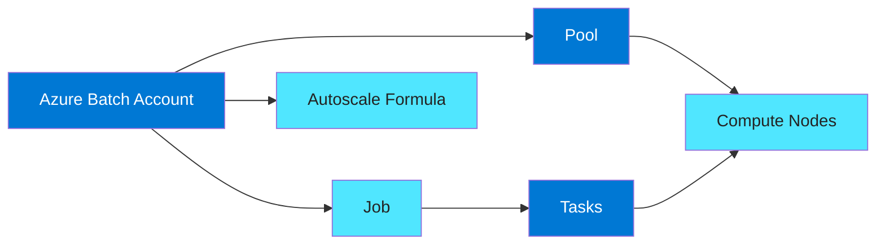

## Explanation

Azure Batch is a managed service for large-scale parallel and high-performance batch processing.
It is excellent for task-based workloads that do not need always-on interactive compute.

### Core concepts

- Batch account is the top-level service container.
- Pool is a collection of compute nodes.
- Job is a logical grouping of work.
- Task is an executable unit within a job.
- Start task prepares each node before job tasks run.
- Autoscale can add or remove nodes based on queue depth or formulas.

### Typical use cases

- Rendering.
- Monte Carlo simulations.
- Genomics.
- Media processing.
- Massive ETL tasks.
- Engineering simulations.
- Nightly data crunching.

### Why Batch over raw VMs

- Simplified scheduler and queue concepts.
- Easier pool lifecycle management.
- Better fit for task-oriented compute bursts.
- Can integrate with low-priority or Spot-like cost strategies depending on features and design.

### Design points

- Ensure tasks are idempotent.
- Store input and output in durable external storage.
- Use retry logic for transient failures.
- Keep task package size lean.
- Prefer image-based node preparation for fast scale-out.

## az CLI commands

```bash
# Create a Batch account
az batch account create \
  --name <batch-account> \
  --resource-group <resource-group> \
  --location <location> \
  --storage-account <storage-account-name>

# Log in to the Batch account context
az batch account login \
  --name <batch-account> \
  --resource-group <resource-group> \
  --shared-key-auth

# Create a pool
az batch pool create \
  --id render-pool \
  --vm-size Standard_F4s_v2 \
  --target-dedicated-nodes 0 \
  --target-low-priority-nodes 2 \
  --image canonical:ubuntuserver:2204-lts:latest \
  --node-agent-sku-id "batch.node.ubuntu 22.04"

# Create a job
az batch job create \
  --id render-job \
  --pool-id render-pool

# Add a task
az batch task create \
  --job-id render-job \
  --task-id task01 \
  --command-line "/bin/bash -c 'python3 render.py'"

# Show pool
az batch pool show --pool-id render-pool

# Resize pool
az batch pool resize --pool-id render-pool --target-low-priority-nodes 10

# Delete a job after completion
az batch job delete --job-id render-job --yes
```

## Best practices

- Use Batch for scheduled or queued parallel work, not interactive servers.
- Make tasks retry-safe and checkpoint-aware.
- Externalize input, output, and state to durable storage.
- Use autoscale or ephemeral pools to reduce idle cost.
- Choose Spot or low-priority capacity only for interruption-tolerant jobs.
- Pre-bake dependencies into custom images when scale-up speed matters.
- Keep startup tasks short and deterministic.
- Monitor task failure rates and exit codes centrally.
- Separate pools by workload profile and software dependency set.
- Clean up jobs, tasks, and unused pools promptly.
- Size nodes to the task resource pattern rather than maximum possible size.
- Test with realistic concurrency because bottlenecks may move to storage or networking.
- Use managed identity or secure secret delivery mechanisms for task access.
- Limit per-node work queues to prevent noisy-neighbor effects inside the node.
- Tag Batch resources for chargeback.

---

# Azure Bastion

## Diagram

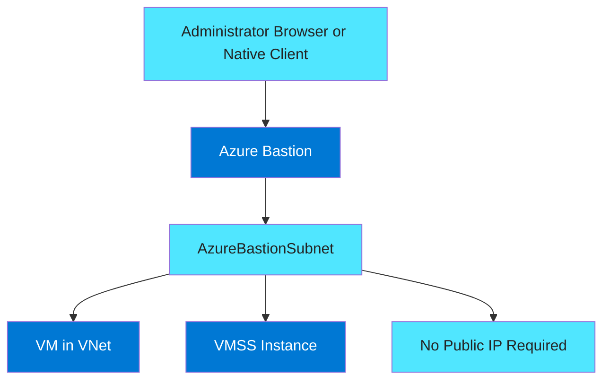

## Explanation

Azure Bastion provides secure RDP and SSH connectivity to VMs over TLS through the Azure portal or supported native clients.
It removes the need to expose public IP addresses directly on target VMs.

### Why Bastion matters

- Reduces attack surface.
- Simplifies administrative access patterns.
- Centralizes jump-host behavior.
- Helps avoid open inbound RDP or SSH rules from the internet.
- Fits zero-trust and just-in-time access strategies better than classic jump boxes.

### Core requirements

- Dedicated subnet named `AzureBastionSubnet`.
- Appropriate address space sizing according to SKU guidance.
- VNet connectivity to target resources.
- RBAC permitting Bastion use.

### Operational notes

- Bastion is a managed service, not a normal VM.
- It can connect to VMs in peered VNets depending on configuration and support.
- Session logging and governance should be part of security operations.
- Bastion cost should be compared to self-managed jump host overhead and security exposure.

## az CLI commands

```bash
# Create a VNet and AzureBastionSubnet
az network vnet create \
  --resource-group <resource-group> \
  --name <vnet-name> \
  --location <location> \
  --address-prefixes 10.10.0.0/16 \
  --subnet-name AzureBastionSubnet \
  --subnet-prefixes 10.10.0.0/26

# Create a public IP for Bastion
az network public-ip create \
  --resource-group <resource-group> \
  --name bastion-pip \
  --location <location> \
  --sku Standard

# Create Bastion host
az network bastion create \
  --resource-group <resource-group> \
  --name <bastion-name> \
  --location <location> \
  --vnet-name <vnet-name> \
  --public-ip-address bastion-pip

# Show Bastion host
az network bastion show \
  --resource-group <resource-group> \
  --name <bastion-name> \
  --output table

# Create a VM without a public IP
az vm create \
  --resource-group <resource-group> \
  --name privatevm01 \
  --image Ubuntu2204 \
  --vnet-name <vnet-name> \
  --subnet default \
  --public-ip-address "" \
  --admin-username azureuser \
  --generate-ssh-keys
```

## Best practices

- Use Bastion instead of public IP exposure for admin access.
- Keep NSGs on target subnets restrictive.
- Use RBAC and PIM for just-in-time administrator access.
- Log administrative sessions where policy requires it.
- Size the Bastion subnet correctly from the beginning.
- Standardize Bastion per hub VNet or shared connectivity model.
- Combine Bastion with private DNS and private endpoints where applicable.
- Review whether native client support is needed before choosing SKU.
- Remove legacy jump boxes once Bastion is operational.
- Ensure VNet peering and route design support intended access paths.
- Avoid using Bastion as a workaround for poor network segmentation.
- Enforce MFA for administrative identities.
- Document emergency access procedures.
- Monitor Bastion availability and cost usage.

---

# Proximity Placement Groups

## Diagram

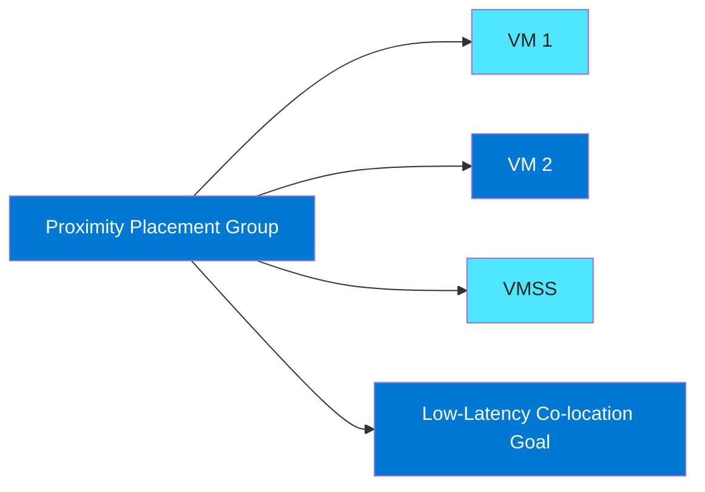

## Explanation

Proximity Placement Groups help place compute resources physically closer together inside an Azure region.
They are used to reduce latency between tightly coupled resources.

### Typical use cases

- Trading or low-latency middleware.
- HPC workloads.
- Chatty application tiers with strict latency budgets.
- Application and database tiers that benefit from very close placement.
- Specialized clustered systems.

### What PPG is and is not

- PPG is a placement preference.
- It improves the chance of close placement for associated resources.
- It does not replace zones for fault isolation.
- It does not magically solve bad application design.
- It may constrain deployment options if capacity is limited.

### Design implications

- Start with latency measurement before deciding PPG is needed.
- Combining PPG with specialized SKUs can increase allocation difficulty.
- Capacity planning is important because the tighter the placement need, the more likely allocation constraints appear.
- PPG decisions should be justified with measured latency sensitivity.

## az CLI commands

```bash
# Create a Proximity Placement Group
az ppg create \
  --resource-group <resource-group> \
  --name <ppg-name> \
  --location <location> \
  --type Standard

# Create a VM in the PPG
az vm create \
  --resource-group <resource-group> \
  --name ppg-vm01 \
  --location <location> \
  --image Ubuntu2204 \
  --size Standard_D4s_v5 \
  --ppg <ppg-name> \
  --admin-username azureuser \
  --generate-ssh-keys

# Create a second VM in the same PPG
az vm create \
  --resource-group <resource-group> \
  --name ppg-vm02 \
  --location <location> \
  --image Ubuntu2204 \
  --size Standard_D4s_v5 \
  --ppg <ppg-name> \
  --admin-username azureuser \
  --generate-ssh-keys

# Show PPG details
az ppg show \
  --resource-group <resource-group> \
  --name <ppg-name> \
  --output json

# Create a VMSS with PPG
az vmss create \
  --resource-group <resource-group> \
  --name ppg-vmss \
  --location <location> \
  --image Ubuntu2204 \
  --vm-sku Standard_D2s_v5 \
  --instance-count 2 \
  --ppg <ppg-name> \
  --admin-username azureuser \
  --generate-ssh-keys
```

## Best practices

- Use PPG only when latency measurements justify it.
- Avoid combining unnecessary constraints like rare SKUs, specific zones, and PPG without testing allocation success.
- Plan for redeployment risk if capacity becomes tight.
- Use PPG for tightly coupled application tiers, not every workload.
- Benchmark before and after PPG placement.
- Coordinate PPG use with HPC, Batch, or clustered application teams.
- Include capacity fallback procedures in operations documents.
- Keep architecture simple when latency budgets do not demand PPG.
- Review whether application batching or caching could reduce latency sensitivity first.
- Document the business reason for PPG use.
- Monitor deployment failures that may indicate constrained placement.
- Test failover scenarios because close placement is different from resilience design.

---

# Quick Decision Matrix

## Diagram

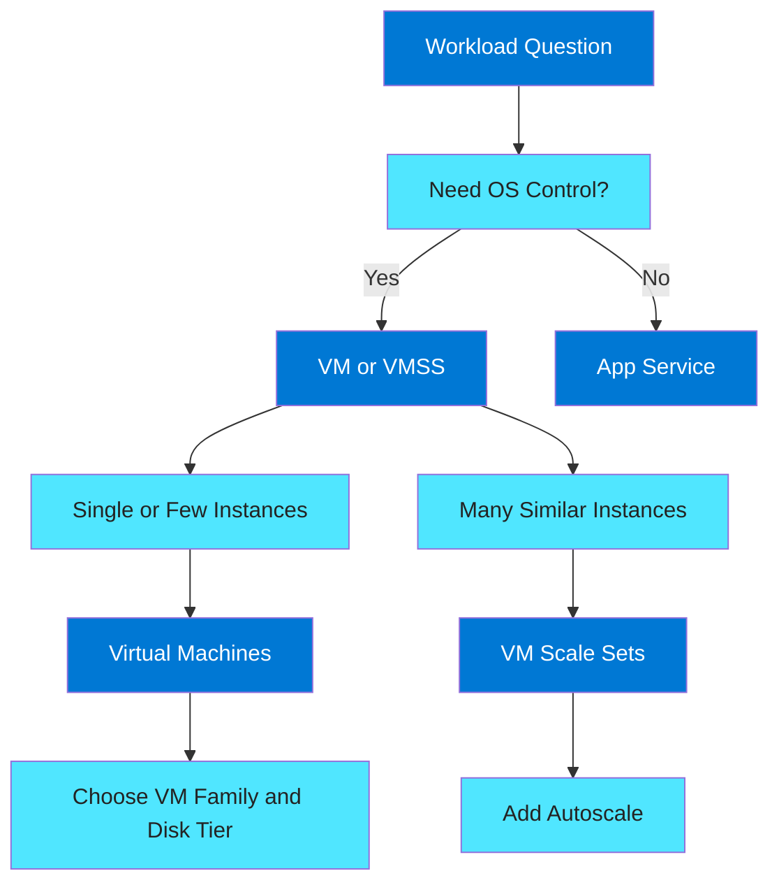

## Explanation

Use this quick matrix for first-pass decisions.
It does not replace detailed architecture review.
It helps avoid common mismatches.

### Choose VMs when

- You need full OS control.
- You need custom agents or drivers.
- You run stateful or legacy software.
- You need specialized families such as N or H.
- You need direct control of instance patching and extensions.

### Choose VMSS when

- You have multiple similar instances.
- You need autoscale.
- The workload is mostly stateless.
- You want rolling upgrades and fleet operations.
- You need predictable horizontal elasticity.

### Choose App Service when

- The app fits supported runtimes.
- You prefer platform-managed hosting.
- The workload is a web app or API.
- You want deployment slots and simplified scaling.
- You want reduced VM operational burden.

### Choose Batch when

- The work is queue-driven or scheduled.
- Instances do not need to be always on.
- The job is parallelizable.
- Tasks can be retried.
- Cost optimization favors ephemeral compute pools.

### Choose specialized support features when

- Use Availability Zones for stronger fault isolation.
- Use Availability Sets when zones are not ideal.
- Use Bastion for private administration.
- Use PPG for latency-sensitive co-location.
- Use Managed Disks aligned to performance needs.

## az CLI commands

```bash
# Query available compute resources in a group
az resource list --resource-group <resource-group> --output table

# List all VMs with size and zones
az vm list \
  --resource-group <resource-group> \
  --show-details \
  --query "[].{Name:name,Size:hardwareProfile.vmSize,Power:powerState,Zones:zones}" \
  --output table

# List App Service apps and plans
az webapp list \
  --resource-group <resource-group> \
  --query "[].{Name:name,Plan:serverFarmId,State:state}" \
  --output table

az appservice plan list \
  --resource-group <resource-group> \
  --output table

# List VM Scale Sets
az vmss list \
  --resource-group <resource-group> \
  --query "[].{Name:name,Location:location,SKU:sku.name,Capacity:sku.capacity}" \
  --output table
```

## Best practices

- Decide using operational model first, then optimize price.
- Match scale pattern to the service abstraction.
- Use PaaS when infrastructure customization is not differentiating value.
- Use IaaS when control requirements are real and documented.
- Avoid forcing a stateful app into a stateless scaling model without redesign.
- Prefer standard blueprints for common workload classes.
- Review reliability, security, operations, performance, and cost together.
- Make sizing and purchase decisions measurable with metrics.
- Revisit architecture after migration, not just before migration.

---

# CLI Reference Checklist

## Diagram

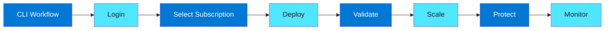

## Explanation

This checklist is a compact operational sequence for Azure compute work.
Follow it for new environments and recurring automation.

### Step 1: Login and context

- Authenticate with `az login`.
- Select the correct subscription.
- Confirm the current tenant and account.
- Set defaults if helpful.

### Step 2: Validate region and quota

- Check SKU availability in the target region.
- Check zone support.
- Check compute family quota.
- Check GPU or HPC quota early.

### Step 3: Deploy networking and security

- Create VNets and subnets.
- Apply NSGs carefully.
- Plan private access patterns.
- Use Bastion for administration.

### Step 4: Deploy compute

- Choose the right family or platform.
- Choose purchase model.
- Choose disk tier.
- Decide on availability pattern.

### Step 5: Validate and monitor

- Confirm resource health.
- Confirm diagnostics.
- Confirm backup.
- Confirm scaling and failover behavior.

## az CLI commands

```bash
# Authentication and context
az login
az account list --output table
az account set --subscription <subscription-id>
az account show --output table

# Defaults
az configure --defaults group=<resource-group> location=<location>

# Region and SKU checks
az vm list-skus --location <location> --resource-type virtualMachines --output table
az vm list-usage --location <location> --output table

# Resource group
az group create --name <resource-group> --location <location>

# Tags example
az tag create --resource-id /subscriptions/<subscription-id>/resourceGroups/<resource-group> --tags Environment=Prod Owner=CloudTeam CostCenter=1234

# Diagnostics extension example for Linux VM
az vm extension set \
  --resource-group <resource-group> \
  --vm-name <vm-name> \
  --name LinuxDiagnostic \
  --publisher Microsoft.Azure.Diagnostics \
  --version 4.0

# List activity logs for recent operations
az monitor activity-log list --max-events 20 --output table
```

## Best practices

- Always verify subscription context before deployment.
- Use infrastructure-as-code for repeatable production changes.
- Treat CLI commands as validation and troubleshooting tools too.
- Store scripts in version control.
- Prefer managed identity over local secrets.
- Standardize command snippets per service team.
- Build guardrails with Azure Policy and RBAC.
- Keep naming, tagging, and logging consistent.
- Review quota and regional support before cutover windows.
- Validate rollback steps for every deployment path.

---

# Additional Deep Notes

## VM family cheat sheet

### B-series

- Budget friendly.
- Burstable.
- Good for labs.
- Good for test tooling.
- Good for low-duty services.
- Risk is credit depletion.
- Not good for constant CPU demand.
- Watch CPU metrics and credits together.
- Good for small jump hosts.
- Good for proof-of-concept apps.

### D-series

- Balanced family.
- Strong default recommendation.
- Good for most enterprise server roles.
- Good for middleware.
- Good for application servers.
- Good for moderate databases.
- Usually easy to source in many regions.
- Often a first migration landing size.
- Reassess later based on data.
- Use as a baseline in tests.

### F-series

- CPU heavy.
- Lower memory ratio.
- Good for stateless processing.
- Good for APIs.
- Good for build agents.
- Good for scientific code without large memory needs.
- Less suitable for large JVM heaps.
- Less suitable for caches.
- Monitor memory closely.
- Use when throughput is CPU-bound.

### E-series

- Memory optimized.
- Good for SQL.
- Good for PostgreSQL on VM patterns.
- Good for caches.
- Good for memory-heavy analytics.
- Reduces paging risk.
- More expensive than balanced families.
- Great when RAM is performance driver.
- Often better than simply buying more D-series nodes.
- Validate cost-performance ratio.

### M-series

- Enterprise specialized.
- Very large memory.
- Often tied to premium workloads.
- Strong fit for SAP HANA.
- Requires governance.
- Requires capacity planning.
- Rarely a casual choice.
- Usually paired with strong business case.
- Benchmark carefully.
- Reserve capacity when long-lived.

### L-series

- Storage optimized.
- Fast local storage.
- Good for data-intensive middleware.
- Good for search clusters.
- Good for ingestion pipelines.
- Good for log analytics engines.
- Ephemeral local disk demands replication.
- Use application-layer resiliency.
- Benchmark storage paths.
- Know local versus managed disk behavior.

### N-series

- GPU enabled.
- Good for ML.
- Good for inferencing.
- Good for rendering.
- Good for VDI graphics.
- Requires driver planning.
- Requires quota planning.
- Capacity may be constrained.
- Regional flexibility helps.
- Treat GPU utilization as a core cost metric.

### H-series

- HPC focused.
- Good for tightly coupled parallel work.
- Good for scientific simulations.
- Good for MPI.
- Network topology matters.
- Placement matters.
- Often paired with Batch.
- Often paired with PPG.
- Requires real benchmarks.
- Not a generic enterprise app family.

## Lifecycle quick facts

- Stop is not always deallocate.
- Deallocate releases compute reservation.
- OS shutdown from inside guest may not deallocate.
- Public IP behavior depends on SKU and allocation method.
- Managed disk charges continue.
- Temp disk data can disappear.
- Redeploy changes host.
- Reimage resets OS from image.
- Delete should be protected with locks in prod.
- Extensions may need post-action validation.

## Purchase model quick facts

- PAYG is flexible.
- Reserved lowers steady-state spend.
- Spot is interruptible.
- Hybrid Benefit lowers eligible license cost.
- Combine reservation plus Hybrid Benefit for mature Windows workloads.
- Keep Spot out of critical quorum.
- Measure baseline before buying reservations.
- Reconcile reservation coverage often.
- Keep finance and architecture aligned.
- Automate reporting.

## Availability quick facts

- Sets are datacenter scoped.
- Zones are separate datacenters.
- Zones give stronger isolation.
- Not every service is in every zone.
- Not every SKU is in every zone.
- Load balancers must match design.
- Storage and database tiers must match design.
- Recovery testing matters more than documentation alone.
- Cross-zone traffic may cost more.
- Cross-zone latency is usually low but not zero.

## VMSS quick facts

- Uniform is ideal for identical nodes.
- Flexible is ideal for more control.
- Stateless design is preferred.
- Image baking speeds scale.
- Autoscale without cooldown can flap.
- Health probes matter.
- Central logging matters.
- Use multiple instances always.
- Queue-based workloads scale well.
- Test rolling updates.

## App Service quick facts

- Great for web apps.
- Great for APIs.
- Managed platform reduces ops load.
- Plans determine capacity.
- Slots reduce release risk.
- Health checks improve resilience.
- App settings can be slot-specific.
- Managed identity simplifies secrets.
- Cold start considerations matter.
- Plan sharing can create noisy neighbors.

## Managed Disks quick facts

- Premium is common production default.
- Ultra is for high-end IO.
- Standard SSD is cost-effective.
- HDD is lowest cost but slowest.
- VM caps still matter.
- Temp disk is not durable.
- Snapshots are useful before change.
- Unattached disks still cost money.
- Encryption is baseline practice.
- Zone alignment matters.

## Batch quick facts

- Use for jobs, not always-on services.
- Tasks must be retry friendly.
- Pools can scale quickly if images are prepared.
- Low-priority capacity lowers cost.
- External storage is essential.
- Monitor node prep time.
- Keep task packages lean.
- Separate workloads into different pools when dependencies differ.
- Watch queue depth and completion time.
- Clean up completed resources.

## Bastion quick facts

- Removes need for public VM IPs.
- Better than exposing RDP/SSH on the internet.
- Needs AzureBastionSubnet.
- Works best with strong RBAC.
- Combine with PIM and MFA.
- Good fit for private estates.
- Simplifies operational access.
- Still needs network design clarity.
- Cost is often justified by security improvement.
- Replace ad hoc jump boxes when possible.

## PPG quick facts

- Use only for low-latency need.
- Not a resilience feature.
- Can make allocation harder.
- Measure before and after.
- Helpful for tightly coupled tiers.
- Often relevant in HPC.
- Capacity planning is important.
- Keep design simple unless justified.
- Document why it exists.
- Prepare fallback plans.

---

# Practical Scenarios

## Scenario 1: Small internal application

- App tier on D-series VMs or App Service.
- Premium SSD for production if using VMs.
- Availability Set for simple two-node pattern.
- Bastion for admin access.
- PAYG first, then Reserved if stable.
- Good when requirements are known but not hyperscale.

## Scenario 2: Public web API with variable traffic

- App Service Premium or VMSS Uniform.
- Autoscale enabled.
- Zones if supported and critical.
- Managed identity to backend services.
- Deployment slots for safe releases.
- Reserved baseline with PAYG burst.

## Scenario 3: Memory-heavy database on VMs

- E-series first.
- M-series only when justified.
- Premium SSD or Ultra based on measured IO.
- Zones or availability design at database layer.
- Bastion for private admin access.
- Reservations and Hybrid Benefit often valuable.

## Scenario 4: GPU inferencing farm

- N-series.
- VMSS or Batch depending on workload shape.
- Queue-driven scale logic.
- Monitor GPU utilization tightly.
- Validate region capacity and quota early.
- Use PPG only if latency between nodes matters.

## Scenario 5: Scientific compute cluster

- H-series.
- Batch plus custom images.
- PPG where latency needs justify it.
- Durable external storage for results.
- Spot-like capacity only for tolerant job classes.
- Benchmark inter-node performance.

## Scenario 6: Log ingestion and analytics worker tier

- L-series or F-series depending on storage profile.
- VMSS for horizontal scale.
- Premium or local high-speed storage pattern based on application design.
- Zones for availability if needed.
- Bastion for admin access.
- Use autoscale tied to queue depth or ingestion rate.

---

# Final Recommendations

## Diagram

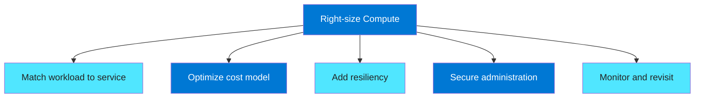

## Explanation

A successful Azure compute design is iterative.
You rarely choose once and never revisit.
The best teams standardize initial patterns, measure results, and refine deliberately.

- Pick the simplest service that meets requirements.
- Choose the VM family from measured resource pressure.
- Choose purchasing options from workload predictability.
- Add resiliency patterns based on business impact.
- Use Bastion and private access for secure operations.
- Treat storage choice as part of compute performance, not an afterthought.
- Review utilization, availability, and cost monthly.

## az CLI commands

```bash
# Example monthly review commands
az vm list --show-details --output table
az vmss list --output table
az webapp list --output table
az disk list --output table
az monitor metrics list \
  --resource /subscriptions/<subscription-id>/resourceGroups/<resource-group>/providers/Microsoft.Compute/virtualMachines/<vm-name> \
  --metric "Percentage CPU" \
  --interval PT1H
```

## Best practices

- Create standard reference architectures for common workload types.
- Bake cost review into operations.
- Avoid one-off designs unless justified.
- Use zones for critical systems when available.
- Use autoscale with tested thresholds.
- Keep administrative access private.
- Prefer managed identity and secretless patterns.
- Monitor performance before users complain.
- Track both technical and financial KPIs.
- Re-architect when workload shape changes significantly.

---

# End of guide

This guide covered:

- VM Series including B, D, F, E, M, L, N, and H.
- VM Lifecycle.
- Purchasing Options including PAYG, Reserved, Spot, and Hybrid Benefit.
- Availability Sets and Zones.
- VM Scale Sets with Uniform, Flexible, and autoscale.
- App Service plans, slots, and auto-scale.
- Managed Disks including Ultra, Premium, and Standard tiers.
- Azure Batch.
- Azure Bastion.
- Proximity Placement Groups.

Use it as a deployment reference, a migration primer, and a review checklist.

---

## 📚 Official Documentation
- [Azure Virtual Machines](https://learn.microsoft.com/en-us/azure/virtual-machines/)
- [Azure Virtual Machine Scale Sets](https://learn.microsoft.com/en-us/azure/virtual-machine-scale-sets/)
- [Azure App Service](https://learn.microsoft.com/en-us/azure/app-service/)
- [Azure Managed Disks](https://learn.microsoft.com/en-us/azure/virtual-machines/managed-disks-overview)
- [Azure Batch](https://learn.microsoft.com/en-us/azure/batch/)
