# Azure Containers on Microsoft Azure

> A comprehensive, command-driven reference for Azure container platforms and Azure Kubernetes Service (AKS).
>
> Scope: platform selection, AKS architecture, networking, security, storage, autoscaling, monitoring, Azure Container Apps, Azure Container Instances, Azure Container Registry, Azure Red Hat OpenShift, service mesh, and AKS best practices.

## Standalone Deep Dive

- [AKS Deep Dive](./aks-deep-dive.md) — dedicated guide for AKS provisioning, node pools, networking, ingress, ACR integration, GitOps, security, and troubleshooting.

---

## How to use this guide

- Use the **Container Decision Guide** first to choose the right platform.
- Use the **AKS** sections when you need deep Kubernetes control.
- Use the **Azure Container Apps** section for serverless containers and microservices.
- Use the **Azure Container Instances** section for burst, batch, and single-container workloads.
- Use the **ACR** section for image supply chain, registry, tasks, and replication.
- Use the **Best Practices** section as a production readiness checklist.

<!-- workflow-diagram:start -->
## Workflow Snapshot

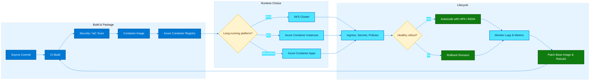

This container lifecycle covers image creation, registry promotion, AKS or serverless runtime deployment, scaling, monitoring, and rollback.
<!-- workflow-diagram:end -->

---

## Table of Contents

1. [Container Decision Guide](#1-container-decision-guide)
2. [Azure Kubernetes Service (AKS)](#2-azure-kubernetes-service-aks)
3. [AKS Networking](#3-aks-networking)
4. [AKS Security](#4-aks-security)
5. [AKS Storage](#5-aks-storage)
6. [AKS Autoscaling](#6-aks-autoscaling)
7. [AKS Monitoring](#7-aks-monitoring)
8. [Azure Container Apps](#8-azure-container-apps)
9. [Azure Container Instances (ACI)](#9-azure-container-instances-aci)
10. [Azure Container Registry (ACR)](#10-azure-container-registry-acr)
11. [Azure Red Hat OpenShift (ARO)](#11-azure-red-hat-openshift-aro)
12. [Service Mesh](#12-service-mesh)
13. [AKS Best Practices](#13-aks-best-practices)

---

## Azure naming and sample variables

Use these variables in the commands throughout the document.

```bash
export LOCATION=eastus
export RG=rg-azure-containers
export AKS=aks-prod-01
export ACR=contosoregistry123
export ACA_ENV=aca-env-prod
export ACA_APP=aca-orders
export ACI_NAME=aci-batch-01
export ARO_CLUSTER=aro-prod-01
export VNET=vnet-containers
export AKS_SUBNET=snet-aks
export ACI_SUBNET=snet-aci
export AGW=agw-containers
export LOG_WS=log-azure-containers
```

Create a resource group once and reuse it.

```bash
az group create --name $RG --location $LOCATION
```

---

# 1. Container Decision Guide

## 1.1 Mermaid decision tree

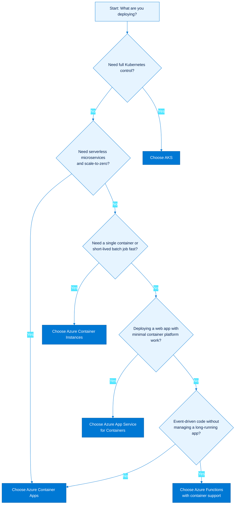

## 1.2 Explanation

### AKS is the right fit when

- You need Kubernetes-native APIs, CRDs, Helm, operators, or service mesh.
- You need advanced networking, node pools, GPU nodes, daemonsets, or custom schedulers.
- You want strong portability across on-premises Kubernetes and cloud Kubernetes.
- You need direct control over ingress, egress, security boundaries, and cluster upgrades.

### Azure Container Apps is the right fit when

- You want microservices or APIs without cluster management.
- You want HTTP or event-driven scaling, including scale-to-zero.
- You need revisions, built-in ingress, Dapr integration, and KEDA-based scaling.
- You want a managed platform that still supports containers and sidecars.

### Azure Container Instances is the right fit when

- You need to run a container in seconds without a cluster.
- You want burst capacity, CI jobs, data processing, or ad hoc tasks.
- You need isolated container groups or quick proof-of-concept environments.
- You need confidential containers or occasional GPU-backed containers.

### App Service for Containers is the right fit when

- You are hosting a web app or API with standard web hosting requirements.
- You want deployment slots, built-in auth, certificates, and simple app operations.
- Your application fits the web app model better than a general container platform.

### Azure Functions with containers is the right fit when

- You are running event-driven functions, jobs, or APIs with function triggers.
- You want pay-per-execution or elastic event processing.
- You need custom dependencies inside a function runtime image.

## 1.3 Quick selection matrix

| Requirement | Best default choice | Why |
|---|---|---|
| Full Kubernetes control | AKS | Managed Kubernetes with Azure integrations |
| Serverless microservices | Azure Container Apps | Revisions, KEDA, ingress, scale-to-zero |
| Fast one-off container | ACI | Lowest operational overhead |
| Simple web app in a container | App Service | App hosting focused platform |
| Event-driven functions in a container | Functions | Trigger-based execution model |
| Strict pod-to-pod network control | AKS | Kubernetes networking and policy depth |
| Simplest path to deploy HTTP API | Azure Container Apps | Minimal ops plus HTTP ingress |

## 1.4 Azure CLI and kubectl commands

### Create a reference AKS cluster

```bash
az aks create   --resource-group $RG   --name $AKS   --node-count 3   --enable-managed-identity   --attach-acr $ACR   --generate-ssh-keys

az aks get-credentials --resource-group $RG --name $AKS --overwrite-existing
kubectl get nodes -o wide
```

### Create a reference Container App

```bash
az extension add --name containerapp --upgrade

az monitor log-analytics workspace create   --resource-group $RG   --workspace-name $LOG_WS   --location $LOCATION

LOG_WS_ID=$(az monitor log-analytics workspace show -g $RG -n $LOG_WS --query customerId -o tsv)
LOG_WS_KEY=$(az monitor log-analytics workspace get-shared-keys -g $RG -n $LOG_WS --query primarySharedKey -o tsv)

az containerapp env create   --name $ACA_ENV   --resource-group $RG   --location $LOCATION   --logs-workspace-id $LOG_WS_ID   --logs-workspace-key $LOG_WS_KEY

az containerapp create   --name $ACA_APP   --resource-group $RG   --environment $ACA_ENV   --image mcr.microsoft.com/azuredocs/containerapps-helloworld:latest   --target-port 80   --ingress external
```

### Create a reference ACI workload

```bash
az container create   --resource-group $RG   --name $ACI_NAME   --image mcr.microsoft.com/azuredocs/aci-helloworld   --cpu 1   --memory 1.5   --ports 80   --dns-name-label ${ACI_NAME}-${RANDOM}
```

### Create an App Service for Containers plan and app

```bash
az appservice plan create   --name asp-containers   --resource-group $RG   --sku P1v3   --is-linux

az webapp create   --resource-group $RG   --plan asp-containers   --name webapp-containers-demo-12345   --deployment-container-image-name mcr.microsoft.com/azuredocs/aci-helloworld
```

### Create a containerized Function App

```bash
az functionapp plan create   --resource-group $RG   --name func-plan-containers   --location $LOCATION   --number-of-workers 1   --sku EP1   --is-linux
```

## 1.5 Best practices

- Choose the **least operationally complex** platform that still satisfies the requirements.
- Prefer **Container Apps** over AKS when you do not need direct Kubernetes control.
- Prefer **ACI** for burst and batch jobs, not for full microservice platforms.
- Prefer **App Service** for classic web applications that do not need Kubernetes primitives.
- Use **AKS** only when Kubernetes features materially improve reliability, security, or portability.
- Standardize on **ACR** for all Azure container platforms to simplify identity and network controls.
- Define a platform selection checklist covering scale, security, networking, observability, and team skills.

---

# 2. Azure Kubernetes Service (AKS)

## 2.1 Mermaid cluster architecture

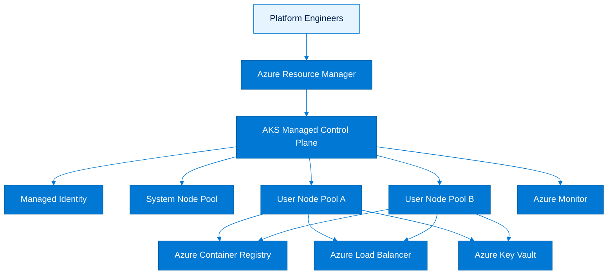

## 2.2 Explanation

AKS is Azure's managed Kubernetes offering. Azure manages the control plane availability, API server health, etcd operations, and many core lifecycle components, while you manage worker nodes, workloads, namespaces, policies, and operational practices.

### Control plane responsibilities

- Hosted and managed by Azure.
- Includes the Kubernetes API server, scheduler, controller manager, and etcd.
- Abstracted from direct VM management.
- Exposed through the AKS API and the Kubernetes API endpoint.

### Node pools

AKS separates worker capacity into node pools.

#### System node pools

- Must run core Kubernetes add-ons and system pods.
- Should use reliable VM sizes with enough CPU and memory for platform components.
- Must have at least one Linux-based system pool.
- Should be isolated from business workloads when possible.

#### User node pools

- Run application pods.
- Can be Linux or Windows.
- Can be tailored by VM size, availability zone placement, taints, and labels.
- Can scale independently of system pools.

### Managed identity

Managed identity is the preferred authentication model for AKS.

- Replaces legacy service principals for most scenarios.
- Supports cluster identity and kubelet identity.
- Improves secret hygiene because credentials are not stored in automation scripts.
- Integrates well with ACR, Key Vault, and other Azure services.

### Azure CNI vs kubenet

- **Azure CNI** assigns routable IP addresses from the virtual network to pods or uses overlay IP ranges depending on mode.
- **kubenet** assigns pod IPs from an internal CIDR and uses network address translation through node IPs.
- Azure CNI typically offers simpler VNet-native connectivity.
- kubenet uses fewer VNet IPs but has fewer advanced capabilities.

### Upgrade channels

AKS supports automatic or guided cluster lifecycle controls.

Common concepts include:

- Kubernetes version planning.
- node image upgrades.
- patch cadence.
- auto-upgrade channels such as rapid, stable, patch, and node-image where available.

## 2.3 Core architecture guidance

### Recommended baseline

- 1 system node pool for platform components.
- 1 or more user node pools for application workloads.
- Availability zones enabled in production regions.
- Managed identity enabled.
- ACR attached to the cluster.
- Monitoring enabled from day one.
- Policy and Defender enabled for governance and threat protection.

### Example workload placement approach

- Put ingress controllers on a dedicated user node pool.
- Put data or stateful workloads on a separate pool with tuned VM sizes.
- Use taints and tolerations to isolate sensitive or noisy workloads.
- Use labels and affinity rules to keep batch and latency-sensitive workloads apart.

## 2.4 Azure CLI and kubectl commands

### Create an AKS cluster with managed identity

```bash
az aks create   --resource-group $RG   --name $AKS   --location $LOCATION   --node-count 3   --node-vm-size Standard_D4s_v5   --enable-managed-identity   --network-plugin azure   --generate-ssh-keys
```

### Add a system node pool and a user node pool

```bash
az aks nodepool add   --resource-group $RG   --cluster-name $AKS   --name sysnp   --mode System   --node-count 2   --node-vm-size Standard_D4s_v5

az aks nodepool add   --resource-group $RG   --cluster-name $AKS   --name usernp1   --mode User   --node-count 3   --node-vm-size Standard_D8s_v5
```

### View managed identity details

```bash
az aks show   --resource-group $RG   --name $AKS   --query identity

az aks show   --resource-group $RG   --name $AKS   --query identityProfile
```

### Inspect versions and upgrade options

```bash
az aks get-upgrades   --resource-group $RG   --name $AKS   -o table

az aks show   --resource-group $RG   --name $AKS   --query kubernetesVersion
```

### Configure an auto-upgrade channel

```bash
az aks update   --resource-group $RG   --name $AKS   --auto-upgrade-channel stable
```

### Get credentials and inspect node pools from Kubernetes

```bash
az aks get-credentials --resource-group $RG --name $AKS --overwrite-existing
kubectl get nodes -o wide
kubectl get pods -A -o wide
kubectl describe node | less -F
```

## 2.5 Best practices

- Separate **system** and **user** node pools in production.
- Use **managed identity** instead of service principals whenever possible.
- Align node pool sizes with workload profiles instead of using a single general-purpose pool.
- Keep at least one spare buffer node during upgrades to reduce disruption.
- Use **availability zones** for production clusters when regionally supported.
- Standardize on **Azure CNI** or **Azure CNI Overlay** unless kubenet is specifically justified.
- Adopt a formal **upgrade policy** for Kubernetes version, node image, and add-ons.
- Treat AKS as a platform product: document ownership, SLOs, maintenance windows, and incident runbooks.

---

# 3. AKS Networking

## 3.1 Mermaid networking options diagram

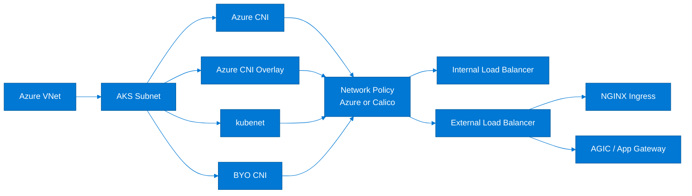

## 3.2 Explanation

Networking is one of the most important AKS design decisions because it affects IP consumption, connectivity, ingress, egress, policies, hybrid routing, and scale.

### Azure CNI

- Pods receive IPs integrated with Azure networking.
- Works well for direct pod reachability from peered VNets and on-premises networks when designed correctly.
- Simplifies many enterprise routing scenarios.
- Requires more deliberate IP capacity planning.

### Azure CNI Overlay

- Uses Azure CNI control and integration with an overlay pod CIDR.
- Preserves VNet address space because pods use overlay ranges rather than consuming routable VNet IPs per pod.
- Good fit when pod density is high and VNet IP space is constrained.
- Often the preferred modern default for many new AKS deployments.

### kubenet

- Assigns pod IPs from a cluster CIDR.
- Nodes perform NAT for pod egress.
- Conserves VNet IP space.
- May be less flexible for advanced networking requirements.

### BYO CNI

- Bring your own CNI is used when a third-party network stack is required.
- Usually selected for highly specialized environments.
- Requires strong operational maturity and vendor alignment.

### Network policies

You can enforce pod-to-pod and namespace-level traffic restrictions with network policies.

- **Azure network policy** integrates with Azure-managed capabilities where supported.
- **Calico** is widely adopted and offers rich policy features.
- Policies should default to deny and then explicitly allow needed flows.

### Internal vs external load balancers

- Use **external load balancers** for internet-facing services.
- Use **internal load balancers** for private services consumed within the VNet, ExpressRoute, VPN, or peered networks.

### Ingress controllers

#### NGINX Ingress

- Flexible and popular.
- Strong ecosystem and Kubernetes-native operations.
- Good fit when teams already operate ingress as part of the cluster platform.

#### AGIC

- Application Gateway Ingress Controller integrates AKS with Azure Application Gateway.
- Good fit when central WAF and Layer 7 policies are required.
- Aligns well with enterprise perimeter controls.

## 3.3 Design choices summary

| Option | Strength | Trade-off | Typical use case |
|---|---|---|---|
| Azure CNI | VNet-native connectivity | Higher IP planning demand | Enterprise networking |
| Azure CNI Overlay | Better IP efficiency with modern Azure integration | Overlay troubleshooting model | New AKS at scale |
| kubenet | Conserves VNet IPs | Less flexible for advanced networking | Smaller or simpler clusters |
| BYO CNI | Maximum specialization | More ops complexity | Niche vendor-driven environments |
| NGINX | Flexibility | Self-operated ingress lifecycle | Cloud-native platform teams |
| AGIC | App Gateway and WAF integration | More Azure coupling | Regulated or enterprise ingress |

## 3.4 Azure CLI and kubectl commands

### Create a VNet and subnet for AKS

```bash
az network vnet create   --resource-group $RG   --name $VNET   --address-prefixes 10.20.0.0/16   --subnet-name $AKS_SUBNET   --subnet-prefixes 10.20.0.0/22
```

### Create AKS with Azure CNI Overlay

```bash
AKS_SUBNET_ID=$(az network vnet subnet show -g $RG --vnet-name $VNET -n $AKS_SUBNET --query id -o tsv)

az aks create   --resource-group $RG   --name $AKS   --network-plugin azure   --network-plugin-mode overlay   --pod-cidr 192.168.0.0/16   --vnet-subnet-id $AKS_SUBNET_ID   --node-count 3   --enable-managed-identity   --generate-ssh-keys
```

### Create AKS with kubenet

```bash
az aks create   --resource-group $RG   --name ${AKS}-kubenet   --network-plugin kubenet   --pod-cidr 10.244.0.0/16   --service-cidr 10.0.0.0/16   --dns-service-ip 10.0.0.10   --node-count 3   --enable-managed-identity   --generate-ssh-keys
```

### Enable network policy

```bash
az aks update   --resource-group $RG   --name $AKS   --network-policy calico
```

### Create an internal load balancer service

```bash
kubectl apply -f - <<'EOF'
apiVersion: v1
kind: Service
metadata:
  name: internal-api
  annotations:
    service.beta.kubernetes.io/azure-load-balancer-internal: "true"
spec:
  type: LoadBalancer
  selector:
    app: internal-api
  ports:
  - port: 80
    targetPort: 8080
EOF
```

### Create an external load balancer service

```bash
kubectl apply -f - <<'EOF'
apiVersion: v1
kind: Service
metadata:
  name: public-api
spec:
  type: LoadBalancer
  selector:
    app: public-api
  ports:
  - port: 80
    targetPort: 8080
EOF
```

### Install NGINX Ingress with Helm prerequisites already in place

```bash
kubectl create namespace ingress-nginx
kubectl apply -n ingress-nginx -f https://raw.githubusercontent.com/kubernetes/ingress-nginx/main/deploy/static/provider/cloud/deploy.yaml
kubectl get svc -n ingress-nginx
```

### Enable AGIC add-on

```bash
az aks enable-addons   --resource-group $RG   --name $AKS   --addons ingress-appgw   --appgw-name $AGW
```

### Inspect services, endpoints, and ingress

```bash
kubectl get svc -A
kubectl get ingress -A
kubectl get endpoints -A
kubectl describe svc public-api
```

## 3.5 Best practices

- Start with **Azure CNI Overlay** for new enterprise deployments unless you need fully routable pod IPs.
- Reserve sufficient address space before cluster creation; IP redesign later is painful.
- Use **internal load balancers** for east-west or private north-south traffic.
- Apply **network policies** early, starting with platform namespaces and sensitive workloads.
- Standardize egress through Azure Firewall, NAT Gateway, or approved perimeter controls.
- Use **AGIC** when Application Gateway, WAF, and centralized ingress policy are required.
- Use **NGINX** when platform teams want Kubernetes-native ingress flexibility.
- Validate DNS, private endpoints, and hybrid routes before go-live, not after cutover.

---

# 4. AKS Security

## 4.1 Mermaid security control map

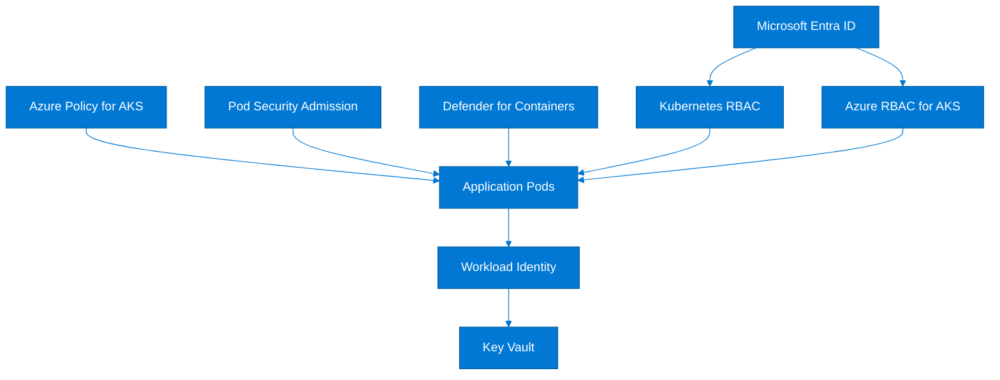

## 4.2 Explanation

Security in AKS is layered. Identity, authorization, pod hardening, image security, governance, and threat detection all matter.

### Microsoft Entra ID integration

- Provides identity-backed cluster access.
- Centralizes sign-in, conditional access, and identity governance.
- Reduces dependence on static kubeconfig sharing.

### Kubernetes RBAC

- Native Kubernetes authorization model.
- Uses Roles, ClusterRoles, RoleBindings, and ClusterRoleBindings.
- Best when you want Kubernetes-granular permissions based on namespaces and API groups.

### Azure RBAC for AKS

- Maps Azure role assignments to Kubernetes authorization.
- Useful when platform access should align with Azure governance and central IAM models.
- Often combined with Entra ID for enterprise operations.

### Workload identity

- Preferred way for pods to access Azure APIs without secrets.
- Replaces pod-managed identities and reduces secret sprawl.
- Works by federating Kubernetes service accounts with Entra ID applications or managed identities.

### Pod security

- Enforce non-root, restricted capabilities, seccomp, and safe host access patterns.
- Use Kubernetes Pod Security Admission or equivalent policies.
- Apply stronger controls for multi-tenant clusters.

### Azure Policy for AKS

- Continuously evaluates cluster configuration against governance standards.
- Can audit or deny unsafe configurations.
- Useful for enforcing allowed registries, privileged containers restrictions, and label requirements.

### Defender for Containers

- Provides runtime threat detection, vulnerability insights, and attack path context.
- Integrates with Microsoft Defender for Cloud.
- Improves visibility into misconfigurations and suspicious behavior.

## 4.3 Security model recommendations

### Access model

- Use Entra ID for human access.
- Use workload identity for application-to-Azure access.
- Avoid long-lived secrets in Kubernetes where possible.
- Restrict cluster-admin rights to a very small platform group.

### Namespace governance model

- Separate environments by cluster or by strongly governed namespaces.
- Use role bindings per namespace.
- Default deny network policy and restricted pod security settings.
- Enforce image pull only from approved registries.

## 4.4 Azure CLI and kubectl commands

### Create AKS with Entra ID and Azure RBAC enabled

```bash
AKS_ADMIN_GROUP_OBJECT_ID=<entra-group-object-id>

az aks create   --resource-group $RG   --name $AKS   --enable-aad   --enable-azure-rbac   --aad-admin-group-object-ids $AKS_ADMIN_GROUP_OBJECT_ID   --enable-managed-identity   --generate-ssh-keys
```

### Get cluster credentials with Entra-backed access

```bash
az aks get-credentials --resource-group $RG --name $AKS --overwrite-existing
kubectl auth can-i get pods --all-namespaces
```

### Create a namespace-scoped RBAC role and binding

```bash
kubectl create namespace team-a

kubectl apply -f - <<'EOF'
apiVersion: rbac.authorization.k8s.io/v1
kind: Role
metadata:
  namespace: team-a
  name: pod-reader
rules:
- apiGroups: [""]
  resources: ["pods", "services", "configmaps"]
  verbs: ["get", "list", "watch"]
---
apiVersion: rbac.authorization.k8s.io/v1
kind: RoleBinding
metadata:
  name: pod-reader-binding
  namespace: team-a
subjects:
- kind: User
  name: user@contoso.com
  apiGroup: rbac.authorization.k8s.io
roleRef:
  kind: Role
  name: pod-reader
  apiGroup: rbac.authorization.k8s.io
EOF
```

### Enable workload identity on AKS

```bash
az aks update   --resource-group $RG   --name $AKS   --enable-oidc-issuer   --enable-workload-identity

az aks show -g $RG -n $AKS --query oidcIssuerProfile.issuerUrl -o tsv
```

### Label a namespace for stronger pod security enforcement

```bash
kubectl create namespace secure-workloads
kubectl label --overwrite namespace secure-workloads   pod-security.kubernetes.io/enforce=restricted   pod-security.kubernetes.io/audit=restricted   pod-security.kubernetes.io/warn=restricted
```

### Enable Azure Policy add-on

```bash
az aks enable-addons   --resource-group $RG   --name $AKS   --addons azure-policy
```

### Enable Defender plans relevant to containers

```bash
az security pricing create --name KubernetesService --tier Standard
az security pricing create --name ContainerRegistry --tier Standard
```

### Inspect security posture from Kubernetes

```bash
kubectl get serviceaccounts -A
kubectl get role,rolebinding -A
kubectl get clusterrole,clusterrolebinding
kubectl get ns --show-labels
```

## 4.5 Best practices

- Integrate AKS with **Microsoft Entra ID** from the beginning.
- Prefer **Azure RBAC for AKS** for centralized administration and **Kubernetes RBAC** for fine-grained namespace control.
- Use **workload identity** instead of secrets or older pod identity patterns.
- Enforce **restricted** pod security wherever feasible.
- Enable **Azure Policy for AKS** to detect and prevent unsafe drift.
- Enable **Defender for Containers** and route alerts into your SOC workflow.
- Block untrusted registries and require signed, scanned images.
- Rotate credentials, review role assignments, and audit cluster-admin usage regularly.

---

# 5. AKS Storage

## 5.1 Mermaid storage architecture

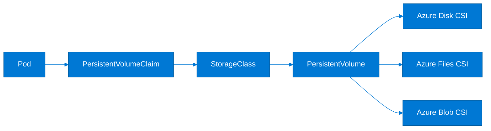

## 5.2 Explanation

Persistent storage in AKS is delivered through CSI drivers and Kubernetes storage abstractions.

### Azure Disk CSI

- Best for block storage and single-writer stateful workloads.
- Common for databases or applications needing low-latency persistent disks.
- Usually mounted as ReadWriteOnce.

### Azure Files CSI

- Best for shared file semantics.
- Supports multiple pods mounting the same share depending on access mode and workload pattern.
- Useful for legacy applications and shared content scenarios.

### Azure Blob CSI

- Exposes Blob storage for specific object-backed access patterns.
- Good for data-heavy workloads that benefit from object storage economics.
- Understand performance and filesystem semantics before adopting.

### Persistent volumes and claims

- `PersistentVolumeClaim` expresses application storage need.
- `StorageClass` defines the provisioning policy.
- `PersistentVolume` is the actual backing storage abstraction.
- Dynamic provisioning creates storage on demand when a PVC is created.

### Storage classes

Storage classes can define:

- Premium vs standard media.
- replication behavior.
- reclaim policy.
- filesystem type.
- topology-aware scheduling behavior.

## 5.3 Storage decision guidance

| Workload type | Recommended AKS storage | Reason |
|---|---|---|
| Single-node database | Azure Disk CSI | Block storage and strong performance |
| Shared app content | Azure Files CSI | Shared mount model |
| Large unstructured data | Azure Blob CSI | Object-backed scale and cost profile |
| Stateless app config | ConfigMap/Secret instead of PV | Keep persistence simple |
| StatefulSet database | Azure Disk CSI with StatefulSet | Predictable volume binding |

## 5.4 Azure CLI and kubectl commands

### Inspect built-in storage classes

```bash
kubectl get storageclass
kubectl describe storageclass managed-csi
kubectl describe storageclass azurefile-csi
```

### Create a premium managed disk storage class

```bash
kubectl apply -f - <<'EOF'
apiVersion: storage.k8s.io/v1
kind: StorageClass
metadata:
  name: managed-csi-premium
provisioner: disk.csi.azure.com
parameters:
  skuName: Premium_LRS
reclaimPolicy: Delete
allowVolumeExpansion: true
volumeBindingMode: WaitForFirstConsumer
EOF
```

### Create a PVC using Azure Disk CSI

```bash
kubectl apply -f - <<'EOF'
apiVersion: v1
kind: PersistentVolumeClaim
metadata:
  name: pvc-disk-demo
spec:
  accessModes:
  - ReadWriteOnce
  storageClassName: managed-csi-premium
  resources:
    requests:
      storage: 128Gi
EOF
```

### Create a PVC using Azure Files CSI

```bash
kubectl apply -f - <<'EOF'
apiVersion: v1
kind: PersistentVolumeClaim
metadata:
  name: pvc-files-demo
spec:
  accessModes:
  - ReadWriteMany
  storageClassName: azurefile-csi
  resources:
    requests:
      storage: 100Gi
EOF
```

### Example pod mounting a PVC

```bash
kubectl apply -f - <<'EOF'
apiVersion: v1
kind: Pod
metadata:
  name: app-with-pvc
spec:
  containers:
  - name: app
    image: busybox
    command: ["sh", "-c", "sleep 3600"]
    volumeMounts:
    - name: data
      mountPath: /data
  volumes:
  - name: data
    persistentVolumeClaim:
      claimName: pvc-disk-demo
EOF
```

### Inspect volume binding

```bash
kubectl get pvc,pv
kubectl describe pvc pvc-disk-demo
kubectl describe pod app-with-pvc
```

### Dynamically provision storage through application deployment

```bash
kubectl get statefulset -A
kubectl get pvc -A
```

## 5.5 Best practices

- Use **Azure Disk CSI** for databases and latency-sensitive stateful workloads.
- Use **Azure Files CSI** for shared content or multi-pod file access.
- Use **allowVolumeExpansion** so you can grow storage without disruptive redesign.
- Prefer **WaitForFirstConsumer** to improve zone-aware scheduling and placement.
- Separate storage classes by performance tier and workload intent.
- Back up stateful data independently of Kubernetes manifests.
- Validate application behavior during volume detach, node drain, and pod rescheduling.
- Monitor storage saturation, IOPS, throughput, and mount failure patterns.

---

# 6. AKS Autoscaling

## 6.1 Mermaid autoscaling stack

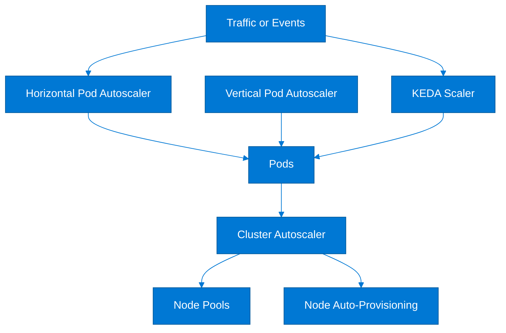

## 6.2 Explanation

Autoscaling in AKS works at several layers.

### Cluster autoscaler

- Adds or removes nodes in node pools based on unschedulable pods and utilization.
- Best for matching node capacity to workload demand.
- Works with min and max node counts.

### Horizontal Pod Autoscaler

- Scales the number of pod replicas.
- Typically driven by CPU, memory, or custom metrics.
- Essential for stateless services handling variable traffic.

### Vertical Pod Autoscaler

- Recommends or sets CPU and memory requests and limits.
- Useful when workloads have unpredictable resource shapes.
- Be careful with disruptive resize behavior for critical services.

### KEDA

- Event-driven autoscaler for Kubernetes.
- Scales based on external systems such as Service Bus, Event Hubs, Kafka, Prometheus, and HTTP.
- Can scale workloads down aggressively when no events exist.

### Node auto-provisioning

- Dynamically creates fit-for-purpose node capacity instead of only scaling pre-created pools.
- Useful for heterogeneous workload types.
- Evaluate maturity, preview status, and operational guardrails before production adoption.

## 6.3 Autoscaling operating model

### Typical layering

- HPA or KEDA scales pods first.
- Cluster autoscaler scales nodes when pods cannot be scheduled.
- VPA informs resource tuning or operates in recommendation mode.
- Node auto-provisioning adds new node shapes if fixed pools are insufficient.

### Important interactions

- HPA depends on sane resource requests.
- Cluster autoscaler depends on pending pods and schedulability constraints.
- Affinity, topology spread, and PDBs can affect scaling outcomes.
- Poorly sized requests create noisy autoscaling and wasted cost.

## 6.4 Azure CLI and kubectl commands

### Enable cluster autoscaler on a node pool

```bash
az aks nodepool update   --resource-group $RG   --cluster-name $AKS   --name usernp1   --enable-cluster-autoscaler   --min-count 3   --max-count 10
```

### Create a metrics-based HPA

```bash
kubectl autoscale deployment webapi   --cpu-percent=70   --min=3   --max=15

kubectl get hpa
```

### Example HPA manifest with CPU and memory metrics

```bash
kubectl apply -f - <<'EOF'
apiVersion: autoscaling/v2
kind: HorizontalPodAutoscaler
metadata:
  name: webapi-hpa
spec:
  scaleTargetRef:
    apiVersion: apps/v1
    kind: Deployment
    name: webapi
  minReplicas: 3
  maxReplicas: 15
  metrics:
  - type: Resource
    resource:
      name: cpu
      target:
        type: Utilization
        averageUtilization: 70
  - type: Resource
    resource:
      name: memory
      target:
        type: Utilization
        averageUtilization: 75
EOF
```

### Inspect metrics server and HPA status

```bash
kubectl top nodes
kubectl top pods -A
kubectl describe hpa webapi-hpa
```

### Install KEDA using kubectl

```bash
kubectl create namespace keda
kubectl apply -f https://github.com/kedacore/keda/releases/latest/download/keda-2.15.1.yaml
kubectl get pods -n keda
```

### Example KEDA scaled object for Azure Service Bus

```bash
kubectl apply -f - <<'EOF'
apiVersion: keda.sh/v1alpha1
kind: ScaledObject
metadata:
  name: orders-worker-scaler
spec:
  scaleTargetRef:
    name: orders-worker
  pollingInterval: 30
  cooldownPeriod: 300
  minReplicaCount: 0
  maxReplicaCount: 20
  triggers:
  - type: azure-servicebus
    metadata:
      queueName: orders
      namespace: sb-prod
      messageCount: "25"
EOF
```

### Example preview-style node auto-provisioning workflow

```bash
az aks update   --resource-group $RG   --name $AKS   --node-provisioning-mode Auto
```

### Inspect pod scheduling pressure

```bash
kubectl get events -A --sort-by=.lastTimestamp
kubectl get pods -A --field-selector=status.phase=Pending
kubectl describe node
```

## 6.5 Best practices

- Set **resource requests and limits** before enabling autoscaling.
- Use **HPA** for traffic-driven stateless apps.
- Use **KEDA** for queue, stream, and event-driven workloads.
- Use **cluster autoscaler** on user node pools, not just on day-one pool sizes.
- Run **VPA in recommendation mode** first to learn workload patterns.
- Keep PDBs, affinity rules, and topology constraints realistic so scaling is not blocked.
- Protect critical system workloads with reserved capacity and separate pools.
- Review scale events alongside cost and latency metrics, not in isolation.

---

# 7. AKS Monitoring

## 7.1 Mermaid observability architecture

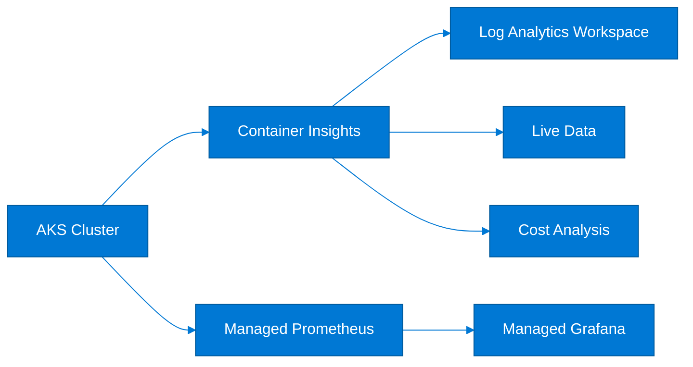

## 7.2 Explanation

Observability for AKS should combine logs, metrics, events, dashboards, and cost visibility.

### Container Insights

- Captures cluster inventory, node health, controller state, and container logs.
- Stores telemetry in Log Analytics.
- Supports troubleshooting, dashboards, and alerting.

### Prometheus metrics

- Best for Kubernetes and application metric time series.
- Useful for SLOs, alert rules, HPA custom metrics paths, and capacity analysis.
- Azure offers managed Prometheus integration for Kubernetes workloads.

### Grafana dashboards

- Visualize infrastructure and workload metrics.
- Useful for platform teams, service owners, and on-call workflows.
- Often paired with managed Prometheus and Azure Monitor data sources.

### Live data

- Helps triage active incidents.
- Useful for quick inspection of pod states, restarts, and node pressure.
- Should complement, not replace, durable logs and metrics.

### Cost analysis

- Tracks AKS spend drivers such as node pools, load balancers, disks, egress, and observability overhead.
- Useful for right-sizing and identifying idle clusters or oversized pools.

## 7.3 Monitoring model recommendations

### Minimum viable production observability

- Log Analytics workspace.
- Container Insights enabled.
- Prometheus metrics enabled.
- Grafana dashboards for cluster and app teams.
- Alerts for node health, pod crash loops, API latency, and capacity thresholds.

### Useful dashboard categories

- Cluster overview.
- Node pool saturation.
- Namespace health.
- Ingress and service latency.
- Cost by node pool or environment.
- Stateful workload storage trends.

## 7.4 Azure CLI and kubectl commands

### Create a Log Analytics workspace

```bash
az monitor log-analytics workspace create   --resource-group $RG   --workspace-name $LOG_WS   --location $LOCATION
```

### Enable Container Insights monitoring add-on

```bash
WORKSPACE_ID=$(az monitor log-analytics workspace show -g $RG -n $LOG_WS --query id -o tsv)

az aks enable-addons   --resource-group $RG   --name $AKS   --addons monitoring   --workspace-resource-id $WORKSPACE_ID
```

### Enable Azure Monitor managed Prometheus and Grafana integrations

```bash
az aks update   --resource-group $RG   --name $AKS   --enable-azure-monitor-metrics
```

### Inspect add-ons and monitoring profile

```bash
az aks show   --resource-group $RG   --name $AKS   --query addonProfiles
```

### Query Kubernetes state directly

```bash
kubectl get nodes
kubectl top nodes
kubectl top pods -A
kubectl get events -A --sort-by=.lastTimestamp
kubectl describe pod -n kube-system -l k8s-app=metrics-server
```

### Example log query entry point

```bash
az monitor log-analytics query   --workspace $(az monitor log-analytics workspace show -g $RG -n $LOG_WS --query customerId -o tsv)   --analytics-query "KubePodInventory | take 10"
```

### Example alerting workflow starter

```bash
az monitor action-group create   --resource-group $RG   --name ag-aks-ops   --short-name aksops
```

## 7.5 Best practices

- Enable **Container Insights** at cluster creation, not after the first outage.
- Use **Prometheus metrics** for SLOs, saturation trends, and workload-level dashboards.
- Keep **Grafana dashboards** aligned to operational responsibilities: platform, app, security, and leadership views.
- Collect **events** because they explain scheduling and policy failures faster than logs alone.
- Track **cost** as an observability signal, especially for idle capacity and oversized nodes.
- Set retention intentionally so costs stay predictable.
- Alert on symptoms that matter to users, not only infrastructure counters.
- Test incident triage paths before production go-live.

---

# 8. Azure Container Apps

## 8.1 Mermaid Container Apps architecture

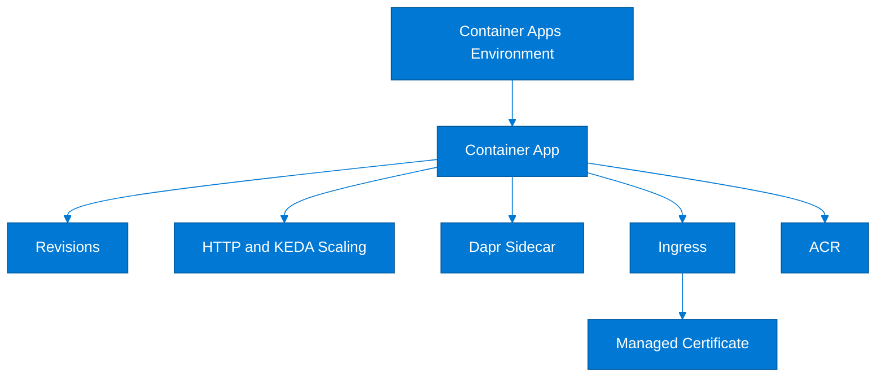

## 8.2 Explanation

Azure Container Apps is a managed serverless container platform optimized for APIs, background workers, and microservices.

### Environments

- A Container Apps environment is the deployment boundary.
- Apps in the same environment can share networking and observability context.
- Choose internal or external environment exposure based on network design.

### Containers and revisions

- A container app wraps one or more containers.
- Revisions let you deploy immutable versions.
- Traffic can split across revisions to support safe rollouts.

### Scaling rules

- HTTP scale responds to concurrent requests.
- KEDA-backed event scalers respond to queues, streams, and external signals.
- Scale-to-zero helps cost optimization for bursty services.

### Dapr sidecar

- Adds service invocation, pub/sub, bindings, and state abstractions.
- Useful for microservice building blocks.
- Optional, not mandatory.

### Ingress and managed certificates

- Built-in ingress simplifies HTTP exposure.
- Managed certificates reduce certificate lifecycle toil for custom domains.
- Supports external or internal exposure depending on environment configuration.

## 8.3 When Container Apps is a strong fit

- You want managed microservices without cluster operations.
- You need blue/green or canary via revisions and traffic splitting.
- You need HTTP and event-driven scale in one platform.
- You want a smoother developer experience than operating raw Kubernetes.

## 8.4 Azure CLI commands

### Create a Container Apps environment

```bash
az extension add --name containerapp --upgrade

LOG_WS_ID=$(az monitor log-analytics workspace show -g $RG -n $LOG_WS --query customerId -o tsv)
LOG_WS_KEY=$(az monitor log-analytics workspace get-shared-keys -g $RG -n $LOG_WS --query primarySharedKey -o tsv)

az containerapp env create   --name $ACA_ENV   --resource-group $RG   --location $LOCATION   --logs-workspace-id $LOG_WS_ID   --logs-workspace-key $LOG_WS_KEY
```

### Create a Container App with external ingress

```bash
az containerapp create   --name $ACA_APP   --resource-group $RG   --environment $ACA_ENV   --image mcr.microsoft.com/azuredocs/containerapps-helloworld:latest   --target-port 80   --ingress external   --min-replicas 1   --max-replicas 5
```

### Enable revision mode and list revisions

```bash
az containerapp revision set-mode   --name $ACA_APP   --resource-group $RG   --mode multiple

az containerapp revision list   --name $ACA_APP   --resource-group $RG   -o table
```

### Split traffic between revisions

```bash
az containerapp ingress traffic set   --name $ACA_APP   --resource-group $RG   --revision-weight ${ACA_APP}--rev1=80 ${ACA_APP}--rev2=20
```

### Configure HTTP scaling

```bash
az containerapp update   --name $ACA_APP   --resource-group $RG   --scale-rule-name http-rule   --scale-rule-type http   --scale-rule-http-concurrency 50
```

### Configure a KEDA event scaler example

```bash
az containerapp update   --name $ACA_APP   --resource-group $RG   --scale-rule-name queue-rule   --scale-rule-type azure-queue   --scale-rule-metadata queueName=orders accountName=storageacct queueLength=10
```

### Enable Dapr sidecar

```bash
az containerapp update   --name $ACA_APP   --resource-group $RG   --enable-dapr   --dapr-app-id orders   --dapr-app-port 80
```

### Add custom hostname and bind a managed certificate

```bash
az containerapp hostname add   --name $ACA_APP   --resource-group $RG   --hostname api.contoso.com

az containerapp hostname bind   --name $ACA_APP   --resource-group $RG   --hostname api.contoso.com   --certificate managed
```

### Inspect the app

```bash
az containerapp show --name $ACA_APP --resource-group $RG
az containerapp logs show --name $ACA_APP --resource-group $RG --follow
```

## 8.5 Best practices

- Use **Container Apps** for microservices when you do not need direct Kubernetes administration.
- Organize services by **environment boundaries** that reflect network, security, and lifecycle needs.
- Use **revisions** for safe deployments and fast rollback.
- Favor **scale-to-zero** only for workloads tolerant of cold starts.
- Turn on **Dapr** only when its abstractions are valuable; do not add unnecessary sidecars.
- Use **managed certificates** and custom domains to simplify edge operations.
- Standardize logging and secret access across apps from the start.
- Keep each app small, single-purpose, and independently deployable.

---

# 9. Azure Container Instances (ACI)

## 9.1 Mermaid ACI deployment model

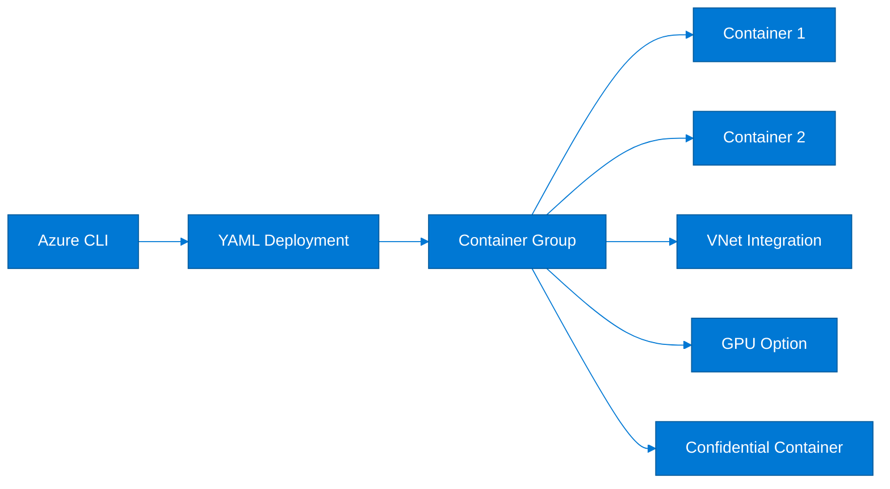

## 9.2 Explanation

Azure Container Instances is the fastest path to run containers on Azure with minimal infrastructure management.

### Container groups

- A container group is the top-level ACI scheduling unit.
- Containers in a group share lifecycle, network, and storage context.
- Good for sidecar patterns and simple multi-container jobs.

### YAML deployment

- Useful for declarative deployment of multi-container groups.
- Simplifies repeatable jobs and infrastructure-as-code integration.

### VNet integration

- Lets ACI connect to private resources.
- Important for internal APIs, databases, or hybrid networks.
- Requires subnet planning.

### GPU support

- Useful for specialized AI or graphics workloads where available.
- Verify regional support, SKU availability, and workload economics.

### Confidential containers

- Designed for stronger memory isolation and confidential computing scenarios.
- Useful for sensitive computations and regulated workloads.

## 9.3 Typical ACI use cases

- One-off data processing.
- CI or build helper jobs.
- Burst workloads.
- Short-lived integration tasks.
- Rapid proof-of-concept deployments.

## 9.4 Azure CLI commands

### Create a simple ACI container

```bash
az container create   --resource-group $RG   --name $ACI_NAME   --image mcr.microsoft.com/azuredocs/aci-helloworld   --cpu 1   --memory 1.5   --ports 80   --dns-name-label ${ACI_NAME}-${RANDOM}
```

### Show container group details and logs

```bash
az container show --resource-group $RG --name $ACI_NAME
az container logs --resource-group $RG --name $ACI_NAME
```

### Create a subnet for ACI VNet integration

```bash
az network vnet subnet create   --resource-group $RG   --vnet-name $VNET   --name $ACI_SUBNET   --address-prefixes 10.20.10.0/24   --delegations Microsoft.ContainerInstance/containerGroups
```

### Deploy ACI into a VNet

```bash
ACI_SUBNET_ID=$(az network vnet subnet show -g $RG --vnet-name $VNET -n $ACI_SUBNET --query id -o tsv)

az container create   --resource-group $RG   --name ${ACI_NAME}-private   --image mcr.microsoft.com/azuredocs/aci-helloworld   --subnet $ACI_SUBNET_ID   --cpu 1   --memory 2
```

### Deploy from YAML

```bash
cat > /Users/shasidharreddy_mallu/Git-Infoblox/REPOS/Azure-Cloud-Engineer/Containers/aci.yaml <<'EOF'
apiVersion: 2021-10-01
location: eastus
name: aci-yaml-demo
properties:
  containers:
  - name: app
    properties:
      image: mcr.microsoft.com/azuredocs/aci-helloworld
      resources:
        requests:
          cpu: 1.0
          memoryInGB: 1.5
      ports:
      - port: 80
  osType: Linux
  ipAddress:
    type: Public
    ports:
    - protocol: TCP
      port: 80
  restartPolicy: Always
EOF

az container create --resource-group $RG --file /Users/shasidharreddy_mallu/Git-Infoblox/REPOS/Azure-Cloud-Engineer/Containers/aci.yaml
```

### Create a GPU-backed container group

```bash
az container create   --resource-group $RG   --name ${ACI_NAME}-gpu   --image mcr.microsoft.com/azureml/curated/tensorflow-2.11-cuda11.8-cudnn8-ubuntu20.04:latest   --cpu 4   --memory 16   --gpu-count 1   --gpu-sku V100
```

### Create a confidential container group

```bash
az container create   --resource-group $RG   --name ${ACI_NAME}-confidential   --image mcr.microsoft.com/acc/samples/aci/helloworld:2.9   --cpu 2   --memory 4   --sku Confidential
```

## 9.5 Best practices

- Use **ACI** for short-lived or operationally simple workloads, not as a substitute for a full platform.
- Group containers only when shared lifecycle and networking are truly required.
- Use **VNet integration** for private dependencies instead of exposing internal systems publicly.
- Treat **GPU** and **confidential** workloads as specialized scenarios with cost and availability checks.
- Store YAML definitions in source control for repeatability.
- Review logs and exit codes because many ACI workloads are batch-oriented.
- Set cleanup processes for completed jobs so stale resources do not accumulate.
- Use ACR and managed identities when available to simplify image pulls.

---

# 10. Azure Container Registry (ACR)

## 10.1 Mermaid ACR supply chain diagram

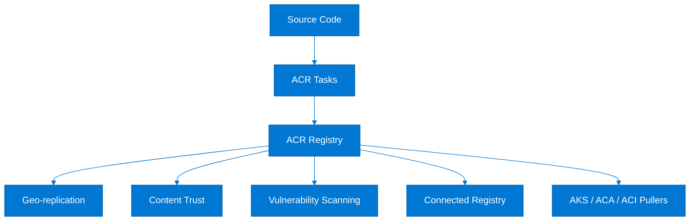

## 10.2 Explanation

Azure Container Registry is Azure's managed OCI registry and container supply chain foundation.

### SKUs

#### Basic

- Suitable for development and small workloads.
- Limited throughput and feature set compared with higher tiers.

#### Standard

- Better throughput and scale for many production environments.
- Common baseline for business workloads.

#### Premium

- Adds advanced capabilities such as geo-replication and enhanced networking features.
- Best for enterprise and global deployments.

### Geo-replication

- Replicates registry presence across regions.
- Improves pull performance and resiliency for distributed deployments.
- Premium SKU feature.

### ACR Tasks

- Build images in Azure.
- Automate patch rebuilds or source-triggered builds.
- Useful for standardized CI workflows and secure build boundaries.

### Content trust

- Helps establish image provenance and signing expectations.
- Should be part of a wider software supply chain policy.

### Vulnerability scanning

- Commonly integrated through Defender for Cloud and supply chain controls.
- Use it to prevent unsafe images from deployment promotion.

### Connected registries

- Extend registry distribution closer to edge or disconnected environments.
- Useful when local pull performance or intermittent connectivity matters.

## 10.3 ACR operating model guidance

- One shared enterprise registry can work well with strong repository governance.
- Multiple registries may be preferred for strict environment separation.
- Use repository naming conventions by business unit, product, and environment.
- Enforce image retention, soft delete awareness, and cleanup jobs.

## 10.4 Azure CLI commands

### Create an ACR registry

```bash
az acr create   --resource-group $RG   --name $ACR   --sku Premium   --location $LOCATION
```

### Log in and list repositories

```bash
az acr login --name $ACR
az acr repository list --name $ACR -o table
```

### Build and push with ACR Tasks

```bash
az acr build   --registry $ACR   --image apps/orders:v1   /Users/shasidharreddy_mallu/Git-Infoblox/REPOS/Azure-Cloud-Engineer/Containers
```

### Enable geo-replication

```bash
az acr replication create   --registry $ACR   --location westus2
```

### Enable content trust

```bash
az acr config content-trust update   --registry $ACR   --status enabled
```

### Show registry details and SKU

```bash
az acr show --name $ACR --resource-group $RG
az acr check-health --name $ACR
```

### Create a connected registry

```bash
az acr connected-registry create   --registry $ACR   --name edge-registry-01   --mode ReadWrite
```

### Enable Defender scanning plans relevant to ACR

```bash
az security pricing create --name ContainerRegistry --tier Standard
```

### Attach ACR to AKS for image pull permissions

```bash
az aks update   --resource-group $RG   --name $AKS   --attach-acr $ACR
```

## 10.5 Best practices

- Default to **Standard** or **Premium** for production.
- Use **Premium** when you need geo-replication, private networking, or higher enterprise scale.
- Build images with **ACR Tasks** or a trusted CI system; avoid uncontrolled local builds for production releases.
- Enable **content trust** and integrate image signing into your release flow.
- Turn on **vulnerability scanning** and block promotion of critical findings.
- Use **repository scoping** and RBAC to limit image access.
- Regularly clean untagged and stale images to control cost.
- Keep registry access private where possible and restrict anonymous or broad pull rights.

---

# 11. Azure Red Hat OpenShift (ARO)

## 11.1 Mermaid ARO architecture

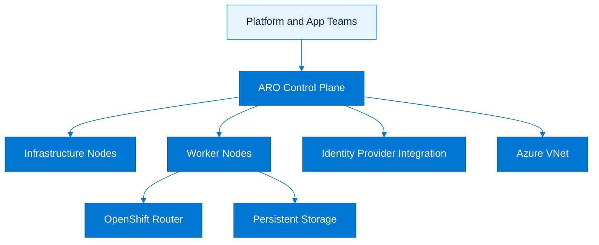

## 11.2 Explanation

Azure Red Hat OpenShift is a fully managed OpenShift service jointly operated by Microsoft and Red Hat.

### Cluster architecture

- Managed control plane.
- Dedicated infrastructure and worker roles following OpenShift patterns.
- Built-in OpenShift APIs, routes, operators, and enterprise distribution capabilities.

### Networking

- Integrates with Azure virtual networking.
- Supports private and enterprise-grade connectivity patterns.
- Uses OpenShift routing constructs in addition to Kubernetes services and ingress concepts.

### Storage

- Uses Kubernetes and OpenShift storage integrations.
- Commonly relies on managed Azure storage backends through CSI and OpenShift-supported patterns.
- Requires the same durability planning as any production platform.

### Identity integration

- Supports identity provider integration such as Entra ID or other enterprise IdPs.
- OpenShift RBAC and project governance add another administrative layer.

## 11.3 When to choose ARO

- You need OpenShift-specific features, operators, or organizational standards.
- Your teams are already skilled in OpenShift administration.
- You want Red Hat and Microsoft co-managed support.
- You require the OpenShift platform experience rather than vanilla Kubernetes.

## 11.4 Azure CLI and kubectl commands

### Register providers for ARO

```bash
az provider register -n Microsoft.RedHatOpenShift --wait
az provider register -n Microsoft.Compute --wait
az provider register -n Microsoft.Storage --wait
az provider register -n Microsoft.Authorization --wait
```

### Create a VNet for ARO

```bash
az network vnet create   --resource-group $RG   --name aro-vnet   --address-prefixes 10.30.0.0/16

az network vnet subnet create   --resource-group $RG   --vnet-name aro-vnet   --name master-subnet   --address-prefixes 10.30.0.0/23   --disable-private-link-service-network-policies true

az network vnet subnet create   --resource-group $RG   --vnet-name aro-vnet   --name worker-subnet   --address-prefixes 10.30.2.0/23
```

### Create an ARO cluster

```bash
MASTER_SUBNET_ID=$(az network vnet subnet show -g $RG --vnet-name aro-vnet -n master-subnet --query id -o tsv)
WORKER_SUBNET_ID=$(az network vnet subnet show -g $RG --vnet-name aro-vnet -n worker-subnet --query id -o tsv)

az aro create   --resource-group $RG   --name $ARO_CLUSTER   --vnet aro-vnet   --master-subnet master-subnet   --worker-subnet worker-subnet
```

### Get ARO credentials

```bash
az aro list-credentials   --name $ARO_CLUSTER   --resource-group $RG
```

### Inspect the cluster endpoint and profile

```bash
az aro show   --name $ARO_CLUSTER   --resource-group $RG
```

### Kubernetes inspection commands after login

```bash
kubectl get nodes
kubectl get ns
kubectl get storageclass
```

## 11.5 Best practices

- Choose **ARO** only when OpenShift value is real and ongoing, not just familiar branding.
- Plan for both **OpenShift** and **Azure** operational models.
- Reserve proper subnet space up front.
- Integrate identity providers early so project and admin workflows are consistent.
- Standardize operator approval and lifecycle policies.
- Validate route, certificate, and private connectivity behavior before production cutover.
- Align storage classes to stateful workload expectations.
- Keep cluster roles and project governance tightly controlled.

---

# 12. Service Mesh

## 12.1 Mermaid service mesh landscape

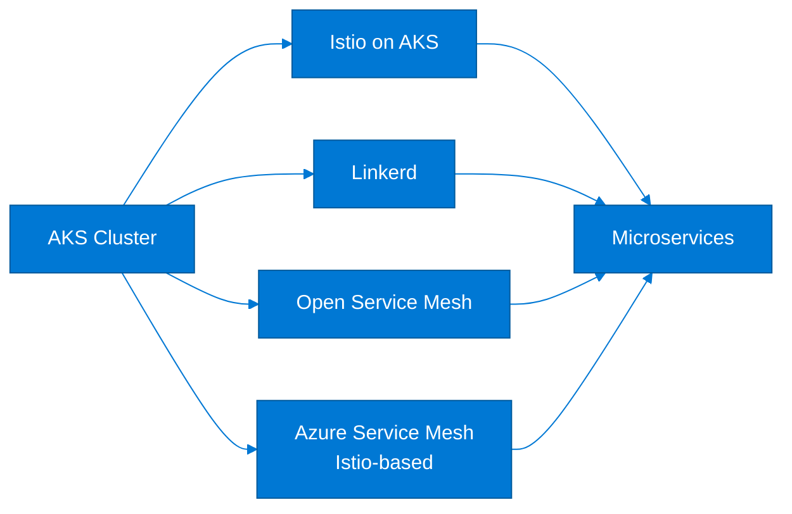

## 12.2 Explanation

Service mesh adds traffic management, mTLS, identity, observability, and resilience patterns between services.

### Istio on AKS

- Rich feature set for traffic shaping, security, and telemetry.
- Good fit for advanced microservice control planes.
- Higher operational complexity than simpler alternatives.

### Linkerd

- Lightweight and simpler operational model.
- Often favored when teams want core mesh features with lower complexity.

### Open Service Mesh (OSM)

- Historically provided a lightweight mesh option.
- Treat as a legacy or transitional choice where applicable.
- Confirm current support posture before greenfield adoption.

### Azure Service Mesh

- Azure-managed, Istio-based service mesh capabilities for AKS.
- Useful when teams want Istio outcomes with more Azure-managed experience.
- Verify supported scenarios and regional availability.

## 12.3 When to use a service mesh

- You need mTLS between services.
- You need canary traffic routing beyond simple ingress controls.
- You need service-to-service policy and rich telemetry.
- Your platform team can operate the added complexity.

## 12.4 Azure CLI and kubectl commands

### Enable Istio-based Azure Service Mesh on AKS

```bash
az aks mesh enable   --resource-group $RG   --name $AKS
```

### View mesh profile

```bash
az aks show   --resource-group $RG   --name $AKS   --query serviceMeshProfile
```

### Label a namespace for sidecar injection style workflows

```bash
kubectl create namespace mesh-demo
kubectl label namespace mesh-demo istio-injection=enabled --overwrite
```

### Deploy a sample app into the mesh-enabled namespace

```bash
kubectl create deployment web-frontend   --image=mcr.microsoft.com/azuredocs/aks-helloworld:v1   -n mesh-demo
kubectl expose deployment web-frontend --port 80 --target-port 80 -n mesh-demo
kubectl get pods -n mesh-demo -o wide
```

### Inspect sidecars and services

```bash
kubectl get pods -n mesh-demo
kubectl describe pod -n mesh-demo -l app=web-frontend
kubectl get svc -n mesh-demo
```

### Legacy OSM add-on example where still applicable

```bash
az aks enable-addons   --resource-group $RG   --name $AKS   --addons open-service-mesh
```

### Linkerd-style namespace preparation using kubectl after mesh installation

```bash
kubectl annotate namespace mesh-demo linkerd.io/inject=enabled --overwrite
kubectl rollout restart deployment web-frontend -n mesh-demo
```

## 12.5 Best practices

- Adopt a service mesh only when you have clear **security**, **traffic management**, or **telemetry** requirements.
- Prefer the **least complex** mesh that satisfies the need.
- Standardize sidecar injection and namespace onboarding patterns.
- Test mTLS, retries, timeouts, and circuit-breaking under failure conditions.
- Keep ingress policy and service mesh policy aligned to avoid overlapping confusion.
- Evaluate operational overhead, upgrade cadence, and CRD lifecycle before rollout.
- Use mesh telemetry to improve SLOs, not just to create more dashboards.
- Avoid mesh sprawl across clusters without clear platform ownership.

---

# 13. AKS Best Practices

## 13.1 Mermaid production readiness map

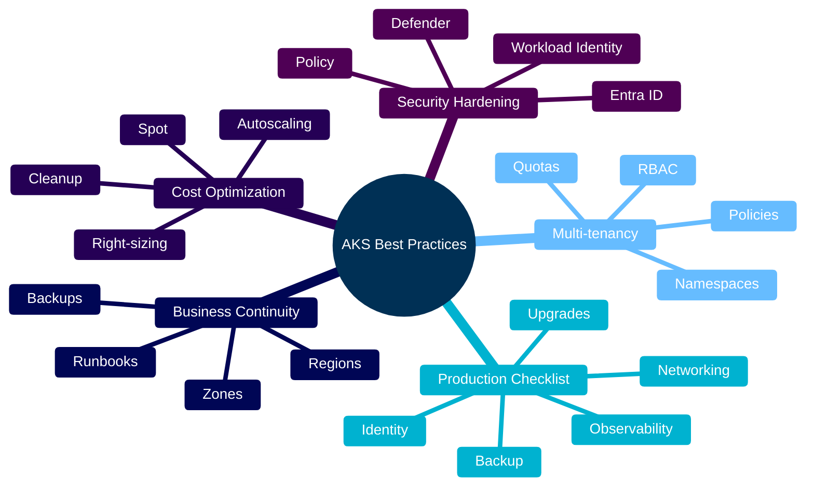

## 13.2 Explanation

This section consolidates platform-level practices that repeatedly differentiate resilient AKS environments from fragile ones.

### Production checklist

A production AKS environment should include:

- Managed identity.
- Entra ID integration.
- Separation of system and user pools.
- Network policies.
- Logging, metrics, dashboards, and alerts.
- Backup and recovery procedures.
- Defined upgrade and maintenance windows.
- Registry governance and image scanning.
- Policy enforcement and runtime threat monitoring.

### Multi-tenancy

Multi-tenancy exists on a spectrum.

#### Soft multi-tenancy

- Separate teams by namespace.
- Use RBAC, quotas, network policies, and admission controls.
- Good for trusted internal teams with strong governance.

#### Harder isolation

- Use separate clusters per environment, business unit, or sensitivity tier.
- Better for security boundaries, noisy neighbor control, and differentiated lifecycle management.

### Business continuity

- Use zone-redundant node pools where possible.
- Back up manifests, cluster config, and stateful data.
- Design for regional failover if the workload justifies it.
- Test restoration, not only backup completion.

### Cost optimization

- Right-size nodes and requests.
- Use autoscaling.
- Remove idle environments.
- Use spot pools carefully for interruptible workloads.
- Watch observability and egress costs.

### Security hardening

- Restrict admin access.
- Use workload identity.
- Enforce pod security and policy.
- Scan images and respond to Defender findings.
- Limit egress and private-link sensitive services where possible.

## 13.3 Production readiness checklist

### Platform

- [ ] Resource group, tags, and naming standards defined.
- [ ] Azure Policy assignments reviewed.
- [ ] Managed identity enabled.
- [ ] ACR integrated.
- [ ] System and user pools separated.
- [ ] Availability zones enabled where supported.
- [ ] Upgrade channel selected.

### Networking

- [ ] IP plan validated for nodes, pods, services, and growth.
- [ ] Ingress architecture selected: NGINX, AGIC, or both with clear scope.
- [ ] Egress design documented.
- [ ] Network policies enforced.
- [ ] Private dependencies tested.

### Security

- [ ] Entra ID integrated.
- [ ] Azure RBAC or Kubernetes RBAC model approved.
- [ ] Workload identity configured.
- [ ] Pod security enforcement enabled.
- [ ] Defender plans enabled.
- [ ] Approved registries only.

### Reliability

- [ ] Pod disruption budgets defined.
- [ ] Liveness, readiness, and startup probes configured.
- [ ] Storage classes aligned to app needs.
- [ ] Backup and restore tested.
- [ ] Cluster and node upgrade process documented.

### Observability

- [ ] Container Insights enabled.
- [ ] Metrics and Grafana dashboards available.
- [ ] Alert routing tested.
- [ ] Cost dashboards reviewed monthly.
- [ ] SLOs documented per service.

## 13.4 Azure CLI and kubectl commands

### Create a production-oriented AKS cluster baseline

```bash
AKS_SUBNET_ID=$(az network vnet subnet show -g $RG --vnet-name $VNET -n $AKS_SUBNET --query id -o tsv)

az aks create   --resource-group $RG   --name $AKS   --location $LOCATION   --enable-managed-identity   --enable-aad   --enable-azure-rbac   --enable-oidc-issuer   --enable-workload-identity   --network-plugin azure   --network-plugin-mode overlay   --vnet-subnet-id $AKS_SUBNET_ID   --attach-acr $ACR   --node-count 3   --auto-upgrade-channel stable   --node-os-upgrade-channel NodeImage   --generate-ssh-keys
```

### Add a dedicated user pool for applications

```bash
az aks nodepool add   --resource-group $RG   --cluster-name $AKS   --name apppool1   --mode User   --node-vm-size Standard_D8s_v5   --enable-cluster-autoscaler   --min-count 3   --max-count 12
```

### Enable monitoring, policy, and Defender-aligned services

```bash
WORKSPACE_ID=$(az monitor log-analytics workspace show -g $RG -n $LOG_WS --query id -o tsv)

az aks enable-addons   --resource-group $RG   --name $AKS   --addons monitoring,azure-policy   --workspace-resource-id $WORKSPACE_ID

az security pricing create --name KubernetesService --tier Standard
az security pricing create --name ContainerRegistry --tier Standard
```

### Inspect node labels, taints, and workload spread

```bash
kubectl get nodes --show-labels
kubectl describe nodes | less -F
kubectl get poddisruptionbudgets -A
kubectl get deploy,statefulset,daemonset -A
```

### Apply namespace quotas and limits

```bash
kubectl apply -f - <<'EOF'
apiVersion: v1
kind: Namespace
metadata:
  name: team-b
---
apiVersion: v1
kind: ResourceQuota
metadata:
  name: team-b-quota
  namespace: team-b
spec:
  hard:
    requests.cpu: "20"
    requests.memory: 40Gi
    limits.cpu: "40"
    limits.memory: 80Gi
    pods: "100"
---
apiVersion: v1
kind: LimitRange
metadata:
  name: team-b-limits
  namespace: team-b
spec:
  limits:
  - default:
      cpu: "1"
      memory: 1Gi
    defaultRequest:
      cpu: 100m
      memory: 256Mi
    type: Container
EOF
```

### Verify business continuity posture basics

```bash
kubectl get nodes -L topology.kubernetes.io/zone
kubectl get pvc -A
az aks show --resource-group $RG --name $AKS --query agentPoolProfiles
```

## 13.5 Best practices

### Production checklist best practices

- Define a **platform baseline** and automate it.
- Keep cluster configuration declarative and version controlled.
- Standardize naming, tagging, labels, and annotations.
- Review baseline drift monthly.

### Multi-tenancy best practices

- Start with namespace isolation only for trusted tenants.
- Use separate clusters for materially different risk profiles.
- Add quotas, limits, policies, and network boundaries for each tenant.
- Separate platform and application responsibilities explicitly.

### Business continuity best practices

- Use zones when supported.
- Define RTO and RPO before choosing topology.
- Test cluster rebuilds and stateful restores quarterly.
- Store manifests, policies, and secrets references outside the cluster lifecycle.

### Cost optimization best practices

- Right-size node pools every quarter.
- Prefer autoscaling over permanent peak sizing.
- Use spot pools only for tolerant workloads.
- Clean up unused disks, load balancers, public IPs, and idle nonproduction clusters.
- Measure observability cost; it can be a hidden large line item.

### Security hardening best practices

- Use least privilege everywhere.
- Remove standing admin access where possible.
- Prefer private endpoints, private clusters, and controlled egress for sensitive workloads.
- Require signed and scanned images.
- Patch nodes and cluster versions on a disciplined schedule.
- Treat Kubernetes manifests as part of the security boundary.

---

# Appendix A. Useful kubectl commands for container platforms

```bash
kubectl get all -A
kubectl get ingress -A
kubectl get svc -A
kubectl get deploy,statefulset,daemonset -A
kubectl get pvc,pv -A
kubectl get hpa -A
kubectl top nodes
kubectl top pods -A
kubectl get events -A --sort-by=.lastTimestamp
kubectl auth can-i --list
```

# Appendix B. Useful Azure CLI commands for container platforms

```bash
az aks list -o table
az containerapp list -g $RG -o table
az container list -g $RG -o table
az acr list -g $RG -o table
az aro list -g $RG -o table
az monitor log-analytics workspace list -g $RG -o table
az resource list -g $RG --resource-type Microsoft.ContainerService/managedClusters -o table
```

# Appendix C. Platform comparison summary

| Platform | Primary abstraction | Best for | Operations burden | Scale model |
|---|---|---|---|---|
| AKS | Kubernetes cluster | Full platform control | Highest | Pod and node scaling |
| Azure Container Apps | Serverless app revision | APIs and microservices | Low | HTTP and event-driven |
| ACI | Container group | Batch and burst | Very low | Per container group |
| App Service | Web app | Traditional web hosting | Low | App plan instances |
| Functions | Function app | Trigger-based code | Very low | Event execution driven |
| ARO | OpenShift cluster | OpenShift standardization | High | Pod and node scaling |

# Appendix D. Reference design notes

- Use ACR as the common image source for AKS, ACA, and ACI.
- Align identity with Entra ID for both humans and workloads.
- Prefer Azure Monitor plus Prometheus plus Grafana for a unified observability story.
- Apply policy, registry governance, and network controls consistently across platforms.
- Document the decision tree so teams choose platforms intentionally instead of by habit.

# Appendix E. Cleanup commands

Use these only when you intentionally want to remove the demo resources created from this guide.

```bash
az group delete --name $RG --yes --no-wait
```

---

# Appendix F. AKS architecture deep dive

## F.1 Cluster building blocks

- The managed control plane is regionally hosted by Azure.
- Node pools map to underlying Azure VM scale sets.
- Kubelet identity often differs from cluster identity.
- Platform add-ons run primarily on the system node pool.
- Workloads should usually run on user node pools.
- Each node pool can have its own VM size and scaling range.
- Labels and taints are core building blocks for workload placement.
- Availability zones matter for failure domain alignment.
- OS image channels matter for patching speed and compliance.
- Outbound connectivity design affects image pulls and dependency access.

## F.2 Recommended labels and taints examples

```bash
kubectl label nodes <node-name> workload-type=ingress
kubectl taint nodes <node-name> workload=system:NoSchedule
kubectl get nodes --show-labels
```

## F.3 Node pool design patterns

### Platform ingress pool

- Use for ingress controllers and edge agents.
- Isolate public-facing components.
- Consider zone spreading.
- Size for TLS and request processing overhead.

### General app pool

- Use for stateless APIs and common services.
- Enable autoscaling.
- Standardize resource requests.
- Avoid mixing extremely bursty and latency-sensitive services.

### Stateful data-adjacent pool

- Use for stateful services that need higher memory or storage throughput.
- Keep drain and disruption policy conservative.
- Align with storage and availability requirements.
- Validate storage attach/detach timing.

### Batch or ML pool

- Use for CPU- or GPU-intensive jobs.
- Consider spot capacity if interruptible.
- Apply taints and tolerations.
- Use separate budget controls.

## F.4 Upgrade operating sequence

1. Review supported target versions.
2. Review deprecated APIs in workloads.
3. Upgrade nonproduction first.
4. Validate node image and add-on compatibility.
5. Upgrade control plane where applicable.
6. Upgrade user pools in waves.
7. Upgrade system pool carefully.
8. Validate observability and security add-ons.
9. Run smoke tests.
10. Record outcomes and timing.

## F.5 Best practices

- Keep upgrade runbooks versioned.
- Avoid same-day cluster and application risk stacking.
- Document rollback or mitigation choices.
- Test draining behavior before maintenance windows.
- Reserve enough headroom for rolling upgrades.

---

# Appendix G. AKS networking deep dive

## G.1 Traffic flow patterns

### North-south traffic

- Internet to ingress.
- Private consumers to internal load balancer.
- WAF or Application Gateway to backend services.
- DNS and certificate dependencies at the edge.

### East-west traffic

- Service-to-service calls.
- Namespace isolation patterns.
- Service mesh traffic if enabled.
- Internal DNS dependency.

### Egress traffic

- Calls to SaaS services.
- Pulls from ACR or external registries.
- Calls to storage, databases, and event services.
- Outbound control via firewall or NAT.

## G.2 Example default deny network policy

```bash
kubectl apply -n team-a -f - <<'EOF'
apiVersion: networking.k8s.io/v1
kind: NetworkPolicy
metadata:
  name: default-deny
spec:
  podSelector: {}
  policyTypes:
  - Ingress
  - Egress
EOF
```

## G.3 Example allow policy for same-namespace traffic

```bash
kubectl apply -n team-a -f - <<'EOF'
apiVersion: networking.k8s.io/v1
kind: NetworkPolicy
metadata:
  name: allow-same-namespace
spec:
  podSelector: {}
  ingress:
  - from:
    - podSelector: {}
  egress:
  - to:
    - podSelector: {}
  policyTypes:
  - Ingress
  - Egress
EOF
```

## G.4 Best practices

- Document every ingress path owner.
- Validate network policy in CI if possible.
- Keep private DNS zones aligned with private endpoints.
- Monitor SNAT and egress limits where relevant.
- Use separate subnets if organizational policy requires it.

---

# Appendix H. AKS security deep dive

## H.1 Human access controls

- Require MFA through Entra ID.
- Use conditional access for admin operations.
- Prefer groups over direct user assignments.
- Audit break-glass accounts.
- Rotate access reviews regularly.

## H.2 Workload security controls

- Require non-root containers where possible.
- Drop unnecessary Linux capabilities.
- Use read-only root filesystems where feasible.
- Restrict hostPath, hostNetwork, and privilege escalation.
- Avoid broad secret mounts.

## H.3 Supply chain controls

- Pin images by digest for critical workloads.
- Scan images before promotion.
- Use signed images for production.
- Restrict registries to approved sources.
- Track base image patch SLAs.

## H.4 Useful kubectl inspection commands

```bash
kubectl get pods -A -o jsonpath='{range .items[*]}{.metadata.namespace}{"/"}{.metadata.name}{" -> SA="}{.spec.serviceAccountName}{"
"}{end}'
kubectl get validatingwebhookconfigurations
kubectl get mutatingwebhookconfigurations
kubectl get networkpolicy -A
```

## H.5 Best practices

- Treat namespace onboarding as a security workflow.
- Keep security controls opinionated and standardized.
- Review exemptions formally.
- Push policy left into templates and admission controls.
- Integrate findings with incident management.

---

# Appendix I. AKS storage deep dive

## I.1 Storage lifecycle concerns

- Provisioning.
- Attachment.
- Mounting.
- Expansion.
- Backup.
- Restore.
- Deletion and reclaim behavior.

## I.2 Reclaim policy guidance

- Use `Delete` for ephemeral or automatically managed data sets.
- Use `Retain` when manual lifecycle control is required.
- Align reclaim policy to data ownership and compliance needs.

## I.3 StatefulSet storage checks

```bash
kubectl get statefulset -A
kubectl describe statefulset <name> -n <namespace>
kubectl get pvc -n <namespace>
```

## I.4 Best practices

- Test volume expansion before production need arises.
- Verify restore time, not just backup success.
- Separate data classes by criticality.
- Monitor volume attach failures and latency.
- Keep storage class sprawl under control.

---

# Appendix J. AKS autoscaling deep dive

## J.1 Resource request tuning steps

1. Observe baseline CPU and memory.
2. Set realistic requests.
3. Set reasonable limits.
4. Observe throttling and OOM signals.
5. Tune HPA thresholds.
6. Tune cluster autoscaler ranges.
7. Review cost impact.

## J.2 Common autoscaling pitfalls

- Missing resource requests.
- CPU-only HPA for memory-bound apps.
- Pending pods blocked by affinity rules.
- PDBs too strict for node scale-down.
- Large nodes causing poor bin packing.
- Small nodes causing daemonset overhead bloat.

## J.3 Inspection commands

```bash
kubectl get hpa -A
kubectl describe hpa -A
kubectl top pods -A --containers
kubectl get events -A --sort-by=.metadata.creationTimestamp
```

## J.4 Best practices

- Keep scaling thresholds workload-specific.
- Revisit autoscaling quarterly.
- Simulate burst patterns before peak seasons.
- Alert on scale failures, not only scale actions.
- Pair scaling with request latency SLOs.

---

# Appendix K. AKS monitoring deep dive

## K.1 Signal categories

- Infrastructure metrics.
- Kubernetes object state.
- Application logs.
- Audit and security events.
- Business metrics.
- Cost and efficiency metrics.

## K.2 High-value alerts

- Nodes not ready.
- Pod crash loops.
- Image pull failures.
- HPA maxed out for prolonged periods.
- Persistent volume almost full.
- API latency and 5xx growth.
- Control plane or ingress degradation.

## K.3 Troubleshooting commands

```bash
kubectl logs deployment/webapi --all-pods=true
kubectl describe pod <pod-name> -n <namespace>
kubectl get events -n <namespace> --sort-by=.lastTimestamp
kubectl rollout status deployment/webapi -n <namespace>
```

## K.4 Best practices

- Tie alerts to runbooks.
- Keep dashboards role-based.
- Avoid over-alerting on transient noise.
- Validate telemetry after every major platform change.
- Track observability cost against value delivered.

---

# Appendix L. Container Apps deep dive

## L.1 Revision strategies

- Single revision mode for simpler operations.
- Multiple revision mode for canary and blue/green.
- Route a small percentage before broad rollout.
- Keep rollback fast by preserving prior revision health.

## L.2 Scaling design questions

- What is acceptable cold start?
- Is HTTP or event scaling primary?
- Does the app require sticky sessions?
- What is the max replica budget?
- Are secrets or identity dependencies startup-critical?

## L.3 Commands

```bash
az containerapp replica list --name $ACA_APP --resource-group $RG
az containerapp ingress show --name $ACA_APP --resource-group $RG
az containerapp env show --name $ACA_ENV --resource-group $RG
```

## L.4 Best practices

- Keep environments purpose-driven.
- Use revisions intentionally, not accidentally.
- Validate scaling against real traffic.
- Prefer managed identity for secrets access.
- Keep sidecars limited to clear value.

---

# Appendix M. ACI deep dive

## M.1 Operational notes

- ACI starts quickly but should still be monitored.
- Public exposure should be deliberate and temporary where possible.
- Batch jobs should export logs and results externally.
- Clean up unused groups to avoid clutter and cost.

## M.2 Commands

```bash
az container attach --resource-group $RG --name $ACI_NAME
az container exec --resource-group $RG --name $ACI_NAME --exec-command /bin/sh
az container delete --resource-group $RG --name $ACI_NAME --yes
```

## M.3 Best practices

- Use restart policies intentionally.
- Keep images slim to improve start time.
- Prefer VNet-connected deployment for private dependencies.
- Export artifacts before deletion.
- Standardize naming and tagging.

---

# Appendix N. ACR deep dive

## N.1 Repository governance model

- Prefix repositories by team or product.
- Keep immutable release tags.
- Use floating tags only for development.
- Archive or purge stale images predictably.
- Track ownership for every repository.

## N.2 Commands

```bash
az acr repository show-tags --name $ACR --repository apps/orders -o table
az acr repository show-manifests --name $ACR --repository apps/orders -o table
az acr run --registry $ACR --cmd 'acr purge --filter "apps/orders:.*" --ago 30d' /dev/null
```

## N.3 Best practices

- Prefer digest-based deployment references.
- Keep build and deployment identities separate.
- Turn on private networking where required.
- Monitor pull failures and latency by region.
- Align retention to compliance policy.

---

# Appendix O. ARO deep dive

## O.1 Platform considerations

- OpenShift adds operators, routes, and platform conventions.
- Governance needs both Azure and OpenShift administration clarity.
- App teams may need project-level processes different from AKS namespaces.
- Upgrade planning should include operator compatibility.

## O.2 Commands

```bash
az aro list -g $RG -o table
az aro show -g $RG -n $ARO_CLUSTER --query apiserverProfile.url -o tsv
kubectl get projects 2>/dev/null || true
```

## O.3 Best practices

- Use ARO when OpenShift capabilities are strategic.
- Keep operator lifecycle documented.
- Align support model expectations with Microsoft and Red Hat guidance.
- Standardize route and certificate governance.
- Separate admin and tenant processes clearly.

---

# Appendix P. Service mesh deep dive

## P.1 Mesh capability mapping

| Capability | Istio | Linkerd | OSM | Azure Service Mesh |
|---|---|---|---|---|
| mTLS | Strong | Strong | Moderate | Strong |
| Traffic shaping | Rich | Simpler | Moderate | Rich |
| Operational complexity | Higher | Lower | Moderate | Medium |
| Managed Azure alignment | Medium | Low | Medium | High |

## P.2 Mesh rollout sequence

1. Identify candidate namespaces.
2. Enable injection for a noncritical service.
3. Validate telemetry and traffic.
4. Enable mTLS in permissive mode if applicable.
5. Move toward stricter policy.
6. Document exceptions.

## P.3 Commands

```bash
kubectl get namespace --show-labels
kubectl get pods -n mesh-demo -o yaml | grep -i sidecar -n || true
kubectl get destinationrule,virtualservice -A 2>/dev/null || true
```

## P.4 Best practices

- Roll out mesh gradually.
- Keep traffic policy simple at first.
- Validate latency overhead.
- Train app teams on retries and timeouts.
- Monitor certificate rotation and sidecar health.

---

# Appendix Q. Quick production review questionnaire

## Q.1 Platform fit

- Why AKS instead of Container Apps?
- Why Container Apps instead of App Service?
- Why ACI instead of a scheduled job elsewhere?
- Why ARO instead of AKS?

## Q.2 Reliability

- What is the target RTO and RPO?
- How are upgrades performed?
- What is the rollback path?
- How is stateful data protected?

## Q.3 Security

- How is human access controlled?
- How do workloads access Azure APIs?
- Which registries are allowed?
- Which policies are enforced by default?

## Q.4 Operations

- Which dashboards are used daily?
- Which alerts page humans?
- Which costs are tracked weekly?
- Who owns ingress, egress, and DNS?

## Q.5 Commands for review sessions

```bash
kubectl get ns
kubectl get networkpolicy -A
kubectl get storageclass
kubectl get hpa -A
kubectl get pods -A | head
az aks show -g $RG -n $AKS --query '{version:kubernetesVersion,identity:identity.type,network:networkProfile.networkPlugin,upgrade:autoUpgradeProfile.upgradeChannel}'
```
