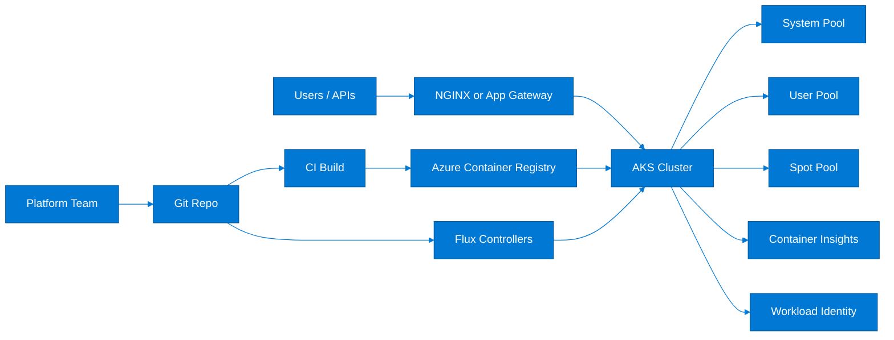
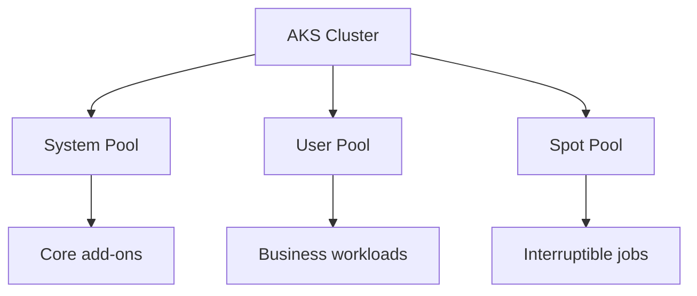
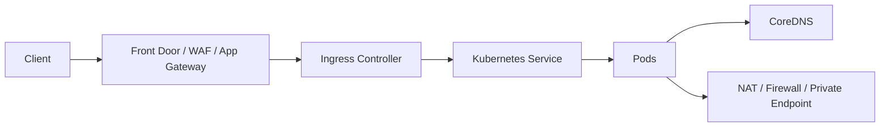
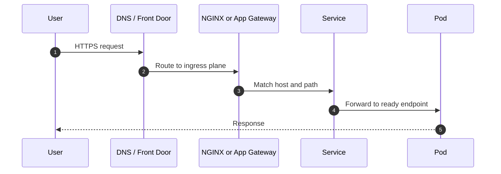
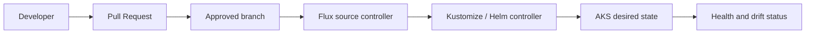

# AKS Deep Dive

> Comprehensive Azure Kubernetes Service field guide covering cluster creation, node pools, networking, ingress, ACR integration, monitoring, security, GitOps, and troubleshooting.

## Table of Contents
- 1. [AKS overview](#1-aks-overview)
- 2. [Reference architecture](#2-reference-architecture)
- 3. [Prerequisites and naming](#3-prerequisites-and-naming)
- 4. [Cluster creation](#4-cluster-creation)
- 5. [Node pools](#5-node-pools)
- 6. [Networking](#6-networking)
- 7. [Ingress controllers](#7-ingress-controllers)
- 8. [Azure Container Registry integration](#8-azure-container-registry-integration)
- 9. [AKS monitoring with Container Insights](#9-aks-monitoring-with-container-insights)
- 10. [AKS security](#10-aks-security)
- 11. [GitOps with Flux](#11-gitops-with-flux)
- 12. [Troubleshooting common AKS issues](#12-troubleshooting-common-aks-issues)
- 13. [Operational best practices](#13-operational-best-practices)
- 14. [Command catalog](#14-command-catalog)
- 15. [Design review prompts](#15-design-review-prompts)
- 16. [Scenario notebook](#16-scenario-notebook)
- 17. [Glossary](#17-glossary)

---

## 1. AKS Overview

- AKS is Microsoft Azure managed Kubernetes service for teams that need Kubernetes APIs without operating the control plane directly.
- It fits platforms that need Helm, CRDs, policy, identity integration, advanced networking, and repeatable workload isolation.
- AKS works best when cluster lifecycle, upgrades, network boundaries, and workload identity patterns are planned early.
- Use it when the application platform truly needs Kubernetes abstractions rather than just containers.

### When AKS is a strong fit
- Multi-service platforms with shared standards and namespace separation.
- Stateful or stateful-adjacent workloads that still benefit from Kubernetes operators and rolling strategies.
- Microservice estates requiring ingress, service discovery, GitOps, HPA, KEDA, or policy controls.
- Teams that need Linux/Windows pools, GPU pools, spot capacity, or zone-aware design.

### When another Azure service may be simpler
- Azure Container Apps for serverless containers and simpler revision-based operations.
- App Service for web apps and APIs that do not need Kubernetes constructs.
- Azure Container Instances for short-lived single container tasks or isolated bursts.

## 2. Reference Architecture



### Architecture decisions that matter early
- **Cluster topology:** Decide between one shared cluster per environment, multiple domain clusters, or region-specific clusters based on blast radius.
- **Identity:** Choose Microsoft Entra integration, Azure RBAC for Kubernetes, and workload identity before platform adoption grows.
- **Networking:** Select kubenet, Azure CNI Overlay, or Azure CNI based on IP space, policy, and enterprise routing needs.
- **Ingress:** Choose between NGINX and Application Gateway based on portability, WAF ownership, and network operating model.
- **Operations:** Treat GitOps, logging, alerts, and upgrade practices as day-one platform concerns, not add-ons.

## 3. Prerequisites and Naming

```bash
export LOCATION=eastus
export RG=rg-aks-deep-dive
export AKS=aks-shasi-prod
export ACR=shasiacrguide123
export VNET=vnet-aks-prod
export AKS_SUBNET=snet-aks
export APPGW_SUBNET=snet-appgw
export LOG_WS=log-aks-prod
export IDENTITY=mi-aks-workload
```

- Prepare Azure CLI, kubectl, kubelogin, Helm, and Terraform before the build starts.
- Validate region quota for vCPU, public IP, load balancer, and route table capacity.
- Reserve address space for nodes, pods, services, ingress, and private endpoints.
- Document tagging, RBAC owner groups, and support responsibilities before cluster creation.

## 4. Cluster Creation

### Portal workflow
1. Create or choose the resource group and target region.
2. Select Kubernetes version, SLA option, node image, and system node count.
3. Enable managed identity, Microsoft Entra integration, OIDC issuer, and workload identity when required.
4. Choose the network model and attach monitoring at creation time.
5. Review tags, maintenance windows, and supportability before deployment.

### Azure CLI workflow
```bash
az group create --name $RG --location $LOCATION
az monitor log-analytics workspace create --resource-group $RG --workspace-name $LOG_WS --location $LOCATION
az network vnet create --resource-group $RG --name $VNET --address-prefixes 10.40.0.0/16 --subnet-name $AKS_SUBNET --subnet-prefixes 10.40.0.0/22
AKS_SUBNET_ID=$(az network vnet subnet show --resource-group $RG --vnet-name $VNET --name $AKS_SUBNET --query id -o tsv)
az aks create --resource-group $RG --name $AKS --node-count 3 --node-vm-size Standard_D4s_v5 --network-plugin azure --vnet-subnet-id $AKS_SUBNET_ID --enable-managed-identity --enable-oidc-issuer --enable-workload-identity --enable-cluster-autoscaler --min-count 3 --max-count 6 --attach-acr $ACR --enable-addons monitoring --generate-ssh-keys
az aks get-credentials --resource-group $RG --name $AKS --overwrite-existing
kubectl get nodes -o wide
```

### Terraform workflow
```hcl
terraform {
  required_providers {
    azurerm = { source = "hashicorp/azurerm", version = "~> 4.0" }
  }
}
provider "azurerm" { features {} }
resource "azurerm_resource_group" "aks" {
  name = "rg-aks-deep-dive"
  location = "eastus"
}
resource "azurerm_kubernetes_cluster" "aks" {
  name                = "aks-shasi-prod"
  location            = azurerm_resource_group.aks.location
  resource_group_name = azurerm_resource_group.aks.name
  dns_prefix          = "aks-shasi-prod"
  default_node_pool {
    name           = "system"
    node_count     = 3
    vm_size        = "Standard_D4s_v5"
    vnet_subnet_id = azurerm_subnet.aks.id
    zones          = ["1", "2", "3"]
  }
  identity { type = "SystemAssigned" }
  network_profile { network_plugin = "azure" }
  oidc_issuer_enabled       = true
  workload_identity_enabled = true
}
```

## 5. Node Pools



### System vs user pools
- Keep a stable system pool for coredns, metrics, CSI, and other critical add-ons.
- Use user pools for applications with distinct SKUs, labels, taints, and autoscale profiles.
- Avoid mixing critical services and interruptible jobs on the same pool whenever possible.

### Spot instances
- Spot pools lower cost but can be evicted at any time.
- Restrict spot usage to stateless and restart-tolerant workloads.
- Combine with PodDisruptionBudgets, retries, and broad spread constraints to absorb interruptions.

### Scaling guidance
- Use cluster autoscaler for node pools and HPA or KEDA for workloads.
- Reserve safe minimum counts for system capacity and latency-sensitive apps.
- Review subnet IP availability alongside autoscaler max counts.

```bash
az aks nodepool add --resource-group $RG --cluster-name $AKS --name userapps --mode User --node-count 2 --node-vm-size Standard_D4s_v5
az aks nodepool add --resource-group $RG --cluster-name $AKS --name spotnp --mode User --priority Spot --eviction-policy Delete --spot-max-price -1 --node-count 1
az aks nodepool update --resource-group $RG --cluster-name $AKS --name userapps --enable-cluster-autoscaler --min-count 2 --max-count 10
kubectl get nodes --show-labels
```

## 6. Networking



| Model | Strengths | Trade-offs | Best fit |
|---|---|---|---|
| kubenet | Lower VNet IP consumption and simpler small deployments | Route management and enterprise networking flexibility are limited | Smaller or less network-complex clusters |
| Azure CNI Overlay | Good IP efficiency and modern AKS networking experience | Requires validating feature support and ops standards | Clusters needing scale without large pod IP consumption |
| Azure CNI | Native VNet integration and strongest network visibility story | Consumes more IP space and increases subnet planning pressure | Enterprise clusters with private networking and policy needs |

### Network policy guidance
- Use Azure or Calico network policies to restrict east-west traffic.
- Start with default deny in sensitive namespaces and document every allowed dependency.
- Test DNS, metrics, and webhook paths before enforcing wide deny rules.


## 7. Ingress Controllers

### NGINX ingress
- Strong Kubernetes-native control with rich annotations and Helm-driven customization.
- Useful when portability and controller flexibility matter more than Azure-native data plane ownership.
- Requires scaling, logging, and WAF adjacency decisions by the platform team.

### Application Gateway ingress
- Uses Azure Application Gateway for the ingress data plane and WAF features.
- Fits enterprises standardizing on Application Gateway with central network ownership.
- Needs subnet planning, certificate governance, and listener ownership conventions.



## 8. Azure Container Registry Integration

- Use `--attach-acr` for a simple managed identity-based pull path between AKS and ACR.
- Prefer registry RBAC and managed identities over admin credentials.
- Adopt retention, replication, and image provenance practices for production supply chains.
- Validate outbound access, private endpoints, and DNS if the registry is isolated from the public network.

```bash
az acr create --resource-group $RG --name $ACR --sku Premium
az aks update --resource-group $RG --name $AKS --attach-acr $ACR
az acr repository list --name $ACR -o table
az aks check-acr --resource-group $RG --name $AKS --acr $ACR.azurecr.io
```

## 9. AKS Monitoring with Container Insights

- Container Insights sends cluster, node, pod, and container telemetry to Log Analytics.
- Pair it with Azure Monitor alerts, workbooks, and optionally managed Prometheus plus Grafana.
- Track restart counts, unschedulable pods, node pressure, image pull failures, and ingress latency.
- Build runbooks from recurring alert patterns rather than relying only on ad hoc portal views.

```kusto
KubePodInventory
| summarize Restarts=sum(ContainerRestartCount) by Namespace, Name
| top 20 by Restarts desc

InsightsMetrics
| where Namespace == "container.azm.ms/kubestate"
| summarize avg(Val) by Name, bin(TimeGenerated, 5m)
```

## 10. AKS Security

### Azure AD / Microsoft Entra integration
- Use Entra integration for centralized auth, group membership, and access review alignment.
- Prefer audited kubectl access through kubelogin rather than static local admin access.

### RBAC
- Use Azure RBAC for Kubernetes or native Kubernetes RBAC with a clearly documented ownership model.
- Scope access to namespaces and cluster roles deliberately; avoid broad admin grants.

### Pod Identity
- Legacy pod identity designs still exist in older estates.
- New designs should plan migration to workload identity because it is simpler and more cloud-native.

### Workload Identity
- Use OIDC federation for pods that access Key Vault, Storage, Service Bus, or other Azure APIs.
- This removes the need for node-level interception components used by older identity models.

### Security checklist
- Protect the API server with private access or authorized IP ranges where appropriate.
- Use Azure Policy for AKS to enforce baseline standards.
- Harden ingress, secret handling, and egress paths before production onboarding.
- Review image source allowlists, node image updates, and workload identity permissions continuously.

## 11. GitOps with Flux



- Store namespaces, Helm releases, policies, ingress, and workload manifests declaratively in Git.
- Use PR-driven promotion between dev, test, and prod instead of manual kubectl changes.
- Treat emergency fixes as follow-up Git commits so cluster state returns to a managed source of truth.

```bash
az aks get-credentials --resource-group $RG --name $AKS --overwrite-existing
flux bootstrap github --owner ShasidharReddy --repository Azure-Cloud-Engineer --branch feature/comprehensive-enhancements --path clusters/prod
flux get all
```

## 12. Troubleshooting Common AKS Issues

| Symptom | Likely cause | First checks | Next action |
|---|---|---|---|
| Nodes NotReady | VMSS, kubelet, network, or upgrade issue | `kubectl get nodes`, `kubectl describe node`, VMSS view | Inspect kubelet health, NSGs, routes, and recent upgrades |
| Pods Pending | Insufficient capacity, taints, PVC wait, or IP exhaustion | `kubectl describe pod`, scheduler events | Scale pool, fix selectors, or resolve storage/network constraints |
| ImagePullBackOff | ACR auth, tag missing, DNS, or egress issue | Pod events, ACR role assignment, DNS and firewall logs | Fix image path, permissions, or outbound access |
| Ingress 502/504 | Backend unhealthy, timeout mismatch, or probe failure | Ingress logs, readiness probes, App Gateway health | Correct probes, certificates, or routing rules |
| Secrets not mounting | CSI issue, Key Vault permission, or identity mapping error | CSI logs, service account, role assignments | Repair workload identity and secret provider config |
| Autoscaler idle | Requests missing, max reached, or pods unschedulable for other reasons | Autoscaler logs and pending pod events | Fix requests, limits, affinities, or max counts |

### Triage sequence
1. Define the blast radius: pod, namespace, pool, ingress plane, or entire cluster.
2. Check whether the issue correlates with a release, policy, upgrade, scale event, or network change.
3. Capture events and logs before making changes that erase evidence.
4. Choose rollback, failover, or scale-out as the fastest safe containment action.
5. Record the final root cause and the guardrail that prevents recurrence.

## 13. Operational Best Practices

- Use separate clusters for at least dev and prod; add pre-prod when cluster changes need dress rehearsals.
- Define upgrade calendars, version support ownership, and maintenance windows up front.
- Use quotas, requests, limits, and namespace ownership to reduce noisy-neighbor effects.
- Measure cost by cluster, node pool, namespace, and team through consistent tagging and observability.
- Keep stateful data protection outside the cluster in the correct Azure service backup model.

## 14. Command Catalog

| Area | Command | Why it matters |
|---|---|---|
| Cluster health | kubectl get nodes && kubectl get pods -A | Fast status view |
| Events | kubectl get events -A --sort-by=.lastTimestamp | tail -50 | Recent failures |
| Ingress | kubectl get ingress -A && kubectl describe ingress <name> -n <ns> | Route inspection |
| Autoscaler | kubectl -n kube-system logs deploy/cluster-autoscaler | Scale debugging |
| Node pools | az aks nodepool list --resource-group $RG --cluster-name $AKS -o table | Pool state |
| Upgrades | az aks get-upgrades --resource-group $RG --name $AKS -o table | Supported versions |
| ACR | az aks check-acr --resource-group $RG --name $AKS --acr $ACR.azurecr.io | Registry validation |

## 15. Design Review Prompts

### Platform
- How many clusters are required and what blast radius is acceptable?
- Which workloads justify dedicated pools or dedicated clusters?
- Who owns upgrades, add-ons, and emergency operations?

### Network
- How is egress controlled?
- Is the API server public, restricted, or private?
- How much IP growth is expected across three years?

### Security
- How is kubectl access approved and reviewed?
- Which workloads still rely on secrets instead of federation?
- Which policies are mandatory with no exemption path?

### Operations
- Which alerts page humans?
- What is the rollback path for ingress and platform changes?
- How is cost reviewed every sprint or month?

## 16. Scenario Notebook

### Blue/green rollout
- Objective: Run parallel deployments, shift traffic deliberately, confirm telemetry, and retire the old slice only after validation.
- Checks: identity, capacity, networking, observability, rollback, and communication.
- Success criteria: workloads remain healthy and drift returns to zero.

### Spot eviction wave
- Objective: Ensure batch jobs retry cleanly and critical replicas stay on regular pools.
- Checks: identity, capacity, networking, observability, rollback, and communication.
- Success criteria: workloads remain healthy and drift returns to zero.

### Private cluster rollout
- Objective: Pre-stage DNS, admin access paths, registry reachability, and automation network access.
- Checks: identity, capacity, networking, observability, rollback, and communication.
- Success criteria: workloads remain healthy and drift returns to zero.

### Registry outage
- Objective: Pause promotions, verify cached images and replication posture, and use controlled rollback plans.
- Checks: identity, capacity, networking, observability, rollback, and communication.
- Success criteria: workloads remain healthy and drift returns to zero.

### Node image refresh
- Objective: Review surge, PDBs, daemonsets, and drain behavior before change windows.
- Checks: identity, capacity, networking, observability, rollback, and communication.
- Success criteria: workloads remain healthy and drift returns to zero.

### Provisioning Field Notes
- Note 1: Validate quota, region support, and policy effects before creation. Review cycle 1.
- Note 2: Store final cluster parameters in Git and IaC immediately after deployment. Review cycle 1.
- Note 3: Review SKU, availability zone, and support window assumptions for each environment. Review cycle 1.
- Note 4: Validate quota, region support, and policy effects before creation. Review cycle 2.
- Note 5: Store final cluster parameters in Git and IaC immediately after deployment. Review cycle 2.
- Note 6: Review SKU, availability zone, and support window assumptions for each environment. Review cycle 2.
- Note 7: Validate quota, region support, and policy effects before creation. Review cycle 3.
- Note 8: Store final cluster parameters in Git and IaC immediately after deployment. Review cycle 3.
- Note 9: Review SKU, availability zone, and support window assumptions for each environment. Review cycle 3.
- Note 10: Validate quota, region support, and policy effects before creation. Review cycle 4.
- Note 11: Store final cluster parameters in Git and IaC immediately after deployment. Review cycle 4.
- Note 12: Review SKU, availability zone, and support window assumptions for each environment. Review cycle 4.
- Note 13: Validate quota, region support, and policy effects before creation. Review cycle 5.
- Note 14: Store final cluster parameters in Git and IaC immediately after deployment. Review cycle 5.
- Note 15: Review SKU, availability zone, and support window assumptions for each environment. Review cycle 5.
- Note 16: Validate quota, region support, and policy effects before creation. Review cycle 6.
- Note 17: Store final cluster parameters in Git and IaC immediately after deployment. Review cycle 6.
- Note 18: Review SKU, availability zone, and support window assumptions for each environment. Review cycle 6.
- Note 19: Validate quota, region support, and policy effects before creation. Review cycle 7.
- Note 20: Store final cluster parameters in Git and IaC immediately after deployment. Review cycle 7.
- Note 21: Review SKU, availability zone, and support window assumptions for each environment. Review cycle 7.
- Note 22: Validate quota, region support, and policy effects before creation. Review cycle 8.
- Note 23: Store final cluster parameters in Git and IaC immediately after deployment. Review cycle 8.
- Note 24: Review SKU, availability zone, and support window assumptions for each environment. Review cycle 8.
- Note 25: Validate quota, region support, and policy effects before creation. Review cycle 9.
- Note 26: Store final cluster parameters in Git and IaC immediately after deployment. Review cycle 9.
- Note 27: Review SKU, availability zone, and support window assumptions for each environment. Review cycle 9.
- Note 28: Validate quota, region support, and policy effects before creation. Review cycle 10.
- Note 29: Store final cluster parameters in Git and IaC immediately after deployment. Review cycle 10.
- Note 30: Review SKU, availability zone, and support window assumptions for each environment. Review cycle 10.
- Note 31: Validate quota, region support, and policy effects before creation. Review cycle 11.
- Note 32: Store final cluster parameters in Git and IaC immediately after deployment. Review cycle 11.
- Note 33: Review SKU, availability zone, and support window assumptions for each environment. Review cycle 11.
- Note 34: Validate quota, region support, and policy effects before creation. Review cycle 12.
- Note 35: Store final cluster parameters in Git and IaC immediately after deployment. Review cycle 12.
- Note 36: Review SKU, availability zone, and support window assumptions for each environment. Review cycle 12.
- Note 37: Validate quota, region support, and policy effects before creation. Review cycle 13.
- Note 38: Store final cluster parameters in Git and IaC immediately after deployment. Review cycle 13.
- Note 39: Review SKU, availability zone, and support window assumptions for each environment. Review cycle 13.
- Note 40: Validate quota, region support, and policy effects before creation. Review cycle 14.
- Note 41: Store final cluster parameters in Git and IaC immediately after deployment. Review cycle 14.
- Note 42: Review SKU, availability zone, and support window assumptions for each environment. Review cycle 14.
- Note 43: Validate quota, region support, and policy effects before creation. Review cycle 15.
- Note 44: Store final cluster parameters in Git and IaC immediately after deployment. Review cycle 15.
- Note 45: Review SKU, availability zone, and support window assumptions for each environment. Review cycle 15.
- Note 46: Validate quota, region support, and policy effects before creation. Review cycle 16.
- Note 47: Store final cluster parameters in Git and IaC immediately after deployment. Review cycle 16.
- Note 48: Review SKU, availability zone, and support window assumptions for each environment. Review cycle 16.
- Note 49: Validate quota, region support, and policy effects before creation. Review cycle 17.
- Note 50: Store final cluster parameters in Git and IaC immediately after deployment. Review cycle 17.
- Note 51: Review SKU, availability zone, and support window assumptions for each environment. Review cycle 17.
- Note 52: Validate quota, region support, and policy effects before creation. Review cycle 18.
- Note 53: Store final cluster parameters in Git and IaC immediately after deployment. Review cycle 18.
- Note 54: Review SKU, availability zone, and support window assumptions for each environment. Review cycle 18.
- Note 55: Validate quota, region support, and policy effects before creation. Review cycle 19.
- Note 56: Store final cluster parameters in Git and IaC immediately after deployment. Review cycle 19.
- Note 57: Review SKU, availability zone, and support window assumptions for each environment. Review cycle 19.
- Note 58: Validate quota, region support, and policy effects before creation. Review cycle 20.
- Note 59: Store final cluster parameters in Git and IaC immediately after deployment. Review cycle 20.
- Note 60: Review SKU, availability zone, and support window assumptions for each environment. Review cycle 20.
- Note 61: Validate quota, region support, and policy effects before creation. Review cycle 21.
- Note 62: Store final cluster parameters in Git and IaC immediately after deployment. Review cycle 21.
- Note 63: Review SKU, availability zone, and support window assumptions for each environment. Review cycle 21.
- Note 64: Validate quota, region support, and policy effects before creation. Review cycle 22.
- Note 65: Store final cluster parameters in Git and IaC immediately after deployment. Review cycle 22.
- Note 66: Review SKU, availability zone, and support window assumptions for each environment. Review cycle 22.
- Note 67: Validate quota, region support, and policy effects before creation. Review cycle 23.
- Note 68: Store final cluster parameters in Git and IaC immediately after deployment. Review cycle 23.
- Note 69: Review SKU, availability zone, and support window assumptions for each environment. Review cycle 23.
- Note 70: Validate quota, region support, and policy effects before creation. Review cycle 24.
- Note 71: Store final cluster parameters in Git and IaC immediately after deployment. Review cycle 24.
- Note 72: Review SKU, availability zone, and support window assumptions for each environment. Review cycle 24.
- Note 73: Validate quota, region support, and policy effects before creation. Review cycle 25.
- Note 74: Store final cluster parameters in Git and IaC immediately after deployment. Review cycle 25.
- Note 75: Review SKU, availability zone, and support window assumptions for each environment. Review cycle 25.
- Note 76: Validate quota, region support, and policy effects before creation. Review cycle 26.
- Note 77: Store final cluster parameters in Git and IaC immediately after deployment. Review cycle 26.
- Note 78: Review SKU, availability zone, and support window assumptions for each environment. Review cycle 26.
- Note 79: Validate quota, region support, and policy effects before creation. Review cycle 27.
- Note 80: Store final cluster parameters in Git and IaC immediately after deployment. Review cycle 27.
- Note 81: Review SKU, availability zone, and support window assumptions for each environment. Review cycle 27.
- Note 82: Validate quota, region support, and policy effects before creation. Review cycle 28.
- Note 83: Store final cluster parameters in Git and IaC immediately after deployment. Review cycle 28.
- Note 84: Review SKU, availability zone, and support window assumptions for each environment. Review cycle 28.
- Note 85: Validate quota, region support, and policy effects before creation. Review cycle 29.
- Note 86: Store final cluster parameters in Git and IaC immediately after deployment. Review cycle 29.
- Note 87: Review SKU, availability zone, and support window assumptions for each environment. Review cycle 29.
- Note 88: Validate quota, region support, and policy effects before creation. Review cycle 30.
- Note 89: Store final cluster parameters in Git and IaC immediately after deployment. Review cycle 30.
- Note 90: Review SKU, availability zone, and support window assumptions for each environment. Review cycle 30.
- Note 91: Validate quota, region support, and policy effects before creation. Review cycle 31.
- Note 92: Store final cluster parameters in Git and IaC immediately after deployment. Review cycle 31.
- Note 93: Review SKU, availability zone, and support window assumptions for each environment. Review cycle 31.
- Note 94: Validate quota, region support, and policy effects before creation. Review cycle 32.
- Note 95: Store final cluster parameters in Git and IaC immediately after deployment. Review cycle 32.
- Note 96: Review SKU, availability zone, and support window assumptions for each environment. Review cycle 32.
- Note 97: Validate quota, region support, and policy effects before creation. Review cycle 33.
- Note 98: Store final cluster parameters in Git and IaC immediately after deployment. Review cycle 33.
- Note 99: Review SKU, availability zone, and support window assumptions for each environment. Review cycle 33.
- Note 100: Validate quota, region support, and policy effects before creation. Review cycle 34.
- Note 101: Store final cluster parameters in Git and IaC immediately after deployment. Review cycle 34.
- Note 102: Review SKU, availability zone, and support window assumptions for each environment. Review cycle 34.
- Note 103: Validate quota, region support, and policy effects before creation. Review cycle 35.
- Note 104: Store final cluster parameters in Git and IaC immediately after deployment. Review cycle 35.
- Note 105: Review SKU, availability zone, and support window assumptions for each environment. Review cycle 35.
- Note 106: Validate quota, region support, and policy effects before creation. Review cycle 36.
- Note 107: Store final cluster parameters in Git and IaC immediately after deployment. Review cycle 36.
- Note 108: Review SKU, availability zone, and support window assumptions for each environment. Review cycle 36.
- Note 109: Validate quota, region support, and policy effects before creation. Review cycle 37.
- Note 110: Store final cluster parameters in Git and IaC immediately after deployment. Review cycle 37.
- Note 111: Review SKU, availability zone, and support window assumptions for each environment. Review cycle 37.
- Note 112: Validate quota, region support, and policy effects before creation. Review cycle 38.
- Note 113: Store final cluster parameters in Git and IaC immediately after deployment. Review cycle 38.
- Note 114: Review SKU, availability zone, and support window assumptions for each environment. Review cycle 38.
- Note 115: Validate quota, region support, and policy effects before creation. Review cycle 39.
- Note 116: Store final cluster parameters in Git and IaC immediately after deployment. Review cycle 39.
- Note 117: Review SKU, availability zone, and support window assumptions for each environment. Review cycle 39.
- Note 118: Validate quota, region support, and policy effects before creation. Review cycle 40.
- Note 119: Store final cluster parameters in Git and IaC immediately after deployment. Review cycle 40.
- Note 120: Review SKU, availability zone, and support window assumptions for each environment. Review cycle 40.
- Note 121: Validate quota, region support, and policy effects before creation. Review cycle 41.
- Note 122: Store final cluster parameters in Git and IaC immediately after deployment. Review cycle 41.
- Note 123: Review SKU, availability zone, and support window assumptions for each environment. Review cycle 41.
- Note 124: Validate quota, region support, and policy effects before creation. Review cycle 42.
- Note 125: Store final cluster parameters in Git and IaC immediately after deployment. Review cycle 42.
- Note 126: Review SKU, availability zone, and support window assumptions for each environment. Review cycle 42.
- Note 127: Validate quota, region support, and policy effects before creation. Review cycle 43.
- Note 128: Store final cluster parameters in Git and IaC immediately after deployment. Review cycle 43.
- Note 129: Review SKU, availability zone, and support window assumptions for each environment. Review cycle 43.
- Note 130: Validate quota, region support, and policy effects before creation. Review cycle 44.
- Note 131: Store final cluster parameters in Git and IaC immediately after deployment. Review cycle 44.
- Note 132: Review SKU, availability zone, and support window assumptions for each environment. Review cycle 44.
- Note 133: Validate quota, region support, and policy effects before creation. Review cycle 45.
- Note 134: Store final cluster parameters in Git and IaC immediately after deployment. Review cycle 45.
- Note 135: Review SKU, availability zone, and support window assumptions for each environment. Review cycle 45.
- Note 136: Validate quota, region support, and policy effects before creation. Review cycle 46.
- Note 137: Store final cluster parameters in Git and IaC immediately after deployment. Review cycle 46.
- Note 138: Review SKU, availability zone, and support window assumptions for each environment. Review cycle 46.
- Note 139: Validate quota, region support, and policy effects before creation. Review cycle 47.
- Note 140: Store final cluster parameters in Git and IaC immediately after deployment. Review cycle 47.
- Note 141: Review SKU, availability zone, and support window assumptions for each environment. Review cycle 47.
- Note 142: Validate quota, region support, and policy effects before creation. Review cycle 48.
- Note 143: Store final cluster parameters in Git and IaC immediately after deployment. Review cycle 48.
- Note 144: Review SKU, availability zone, and support window assumptions for each environment. Review cycle 48.
- Note 145: Validate quota, region support, and policy effects before creation. Review cycle 49.
- Note 146: Store final cluster parameters in Git and IaC immediately after deployment. Review cycle 49.
- Note 147: Review SKU, availability zone, and support window assumptions for each environment. Review cycle 49.
- Note 148: Validate quota, region support, and policy effects before creation. Review cycle 50.
- Note 149: Store final cluster parameters in Git and IaC immediately after deployment. Review cycle 50.
- Note 150: Review SKU, availability zone, and support window assumptions for each environment. Review cycle 50.
- Note 151: Validate quota, region support, and policy effects before creation. Review cycle 51.
- Note 152: Store final cluster parameters in Git and IaC immediately after deployment. Review cycle 51.
- Note 153: Review SKU, availability zone, and support window assumptions for each environment. Review cycle 51.
- Note 154: Validate quota, region support, and policy effects before creation. Review cycle 52.
- Note 155: Store final cluster parameters in Git and IaC immediately after deployment. Review cycle 52.
- Note 156: Review SKU, availability zone, and support window assumptions for each environment. Review cycle 52.
- Note 157: Validate quota, region support, and policy effects before creation. Review cycle 53.
- Note 158: Store final cluster parameters in Git and IaC immediately after deployment. Review cycle 53.
- Note 159: Review SKU, availability zone, and support window assumptions for each environment. Review cycle 53.
- Note 160: Validate quota, region support, and policy effects before creation. Review cycle 54.
- Note 161: Store final cluster parameters in Git and IaC immediately after deployment. Review cycle 54.
- Note 162: Review SKU, availability zone, and support window assumptions for each environment. Review cycle 54.
- Note 163: Validate quota, region support, and policy effects before creation. Review cycle 55.
- Note 164: Store final cluster parameters in Git and IaC immediately after deployment. Review cycle 55.
- Note 165: Review SKU, availability zone, and support window assumptions for each environment. Review cycle 55.
- Note 166: Validate quota, region support, and policy effects before creation. Review cycle 56.
- Note 167: Store final cluster parameters in Git and IaC immediately after deployment. Review cycle 56.
- Note 168: Review SKU, availability zone, and support window assumptions for each environment. Review cycle 56.
- Note 169: Validate quota, region support, and policy effects before creation. Review cycle 57.
- Note 170: Store final cluster parameters in Git and IaC immediately after deployment. Review cycle 57.
- Note 171: Review SKU, availability zone, and support window assumptions for each environment. Review cycle 57.
- Note 172: Validate quota, region support, and policy effects before creation. Review cycle 58.
- Note 173: Store final cluster parameters in Git and IaC immediately after deployment. Review cycle 58.
- Note 174: Review SKU, availability zone, and support window assumptions for each environment. Review cycle 58.
- Note 175: Validate quota, region support, and policy effects before creation. Review cycle 59.
- Note 176: Store final cluster parameters in Git and IaC immediately after deployment. Review cycle 59.
- Note 177: Review SKU, availability zone, and support window assumptions for each environment. Review cycle 59.
- Note 178: Validate quota, region support, and policy effects before creation. Review cycle 60.
- Note 179: Store final cluster parameters in Git and IaC immediately after deployment. Review cycle 60.
- Note 180: Review SKU, availability zone, and support window assumptions for each environment. Review cycle 60.
- Note 181: Validate quota, region support, and policy effects before creation. Review cycle 61.
- Note 182: Store final cluster parameters in Git and IaC immediately after deployment. Review cycle 61.
- Note 183: Review SKU, availability zone, and support window assumptions for each environment. Review cycle 61.
- Note 184: Validate quota, region support, and policy effects before creation. Review cycle 62.
- Note 185: Store final cluster parameters in Git and IaC immediately after deployment. Review cycle 62.
- Note 186: Review SKU, availability zone, and support window assumptions for each environment. Review cycle 62.
- Note 187: Validate quota, region support, and policy effects before creation. Review cycle 63.
- Note 188: Store final cluster parameters in Git and IaC immediately after deployment. Review cycle 63.
- Note 189: Review SKU, availability zone, and support window assumptions for each environment. Review cycle 63.
- Note 190: Validate quota, region support, and policy effects before creation. Review cycle 64.
- Note 191: Store final cluster parameters in Git and IaC immediately after deployment. Review cycle 64.
- Note 192: Review SKU, availability zone, and support window assumptions for each environment. Review cycle 64.
- Note 193: Validate quota, region support, and policy effects before creation. Review cycle 65.
- Note 194: Store final cluster parameters in Git and IaC immediately after deployment. Review cycle 65.
- Note 195: Review SKU, availability zone, and support window assumptions for each environment. Review cycle 65.
- Note 196: Validate quota, region support, and policy effects before creation. Review cycle 66.
- Note 197: Store final cluster parameters in Git and IaC immediately after deployment. Review cycle 66.
- Note 198: Review SKU, availability zone, and support window assumptions for each environment. Review cycle 66.
- Note 199: Validate quota, region support, and policy effects before creation. Review cycle 67.
- Note 200: Store final cluster parameters in Git and IaC immediately after deployment. Review cycle 67.
- Note 201: Review SKU, availability zone, and support window assumptions for each environment. Review cycle 67.
- Note 202: Validate quota, region support, and policy effects before creation. Review cycle 68.
- Note 203: Store final cluster parameters in Git and IaC immediately after deployment. Review cycle 68.
- Note 204: Review SKU, availability zone, and support window assumptions for each environment. Review cycle 68.
- Note 205: Validate quota, region support, and policy effects before creation. Review cycle 69.
- Note 206: Store final cluster parameters in Git and IaC immediately after deployment. Review cycle 69.
- Note 207: Review SKU, availability zone, and support window assumptions for each environment. Review cycle 69.
- Note 208: Validate quota, region support, and policy effects before creation. Review cycle 70.
- Note 209: Store final cluster parameters in Git and IaC immediately after deployment. Review cycle 70.
- Note 210: Review SKU, availability zone, and support window assumptions for each environment. Review cycle 70.

### Node pools Field Notes
- Note 211: Track taints, labels, autoscale ranges, and max pods for every pool. Review cycle 1.
- Note 212: Separate critical add-ons from batch or CI workloads. Review cycle 1.
- Note 213: Measure subnet capacity before raising autoscaler ceilings. Review cycle 1.
- Note 214: Track taints, labels, autoscale ranges, and max pods for every pool. Review cycle 2.
- Note 215: Separate critical add-ons from batch or CI workloads. Review cycle 2.
- Note 216: Measure subnet capacity before raising autoscaler ceilings. Review cycle 2.
- Note 217: Track taints, labels, autoscale ranges, and max pods for every pool. Review cycle 3.
- Note 218: Separate critical add-ons from batch or CI workloads. Review cycle 3.
- Note 219: Measure subnet capacity before raising autoscaler ceilings. Review cycle 3.
- Note 220: Track taints, labels, autoscale ranges, and max pods for every pool. Review cycle 4.
- Note 221: Separate critical add-ons from batch or CI workloads. Review cycle 4.
- Note 222: Measure subnet capacity before raising autoscaler ceilings. Review cycle 4.
- Note 223: Track taints, labels, autoscale ranges, and max pods for every pool. Review cycle 5.
- Note 224: Separate critical add-ons from batch or CI workloads. Review cycle 5.
- Note 225: Measure subnet capacity before raising autoscaler ceilings. Review cycle 5.
- Note 226: Track taints, labels, autoscale ranges, and max pods for every pool. Review cycle 6.
- Note 227: Separate critical add-ons from batch or CI workloads. Review cycle 6.
- Note 228: Measure subnet capacity before raising autoscaler ceilings. Review cycle 6.
- Note 229: Track taints, labels, autoscale ranges, and max pods for every pool. Review cycle 7.
- Note 230: Separate critical add-ons from batch or CI workloads. Review cycle 7.
- Note 231: Measure subnet capacity before raising autoscaler ceilings. Review cycle 7.
- Note 232: Track taints, labels, autoscale ranges, and max pods for every pool. Review cycle 8.
- Note 233: Separate critical add-ons from batch or CI workloads. Review cycle 8.
- Note 234: Measure subnet capacity before raising autoscaler ceilings. Review cycle 8.
- Note 235: Track taints, labels, autoscale ranges, and max pods for every pool. Review cycle 9.
- Note 236: Separate critical add-ons from batch or CI workloads. Review cycle 9.
- Note 237: Measure subnet capacity before raising autoscaler ceilings. Review cycle 9.
- Note 238: Track taints, labels, autoscale ranges, and max pods for every pool. Review cycle 10.
- Note 239: Separate critical add-ons from batch or CI workloads. Review cycle 10.
- Note 240: Measure subnet capacity before raising autoscaler ceilings. Review cycle 10.
- Note 241: Track taints, labels, autoscale ranges, and max pods for every pool. Review cycle 11.
- Note 242: Separate critical add-ons from batch or CI workloads. Review cycle 11.
- Note 243: Measure subnet capacity before raising autoscaler ceilings. Review cycle 11.
- Note 244: Track taints, labels, autoscale ranges, and max pods for every pool. Review cycle 12.
- Note 245: Separate critical add-ons from batch or CI workloads. Review cycle 12.
- Note 246: Measure subnet capacity before raising autoscaler ceilings. Review cycle 12.
- Note 247: Track taints, labels, autoscale ranges, and max pods for every pool. Review cycle 13.
- Note 248: Separate critical add-ons from batch or CI workloads. Review cycle 13.
- Note 249: Measure subnet capacity before raising autoscaler ceilings. Review cycle 13.
- Note 250: Track taints, labels, autoscale ranges, and max pods for every pool. Review cycle 14.
- Note 251: Separate critical add-ons from batch or CI workloads. Review cycle 14.
- Note 252: Measure subnet capacity before raising autoscaler ceilings. Review cycle 14.
- Note 253: Track taints, labels, autoscale ranges, and max pods for every pool. Review cycle 15.
- Note 254: Separate critical add-ons from batch or CI workloads. Review cycle 15.
- Note 255: Measure subnet capacity before raising autoscaler ceilings. Review cycle 15.
- Note 256: Track taints, labels, autoscale ranges, and max pods for every pool. Review cycle 16.
- Note 257: Separate critical add-ons from batch or CI workloads. Review cycle 16.
- Note 258: Measure subnet capacity before raising autoscaler ceilings. Review cycle 16.
- Note 259: Track taints, labels, autoscale ranges, and max pods for every pool. Review cycle 17.
- Note 260: Separate critical add-ons from batch or CI workloads. Review cycle 17.
- Note 261: Measure subnet capacity before raising autoscaler ceilings. Review cycle 17.
- Note 262: Track taints, labels, autoscale ranges, and max pods for every pool. Review cycle 18.
- Note 263: Separate critical add-ons from batch or CI workloads. Review cycle 18.
- Note 264: Measure subnet capacity before raising autoscaler ceilings. Review cycle 18.
- Note 265: Track taints, labels, autoscale ranges, and max pods for every pool. Review cycle 19.
- Note 266: Separate critical add-ons from batch or CI workloads. Review cycle 19.
- Note 267: Measure subnet capacity before raising autoscaler ceilings. Review cycle 19.
- Note 268: Track taints, labels, autoscale ranges, and max pods for every pool. Review cycle 20.
- Note 269: Separate critical add-ons from batch or CI workloads. Review cycle 20.
- Note 270: Measure subnet capacity before raising autoscaler ceilings. Review cycle 20.
- Note 271: Track taints, labels, autoscale ranges, and max pods for every pool. Review cycle 21.
- Note 272: Separate critical add-ons from batch or CI workloads. Review cycle 21.
- Note 273: Measure subnet capacity before raising autoscaler ceilings. Review cycle 21.
- Note 274: Track taints, labels, autoscale ranges, and max pods for every pool. Review cycle 22.
- Note 275: Separate critical add-ons from batch or CI workloads. Review cycle 22.
- Note 276: Measure subnet capacity before raising autoscaler ceilings. Review cycle 22.
- Note 277: Track taints, labels, autoscale ranges, and max pods for every pool. Review cycle 23.
- Note 278: Separate critical add-ons from batch or CI workloads. Review cycle 23.
- Note 279: Measure subnet capacity before raising autoscaler ceilings. Review cycle 23.
- Note 280: Track taints, labels, autoscale ranges, and max pods for every pool. Review cycle 24.
- Note 281: Separate critical add-ons from batch or CI workloads. Review cycle 24.
- Note 282: Measure subnet capacity before raising autoscaler ceilings. Review cycle 24.
- Note 283: Track taints, labels, autoscale ranges, and max pods for every pool. Review cycle 25.
- Note 284: Separate critical add-ons from batch or CI workloads. Review cycle 25.
- Note 285: Measure subnet capacity before raising autoscaler ceilings. Review cycle 25.
- Note 286: Track taints, labels, autoscale ranges, and max pods for every pool. Review cycle 26.
- Note 287: Separate critical add-ons from batch or CI workloads. Review cycle 26.
- Note 288: Measure subnet capacity before raising autoscaler ceilings. Review cycle 26.
- Note 289: Track taints, labels, autoscale ranges, and max pods for every pool. Review cycle 27.
- Note 290: Separate critical add-ons from batch or CI workloads. Review cycle 27.
- Note 291: Measure subnet capacity before raising autoscaler ceilings. Review cycle 27.
- Note 292: Track taints, labels, autoscale ranges, and max pods for every pool. Review cycle 28.
- Note 293: Separate critical add-ons from batch or CI workloads. Review cycle 28.
- Note 294: Measure subnet capacity before raising autoscaler ceilings. Review cycle 28.
- Note 295: Track taints, labels, autoscale ranges, and max pods for every pool. Review cycle 29.
- Note 296: Separate critical add-ons from batch or CI workloads. Review cycle 29.
- Note 297: Measure subnet capacity before raising autoscaler ceilings. Review cycle 29.
- Note 298: Track taints, labels, autoscale ranges, and max pods for every pool. Review cycle 30.
- Note 299: Separate critical add-ons from batch or CI workloads. Review cycle 30.
- Note 300: Measure subnet capacity before raising autoscaler ceilings. Review cycle 30.
- Note 301: Track taints, labels, autoscale ranges, and max pods for every pool. Review cycle 31.
- Note 302: Separate critical add-ons from batch or CI workloads. Review cycle 31.
- Note 303: Measure subnet capacity before raising autoscaler ceilings. Review cycle 31.
- Note 304: Track taints, labels, autoscale ranges, and max pods for every pool. Review cycle 32.
- Note 305: Separate critical add-ons from batch or CI workloads. Review cycle 32.
- Note 306: Measure subnet capacity before raising autoscaler ceilings. Review cycle 32.
- Note 307: Track taints, labels, autoscale ranges, and max pods for every pool. Review cycle 33.
- Note 308: Separate critical add-ons from batch or CI workloads. Review cycle 33.
- Note 309: Measure subnet capacity before raising autoscaler ceilings. Review cycle 33.
- Note 310: Track taints, labels, autoscale ranges, and max pods for every pool. Review cycle 34.
- Note 311: Separate critical add-ons from batch or CI workloads. Review cycle 34.
- Note 312: Measure subnet capacity before raising autoscaler ceilings. Review cycle 34.
- Note 313: Track taints, labels, autoscale ranges, and max pods for every pool. Review cycle 35.
- Note 314: Separate critical add-ons from batch or CI workloads. Review cycle 35.
- Note 315: Measure subnet capacity before raising autoscaler ceilings. Review cycle 35.
- Note 316: Track taints, labels, autoscale ranges, and max pods for every pool. Review cycle 36.
- Note 317: Separate critical add-ons from batch or CI workloads. Review cycle 36.
- Note 318: Measure subnet capacity before raising autoscaler ceilings. Review cycle 36.
- Note 319: Track taints, labels, autoscale ranges, and max pods for every pool. Review cycle 37.
- Note 320: Separate critical add-ons from batch or CI workloads. Review cycle 37.
- Note 321: Measure subnet capacity before raising autoscaler ceilings. Review cycle 37.
- Note 322: Track taints, labels, autoscale ranges, and max pods for every pool. Review cycle 38.
- Note 323: Separate critical add-ons from batch or CI workloads. Review cycle 38.
- Note 324: Measure subnet capacity before raising autoscaler ceilings. Review cycle 38.
- Note 325: Track taints, labels, autoscale ranges, and max pods for every pool. Review cycle 39.
- Note 326: Separate critical add-ons from batch or CI workloads. Review cycle 39.
- Note 327: Measure subnet capacity before raising autoscaler ceilings. Review cycle 39.
- Note 328: Track taints, labels, autoscale ranges, and max pods for every pool. Review cycle 40.
- Note 329: Separate critical add-ons from batch or CI workloads. Review cycle 40.
- Note 330: Measure subnet capacity before raising autoscaler ceilings. Review cycle 40.
- Note 331: Track taints, labels, autoscale ranges, and max pods for every pool. Review cycle 41.
- Note 332: Separate critical add-ons from batch or CI workloads. Review cycle 41.
- Note 333: Measure subnet capacity before raising autoscaler ceilings. Review cycle 41.
- Note 334: Track taints, labels, autoscale ranges, and max pods for every pool. Review cycle 42.
- Note 335: Separate critical add-ons from batch or CI workloads. Review cycle 42.
- Note 336: Measure subnet capacity before raising autoscaler ceilings. Review cycle 42.
- Note 337: Track taints, labels, autoscale ranges, and max pods for every pool. Review cycle 43.
- Note 338: Separate critical add-ons from batch or CI workloads. Review cycle 43.
- Note 339: Measure subnet capacity before raising autoscaler ceilings. Review cycle 43.
- Note 340: Track taints, labels, autoscale ranges, and max pods for every pool. Review cycle 44.
- Note 341: Separate critical add-ons from batch or CI workloads. Review cycle 44.
- Note 342: Measure subnet capacity before raising autoscaler ceilings. Review cycle 44.
- Note 343: Track taints, labels, autoscale ranges, and max pods for every pool. Review cycle 45.
- Note 344: Separate critical add-ons from batch or CI workloads. Review cycle 45.
- Note 345: Measure subnet capacity before raising autoscaler ceilings. Review cycle 45.
- Note 346: Track taints, labels, autoscale ranges, and max pods for every pool. Review cycle 46.
- Note 347: Separate critical add-ons from batch or CI workloads. Review cycle 46.
- Note 348: Measure subnet capacity before raising autoscaler ceilings. Review cycle 46.
- Note 349: Track taints, labels, autoscale ranges, and max pods for every pool. Review cycle 47.
- Note 350: Separate critical add-ons from batch or CI workloads. Review cycle 47.
- Note 351: Measure subnet capacity before raising autoscaler ceilings. Review cycle 47.
- Note 352: Track taints, labels, autoscale ranges, and max pods for every pool. Review cycle 48.
- Note 353: Separate critical add-ons from batch or CI workloads. Review cycle 48.
- Note 354: Measure subnet capacity before raising autoscaler ceilings. Review cycle 48.
- Note 355: Track taints, labels, autoscale ranges, and max pods for every pool. Review cycle 49.
- Note 356: Separate critical add-ons from batch or CI workloads. Review cycle 49.
- Note 357: Measure subnet capacity before raising autoscaler ceilings. Review cycle 49.
- Note 358: Track taints, labels, autoscale ranges, and max pods for every pool. Review cycle 50.
- Note 359: Separate critical add-ons from batch or CI workloads. Review cycle 50.
- Note 360: Measure subnet capacity before raising autoscaler ceilings. Review cycle 50.
- Note 361: Track taints, labels, autoscale ranges, and max pods for every pool. Review cycle 51.
- Note 362: Separate critical add-ons from batch or CI workloads. Review cycle 51.
- Note 363: Measure subnet capacity before raising autoscaler ceilings. Review cycle 51.
- Note 364: Track taints, labels, autoscale ranges, and max pods for every pool. Review cycle 52.
- Note 365: Separate critical add-ons from batch or CI workloads. Review cycle 52.
- Note 366: Measure subnet capacity before raising autoscaler ceilings. Review cycle 52.
- Note 367: Track taints, labels, autoscale ranges, and max pods for every pool. Review cycle 53.
- Note 368: Separate critical add-ons from batch or CI workloads. Review cycle 53.
- Note 369: Measure subnet capacity before raising autoscaler ceilings. Review cycle 53.
- Note 370: Track taints, labels, autoscale ranges, and max pods for every pool. Review cycle 54.
- Note 371: Separate critical add-ons from batch or CI workloads. Review cycle 54.
- Note 372: Measure subnet capacity before raising autoscaler ceilings. Review cycle 54.
- Note 373: Track taints, labels, autoscale ranges, and max pods for every pool. Review cycle 55.
- Note 374: Separate critical add-ons from batch or CI workloads. Review cycle 55.
- Note 375: Measure subnet capacity before raising autoscaler ceilings. Review cycle 55.
- Note 376: Track taints, labels, autoscale ranges, and max pods for every pool. Review cycle 56.
- Note 377: Separate critical add-ons from batch or CI workloads. Review cycle 56.
- Note 378: Measure subnet capacity before raising autoscaler ceilings. Review cycle 56.
- Note 379: Track taints, labels, autoscale ranges, and max pods for every pool. Review cycle 57.
- Note 380: Separate critical add-ons from batch or CI workloads. Review cycle 57.
- Note 381: Measure subnet capacity before raising autoscaler ceilings. Review cycle 57.
- Note 382: Track taints, labels, autoscale ranges, and max pods for every pool. Review cycle 58.
- Note 383: Separate critical add-ons from batch or CI workloads. Review cycle 58.
- Note 384: Measure subnet capacity before raising autoscaler ceilings. Review cycle 58.
- Note 385: Track taints, labels, autoscale ranges, and max pods for every pool. Review cycle 59.
- Note 386: Separate critical add-ons from batch or CI workloads. Review cycle 59.
- Note 387: Measure subnet capacity before raising autoscaler ceilings. Review cycle 59.
- Note 388: Track taints, labels, autoscale ranges, and max pods for every pool. Review cycle 60.
- Note 389: Separate critical add-ons from batch or CI workloads. Review cycle 60.
- Note 390: Measure subnet capacity before raising autoscaler ceilings. Review cycle 60.
- Note 391: Track taints, labels, autoscale ranges, and max pods for every pool. Review cycle 61.
- Note 392: Separate critical add-ons from batch or CI workloads. Review cycle 61.
- Note 393: Measure subnet capacity before raising autoscaler ceilings. Review cycle 61.
- Note 394: Track taints, labels, autoscale ranges, and max pods for every pool. Review cycle 62.
- Note 395: Separate critical add-ons from batch or CI workloads. Review cycle 62.
- Note 396: Measure subnet capacity before raising autoscaler ceilings. Review cycle 62.
- Note 397: Track taints, labels, autoscale ranges, and max pods for every pool. Review cycle 63.
- Note 398: Separate critical add-ons from batch or CI workloads. Review cycle 63.
- Note 399: Measure subnet capacity before raising autoscaler ceilings. Review cycle 63.
- Note 400: Track taints, labels, autoscale ranges, and max pods for every pool. Review cycle 64.
- Note 401: Separate critical add-ons from batch or CI workloads. Review cycle 64.
- Note 402: Measure subnet capacity before raising autoscaler ceilings. Review cycle 64.
- Note 403: Track taints, labels, autoscale ranges, and max pods for every pool. Review cycle 65.
- Note 404: Separate critical add-ons from batch or CI workloads. Review cycle 65.
- Note 405: Measure subnet capacity before raising autoscaler ceilings. Review cycle 65.
- Note 406: Track taints, labels, autoscale ranges, and max pods for every pool. Review cycle 66.
- Note 407: Separate critical add-ons from batch or CI workloads. Review cycle 66.
- Note 408: Measure subnet capacity before raising autoscaler ceilings. Review cycle 66.
- Note 409: Track taints, labels, autoscale ranges, and max pods for every pool. Review cycle 67.
- Note 410: Separate critical add-ons from batch or CI workloads. Review cycle 67.
- Note 411: Measure subnet capacity before raising autoscaler ceilings. Review cycle 67.
- Note 412: Track taints, labels, autoscale ranges, and max pods for every pool. Review cycle 68.
- Note 413: Separate critical add-ons from batch or CI workloads. Review cycle 68.
- Note 414: Measure subnet capacity before raising autoscaler ceilings. Review cycle 68.
- Note 415: Track taints, labels, autoscale ranges, and max pods for every pool. Review cycle 69.
- Note 416: Separate critical add-ons from batch or CI workloads. Review cycle 69.
- Note 417: Measure subnet capacity before raising autoscaler ceilings. Review cycle 69.
- Note 418: Track taints, labels, autoscale ranges, and max pods for every pool. Review cycle 70.
- Note 419: Separate critical add-ons from batch or CI workloads. Review cycle 70.
- Note 420: Measure subnet capacity before raising autoscaler ceilings. Review cycle 70.

### Networking Field Notes
- Note 421: Document required DNS, webhook, package mirror, and Azure API dependencies. Review cycle 1.
- Note 422: Retest ingress, outbound, and private endpoint resolution after each platform change. Review cycle 1.
- Note 423: Review route tables, firewall rules, and NAT behavior with the network team. Review cycle 1.
- Note 424: Document required DNS, webhook, package mirror, and Azure API dependencies. Review cycle 2.
- Note 425: Retest ingress, outbound, and private endpoint resolution after each platform change. Review cycle 2.
- Note 426: Review route tables, firewall rules, and NAT behavior with the network team. Review cycle 2.
- Note 427: Document required DNS, webhook, package mirror, and Azure API dependencies. Review cycle 3.
- Note 428: Retest ingress, outbound, and private endpoint resolution after each platform change. Review cycle 3.
- Note 429: Review route tables, firewall rules, and NAT behavior with the network team. Review cycle 3.
- Note 430: Document required DNS, webhook, package mirror, and Azure API dependencies. Review cycle 4.
- Note 431: Retest ingress, outbound, and private endpoint resolution after each platform change. Review cycle 4.
- Note 432: Review route tables, firewall rules, and NAT behavior with the network team. Review cycle 4.
- Note 433: Document required DNS, webhook, package mirror, and Azure API dependencies. Review cycle 5.
- Note 434: Retest ingress, outbound, and private endpoint resolution after each platform change. Review cycle 5.
- Note 435: Review route tables, firewall rules, and NAT behavior with the network team. Review cycle 5.
- Note 436: Document required DNS, webhook, package mirror, and Azure API dependencies. Review cycle 6.
- Note 437: Retest ingress, outbound, and private endpoint resolution after each platform change. Review cycle 6.
- Note 438: Review route tables, firewall rules, and NAT behavior with the network team. Review cycle 6.
- Note 439: Document required DNS, webhook, package mirror, and Azure API dependencies. Review cycle 7.
- Note 440: Retest ingress, outbound, and private endpoint resolution after each platform change. Review cycle 7.
- Note 441: Review route tables, firewall rules, and NAT behavior with the network team. Review cycle 7.
- Note 442: Document required DNS, webhook, package mirror, and Azure API dependencies. Review cycle 8.
- Note 443: Retest ingress, outbound, and private endpoint resolution after each platform change. Review cycle 8.
- Note 444: Review route tables, firewall rules, and NAT behavior with the network team. Review cycle 8.
- Note 445: Document required DNS, webhook, package mirror, and Azure API dependencies. Review cycle 9.
- Note 446: Retest ingress, outbound, and private endpoint resolution after each platform change. Review cycle 9.
- Note 447: Review route tables, firewall rules, and NAT behavior with the network team. Review cycle 9.
- Note 448: Document required DNS, webhook, package mirror, and Azure API dependencies. Review cycle 10.
- Note 449: Retest ingress, outbound, and private endpoint resolution after each platform change. Review cycle 10.
- Note 450: Review route tables, firewall rules, and NAT behavior with the network team. Review cycle 10.
- Note 451: Document required DNS, webhook, package mirror, and Azure API dependencies. Review cycle 11.
- Note 452: Retest ingress, outbound, and private endpoint resolution after each platform change. Review cycle 11.
- Note 453: Review route tables, firewall rules, and NAT behavior with the network team. Review cycle 11.
- Note 454: Document required DNS, webhook, package mirror, and Azure API dependencies. Review cycle 12.
- Note 455: Retest ingress, outbound, and private endpoint resolution after each platform change. Review cycle 12.
- Note 456: Review route tables, firewall rules, and NAT behavior with the network team. Review cycle 12.
- Note 457: Document required DNS, webhook, package mirror, and Azure API dependencies. Review cycle 13.
- Note 458: Retest ingress, outbound, and private endpoint resolution after each platform change. Review cycle 13.
- Note 459: Review route tables, firewall rules, and NAT behavior with the network team. Review cycle 13.
- Note 460: Document required DNS, webhook, package mirror, and Azure API dependencies. Review cycle 14.
- Note 461: Retest ingress, outbound, and private endpoint resolution after each platform change. Review cycle 14.
- Note 462: Review route tables, firewall rules, and NAT behavior with the network team. Review cycle 14.
- Note 463: Document required DNS, webhook, package mirror, and Azure API dependencies. Review cycle 15.
- Note 464: Retest ingress, outbound, and private endpoint resolution after each platform change. Review cycle 15.
- Note 465: Review route tables, firewall rules, and NAT behavior with the network team. Review cycle 15.
- Note 466: Document required DNS, webhook, package mirror, and Azure API dependencies. Review cycle 16.
- Note 467: Retest ingress, outbound, and private endpoint resolution after each platform change. Review cycle 16.
- Note 468: Review route tables, firewall rules, and NAT behavior with the network team. Review cycle 16.
- Note 469: Document required DNS, webhook, package mirror, and Azure API dependencies. Review cycle 17.
- Note 470: Retest ingress, outbound, and private endpoint resolution after each platform change. Review cycle 17.
- Note 471: Review route tables, firewall rules, and NAT behavior with the network team. Review cycle 17.
- Note 472: Document required DNS, webhook, package mirror, and Azure API dependencies. Review cycle 18.
- Note 473: Retest ingress, outbound, and private endpoint resolution after each platform change. Review cycle 18.
- Note 474: Review route tables, firewall rules, and NAT behavior with the network team. Review cycle 18.
- Note 475: Document required DNS, webhook, package mirror, and Azure API dependencies. Review cycle 19.
- Note 476: Retest ingress, outbound, and private endpoint resolution after each platform change. Review cycle 19.
- Note 477: Review route tables, firewall rules, and NAT behavior with the network team. Review cycle 19.
- Note 478: Document required DNS, webhook, package mirror, and Azure API dependencies. Review cycle 20.
- Note 479: Retest ingress, outbound, and private endpoint resolution after each platform change. Review cycle 20.
- Note 480: Review route tables, firewall rules, and NAT behavior with the network team. Review cycle 20.
- Note 481: Document required DNS, webhook, package mirror, and Azure API dependencies. Review cycle 21.
- Note 482: Retest ingress, outbound, and private endpoint resolution after each platform change. Review cycle 21.
- Note 483: Review route tables, firewall rules, and NAT behavior with the network team. Review cycle 21.
- Note 484: Document required DNS, webhook, package mirror, and Azure API dependencies. Review cycle 22.
- Note 485: Retest ingress, outbound, and private endpoint resolution after each platform change. Review cycle 22.
- Note 486: Review route tables, firewall rules, and NAT behavior with the network team. Review cycle 22.
- Note 487: Document required DNS, webhook, package mirror, and Azure API dependencies. Review cycle 23.
- Note 488: Retest ingress, outbound, and private endpoint resolution after each platform change. Review cycle 23.
- Note 489: Review route tables, firewall rules, and NAT behavior with the network team. Review cycle 23.
- Note 490: Document required DNS, webhook, package mirror, and Azure API dependencies. Review cycle 24.
- Note 491: Retest ingress, outbound, and private endpoint resolution after each platform change. Review cycle 24.
- Note 492: Review route tables, firewall rules, and NAT behavior with the network team. Review cycle 24.
- Note 493: Document required DNS, webhook, package mirror, and Azure API dependencies. Review cycle 25.
- Note 494: Retest ingress, outbound, and private endpoint resolution after each platform change. Review cycle 25.
- Note 495: Review route tables, firewall rules, and NAT behavior with the network team. Review cycle 25.
- Note 496: Document required DNS, webhook, package mirror, and Azure API dependencies. Review cycle 26.
- Note 497: Retest ingress, outbound, and private endpoint resolution after each platform change. Review cycle 26.
- Note 498: Review route tables, firewall rules, and NAT behavior with the network team. Review cycle 26.
- Note 499: Document required DNS, webhook, package mirror, and Azure API dependencies. Review cycle 27.
- Note 500: Retest ingress, outbound, and private endpoint resolution after each platform change. Review cycle 27.
- Note 501: Review route tables, firewall rules, and NAT behavior with the network team. Review cycle 27.
- Note 502: Document required DNS, webhook, package mirror, and Azure API dependencies. Review cycle 28.
- Note 503: Retest ingress, outbound, and private endpoint resolution after each platform change. Review cycle 28.
- Note 504: Review route tables, firewall rules, and NAT behavior with the network team. Review cycle 28.
- Note 505: Document required DNS, webhook, package mirror, and Azure API dependencies. Review cycle 29.
- Note 506: Retest ingress, outbound, and private endpoint resolution after each platform change. Review cycle 29.
- Note 507: Review route tables, firewall rules, and NAT behavior with the network team. Review cycle 29.
- Note 508: Document required DNS, webhook, package mirror, and Azure API dependencies. Review cycle 30.
- Note 509: Retest ingress, outbound, and private endpoint resolution after each platform change. Review cycle 30.
- Note 510: Review route tables, firewall rules, and NAT behavior with the network team. Review cycle 30.
- Note 511: Document required DNS, webhook, package mirror, and Azure API dependencies. Review cycle 31.
- Note 512: Retest ingress, outbound, and private endpoint resolution after each platform change. Review cycle 31.
- Note 513: Review route tables, firewall rules, and NAT behavior with the network team. Review cycle 31.
- Note 514: Document required DNS, webhook, package mirror, and Azure API dependencies. Review cycle 32.
- Note 515: Retest ingress, outbound, and private endpoint resolution after each platform change. Review cycle 32.
- Note 516: Review route tables, firewall rules, and NAT behavior with the network team. Review cycle 32.
- Note 517: Document required DNS, webhook, package mirror, and Azure API dependencies. Review cycle 33.
- Note 518: Retest ingress, outbound, and private endpoint resolution after each platform change. Review cycle 33.
- Note 519: Review route tables, firewall rules, and NAT behavior with the network team. Review cycle 33.
- Note 520: Document required DNS, webhook, package mirror, and Azure API dependencies. Review cycle 34.
- Note 521: Retest ingress, outbound, and private endpoint resolution after each platform change. Review cycle 34.
- Note 522: Review route tables, firewall rules, and NAT behavior with the network team. Review cycle 34.
- Note 523: Document required DNS, webhook, package mirror, and Azure API dependencies. Review cycle 35.
- Note 524: Retest ingress, outbound, and private endpoint resolution after each platform change. Review cycle 35.
- Note 525: Review route tables, firewall rules, and NAT behavior with the network team. Review cycle 35.
- Note 526: Document required DNS, webhook, package mirror, and Azure API dependencies. Review cycle 36.
- Note 527: Retest ingress, outbound, and private endpoint resolution after each platform change. Review cycle 36.
- Note 528: Review route tables, firewall rules, and NAT behavior with the network team. Review cycle 36.
- Note 529: Document required DNS, webhook, package mirror, and Azure API dependencies. Review cycle 37.
- Note 530: Retest ingress, outbound, and private endpoint resolution after each platform change. Review cycle 37.
- Note 531: Review route tables, firewall rules, and NAT behavior with the network team. Review cycle 37.
- Note 532: Document required DNS, webhook, package mirror, and Azure API dependencies. Review cycle 38.
- Note 533: Retest ingress, outbound, and private endpoint resolution after each platform change. Review cycle 38.
- Note 534: Review route tables, firewall rules, and NAT behavior with the network team. Review cycle 38.
- Note 535: Document required DNS, webhook, package mirror, and Azure API dependencies. Review cycle 39.
- Note 536: Retest ingress, outbound, and private endpoint resolution after each platform change. Review cycle 39.
- Note 537: Review route tables, firewall rules, and NAT behavior with the network team. Review cycle 39.
- Note 538: Document required DNS, webhook, package mirror, and Azure API dependencies. Review cycle 40.
- Note 539: Retest ingress, outbound, and private endpoint resolution after each platform change. Review cycle 40.
- Note 540: Review route tables, firewall rules, and NAT behavior with the network team. Review cycle 40.
- Note 541: Document required DNS, webhook, package mirror, and Azure API dependencies. Review cycle 41.
- Note 542: Retest ingress, outbound, and private endpoint resolution after each platform change. Review cycle 41.
- Note 543: Review route tables, firewall rules, and NAT behavior with the network team. Review cycle 41.
- Note 544: Document required DNS, webhook, package mirror, and Azure API dependencies. Review cycle 42.
- Note 545: Retest ingress, outbound, and private endpoint resolution after each platform change. Review cycle 42.
- Note 546: Review route tables, firewall rules, and NAT behavior with the network team. Review cycle 42.
- Note 547: Document required DNS, webhook, package mirror, and Azure API dependencies. Review cycle 43.
- Note 548: Retest ingress, outbound, and private endpoint resolution after each platform change. Review cycle 43.
- Note 549: Review route tables, firewall rules, and NAT behavior with the network team. Review cycle 43.
- Note 550: Document required DNS, webhook, package mirror, and Azure API dependencies. Review cycle 44.
- Note 551: Retest ingress, outbound, and private endpoint resolution after each platform change. Review cycle 44.
- Note 552: Review route tables, firewall rules, and NAT behavior with the network team. Review cycle 44.
- Note 553: Document required DNS, webhook, package mirror, and Azure API dependencies. Review cycle 45.
- Note 554: Retest ingress, outbound, and private endpoint resolution after each platform change. Review cycle 45.
- Note 555: Review route tables, firewall rules, and NAT behavior with the network team. Review cycle 45.
- Note 556: Document required DNS, webhook, package mirror, and Azure API dependencies. Review cycle 46.
- Note 557: Retest ingress, outbound, and private endpoint resolution after each platform change. Review cycle 46.
- Note 558: Review route tables, firewall rules, and NAT behavior with the network team. Review cycle 46.
- Note 559: Document required DNS, webhook, package mirror, and Azure API dependencies. Review cycle 47.
- Note 560: Retest ingress, outbound, and private endpoint resolution after each platform change. Review cycle 47.
- Note 561: Review route tables, firewall rules, and NAT behavior with the network team. Review cycle 47.
- Note 562: Document required DNS, webhook, package mirror, and Azure API dependencies. Review cycle 48.
- Note 563: Retest ingress, outbound, and private endpoint resolution after each platform change. Review cycle 48.
- Note 564: Review route tables, firewall rules, and NAT behavior with the network team. Review cycle 48.
- Note 565: Document required DNS, webhook, package mirror, and Azure API dependencies. Review cycle 49.
- Note 566: Retest ingress, outbound, and private endpoint resolution after each platform change. Review cycle 49.
- Note 567: Review route tables, firewall rules, and NAT behavior with the network team. Review cycle 49.
- Note 568: Document required DNS, webhook, package mirror, and Azure API dependencies. Review cycle 50.
- Note 569: Retest ingress, outbound, and private endpoint resolution after each platform change. Review cycle 50.
- Note 570: Review route tables, firewall rules, and NAT behavior with the network team. Review cycle 50.
- Note 571: Document required DNS, webhook, package mirror, and Azure API dependencies. Review cycle 51.
- Note 572: Retest ingress, outbound, and private endpoint resolution after each platform change. Review cycle 51.
- Note 573: Review route tables, firewall rules, and NAT behavior with the network team. Review cycle 51.
- Note 574: Document required DNS, webhook, package mirror, and Azure API dependencies. Review cycle 52.
- Note 575: Retest ingress, outbound, and private endpoint resolution after each platform change. Review cycle 52.
- Note 576: Review route tables, firewall rules, and NAT behavior with the network team. Review cycle 52.
- Note 577: Document required DNS, webhook, package mirror, and Azure API dependencies. Review cycle 53.
- Note 578: Retest ingress, outbound, and private endpoint resolution after each platform change. Review cycle 53.
- Note 579: Review route tables, firewall rules, and NAT behavior with the network team. Review cycle 53.
- Note 580: Document required DNS, webhook, package mirror, and Azure API dependencies. Review cycle 54.
- Note 581: Retest ingress, outbound, and private endpoint resolution after each platform change. Review cycle 54.
- Note 582: Review route tables, firewall rules, and NAT behavior with the network team. Review cycle 54.
- Note 583: Document required DNS, webhook, package mirror, and Azure API dependencies. Review cycle 55.
- Note 584: Retest ingress, outbound, and private endpoint resolution after each platform change. Review cycle 55.
- Note 585: Review route tables, firewall rules, and NAT behavior with the network team. Review cycle 55.
- Note 586: Document required DNS, webhook, package mirror, and Azure API dependencies. Review cycle 56.
- Note 587: Retest ingress, outbound, and private endpoint resolution after each platform change. Review cycle 56.
- Note 588: Review route tables, firewall rules, and NAT behavior with the network team. Review cycle 56.
- Note 589: Document required DNS, webhook, package mirror, and Azure API dependencies. Review cycle 57.
- Note 590: Retest ingress, outbound, and private endpoint resolution after each platform change. Review cycle 57.
- Note 591: Review route tables, firewall rules, and NAT behavior with the network team. Review cycle 57.
- Note 592: Document required DNS, webhook, package mirror, and Azure API dependencies. Review cycle 58.
- Note 593: Retest ingress, outbound, and private endpoint resolution after each platform change. Review cycle 58.
- Note 594: Review route tables, firewall rules, and NAT behavior with the network team. Review cycle 58.
- Note 595: Document required DNS, webhook, package mirror, and Azure API dependencies. Review cycle 59.
- Note 596: Retest ingress, outbound, and private endpoint resolution after each platform change. Review cycle 59.
- Note 597: Review route tables, firewall rules, and NAT behavior with the network team. Review cycle 59.
- Note 598: Document required DNS, webhook, package mirror, and Azure API dependencies. Review cycle 60.
- Note 599: Retest ingress, outbound, and private endpoint resolution after each platform change. Review cycle 60.
- Note 600: Review route tables, firewall rules, and NAT behavior with the network team. Review cycle 60.
- Note 601: Document required DNS, webhook, package mirror, and Azure API dependencies. Review cycle 61.
- Note 602: Retest ingress, outbound, and private endpoint resolution after each platform change. Review cycle 61.
- Note 603: Review route tables, firewall rules, and NAT behavior with the network team. Review cycle 61.
- Note 604: Document required DNS, webhook, package mirror, and Azure API dependencies. Review cycle 62.
- Note 605: Retest ingress, outbound, and private endpoint resolution after each platform change. Review cycle 62.
- Note 606: Review route tables, firewall rules, and NAT behavior with the network team. Review cycle 62.
- Note 607: Document required DNS, webhook, package mirror, and Azure API dependencies. Review cycle 63.
- Note 608: Retest ingress, outbound, and private endpoint resolution after each platform change. Review cycle 63.
- Note 609: Review route tables, firewall rules, and NAT behavior with the network team. Review cycle 63.
- Note 610: Document required DNS, webhook, package mirror, and Azure API dependencies. Review cycle 64.
- Note 611: Retest ingress, outbound, and private endpoint resolution after each platform change. Review cycle 64.
- Note 612: Review route tables, firewall rules, and NAT behavior with the network team. Review cycle 64.
- Note 613: Document required DNS, webhook, package mirror, and Azure API dependencies. Review cycle 65.
- Note 614: Retest ingress, outbound, and private endpoint resolution after each platform change. Review cycle 65.
- Note 615: Review route tables, firewall rules, and NAT behavior with the network team. Review cycle 65.
- Note 616: Document required DNS, webhook, package mirror, and Azure API dependencies. Review cycle 66.
- Note 617: Retest ingress, outbound, and private endpoint resolution after each platform change. Review cycle 66.
- Note 618: Review route tables, firewall rules, and NAT behavior with the network team. Review cycle 66.
- Note 619: Document required DNS, webhook, package mirror, and Azure API dependencies. Review cycle 67.
- Note 620: Retest ingress, outbound, and private endpoint resolution after each platform change. Review cycle 67.
- Note 621: Review route tables, firewall rules, and NAT behavior with the network team. Review cycle 67.
- Note 622: Document required DNS, webhook, package mirror, and Azure API dependencies. Review cycle 68.
- Note 623: Retest ingress, outbound, and private endpoint resolution after each platform change. Review cycle 68.
- Note 624: Review route tables, firewall rules, and NAT behavior with the network team. Review cycle 68.
- Note 625: Document required DNS, webhook, package mirror, and Azure API dependencies. Review cycle 69.
- Note 626: Retest ingress, outbound, and private endpoint resolution after each platform change. Review cycle 69.
- Note 627: Review route tables, firewall rules, and NAT behavior with the network team. Review cycle 69.
- Note 628: Document required DNS, webhook, package mirror, and Azure API dependencies. Review cycle 70.
- Note 629: Retest ingress, outbound, and private endpoint resolution after each platform change. Review cycle 70.
- Note 630: Review route tables, firewall rules, and NAT behavior with the network team. Review cycle 70.

### Security Field Notes
- Note 631: Review admin paths, cluster-admin grants, and stale exceptions regularly. Review cycle 1.
- Note 632: Prefer workload identity and phase out secret-heavy patterns. Review cycle 1.
- Note 633: Track policy exemptions with owner and expiry. Review cycle 1.
- Note 634: Review admin paths, cluster-admin grants, and stale exceptions regularly. Review cycle 2.
- Note 635: Prefer workload identity and phase out secret-heavy patterns. Review cycle 2.
- Note 636: Track policy exemptions with owner and expiry. Review cycle 2.
- Note 637: Review admin paths, cluster-admin grants, and stale exceptions regularly. Review cycle 3.
- Note 638: Prefer workload identity and phase out secret-heavy patterns. Review cycle 3.
- Note 639: Track policy exemptions with owner and expiry. Review cycle 3.
- Note 640: Review admin paths, cluster-admin grants, and stale exceptions regularly. Review cycle 4.
- Note 641: Prefer workload identity and phase out secret-heavy patterns. Review cycle 4.
- Note 642: Track policy exemptions with owner and expiry. Review cycle 4.
- Note 643: Review admin paths, cluster-admin grants, and stale exceptions regularly. Review cycle 5.
- Note 644: Prefer workload identity and phase out secret-heavy patterns. Review cycle 5.
- Note 645: Track policy exemptions with owner and expiry. Review cycle 5.
- Note 646: Review admin paths, cluster-admin grants, and stale exceptions regularly. Review cycle 6.
- Note 647: Prefer workload identity and phase out secret-heavy patterns. Review cycle 6.
- Note 648: Track policy exemptions with owner and expiry. Review cycle 6.
- Note 649: Review admin paths, cluster-admin grants, and stale exceptions regularly. Review cycle 7.
- Note 650: Prefer workload identity and phase out secret-heavy patterns. Review cycle 7.
- Note 651: Track policy exemptions with owner and expiry. Review cycle 7.
- Note 652: Review admin paths, cluster-admin grants, and stale exceptions regularly. Review cycle 8.
- Note 653: Prefer workload identity and phase out secret-heavy patterns. Review cycle 8.
- Note 654: Track policy exemptions with owner and expiry. Review cycle 8.
- Note 655: Review admin paths, cluster-admin grants, and stale exceptions regularly. Review cycle 9.
- Note 656: Prefer workload identity and phase out secret-heavy patterns. Review cycle 9.
- Note 657: Track policy exemptions with owner and expiry. Review cycle 9.
- Note 658: Review admin paths, cluster-admin grants, and stale exceptions regularly. Review cycle 10.
- Note 659: Prefer workload identity and phase out secret-heavy patterns. Review cycle 10.
- Note 660: Track policy exemptions with owner and expiry. Review cycle 10.
- Note 661: Review admin paths, cluster-admin grants, and stale exceptions regularly. Review cycle 11.
- Note 662: Prefer workload identity and phase out secret-heavy patterns. Review cycle 11.
- Note 663: Track policy exemptions with owner and expiry. Review cycle 11.
- Note 664: Review admin paths, cluster-admin grants, and stale exceptions regularly. Review cycle 12.
- Note 665: Prefer workload identity and phase out secret-heavy patterns. Review cycle 12.
- Note 666: Track policy exemptions with owner and expiry. Review cycle 12.
- Note 667: Review admin paths, cluster-admin grants, and stale exceptions regularly. Review cycle 13.
- Note 668: Prefer workload identity and phase out secret-heavy patterns. Review cycle 13.
- Note 669: Track policy exemptions with owner and expiry. Review cycle 13.
- Note 670: Review admin paths, cluster-admin grants, and stale exceptions regularly. Review cycle 14.
- Note 671: Prefer workload identity and phase out secret-heavy patterns. Review cycle 14.
- Note 672: Track policy exemptions with owner and expiry. Review cycle 14.
- Note 673: Review admin paths, cluster-admin grants, and stale exceptions regularly. Review cycle 15.
- Note 674: Prefer workload identity and phase out secret-heavy patterns. Review cycle 15.
- Note 675: Track policy exemptions with owner and expiry. Review cycle 15.
- Note 676: Review admin paths, cluster-admin grants, and stale exceptions regularly. Review cycle 16.
- Note 677: Prefer workload identity and phase out secret-heavy patterns. Review cycle 16.
- Note 678: Track policy exemptions with owner and expiry. Review cycle 16.
- Note 679: Review admin paths, cluster-admin grants, and stale exceptions regularly. Review cycle 17.
- Note 680: Prefer workload identity and phase out secret-heavy patterns. Review cycle 17.
- Note 681: Track policy exemptions with owner and expiry. Review cycle 17.
- Note 682: Review admin paths, cluster-admin grants, and stale exceptions regularly. Review cycle 18.
- Note 683: Prefer workload identity and phase out secret-heavy patterns. Review cycle 18.
- Note 684: Track policy exemptions with owner and expiry. Review cycle 18.
- Note 685: Review admin paths, cluster-admin grants, and stale exceptions regularly. Review cycle 19.
- Note 686: Prefer workload identity and phase out secret-heavy patterns. Review cycle 19.
- Note 687: Track policy exemptions with owner and expiry. Review cycle 19.
- Note 688: Review admin paths, cluster-admin grants, and stale exceptions regularly. Review cycle 20.
- Note 689: Prefer workload identity and phase out secret-heavy patterns. Review cycle 20.
- Note 690: Track policy exemptions with owner and expiry. Review cycle 20.
- Note 691: Review admin paths, cluster-admin grants, and stale exceptions regularly. Review cycle 21.
- Note 692: Prefer workload identity and phase out secret-heavy patterns. Review cycle 21.
- Note 693: Track policy exemptions with owner and expiry. Review cycle 21.
- Note 694: Review admin paths, cluster-admin grants, and stale exceptions regularly. Review cycle 22.
- Note 695: Prefer workload identity and phase out secret-heavy patterns. Review cycle 22.
- Note 696: Track policy exemptions with owner and expiry. Review cycle 22.
- Note 697: Review admin paths, cluster-admin grants, and stale exceptions regularly. Review cycle 23.
- Note 698: Prefer workload identity and phase out secret-heavy patterns. Review cycle 23.
- Note 699: Track policy exemptions with owner and expiry. Review cycle 23.
- Note 700: Review admin paths, cluster-admin grants, and stale exceptions regularly. Review cycle 24.
- Note 701: Prefer workload identity and phase out secret-heavy patterns. Review cycle 24.
- Note 702: Track policy exemptions with owner and expiry. Review cycle 24.
- Note 703: Review admin paths, cluster-admin grants, and stale exceptions regularly. Review cycle 25.
- Note 704: Prefer workload identity and phase out secret-heavy patterns. Review cycle 25.
- Note 705: Track policy exemptions with owner and expiry. Review cycle 25.
- Note 706: Review admin paths, cluster-admin grants, and stale exceptions regularly. Review cycle 26.
- Note 707: Prefer workload identity and phase out secret-heavy patterns. Review cycle 26.
- Note 708: Track policy exemptions with owner and expiry. Review cycle 26.
- Note 709: Review admin paths, cluster-admin grants, and stale exceptions regularly. Review cycle 27.
- Note 710: Prefer workload identity and phase out secret-heavy patterns. Review cycle 27.
- Note 711: Track policy exemptions with owner and expiry. Review cycle 27.
- Note 712: Review admin paths, cluster-admin grants, and stale exceptions regularly. Review cycle 28.
- Note 713: Prefer workload identity and phase out secret-heavy patterns. Review cycle 28.
- Note 714: Track policy exemptions with owner and expiry. Review cycle 28.
- Note 715: Review admin paths, cluster-admin grants, and stale exceptions regularly. Review cycle 29.
- Note 716: Prefer workload identity and phase out secret-heavy patterns. Review cycle 29.
- Note 717: Track policy exemptions with owner and expiry. Review cycle 29.
- Note 718: Review admin paths, cluster-admin grants, and stale exceptions regularly. Review cycle 30.
- Note 719: Prefer workload identity and phase out secret-heavy patterns. Review cycle 30.
- Note 720: Track policy exemptions with owner and expiry. Review cycle 30.
- Note 721: Review admin paths, cluster-admin grants, and stale exceptions regularly. Review cycle 31.
- Note 722: Prefer workload identity and phase out secret-heavy patterns. Review cycle 31.
- Note 723: Track policy exemptions with owner and expiry. Review cycle 31.
- Note 724: Review admin paths, cluster-admin grants, and stale exceptions regularly. Review cycle 32.
- Note 725: Prefer workload identity and phase out secret-heavy patterns. Review cycle 32.
- Note 726: Track policy exemptions with owner and expiry. Review cycle 32.
- Note 727: Review admin paths, cluster-admin grants, and stale exceptions regularly. Review cycle 33.
- Note 728: Prefer workload identity and phase out secret-heavy patterns. Review cycle 33.
- Note 729: Track policy exemptions with owner and expiry. Review cycle 33.
- Note 730: Review admin paths, cluster-admin grants, and stale exceptions regularly. Review cycle 34.
- Note 731: Prefer workload identity and phase out secret-heavy patterns. Review cycle 34.
- Note 732: Track policy exemptions with owner and expiry. Review cycle 34.
- Note 733: Review admin paths, cluster-admin grants, and stale exceptions regularly. Review cycle 35.
- Note 734: Prefer workload identity and phase out secret-heavy patterns. Review cycle 35.
- Note 735: Track policy exemptions with owner and expiry. Review cycle 35.
- Note 736: Review admin paths, cluster-admin grants, and stale exceptions regularly. Review cycle 36.
- Note 737: Prefer workload identity and phase out secret-heavy patterns. Review cycle 36.
- Note 738: Track policy exemptions with owner and expiry. Review cycle 36.
- Note 739: Review admin paths, cluster-admin grants, and stale exceptions regularly. Review cycle 37.
- Note 740: Prefer workload identity and phase out secret-heavy patterns. Review cycle 37.
- Note 741: Track policy exemptions with owner and expiry. Review cycle 37.
- Note 742: Review admin paths, cluster-admin grants, and stale exceptions regularly. Review cycle 38.
- Note 743: Prefer workload identity and phase out secret-heavy patterns. Review cycle 38.
- Note 744: Track policy exemptions with owner and expiry. Review cycle 38.
- Note 745: Review admin paths, cluster-admin grants, and stale exceptions regularly. Review cycle 39.
- Note 746: Prefer workload identity and phase out secret-heavy patterns. Review cycle 39.
- Note 747: Track policy exemptions with owner and expiry. Review cycle 39.
- Note 748: Review admin paths, cluster-admin grants, and stale exceptions regularly. Review cycle 40.
- Note 749: Prefer workload identity and phase out secret-heavy patterns. Review cycle 40.
- Note 750: Track policy exemptions with owner and expiry. Review cycle 40.
- Note 751: Review admin paths, cluster-admin grants, and stale exceptions regularly. Review cycle 41.
- Note 752: Prefer workload identity and phase out secret-heavy patterns. Review cycle 41.
- Note 753: Track policy exemptions with owner and expiry. Review cycle 41.
- Note 754: Review admin paths, cluster-admin grants, and stale exceptions regularly. Review cycle 42.
- Note 755: Prefer workload identity and phase out secret-heavy patterns. Review cycle 42.
- Note 756: Track policy exemptions with owner and expiry. Review cycle 42.
- Note 757: Review admin paths, cluster-admin grants, and stale exceptions regularly. Review cycle 43.
- Note 758: Prefer workload identity and phase out secret-heavy patterns. Review cycle 43.
- Note 759: Track policy exemptions with owner and expiry. Review cycle 43.
- Note 760: Review admin paths, cluster-admin grants, and stale exceptions regularly. Review cycle 44.
- Note 761: Prefer workload identity and phase out secret-heavy patterns. Review cycle 44.
- Note 762: Track policy exemptions with owner and expiry. Review cycle 44.
- Note 763: Review admin paths, cluster-admin grants, and stale exceptions regularly. Review cycle 45.
- Note 764: Prefer workload identity and phase out secret-heavy patterns. Review cycle 45.
- Note 765: Track policy exemptions with owner and expiry. Review cycle 45.
- Note 766: Review admin paths, cluster-admin grants, and stale exceptions regularly. Review cycle 46.
- Note 767: Prefer workload identity and phase out secret-heavy patterns. Review cycle 46.
- Note 768: Track policy exemptions with owner and expiry. Review cycle 46.
- Note 769: Review admin paths, cluster-admin grants, and stale exceptions regularly. Review cycle 47.
- Note 770: Prefer workload identity and phase out secret-heavy patterns. Review cycle 47.
- Note 771: Track policy exemptions with owner and expiry. Review cycle 47.
- Note 772: Review admin paths, cluster-admin grants, and stale exceptions regularly. Review cycle 48.
- Note 773: Prefer workload identity and phase out secret-heavy patterns. Review cycle 48.
- Note 774: Track policy exemptions with owner and expiry. Review cycle 48.
- Note 775: Review admin paths, cluster-admin grants, and stale exceptions regularly. Review cycle 49.
- Note 776: Prefer workload identity and phase out secret-heavy patterns. Review cycle 49.
- Note 777: Track policy exemptions with owner and expiry. Review cycle 49.
- Note 778: Review admin paths, cluster-admin grants, and stale exceptions regularly. Review cycle 50.
- Note 779: Prefer workload identity and phase out secret-heavy patterns. Review cycle 50.
- Note 780: Track policy exemptions with owner and expiry. Review cycle 50.
- Note 781: Review admin paths, cluster-admin grants, and stale exceptions regularly. Review cycle 51.
- Note 782: Prefer workload identity and phase out secret-heavy patterns. Review cycle 51.
- Note 783: Track policy exemptions with owner and expiry. Review cycle 51.
- Note 784: Review admin paths, cluster-admin grants, and stale exceptions regularly. Review cycle 52.
- Note 785: Prefer workload identity and phase out secret-heavy patterns. Review cycle 52.
- Note 786: Track policy exemptions with owner and expiry. Review cycle 52.
- Note 787: Review admin paths, cluster-admin grants, and stale exceptions regularly. Review cycle 53.
- Note 788: Prefer workload identity and phase out secret-heavy patterns. Review cycle 53.
- Note 789: Track policy exemptions with owner and expiry. Review cycle 53.
- Note 790: Review admin paths, cluster-admin grants, and stale exceptions regularly. Review cycle 54.
- Note 791: Prefer workload identity and phase out secret-heavy patterns. Review cycle 54.
- Note 792: Track policy exemptions with owner and expiry. Review cycle 54.
- Note 793: Review admin paths, cluster-admin grants, and stale exceptions regularly. Review cycle 55.
- Note 794: Prefer workload identity and phase out secret-heavy patterns. Review cycle 55.
- Note 795: Track policy exemptions with owner and expiry. Review cycle 55.
- Note 796: Review admin paths, cluster-admin grants, and stale exceptions regularly. Review cycle 56.
- Note 797: Prefer workload identity and phase out secret-heavy patterns. Review cycle 56.
- Note 798: Track policy exemptions with owner and expiry. Review cycle 56.
- Note 799: Review admin paths, cluster-admin grants, and stale exceptions regularly. Review cycle 57.
- Note 800: Prefer workload identity and phase out secret-heavy patterns. Review cycle 57.
- Note 801: Track policy exemptions with owner and expiry. Review cycle 57.
- Note 802: Review admin paths, cluster-admin grants, and stale exceptions regularly. Review cycle 58.
- Note 803: Prefer workload identity and phase out secret-heavy patterns. Review cycle 58.
- Note 804: Track policy exemptions with owner and expiry. Review cycle 58.
- Note 805: Review admin paths, cluster-admin grants, and stale exceptions regularly. Review cycle 59.
- Note 806: Prefer workload identity and phase out secret-heavy patterns. Review cycle 59.
- Note 807: Track policy exemptions with owner and expiry. Review cycle 59.
- Note 808: Review admin paths, cluster-admin grants, and stale exceptions regularly. Review cycle 60.
- Note 809: Prefer workload identity and phase out secret-heavy patterns. Review cycle 60.
- Note 810: Track policy exemptions with owner and expiry. Review cycle 60.
- Note 811: Review admin paths, cluster-admin grants, and stale exceptions regularly. Review cycle 61.
- Note 812: Prefer workload identity and phase out secret-heavy patterns. Review cycle 61.
- Note 813: Track policy exemptions with owner and expiry. Review cycle 61.
- Note 814: Review admin paths, cluster-admin grants, and stale exceptions regularly. Review cycle 62.
- Note 815: Prefer workload identity and phase out secret-heavy patterns. Review cycle 62.
- Note 816: Track policy exemptions with owner and expiry. Review cycle 62.
- Note 817: Review admin paths, cluster-admin grants, and stale exceptions regularly. Review cycle 63.
- Note 818: Prefer workload identity and phase out secret-heavy patterns. Review cycle 63.
- Note 819: Track policy exemptions with owner and expiry. Review cycle 63.
- Note 820: Review admin paths, cluster-admin grants, and stale exceptions regularly. Review cycle 64.
- Note 821: Prefer workload identity and phase out secret-heavy patterns. Review cycle 64.
- Note 822: Track policy exemptions with owner and expiry. Review cycle 64.
- Note 823: Review admin paths, cluster-admin grants, and stale exceptions regularly. Review cycle 65.
- Note 824: Prefer workload identity and phase out secret-heavy patterns. Review cycle 65.
- Note 825: Track policy exemptions with owner and expiry. Review cycle 65.
- Note 826: Review admin paths, cluster-admin grants, and stale exceptions regularly. Review cycle 66.
- Note 827: Prefer workload identity and phase out secret-heavy patterns. Review cycle 66.
- Note 828: Track policy exemptions with owner and expiry. Review cycle 66.
- Note 829: Review admin paths, cluster-admin grants, and stale exceptions regularly. Review cycle 67.
- Note 830: Prefer workload identity and phase out secret-heavy patterns. Review cycle 67.
- Note 831: Track policy exemptions with owner and expiry. Review cycle 67.
- Note 832: Review admin paths, cluster-admin grants, and stale exceptions regularly. Review cycle 68.
- Note 833: Prefer workload identity and phase out secret-heavy patterns. Review cycle 68.
- Note 834: Track policy exemptions with owner and expiry. Review cycle 68.
- Note 835: Review admin paths, cluster-admin grants, and stale exceptions regularly. Review cycle 69.
- Note 836: Prefer workload identity and phase out secret-heavy patterns. Review cycle 69.
- Note 837: Track policy exemptions with owner and expiry. Review cycle 69.
- Note 838: Review admin paths, cluster-admin grants, and stale exceptions regularly. Review cycle 70.
- Note 839: Prefer workload identity and phase out secret-heavy patterns. Review cycle 70.
- Note 840: Track policy exemptions with owner and expiry. Review cycle 70.

### Operations Field Notes
- Note 841: Exercise upgrade, rollback, and incident runbooks outside production. Review cycle 1.
- Note 842: Turn recurring incidents into dashboards, alerts, or policy controls. Review cycle 1.
- Note 843: Measure cost, latency, and reliability as part of every platform review. Review cycle 1.
- Note 844: Exercise upgrade, rollback, and incident runbooks outside production. Review cycle 2.
- Note 845: Turn recurring incidents into dashboards, alerts, or policy controls. Review cycle 2.
- Note 846: Measure cost, latency, and reliability as part of every platform review. Review cycle 2.
- Note 847: Exercise upgrade, rollback, and incident runbooks outside production. Review cycle 3.
- Note 848: Turn recurring incidents into dashboards, alerts, or policy controls. Review cycle 3.
- Note 849: Measure cost, latency, and reliability as part of every platform review. Review cycle 3.
- Note 850: Exercise upgrade, rollback, and incident runbooks outside production. Review cycle 4.
- Note 851: Turn recurring incidents into dashboards, alerts, or policy controls. Review cycle 4.
- Note 852: Measure cost, latency, and reliability as part of every platform review. Review cycle 4.
- Note 853: Exercise upgrade, rollback, and incident runbooks outside production. Review cycle 5.
- Note 854: Turn recurring incidents into dashboards, alerts, or policy controls. Review cycle 5.
- Note 855: Measure cost, latency, and reliability as part of every platform review. Review cycle 5.
- Note 856: Exercise upgrade, rollback, and incident runbooks outside production. Review cycle 6.
- Note 857: Turn recurring incidents into dashboards, alerts, or policy controls. Review cycle 6.
- Note 858: Measure cost, latency, and reliability as part of every platform review. Review cycle 6.
- Note 859: Exercise upgrade, rollback, and incident runbooks outside production. Review cycle 7.
- Note 860: Turn recurring incidents into dashboards, alerts, or policy controls. Review cycle 7.
- Note 861: Measure cost, latency, and reliability as part of every platform review. Review cycle 7.
- Note 862: Exercise upgrade, rollback, and incident runbooks outside production. Review cycle 8.
- Note 863: Turn recurring incidents into dashboards, alerts, or policy controls. Review cycle 8.
- Note 864: Measure cost, latency, and reliability as part of every platform review. Review cycle 8.
- Note 865: Exercise upgrade, rollback, and incident runbooks outside production. Review cycle 9.
- Note 866: Turn recurring incidents into dashboards, alerts, or policy controls. Review cycle 9.
- Note 867: Measure cost, latency, and reliability as part of every platform review. Review cycle 9.
- Note 868: Exercise upgrade, rollback, and incident runbooks outside production. Review cycle 10.
- Note 869: Turn recurring incidents into dashboards, alerts, or policy controls. Review cycle 10.
- Note 870: Measure cost, latency, and reliability as part of every platform review. Review cycle 10.
- Note 871: Exercise upgrade, rollback, and incident runbooks outside production. Review cycle 11.
- Note 872: Turn recurring incidents into dashboards, alerts, or policy controls. Review cycle 11.
- Note 873: Measure cost, latency, and reliability as part of every platform review. Review cycle 11.
- Note 874: Exercise upgrade, rollback, and incident runbooks outside production. Review cycle 12.
- Note 875: Turn recurring incidents into dashboards, alerts, or policy controls. Review cycle 12.
- Note 876: Measure cost, latency, and reliability as part of every platform review. Review cycle 12.
- Note 877: Exercise upgrade, rollback, and incident runbooks outside production. Review cycle 13.
- Note 878: Turn recurring incidents into dashboards, alerts, or policy controls. Review cycle 13.
- Note 879: Measure cost, latency, and reliability as part of every platform review. Review cycle 13.
- Note 880: Exercise upgrade, rollback, and incident runbooks outside production. Review cycle 14.
- Note 881: Turn recurring incidents into dashboards, alerts, or policy controls. Review cycle 14.
- Note 882: Measure cost, latency, and reliability as part of every platform review. Review cycle 14.
- Note 883: Exercise upgrade, rollback, and incident runbooks outside production. Review cycle 15.
- Note 884: Turn recurring incidents into dashboards, alerts, or policy controls. Review cycle 15.
- Note 885: Measure cost, latency, and reliability as part of every platform review. Review cycle 15.
- Note 886: Exercise upgrade, rollback, and incident runbooks outside production. Review cycle 16.
- Note 887: Turn recurring incidents into dashboards, alerts, or policy controls. Review cycle 16.
- Note 888: Measure cost, latency, and reliability as part of every platform review. Review cycle 16.
- Note 889: Exercise upgrade, rollback, and incident runbooks outside production. Review cycle 17.
- Note 890: Turn recurring incidents into dashboards, alerts, or policy controls. Review cycle 17.
- Note 891: Measure cost, latency, and reliability as part of every platform review. Review cycle 17.
- Note 892: Exercise upgrade, rollback, and incident runbooks outside production. Review cycle 18.
- Note 893: Turn recurring incidents into dashboards, alerts, or policy controls. Review cycle 18.
- Note 894: Measure cost, latency, and reliability as part of every platform review. Review cycle 18.
- Note 895: Exercise upgrade, rollback, and incident runbooks outside production. Review cycle 19.
- Note 896: Turn recurring incidents into dashboards, alerts, or policy controls. Review cycle 19.
- Note 897: Measure cost, latency, and reliability as part of every platform review. Review cycle 19.
- Note 898: Exercise upgrade, rollback, and incident runbooks outside production. Review cycle 20.
- Note 899: Turn recurring incidents into dashboards, alerts, or policy controls. Review cycle 20.
- Note 900: Measure cost, latency, and reliability as part of every platform review. Review cycle 20.
- Note 901: Exercise upgrade, rollback, and incident runbooks outside production. Review cycle 21.
- Note 902: Turn recurring incidents into dashboards, alerts, or policy controls. Review cycle 21.
- Note 903: Measure cost, latency, and reliability as part of every platform review. Review cycle 21.
- Note 904: Exercise upgrade, rollback, and incident runbooks outside production. Review cycle 22.
- Note 905: Turn recurring incidents into dashboards, alerts, or policy controls. Review cycle 22.
- Note 906: Measure cost, latency, and reliability as part of every platform review. Review cycle 22.
- Note 907: Exercise upgrade, rollback, and incident runbooks outside production. Review cycle 23.
- Note 908: Turn recurring incidents into dashboards, alerts, or policy controls. Review cycle 23.
- Note 909: Measure cost, latency, and reliability as part of every platform review. Review cycle 23.
- Note 910: Exercise upgrade, rollback, and incident runbooks outside production. Review cycle 24.
- Note 911: Turn recurring incidents into dashboards, alerts, or policy controls. Review cycle 24.
- Note 912: Measure cost, latency, and reliability as part of every platform review. Review cycle 24.
- Note 913: Exercise upgrade, rollback, and incident runbooks outside production. Review cycle 25.
- Note 914: Turn recurring incidents into dashboards, alerts, or policy controls. Review cycle 25.
- Note 915: Measure cost, latency, and reliability as part of every platform review. Review cycle 25.
- Note 916: Exercise upgrade, rollback, and incident runbooks outside production. Review cycle 26.
- Note 917: Turn recurring incidents into dashboards, alerts, or policy controls. Review cycle 26.
- Note 918: Measure cost, latency, and reliability as part of every platform review. Review cycle 26.
- Note 919: Exercise upgrade, rollback, and incident runbooks outside production. Review cycle 27.
- Note 920: Turn recurring incidents into dashboards, alerts, or policy controls. Review cycle 27.
- Note 921: Measure cost, latency, and reliability as part of every platform review. Review cycle 27.
- Note 922: Exercise upgrade, rollback, and incident runbooks outside production. Review cycle 28.
- Note 923: Turn recurring incidents into dashboards, alerts, or policy controls. Review cycle 28.
- Note 924: Measure cost, latency, and reliability as part of every platform review. Review cycle 28.
- Note 925: Exercise upgrade, rollback, and incident runbooks outside production. Review cycle 29.
- Note 926: Turn recurring incidents into dashboards, alerts, or policy controls. Review cycle 29.
- Note 927: Measure cost, latency, and reliability as part of every platform review. Review cycle 29.
- Note 928: Exercise upgrade, rollback, and incident runbooks outside production. Review cycle 30.
- Note 929: Turn recurring incidents into dashboards, alerts, or policy controls. Review cycle 30.
- Note 930: Measure cost, latency, and reliability as part of every platform review. Review cycle 30.
- Note 931: Exercise upgrade, rollback, and incident runbooks outside production. Review cycle 31.
- Note 932: Turn recurring incidents into dashboards, alerts, or policy controls. Review cycle 31.
- Note 933: Measure cost, latency, and reliability as part of every platform review. Review cycle 31.
- Note 934: Exercise upgrade, rollback, and incident runbooks outside production. Review cycle 32.
- Note 935: Turn recurring incidents into dashboards, alerts, or policy controls. Review cycle 32.
- Note 936: Measure cost, latency, and reliability as part of every platform review. Review cycle 32.
- Note 937: Exercise upgrade, rollback, and incident runbooks outside production. Review cycle 33.
- Note 938: Turn recurring incidents into dashboards, alerts, or policy controls. Review cycle 33.
- Note 939: Measure cost, latency, and reliability as part of every platform review. Review cycle 33.
- Note 940: Exercise upgrade, rollback, and incident runbooks outside production. Review cycle 34.
- Note 941: Turn recurring incidents into dashboards, alerts, or policy controls. Review cycle 34.
- Note 942: Measure cost, latency, and reliability as part of every platform review. Review cycle 34.
- Note 943: Exercise upgrade, rollback, and incident runbooks outside production. Review cycle 35.
- Note 944: Turn recurring incidents into dashboards, alerts, or policy controls. Review cycle 35.
- Note 945: Measure cost, latency, and reliability as part of every platform review. Review cycle 35.
- Note 946: Exercise upgrade, rollback, and incident runbooks outside production. Review cycle 36.
- Note 947: Turn recurring incidents into dashboards, alerts, or policy controls. Review cycle 36.
- Note 948: Measure cost, latency, and reliability as part of every platform review. Review cycle 36.
- Note 949: Exercise upgrade, rollback, and incident runbooks outside production. Review cycle 37.
- Note 950: Turn recurring incidents into dashboards, alerts, or policy controls. Review cycle 37.
- Note 951: Measure cost, latency, and reliability as part of every platform review. Review cycle 37.
- Note 952: Exercise upgrade, rollback, and incident runbooks outside production. Review cycle 38.
- Note 953: Turn recurring incidents into dashboards, alerts, or policy controls. Review cycle 38.
- Note 954: Measure cost, latency, and reliability as part of every platform review. Review cycle 38.
- Note 955: Exercise upgrade, rollback, and incident runbooks outside production. Review cycle 39.
- Note 956: Turn recurring incidents into dashboards, alerts, or policy controls. Review cycle 39.
- Note 957: Measure cost, latency, and reliability as part of every platform review. Review cycle 39.
- Note 958: Exercise upgrade, rollback, and incident runbooks outside production. Review cycle 40.
- Note 959: Turn recurring incidents into dashboards, alerts, or policy controls. Review cycle 40.
- Note 960: Measure cost, latency, and reliability as part of every platform review. Review cycle 40.
- Note 961: Exercise upgrade, rollback, and incident runbooks outside production. Review cycle 41.
- Note 962: Turn recurring incidents into dashboards, alerts, or policy controls. Review cycle 41.
- Note 963: Measure cost, latency, and reliability as part of every platform review. Review cycle 41.
- Note 964: Exercise upgrade, rollback, and incident runbooks outside production. Review cycle 42.
- Note 965: Turn recurring incidents into dashboards, alerts, or policy controls. Review cycle 42.
- Note 966: Measure cost, latency, and reliability as part of every platform review. Review cycle 42.
- Note 967: Exercise upgrade, rollback, and incident runbooks outside production. Review cycle 43.
- Note 968: Turn recurring incidents into dashboards, alerts, or policy controls. Review cycle 43.
- Note 969: Measure cost, latency, and reliability as part of every platform review. Review cycle 43.
- Note 970: Exercise upgrade, rollback, and incident runbooks outside production. Review cycle 44.
- Note 971: Turn recurring incidents into dashboards, alerts, or policy controls. Review cycle 44.
- Note 972: Measure cost, latency, and reliability as part of every platform review. Review cycle 44.
- Note 973: Exercise upgrade, rollback, and incident runbooks outside production. Review cycle 45.
- Note 974: Turn recurring incidents into dashboards, alerts, or policy controls. Review cycle 45.
- Note 975: Measure cost, latency, and reliability as part of every platform review. Review cycle 45.
- Note 976: Exercise upgrade, rollback, and incident runbooks outside production. Review cycle 46.
- Note 977: Turn recurring incidents into dashboards, alerts, or policy controls. Review cycle 46.
- Note 978: Measure cost, latency, and reliability as part of every platform review. Review cycle 46.
- Note 979: Exercise upgrade, rollback, and incident runbooks outside production. Review cycle 47.
- Note 980: Turn recurring incidents into dashboards, alerts, or policy controls. Review cycle 47.
- Note 981: Measure cost, latency, and reliability as part of every platform review. Review cycle 47.
- Note 982: Exercise upgrade, rollback, and incident runbooks outside production. Review cycle 48.
- Note 983: Turn recurring incidents into dashboards, alerts, or policy controls. Review cycle 48.
- Note 984: Measure cost, latency, and reliability as part of every platform review. Review cycle 48.
- Note 985: Exercise upgrade, rollback, and incident runbooks outside production. Review cycle 49.
- Note 986: Turn recurring incidents into dashboards, alerts, or policy controls. Review cycle 49.
- Note 987: Measure cost, latency, and reliability as part of every platform review. Review cycle 49.
- Note 988: Exercise upgrade, rollback, and incident runbooks outside production. Review cycle 50.
- Note 989: Turn recurring incidents into dashboards, alerts, or policy controls. Review cycle 50.
- Note 990: Measure cost, latency, and reliability as part of every platform review. Review cycle 50.
- Note 991: Exercise upgrade, rollback, and incident runbooks outside production. Review cycle 51.
- Note 992: Turn recurring incidents into dashboards, alerts, or policy controls. Review cycle 51.
- Note 993: Measure cost, latency, and reliability as part of every platform review. Review cycle 51.
- Note 994: Exercise upgrade, rollback, and incident runbooks outside production. Review cycle 52.
- Note 995: Turn recurring incidents into dashboards, alerts, or policy controls. Review cycle 52.
- Note 996: Measure cost, latency, and reliability as part of every platform review. Review cycle 52.
- Note 997: Exercise upgrade, rollback, and incident runbooks outside production. Review cycle 53.
- Note 998: Turn recurring incidents into dashboards, alerts, or policy controls. Review cycle 53.
- Note 999: Measure cost, latency, and reliability as part of every platform review. Review cycle 53.
- Note 1000: Exercise upgrade, rollback, and incident runbooks outside production. Review cycle 54.
- Note 1001: Turn recurring incidents into dashboards, alerts, or policy controls. Review cycle 54.
- Note 1002: Measure cost, latency, and reliability as part of every platform review. Review cycle 54.
- Note 1003: Exercise upgrade, rollback, and incident runbooks outside production. Review cycle 55.
- Note 1004: Turn recurring incidents into dashboards, alerts, or policy controls. Review cycle 55.
- Note 1005: Measure cost, latency, and reliability as part of every platform review. Review cycle 55.
- Note 1006: Exercise upgrade, rollback, and incident runbooks outside production. Review cycle 56.
- Note 1007: Turn recurring incidents into dashboards, alerts, or policy controls. Review cycle 56.
- Note 1008: Measure cost, latency, and reliability as part of every platform review. Review cycle 56.
- Note 1009: Exercise upgrade, rollback, and incident runbooks outside production. Review cycle 57.
- Note 1010: Turn recurring incidents into dashboards, alerts, or policy controls. Review cycle 57.
- Note 1011: Measure cost, latency, and reliability as part of every platform review. Review cycle 57.
- Note 1012: Exercise upgrade, rollback, and incident runbooks outside production. Review cycle 58.
- Note 1013: Turn recurring incidents into dashboards, alerts, or policy controls. Review cycle 58.
- Note 1014: Measure cost, latency, and reliability as part of every platform review. Review cycle 58.
- Note 1015: Exercise upgrade, rollback, and incident runbooks outside production. Review cycle 59.
- Note 1016: Turn recurring incidents into dashboards, alerts, or policy controls. Review cycle 59.
- Note 1017: Measure cost, latency, and reliability as part of every platform review. Review cycle 59.
- Note 1018: Exercise upgrade, rollback, and incident runbooks outside production. Review cycle 60.
- Note 1019: Turn recurring incidents into dashboards, alerts, or policy controls. Review cycle 60.
- Note 1020: Measure cost, latency, and reliability as part of every platform review. Review cycle 60.
- Note 1021: Exercise upgrade, rollback, and incident runbooks outside production. Review cycle 61.
- Note 1022: Turn recurring incidents into dashboards, alerts, or policy controls. Review cycle 61.
- Note 1023: Measure cost, latency, and reliability as part of every platform review. Review cycle 61.
- Note 1024: Exercise upgrade, rollback, and incident runbooks outside production. Review cycle 62.
- Note 1025: Turn recurring incidents into dashboards, alerts, or policy controls. Review cycle 62.
- Note 1026: Measure cost, latency, and reliability as part of every platform review. Review cycle 62.
- Note 1027: Exercise upgrade, rollback, and incident runbooks outside production. Review cycle 63.
- Note 1028: Turn recurring incidents into dashboards, alerts, or policy controls. Review cycle 63.
- Note 1029: Measure cost, latency, and reliability as part of every platform review. Review cycle 63.
- Note 1030: Exercise upgrade, rollback, and incident runbooks outside production. Review cycle 64.
- Note 1031: Turn recurring incidents into dashboards, alerts, or policy controls. Review cycle 64.
- Note 1032: Measure cost, latency, and reliability as part of every platform review. Review cycle 64.
- Note 1033: Exercise upgrade, rollback, and incident runbooks outside production. Review cycle 65.
- Note 1034: Turn recurring incidents into dashboards, alerts, or policy controls. Review cycle 65.
- Note 1035: Measure cost, latency, and reliability as part of every platform review. Review cycle 65.
- Note 1036: Exercise upgrade, rollback, and incident runbooks outside production. Review cycle 66.
- Note 1037: Turn recurring incidents into dashboards, alerts, or policy controls. Review cycle 66.
- Note 1038: Measure cost, latency, and reliability as part of every platform review. Review cycle 66.
- Note 1039: Exercise upgrade, rollback, and incident runbooks outside production. Review cycle 67.
- Note 1040: Turn recurring incidents into dashboards, alerts, or policy controls. Review cycle 67.
- Note 1041: Measure cost, latency, and reliability as part of every platform review. Review cycle 67.
- Note 1042: Exercise upgrade, rollback, and incident runbooks outside production. Review cycle 68.
- Note 1043: Turn recurring incidents into dashboards, alerts, or policy controls. Review cycle 68.
- Note 1044: Measure cost, latency, and reliability as part of every platform review. Review cycle 68.
- Note 1045: Exercise upgrade, rollback, and incident runbooks outside production. Review cycle 69.
- Note 1046: Turn recurring incidents into dashboards, alerts, or policy controls. Review cycle 69.
- Note 1047: Measure cost, latency, and reliability as part of every platform review. Review cycle 69.
- Note 1048: Exercise upgrade, rollback, and incident runbooks outside production. Review cycle 70.
- Note 1049: Turn recurring incidents into dashboards, alerts, or policy controls. Review cycle 70.
- Note 1050: Measure cost, latency, and reliability as part of every platform review. Review cycle 70.

## 17. Glossary

- **AKS:** Azure Kubernetes Service.
- **System node pool:** Pool intended for core cluster services.
- **User node pool:** Pool intended for application workloads.
- **Spot node pool:** Pool based on interruptible Azure spot capacity.
- **Azure CNI:** AKS network mode with strong Azure virtual network integration.
- **kubenet:** AKS network mode that conserves VNet IP space with routed pod traffic.
- **AGIC:** Application Gateway Ingress Controller.
- **Workload Identity:** OIDC-based federation between Kubernetes service accounts and Microsoft Entra.
- **Flux:** GitOps toolkit for reconciling cluster state from Git.
- **Container Insights:** Azure Monitor experience for AKS telemetry.
