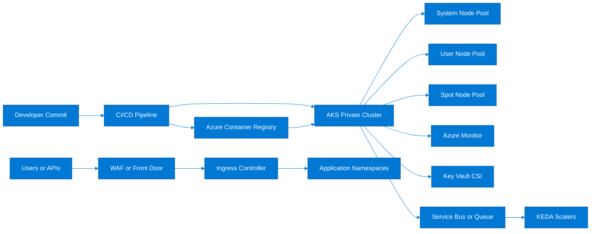
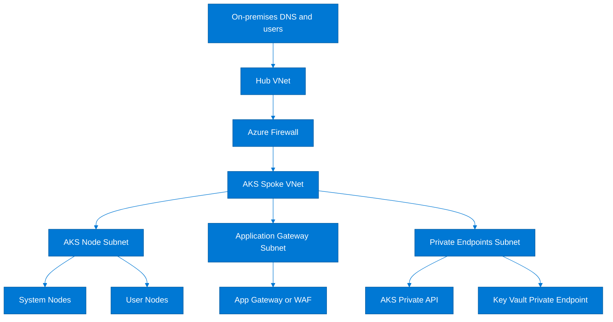
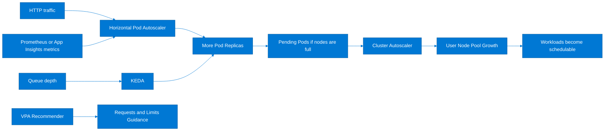

# AKS Production Setup Guide

> Detailed, hands-on AKS setup guide focused on production-grade cluster creation, networking, storage, security, monitoring, scaling, and lifecycle operations.
>
> Use this guide together with [Containers/README.md](./README.md) for platform selection and [Containers/aks-deep-dive.md](./aks-deep-dive.md) for conceptual background, troubleshooting, and command catalog coverage.

## How to use this guide

- Follow the sections in order when building a new production cluster from scratch.
- Reuse the command blocks directly after replacing placeholder values with your subscription, region, naming convention, and CIDR ranges.
- Keep cluster networking, identity, and monitoring decisions consistent across environments so CI/CD templates remain portable.
- Record any deviation from the baseline in your platform standards repository before rolling into additional regions.

## Table of contents

1. [Reference architecture](#1-reference-architecture)
2. [Prerequisites and baseline variables](#2-prerequisites-and-baseline-variables)
3. [Cluster creation](#3-cluster-creation)
4. [Networking deep dive](#4-networking-deep-dive)
5. [Storage configuration](#5-storage-configuration)
6. [Security](#6-security)
7. [Monitoring](#7-monitoring)
8. [Scaling](#8-scaling)
9. [Maintenance](#9-maintenance)
10. [Production readiness checklist](#10-production-readiness-checklist)

## 1. Reference architecture

This baseline assumes a hub-and-spoke landing zone, private AKS API server access, Azure CNI Overlay or Azure CNI dynamic IP allocation, Azure Container Registry, Log Analytics, Managed Prometheus, Azure Managed Grafana, and Azure Key Vault integration for secrets.



## 2. Prerequisites and baseline variables

- Azure CLI 2.59 or later with the `aks-preview`, `k8s-extension`, `k8s-configuration`, and `monitor-control-service` extensions updated.
- Contributor or Owner on the target subscription and User Access Administrator on the resource groups where managed identities, private DNS zones, and networking resources are created.
- Existing landing-zone resource groups for networking, security, and shared observability, or permission to create them as part of the bootstrap process.
- A registered Azure provider set: `Microsoft.ContainerService`, `Microsoft.Insights`, `Microsoft.OperationalInsights`, `Microsoft.AlertsManagement`, `Microsoft.Network`, and `Microsoft.KubernetesConfiguration`.

```bash
export SUBSCRIPTION_ID=<subscription-id>
export LOCATION=eastus
export RG_PLATFORM=rg-aks-platform-prod
export RG_NETWORK=rg-network-prod
export RG_IDENTITY=rg-identity-prod
export AKS=aks-prod-eastus-01
export VNET=vnet-prod-eastus-01
export AKS_SUBNET=snet-aks-prod
export APPGW_SUBNET=snet-appgw-prod
export NODE_RG=rg-aks-managed-prod
export AKS_SUBNET_PREFIX=10.20.0.0/22
export APPGW_SUBNET_PREFIX=10.20.4.0/24
export POD_CIDR=172.16.0.0/16
export SERVICE_CIDR=10.2.0.0/24
export DNS_IP=10.2.0.10
export ACR=acrprodplatform001
export LOG_WS=log-aks-prod-01
export GRAFANA=grafana-aks-prod-01
export PRIVATE_DNS_ZONE=privatelink.eastus.azmk8s.io
export USER_MI=mi-aks-control-prod
export KUBELET_MI=mi-aks-kubelet-prod
export APPGW=agw-aks-prod-01
export CLUSTER_IDENTITY_JSON=cluster-identity.json
az account set --subscription $SUBSCRIPTION_ID
```

### Provider registration checklist

| Control | Why it matters | How to verify |
|---|---|---|
| AKS RP registered | Cluster creation and upgrades depend on the ContainerService resource provider | `az provider show -n Microsoft.ContainerService --query registrationState -o tsv` returns Registered |
| Monitoring providers registered | Container Insights, managed Prometheus, and alert rules create monitor resources | All required providers show Registered |
| Network RP registered | Private endpoints, private DNS links, and load balancers require Network RP | Provider registration state is Registered |
| Feature flags reviewed | Preview-only features should be explicitly approved before production use | Feature list exported to change record |

## 3. Cluster creation

### 3.1 Network plugin choice: Azure CNI vs Kubenet vs Overlay

Choose the network mode before cluster creation because migration later is disruptive. Azure CNI Overlay is usually the default recommendation for new production clusters that need Azure policy integration without consuming VNet IPs for every pod.

| Plugin | Best fit | Advantages | Trade-offs |
|---|---|---|---|
| Azure CNI dynamic IP allocation | Enterprise VNets where pods must use routable VNet IPs on demand | Native VNet routing, Azure network policy support, easier appliance inspection, dynamic assignment reduces idle IP burn | Subnet sizing still matters and large east-west estates may consume addresses faster than overlay |
| Azure CNI Overlay | Large multi-team clusters where pod IP exhaustion is a concern | Separates pod CIDR from VNet CIDR, simpler IP planning, supports Azure policies and standard AKS add-ons | Pods are not directly routable from the VNet, so some legacy appliance patterns need design changes |
| Kubenet | Legacy small clusters with minimal networking requirements | Low VNet IP usage and straightforward cluster bootstrap | Less strategic for new builds, more UDR management, fewer enterprise features, not the long-term default for most platforms |

### 3.2 Node pool strategy

| Pool type | Purpose | Typical VM family | Recommended settings |
|---|---|---|---|
| System pool | Hosts core add-ons such as CoreDNS, CNI, metrics agents, and admission components | D4ds_v5 or D8ds_v5 | Mode=System, min 3 nodes, zones enabled, dedicated taints avoided unless required |
| User pool | Runs application workloads with standard SLA-backed capacity | D4ds_v5, E4ds_v5, or memory optimized family | Mode=User, autoscaler enabled, zone balanced, workload-specific labels and taints |
| Spot pool | Batch, CI workers, or interruptible stateless services | D4as_v5 Spot or similar | Use eviction policy Delete, taint the pool, configure PDBs and fallback HPA behavior |
| GPU pool | ML inference or video workloads that need NVIDIA GPU support | Standard_NC or Standard_ND family | Create only when needed, use taints, install device plugin, isolate namespaces |
| Windows pool | NET Framework or Windows container workloads | D4s_v5 Windows | Separate from Linux pools, smaller blast radius, update in a dedicated maintenance wave |

### 3.3 Create networking prerequisites

1. Create resource groups for platform, networking, and identity assets if they do not already exist.
2. Deploy a BYO VNet with separate subnets for AKS nodes, Application Gateway, private endpoints, and jump hosts.
3. Reserve enough address space for future user pools, blue-green upgrade surge, and possible node pool expansion during incidents.

```bash
az group create --name $RG_PLATFORM --location $LOCATION
az group create --name $RG_NETWORK --location $LOCATION
az group create --name $RG_IDENTITY --location $LOCATION

az network vnet create   --resource-group $RG_NETWORK   --name $VNET   --location $LOCATION   --address-prefixes 10.20.0.0/16   --subnet-name $AKS_SUBNET   --subnet-prefixes $AKS_SUBNET_PREFIX

az network vnet subnet create   --resource-group $RG_NETWORK   --vnet-name $VNET   --name $APPGW_SUBNET   --address-prefixes $APPGW_SUBNET_PREFIX
```

### 3.4 IP planning formula for BYO VNet

Use the following sizing formula for Azure CNI dynamic IP allocation where nodes pull pod IPs from the subnet in blocks. Size for steady state, surge upgrades, autoscaler bursts, and a reserved operations margin.

```text
Required IPs =
  (max_system_nodes + max_user_nodes + max_spot_nodes + max_gpu_nodes + max_upgrade_surge_nodes)
  + (max_concurrent_pods_per_node * nodes_needing_direct_VNet_IPs)
  + infrastructure_reserve

Practical rule of thumb:
- Reserve 20 percent headroom for upgrade surge and cluster autoscaler expansion.
- Reserve at least 16 addresses per subnet for Azure platform overhead and future private endpoints.
- If using private cluster, include private endpoint NIC growth and optional internal ingress appliances.
```

Worked example for a production cluster with 6 system nodes, 30 user nodes, 4 spot nodes, 2 GPU nodes, and a 33 percent surge window:

```text
Base nodes = 6 + 30 + 4 + 2 = 42
Upgrade surge nodes = 14
Directly routable pods = 42 nodes * 30 pods each = 1260
Infrastructure reserve = 32
Total recommended addresses = 42 + 14 + 1260 + 32 = 1348 addresses
Result: allocate at least a /21 subnet for comfortable headroom.
```

### 3.5 Create managed identities and role assignments

Use a user-assigned managed identity for cluster control plane operations when you need predictable principal IDs and role assignments across rebuilds. Keep kubelet identity separate so registry pull, disk attach, and Key Vault CSI scenarios remain least-privileged.

```bash
az identity create --resource-group $RG_IDENTITY --name $USER_MI --location $LOCATION
az identity create --resource-group $RG_IDENTITY --name $KUBELET_MI --location $LOCATION

AKS_MI_ID=$(az identity show --resource-group $RG_IDENTITY --name $USER_MI --query id -o tsv)
AKS_MI_PRINCIPAL=$(az identity show --resource-group $RG_IDENTITY --name $USER_MI --query principalId -o tsv)
KUBELET_MI_ID=$(az identity show --resource-group $RG_IDENTITY --name $KUBELET_MI --query id -o tsv)
AKS_SUBNET_ID=$(az network vnet subnet show --resource-group $RG_NETWORK --vnet-name $VNET --name $AKS_SUBNET --query id -o tsv)

az role assignment create --assignee-object-id $AKS_MI_PRINCIPAL   --assignee-principal-type ServicePrincipal   --role "Network Contributor"   --scope $AKS_SUBNET_ID
```

If you plan to use AGIC with an existing Application Gateway or private DNS zones in a shared resource group, add the required role assignments before cluster creation so the control plane does not hit access denied errors during bootstrap.

### 3.6 Create supporting shared services

```bash
az monitor log-analytics workspace create   --resource-group $RG_PLATFORM   --workspace-name $LOG_WS   --location $LOCATION

az acr create   --resource-group $RG_PLATFORM   --name $ACR   --sku Premium   --location $LOCATION   --admin-enabled false

az network private-dns zone create   --resource-group $RG_NETWORK   --name $PRIVATE_DNS_ZONE

VNET_ID=$(az network vnet show --resource-group $RG_NETWORK --name $VNET --query id -o tsv)
az network private-dns link vnet create   --resource-group $RG_NETWORK   --zone-name $PRIVATE_DNS_ZONE   --name link-$VNET-aks   --virtual-network $VNET_ID   --registration-enabled false
```

### 3.7 Create the production AKS cluster

The command below enables private API server access, Azure RBAC for Kubernetes authorization, OIDC issuer, workload identity, CSI drivers, Defender hooks, image cleaner, and autoscaling defaults. Adjust zones, node size, and add-ons based on your landing zone standards.

```bash
LOG_WS_ID=$(az monitor log-analytics workspace show --resource-group $RG_PLATFORM --workspace-name $LOG_WS --query id -o tsv)
ACR_ID=$(az acr show --resource-group $RG_PLATFORM --name $ACR --query id -o tsv)
PRIVATE_DNS_ID=$(az network private-dns zone show --resource-group $RG_NETWORK --name $PRIVATE_DNS_ZONE --query id -o tsv)

az aks create   --resource-group $RG_PLATFORM   --name $AKS   --location $LOCATION   --node-resource-group $NODE_RG   --network-plugin azure   --network-plugin-mode overlay   --vnet-subnet-id $AKS_SUBNET_ID   --pod-cidr $POD_CIDR   --service-cidr $SERVICE_CIDR   --dns-service-ip $DNS_IP   --enable-private-cluster   --private-dns-zone $PRIVATE_DNS_ID   --enable-managed-identity   --assign-identity $AKS_MI_ID   --assign-kubelet-identity $KUBELET_MI_ID   --enable-aad   --enable-azure-rbac   --enable-oidc-issuer   --enable-workload-identity   --attach-acr $ACR_ID   --enable-cluster-autoscaler   --min-count 3   --max-count 6   --node-count 3   --node-vm-size Standard_D4ds_v5   --node-osdisk-size 128   --nodepool-name sysnp   --zones 1 2 3   --load-balancer-sku standard   --auto-upgrade-channel none   --kubernetes-version 1.29.6   --enable-blob-driver   --enable-disk-driver   --enable-file-driver   --enable-image-cleaner   --image-cleaner-interval-hours 48   --workspace-resource-id $LOG_WS_ID   --generate-ssh-keys
```

### 3.8 Enable dynamic IP allocation variant when pods need VNet IPs

If your security tooling, firewalls, or on-premises routes require pods to use VNet addresses, use Azure CNI with dynamic IP allocation instead of overlay. Keep the rest of the creation flow the same, but adjust these networking arguments:

```bash
az aks create   --resource-group $RG_PLATFORM   --name $AKS   --network-plugin azure   --vnet-subnet-id $AKS_SUBNET_ID   --max-pods 30   --pod-subnet-id $AKS_SUBNET_ID   --service-cidr $SERVICE_CIDR   --dns-service-ip $DNS_IP   --enable-managed-identity   --enable-aad   --enable-azure-rbac
```

Dynamic IP allocation is operationally attractive when you want pod IP usage to scale with node count rather than reserving `maxPods` worth of addresses permanently for every node.

### 3.9 Add user, spot, and GPU pools

```bash
az aks nodepool add   --resource-group $RG_PLATFORM   --cluster-name $AKS   --name usernp1   --mode User   --node-vm-size Standard_D4ds_v5   --node-count 3   --enable-cluster-autoscaler   --min-count 3   --max-count 20   --labels workload=general env=prod   --zones 1 2 3

az aks nodepool add   --resource-group $RG_PLATFORM   --cluster-name $AKS   --name spotnp1   --mode User   --priority Spot   --eviction-policy Delete   --spot-max-price -1   --node-vm-size Standard_D4as_v5   --node-count 1   --enable-cluster-autoscaler   --min-count 0   --max-count 10   --node-taints kubernetes.azure.com/scalesetpriority=spot:NoSchedule   --labels workload=batch capacity=spot

az aks nodepool add   --resource-group $RG_PLATFORM   --cluster-name $AKS   --name gpunp1   --mode User   --node-vm-size Standard_NC6s_v3   --node-count 0   --enable-cluster-autoscaler   --min-count 0   --max-count 4   --node-taints sku=gpu:NoSchedule   --labels accelerator=nvidia
```

### 3.10 Private cluster access pattern

- Use Azure Bastion, an admin jump host, or a private Azure DevOps/GitHub-hosted runner with VNet access to run `kubectl` against the API server.
- Publish the cluster private FQDN through the private DNS zone linked to the management VNet and any peered VNet hosting deployment agents.
- Restrict admin group membership in Microsoft Entra ID and prefer break-glass access through Privileged Identity Management.

```bash
az aks get-credentials --resource-group $RG_PLATFORM --name $AKS --admin --overwrite-existing
kubectl get nodes -o wide
kubectl get pods -A
```

### 3.11 Azure AD integration and RBAC model

Azure RBAC for Kubernetes lets you map Microsoft Entra groups to cluster roles without managing static kubeconfig certificates. Grant broad permissions only to platform operator groups and keep application teams scoped to namespaces.

```bash
AKS_ID=$(az aks show --resource-group $RG_PLATFORM --name $AKS --query id -o tsv)
DEVOPS_GROUP_ID=<entra-group-object-id>
PLATFORM_ADMIN_GROUP_ID=<entra-platform-admin-group-id>

az role assignment create   --assignee-object-id $PLATFORM_ADMIN_GROUP_ID   --assignee-principal-type Group   --role "Azure Kubernetes Service RBAC Cluster Admin"   --scope $AKS_ID

az role assignment create   --assignee-object-id $DEVOPS_GROUP_ID   --assignee-principal-type Group   --role "Azure Kubernetes Service RBAC Writer"   --scope $AKS_ID
```

### Cluster creation validation

| Control | Why it matters | How to verify |
|---|---|---|
| Private API resolves | Deployment agents must reach the private API endpoint | `nslookup <private-fqdn>` resolves to RFC1918 address inside trusted network |
| System pool healthy | Core add-ons rely on system pool capacity and zone spread | `kubectl get nodes -l kubernetes.azure.com/mode=system` shows Ready nodes across zones |
| ACR pull works | CI/CD rollouts fail if kubelet identity cannot pull images | Test deployment pulls from ACR without imagePullSecret |
| Azure RBAC enforced | Human access should flow through Entra groups, not static kubeconfigs | Unauthorized users receive forbidden response from `kubectl auth can-i` |

## 4. Networking deep dive

### 4.1 Networking topology



### 4.2 Azure CNI with dynamic IP allocation

Azure CNI dynamic IP allocation allocates IPs to pods from the subnet only when pods are scheduled rather than reserving a full `maxPods` range for every node ahead of time. This lowers wasted address consumption while keeping pods first-class VNet citizens.

- Use it when network virtual appliances, NSGs, and route tables must see pod IPs directly.
- Avoid undersized subnets even with dynamic allocation because sudden autoscaler expansion still needs free addresses immediately.
- Validate route-table and firewall scale limits if thousands of pod IPs need inspection or custom routing.

### 4.3 Internal vs public load balancer

| Option | Use when | Benefits | Common configuration |
|---|---|---|---|
| Internal Load Balancer | Consumers are internal services, private APIs, or spoke VNets only | No public exposure, simpler zero-trust stance, easier compliance | Annotate service with `service.beta.kubernetes.io/azure-load-balancer-internal: "true"` |
| Public Load Balancer | Public APIs or internet-facing endpoints terminate directly on AKS | Simple publish path and lower component count for non-WAF workloads | Annotate service or ingress class for public frontend and restrict source IPs with WAF/Firewall when possible |

```yaml
apiVersion: v1
kind: Service
metadata:
  name: orders-api-internal
  namespace: orders
  annotations:
    service.beta.kubernetes.io/azure-load-balancer-internal: "true"
spec:
  type: LoadBalancer
  selector:
    app: orders-api
  ports:
    - port: 80
      targetPort: 8080
```

```yaml
apiVersion: v1
kind: Service
metadata:
  name: orders-api-public
  namespace: orders
spec:
  type: LoadBalancer
  selector:
    app: orders-api
  ports:
    - port: 80
      targetPort: 8080
```

### 4.4 Ingress controller comparison

| Controller | Best fit | Strengths | Watch-outs |
|---|---|---|---|
| AGIC | Enterprises standardizing on Application Gateway and WAF | Native WAF, TLS policy, rewrite rules, central L7 ownership | Extra hop and cost, slower config convergence than in-cluster ingress for some change rates |
| NGINX Ingress | Portable Kubernetes-first platforms | Huge ecosystem, predictable Helm deployment, rich annotations | You operate the ingress pods and often pair with separate WAF |
| Traefik | Teams wanting simple CRDs and rich middleware patterns | Friendly config model, built-in dashboard, strong canary/middleware features | Smaller Azure-specific footprint than NGINX or App Gateway |

### 4.5 AGIC setup with Application Gateway

```bash
az network public-ip create   --resource-group $RG_NETWORK   --name pip-$APPGW   --sku Standard   --allocation-method Static

az network application-gateway create   --resource-group $RG_NETWORK   --name $APPGW   --location $LOCATION   --sku WAF_v2   --capacity 2   --public-ip-address pip-$APPGW   --vnet-name $VNET   --subnet $APPGW_SUBNET

APPGW_ID=$(az network application-gateway show --resource-group $RG_NETWORK --name $APPGW --query id -o tsv)
az aks enable-addons   --resource-group $RG_PLATFORM   --name $AKS   --addons ingress-appgw   --appgw-id $APPGW_ID
```

```yaml
apiVersion: networking.k8s.io/v1
kind: Ingress
metadata:
  name: orders-agic
  namespace: orders
  annotations:
    kubernetes.io/ingress.class: azure/application-gateway
    appgw.ingress.kubernetes.io/backend-path-prefix: /
    appgw.ingress.kubernetes.io/request-timeout: "60"
spec:
  rules:
    - host: orders.contoso.internal
      http:
        paths:
          - path: /
            pathType: Prefix
            backend:
              service:
                name: orders-api-internal
                port:
                  number: 80
```

### 4.6 NGINX Ingress setup

```bash
helm repo add ingress-nginx https://kubernetes.github.io/ingress-nginx
helm repo update
helm upgrade --install ingress-nginx ingress-nginx/ingress-nginx   --namespace ingress-nginx   --create-namespace   --set controller.replicaCount=3   --set controller.service.externalTrafficPolicy=Local   --set controller.service.annotations."service\.beta\.kubernetes\.io/azure-load-balancer-internal"=true
```

```yaml
apiVersion: networking.k8s.io/v1
kind: Ingress
metadata:
  name: orders-nginx
  namespace: orders
  annotations:
    kubernetes.io/ingress.class: nginx
    nginx.ingress.kubernetes.io/proxy-body-size: 20m
    nginx.ingress.kubernetes.io/ssl-redirect: "true"
spec:
  tls:
    - hosts:
        - orders.contoso.com
      secretName: orders-tls
  rules:
    - host: orders.contoso.com
      http:
        paths:
          - path: /
            pathType: Prefix
            backend:
              service:
                name: orders-api-public
                port:
                  number: 80
```

### 4.7 Traefik setup

```bash
helm repo add traefik https://traefik.github.io/charts
helm repo update
helm upgrade --install traefik traefik/traefik   --namespace traefik   --create-namespace   --set deployment.replicas=3   --set service.annotations."service\.beta\.kubernetes\.io/azure-load-balancer-internal"=true   --set logs.access.enabled=true
```

```yaml
apiVersion: traefik.io/v1alpha1
kind: IngressRoute
metadata:
  name: orders-traefik
  namespace: orders
spec:
  entryPoints:
    - websecure
  routes:
    - match: Host(`orders.contoso.com`) && PathPrefix(`/`)
      kind: Rule
      services:
        - name: orders-api-public
          port: 80
  tls:
    secretName: orders-tls
```

### 4.8 Network policies: Azure vs Calico

| Engine | Why choose it | Strengths | Limits |
|---|---|---|---|
| Azure Network Policy | Teams standardizing on Azure-native policy engine | Good AKS integration, straightforward operations, Azure familiarity | Feature set narrower than full Calico enterprise-style policy patterns |
| Calico | Fine-grained policy and richer Kubernetes networking constructs are required | Mature label-based rules, common multi-cloud skillset, broader ecosystem | Additional operational surface and policy sprawl if not governed |

```bash
az aks update   --resource-group $RG_PLATFORM   --name $AKS   --network-policy azure
```

```yaml
apiVersion: networking.k8s.io/v1
kind: NetworkPolicy
metadata:
  name: allow-web-to-api
  namespace: orders
spec:
  podSelector:
    matchLabels:
      app: orders-api
  policyTypes:
    - Ingress
  ingress:
    - from:
        - podSelector:
            matchLabels:
              app: orders-web
      ports:
        - protocol: TCP
          port: 8080
```

### 4.9 Service mesh options

| Mesh option | Operational model | When to use it |
|---|---|---|
| Istio AKS add-on | Managed add-on lifecycle integrated with AKS | Need mTLS, traffic shaping, telemetry, and want Microsoft-supported addon path |
| Open Service Mesh | Lightweight SMI-based mesh | Simpler service-to-service encryption and traffic policy needs on existing estates |

```bash
az aks mesh enable   --resource-group $RG_PLATFORM   --name $AKS   --revision asm-1
```

```bash
az k8s-extension create   --resource-group $RG_PLATFORM   --cluster-name $AKS   --cluster-type managedClusters   --name osm   --extension-type Microsoft.openservicemesh
```

### 4.10 Private DNS zones for private clusters

- Create or reuse the regional `privatelink.<region>.azmk8s.io` zone in a network resource group owned by the platform team.
- Link every management VNet, jump VNet, and deployment runner VNet that needs API access.
- If using custom DNS, configure conditional forwarding to Azure DNS private resolver or a DNS forwarder that can resolve the zone.

### Networking validation commands

| Task | Command | Expected result |
|---|---|---|
| Show cluster egress profile | `az aks show -g $RG_PLATFORM -n $AKS --query networkProfile` | Network plugin mode, service CIDR, and LB profile displayed |
| Check ingress service frontends | `kubectl get svc -A | grep LoadBalancer` | Internal or public frontends align to design |
| Inspect node subnet free IPs | `az network vnet subnet show -g $RG_NETWORK --vnet-name $VNET -n $AKS_SUBNET --query addressPrefix` | Subnet size still supports future scale |
| Resolve private API FQDN | `nslookup $(az aks show -g $RG_PLATFORM -n $AKS --query privateFqdn -o tsv)` | Name resolves only inside trusted network |

## 5. Storage configuration

### 5.1 StorageClass decision table

| Storage class | Use for | Performance profile | Notes |
|---|---|---|---|
| Azure Disk Premium SSD v2 | Low-latency databases and write-heavy stateful sets | High IOPS, zonal managed disk performance | Use zone-aware scheduling and one PVC per pod |
| Azure Disk Standard SSD | General production persistent volumes | Balanced price and performance | Good default for app state, caches, and smaller databases |
| Azure Files Premium | Shared RWX volumes for CMS, content, or legacy lift-and-shift apps | SMB/NFS shared access | Watch latency and directory listing behavior for chatty apps |
| Azure NetApp Files | High-throughput enterprise file workloads and SAP-style shared storage | Very high throughput and advanced NFS features | Separate service and delegated subnet planning required |

### 5.2 CSI driver configuration

```bash
az aks show   --resource-group $RG_PLATFORM   --name $AKS   --query "storageProfile"
```

Modern AKS clusters should use CSI drivers rather than in-tree storage plugins. The baseline cluster command already enabled disk, file, and blob CSI drivers. If an existing cluster is missing them, enable the drivers before introducing new StorageClasses.

### 5.3 Azure Disk PVC example

```yaml
apiVersion: storage.k8s.io/v1
kind: StorageClass
metadata:
  name: managed-csi-premium
provisioner: disk.csi.azure.com
parameters:
  skuName: PremiumV2_LRS
  cachingMode: None
  kind: managed
reclaimPolicy: Delete
allowVolumeExpansion: true
volumeBindingMode: WaitForFirstConsumer
---
apiVersion: v1
kind: PersistentVolumeClaim
metadata:
  name: postgres-data
  namespace: data
spec:
  accessModes:
    - ReadWriteOnce
  storageClassName: managed-csi-premium
  resources:
    requests:
      storage: 256Gi
```

### 5.4 Azure Files PVC example

```yaml
apiVersion: storage.k8s.io/v1
kind: StorageClass
metadata:
  name: azurefile-premium-rwx
provisioner: file.csi.azure.com
parameters:
  skuName: Premium_LRS
mountOptions:
  - dir_mode=0770
  - file_mode=0660
  - uid=1000
  - gid=1000
reclaimPolicy: Delete
allowVolumeExpansion: true
volumeBindingMode: Immediate
---
apiVersion: v1
kind: PersistentVolumeClaim
metadata:
  name: shared-content
  namespace: cms
spec:
  accessModes:
    - ReadWriteMany
  storageClassName: azurefile-premium-rwx
  resources:
    requests:
      storage: 200Gi
```

### 5.5 Azure NetApp Files example

```yaml
apiVersion: storage.k8s.io/v1
kind: StorageClass
metadata:
  name: anf-nfs
provisioner: csi.trident.netapp.io
parameters:
  backendType: azure-netapp-files
  serviceLevel: Premium
  networkFeatures: Standard
allowVolumeExpansion: true
reclaimPolicy: Delete
---
apiVersion: v1
kind: PersistentVolumeClaim
metadata:
  name: sap-shared
  namespace: sap
spec:
  accessModes:
    - ReadWriteMany
  storageClassName: anf-nfs
  resources:
    requests:
      storage: 1024Gi
```

### 5.6 Velero backup setup for AKS

```bash
export BACKUP_RG=rg-aks-backup-prod
export BACKUP_STG=stgaksbackup001
export BACKUP_CONTAINER=velero
az group create --name $BACKUP_RG --location $LOCATION
az storage account create   --resource-group $BACKUP_RG   --name $BACKUP_STG   --sku Standard_GRS   --kind StorageV2   --https-only true
az storage container create   --account-name $BACKUP_STG   --name $BACKUP_CONTAINER   --auth-mode login

velero install   --provider azure   --plugins velero/velero-plugin-for-microsoft-azure:v1.9.0   --bucket $BACKUP_CONTAINER   --secret-file ./credentials-velero   --backup-location-config resourceGroup=$BACKUP_RG,storageAccount=$BACKUP_STG,subscriptionId=$SUBSCRIPTION_ID   --snapshot-location-config apiTimeout=5m
```

```bash
velero backup create nightly-prod --include-namespaces orders,payments,platform
velero schedule create prod-daily --schedule "0 1 * * *" --ttl 720h0m0s
velero restore create --from-backup nightly-prod
```

## 6. Security

### 6.1 Workload Identity Federation setup

Workload Identity Federation replaces legacy pod-managed identities and aad-pod-identity. It uses the AKS OIDC issuer plus federated credentials on a user-assigned managed identity, letting pods get Azure tokens without node-level secrets.

```bash
OIDC_ISSUER=$(az aks show -g $RG_PLATFORM -n $AKS --query oidcIssuerProfile.issuerUrl -o tsv)
APP_MI=mi-orders-workload
az identity create --resource-group $RG_IDENTITY --name $APP_MI --location $LOCATION
APP_MI_CLIENT_ID=$(az identity show --resource-group $RG_IDENTITY --name $APP_MI --query clientId -o tsv)
APP_MI_ID=$(az identity show --resource-group $RG_IDENTITY --name $APP_MI --query id -o tsv)

az identity federated-credential create   --name fic-orders-api   --identity-name $APP_MI   --resource-group $RG_IDENTITY   --issuer $OIDC_ISSUER   --subject system:serviceaccount:orders:orders-api   --audience api://AzureADTokenExchange
```

```yaml
apiVersion: v1
kind: ServiceAccount
metadata:
  name: orders-api
  namespace: orders
  annotations:
    azure.workload.identity/client-id: <managed-identity-client-id>
---
apiVersion: apps/v1
kind: Deployment
metadata:
  name: orders-api
  namespace: orders
spec:
  replicas: 3
  selector:
    matchLabels:
      app: orders-api
  template:
    metadata:
      labels:
        app: orders-api
        azure.workload.identity/use: "true"
    spec:
      serviceAccountName: orders-api
      containers:
        - name: orders-api
          image: <acr>.azurecr.io/orders-api:1.0.0
          env:
            - name: KEYVAULT_URL
              value: https://kv-prod-platform.vault.azure.net/
```

### 6.2 Azure Key Vault with CSI Secret Store driver

```bash
az aks enable-addons   --resource-group $RG_PLATFORM   --name $AKS   --addons azure-keyvault-secrets-provider

KV_NAME=kv-prod-platform
az keyvault create   --resource-group $RG_PLATFORM   --name $KV_NAME   --location $LOCATION   --enable-rbac-authorization true   --public-network-access Disabled

az role assignment create   --assignee $APP_MI_CLIENT_ID   --role "Key Vault Secrets User"   --scope $(az keyvault show --name $KV_NAME --query id -o tsv)
```

```yaml
apiVersion: secrets-store.csi.x-k8s.io/v1
kind: SecretProviderClass
metadata:
  name: orders-kv
  namespace: orders
spec:
  provider: azure
  parameters:
    usePodIdentity: "false"
    useVMManagedIdentity: "false"
    clientID: <managed-identity-client-id>
    keyvaultName: kv-prod-platform
    cloudName: AzurePublicCloud
    tenantId: <tenant-id>
    objects: |
      array:
        - |
          objectName: orders-db-password
          objectType: secret
        - |
          objectName: orders-api-cert
          objectType: secret
  secretObjects:
    - secretName: orders-runtime-secrets
      type: Opaque
      data:
        - objectName: orders-db-password
          key: db-password
```

### 6.3 Microsoft Defender for Containers

```bash
az security pricing create   --name Containers   --tier Standard

az aks update   --resource-group $RG_PLATFORM   --name $AKS   --enable-defender
```

Pair Defender with admission control, image scanning in ACR, and Kubernetes audit logs so runtime alerts have supporting deployment context.

### 6.4 Azure Policy for AKS

```bash
az aks enable-addons   --resource-group $RG_PLATFORM   --name $AKS   --addons azure-policy
```

| Built-in policy | Purpose | Typical effect |
|---|---|---|
| Kubernetes clusters should use Azure Policy add-on | Ensures the addon is installed | Audit or Deny |
| Containers should only listen on allowed ports | Limits unexpected exposed ports | Deny |
| Privileged containers should be minimized | Prevents privileged security context use | Deny |
| Kubernetes cluster pods should only use approved host paths | Restricts hostPath access | Deny |
| Kubernetes cluster should not allow host namespace sharing | Stops host networking/PID/IPC abuse | Deny |
| Kubernetes clusters should disable automounting API credentials | Reduces token sprawl | Audit |

### 6.5 Image integrity and admission controllers

- Enable image scanning in ACR and fail the CI pipeline if high-severity vulnerabilities exceed the policy threshold.
- Use Azure Policy, Gatekeeper, or Kyverno to require signed images, approved registries, and baseline pod security settings.
- Use the AKS image cleaner to remove stale images from nodes and reduce exposure to superseded artifacts.

```yaml
apiVersion: kyverno.io/v1
kind: ClusterPolicy
metadata:
  name: require-approved-registry
spec:
  validationFailureAction: Enforce
  rules:
    - name: only-acr-images
      match:
        any:
          - resources:
              kinds:
                - Pod
      validate:
        message: Images must be pulled from contoso ACR.
        pattern:
          spec:
            containers:
              - image: "acrprodplatform001.azurecr.io/*"
```

## 7. Monitoring

### 7.1 Container Insights setup

```bash
az aks enable-addons   --resource-group $RG_PLATFORM   --name $AKS   --addons monitoring   --workspace-resource-id $LOG_WS_ID
```

### 7.2 Managed Prometheus and Grafana

```bash
az aks update   --resource-group $RG_PLATFORM   --name $AKS   --enable-azure-monitor-metrics

az grafana create   --resource-group $RG_PLATFORM   --name $GRAFANA   --location $LOCATION   --sku Standard
```

Import Kubernetes cluster overview, node exporter, kube-state-metrics, and application dashboards into Azure Managed Grafana. Keep the dashboard source in Git so restored environments receive the same observability pack.

### 7.3 Log Analytics queries for AKS

```kusto
KubePodInventory
| where ClusterName == "aks-prod-eastus-01"
| summarize Restarts=sum(ContainerRestartCount) by Namespace, PodStatus
| order by Restarts desc
```

```kusto
Perf
| where ObjectName == "K8SNode" and CounterName == "cpuUsageNanoCores"
| summarize AvgCpuNano=avg(CounterValue) by Computer, bin(TimeGenerated, 5m)
| render timechart
```

```kusto
ContainerLogV2
| where ClusterName == "aks-prod-eastus-01"
| where LogLevel in ("error", "critical")
| summarize count() by Namespace, PodName, LogMessage
| top 20 by count_
```

### 7.4 Alert rules for node and pod health

```bash
az monitor metrics alert create   --name aks-node-notready   --resource-group $RG_PLATFORM   --scopes $(az aks show -g $RG_PLATFORM -n $AKS --query id -o tsv)   --condition "avg kube_node_status_condition{condition=Ready,status=true} < 1"   --description "AKS node is not ready"   --window-size 5m   --evaluation-frequency 5m
```

```bash
az monitor scheduled-query create   --name aks-pod-crashloop   --resource-group $RG_PLATFORM   --scopes $LOG_WS_ID   --condition-query "KubePodInventory | where ContainerStatus =~ 'waiting' and ContainerStatusReason =~ 'CrashLoopBackOff'"   --condition "count > 0"   --description "Pods entering CrashLoopBackOff"
```

## 8. Scaling



### 8.1 HPA with custom metrics from Application Insights

A practical approach is to export application metrics to Azure Monitor managed Prometheus or expose them through Prometheus scraping while the application also sends traces to Application Insights. HPA then scales from Prometheus-backed custom metrics that reflect queue latency, request duration, or business throughput.

```yaml
apiVersion: autoscaling/v2
kind: HorizontalPodAutoscaler
metadata:
  name: orders-api
  namespace: orders
spec:
  scaleTargetRef:
    apiVersion: apps/v1
    kind: Deployment
    name: orders-api
  minReplicas: 3
  maxReplicas: 20
  metrics:
    - type: Pods
      pods:
        metric:
          name: app_requests_per_second
        target:
          type: AverageValue
          averageValue: "30"
```

### 8.2 Cluster autoscaler configuration

```bash
az aks update   --resource-group $RG_PLATFORM   --name $AKS   --cluster-autoscaler-profile scale-down-delay-after-add=15m   --cluster-autoscaler-profile scan-interval=20s   --cluster-autoscaler-profile balance-similar-node-groups=true   --cluster-autoscaler-profile expander=least-waste
```

### 8.3 KEDA with Azure Service Bus trigger

```yaml
apiVersion: keda.sh/v1alpha1
kind: TriggerAuthentication
metadata:
  name: sb-auth
  namespace: orders
spec:
  podIdentity:
    provider: azure-workload
---
apiVersion: keda.sh/v1alpha1
kind: ScaledObject
metadata:
  name: orders-worker-sb
  namespace: orders
spec:
  scaleTargetRef:
    name: orders-worker
  minReplicaCount: 0
  maxReplicaCount: 30
  pollingInterval: 15
  cooldownPeriod: 120
  triggers:
    - type: azure-servicebus
      metadata:
        namespace: sb-prod-platform
        queueName: orders
        messageCount: "25"
      authenticationRef:
        name: sb-auth
```

### 8.4 KEDA with Azure Storage Queue trigger

```yaml
apiVersion: keda.sh/v1alpha1
kind: ScaledObject
metadata:
  name: media-queue-workers
  namespace: media
spec:
  scaleTargetRef:
    name: media-worker
  minReplicaCount: 0
  maxReplicaCount: 20
  triggers:
    - type: azure-queue
      metadata:
        queueName: image-jobs
        accountName: stgmediaprod001
        queueLength: "50"
      authenticationRef:
        name: storage-queue-auth
```

### 8.5 Vertical Pod Autoscaler

```bash
git clone https://github.com/kubernetes/autoscaler.git
cd autoscaler/vertical-pod-autoscaler/
./hack/vpa-up.sh
kubectl get pods -n kube-system | grep vpa
```

Use VPA in recommendation mode first. For critical stateful sets, review recommendations in change control before switching to `Auto` or `Recreate` mode.

## 9. Maintenance

### 9.1 Node image upgrades

```bash
az aks nodepool get-upgrades   --resource-group $RG_PLATFORM   --cluster-name $AKS   --name sysnp

az aks nodepool upgrade   --resource-group $RG_PLATFORM   --cluster-name $AKS   --name sysnp   --node-image-only
```

### 9.2 Kubernetes version upgrade strategy

- Upgrade non-production first, then one production region, then remaining regions after soak validation.
- Upgrade system pools before user pools only when required by the target version sequence and keep application teams informed of any temporary node pressure.
- Validate CRDs, admission controllers, CSI drivers, and service mesh compatibility in a staging cluster before touching production.

```bash
az aks get-upgrades --resource-group $RG_PLATFORM --name $AKS
az aks upgrade --resource-group $RG_PLATFORM --name $AKS --kubernetes-version 1.30.2 --control-plane-only
az aks nodepool upgrade --resource-group $RG_PLATFORM --cluster-name $AKS --name usernp1 --kubernetes-version 1.30.2
```

### 9.3 Planned maintenance windows

```bash
az aks maintenanceconfiguration add   --resource-group $RG_PLATFORM   --cluster-name $AKS   --name aksManagedAutoUpgradeSchedule   --weekday Saturday   --start-hour 2   --duration 4
```

### 9.4 Node surge upgrade settings

```bash
az aks nodepool update   --resource-group $RG_PLATFORM   --cluster-name $AKS   --name usernp1   --max-surge 33%
```

### Maintenance validation commands

| Task | Command | Expected result |
|---|---|---|
| Check current versions | `az aks show -g $RG_PLATFORM -n $AKS --query kubernetesVersion` | Current control plane version returned |
| Show node image version | `kubectl get nodes -L kubernetes.azure.com/node-image-version` | Nodes display expected image version |
| Inspect maintenance config | `az aks maintenanceconfiguration list -g $RG_PLATFORM --cluster-name $AKS` | Approved maintenance windows displayed |
| Review pending events | `kubectl get events -A --sort-by=.lastTimestamp | tail` | No unresolved upgrade or eviction issues remain |

## 10. Production readiness checklist

### Platform checklist

| Control | Why it matters | How to verify |
|---|---|---|
| Private API enabled | Reduces control plane exposure | AKS private cluster flag is true |
| Azure RBAC enabled | Human access is controlled through Entra groups | `az aks show --query aadProfile.enableAzureRbac` returns true |
| At least 3 system nodes | Prevents single-node dependency for core add-ons | System pool spans zones 1,2,3 |
| Observability onboarded | SREs need telemetry from day one | Logs, metrics, and dashboards visible |
| Backup tested | Recovery posture must be proven, not assumed | Velero restore drill documented |
| Policy baseline enforced | Prevents drift and risky workloads | Azure Policy or Gatekeeper reports compliant state |
| Ingress pattern standardized | Certificate and WAF ownership remain clear | One ingress operating model per environment |
| Upgrade runbook approved | Patch windows must be repeatable | Change record references tested commands |

### Common failure signals and responses

| Signal | Likely cause | Immediate response |
|---|---|---|
| Pods pending after release | Autoscaler max reached or PVC zone mismatch | Check node pool max count and PVC scheduling events |
| Image pull back-off | ACR role assignment missing on kubelet identity | Verify AcrPull on kubelet identity and ACR firewall rules |
| Private API unreachable | DNS link or custom forwarder issue | Validate private DNS zone links and conditional forwarding |
| Ingress config not applying | AGIC or NGINX controller permissions/config drift | Inspect ingress controller logs and ARM permissions |
| Queue workers not scaling | KEDA auth or trigger metadata mismatch | Describe ScaledObject and verify trigger authentication |

### Cross-reference map

- Use [Containers/aks-deep-dive.md](./aks-deep-dive.md) when you want additional AKS concepts, troubleshooting patterns, and operational design prompts.
- Use [Containers/README.md](./README.md) for broader platform choice guidance across AKS, Container Apps, ACI, ACR, and service mesh options.
- Pair this document with [CICD/azure-devops-complete-guide.md](../CICD/azure-devops-complete-guide.md) once the cluster exists and you need pipeline deployment automation.
- Pair storage-heavy workloads here with [Storage/blob-storage-complete-guide.md](../Storage/blob-storage-complete-guide.md) if blob-backed apps, private endpoints, or lifecycle policies are part of the workload.

