# Kubernetes Architecture Decision Guide for Azure (AKS)

> Architect-level AKS decision framework for platform teams designing production Azure Kubernetes Service estates, selecting cluster models, networking, ingress, API, service mesh, storage, security, observability, and readiness patterns.

## Table of Contents
1. [AKS Architecture Overview](#1-aks-architecture-overview)
2. [Cluster Type Selection: AKS Standard vs AKS Automatic](#2-cluster-type-selection-aks-standard-vs-aks-automatic)
3. [Multiple Clusters vs Single Cluster Design](#3-multiple-clusters-vs-single-cluster-design)
4. [Networking Options & Decision Tree](#4-networking-options--decision-tree)
5. [Ingress Controller Comparisons & Decision Tree](#5-ingress-controller-comparisons--decision-tree)
6. [APIM Integration with AKS](#6-apim-integration-with-aks)
7. [Service Mesh Comparisons](#7-service-mesh-comparisons)
8. [Storage & Stateful Workloads](#8-storage--stateful-workloads)
9. [Security Architecture](#9-security-architecture)
10. [Monitoring & Observability](#10-monitoring--observability)
11. [Production Readiness Checklist](#11-production-readiness-checklist)

---

## 1. AKS Architecture Overview

Microsoft Learn: [Introduction to Azure Kubernetes Service (AKS)](https://learn.microsoft.com/en-us/azure/aks/intro-kubernetes)

AKS architecture is not a single product decision; it is a chain of platform decisions that shape operational burden, compliance posture, reliability, and application delivery speed.

- The control plane is managed by Microsoft, but almost every data plane outcome is still the platform team's responsibility.
- Node pools establish workload isolation, cost envelopes, patching windows, and hardware specialization boundaries.
- Networking determines IP scale, egress strategy, DNS behavior, east-west isolation, and enterprise connectivity options.
- Storage decisions determine workload portability, latency, zone affinity, backup patterns, and operational recovery complexity.
- Identity choices determine how workloads access Azure services and how operators authenticate to Kubernetes APIs.
- Observability design must exist before production onboarding so that every workload lands on a standard telemetry path.

### AKS architecture components

### Control plane

- Managed Kubernetes API server, scheduler, and controllers remove direct etcd and master node operations from the customer scope.
- Platform teams still choose supported Kubernetes versions, maintenance windows, API access models, and upgrade cadence.
- Private cluster, authorized IP range, Microsoft Entra integration, and API server VNet integration are architectural rather than tactical settings.
- Cluster extensions, admission policies, and custom resource definitions increase power but also increase version and upgrade risk.
- The managed control plane does not eliminate the need for release engineering around add-ons, webhooks, and API deprecations.
- High availability expectations must account for zone placement of worker nodes, not just Microsoft's SLA for the managed control plane.

### Node pools

- System pools should host core platform add-ons and remain separate from application pools to reduce contention risk.
- User pools can segment workloads by OS, region, VM family, zone strategy, cost class, compliance level, or availability objective.
- Autoscaler boundaries must reflect subnet IP capacity, image pull time, and startup latency tolerances.
- Spot pools are useful for batch or elastic workloads but must be treated as interruptible capacity with explicit disruption controls.
- GPU, confidential, and Windows node pools widen workload support but raise image governance and operations complexity.
- Node image channel, surge settings, and max pods per node are architecture decisions because they influence upgrade blast radius and density.

### Networking

- AKS networking spans node IPs, pod IPs, service CIDRs, DNS resolution, ingress exposure, outbound connectivity, and hybrid integration.
- The wrong network model can produce hard IP exhaustion or enterprise routing friction that is expensive to remediate later.
- Ingress controllers, internal load balancers, private endpoints, and Azure Firewall are usually part of one end-to-end traffic design.
- Network policy should be planned with namespace design and service discovery patterns rather than bolted on after delivery teams proliferate.
- Private cluster design changes operational access paths for kubectl, GitHub Actions, and build agents.
- Pod density objectives, overlapping CIDRs, and future regional expansion all belong in the initial IP plan.

### Storage

- Persistent volumes on AKS are Azure constructs exposed through CSI drivers and therefore inherit Azure zone, redundancy, and performance attributes.
- Storage decisions are tied to StatefulSet placement, backup tooling, restore procedures, and failure domain design.
- ReadWriteOnce versus ReadWriteMany behavior determines whether storage fits databases, shared content, caches, or analytics pipelines.
- High IOPS requirements can push clusters toward premium disks, ultra disks, or external stateful services.
- StorageClass defaults should be deliberate so that development teams do not accidentally provision expensive or zone-misaligned volumes.
- Data gravity often determines whether a workload belongs in AKS or in a managed PaaS service instead.

### Identity

- Microsoft Entra integration standardizes human access while Workload Identity standardizes application access to Azure resources.
- Identity design must cover kubectl authentication, RBAC grouping, automation principals, workload service accounts, and external secret access.
- AKS architecture should avoid legacy pod-managed identity patterns in favor of OIDC-based federation.
- A clear separation between cluster admin, namespace operator, platform engineer, and workload owner roles reduces privilege creep.
- Managed identities also affect APIM, Application Gateway, Key Vault, storage, and monitoring integrations.
- Secretless access models are stronger when coupled with Key Vault, CSI drivers, and short-lived tokens.

### Monitoring

- Every production AKS design should define where metrics, logs, traces, events, and alerts land before the first application goes live.
- Azure Monitor, managed Prometheus, Grafana, and OpenTelemetry can coexist, but the ownership model must be explicit.
- Observability must distinguish platform signals from workload signals so that SRE and application teams have clear runbooks.
- Cluster-wide telemetry agents consume resources and should be planned into node sizing and capacity models.
- Alert design should align to service level objectives, not raw metric presence.
- Retention, privacy, data residency, and cost controls are part of observability architecture.

### Complete AKS architecture reference

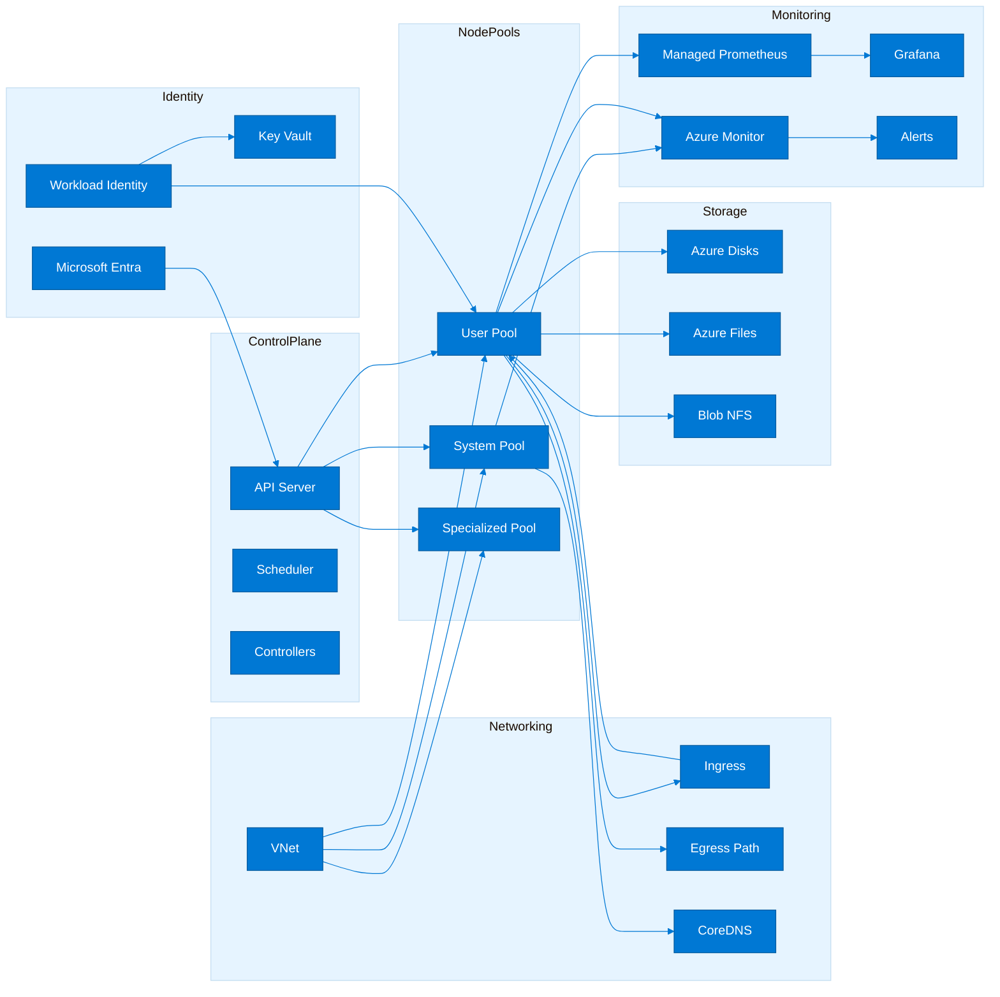

### AKS vs alternatives

| Service | Primary use case | Complexity | Cost profile | Team skill needed |
|---|---|---|---|---|
| AKS | Multi-service platforms needing Kubernetes APIs, operators, custom policies, and sophisticated deployment patterns | High | Moderate to high depending on node pools and add-ons | Strong Kubernetes and Azure platform engineering |
| Azure Container Apps | Microservices and jobs where serverless operations, scale-to-zero, and revision management are preferred | Medium | Consumption-friendly for bursty workloads | Container and app operations with minimal Kubernetes expertise |
| Azure App Service | Web apps and APIs that do not need Kubernetes scheduling or CRDs | Low | Predictable for standard web workloads | Application platform operations |
| Azure Container Instances | Short-lived isolated workloads, one-off jobs, test harnesses, or spiky side workloads | Low | Higher unit cost but low ops cost | Basic container operations |

### Architecture principles for AKS

1. Adopt AKS only when the workload genuinely needs Kubernetes abstractions such as custom controllers, advanced scheduling, or ecosystem tooling.
2. Design for failure domains by default with zone-aware node pools, multi-replica workloads, and clear regional strategies.
3. Separate platform concerns from application concerns through namespaces, policies, quotas, and GitOps repositories.
4. Prefer managed Azure integrations when they reduce toil without removing required control.
5. Keep identity explicit, least privileged, and observable from the first cluster release.
6. Make IP planning, DNS, ingress, and egress decisions before application onboarding begins.
7. Treat observability, backup, and upgrade engineering as first-class platform capabilities.
8. Minimize snowflake configuration by publishing reusable cluster, namespace, and workload baselines.
9. Use policy to encode standards instead of relying on tribal knowledge or manual review alone.
10. Continuously review whether AKS remains the right host for each workload as requirements evolve.

### Recommended platform standards

| Standard area | Baseline recommendation | Architect rationale |
|---|---|---|
| Cluster identity | Enable Microsoft Entra, OIDC issuer, and Workload Identity | Creates a modern authentication path for operators and workloads |
| Node pool model | Dedicated system pool plus at least one user pool | Separates cluster services from business workloads |
| Ingress standard | Publish one approved ingress pattern per trust boundary | Avoids controller sprawl and inconsistent TLS handling |
| Network policy | Default deny for sensitive namespaces with documented exceptions | Reduces lateral movement and clarifies service dependencies |
| Secrets | Key Vault CSI driver or external secret sync pattern | Avoids secret drift and centralizes rotation |
| Telemetry | Azure Monitor plus managed Prometheus for platform metrics | Delivers Azure-native operations with Kubernetes-native metrics |
| Deployment model | GitOps for cluster and namespace configuration | Improves auditability and repeatability |
| Upgrade policy | Quarterly review with non-production canary cluster validation | Reduces surprise API breaks and add-on incompatibilities |

### Landing zone decisions that should be made before cluster creation

- Subscription placement and whether platform clusters live in a dedicated subscription or per-business-unit subscriptions.
- Resource group split between cluster infrastructure, supporting network resources, and shared observability assets.
- Private DNS zone ownership for private clusters and private endpoints used by dependencies.
- Hub-and-spoke, virtual WAN, or flat network topology expectations from enterprise networking teams.
- Outbound control pattern using standard load balancer, managed NAT gateway, or Azure Firewall.
- Container registry placement, geo-replication needs, and image promotion process across environments.
- Naming and tagging standards for chargeback, support, and lifecycle governance.
- Support model for node pool sizing, maintenance, incident response, and emergency break-glass access.
- Policy inheritance model across management groups, subscriptions, and cluster namespaces.
- Backup ownership and evidence expectations for stateful workloads and cluster manifests.
- Regional disaster recovery model and how traffic management shifts during failover.
- SLO and error budget policy for both the shared platform and the applications it hosts.

### Baseline commands for platform discovery

```bash
export RG=rg-aks-architecture
export AKS=aks-architecture-prod

az aks show --resource-group $RG --name $AKS --query "{kubernetesVersion:kubernetesVersion,networkProfile:networkProfile.networkPlugin,identity:identity.type,oidc:oidcIssuerProfile.enabled}"
az aks nodepool list --resource-group $RG --cluster-name $AKS -o table
kubectl get nodes -o wide
kubectl get ns
kubectl get storageclass
kubectl get validatingwebhookconfigurations
kubectl top nodes
```

### Baseline namespace and quota pattern

```yaml
apiVersion: v1
kind: Namespace
metadata:
  name: payments
  labels:
    owner: platform-payments
    environment: prod
    azure.workload.identity/use: "true"
---
apiVersion: v1
kind: ResourceQuota
metadata:
  name: payments-quota
  namespace: payments
spec:
  hard:
    requests.cpu: "20"
    requests.memory: 64Gi
    limits.cpu: "40"
    limits.memory: 128Gi
    persistentvolumeclaims: "20"
---
apiVersion: v1
kind: LimitRange
metadata:
  name: payments-limits
  namespace: payments
spec:
  limits:
  - type: Container
    defaultRequest:
      cpu: 250m
      memory: 256Mi
    default:
      cpu: 1
      memory: 1Gi
```

### Common AKS architecture anti-patterns

- Running every workload in the default namespace with cluster-admin access delegated to application teams.
- Using a single node pool for system components, internet-facing apps, internal services, batch jobs, and stateful workloads.
- Selecting Azure CNI without validating subnet expansion headroom for future scale or maintenance surge.
- Treating ingress selection as a developer preference rather than a security, operations, and cost decision.
- Leaving secret material in Kubernetes Secret objects without external rotation strategy or workload identity integration.
- Skipping non-production upgrade rehearsals because the control plane is managed.
- Mixing platform observability and tenant observability data without role separation or cost controls.
- Allowing webhook or CRD sprawl without lifecycle ownership and compatibility testing.
- Sizing node pools only for steady state without accounting for rollouts, autoscaler surge, and system daemon overhead.
- Assuming a single cluster can cleanly satisfy every regulatory, blast radius, and networking requirement.

### Architecture review questions

1. Which workloads truly require Kubernetes APIs versus simpler Azure container runtimes?
2. What are the expected failure domains for cluster, zone, region, and dependency outages?
3. How will namespace isolation map to teams, applications, and environments?
4. What is the approved ingress and egress model for public and private services?
5. Which Azure services must workloads access, and how will identities be federated?
6. What is the version support policy for Kubernetes, Helm charts, and CRDs?
7. How will platform telemetry be separated from application telemetry?
8. What is the approved backup and recovery model for cluster manifests and persistent data?
9. How will the platform team prove compliance with security, policy, and configuration standards?
10. What is the exit criterion for moving a workload off AKS if requirements change?

---

## 2. Cluster Type Selection: AKS Standard vs AKS Automatic

Microsoft Learn: [AKS Automatic](https://learn.microsoft.com/en-us/azure/aks/intro-aks-automatic)

The cluster type decision is a foundational operating model choice. AKS Standard maximizes flexibility, while AKS Automatic reduces ongoing cluster engineering effort through opinionated automation.

### AKS Standard overview

- AKS Standard is the classic operating model with full visibility into node pools, networking choices, add-ons, and scaling strategy.
- It supports the broadest range of Kubernetes patterns, specialized node pools, custom networking designs, and enterprise integrations.
- Platform teams choose how and when upgrades occur, which node images are used, and what ancillary tooling is installed.
- It is the best fit when the organization already has Kubernetes operations capability or strict customization needs.
- Standard clusters align well with regulated environments that require explicit control over maintenance windows, workloads, and ingress stack selection.
- It supports mature GitOps, policy, service mesh, platform engineering, and internal developer platform initiatives.
- The trade-off is higher day-two operational ownership for capacity, patching, scaling boundaries, and add-on lifecycle management.
- Standard clusters are better when multiple ingress patterns, advanced node isolation, or niche CSI/CNI requirements are expected.
- A team adopting Standard should budget time for runbooks, SRE alerts, upgrade rehearsals, and policy governance.
- The platform roadmap should include version skew management across CLI tooling, manifests, Helm charts, and cluster add-ons.

### AKS Automatic overview

- AKS Automatic is designed for teams that want Kubernetes APIs but prefer Azure-managed operational defaults for common platform tasks.
- It is optimized for lower operational effort by leaning into opinionated configuration, managed scaling behaviors, and integrated best practices.
- Automatic reduces the number of cluster-level decisions that platform teams need to make up front.
- It is attractive for smaller platform teams, greenfield modernization efforts, or organizations standardizing on safe defaults.
- It can accelerate adoption when application teams need Kubernetes quickly but the enterprise does not want to run a bespoke platform layer.
- The trade-off is reduced customization compared to a fully curated Standard cluster estate.
- Automatic fits teams that would otherwise underinvest in patching, autoscaling, or baseline security engineering.
- It is also useful as a default platform tier for less complex business services that do not justify deep platform specialization.
- Governance remains necessary, but a larger share of baseline operations is shifted toward the managed service design.
- The decision should still account for compliance, network constraints, and feature availability for the target workloads.

### Comparison table

| Feature | AKS Standard | AKS Automatic |
|---|---|---|
| Node provisioning | Explicit node pool creation, sizing, labels, taints, and VM family choice | Managed defaults with less day-to-day infrastructure tuning |
| Upgrades | Customer-managed cadence and validation process | Managed experience with stronger opinionated automation |
| Scaling | Full control over autoscaler settings and pool topology | More managed scaling behaviors with simplified operations |
| Networking | Broadest networking choice set and integration flexibility | Opinionated networking defaults aligned to reduced operational overhead |
| Security defaults | Configurable by the customer with many optional integrations | Secure-by-default posture with reduced configuration surface |
| Cost model | Flexible but depends heavily on design discipline | Potentially lower operational cost but less architectural freedom |
| Best for | Enterprises with mature platform engineering and advanced requirements | Teams wanting faster adoption and less cluster engineering |
| Customization | Highest | Moderate and intentionally opinionated |

### Decision tree

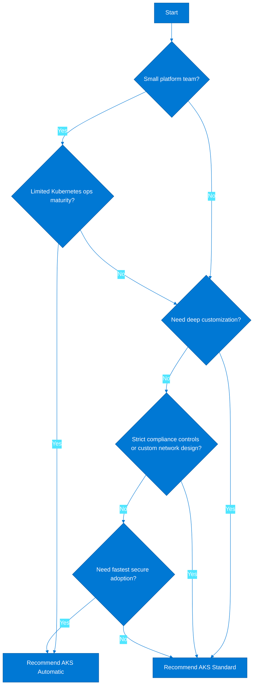

### Choose AKS Standard when

- The platform team needs multiple node pool classes including Windows, GPU, spot, or confidential workloads.
- A custom hub-and-spoke network model, firewall egress path, or private cluster design must be tightly integrated with enterprise networking.
- The organization needs a specific ingress controller, service mesh, CSI driver, or custom operator stack.
- Change management requires explicit maintenance windows and non-production promotion waves for upgrades.
- Teams must implement detailed policy sets, custom admission controls, or workload isolation patterns beyond opinionated defaults.
- The shared platform will host many teams with different workload characteristics and tiered node pools.
- FinOps depends on explicit tuning of autoscaler, spot usage, reserved instances, and node SKU selection.
- There is an existing Kubernetes platform practice and reusable standards already exist.
- The organization expects to integrate the cluster into broader platform engineering constructs such as Backstage or an internal developer portal.
- Advanced troubleshooting ownership already exists and the team wants maximum design freedom.

### Choose AKS Automatic when

- The organization wants Kubernetes APIs without building a large platform engineering function first.
- Application teams need a secure and opinionated default platform more than they need deep infrastructure tuning.
- The cluster footprint is limited and there is more value in speed and consistency than in bespoke optimization.
- The platform team is small, shared across many responsibilities, or still early in its AKS maturity journey.
- The business wants common operational tasks such as scaling and patching to rely more on the managed service.
- Workloads are mostly Linux-based web APIs, background jobs, and standard line-of-business services.
- A standardized operating model is preferred over team-by-team customization.
- The risk of underconfigured security or neglected maintenance is more concerning than reduced flexibility.
- The target delivery model is self-service without exposing many infrastructure choices to development teams.
- The organization is comfortable aligning to feature boundaries and supported scenarios of the managed model.

### Real-world scenarios

| Scenario | Context | Recommendation | Reasoning |
|---|---|---|---|
| Digital product startup | Two platform engineers, many product deadlines | AKS Automatic | Reduces cluster engineering toil while preserving Kubernetes APIs |
| Global retailer platform | Multiple regions, custom ingress, strict network controls | AKS Standard | Requires high customization and multi-team platform patterns |
| Enterprise integration hub | Many internal APIs, APIM, private networking, compliance gates | AKS Standard | Governance and network design outweigh simplified operations |
| Departmental modernization | A few internal services, limited ops maturity | AKS Automatic | Faster secure onboarding and less cluster design overhead |
| Data science platform | GPU nodes and specialized storage | AKS Standard | Specialized infrastructure requires explicit control |
| Default corporate runtime tier | Need a standard container platform for common services | AKS Automatic | Opinionated default reduces variability and support load |

### Azure CLI: create an AKS Standard cluster

```bash
export RG=rg-aks-standard
export AKS=aks-standard-prod
export LOCATION=eastus
export VNET=vnet-aks-standard
export SUBNET=snet-aks-standard

az group create --name $RG --location $LOCATION
az network vnet create --resource-group $RG --name $VNET --address-prefixes 10.80.0.0/16 --subnet-name $SUBNET --subnet-prefixes 10.80.0.0/22
SUBNET_ID=$(az network vnet subnet show --resource-group $RG --vnet-name $VNET --name $SUBNET --query id -o tsv)
az aks create   --resource-group $RG   --name $AKS   --network-plugin azure   --vnet-subnet-id $SUBNET_ID   --node-count 3   --node-vm-size Standard_D4ds_v5   --enable-managed-identity   --enable-oidc-issuer   --enable-workload-identity   --enable-cluster-autoscaler   --min-count 3   --max-count 10   --generate-ssh-keys
```

### Azure CLI: create an AKS Automatic cluster

```bash
export RG=rg-aks-automatic
export AKS=aks-automatic-prod
export LOCATION=eastus2

az group create --name $RG --location $LOCATION
az aks create   --resource-group $RG   --name $AKS   --sku automatic   --location $LOCATION   --generate-ssh-keys
az aks get-credentials --resource-group $RG --name $AKS --overwrite-existing
kubectl get nodes -o wide
```

### Standard cluster baseline add-ons to consider

- Azure Monitor Container Insights or managed Prometheus for platform telemetry.
- Ingress controller standard such as NGINX or Application Gateway integration.
- cert-manager or equivalent certificate automation pattern.
- Key Vault CSI driver and Workload Identity for secretless Azure access.
- Azure Policy for AKS and optional Gatekeeper constraint templates.
- GitOps operators such as Flux for desired-state reconciliation.
- Backup tooling such as Velero for cluster resources and persistent volumes.
- Defender for Containers for image and runtime threat coverage.
- Standard namespace, quota, and policy templates for onboarding teams.
- Upgrade validation pipeline that tests critical workloads against target versions.

### Automatic cluster governance notes

- Document which settings are intentionally managed by the service versus by the platform team.
- Publish application onboarding guidance that explains the supported workload patterns and non-supported edge cases.
- Define a decision checkpoint for when a workload must move from Automatic to Standard because of customization needs.
- Keep policy, namespace standards, identity, and observability expectations consistent with the broader platform estate.
- Avoid treating Automatic as a throwaway sandbox if it will host real business services.
- Validate how operational evidence such as logs, events, and change history are captured for audit purposes.
- Review cost behavior regularly because reduced operations toil does not automatically mean lower infrastructure spend.
- Train application teams on the opinionated platform boundaries to prevent unsupported deployments.
- Keep cluster architecture diagrams current so support teams know what is managed and what is customizable.
- Use the same SLO language and incident process that the enterprise uses for other production platforms.

### Migration checklist

1. Inventory current workloads, dependencies, and cluster extensions.
2. Classify each workload by required customization, compliance, and network characteristics.
3. Select a pilot service and validate ingress, identity, storage, and observability requirements.
4. Document operational responsibilities before and after the move.
5. Create landing zones, namespaces, policies, and RBAC groups ahead of cutover.
6. Test deployment pipelines, secrets access, and rollback procedures.
7. Run performance and scaling tests on the target cluster type.
8. Validate support evidence collection including metrics, logs, traces, and audit events.
9. Execute a production readiness review with platform, security, and application owners.
10. Define an exit strategy if the chosen cluster type no longer fits the workload.

---

## 3. Multiple Clusters vs Single Cluster Design

Microsoft Learn: [Kubernetes Fleet Manager overview](https://learn.microsoft.com/en-us/azure/kubernetes-fleet/overview)

Cluster topology is primarily a blast-radius and governance decision. The right answer depends on tenancy model, regional strategy, compliance scope, and the pace at which teams can absorb platform complexity.

### Single cluster advantages

- Lower fixed cost because the organization pays for fewer always-on system components and management surfaces.
- Simpler shared services footprint for ingress, policy, monitoring agents, and GitOps controllers.
- Easier initial adoption for small teams because there is one cluster to learn, secure, and patch.
- Higher bin-packing efficiency when many small workloads can share the same node pools.
- Centralized platform controls such as quotas, policies, and ingress templates can be rolled out rapidly.
- Shorter time to value for non-production environments when many teams only need basic namespaces.
- Monitoring and incident dashboards are initially simpler because platform data is concentrated.
- Suitable for early-stage platforms where team boundaries and compliance needs are still evolving.

### Single cluster disadvantages

- A misconfigured admission webhook, ingress change, or noisy workload can affect many teams at once.
- Compliance boundaries are harder to prove when regulated and non-regulated workloads share infrastructure.
- Upgrade coordination becomes difficult when every application team has a different maintenance expectation.
- Namespace-level isolation is not equivalent to subscription, network, or cluster-level isolation.
- Per-team platform experimentation becomes risky because cluster-wide controllers are shared.
- Resource pressure incidents are more likely to become enterprise-wide events.
- Regional DR is not solved by a single cluster no matter how well it is zonally distributed.
- Support ownership can become ambiguous when many teams share one runtime.

### Multiple cluster patterns

| Pattern | Description | Best fit | Trade-off |
|---|---|---|---|
| Per environment | Separate dev, test, staging, and prod clusters | Strong release governance and lower prod blast radius | Higher fixed cost and more fleet operations |
| Per team | Dedicated clusters by domain or product line | Autonomous platform behavior and clear ownership | Can create fragmentation and lower resource efficiency |
| Per region | Independent regional clusters with traffic steering | Latency, sovereignty, and disaster recovery requirements | Requires robust multi-region CI/CD and data strategy |
| Per workload type | Different clusters for internet-facing, internal, batch, or regulated workloads | Isolation based on risk or hardware profile | More architecture choices and support documentation |

### Multi-cluster topology

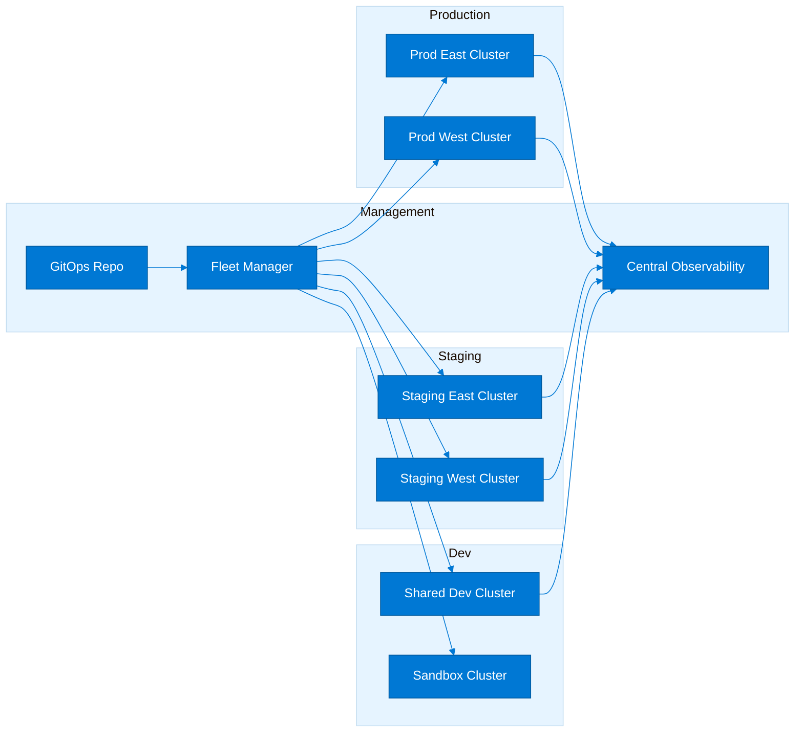

### Fleet Manager value proposition

- Provides a consistent control layer for multi-cluster resource propagation and upgrade orchestration use cases.
- Improves visibility across cluster estates where shared policy, workload placement, or promotion patterns are required.
- Reduces the temptation to script one-off cluster loops with fragile bash automation.
- Helps platform teams formalize how central standards move across dev, test, and prod estates.
- Supports platform-wide decisions such as staged rollout of manifests to multiple member clusters.
- Makes it easier to reason about fleet membership, region alignment, and lifecycle state.
- Enables a more structured approach to multi-cluster placement for active-active or active-passive scenarios.
- Pairs well with GitOps because desired state can be represented once and propagated intentionally.
- Does not remove the need for per-cluster observability, RBAC, and incident ownership.
- Should be part of the design when the estate has more than a handful of production clusters or a formal release ring model.
- Fleet management becomes especially valuable when platform teams want standard propagation without sacrificing cluster isolation.
- The feature set should be mapped to enterprise release governance before adoption.

### Cost comparison table

| Scenario | Single cluster cost profile | Multi-cluster cost profile | Recommendation |
|---|---|---|---|
| Startup with three small services | Lowest cost and simplest operations | Unnecessary overhead | Start with single cluster |
| Enterprise prod and non-prod | Lower direct cost but shared blast radius | Higher cost with safer separation | Use multiple clusters |
| Regulated payment service | Risky boundary mixing | Clearer compliance segmentation | Use dedicated clusters |
| Global active-active APIs | Cannot satisfy regional isolation alone | Expected cost for resilience | Use per-region clusters |
| Internal dev platform | Shared cluster often sufficient | Extra management burden | Use single shared dev cluster |
| Mixed GPU and standard workloads | Can work but harder to optimize | Clearer SKU and quota control | Use multi-cluster or specialized clusters |

### Decision criteria

| Criterion | Favors single cluster | Favors multiple clusters |
|---|---|---|
| Team count | Few teams with strong collaboration | Many teams with independent lifecycles |
| Compliance | Uniform controls across all workloads | Different controls by data class or business unit |
| Blast radius | Tolerance for shared operational risk | Need for strong isolation |
| Region strategy | Single-region acceptable | Multi-region required |
| Network design | Simple shared network | Distinct network zones or subscriptions |
| Upgrade cadence | Common maintenance window | Different release calendars |
| Cost sensitivity | Optimize fixed cost | Willing to pay for isolation |
| Platform maturity | Early platform stage | Mature SRE and platform engineering |
| Hardware specialization | Mostly homogenous workloads | Many specialized SKUs |
| Autonomy | Centralized operations preferred | Domain-aligned ownership required |

### Azure CLI fleet commands

```bash
export RG=rg-fleet
export LOCATION=eastus
export FLEET=fleet-platform

az group create --name $RG --location $LOCATION
az fleet create --resource-group $RG --name $FLEET --location $LOCATION
az fleet member create --resource-group $RG --fleet-name $FLEET --name prod-east --member-cluster-id $(az aks show -g rg-prod-east -n aks-prod-east --query id -o tsv)
az fleet member create --resource-group $RG --fleet-name $FLEET --name prod-west --member-cluster-id $(az aks show -g rg-prod-west -n aks-prod-west --query id -o tsv)
az fleet member list --resource-group $RG --fleet-name $FLEET -o table
```

### Multi-cluster governance model

- Define which standards are fleet-wide, which are environment-specific, and which remain application-team owned.
- Standardize tags, naming, and support contacts across all clusters so incident routing is deterministic.
- Publish a reference cluster blueprint rather than letting every team design its own cluster independently.
- Keep cluster creation automated through Terraform, Bicep, or a platform API to avoid drift.
- Use ring-based promotion where development and staging validate upgrades before production rollout.
- Separate cluster platform repositories from application repositories so ownership and change control are clear.
- Ensure telemetry labels identify cluster, environment, region, and business owner for cross-fleet triage.
- Document how shared services such as DNS, ingress certificates, and container registries are consumed by each cluster.
- Use consistent namespace standards so applications can move between clusters with minimal manifest changes.
- Treat fleet membership changes as architecture events because they alter propagation and operational scope.
- Practice regional failover drills so multi-cluster design is proven rather than assumed.
- Align RBAC and support model to the cluster boundary so escalation paths stay simple.

### Naming and subscription boundary guidance

1. Use subscription boundaries when cost ownership, compliance, or networking authority differs materially.
2. Keep production clusters in subscriptions with tighter policy and fewer ad hoc permissions.
3. Name clusters with region and environment in a way that is consistent across Azure, GitOps, and dashboards.
4. Reserve address spaces centrally to prevent overlapping CIDRs across future fleet members.
5. Choose whether shared services such as ACR and Log Analytics are global, regional, or environment-specific.
6. Document which DNS zones are shared across the fleet and which are delegated to application teams.
7. Ensure break-glass access follows the same pattern across every cluster.
8. Use one cluster blueprint per major topology class rather than one-off exceptions.
9. Align identity groups to support duties such as cluster-admin, platform-operator, namespace-admin, and read-only auditor.
10. Revisit topology annually because growth often changes the correct answer.

### GitOps and release ring guidance

- Promote cluster configuration from sandbox to dev to staging to production using immutable artifacts and pull requests.
- Model global and cluster-specific overlays separately so shared policy is not copied manually.
- Use pre-merge validation for schema, policy, and Kubernetes API compatibility.
- Version cluster add-ons independently from application workloads but validate their interactions.
- Treat secrets, certificates, and identity mappings as promotable configuration with controlled differences by environment.
- Use deployment waves for production regions to reduce simultaneous blast radius.
- Keep rollback plans documented for both application and platform configuration changes.
- Record who approved promotion into each ring to support audit and post-incident review.
- Ensure observability dashboards exist per ring so degradation in staging is visible before production impact.
- Validate fleet propagation timing against maintenance and release expectations.

---

## 4. Networking Options & Decision Tree

Microsoft Learn: [AKS networking concepts](https://learn.microsoft.com/en-us/azure/aks/concepts-network)

Networking is the most common source of architectural regret in AKS. The decision must balance IP efficiency, enterprise routing, policy support, platform simplicity, and future scale.

### kubenet overview

- kubenet is a lightweight network model that conserves VNet IP space by assigning pod IPs from a logically separate space.
- It can fit small or less network-complex clusters where IP conservation is more important than deep network integration.
- Operational teams must understand route management behavior and its implications for scale and troubleshooting.
- It is generally less aligned to highly regulated enterprise routing requirements than Azure CNI-based models.
- kubenet can be attractive for labs or smaller environments where address space is constrained.
- Teams should validate whether desired features and future roadmap items remain aligned to kubenet support.
- It can simplify some small-scale scenarios but may become limiting as platform standards mature.
- It is not usually the first recommendation for new enterprise platforms unless there is a clear IP exhaustion pressure.
- Architects should especially assess outbound path, peering, and network policy expectations before selection.
- Migration away from kubenet later is more expensive than choosing an appropriate model up front.

### Azure CNI overview

- Azure CNI assigns routable VNet addresses to pods, producing strong network visibility and alignment with Azure networking constructs.
- It is often the default choice for enterprises that need native routing, firewalls, NSGs, and private connectivity patterns.
- The main trade-off is IP consumption because pod density directly consumes subnet address space.
- Subnet growth planning must include autoscaler headroom, upgrade surge, and future node pool expansion.
- Azure CNI pairs well with private endpoints, Azure Firewall, hub-and-spoke routing, and enterprise DNS patterns.
- It supports teams that want pods to be first-class citizens in the network architecture.
- The model is operationally clear for network teams because packet flows map more directly to Azure constructs.
- It is well suited to internal service platforms and tightly integrated corporate networks.
- Architects should validate max pods, subnet sizing, and zonal spread before lock-in.
- The broader ecosystem fit usually outweighs the address cost when long-term platform scale is important.

### Azure CNI Overlay overview

- Azure CNI Overlay reduces VNet IP pressure by using an overlay pod address space while keeping Azure CNI operational characteristics.
- It is often the best compromise when teams want a modern networking model without dedicating massive VNet space to pods.
- Overlay supports higher pod scale with simpler IP planning compared to traditional Azure CNI.
- It is attractive for shared platforms that need many pods but still want Azure-aligned networking and policy features.
- Enterprise teams should review feature support, troubleshooting runbooks, and security controls as part of standardization.
- Overlay can reduce friction when address space is fragmented or centrally governed.
- It remains important to plan service CIDR, DNS IP, and egress architecture even when pod addressing is abstracted.
- New greenfield AKS platforms often shortlist Overlay early because it balances scale and manageability.
- Architects should confirm how the chosen ingress, policy, and monitoring stack behaves with overlay networking.
- Overlay still requires disciplined design for private cluster access, DNS, and outbound controls.

### Azure CNI dynamic IP allocation overview

- Dynamic IP allocation improves address utilization by allocating pod IPs in batches rather than statically reserving the maximum on every node.
- It is useful when teams want Azure CNI behavior but need better subnet efficiency.
- This model is especially relevant for platforms with variable density and many node pools.
- It can reduce wasted IP reservations while preserving VNet-integrated networking behavior.
- Architects should still reserve enough subnet space for surges, repairs, and future scaling events.
- Dynamic allocation is not a license to ignore address planning; it simply improves utilization.
- Operational teams should understand how scaling behavior consumes additional IP batches over time.
- It fits enterprises modernizing existing Azure CNI estates that have reached subnet pressure.
- Platform teams should validate tooling and documentation support for the selected mode.
- The decision should be documented clearly because troubleshooting assumptions differ from classic Azure CNI sizing.

### Networking comparison

| Feature | kubenet | Azure CNI | Azure CNI Overlay | Azure CNI Dynamic |
|---|---|---|---|---|
| IP efficiency | High | Low to medium | High | Medium to high |
| Enterprise routing alignment | Moderate | High | High | High |
| Operational simplicity at scale | Moderate | Moderate | High | Moderate |
| Pod density support | Moderate | Subnet-dependent | High | High with planning |
| Network policy support | Supported with validation | Strong | Strong | Strong |
| Best fit | Smaller clusters with IP pressure | Enterprise integrated networks | Modern shared platforms | Azure CNI estates needing better utilization |

### Networking decision tree

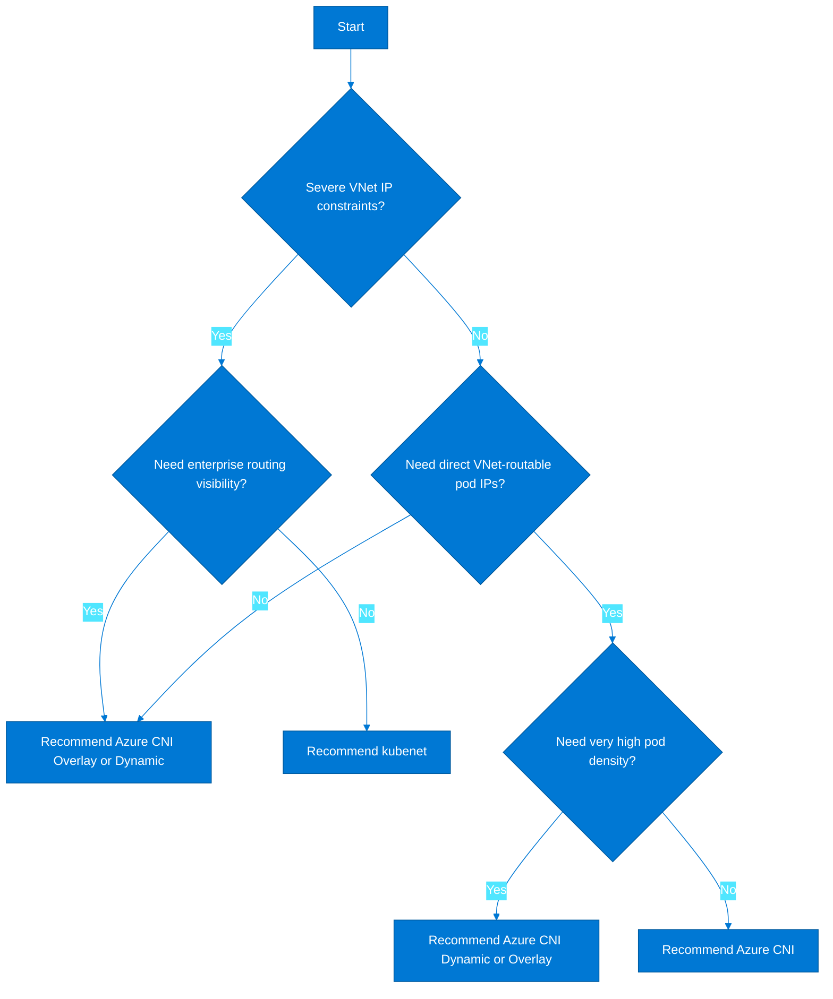

### Network policy options

| Policy engine | Strengths | Trade-offs | Best fit |
|---|---|---|---|
| Azure Network Policy | Azure-aligned operational model and simpler baseline enforcement | Fewer advanced features than some alternatives | Teams wanting native controls |
| Calico | Mature policy model and rich network policy ecosystem | Additional operational knowledge required | Teams needing advanced policy constructs |
| Cilium | eBPF-based networking and policy with strong modern feature set | Higher learning curve and platform change impact | Advanced platforms standardizing on eBPF capabilities |

### IP address planning for AKS

1. Reserve a VNet range that can support current environments plus at least one topology expansion cycle.
2. Choose non-overlapping CIDRs relative to on-premises, partner networks, and future peered VNets.
3. Size the node subnet for max nodes, upgrade surge, repair events, and future user pools.
4. Size the pod address space according to network model and max pods per node.
5. Allocate a service CIDR that will not overlap with any routable network the cluster must reach.
6. Select a DNS service IP from within the service CIDR and document it as a permanent cluster constant.
7. Account for internal load balancers, ingress controllers, private endpoints, and outbound appliances.
8. Reserve dedicated subnets for Application Gateway, Azure Firewall, or other shared network appliances.
9. Validate peering and route table scale limits if the cluster participates in a large hub-and-spoke design.
10. Document subnet ownership and an expansion path before any production workload launch.

### Useful IP planning heuristics

- For Azure CNI, start by estimating maximum nodes multiplied by maximum pods per node, then add surge and buffer.
- For shared clusters, reserve extra space for future dedicated node pools rather than assuming one large homogeneous pool forever.
- When using Overlay, still plan carefully for node IPs, services, ingress, and private endpoints.
- Keep the service CIDR large enough to avoid future service IP collisions as namespaces grow.
- Do not reuse the same non-routable ranges across regions if future mesh, peering, or DR is expected.
- Model blue-green cluster recreation in the address plan so a new cluster can coexist temporarily with the old one.
- Document which IP blocks are consumed by AKS versus by shared network appliances to reduce troubleshooting ambiguity.
- Treat NAT gateway ports and firewall SNAT capacity as part of network sizing, not as an afterthought.
- Use architecture diagrams that show data flows for ingress, east-west, and egress traffic explicitly.
- Review the address plan whenever a new environment, region, or workload isolation cluster is proposed.

### Azure CLI networking setup commands

```bash
export RG=rg-aks-network
export LOCATION=eastus
export VNET=vnet-aks-network
export AKS_SUBNET=snet-aks
export APPGW_SUBNET=snet-appgw

az group create --name $RG --location $LOCATION
az network vnet create --resource-group $RG --name $VNET --address-prefixes 10.100.0.0/16
az network vnet subnet create --resource-group $RG --vnet-name $VNET --name $AKS_SUBNET --address-prefixes 10.100.0.0/22
az network vnet subnet create --resource-group $RG --vnet-name $VNET --name $APPGW_SUBNET --address-prefixes 10.100.8.0/24
AKS_SUBNET_ID=$(az network vnet subnet show --resource-group $RG --vnet-name $VNET --name $AKS_SUBNET --query id -o tsv)
az aks create   --resource-group $RG   --name aks-network-prod   --network-plugin azure   --network-plugin-mode overlay   --vnet-subnet-id $AKS_SUBNET_ID   --pod-cidr 192.168.0.0/16   --service-cidr 172.20.0.0/16   --dns-service-ip 172.20.0.10   --generate-ssh-keys
```

### Sample network policy baseline

```yaml
apiVersion: networking.k8s.io/v1
kind: NetworkPolicy
metadata:
  name: default-deny
  namespace: payments
spec:
  podSelector: {}
  policyTypes:
  - Ingress
  - Egress
---
apiVersion: networking.k8s.io/v1
kind: NetworkPolicy
metadata:
  name: allow-from-ingress
  namespace: payments
spec:
  podSelector:
    matchLabels:
      app: payments-api
  ingress:
  - from:
    - namespaceSelector:
        matchLabels:
          role: ingress
    ports:
    - protocol: TCP
      port: 8080
  egress:
  - to:
    - namespaceSelector:
        matchLabels:
          role: platform-services
    ports:
    - protocol: TCP
      port: 443
  policyTypes:
  - Ingress
  - Egress
```

### Egress architecture options

| Option | Strength | Limitation | Typical use case |
|---|---|---|---|
| Standard load balancer outbound | Simple default | Less centralized control | Smaller environments |
| Managed NAT Gateway | Predictable outbound IPs and scale | Additional cost and subnet design | Production internet egress |
| Azure Firewall | Central filtering and policy | Higher cost and architectural complexity | Regulated outbound controls |
| Private endpoints | Avoids public egress for Azure PaaS | DNS and endpoint sprawl | Sensitive service-to-PaaS traffic |
| User-defined routes | Custom routing control | Operational burden | Hub-and-spoke enterprises |
| Service endpoint pattern | Simpler than private endpoints in some cases | Broader exposure than private link | Selective Azure service access |

### Network troubleshooting commands

```bash
kubectl get svc,ep -A
kubectl get networkpolicy -A
kubectl exec -n payments deploy/payments-api -- nslookup orders-api.default.svc.cluster.local
kubectl exec -n payments deploy/payments-api -- curl -I http://orders-api.default.svc.cluster.local:8080/healthz
kubectl describe node $(kubectl get nodes -o name | head -n 1)
az network watcher test-connectivity --source-resource $(az aks show -g rg-aks-network -n aks-network-prod --query nodeResourceGroup -o tsv) --dest-address contoso.database.windows.net --dest-port 1433
```

### Design heuristics

- Prefer Azure CNI Overlay for new shared enterprise clusters when IP scarcity and scale are both concerns.
- Prefer Azure CNI when enterprise network teams require pod-level routability and familiar tooling.
- Use kubenet only when its constraints are acceptable and clearly documented.
- Standardize one network policy engine per platform tier to simplify support.
- Treat DNS architecture as a first-class concern for private clusters and private endpoints.
- Keep ingress, egress, and service-to-PaaS traffic on an architecture diagram reviewed by security and networking teams.
- Avoid mixing too many trust zones in one cluster if network policy would become unmanageable.
- Validate network plugin decisions against future service mesh and CNI roadmap expectations.
- Build synthetic connectivity tests into CI/CD or platform health checks.
- Document how emergency troubleshooting works when the cluster is private and internet access is restricted.

---

## 5. Ingress Controller Comparisons & Decision Tree

Microsoft Learn: [Application Gateway Ingress Controller overview](https://learn.microsoft.com/en-us/azure/application-gateway/ingress-controller-overview)

Ingress architecture decides how TLS is terminated, how web traffic is inspected, how routing changes are operated, and who owns the internet-facing security boundary.

### NGINX Ingress Controller overview

- NGINX is Kubernetes-native and widely adopted, making it a familiar option for teams already invested in upstream tooling.
- It provides flexible annotations, path routing, header manipulation, and custom behavior close to the cluster edge.
- It is highly portable across clouds and on-premises environments.
- The platform team owns controller scaling, availability, and any adjacent WAF design unless using a separate edge service.
- It fits teams that want ingress behavior versioned directly with Kubernetes manifests.
- It may require more custom engineering for enterprise-grade edge security patterns.
- NGINX is often preferred when app teams need advanced ingress customization.
- Supportability improves when the platform publishes a constrained annotation policy and templated ingress classes.

### Azure Application Gateway Ingress Controller overview

- AGIC integrates AKS with Azure Application Gateway so the data plane and WAF live outside the cluster.
- It is appealing when the networking or security team already operates Application Gateway as a standard enterprise edge.
- It offers strong Azure-native integration for certificates, listeners, backend pools, and WAF policy.
- It shifts more ingress data plane responsibility to Azure infrastructure rather than cluster workloads.
- AGIC can reduce the number of in-cluster proxies the platform team must scale and patch.
- It requires subnet planning, gateway lifecycle management, and clarity on who owns routing changes.
- It fits regulated or centrally governed environments where shared edge standards matter.
- Application teams may have less direct self-service flexibility than with pure in-cluster ingress.

### Azure Native Ingress Controller overview

- ANIC provides a modern Azure-native ingress experience aligned to Application Gateway for Containers capabilities and current AKS evolution.
- It is attractive for teams that want Azure-managed ingress patterns with Kubernetes-friendly authoring.
- It aims to balance native Azure networking integration with a simplified operational model.
- ANIC can align well with platform teams that prefer Azure-managed control planes over self-managed ingress proxies.
- It should be validated against current feature availability, regional support, and organizational standards before broad rollout.
- It is a strong candidate when the platform wants to standardize on an Azure-first ingress roadmap.
- Architects should compare its feature set against NGINX annotations and AGIC operational patterns.
- It is best adopted through a deliberate reference implementation rather than ad hoc experimentation in production.

### Traefik overview

- Traefik is popular for teams that value dynamic configuration, middleware constructs, and developer-friendly routing features.
- It works well in Kubernetes-native environments that want a flexible open source ingress option beyond NGINX.
- Traefik can simplify some advanced routing and middleware patterns while remaining portable.
- Enterprise operations teams may need additional support model decisions compared to Azure-native options.
- It is best where team familiarity already exists or where specific middleware features are desired.
- It may not align as naturally with centralized Azure WAF governance as Application Gateway-based patterns.
- Like NGINX, it keeps more ingress runtime ownership inside the cluster.
- Platform standards should limit drift by publishing approved Helm values and CRD usage patterns.

### Ingress comparison table

| Feature | NGINX | AGIC | ANIC | Traefik |
|---|---|---|---|---|
| WAF support | External WAF needed | Native via Application Gateway WAF | Azure-native WAF-aligned pattern | External WAF needed |
| TLS termination | In cluster or at external edge | At Application Gateway | Azure-native ingress boundary | In cluster or at external edge |
| Path routing | Rich | Strong | Strong | Rich |
| Header manipulation | Rich annotations | Available with gateway features | Azure-native feature dependent | Rich middleware |
| Cost | Controller compute plus edge components | Gateway cost plus operational governance | Managed ingress cost model | Controller compute plus edge components |
| Complexity | Kubernetes-centric | Azure network-centric | Azure-managed centric | Kubernetes-centric |
| Enterprise support | Good with standardization | Strong in Azure enterprise environments | Strong when aligned to Azure roadmap | Depends on platform support model |

### Ingress decision tree

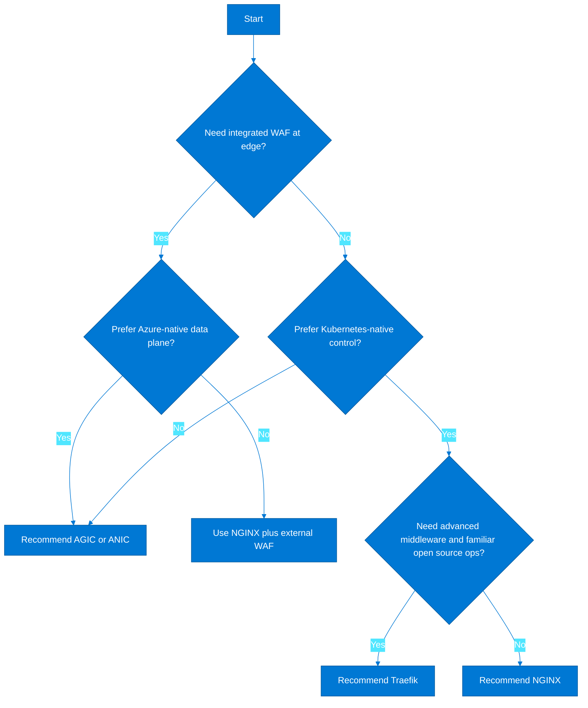

### TLS and certificate management

- Use a clear certificate ownership model: security team, platform team, or workload team.
- Prefer automated issuance and renewal through Key Vault, cert-manager, or managed gateway integration.
- Define whether TLS terminates at the gateway, the ingress controller, or both for re-encryption.
- Document cipher, protocol, and mTLS expectations per application trust zone.
- Use wildcard certificates only where risk and blast radius are acceptable.
- Separate internet-facing and internal trust chains if the organization uses private PKI internally.
- Store private keys in managed systems rather than ad hoc Kubernetes Secrets whenever possible.
- Build certificate expiry alerts into the platform baseline.
- Decide whether HTTP-to-HTTPS redirects are controller-standard or application-specific.
- Validate client IP preservation and header trust models when TLS terminates outside the cluster.
- For regulated workloads, prove how certificate rotation and revocation are governed.
- Use staging certificates and non-production DNS zones to validate automation before production issuance.

### NGINX ingress example

```yaml
apiVersion: networking.k8s.io/v1
kind: Ingress
metadata:
  name: payments-nginx
  namespace: payments
  annotations:
    kubernetes.io/ingress.class: nginx
    nginx.ingress.kubernetes.io/ssl-redirect: "true"
    nginx.ingress.kubernetes.io/proxy-body-size: 16m
spec:
  tls:
  - hosts:
    - payments.contoso.com
    secretName: payments-tls
  rules:
  - host: payments.contoso.com
    http:
      paths:
      - path: /
        pathType: Prefix
        backend:
          service:
            name: payments-api
            port:
              number: 80
```

### AGIC ingress example

```yaml
apiVersion: networking.k8s.io/v1
kind: Ingress
metadata:
  name: payments-agic
  namespace: payments
  annotations:
    kubernetes.io/ingress.class: azure/application-gateway
    appgw.ingress.kubernetes.io/backend-path-prefix: "/"
    appgw.ingress.kubernetes.io/ssl-redirect: "true"
spec:
  tls:
  - hosts:
    - payments.contoso.com
    secretName: payments-tls
  rules:
  - host: payments.contoso.com
    http:
      paths:
      - path: /
        pathType: Prefix
        backend:
          service:
            name: payments-api
            port:
              number: 80
```

### ANIC example

```yaml
apiVersion: gateway.networking.k8s.io/v1
kind: HTTPRoute
metadata:
  name: payments-route
  namespace: payments
spec:
  parentRefs:
  - name: payments-gateway
    namespace: ingress-system
  hostnames:
  - payments.contoso.com
  rules:
  - matches:
    - path:
        type: PathPrefix
        value: /
    backendRefs:
    - name: payments-api
      port: 80
```

### Traefik ingress example

```yaml
apiVersion: traefik.io/v1alpha1
kind: IngressRoute
metadata:
  name: payments-traefik
  namespace: payments
spec:
  entryPoints:
  - websecure
  routes:
  - match: Host(`payments.contoso.com`) && PathPrefix(`/`)
    kind: Rule
    services:
    - name: payments-api
      port: 80
  tls:
    secretName: payments-tls
```

### Operational trade-offs

| Decision area | Guidance |
|---|---|
| Public IP ownership | Define whether ingress IPs are managed by central networking or by the AKS platform team |
| DNS changes | Automate DNS updates where possible and align ownership to certificate management |
| Blue-green cutover | Use weighted traffic or parallel ingress classes when the edge allows it |
| WAF policy versioning | Store WAF policy definitions in source control and review with security |
| Logging | Ensure edge logs correlate to pod and service telemetry for end-to-end incident tracing |
| Rate limiting | Implement centrally for public APIs instead of inconsistently per app |
| Health probes | Keep readiness and gateway probes aligned to application behavior |
| Internal services | Use internal load balancers or private gateways rather than exposing everything publicly |

### Ingress review questions

1. Where is the primary trust boundary for internet and partner traffic?
2. Who owns WAF policy, certificates, and DNS changes?
3. Will teams require advanced per-route behavior that depends on controller-specific annotations or CRDs?
4. Does the organization prefer Kubernetes portability or Azure-native edge standardization?
5. How will internal-only applications be exposed to corporate consumers?
6. What is the logging and tracing path from edge request to pod?
7. Can the chosen controller support zero-downtime changes for critical routes?
8. What is the failure behavior if the ingress controller or edge gateway is unavailable?
9. How will developers request new routes without bypassing platform controls?
10. How will certificate rotation be tested and observed before expiration?

---

## 6. APIM Integration with AKS

Microsoft Learn: [Use Azure API Management with Kubernetes](https://learn.microsoft.com/en-us/azure/api-management/api-management-kubernetes)

Azure API Management adds productization, security, rate limiting, transformation, and governance in front of AKS-hosted APIs. It is often the correct front door for internal and external platform APIs.

### Azure API Management overview

- APIM decouples API consumer concerns from backend service implementation details.
- It centralizes authentication, authorization, quota, rate limiting, caching, and contract management.
- It provides a consistent portal and lifecycle process for internal, partner, and public APIs.
- APIM is especially valuable when many AKS services must be exposed with a common governance model.
- It reduces the need to implement cross-cutting API behaviors inside every microservice.
- It allows protocol translation, header manipulation, request validation, and response shaping.
- APIM can publish APIs that sit behind public ingress, private ingress, or even internal-only services.
- Its placement relative to AKS must match trust boundaries and network visibility requirements.
- Self-hosted gateway expands APIM policy enforcement into edge locations or Kubernetes clusters.
- Architects should separate runtime gateway design from developer portal and management plane concerns.
- APIM is not a replacement for ingress; it complements ingress by operating at the API product boundary.
- The biggest design decisions are exposure model, connectivity path, and ownership of API policies.

### Integration pattern: APIM in front of AKS public ingress

- Use when APIs are internet-facing and the enterprise wants APIM to enforce policy before traffic reaches AKS ingress.
- This pattern is straightforward for external developer programs and public API products.
- APIM can authenticate callers, apply rate limits, and forward only clean requests to ingress.
- The ingress controller still handles Kubernetes routing to services.
- Certificates, DNS, WAF, and client IP trust must be designed across both layers.
- This pattern is easy to reason about but introduces two HTTP control points that must be coordinated.
- It works best when the API surface is stable and managed as products rather than ad hoc service endpoints.

### Integration pattern: APIM to internal load balancer

- Use when APIs should not be publicly reachable from the internet and traffic should stay on private network paths.
- APIM can be deployed in internal mode or connected through private networking to AKS internal ingress.
- This pattern aligns well with enterprise integration hubs and line-of-business APIs.
- It reduces public exposure but increases DNS, VNet, and private connectivity design complexity.
- Private endpoints and hub-and-spoke routing are common companions to this model.
- The support model must cover private DNS and connectivity validation in addition to API policy behavior.
- This is often the preferred architecture for regulated internal APIs.

### Integration pattern: self-hosted gateway in AKS

- Use when APIM policies must execute close to the workload or within disconnected and edge scenarios.
- The control plane remains in APIM while gateway runtime executes inside AKS.
- This can reduce dependency on central network paths for policy enforcement.
- It is useful for hybrid, edge, or sovereign scenarios where local gateway presence matters.
- It requires operational ownership for gateway pods, scaling, and deployment lifecycle within AKS.
- Architects should clearly define whether ingress or gateway is the first policy enforcement point.
- Self-hosted gateway is powerful but should be adopted only when its locality benefits are clear.

### API request flow

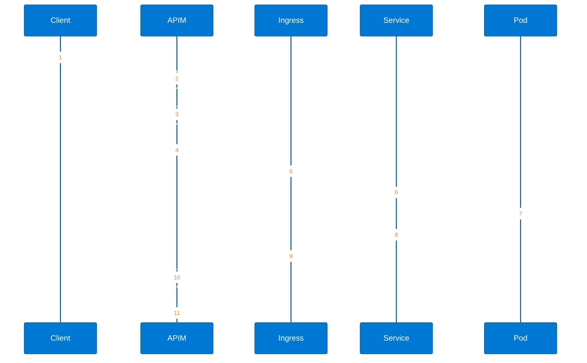

### APIM and AKS topology

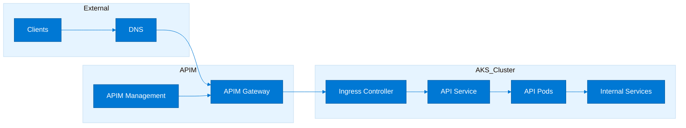

### Self-hosted gateway deployment YAML

```yaml
apiVersion: v1
kind: Namespace
metadata:
  name: apim-gateway
---
apiVersion: apps/v1
kind: Deployment
metadata:
  name: apim-selfhosted
  namespace: apim-gateway
spec:
  replicas: 2
  selector:
    matchLabels:
      app: apim-selfhosted
  template:
    metadata:
      labels:
        app: apim-selfhosted
    spec:
      containers:
      - name: gateway
        image: mcr.microsoft.com/azure-api-management/gateway:latest
        env:
        - name: config.service.endpoint
          value: https://contoso-apim.configuration.azure-api.net
        - name: config.service.auth
          valueFrom:
            secretKeyRef:
              name: apim-gateway-token
              key: value
        ports:
        - containerPort: 8080
        readinessProbe:
          httpGet:
            path: /status-0123456789abcdef
            port: 8080
        resources:
          requests:
            cpu: 250m
            memory: 512Mi
          limits:
            cpu: 1
            memory: 1Gi
---
apiVersion: v1
kind: Service
metadata:
  name: apim-selfhosted
  namespace: apim-gateway
spec:
  selector:
    app: apim-selfhosted
  ports:
  - port: 80
    targetPort: 8080
```

### APIM policy example

```xml
<policies>
  <inbound>
    <base />
    <validate-jwt header-name="Authorization" failed-validation-httpcode="401" failed-validation-error-message="Unauthorized">
      <openid-config url="https://login.microsoftonline.com/<tenant-id>/v2.0/.well-known/openid-configuration" />
      <required-claims>
        <claim name="aud">
          <value>api://payments</value>
        </claim>
      </required-claims>
    </validate-jwt>
    <rate-limit-by-key calls="100" renewal-period="60" counter-key="@(context.Subscription.Id)" />
    <set-header name="x-platform-correlation-id" exists-action="override">
      <value>@(context.RequestId)</value>
    </set-header>
    <rewrite-uri template="/api/v1/payments" />
  </inbound>
  <backend>
    <base />
  </backend>
  <outbound>
    <base />
  </outbound>
  <on-error>
    <base />
  </on-error>
</policies>
```

### Internal vs external APIM SKU considerations

| Decision area | Internal/private exposure | External/public exposure |
|---|---|---|
| Consumer type | Corporate apps and internal integrations | Partners, customers, external developers |
| Network model | Private networking and private DNS required | Public DNS and internet-facing endpoint |
| Security focus | Network containment and internal identity | WAF, bot protection, and internet abuse controls |
| Operational complexity | Higher network and DNS complexity | Higher public edge governance |
| Best fit | Line-of-business APIs and sensitive internal services | Monetized or public API products |

### Azure CLI APIM commands

```bash
export RG=rg-apim-aks
export LOCATION=eastus
export APIM=apim-contoso-platform

az group create --name $RG --location $LOCATION
az apim create --resource-group $RG --name $APIM --publisher-name Contoso --publisher-email platform@contoso.com --sku-name Developer --location $LOCATION
az apim api create --resource-group $RG --service-name $APIM --api-id payments --path payments --display-name "Payments API" --protocols https
az apim api operation create --resource-group $RG --service-name $APIM --api-id payments --operation-id get-payments --display-name "Get payments" --method GET --url-template "/"
az apim api release create --resource-group $RG --service-name $APIM --api-id payments --release-id v1 --notes "Initial release"
```

### Design recommendations

- Use APIM when the API consumer lifecycle is as important as the backend service lifecycle.
- Place APIM outside the cluster when enterprise policy, products, and developer onboarding are central concerns.
- Prefer private integration for internal APIs that should never be internet-addressable.
- Use self-hosted gateway only when locality, edge constraints, or disconnected operation justify the additional runtime footprint.
- Keep API versioning, productization, and policy definitions in source control.
- Correlate APIM request IDs with ingress and application logs for incident triage.
- Avoid duplicating authentication logic in every service when APIM can enforce common patterns centrally.
- Keep backend service contracts stable even if APIM performs transformations for consumers.
- Document ownership boundaries between API product team, platform team, and application team.
- Validate latency overhead introduced by APIM and ingress together for synchronous high-throughput APIs.
- Design for graceful degradation when APIM policies depend on external identity providers.
- Use canary or parallel APIM revisions when changing policies for critical APIs.

### Failure domains and HA considerations

| Failure point | Mitigation |
|---|---|
| APIM gateway unavailable | Use appropriate SKU, regional design, and health monitoring |
| Ingress unavailable | Run multiple ingress replicas or resilient gateway infrastructure |
| Private DNS failure | Document fallback validation and monitor DNS health |
| Backend pod failure | Use multiple replicas, readiness probes, and HPA |
| Identity provider latency | Cache tokens responsibly and monitor auth dependencies |
| Policy error | Version policies and test in lower environments before production rollout |

---

## 7. Service Mesh Comparisons

Microsoft Learn: [AKS Istio add-on overview](https://learn.microsoft.com/en-us/azure/aks/istio-about)

Service mesh is useful when traffic policy, service identity, and observability requirements are too complex to implement consistently in every application or ingress layer.

### Why service mesh

- Provides workload-to-workload mTLS with centrally managed certificates and identity.
- Enables retries, timeouts, traffic shifting, fault injection, and canary delivery at the network layer.
- Improves service-to-service observability with consistent metrics and tracing hooks.
- Helps platform teams enforce policies without requiring every service framework to implement the same controls.
- Supports zero-trust east-west communication patterns when combined with network policy and identity.
- Standardizes traffic governance across polyglot services.
- Can simplify progressive delivery patterns for multi-service releases.
- Should be adopted only when the operational overhead is justified by the complexity of the service estate.

### Istio overview

- Istio is feature-rich and widely adopted for advanced traffic management, security, and observability.
- It supports mTLS, virtual services, destination rules, gateways, authorization policies, and extensibility.
- It has the broadest ecosystem but also the largest learning curve and resource overhead.
- Istio is often selected for complex microservice estates with sophisticated release and security requirements.
- Its operational model should be standardized through platform abstractions and golden patterns.
- Teams should avoid exposing every raw Istio capability directly to every application team.
- The AKS add-on reduces some operational burden compared with fully self-managed Istio.
- It remains best for teams willing to invest in mesh architecture and governance.

### Linkerd overview

- Linkerd emphasizes simplicity, strong defaults, and lower overhead compared with larger meshes.
- It is appealing for teams that want mTLS and observability without the full complexity of Istio.
- Its traffic management feature set is lighter but often sufficient for common service platform needs.
- Linkerd can be a good fit for internal platforms prioritizing ease of operation.
- Teams should still validate feature fit for advanced routing, gateways, and policy needs.
- It can be easier to onboard application teams due to its smaller conceptual surface.
- Support model and enterprise alignment should be assessed if large-scale adoption is planned.
- It is strongest when simplicity is a core requirement.

### Open Service Mesh (OSM) / Cilium Service Mesh overview

- OSM historically targeted a simpler SMI-aligned service mesh model, while Cilium service mesh brings eBPF-based networking and security capabilities.
- Cilium is particularly attractive when teams already standardize on eBPF networking and want to unify policy and observability layers.
- OSM is lighter but less feature-rich, while Cilium can be powerful but operationally advanced.
- Both options require careful validation against enterprise support expectations and feature maturity.
- These meshes may fit platform teams optimizing for specific network architectures rather than general-purpose feature breadth.
- Cilium can reduce sidecar footprint in some architectures depending on deployment mode.
- The right choice depends heavily on existing CNI, policy, and observability strategy.
- They are best adopted intentionally, not as opportunistic experiments.

### Azure Service Mesh (Istio add-on) overview

- Azure Service Mesh using the managed Istio add-on gives teams an Azure-supported path to Istio capabilities on AKS.
- It lowers some day-two burden compared to self-managing all mesh control plane components.
- It is compelling for enterprises that want Istio features and Azure-aligned operations.
- The add-on should still be validated for required gateways, revisions, and supported features.
- It is often the recommended starting point for Istio on AKS unless a strong reason exists for self-management.
- Platform teams should still provide abstractions for traffic policy and mesh onboarding.
- Observability, capacity, and certificate design remain essential architecture concerns.
- Managed does not mean zero governance; service mesh remains a platform capability requiring design discipline.

### Service mesh comparison table

| Feature | Istio | Linkerd | Cilium | OSM |
|---|---|---|---|---|
| mTLS | Strong | Strong | Strong | Supported |
| Traffic policies | Very rich | Moderate | Rich and network-centric | Moderate |
| Observability | Rich ecosystem | Good defaults | Strong with eBPF context | Basic to moderate |
| Resource overhead | Higher | Lower | Varies by mode | Lower |
| Learning curve | High | Medium | High | Medium |
| Azure integration | Strong via AKS add-on | Indirect | Depends on broader platform choice | Limited |

### Service mesh decision tree

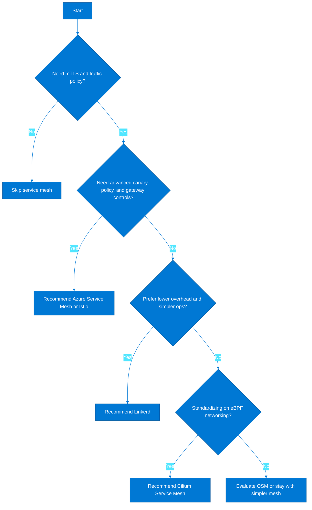

### Install Istio add-on on AKS

```bash
export RG=rg-aks-mesh
export AKS=aks-mesh-prod

az aks mesh enable --resource-group $RG --name $AKS
az aks mesh get-revisions --resource-group $RG --name $AKS -o table
kubectl get pods -n aks-istio-system
kubectl get mutatingwebhookconfigurations | grep istio
```

### Service mesh architecture

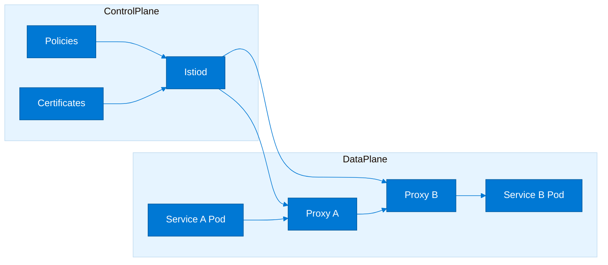

### Traffic management example

```yaml
apiVersion: networking.istio.io/v1beta1
kind: DestinationRule
metadata:
  name: checkout-dr
  namespace: retail
spec:
  host: checkout
  trafficPolicy:
    tls:
      mode: ISTIO_MUTUAL
  subsets:
  - name: stable
    labels:
      version: v1
  - name: canary
    labels:
      version: v2
---
apiVersion: networking.istio.io/v1beta1
kind: VirtualService
metadata:
  name: checkout-vs
  namespace: retail
spec:
  hosts:
  - checkout
  http:
  - route:
    - destination:
        host: checkout
        subset: stable
      weight: 90
    - destination:
        host: checkout
        subset: canary
      weight: 10
```

### Rollout strategy

1. Start with one non-critical namespace and validate sidecar injection, latency, and telemetry.
2. Enable mTLS in permissive mode first if the estate is large or heterogeneous.
3. Publish traffic policy patterns for retry, timeout, and canary rather than letting every team invent its own.
4. Test ingress and egress interactions because service mesh often changes traffic paths and headers.
5. Baseline CPU and memory overhead before large-scale adoption.
6. Roll out by environment and business criticality rather than enabling mesh everywhere at once.
7. Use revision-based upgrades or staged control plane changes where supported.
8. Train incident responders on mesh-specific telemetry and failure modes.
9. Document how to temporarily bypass or disable mesh for emergency troubleshooting.
10. Review whether every namespace truly benefits from mesh before full adoption.

### Operational guardrails

- Keep service mesh CRDs and policies under the same change control rigor as cluster policy.
- Use namespace labels or onboarding workflows to control where injection is allowed.
- Limit who can create powerful mesh objects such as gateways and authorization policies.
- Monitor certificate rotation, webhook health, and control plane capacity continuously.
- Avoid combining too many major platform changes at once, such as new CNI plus new mesh plus new ingress.
- Establish latency budgets that account for proxy hops.
- Correlate mesh metrics with application SLOs so overhead is visible in business terms.
- Version traffic policies carefully to avoid partial rollout confusion.
- Define runbooks for certificate failure, webhook outage, and policy misconfiguration.
- Review mesh necessity annually because not every workload needs it forever.
- Keep the mesh control plane isolated from noisy application pools when possible.
- Validate sidecar behavior for jobs, daemonsets, and stateful workloads before broad rollout.

---

## 8. Storage & Stateful Workloads

Stateful workloads on AKS require explicit design for durability, performance, backup, and failover. Many architectures should still prefer managed PaaS data stores, but AKS can host stateful workloads when the constraints are understood.

### Azure Disks

- Best for zonal block storage with strong performance for single-writer databases and queue engines.
- Typically used with ReadWriteOnce access patterns and StatefulSets.
- Volume zone alignment matters because pods must schedule where the disk can attach.
- Premium and Ultra tiers support higher performance but cost more.
- Disk expansion and backup operations should be tested per workload.
- Use deliberate StorageClass defaults so teams do not overprovision expensive disks.
- Excellent fit for single-instance or sharded database patterns.
- Recovery procedures must include volume restore and pod rescheduling behavior.

### Azure Files

- Provides shared file semantics with ReadWriteMany support for content stores and shared application state.
- Useful for legacy applications that require POSIX-like shared file access.
- Performance characteristics differ from block storage and should be validated carefully.
- It is convenient for shared assets, uploads, and configuration artifacts.
- Application locking behavior should be tested to avoid corruption assumptions.
- Cost and throughput vary by tier and workload shape.
- Suitable when horizontal pods need concurrent file access.
- Backup and restore can align with file share tooling and snapshots.

### Azure Blob via NFS

- Useful for large-scale object-style storage needs exposed over NFS patterns.
- Can fit analytics, media, and archive-adjacent workloads requiring shared access.
- Latency characteristics are different from disks and should not be assumed database-grade.
- Strong option when data volume is large and cost efficiency matters more than low-latency random IO.
- Application compatibility should be validated because object-backed file semantics differ from true block storage.
- This pattern is more architectural and less default than disk-backed persistent volumes.
- It often pairs well with data processing workloads rather than transactional databases.
- Security and network exposure need explicit design when using NFS endpoints.

### Azure NetApp Files

- Premium shared storage option for high-performance file workloads and enterprise-grade stateful applications.
- Appropriate for demanding shared storage scenarios such as SAP-adjacent or high-throughput workloads.
- Typically more expensive but delivers strong performance and enterprise storage features.
- Useful when Azure Files performance or feature profile is insufficient.
- Requires deliberate subnet and service delegation planning.
- Best for workloads whose storage needs are strategic enough to justify the premium tier.
- Support and operations should involve storage specialists, not only Kubernetes operators.
- It can be the right answer for specialized enterprise workloads with strong file performance needs.

### Storage comparison table

| Storage type | Access mode | Performance profile | Best use case | Cost tier |
|---|---|---|---|---|
| Azure Disks | ReadWriteOnce | High for block workloads | Databases, queues, single-writer apps | Medium to high |
| Azure Files | ReadWriteMany | Moderate shared file performance | Shared content and legacy file needs | Medium |
| Azure Blob NFS | Shared NFS-style access | Capacity-oriented | Large content, analytics, archives | Low to medium |
| Azure NetApp Files | ReadWriteMany | High enterprise file performance | High-throughput shared state | High |

### StatefulSet patterns for databases

- Use StatefulSets when stable network identity and persistent volume identity are required.
- Keep one StatefulSet per data service role to simplify scaling and maintenance behavior.
- Use anti-affinity and topology spread constraints so replicas do not collapse onto one node or zone.
- Pin databases to dedicated node pools when noisy-neighbor risk is unacceptable.
- Define PodDisruptionBudgets to protect quorum-based systems during voluntary maintenance.
- Use init containers for schema or bootstrap tasks only when idempotency is proven.
- Keep liveness probes conservative for databases to avoid restart storms during transient slow IO.
- Use readiness probes to protect clients from hitting a pod before replication or startup is complete.
- Document data repair, failover, backup, and restore procedures outside of Kubernetes manifests.
- Prefer managed databases when the organization cannot fully own stateful runbooks.
- Test node drain, zone loss, and storage detach scenarios before production launch.
- Use operators only when the team is prepared to own operator lifecycle and version compatibility.

### Persistent Volume and StorageClass example

```yaml
apiVersion: storage.k8s.io/v1
kind: StorageClass
metadata:
  name: managed-csi-premium
provisioner: disk.csi.azure.com
allowVolumeExpansion: true
reclaimPolicy: Retain
volumeBindingMode: WaitForFirstConsumer
parameters:
  skuname: Premium_LRS
---
apiVersion: v1
kind: PersistentVolumeClaim
metadata:
  name: postgres-data
  namespace: data
spec:
  accessModes:
  - ReadWriteOnce
  storageClassName: managed-csi-premium
  resources:
    requests:
      storage: 256Gi
```

### StatefulSet example

```yaml
apiVersion: apps/v1
kind: StatefulSet
metadata:
  name: postgres
  namespace: data
spec:
  serviceName: postgres
  replicas: 1
  selector:
    matchLabels:
      app: postgres
  template:
    metadata:
      labels:
        app: postgres
    spec:
      containers:
      - name: postgres
        image: postgres:16
        ports:
        - containerPort: 5432
        env:
        - name: POSTGRES_DB
          value: appdb
        - name: POSTGRES_PASSWORD
          valueFrom:
            secretKeyRef:
              name: postgres-secret
              key: password
        volumeMounts:
        - name: data
          mountPath: /var/lib/postgresql/data
  volumeClaimTemplates:
  - metadata:
      name: data
    spec:
      accessModes:
      - ReadWriteOnce
      storageClassName: managed-csi-premium
      resources:
        requests:
          storage: 256Gi
```

### Storage decision tree

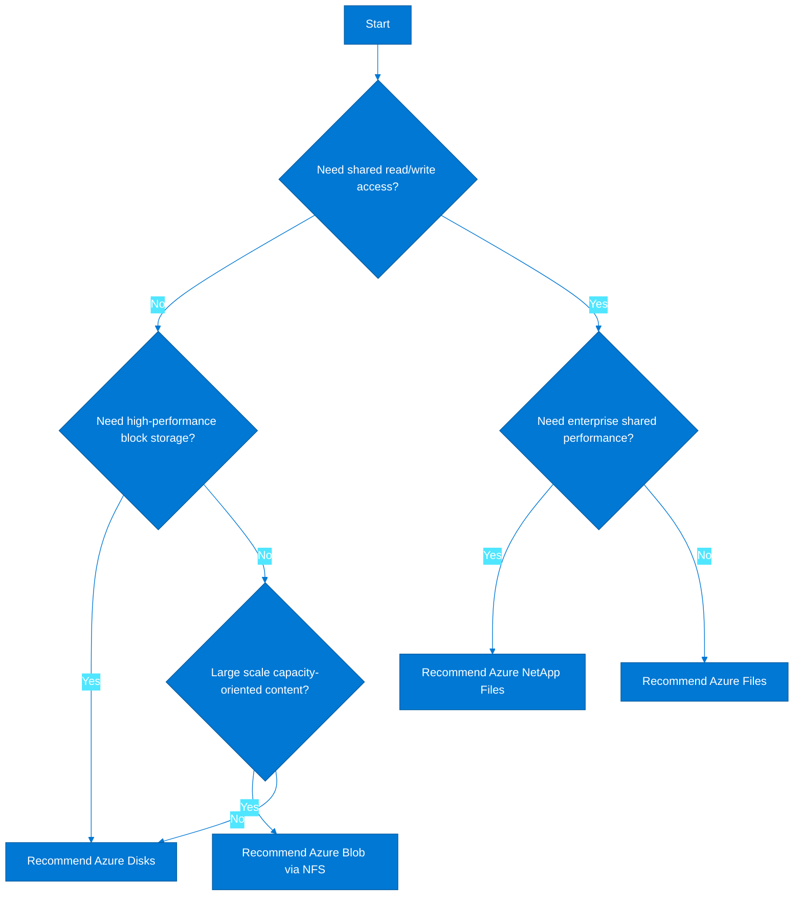

### Backup strategies for stateful workloads

- Combine infrastructure backup, volume snapshot strategy, and application-consistent backup where required.
- Do not assume persistent volumes alone create a recovery plan; test restore into a fresh namespace or cluster.
- Use Velero or equivalent for Kubernetes object backup, but validate data-plane consistency for databases separately.
- Align retention, encryption, and geo-redundancy policy with data classification rather than cluster defaults.
- Document RPO and RTO per workload because stateful services often have very different business requirements.
- Keep backup credentials and storage locations protected with workload identity and RBAC.
- Test cross-region restore if the workload participates in a disaster recovery strategy.
- Automate backup validation with periodic restore drills rather than trusting success logs alone.
- Consider replica-based recovery patterns for distributed databases in addition to storage snapshots.
- Publish runbooks that show sequence: quiesce if needed, snapshot, restore, validate, reopen traffic.
- Review storage reclaim policies so accidental PVC deletion does not destroy needed evidence or data.
- Monitor backup duration and cost because large volumes can create operational surprises.

### Azure CLI storage commands

```bash
export RG=rg-aks-storage
export LOCATION=eastus
export SA=staksbackup001

az group create --name $RG --location $LOCATION
az storage account create --resource-group $RG --name $SA --location $LOCATION --sku Standard_GRS --kind StorageV2
az aks show --resource-group rg-aks-storage --name aks-storage-prod --query "storageProfile"
kubectl get pvc,pv -A
kubectl describe storageclass managed-csi-premium
```

### Stateful anti-patterns

- Running production databases in the same shared node pool as stateless public web services.
- Using default reclaim policy Delete without understanding the data deletion consequences.
- Skipping topology-aware scheduling for zonal disks and then discovering failover limitations during incidents.
- Applying aggressive liveness probes that restart databases during transient latency.
- Treating Kubernetes backup of manifests as equivalent to database backup.
- Assuming ReadWriteMany storage is always acceptable for transactional workloads.
- Ignoring file-system permissions and fsGroup behavior until after deployment.
- Deploying stateful operators without clear ownership of their upgrades and CRDs.
- Neglecting storage performance testing with realistic load profiles.
- Using AKS for stateful workloads simply because the application already runs there rather than because it is the right platform.
- Forgetting to validate restore into a new cluster built from GitOps manifests.
- Leaving storage cost growth unmonitored for large persistent volumes.

### Database architecture considerations

| Consideration | Architect guidance |
|---|---|
| Primary/replica placement | Distribute replicas across zones and document failover behavior |
| Backup cadence | Match to RPO and transaction profile rather than default schedules |
| Volume expansion | Test online versus offline expansion paths |
| Upgrade path | Separate database engine upgrade from cluster upgrade plans |
| Encryption | Use platform and application-level encryption where required |
| Secrets | Store credentials externally and rotate without downtime |
| Monitoring | Collect storage latency, queue depth, and database-specific metrics |
| Exit strategy | Document how to move to managed PaaS if ownership becomes unsustainable |

---

## 9. Security Architecture

Microsoft Learn: [AKS security concepts](https://learn.microsoft.com/en-us/azure/aks/concepts-security)

AKS security must be layered. No single control is sufficient because the attack surface spans the internet edge, cluster control plane, node OS, container images, runtime policies, and secret access paths.

### Cluster security layer

- Use private cluster or authorized API server access depending on enterprise risk profile.
- Integrate Microsoft Entra for operator authentication and avoid local admin access where possible.
- Restrict who can create privileged workloads, webhooks, or cluster-scoped resources.
- Track supported Kubernetes versions and patch windows as a security responsibility.
- Use Azure Policy for AKS to enforce baseline constraints such as allowed images and security contexts.
- Protect control-plane access paths through least privilege, just-in-time access, and audit logging.
- Separate break-glass procedures from routine operator workflows.
- Validate that cluster configuration changes are captured in source control and change management.

### Node security layer

- Use dedicated system pools and keep node images on supported channels.
- Apply node pool isolation with taints, labels, and restricted administrative access.
- Monitor daemonsets and privileged containers because they expand node-level blast radius.
- Use Defender for Cloud and platform monitoring for node vulnerability and drift visibility.
- Limit SSH access and prefer managed troubleshooting processes.
- Review hostPath mounts and privileged flags in admission policy.
- Keep node pools small enough to rotate and patch predictably.
- Align node OS and kernel capabilities to workload requirements intentionally.

### Workload security layer

- Use non-root containers, read-only file systems, seccomp, and minimal Linux capabilities by default.
- Adopt Pod Security Standards or equivalent admission policies for namespace baselines.
- Use signed and scanned images from approved registries.
- Apply network policy to reduce lateral movement between services.
- Use readiness and startup probes to protect application behavior without creating exploitable restart loops.
- Prevent wildcard RBAC bindings and broad secret read permissions.
- Version security context templates so teams inherit hardened defaults.
- Scan manifests in CI before deployment to the cluster.

### Data security layer

- Use Key Vault and managed identities for secret retrieval instead of embedding secrets in manifests.
- Encrypt data at rest and in transit according to classification requirements.
- Use private endpoints or controlled egress for Azure PaaS dependencies handling sensitive data.
- Control backup storage, retention, and restore access with the same rigor as primary systems.
- Log secret access and key usage events where required for audit.
- Separate highly sensitive data workloads into dedicated namespaces or clusters when needed.
- Validate data purge and retention processes for stateful workloads.
- Ensure observability tools do not unintentionally exfiltrate sensitive payloads.

### Workload Identity

- Workload Identity replaces older pod identity patterns with OIDC federation between Kubernetes service accounts and Microsoft Entra applications or managed identities.
- It eliminates the need for node-level identity sharing and reduces credential sprawl inside the cluster.
- Each workload can map a service account to a least-privileged Azure identity.
- This model is more scalable and auditable than secret-based service principal credentials.
- It works best when namespaces, service accounts, and application ownership are already well structured.
- Adoption should include policy that blocks unmanaged secret-based Azure authentication where possible.
- Teams should document which identities are reusable platform identities versus application-specific identities.
- Token lifetime, audience, and trust boundaries should be reviewed by security architecture.
- Platform tooling should generate the service account annotations and federated credential resources consistently.
- Every Azure access path from AKS should have an identity owner, rotation owner, and review cadence.

### Workload Identity service account example

```yaml
apiVersion: v1
kind: ServiceAccount
metadata:
  name: payments-api
  namespace: payments
  annotations:
    azure.workload.identity/client-id: 11111111-2222-3333-4444-555555555555
---
apiVersion: apps/v1
kind: Deployment
metadata:
  name: payments-api
  namespace: payments
spec:
  replicas: 3
  selector:
    matchLabels:
      app: payments-api
  template:
    metadata:
      labels:
        app: payments-api
        azure.workload.identity/use: "true"
    spec:
      serviceAccountName: payments-api
      containers:
      - name: api
        image: contoso.azurecr.io/payments-api:v1
        env:
        - name: KEYVAULT_URI
          value: https://kv-platform.vault.azure.net/
```

### Microsoft Entra RBAC for Kubernetes

- Use Microsoft Entra groups to map human operators to Kubernetes roles rather than issuing individual bindings.
- Differentiate cluster administrators, namespace operators, read-only support, and security auditors.
- Use Azure RBAC for Kubernetes authorization when the enterprise wants consistent Azure role assignments to govern Kubernetes API access.
- Namespace ownership should be delegated through role bindings rather than broad cluster-admin grants.
- Emergency access should be rare, audited, and time-bound.
- Operator access should be reviewed on the same cadence as other privileged Azure roles.
- Avoid long-lived shared kubeconfig files stored outside controlled automation paths.
- Train teams on the difference between Azure RBAC, Kubernetes RBAC, and namespace-level rights.
- Use groups per environment to avoid accidental production access bleed from dev roles.
- Document how CI/CD systems authenticate to the cluster and how those permissions are constrained.

### Azure Policy for AKS

- Azure Policy for AKS can audit or deny resources that violate platform security and governance standards.
- Common policies include blocking privileged containers, requiring approved registries, and enforcing labels.
- Use audit mode first for broad rollout, then move critical controls to deny after remediation.
- Policy exceptions should be explicit, time-bound, and reviewed by security and platform owners.
- Keep policy definitions in source control and test them in lower environments before production rollout.
- Admission control latency and webhook availability should be monitored because policy becomes part of the control path.
- Policy is most effective when paired with templates and developer guidance that make compliance easy.
- Do not overload the cluster with conflicting policy engines without clear ownership.
- Map policies to control objectives such as CIS, PCI, or internal standards.
- Use dashboards that show compliance by cluster, namespace, and business owner.

### Defender for Containers

- Defender for Containers provides image scanning, runtime insight, and cloud security posture recommendations for AKS workloads.
- It helps surface vulnerable images before and after deployment depending on integration design.
- Security teams should align vulnerability severity thresholds with release policy.
- Findings must feed backlog or deployment gates instead of becoming passive dashboards.
- Runtime detections are most useful when incident responders know which namespace and business service own the affected pod.
- Defender complements but does not replace registry scanning, SBOM, or application security testing.
- Platform teams should validate data retention and regional requirements for security telemetry.
- Incident triage should correlate Defender findings with Kubernetes events and workload identity access logs.

### Security architecture layers

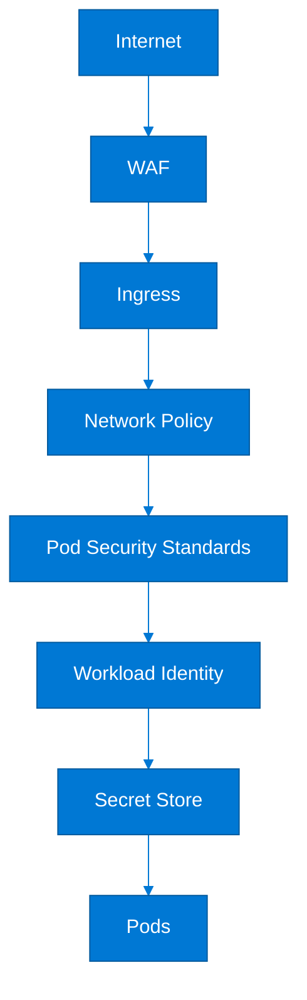

### Secret management with Key Vault CSI driver

```yaml
apiVersion: secrets-store.csi.x-k8s.io/v1
kind: SecretProviderClass
metadata:
  name: payments-kv
  namespace: payments
spec:
  provider: azure
  parameters:
    usePodIdentity: "false"
    clientID: "11111111-2222-3333-4444-555555555555"
    keyvaultName: "kv-platform"
    tenantId: "aaaaaaaa-bbbb-cccc-dddd-eeeeeeeeeeee"
    objects: |
      array:
        - |
          objectName: payments-db-password
          objectType: secret
        - |
          objectName: payments-signing-key
          objectType: secret
  secretObjects:
  - secretName: payments-app-secrets
    type: Opaque
    data:
    - objectName: payments-db-password
      key: db-password
    - objectName: payments-signing-key
      key: signing-key
---
apiVersion: v1
kind: Pod
metadata:
  name: secrets-demo
  namespace: payments
spec:
  serviceAccountName: payments-api
  containers:
  - name: app
    image: mcr.microsoft.com/oss/nginx/nginx:1.25.3
    volumeMounts:
    - name: secrets-store-inline
      mountPath: /mnt/secrets-store
      readOnly: true
  volumes:
  - name: secrets-store-inline
    csi:
      driver: secrets-store.csi.k8s.io
      readOnly: true
      volumeAttributes:
        secretProviderClass: payments-kv
```

### Security hardening checklist

| Control area | Hardening item | Status expectation |
|---|---|---|
| Cluster access | Microsoft Entra integration enabled | Required |
| API exposure | Private cluster or authorized IPs configured | Required |
| Identity | Workload Identity enabled | Required |
| Secrets | Key Vault CSI or equivalent external secret path | Required |
| RBAC | No routine cluster-admin for app teams | Required |
| Pod security | Pod Security Standards enforced | Required |
| Images | Approved registry and vulnerability scanning | Required |
| Node pools | Dedicated system pool and isolated sensitive workloads | Required |
| Policies | Azure Policy baseline applied | Required |
| Network | Network policy and controlled egress | Required |
| Logging | Security-relevant logs retained and queryable | Required |
| Backups | Restore-tested backup process for stateful workloads | Required |

### CIS benchmark alignment

- Map each applicable CIS Kubernetes benchmark control to a concrete AKS implementation or compensating control.
- Focus especially on RBAC, audit, pod security, secrets management, and API exposure controls.
- Document managed control-plane boundaries so auditors understand which controls are owned by Microsoft versus the customer.
- Use Azure Policy, admission control, and image governance to provide enforceable evidence.
- Retain architecture diagrams and runbooks as audit artifacts, not just operational aids.
- Review benchmark updates when Kubernetes versions change because recommendations evolve.
- Perform periodic namespace-level reviews to ensure app teams did not drift from baseline policies.
- Correlate CIS mapping to internal control IDs so evidence collection is reusable.
- Do not declare compliance solely because a managed service is used; validate workload and configuration scope.
- Test incident response and forensic logging because procedural readiness matters as much as configuration.
- Use policy exceptions sparingly and track expiry dates.
- Publish a cluster security scorecard to drive remediation transparency.

### Azure CLI security commands

```bash
export RG=rg-aks-sec
export AKS=aks-sec-prod

az aks show --resource-group $RG --name $AKS --query "{oidc:oidcIssuerProfile.enabled,azureRBAC:azurePortalFqdn,privateCluster:apiServerAccessProfile.enablePrivateCluster}"
az aks update --resource-group $RG --name $AKS --enable-oidc-issuer --enable-workload-identity
az aks enable-addons --resource-group $RG --name $AKS --addons azure-keyvault-secrets-provider
az policy assignment list --scope $(az aks show -g $RG -n $AKS --query id -o tsv) -o table
kubectl auth can-i get secrets -n payments --as=platform-reader
kubectl get psp 2>/dev/null || true
```

### Incident response preparation

1. Define who is paged for image vulnerability findings, runtime detections, and suspicious API activity.
2. Ensure logs from ingress, audit, workload, and security tools share correlation fields.
3. Predefine namespace quarantine and egress containment procedures.
4. Document how compromised workload identity credentials are revoked and rotated.
5. Run tabletop exercises for exposed secret, malicious image, and lateral movement scenarios.
6. Keep emergency policy templates ready to block unsafe images or privileged workloads.
7. Test how to capture pod state and logs before recreation during investigations.
8. Preserve evidence locations for storage snapshots and centralized logs.
9. Align AKS incident process with broader Azure SOC processes.
10. Review post-incident findings for platform-wide hardening opportunities.

---

## 10. Monitoring & Observability

Microsoft Learn: [Container Insights overview](https://learn.microsoft.com/en-us/azure/azure-monitor/containers/container-insights-overview)

Observability architecture must help operators answer three questions quickly: what is failing, why is it failing, and what should be done next. AKS platforms need unified metrics, logs, traces, and alerts across shared services and tenant workloads.

### Azure Monitor for containers

- Azure Monitor for containers gives a native landing zone for cluster logs, metrics, and operational views.
- It is often the baseline observability layer because it aligns with Azure-native alerting and workbooks.
- Platform teams can use it for node health, kube events, pod state, controller errors, and operational drill-down.
- It should be combined with namespace and application labels that make ownership clear.
- Retention and sampling settings should reflect cost and compliance constraints.
- Azure Monitor is particularly valuable when the operations center already uses Log Analytics and Azure alerts.
- It can coexist with Prometheus and tracing systems rather than replacing them.
- Its role should be documented clearly in the observability reference architecture.
- Cluster telemetry agent capacity must be accounted for in node sizing.
- Alert routing should map to service ownership, not just cluster ownership.

### Container Insights setup guidance

- Enable monitoring at cluster creation time where possible to avoid missing baseline data.
- Standardize workspaces by environment or region based on cost, sovereignty, and query design.
- Use saved queries and workbooks for shared incident workflows.
- Document how platform signals differ from application logs and who owns each.
- Review noisy log sources and reduce avoidable verbosity to control cost.
- Label namespaces and workloads for business owner, environment, and service criticality.
- Validate log collection for Windows pools separately if they exist.
- Use alert processing rules to keep actionable alerts visible and suppress duplicates.
- Keep retention long enough for security and trend analysis requirements.
- Link observability dashboards to runbooks rather than leaving operators with raw data alone.

### Prometheus and Grafana integration

- Managed Prometheus is ideal for Kubernetes and application metrics that already exist in Prometheus format.
- Grafana provides a strong visualization and dashboarding surface for SRE and application teams.
- Use standardized recording rules for core platform signals such as CPU saturation and pod restart rate.
- Keep alert rules versioned and reviewed like any other platform configuration.
- Document metric cardinality guidelines so application teams do not create cost explosions.
- Use Azure Monitor workspace integration where possible to simplify operational ownership.
- Prometheus complements Azure Monitor logs by offering high-resolution time-series visibility.
- A platform dashboard pack should exist before application onboarding accelerates.
- Grafana access should be role-based and aligned with environment sensitivity.
- Correlate Prometheus metrics with traces and logs in runbooks for faster triage.

### OpenTelemetry with AKS

- OpenTelemetry is the preferred standard for application tracing and portable telemetry instrumentation.
- Use it to capture spans, metrics, and logs from applications in a vendor-neutral way.
- OpenTelemetry collectors can run as daemonsets, deployments, or gateway services depending on architecture.
- A standard collector configuration should define exporters to Azure Monitor, Prometheus, or other approved backends.
- Sampling strategy must reflect traffic volume, cost, and debugging requirements.
- Platform teams should publish language-specific instrumentation guidance for common frameworks.
- Trace propagation headers should be preserved through ingress and APIM layers.
- Sensitive data should be redacted or excluded before export.
- Collector availability becomes part of the critical path for telemetry, so it requires scaling and monitoring.
- OpenTelemetry allows future backend changes without reinstrumenting every service.

### Observability stack

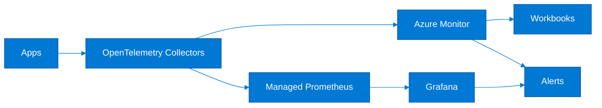

### Key metrics to monitor

| Metric | Threshold guidance | Alert action |
|---|---|---|
| Node CPU utilization | >85% sustained | Check autoscaler, workload pressure, and noisy neighbors |
| Node memory utilization | >85% sustained | Investigate pod memory growth and pending scale |
| Pod restart rate | Unexpected spikes | Inspect crash loops, probe failures, and rollout issues |
| Pending pods | Backlog over expected deployment window | Check capacity, taints, PVC binding, or quota |
| API server errors | Any sustained increase | Validate control plane health and client retry storms |
| Ingress 5xx rate | >1% or service-specific SLO threshold | Check upstream services and edge changes |
| Disk latency | Beyond application baseline | Investigate storage saturation or node contention |
| OOMKilled events | Any recurring pattern | Tune requests, limits, and memory leaks |
| HPA maxed out | Sustained at max replicas | Review capacity plan or application inefficiency |
| Image pull failures | Any production occurrence | Check registry access and image governance |
| Certificate expiry | <30 days | Trigger rotation workflow |
| Log ingestion anomalies | Sharp drop or surge | Validate agents and workload log behavior |

### Log query examples (KQL)

```kusto
KubePodInventory
| where TimeGenerated > ago(1h)
| summarize RestartCount=sum(ContainerRestartCount) by Namespace, ControllerName
| order by RestartCount desc

ContainerLogV2
| where TimeGenerated > ago(30m)
| where KubernetesNamespace == "payments"
| where LogMessage has_any ("ERROR", "Exception", "timeout")
| project TimeGenerated, KubernetesPodName, LogMessage
| take 100

KubeEvents
| where TimeGenerated > ago(2h)
| where Namespace == "payments"
| summarize count() by Reason, ObjectKind
| order by count_ desc
```

### Distributed tracing with Application Insights

```yaml
apiVersion: opentelemetry.io/v1beta1
kind: OpenTelemetryCollector
metadata:
  name: otel-gateway
  namespace: observability
spec:
  mode: deployment
  config: |
    receivers:
      otlp:
        protocols:
          grpc: {}
          http: {}
    processors:
      batch: {}
    exporters:
      azuremonitor:
        connection_string: "InstrumentationKey=<key>;IngestionEndpoint=https://eastus-8.in.applicationinsights.azure.com/"
    service:
      pipelines:
        traces:
          receivers: [otlp]
          processors: [batch]
          exporters: [azuremonitor]
```

### Azure CLI monitoring commands

```bash
export RG=rg-aks-observe
export AKS=aks-observe-prod
export LAW=log-aks-observe

az monitor log-analytics workspace create --resource-group $RG --workspace-name $LAW --location eastus
az aks enable-addons --resource-group $RG --name $AKS --addons monitoring
az aks update --resource-group $RG --name $AKS --enable-azure-monitor-metrics
kubectl get pods -n kube-system | grep ama
az monitor metrics list --resource $(az aks show -g $RG -n $AKS --query id -o tsv) --metric "node_cpu_usage_millicores"
```

### Alert design recommendations

- Alert on symptoms tied to SLOs first, then on infrastructure indicators that explain those symptoms.
- Separate page-worthy alerts from ticket-worthy alerts to reduce fatigue.
- Use dynamic thresholds only when historical patterns are stable enough to be meaningful.
- Ensure every alert links to a runbook and dashboard entry point.
- Aggregate by service owner and namespace so responders know who should act.
- Use composite views to avoid independent alerts from the same root cause flooding responders.
- Test alert routing quarterly by simulating failures in lower environments.
- Keep alert rules in source control for peer review and history.
- Measure mean time to detect and mean time to diagnose for major platform incidents.
- Review disabled and noisy alerts regularly to maintain trust in the platform signal set.
- Correlate business KPI drops with platform telemetry where possible.
- Capture observability cost trends as part of platform governance.

### Workbook and dashboard design questions

1. Can an operator see cluster, namespace, and workload health within one navigation path?
2. Do dashboards separate platform control-plane indicators from application performance indicators?
3. Are SLO burn-rate views available for critical services?
4. Can traces be pivoted from an ingress request into a pod log quickly?
5. Do dashboards highlight deployment changes next to performance regressions?
6. Is certificate, quota, and backup health visible without custom ad hoc queries?
7. Are region and cluster comparisons available for multi-cluster platforms?
8. Can support teams filter by owner, environment, and criticality labels?
9. Are dashboard permissions appropriate for non-production versus production data?
10. Can a new on-call engineer use the dashboards without tribal knowledge?

---

## 11. Production Readiness Checklist

Microsoft Learn: [Azure Well-Architected Framework](https://learn.microsoft.com/en-us/azure/well-architected/)

Production readiness is the synthesis of every earlier decision. An AKS platform is ready when its configuration, runbooks, ownership boundaries, and recovery paths are proven, not merely documented.

### Pre-production checklist

| Category | Item | Verified | Notes |
|---|---|---|---|
| Cluster Configuration | Kubernetes version supported and upgrade path documented | [ ] |  |
| Cluster Configuration | Dedicated system pool configured | [ ] |  |
| Cluster Configuration | Autoscaler min and max values reviewed | [ ] |  |
| Cluster Configuration | Resource quotas and limit ranges applied | [ ] |  |
| Networking | Service CIDR and VNet ranges documented | [ ] |  |
| Networking | Ingress pattern approved and tested | [ ] |  |
| Networking | Egress path controlled and monitored | [ ] |  |
| Networking | Private DNS dependencies validated | [ ] |  |
| Security | Microsoft Entra and RBAC model approved | [ ] |  |
| Security | Workload Identity enabled for Azure access | [ ] |  |
| Security | Policy baseline enforced | [ ] |  |
| Security | Image scanning and registry controls active | [ ] |  |
| Storage | Storage classes reviewed and default set intentionally | [ ] |  |
| Storage | Backup and restore test completed | [ ] |  |
| Monitoring | Metrics, logs, traces, and alerts validated | [ ] |  |
| Monitoring | Dashboards mapped to on-call workflows | [ ] |  |
| DR | Regional or cluster recovery strategy documented | [ ] |  |
| DR | GitOps source of truth confirmed | [ ] |  |
| CI/CD | Pipeline uses approved service connections and identities | [ ] |  |
| CI/CD | Rollback procedure tested | [ ] |  |
| Cost | Node pools sized with efficiency targets | [ ] |  |
| Cost | Reserved or spot strategy reviewed | [ ] |  |
| Operations | Runbooks and paging assignments approved | [ ] |  |
| Operations | Change calendar and maintenance windows defined | [ ] |  |

### Node pool sizing guide

| Workload type | Node size | Min nodes | Max nodes | Taints/labels |
|---|---|---|---|---|
| System services | Standard_D4ds_v5 | 3 | 6 | CriticalAddonsOnly=true:NoSchedule |
| General APIs | Standard_D4ds_v5 | 3 | 20 | workload=api |
| Memory-heavy services | Standard_E8ds_v5 | 2 | 10 | workload=memory |
| Batch jobs | Standard_D8ds_v5 | 0 | 30 | workload=batch |
| Spot workers | Standard_D4ds_v5 | 0 | 50 | kubernetes.azure.com/scalesetpriority=spot |
| GPU inference | Standard_NC6s_v3 | 0 | 6 | accelerator=gpu |
| Stateful databases | Standard_E8ds_v5 | 2 | 6 | workload=stateful |
| Ingress/edge | Standard_D4ds_v5 | 2 | 8 | role=ingress |

### Upgrade strategy

| Approach | Risk | Downtime expectation | Procedure |
|---|---|---|---|
| In-place rolling upgrade | Moderate | Low if workloads are well designed | Upgrade non-prod first, then control plane, then pools with surge |
| Blue-green cluster replacement | Lower platform risk but higher cost | Very low when cutover is staged | Create new cluster, sync config, migrate traffic |
| Regional canary first | Lower multi-region blast radius | Low | Upgrade one region, observe, then continue |
| Node pool-by-pool wave | Moderate | Low to moderate | Upgrade system pool carefully, then user pools by criticality |
| Service mesh revision upgrade | Feature-specific risk | Low if staged | Use revision labels and namespace migration |
| Emergency security patch | Higher change urgency | Variable | Use runbook with comms, surge, and rollback checkpoints |

### Disaster recovery for AKS

- Use Velero or equivalent to back up Kubernetes resources and, where appropriate, volume snapshots.
- Keep cluster infrastructure declarative in Terraform, Bicep, or GitOps so rebuild is reproducible.
- Separate data recovery from cluster recovery because restoring manifests does not restore business state.
- Define whether DR means same-region cluster recreation, cross-region warm standby, or active-active platform.
- Keep container images, charts, and manifests in replicated or recoverable stores.
- Practice cluster recreation into a clean subscription or resource group to prove environmental independence.
- Test private DNS, identity federation, and ingress cutover during DR exercises.
- Document who approves failover and how traffic is redirected.
- Measure actual recovery times during exercises, not estimated times.
- Review dependencies such as Key Vault, APIM, databases, and external DNS because AKS DR is never isolated from them.
- Maintain a service catalog that states each application's RTO, RPO, and failover prerequisites.
- Keep evidence from DR drills as part of production readiness governance.

### Velero backup example

```bash
velero install   --provider azure   --plugins velero/velero-plugin-for-microsoft-azure:v1.8.0   --bucket velero-backups   --secret-file ./credentials-velero   --backup-location-config resourceGroup=rg-velero,storageAccount=stvelerocontoso,subscriptionId=<sub-id>   --snapshot-location-config apiTimeout=5m

velero backup create aks-prod-daily --include-namespaces payments,orders,platform-system
velero schedule create aks-prod-nightly --schedule "0 2 * * *" --include-namespaces payments,orders,platform-system
velero restore create --from-backup aks-prod-daily
```

### DR workflow

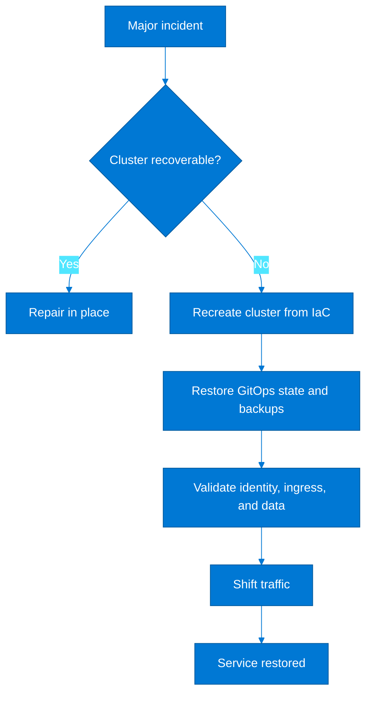

### Cost optimization checklist

- Right-size system pools so critical add-ons are safe but not overprovisioned.
- Use cluster autoscaler and HPA together with realistic min and max bounds.
- Adopt spot pools for interruption-tolerant workloads only.
- Use reserved capacity or savings plans for stable baseline node demand where financially appropriate.
- Review idle non-production clusters and consider scheduled scale-down.
- Set retention and sampling controls for telemetry to avoid unnecessary monitoring spend.
- Use Azure CNI Overlay or dynamic allocation when subnet waste is driving design inefficiency.
- Consolidate tiny workloads when single-purpose node pools do not justify their fixed overhead.
- Review storage tiers and reclaim policies so unused volumes are not silently billed forever.
- Track APIM, Application Gateway, Firewall, and Grafana costs as part of the platform bill, not as separate surprises.
- Use image lifecycle policies in ACR to remove stale artifacts.
- Benchmark node SKUs periodically because workload mix and Azure hardware options evolve.
- Use quotas and showback to discourage uncontrolled namespace growth.
- Automate cleanup for ephemeral environments and test namespaces.
- Pair FinOps reviews with architecture reviews so cost and reliability trade-offs remain explicit.

### AKS well-architected framework alignment

| Pillar | AKS consideration | Implementation |
|---|---|---|
| Reliability | Failure domains, upgrades, and DR | Zone-aware pools, rehearsed restore, regional strategy |
| Security | Identity, secrets, and policy | Workload Identity, Key Vault CSI, Azure Policy, Defender |
| Cost Optimization | Node efficiency and add-on spend | Autoscaling, spot usage, telemetry controls, rightsizing |
| Operational Excellence | Repeatable platform operations | GitOps, runbooks, standardized blueprints |
| Performance Efficiency | Scaling and workload placement | HPA, KEDA, specialized pools, storage tuning |

### Release readiness flow


### GitOps recovery baseline

```yaml
apiVersion: source.toolkit.fluxcd.io/v1
kind: GitRepository
metadata:
  name: platform-cluster
  namespace: flux-system
spec:
  interval: 1m
  url: https://github.com/contoso/platform-clusters
  ref:
    branch: main
---
apiVersion: kustomize.toolkit.fluxcd.io/v1
kind: Kustomization
metadata:
  name: prod-cluster
  namespace: flux-system
spec:
  interval: 10m
  path: ./clusters/prod-east
  prune: true
  sourceRef:
    kind: GitRepository
    name: platform-cluster
  wait: true
```

### Final production sign-off steps

1. Confirm the cluster architecture is diagrammed and stored in the platform repository.
2. Validate that ownership for platform, security, networking, and application support is explicit.
3. Run a full deployment and rollback exercise using the approved CI/CD path.
4. Execute a restore or DR drill proportional to workload criticality.
5. Review open policy exceptions and security findings before go-live.
6. Confirm node pool quotas, IP capacity, and cost guardrails are sufficient for launch volume.
7. Ensure all critical alerts are routed to active on-call schedules.
8. Validate APIM, ingress, certificates, and DNS from the user perspective.
9. Check that SLOs and error budgets are published and understood.
10. Verify that documentation includes routine operations, incident response, and escalation paths.
11. Record the go-live decision, known risks, and compensating controls.
12. Schedule the first post-launch architecture review while lessons are still fresh.

### Extended architect review prompts

- If the cluster were recreated tomorrow, which settings would still require manual intervention?
- Which workload is most likely to outgrow the chosen node pool design first?
- What evidence proves that identity access is least-privileged today?
- How would operators debug a private cluster outage if corporate DNS were degraded?
- Which dependencies sit outside the AKS blast radius but inside the application blast radius?
- What cluster add-on would create the largest production impact if it failed unexpectedly?
- Where is configuration drift most likely to appear, and how is it detected?
- What happens to public traffic if the ingress layer and APIM disagree about routing?
- How would a region-wide quota shortage affect the DR plan?
- Which observability signals are missing for the most critical user journey?
- How often are restore procedures timed rather than merely executed?
- What prevents an application team from bypassing approved ingress and secret patterns?
- Which costs are growing fastest and what architectural behavior drives them?
- What is the support plan for deprecated Kubernetes APIs used by older manifests?
- If a regulator requested architecture evidence tomorrow, which artifacts are ready?
- How is platform debt tracked when temporary exceptions become semi-permanent?
- Which workloads should move to a simpler Azure service if requirements change?
- What would prevent blue-green cluster replacement next quarter?
- How are service teams trained to use the platform safely without waiting on central experts?
- What is the measurable definition of platform success for the next 12 months?

