# Azure Cost Optimization Playbook

> **Screenshot Disclaimer:** Portal screenshots referenced in this guide are sourced from [Microsoft Learn](https://learn.microsoft.com/en-us/azure/) documentation. © Microsoft Corporation. All rights reserved. Used for educational reference only.

> A comprehensive Azure cost optimization guide with Mermaid diagrams, savings guidance, Azure CLI examples, and comparison tables.

## Document Goals

- Build a reusable reference for Azure commercial and technical cost optimization decisions.
- Cover pricing models, commitment options, operational tooling, governance, and workload-specific tactics.
- Provide Azure CLI examples that can be adapted to enterprise automation pipelines.
- Show where savings percentages usually come from and where optimization risk must be managed.
- Create a document that can be used by platform engineering, cloud finance, architects, and delivery teams.

## How to Use This Guide

1. Start with **Azure Pricing Models** to decide whether the workload should stay on pay-as-you-go or move to a commitment model.
2. Use **Reservations**, **Savings Plans**, and **Azure Hybrid Benefit** to optimize the commercial baseline.
3. Use **Advisor**, **Rightsizing**, **Storage**, **Network**, **Database**, and **AKS** sections to reduce run-rate waste.
4. Use **Cost Management + Billing**, **Tagging**, and **FinOps** sections to operationalize governance and accountability.
5. Revisit the **Monthly Azure Cost Review Checklist** every billing cycle.

## Portal references for FinOps operators

> 
>
> *Screenshot source: [Microsoft Learn — Quickstart - Start using Cost Analysis - Microsoft Cost Management](https://learn.microsoft.com/en-us/azure/cost-management-billing/costs/quick-acm-cost-analysis). © Microsoft Corporation. Used for educational reference only.*

> **Portal View:** Navigate to `Azure Portal` → `Cost Management + Billing` → `Budgets` → `Add`. The blade shows scope selection, reset period, alert thresholds, action groups, and forecast-based notifications used in monthly budget governance.
>
> *For the latest portal screenshots, see [Microsoft Learn — Tutorial: Create and manage Azure budgets](https://learn.microsoft.com/en-us/azure/cost-management-billing/costs/tutorial-acm-create-budgets).* 

> **Portal View:** Navigate to `Azure Portal` → `Cost Management + Billing` → `Exports`. The blade shows schedule, storage destination, dataset type, and recurrence options used to automate actual and amortized cost exports.
>
> *For the latest portal screenshots, see [Microsoft Learn — Tutorial: Create and manage exported data](https://learn.microsoft.com/en-us/azure/cost-management-billing/costs/tutorial-export-acm-data).* 

## Monthly FinOps control loop

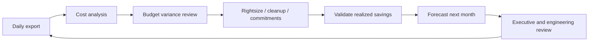

<!-- workflow-diagram:start -->
## Workflow Snapshot

```mermaid
%%{init: {'theme':'base','themeVariables': {'primaryColor':'#0078D4','primaryTextColor':'#ffffff','primaryBorderColor':'#005A9E','lineColor':'#0078D4','secondaryColor':'#50E6FF','tertiaryColor':'#E6F4FF'}}}%%
flowchart LR
  subgraph Visibility[Cost Visibility]
    A[Usage & Billing Export] --> B[Tag / Scope Allocation]
    B --> C[Identify Idle or Oversized Resources]
  end
  subgraph Optimize[Optimization Actions]
    C --> D{Steady workload?}
    D -- Yes --> E[Reservations / Savings Plan]
    D -- No --> F[Autoscale / Spot / Schedules]
    E --> G[Storage Tiering / DB Tuning]
    F --> G
  end
  subgraph Govern[Governance Loop]
    G --> H[Policy, Budgets, Advisor]
    H --> I{Savings validated?}
    I -- Yes --> J[Publish FinOps KPI]
    I -- No --> K[Refine Rightsizing Model]
  end
  J --> L[Monthly Cost Review]
  K --> C
  L --> M[Forecast Next Cycle]
  M --> N[Continuous Optimization]
  classDef finance fill:#0078D4,stroke:#005A9E,color:#ffffff,stroke-width:2px;
  classDef optimize fill:#50E6FF,stroke:#0078D4,color:#002050,stroke-width:2px;
  classDef decision fill:#FFF4CE,stroke:#FFB900,color:#5C2D00,stroke-width:2px;
  classDef ops fill:#107C10,stroke:#0B5A0B,color:#ffffff,stroke-width:2px;
  class A,B,C finance;
  class E,F,G,H optimize;
  class D,I decision;
  class J,K,L,M,N ops;
```

This workflow shows how Azure cost optimization moves from visibility and prioritization into savings actions, governance, and monthly FinOps feedback loops.
<!-- workflow-diagram:end -->

## Quick Savings Summary

| Optimization lever | Typical savings | Best use case | Primary caution |
| --- | --- | --- | --- |
| Reserved Instances | 20% to 72% | Steady production baseline | Avoid overcommitting |
| Compute Savings Plan | Up to 65% | Flexible compute baseline | Size hourly commitment carefully |
| Spot VMs | 60% to 90% | Interruptible compute | Eviction risk |
| Azure Hybrid Benefit | 40% to 85% | Eligible licensed workloads | License compliance required |
| Dev/Test pricing | 40% to 55% | Non-production Windows workloads | No production use |
| Rightsizing | 15% to 50% | Oversized compute | Validate performance before resize |
| Storage tiering | 20% to 95% | Cold data | Retrieval and retention charges |
| AKS autoscaling and scheduling | 15% to 80% | Variable or non-prod clusters | Need workload-aware scaling |
| Cosmos autoscale / SQL serverless | 20% to 70% | Bursty database workloads | Cold start or peak pricing trade-offs |
| Network caching and path optimization | 10% to 60% | Static content and avoidable egress | Requires architecture review |

## Azure Cost Optimization Operating Model


## Cost Design Principles

- Design for **measured demand**, not guessed peak demand.
- Separate **steady-state baseline** from **burst demand** so commitments only cover the stable floor.
- Use the **lowest acceptable resilience and performance tier** that still meets business requirements.
- Allocate every dollar to an **owner, application, and environment** using scope and tags.
- Treat **cost optimization as continuous operations**, not as a one-time cleanup exercise.
- Validate all estimated savings against the next billing cycle and update forecasting assumptions.

## Table of Contents

1. [Azure Pricing Models](#azure-pricing-models)
2. [Azure Reservations](#azure-reservations)
3. [Azure Savings Plans](#azure-savings-plans)
4. [Spot VMs](#spot-vms)
5. [Azure Cost Management + Billing](#azure-cost-management-billing)
6. [Azure Advisor Cost Recommendations](#azure-advisor-cost-recommendations)
7. [Rightsizing](#rightsizing)
8. [Storage Cost Optimization](#storage-cost-optimization)
9. [Network Cost Optimization](#network-cost-optimization)
10. [Database Cost Optimization](#database-cost-optimization)
11. [AKS Cost Optimization](#aks-cost-optimization)
12. [Azure Hybrid Benefit](#azure-hybrid-benefit)
13. [Tagging Strategy](#tagging-strategy)
14. [FinOps & Well-Architected Cost Pillar](#finops-well-architected-cost-pillar)
15. [Commitment Calculation Methods](#commitment-calculation-methods)
16. [Monthly Azure Cost Review Checklist](#monthly-azure-cost-review-checklist)

## 1. Azure Pricing Models

**Objective:** Choose the lowest-risk commercial model for each workload before making technical changes.

### Mermaid Diagram

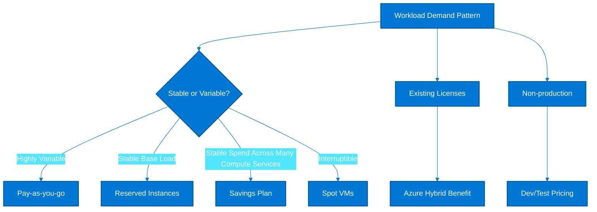

### Explanation and Savings Guidance

- Pay-as-you-go is the baseline option: no term commitment, fastest onboarding, but usually the highest unit price.
- 1-year Reserved Instances typically save about 20% to 57% over pay-as-you-go for steady-state VMs, while 3-year terms can reach about 72%.
- Azure Savings Plans usually save up to 65% versus pay-as-you-go when hourly compute spend is predictable but instance families or regions may change.
- Spot VMs are designed for fault-tolerant workloads and can reduce compute cost by 60% to 90%, but capacity can be evicted at short notice.
- Azure Hybrid Benefit commonly adds 40% to 85% incremental savings for eligible Windows Server and SQL Server licenses.
- Dev/Test pricing reduces non-production cost by removing the Windows license premium and is often 40% to 55% cheaper than equivalent pay-as-you-go Windows test environments.

### Cost Comparison Table

| Option | Typical savings | Best fit | Key trade-off |
| --- | --- | --- | --- |
| Pay-as-you-go | 0% | Bursty, unknown, short-lived | No commitment; highest rate |
| Reserved Instance 1 year | 20% to 57% | Stable VM or database baseline | Less flexibility than PAYG |
| Reserved Instance 3 years | 40% to 72% | Long-lived production platforms | Best rate, longest commitment |
| Compute Savings Plan | 10% to 65% | Mixed compute estates | Hourly spend commitment required |
| Spot VM | 60% to 90% | Batch, render, CI, stateless jobs | Eviction risk |
| Azure Hybrid Benefit | 40% to 85% | Licensed Windows, SQL, RHEL, SUSE | Requires license eligibility |
| Dev/Test Offer | 40% to 55% | Dev, QA, sandbox | Non-production only |

### Azure CLI Commands

```bash
az account show --output table
az consumption usage list --start-date 2025-01-01 --end-date 2025-01-31 --output table
az vm list-skus --location eastus --all --size Standard_D --output table
az graph query -q "Resources | where type =~ 'microsoft.compute/virtualmachines' | project name, location, vmSize=tostring(properties.hardwareProfile.vmSize), tags" -o table
az advisor recommendation list --category Cost --output table
az rest --method post --url "https://management.azure.com/subscriptions/<subscriptionId>/providers/Microsoft.CostManagement/query?api-version=2023-03-01" --body "{"type":"Usage","timeframe":"MonthToDate","dataset":{"granularity":"Daily","aggregation":{"totalCost":{"name":"PreTaxCost","function":"Sum"}}}}"
```

### Decision Checklist

- Use pay-as-you-go for pilots, migrations in progress, and workloads with less than 30 days of usage history.
- Use 1-year reservations when demand is stable but product or region choices may change within 12 months.
- Use 3-year reservations only after validating utilization, decommission timelines, and platform roadmaps.
- Use Savings Plans when teams need family or region flexibility across VM, Functions Premium, and App Service compute.
- Use Spot only for workloads that checkpoint state and can tolerate restart or capacity loss.
- Apply Azure Hybrid Benefit before buying more reservations so the reservation covers only the remaining compute price.

### KPI and Validation Metrics

| KPI | Target / heuristic | Why it matters |
| --- | --- | --- |
| Reservation coverage | 65% to 85% of stable usage | Stable cores or VM hours covered by reservations |
| Savings plan utilization | >95% | Used commitment divided by purchased hourly commitment |
| Spot interruption tolerance | <5% business impact | Measure failed jobs or SLA exceptions caused by eviction |
| Non-prod PAYG spend | <20% of non-prod total | Most dev/test should use Dev/Test or auto-shutdown |
| Hybrid Benefit adoption | >90% eligible estates | Licensed footprint assigned to eligible resources |

### Common Anti-Patterns

- Buying 3-year reservations for workloads with a known modernization or retirement plan inside the term.
- Mixing production and lab subscriptions without different commercial strategies.
- Applying Spot to stateful systems with no checkpointing or queue buffering.
- Ignoring license entitlements and paying full compute plus unused Software Assurance benefits.
- Comparing commercial options using provisioned size instead of actual runtime hours and utilization.

### Implementation Playbook

1. Export 90 days of usage and classify resources into stable, variable, and interruptible demand buckets.
2. Identify all eligible licenses and mark workloads that can use Azure Hybrid Benefit or Dev/Test pricing.
3. Estimate the base-load spend that persists every hour of the month; target that for reservations or Savings Plans.
4. Keep residual burst capacity on pay-as-you-go to avoid overcommitting.
5. Review realized savings monthly and rebalance between reservations, Savings Plans, and PAYG as usage shifts.
6. Update standards so new workloads must justify why they are not using a discounted pricing model.

### Practical Notes

- Review this section with the service owner before applying changes in production.
- Validate savings with **actual or amortized cost views** depending on whether commitments are involved.
- Capture a pre-change performance or capacity baseline so optimization does not erode service quality.
- Document owner, expected savings, implementation window, rollback criteria, and realized outcome.
- Revisit the decision after one billing cycle because Azure usage patterns and platform design change over time.

## 2. Azure Reservations

**Objective:** Use reservations to discount stable demand for VMs, data platforms, app hosting, and storage capacity.

### Mermaid Diagram

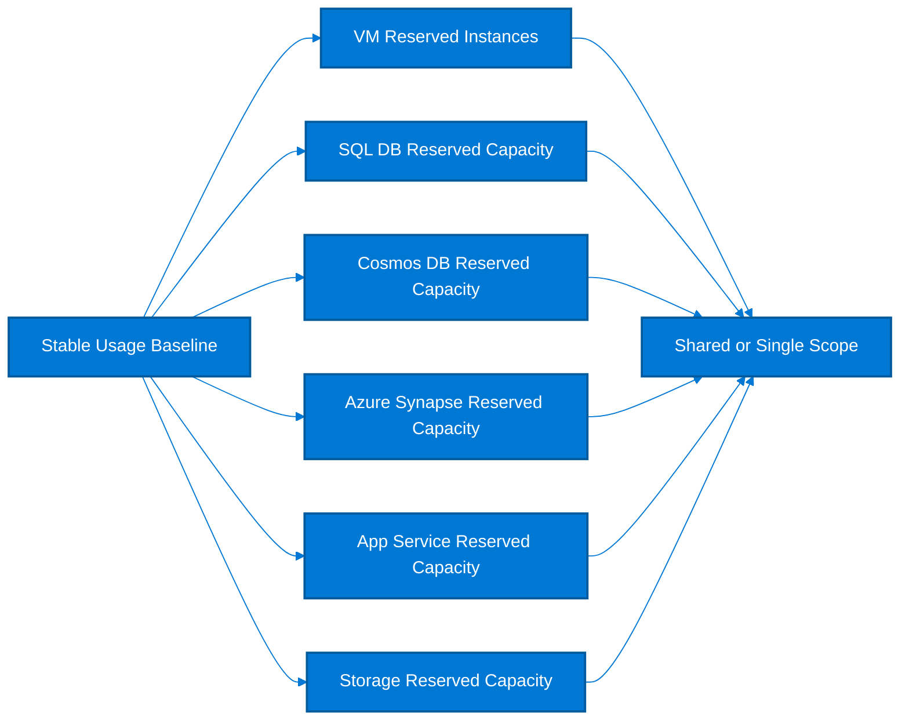

### Explanation and Savings Guidance

- Reservations apply a billing discount to a matching resource family, scope, and region rather than creating a separate technical resource.
- VM Reserved Instances usually save 20% to 72% and work best for 24x7 production fleets with predictable instance families.
- Azure SQL Database reserved capacity typically saves 20% to 33% for vCore-based workloads that have a steady baseline.
- Cosmos DB reserved capacity can save around 20% to 65% on provisioned throughput when RU/s demand is consistently high.
- Azure Synapse reserved capacity generally fits committed analytics throughput and can reduce cost by roughly 28% to 65% depending on term and usage.
- App Service and Storage reserved capacity reduce the compute or capacity portion of stable, always-on services where monthly usage rarely drops below the purchased commitment.

### Cost Comparison Table

| Option | Typical savings | Best fit | Key trade-off |
| --- | --- | --- | --- |
| VM Reserved Instance | 20% to 72% | 24x7 IaaS VMs | Match by family, region, scope |
| SQL DB Reserved Capacity | 20% to 33% | Steady vCore databases | Best for predictable cores |
| Cosmos DB Reserved Capacity | 20% to 65% | High RU/s baseline | Pairs well with autoscale floors |
| Azure Synapse Reserved Capacity | 28% to 65% | Persistent analytics usage | Validate DWU or compute baseline |
| App Service Reserved Capacity | Up to ~55% | Always-on web apps and APIs | Good for stable App Service Plans |
| Storage Reserved Capacity | Up to ~38% | Large blob or Data Lake footprints | Commit to capacity tier and redundancy |

### Azure CLI Commands

```bash
az extension add --name reservations
az reservations reservation-order list --output table
az reservations reservation list --reservation-order-id <reservationOrderId> --output table
az rest --method get --url "https://management.azure.com/providers/Microsoft.Capacity/reservationOrders?api-version=2022-11-01"
az rest --method get --url "https://management.azure.com/providers/Microsoft.Capacity/reservationOrders/<reservationOrderId>?api-version=2022-11-01"
az rest --method post --url "https://management.azure.com/providers/Microsoft.Capacity/reservationOrders/<reservationOrderId>/split?api-version=2022-11-01" --body "{"properties":{"quantity":2}}"
az rest --method post --url "https://management.azure.com/providers/Microsoft.Capacity/reservationOrders/<reservationOrderId>/merge?api-version=2022-11-01" --body "{"properties":{"sources":["<reservationId1>","<reservationId2>"]}}"
az rest --method get --url "https://management.azure.com/providers/Microsoft.Consumption/reservationRecommendations?api-version=2023-05-01"
```

### Decision Checklist

- Prefer shared scope when several subscriptions host the same always-on platform because utilization is usually higher.
- Prefer single subscription or resource group scope only when chargeback, isolation, or compliance demands it.
- Cover only the minimum always-on baseline; leave scale-out peaks on pay-as-you-go or Savings Plans.
- For SQL and Cosmos, map reservations to normalized throughput or vCore baselines rather than peak usage.
- Track utilization weekly during the first month after purchase so underused reservations can be exchanged early.
- Use storage reservations only when actual consumed capacity, not just provisioned accounts, stays above the purchased tier.

### KPI and Validation Metrics

| KPI | Target / heuristic | Why it matters |
| --- | --- | --- |
| Reservation utilization | >95% | Hours or units used divided by hours or units purchased |
| Reservation coverage | 60% to 85% | Stable baseline covered without suppressing elasticity |
| Exchange rate | <10% yearly | High exchange frequency indicates poor forecasting |
| Unused reservation spend | <3% | Spend on reservations with no matching usage |
| Shared-scope adoption | High for platform teams | Improves coverage across many subscriptions |

### Common Anti-Patterns

- Buying reservations against deprecated VM series or old SKUs that will be retired soon.
- Scoping reservations too narrowly so matching usage in other subscriptions keeps paying pay-as-you-go.
- Ignoring reservations for PaaS services because teams think reservations are only for VMs.
- Overcommitting analytics or storage capacity based on month-end spikes rather than true baseline demand.
- Failing to monitor utilization after architecture changes such as right-sizing or migration to serverless.

### Implementation Playbook

1. Measure 90 to 180 days of hourly usage for VM families, vCores, RU/s, app service workers, and storage capacity.
2. Purchase reservations only for the lowest constant layer of consumption that survives business cycles and release events.
3. Document reservation owners, scope, expiration date, target utilization, and exchange policy.
4. Review expiration 90, 60, and 30 days in advance to avoid falling back to pay-as-you-go rates unexpectedly.
5. Combine reservations with scaling guardrails so new capacity does not silently bypass the reserved baseline.
6. Reconcile realized savings monthly against business forecasts and update commitment rules.

### Practical Notes

- Review this section with the service owner before applying changes in production.
- Validate savings with **actual or amortized cost views** depending on whether commitments are involved.
- Capture a pre-change performance or capacity baseline so optimization does not erode service quality.
- Document owner, expected savings, implementation window, rollback criteria, and realized outcome.
- Revisit the decision after one billing cycle because Azure usage patterns and platform design change over time.

## 3. Azure Savings Plans

**Objective:** Use a compute spend commitment when flexibility matters more than instance-specific discounts.

### Mermaid Diagram

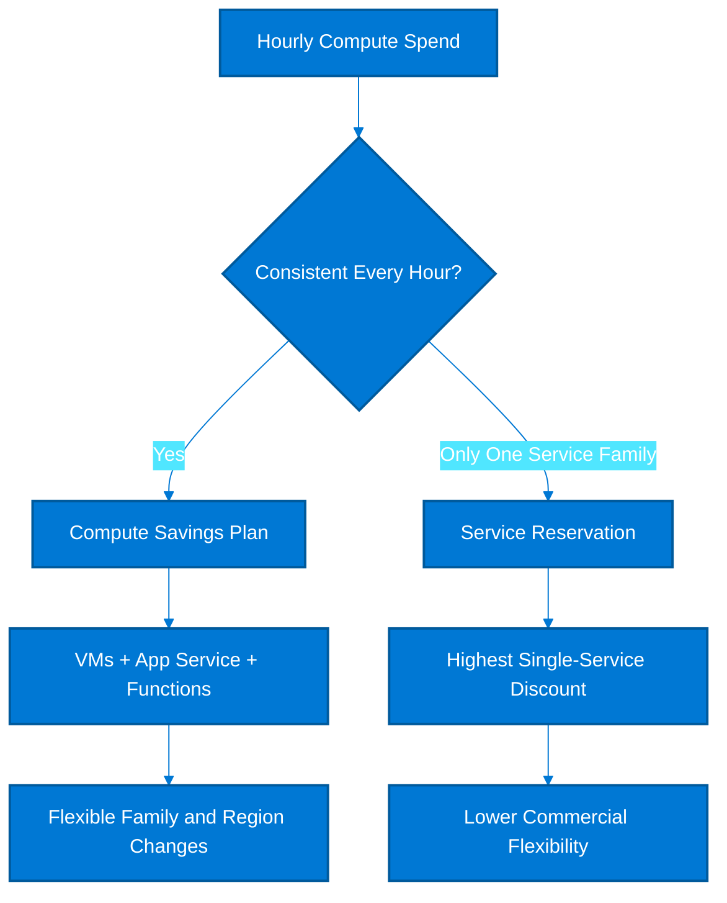

### Explanation and Savings Guidance

- A Savings Plan commits you to an hourly spend amount instead of a specific instance family, which is valuable when platform teams refactor, scale, or move workloads.
- Compute Savings Plans can save up to about 65% compared with pay-as-you-go, but the realized discount depends on how fully the hourly commitment is consumed.
- Individual service reservations usually provide the deepest discount for that exact service, but they are less flexible if architecture, size, or region changes.
- A practical approach is to cover the broad multi-service baseline with a Savings Plan and cover very stable, high-volume single-family demand with reservations.
- Commitment should be based on the minimum hourly compute spend observed across a representative period, often 60 to 90 days.
- If hourly usage regularly dips below the commitment, the unused portion is billed anyway, so utilization discipline is essential.

### Cost Comparison Table

| Option | Typical savings | Best fit | Key trade-off |
| --- | --- | --- | --- |
| Compute Savings Plan | Up to 65% | Mixed compute services | Best balance of discount and flexibility |
| VM Reservation | Up to 72% | Fixed VM family baseline | Highest discount if family stays constant |
| App Service Reservation | Up to ~55% | Stable web tiers | Good for fixed worker count |
| No commitment | 0% | Uncertain or short-lived estates | Highest unit price but zero lock-in |

### Azure CLI Commands

```bash
az rest --method get --url "https://management.azure.com/providers/Microsoft.BillingBenefits/savingsPlanOrders?api-version=2022-11-01"
az rest --method get --url "https://management.azure.com/providers/Microsoft.BillingBenefits/savingsPlanOrders/<savingsPlanOrderId>?api-version=2022-11-01"
az rest --method post --url "https://management.azure.com/providers/Microsoft.CostManagement/query?api-version=2023-03-01" --body "{"type":"Usage","timeframe":"Custom","timePeriod":{"from":"2025-01-01T00:00:00Z","to":"2025-03-31T23:59:59Z"},"dataset":{"granularity":"Hourly","aggregation":{"cost":{"name":"PreTaxCost","function":"Sum"}},"filter":{"dimensions":{"name":"ChargeType","operator":"In","values":["Usage"]}}}}"
az graph query -q "Resources | where type in~ ('microsoft.compute/virtualmachines','microsoft.web/serverfarms') | summarize count() by type, location" -o table
az consumption usage list --start-date 2025-01-01 --end-date 2025-01-31 --output json
az advisor recommendation list --category Cost --query "[?contains(shortDescription.solution, 'Savings Plan') || contains(shortDescription.solution, 'Reservation')]" -o table
```

### Decision Checklist

- Compute the commitment from the lowest recurring hourly spend after excluding one-off migration spikes and scheduled shutdown periods.
- Start with a conservative commitment, usually 70% to 85% of the steady hourly compute baseline, then expand after one billing cycle.
- Use separate commitments for very different operating patterns only if billing scope or governance requires them.
- Do not purchase Savings Plans for workloads expected to move off Azure within the term.
- Reserve highly stable single-service footprints first if they generate a meaningfully better discount than a Savings Plan.
- Review utilization daily during the first two weeks to confirm the commitment is sized correctly.

### KPI and Validation Metrics

| KPI | Target / heuristic | Why it matters |
| --- | --- | --- |
| Commitment utilization | >95% | Actual discounted spend divided by committed hourly spend |
| Flexibility premium | Accepted trade-off | Savings Plan discount versus reservation discount gap |
| Coverage of eligible spend | 50% to 80% | Share of compute spend benefiting from commitment pricing |
| Underutilized commitment hours | <5% | Hours where usage fell below commitment |
| Forecast variance | <10% | Difference between forecasted and realized hourly baseline |

### Common Anti-Patterns

- Using monthly average spend instead of minimum hourly spend to size the plan.
- Ignoring nightly or weekend shutdown patterns and buying too much commitment.
- Assuming Savings Plans apply to every service; they target specific compute families.
- Treating Savings Plans as a substitute for autoscaling and scheduling.
- Failing to account for existing reservations that already discount part of the baseline.

### Implementation Playbook

1. Export hourly compute spend for at least 60 days and chart the lowest sustained hourly value.
2. Subtract workloads already covered by reservations or soon to be decommissioned.
3. Propose a conservative hourly commitment and test it against historical data to estimate utilization.
4. Buy the commitment at management-group or billing-scope level when central platform teams need maximum coverage.
5. Monitor utilization, effective rate, and residual pay-as-you-go spend every week.
6. Adjust future commitment purchases as new workloads stabilize or old ones retire.

### Practical Notes

- Review this section with the service owner before applying changes in production.
- Validate savings with **actual or amortized cost views** depending on whether commitments are involved.
- Capture a pre-change performance or capacity baseline so optimization does not erode service quality.
- Document owner, expected savings, implementation window, rollback criteria, and realized outcome.
- Revisit the decision after one billing cycle because Azure usage patterns and platform design change over time.

## 4. Spot VMs

**Objective:** Exploit spare Azure capacity for interruption-tolerant compute without affecting production reliability.

### Mermaid Diagram

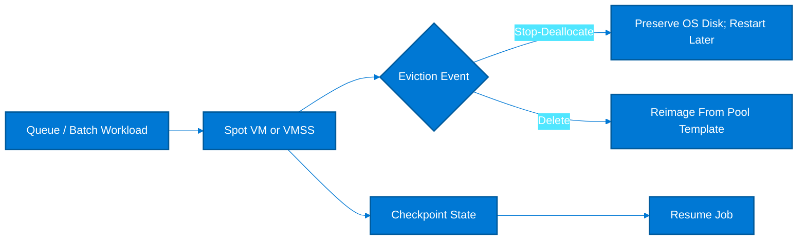

### Explanation and Savings Guidance

- Spot VMs target unused Azure capacity and usually save 60% to 90% compared with regular pay-as-you-go compute.
- Use eviction policy Stop-Deallocate when preserving the OS disk or local configuration matters and you want to restart later if capacity returns.
- Use eviction policy Delete when the instance is completely ephemeral and you want the cleanest, lowest-friction recycle behavior.
- Set max price to -1 to pay up to the regular pay-as-you-go rate while still being eligible for Spot discounts, or define a cap to enforce budget discipline.
- Virtual Machine Scale Sets with mixed Spot and regular instances provide a common pattern for resilient pools that keep a guaranteed minimum capacity.
- Best practices include queue-backed execution, checkpointing, externalized state, graceful drain, and diversified SKUs across regions or zones.

### Cost Comparison Table

| Option | Typical savings | Best fit | Key trade-off |
| --- | --- | --- | --- |
| Spot VM with Delete | 70% to 90% | Stateless batch and CI runners | Fast recycle, no disk preservation |
| Spot VM with Stop-Deallocate | 60% to 90% | Checkpointed workloads needing disk persistence | May retain some storage cost |
| Mixed VMSS Spot + Regular | 40% to 80% blended | Production-adjacent worker pools | Need autoscale and fallback logic |
| Regular PAYG VM | 0% | Stateful or SLA-critical workloads | Highest resiliency, highest rate |

### Azure CLI Commands

```bash
az vm create --resource-group rg-cost --name vm-spot-01 --image Ubuntu2204 --size Standard_D4s_v5 --priority Spot --eviction-policy Delete --max-price -1 --admin-username azureuser --generate-ssh-keys
az vm create --resource-group rg-cost --name vm-spot-stop --image Ubuntu2204 --size Standard_D4s_v5 --priority Spot --eviction-policy Deallocate --max-price 0.15 --admin-username azureuser --generate-ssh-keys
az vmss create --resource-group rg-cost --name vmss-spot-workers --image Ubuntu2204 --vm-sku Standard_D4s_v5 --priority Spot --eviction-policy Delete --max-price -1 --instance-count 3 --upgrade-policy-mode automatic
az vmss update --resource-group rg-cost --name vmss-spot-workers --set sku.capacity=6
az vm list-skus --location eastus --size Standard_D --all --output table
az monitor metrics list --resource "/subscriptions/<subscriptionId>/resourceGroups/rg-cost/providers/Microsoft.Compute/virtualMachineScaleSets/vmss-spot-workers" --metric "Percentage CPU" --interval PT1H --aggregation Average
```

### Decision Checklist

- Run Spot for work that can restart within minutes and can survive partial capacity loss without breaching customer SLAs.
- Keep a regular on-demand baseline when backlog growth, queue latency, or customer-facing deadlines must be bounded.
- Distribute Spot nodes across more than one SKU and preferably more than one zone or region to reduce correlated eviction risk.
- Set alerts on queue depth, failed jobs, and VMSS instance count so eviction events trigger scaling or operator review.
- Prefer Delete for immutable worker images; prefer Stop-Deallocate only when preserving local state is operationally simpler.
- Use max-price caps only after measuring whether they reduce placement success too much.

### KPI and Validation Metrics

| KPI | Target / heuristic | Why it matters |
| --- | --- | --- |
| Spot share of worker fleet | 30% to 80% | Depends on tolerance for interruption |
| Queue latency during eviction | Within SLA | Primary business metric for asynchronous systems |
| Eviction recovery time | <10 minutes | Time to replace lost capacity or requeue work |
| Spot savings realized | >50% | Discount versus equivalent on-demand hours |
| Failed jobs due to eviction | Near zero after retries | Should be masked by resilient job design |

### Common Anti-Patterns

- Using Spot for domain controllers, primary databases, or singleton application nodes.
- Keeping critical session state or temp artifacts only on the VM local disk.
- Running a single Spot SKU in a single zone and assuming availability will remain stable.
- Ignoring image pull time and startup delay when replacement nodes are needed quickly.
- Choosing max-price caps without analyzing market variability and successful allocation rate.

### Implementation Playbook

1. Start with non-production build agents or batch processing workers to prove the operational model.
2. Instrument checkpointing, retries, and queue rehydration before increasing Spot percentage.
3. Create mixed pools so essential throughput is preserved by regular instances.
4. Track daily realized discount, interruption rate, and business impact.
5. Scale Spot adoption only when the workload shows stable recovery and no user-visible errors.
6. Review eviction trends monthly and rebalance SKU mix if one family becomes volatile.

### Practical Notes

- Review this section with the service owner before applying changes in production.
- Validate savings with **actual or amortized cost views** depending on whether commitments are involved.
- Capture a pre-change performance or capacity baseline so optimization does not erode service quality.
- Document owner, expected savings, implementation window, rollback criteria, and realized outcome.
- Revisit the decision after one billing cycle because Azure usage patterns and platform design change over time.

## 5. Azure Cost Management + Billing

**Objective:** Establish cost visibility, accountability, budgets, alerts, exports, and invoice-level governance.

### Mermaid Diagram

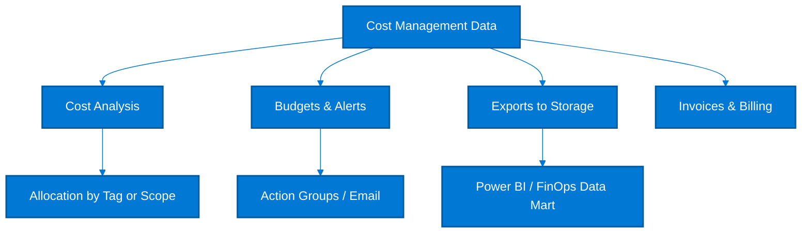

### Explanation and Savings Guidance

- Azure Cost Management + Billing is the operating system for cloud finance: it tracks spend, forecasts burn, enforces budgets, and exports detailed data.
- Cost Analysis surfaces total cost, amortized reservations, service trends, and resource-level granularity for optimization decisions.
- Budgets and alerts do not reduce cost directly, but they prevent surprise spend and improve response time when a workload deviates from expected behavior.
- Exports create durable raw cost datasets for chargeback, showback, anomaly detection, and executive dashboards.
- Cost allocation depends on consistent tags, scopes, and sometimes business mappings because invoices alone rarely reflect application ownership.
- Invoice review closes the loop by validating taxes, marketplace charges, reservation purchases, and amortized commitments.

### Cost Management screenshots and navigation

> 
>
> *Screenshot source: [Microsoft Learn — Quickstart - Start using Cost Analysis - Microsoft Cost Management](https://learn.microsoft.com/en-us/azure/cost-management-billing/costs/quick-acm-cost-analysis). © Microsoft Corporation. Used for educational reference only.*

> **Portal View:** Navigate to `Azure Portal` → `Cost Management + Billing` → `Cost analysis` → `Group by`. The blade shows dimensions such as Resource group, Service name, Meter, and Tag that teams use to isolate spend spikes.
>
> *For the latest portal screenshots, see [Microsoft Learn — Quickstart - Start using Cost Analysis - Microsoft Cost Management](https://learn.microsoft.com/en-us/azure/cost-management-billing/costs/quick-acm-cost-analysis).* 

> **Portal View:** Navigate to `Azure Portal` → `Cost Management + Billing` → `Budgets`. The threshold panel shows current spend, forecast, and alert recipients so owners can react before month-end overruns.
>
> *For the latest portal screenshots, see [Microsoft Learn — Tutorial: Create and manage Azure budgets](https://learn.microsoft.com/en-us/azure/cost-management-billing/costs/tutorial-acm-create-budgets).* 

### Budget creation runbook

1. Select the correct **scope** first: management group for enterprise guardrails, subscription for platform accountability, or resource group for project-level control.
2. Choose a **monthly reset period** unless the spend pattern is annual or tied to a fixed project window.
3. Set multiple alert thresholds, such as **50%**, **80%**, **90%**, and **100%**, instead of relying on a single late warning.
4. Send notifications to both the engineering owner and a shared action group so alerts are not lost during leave or team changes.
5. Use **forecast alerts** for bursty workloads where overspend becomes obvious only near the end of the month.
6. Document the action expected at each threshold: investigate, scale down, stop non-production, or escalate for approval.
7. Review budget performance after one cycle and tune thresholds if the signal is too noisy or too late.

### Real examples of savings actions

| Situation | Action | Indicative result | Validation approach |
| --- | --- | --- | --- |
| Dev/test VMs left running overnight | Add start/stop automation and move eligible Windows hosts to Dev/Test pricing | 30% to 55% lower monthly spend | Compare month-over-month VM runtime hours and cost |
| SQL database with weekday usage only | Move to serverless or smaller vCore SKU | 20% to 50% lower database cost | Watch CPU, storage, and query latency after change |
| API fleet with consistent baseline and frequent burst | Cover baseline with Savings Plan, leave burst on PAYG | 10% to 35% blended compute reduction | Compare amortized cost view before and after purchase |
| Old snapshots, unattached disks, and public IPs | Remove orphaned resources | 100% elimination of waste for those assets | Export Resource Graph inventory before and after cleanup |

### Cost Comparison Table

| Option | Typical savings | Best fit | Key trade-off |
| --- | --- | --- | --- |
| Cost Analysis | 5% to 15% indirect | Find top services, anomalies, and trends | Requires regular review cadence |
| Budgets & Alerts | Prevents overruns | Stop surprise spend early | Needs clear owners and actions |
| Exports | Enables enterprise FinOps | Granular cost dataset | Storage and pipeline management needed |
| Cost Allocation | Improves accountability | Chargeback/showback | Depends on tag quality |
| Invoices | Billing accuracy | Validate commitments and taxes | Monthly finance process required |

### Azure CLI Commands

```bash
az consumption usage list --start-date 2025-01-01 --end-date 2025-01-31 --output table

az monitor action-group create \
  --resource-group rg-finops \
  --name ag-cost \
  --short-name COST \
  --action email finops FinOpsTeam finops@example.com

az consumption budget create \
  --amount 5000 \
  --budget-name prod-monthly-budget \
  --category cost \
  --resource-group rg-finops \
  --time-grain monthly \
  --start-date 2025-01-01 \
  --end-date 2025-12-31 \
  --notifications contactEmails=finops@example.com operator=GreaterThan threshold=80 enabled=true

az consumption budget list --output table
az billing invoice list --output table
az billing profile list --output table

az rest --method put \
  --url "https://management.azure.com/subscriptions/<subscriptionId>/providers/Microsoft.CostManagement/exports/monthly-cost-export?api-version=2023-03-01" \
  --body '{"properties":{"schedule":{"status":"Active","recurrence":"Monthly","recurrencePeriod":{"from":"2025-01-01T00:00:00Z","to":"2026-01-01T00:00:00Z"}},"format":"Csv","deliveryInfo":{"destination":{"resourceId":"/subscriptions/<subscriptionId>/resourceGroups/rg-finops/providers/Microsoft.Storage/storageAccounts/stcostexports","container":"exports","rootFolderPath":"monthly"}},"definition":{"type":"ActualCost","timeframe":"MonthToDate","dataset":{"granularity":"Daily"}}}}'
```

Expected output from a healthy budget and export setup usually looks like this:

```text
Name                 Amount    TimeGrain    CurrentSpend
-------------------  --------  -----------  ------------
prod-monthly-budget  5000      Monthly      3124.41

Name                 Recurrence    Format    Status
-------------------  ------------  --------  --------
monthly-cost-export  Monthly       Csv       Active
```

### Decision Checklist

- Run cost analysis weekly for platform teams and monthly for executive reviews.
- Set budgets at management group, subscription, resource group, and project level where ownership exists.
- Use amortized views when measuring the effect of reservations and Savings Plans so teams see real blended rates.
- Export cost data daily to a central storage account and keep at least 13 months for year-over-year comparison.
- Align invoice review with reservation purchases, support plans, marketplace subscriptions, and tax validation.
- Build cost allocation rules for shared services such as networking, identity, security, and platform tooling.

### KPI and Validation Metrics

| KPI | Target / heuristic | Why it matters |
| --- | --- | --- |
| Forecast accuracy | <10% variance | Difference between forecast and actual end-of-month spend |
| Budget breach response time | <1 business day | Time from alert to corrective action |
| Allocation completeness | >95% | Spend linked to owning team or business service |
| Export freshness | <24 hours lag | Daily data availability for reporting |
| Invoice reconciliation rate | 100% | All invoice lines mapped to approved cloud consumption |

### Common Anti-Patterns

- Relying on the invoice PDF only and skipping detailed usage exports.
- Creating budgets without action owners, resulting in alerts that no one addresses.
- Reviewing actual cost only and missing the amortized effect of reservations and commitments.
- Using inconsistent scopes so platform, project, and finance reports never reconcile.
- Treating shared service spend as unallocated overhead forever.

### Implementation Playbook

1. Create a baseline dashboard for top subscriptions, services, tags, and cost centers.
2. Set progressive budget notifications at 50%, 80%, 90%, and 100% of expected monthly spend.
3. Export actual and amortized cost data to storage and ingest it into Power BI or your FinOps warehouse.
4. Review invoices and support charges monthly with finance and platform engineering.
5. Publish a monthly savings report that links recommendations to realized actions and owners.
6. Automate recurring reports so engineering and finance consume the same data set.

### Practical Notes

- Review this section with the service owner before applying changes in production.
- Validate savings with **actual or amortized cost views** depending on whether commitments are involved.
- Capture a pre-change performance or capacity baseline so optimization does not erode service quality.
- Document owner, expected savings, implementation window, rollback criteria, and realized outcome.
- Revisit the decision after one billing cycle because Azure usage patterns and platform design change over time.

## 6. Azure Advisor Cost Recommendations

**Objective:** Turn platform telemetry into prioritized actions for rightsizing, cleanup, and commitment optimization.

### Mermaid Diagram

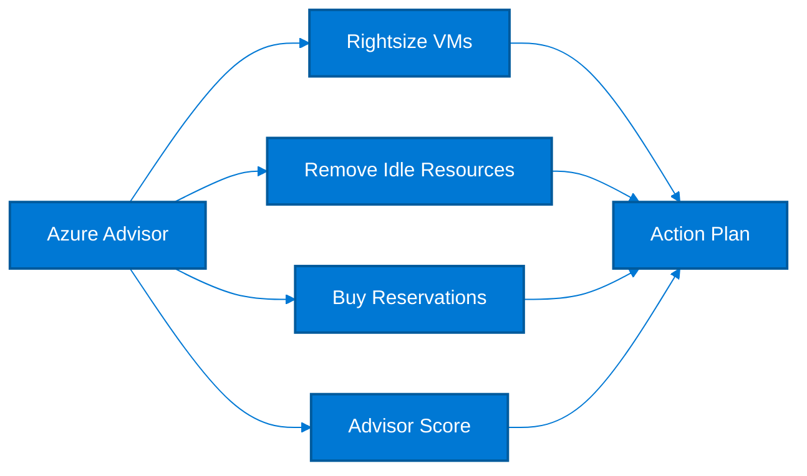

### Explanation and Savings Guidance

- Azure Advisor reviews telemetry and billing patterns to suggest cost-saving actions such as rightsizing, idle resource cleanup, and reservation purchases.
- Rightsizing recommendations often deliver 20% to 50% savings on underutilized VMs when teams provision for peak and never revisit size.
- Unused resource cleanup, such as orphaned public IPs, old disks, or idle gateways, can remove 100% of unnecessary spend for those assets.
- Reservation recommendations indicate where stable usage could benefit from 1-year or 3-year commitment discounts.
- Advisor Score summarizes how well the environment follows Azure recommendations; improving the cost score creates an operational target for engineering teams.
- Advisor should be treated as a backlog feeder, not a blind automation source, because recommendations must be validated against performance and architecture context.

### Cost Comparison Table

| Option | Typical savings | Best fit | Key trade-off |
| --- | --- | --- | --- |
| Rightsize VM | 20% to 50% | Low CPU, RAM, or network use | Validate performance floor first |
| Shut down or delete unused resources | 100% of unnecessary spend | Idle disks, IPs, gateways, snapshots | Confirm no hidden dependency |
| Purchase reservations | 20% to 72% | Stable monthly usage | Requires forecasting discipline |
| Advisor Score improvements | Indirect but compounding | Operational governance | Needs owner and SLA |

### Azure CLI Commands

```bash
az advisor recommendation list --category Cost --output table
az advisor recommendation list --category Cost --query "[].{Resource:resourceMetadata.resourceId,Impact:impact,Solution:shortDescription.solution,Savings:extendedProperties.annualSavingsAmount}" -o table
az advisor recommendation list --category Cost --refresh
az advisor score list --output table
az advisor configuration list --output table
az graph query -q "Resources | where type =~ 'microsoft.compute/virtualmachines' | project id, name, location, tags" -o table
```

### Decision Checklist

- Triage Advisor recommendations by annualized savings, operational risk, and implementation effort.
- Create separate queues for no-risk cleanup actions versus recommendations that require performance testing.
- Use Advisor Score as a trend metric, but track realized savings in finance systems for actual value creation.
- Review reservation recommendations after major migrations, seasonality shifts, or platform right-sizing.
- Pair Advisor with Azure Monitor data because point-in-time recommendations may miss business seasonality.
- Assign every accepted recommendation to an owner, due date, and validation step.

### KPI and Validation Metrics

| KPI | Target / heuristic | Why it matters |
| --- | --- | --- |
| Advisor recommendation closure rate | >80% of accepted items | Closed actions versus accepted backlog |
| Annualized savings captured | Growing monthly | Sum of validated implemented recommendations |
| Advisor score | Continuous improvement | Track trend by subscription or management group |
| Recommendation aging | <30 days | Average age of cost recommendations not yet actioned |
| False-positive rate | Low | Recommendations rejected after validation |

### Common Anti-Patterns

- Applying recommendations without checking business events such as quarter-end peak or annual campaigns.
- Ignoring PaaS cleanup items and focusing only on VMs.
- Treating annualized savings estimates as guaranteed without post-change verification.
- Using Advisor as the only source of truth instead of combining with workload owners and metrics.
- Letting recommendations accumulate with no governance owner.

### Implementation Playbook

1. Refresh and export Advisor cost recommendations weekly.
2. Sort by annualized savings and split into quick wins, validation-required, and strategic items.
3. Run pre-change performance baselines for rightsizing recommendations.
4. Implement low-risk cleanup immediately after confirming dependencies.
5. Measure realized savings one full billing cycle after the change.
6. Report score trend and captured savings to engineering leadership.

### Practical Notes

- Review this section with the service owner before applying changes in production.
- Validate savings with **actual or amortized cost views** depending on whether commitments are involved.
- Capture a pre-change performance or capacity baseline so optimization does not erode service quality.
- Document owner, expected savings, implementation window, rollback criteria, and realized outcome.
- Revisit the decision after one billing cycle because Azure usage patterns and platform design change over time.

## 7. Rightsizing

**Objective:** Align compute size with actual demand using Azure Monitor, Azure Migrate, and recurring review processes.

### Mermaid Diagram

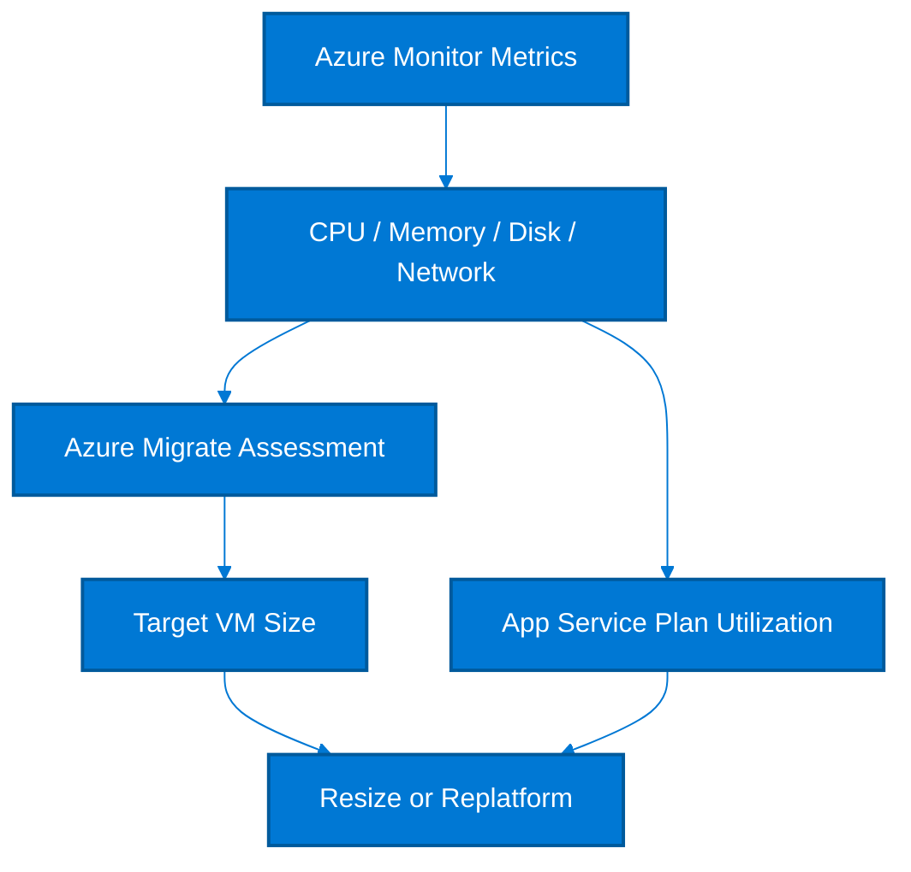

### Explanation and Savings Guidance

- Rightsizing reduces overprovisioning by matching VM cores, memory, and plan size to observed demand instead of historical guesswork.
- Azure Monitor metrics such as Percentage CPU, Available Memory Bytes, disk throughput, and network throughput provide the operational baseline.
- Azure Migrate assessments help estimate a better VM target size during migration or modernization programs by analyzing on-premises and Azure performance data.
- VM right-sizing often yields 15% to 50% savings; larger reductions are common when legacy lift-and-shift VMs were intentionally oversized.
- App Service Plan optimization focuses on worker count, SKU tier, and scheduled scale rather than only average CPU.
- Rightsizing should be cyclical because demand changes with product growth, code changes, and seasonality.

### Cost Comparison Table

| Option | Typical savings | Best fit | Key trade-off |
| --- | --- | --- | --- |
| VM downsize | 15% to 50% | Low sustained CPU and memory | Validate burst and startup peaks |
| App Service SKU downgrade | 10% to 40% | Low CPU, memory, and request count | Check SSL, features, and scale limits |
| Scale-in unused instances | 20% to 60% | Low concurrency or idle workers | Needs autoscale guardrails |
| Replatform to PaaS/serverless | 30% to 70% | Operationally simple apps | Architecture change required |

### Azure CLI Commands

```bash
az monitor metrics list --resource "/subscriptions/<subscriptionId>/resourceGroups/rg-prod/providers/Microsoft.Compute/virtualMachines/vm-app-01" --metric "Percentage CPU" --interval PT1H --aggregation Average Maximum
az monitor metrics list --resource "/subscriptions/<subscriptionId>/resourceGroups/rg-prod/providers/Microsoft.Compute/virtualMachines/vm-app-01" --metric "Network In Total,Network Out Total" --interval PT1H --aggregation Total
az vm resize --resource-group rg-prod --name vm-app-01 --size Standard_D2s_v5
az migrate project create --name migrate-assess --resource-group rg-migrate --location eastus
az appservice plan show --name asp-prod --resource-group rg-app --output table
az appservice plan update --name asp-prod --resource-group rg-app --sku P1v3
```

### Decision Checklist

- Capture at least 30 days of metrics; 90 days is better for business workloads with monthly peaks.
- Downsize only when CPU, memory, and I/O headroom all show safe margins, not based on CPU alone.
- Account for boot storms, patch windows, and batch jobs that average metrics can hide.
- For App Service, compare worker utilization, per-instance memory, and schedule-based scale opportunities.
- Pair right-sizing with reservations recalculation so old commitments do not remain oversized.
- Document rollback size and thresholds before any production resize.

### KPI and Validation Metrics

| KPI | Target / heuristic | Why it matters |
| --- | --- | --- |
| Average CPU target | 40% to 65% busy hours | Leaves room for moderate bursts |
| Peak CPU threshold | <80% sustained | Avoid chronic CPU saturation after resize |
| Memory headroom | >20% | Critical for VM and App Service stability |
| Rightsizing review cadence | Monthly or quarterly | Depends on workload volatility |
| Savings realized per resize | Tracked monthly | Validate in billing data |

### Common Anti-Patterns

- Using only average CPU and ignoring memory pressure or disk queues.
- Downsizing domain services or middleware nodes with hidden licensing or support constraints.
- Forgetting to update autoscale limits after a SKU change.
- Keeping large VM sizes because no one owns the application performance baseline.
- Applying the same thresholds to batch, API, and database workloads.

### Implementation Playbook

1. Collect metrics and classify workloads by CPU-bound, memory-bound, I/O-bound, or bursty.
2. Build target sizes using Azure Migrate or SKU comparison tables.
3. Test lower sizes in non-production or pilot one instance in a scaled-out pool.
4. Resize during a controlled window and watch application and infrastructure metrics closely.
5. Confirm billing reduction after the next invoice cycle.
6. Add rightsizing to the regular operational review for every platform team.

### Practical Notes

- Review this section with the service owner before applying changes in production.
- Validate savings with **actual or amortized cost views** depending on whether commitments are involved.
- Capture a pre-change performance or capacity baseline so optimization does not erode service quality.
- Document owner, expected savings, implementation window, rollback criteria, and realized outcome.
- Revisit the decision after one billing cycle because Azure usage patterns and platform design change over time.

## 8. Storage Cost Optimization

**Objective:** Reduce storage spend by matching tier, lifecycle, redundancy, and reservation choices to access patterns.

### Mermaid Diagram

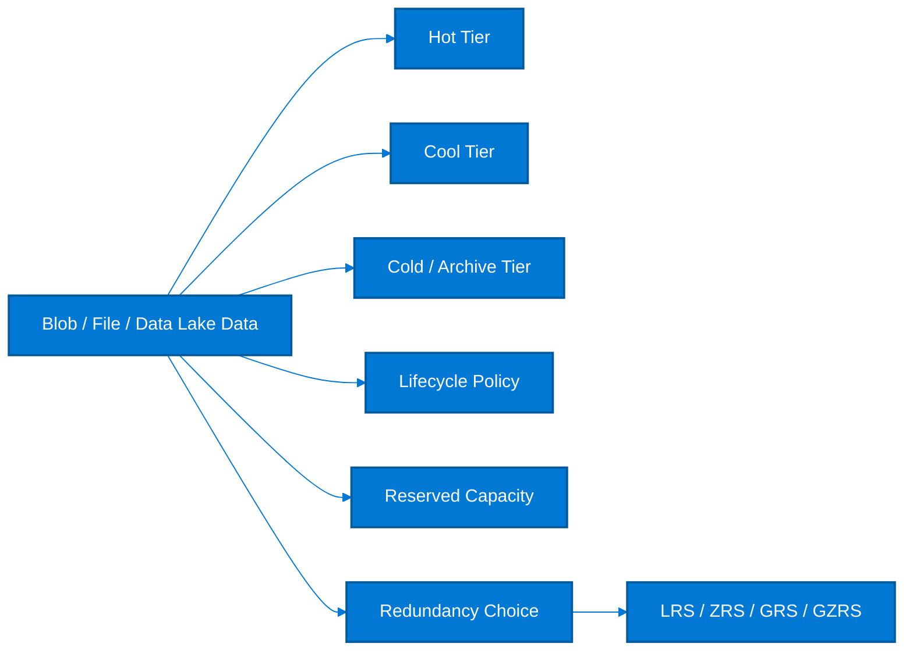

### Explanation and Savings Guidance

- The biggest storage savings usually come from matching access tier to actual read/write frequency rather than keeping everything in Hot.
- Moving infrequently accessed data from Hot to Cool commonly saves 20% to 60%, and Archive can save 70% to 95% for long-retention cold data.
- Lifecycle management automates tier changes and deletions so savings persist without manual effort.
- Storage reserved capacity can reduce the capacity component by up to about 38% for large, stable blob or Data Lake footprints.
- Redundancy right-sizing matters because GRS and GZRS can be substantially more expensive than LRS or ZRS; select the lowest resilience tier that still meets RPO and compliance.
- Storage cost optimization must balance transaction charges, rehydration time, retention requirements, and disaster recovery objectives.

### Cost Comparison Table

| Option | Typical savings | Best fit | Key trade-off |
| --- | --- | --- | --- |
| Hot tier | Baseline | Active content, frequent reads | Highest capacity price |
| Cool tier | 20% to 60% | Infrequent access, 30+ day retention | Higher access charges |
| Archive tier | 70% to 95% | Compliance and long-term retention | Rehydration delay |
| Reserved capacity | Up to ~38% | Large stable capacity footprint | Commitment required |
| LRS instead of GRS/GZRS | 10% to 60% | Data that does not need geo-replication | Lower cross-region resilience |

### Azure CLI Commands

```bash
az storage account show --name stprod01 --resource-group rg-storage --output table
az storage account update --name stprod01 --resource-group rg-storage --access-tier Cool
az storage blob set-tier --account-name stprod01 --container-name archive --name app-2024-01.log --tier Archive
az storage account management-policy create --account-name stprod01 --resource-group rg-storage --policy @lifecycle-policy.json
az monitor metrics list --resource "/subscriptions/<subscriptionId>/resourceGroups/rg-storage/providers/Microsoft.Storage/storageAccounts/stprod01" --metric "UsedCapacity" --interval P1D --aggregation Average
az rest --method get --url "https://management.azure.com/providers/Microsoft.Capacity/reservationOrders?api-version=2022-11-01"
```

### Decision Checklist

- Profile objects by access frequency, retention requirement, and recovery time before assigning a tier.
- Use lifecycle rules to move data progressively from Hot to Cool to Archive rather than leaving long-lived data in Hot.
- Right-size redundancy based on business recovery objectives; many analytics or backup copies do not need geo-replication.
- Purchase reserved capacity only after validating average consumed TB, not just provisioned accounts.
- Separate high-transaction working sets from long-retention content because transaction fees can offset tier savings.
- Review snapshots and old versions because hidden retained data often drives unexpected bills.

### KPI and Validation Metrics

| KPI | Target / heuristic | Why it matters |
| --- | --- | --- |
| Hot data ratio | As low as practical | Share of data left in most expensive tier |
| Lifecycle policy compliance | 100% | Accounts with automated tiering rules |
| Geo-redundant storage ratio | Justified by policy | Use only where RPO requires it |
| Reserved capacity utilization | >90% | Consumed capacity versus purchased reservation |
| Stale snapshot cleanup | Monthly | Snapshot and version sprawl control |

### Common Anti-Patterns

- Archiving data that still needs low-latency access for analytics or applications.
- Ignoring minimum retention and retrieval charges when moving to Cool or Archive.
- Using GRS by default even for reproducible data sets or secondary copies.
- Creating lifecycle rules once and never updating them as access patterns change.
- Forgetting that snapshots, soft delete, and versioning can multiply stored bytes.

### Implementation Playbook

1. Measure capacity growth, transaction volume, and retrieval patterns by container or file share.
2. Define tiering rules based on age and last access where available.
3. Move historical data to lower-cost tiers in phases and validate retrieval economics.
4. Review redundancy choices with business continuity stakeholders.
5. Buy reserved capacity for large predictable storage footprints after two or three months of evidence.
6. Audit snapshots, versions, and soft-deleted data monthly.

### Practical Notes

- Review this section with the service owner before applying changes in production.
- Validate savings with **actual or amortized cost views** depending on whether commitments are involved.
- Capture a pre-change performance or capacity baseline so optimization does not erode service quality.
- Document owner, expected savings, implementation window, rollback criteria, and realized outcome.
- Revisit the decision after one billing cycle because Azure usage patterns and platform design change over time.

## 9. Network Cost Optimization

**Objective:** Control network spend by minimizing unnecessary egress, right-sizing connectivity, and maximizing caching.

### Mermaid Diagram

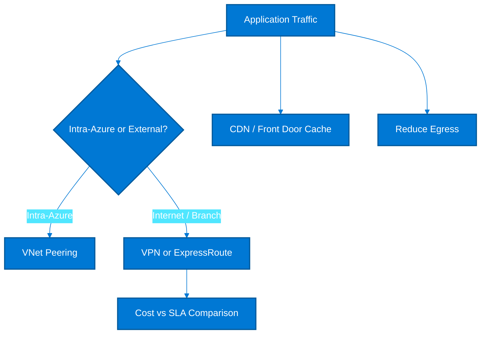

### Explanation and Savings Guidance

- Network spend often hides in data egress, oversized connectivity choices, inefficient traffic paths, and uncached content delivery.
- VNet peering is usually cheaper and lower latency than routing Azure-to-Azure traffic through VPN appliances or on-premises backhaul.
- Internet egress pricing increases with volume, so caching static and semi-static content through CDN or Azure Front Door can reduce origin traffic materially.
- ExpressRoute provides predictable performance and private connectivity, but it is usually more expensive than site-to-site VPN for lower-volume or non-critical links.
- Using the wrong region pair or forcing data through central hubs can compound egress charges.
- Network optimization normally delivers 10% to 40% savings, with higher reductions when backhaul or cache misses are severe.

### Cost Comparison Table

| Option | Typical savings | Best fit | Key trade-off |
| --- | --- | --- | --- |
| VNet peering | 5% to 30% | Azure-to-Azure traffic | Usually cheaper than appliance hairpinning |
| Site-to-site VPN | Lower fixed cost | Branch or low/medium throughput | Internet-based performance |
| ExpressRoute | Higher fixed cost, lower variable risk | High throughput or regulated traffic | Premium option |
| CDN / Front Door caching | 10% to 60% origin egress reduction | Static and cacheable responses | Requires cache strategy |
| Region-local traffic design | 5% to 25% | Services with chatty east-west traffic | May influence architecture |

### Azure CLI Commands

```bash
az network vnet peering create --resource-group rg-net --name peer-hub-spoke --vnet-name vnet-hub --remote-vnet /subscriptions/<subscriptionId>/resourceGroups/rg-app/providers/Microsoft.Network/virtualNetworks/vnet-spoke --allow-vnet-access
az network vpn-connection create --resource-group rg-net --name branch-vpn --vnet-gateway1 hub-gw --local-gateway2 branch-lgw --shared-key <sharedKey>
az network express-route create --resource-group rg-net --name er-prod --location eastus --bandwidth-in-mbps 200 --peering-location WashingtonDC --provider Equinix --sku-family MeteredData --sku-tier Standard
az cdn endpoint create --resource-group rg-cdn --profile-name cdn-prod --name static-content --origin contosoapp.azurewebsites.net
az afd endpoint create --resource-group rg-edge --profile-name afd-prod --endpoint-name app-global
az monitor metrics list --resource "/subscriptions/<subscriptionId>/resourceGroups/rg-net/providers/Microsoft.Network/publicIPAddresses/pip-app" --metric "BytesOutDDoS,BytesInDDoS" --interval PT1H --aggregation Total
```

### Decision Checklist

- Prefer VNet peering for Azure-native east-west traffic before considering third-party transit or on-premises hairpinning.
- Use VPN for low to moderate throughput, branch sites, and environments where occasional internet path variability is acceptable.
- Use ExpressRoute when private connectivity, predictable latency, and high data volume justify the fixed circuit cost.
- Enable caching for static files, downloadable assets, and API responses with safe cache semantics.
- Place chatty services in the same region when possible to reduce latency and egress charges.
- Review NAT Gateway, load balancer, firewall, and third-party appliance costs as part of the network bill, not separately.

### KPI and Validation Metrics

| KPI | Target / heuristic | Why it matters |
| --- | --- | --- |
| Cache hit ratio | >80% for static content | Higher hit rates lower origin egress |
| Cross-region transfer ratio | As low as architecture allows | Measure avoidable east-west traffic |
| Private link / peering adoption | Growing for internal traffic | Reduce internet hairpinning |
| Connectivity unit cost | Tracked monthly | Cost per GB or per site |
| Firewall or appliance throughput utilization | Optimized | Avoid overprovisioned network appliances |

### Common Anti-Patterns

- Backhauling Azure-to-Azure traffic through on-premises just because legacy routing already exists.
- Using ExpressRoute for every branch even when throughput is small and VPN is sufficient.
- Ignoring CDN or Front Door caching opportunities for large static assets.
- Splitting applications across regions without quantifying chatty service traffic.
- Treating egress costs as unavoidable rather than as an architecture design problem.

### Implementation Playbook

1. Measure internet egress, cross-region transfer, and branch connectivity spend by workload.
2. Map application traffic paths and identify avoidable backhaul or appliance hops.
3. Enable caching and compression at the edge for static and semi-static content.
4. Compare VPN versus ExpressRoute using throughput, SLA, and compliance requirements.
5. Consolidate or re-place services to reduce unnecessary cross-region chatter.
6. Review network cost monthly alongside application architecture changes.

### Practical Notes

- Review this section with the service owner before applying changes in production.
- Validate savings with **actual or amortized cost views** depending on whether commitments are involved.
- Capture a pre-change performance or capacity baseline so optimization does not erode service quality.
- Document owner, expected savings, implementation window, rollback criteria, and realized outcome.
- Revisit the decision after one billing cycle because Azure usage patterns and platform design change over time.

## 10. Database Cost Optimization

**Objective:** Optimize database spend with pooling, serverless, autoscale throughput, and commitment discounts.

### Mermaid Diagram

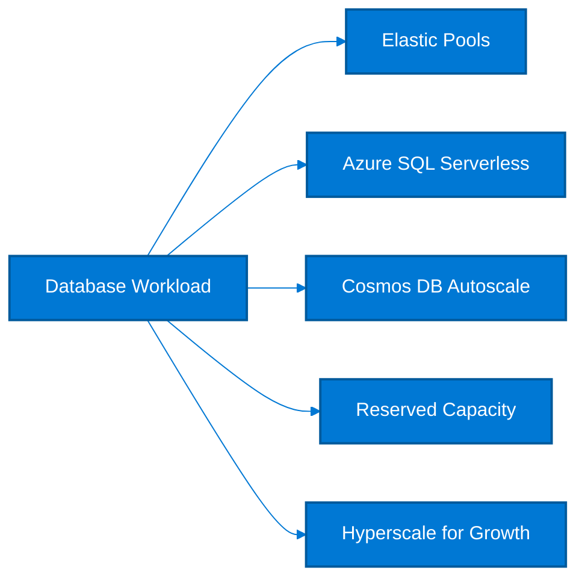

### Explanation and Savings Guidance

- Database optimization starts by aligning billing model to workload concurrency, idle periods, and growth profile.
- Elastic pools reduce cost when many Azure SQL databases have different peak times and can share compute instead of each owning peak capacity.
- Azure SQL serverless automatically pauses and scales compute for intermittent workloads, often saving 20% to 70% compared with provisioned compute for bursty databases.
- Cosmos DB autoscale adapts RU/s to demand and can avoid paying for peak throughput all day; savings depend on burst pattern and can be significant when idle troughs are deep.
- Reserved capacity reduces cost for stable Azure SQL or Cosmos baselines when throughput or vCore demand remains consistently high.
- Hyperscale is a performance and scale choice first, but it can be cost-efficient for very large databases because it separates compute and storage growth more effectively than overprovisioned General Purpose tiers.

### Cost Comparison Table

| Option | Typical savings | Best fit | Key trade-off |
| --- | --- | --- | --- |
| SQL Elastic Pool | 10% to 50% | Many databases with staggered peaks | Need pool governance |
| SQL Serverless | 20% to 70% | Intermittent or dev/test databases | Cold start and auto-pause considerations |
| Cosmos Autoscale | 10% to 65% | Variable RU/s demand | Higher peak rate than manual throughput |
| Reserved Capacity | 20% to 65% | Stable database baseline | Commitment required |
| Hyperscale | Avoids overprovisioning | Large fast-growing databases | Not a pure discount model |

### Azure CLI Commands

```bash
az sql elastic-pool create --resource-group rg-data --server sql-prod --name ep-shared --edition GeneralPurpose --family Gen5 --capacity 8
az sql db create --resource-group rg-data --server sql-prod --name appdb-serverless --compute-model Serverless --edition GeneralPurpose --family Gen5 --capacity 2 --auto-pause-delay 60
az sql db update --resource-group rg-data --server sql-prod --name appdb-prod --elastic-pool ep-shared
az cosmosdb sql database throughput update --account-name cos-prod --resource-group rg-data --name ordersdb --max-throughput 4000
az cosmosdb sql container throughput show --account-name cos-prod --resource-group rg-data --database-name ordersdb --name orders
az rest --method get --url "https://management.azure.com/providers/Microsoft.Capacity/reservationOrders?api-version=2022-11-01"
```

### Decision Checklist

- Use elastic pools when many databases have different peak hours and share the same administrative boundary.
- Use serverless for databases with long idle windows, low background activity, and acceptable resume latency.
- Use Cosmos autoscale when transaction bursts are real but the floor is materially lower than the peak.
- Buy reserved capacity only for the portion of throughput or vCores that remains stable every day.
- Evaluate Hyperscale when growth or backup architecture forces expensive overprovisioning in other tiers.
- Review storage growth, backup retention, and read replica choices because database bills include more than compute.

### KPI and Validation Metrics

| KPI | Target / heuristic | Why it matters |
| --- | --- | --- |
| Database compute utilization | Healthy sustained baseline | Avoid prolonged idle provisioned cores |
| Elastic pool density | Increasing with safe limits | Databases per shared pool |
| Serverless auto-pause success | Frequent where intended | Confirms intermittent usage pattern |
| Cosmos RU utilization | >60% at floor, elastic at peak | Indicates correct autoscale strategy |
| Reserved capacity utilization | >90% | Committed units actually consumed |

### Common Anti-Patterns

- Putting noisy and latency-sensitive databases in the same elastic pool without guardrails.
- Choosing serverless for databases with constant connections that prevent auto-pause.
- Leaving Cosmos throughput manual at peak level all month.
- Ignoring backup, long-term retention, or geo-replication charges.
- Using Hyperscale just for prestige instead of a measured scaling need.

### Implementation Playbook

1. Inventory databases by size, throughput, concurrency, and idle behavior.
2. Move suitable low-duty databases to serverless or elastic pools.
3. Tune Cosmos autoscale floors and container partitioning to avoid overpaying for throughput.
4. Purchase reserved capacity for stable high-volume databases after utilization analysis.
5. Review geo-replication, retention, and replica settings for every tier.
6. Track realized savings and performance change after each migration.

### Practical Notes

- Review this section with the service owner before applying changes in production.
- Validate savings with **actual or amortized cost views** depending on whether commitments are involved.
- Capture a pre-change performance or capacity baseline so optimization does not erode service quality.
- Document owner, expected savings, implementation window, rollback criteria, and realized outcome.
- Revisit the decision after one billing cycle because Azure usage patterns and platform design change over time.

## 11. AKS Cost Optimization

**Objective:** Reduce Kubernetes spend with the right node mix, autoscaling, event-driven scaling, and schedule controls.

### Mermaid Diagram

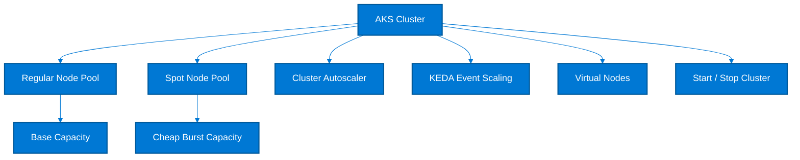

### Explanation and Savings Guidance

- AKS cost is driven mostly by node count, SKU choice, idle headroom, and supporting services such as load balancers, disks, and observability.
- Separate regular and Spot node pools so essential system and guaranteed workloads stay on reliable nodes while opportunistic work uses cheaper capacity.
- Cluster Autoscaler reduces idle node waste by scaling worker nodes based on pending pods and requested resources.
- KEDA improves efficiency for event-driven workloads by scaling deployments to zero or near-zero when queues are empty, often saving 30% to 80% for bursty services.
- Virtual Nodes through Azure Container Instances can absorb unpredictable bursts without keeping large idle pools online all month.
- Start and stop controls for non-production AKS clusters prevent paying for worker nodes outside business hours; this often saves 60% to 70% on dev/test clusters.

### Cost Comparison Table

| Option | Typical savings | Best fit | Key trade-off |
| --- | --- | --- | --- |
| Regular node pool only | Baseline | Always-on production | Simplest but often overprovisioned |
| Mixed regular + Spot pools | 20% to 60% blended | Burst workers and batch pods | Need taints/tolerations and disruption logic |
| Cluster Autoscaler | 15% to 40% | Variable daily demand | Depends on accurate requests/limits |
| KEDA scale-to-zero | 30% to 80% | Event-driven microservices | Cold starts must be acceptable |
| Start/stop non-prod cluster | 60% to 70% | Dev/test | Not for always-on environments |

### Azure CLI Commands

```bash
az aks nodepool add --resource-group rg-aks --cluster-name aks-prod --name spotnp --priority Spot --eviction-policy Delete --spot-max-price -1 --node-count 2 --node-vm-size Standard_D4s_v5
az aks update --resource-group rg-aks --name aks-prod --enable-cluster-autoscaler --min-count 2 --max-count 10
az aks nodepool update --resource-group rg-aks --cluster-name aks-prod --name usernp --enable-cluster-autoscaler --min-count 1 --max-count 6
az aks addon enable --resource-group rg-aks --name aks-prod --addons virtual-node
az aks stop --resource-group rg-aks --name aks-dev
az aks start --resource-group rg-aks --name aks-dev
az aks command invoke --resource-group rg-aks --name aks-prod --command "helm repo add kedacore https://kedacore.github.io/charts && helm install keda kedacore/keda --namespace keda --create-namespace"
```

### Decision Checklist

- Run system components and minimum guaranteed capacity on regular node pools; schedule tolerant workloads on Spot with taints and tolerations.
- Enable Cluster Autoscaler only after setting realistic pod requests and limits, otherwise bin-packing will be poor.
- Use KEDA for queue-based or event-based services that can tolerate cold start and do not need permanent warm instances.
- Use Virtual Nodes for burst absorption, not as a replacement for cost-effective steady-state node pools.
- Stop non-production clusters nightly or on weekends when developer productivity is unaffected.
- Review daemonsets, observability agents, and over-requested pods because they inflate required node count.

### KPI and Validation Metrics

| KPI | Target / heuristic | Why it matters |
| --- | --- | --- |
| Node utilization | High but stable | CPU and memory usage across pools |
| Pod request accuracy | Close to actual use | Prevents waste and autoscaler distortion |
| Spot workload share | Meaningful for tolerant apps | Track eviction impact too |
| Scale-to-zero savings | Measured monthly | KEDA-enabled idle time avoided |
| Non-prod uptime hours | Only needed windows | Measure schedule compliance |

### Common Anti-Patterns

- Keeping large always-on node pools because requests are inflated far above actual use.
- Running critical stateful workloads on Spot nodes without PodDisruptionBudget and storage strategy.
- Enabling autoscaler while setting min-count so high that it never truly scales down.
- Ignoring add-on costs such as Log Analytics ingestion, outbound bandwidth, and disks.
- Stopping production clusters or forgetting managed control plane dependencies when designing schedules.

### Implementation Playbook

1. Separate workloads by SLA, disruption tolerance, and scaling pattern.
2. Create dedicated Spot pools for resilient batch and worker pods.
3. Tune requests and limits, then enable Cluster Autoscaler and review scale-down behavior.
4. Adopt KEDA for event-driven services with low idle duty cycle.
5. Schedule start/stop for dev and QA clusters or use ephemeral review environments.
6. Track node-hours, pod density, and business latency monthly.

### Practical Notes

- Review this section with the service owner before applying changes in production.
- Validate savings with **actual or amortized cost views** depending on whether commitments are involved.
- Capture a pre-change performance or capacity baseline so optimization does not erode service quality.
- Document owner, expected savings, implementation window, rollback criteria, and realized outcome.
- Revisit the decision after one billing cycle because Azure usage patterns and platform design change over time.

## 12. Azure Hybrid Benefit

**Objective:** Apply existing Microsoft and eligible Linux licenses to reduce Azure compute and database cost.

### Mermaid Diagram

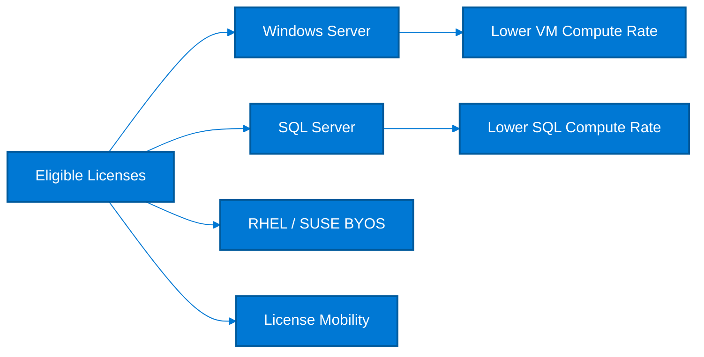

### Explanation and Savings Guidance

- Azure Hybrid Benefit lets you reuse eligible licenses to pay only the base compute rate rather than the full license-included rate.
- Windows Server Hybrid Benefit commonly saves around 40% versus standard Windows pay-as-you-go VM pricing, and pairing it with reservations increases total savings further.
- SQL Server Hybrid Benefit often drives very large savings because SQL licensing is a major part of Azure SQL Managed Instance, SQL VM, or SQL Database compute cost.
- RHEL and SUSE BYOS options can reduce Linux subscription cost when you already own qualifying subscriptions or enterprise agreements.
- License Mobility supports eligible server products on shared hardware, while dedicated host scenarios can further expand reuse options.
- Governance is critical: you must track license inventory, Software Assurance or subscription terms, and assignment evidence.

### Cost Comparison Table

| Option | Typical savings | Best fit | Key trade-off |
| --- | --- | --- | --- |
| Windows Server AHB | About 40% | Windows VMs and VM Scale Sets | Requires eligible licenses |
| SQL Server AHB | Up to 55% to 80% combined with RI | SQL workloads with license mobility | Validate edition and core rights |
| RHEL BYOS | Varies, often 10% to 40% | Enterprise Linux estates | Depends on support contract |
| SUSE BYOS | Varies, often 10% to 40% | SUSE estates | Depends on support contract |
| Dedicated host + license mobility | Scenario dependent | Specialized consolidation | Operational complexity |

### Azure CLI Commands

```bash
az vm update --resource-group rg-prod --name win-vm-01 --license-type Windows_Server
az vmss update --resource-group rg-prod --name win-vmss --set virtualMachineProfile.licenseType=Windows_Server
az sql db create --resource-group rg-data --server sql-prod --name sqldb-ahb --edition GeneralPurpose --family Gen5 --capacity 4 --license-type BasePrice
az vm update --resource-group rg-linux --name rhel-vm-01 --license-type RHEL_BYOS
az vm update --resource-group rg-linux --name suse-vm-01 --license-type SLES_BYOS
az graph query -q "Resources | where type =~ 'microsoft.compute/virtualmachines' | project name, location, licenseType=tostring(properties.licenseType), tags" -o table
```

### Decision Checklist

- Audit every eligible Windows Server and SQL Server deployment for Hybrid Benefit applicability.
- Apply AHB before comparing reservations because it changes the residual cost that reservations discount.
- Use BasePrice for Azure SQL when bringing eligible SQL Server licenses.
- Track Linux BYOS eligibility carefully because support rights and cloud portability vary by vendor agreement.
- Centralize license inventory and assignment evidence for audit readiness.
- Review license consumption when scaling VMSS or DR environments so entitlements remain compliant.

### KPI and Validation Metrics

| KPI | Target / heuristic | Why it matters |
| --- | --- | --- |
| Eligible estate covered by AHB | >90% | Share of licensed assets using benefit |
| License assignment accuracy | 100% | All deployed AHB assets mapped to owned entitlements |
| Combined discount adoption | High | AHB plus reservation or Savings Plan |
| Audit exceptions | Zero | Non-compliant or undocumented license use |
| Windows license-included spend | Declining | Indicates AHB conversion progress |

### Common Anti-Patterns

- Buying reservations first and missing an even larger Hybrid Benefit opportunity.
- Failing to distinguish dev/test, DR, and production license rights.
- Assuming all Linux distributions support BYOS in the same way.
- Scaling out licensed resources without checking entitlement limits.
- Not documenting evidence for auditors and software asset managers.

### Implementation Playbook

1. Inventory all Windows, SQL, RHEL, and SUSE resources and match them to owned entitlements.
2. Enable license types on eligible resources and confirm billing changes in cost data.
3. Combine AHB with reservations or Savings Plans for stable production workloads.
4. Review DR and HA architectures for passive use rights where applicable.
5. Maintain an auditable license ledger with expiration dates and assignment history.
6. Report monthly AHB savings and remaining uncovered opportunities.

### Practical Notes

- Review this section with the service owner before applying changes in production.
- Validate savings with **actual or amortized cost views** depending on whether commitments are involved.
- Capture a pre-change performance or capacity baseline so optimization does not erode service quality.
- Document owner, expected savings, implementation window, rollback criteria, and realized outcome.
- Revisit the decision after one billing cycle because Azure usage patterns and platform design change over time.

## 13. Tagging Strategy

**Objective:** Use consistent metadata to allocate, govern, and automate cloud cost ownership.

### Mermaid Diagram

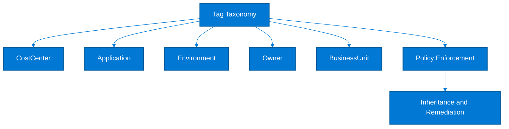

### Explanation and Savings Guidance

- Tagging does not directly discount Azure rates, but it is foundational for accurate cost allocation, budgeting, accountability, and automation.
- A strong cost allocation taxonomy usually includes at least CostCenter, Application, Environment, Owner, BusinessUnit, and DataClassification or ServiceTier.
- Azure Policy can enforce required tags at create time, append missing values from parent scope, or remediate drift after deployment.
- Tag inheritance is especially important for shared platform resources and for teams that deploy through pipelines where manual tagging is unreliable.
- High tag coverage improves chargeback accuracy and lets FinOps teams separate optimization opportunities by business owner.
- Organizations often see faster savings realization, often 5% to 15% indirectly, once every dollar has an accountable owner.

### Cost Comparison Table

| Option | Typical savings | Best fit | Key trade-off |
| --- | --- | --- | --- |
| Mandatory cost tags | Indirect 5% to 15% | Chargeback, budget ownership | Requires taxonomy governance |
| Azure Policy enforcement | Indirect but high leverage | Prevent untagged resources | Policy exceptions needed for some services |
| Tag inheritance | Improves allocation completeness | Shared services and child resources | Needs tested policy logic |
| Showback/chargeback by tag | Behavioral savings | Business accountability | Requires finance alignment |

### Azure CLI Commands

```bash
az group update --name rg-app --set tags.CostCenter=CC1001 tags.Application=Portal tags.Environment=Prod tags.Owner=team-app
az tag create --resource-id /subscriptions/<subscriptionId>/resourceGroups/rg-app/providers/Microsoft.Compute/virtualMachines/vm-app-01 --tags CostCenter=CC1001 Application=Portal Environment=Prod Owner=team-app
az resource list --tag CostCenter=CC1001 -o table
az policy definition list --query "[?contains(displayName, 'tag')]" -o table
az policy assignment create --name enforce-cost-tags --scope /subscriptions/<subscriptionId> --policy "/providers/Microsoft.Authorization/policyDefinitions/<policyDefinitionId>" --params "{"tagName":{"value":"CostCenter"}}"
az graph query -q "Resources | project name, type, resourceGroup, tags | where isempty(tags.CostCenter) or isempty(tags.Application)" -o table
```

### Decision Checklist

- Keep the mandatory taxonomy small and stable so teams consistently populate it.
- Define allowed values where possible for cost-critical tags such as Environment and BusinessUnit.
- Use Azure Policy append or modify effects to inherit tags from subscription or resource group when appropriate.
- Separate financial tags from operational tags so each has a clear steward.
- Measure tag coverage on cost, not just on resource count, because expensive untagged resources matter most.
- Review exceptions monthly and remediate automation gaps instead of allowing manual workarounds to persist.

### KPI and Validation Metrics

| KPI | Target / heuristic | Why it matters |
| --- | --- | --- |
| Spend with mandatory tags | >95% | Weighted by monthly cost |
| Policy compliance rate | >98% | Resources meeting tagging policy |
| Tag exception aging | <14 days | Temporary waivers should expire quickly |
| Chargeback completeness | >95% | Allocated spend versus total spend |
| Taxonomy stability | Low churn | Avoid renaming keys frequently |

### Common Anti-Patterns

- Creating too many tags so nobody maintains them reliably.
- Using free-text values that fragment chargeback reporting.
- Assuming child resources inherit tags automatically without policy or automation.
- Measuring tag coverage by resource count instead of weighted cost.
- Allowing long-lived policy exemptions for strategic workloads.

### Implementation Playbook

1. Define the minimal mandatory tag set with finance, security, and platform teams.
2. Apply policy enforcement at management group or subscription scope.
3. Backfill missing tags on existing high-cost resources first.
4. Integrate tag validation into IaC pipelines and release gates.
5. Build showback reports by tag and publish them monthly.
6. Audit tag quality continuously and simplify taxonomy when adoption drops.

### Practical Notes

- Review this section with the service owner before applying changes in production.
- Validate savings with **actual or amortized cost views** depending on whether commitments are involved.
- Capture a pre-change performance or capacity baseline so optimization does not erode service quality.
- Document owner, expected savings, implementation window, rollback criteria, and realized outcome.
- Revisit the decision after one billing cycle because Azure usage patterns and platform design change over time.

## 14. FinOps & Well-Architected Cost Pillar

**Objective:** Create a governance model that turns one-time savings into durable cloud cost discipline.

### Mermaid Diagram

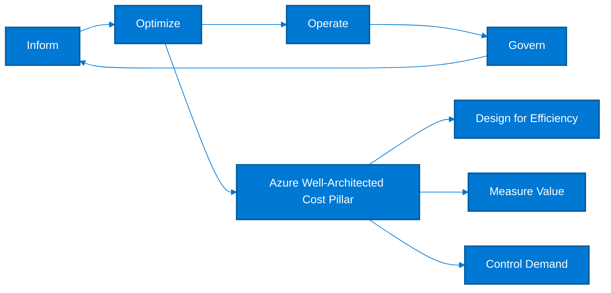

### Explanation and Savings Guidance

- FinOps aligns engineering, finance, and business teams around cloud unit economics, accountability, and speed.
- The Azure Well-Architected Framework cost pillar emphasizes designing for cost efficiency, optimizing scaling, and measuring the business value of spend.
- Strong governance converts ad hoc savings into recurring practice through ownership models, guardrails, review cadences, and policy automation.
- Common design principles include right-sized resources, demand-based scaling, architecture-aware cost decisions, and transparent allocation.
- Best-practice organizations set targets for utilization, commitment coverage, budget adherence, and unit-cost trends rather than focusing only on total spend.
- Governance maturity often produces 10% to 30% sustained annual savings because teams stop reintroducing waste after each optimization cycle.

### Cost Comparison Table

| Option | Typical savings | Best fit | Key trade-off |
| --- | --- | --- | --- |
| Inform | Visibility and allocation | Dashboards, tagging, exports | Foundation for all savings |
| Optimize | Technical and commercial tuning | Rightsizing, commitments, architecture | Largest direct savings |
| Operate | Run-rate control | Budgets, anomaly review, SLO-aware scaling | Keeps gains from eroding |
| Govern | Policy and accountability | Standards, management groups, reviews | Scales FinOps across teams |

### Azure CLI Commands

```bash
az account management-group list --output table
az policy assignment create --name finops-tag-policy --scope /providers/Microsoft.Management/managementGroups/<mgId> --policy "/providers/Microsoft.Authorization/policyDefinitions/<policyDefinitionId>"
az role assignment create --assignee finops@example.com --role Reader --scope /subscriptions/<subscriptionId>
az consumption budget create --amount 100000 --budget-name mg-finops-budget --category cost --resource-group rg-finops --time-grain monthly --start-date 2025-01-01 --end-date 2025-12-31 --notifications contactEmails=finops@example.com operator=GreaterThan threshold=90 enabled=true
az advisor recommendation list --category Cost --output table
az graph query -q "Resources | summarize monthlyCandidateCount=count() by type" -o table
```

### Decision Checklist

- Define cost ownership for every subscription, platform, and major application service.
- Use unit economics such as cost per user, order, transaction, or environment, not only total spend.
- Review architecture choices for cost impact during design, not after deployment.
- Automate policy guardrails for tagging, regions, SKUs, and diagnostic settings that materially influence cost.
- Publish a monthly FinOps scorecard with forecast, savings realized, risks, and next actions.
- Tie optimization goals to engineering roadmaps and leadership metrics so they survive staffing changes.

### KPI and Validation Metrics

| KPI | Target / heuristic | Why it matters |
| --- | --- | --- |
| Allocated spend | >95% | Spend mapped to owner or product |
| Forecast variance | <10% | Planning accuracy |
| Optimization backlog age | <30 days average | Speed of action |
| Unit cost trend | Stable or improving | Cost per business output |
| Policy compliance | >95% | Guardrails enforced at scale |

### Common Anti-Patterns

- Treating FinOps as a finance-only exercise without engineering participation.
- Running cost reviews monthly but never linking them to backlog and delivery plans.
- Chasing one-time discounts while ignoring architecture patterns that regenerate waste.
- Using total spend as the only KPI and missing value delivered or business growth context.
- Leaving shared platforms outside the chargeback or accountability model.

### Implementation Playbook

1. Stand up a monthly FinOps forum with finance, platform engineering, and product owners.
2. Define standards for pricing model selection, tagging, budgets, and optimization reviews.
3. Track unit metrics and publish scorecards that combine cost and business output.
4. Automate high-value policies and remediations first.
5. Prioritize the largest repeatable savings opportunities rather than isolated micro-optimizations.
6. Continuously train teams on Azure commercial options and cost-aware architecture design.

### Practical Notes

- Review this section with the service owner before applying changes in production.
- Validate savings with **actual or amortized cost views** depending on whether commitments are involved.
- Capture a pre-change performance or capacity baseline so optimization does not erode service quality.
- Document owner, expected savings, implementation window, rollback criteria, and realized outcome.
- Revisit the decision after one billing cycle because Azure usage patterns and platform design change over time.

## 15. Commitment Calculation Methods

**Objective:** Quantify how much baseline spend should be committed through reservations or Savings Plans.

### Mermaid Diagram

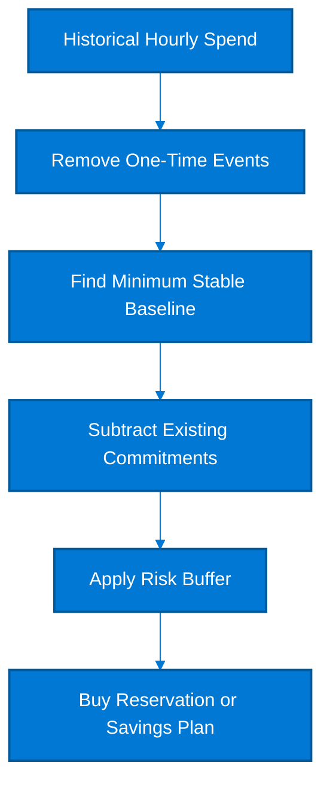

### Explanation and Savings Guidance

- Commitment sizing should use hourly historical usage, not just monthly averages, because commitments are consumed hourly.
- A common starting point is the P10 or minimum recurring hourly spend after excluding incidents, migrations, and holiday anomalies.
- Subtract current reservations, Savings Plans, and workloads scheduled for retirement to avoid double-counting.
- Apply a risk buffer of 10% to 30% depending on workload volatility and business confidence in the forecast.
- For service reservations, calculate commitment in normalized units such as vCores, RU/s, instance family size, or storage TB.
- For Savings Plans, convert the baseline to an hourly spend number and favor conservative initial commitment with later expansion.

### Cost Comparison Table

| Option | Typical savings | Best fit | Key trade-off |
| --- | --- | --- | --- |
| High-confidence baseline | 85% to 100% of stable floor | Mature production platform | Best discount capture |
| Medium-confidence baseline | 70% to 85% | Moderately variable estate | Balanced risk |
| Low-confidence baseline | 50% to 70% | Recent migration or major redesign | Lower lock-in |
| Overcommitment | Negative outcome | Usage below commitment | Unused paid commitment |

### Azure CLI Commands

```bash
az rest --method post --url "https://management.azure.com/providers/Microsoft.CostManagement/query?api-version=2023-03-01" --body "{"type":"Usage","timeframe":"Custom","timePeriod":{"from":"2025-01-01T00:00:00Z","to":"2025-03-31T23:59:59Z"},"dataset":{"granularity":"Hourly","aggregation":{"cost":{"name":"PreTaxCost","function":"Sum"}}}}"
az consumption usage list --start-date 2025-01-01 --end-date 2025-03-31 --output json
az reservations reservation-order list --output table
az rest --method get --url "https://management.azure.com/providers/Microsoft.BillingBenefits/savingsPlanOrders?api-version=2022-11-01"
az graph query -q "Resources | summarize count() by type, location" -o table
```

### Decision Checklist

- Use the lowest repeatable hourly floor, not the average, as the commitment anchor.
- Exclude known decommissioned or migrating workloads from the baseline.
- Separate critical base load from optional or seasonal load before committing.
- Recalculate commitments after major application launches, mergers, or region moves.
- Blend reservations and Savings Plans only when it improves flexibility without hurting utilization.
- Document all formulas so finance and engineering use the same assumptions.

### KPI and Validation Metrics

| KPI | Target / heuristic | Why it matters |
| --- | --- | --- |
| Commitment forecast variance | <10% | Actual hourly floor versus planned floor |
| Buffer ratio | 10% to 30% | Depends on volatility |
| Unused commitment | <5% | Paid but unconsumed |
| Reforecast cadence | Monthly | Update when major changes occur |
| Data history depth | 60 to 180 days | Longer history improves confidence |

### Common Anti-Patterns

- Using a seasonal peak month to size all-year commitments.
- Ignoring workloads already covered by other commitments.
- Basing decisions on monthly total spend without hourly granularity.
- Skipping business roadmap reviews before buying long commitments.
- Failing to separate stable base load from experimental environments.

### Implementation Playbook

1. Gather hourly cost and usage for 60 to 180 days.
2. Normalize data by removing non-recurring events.
3. Estimate stable floor and apply a prudent risk buffer.
4. Choose reservations for fixed service demand and Savings Plans for flexible compute demand.
5. Monitor utilization after purchase and refine the next commitment round.
6. Keep an auditable calculation workbook or dashboard for each commitment.

### Practical Notes

- Review this section with the service owner before applying changes in production.
- Validate savings with **actual or amortized cost views** depending on whether commitments are involved.
- Capture a pre-change performance or capacity baseline so optimization does not erode service quality.
- Document owner, expected savings, implementation window, rollback criteria, and realized outcome.
- Revisit the decision after one billing cycle because Azure usage patterns and platform design change over time.

## 16. Monthly Azure Cost Review Checklist

**Objective:** Provide a repeatable operational checklist that keeps cost optimization active every month.

### Mermaid Diagram


### Explanation and Savings Guidance

- A monthly review process ensures savings decisions become part of operations rather than one-off projects.
- The review should combine invoice validation, forecast variance, optimization backlog triage, and accountability reporting.
- Teams that maintain a disciplined monthly cadence usually sustain cost reductions better than teams that only optimize during budget pressure.
- This process indirectly protects 10% to 30% of annual cloud spend by catching drift early.
- Use the same month-end dataset for finance and engineering to avoid reconciliation debates.
- Always validate realized savings on the next bill rather than relying only on estimated calculators.

### Cost Comparison Table

| Option | Typical savings | Best fit | Key trade-off |
| --- | --- | --- | --- |
| Invoice reconciliation | Billing accuracy | Finance + platform | Monthly close |
| Top variance review | Drift detection | Service owners | Monthly |
| Optimization backlog | Savings execution | Engineering teams | Weekly or monthly |
| Commitment review | Discount utilization | FinOps | Monthly |
| Tag quality audit | Allocation accuracy | Platform team | Monthly |

### Azure CLI Commands

```bash
az billing invoice list --output table
az consumption usage list --start-date 2025-02-01 --end-date 2025-02-28 --output table
az advisor recommendation list --category Cost --output table
az advisor score list --output table
az graph query -q "Resources | project name, type, tags | where isempty(tags.CostCenter)" -o table
```

### Decision Checklist

- Review all invoices before declaring the month closed.
- Investigate the top cost movers by service, subscription, and business owner.
- Confirm reservation and Savings Plan utilization and renewals.
- Audit tag completeness and allocation gaps.
- Prioritize actions by savings, risk, and speed.
- Update forecast and next-month budget thresholds.

### KPI and Validation Metrics

| KPI | Target / heuristic | Why it matters |
| --- | --- | --- |
| Review completion | 100% monthly | Meeting and report delivered |
| Top variance explained | >95% | Large movements with owner and cause |
| Backlog closure | >70% | Accepted actions completed |
| Realized versus estimated savings | Tracked | Improves forecast quality |
| Open billing disputes | Near zero | Resolved quickly |

### Common Anti-Patterns

- Treating cost review as a finance-only meeting.
- Reviewing totals without drilling into drivers.
- Not following through on previously accepted actions.
- Skipping validation of realized savings.
- Allowing invoice surprises to surface after close.

### Implementation Playbook

1. Pull actual, amortized, invoice, and recommendation data.
2. Review biggest cost changes and map them to workload events.
3. Confirm savings actions completed last month and validate realized outcomes.
4. Create or refresh the next optimization backlog.
5. Publish the scorecard and owner list.
6. Update the next forecast and budget thresholds.

### Practical Notes

- Review this section with the service owner before applying changes in production.
- Validate savings with **actual or amortized cost views** depending on whether commitments are involved.
- Capture a pre-change performance or capacity baseline so optimization does not erode service quality.
- Document owner, expected savings, implementation window, rollback criteria, and realized outcome.
- Revisit the decision after one billing cycle because Azure usage patterns and platform design change over time.

## Reference Formulas

- **Reservation coverage %** = Stable usage covered by reservations / total stable usage × 100.
- **Reservation utilization %** = Reserved units consumed / reserved units purchased × 100.
- **Savings Plan utilization %** = Discounted spend applied / committed hourly spend × 100.
- **Rightsizing savings %** = (Current monthly cost - optimized monthly cost) / current monthly cost × 100.
- **Storage tier savings %** = (Hot tier cost - new tier cost - expected retrieval cost) / Hot tier cost × 100.
- **Unit cost** = Total allocated Azure cost / business output metric such as users, orders, environments, or API calls.

## 30 / 60 / 90 Day Adoption Roadmap

| Time window | Primary actions | Expected outcome | Owner |
| --- | --- | --- | --- |
| First 30 days | Set budgets, exports, tag policies, and top 10 quick wins | Immediate visibility and easy savings | FinOps + platform |
| Days 31 to 60 | Rightsize compute, enable shutdown schedules, adopt Spot and serverless where safe | Run-rate reduction | Service owners |
| Days 61 to 90 | Purchase reservations or Savings Plans, expand AHB, mature chargeback | Commercial optimization at scale | FinOps + finance |
| Ongoing | Monthly review cadence and architectural optimization | Sustained savings | Cross-functional governance |

## Final Recommendations

- Commercial optimization and technical optimization should be done together; buying commitments for waste just locks in waste at a discount.
- Start with visibility, ownership, and the stable demand baseline; then buy reservations, Savings Plans, or Hybrid Benefit coverage.
- Use Spot, autoscaling, scheduling, and serverless patterns to handle volatility without paying peak price all month.
- Keep cost review tightly coupled with architecture review, SRE review, and product roadmap decisions.
- Measure realized savings every month and continuously improve the optimization backlog.

---

## 📚 Official Documentation
- [Azure Cost Management and Billing](https://learn.microsoft.com/en-us/azure/cost-management-billing/)
- [Azure Advisor](https://learn.microsoft.com/en-us/azure/advisor/)
- [Azure Reservations](https://learn.microsoft.com/en-us/azure/cost-management-billing/reservations/)
- [Azure savings plan for compute](https://learn.microsoft.com/en-us/azure/cost-management-billing/savings-plan/)
- [FinOps on Azure](https://learn.microsoft.com/en-us/azure/finops/)
