# Azure Data Pipeline & Analytics

A comprehensive Azure-focused guide covering ingestion, orchestration, streaming, warehousing, lakehouse analytics, governance, and BI for enterprise data platforms.

> This document intentionally combines architecture patterns, Azure CLI examples, and operational guidance. Azure CLI command coverage varies by service and extension version, so validate commands in your tenant and pin versions in automation.

## Table of Contents
- [Azure Data Factory](#azure-data-factory)
- [Azure Synapse Analytics](#azure-synapse-analytics)
- [Azure Event Hubs](#azure-event-hubs)
- [Azure Service Bus](#azure-service-bus)
- [Azure Stream Analytics](#azure-stream-analytics)
- [Azure Databricks](#azure-databricks)
- [Azure HDInsight](#azure-hdinsight)
- [Azure Data Explorer (ADX)](#azure-data-explorer-adx)
- [Azure Logic Apps](#azure-logic-apps)
- [Power BI](#power-bi)
- [Azure Purview (Microsoft Purview)](#azure-purview-microsoft-purview)
- [Real-Time Pipeline](#real-time-pipeline)
- [Batch Pipeline](#batch-pipeline)
- [Medallion Architecture](#medallion-architecture)
- [CLI Setup and Conventions](#cli-setup-and-conventions)
- [Security, Networking, and Governance](#security-networking-and-governance)
- [Monitoring, Reliability, and FinOps](#monitoring-reliability-and-finops)
- [Service Selection Cheat Sheet](#service-selection-cheat-sheet)

## Architecture Principles
- Design for replay so historical corrections and logic changes are practical.
- Favor managed identities, private networking, and centralized secret storage.
- Separate ingestion, transformation, serving, and governance concerns.
- Standardize metadata, lineage, and naming conventions early.
- Choose the right service for the workload instead of forcing one tool across all scenarios.
- Balance freshness, cost, and complexity explicitly in every architecture decision.
- Automate provisioning, deployment, monitoring, and policy enforcement.
- Keep raw data immutable, curated data trusted, and dashboards explainable.
- Observe data quality and business freshness alongside platform health.
- Treat documentation and runbooks as production assets, not afterthoughts.

## Azure Data Factory

### Mermaid diagram

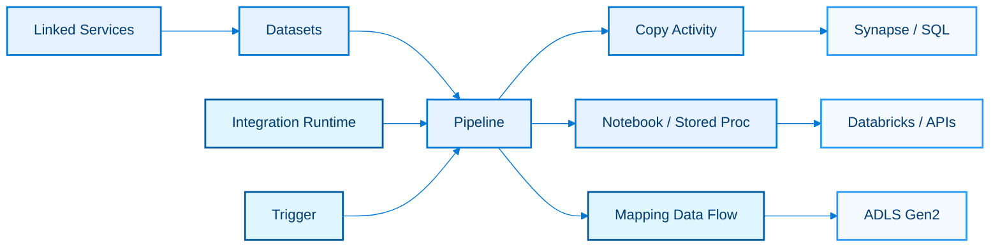

### Explanation

Azure Data Factory (ADF) is Azure's managed data integration service for building, scheduling, and monitoring ETL and ELT pipelines.

It provides visual orchestration, rich connectors, parameterized pipelines, managed integration runtimes, and low-code transformations through data flows.

#### Key capabilities
- Pipelines orchestrate end-to-end workflows and group activities into reusable units.
- Activities include Copy, Lookup, Web, Notebook, Stored Procedure, ForEach, Until, If Condition, and Execute Pipeline.
- Datasets describe the structure and location of data consumed or produced by activities.
- Linked services store connection metadata for sources, sinks, compute, and secret references.
- Integration runtimes provide compute for data movement, transformation, and secure connectivity.
- Triggers support schedule, tumbling window, and event-based execution patterns.
- Data flows offer graphical transformations for joins, aggregates, derives, filters, sinks, and schema drift handling.
- Mapping data flows run on managed Spark and are optimized for scalable transformations.
- Parameters, variables, and expressions enable reusable designs across environments.
- Managed identities integrate with Key Vault, Storage, Synapse, SQL, and other Azure services.

#### Design notes
- Use metadata-driven pipelines when onboarding many similar source systems.
- Separate orchestration logic from transformation logic so operational changes do not force code changes everywhere.
- Choose Azure IR for SaaS and public Azure sources; choose self-hosted IR for private networks and on-premises data.
- Prefer staging zones in ADLS Gen2 when loading large warehouses for replay and auditability.
- Use tumbling window triggers when exact window processing and dependency tracking matter.
- Use event triggers for near-real-time blob arrival patterns.
- Map parameter names consistently across linked services, datasets, pipelines, and ARM/Bicep deployments.
- Enable Git integration so collaboration, branching, and promotion are controlled.

#### Common patterns
- Common ingestion pattern: source system -> Copy Activity -> ADLS raw zone -> Synapse/Databricks processing.
- Common ELT pattern: ADF orchestrates ingestion and loading, while SQL or Spark performs heavy transformations.
- Common CDC pattern: schedule incremental extracts, watermark tables, and merge logic downstream.
- Common API pattern: Web activity obtains tokens and pagination metadata before a Copy or REST extraction.
- Common hybrid pattern: self-hosted IR bridges on-premises SQL Server, SAP, file shares, and Oracle to Azure.
- Common operational pattern: send pipeline metrics to Azure Monitor and alert on SLA breaches.

### Azure CLI commands

```bash
az extension add --name datafactory
az group create --name rg-data --location eastus
az datafactory factory create --resource-group rg-data --factory-name adf-enterprise-demo --location eastus
az datafactory linked-service create --resource-group rg-data --factory-name adf-enterprise-demo --name ls-adls --properties @linkedservice-adls.json
az datafactory dataset create --resource-group rg-data --factory-name adf-enterprise-demo --name ds-sales-csv --properties @dataset-sales.json
az datafactory pipeline create --resource-group rg-data --factory-name adf-enterprise-demo --name pl-batch-load --pipeline @pipeline-batch.json
az datafactory trigger create --resource-group rg-data --factory-name adf-enterprise-demo --name trg-daily-load --properties @trigger-daily.json
az datafactory trigger start --resource-group rg-data --factory-name adf-enterprise-demo --name trg-daily-load
az datafactory pipeline create-run --resource-group rg-data --factory-name adf-enterprise-demo --name pl-batch-load --parameters sourcePath=raw/sales
az datafactory pipeline-run query-by-factory --resource-group rg-data --factory-name adf-enterprise-demo --last-updated-after 2024-01-01T00:00:00Z --last-updated-before 2024-12-31T23:59:59Z
az datafactory integration-runtime create --resource-group rg-data --factory-name adf-enterprise-demo --name AutoResolveIntegrationRuntime --type Managed
az datafactory data-flow create --resource-group rg-data --factory-name adf-enterprise-demo --name df-transform-sales --properties @dataflow-sales.json
```

### Best practices

- Store secrets in Key Vault and reference them from linked services instead of embedding passwords.
- Adopt naming standards for factories, pipelines, datasets, triggers, and integration runtimes.
- Use separate factories or deployment branches for dev, test, and prod.
- Version JSON artifacts in Git and deploy with CI/CD instead of manual portal-only edits.
- Parameterize environment-specific values such as account names, schema names, and container paths.
- Enable retry, timeout, and fault-handling policies for activities that call remote systems.
- Capture operational metadata such as row counts, watermarks, and checksum status in control tables.
- Keep mapping data flows focused on transformations that truly benefit from Spark-scale execution.
- Monitor integration runtime capacity and data flow cluster spin-up cost.
- Document source-to-target lineage so ADF orchestration remains understandable at scale.

## Azure Synapse Analytics

### Mermaid diagram

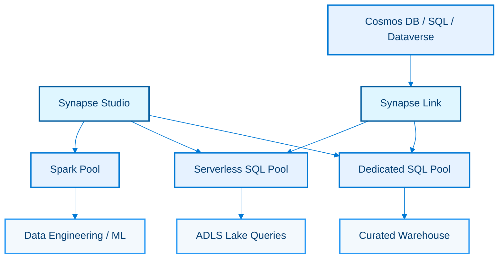

### Explanation

Azure Synapse Analytics unifies enterprise data warehousing, big data analytics, data integration, and data exploration in one workspace experience.

It combines dedicated SQL pools, serverless SQL pools, Spark pools, pipelines, and Synapse Studio for end-to-end analytics engineering.

#### Key capabilities
- Dedicated SQL pool is a provisioned MPP warehouse optimized for predictable, high-performance analytical workloads.
- Serverless SQL pool queries data directly in the lake without pre-provisioning compute.
- Spark pools provide notebooks, data engineering, feature engineering, and large-scale transformations.
- Synapse Studio offers a browser-based workspace for data, develop, integrate, monitor, and manage experiences.
- Workspaces integrate with ADLS Gen2 and managed identities by default.
- Synapse Link reduces ETL friction for operational analytics from Cosmos DB, Azure SQL, and Dataverse.
- Pipelines and notebooks can be orchestrated inside the Synapse workspace.
- SQL scripts, Spark jobs, KQL databases in some deployments, and workspace artifacts are versionable.
- Workspace-managed private endpoints help secure access to PaaS resources.
- Spark and SQL can cooperate through shared lake zones and external tables.

#### Design notes
- Use dedicated SQL pools for repeatable BI, dimensional models, and predictable concurrency SLAs.
- Use serverless SQL for ad hoc exploration, external table virtualization, and lakehouse discovery.
- Use Spark when transformation logic is code-heavy, semi-structured, or machine-learning oriented.
- Use Synapse Link when operational systems must feed analytics with minimal ETL latency.
- Partition parquet data by high-selectivity columns such as date and business unit.
- Tune dedicated SQL pool distribution, indexing, and workload management according to query patterns.
- Separate workspace administration from data-plane roles using RBAC and ACLs.
- Standardize database projects, notebook packaging, and release promotion across environments.

#### Common patterns
- Lakehouse exploration pattern: land parquet in ADLS and expose it through serverless SQL views.
- Warehouse pattern: ingest raw data, transform in Spark or SQL, load star schemas into a dedicated pool.
- Operational analytics pattern: Synapse Link mirrors transactional changes to analytical storage.
- Data science pattern: Spark notebooks prepare features and persist curated outputs to Delta or parquet.
- Virtualization pattern: serverless SQL exposes external tables over multiple containers and domains.
- Self-service pattern: business analysts use Synapse Studio and Power BI on top of shared semantic layers.

### Azure CLI commands

```bash
az extension add --name synapse
az group create --name rg-synapse --location eastus2
az storage account create --name stsynapsedemo01 --resource-group rg-synapse --location eastus2 --sku Standard_LRS --kind StorageV2 --hierarchical-namespace true
az synapse workspace create --name synw-demo --resource-group rg-synapse --storage-account stsynapsedemo01 --file-system synapse --sql-admin-login synadmin --sql-admin-password "ChangeM3Now!" --location eastus2
az synapse sql pool create --name dwhcurated --performance-level DW200c --resource-group rg-synapse --workspace-name synw-demo
az synapse spark pool create --name sparketl --resource-group rg-synapse --workspace-name synw-demo --node-count 3 --node-size Small
az synapse linked-service create --name ls-lake --workspace-name synw-demo --resource-group rg-synapse --file @synapse-linkedservice.json
az synapse pipeline create --name pl-synapse-ingest --workspace-name synw-demo --resource-group rg-synapse --file @synapse-pipeline.json
az synapse notebook create --name nb-transform --workspace-name synw-demo --resource-group rg-synapse --file @notebook.ipynb
az synapse trigger create --name trg-hourly --workspace-name synw-demo --resource-group rg-synapse --file @trigger-hourly.json
az synapse workspace-package upload --workspace-name synw-demo --resource-group rg-synapse --package local-wheel.whl
az synapse sql pool pause --name dwhcurated --resource-group rg-synapse --workspace-name synw-demo
```

### Best practices

- Pause dedicated SQL pools when not needed to control cost.
- Prefer parquet or Delta in the lake for open, compressed, columnar storage.
- Use CETAS, COPY INTO, and PolyBase-style loading patterns for efficient bulk ingest.
- Design fact tables and distributions based on join and aggregation patterns.
- Minimize small files in the lake to improve serverless and Spark performance.
- Secure workspace traffic with managed virtual networks, private endpoints, and restricted public access.
- Track lineage between Synapse Link sources, lake zones, SQL views, and Power BI datasets.
- Separate exploratory notebooks from productionized pipelines and code packages.
- Use result-set caching and materialized views only where they match workload behavior.
- Benchmark representative query workloads before committing to pool sizing and concurrency settings.

## Azure Event Hubs

### Mermaid diagram

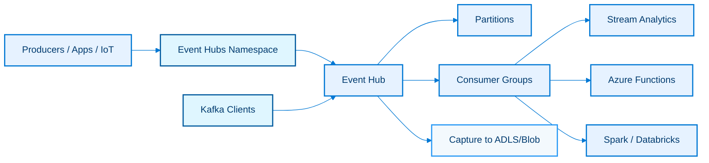

### Explanation

Azure Event Hubs is a highly scalable event ingestion service for telemetry, logs, clickstreams, and real-time integration.

It offers partitioned append-only streams, consumer isolation through consumer groups, capture to storage, and protocol compatibility with Kafka.

#### Key capabilities
- Namespaces provide the security, networking, throughput, and management boundary for event hubs.
- Each event hub stores ordered streams per partition for parallel processing.
- Partitions improve scale-out and preserve order within a partition key.
- Consumer groups let multiple independent applications read the same event stream.
- Capture automatically lands Avro or parquet-like batch outputs into Blob Storage or ADLS Gen2.
- Kafka endpoint compatibility supports many existing Kafka producers and consumers.
- Throughput units or processing units define ingress and egress capacity in Standard and Premium tiers.
- Geo-disaster recovery supports alias-based failover for namespaces.
- Schema Registry supports producer and consumer governance for Avro and related schemas.
- Managed identities and private endpoints improve enterprise security.

#### Design notes
- Choose partition counts based on parallelism, expected key cardinality, and long-term scale needs.
- Use idempotent downstream consumers because event delivery is at-least-once.
- Select consumer groups per application, not per environment and team member.
- Use Capture when auditability, replay, and lake retention are needed beyond stream retention.
- Tune retention for recovery needs and storage cost.
- Kafka compatibility simplifies migration, but Azure-native SDKs often expose platform-specific features more directly.
- Premium and Dedicated tiers matter when low latency, private networking scale, or high isolation is required.
- Namespace-level RBAC should align with producer, operator, and consumer responsibilities.

#### Common patterns
- Telemetry pattern: devices send JSON or Avro events keyed by device ID.
- Operational integration pattern: microservices publish domain events for analytics and automation.
- Streaming enrichment pattern: Event Hubs feeds Stream Analytics with reference joins and windowing.
- Lake replay pattern: Capture stores immutable files for later Spark and Synapse reprocessing.
- Kafka lift-and-shift pattern: existing Kafka clients point to the Event Hubs Kafka endpoint.
- SIEM pattern: platform and app logs stream into consumers that normalize and archive them.

### Azure CLI commands

```bash
az group create --name rg-stream --location eastus
az eventhubs namespace create --name ehns-demo --resource-group rg-stream --location eastus --sku Standard --capacity 2
az eventhubs eventhub create --name orders --namespace-name ehns-demo --resource-group rg-stream --partition-count 8 --message-retention 3
az eventhubs eventhub consumer-group create --name analytics --eventhub-name orders --namespace-name ehns-demo --resource-group rg-stream
az eventhubs eventhub consumer-group create --name fraud --eventhub-name orders --namespace-name ehns-demo --resource-group rg-stream
az eventhubs eventhub show --name orders --namespace-name ehns-demo --resource-group rg-stream
az eventhubs namespace authorization-rule keys list --name RootManageSharedAccessKey --namespace-name ehns-demo --resource-group rg-stream
az eventhubs eventhub authorization-rule create --eventhub-name orders --namespace-name ehns-demo --resource-group rg-stream --name sendonly --rights Send
az eventhubs eventhub update --name orders --namespace-name ehns-demo --resource-group rg-stream --capture-description @capture.json
az eventhubs georecovery-alias set --resource-group rg-stream --namespace-name ehns-demo --alias eh-dr --partner-namespace ehns-secondary
az eventhubs namespace network-rule-set update --resource-group rg-stream --namespace-name ehns-demo --default-action Deny
az eventhubs namespace create --name ehns-premium-demo --resource-group rg-stream --location eastus --sku Premium --capacity 1
```

### Best practices

- Avoid changing partition count later unless you understand the impact on hashing and ordering.
- Use partition keys only when order affinity matters; otherwise let the service balance events.
- Separate producer and consumer credentials and rotate them regularly.
- Enable Capture for compliance, replay, and late consumer onboarding.
- Monitor incoming messages, throttled requests, and consumer lag.
- Right-size throughput units or processing units based on sustained rather than peak-only estimates.
- Prefer Premium for strict networking, predictable isolation, or schema registry-heavy workloads.
- Use application-level checkpointing with Blob Storage or compatible processors.
- Keep event bodies compact and avoid giant payloads; store large objects in storage and send references.
- Test failover and downstream recovery paths, not just producer connectivity.

## Azure Service Bus

### Mermaid diagram

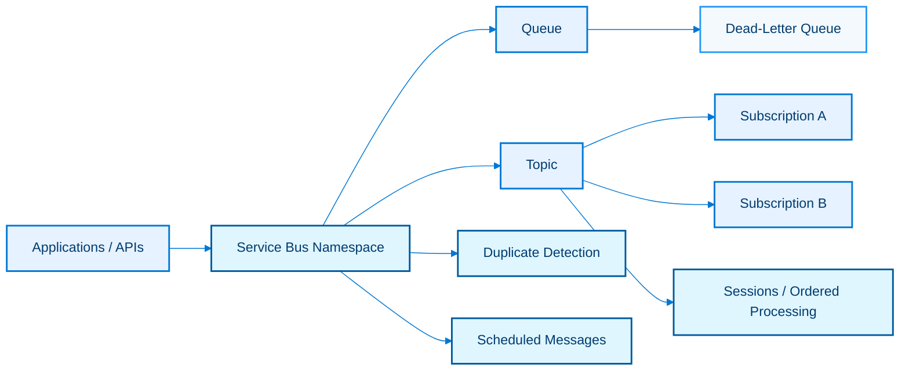

### Explanation

Azure Service Bus is an enterprise message broker for commands, workflows, integrations, and asynchronous decoupling.

It supports queues, topics and subscriptions, sessions, dead-letter handling, duplicate detection, transactions, and scheduled delivery.

#### Key capabilities
- Queues support point-to-point messaging and competing consumer patterns.
- Topics and subscriptions support pub/sub fan-out with filters and independent processing.
- Sessions preserve ordered processing and affinity for related messages.
- Dead-letter queues capture poison or undeliverable messages for investigation and replay.
- Duplicate detection prevents accidental reprocessing when the same message ID is resent within a configured window.
- Scheduled messages enable delayed workflows and time-based orchestration.
- Auto-forwarding chains entities together for advanced routing.
- Premium namespaces deliver isolation, better predictability, and VNet support.
- AMQP support enables rich enterprise messaging semantics.
- Transactions can coordinate multiple send and receive actions within the broker.

#### Design notes
- Use Service Bus for commands and business workflows, not for high-throughput telemetry where Event Hubs is a better fit.
- Choose queues when one logical consumer group should handle each message exactly once from the broker perspective.
- Choose topics when multiple applications need their own copy and lifecycle for the same event.
- Use sessions when one customer, order, or case must be processed in order.
- Enable duplicate detection for at-least-once publishers that may retry.
- Dead-letter messages should include diagnostic metadata and replay procedures.
- Premium tier is usually the right answer for mission-critical enterprise integrations.
- Namespace segmentation should reflect blast radius, tenant isolation, or criticality.

#### Common patterns
- Order processing pattern: API sends an order command to a queue; workers complete and emit follow-up events.
- Broadcast pattern: topic publishes account events; downstream fraud, CRM, and analytics subscriptions consume independently.
- Saga pattern: scheduled messages implement timeouts and compensation checks.
- FIFO affinity pattern: sessions ensure all messages for one aggregate are processed serially.
- Resilience pattern: max delivery count and dead-lettering protect the main processing path.
- Integration pattern: Logic Apps, Functions, and worker services process brokered messages.

### Azure CLI commands

```bash
az group create --name rg-messaging --location eastus
az servicebus namespace create --resource-group rg-messaging --name sbns-demo --location eastus --sku Premium
az servicebus queue create --resource-group rg-messaging --namespace-name sbns-demo --name orders-q --enable-dead-lettering-on-message-expiration true --enable-duplicate-detection true
az servicebus topic create --resource-group rg-messaging --namespace-name sbns-demo --name order-events --enable-duplicate-detection true
az servicebus topic subscription create --resource-group rg-messaging --namespace-name sbns-demo --topic-name order-events --name billing-sub --enable-dead-lettering-on-filter-evaluation-exceptions true
az servicebus topic subscription create --resource-group rg-messaging --namespace-name sbns-demo --topic-name order-events --name crm-sub
az servicebus topic subscription rule create --resource-group rg-messaging --namespace-name sbns-demo --topic-name order-events --subscription-name billing-sub --name high-value --filter-sql-expression "amount > 1000"
az servicebus queue authorization-rule create --resource-group rg-messaging --namespace-name sbns-demo --queue-name orders-q --name sendrecv --rights Send Listen
az servicebus namespace authorization-rule keys list --resource-group rg-messaging --namespace-name sbns-demo --name RootManageSharedAccessKey
az servicebus queue show --resource-group rg-messaging --namespace-name sbns-demo --name orders-q
az servicebus topic show --resource-group rg-messaging --namespace-name sbns-demo --name order-events
az servicebus namespace network-rule-set update --resource-group rg-messaging --namespace-name sbns-demo --default-action Deny
```

### Best practices

- Use broker features intentionally; do not rebuild dead-lettering, scheduling, or duplicate detection in application code.
- Set time-to-live, max delivery count, and lock duration to match business semantics.
- Implement idempotent handlers even when duplicate detection is enabled.
- Monitor DLQ depth, active messages, transfer dead-letter counts, and server errors.
- Keep message payloads lean and use correlation IDs, message IDs, and session IDs consistently.
- Use sessions only when you truly need ordered affinity because they reduce concurrency.
- Prefer Premium for enterprise security, predictable throughput, and advanced network isolation.
- Plan replay tooling for dead-letter queues before go-live.
- Apply subscription filters carefully so important events are not silently excluded.
- Separate command queues from event topics to keep semantics clear.

## Azure Stream Analytics

### Mermaid diagram

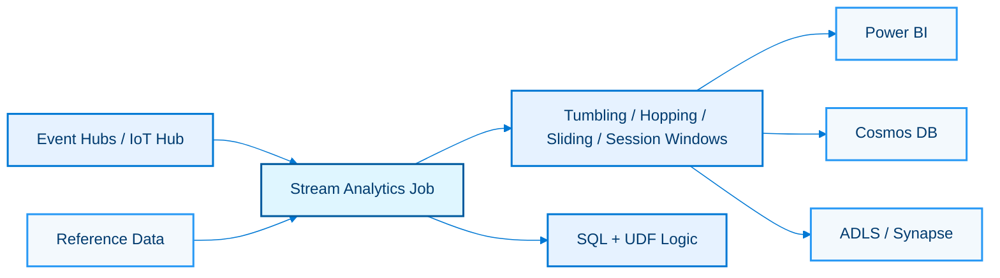

### Explanation

Azure Stream Analytics (ASA) is a serverless real-time analytics service that processes events using a SQL-like language.

It reads from streaming sources, joins with reference data, applies temporal windows, and writes to dashboards, storage, databases, and warehouses.

#### Key capabilities
- Streaming units define the job's scale and throughput capacity.
- Inputs can come from Event Hubs, IoT Hub, Blob Storage, and other supported services.
- Outputs include Power BI, Cosmos DB, Blob Storage, ADLS, SQL Database, and Event Hubs.
- Windowing supports tumbling, hopping, sliding, and session windows for event aggregation.
- Reference data supports static or slowly changing dimension lookups.
- Built-in query language supports filtering, grouping, joins, user-defined functions, and anomaly-detection style patterns.
- UDFs can be written in JavaScript for custom logic.
- Late arrival and out-of-order policies control event-time handling.
- Compatibility level and query testing simplify deployment governance.
- ASA integrates well with dashboards for operational insight.

#### Design notes
- Use event time when business semantics depend on when an event occurred, not when it was processed.
- Set watermark and late-arrival policies explicitly so aggregations behave predictably.
- Reference data should be compact and refreshed on a cadence appropriate to the business domain.
- Use ASA when low-code SQL streaming is enough; use Spark or Flink-like systems when pipelines are code-centric and complex.
- Scale streaming units based on partition count, query complexity, and output latency.
- Multiple outputs may require thoughtful parallelism and error-handling strategies.
- Partition alignment between Event Hubs and ASA improves performance and scale.
- Test window semantics with representative out-of-order streams before production.

#### Common patterns
- Tumbling window pattern: aggregate five-minute revenue totals per store.
- Hopping window pattern: compute overlapping trend metrics every minute across the last fifteen minutes.
- Sliding window pattern: emit alerts whenever a threshold is crossed within a moving time horizon.
- Session window pattern: group clickstream activity by user inactivity gaps.
- Reference join pattern: enrich telemetry with device metadata before alerting.
- Dashboard pattern: output near-real-time KPIs directly to Power BI.

### Azure CLI commands

```bash
az group create --name rg-asa --location eastus
az stream-analytics job create --resource-group rg-asa --name asa-orders --location eastus --output-error-policy Stop --events-outoforder-policy Adjust --events-outoforder-max-delay 30 --compatibility-level 1.2
az stream-analytics input eventhub create --resource-group rg-asa --job-name asa-orders --name in-orders --servicebus-namespace ehns-demo --eventhub-name orders --consumer-group-name analytics --shared-access-policy-name RootManageSharedAccessKey --type stream
az stream-analytics input blob create --resource-group rg-asa --job-name asa-orders --name ref-products --storage-account stsynapsedemo01 --storage-account-key <key> --container refdata --path-pattern products.csv --date-format none --time-format none --type reference
az stream-analytics transformation create --resource-group rg-asa --job-name asa-orders --name trx-orders --streaming-units 6 --saql "SELECT System.Timestamp AS windowEnd, productId, COUNT(*) AS orderCount INTO outputPowerBI FROM in-orders TIMESTAMP BY eventTime GROUP BY productId, TumblingWindow(minute, 5)"
az stream-analytics output powerbi create --resource-group rg-asa --job-name asa-orders --name outputPowerBI --group-name Finance --dataset-name OrdersRealtime --table-name Metrics
az stream-analytics output cosmosdb create --resource-group rg-asa --job-name asa-orders --name outputCosmos --account-id cosmos-demo --account-key <key> --database ordersdb --collection-name metrics
az stream-analytics output blob create --resource-group rg-asa --job-name asa-orders --name outputLake --storage-account stsynapsedemo01 --storage-account-key <key> --container bronze --time-window 00:05:00 --path-pattern realtime/{date}/{time}
az stream-analytics job start --resource-group rg-asa --name asa-orders --output-start-mode JobStartTime
az stream-analytics job show --resource-group rg-asa --name asa-orders
az stream-analytics job scale --resource-group rg-asa --name asa-orders --streaming-units 12
az stream-analytics job stop --resource-group rg-asa --name asa-orders
```

### Best practices

- Use event-time semantics for business aggregates and arrival-time semantics only for operational metrics when appropriate.
- Document each window type so downstream users interpret metrics correctly.
- Keep UDF logic small and deterministic; move heavy custom processing to Functions or Spark.
- Monitor watermark delay, backlogged input events, and output errors.
- Test skewed partitions and burst traffic before declaring SLA confidence.
- Prefer managed identities and secure inputs/outputs with private endpoints where possible.
- Use reference data for low-latency lookups, not large frequently changing master data.
- Version queries in source control and promote them through environments.
- Emit raw or minimally processed copies to lake storage for replay and audit.
- Scale down streaming units when ingestion patterns are predictably low to save cost.

## Azure Databricks

### Mermaid diagram

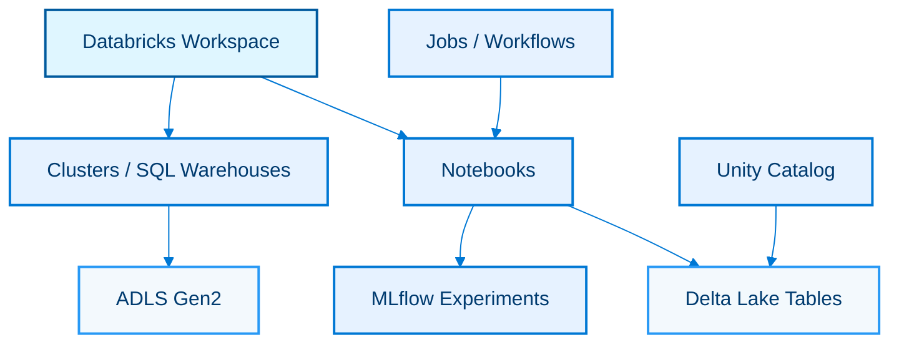

### Explanation

Azure Databricks is a first-party Apache Spark platform for data engineering, lakehouse analytics, streaming, and machine learning.

It brings collaborative workspaces, autoscaling compute, Delta Lake reliability, Unity Catalog governance, and MLflow lifecycle tooling.

#### Key capabilities
- Workspaces host notebooks, repos, jobs, dashboards, and compute resources.
- Clusters provide interactive or job-based Spark compute with autoscaling and auto-termination.
- Notebooks support Python, SQL, Scala, and R for collaborative analytics.
- Delta Lake adds ACID transactions, schema enforcement, time travel, and merge operations on data lake files.
- Unity Catalog centralizes governance for catalogs, schemas, tables, files, models, and permissions.
- MLflow tracks experiments, parameters, metrics, models, and lineage.
- Jobs orchestrate notebook, wheel, dbt, SQL, and pipeline tasks.
- Structured Streaming supports near-real-time pipelines from Event Hubs, Kafka, and cloud storage.
- Photon and optimized runtimes improve SQL and DataFrame performance.
- Serverless and SQL warehouse options enable BI-centric access patterns.

#### Design notes
- Use job clusters for scheduled production work and all-purpose clusters for exploration.
- Adopt Delta Lake as the default storage format for reliable medallion pipelines.
- Use Unity Catalog for centralized permissions instead of ad hoc workspace-level access controls.
- Store notebooks and code in Git-backed repos to improve promotion discipline.
- Standardize cluster policies to control runtime versions, node types, and cost sprawl.
- Leverage Auto Loader for efficient incremental ingestion from object storage.
- Keep MLflow experiments tied to approved model governance practices.
- Use Jobs with task dependencies rather than giant monolithic notebooks.

#### Common patterns
- Bronze-to-silver pattern: ingest raw files with Auto Loader and normalize into Delta tables.
- Silver-to-gold pattern: apply business rules, dimensions, aggregates, and quality checks.
- Streaming pattern: read Event Hubs streams and upsert into Delta using foreachBatch or streaming tables.
- ML pattern: feature engineering notebooks log runs and models with MLflow.
- BI pattern: expose Delta tables to SQL warehouses and Power BI.
- Governance pattern: Unity Catalog enforces row, column, and object-level controls.

### Azure CLI commands

```bash
az group create --name rg-dbx --location eastus2
az databricks workspace create --resource-group rg-dbx --name dbw-demo --location eastus2 --sku premium
az databricks workspace show --resource-group rg-dbx --name dbw-demo
az databricks workspace update --resource-group rg-dbx --name dbw-demo --prepare-encryption
az databricks workspace list --resource-group rg-dbx
az network private-endpoint create --resource-group rg-dbx --name pe-dbx --vnet-name vnet-data --subnet data-subnet --private-connection-resource-id $(az databricks workspace show --resource-group rg-dbx --name dbw-demo --query id -o tsv) --group-id databricks_ui_api
az monitor diagnostic-settings create --name dbx-diag --resource $(az databricks workspace show --resource-group rg-dbx --name dbw-demo --query id -o tsv) --workspace /subscriptions/<sub>/resourceGroups/rg-monitor/providers/Microsoft.OperationalInsights/workspaces/law-demo --logs "[{"category":"dbfs","enabled":true}]"
az role assignment create --assignee <principalId> --role "Storage Blob Data Contributor" --scope /subscriptions/<sub>/resourceGroups/rg-lake/providers/Microsoft.Storage/storageAccounts/stsynapsedemo01
az keyvault secret set --vault-name kv-data-demo --name databricks-sp-secret --value <secret>
az databricks workspace delete --resource-group rg-dbx --name dbw-ephemeral --yes
az extension add --name databricks
az configure --defaults group=rg-dbx location=eastus2
```

### Best practices

- Use Unity Catalog from the start instead of retrofitting governance later.
- Enforce cluster policies, tagging, and auto-termination to manage cost.
- Use Delta tables with checkpointing and expectations for reliable streaming pipelines.
- Modularize notebooks into reusable libraries or packages for production code.
- Avoid storing secrets in notebooks; use secret scopes or Key Vault-backed secrets.
- Separate dev, test, and prod workspaces or catalogs based on regulatory and release needs.
- Prefer job orchestration with retries, alerts, and SLAs over manually run notebooks.
- Compact and optimize Delta tables where needed to control small files and query latency.
- Track model and pipeline lineage with MLflow and Unity Catalog integrations.
- Benchmark cluster sizes and runtimes instead of defaulting to oversized compute.

## Azure HDInsight

### Mermaid diagram

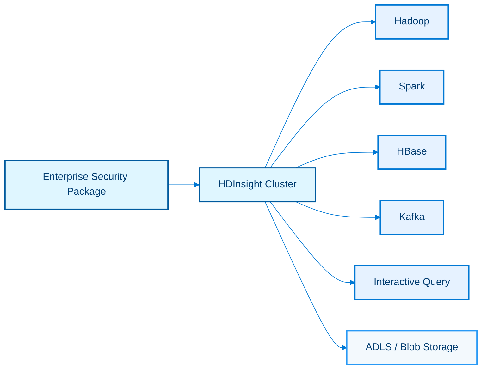

### Explanation

Azure HDInsight is a managed open-source analytics service that provides enterprise clusters for Hadoop ecosystem workloads.

It is useful when teams need managed Hadoop, Spark, HBase, Kafka, or Interactive Query clusters with Azure integration and optional Enterprise Security Package.

#### Key capabilities
- Hadoop clusters support batch data processing with HDFS-compatible storage layers backed by Azure storage.
- Spark clusters support scalable analytics and machine learning on the Apache Spark engine.
- HBase clusters provide NoSQL storage for large sparse datasets and low-latency random access.
- Kafka clusters offer managed message streaming built on Apache Kafka.
- Interactive Query clusters expose LLAP-based SQL on Hadoop-compatible data.
- Enterprise Security Package integrates domain-joined security, role-based access, and Apache Ranger.
- Clusters integrate with Azure Monitor, Log Analytics, and storage accounts.
- Script actions support bootstrap customization during cluster lifecycle events.
- Autoscale can adjust worker nodes based on schedules or load for some cluster types.
- Virtual network deployment improves connectivity and enterprise isolation.

#### Design notes
- Choose HDInsight when an ecosystem dependency or managed cluster requirement rules out simpler PaaS options.
- Prefer managed PaaS alternatives like Synapse, Databricks, Event Hubs, or AKS when they better match greenfield needs.
- Use ESP when domain integration, Ranger policies, and enterprise identity are mandatory.
- Keep customizations scripted and reproducible instead of manually tweaking nodes.
- Persist data in ADLS or Blob rather than relying on local cluster storage.
- Plan upgrade and patch windows because cluster runtime versions matter.
- Size head, worker, and ZooKeeper-related roles according to cluster type and SLA.
- Network egress, DNS, and domain dependencies should be validated early in secure deployments.

#### Common patterns
- Legacy Hadoop pattern: migrate on-premises Hadoop jobs to Azure with minimal application changes.
- Managed Kafka pattern: run Kafka clusters that must remain Apache-compatible but Azure-hosted.
- Spark ETL pattern: batch transformations over lake data with YARN-managed Spark clusters.
- Low-latency NoSQL pattern: use HBase for device history or sparse time-series indexing.
- Interactive SQL pattern: expose Hive-compatible SQL to analysts on large file-backed datasets.
- Secure enterprise pattern: domain-join clusters with ESP and Ranger-based authorization.

### Azure CLI commands

```bash
az extension add --name hdinsight
az group create --name rg-hdi --location eastus
az storage account create --name sthdidemo01 --resource-group rg-hdi --location eastus --sku Standard_LRS --kind StorageV2 --hierarchical-namespace true
az hdinsight create --name hdi-spark-demo --resource-group rg-hdi --type spark --component-version Spark=3.3 --location eastus --http-password "ChangeM3Now!" --http-user admin --version 5.1 --workernode-count 3 --storage-account sthdidemo01.blob.core.windows.net --storage-account-key <key> --storage-container hdinsight
az hdinsight create --name hdi-kafka-demo --resource-group rg-hdi --type kafka --location eastus --http-password "ChangeM3Now!" --http-user admin --workernode-count 4 --storage-account sthdidemo01.blob.core.windows.net --storage-account-key <key> --storage-container kafka
az hdinsight list --resource-group rg-hdi
az hdinsight resize --name hdi-spark-demo --resource-group rg-hdi --workernode-count 6
az hdinsight script-action execute --cluster-name hdi-spark-demo --resource-group rg-hdi --name bootstrap --script-uri https://storageaccount.blob.core.windows.net/scripts/init.sh --roles headnode workernode
az hdinsight monitor enable --name hdi-spark-demo --resource-group rg-hdi --workspace-id <law-id> --primary-key <law-key>
az hdinsight show --name hdi-spark-demo --resource-group rg-hdi
az hdinsight delete --name hdi-dev-ephemeral --resource-group rg-hdi --yes
az network vnet create --resource-group rg-hdi --name vnet-hdi --address-prefix 10.30.0.0/16 --subnet-name clusters --subnet-prefix 10.30.1.0/24
```

### Best practices

- Use HDInsight only when it is the right managed OSS fit; prefer simpler serverless services for new workloads when possible.
- Externalize all data to ADLS or Blob to decouple storage from cluster lifecycle.
- Automate cluster creation and bootstrap actions with IaC and scripts.
- Enable monitoring and right-size worker nodes to match SLA and budget.
- Use ESP and Ranger for audited enterprise authorization when needed.
- Keep dev clusters ephemeral to avoid idle cost.
- Pin runtime versions and validate package compatibility before upgrades.
- Test Kafka, HBase, or Spark client connectivity over private networks early.
- Back up critical metadata stores and document disaster recovery procedures.
- Review whether Azure-managed Kafka or lakehouse alternatives can simplify the estate over time.

## Azure Data Explorer (ADX)

### Mermaid diagram

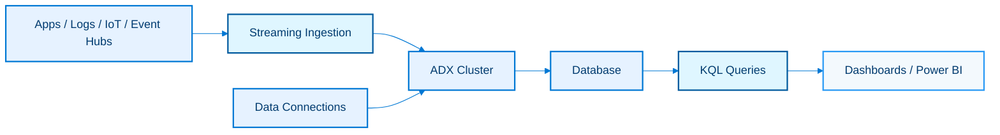

### Explanation

Azure Data Explorer is a fast, fully managed analytics engine for log, telemetry, and time-series data.

It is optimized for append-heavy, semi-structured, high-volume analytical workloads queried with Kusto Query Language (KQL).

#### Key capabilities
- Clusters provide the compute and storage boundary for ADX resources.
- Databases logically organize tables, policies, materialized views, and functions.
- KQL supports powerful filtering, parsing, aggregation, join, anomaly detection, and time-series analysis.
- Streaming ingestion supports low-latency arrival from Event Hubs, IoT Hub, and other producers.
- Data connections wire Event Hubs, IoT Hub, and Blob Storage into managed ingestion pipelines.
- Update policies and materialized views support derived tables and fast aggregates.
- Retention and caching policies balance performance and cost.
- Dashboards and BI tools can query ADX directly or through federated patterns.
- Row-level security and managed identities help secure analytical access.
- Native JSON and semi-structured support reduce preprocessing effort.

#### Design notes
- Choose ADX for observability, clickstream, security analytics, telemetry, and large time-series workloads.
- Use batching versus streaming ingestion based on latency goals and cost tradeoffs.
- Model ingestion-time and event-time columns explicitly for operational troubleshooting.
- Use materialized views for common rollups instead of repeatedly scanning raw high-volume tables.
- Partitioning, extent sizing, and retention should match query windows and storage objectives.
- Parse semi-structured payloads once during ingestion or update policies when repeated extraction is expensive.
- Separate hot and cold datasets by database or policy when workloads differ significantly.
- Document KQL functions so teams reuse logic rather than copy-pasting query fragments.

#### Common patterns
- Telemetry pattern: ingest device or application logs from Event Hubs into raw tables.
- Security analytics pattern: query threat and audit events with KQL hunting logic.
- Operational dashboard pattern: render near-real-time system health visuals in ADX dashboards or Power BI.
- Long-tail trend pattern: retain summarized data longer than raw detail.
- Enrichment pattern: join live telemetry with reference tables for contextual insights.
- Streaming alert pattern: combine low-latency ingestion with scheduled queries and automation.

### Azure CLI commands

```bash
az extension add --name kusto
az group create --name rg-adx --location eastus
az kusto cluster create --name adx-demo --resource-group rg-adx --location eastus --sku name="Standard_D13_v2" tier="Standard" capacity=2 --type SystemAssigned
az kusto database create --cluster-name adx-demo --resource-group rg-adx --database-name telemetrydb --read-write-database softDeletePeriod=P365D hotCachePeriod=P31D
az kusto cluster show --name adx-demo --resource-group rg-adx
az kusto cluster principal-assignment create --cluster-name adx-demo --resource-group rg-adx --principal-assignment-name adx-admin --principal-id <objectId> --principal-type App --role AllDatabasesAdmin
az kusto database principal-assignment create --cluster-name adx-demo --resource-group rg-adx --database-name telemetrydb --principal-assignment-name adx-reader --principal-id <objectId> --principal-type User --role Viewer
az kusto eventhub-data-connection create --cluster-name adx-demo --resource-group rg-adx --database-name telemetrydb --data-connection-name eh-ingest --event-hub-resource-id /subscriptions/<sub>/resourceGroups/rg-stream/providers/Microsoft.EventHub/namespaces/ehns-demo/eventhubs/orders --consumer-group analytics --table-name RawOrders --mapping-rule-name RawOrdersJson
az kusto iothub-data-connection create --cluster-name adx-demo --resource-group rg-adx --database-name telemetrydb --data-connection-name iot-ingest --iot-hub-resource-id /subscriptions/<sub>/resourceGroups/rg-iot/providers/Microsoft.Devices/IotHubs/iotdemo --consumer-group analytics --table-name DeviceEvents --mapping-rule-name DeviceJson
az kusto database show --cluster-name adx-demo --resource-group rg-adx --database-name telemetrydb
az kusto cluster start --name adx-demo --resource-group rg-adx
az kusto cluster stop --name adx-dev-ephemeral --resource-group rg-adx
```

### Best practices

- Use KQL functions, materialized views, and update policies to simplify repeated logic.
- Retain raw detail only as long as it delivers value; summarize aggressively for long-term trends.
- Design ingestion mappings carefully and keep schemas evolvable.
- Choose streaming ingestion only for genuinely low-latency scenarios.
- Monitor ingestion failures, queued data, CPU, cache, and query latency.
- Use separate databases or clusters when workloads or security boundaries differ materially.
- Document common KQL snippets and train analysts on time-series idioms.
- Integrate ADX with Event Hubs and Power BI for low-friction real-time analytics.
- Prefer managed identities over shared keys wherever supported.
- Load test representative KQL queries before production dashboards depend on them.

## Azure Logic Apps

### Mermaid diagram

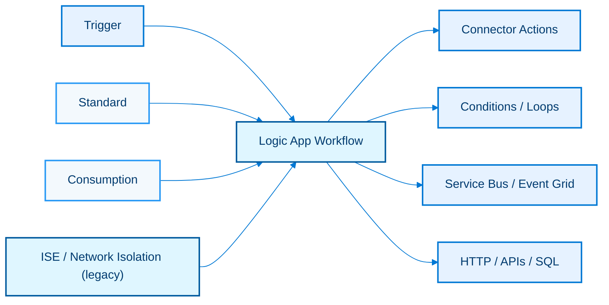

### Explanation

Azure Logic Apps is a low-code integration platform for workflow automation across SaaS, Azure, on-premises, and custom APIs.

It supports event-driven triggers, connector-based actions, enterprise workflows, B2B integration, and hybrid connectivity through managed connectors and integration accounts.

#### Key capabilities
- Consumption runs on a multitenant serverless model with per-action billing.
- Standard runs on a single-tenant model with local state, better performance control, and App Service-style hosting features.
- Connectors provide low-code access to hundreds of SaaS and enterprise systems.
- Triggers start workflows based on schedules, HTTP, Service Bus, Event Grid, file arrivals, and many other events.
- Actions implement API calls, conditions, loops, variables, maps, approvals, and error branches.
- Workflow Designer enables visual authoring and diagnostics.
- ISE historically provided isolated networking and dedicated environments; modern designs often prefer Standard with VNet and private endpoints.
- Managed identities let workflows access Azure resources securely.
- Built-in connector hosting in Standard reduces some connector dependency patterns.
- Integration accounts support B2B schemas, maps, partners, and agreements.

#### Design notes
- Use Consumption for bursty serverless integration and Standard for higher control, throughput, or VNet integration requirements.
- Model each workflow around one business trigger and clear action stages for maintainability.
- Treat connectors as integration dependencies with throttling limits, retry behaviors, and SLA constraints.
- Use scopes and run-after conditions to design robust compensation and exception paths.
- Avoid giant workflows; compose multiple workflows and queue boundaries for resilience.
- Store secrets in Key Vault and avoid hardcoded connection secrets in exported definitions.
- Review whether Functions should handle code-heavy branches while Logic Apps orchestrates workflows.
- Standard plus private endpoints is the modern path for secure enterprise integration in most cases.

#### Common patterns
- Integration pattern: receive an Event Grid event, enrich data, and push to Service Bus or Teams.
- Approval pattern: create human approval loops with Outlook, Teams, or custom apps.
- B2B pattern: process EDI or X12 messages through integration accounts.
- Automation pattern: schedule cleanup, notifications, and system housekeeping workflows.
- API mediation pattern: expose an HTTP trigger that validates and routes payloads to downstream services.
- Error handling pattern: use scopes and dead-letter destinations for failed business operations.

### Azure CLI commands

```bash
az group create --name rg-logic --location eastus
az logicapp create --resource-group rg-logic --name la-consumption-demo --location eastus --definition @logicapp-consumption.json
az logicapp show --resource-group rg-logic --name la-consumption-demo
az appservice plan create --name plan-logic-standard --resource-group rg-logic --is-linux --sku WS1
az webapp create --resource-group rg-logic --plan plan-logic-standard --name la-standard-demo --runtime "NODE|18-lts"
az storage account create --name stlogicdemo01 --resource-group rg-logic --location eastus --sku Standard_LRS
az functionapp config appsettings set --resource-group rg-logic --name la-standard-demo --settings WORKFLOWS_SUBSCRIPTION_ID=<sub> AzureWebJobsStorage=<conn>
az logicapp deployment source config-zip --resource-group rg-logic --name la-standard-demo --src logicapp-standard.zip
az monitor diagnostic-settings create --name logic-diag --resource $(az logicapp show --resource-group rg-logic --name la-consumption-demo --query id -o tsv) --workspace /subscriptions/<sub>/resourceGroups/rg-monitor/providers/Microsoft.OperationalInsights/workspaces/law-demo --logs "[{"category":"WorkflowRuntime","enabled":true}]"
az network private-endpoint create --resource-group rg-logic --name pe-logic-standard --vnet-name vnet-data --subnet integration --private-connection-resource-id $(az webapp show --resource-group rg-logic --name la-standard-demo --query id -o tsv) --group-id sites
az logicapp delete --resource-group rg-logic --name la-dev-ephemeral --yes
az resource list --resource-group rg-logic --resource-type Microsoft.Logic/workflows
```

### Best practices

- Choose Standard when networking, deployment control, and local development matter.
- Use Consumption when event frequency is highly variable and operational overhead should stay minimal.
- Design retries, compensations, and alerting explicitly; do not assume connectors always succeed.
- Use queue-based decoupling for slow or failure-prone downstream systems.
- Track action counts and connector billing because low-code estates can grow expensive unexpectedly.
- Version workflow definitions and connection references in source control.
- Use managed identities and Key Vault-backed secrets whenever possible.
- Treat ISE as legacy guidance and evaluate newer Standard plus VNet approaches first.
- Instrument workflows with Log Analytics and business correlation IDs.
- Keep transformations and custom logic small; offload code-heavy logic to Functions or APIs.

## Power BI

### Mermaid diagram

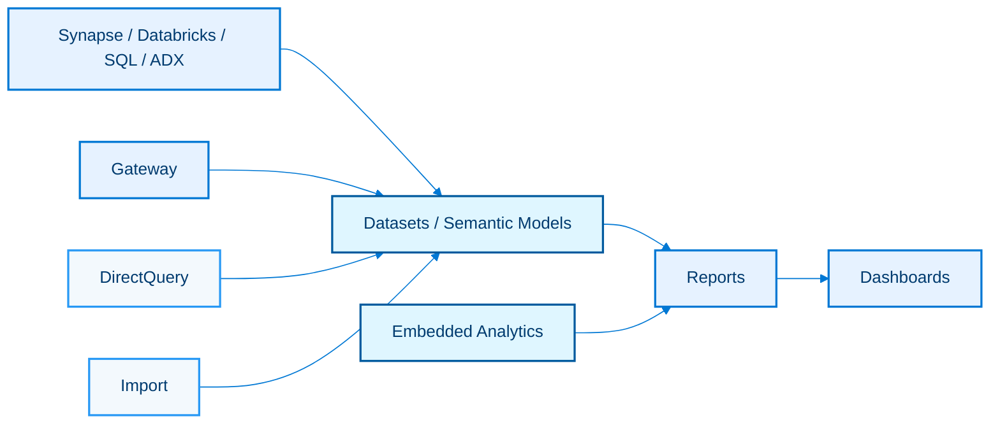

### Explanation

Power BI is Microsoft's business intelligence platform for semantic modeling, dashboards, reports, self-service analytics, and embedded insights.

It connects to Azure analytical stores directly or through imported semantic models and can be embedded into custom applications.

#### Key capabilities
- Datasets, now commonly called semantic models, define tables, relationships, measures, refresh, and security.
- Reports provide interactive visuals built on one semantic model or live connection.
- Dashboards pin report visuals and tiles for curated executive monitoring.
- Gateways connect the Power BI service to on-premises data sources.
- Import mode loads data into the VertiPaq engine for fast in-memory analytics.
- DirectQuery pushes queries to the source system for current data and centralized control.
- Composite models combine import and DirectQuery patterns.
- Embedded analytics allows custom applications to host Power BI content securely.
- Row-level security and object-level security help protect data access.
- Deployment pipelines and workspaces help govern promotion and lifecycle management.

#### Design notes
- Use Import when performance, DAX flexibility, and user concurrency matter most and refresh windows are acceptable.
- Use DirectQuery when data freshness, centralized governance, or large-scale source-managed data are priorities.
- Model star schemas carefully; Power BI performs best with clean dimensional structures.
- Push heavy transformations upstream into Synapse, Databricks, or Dataflows instead of building fragile report logic.
- Standardize certified semantic models so self-service reports reuse trusted business logic.
- Use gateways only where necessary because cloud-native sources simplify operations.
- Embedded analytics requires tenant, capacity, and token design aligned with application identity models.
- Track refresh SLA, gateway health, and dataset size to avoid user-facing failures.

#### Common patterns
- Executive dashboard pattern: curated KPIs pinned from multiple reports.
- Self-service pattern: analysts build reports on certified semantic models.
- Near-real-time pattern: DirectQuery or push datasets display current operational states.
- Embedded SaaS pattern: customers view tenant-isolated analytics within your application.
- Hybrid pattern: composite models blend imported dimensions with DirectQuery facts.
- Enterprise semantic layer pattern: one governed dataset serves many reports and apps.

### Azure CLI commands

```bash
az account get-access-token --resource https://analysis.windows.net/powerbi/api --query accessToken -o tsv
az rest --method get --url https://api.powerbi.com/v1.0/myorg/groups
az rest --method post --url https://api.powerbi.com/v1.0/myorg/groups --headers Content-Type=application/json --body "{"name":"Enterprise Analytics"}"
az rest --method get --url https://api.powerbi.com/v1.0/myorg/groups/<workspaceId>/datasets
az rest --method post --url https://api.powerbi.com/v1.0/myorg/groups/<workspaceId>/datasets/<datasetId>/refreshes
az rest --method get --url https://api.powerbi.com/v1.0/myorg/groups/<workspaceId>/reports
az rest --method get --url https://api.powerbi.com/v1.0/myorg/groups/<workspaceId>/dashboards
az rest --method post --url https://api.powerbi.com/v1.0/myorg/groups/<workspaceId>/imports?datasetDisplayName=SalesModel&nameConflict=CreateOrOverwrite --headers Content-Type=multipart/form-data
az rest --method post --url https://api.powerbi.com/v1.0/myorg/groups/<workspaceId>/reports/<reportId>/GenerateToken --body "{"accessLevel":"View"}"
az rest --method get --url https://api.powerbi.com/v1.0/myorg/groups/<workspaceId>/datasets/<datasetId>/datasources
az rest --method get --url https://api.powerbi.com/v1.0/myorg/admin/groups?$top=100
az rest --method get --url https://api.powerbi.com/v1.0/myorg/admin/datasets?$top=100
```

### Best practices

- Prefer star schemas and shared semantic models over report-specific spaghetti models.
- Use Import for high-performance interactive analysis whenever refresh latency is acceptable.
- Use DirectQuery only with well-tuned sources and carefully designed visuals.
- Limit high-cardinality columns and excessively complex DAX in shared datasets.
- Govern workspaces, deployment pipelines, and certification status centrally.
- Use gateways sparingly and monitor them aggressively because they become operational choke points.
- Apply row-level security close to business domains and test with realistic user personas.
- Push data quality and transformations upstream instead of papering over issues in report logic.
- Use capacities or Fabric/embedded SKUs appropriately for large enterprise or customer-facing workloads.
- Document refresh schedules, ownership, and support paths for every production semantic model.

## Azure Purview (Microsoft Purview)

### Mermaid diagram

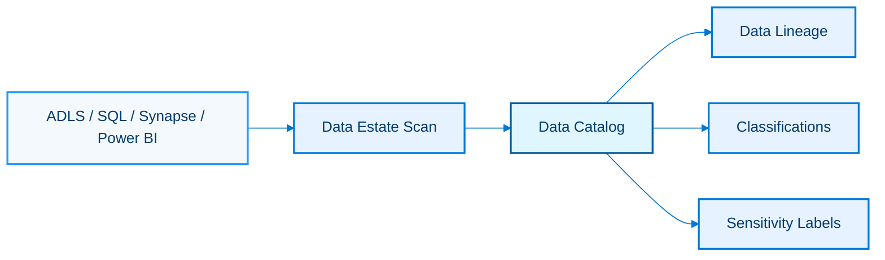

### Explanation

Microsoft Purview is a unified data governance solution for cataloging, scanning, classifying, and tracing lineage across the data estate.

It helps data teams discover assets, understand lineage, enforce governance, and identify sensitive information across hybrid and multi-source environments.

#### Key capabilities
- The data catalog indexes data assets, metadata, owners, glossary terms, and descriptions.
- Data lineage shows movement and transformation relationships across sources, pipelines, and analytical tools.
- Classifications identify data patterns such as PII, PCI, and financial identifiers.
- Sensitivity labels align governance and protection policies with Microsoft Information Protection concepts.
- Data estate scans connect to sources and profile metadata on scheduled or on-demand cadences.
- Collections provide administrative segmentation for large organizations.
- Business glossary and domain concepts improve common language across teams.
- Role-based access controls protect governance operations and metadata visibility.
- Purview integrates with Azure data services such as ADLS, SQL, Synapse, and Power BI.
- Scanning and lineage can support regulatory, stewardship, and audit initiatives.

#### Design notes
- Define governance outcomes first: searchability, stewardship, privacy, lineage, or regulatory evidence.
- Onboard highest-value data platforms before attempting exhaustive estate coverage.
- Use collections to match operating model, ownership, and delegated administration.
- Combine automated classifications with human stewardship rather than trusting automation blindly.
- Lineage quality depends on source integration and engineering discipline across pipelines.
- Sensitivity labels should align with enterprise data handling policies, not just technical patterns.
- Treat glossary terms and ownership metadata as products that need curation.
- Scan schedules should respect source impact, credential management, and change frequency.

#### Common patterns
- Discovery pattern: analysts search the catalog to find trusted curated assets.
- Privacy pattern: classifiers flag PII columns and trigger remediation or labeling workflows.
- Lineage pattern: trace a KPI from Power BI back to Synapse tables and raw lake sources.
- Stewardship pattern: assign data owners and domain contacts to critical assets.
- Compliance pattern: prove scan coverage and sensitive asset handling to auditors.
- Data product pattern: publish curated gold assets with glossary-backed descriptions.

### Azure CLI commands

```bash
az extension add --name purview
az group create --name rg-purview --location eastus
az purview account create --resource-group rg-purview --name pvw-demo --location eastus
az purview account show --resource-group rg-purview --name pvw-demo
az purview account add-root-collection-admin --resource-group rg-purview --name pvw-demo --object-id <objectId>
az purview account list --resource-group rg-purview
az purview account update --resource-group rg-purview --name pvw-demo --public-network-access Disabled
az purview private-endpoint-connection list --resource-group rg-purview --account-name pvw-demo
az role assignment create --assignee <objectId> --role Reader --scope $(az purview account show --resource-group rg-purview --name pvw-demo --query id -o tsv)
az monitor diagnostic-settings create --name purview-diag --resource $(az purview account show --resource-group rg-purview --name pvw-demo --query id -o tsv) --workspace /subscriptions/<sub>/resourceGroups/rg-monitor/providers/Microsoft.OperationalInsights/workspaces/law-demo --logs "[{"category":"ScanStatusLogEvent","enabled":true}]"
az resource show --resource-group rg-purview --name pvw-demo --resource-type Microsoft.Purview/accounts
az resource list --resource-group rg-purview --resource-type Microsoft.Purview/accounts
```

### Best practices

- Start with critical platforms and business domains instead of trying to scan everything immediately.
- Define stewardship roles, glossary ownership, and metadata quality expectations.
- Use classifications and labels to drive action, not just catalog decoration.
- Automate scan onboarding for standard source patterns where possible.
- Keep lineage trustworthy by integrating governance into CI/CD and pipeline engineering practices.
- Restrict administrative scope with collections and least privilege.
- Track catalog adoption metrics such as searches, asset views, and owner completeness.
- Pair technical cataloging with business glossary terms that users understand.
- Validate scan credentials, network access, and performance impact before large rollouts.
- Treat Purview as an ongoing operating model, not a one-time setup task.

## Real-Time Pipeline

### Mermaid diagram

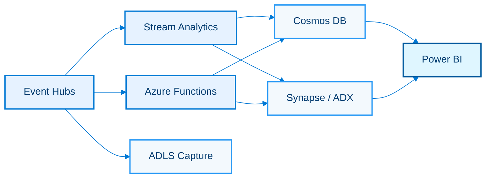

### Explanation

A real-time Azure pipeline typically ingests events through Event Hubs, processes them with Stream Analytics or Azure Functions, lands operational views in Cosmos DB or Synapse/ADX, and exposes insight through Power BI.

This pattern balances immediate action, low-latency analytics, replay capability, and historical persistence.

#### Key capabilities
- Event Hubs provides the scalable ingestion front door.
- Stream Analytics provides declarative windowing, enrichment, and streaming SQL.
- Azure Functions handles code-centric transformation, enrichment, and event routing.
- Cosmos DB provides low-latency operational reads and globally distributed APIs.
- Synapse or ADX supports analytical query patterns over streamed facts.
- Power BI exposes near-real-time metrics, alerts, and dashboards.
- Capture to ADLS preserves immutable event history for replay and ML.
- Consumer groups enable multiple downstream consumers without interfering with each other.
- Checkpointing and idempotency preserve reliability across retries and restarts.
- Managed identities and private endpoints secure the end-to-end path.

#### Design notes
- Choose Stream Analytics when SQL-style streaming is sufficient and team velocity matters.
- Choose Functions when per-event custom logic, third-party APIs, or application code reuse is needed.
- Use Cosmos DB for operational serving layers and Synapse or ADX for heavier analytics.
- Emit raw copies to the lake even when operational stores are the main downstream target.
- Partition by natural entity keys only when order matters; otherwise optimize for parallelism.
- Plan for backpressure, poison events, schema drift, and replay operations.
- Separate hot-path alerting from slower historical aggregation workloads.
- Time semantics must be consistent across Event Hubs, processors, stores, and dashboards.

#### Common patterns
- Fraud detection pattern: transactions stream through Functions for enrichment and to Cosmos DB for case handling.
- Operational monitoring pattern: IoT or app telemetry aggregates through ASA into live dashboards.
- Customer experience pattern: clickstream events feed personalization and real-time reporting.
- Security pattern: auth and network events stream into ADX for investigation and alerting.
- Replay pattern: captured events rebuild downstream state after logic changes.
- Dual-store pattern: operational JSON in Cosmos DB plus analytical parquet or warehouse facts downstream.

### Azure CLI commands

```bash
az eventhubs namespace create --name ehns-rt-demo --resource-group rg-stream --location eastus --sku Standard --capacity 2
az eventhubs eventhub create --name realtime --namespace-name ehns-rt-demo --resource-group rg-stream --partition-count 8 --message-retention 7
az functionapp create --resource-group rg-stream --consumption-plan-location eastus --name func-rt-demo --storage-account stlogicdemo01 --runtime python --functions-version 4
az functionapp identity assign --resource-group rg-stream --name func-rt-demo
az stream-analytics job create --resource-group rg-asa --name asa-realtime --location eastus --output-error-policy Stop --events-outoforder-policy Adjust --compatibility-level 1.2
az cosmosdb create --resource-group rg-stream --name cosmos-rt-demo --locations regionName=eastus failoverPriority=0 isZoneRedundant=False
az cosmosdb sql database create --resource-group rg-stream --account-name cosmos-rt-demo --name realtime
az synapse sql pool create --name dwhrealtime --performance-level DW100c --resource-group rg-synapse --workspace-name synw-demo
az monitor diagnostic-settings create --name eh-realtime-diag --resource $(az eventhubs namespace show --resource-group rg-stream --name ehns-rt-demo --query id -o tsv) --workspace /subscriptions/<sub>/resourceGroups/rg-monitor/providers/Microsoft.OperationalInsights/workspaces/law-demo --logs "[{"category":"OperationalLogs","enabled":true}]"
az stream-analytics job start --resource-group rg-asa --name asa-realtime --output-start-mode JobStartTime
az eventhubs eventhub update --name realtime --namespace-name ehns-rt-demo --resource-group rg-stream --capture-description @capture-realtime.json
az rest --method post --url https://api.powerbi.com/v1.0/myorg/groups/<workspaceId>/datasets/<datasetId>/refreshes
```

### Best practices

- Keep the ingestion path highly available and independently scalable from downstream consumers.
- Preserve immutable raw events for replay, audit, and model retraining.
- Make stream processors idempotent and partition-aware.
- Choose the serving store based on latency and query shape, not brand preference.
- Monitor end-to-end lag from production through visualization.
- Treat schema evolution as a first-class concern with versioning and fallback logic.
- Separate operational alert thresholds from analytical reporting aggregates.
- Use private networking and managed identities across all services.
- Simulate spikes, partial outages, and downstream throttling during testing.
- Document recovery runbooks for consumer restarts, backfills, and dashboard discrepancies.

## Batch Pipeline

### Mermaid diagram

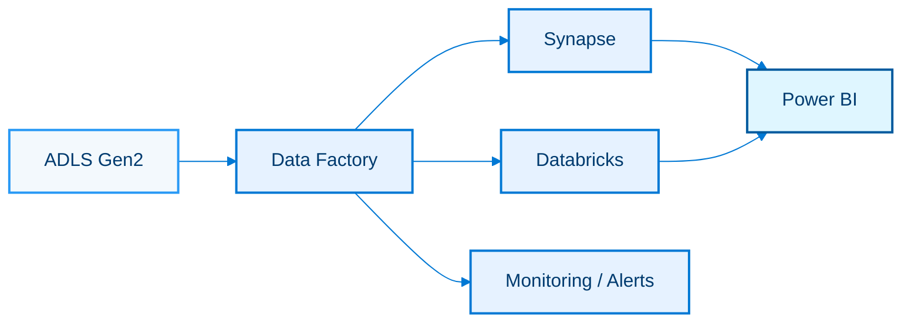

### Explanation

A batch pipeline in Azure commonly lands files in ADLS Gen2, orchestrates movement and dependencies with Data Factory, transforms data in Synapse or Databricks, and publishes curated analytics to Power BI.

This pattern is ideal for scheduled ingestion, repeatable warehouse loads, regulatory reporting, and large-scale backfills.

#### Key capabilities
- ADLS Gen2 provides scalable hierarchical storage for raw, staged, and curated data.
- ADF orchestrates scheduling, dependencies, metadata-driven loops, and operational logging.
- Synapse handles SQL-centric warehousing, virtualization, and integrated analytics.
- Databricks handles code-heavy Spark transformations and Delta-based lakehouse processing.
- Power BI consumes curated tables, semantic models, or serverless views.
- Data quality controls can be inserted at staging, silver, or warehouse steps.
- Partitioning and file formats can optimize performance and cost for downstream engines.
- Observability spans pipeline runs, job logs, SQL metrics, and BI refresh events.
- Parameterization enables environment and tenant-specific executions.
- The lake retains historical raw and conformed layers for reproducibility.

#### Design notes
- Use ADLS landing, raw, staged, and curated folders with clear retention and ownership rules.
- Keep orchestration in ADF and push data-intensive transforms into Spark or SQL engines.
- Use incremental loads with watermarks whenever full reloads are unnecessary.
- Choose Synapse for dimensional BI and Databricks for heavy data engineering or lakehouse-first designs.
- Store operational metadata such as load batches, source row counts, and quality status in control tables.
- Partition file-based datasets by date or other high-selectivity business dimensions.
- Treat batch windows and BI refresh schedules as one integrated SLA.
- Design reprocessing paths that can rerun one source, one batch, or one partition without massive blast radius.

#### Common patterns
- Daily finance load pattern: copy ERP extracts to ADLS, transform, and load warehouse facts overnight.
- Vendor drop pattern: file arrival triggers or schedules process inbound CSVs into curated Delta tables.
- CDC batch pattern: incremental snapshots merge into dimensions and facts.
- Lakehouse pattern: bronze raw ingestion, silver standardization, gold marts for BI.
- Regulatory reporting pattern: batch pipelines create immutable monthly statement snapshots.
- Backfill pattern: rerun historical partitions through the same transform code path.

### Azure CLI commands

```bash
az storage account create --name stbatchdemo01 --resource-group rg-data --location eastus --sku Standard_LRS --kind StorageV2 --hierarchical-namespace true
az storage fs create --name raw --account-name stbatchdemo01
az storage fs create --name silver --account-name stbatchdemo01
az storage fs create --name gold --account-name stbatchdemo01
az datafactory factory create --resource-group rg-data --factory-name adf-batch-demo --location eastus
az datafactory pipeline create --resource-group rg-data --factory-name adf-batch-demo --name pl-adls-to-synapse --pipeline @pl-adls-to-synapse.json
az synapse workspace create --name synw-batch-demo --resource-group rg-synapse --storage-account stbatchdemo01 --file-system raw --sql-admin-login synadmin --sql-admin-password "ChangeM3Now!" --location eastus2
az databricks workspace create --resource-group rg-dbx --name dbw-batch-demo --location eastus2 --sku premium
az datafactory trigger create --resource-group rg-data --factory-name adf-batch-demo --name trg-nightly --properties @trg-nightly.json
az datafactory pipeline create-run --resource-group rg-data --factory-name adf-batch-demo --name pl-adls-to-synapse --parameters loadDate=2024-01-31
az synapse sql pool create --name dwhbatch --performance-level DW200c --resource-group rg-synapse --workspace-name synw-batch-demo
az rest --method post --url https://api.powerbi.com/v1.0/myorg/groups/<workspaceId>/datasets/<datasetId>/refreshes
```

### Best practices

- Keep raw data immutable and replayable.
- Use columnar formats such as parquet or Delta for transformed layers.
- Centralize metadata-driven orchestration and environment parameters.
- Build for restartability at partition or batch granularity.
- Validate schema drift and record-level quality before promoting data to curated layers.
- Align warehouse and BI refresh windows with business reporting expectations.
- Right-size compute independently for ingestion, transformation, and serving.
- Track lineage from file landing through transformations to published semantic models.
- Archive or purge obsolete intermediate files according to governance policy.
- Benchmark both full and incremental load paths during performance testing.

## Medallion Architecture

### Mermaid diagram

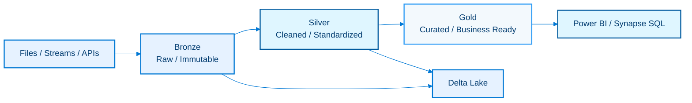

### Explanation

Medallion architecture organizes lakehouse data into progressively refined layers: bronze for raw ingestion, silver for cleaned and conformed data, and gold for business-ready outputs.

In Azure, Delta Lake on Databricks or other Spark-compatible engines is a common implementation because it supports ACID transactions, schema evolution, and efficient incremental processing.

#### Key capabilities
- Bronze stores source-faithful records with minimal transformation and strong lineage back to origin.
- Silver standardizes schemas, fixes data quality issues, deduplicates, and enriches records.
- Gold publishes business aggregates, marts, and semantic-model-ready tables.
- Delta Lake underpins reliable upserts, time travel, schema enforcement, and scalable table maintenance.
- Streaming and batch can coexist in the same layered architecture.
- Layer boundaries clarify ownership, SLAs, and quality expectations.
- Data quality rules can be attached at each promotion step.
- Partitioning and optimization strategies differ by layer and workload.
- Consumers can choose the right layer based on latency and curation needs.
- The model supports replay and lineage because each layer is explicit.

#### Design notes
- Do not over-transform bronze; keep it replayable and close to source truth.
- Use silver for standardization, business key resolution, data cleansing, and deduplication.
- Use gold for domain-specific marts, KPIs, aggregates, and trusted consumption views.
- Prefer Delta as the storage format to simplify merges, CDC, and transaction safety.
- Organize catalogs, schemas, and storage paths to reflect domain ownership rather than one giant undifferentiated lake.
- Quality checks should be versioned and observable, not hidden inside ad hoc notebooks.
- Document contract changes between layers so downstream teams know what stability to expect.
- Retention, compaction, and optimization policies should reflect each layer's access patterns.

#### Common patterns
- Streaming bronze pattern: append raw events from Event Hubs into Delta tables.
- Conformance silver pattern: standardize timestamps, currencies, IDs, and null handling.
- Gold mart pattern: create customer 360, sales KPI, and operational scorecard tables.
- Data science pattern: feature tables may originate in silver and be published to gold-like domains.
- Replay pattern: rebuild silver or gold from bronze after rule changes.
- Multi-domain pattern: independent medallions exist for finance, supply chain, product, and security.

### Azure CLI commands

```bash
az storage account create --name stmedallion01 --resource-group rg-data --location eastus --sku Standard_LRS --kind StorageV2 --hierarchical-namespace true
az storage fs create --name bronze --account-name stmedallion01
az storage fs create --name silver --account-name stmedallion01
az storage fs create --name gold --account-name stmedallion01
az databricks workspace create --resource-group rg-dbx --name dbw-medallion-demo --location eastus2 --sku premium
az synapse workspace create --name synw-medallion-demo --resource-group rg-synapse --storage-account stmedallion01 --file-system bronze --sql-admin-login synadmin --sql-admin-password "ChangeM3Now!" --location eastus2
az role assignment create --assignee <principalId> --role "Storage Blob Data Contributor" --scope /subscriptions/<sub>/resourceGroups/rg-data/providers/Microsoft.Storage/storageAccounts/stmedallion01
az datafactory factory create --resource-group rg-data --factory-name adf-medallion-demo --location eastus
az datafactory pipeline create --resource-group rg-data --factory-name adf-medallion-demo --name pl-ingest-bronze --pipeline @pl-ingest-bronze.json
az monitor diagnostic-settings create --name medallion-storage-diag --resource $(az storage account show --resource-group rg-data --name stmedallion01 --query id -o tsv) --workspace /subscriptions/<sub>/resourceGroups/rg-monitor/providers/Microsoft.OperationalInsights/workspaces/law-demo --logs "[{"category":"StorageRead","enabled":true}]"
az storage fs directory create --file-system bronze --name orders/ingest_date=2024-01-31 --account-name stmedallion01
az storage fs directory create --file-system gold --name marts/sales_daily --account-name stmedallion01
```

### Best practices

- Keep bronze immutable, silver trustworthy, and gold easy for consumers to use.
- Use Delta tables and merge semantics for CDC and deduplication.
- Publish explicit SLAs and contracts for each layer.
- Use domain ownership and Unity Catalog or equivalent governance to avoid a data swamp.
- Automate quality gates before promotion between layers.
- Optimize gold for query performance and silver for transformation efficiency.
- Retain replay paths so business rule changes do not require source-system re-extracts.
- Document lineage and glossary terms for gold assets consumed by BI.
- Monitor small files, vacuum policies, and partition health over time.
- Avoid bypassing silver when gold assets require standardized business logic.

## CLI Setup and Conventions

Use the Azure CLI version that matches your enterprise support baseline and install required extensions before automation runs.
Authenticate with `az login` for interactive work or `az login --service-principal` in CI/CD.
Set the correct subscription early with `az account set --subscription <subId>`.
Adopt consistent resource group, naming, tag, and region conventions across all data services.
Use managed identities whenever a service can call another Azure service without secrets.
Prefer IaC templates or Bicep around `az` commands for repeatable promotion.
Store JSON payloads for ADF, Synapse, ASA, and Logic Apps definitions in source control.
Automate diagnostic settings, RBAC assignments, private endpoints, and locks as standard baseline steps.
Parameterize locations, sku sizes, names, and environment-specific URIs rather than hardcoding them.
Use `az configure --defaults group=<rg> location=<region>` to reduce typing in local sessions.
Validate commands against service-specific extensions because Azure CLI coverage changes over time.
Prefer non-interactive scripts that exit on error and emit clear logs.
Capture command outputs in pipeline logs or deployment artifacts for auditability.
Use tags such as `env`, `owner`, `costCenter`, `dataDomain`, and `criticality` consistently.
Review quota and regional availability before standardizing on a service architecture.
Common bootstrap commands:
```bash
az login
az account set --subscription <subscription-id>
az configure --defaults location=eastus group=rg-data-platform
az extension add --name synapse
az extension add --name datafactory
az extension add --name kusto
az extension add --name purview
az provider register --namespace Microsoft.EventHub
az provider register --namespace Microsoft.Synapse
az provider register --namespace Microsoft.Kusto
```

## Security, Networking, and Governance

Use private endpoints for storage, Synapse, Event Hubs, Service Bus, Databricks control plane integrations where applicable, and Purview when required.
Restrict public network access by default and open exceptions only when justified.
Use Key Vault for secret storage and rotate credentials regularly.
Prefer Azure AD / Entra ID identities, managed identities, and RBAC over shared keys.
Separate duties for platform admins, data engineers, analysts, and stewards.
Apply storage ACLs, SQL roles, catalog permissions, and Purview collections according to domain ownership.
Classify sensitive data early and propagate labels or policy awareness to downstream consumers.
Use Microsoft Defender, Log Analytics, and Azure Monitor to detect unusual access patterns.
Enable diagnostic settings on every tier-1 data service resource.
Document lineage, stewardship, and quality expectations for regulated datasets.
Network topology matters: managed VNets, private DNS, and route propagation must be validated end to end.
Review regional data residency and cross-region replication policies for compliance.
Encrypt data at rest and in transit; where required, evaluate customer-managed keys.
Avoid placing secrets in notebooks, pipeline parameters, or exported definitions.
Audit who can publish Power BI content, alter Synapse pools, or bypass medallion layers.
Use approval workflows for production schema changes and high-impact pipeline edits.
Codify governance standards in templates so new domains inherit the same baseline.
Run periodic access reviews on workspaces, service principals, and shared resource groups.
Align Purview scans and classifications with the enterprise privacy office and legal guidance.
Plan for secure data sharing patterns instead of ad hoc file exports.

## Monitoring, Reliability, and FinOps

Observe the whole pipeline, not individual services in isolation.
Track ingestion lag, processing latency, data freshness, dataset refresh duration, and user-facing dashboard availability.
Use Azure Monitor alerts for failed triggers, queue depth, streaming backlog, SQL resource pressure, and storage failures.
Adopt SLOs for critical pipelines and publish owner/on-call metadata.
Replayability should be a design feature for both stream and batch architectures.
Test disaster recovery for messaging namespaces, storage accounts, and critical analytical stores.
Pause or scale down dedicated resources such as Synapse dedicated pools, ADX dev clusters, and HDInsight clusters when idle.
Use autoscaling where supported but validate how scaling affects latency and cost.
Monitor Power BI capacity and gateway throughput to avoid invisible BI bottlenecks.
Compact Delta tables and manage small-file proliferation to control compute cost.
Benchmark query patterns before overprovisioning warehouses or clusters.
Use tags and cost management views to attribute platform spend to domains or products.
Choose serverless models for bursty exploratory workloads and dedicated models for steady predictable demand.
Review Event Hubs throughput units, Stream Analytics streaming units, and Spark cluster sizes monthly.
Use budget alerts for sandboxes and ephemeral development environments.
Backpressure and dead-letter queues are signals of reliability issues, not just operational noise.
Publish runbooks for incident triage, replay, backfill, and failover operations.
Monitor data quality metrics with the same rigor as infrastructure metrics.
Retain enough operational logs to troubleshoot but not so much that observability costs spiral unchecked.
Regularly decommission obsolete datasets, jobs, and test clusters.

## Service Selection Cheat Sheet

- Use **Data Factory** when you need managed orchestration, connectors, and scheduled or event-driven data movement.
- Use **Synapse dedicated SQL pool** for predictable MPP warehousing and enterprise BI workloads.
- Use **Synapse serverless SQL pool** for ad hoc SQL over lake data without pre-provisioning compute.
- Use **Synapse Spark** or **Databricks** when transformations are Spark-centric or code-heavy.
- Use **Event Hubs** for massive event ingestion and telemetry streams.
- Use **Service Bus** for enterprise messaging, commands, workflows, and ordered sessions.
- Use **Stream Analytics** for SQL-based stream processing with windows and reference joins.
- Use **Databricks** for lakehouse engineering, Delta, collaborative notebooks, and MLflow-driven ML.
- Use **HDInsight** when managed Hadoop ecosystem clusters are specifically required.
- Use **ADX** for high-volume log, telemetry, and time-series analytics with KQL.
- Use **Logic Apps** for low-code workflow automation and connector-rich integration.
- Use **Power BI** for semantic modeling, dashboards, and enterprise reporting.
- Use **Microsoft Purview** for catalog, lineage, classifications, and governance.
- Use **Cosmos DB** in real-time pipelines when operational APIs need low-latency JSON access.
- Use **ADLS Gen2** as the durable landing and lake storage foundation for batch and replay scenarios.
- Use **Delta Lake** when you need ACID transactions, merges, schema evolution, and lakehouse reliability.
- Prefer **managed identity** everywhere it is supported.
- Prefer **private endpoints** for production analytics estates handling sensitive data.
- Prefer **IaC + CI/CD** over manual portal-only configuration.
- Prefer **medallion layering** when multiple personas consume the same data platform.

## End-to-End Reference Summary

- Ingestion at scale: Event Hubs for streams, ADLS Gen2 for files, ADF for connectors, Service Bus for commands and workflow messages.
- Processing engines: Stream Analytics for SQL streaming, Functions for event code, Databricks for Spark lakehouse, Synapse for combined SQL and Spark analytics, HDInsight for managed OSS clusters, ADX for telemetry analytics.
- Serving layers: Cosmos DB for low-latency operational access, Synapse dedicated/serverless SQL for analytical SQL, Delta gold tables for lakehouse consumption, Power BI for business-facing insight.
- Governance: Microsoft Purview for catalog, lineage, classifications, and stewardship.
- Security baseline: private endpoints, RBAC, managed identity, Key Vault, diagnostic logs, and environment isolation.
- Operating model: Git-backed definitions, IaC provisioning, CI/CD promotion, observability, data quality checks, and replay runbooks.
- Architectural theme: combine batch and real-time patterns while preserving raw history and publishing trusted curated outputs.
- Lakehouse theme: use medallion layering and Delta Lake to simplify standardization, replay, and reliable consumption.
- BI theme: optimize semantic models, choose DirectQuery vs Import deliberately, and align refresh with business SLAs.
- Cost theme: pause what can pause, autoscale what should autoscale, and right-size what must remain dedicated.

## Further Study Paths

- Deepen infrastructure automation with Bicep, Terraform, or GitHub Actions/Azure DevOps release pipelines.
- Add data quality frameworks such as Great Expectations, Delta Live Tables expectations, or custom rule engines where appropriate.
- Evaluate Microsoft Fabric features if your organization is moving toward integrated analytics SaaS experiences.
- Build reference implementations for one real-time and one batch domain using the patterns in this guide.
- Create operational dashboards that track pipeline freshness, latency, failures, and cost together.
- Align Purview, Power BI certification, and gold data products into one governed data marketplace approach.
