# Azure Database Services Field Guide

> A practical reference for selecting, deploying, and operating Azure database and analytics services.

This guide is designed for cloud engineers, solution architects, platform teams, and operations teams working in Azure environments. It focuses on real service-selection tradeoffs, deployment patterns, CLI-driven operations, and best practices you can apply immediately.

<!-- workflow-diagram:start -->
## Workflow Snapshot

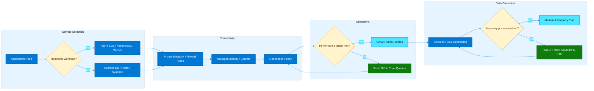

This workflow highlights Azure database selection, secure connectivity, performance tuning, backup strategy, and resilience validation.
<!-- workflow-diagram:end -->

## How to use this guide

- Start with the **Database Decision Guide** when choosing a platform.
- Use the product-specific sections to compare deployment models, scaling options, resilience capabilities, and migration approaches.
- Copy the **Azure CLI** examples as a starting point, then adjust names, SKUs, regions, and network settings for your environment.
- Review the **best practices** lists before deploying production workloads.

## Assumptions

- You have the Azure CLI installed and authenticated with `az login`.
- You understand Azure resource groups, virtual networks, managed identities, RBAC, and monitoring basics.
- Command examples use placeholder names; replace them with values for your subscription and environment.

## Common variables used in CLI examples

```bash
export RG=rg-data-prod
export LOCATION=eastus
export SQL_SERVER=sqlprodshared01
export SQL_DB=appdb01
export MI_NAME=mi-prod-01
export VM_NAME=sqlvm-prod-01
export COSMOS_ACCOUNT=cosmos-prod-01
export PG_SERVER=pgflex-prod-01
export MYSQL_SERVER=mysqlflex-prod-01
export REDIS_NAME=redis-prod-01
export SYNAPSE_WS=synw-prod-01
export DMS_NAME=dms-prod-01
```

## Companion deep-dive guides

- [`database-migration-scenarios.md`](./database-migration-scenarios.md) — comprehensive real-world Azure database migration scenarios covering SQL Server, MySQL, PostgreSQL, Managed Instance, cross-cloud migrations, validation, rollback, and production cutover patterns.
- [`private-database-access.md`](./private-database-access.md) — private endpoint, DNS, and secure connectivity patterns for Azure database services.

## Azure database landscape at a glance

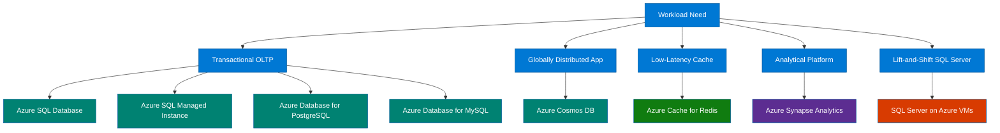

## Reading tips

- “Platform as a Service” services reduce operational overhead, but they can impose engine-specific constraints.
- “Infrastructure as a Service” offers the most control, but also the highest administration burden.
- Compatibility, latency, scale profile, consistency needs, networking model, and cost predictability should all influence the decision.
- Many Azure architectures combine multiple data services instead of forcing one database to do everything.

## 1. Database Decision Guide

Choose the Azure data platform by starting from workload behavior rather than a preferred engine. The decision should account for schema rigidity, scaling style, latency tolerance, write volume, retention pattern, operational overhead, and integration requirements.

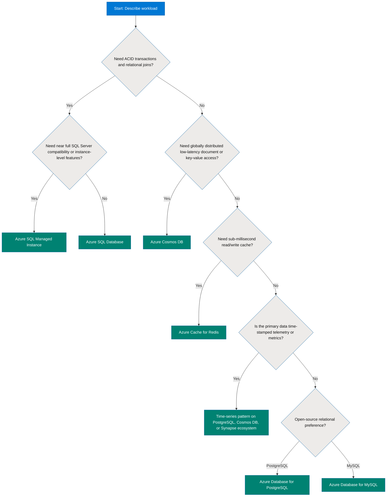

### Explanation

Relational services are the best fit when you need normalized schemas, joins, constraints, mature SQL semantics, and predictable transaction handling. In Azure, that usually points to Azure SQL Database, Azure SQL Managed Instance, Azure Database for PostgreSQL, or Azure Database for MySQL.

NoSQL services are better when the application needs horizontal partitioning, flexible schemas, massive write distribution, low-latency global access, or multiple data models. Azure Cosmos DB is the primary Azure-native globally distributed NoSQL platform.

In-memory services accelerate existing applications rather than replacing the system of record. Azure Cache for Redis is used to offload read traffic, store session state, absorb traffic spikes, and reduce response times for repeated lookups.

Time-series workloads deserve special consideration because their access patterns often differ from generic OLTP systems. Telemetry, events, and metrics usually favor append-heavy ingestion, retention-based lifecycle rules, and time-window aggregations. Azure engineers often implement time-series solutions using PostgreSQL extensions, Cosmos DB patterns, or analytics services like Synapse depending on the mix of operational and analytical needs.

### Practical selection criteria

- Pick **Azure SQL Database** for cloud-native relational applications that do not require SQL Server instance-level features.
- Pick **Azure SQL Managed Instance** when migration compatibility matters, including SQL Agent, linked server-style patterns, cross-database needs, or minimal application changes.
- Pick **SQL Server on Azure VMs** only when the operating system or SQL Server instance must be fully controlled.
- Pick **Azure Cosmos DB** for distributed, low-latency, elastically partitioned applications with non-relational access patterns.
- Pick **Azure Database for PostgreSQL** for open-source relational workloads, geospatial workloads, JSON-heavy schemas, or distributed PostgreSQL patterns.
- Pick **Azure Database for MySQL** for LAMP-style applications, SaaS back ends, or workloads built around MySQL ecosystem compatibility.
- Pick **Azure Cache for Redis** to complement a database, not replace durable storage.
- Pick **Synapse** when analytics, data warehousing, or multi-engine big data processing becomes the core requirement.

### Azure CLI examples

```bash
az provider register --namespace Microsoft.Sql

az provider register --namespace Microsoft.DocumentDB

az provider register --namespace Microsoft.DBforPostgreSQL

az provider register --namespace Microsoft.DBforMySQL

az provider register --namespace Microsoft.Cache

az provider register --namespace Microsoft.Synapse

az group create --name $RG --location $LOCATION
```

### Best practices
- Document non-functional requirements first: latency, RPO, RTO, throughput, consistency, retention, and regional topology.
- Separate the system of record from cache and analytics layers; do not force one service to satisfy all data patterns.
- Validate service limits early, including storage caps, throughput ceilings, connection limits, and networking constraints.
- Design for failure zones and regional outages before production, especially for globally distributed or mission-critical systems.
- Use tagging, naming standards, and policy controls so database resources remain governable at scale.
- Benchmark with realistic data models and access patterns rather than synthetic single-table tests.
- Prefer managed services unless a hard compatibility or control requirement justifies IaaS.
- Plan observability from day one: metrics, logs, query performance data, and audit trails.

## 2. Azure SQL Database

Azure SQL Database is a fully managed relational database service built on the SQL Server engine. It is optimized for modern cloud applications and provides high availability, automated backups, patching, intelligence features, and multiple purchasing models.

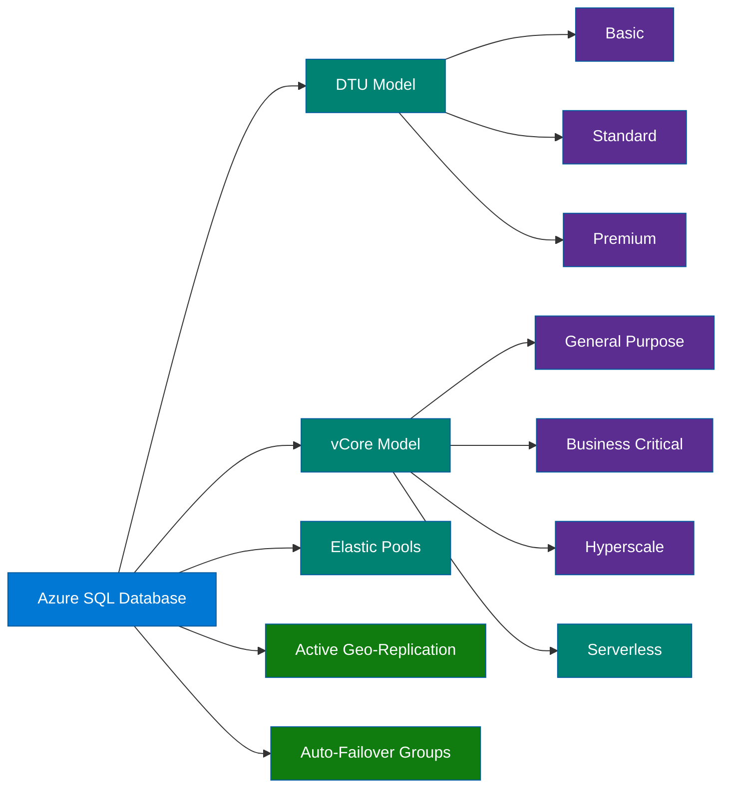

### Explanation

Azure SQL Database offers two main purchasing approaches. The legacy **DTU model** bundles compute, memory, and I/O into Database Transaction Units. It is simple for smaller or older deployments, but less transparent for capacity planning. The **vCore model** separates compute and storage more explicitly, making it easier to map requirements and use Azure Hybrid Benefit.

Under the DTU model, **Basic**, **Standard**, and **Premium** tiers provide increasing performance and I/O capability. Under the vCore model, **General Purpose** uses remote premium storage and is a cost-effective choice for many business workloads, **Business Critical** provides lower latency and local SSD-backed storage with multiple readable replicas, and **Hyperscale** separates compute and storage for rapid scale and very large databases.

**Serverless** in the vCore model helps intermittent or bursty workloads by automatically scaling compute within configured limits and auto-pausing during inactivity. It is useful for development, departmental, or low-duty-cycle workloads, but less ideal for consistently busy systems.

**Elastic pools** allow multiple databases with varying demand to share compute resources. This is excellent for SaaS multi-tenant patterns where many tenant databases are lightly used most of the time.

For resilience across regions, Azure SQL Database supports **active geo-replication** and **auto-failover groups**. Geo-replication creates readable secondary databases, while failover groups simplify DNS-based failover for groups of databases and applications.

### DTU vs vCore decision notes

- Use **DTU** when you need simplicity, older cost references, or smaller-scale deployments with less need for capacity transparency.
- Use **vCore** when you need clearer sizing, independent storage choices, serverless, Hyperscale, Azure Hybrid Benefit, or better alignment to on-prem SQL Server core planning.
- For net-new production solutions, vCore is commonly preferred.

### Service tier guidance

- **Basic**: small databases, dev/test, or very light workloads.
- **Standard**: moderate business workloads with balanced cost.
- **Premium**: higher I/O, lower latency, and more demanding transactional workloads.
- **General Purpose**: broad fit for OLTP with managed storage and lower cost than Business Critical.
- **Business Critical**: mission-critical workloads that need fast failover, low latency, and readable secondaries.
- **Hyperscale**: very large databases, rapid scale operations, and read scale-out.
- **Serverless**: intermittent activity and cost sensitivity over fixed provisioned compute.

### Azure CLI examples

```bash
az sql server create --name $SQL_SERVER --resource-group $RG --location $LOCATION --admin-user sqladminuser --admin-password 'ReplaceWithStrongPassword!1'

az sql db create --resource-group $RG --server $SQL_SERVER --name $SQL_DB --edition GeneralPurpose --family Gen5 --capacity 2 --compute-model Provisioned

az sql db create --resource-group $RG --server $SQL_SERVER --name ${SQL_DB}-serverless --edition GeneralPurpose --family Gen5 --capacity 2 --compute-model Serverless --auto-pause-delay 120 --min-capacity 0.5

az sql elastic-pool create --resource-group $RG --server $SQL_SERVER --name ep-saas-prod --edition GeneralPurpose --family Gen5 --capacity 4 --db-min-capacity 0.5 --db-max-capacity 2

az sql db create --resource-group $RG --server $SQL_SERVER --name tenant001db --elastic-pool ep-saas-prod

az sql db replica create --name $SQL_DB --partner-server ${SQL_SERVER}-dr --resource-group $RG --partner-resource-group $RG --secondary-type Geo

az sql failover-group create --name fog-app-prod --resource-group $RG --server $SQL_SERVER --partner-server ${SQL_SERVER}-dr --add-db $SQL_DB --failover-policy Automatic --grace-period 1

az sql db show --resource-group $RG --server $SQL_SERVER --name $SQL_DB
```

### Best practices

- Default to the vCore model for new designs unless a DTU-specific reason exists.
- Match tier choice to latency expectations; do not place critical low-latency workloads on under-sized General Purpose databases.
- Use elastic pools when many databases have spiky but non-concurrent demand patterns.
- Use serverless only for databases that genuinely idle long enough to benefit from auto-pause.
- Configure long-term retention and verify point-in-time restore objectives.
- Use private endpoints, firewall rules, and least-privilege access controls instead of broad public exposure.
- Monitor CPU, data IO, log IO, storage growth, and query wait statistics continuously.
- Use Query Store and automatic tuning features, but still review regressed plans in important workloads.
- Test geo-failover and application reconnect logic before relying on DR architecture.
- Separate admin identities from application identities and enable auditing.

## 3. Azure SQL Managed Instance

Azure SQL Managed Instance provides a managed SQL Server experience with near 100% compatibility for many existing SQL Server workloads. It is designed for migrations that need more SQL Server surface area than Azure SQL Database provides, while still reducing OS and platform management overhead.

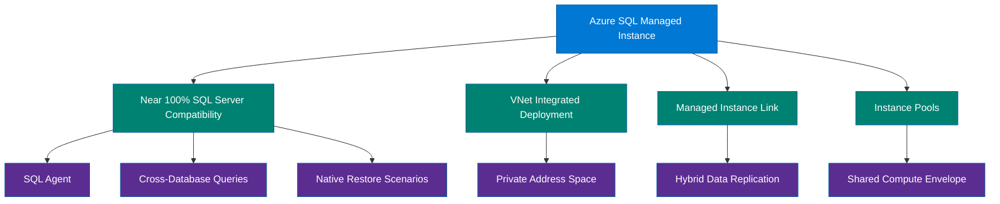

### Explanation

Managed Instance sits between Azure SQL Database and SQL Server on Azure VMs. It is a managed PaaS service, but it preserves many SQL Server instance-level capabilities. That makes it particularly useful for application portfolios with dependencies on SQL Agent jobs, linked patterns, database mail alternatives, cross-database queries, CLR considerations, or backup/restore-based migration workflows.

A defining trait is **VNet integration**. Managed Instance is deployed into a delegated subnet and receives private IP addresses inside your virtual network. This is useful when applications, security controls, and routing standards require database traffic to stay within private network boundaries.

The **link feature** helps connect SQL Server and Managed Instance environments for migration and hybrid operation. It supports reduced-downtime migration patterns and gives teams a bridge from existing environments into managed Azure SQL operations.

**Instance pools** allow multiple smaller Managed Instances to share underlying compute resources, which can reduce cost and improve deployment speed for groups of instances with predictable boundaries.

### When to use Managed Instance

- You need SQL Server compatibility beyond what Azure SQL Database offers.
- You want managed backups, patching, and HA without managing Windows Server and SQL Server infrastructure directly.
- Your application expects VNet-based connectivity and private addressing.
- You want to modernize with minimal schema and application rewrites.

### Azure CLI examples

```bash
az network vnet create --resource-group $RG --name vnet-data-prod --location $LOCATION --address-prefixes 10.20.0.0/16 --subnet-name snet-mi --subnet-prefixes 10.20.1.0/24

az network vnet subnet update --resource-group $RG --vnet-name vnet-data-prod --name snet-mi --delegations Microsoft.Sql/managedInstances

az sql mi create --name $MI_NAME --resource-group $RG --location $LOCATION --admin-user miadminuser --admin-password 'ReplaceWithStrongPassword!1' --subnet /subscriptions/<subscription-id>/resourceGroups/$RG/providers/Microsoft.Network/virtualNetworks/vnet-data-prod/subnets/snet-mi --license-type BasePrice --capacity 8 --storage 256GB --tier GeneralPurpose

az sql midb create --resource-group $RG --managed-instance $MI_NAME --name appdbmi01

az sql mi show --name $MI_NAME --resource-group $RG

az sql instance-pool create --name mipool-prod --resource-group $RG --location $LOCATION --license-type BasePrice --subnet /subscriptions/<subscription-id>/resourceGroups/$RG/providers/Microsoft.Network/virtualNetworks/vnet-data-prod/subnets/snet-mi --vcores 8 --storage 512

az sql instance-pool show --name mipool-prod --resource-group $RG
```

### Best practices

- Validate feature compatibility, but still test edge cases such as SQL Agent behavior, linked dependencies, and collation-sensitive workloads.
- Reserve sufficient subnet size and plan networking early because Managed Instance deployment is tightly coupled to VNet design.
- Use private DNS, route tables, and NSGs carefully so management traffic and application traffic both work as expected.
- Use Azure Hybrid Benefit when you have eligible SQL Server licenses.
- Benchmark maintenance windows, failover behavior, and backup/restore timelines for large databases.
- Consider instance pools when you need multiple smaller instances with similar requirements.
- Use the link feature or online migration patterns when downtime must be minimized.
- Keep application connection resiliency enabled because failovers still happen.
- Monitor storage, tempdb activity, long-running queries, and job success rates.
- Treat Managed Instance as a migration target and a modernization step, not just a drop-in replacement.

## 4. SQL Server on Azure VMs

SQL Server on Azure Virtual Machines is the Infrastructure as a Service option for SQL Server in Azure. It gives you full control over the guest operating system, SQL Server configuration, storage layout, patch cadence choices, and third-party software installation.

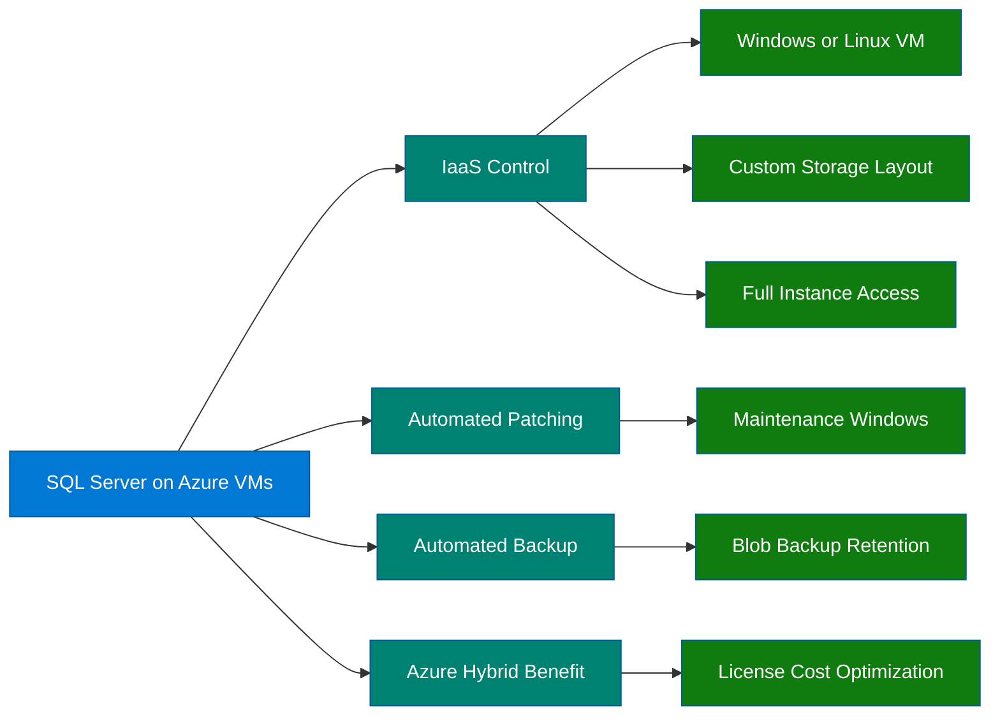

### Explanation

This option is appropriate when you need maximum compatibility and control. You manage the SQL Server instance much like an on-premises deployment, but Azure provides virtualized infrastructure, networking, disks, backup destinations, and monitoring integration.

Common reasons to choose SQL Server on Azure VMs include unsupported dependencies in PaaS, OS-level agents, specialized file system layouts, custom high availability approaches, or strict control over SQL Server installation behavior.

**Automated patching** can reduce administrative effort by scheduling SQL Server and Windows updates during defined windows. **Automated backup** integrates with Azure storage for regular backup protection. **Azure Hybrid Benefit** can significantly reduce licensing cost when you have eligible existing licenses.

The tradeoff is operational responsibility. You own the guest OS, SQL Server configuration, patch outcomes, storage performance design, security hardening, and backup validation more directly than in PaaS offerings.

### When to prefer this model

- Full SQL Server and OS control is required.
- Legacy application dependencies block migration to PaaS.
- You need unsupported instance-level features, drivers, or agents.
- The workload already depends on VM-based operational tooling.

### Azure CLI examples

```bash
az vm create --resource-group $RG --name $VM_NAME --image MicrosoftSQLServer:sql2019-ws2022:enterprise:latest --admin-username azureadmin --admin-password 'ReplaceWithStrongPassword!1' --size Standard_D4s_v5 --public-ip-sku Standard

az sql vm create --resource-group $RG --name $VM_NAME --license-type AHUB --sql-mgmt-type Full --image-sku Enterprise --offer SQL2019-WS2022 --sku Enterprise

az sql vm auto-patching enable --resource-group $RG --name $VM_NAME --day-of-week Sunday --maintenance-window-starting-hour 2 --maintenance-window-duration 60

az sql vm auto-backup enable --resource-group $RG --name $VM_NAME --enable --retention-period 30 --storage-url https://<storageaccount>.blob.core.windows.net/ --storage-key <storage-key> --backup-system-dbs true

az sql vm show --resource-group $RG --name $VM_NAME

az vm disk attach --resource-group $RG --vm-name $VM_NAME --name datadisk01 --new --size-gb 512 --sku Premium_LRS
```

### Best practices

- Choose VM sizes and disk layouts based on measured IOPS, throughput, and latency needs.
- Separate data, log, and tempdb where practical to improve performance isolation.
- Use Premium SSD v2 or Ultra Disk where the workload genuinely needs higher performance characteristics.
- Enable automated patching and automated backup unless a stricter external process already exists.
- Use Azure Backup, storage snapshots, or native SQL backup strategies with regular restore testing.
- Apply Azure Hybrid Benefit when licensing entitlements permit it.
- Harden the OS: Just Enough Administration, Defender, endpoint protection, patching, and restricted inbound access.
- Prefer private connectivity, jump hosts, or Azure Bastion instead of exposing management ports publicly.
- Use availability sets, availability zones, or Always On architectures when the workload requires high availability.
- Monitor disk queue, storage latency, CPU ready patterns, SQL waits, and backup job success.

## 5. Azure Cosmos DB

Azure Cosmos DB is Microsoft’s globally distributed, planet-scale NoSQL database platform. It offers multiple APIs, elastic partitioning, tunable consistency, and turnkey multi-region replication.

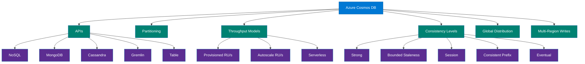

### Explanation

Cosmos DB is designed for applications that need low-latency reads and writes at global scale. It supports several wire protocols and APIs: **API for NoSQL** (native document model), **API for MongoDB**, **API for Cassandra**, **API for Gremlin** (graph), and **API for Table**. This allows teams to adopt Cosmos DB while preserving familiar application patterns.

**Partitioning** is core to Cosmos DB design. You must choose an effective partition key so throughput and storage distribute evenly. Poor partitioning creates hot partitions, throttling, and unbalanced scale.

Cosmos DB charges throughput in **Request Units per second (RU/s)**. You can use **provisioned throughput** for steady workloads, **autoscale** for bursty demand within an upper bound, or **serverless** for sporadic workloads with low duty cycle.

Consistency is tunable per account and sometimes per request, with five levels:

- **Strong**: highest consistency, strongest ordering, usually highest latency and strictest region topology rules.
- **Bounded Staleness**: predictable lag window in versions or time.
- **Session**: common default, offering read-your-writes for a client session.
- **Consistent Prefix**: reads never see out-of-order writes, but may lag.
- **Eventual**: lowest consistency, best for highest availability and lowest latency in some patterns.

**Global distribution** allows data replication to multiple Azure regions. **Multi-region writes** allow active-active write patterns, reducing latency and improving resilience for globally distributed applications.

### Partitioning guidance

- Select keys with high cardinality and good request distribution.
- Avoid keys that correlate directly to one noisy tenant or one time bucket when traffic is uneven.
- Validate partition behavior with production-like data volume and tenant skew.

### Azure CLI examples

```bash
az cosmosdb create --name $COSMOS_ACCOUNT --resource-group $RG --locations regionName=$LOCATION failoverPriority=0 isZoneRedundant=False --default-consistency-level Session --enable-multiple-write-locations true

az cosmosdb sql database create --account-name $COSMOS_ACCOUNT --resource-group $RG --name appdb

az cosmosdb sql container create --account-name $COSMOS_ACCOUNT --resource-group $RG --database-name appdb --name orders --partition-key-path '/tenantId' --throughput 1000

az cosmosdb sql container throughput migrate --account-name $COSMOS_ACCOUNT --resource-group $RG --database-name appdb --name orders --throughput-type autoscale

az cosmosdb sql container throughput show --account-name $COSMOS_ACCOUNT --resource-group $RG --database-name appdb --name orders

az cosmosdb update --name $COSMOS_ACCOUNT --resource-group $RG --default-consistency-level BoundedStaleness --max-interval 5 --max-staleness-prefix 100

az cosmosdb failover-priority-change --name $COSMOS_ACCOUNT --resource-group $RG --failover-policies eastus=0 westus2=1

az cosmosdb keys list --name $COSMOS_ACCOUNT --resource-group $RG
```

### Best practices

- Model containers and partition keys around query paths, tenant distribution, and write intensity.
- Use autoscale when demand is variable and provisioning headroom manually would be wasteful.
- Keep documents sized appropriately; large documents increase RU cost for reads and writes.
- Avoid cross-partition queries unless they are intentional and budgeted for.
- Use TTL, analytical store, and change feed where they fit the data lifecycle and integration pattern.
- Choose the weakest consistency level that still meets correctness requirements.
- Use multi-region writes only when the application logic can handle write conflict behavior and operational complexity.
- Monitor normalized RU consumption, throttled requests, partition hotspots, latency percentiles, and regional failover readiness.
- Secure with private endpoints, RBAC where supported, and careful key management or token-based access patterns.
- Test failover, partition distribution, and cost behavior before broad rollout.

## 6. Azure Database for PostgreSQL

Azure Database for PostgreSQL is the managed PostgreSQL offering in Azure. Historically Azure provided **Single Server**, but **Flexible Server** is now the recommended deployment model for most new workloads. Distributed scale-out scenarios may use the **Hyperscale (Citus)** concept for sharding and parallel execution.

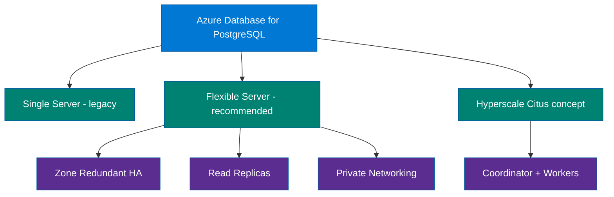

### Explanation

Azure Database for PostgreSQL offers managed PostgreSQL with automatic patching, backups, monitoring, and built-in HA options depending on the deployment model.

**Single Server** is the older model and is generally considered legacy for new solution design. **Flexible Server** is the preferred model because it provides better control over maintenance windows, improved networking choices, zone-redundant high availability, and operational flexibility.

**Read replicas** help scale read-heavy workloads, offload reporting, and improve application responsiveness when primary write nodes become saturated.

For distributed scale-out, Azure documentation and architecture discussions often reference **Hyperscale (Citus)**. The idea is to shard PostgreSQL data across worker nodes behind a coordinator to support larger datasets and parallel query processing. Availability and CLI specifics can vary by service evolution, so engineers should align command usage with the current Azure offering in their subscription and documentation.

### When PostgreSQL is a strong fit

- The application already uses PostgreSQL features, extensions, or ecosystem tooling.
- You need JSONB, geospatial capabilities, or open-source portability.
- You want managed relational service without adopting SQL Server.
- You need read replicas or distributed PostgreSQL patterns.

### Azure CLI examples

```bash
az postgres flexible-server create --resource-group $RG --name $PG_SERVER --location $LOCATION --admin-user pgadminuser --admin-password 'ReplaceWithStrongPassword!1' --sku-name Standard_D4s_v3 --tier GeneralPurpose --storage-size 256 --version 16 --high-availability ZoneRedundant

az postgres flexible-server db create --resource-group $RG --server-name $PG_SERVER --database-name appdb

az postgres flexible-server parameter set --resource-group $RG --server-name $PG_SERVER --name azure.extensions --value postgis,pg_stat_statements

az postgres flexible-server replica create --resource-group $RG --name ${PG_SERVER}-rr1 --source-server $PG_SERVER --location westus2

az postgres flexible-server show --resource-group $RG --name $PG_SERVER

az postgres flexible-server firewall-rule create --resource-group $RG --name $PG_SERVER --rule-name officeip --start-ip-address 203.0.113.10 --end-ip-address 203.0.113.10
```

### Best practices

- Prefer Flexible Server for new deployments unless a legacy constraint requires otherwise.
- Use zone-redundant HA for production workloads that need stronger resilience within a region.
- Use private networking and DNS integration when the workload is deployed inside VNets.
- Tune autovacuum, connection pooling, and index strategy for the real workload profile.
- Use read replicas for reporting and read scale, but understand replication lag before routing user-facing reads.
- Track extension compatibility and upgrade planning before major version changes.
- Use pgBouncer or application-side pooling to prevent excessive direct connections.
- Monitor storage growth, vacuum activity, replica lag, transaction ID health, and slow queries.
- For distributed PostgreSQL, model shard keys explicitly and avoid cross-shard joins when possible.
- Test backup restore, HA failover behavior, and maintenance window impacts.

## 7. Azure Database for MySQL

Azure Database for MySQL Flexible Server is the current managed MySQL option emphasized for new Azure deployments. It offers managed backups, maintenance, scaling, high availability, networking integration, and read replicas.

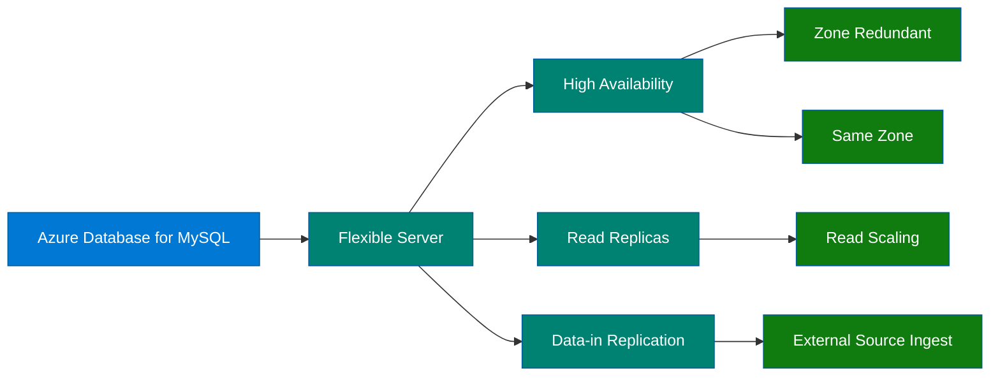

### Explanation

Azure Database for MySQL Flexible Server is designed for MySQL workloads that need a managed service while preserving familiar engine semantics and ecosystem compatibility.

**High availability** supports resilient production deployment patterns, including **zone-redundant** modes for stronger protection against zone-level failures where supported.

**Read replicas** help offload read traffic, support analytics-lite queries, and improve scale for read-heavy applications.

**Data-in replication** supports ingestion or replication from external MySQL sources into Azure Database for MySQL, which is useful during migration or hybrid operation.

This service is a strong fit for applications built on PHP, Java, Python, Node.js, CMS stacks, SaaS back ends, and web applications that already target MySQL.

### Azure CLI examples

```bash
az mysql flexible-server create --resource-group $RG --name $MYSQL_SERVER --location $LOCATION --admin-user mysqladminuser --admin-password 'ReplaceWithStrongPassword!1' --sku-name Standard_D4ds_v4 --tier GeneralPurpose --storage-size 256 --version 8.0 --high-availability ZoneRedundant

az mysql flexible-server db create --resource-group $RG --server-name $MYSQL_SERVER --database-name appdb

az mysql flexible-server replica create --resource-group $RG --replica-name ${MYSQL_SERVER}-rr1 --source-server $MYSQL_SERVER --location westus2

az mysql flexible-server show --resource-group $RG --name $MYSQL_SERVER

az mysql flexible-server firewall-rule create --resource-group $RG --name $MYSQL_SERVER --rule-name officeip --start-ip-address 203.0.113.10 --end-ip-address 203.0.113.10

az mysql flexible-server parameter set --resource-group $RG --server-name $MYSQL_SERVER --name slow_query_log --value ON
```

### Best practices

- Use Flexible Server for new MySQL deployments in Azure.
- Enable zone-redundant HA for important production workloads where region support exists.
- Use read replicas to scale reads, but route traffic based on acceptable lag.
- Review MySQL version compatibility, SQL modes, character sets, and collation settings during migration.
- Tune buffer pool, connection count, and query/index design rather than scaling blindly.
- Keep secrets in Key Vault and prefer private access patterns over broad firewall exposure.
- Enable slow query logging and review problematic statements regularly.
- Validate data-in replication lag and cutover behavior before migration events.
- Test backups, PITR, and maintenance impact in non-production first.
- Use application connection pooling and retry logic for transient events.

## 8. Azure Cache for Redis

Azure Cache for Redis is a managed in-memory data service used to reduce application latency, absorb spikes, and offload pressure from primary databases.

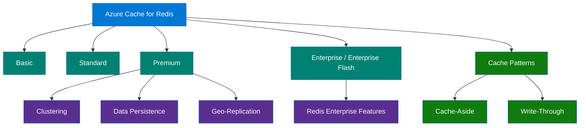

### Explanation

Redis is typically used as a companion service. It stores hot data in memory so applications can avoid repeated expensive database or API calls.

Azure offers multiple tiers:

- **Basic**: development or non-critical caching, no SLA-backed replica.
- **Standard**: replicated cache with better availability for production entry-level scenarios.
- **Premium**: adds clustering, persistence, virtual network support, and geo-replication capabilities.
- **Enterprise / Enterprise Flash**: advanced Redis Enterprise deployment options with larger scale and additional features.

Two common patterns are **cache-aside** and **write-through**. In cache-aside, the application checks the cache first, loads from the database on miss, then populates the cache. In write-through, application writes update the cache and the backing store in a controlled flow.

**Clustering** helps scale cache size and throughput horizontally. **Data persistence** is important when cache warmup cost is high or the cache stores stateful data that should survive restarts. **Geo-replication** can support cross-region designs for premium/enterprise-class deployments.

### Cache pattern notes

- **Cache-aside** is simple and common, but requires cache invalidation discipline.
- **Write-through** improves cache freshness, but adds write-path coupling.
- Some systems use write-behind, but it requires careful durability semantics and is not appropriate for every workload.

### Azure CLI examples

```bash
az redis create --location $LOCATION --name $REDIS_NAME --resource-group $RG --sku Premium --vm-size P1 --enable-non-ssl-port false

az redis show --resource-group $RG --name $REDIS_NAME

az redis update --name $REDIS_NAME --resource-group $RG --set redisConfiguration.maxmemory-policy=allkeys-lru

az redis patch-schedule create --name $REDIS_NAME --resource-group $RG --schedule-entries '[{"dayOfWeek":"Sunday","startHourUtc":3,"maintenanceWindow":"PT5H"}]'

az extension add --name redisenterprise

az redisenterprise create --name ${REDIS_NAME}-ent --resource-group $RG --location $LOCATION --sku Enterprise_E10

az redisenterprise database create --cluster-name ${REDIS_NAME}-ent --resource-group $RG --name default --client-protocol Encrypted --clustering-policy OSSCluster
```

### Best practices

- Never treat Redis as the only durable copy of critical data.
- Pick the tier based on HA, clustering, persistence, networking, and feature needs rather than memory size alone.
- Set expiration policies deliberately; stale cache entries are an application correctness problem.
- Use cache keys with clear namespace conventions and versioning for safe invalidation.
- Keep cached objects compact to maximize memory efficiency.
- Measure hit ratio, evictions, memory fragmentation, and network latency.
- Use Premium or Enterprise when you need clustering, stronger enterprise features, or complex network topologies.
- Secure access with TLS, private endpoints where available, and minimal network exposure.
- Plan warmup strategy for node restarts, failovers, or deployments.
- Use Redis for acceleration, session state, rate limiting, pub/sub, or transient state, but keep ownership of truth in a durable database.

## 9. Azure Synapse Analytics

Azure Synapse Analytics is a unified analytics platform that combines SQL analytics, Apache Spark, data integration, and close integration with Azure Data Lake Storage.

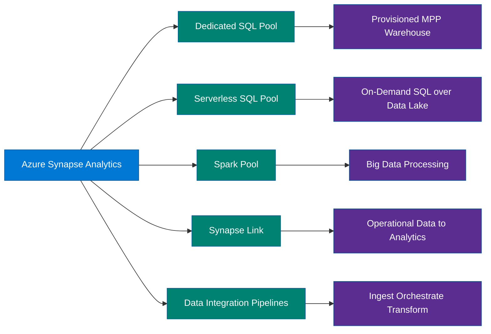

### Explanation

Synapse is not just a database; it is an analytics workspace that brings together multiple engines and orchestration capabilities.

**Dedicated SQL pool** is the provisioned MPP data warehouse component, suited for predictable, high-scale analytical workloads that benefit from distributed relational processing.

**Serverless SQL pool** lets you query files in the data lake on demand using T-SQL without provisioning dedicated compute ahead of time. It is ideal for exploration, ad hoc analytics, and lightweight lakehouse patterns.

**Spark pools** provide Apache Spark-based data engineering, machine learning, and transformation workflows inside the same analytics environment.

**Synapse Link** reduces friction between operational systems and analytics by exposing near-real-time data movement patterns into analytical stores.

**Data integration pipelines** provide orchestration similar to Azure Data Factory, enabling ingestion, transformation, scheduling, and dependency management across data workflows.

### When to use Synapse

- You need enterprise analytics or warehousing on Azure.
- You want SQL and Spark under one workspace model.
- You need pipelines, notebooks, and integrated analytics development.
- You want to analyze data in the lake without moving everything into a warehouse first.

### Azure CLI examples

```bash
az synapse workspace create --name $SYNAPSE_WS --resource-group $RG --storage-account <datalakestorageacct> --file-system synapsefs --sql-admin-login-user synadminuser --sql-admin-login-password 'ReplaceWithStrongPassword!1' --location $LOCATION

az synapse sql pool create --name sqlpooldw01 --performance-level DW100c --resource-group $RG --workspace-name $SYNAPSE_WS

az synapse spark pool create --name sparkpool01 --resource-group $RG --workspace-name $SYNAPSE_WS --node-count 3 --node-size Medium

az synapse workspace firewall-rule create --name allowcorp --workspace-name $SYNAPSE_WS --resource-group $RG --start-ip-address 203.0.113.10 --end-ip-address 203.0.113.10

az synapse sql pool show --name sqlpooldw01 --resource-group $RG --workspace-name $SYNAPSE_WS

az synapse spark pool show --name sparkpool01 --resource-group $RG --workspace-name $SYNAPSE_WS
```

### Best practices

- Separate exploratory serverless querying from production-grade dedicated warehouse workloads.
- Design lake storage layout, partitioning, and file formats such as Parquet before scaling usage.
- Use Spark for heavy transformations and machine learning, then serve curated data through SQL layers where appropriate.
- Control cost by pausing dedicated SQL pools when not needed and governing ad hoc queries.
- Secure the workspace with managed private endpoints, RBAC, and storage ACL discipline.
- Use pipelines for repeatable orchestration rather than relying on manual notebook execution.
- Align Synapse Link use cases with source-system throughput and freshness expectations.
- Monitor query concurrency, data skew, storage access patterns, and Spark job efficiency.
- Separate dev, test, and production workspaces for safer promotion.
- Establish naming, folder, schema, and notebook standards to avoid analytics sprawl.

## 10. Azure Database Migration Service

Azure Database Migration Service (DMS) helps move databases into Azure with structured assessment and migration workflows. It supports both online and offline migration modes depending on source and target combinations.

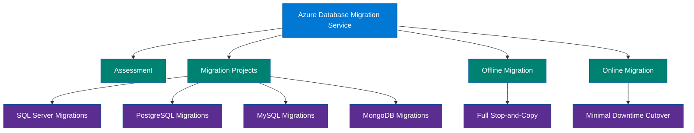

### Explanation

DMS reduces migration risk by organizing discovery, readiness, and cutover steps. It is commonly used alongside assessments from tools such as Azure Migrate, Data Migration Assistant, or engine-native checks.

**Offline migration** is generally simpler because the source is stopped at cutover and copied fully to the target. It usually involves longer downtime.

**Online migration** attempts to minimize downtime by continuously replicating changes until a brief cutover event. This is more operationally involved but is often required for customer-facing systems.

Migration projects can target multiple engines and patterns, including **SQL Server**, **PostgreSQL**, **MySQL**, and **MongoDB** scenarios, subject to the capabilities of the current Azure DMS offering and region availability.

### Migration workflow outline

1. Assess source compatibility and blockers.
2. Build landing-zone prerequisites: networking, target service, RBAC, observability, and security.
3. Run trial migrations with realistic datasets.
4. Decide on offline versus online strategy.
5. Execute cutover with rollback criteria and business signoff.

### Azure CLI examples

```bash
az dms create --resource-group $RG --name $DMS_NAME --location $LOCATION --sku-name Standard_1vCore

az dms project create --resource-group $RG --service-name $DMS_NAME --name sql-to-mi-project --source-platform SQL --target-platform SQLMI

az dms project task create --resource-group $RG --service-name $DMS_NAME --project-name sql-to-mi-project --name assessment-task --task-type AssessSqlServerToAzureSqlMI

az dms project show --resource-group $RG --service-name $DMS_NAME --name sql-to-mi-project

az dms show --resource-group $RG --name $DMS_NAME
```

### Best practices

- Perform assessment early and fix blockers before the cutover window is scheduled.
- Always run at least one rehearsal migration using production-like data size and workload behavior.
- Validate source and target collation, encoding, object compatibility, and extension/plugin differences.
- Prefer online migration for business-critical workloads with tight downtime limits.
- Define rollback criteria explicitly; migration success is not only about data copy completion.
- Measure application-level validation after cutover, not just row counts.
- Ensure network routes, DNS, private connectivity, and firewall rules are ready before migration day.
- Freeze schema changes during the final migration window unless a governed process exists.
- Capture pre- and post-cutover performance baselines.
- Use DMS as part of an end-to-end migration plan that includes application connection changes and operational runbooks.

## 11. Cosmos DB vs SQL vs PostgreSQL vs MySQL

This comparison summarizes where each service usually fits best. The “right” answer depends on workload behavior, ecosystem alignment, and operational goals rather than marketing labels.

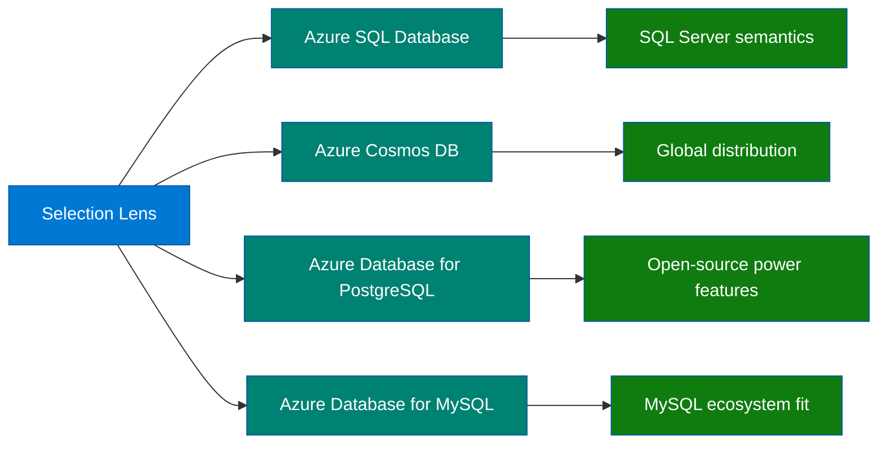

### Explanation

Azure SQL Database is strongest when you want managed SQL Server capabilities for cloud-native relational applications. Cosmos DB is strongest when horizontal partitioning, global distribution, API choice, and low-latency NoSQL patterns dominate. PostgreSQL is strongest when you want open-source relational flexibility, strong SQL features, JSONB, and ecosystem extensions. MySQL is strongest when the application stack already expects MySQL compatibility and operational simplicity.

### Comparison table

| Dimension | Azure SQL Database | Azure Cosmos DB | Azure Database for PostgreSQL | Azure Database for MySQL |
| --- | --- | --- | --- | --- |
| Primary model | Managed relational SQL Server | Globally distributed multi-model NoSQL | Managed open-source relational | Managed open-source relational |
| Best fit | Transactional apps needing SQL semantics | Low-latency distributed apps with flexible schema | PostgreSQL-native apps and advanced SQL/JSON/geospatial use cases | MySQL-native web and application back ends |
| Schema style | Structured, strongly relational | Flexible/document or API-specific | Structured with flexible JSON support | Structured relational |
| Scaling pattern | Scale up plus some elastic patterns | Horizontal partitioning by design | Scale up, replicas, and distributed patterns with Citus concepts | Scale up plus read replicas |
| Consistency | ACID relational | Configurable consistency levels | ACID relational | ACID relational |
| Global distribution | Geo-replication and failover groups | Native global distribution and multi-region writes | Regional plus replicas depending on design | Regional plus replicas depending on design |
| Query model | T-SQL | API-specific query model | PostgreSQL SQL | MySQL SQL |
| Operational overhead | Low | Low | Low | Low |
| Migration ease from same engine | High from SQL Server family | Varies by API and data model | High from PostgreSQL | High from MySQL |
| Typical use cases | ERP, line-of-business, SaaS OLTP | Retail catalogs, user profiles, IoT, gaming | GIS, SaaS, analytics-backed apps, JSON-heavy schemas | CMS, ecommerce, LAMP workloads |

### Azure CLI examples

```bash
az resource list --resource-group $RG --query "[?type=='Microsoft.Sql/servers/databases' || type=='Microsoft.DocumentDB/databaseAccounts' || type=='Microsoft.DBforPostgreSQL/flexibleServers' || type=='Microsoft.DBforMySQL/flexibleServers'].{name:name,type:type,location:location}" --output table

az monitor metrics list --resource /subscriptions/<subscription-id>/resourceGroups/$RG/providers/Microsoft.DocumentDB/databaseAccounts/$COSMOS_ACCOUNT --metric TotalRequests --interval PT1M

az monitor metrics list --resource /subscriptions/<subscription-id>/resourceGroups/$RG/providers/Microsoft.Sql/servers/$SQL_SERVER/databases/$SQL_DB --metric cpu_percent --interval PT1M

az postgres flexible-server list --resource-group $RG --output table

az mysql flexible-server list --resource-group $RG --output table
```

### Best practices

- Standardize evaluation criteria so teams compare services objectively: latency, throughput, availability, portability, consistency, and cost.
- Use proof-of-concept testing when migrating between data models, especially relational to NoSQL.
- Avoid choosing a service only because a team already knows it; verify fit against access patterns and growth expectations.
- Combine services when needed: for example Azure SQL Database plus Redis, or Cosmos DB plus Synapse analytics.
- Revisit the decision periodically because Azure services evolve quickly and workload behavior changes over time.
- Align service choice with organizational support skills, governance requirements, and incident-response maturity.
- Prefer the service that minimizes architectural friction while still meeting future scale and resilience targets.
- Model cost under realistic sustained and burst traffic, not only idle-state estimates.
- Keep migration pathways in mind so today’s platform does not trap tomorrow’s architecture.
- Document why a service was chosen so later teams understand the tradeoffs.

## Appendix A. Operational Checklists

### Pre-production readiness checklist

- Confirm naming standards, tags, RBAC assignments, and resource locks.
- Validate network topology, DNS behavior, firewall rules, private endpoints, and route tables.
- Enable diagnostic settings and route logs to the standard monitoring destination.
- Confirm backup retention, geo-backup, and restore testing schedule.
- Verify alert rules for availability, latency, capacity, throttling, and failed authentication events.
- Load-test with realistic concurrency and representative data volume.
- Review encryption at rest, TLS requirements, and key management.
- Ensure runbooks exist for failover, scaling, maintenance, and access rotation.
- Confirm cost budgets and anomaly detection are configured.
- Record service limits and escalation contacts.

### Migration cutover checklist

- Freeze non-essential schema changes.
- Confirm business owner approval and outage communications.
- Check replication lag, validation reports, and last successful sync time.
- Verify connection string switchover plan.
- Pre-stage DNS, Key Vault, and configuration updates.
- Take final backups or snapshots where applicable.
- Run smoke tests immediately after cutover.
- Monitor performance and errors intensively for the agreed hypercare period.
- Keep rollback path available until business signoff.
- Capture lessons learned.

### Cost optimization checklist

- Right-size compute after observing peak and average load.
- Use reserved capacity or savings options where justified.
- Delete unused replicas, test instances, and orphaned elastic resources.
- Turn on auto-pause or stop/pause options for non-production where available.
- Review storage tier, backup retention, and log retention regularly.
- Use autoscale strategically instead of permanently overprovisioning.
- Tag by environment, application, and owner for chargeback.
- Review RU usage, DTU/vCore saturation, and cache hit ratio monthly.
- Archive cold analytical data into cheaper storage patterns.
- Reassess architecture when one service is compensating for another poorly chosen service.

## Appendix B. Command Reference Notes

- Azure CLI command groups evolve. Always run `az <group> -h` to confirm the exact syntax in your installed version.
- Some database-specific features arrive first in extensions or preview commands.
- Networking-heavy services such as Managed Instance often require full resource IDs rather than short names.
- Placeholder passwords in this guide must be replaced with secure secrets stored in Key Vault or another approved secret store.
- Where commands depend on resource provider registration, wait for provider status to become Registered before provisioning.

## Appendix C. Quick Questions to Ask Before Choosing a Service

- What is the system of record?
- What is the expected peak write rate?
- What is the expected hot read ratio?
- Do you need joins, transactions, and rigid schema?
- Do you need global active-active writes?
- How much downtime is acceptable during patching or migration?
- Do you need private networking only?
- Are cross-region reads part of the business design?
- What are the retention and archival requirements?
- How predictable is the workload?
- Does the organization need open-source engine alignment?
- Is there an existing SQL Server license estate?
- What are the backup restore RTO and RPO requirements?
- What operational team skills already exist?
- How will analytics consume the data?

## Appendix D. Glossary

- **ACID**: Atomicity, consistency, isolation, and durability transaction properties.
- **Auto-failover group**: Azure SQL Database feature for DNS-based failover across paired servers.
- **Autoscale**: A consumption pattern that expands throughput within configured bounds as demand increases.
- **Bounded staleness**: Cosmos DB consistency level that limits lag by versions or time.
- **Cache-aside**: Caching pattern where the application loads data into cache only after a miss.
- **Citus**: Distributed PostgreSQL technology used for sharding and scale-out analytics/OLTP hybrids.
- **Consistency level**: The contract describing how current and ordered reads are after writes.
- **DTU**: Database Transaction Unit, a blended performance model used in older Azure SQL Database tiers.
- **Elastic pool**: A shared compute model for many Azure SQL databases with varying demand.
- **Eventual consistency**: A model where replicas converge over time without guaranteeing immediate freshness.
- **Geo-replication**: Replication of database state to another Azure region for disaster recovery or read scale.
- **HA**: High availability.
- **Hyperscale**: Azure SQL architecture separating compute and storage for large databases and rapid scaling.
- **IaaS**: Infrastructure as a Service.
- **Managed Instance**: Azure SQL service with broad SQL Server compatibility and VNet-based deployment.
- **Multi-region writes**: Cosmos DB capability allowing writes in more than one Azure region.
- **PaaS**: Platform as a Service.
- **Partition key**: A property used by Cosmos DB to distribute data and throughput across logical partitions.
- **Point-in-time restore**: Restore capability to a specific timestamp within retention bounds.
- **Read replica**: A read-only copy of a primary database used to scale reads or aid DR.
- **Redis persistence**: The ability to persist in-memory cache data to durable storage under certain tiers.
- **RU/s**: Request Units per second, Cosmos DB throughput currency.
- **Serverless**: A consumption mode in which compute is automatically allocated on demand.
- **Session consistency**: Cosmos DB level that guarantees read-your-writes within a client session.
- **Single Server**: Legacy Azure Database for PostgreSQL deployment model superseded by Flexible Server for most new workloads.
- **Synapse Link**: Integration feature that exposes operational data to analytics with reduced ETL friction.
- **vCore**: Virtual core-based purchasing model for Azure data services.
- **Zone redundancy**: Deployment across availability zones to improve resilience within a region.

## Appendix E. Service Cheat Sheets

### Azure SQL Database

- Primary strength: managed SQL Server for cloud-native apps.
- Key decisions: DTU vs vCore, tier choice, elastic pool, serverless, DR pattern.
- Watch metrics: CPU, workers, sessions, data IO, log IO, storage, query duration.
- Security defaults: private endpoint, Entra auth where possible, auditing, Defender.
- Typical complement: Redis for hot reads, Synapse for analytics.

### Azure SQL Managed Instance

- Primary strength: compatibility-focused migration target.
- Key decisions: subnet design, tier, storage, link usage, instance pools.
- Watch metrics: storage, tempdb, failovers, job outcomes, long-running queries.
- Security defaults: private networking, DNS validation, least privilege.
- Typical complement: DMS for migration, Redis for acceleration.

### SQL Server on Azure VMs

- Primary strength: full control and maximum compatibility.
- Key decisions: VM size, storage layout, HA design, OS hardening, licensing.
- Watch metrics: disk latency, CPU, memory pressure, SQL waits, backup age.
- Security defaults: private access, patching, Defender, minimal inbound ports.
- Typical complement: Azure Backup, monitoring agents, load balancers.

### Azure Cosmos DB

- Primary strength: globally distributed elastic NoSQL.
- Key decisions: API, partition key, consistency, throughput model, regions.
- Watch metrics: RU consumption, throttling, latency percentiles, hot partitions.
- Security defaults: private endpoint, RBAC/token-based access, key rotation.
- Typical complement: Synapse Link, Functions, event-driven microservices.

### Azure Database for PostgreSQL

- Primary strength: managed PostgreSQL flexibility.
- Key decisions: Flexible Server, HA, replicas, extensions, version path.
- Watch metrics: CPU, storage, vacuum, replica lag, connections.
- Security defaults: private DNS, TLS, secret rotation, role separation.
- Typical complement: PostGIS workloads, analytics consumers, app pools.

### Azure Database for MySQL

- Primary strength: managed MySQL with familiar ecosystem alignment.
- Key decisions: Flexible Server, HA, replicas, migration plan, version settings.
- Watch metrics: CPU, IOPS, slow queries, replica lag, connections.
- Security defaults: TLS, limited firewall scope, secrets in Key Vault.
- Typical complement: web apps, CMS, caching layers.

### Azure Cache for Redis

- Primary strength: low-latency in-memory acceleration.
- Key decisions: tier, persistence, clustering, key strategy, TTL model.
- Watch metrics: hit ratio, evictions, memory, connected clients, bandwidth.
- Security defaults: TLS, private connectivity, auth rotation.
- Typical complement: SQL, PostgreSQL, MySQL, Cosmos DB.

### Azure Synapse Analytics

- Primary strength: integrated analytics workspace.
- Key decisions: dedicated vs serverless SQL, Spark usage, lake design, pipelines.
- Watch metrics: query concurrency, data skew, Spark executor efficiency, storage scans.
- Security defaults: RBAC, storage ACLs, managed private endpoints.
- Typical complement: ADLS Gen2, Power BI, Cosmos DB analytical integrations.

### Azure Database Migration Service

- Primary strength: structured Azure-target migration orchestration.
- Key decisions: online vs offline, assessment path, cutover plan, validation.
- Watch metrics: task progress, replication lag, validation results, errors.
- Security defaults: private connectivity to source and target, scoped credentials.
- Typical complement: Azure Migrate, DMA, runbooks, change management.

## Appendix F. FAQ

### Should I always choose a managed service over a VM?

Usually yes, unless compatibility, OS control, or custom dependency requirements force IaaS.

### Is Cosmos DB a replacement for every relational database?

No. It is optimized for distributed NoSQL patterns, not every relational workload.

### Is serverless always cheaper?

No. It is cheaper only when the workload idles enough or bursts irregularly.

### Can Redis replace my database?

No. Redis is primarily a cache or transient data service unless very carefully designed otherwise.

### Should I use PostgreSQL Flexible Server instead of Single Server?

Yes for most new deployments; Single Server is legacy.

### Do read replicas improve write throughput?

No. They mainly help read scale and reporting isolation.

### Does geo-replication remove the need to test failover?

No. DR architecture is unproven until failover is exercised.

### Can Synapse serve as my OLTP database?

Generally no. It is built for analytics rather than high-concurrency transactional OLTP.

### Do migrations fail mostly for technical reasons?

Often the bigger risk is coordination, hidden dependencies, and cutover readiness.

### How should I choose consistency in Cosmos DB?

Use the weakest level that still meets correctness requirements to optimize latency and availability.

### Does Managed Instance remove all SQL administration?

No. It removes platform administration but still requires database engineering and performance tuning.

### What is the biggest Redis mistake?

Using it without TTL strategy, invalidation discipline, or memory monitoring.

### What is the biggest Cosmos DB mistake?

Choosing a poor partition key.

### What is the biggest SQL Database mistake?

Under-sizing and assuming the service will tune away poor schema and query design.

### What is the biggest PostgreSQL mistake?

Ignoring vacuum, connection management, and version-specific behavior.

### What is the biggest MySQL mistake?

Migrating without validating SQL mode, charset, and collation compatibility.

### What is the biggest Synapse mistake?

Skipping data lake design and letting file layout become chaotic.

### What is the biggest migration mistake?

Treating migration as only data copy instead of application and operations cutover.

### Should all services use private endpoints?

For production, private connectivity is usually preferred when architecture allows it.

### How often should I revisit service choice?

At major growth points, cost changes, architecture shifts, and platform refresh cycles.

## Appendix G. Study Notes by Service

### Database Decision Guide

1. Think in workload patterns first.
2. Separate operational, caching, and analytical concerns.
3. Compatibility is often the deciding factor in migration programs.
4. NoSQL is not inherently cheaper; design quality matters.
5. Time-series data often needs retention-aware design.
6. In-memory systems are accelerators, not primary truth.
7. Private networking affects service choice and deployment effort.
8. Global distribution changes how applications handle consistency.
9. Benchmarking is a design input, not a final validation step.
10. Architecture should stay evolvable.

### Azure SQL Database

1. DTU is simple but abstract.
2. vCore maps better to capacity planning.
3. Business Critical provides lower latency and readable secondaries.
4. Hyperscale changes scaling assumptions for large databases.
5. Serverless is for intermittent demand.
6. Elastic pools shine in SaaS multi-tenant estates.
7. Auto-failover groups simplify application failover endpoints.
8. Query Store is essential for troubleshooting regressions.
9. Private endpoints reduce exposure.
10. DR must be tested, not assumed.

### Azure SQL Managed Instance

1. Best when instance-level SQL Server compatibility matters.
2. Subnet planning is part of platform planning.
3. Migration complexity decreases relative to re-platforming.
4. Instance pools can lower cost for groups of instances.
5. The link feature helps phased migrations.
6. Private DNS is important.
7. Agent jobs still need governance.
8. Performance tuning still matters.
9. Licensing should be reviewed for Hybrid Benefit.
10. Application reconnect logic remains necessary.

### SQL Server on Azure VMs

1. You own the OS and SQL instance lifecycle.
2. Storage design is critical.
3. AHUB can materially reduce cost.
4. Automated backup and patching reduce toil.
5. Availability architecture is your responsibility.
6. Disk metrics must be monitored closely.
7. Network exposure should be minimized.
8. Useful for hard compatibility cases.
9. Not the default choice for new cloud-native apps.
10. Restore testing is mandatory.

### Azure Cosmos DB

1. Partition key choice determines success.
2. RU/s is the core economic model.
3. Autoscale helps bursty workloads.
4. Consistency is a business choice, not just a technical setting.
5. Multi-region writes increase complexity.
6. Serverless fits sporadic workloads.
7. Avoid accidental cross-partition scans.
8. Model documents around access patterns.
9. Hot partitions drive throttling.
10. Global applications benefit most.

### Azure Database for PostgreSQL

1. Flexible Server is the default recommendation.
2. Single Server is legacy.
3. Zone-redundant HA is valuable for production.
4. Read replicas support read scaling.
5. Extensions need lifecycle planning.
6. Vacuum health matters.
7. Connection pooling is important.
8. Citus-style distribution needs careful shard design.
9. JSONB is a major differentiator.
10. Private networking is commonly used.

### Azure Database for MySQL

1. Flexible Server is the modern option.
2. Read replicas help read-heavy applications.
3. HA options vary by region and tier.
4. SQL mode differences can break migrations.
5. Slow query logging is useful.
6. Charset and collation must be validated.
7. Connection pooling helps stability.
8. Data-in replication helps migration.
9. Private access is preferred for production.
10. MySQL ecosystem compatibility is the key value.

### Azure Cache for Redis

1. Cache hit ratio is a top metric.
2. TTL strategy is part of application correctness.
3. Premium unlocks clustering and persistence.
4. Enterprise adds advanced options.
5. Do not store the only copy of critical data in cache.
6. Key naming conventions matter.
7. Memory fragmentation affects efficiency.
8. Warmup plans reduce restart pain.
9. Geo-replication belongs to advanced DR design.
10. Cache patterns should be chosen intentionally.

### Azure Synapse Analytics

1. Dedicated SQL pool is for provisioned analytics.
2. Serverless SQL pool is ideal for ad hoc lake queries.
3. Spark handles engineering and ML workloads.
4. Pipelines orchestrate repeatable movement and transforms.
5. File layout in the lake affects everything.
6. Security spans workspace and storage layers.
7. Pause unused provisioned resources.
8. Synapse Link can reduce ETL friction.
9. MPP workloads need distribution-aware design.
10. Governance prevents analytics sprawl.

### Azure Database Migration Service

1. Assessment first, cutover later.
2. Online migration reduces downtime but increases coordination.
3. Offline migration is simpler but more disruptive.
4. Rehearsals are mandatory.
5. Validation must include application behavior.
6. Rollback criteria should be explicit.
7. Networking causes many migration-day issues.
8. Schema freezes reduce surprises.
9. Hypercare monitoring should be planned.
10. Migration is an operational program, not only a technical copy.

---

## 📚 Official Documentation
- [Azure SQL documentation](https://learn.microsoft.com/en-us/azure/azure-sql/)
- [Azure Cosmos DB documentation](https://learn.microsoft.com/en-us/azure/cosmos-db/)
- [Azure Database for PostgreSQL](https://learn.microsoft.com/en-us/azure/postgresql/)
- [Azure Cache for Redis](https://learn.microsoft.com/en-us/azure/azure-cache-for-redis/)
- [Azure Database Migration Service](https://learn.microsoft.com/en-us/azure/dms/)
