# 🗄️ Azure Database Migration Scenarios

> **Screenshot Disclaimer:** Portal screenshots referenced in this guide are sourced from [Microsoft Learn](https://learn.microsoft.com/en-us/azure/) documentation. © Microsoft Corporation. All rights reserved. Used for educational reference only.
> Real-world Azure database migration runbook with offline and online patterns, Azure CLI workflows, Terraform examples, verification outputs, rollback controls, and production cutover scenarios.

**Audience:** Cloud engineers, DBAs, SREs, platform teams, and migration-factory teams.
**Usage:** Adapt the commands, names, and IP ranges to your environment before production use.

## Table of Contents
1. [Database Migration Overview](#1-database-migration-overview)
2. [On-Premises SQL Server → Azure SQL Database](#2-on-premises-sql-server--azure-sql-database)
3. [On-Premises MySQL → Azure Database for MySQL](#3-on-premises-mysql--azure-database-for-mysql)
4. [On-Premises PostgreSQL → Azure Database for PostgreSQL](#4-on-premises-postgresql--azure-database-for-postgresql)
5. [Azure SQL → Azure SQL Managed Instance Migration](#5-azure-sql--azure-sql-managed-instance-migration)
6. [Cross-Cloud Database Migration](#6-cross-cloud-database-migration)
7. [Database Migration Testing & Validation](#7-database-migration-testing--validation)
8. [Real-World Migration Scenarios](#8-real-world-migration-scenarios-5)
9. [Appendix A. Common Variables](#appendix-a-common-variables)
10. [Appendix B. Troubleshooting Signals](#appendix-b-troubleshooting-signals)
11. [Appendix C. Migration Templates](#appendix-c-migration-templates)
12. [Appendix D. Quick FAQ](#appendix-d-quick-faq)

---

## 1. Database Migration Overview

### 🎯 Migration strategy: offline vs online
Offline migration is a stop-copy-start pattern.
Online migration keeps source and target synchronized until a short cutover event.
The business choice is not simply about tooling; it is about downtime, operational maturity, and rollback complexity.

| Decision Area | Offline | Online |
|---|---|---|
| Downtime | Longer maintenance window | Minimal downtime |
| Complexity | Lower | Higher |
| Best fit | Small or less critical workloads | High-value and always-on workloads |
| Data movement | One-time copy | Continuous sync plus final delta |
| Rollback | Usually easier | Needs divergence control |
| Tooling examples | bacpac, mysqldump, pg_dump | Azure DMS, native replication, logical replication |
| Operational demand | Moderate | High |
| Testing expectation | At least one rehearsal | Multiple rehearsals and cutover drills |

### 🛠️ Azure Database Migration Service (DMS) overview
- Azure DMS organizes assessment, project tracking, migration execution, and cutover workflows.
- It is most valuable when you need repeatable migrations and minimal downtime patterns.
- Teams still need application-level validation; DMS does not replace business testing.
- Use DMS as part of a runbook that also covers DNS, secrets, monitoring, and rollback.

> 
>
> *Screenshot source: [Microsoft Learn — Create a Single Database - Azure SQL Database](https://learn.microsoft.com/en-us/azure/azure-sql/database/single-database-create-quickstart). © Microsoft Corporation. Used for educational reference only.*

> **Portal View:** Navigate to `Azure Portal` → `Azure Database Migration Service` → `Migration projects`. The workflow shows source/target engine selection, integration runtime/networking choices, schema assessment, and cutover controls used during rehearsals.
>
> *For the latest portal screenshots, see [Microsoft Learn — What is Azure Database Migration Service?](https://learn.microsoft.com/en-us/azure/dms/dms-overview).* 

> **Portal View:** Navigate to `Azure Portal` → `Azure Database for PostgreSQL flexible servers` or `Azure Database for MySQL flexible servers` → `Networking`. These blades show private access, delegated subnet, firewall, and DNS selections that must be in place before online replication cutover.
>
> *For the latest portal screenshots, see [Microsoft Learn — Azure Database for PostgreSQL flexible server networking](https://learn.microsoft.com/en-us/azure/postgresql/flexible-server/concepts-networking-private) and [Microsoft Learn — Azure Database for MySQL flexible server networking](https://learn.microsoft.com/en-us/azure/mysql/flexible-server/concepts-networking-vnet).* 

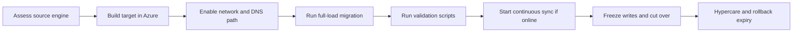

### 🔍 Assessment tools
| Tool | Primary use | Typical migration |
|---|---|---|
| Data Migration Assistant (DMA) | SQL compatibility and blockers | SQL Server to Azure SQL / MI |
| Azure Migrate | Inventory, grouping, readiness, business case | Estate-wide planning |
| mysqldump / mysql utilities | Logical export for offline moves | MySQL |
| pg_dump / pg_restore | Logical export and parallel restore | PostgreSQL |
| Custom validation SQL | Row counts, checksums, permissions | All engines |

### 🌳 Migration decision tree
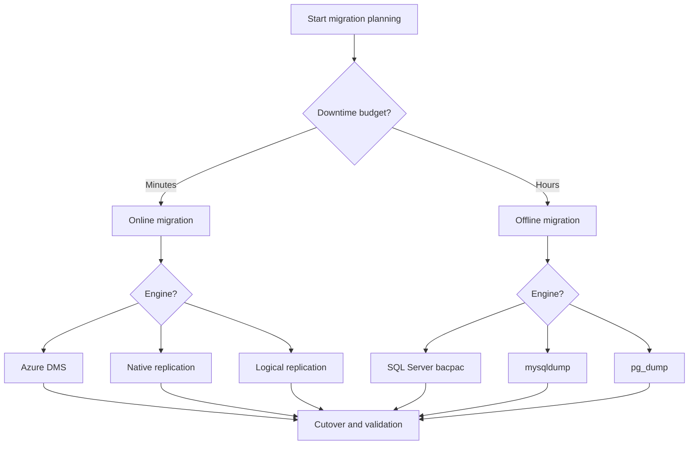

### ✅ Azure landing-zone prerequisites
- Target resource groups, RBAC, tags, and policy controls are ready.
- Network path is validated from source to Azure target.
- Private DNS, firewall, and private endpoint plans are approved.
- Backups, monitoring, and alerts are enabled before go-live.
- Bridge-call owners are assigned for database, app, network, and change management.

### ⚙️ CLI bootstrap
```bash
az login
az account set --subscription <subscription-id>
az group create --name rg-db-migration --location eastus
az provider register --namespace Microsoft.Sql
az provider register --namespace Microsoft.DBforMySQL
az provider register --namespace Microsoft.DBforPostgreSQL
az provider register --namespace Microsoft.DataMigration
az monitor log-analytics workspace create       --resource-group rg-db-migration       --workspace-name law-db-migration       --location eastus
az monitor action-group create       --resource-group rg-db-migration       --name ag-db-ops       --short-name dbops
```

### 🧪 Verification output
```text
$ az group create --name rg-db-migration --location eastus
{
  "name": "rg-db-migration",
  "location": "eastus",
  "properties": {
    "provisioningState": "Succeeded"
  }
}
```

### 🏗️ Terraform starter
```hcl
terraform {
  required_providers {
    azurerm = {
      source  = "hashicorp/azurerm"
      version = "~> 3.110"
    }
  }
}

provider "azurerm" {
  features {}
}

resource "azurerm_resource_group" "dbmig" {
  name     = "rg-db-migration"
  location = "East US"
}

resource "azurerm_log_analytics_workspace" "dbmig" {
  name                = "law-db-migration"
  location            = azurerm_resource_group.dbmig.location
  resource_group_name = azurerm_resource_group.dbmig.name
  sku                 = "PerGB2018"
  retention_in_days   = 30
}
```

---

## 2. On-Premises SQL Server → Azure SQL Database

### 🏁 Scenario summary
- This pattern is best for cloud-ready SQL Server workloads that can run without instance-level features.
- The main decision is bacpac for offline migration versus Azure DMS for minimal downtime.
- Run DMA first so blockers are discovered before the cutover weekend.

### 1. Pre-migration assessment with DMA
- Install DMA on a jump host with network access to the source.
- Assess Azure SQL Database compatibility and export the report.
- Inventory SQL Agent jobs, linked servers, CLR, cross-database dependencies, and SSIS usage.
- Capture baseline CPU, wait stats, and top queries.

### 2. Schema migration
- Extract a DACPAC or scripted schema.
- Publish to the Azure SQL target in a lower environment first.
- Review unsupported filegroup options and server-level dependencies.

### 3. Data migration (offline bacpac)
- Freeze writes during the maintenance window.
- Export a final bacpac.
- Import into Azure SQL Database.
- Run row counts and smoke tests before reopening traffic.

### 4. Data migration (online with DMS)
- Create Azure DMS in the same region/network boundary.
- Run assessment task and start full load + sync.
- Monitor lag until cutover is ready.

### 5. Connection string cutover
- Update the secret in Key Vault.
- Restart only components that cache connections.
- Confirm app health probes against the new target.

### 6. Post-migration validation
- Run object counts, critical row counts, checksums, and performance tests.
- Verify backup settings, alerts, and firewall policies.
- Keep the source restricted until rollback expiry ends.

```sql
SELECT DB_NAME(database_id) AS database_name, recovery_model_desc, compatibility_level
FROM sys.databases
WHERE name = 'SalesProd';

SELECT TOP 20
    total_worker_time / execution_count AS avg_cpu,
    total_elapsed_time / execution_count AS avg_duration,
    execution_count,
    SUBSTRING(text, 1, 2000) AS query_text
FROM sys.dm_exec_query_stats
CROSS APPLY sys.dm_exec_sql_text(sql_handle)
ORDER BY avg_duration DESC;
```

```bash
export RG=rg-sql-mig
export LOCATION=eastus
export SQL_SERVER=azsql-sales-prod-01
export SQL_DB=salesdb
export SQL_ADMIN=sqladminuser
export SQL_PASSWORD='<StrongPassword>'

az group create --name $RG --location $LOCATION
az sql server create       --resource-group $RG       --name $SQL_SERVER       --location $LOCATION       --admin-user $SQL_ADMIN       --admin-password $SQL_PASSWORD
az sql db create       --resource-group $RG       --server $SQL_SERVER       --name $SQL_DB       --edition GeneralPurpose       --family Gen5       --capacity 4
az sql server firewall-rule create       --resource-group $RG       --server $SQL_SERVER       --name corp-dba-range       --start-ip-address 10.21.0.10       --end-ip-address 10.21.0.250
az sql db show --resource-group $RG --server $SQL_SERVER --name $SQL_DB
```

```bash
sqlpackage /Action:Extract       /SourceServerName:sqlprod01.corp.local       /SourceDatabaseName:SalesProd       /TargetFile:SalesProd.dacpac

sqlpackage /Action:Publish       /SourceFile:SalesProd.dacpac       /TargetServerName:${SQL_SERVER}.database.windows.net       /TargetDatabaseName:${SQL_DB}       /TargetUser:${SQL_ADMIN}       /TargetPassword:${SQL_PASSWORD}
```

```bash
sqlpackage /Action:Export       /SourceServerName:sqlprod01.corp.local       /SourceDatabaseName:SalesProd       /SourceUser:corp\sqlmig       /SourcePassword:'<Password>'       /TargetFile:SalesProd-final.bacpac

sqlpackage /Action:Import       /SourceFile:SalesProd-final.bacpac       /TargetServerName:${SQL_SERVER}.database.windows.net       /TargetDatabaseName:${SQL_DB}       /TargetUser:${SQL_ADMIN}       /TargetPassword:${SQL_PASSWORD}
```

```bash
export DMS_NAME=dms-sql-prod-01
export DMS_PROJECT=sqlserver-to-azuresql

az dms create       --resource-group $RG       --name $DMS_NAME       --location $LOCATION       --sku-name Standard_1vCore
az dms project create       --resource-group $RG       --service-name $DMS_NAME       --name $DMS_PROJECT       --source-platform SQL       --target-platform SQLDB
az dms project task create       --resource-group $RG       --service-name $DMS_NAME       --project-name $DMS_PROJECT       --name assess-salesprod       --task-type AssessSqlServerToAzureSqlDb
```

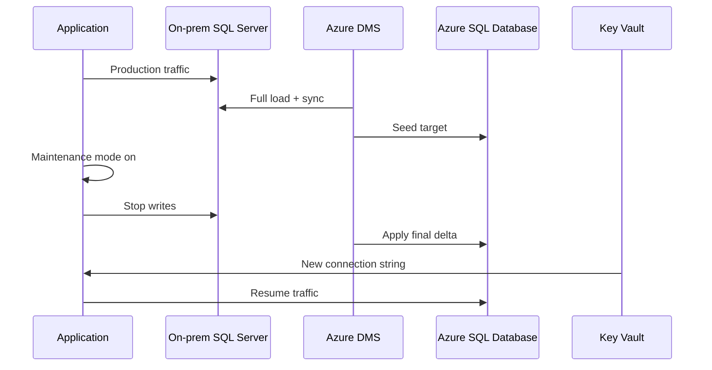

```sql
SELECT COUNT(*) AS orders_count FROM dbo.Orders;
SELECT COUNT(*) AS customers_count FROM dbo.Customers;
SELECT CHECKSUM_AGG(BINARY_CHECKSUM(OrderId, CustomerId, OrderTotal)) AS order_checksum
FROM dbo.Orders;
```

```text
$ az sql db show --resource-group rg-sql-mig --server azsql-sales-prod-01 --name salesdb
{
  "name": "salesdb",
  "status": "Online",
  "currentSku": {
    "name": "GP_Gen5_4",
    "tier": "GeneralPurpose"
  }
}
```

```hcl
resource "azurerm_mssql_server" "sales" {
  name                         = "azsql-sales-prod-01"
  resource_group_name          = azurerm_resource_group.dbmig.name
  location                     = azurerm_resource_group.dbmig.location
  version                      = "12.0"
  administrator_login          = "sqladminuser"
  administrator_login_password = var.sql_admin_password
}

resource "azurerm_mssql_database" "sales" {
  name      = "salesdb"
  server_id = azurerm_mssql_server.sales.id
  sku_name  = "GP_Gen5_4"
}
```

---

## 3. On-Premises MySQL → Azure Database for MySQL

### 🧾 Summary
- Validate character set, collation, binlog, GTID, and replication privileges before choosing a pattern.
- Use mysqldump for simple offline migrations and Azure DMS or replication for low-downtime moves.
- Reduce DNS TTL ahead of cutover and coordinate app pool restarts.

### 🔎 Assessment and compatibility check
```sql
SHOW VARIABLES LIKE 'version';
SHOW VARIABLES LIKE 'character_set_server';
SHOW VARIABLES LIKE 'collation_server';
SHOW VARIABLES LIKE 'binlog_format';
SHOW VARIABLES LIKE 'gtid_mode';
SHOW MASTER STATUS;
```

### ⚙️ Target provisioning and baseline
```bash
export RG=rg-mysql-mig
export LOCATION=eastus2
export MYSQL_SERVER=mysql-prod-flex-01
export MYSQL_ADMIN=mysqladmin
export MYSQL_PASSWORD='<StrongPassword>'

az group create --name $RG --location $LOCATION
az mysql flexible-server create           --resource-group $RG           --name $MYSQL_SERVER           --location $LOCATION           --admin-user $MYSQL_ADMIN           --admin-password $MYSQL_PASSWORD           --sku-name Standard_D4ds_v5           --tier GeneralPurpose           --storage-size 512
az mysql flexible-server show --resource-group $RG --name $MYSQL_SERVER
```

### 📦 Offline migration flow
```bash
mysqldump           --host=mysql01.corp.local           --user=miguser           --password           --single-transaction           --routines           --events           --triggers           salesapp > salesapp.sql

mysql           --host=${MYSQL_SERVER}.mysql.database.azure.com           --user=${MYSQL_ADMIN}           --password           salesapp < salesapp.sql
```

### 🔄 Online migration flow
```bash
export DMS_NAME=dms-mysql-prod-01
export DMS_PROJECT=mysql-to-flex

az dms create           --resource-group $RG           --name $DMS_NAME           --location $LOCATION           --sku-name Standard_1vCore
az dms project create           --resource-group $RG           --service-name $DMS_NAME           --name $DMS_PROJECT           --source-platform MySQL           --target-platform AzureDbForMySQL
```

### 🧠 Operational notes
- Keep the source read-only until validation is complete.
- Validate DEFINER values on views, routines, and events.
- Use shard-aware or tenant-aware cutovers if the application is distributed.

### 🧪 Advanced pattern
```sql
CREATE USER 'replicator'@'%' IDENTIFIED BY '<Password>';
GRANT REPLICATION SLAVE, REPLICATION CLIENT ON *.* TO 'replicator'@'%';
FLUSH PRIVILEGES;
SHOW SLAVE STATUS\G
```

### 📈 Mermaid workflow
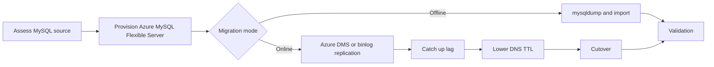

### ✅ Sample verification output
```text
$ az mysql flexible-server show --resource-group rg-mysql-mig --name mysql-prod-flex-01
{
  "name": "mysql-prod-flex-01",
  "fullyQualifiedDomainName": "mysql-prod-flex-01.mysql.database.azure.com",
  "state": "Ready"
}
```

### 🏗️ Terraform sample
```hcl
resource "azurerm_mysql_flexible_server" "sales" {
  name                   = "mysql-prod-flex-01"
  resource_group_name    = azurerm_resource_group.dbmig.name
  location               = azurerm_resource_group.dbmig.location
  administrator_login    = "mysqladmin"
  administrator_password = var.mysql_admin_password
  sku_name               = "GP_Standard_D4ds_v5"
  backup_retention_days  = 14
}
```

### ✔️ Exit checklist
- Critical row counts match.
- Application smoke tests pass.
- Monitoring and backups are enabled.
- Rollback expiry time is documented.

---

## 4. On-Premises PostgreSQL → Azure Database for PostgreSQL

### 🧾 Summary
- Review extension compatibility, collation behavior, and logical replication prerequisites.
- Use pg_dump/pg_restore for straightforward offline migration.
- Use DMS or logical replication when downtime must be minimized.

### 🔎 Assessment and compatibility check
```sql
SELECT version();
SELECT extname, extversion FROM pg_extension ORDER BY extname;
SELECT schemaname, relname, n_live_tup FROM pg_stat_user_tables ORDER BY n_live_tup DESC LIMIT 10;
```

### ⚙️ Target provisioning and baseline
```bash
export RG=rg-pg-mig
export LOCATION=centralus
export PG_SERVER=pgflex-prod-01
export PG_ADMIN=pgadmin
export PG_PASSWORD='<StrongPassword>'

az group create --name $RG --location $LOCATION
az postgres flexible-server create           --resource-group $RG           --name $PG_SERVER           --location $LOCATION           --admin-user $PG_ADMIN           --admin-password $PG_PASSWORD           --sku-name Standard_D4ds_v5           --version 15
az postgres flexible-server show --resource-group $RG --name $PG_SERVER
```

### 📦 Offline migration flow
```bash
export PGPASSWORD='<SourcePassword>'
pg_dump --host=pg01.corp.local --username=pgmig --format=custom --jobs=4 appdb > appdb.dump

export PGPASSWORD=$PG_PASSWORD
pg_restore --host=${PG_SERVER}.postgres.database.azure.com --username=${PG_ADMIN} --dbname=postgres --create --jobs=4 appdb.dump
```

### 🔄 Online migration flow
```bash
export DMS_NAME=dms-pg-prod-01
export DMS_PROJECT=pg-to-flex

az dms create           --resource-group $RG           --name $DMS_NAME           --location $LOCATION           --sku-name Standard_1vCore
az dms project create           --resource-group $RG           --service-name $DMS_NAME           --name $DMS_PROJECT           --source-platform PostgreSQL           --target-platform AzureDbForPostgreSql
```

### 🧠 Operational notes
- Reset sequences after restore if needed.
- Benchmark autovacuum behavior and connection pooling.
- Test application queries that depend on collation or extension behavior.

### 🧪 Advanced pattern
```sql
ALTER SYSTEM SET wal_level = logical;
ALTER SYSTEM SET max_replication_slots = 10;
ALTER SYSTEM SET max_wal_senders = 10;
SELECT pg_reload_conf();
CREATE PUBLICATION appdb_pub FOR ALL TABLES;
```

### 📈 Mermaid workflow
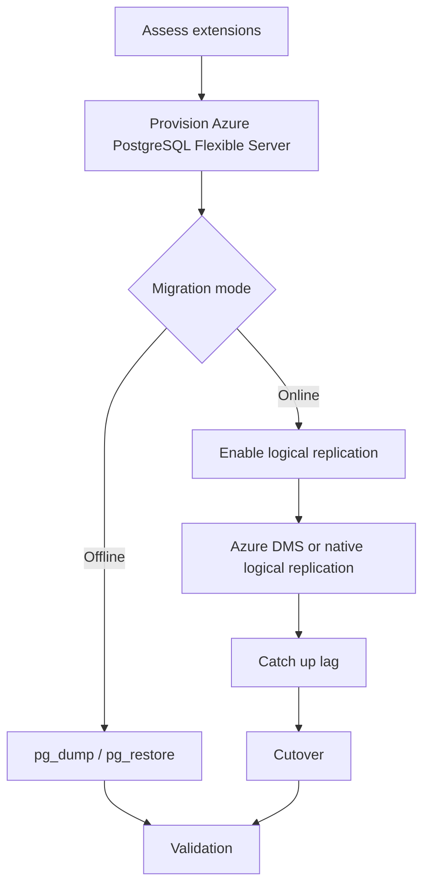

### ✅ Sample verification output
```text
$ az postgres flexible-server show --resource-group rg-pg-mig --name pgflex-prod-01
{
  "name": "pgflex-prod-01",
  "fullyQualifiedDomainName": "pgflex-prod-01.postgres.database.azure.com",
  "state": "Ready"
}
```

### 🏗️ Terraform sample
```hcl
resource "azurerm_postgresql_flexible_server" "appdb" {
  name                   = "pgflex-prod-01"
  resource_group_name    = azurerm_resource_group.dbmig.name
  location               = azurerm_resource_group.dbmig.location
  administrator_login    = "pgadmin"
  administrator_password = var.pg_admin_password
  version                = "15"
  sku_name               = "GP_Standard_D4ds_v5"
}
```

### ✔️ Exit checklist
- Critical row counts match.
- Application smoke tests pass.
- Monitoring and backups are enabled.
- Rollback expiry time is documented.

---

## 5. Azure SQL → Azure SQL Managed Instance Migration

- Choose Managed Instance when cross-database functionality, SQL Agent, or higher SQL Server compatibility is required.
- Run DMA specifically for Azure SQL Managed Instance and review all instance-level dependencies.
- Use Azure DMS online or log replay service depending on size and downtime budget.

```bash
export RG=rg-mi-migration
export LOCATION=eastus
export MI_NAME=mi-sales-prod-01
export VNET=vnet-data-prod
export SUBNET=snet-sqlmi

az group create --name $RG --location $LOCATION
az network vnet create       --resource-group $RG       --name $VNET       --address-prefix 10.60.0.0/16       --subnet-name $SUBNET       --subnet-prefix 10.60.1.0/24
az sql mi create       --resource-group $RG       --name $MI_NAME       --location $LOCATION       --admin-user miadmin       --admin-password '<StrongPassword>'       --subnet /subscriptions/<subscription-id>/resourceGroups/$RG/providers/Microsoft.Network/virtualNetworks/$VNET/subnets/$SUBNET       --capacity 8       --storage 512GB       --family Gen5
```

```bash
export DMS_NAME=dms-mi-prod-01
export DMS_PROJECT=azuresql-to-mi

az dms create       --resource-group $RG       --name $DMS_NAME       --location $LOCATION       --sku-name Standard_2vCores
az dms project create       --resource-group $RG       --service-name $DMS_NAME       --name $DMS_PROJECT       --source-platform SQLDB       --target-platform SQLMI
az dms project task create       --resource-group $RG       --service-name $DMS_NAME       --project-name $DMS_PROJECT       --name migrate-orders       --task-type MigrateSqlServerSqlDbToSqlMI
```

### 📦 Log replay service
- Use log replay when you want to restore a backup chain into Managed Instance and keep applying logs until cutover.
- This is useful for large databases that are already managed with disciplined backup operations.
- Keep full, differential, and log backup naming conventions consistent.

```bash
az storage account create       --resource-group $RG       --name stmisqlbackups01       --location $LOCATION       --sku Standard_LRS
az storage container create --account-name stmisqlbackups01 --name sqlbackups
az sql midb log-replay start       --resource-group $RG       --managed-instance $MI_NAME       --name salesdb       --storage-uri https://stmisqlbackups01.blob.core.windows.net/sqlbackups/       --storage-key <storage-key>       --last-backup-name full_backup.bak
```

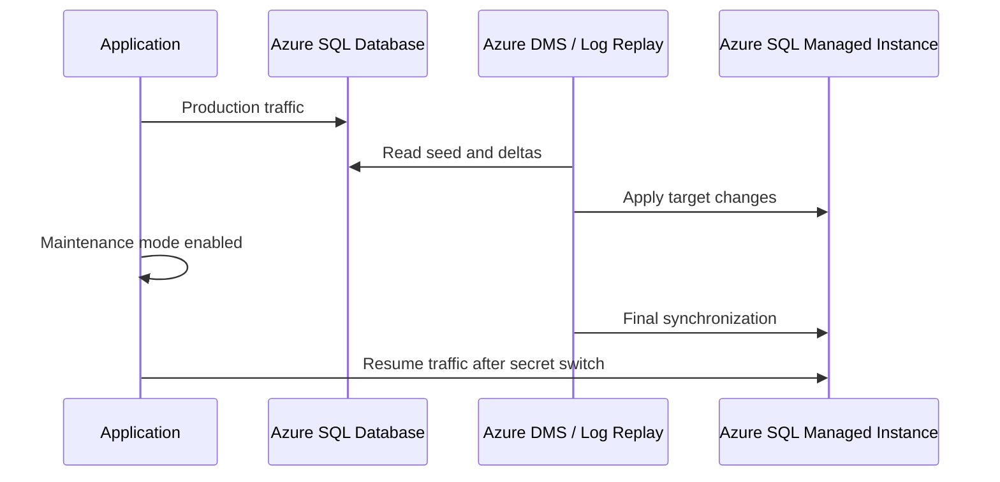

```hcl
resource "azurerm_sql_managed_instance" "mi" {
  name                         = "mi-sales-prod-01"
  resource_group_name          = azurerm_resource_group.dbmig.name
  location                     = azurerm_resource_group.dbmig.location
  administrator_login          = "miadmin"
  administrator_login_password = var.mi_admin_password
  sku_name                     = "GP_Gen5"
  vcores                       = 8
  storage_size_in_gb           = 512
  subnet_id                    = azurerm_subnet.sqlmi.id
}
```

---

## 6. Cross-Cloud Database Migration

| Source | Azure target | Primary tools | Major risk |
|---|---|---|---|
| AWS RDS SQL Server | Azure SQL / MI | DMA, DMS, sqlpackage | Networking and compatibility |
| AWS RDS MySQL | Azure Database for MySQL | mysqldump, DMS, replication | Privilege model and binlog path |
| GCP Cloud SQL MySQL | Azure Database for MySQL | mysqldump, DMS | Private connectivity and SSL |
| MongoDB | Cosmos DB for MongoDB API | mongodump, restore, app validation | API and index compatibility |

### AWS RDS → Azure SQL
1. Establish secure private or controlled public connectivity between clouds.
2. Run DMA compatibility assessment.
3. Provision Azure SQL or MI based on feature needs.
4. Run DMS online or export/import based on downtime tolerance.
5. Rotate secrets and validate app health after cutover.

```bash
az sql server create       --resource-group rg-crosscloud       --name azsql-crosscloud-01       --location eastus       --admin-user sqladmin       --admin-password '<StrongPassword>'
az sql db create       --resource-group rg-crosscloud       --server azsql-crosscloud-01       --name rds-salesdb       --service-objective GP_Gen5_4
az dms create       --resource-group rg-crosscloud       --name dms-cross-sql       --location eastus       --sku-name Standard_1vCore
```

### GCP Cloud SQL → Azure Database for MySQL
1. Confirm SSL and network path expectations on the GCP side.
2. Provision Azure Database for MySQL Flexible Server with the correct version and HA posture.
3. Use mysqldump or DMS based on downtime requirements.
4. Pre-stage application secret changes in Key Vault or configuration pipelines.

```bash
az mysql flexible-server create       --resource-group rg-crosscloud       --name mysql-gcp-target-01       --location eastus2       --admin-user mysqladmin       --admin-password '<StrongPassword>'       --sku-name Standard_D4ds_v5

mysqldump --host=<gcp-cloudsql-host> --user=miguser --password --single-transaction appdb > appdb-gcp.sql
mysql --host=mysql-gcp-target-01.mysql.database.azure.com --user=mysqladmin --password appdb < appdb-gcp.sql
```

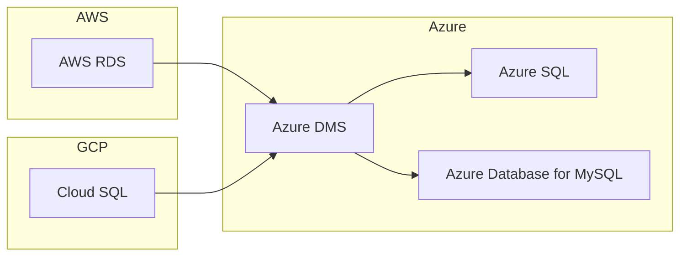

- Budget for source-cloud egress charges when moving large datasets.
- Align time zones, TLS policy, DNS, and certificate dependencies across clouds.
- Treat cross-cloud migration as both a security review and a data movement project.

---

## 7. Database Migration Testing & Validation

### 🔬 Validation pillars
| Pillar | Typical evidence | Owner |
|---|---|---|
| Data integrity | Row counts, checksums, sequence values | DBA |
| Performance | p50/p95 latency, throughput, wait analysis | DBA + SRE |
| Application testing | Smoke tests and user journey validation | App team |
| Operational readiness | Backups, alerts, dashboards, runbooks | Platform team |
| Rollback readiness | Defined trigger and reversal steps | Change lead |

- Do not treat a completed copy as a completed migration.
- Validate security principals and network restrictions after go-live.
- Benchmark both peak and batch-style workloads after the move.
- Hold the source until the rollback decision window closes.

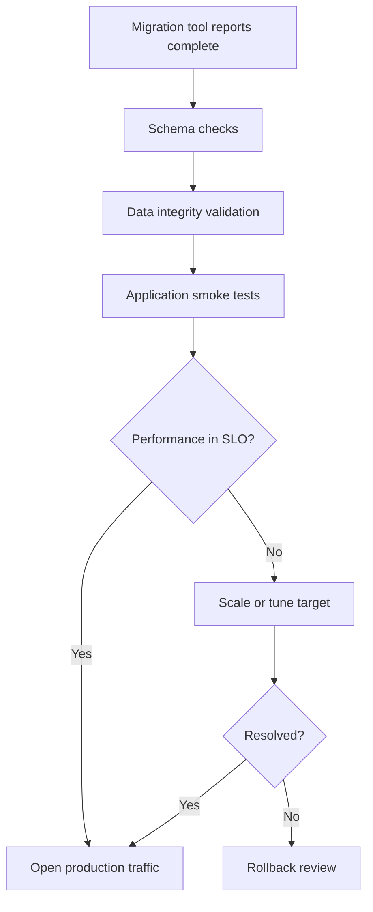

```sql
SELECT 'Orders' AS table_name, COUNT(*) AS row_count FROM dbo.Orders
UNION ALL
SELECT 'Customers', COUNT(*) FROM dbo.Customers;

SELECT TOP 10 wait_type, wait_time_ms
FROM sys.dm_db_wait_stats
ORDER BY wait_time_ms DESC;
```

| Transaction | Source p95 | Azure p95 | Status |
|---|---|---|---|
| Create order | 180 ms | 165 ms | Pass |
| Customer search | 240 ms | 210 ms | Pass |
| Daily inventory batch | 12 min | 14 min | Watch |
| Finance report | 9 min | 8 min | Pass |

### 🔁 Rollback plan
1. Define the rollback deadline before the first production write reaches the target.
2. Keep source access available in restricted or read-only mode.
3. Preserve old DNS or secret paths for emergency reversal.
4. Record the decision owner who can approve rollback or continue-forward.

---

## 8. Real-World Migration Scenarios (5+)

### Scenario 1: Migrate production SQL Server with <5 min downtime
#### Problem
3 TB production SQL Server with tight downtime target.

#### Plan
1. Run DMA and remediate blockers.
2. Seed the target with Azure DMS several days before cutover.
3. Use maintenance mode and final delta sync during the cutover bridge.

#### Commands
```bash
az dms project task show           --resource-group rg-sql-mig           --service-name dms-sql-prod-01           --project-name sqlserver-to-azuresql           --name assess-salesprod
az keyvault secret set --vault-name kv-prod-shared --name salesdb-connection-string --value "Server=tcp:azsql-sales-prod-01.database.windows.net,1433;Initial Catalog=salesdb;..."
```

#### Cutover
- T-30 min reduce TTL and verify lag.
- T-10 min stop writes and drain workers.
- T-0 rotate secret and restart only affected services.

#### Validation
- Order counts and checksums match.
- P95 latency is within target.
- Business owner signs off before closing change.

#### Mermaid diagram
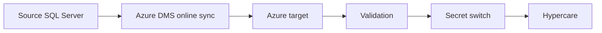

#### Operator reminders
- Capture timestamps for every live step.
- Record business sign-off before full reopen.
- Do not decommission the source until rollback expiry ends.

### Scenario 2: Migrate sharded MySQL cluster to Azure
#### Problem
Eight MySQL shards with tenant-based routing.

#### Plan
1. Move one tenant cohort at a time.
2. Seed target shards and maintain binlog sync.
3. Update shard-map service entries during each wave.

#### Commands
```bash
mysqldump --single-transaction tenant_shard_01 > tenant_shard_01.sql
mysql --host=mysql-shard-01.mysql.database.azure.com --user=mysqladmin --password tenant_shard_01 < tenant_shard_01.sql
mysql -h mysql01.corp.local -e "SHOW MASTER STATUS;"
```

#### Cutover
- Freeze a tenant cohort rather than the whole platform.
- Switch shard metadata and validate each cohort.

#### Validation
- Checkout and cart workflows pass per shard.
- Lag is zero before reopening writes.

#### Mermaid diagram
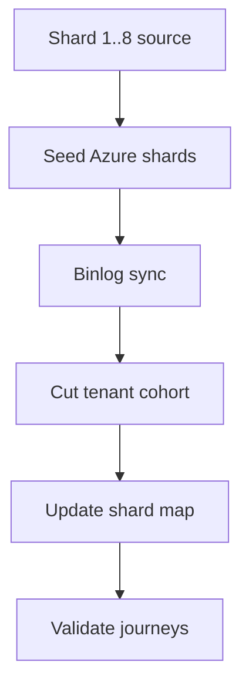

#### Operator reminders
- Capture timestamps for every live step.
- Record business sign-off before full reopen.
- Do not decommission the source until rollback expiry ends.

### Scenario 3: Migrate MongoDB to Cosmos DB
#### Problem
A product team wants managed global distribution with Mongo API compatibility.

#### Plan
1. Assess Cosmos DB for MongoDB API compatibility.
2. Pilot partition keys and RU sizing.
3. Migrate data and validate query/index behavior.

#### Commands
```bash
az cosmosdb create --name cosmos-mongo-prod-01 --resource-group rg-crosscloud --kind MongoDB --locations regionName=eastus failoverPriority=0 isZoneRedundant=True
mongodump --uri="mongodb://mongo01.corp.local:27017/appdb" --out=./mongo-export
mongorestore --uri="<cosmos-connection-string>" ./mongo-export/appdb
```

#### Cutover
- Switch secret to Cosmos DB endpoint.
- Monitor RU consumption and hot partitions.

#### Validation
- Critical APIs return expected documents.
- Indexes and RU usage remain within plan.

#### Mermaid diagram
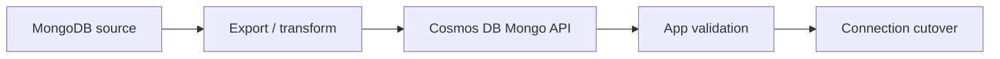

#### Operator reminders
- Capture timestamps for every live step.
- Record business sign-off before full reopen.
- Do not decommission the source until rollback expiry ends.

### Scenario 4: Database version upgrade during migration
#### Problem
PostgreSQL 11 is moving to Azure PostgreSQL 15.

#### Plan
1. Test extension and planner behavior in lower environments.
2. Run focused performance tests on critical queries.
3. Include analyze/tuning steps before opening traffic.

#### Commands
```bash
pg_dump --host=pg11.corp.local --username=pgmig --format=custom appdb > appdb-v11.dump
pg_restore --host=pgflex-prod-01.postgres.database.azure.com --username=pgadmin --dbname=postgres --create appdb-v11.dump
psql --host=pgflex-prod-01.postgres.database.azure.com --username=pgadmin --dbname=appdb -c "ANALYZE VERBOSE;"
```

#### Cutover
- Use a read-only window for final delta export.
- Open production only after query-plan checks are green.

#### Validation
- Extensions work as expected.
- Top business queries meet p95 targets.

#### Mermaid diagram
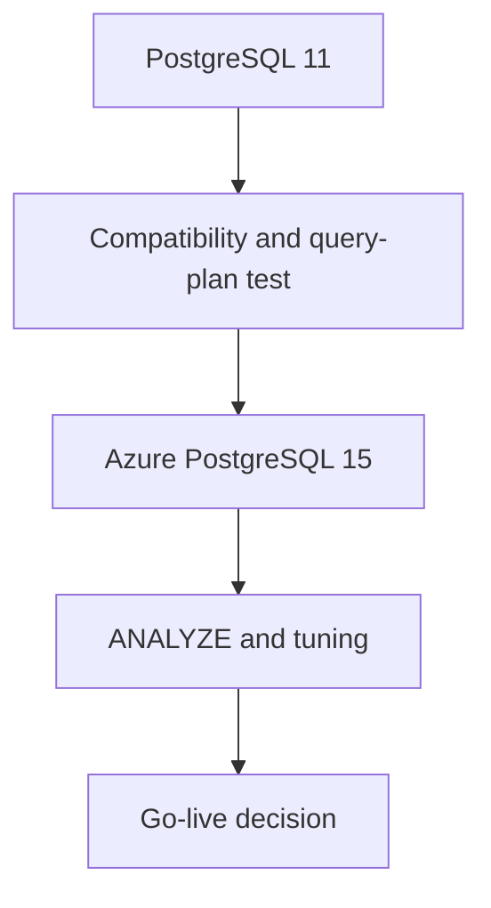

#### Operator reminders
- Capture timestamps for every live step.
- Record business sign-off before full reopen.
- Do not decommission the source until rollback expiry ends.

### Scenario 5: Multi-database application migration
#### Problem
One application depends on SQL Server, PostgreSQL, and Redis.

#### Plan
1. Treat the move as one application wave.
2. Migrate metadata store, OLTP store, then cache.
3. Use secret references and feature flags for each backend.

#### Commands
```bash
az keyvault secret set --vault-name kv-prod-shared --name metadata-db-url --value "postgres://..."
az keyvault secret set --vault-name kv-prod-shared --name orders-db-url --value "Server=tcp:..."
az webapp restart --resource-group rg-app-prod --name app-composite-prod
```

#### Cutover
- Switch metadata first, OLTP second, cache last.
- Flush and warm cache after authoritative stores are healthy.

#### Validation
- Full synthetic transaction passes across all backends.
- All jobs point to the new endpoints.

#### Mermaid diagram
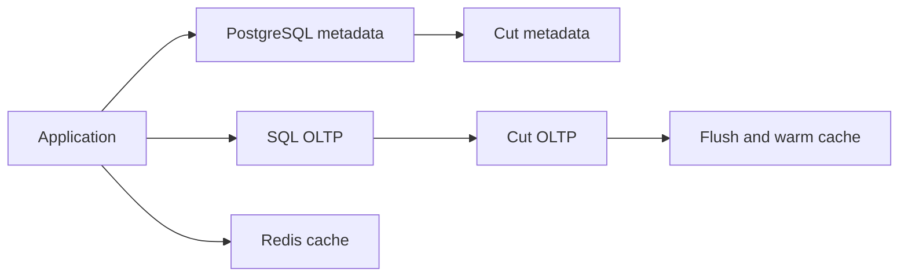

#### Operator reminders
- Capture timestamps for every live step.
- Record business sign-off before full reopen.
- Do not decommission the source until rollback expiry ends.

---

## Appendix A. Common Variables
```bash
export SUBSCRIPTION_ID=<subscription-id>
export LOCATION=eastus
export RG=rg-db-migration
export DMS_NAME=dms-prod-01
export KV_NAME=kv-prod-shared
export LAW_NAME=law-db-migration
```

## Appendix B. Troubleshooting Signals
| Signal | Likely meaning | Immediate action |
|---|---|---|
| Replication lag rising | Target cannot keep up | Scale target or extend sync time |
| Authentication failures | Secret or firewall mismatch | Validate secret path and firewall rules |
| Checksums match but app errors remain | Logic or query-plan issue | Run synthetic tests and review plans |
| Large table restore stalls | Throughput bottleneck | Use parallelism or larger target SKU |
| Connection pool exhaustion | App and target settings misaligned | Tune pool and max connections |
| Replication retention alarms | Online sync at risk | Increase retention or speed up catch-up |

## Appendix C. Migration Templates
1. T-7 days: finish rehearsal and track remaining blockers.
2. T-2 days: freeze schema changes and confirm approvals.
3. T-4 hours: validate target health and alerting.
4. T-30 min: reduce TTL and open the bridge call.
5. T-10 min: stop writes and confirm source state.
6. T+0: rotate endpoint and run smoke tests.
7. T+30 min: declare success or rollback.

## Appendix D. Quick FAQ
### Q: Should every migration use DMS?
No. Small, low-risk workloads can be safer with offline export/import.

### Q: When should I choose Managed Instance?
Choose it when cross-database or instance-level compatibility matters.

### Q: How many rehearsals are enough?
At least one technical rehearsal and one business-signoff rehearsal for critical production moves.

### Q: Can I combine upgrade and migration?
Yes, but treat it as a higher-risk event with extra testing.

### Q: What is the biggest hidden risk?
Undocumented reporting, jobs, ETL, or support tools that still point to the old endpoint.

### Q: What is the first post-go-live task?
Verify backups, alerts, and business transactions before celebrating.

## Appendix E. Cutover Micro-Checklists
### People
- [ ] Bridge lead assigned
- [ ] DBA assigned
- [ ] App owner assigned
- [ ] Network owner assigned
- [ ] Business approver available

### Platform
- [ ] Target healthy
- [ ] Backups enabled
- [ ] Alerts enabled
- [ ] Private DNS ready
- [ ] Firewall approved

### Data
- [ ] Schema deployed
- [ ] Reference data loaded
- [ ] Lag acceptable
- [ ] Validation scripts ready
- [ ] Rollback trigger documented

### Application
- [ ] Config prepared
- [ ] Feature flags prepared
- [ ] Synthetic tests ready
- [ ] Queue drain method ready
- [ ] Support desk briefed

## Appendix F. Detailed Migration Wave Playbooks
### SQL Server to Azure SQL Database
#### Discovery
- [ ] Confirm business owner and SLA for SQL Server to Azure SQL Database.
- [ ] Inventory source servers, ports, and identities for SQL Server to Azure SQL Database.
- [ ] List application dependencies touching SQL Server to Azure SQL Database.
- [ ] Capture daily write volume and peak windows for SQL Server to Azure SQL Database.
- [ ] Identify maintenance windows approved for SQL Server to Azure SQL Database.
- [ ] Record source engine version and patch state for SQL Server to Azure SQL Database.
- [ ] Document current backup and restore method for SQL Server to Azure SQL Database.
- [ ] Confirm security contacts and network approval path for SQL Server to Azure SQL Database.
- [ ] Capture current alerting gaps for SQL Server to Azure SQL Database.
- [ ] Identify reporting and ETL consumers of SQL Server to Azure SQL Database.
- [ ] List certificates, secrets, and DNS names related to SQL Server to Azure SQL Database.
- [ ] Record current cost center and service owner for SQL Server to Azure SQL Database.
- [ ] Create CAB/change record for SQL Server to Azure SQL Database with implementation window, rollback owner, and business approval attached.
- [ ] Tag pilot, wave, and business criticality for SQL Server to Azure SQL Database.

#### Assessment
- [ ] Run compatibility assessment for SQL Server to Azure SQL Database.
- [ ] Classify blockers as remediate now, redesign later, or accept risk for SQL Server to Azure SQL Database.
- [ ] Validate target sizing assumptions for SQL Server to Azure SQL Database.
- [ ] Benchmark top query families for SQL Server to Azure SQL Database.
- [ ] Check unsupported features or extensions for SQL Server to Azure SQL Database.
- [ ] Validate network throughput for SQL Server to Azure SQL Database.
- [ ] Confirm backup retention requirements for SQL Server to Azure SQL Database.
- [ ] Capture security and compliance constraints for SQL Server to Azure SQL Database.
- [ ] Review source authentication model for SQL Server to Azure SQL Database.
- [ ] Confirm collation, timezone, and locale behavior for SQL Server to Azure SQL Database.
- [ ] Review operational ownership after go-live for SQL Server to Azure SQL Database.
- [ ] Identify rollback deadline assumptions for SQL Server to Azure SQL Database.
- [ ] Document target DR posture for SQL Server to Azure SQL Database.
- [ ] Publish assessment summary to stakeholders for SQL Server to Azure SQL Database.

#### Design
- [ ] Choose offline or online strategy for SQL Server to Azure SQL Database.
- [ ] Design target naming, tags, and RBAC for SQL Server to Azure SQL Database.
- [ ] Design private endpoint and firewall rules for SQL Server to Azure SQL Database.
- [ ] Define secret rotation approach for SQL Server to Azure SQL Database.
- [ ] Create validation script list for SQL Server to Azure SQL Database.
- [ ] Define hypercare metrics and dashboard for SQL Server to Azure SQL Database.
- [ ] Document rollback sequence for SQL Server to Azure SQL Database.
- [ ] Design target backup and monitoring settings for SQL Server to Azure SQL Database.
- [ ] Plan synthetic tests for SQL Server to Azure SQL Database.
- [ ] Create communications plan for SQL Server to Azure SQL Database.
- [ ] Define source freeze window for SQL Server to Azure SQL Database.
- [ ] Plan capacity scale-up/scale-down actions for SQL Server to Azure SQL Database.
- [ ] Document source decommission guardrails for SQL Server to Azure SQL Database.
- [ ] Obtain design sign-off for SQL Server to Azure SQL Database.

#### Build
- [ ] Provision Azure target resources for SQL Server to Azure SQL Database.
- [ ] Enable logs and diagnostics for SQL Server to Azure SQL Database.
- [ ] Configure Key Vault or secret store path for SQL Server to Azure SQL Database.
- [ ] Create DMS project or native replication path for SQL Server to Azure SQL Database.
- [ ] Create migration service accounts for SQL Server to Azure SQL Database.
- [ ] Deploy schema or baseline structure for SQL Server to Azure SQL Database.
- [ ] Enable backup policies for SQL Server to Azure SQL Database.
- [ ] Enable action groups and alert rules for SQL Server to Azure SQL Database.
- [ ] Create runbook documents for SQL Server to Azure SQL Database.
- [ ] Validate DNS and network path for SQL Server to Azure SQL Database.
- [ ] Create pilot dashboards for SQL Server to Azure SQL Database.
- [ ] Prepare temporary scale settings for SQL Server to Azure SQL Database.
- [ ] Capture provisioning evidence for SQL Server to Azure SQL Database.
- [ ] Validate security review completion for SQL Server to Azure SQL Database.

#### Rehearsal
- [ ] Run rehearsal migration for SQL Server to Azure SQL Database.
- [ ] Measure full-load duration for SQL Server to Azure SQL Database.
- [ ] Measure delta-sync lag for SQL Server to Azure SQL Database.
- [ ] Test application smoke scripts for SQL Server to Azure SQL Database.
- [ ] Test operational dashboards for SQL Server to Azure SQL Database.
- [ ] Validate rollback steps for SQL Server to Azure SQL Database.
- [ ] Capture defects from rehearsal for SQL Server to Azure SQL Database.
- [ ] Retest remediated defects for SQL Server to Azure SQL Database.
- [ ] Update minute-by-minute timeline for SQL Server to Azure SQL Database.
- [ ] Confirm approver list for SQL Server to Azure SQL Database.
- [ ] Validate on-call coverage for SQL Server to Azure SQL Database.
- [ ] Validate support-desk briefing for SQL Server to Azure SQL Database.
- [ ] Review performance delta after rehearsal for SQL Server to Azure SQL Database.
- [ ] Obtain go/no-go readiness for SQL Server to Azure SQL Database.

#### Cutover
- [ ] Open bridge call for SQL Server to Azure SQL Database.
- [ ] Reduce DNS TTL for SQL Server to Azure SQL Database.
- [ ] Confirm source lag target for SQL Server to Azure SQL Database.
- [ ] Freeze source writes for SQL Server to Azure SQL Database.
- [ ] Apply final delta or import for SQL Server to Azure SQL Database.
- [ ] Run critical validation scripts for SQL Server to Azure SQL Database.
- [ ] Rotate connection secret for SQL Server to Azure SQL Database.
- [ ] Restart only required application services for SQL Server to Azure SQL Database.
- [ ] Run synthetic business tests for SQL Server to Azure SQL Database.
- [ ] Record time of business sign-off for SQL Server to Azure SQL Database.
- [ ] Publish status update for SQL Server to Azure SQL Database.
- [ ] Decide rollback or continue-forward for SQL Server to Azure SQL Database.
- [ ] Capture logs and screenshots for SQL Server to Azure SQL Database.
- [ ] Start hypercare watch for SQL Server to Azure SQL Database.

#### Hypercare
- [ ] Track p50, p95, and p99 latency for SQL Server to Azure SQL Database.
- [ ] Watch failed logins and firewall denies for SQL Server to Azure SQL Database.
- [ ] Confirm first successful backup for SQL Server to Azure SQL Database.
- [ ] Review slow-query or wait-stat trends for SQL Server to Azure SQL Database.
- [ ] Validate downstream jobs for SQL Server to Azure SQL Database.
- [ ] Check error budgets and support tickets for SQL Server to Azure SQL Database.
- [ ] Compare post-go-live costs for SQL Server to Azure SQL Database.
- [ ] Review autoscale or manual scale actions for SQL Server to Azure SQL Database.
- [ ] Validate DR settings for SQL Server to Azure SQL Database.
- [ ] Hold daily owner review for SQL Server to Azure SQL Database.
- [ ] Record lessons learned for SQL Server to Azure SQL Database.
- [ ] Confirm rollback expiry passed for SQL Server to Azure SQL Database.
- [ ] Approve source decommission plan for SQL Server to Azure SQL Database.
- [ ] Close hypercare for SQL Server to Azure SQL Database.

#### Decommission
- [ ] Confirm rollback window has closed for SQL Server to Azure SQL Database.
- [ ] Take final archival backup for SQL Server to Azure SQL Database.
- [ ] Export final evidence pack for SQL Server to Azure SQL Database.
- [ ] Retire legacy monitoring for SQL Server to Azure SQL Database.
- [ ] Remove obsolete firewall rules for SQL Server to Azure SQL Database.
- [ ] Remove old DNS aliases for SQL Server to Azure SQL Database.
- [ ] Delete temporary migration accounts for SQL Server to Azure SQL Database.
- [ ] Update CMDB and ownership records for SQL Server to Azure SQL Database.
- [ ] Update cost allocation for SQL Server to Azure SQL Database.
- [ ] Schedule old server shutdown for SQL Server to Azure SQL Database.
- [ ] Record decommission approval for SQL Server to Azure SQL Database.
- [ ] Confirm license recovery actions for SQL Server to Azure SQL Database.
- [ ] Archive migration documents for SQL Server to Azure SQL Database.
- [ ] Close project wave for SQL Server to Azure SQL Database.

### MySQL to Azure Database for MySQL
#### Discovery
- [ ] Confirm business owner and SLA for MySQL to Azure Database for MySQL.
- [ ] Inventory source servers, ports, and identities for MySQL to Azure Database for MySQL.
- [ ] List application dependencies touching MySQL to Azure Database for MySQL.
- [ ] Capture daily write volume and peak windows for MySQL to Azure Database for MySQL.
- [ ] Identify maintenance windows approved for MySQL to Azure Database for MySQL.
- [ ] Record source engine version and patch state for MySQL to Azure Database for MySQL.
- [ ] Document current backup and restore method for MySQL to Azure Database for MySQL.
- [ ] Confirm security contacts and network approval path for MySQL to Azure Database for MySQL.
- [ ] Capture current alerting gaps for MySQL to Azure Database for MySQL.
- [ ] Identify reporting and ETL consumers of MySQL to Azure Database for MySQL.
- [ ] List certificates, secrets, and DNS names related to MySQL to Azure Database for MySQL.
- [ ] Record current cost center and service owner for MySQL to Azure Database for MySQL.
- [ ] Create CAB/change record for MySQL to Azure Database for MySQL with implementation window, rollback owner, and business approval attached.
- [ ] Tag pilot, wave, and business criticality for MySQL to Azure Database for MySQL.

#### Assessment
- [ ] Run compatibility assessment for MySQL to Azure Database for MySQL.
- [ ] Classify blockers as remediate now, redesign later, or accept risk for MySQL to Azure Database for MySQL.
- [ ] Validate target sizing assumptions for MySQL to Azure Database for MySQL.
- [ ] Benchmark top query families for MySQL to Azure Database for MySQL.
- [ ] Check unsupported features or extensions for MySQL to Azure Database for MySQL.
- [ ] Validate network throughput for MySQL to Azure Database for MySQL.
- [ ] Confirm backup retention requirements for MySQL to Azure Database for MySQL.
- [ ] Capture security and compliance constraints for MySQL to Azure Database for MySQL.
- [ ] Review source authentication model for MySQL to Azure Database for MySQL.
- [ ] Confirm collation, timezone, and locale behavior for MySQL to Azure Database for MySQL.
- [ ] Review operational ownership after go-live for MySQL to Azure Database for MySQL.
- [ ] Identify rollback deadline assumptions for MySQL to Azure Database for MySQL.
- [ ] Document target DR posture for MySQL to Azure Database for MySQL.
- [ ] Publish assessment summary to stakeholders for MySQL to Azure Database for MySQL.

#### Design
- [ ] Choose offline or online strategy for MySQL to Azure Database for MySQL.
- [ ] Design target naming, tags, and RBAC for MySQL to Azure Database for MySQL.
- [ ] Design private endpoint and firewall rules for MySQL to Azure Database for MySQL.
- [ ] Define secret rotation approach for MySQL to Azure Database for MySQL.
- [ ] Create validation script list for MySQL to Azure Database for MySQL.
- [ ] Define hypercare metrics and dashboard for MySQL to Azure Database for MySQL.
- [ ] Document rollback sequence for MySQL to Azure Database for MySQL.
- [ ] Design target backup and monitoring settings for MySQL to Azure Database for MySQL.
- [ ] Plan synthetic tests for MySQL to Azure Database for MySQL.
- [ ] Create communications plan for MySQL to Azure Database for MySQL.
- [ ] Define source freeze window for MySQL to Azure Database for MySQL.
- [ ] Plan capacity scale-up/scale-down actions for MySQL to Azure Database for MySQL.
- [ ] Document source decommission guardrails for MySQL to Azure Database for MySQL.
- [ ] Obtain design sign-off for MySQL to Azure Database for MySQL.

#### Build
- [ ] Provision Azure target resources for MySQL to Azure Database for MySQL.
- [ ] Enable logs and diagnostics for MySQL to Azure Database for MySQL.
- [ ] Configure Key Vault or secret store path for MySQL to Azure Database for MySQL.
- [ ] Create DMS project or native replication path for MySQL to Azure Database for MySQL.
- [ ] Create migration service accounts for MySQL to Azure Database for MySQL.
- [ ] Deploy schema or baseline structure for MySQL to Azure Database for MySQL.
- [ ] Enable backup policies for MySQL to Azure Database for MySQL.
- [ ] Enable action groups and alert rules for MySQL to Azure Database for MySQL.
- [ ] Create runbook documents for MySQL to Azure Database for MySQL.
- [ ] Validate DNS and network path for MySQL to Azure Database for MySQL.
- [ ] Create pilot dashboards for MySQL to Azure Database for MySQL.
- [ ] Prepare temporary scale settings for MySQL to Azure Database for MySQL.
- [ ] Capture provisioning evidence for MySQL to Azure Database for MySQL.
- [ ] Validate security review completion for MySQL to Azure Database for MySQL.

#### Rehearsal
- [ ] Run rehearsal migration for MySQL to Azure Database for MySQL.
- [ ] Measure full-load duration for MySQL to Azure Database for MySQL.
- [ ] Measure delta-sync lag for MySQL to Azure Database for MySQL.
- [ ] Test application smoke scripts for MySQL to Azure Database for MySQL.
- [ ] Test operational dashboards for MySQL to Azure Database for MySQL.
- [ ] Validate rollback steps for MySQL to Azure Database for MySQL.
- [ ] Capture defects from rehearsal for MySQL to Azure Database for MySQL.
- [ ] Retest remediated defects for MySQL to Azure Database for MySQL.
- [ ] Update minute-by-minute timeline for MySQL to Azure Database for MySQL.
- [ ] Confirm approver list for MySQL to Azure Database for MySQL.
- [ ] Validate on-call coverage for MySQL to Azure Database for MySQL.
- [ ] Validate support-desk briefing for MySQL to Azure Database for MySQL.
- [ ] Review performance delta after rehearsal for MySQL to Azure Database for MySQL.
- [ ] Obtain go/no-go readiness for MySQL to Azure Database for MySQL.

#### Cutover
- [ ] Open bridge call for MySQL to Azure Database for MySQL.
- [ ] Reduce DNS TTL for MySQL to Azure Database for MySQL.
- [ ] Confirm source lag target for MySQL to Azure Database for MySQL.
- [ ] Freeze source writes for MySQL to Azure Database for MySQL.
- [ ] Apply final delta or import for MySQL to Azure Database for MySQL.
- [ ] Run critical validation scripts for MySQL to Azure Database for MySQL.
- [ ] Rotate connection secret for MySQL to Azure Database for MySQL.
- [ ] Restart only required application services for MySQL to Azure Database for MySQL.
- [ ] Run synthetic business tests for MySQL to Azure Database for MySQL.
- [ ] Record time of business sign-off for MySQL to Azure Database for MySQL.
- [ ] Publish status update for MySQL to Azure Database for MySQL.
- [ ] Decide rollback or continue-forward for MySQL to Azure Database for MySQL.
- [ ] Capture logs and screenshots for MySQL to Azure Database for MySQL.
- [ ] Start hypercare watch for MySQL to Azure Database for MySQL.

#### Hypercare
- [ ] Track p50, p95, and p99 latency for MySQL to Azure Database for MySQL.
- [ ] Watch failed logins and firewall denies for MySQL to Azure Database for MySQL.
- [ ] Confirm first successful backup for MySQL to Azure Database for MySQL.
- [ ] Review slow-query or wait-stat trends for MySQL to Azure Database for MySQL.
- [ ] Validate downstream jobs for MySQL to Azure Database for MySQL.
- [ ] Check error budgets and support tickets for MySQL to Azure Database for MySQL.
- [ ] Compare post-go-live costs for MySQL to Azure Database for MySQL.
- [ ] Review autoscale or manual scale actions for MySQL to Azure Database for MySQL.
- [ ] Validate DR settings for MySQL to Azure Database for MySQL.
- [ ] Hold daily owner review for MySQL to Azure Database for MySQL.
- [ ] Record lessons learned for MySQL to Azure Database for MySQL.
- [ ] Confirm rollback expiry passed for MySQL to Azure Database for MySQL.
- [ ] Approve source decommission plan for MySQL to Azure Database for MySQL.
- [ ] Close hypercare for MySQL to Azure Database for MySQL.

#### Decommission
- [ ] Confirm rollback window has closed for MySQL to Azure Database for MySQL.
- [ ] Take final archival backup for MySQL to Azure Database for MySQL.
- [ ] Export final evidence pack for MySQL to Azure Database for MySQL.
- [ ] Retire legacy monitoring for MySQL to Azure Database for MySQL.
- [ ] Remove obsolete firewall rules for MySQL to Azure Database for MySQL.
- [ ] Remove old DNS aliases for MySQL to Azure Database for MySQL.
- [ ] Delete temporary migration accounts for MySQL to Azure Database for MySQL.
- [ ] Update CMDB and ownership records for MySQL to Azure Database for MySQL.
- [ ] Update cost allocation for MySQL to Azure Database for MySQL.
- [ ] Schedule old server shutdown for MySQL to Azure Database for MySQL.
- [ ] Record decommission approval for MySQL to Azure Database for MySQL.
- [ ] Confirm license recovery actions for MySQL to Azure Database for MySQL.
- [ ] Archive migration documents for MySQL to Azure Database for MySQL.
- [ ] Close project wave for MySQL to Azure Database for MySQL.

### PostgreSQL to Azure Database for PostgreSQL
#### Discovery
- [ ] Confirm business owner and SLA for PostgreSQL to Azure Database for PostgreSQL.
- [ ] Inventory source servers, ports, and identities for PostgreSQL to Azure Database for PostgreSQL.
- [ ] List application dependencies touching PostgreSQL to Azure Database for PostgreSQL.
- [ ] Capture daily write volume and peak windows for PostgreSQL to Azure Database for PostgreSQL.
- [ ] Identify maintenance windows approved for PostgreSQL to Azure Database for PostgreSQL.
- [ ] Record source engine version and patch state for PostgreSQL to Azure Database for PostgreSQL.
- [ ] Document current backup and restore method for PostgreSQL to Azure Database for PostgreSQL.
- [ ] Confirm security contacts and network approval path for PostgreSQL to Azure Database for PostgreSQL.
- [ ] Capture current alerting gaps for PostgreSQL to Azure Database for PostgreSQL.
- [ ] Identify reporting and ETL consumers of PostgreSQL to Azure Database for PostgreSQL.
- [ ] List certificates, secrets, and DNS names related to PostgreSQL to Azure Database for PostgreSQL.
- [ ] Record current cost center and service owner for PostgreSQL to Azure Database for PostgreSQL.
- [ ] Create CAB/change record for PostgreSQL to Azure Database for PostgreSQL with implementation window, rollback owner, and business approval attached.
- [ ] Tag pilot, wave, and business criticality for PostgreSQL to Azure Database for PostgreSQL.

#### Assessment
- [ ] Run compatibility assessment for PostgreSQL to Azure Database for PostgreSQL.
- [ ] Classify blockers as remediate now, redesign later, or accept risk for PostgreSQL to Azure Database for PostgreSQL.
- [ ] Validate target sizing assumptions for PostgreSQL to Azure Database for PostgreSQL.
- [ ] Benchmark top query families for PostgreSQL to Azure Database for PostgreSQL.
- [ ] Check unsupported features or extensions for PostgreSQL to Azure Database for PostgreSQL.
- [ ] Validate network throughput for PostgreSQL to Azure Database for PostgreSQL.
- [ ] Confirm backup retention requirements for PostgreSQL to Azure Database for PostgreSQL.
- [ ] Capture security and compliance constraints for PostgreSQL to Azure Database for PostgreSQL.
- [ ] Review source authentication model for PostgreSQL to Azure Database for PostgreSQL.
- [ ] Confirm collation, timezone, and locale behavior for PostgreSQL to Azure Database for PostgreSQL.
- [ ] Review operational ownership after go-live for PostgreSQL to Azure Database for PostgreSQL.
- [ ] Identify rollback deadline assumptions for PostgreSQL to Azure Database for PostgreSQL.
- [ ] Document target DR posture for PostgreSQL to Azure Database for PostgreSQL.
- [ ] Publish assessment summary to stakeholders for PostgreSQL to Azure Database for PostgreSQL.

#### Design
- [ ] Choose offline or online strategy for PostgreSQL to Azure Database for PostgreSQL.
- [ ] Design target naming, tags, and RBAC for PostgreSQL to Azure Database for PostgreSQL.
- [ ] Design private endpoint and firewall rules for PostgreSQL to Azure Database for PostgreSQL.
- [ ] Define secret rotation approach for PostgreSQL to Azure Database for PostgreSQL.
- [ ] Create validation script list for PostgreSQL to Azure Database for PostgreSQL.
- [ ] Define hypercare metrics and dashboard for PostgreSQL to Azure Database for PostgreSQL.
- [ ] Document rollback sequence for PostgreSQL to Azure Database for PostgreSQL.
- [ ] Design target backup and monitoring settings for PostgreSQL to Azure Database for PostgreSQL.
- [ ] Plan synthetic tests for PostgreSQL to Azure Database for PostgreSQL.
- [ ] Create communications plan for PostgreSQL to Azure Database for PostgreSQL.
- [ ] Define source freeze window for PostgreSQL to Azure Database for PostgreSQL.
- [ ] Plan capacity scale-up/scale-down actions for PostgreSQL to Azure Database for PostgreSQL.
- [ ] Document source decommission guardrails for PostgreSQL to Azure Database for PostgreSQL.
- [ ] Obtain design sign-off for PostgreSQL to Azure Database for PostgreSQL.

#### Build
- [ ] Provision Azure target resources for PostgreSQL to Azure Database for PostgreSQL.
- [ ] Enable logs and diagnostics for PostgreSQL to Azure Database for PostgreSQL.
- [ ] Configure Key Vault or secret store path for PostgreSQL to Azure Database for PostgreSQL.
- [ ] Create DMS project or native replication path for PostgreSQL to Azure Database for PostgreSQL.
- [ ] Create migration service accounts for PostgreSQL to Azure Database for PostgreSQL.
- [ ] Deploy schema or baseline structure for PostgreSQL to Azure Database for PostgreSQL.
- [ ] Enable backup policies for PostgreSQL to Azure Database for PostgreSQL.
- [ ] Enable action groups and alert rules for PostgreSQL to Azure Database for PostgreSQL.
- [ ] Create runbook documents for PostgreSQL to Azure Database for PostgreSQL.
- [ ] Validate DNS and network path for PostgreSQL to Azure Database for PostgreSQL.
- [ ] Create pilot dashboards for PostgreSQL to Azure Database for PostgreSQL.
- [ ] Prepare temporary scale settings for PostgreSQL to Azure Database for PostgreSQL.
- [ ] Capture provisioning evidence for PostgreSQL to Azure Database for PostgreSQL.
- [ ] Validate security review completion for PostgreSQL to Azure Database for PostgreSQL.

#### Rehearsal
- [ ] Run rehearsal migration for PostgreSQL to Azure Database for PostgreSQL.
- [ ] Measure full-load duration for PostgreSQL to Azure Database for PostgreSQL.
- [ ] Measure delta-sync lag for PostgreSQL to Azure Database for PostgreSQL.
- [ ] Test application smoke scripts for PostgreSQL to Azure Database for PostgreSQL.
- [ ] Test operational dashboards for PostgreSQL to Azure Database for PostgreSQL.
- [ ] Validate rollback steps for PostgreSQL to Azure Database for PostgreSQL.
- [ ] Capture defects from rehearsal for PostgreSQL to Azure Database for PostgreSQL.
- [ ] Retest remediated defects for PostgreSQL to Azure Database for PostgreSQL.
- [ ] Update minute-by-minute timeline for PostgreSQL to Azure Database for PostgreSQL.
- [ ] Confirm approver list for PostgreSQL to Azure Database for PostgreSQL.
- [ ] Validate on-call coverage for PostgreSQL to Azure Database for PostgreSQL.
- [ ] Validate support-desk briefing for PostgreSQL to Azure Database for PostgreSQL.
- [ ] Review performance delta after rehearsal for PostgreSQL to Azure Database for PostgreSQL.
- [ ] Obtain go/no-go readiness for PostgreSQL to Azure Database for PostgreSQL.

#### Cutover
- [ ] Open bridge call for PostgreSQL to Azure Database for PostgreSQL.
- [ ] Reduce DNS TTL for PostgreSQL to Azure Database for PostgreSQL.
- [ ] Confirm source lag target for PostgreSQL to Azure Database for PostgreSQL.
- [ ] Freeze source writes for PostgreSQL to Azure Database for PostgreSQL.
- [ ] Apply final delta or import for PostgreSQL to Azure Database for PostgreSQL.
- [ ] Run critical validation scripts for PostgreSQL to Azure Database for PostgreSQL.
- [ ] Rotate connection secret for PostgreSQL to Azure Database for PostgreSQL.
- [ ] Restart only required application services for PostgreSQL to Azure Database for PostgreSQL.
- [ ] Run synthetic business tests for PostgreSQL to Azure Database for PostgreSQL.
- [ ] Record time of business sign-off for PostgreSQL to Azure Database for PostgreSQL.
- [ ] Publish status update for PostgreSQL to Azure Database for PostgreSQL.
- [ ] Decide rollback or continue-forward for PostgreSQL to Azure Database for PostgreSQL.
- [ ] Capture logs and screenshots for PostgreSQL to Azure Database for PostgreSQL.
- [ ] Start hypercare watch for PostgreSQL to Azure Database for PostgreSQL.

#### Hypercare
- [ ] Track p50, p95, and p99 latency for PostgreSQL to Azure Database for PostgreSQL.
- [ ] Watch failed logins and firewall denies for PostgreSQL to Azure Database for PostgreSQL.
- [ ] Confirm first successful backup for PostgreSQL to Azure Database for PostgreSQL.
- [ ] Review slow-query or wait-stat trends for PostgreSQL to Azure Database for PostgreSQL.
- [ ] Validate downstream jobs for PostgreSQL to Azure Database for PostgreSQL.
- [ ] Check error budgets and support tickets for PostgreSQL to Azure Database for PostgreSQL.
- [ ] Compare post-go-live costs for PostgreSQL to Azure Database for PostgreSQL.
- [ ] Review autoscale or manual scale actions for PostgreSQL to Azure Database for PostgreSQL.
- [ ] Validate DR settings for PostgreSQL to Azure Database for PostgreSQL.
- [ ] Hold daily owner review for PostgreSQL to Azure Database for PostgreSQL.
- [ ] Record lessons learned for PostgreSQL to Azure Database for PostgreSQL.
- [ ] Confirm rollback expiry passed for PostgreSQL to Azure Database for PostgreSQL.
- [ ] Approve source decommission plan for PostgreSQL to Azure Database for PostgreSQL.
- [ ] Close hypercare for PostgreSQL to Azure Database for PostgreSQL.

#### Decommission
- [ ] Confirm rollback window has closed for PostgreSQL to Azure Database for PostgreSQL.
- [ ] Take final archival backup for PostgreSQL to Azure Database for PostgreSQL.
- [ ] Export final evidence pack for PostgreSQL to Azure Database for PostgreSQL.
- [ ] Retire legacy monitoring for PostgreSQL to Azure Database for PostgreSQL.
- [ ] Remove obsolete firewall rules for PostgreSQL to Azure Database for PostgreSQL.
- [ ] Remove old DNS aliases for PostgreSQL to Azure Database for PostgreSQL.
- [ ] Delete temporary migration accounts for PostgreSQL to Azure Database for PostgreSQL.
- [ ] Update CMDB and ownership records for PostgreSQL to Azure Database for PostgreSQL.
- [ ] Update cost allocation for PostgreSQL to Azure Database for PostgreSQL.
- [ ] Schedule old server shutdown for PostgreSQL to Azure Database for PostgreSQL.
- [ ] Record decommission approval for PostgreSQL to Azure Database for PostgreSQL.
- [ ] Confirm license recovery actions for PostgreSQL to Azure Database for PostgreSQL.
- [ ] Archive migration documents for PostgreSQL to Azure Database for PostgreSQL.
- [ ] Close project wave for PostgreSQL to Azure Database for PostgreSQL.

### Azure SQL to Managed Instance
#### Discovery
- [ ] Confirm business owner and SLA for Azure SQL to Managed Instance.
- [ ] Inventory source servers, ports, and identities for Azure SQL to Managed Instance.
- [ ] List application dependencies touching Azure SQL to Managed Instance.
- [ ] Capture daily write volume and peak windows for Azure SQL to Managed Instance.
- [ ] Identify maintenance windows approved for Azure SQL to Managed Instance.
- [ ] Record source engine version and patch state for Azure SQL to Managed Instance.
- [ ] Document current backup and restore method for Azure SQL to Managed Instance.
- [ ] Confirm security contacts and network approval path for Azure SQL to Managed Instance.
- [ ] Capture current alerting gaps for Azure SQL to Managed Instance.
- [ ] Identify reporting and ETL consumers of Azure SQL to Managed Instance.
- [ ] List certificates, secrets, and DNS names related to Azure SQL to Managed Instance.
- [ ] Record current cost center and service owner for Azure SQL to Managed Instance.
- [ ] Create CAB/change record for Azure SQL to Managed Instance with implementation window, rollback owner, and business approval attached.
- [ ] Tag pilot, wave, and business criticality for Azure SQL to Managed Instance.

#### Assessment
- [ ] Run compatibility assessment for Azure SQL to Managed Instance.
- [ ] Classify blockers as remediate now, redesign later, or accept risk for Azure SQL to Managed Instance.
- [ ] Validate target sizing assumptions for Azure SQL to Managed Instance.
- [ ] Benchmark top query families for Azure SQL to Managed Instance.
- [ ] Check unsupported features or extensions for Azure SQL to Managed Instance.
- [ ] Validate network throughput for Azure SQL to Managed Instance.
- [ ] Confirm backup retention requirements for Azure SQL to Managed Instance.
- [ ] Capture security and compliance constraints for Azure SQL to Managed Instance.
- [ ] Review source authentication model for Azure SQL to Managed Instance.
- [ ] Confirm collation, timezone, and locale behavior for Azure SQL to Managed Instance.
- [ ] Review operational ownership after go-live for Azure SQL to Managed Instance.
- [ ] Identify rollback deadline assumptions for Azure SQL to Managed Instance.
- [ ] Document target DR posture for Azure SQL to Managed Instance.
- [ ] Publish assessment summary to stakeholders for Azure SQL to Managed Instance.

#### Design
- [ ] Choose offline or online strategy for Azure SQL to Managed Instance.
- [ ] Design target naming, tags, and RBAC for Azure SQL to Managed Instance.
- [ ] Design private endpoint and firewall rules for Azure SQL to Managed Instance.
- [ ] Define secret rotation approach for Azure SQL to Managed Instance.
- [ ] Create validation script list for Azure SQL to Managed Instance.
- [ ] Define hypercare metrics and dashboard for Azure SQL to Managed Instance.
- [ ] Document rollback sequence for Azure SQL to Managed Instance.
- [ ] Design target backup and monitoring settings for Azure SQL to Managed Instance.
- [ ] Plan synthetic tests for Azure SQL to Managed Instance.
- [ ] Create communications plan for Azure SQL to Managed Instance.
- [ ] Define source freeze window for Azure SQL to Managed Instance.
- [ ] Plan capacity scale-up/scale-down actions for Azure SQL to Managed Instance.
- [ ] Document source decommission guardrails for Azure SQL to Managed Instance.
- [ ] Obtain design sign-off for Azure SQL to Managed Instance.

#### Build
- [ ] Provision Azure target resources for Azure SQL to Managed Instance.
- [ ] Enable logs and diagnostics for Azure SQL to Managed Instance.
- [ ] Configure Key Vault or secret store path for Azure SQL to Managed Instance.
- [ ] Create DMS project or native replication path for Azure SQL to Managed Instance.
- [ ] Create migration service accounts for Azure SQL to Managed Instance.
- [ ] Deploy schema or baseline structure for Azure SQL to Managed Instance.
- [ ] Enable backup policies for Azure SQL to Managed Instance.
- [ ] Enable action groups and alert rules for Azure SQL to Managed Instance.
- [ ] Create runbook documents for Azure SQL to Managed Instance.
- [ ] Validate DNS and network path for Azure SQL to Managed Instance.
- [ ] Create pilot dashboards for Azure SQL to Managed Instance.
- [ ] Prepare temporary scale settings for Azure SQL to Managed Instance.
- [ ] Capture provisioning evidence for Azure SQL to Managed Instance.
- [ ] Validate security review completion for Azure SQL to Managed Instance.

#### Rehearsal
- [ ] Run rehearsal migration for Azure SQL to Managed Instance.
- [ ] Measure full-load duration for Azure SQL to Managed Instance.
- [ ] Measure delta-sync lag for Azure SQL to Managed Instance.
- [ ] Test application smoke scripts for Azure SQL to Managed Instance.
- [ ] Test operational dashboards for Azure SQL to Managed Instance.
- [ ] Validate rollback steps for Azure SQL to Managed Instance.
- [ ] Capture defects from rehearsal for Azure SQL to Managed Instance.
- [ ] Retest remediated defects for Azure SQL to Managed Instance.
- [ ] Update minute-by-minute timeline for Azure SQL to Managed Instance.
- [ ] Confirm approver list for Azure SQL to Managed Instance.
- [ ] Validate on-call coverage for Azure SQL to Managed Instance.
- [ ] Validate support-desk briefing for Azure SQL to Managed Instance.
- [ ] Review performance delta after rehearsal for Azure SQL to Managed Instance.
- [ ] Obtain go/no-go readiness for Azure SQL to Managed Instance.

#### Cutover
- [ ] Open bridge call for Azure SQL to Managed Instance.
- [ ] Reduce DNS TTL for Azure SQL to Managed Instance.
- [ ] Confirm source lag target for Azure SQL to Managed Instance.
- [ ] Freeze source writes for Azure SQL to Managed Instance.
- [ ] Apply final delta or import for Azure SQL to Managed Instance.
- [ ] Run critical validation scripts for Azure SQL to Managed Instance.
- [ ] Rotate connection secret for Azure SQL to Managed Instance.
- [ ] Restart only required application services for Azure SQL to Managed Instance.
- [ ] Run synthetic business tests for Azure SQL to Managed Instance.
- [ ] Record time of business sign-off for Azure SQL to Managed Instance.
- [ ] Publish status update for Azure SQL to Managed Instance.
- [ ] Decide rollback or continue-forward for Azure SQL to Managed Instance.
- [ ] Capture logs and screenshots for Azure SQL to Managed Instance.
- [ ] Start hypercare watch for Azure SQL to Managed Instance.

#### Hypercare
- [ ] Track p50, p95, and p99 latency for Azure SQL to Managed Instance.
- [ ] Watch failed logins and firewall denies for Azure SQL to Managed Instance.
- [ ] Confirm first successful backup for Azure SQL to Managed Instance.
- [ ] Review slow-query or wait-stat trends for Azure SQL to Managed Instance.
- [ ] Validate downstream jobs for Azure SQL to Managed Instance.
- [ ] Check error budgets and support tickets for Azure SQL to Managed Instance.
- [ ] Compare post-go-live costs for Azure SQL to Managed Instance.
- [ ] Review autoscale or manual scale actions for Azure SQL to Managed Instance.
- [ ] Validate DR settings for Azure SQL to Managed Instance.
- [ ] Hold daily owner review for Azure SQL to Managed Instance.
- [ ] Record lessons learned for Azure SQL to Managed Instance.
- [ ] Confirm rollback expiry passed for Azure SQL to Managed Instance.
- [ ] Approve source decommission plan for Azure SQL to Managed Instance.
- [ ] Close hypercare for Azure SQL to Managed Instance.

#### Decommission
- [ ] Confirm rollback window has closed for Azure SQL to Managed Instance.
- [ ] Take final archival backup for Azure SQL to Managed Instance.
- [ ] Export final evidence pack for Azure SQL to Managed Instance.
- [ ] Retire legacy monitoring for Azure SQL to Managed Instance.
- [ ] Remove obsolete firewall rules for Azure SQL to Managed Instance.
- [ ] Remove old DNS aliases for Azure SQL to Managed Instance.
- [ ] Delete temporary migration accounts for Azure SQL to Managed Instance.
- [ ] Update CMDB and ownership records for Azure SQL to Managed Instance.
- [ ] Update cost allocation for Azure SQL to Managed Instance.
- [ ] Schedule old server shutdown for Azure SQL to Managed Instance.
- [ ] Record decommission approval for Azure SQL to Managed Instance.
- [ ] Confirm license recovery actions for Azure SQL to Managed Instance.
- [ ] Archive migration documents for Azure SQL to Managed Instance.
- [ ] Close project wave for Azure SQL to Managed Instance.

### Cross-cloud database migration
#### Discovery
- [ ] Confirm business owner and SLA for Cross-cloud database migration.
- [ ] Inventory source servers, ports, and identities for Cross-cloud database migration.
- [ ] List application dependencies touching Cross-cloud database migration.
- [ ] Capture daily write volume and peak windows for Cross-cloud database migration.
- [ ] Identify maintenance windows approved for Cross-cloud database migration.
- [ ] Record source engine version and patch state for Cross-cloud database migration.
- [ ] Document current backup and restore method for Cross-cloud database migration.
- [ ] Confirm security contacts and network approval path for Cross-cloud database migration.
- [ ] Capture current alerting gaps for Cross-cloud database migration.
- [ ] Identify reporting and ETL consumers of Cross-cloud database migration.
- [ ] List certificates, secrets, and DNS names related to Cross-cloud database migration.
- [ ] Record current cost center and service owner for Cross-cloud database migration.
- [ ] Create CAB/change record for Cross-cloud database migration with implementation window, rollback owner, and business approval attached.
- [ ] Tag pilot, wave, and business criticality for Cross-cloud database migration.

#### Assessment
- [ ] Run compatibility assessment for Cross-cloud database migration.
- [ ] Classify blockers as remediate now, redesign later, or accept risk for Cross-cloud database migration.
- [ ] Validate target sizing assumptions for Cross-cloud database migration.
- [ ] Benchmark top query families for Cross-cloud database migration.
- [ ] Check unsupported features or extensions for Cross-cloud database migration.
- [ ] Validate network throughput for Cross-cloud database migration.
- [ ] Confirm backup retention requirements for Cross-cloud database migration.
- [ ] Capture security and compliance constraints for Cross-cloud database migration.
- [ ] Review source authentication model for Cross-cloud database migration.
- [ ] Confirm collation, timezone, and locale behavior for Cross-cloud database migration.
- [ ] Review operational ownership after go-live for Cross-cloud database migration.
- [ ] Identify rollback deadline assumptions for Cross-cloud database migration.
- [ ] Document target DR posture for Cross-cloud database migration.
- [ ] Publish assessment summary to stakeholders for Cross-cloud database migration.

#### Design
- [ ] Choose offline or online strategy for Cross-cloud database migration.
- [ ] Design target naming, tags, and RBAC for Cross-cloud database migration.
- [ ] Design private endpoint and firewall rules for Cross-cloud database migration.
- [ ] Define secret rotation approach for Cross-cloud database migration.
- [ ] Create validation script list for Cross-cloud database migration.
- [ ] Define hypercare metrics and dashboard for Cross-cloud database migration.
- [ ] Document rollback sequence for Cross-cloud database migration.
- [ ] Design target backup and monitoring settings for Cross-cloud database migration.
- [ ] Plan synthetic tests for Cross-cloud database migration.
- [ ] Create communications plan for Cross-cloud database migration.
- [ ] Define source freeze window for Cross-cloud database migration.
- [ ] Plan capacity scale-up/scale-down actions for Cross-cloud database migration.
- [ ] Document source decommission guardrails for Cross-cloud database migration.
- [ ] Obtain design sign-off for Cross-cloud database migration.

#### Build
- [ ] Provision Azure target resources for Cross-cloud database migration.
- [ ] Enable logs and diagnostics for Cross-cloud database migration.
- [ ] Configure Key Vault or secret store path for Cross-cloud database migration.
- [ ] Create DMS project or native replication path for Cross-cloud database migration.
- [ ] Create migration service accounts for Cross-cloud database migration.
- [ ] Deploy schema or baseline structure for Cross-cloud database migration.
- [ ] Enable backup policies for Cross-cloud database migration.
- [ ] Enable action groups and alert rules for Cross-cloud database migration.
- [ ] Create runbook documents for Cross-cloud database migration.
- [ ] Validate DNS and network path for Cross-cloud database migration.
- [ ] Create pilot dashboards for Cross-cloud database migration.
- [ ] Prepare temporary scale settings for Cross-cloud database migration.
- [ ] Capture provisioning evidence for Cross-cloud database migration.
- [ ] Validate security review completion for Cross-cloud database migration.

#### Rehearsal
- [ ] Run rehearsal migration for Cross-cloud database migration.
- [ ] Measure full-load duration for Cross-cloud database migration.
- [ ] Measure delta-sync lag for Cross-cloud database migration.
- [ ] Test application smoke scripts for Cross-cloud database migration.
- [ ] Test operational dashboards for Cross-cloud database migration.
- [ ] Validate rollback steps for Cross-cloud database migration.
- [ ] Capture defects from rehearsal for Cross-cloud database migration.
- [ ] Retest remediated defects for Cross-cloud database migration.
- [ ] Update minute-by-minute timeline for Cross-cloud database migration.
- [ ] Confirm approver list for Cross-cloud database migration.
- [ ] Validate on-call coverage for Cross-cloud database migration.
- [ ] Validate support-desk briefing for Cross-cloud database migration.
- [ ] Review performance delta after rehearsal for Cross-cloud database migration.
- [ ] Obtain go/no-go readiness for Cross-cloud database migration.

#### Cutover
- [ ] Open bridge call for Cross-cloud database migration.
- [ ] Reduce DNS TTL for Cross-cloud database migration.
- [ ] Confirm source lag target for Cross-cloud database migration.
- [ ] Freeze source writes for Cross-cloud database migration.
- [ ] Apply final delta or import for Cross-cloud database migration.
- [ ] Run critical validation scripts for Cross-cloud database migration.
- [ ] Rotate connection secret for Cross-cloud database migration.
- [ ] Restart only required application services for Cross-cloud database migration.
- [ ] Run synthetic business tests for Cross-cloud database migration.
- [ ] Record time of business sign-off for Cross-cloud database migration.
- [ ] Publish status update for Cross-cloud database migration.
- [ ] Decide rollback or continue-forward for Cross-cloud database migration.
- [ ] Capture logs and screenshots for Cross-cloud database migration.
- [ ] Start hypercare watch for Cross-cloud database migration.

#### Hypercare
- [ ] Track p50, p95, and p99 latency for Cross-cloud database migration.
- [ ] Watch failed logins and firewall denies for Cross-cloud database migration.
- [ ] Confirm first successful backup for Cross-cloud database migration.
- [ ] Review slow-query or wait-stat trends for Cross-cloud database migration.
- [ ] Validate downstream jobs for Cross-cloud database migration.
- [ ] Check error budgets and support tickets for Cross-cloud database migration.
- [ ] Compare post-go-live costs for Cross-cloud database migration.
- [ ] Review autoscale or manual scale actions for Cross-cloud database migration.
- [ ] Validate DR settings for Cross-cloud database migration.
- [ ] Hold daily owner review for Cross-cloud database migration.
- [ ] Record lessons learned for Cross-cloud database migration.
- [ ] Confirm rollback expiry passed for Cross-cloud database migration.
- [ ] Approve source decommission plan for Cross-cloud database migration.
- [ ] Close hypercare for Cross-cloud database migration.

#### Decommission
- [ ] Confirm rollback window has closed for Cross-cloud database migration.
- [ ] Take final archival backup for Cross-cloud database migration.
- [ ] Export final evidence pack for Cross-cloud database migration.
- [ ] Retire legacy monitoring for Cross-cloud database migration.
- [ ] Remove obsolete firewall rules for Cross-cloud database migration.
- [ ] Remove old DNS aliases for Cross-cloud database migration.
- [ ] Delete temporary migration accounts for Cross-cloud database migration.
- [ ] Update CMDB and ownership records for Cross-cloud database migration.
- [ ] Update cost allocation for Cross-cloud database migration.
- [ ] Schedule old server shutdown for Cross-cloud database migration.
- [ ] Record decommission approval for Cross-cloud database migration.
- [ ] Confirm license recovery actions for Cross-cloud database migration.
- [ ] Archive migration documents for Cross-cloud database migration.
- [ ] Close project wave for Cross-cloud database migration.

## Appendix G. Validation Library by Engine
### SQL Server / Azure SQL
#### Pre-cutover
- Pre-cutover: Validate object count.
- Pre-cutover: Validate row count for top 20 business tables.
- Pre-cutover: Validate checksum for financial tables.
- Pre-cutover: Validate identity values.
- Pre-cutover: Validate SQL users and roles.
- Pre-cutover: Validate Query Store enabled state.
- Pre-cutover: Validate backup settings.
- Pre-cutover: Validate failed-login metrics.

#### T-10 minutes
- T-10 minutes: Validate object count.
- T-10 minutes: Validate row count for top 20 business tables.
- T-10 minutes: Validate checksum for financial tables.
- T-10 minutes: Validate identity values.
- T-10 minutes: Validate SQL users and roles.
- T-10 minutes: Validate Query Store enabled state.
- T-10 minutes: Validate backup settings.
- T-10 minutes: Validate failed-login metrics.

#### T-0 cutover
- T-0 cutover: Validate object count.
- T-0 cutover: Validate row count for top 20 business tables.
- T-0 cutover: Validate checksum for financial tables.
- T-0 cutover: Validate identity values.
- T-0 cutover: Validate SQL users and roles.
- T-0 cutover: Validate Query Store enabled state.
- T-0 cutover: Validate backup settings.
- T-0 cutover: Validate failed-login metrics.

#### T+15 minutes
- T+15 minutes: Validate object count.
- T+15 minutes: Validate row count for top 20 business tables.
- T+15 minutes: Validate checksum for financial tables.
- T+15 minutes: Validate identity values.
- T+15 minutes: Validate SQL users and roles.
- T+15 minutes: Validate Query Store enabled state.
- T+15 minutes: Validate backup settings.
- T+15 minutes: Validate failed-login metrics.

#### T+1 hour
- T+1 hour: Validate object count.
- T+1 hour: Validate row count for top 20 business tables.
- T+1 hour: Validate checksum for financial tables.
- T+1 hour: Validate identity values.
- T+1 hour: Validate SQL users and roles.
- T+1 hour: Validate Query Store enabled state.
- T+1 hour: Validate backup settings.
- T+1 hour: Validate failed-login metrics.

#### T+24 hours
- T+24 hours: Validate object count.
- T+24 hours: Validate row count for top 20 business tables.
- T+24 hours: Validate checksum for financial tables.
- T+24 hours: Validate identity values.
- T+24 hours: Validate SQL users and roles.
- T+24 hours: Validate Query Store enabled state.
- T+24 hours: Validate backup settings.
- T+24 hours: Validate failed-login metrics.

### MySQL
#### Pre-cutover
- Pre-cutover: Validate table counts.
- Pre-cutover: Validate row counts for critical tables.
- Pre-cutover: Validate CHECKSUM TABLE output.
- Pre-cutover: Validate routines and events.
- Pre-cutover: Validate user grants.
- Pre-cutover: Validate slow query log setting.
- Pre-cutover: Validate replication lag is zero before cutover.
- Pre-cutover: Validate backup retention setting.

#### T-10 minutes
- T-10 minutes: Validate table counts.
- T-10 minutes: Validate row counts for critical tables.
- T-10 minutes: Validate CHECKSUM TABLE output.
- T-10 minutes: Validate routines and events.
- T-10 minutes: Validate user grants.
- T-10 minutes: Validate slow query log setting.
- T-10 minutes: Validate replication lag is zero before cutover.
- T-10 minutes: Validate backup retention setting.

#### T-0 cutover
- T-0 cutover: Validate table counts.
- T-0 cutover: Validate row counts for critical tables.
- T-0 cutover: Validate CHECKSUM TABLE output.
- T-0 cutover: Validate routines and events.
- T-0 cutover: Validate user grants.
- T-0 cutover: Validate slow query log setting.
- T-0 cutover: Validate replication lag is zero before cutover.
- T-0 cutover: Validate backup retention setting.

#### T+15 minutes
- T+15 minutes: Validate table counts.
- T+15 minutes: Validate row counts for critical tables.
- T+15 minutes: Validate CHECKSUM TABLE output.
- T+15 minutes: Validate routines and events.
- T+15 minutes: Validate user grants.
- T+15 minutes: Validate slow query log setting.
- T+15 minutes: Validate replication lag is zero before cutover.
- T+15 minutes: Validate backup retention setting.

#### T+1 hour
- T+1 hour: Validate table counts.
- T+1 hour: Validate row counts for critical tables.
- T+1 hour: Validate CHECKSUM TABLE output.
- T+1 hour: Validate routines and events.
- T+1 hour: Validate user grants.
- T+1 hour: Validate slow query log setting.
- T+1 hour: Validate replication lag is zero before cutover.
- T+1 hour: Validate backup retention setting.

#### T+24 hours
- T+24 hours: Validate table counts.
- T+24 hours: Validate row counts for critical tables.
- T+24 hours: Validate CHECKSUM TABLE output.
- T+24 hours: Validate routines and events.
- T+24 hours: Validate user grants.
- T+24 hours: Validate slow query log setting.
- T+24 hours: Validate replication lag is zero before cutover.
- T+24 hours: Validate backup retention setting.

### PostgreSQL
#### Pre-cutover
- Pre-cutover: Validate table counts.
- Pre-cutover: Validate row counts for critical tables.
- Pre-cutover: Validate sequence positions.
- Pre-cutover: Validate extension inventory.
- Pre-cutover: Validate publication/subscription status.
- Pre-cutover: Validate autovacuum and parameter state.
- Pre-cutover: Validate PITR retention.
- Pre-cutover: Validate connection-pool settings.

#### T-10 minutes
- T-10 minutes: Validate table counts.
- T-10 minutes: Validate row counts for critical tables.
- T-10 minutes: Validate sequence positions.
- T-10 minutes: Validate extension inventory.
- T-10 minutes: Validate publication/subscription status.
- T-10 minutes: Validate autovacuum and parameter state.
- T-10 minutes: Validate PITR retention.
- T-10 minutes: Validate connection-pool settings.

#### T-0 cutover
- T-0 cutover: Validate table counts.
- T-0 cutover: Validate row counts for critical tables.
- T-0 cutover: Validate sequence positions.
- T-0 cutover: Validate extension inventory.
- T-0 cutover: Validate publication/subscription status.
- T-0 cutover: Validate autovacuum and parameter state.
- T-0 cutover: Validate PITR retention.
- T-0 cutover: Validate connection-pool settings.

#### T+15 minutes
- T+15 minutes: Validate table counts.
- T+15 minutes: Validate row counts for critical tables.
- T+15 minutes: Validate sequence positions.
- T+15 minutes: Validate extension inventory.
- T+15 minutes: Validate publication/subscription status.
- T+15 minutes: Validate autovacuum and parameter state.
- T+15 minutes: Validate PITR retention.
- T+15 minutes: Validate connection-pool settings.

#### T+1 hour
- T+1 hour: Validate table counts.
- T+1 hour: Validate row counts for critical tables.
- T+1 hour: Validate sequence positions.
- T+1 hour: Validate extension inventory.
- T+1 hour: Validate publication/subscription status.
- T+1 hour: Validate autovacuum and parameter state.
- T+1 hour: Validate PITR retention.
- T+1 hour: Validate connection-pool settings.

#### T+24 hours
- T+24 hours: Validate table counts.
- T+24 hours: Validate row counts for critical tables.
- T+24 hours: Validate sequence positions.
- T+24 hours: Validate extension inventory.
- T+24 hours: Validate publication/subscription status.
- T+24 hours: Validate autovacuum and parameter state.
- T+24 hours: Validate PITR retention.
- T+24 hours: Validate connection-pool settings.

### Managed Instance
#### Pre-cutover
- Pre-cutover: Validate SQL Agent jobs.
- Pre-cutover: Validate logins and server roles.
- Pre-cutover: Validate cross-database dependencies.
- Pre-cutover: Validate linked-server replacement plan.
- Pre-cutover: Validate backup chain continuity.
- Pre-cutover: Validate tempdb and storage sizing.
- Pre-cutover: Validate failover group or DR setup.
- Pre-cutover: Validate post-cutover waits.

#### T-10 minutes
- T-10 minutes: Validate SQL Agent jobs.
- T-10 minutes: Validate logins and server roles.
- T-10 minutes: Validate cross-database dependencies.
- T-10 minutes: Validate linked-server replacement plan.
- T-10 minutes: Validate backup chain continuity.
- T-10 minutes: Validate tempdb and storage sizing.
- T-10 minutes: Validate failover group or DR setup.
- T-10 minutes: Validate post-cutover waits.

#### T-0 cutover
- T-0 cutover: Validate SQL Agent jobs.
- T-0 cutover: Validate logins and server roles.
- T-0 cutover: Validate cross-database dependencies.
- T-0 cutover: Validate linked-server replacement plan.
- T-0 cutover: Validate backup chain continuity.
- T-0 cutover: Validate tempdb and storage sizing.
- T-0 cutover: Validate failover group or DR setup.
- T-0 cutover: Validate post-cutover waits.

#### T+15 minutes
- T+15 minutes: Validate SQL Agent jobs.
- T+15 minutes: Validate logins and server roles.
- T+15 minutes: Validate cross-database dependencies.
- T+15 minutes: Validate linked-server replacement plan.
- T+15 minutes: Validate backup chain continuity.
- T+15 minutes: Validate tempdb and storage sizing.
- T+15 minutes: Validate failover group or DR setup.
- T+15 minutes: Validate post-cutover waits.

#### T+1 hour
- T+1 hour: Validate SQL Agent jobs.
- T+1 hour: Validate logins and server roles.
- T+1 hour: Validate cross-database dependencies.
- T+1 hour: Validate linked-server replacement plan.
- T+1 hour: Validate backup chain continuity.
- T+1 hour: Validate tempdb and storage sizing.
- T+1 hour: Validate failover group or DR setup.
- T+1 hour: Validate post-cutover waits.

#### T+24 hours
- T+24 hours: Validate SQL Agent jobs.
- T+24 hours: Validate logins and server roles.
- T+24 hours: Validate cross-database dependencies.
- T+24 hours: Validate linked-server replacement plan.
- T+24 hours: Validate backup chain continuity.
- T+24 hours: Validate tempdb and storage sizing.
- T+24 hours: Validate failover group or DR setup.
- T+24 hours: Validate post-cutover waits.

### Cross-cloud
#### Pre-cutover
- Pre-cutover: Validate source-cloud egress controls.
- Pre-cutover: Validate private or public route approval.
- Pre-cutover: Validate secret rotation ownership.
- Pre-cutover: Validate TLS policy alignment.
- Pre-cutover: Validate time sync and timezone settings.
- Pre-cutover: Validate DNS and certificate mapping.
- Pre-cutover: Validate business synthetic tests from Azure.
- Pre-cutover: Validate cost and egress assumptions.

#### T-10 minutes
- T-10 minutes: Validate source-cloud egress controls.
- T-10 minutes: Validate private or public route approval.
- T-10 minutes: Validate secret rotation ownership.
- T-10 minutes: Validate TLS policy alignment.
- T-10 minutes: Validate time sync and timezone settings.
- T-10 minutes: Validate DNS and certificate mapping.
- T-10 minutes: Validate business synthetic tests from Azure.
- T-10 minutes: Validate cost and egress assumptions.

#### T-0 cutover
- T-0 cutover: Validate source-cloud egress controls.
- T-0 cutover: Validate private or public route approval.
- T-0 cutover: Validate secret rotation ownership.
- T-0 cutover: Validate TLS policy alignment.
- T-0 cutover: Validate time sync and timezone settings.
- T-0 cutover: Validate DNS and certificate mapping.
- T-0 cutover: Validate business synthetic tests from Azure.
- T-0 cutover: Validate cost and egress assumptions.

#### T+15 minutes
- T+15 minutes: Validate source-cloud egress controls.
- T+15 minutes: Validate private or public route approval.
- T+15 minutes: Validate secret rotation ownership.
- T+15 minutes: Validate TLS policy alignment.
- T+15 minutes: Validate time sync and timezone settings.
- T+15 minutes: Validate DNS and certificate mapping.
- T+15 minutes: Validate business synthetic tests from Azure.
- T+15 minutes: Validate cost and egress assumptions.

#### T+1 hour
- T+1 hour: Validate source-cloud egress controls.
- T+1 hour: Validate private or public route approval.
- T+1 hour: Validate secret rotation ownership.
- T+1 hour: Validate TLS policy alignment.
- T+1 hour: Validate time sync and timezone settings.
- T+1 hour: Validate DNS and certificate mapping.
- T+1 hour: Validate business synthetic tests from Azure.
- T+1 hour: Validate cost and egress assumptions.

#### T+24 hours
- T+24 hours: Validate source-cloud egress controls.
- T+24 hours: Validate private or public route approval.
- T+24 hours: Validate secret rotation ownership.
- T+24 hours: Validate TLS policy alignment.
- T+24 hours: Validate time sync and timezone settings.
- T+24 hours: Validate DNS and certificate mapping.
- T+24 hours: Validate business synthetic tests from Azure.
- T+24 hours: Validate cost and egress assumptions.

## Appendix H. Migration Risk Register Catalog
### Compatibility
- Risk COM-01: Unsupported feature discovered late.
- Trigger: Detect this during assessment, rehearsal, or hypercare for compatibility concerns.
- Mitigation: Assign owner, add test, and document rollback handling for unsupported feature discovered late..
- Risk COM-02: Engine version mismatch.
- Trigger: Detect this during assessment, rehearsal, or hypercare for compatibility concerns.
- Mitigation: Assign owner, add test, and document rollback handling for engine version mismatch..
- Risk COM-03: Extension/plugin not available.
- Trigger: Detect this during assessment, rehearsal, or hypercare for compatibility concerns.
- Mitigation: Assign owner, add test, and document rollback handling for extension/plugin not available..
- Risk COM-04: Collation mismatch.
- Trigger: Detect this during assessment, rehearsal, or hypercare for compatibility concerns.
- Mitigation: Assign owner, add test, and document rollback handling for collation mismatch..
- Risk COM-05: Timezone behavior mismatch.
- Trigger: Detect this during assessment, rehearsal, or hypercare for compatibility concerns.
- Mitigation: Assign owner, add test, and document rollback handling for timezone behavior mismatch..
- Risk COM-06: Cross-database dependency hidden.
- Trigger: Detect this during assessment, rehearsal, or hypercare for compatibility concerns.
- Mitigation: Assign owner, add test, and document rollback handling for cross-database dependency hidden..
- Risk COM-07: Job scheduler dependency hidden.
- Trigger: Detect this during assessment, rehearsal, or hypercare for compatibility concerns.
- Mitigation: Assign owner, add test, and document rollback handling for job scheduler dependency hidden..
- Risk COM-08: Authentication method mismatch.
- Trigger: Detect this during assessment, rehearsal, or hypercare for compatibility concerns.
- Mitigation: Assign owner, add test, and document rollback handling for authentication method mismatch..
- Risk COM-09: Certificate trust mismatch.
- Trigger: Detect this during assessment, rehearsal, or hypercare for compatibility concerns.
- Mitigation: Assign owner, add test, and document rollback handling for certificate trust mismatch..
- Risk COM-10: Driver version too old.
- Trigger: Detect this during assessment, rehearsal, or hypercare for compatibility concerns.
- Mitigation: Assign owner, add test, and document rollback handling for driver version too old..

### Performance
- Risk PER-01: Target SKU undersized.
- Trigger: Detect this during assessment, rehearsal, or hypercare for performance concerns.
- Mitigation: Assign owner, add test, and document rollback handling for target sku undersized..
- Risk PER-02: Storage throughput underestimated.
- Trigger: Detect this during assessment, rehearsal, or hypercare for performance concerns.
- Mitigation: Assign owner, add test, and document rollback handling for storage throughput underestimated..
- Risk PER-03: Network throughput lower than expected.
- Trigger: Detect this during assessment, rehearsal, or hypercare for performance concerns.
- Mitigation: Assign owner, add test, and document rollback handling for network throughput lower than expected..
- Risk PER-04: Connection pool exhaustion.
- Trigger: Detect this during assessment, rehearsal, or hypercare for performance concerns.
- Mitigation: Assign owner, add test, and document rollback handling for connection pool exhaustion..
- Risk PER-05: Long-running batch job regression.
- Trigger: Detect this during assessment, rehearsal, or hypercare for performance concerns.
- Mitigation: Assign owner, add test, and document rollback handling for long-running batch job regression..
- Risk PER-06: Missing indexes after migration.
- Trigger: Detect this during assessment, rehearsal, or hypercare for performance concerns.
- Mitigation: Assign owner, add test, and document rollback handling for missing indexes after migration..
- Risk PER-07: Statistics out of date.
- Trigger: Detect this during assessment, rehearsal, or hypercare for performance concerns.
- Mitigation: Assign owner, add test, and document rollback handling for statistics out of date..
- Risk PER-08: Autovacuum or maintenance lag.
- Trigger: Detect this during assessment, rehearsal, or hypercare for performance concerns.
- Mitigation: Assign owner, add test, and document rollback handling for autovacuum or maintenance lag..
- Risk PER-09: Query-plan drift after upgrade.
- Trigger: Detect this during assessment, rehearsal, or hypercare for performance concerns.
- Mitigation: Assign owner, add test, and document rollback handling for query-plan drift after upgrade..
- Risk PER-10: Replica catch-up too slow.
- Trigger: Detect this during assessment, rehearsal, or hypercare for performance concerns.
- Mitigation: Assign owner, add test, and document rollback handling for replica catch-up too slow..

### Operations
- Risk OPE-01: Runbook missing an owner.
- Trigger: Detect this during assessment, rehearsal, or hypercare for operations concerns.
- Mitigation: Assign owner, add test, and document rollback handling for runbook missing an owner..
- Risk OPE-02: No rollback trigger defined.
- Trigger: Detect this during assessment, rehearsal, or hypercare for operations concerns.
- Mitigation: Assign owner, add test, and document rollback handling for no rollback trigger defined..
- Risk OPE-03: No source freeze approval.
- Trigger: Detect this during assessment, rehearsal, or hypercare for operations concerns.
- Mitigation: Assign owner, add test, and document rollback handling for no source freeze approval..
- Risk OPE-04: No support-desk briefing.
- Trigger: Detect this during assessment, rehearsal, or hypercare for operations concerns.
- Mitigation: Assign owner, add test, and document rollback handling for no support-desk briefing..
- Risk OPE-05: No dashboard for hypercare.
- Trigger: Detect this during assessment, rehearsal, or hypercare for operations concerns.
- Mitigation: Assign owner, add test, and document rollback handling for no dashboard for hypercare..
- Risk OPE-06: First backup not verified.
- Trigger: Detect this during assessment, rehearsal, or hypercare for operations concerns.
- Mitigation: Assign owner, add test, and document rollback handling for first backup not verified..
- Risk OPE-07: Action group missing.
- Trigger: Detect this during assessment, rehearsal, or hypercare for operations concerns.
- Mitigation: Assign owner, add test, and document rollback handling for action group missing..
- Risk OPE-08: Logs not routed to workspace.
- Trigger: Detect this during assessment, rehearsal, or hypercare for operations concerns.
- Mitigation: Assign owner, add test, and document rollback handling for logs not routed to workspace..
- Risk OPE-09: Secret rotation undocumented.
- Trigger: Detect this during assessment, rehearsal, or hypercare for operations concerns.
- Mitigation: Assign owner, add test, and document rollback handling for secret rotation undocumented..
- Risk OPE-10: DNS TTL not reduced.
- Trigger: Detect this during assessment, rehearsal, or hypercare for operations concerns.
- Mitigation: Assign owner, add test, and document rollback handling for dns ttl not reduced..

### Security
- Risk SEC-01: Firewall not updated.
- Trigger: Detect this during assessment, rehearsal, or hypercare for security concerns.
- Mitigation: Assign owner, add test, and document rollback handling for firewall not updated..
- Risk SEC-02: Private DNS not linked.
- Trigger: Detect this during assessment, rehearsal, or hypercare for security concerns.
- Mitigation: Assign owner, add test, and document rollback handling for private dns not linked..
- Risk SEC-03: Migration account over-permissioned.
- Trigger: Detect this during assessment, rehearsal, or hypercare for security concerns.
- Mitigation: Assign owner, add test, and document rollback handling for migration account over-permissioned..
- Risk SEC-04: Secrets stored insecurely.
- Trigger: Detect this during assessment, rehearsal, or hypercare for security concerns.
- Mitigation: Assign owner, add test, and document rollback handling for secrets stored insecurely..
- Risk SEC-05: Audit logging disabled.
- Trigger: Detect this during assessment, rehearsal, or hypercare for security concerns.
- Mitigation: Assign owner, add test, and document rollback handling for audit logging disabled..
- Risk SEC-06: Source remains exposed too long.
- Trigger: Detect this during assessment, rehearsal, or hypercare for security concerns.
- Mitigation: Assign owner, add test, and document rollback handling for source remains exposed too long..
- Risk SEC-07: Old admin accounts not removed.
- Trigger: Detect this during assessment, rehearsal, or hypercare for security concerns.
- Mitigation: Assign owner, add test, and document rollback handling for old admin accounts not removed..
- Risk SEC-08: Certificate import fails.
- Trigger: Detect this during assessment, rehearsal, or hypercare for security concerns.
- Mitigation: Assign owner, add test, and document rollback handling for certificate import fails..
- Risk SEC-09: Key Vault access policy missing.
- Trigger: Detect this during assessment, rehearsal, or hypercare for security concerns.
- Mitigation: Assign owner, add test, and document rollback handling for key vault access policy missing..
- Risk SEC-10: Cross-cloud route not approved.
- Trigger: Detect this during assessment, rehearsal, or hypercare for security concerns.
- Mitigation: Assign owner, add test, and document rollback handling for cross-cloud route not approved..

## Appendix I. Communication Timeline Templates
### SQL Server to Azure SQL Database
#### Announcement
- Notify Business owner for SQL Server to Azure SQL Database at milestone: Announcement.
- Notify Support desk for SQL Server to Azure SQL Database at milestone: Announcement.
- Notify App team for SQL Server to Azure SQL Database at milestone: Announcement.
- Notify DBA team for SQL Server to Azure SQL Database at milestone: Announcement.
- Notify Network team for SQL Server to Azure SQL Database at milestone: Announcement.

#### Reminder
- Notify Business owner for SQL Server to Azure SQL Database at milestone: Reminder.
- Notify Support desk for SQL Server to Azure SQL Database at milestone: Reminder.
- Notify App team for SQL Server to Azure SQL Database at milestone: Reminder.
- Notify DBA team for SQL Server to Azure SQL Database at milestone: Reminder.
- Notify Network team for SQL Server to Azure SQL Database at milestone: Reminder.

#### Change start
- Notify Business owner for SQL Server to Azure SQL Database at milestone: Change start.
- Notify Support desk for SQL Server to Azure SQL Database at milestone: Change start.
- Notify App team for SQL Server to Azure SQL Database at milestone: Change start.
- Notify DBA team for SQL Server to Azure SQL Database at milestone: Change start.
- Notify Network team for SQL Server to Azure SQL Database at milestone: Change start.

#### Write freeze
- Notify Business owner for SQL Server to Azure SQL Database at milestone: Write freeze.
- Notify Support desk for SQL Server to Azure SQL Database at milestone: Write freeze.
- Notify App team for SQL Server to Azure SQL Database at milestone: Write freeze.
- Notify DBA team for SQL Server to Azure SQL Database at milestone: Write freeze.
- Notify Network team for SQL Server to Azure SQL Database at milestone: Write freeze.

#### Cutover complete
- Notify Business owner for SQL Server to Azure SQL Database at milestone: Cutover complete.
- Notify Support desk for SQL Server to Azure SQL Database at milestone: Cutover complete.
- Notify App team for SQL Server to Azure SQL Database at milestone: Cutover complete.
- Notify DBA team for SQL Server to Azure SQL Database at milestone: Cutover complete.
- Notify Network team for SQL Server to Azure SQL Database at milestone: Cutover complete.

#### Validation in progress
- Notify Business owner for SQL Server to Azure SQL Database at milestone: Validation in progress.
- Notify Support desk for SQL Server to Azure SQL Database at milestone: Validation in progress.
- Notify App team for SQL Server to Azure SQL Database at milestone: Validation in progress.
- Notify DBA team for SQL Server to Azure SQL Database at milestone: Validation in progress.
- Notify Network team for SQL Server to Azure SQL Database at milestone: Validation in progress.

#### Go-live confirmed
- Notify Business owner for SQL Server to Azure SQL Database at milestone: Go-live confirmed.
- Notify Support desk for SQL Server to Azure SQL Database at milestone: Go-live confirmed.
- Notify App team for SQL Server to Azure SQL Database at milestone: Go-live confirmed.
- Notify DBA team for SQL Server to Azure SQL Database at milestone: Go-live confirmed.
- Notify Network team for SQL Server to Azure SQL Database at milestone: Go-live confirmed.

#### Rollback declared if needed
- Notify Business owner for SQL Server to Azure SQL Database at milestone: Rollback declared if needed.
- Notify Support desk for SQL Server to Azure SQL Database at milestone: Rollback declared if needed.
- Notify App team for SQL Server to Azure SQL Database at milestone: Rollback declared if needed.
- Notify DBA team for SQL Server to Azure SQL Database at milestone: Rollback declared if needed.
- Notify Network team for SQL Server to Azure SQL Database at milestone: Rollback declared if needed.

### MySQL to Azure Database for MySQL
#### Announcement
- Notify Business owner for MySQL to Azure Database for MySQL at milestone: Announcement.
- Notify Support desk for MySQL to Azure Database for MySQL at milestone: Announcement.
- Notify App team for MySQL to Azure Database for MySQL at milestone: Announcement.
- Notify DBA team for MySQL to Azure Database for MySQL at milestone: Announcement.
- Notify Network team for MySQL to Azure Database for MySQL at milestone: Announcement.

#### Reminder
- Notify Business owner for MySQL to Azure Database for MySQL at milestone: Reminder.
- Notify Support desk for MySQL to Azure Database for MySQL at milestone: Reminder.
- Notify App team for MySQL to Azure Database for MySQL at milestone: Reminder.
- Notify DBA team for MySQL to Azure Database for MySQL at milestone: Reminder.
- Notify Network team for MySQL to Azure Database for MySQL at milestone: Reminder.

#### Change start
- Notify Business owner for MySQL to Azure Database for MySQL at milestone: Change start.
- Notify Support desk for MySQL to Azure Database for MySQL at milestone: Change start.
- Notify App team for MySQL to Azure Database for MySQL at milestone: Change start.
- Notify DBA team for MySQL to Azure Database for MySQL at milestone: Change start.
- Notify Network team for MySQL to Azure Database for MySQL at milestone: Change start.

#### Write freeze
- Notify Business owner for MySQL to Azure Database for MySQL at milestone: Write freeze.
- Notify Support desk for MySQL to Azure Database for MySQL at milestone: Write freeze.
- Notify App team for MySQL to Azure Database for MySQL at milestone: Write freeze.
- Notify DBA team for MySQL to Azure Database for MySQL at milestone: Write freeze.
- Notify Network team for MySQL to Azure Database for MySQL at milestone: Write freeze.

#### Cutover complete
- Notify Business owner for MySQL to Azure Database for MySQL at milestone: Cutover complete.
- Notify Support desk for MySQL to Azure Database for MySQL at milestone: Cutover complete.
- Notify App team for MySQL to Azure Database for MySQL at milestone: Cutover complete.
- Notify DBA team for MySQL to Azure Database for MySQL at milestone: Cutover complete.
- Notify Network team for MySQL to Azure Database for MySQL at milestone: Cutover complete.

#### Validation in progress
- Notify Business owner for MySQL to Azure Database for MySQL at milestone: Validation in progress.
- Notify Support desk for MySQL to Azure Database for MySQL at milestone: Validation in progress.
- Notify App team for MySQL to Azure Database for MySQL at milestone: Validation in progress.
- Notify DBA team for MySQL to Azure Database for MySQL at milestone: Validation in progress.
- Notify Network team for MySQL to Azure Database for MySQL at milestone: Validation in progress.

#### Go-live confirmed
- Notify Business owner for MySQL to Azure Database for MySQL at milestone: Go-live confirmed.
- Notify Support desk for MySQL to Azure Database for MySQL at milestone: Go-live confirmed.
- Notify App team for MySQL to Azure Database for MySQL at milestone: Go-live confirmed.
- Notify DBA team for MySQL to Azure Database for MySQL at milestone: Go-live confirmed.
- Notify Network team for MySQL to Azure Database for MySQL at milestone: Go-live confirmed.

#### Rollback declared if needed
- Notify Business owner for MySQL to Azure Database for MySQL at milestone: Rollback declared if needed.
- Notify Support desk for MySQL to Azure Database for MySQL at milestone: Rollback declared if needed.
- Notify App team for MySQL to Azure Database for MySQL at milestone: Rollback declared if needed.
- Notify DBA team for MySQL to Azure Database for MySQL at milestone: Rollback declared if needed.
- Notify Network team for MySQL to Azure Database for MySQL at milestone: Rollback declared if needed.

### PostgreSQL to Azure Database for PostgreSQL
#### Announcement
- Notify Business owner for PostgreSQL to Azure Database for PostgreSQL at milestone: Announcement.
- Notify Support desk for PostgreSQL to Azure Database for PostgreSQL at milestone: Announcement.
- Notify App team for PostgreSQL to Azure Database for PostgreSQL at milestone: Announcement.
- Notify DBA team for PostgreSQL to Azure Database for PostgreSQL at milestone: Announcement.
- Notify Network team for PostgreSQL to Azure Database for PostgreSQL at milestone: Announcement.

#### Reminder
- Notify Business owner for PostgreSQL to Azure Database for PostgreSQL at milestone: Reminder.
- Notify Support desk for PostgreSQL to Azure Database for PostgreSQL at milestone: Reminder.
- Notify App team for PostgreSQL to Azure Database for PostgreSQL at milestone: Reminder.
- Notify DBA team for PostgreSQL to Azure Database for PostgreSQL at milestone: Reminder.
- Notify Network team for PostgreSQL to Azure Database for PostgreSQL at milestone: Reminder.

#### Change start
- Notify Business owner for PostgreSQL to Azure Database for PostgreSQL at milestone: Change start.
- Notify Support desk for PostgreSQL to Azure Database for PostgreSQL at milestone: Change start.
- Notify App team for PostgreSQL to Azure Database for PostgreSQL at milestone: Change start.
- Notify DBA team for PostgreSQL to Azure Database for PostgreSQL at milestone: Change start.
- Notify Network team for PostgreSQL to Azure Database for PostgreSQL at milestone: Change start.

#### Write freeze
- Notify Business owner for PostgreSQL to Azure Database for PostgreSQL at milestone: Write freeze.
- Notify Support desk for PostgreSQL to Azure Database for PostgreSQL at milestone: Write freeze.
- Notify App team for PostgreSQL to Azure Database for PostgreSQL at milestone: Write freeze.
- Notify DBA team for PostgreSQL to Azure Database for PostgreSQL at milestone: Write freeze.
- Notify Network team for PostgreSQL to Azure Database for PostgreSQL at milestone: Write freeze.

#### Cutover complete
- Notify Business owner for PostgreSQL to Azure Database for PostgreSQL at milestone: Cutover complete.
- Notify Support desk for PostgreSQL to Azure Database for PostgreSQL at milestone: Cutover complete.
- Notify App team for PostgreSQL to Azure Database for PostgreSQL at milestone: Cutover complete.
- Notify DBA team for PostgreSQL to Azure Database for PostgreSQL at milestone: Cutover complete.
- Notify Network team for PostgreSQL to Azure Database for PostgreSQL at milestone: Cutover complete.

#### Validation in progress
- Notify Business owner for PostgreSQL to Azure Database for PostgreSQL at milestone: Validation in progress.
- Notify Support desk for PostgreSQL to Azure Database for PostgreSQL at milestone: Validation in progress.
- Notify App team for PostgreSQL to Azure Database for PostgreSQL at milestone: Validation in progress.
- Notify DBA team for PostgreSQL to Azure Database for PostgreSQL at milestone: Validation in progress.
- Notify Network team for PostgreSQL to Azure Database for PostgreSQL at milestone: Validation in progress.

#### Go-live confirmed
- Notify Business owner for PostgreSQL to Azure Database for PostgreSQL at milestone: Go-live confirmed.
- Notify Support desk for PostgreSQL to Azure Database for PostgreSQL at milestone: Go-live confirmed.
- Notify App team for PostgreSQL to Azure Database for PostgreSQL at milestone: Go-live confirmed.
- Notify DBA team for PostgreSQL to Azure Database for PostgreSQL at milestone: Go-live confirmed.
- Notify Network team for PostgreSQL to Azure Database for PostgreSQL at milestone: Go-live confirmed.

#### Rollback declared if needed
- Notify Business owner for PostgreSQL to Azure Database for PostgreSQL at milestone: Rollback declared if needed.
- Notify Support desk for PostgreSQL to Azure Database for PostgreSQL at milestone: Rollback declared if needed.
- Notify App team for PostgreSQL to Azure Database for PostgreSQL at milestone: Rollback declared if needed.
- Notify DBA team for PostgreSQL to Azure Database for PostgreSQL at milestone: Rollback declared if needed.
- Notify Network team for PostgreSQL to Azure Database for PostgreSQL at milestone: Rollback declared if needed.

### Azure SQL to Managed Instance
#### Announcement
- Notify Business owner for Azure SQL to Managed Instance at milestone: Announcement.
- Notify Support desk for Azure SQL to Managed Instance at milestone: Announcement.
- Notify App team for Azure SQL to Managed Instance at milestone: Announcement.
- Notify DBA team for Azure SQL to Managed Instance at milestone: Announcement.
- Notify Network team for Azure SQL to Managed Instance at milestone: Announcement.

#### Reminder
- Notify Business owner for Azure SQL to Managed Instance at milestone: Reminder.
- Notify Support desk for Azure SQL to Managed Instance at milestone: Reminder.
- Notify App team for Azure SQL to Managed Instance at milestone: Reminder.
- Notify DBA team for Azure SQL to Managed Instance at milestone: Reminder.
- Notify Network team for Azure SQL to Managed Instance at milestone: Reminder.

#### Change start
- Notify Business owner for Azure SQL to Managed Instance at milestone: Change start.
- Notify Support desk for Azure SQL to Managed Instance at milestone: Change start.
- Notify App team for Azure SQL to Managed Instance at milestone: Change start.
- Notify DBA team for Azure SQL to Managed Instance at milestone: Change start.
- Notify Network team for Azure SQL to Managed Instance at milestone: Change start.

#### Write freeze
- Notify Business owner for Azure SQL to Managed Instance at milestone: Write freeze.
- Notify Support desk for Azure SQL to Managed Instance at milestone: Write freeze.
- Notify App team for Azure SQL to Managed Instance at milestone: Write freeze.
- Notify DBA team for Azure SQL to Managed Instance at milestone: Write freeze.
- Notify Network team for Azure SQL to Managed Instance at milestone: Write freeze.

#### Cutover complete
- Notify Business owner for Azure SQL to Managed Instance at milestone: Cutover complete.
- Notify Support desk for Azure SQL to Managed Instance at milestone: Cutover complete.
- Notify App team for Azure SQL to Managed Instance at milestone: Cutover complete.
- Notify DBA team for Azure SQL to Managed Instance at milestone: Cutover complete.
- Notify Network team for Azure SQL to Managed Instance at milestone: Cutover complete.

#### Validation in progress
- Notify Business owner for Azure SQL to Managed Instance at milestone: Validation in progress.
- Notify Support desk for Azure SQL to Managed Instance at milestone: Validation in progress.
- Notify App team for Azure SQL to Managed Instance at milestone: Validation in progress.
- Notify DBA team for Azure SQL to Managed Instance at milestone: Validation in progress.
- Notify Network team for Azure SQL to Managed Instance at milestone: Validation in progress.

#### Go-live confirmed
- Notify Business owner for Azure SQL to Managed Instance at milestone: Go-live confirmed.
- Notify Support desk for Azure SQL to Managed Instance at milestone: Go-live confirmed.
- Notify App team for Azure SQL to Managed Instance at milestone: Go-live confirmed.
- Notify DBA team for Azure SQL to Managed Instance at milestone: Go-live confirmed.
- Notify Network team for Azure SQL to Managed Instance at milestone: Go-live confirmed.

#### Rollback declared if needed
- Notify Business owner for Azure SQL to Managed Instance at milestone: Rollback declared if needed.
- Notify Support desk for Azure SQL to Managed Instance at milestone: Rollback declared if needed.
- Notify App team for Azure SQL to Managed Instance at milestone: Rollback declared if needed.
- Notify DBA team for Azure SQL to Managed Instance at milestone: Rollback declared if needed.
- Notify Network team for Azure SQL to Managed Instance at milestone: Rollback declared if needed.

### Cross-cloud database migration
#### Announcement
- Notify Business owner for Cross-cloud database migration at milestone: Announcement.
- Notify Support desk for Cross-cloud database migration at milestone: Announcement.
- Notify App team for Cross-cloud database migration at milestone: Announcement.
- Notify DBA team for Cross-cloud database migration at milestone: Announcement.
- Notify Network team for Cross-cloud database migration at milestone: Announcement.

#### Reminder
- Notify Business owner for Cross-cloud database migration at milestone: Reminder.
- Notify Support desk for Cross-cloud database migration at milestone: Reminder.
- Notify App team for Cross-cloud database migration at milestone: Reminder.
- Notify DBA team for Cross-cloud database migration at milestone: Reminder.
- Notify Network team for Cross-cloud database migration at milestone: Reminder.

#### Change start
- Notify Business owner for Cross-cloud database migration at milestone: Change start.
- Notify Support desk for Cross-cloud database migration at milestone: Change start.
- Notify App team for Cross-cloud database migration at milestone: Change start.
- Notify DBA team for Cross-cloud database migration at milestone: Change start.
- Notify Network team for Cross-cloud database migration at milestone: Change start.

#### Write freeze
- Notify Business owner for Cross-cloud database migration at milestone: Write freeze.
- Notify Support desk for Cross-cloud database migration at milestone: Write freeze.
- Notify App team for Cross-cloud database migration at milestone: Write freeze.
- Notify DBA team for Cross-cloud database migration at milestone: Write freeze.
- Notify Network team for Cross-cloud database migration at milestone: Write freeze.

#### Cutover complete
- Notify Business owner for Cross-cloud database migration at milestone: Cutover complete.
- Notify Support desk for Cross-cloud database migration at milestone: Cutover complete.
- Notify App team for Cross-cloud database migration at milestone: Cutover complete.
- Notify DBA team for Cross-cloud database migration at milestone: Cutover complete.
- Notify Network team for Cross-cloud database migration at milestone: Cutover complete.

#### Validation in progress
- Notify Business owner for Cross-cloud database migration at milestone: Validation in progress.
- Notify Support desk for Cross-cloud database migration at milestone: Validation in progress.
- Notify App team for Cross-cloud database migration at milestone: Validation in progress.
- Notify DBA team for Cross-cloud database migration at milestone: Validation in progress.
- Notify Network team for Cross-cloud database migration at milestone: Validation in progress.

#### Go-live confirmed
- Notify Business owner for Cross-cloud database migration at milestone: Go-live confirmed.
- Notify Support desk for Cross-cloud database migration at milestone: Go-live confirmed.
- Notify App team for Cross-cloud database migration at milestone: Go-live confirmed.
- Notify DBA team for Cross-cloud database migration at milestone: Go-live confirmed.
- Notify Network team for Cross-cloud database migration at milestone: Go-live confirmed.

#### Rollback declared if needed
- Notify Business owner for Cross-cloud database migration at milestone: Rollback declared if needed.
- Notify Support desk for Cross-cloud database migration at milestone: Rollback declared if needed.
- Notify App team for Cross-cloud database migration at milestone: Rollback declared if needed.
- Notify DBA team for Cross-cloud database migration at milestone: Rollback declared if needed.
- Notify Network team for Cross-cloud database migration at milestone: Rollback declared if needed.

