# 🔐 Azure Database Private Access and Connectivity

> A comprehensive field guide for designing, deploying, securing, and troubleshooting private connectivity for Azure database platforms.

This guide is written for Azure cloud engineers, platform teams, solution architects, operations engineers, and database administrators who need practical patterns for private database access across cloud-native, hybrid, and regulated environments.

## 📚 How to use this guide

- Start with the service overview if you are still selecting a database platform.
- Use the Azure SQL section when you need step-by-step deployment examples from portal to infrastructure as code.
- Jump to private endpoints and DNS if the primary goal is to keep traffic on private IP space.
- Use the hybrid connectivity sections for on-premises and branch-office connectivity patterns.
- Review the security and troubleshooting sections before production cutover.

## 🔧 Common variables used in examples

```bash
export SUBSCRIPTION_ID=<subscription-id>
export LOCATION=eastus
export RG=rg-data-private-prod
export VNET_NAME=vnet-hub-prod
export APP_SUBNET=snet-app-prod
export PE_SUBNET=snet-private-endpoints
export SQL_SERVER=sqlprivprod01
export SQL_DB=appdb01
export SQL_ADMIN=sqladminuser
export COSMOS_ACCOUNT=cosmosprivprod01
export PG_SERVER=pgflexpriv01
export MYSQL_SERVER=mysqlflexpriv01
export REDIS_NAME=redisprivprod01
export LAW=law-platform-prod
export DNS_RG=rg-shared-dns-prod
```

## 🗂️ Table of contents

1. [Azure Database Services Overview](#1-azure-database-services-overview)
2. [Setting Up Azure SQL Database (Basic to Advanced)](#2-setting-up-azure-sql-database-basic-to-advanced)
3. [Private Endpoint Access](#3-private-endpoint-access)
4. [VNet Service Endpoints vs Private Endpoints](#4-vnet-service-endpoints-vs-private-endpoints)
5. [Connecting from On-Premises](#5-connecting-from-on-premises)
6. [Bastion and Jump Box Access](#6-bastion-and-jump-box-access)
7. [Cosmos DB Connectivity](#7-cosmos-db-connectivity)
8. [Database Security Best Practices](#8-database-security-best-practices)
9. [Database Troubleshooting](#9-database-troubleshooting)

## 1. Azure Database Services Overview

Azure offers multiple managed data services for transactional, analytical, and caching workloads. The private access strategy differs by service because control-plane behavior, DNS, data replication, and client connectivity are not identical across services.

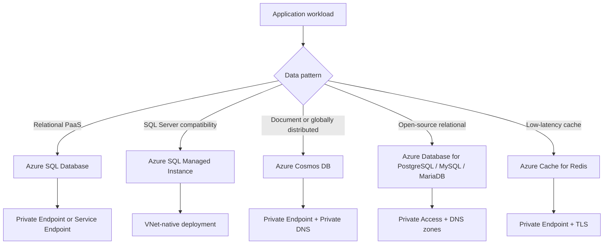

### 🧭 Service comparison

| Service | Primary use case | Deployment model | Private connectivity pattern | Typical pricing model | Notable features |
| --- | --- | --- | --- | --- | --- |
| Azure SQL Database | Cloud-native relational OLTP | Single database / elastic pool / serverless / hyperscale | Private Endpoint or Service Endpoint | DTU or vCore | PaaS patching, PITR, intelligent tuning, failover groups |
| Azure SQL Managed Instance | Lift-and-shift SQL Server workloads | Managed SQL instance in dedicated subnet | VNet-native private IPs | vCore | Near full SQL Server compatibility, SQL Agent, linked-server-style patterns |
| Azure Cosmos DB | Globally distributed NoSQL | Regional account with multiple APIs | Private Endpoint per API endpoint | Request Units or vCore by offering | Multi-region writes, tunable consistency, low latency |
| Azure Database for PostgreSQL Flexible Server | PostgreSQL applications and analytics-adjacent OLTP | Flexible Server | Private access via delegated subnet or Private Endpoint depending pattern | Burstable / General Purpose / Memory Optimized | Extensions, HA, stop-start, zone redundancy |
| Azure Database for MySQL Flexible Server | LAMP and MySQL-backed apps | Flexible Server | Private access via delegated subnet or Private Endpoint pattern | Burstable / General Purpose / Memory Optimized | Zone redundancy, maintenance windows, read replicas |
| Azure Database for MariaDB | Legacy MariaDB compatibility workloads | Managed server | Service-specific private networking choices | vCore-like managed pricing | Managed backups, scaling, engine maintenance |
| Azure Cache for Redis | Caching, session state, pub/sub | Managed cache tiers | Private Endpoint and VNet injection options by SKU | Basic / Standard / Premium / Enterprise | Sub-millisecond access, clustering, persistence by tier |

### 💰 Pricing and feature orientation

#### Azure SQL Database

- Basic, Standard, and Premium in DTU model are simpler for small deployments where compute and IO are bundled.
- vCore lets you align compute, storage, backup retention, and reserved capacity more transparently.
- Serverless fits unpredictable demand or dev/test workloads that benefit from auto-pause and auto-scale.

#### Azure SQL Managed Instance

- General Purpose is cost-efficient for standard production needs.
- Business Critical adds local SSD-backed performance and stronger HA characteristics.
- Instance pools can improve consolidation economics for multiple smaller managed instances.

#### Azure Cosmos DB

- Provisioned throughput suits predictable workloads and multi-tenant architectures with capacity planning.
- Autoscale RU/s helps with bursty or hard-to-predict traffic patterns.
- Serverless is useful for low-volume intermittent development or spiky workloads with light average usage.

#### Azure Database for PostgreSQL / MySQL

- Burstable tiers are appropriate for low-duty-cycle development systems.
- General Purpose fits most production transactional workloads.
- Memory Optimized is best when working sets, query memory, or caching drive performance.

#### Azure Cache for Redis

- Basic is not production-grade because it lacks replication.
- Standard adds replication and SLA-backed high availability.
- Premium and Enterprise tiers unlock clustering, persistence, VNet options, and advanced security features.

### 🧪 Real-world workload mapping

#### E-commerce OLTP

**Best-fit service:** Azure SQL Database

**Why it fits:** Relational schema, strong consistency, elastic scale, managed backups.

- Private access should be designed from the start, not bolted on after go-live.
- DNS design must account for hybrid resolvers, custom DNS servers, and split-horizon behavior.
- Operational monitoring should validate both database health and the connectivity path.

#### Legacy ERP migration

**Best-fit service:** Azure SQL Managed Instance

**Why it fits:** Minimal code change, SQL Agent compatibility, instance-level behavior.

- Private access should be designed from the start, not bolted on after go-live.
- DNS design must account for hybrid resolvers, custom DNS servers, and split-horizon behavior.
- Operational monitoring should validate both database health and the connectivity path.

#### IoT telemetry with global users

**Best-fit service:** Azure Cosmos DB

**Why it fits:** Massive partitioned writes, global distribution, flexible consistency.

- Private access should be designed from the start, not bolted on after go-live.
- DNS design must account for hybrid resolvers, custom DNS servers, and split-horizon behavior.
- Operational monitoring should validate both database health and the connectivity path.

#### SaaS control plane built on Postgres

**Best-fit service:** Azure Database for PostgreSQL Flexible Server

**Why it fits:** Open-source preference, JSONB, extensions, HA options.

- Private access should be designed from the start, not bolted on after go-live.
- DNS design must account for hybrid resolvers, custom DNS servers, and split-horizon behavior.
- Operational monitoring should validate both database health and the connectivity path.

#### PHP application modernization

**Best-fit service:** Azure Database for MySQL Flexible Server

**Why it fits:** MySQL ecosystem fit and read-replica support.

- Private access should be designed from the start, not bolted on after go-live.
- DNS design must account for hybrid resolvers, custom DNS servers, and split-horizon behavior.
- Operational monitoring should validate both database health and the connectivity path.

#### High-volume session caching

**Best-fit service:** Azure Cache for Redis

**Why it fits:** Offload hot reads, store sessions, reduce database contention.

- Private access should be designed from the start, not bolted on after go-live.
- DNS design must account for hybrid resolvers, custom DNS servers, and split-horizon behavior.
- Operational monitoring should validate both database health and the connectivity path.

### 🌍 Scenario: Regulated financial application

**Situation:** A payment platform must keep database traffic off the public internet, integrate with central DNS, and support strict audit controls.

**Recommended approach:** Choose Azure SQL Database or Azure SQL Managed Instance with Private Endpoints or VNet-native private IPs, route administration through Bastion or a jump host, and enforce identity-based access.

**Validation checklist:**

- [ ] Private DNS zone linked to every participating VNet
- [ ] Outbound firewall rules allow Azure AD and telemetry dependencies
- [ ] Query auditing routed to Log Analytics or Storage
- [ ] Break-glass process documented for DBA emergency access

### ✅ Service selection checklist

- [ ] Does the workload require relational transactions, joins, and stored procedures?
- [ ] Is SQL Server instance compatibility mandatory?
- [ ] Do you need multi-region writes or globally distributed reads?
- [ ] Will application teams manage schema drift or depend on flexible document models?
- [ ] Does the workload need sub-millisecond cache latency instead of durable storage semantics?
- [ ] Can the service be reached privately from applications, operations tooling, and on-premises locations?
- [ ] Have you sized both performance and networking limits, including DNS and connection counts?
- [ ] Have cost guardrails been documented for compute, storage, throughput, backup, and monitoring?

## 2. Setting Up Azure SQL Database (Basic to Advanced)

Azure SQL Database deployment can start with a basic single database and grow into a fully private, zone-resilient, policy-controlled architecture. The examples below move from simple deployment to enterprise-ready connectivity.

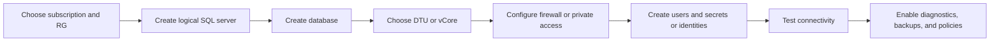

### 2.1 Portal deployment walkthrough

1. Open the Azure portal and create or select a resource group for the database platform.
2. Navigate to **SQL databases** and select **Create**.
3. Choose subscription, resource group, database name, and compute + storage settings.
4. Create a new logical SQL server if one does not already exist.
5. Set the server admin login and store credentials in a secure secret-management process rather than email or notes.
6. Choose the workload environment, backup redundancy, and optional zone redundancy options where available.
7. Decide whether you will start with public access plus firewall rules or a private connectivity pattern.
8. Review networking defaults, security defaults, and monitoring options before submitting.
9. Validate deployment in the portal, then test connectivity using a controlled client.

### 2.2 Azure CLI deployment

```bash
az account set --subscription $SUBSCRIPTION_ID

az group create   --name $RG   --location $LOCATION

az sql server create   --name $SQL_SERVER   --resource-group $RG   --location $LOCATION   --admin-user $SQL_ADMIN   --admin-password '<StrongPasswordHere>'

az sql db create   --resource-group $RG   --server $SQL_SERVER   --name $SQL_DB   --service-objective S3

az sql db show   --resource-group $RG   --server $SQL_SERVER   --name $SQL_DB   --query '{name:name,status:status,sku:currentServiceObjectiveName}'
```

### 2.3 PowerShell deployment

```powershell
$rg = "rg-data-private-prod"
$location = "EastUS"
$serverName = "sqlprivprod01"
$dbName = "appdb01"
$adminUser = "sqladminuser"
$adminPassword = ConvertTo-SecureString "<StrongPasswordHere>" -AsPlainText -Force
$cred = New-Object System.Management.Automation.PSCredential($adminUser, $adminPassword)

New-AzResourceGroup -Name $rg -Location $location
New-AzSqlServer -ResourceGroupName $rg -ServerName $serverName -Location $location -SqlAdministratorCredentials $cred
New-AzSqlDatabase -ResourceGroupName $rg -ServerName $serverName -DatabaseName $dbName -RequestedServiceObjectiveName "S3"
Get-AzSqlDatabase -ResourceGroupName $rg -ServerName $serverName -DatabaseName $dbName
```

### 2.4 Terraform deployment

```hcl
terraform {
  required_version = ">= 1.5.0"
  required_providers {
    azurerm = {
      source  = "hashicorp/azurerm"
      version = "~> 3.110"
    }
  }
}

provider "azurerm" {
  features {}
}

resource "azurerm_resource_group" "data" {
  name     = "rg-data-private-prod"
  location = "East US"
}

resource "azurerm_mssql_server" "sql" {
  name                         = "sqlprivprod01"
  resource_group_name          = azurerm_resource_group.data.name
  location                     = azurerm_resource_group.data.location
  version                      = "12.0"
  administrator_login          = "sqladminuser"
  administrator_login_password = var.sql_admin_password
  minimum_tls_version          = "1.2"
}

resource "azurerm_mssql_database" "app" {
  name      = "appdb01"
  server_id = azurerm_mssql_server.sql.id
  sku_name  = "GP_S_Gen5_2"
}
```

### 2.5 DTU vs vCore

| Model | Best for | Sizing style | Advantages | Tradeoffs |
| --- | --- | --- | --- | --- |
| DTU | Smaller or simple deployments | Bundled compute + memory + IO | Easy starting point, fewer choices | Less transparent resource mapping and flexibility |
| vCore | Production platforms and predictable sizing | Separates compute, memory, and storage | Reserved capacity, better transparency, more features | More decisions required up front |
| Serverless vCore | Intermittent or spiky demand | Auto-scale within min/max bounds | Auto-pause, cost efficiency for idle time | Cold start after pause, workload suitability matters |
| Hyperscale vCore | Very large databases and scale-out read scenarios | Specialized architecture | Fast growth, snapshots, read scale | Architecture choices differ from standard tiers |

#### Guidance for choosing the model

- Use DTU only when simplicity matters more than granular tuning and the workload is modest.
- Use vCore for most new production designs because it aligns better with architecture reviews, capacity planning, and cost analysis.
- Use serverless for dev/test, internal tools, or apps with long idle windows and variable bursts.
- Use business-critical tiers when local SSD, low latency, and stronger HA characteristics justify the cost.
- Use hyperscale when the dataset size or growth rate makes traditional storage scaling impractical.

### 2.6 Firewall rules and IP whitelisting

```bash
# Allow a single public IP temporarily for testing
az sql server firewall-rule create   --resource-group $RG   --server $SQL_SERVER   --name AllowMyLaptop   --start-ip-address 203.0.113.10   --end-ip-address 203.0.113.10

# Allow Azure services (use with caution and clear governance)
az sql server firewall-rule create   --resource-group $RG   --server $SQL_SERVER   --name AllowAzureServices   --start-ip-address 0.0.0.0   --end-ip-address 0.0.0.0

# List firewall rules
az sql server firewall-rule list   --resource-group $RG   --server $SQL_SERVER   --output table
```

#### Firewall design notes

- Public firewall rules are still public exposure; they simply narrow who can connect.
- Use firewall rules only as a transition state or in limited lower environments when private networking is not yet available.
- Document rule ownership, expiration, and justification so temporary rules do not become permanent risk.
- If private endpoints are enabled, consider disabling public network access to eliminate ambiguity.

### 2.7 Connection strings by language

#### .NET (Microsoft.Data.SqlClient)

```text
Server=tcp:sqlprivprod01.database.windows.net,1433;Initial Catalog=appdb01;Persist Security Info=False;User ID=appuser;Password=<Password>;MultipleActiveResultSets=False;Encrypt=True;TrustServerCertificate=False;Connection Timeout=30;
```

- Prefer Azure AD authentication or Managed Identity when supported by the client and workload.
- Keep encryption enabled; do not disable TLS validation in production.
- Use private DNS names that resolve to the Private Endpoint IP when public network access is disabled.

#### Java (JDBC)

```java
String url = "jdbc:sqlserver://sqlprivprod01.database.windows.net:1433;database=appdb01;encrypt=true;trustServerCertificate=false;hostNameInCertificate=*.database.windows.net;loginTimeout=30;";
```

- Prefer Azure AD authentication or Managed Identity when supported by the client and workload.
- Keep encryption enabled; do not disable TLS validation in production.
- Use private DNS names that resolve to the Private Endpoint IP when public network access is disabled.

#### Python (pyodbc)

```python
conn_str = (
    "Driver={ODBC Driver 18 for SQL Server};"
    "Server=tcp:sqlprivprod01.database.windows.net,1433;"
    "Database=appdb01;"
    "Uid=appuser;Pwd=<Password>;"
    "Encrypt=yes;TrustServerCertificate=no;Connection Timeout=30;"
)
```

- Prefer Azure AD authentication or Managed Identity when supported by the client and workload.
- Keep encryption enabled; do not disable TLS validation in production.
- Use private DNS names that resolve to the Private Endpoint IP when public network access is disabled.

#### Node.js (mssql)

```javascript
const config = {
  server: 'sqlprivprod01.database.windows.net',
  port: 1433,
  database: 'appdb01',
  user: 'appuser',
  password: process.env.SQL_PASSWORD,
  options: {
    encrypt: true,
    trustServerCertificate: false
  }
};
```

- Prefer Azure AD authentication or Managed Identity when supported by the client and workload.
- Keep encryption enabled; do not disable TLS validation in production.
- Use private DNS names that resolve to the Private Endpoint IP when public network access is disabled.

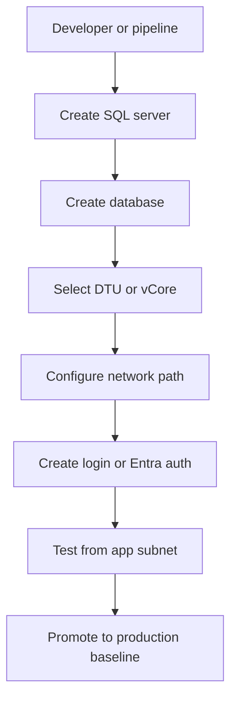

### 2.8 Advanced deployment options

#### Elastic pools

Use when many databases share a bursty consumption profile and you want better cost efficiency than isolated overprovisioning.

- Validate prerequisite support in region and SKU.
- Document application changes needed for the feature.
- Capture ongoing operational ownership and alerting requirements.

#### Zone redundancy

Enable for production workloads needing higher resilience inside a region, while validating regional support and pricing impact.

- Validate prerequisite support in region and SKU.
- Document application changes needed for the feature.
- Capture ongoing operational ownership and alerting requirements.

#### Auto-failover groups

Use for regional DR patterns across paired or selected regions, combined with application retry logic and DNS failover awareness.

- Validate prerequisite support in region and SKU.
- Document application changes needed for the feature.
- Capture ongoing operational ownership and alerting requirements.

#### Ledger

Evaluate when tamper-evident data lineage is a compliance requirement.

- Validate prerequisite support in region and SKU.
- Document application changes needed for the feature.
- Capture ongoing operational ownership and alerting requirements.

#### Long-term retention

Enable when monthly, yearly, or compliance snapshots are needed beyond standard backup retention windows.

- Validate prerequisite support in region and SKU.
- Document application changes needed for the feature.
- Capture ongoing operational ownership and alerting requirements.

#### Microsoft Entra-only authentication

Reduce SQL authentication sprawl by centralizing identity and policy control.

- Validate prerequisite support in region and SKU.
- Document application changes needed for the feature.
- Capture ongoing operational ownership and alerting requirements.

#### Defender for SQL

Enable threat analytics, vulnerability assessment, and exposure insights for security operations.

- Validate prerequisite support in region and SKU.
- Document application changes needed for the feature.
- Capture ongoing operational ownership and alerting requirements.

#### Diagnostic settings

Send logs and metrics to Log Analytics, Event Hub, or Storage for central operations workflows.

- Validate prerequisite support in region and SKU.
- Document application changes needed for the feature.
- Capture ongoing operational ownership and alerting requirements.

### 🌍 Scenario: SaaS production database rollout

**Situation:** A platform team must deploy a SQL database for a multi-tenant API with staged environments and least-privilege administration.

**Recommended approach:** Use Terraform for repeatability, vCore for predictable scaling, Private Endpoints for workload access, Entra authentication for administration, and diagnostic settings for visibility.

**Validation checklist:**

- [ ] Infrastructure code stored in version control
- [ ] Admin path separate from application path
- [ ] Private DNS resolution tested from app containers
- [ ] Failover drill documented and rehearsed

## 3. Private Endpoint Access

Private Endpoints map an Azure PaaS service to a private IP address inside your virtual network. Traffic stays on the Microsoft backbone, the service can be reached without traversing the public internet, and DNS resolution is redirected to the private IP.

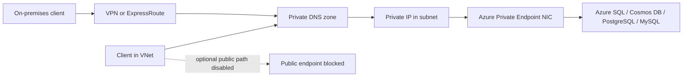

### 3.1 What Private Endpoints solve

- Remove dependency on public IP allowlists for internal applications.
- Reduce exposure by letting you disable public network access entirely.
- Keep name-based connectivity simple when paired with correct Private DNS zones.
- Support hybrid connectivity when private DNS is extended to on-premises resolvers.
- Help satisfy regulatory expectations for private transport paths and segmented network design.

### 3.2 Azure SQL Private Endpoint step-by-step with Azure CLI

```bash
# Create VNet and subnets
az network vnet create   --resource-group $RG   --name $VNET_NAME   --address-prefix 10.10.0.0/16   --subnet-name $APP_SUBNET   --subnet-prefix 10.10.1.0/24

az network vnet subnet create   --resource-group $RG   --vnet-name $VNET_NAME   --name $PE_SUBNET   --address-prefixes 10.10.2.0/24   --disable-private-endpoint-network-policies true

SQL_SERVER_ID=$(az sql server show --resource-group $RG --name $SQL_SERVER --query id -o tsv)

az network private-endpoint create   --resource-group $RG   --name pe-sql-appdb01   --vnet-name $VNET_NAME   --subnet $PE_SUBNET   --private-connection-resource-id $SQL_SERVER_ID   --group-id sqlServer   --connection-name pec-sql-appdb01

az network private-dns zone create   --resource-group $DNS_RG   --name privatelink.database.windows.net

az network private-dns link vnet create   --resource-group $DNS_RG   --zone-name privatelink.database.windows.net   --name link-hub-vnet   --virtual-network $(az network vnet show --resource-group $RG --name $VNET_NAME --query id -o tsv)   --registration-enabled false

az network private-endpoint dns-zone-group create   --resource-group $RG   --endpoint-name pe-sql-appdb01   --name sql-zone-group   --private-dns-zone privatelink.database.windows.net   --zone-name privatelink.database.windows.net
```

### 3.3 Private DNS zones configuration

| Service | Private DNS zone | FQDN example | Private Link subresource |
| --- | --- | --- | --- |
| Azure SQL Database | privatelink.database.windows.net | sqlprivprod01.database.windows.net | sqlServer |
| Azure Cosmos DB (SQL API) | privatelink.documents.azure.com | cosmosprivprod01.documents.azure.com | Sql |
| Cosmos DB (Mongo API) | privatelink.mongo.cosmos.azure.com | cosmosprivprod01.mongo.cosmos.azure.com | MongoDB |
| Azure Database for PostgreSQL | privatelink.postgres.database.azure.com | pgflexpriv01.postgres.database.azure.com | postgresqlServer |
| Azure Database for MySQL | privatelink.mysql.database.azure.com | mysqlflexpriv01.mysql.database.azure.com | mysqlServer |
| Azure Cache for Redis | privatelink.redis.cache.windows.net | redisprivprod01.redis.cache.windows.net | redisCache |

#### DNS implementation guidance

- Host Private DNS zones centrally in a shared services subscription when multiple spokes consume the same patterns.
- Link every VNet that needs name resolution, including AKS, app, management, and integration VNets.
- If custom DNS forwarders are used, configure conditional forwarding from on-premises or custom DNS to Azure DNS Private Resolver or Azure-provided DNS paths.
- Avoid manual A records when possible; zone groups on the Private Endpoint keep records aligned to the endpoint lifecycle.
- Validate the full resolution chain using nslookup, dig, Resolve-DnsName, and application-level connectivity tests.

#### Private Endpoint for Cosmos DB

Use the Private DNS zone **privatelink.documents.azure.com** and map the correct subresource for the database engine.

- Create the endpoint in a dedicated subnet or a carefully governed shared private-endpoint subnet.
- Apply NSG and route validation to ensure no unintended egress inspection breaks the flow.
- The account may expose different FQDNs by API, so verify the exact zone based on the selected API and private link subresource.
- Keep public network access disabled after validation to prevent accidental fallback to public routes.

#### Private Endpoint for PostgreSQL Flexible Server

Use the Private DNS zone **privatelink.postgres.database.azure.com** and map the correct subresource for the database engine.

- Create the endpoint in a dedicated subnet or a carefully governed shared private-endpoint subnet.
- Apply NSG and route validation to ensure no unintended egress inspection breaks the flow.
- Test name resolution from Linux and Windows clients because some teams rely on different resolver chains.
- Keep public network access disabled after validation to prevent accidental fallback to public routes.

#### Private Endpoint for MySQL Flexible Server

Use the Private DNS zone **privatelink.mysql.database.azure.com** and map the correct subresource for the database engine.

- Create the endpoint in a dedicated subnet or a carefully governed shared private-endpoint subnet.
- Apply NSG and route validation to ensure no unintended egress inspection breaks the flow.
- Validate TLS hostname expectations because some clients cache DNS answers aggressively.
- Keep public network access disabled after validation to prevent accidental fallback to public routes.

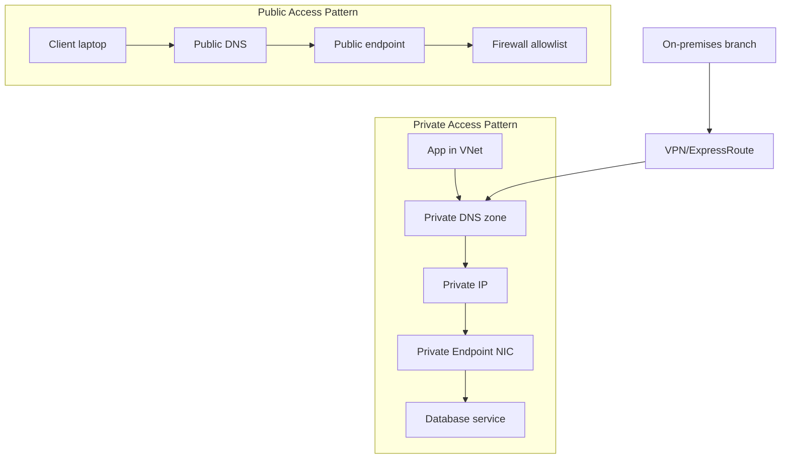

### 3.4 Private Endpoint operating model

#### Network team

Owns VNet design, subnet policies, routing, DNS forwarding, and private resolver integration.

- Maintain runbooks for incident triage.
- Track ownership in CMDB or service catalog entries.
- Document escalation contacts and change windows.

#### Platform team

Creates standardized landing-zone modules for Private Endpoints, DNS zones, and RBAC.

- Maintain runbooks for incident triage.
- Track ownership in CMDB or service catalog entries.
- Document escalation contacts and change windows.

#### Application team

Tests name resolution, connection pooling, retries, and application-level failover behavior.

- Maintain runbooks for incident triage.
- Track ownership in CMDB or service catalog entries.
- Document escalation contacts and change windows.

#### Security team

Reviews exposure, public access disablement, Defender settings, and audit destinations.

- Maintain runbooks for incident triage.
- Track ownership in CMDB or service catalog entries.
- Document escalation contacts and change windows.

#### Database team

Owns engine tuning, user provisioning, and maintenance windows but coordinates on connectivity changes.

- Maintain runbooks for incident triage.
- Track ownership in CMDB or service catalog entries.
- Document escalation contacts and change windows.

### 🌍 Scenario: Private-first modernization

**Situation:** A company is moving from public IP-based SQL connectivity to a zero-trust landing zone where application subnets must never depend on public allowlists.

**Recommended approach:** Deploy Private Endpoints in each environment, centralize DNS zones, disable public network access, and validate hybrid resolvers before cutover.

**Validation checklist:**

- [ ] Private Endpoint connection approved
- [ ] A record auto-created in Private DNS
- [ ] nslookup from app subnet returns private IP
- [ ] Public endpoint disabled after successful application test

## 4. VNet Service Endpoints vs Private Endpoints

Service Endpoints and Private Endpoints both improve how Azure PaaS services are reached from Azure networks, but they solve different problems. Service Endpoints secure traffic from selected VNets to a public service endpoint, while Private Endpoints assign the service a private IP inside your VNet.

| Attribute | VNet Service Endpoints | Private Endpoints |
| --- | --- | --- |
| Traffic destination | Public endpoint | Private IP in your VNet |
| Public exposure | Service still has public endpoint | Can disable public endpoint |
| DNS changes required | Usually minimal | Yes, Private DNS zone design is critical |
| On-premises reachability | Not directly through service endpoint semantics | Yes, via private routing + DNS |
| Data exfiltration control | Less granular | Stronger segmentation with private IP targeting |
| Operational simplicity | Simpler initial setup | More moving parts but stronger isolation |
| Use case fit | Azure-only workloads with controlled VNet origins | Private-first, hybrid, regulated, or zero-trust designs |

### 4.1 When to use which

#### Use Service Endpoints when

- The workload is Azure-only and does not need on-premises private reachability.
- You need a quick improvement over open public IP access but are not ready for DNS re-architecture.
- The service and application both reside within a simpler landing zone model.

#### Use Private Endpoints when

- You want to disable public network access.
- Applications connect from multiple VNets or from on-premises over private routing.
- Security policy requires private IP-based reachability and explicit DNS control.
- You want clearer egress control and tighter data exfiltration boundaries.

```bash
# Example: enable a Service Endpoint on a subnet for Microsoft.Sql
az network vnet subnet update   --resource-group $RG   --vnet-name $VNET_NAME   --name $APP_SUBNET   --service-endpoints Microsoft.Sql

# Add a VNet rule for Azure SQL
az sql server vnet-rule create   --resource-group $RG   --server $SQL_SERVER   --name sql-vnet-rule-app   --subnet $(az network vnet subnet show --resource-group $RG --vnet-name $VNET_NAME --name $APP_SUBNET --query id -o tsv)
```

### 4.2 Setup considerations

- Service Endpoints do not remove the public endpoint; verify firewall rules carefully.
- Private Endpoints require subnet policy considerations, DNS design, and sometimes route/firewall exception validation.
- For hub-and-spoke architectures, centralize DNS but keep endpoint ownership with the workload team or a platform module.
- Evaluate each service independently because support matrices and behaviors vary across Azure database offerings.

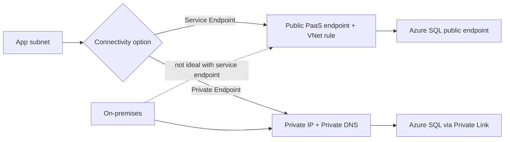

### 🌍 Scenario: Branch office reporting tool

**Situation:** An on-premises reporting server must query Azure SQL privately over ExpressRoute while application pods in Azure also connect privately.

**Recommended approach:** Private Endpoint is the correct design because Service Endpoints do not provide a private IP path consumable from on-premises.

**Validation checklist:**

- [ ] Hybrid DNS forwards privatelink zone lookups
- [ ] ExpressRoute private peering advertises the right prefixes
- [ ] Public network access disabled
- [ ] Performance tested during report peak hours

## 5. Connecting from On-Premises

Hybrid connectivity introduces routing, DNS, MTU, security, and operational complexity. A successful private database design must handle the complete path from branch or datacenter client through Azure network boundaries to the private service endpoint.

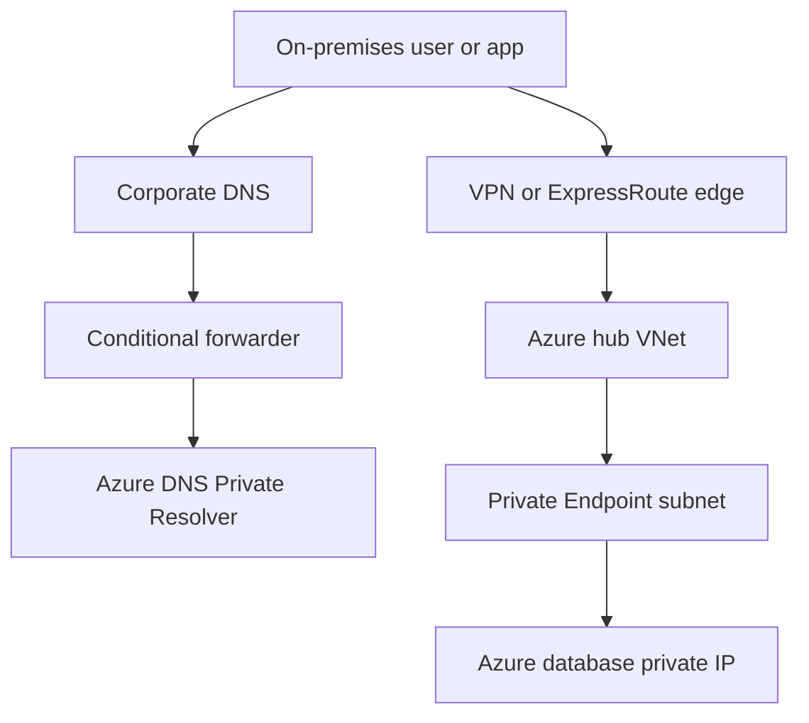

### 5.1 Site-to-Site VPN setup pattern

1. Deploy or identify a hub VNet for shared connectivity services.
2. Create the Azure VPN gateway and match SKU and availability-zone requirements to throughput and resiliency goals.
3. Create the local network gateway with on-premises public IP and address prefixes.
4. Create the site-to-site VPN connection with a strong shared key and agreed IKE/IPsec parameters.
5. Validate route propagation to the app and private-endpoint consumer networks.
6. Configure hybrid DNS forwarding so private endpoint names resolve to Azure private IPs from on-premises clients.
7. Test with nslookup and application-specific connection tools before production cutover.

```bash
# Sample VPN gateway workflow (simplified)
az network public-ip create --resource-group $RG --name pip-vpngw --sku Standard --allocation-method Static
az network vnet-gateway create   --resource-group $RG   --name vpngw-hub-prod   --public-ip-addresses pip-vpngw   --vnet $VNET_NAME   --gateway-type Vpn   --vpn-type RouteBased   --sku VpnGw2
```

### 5.2 ExpressRoute connectivity

- Use ExpressRoute when predictable private connectivity, higher throughput, and enterprise WAN integration justify the cost and lead time.
- Design for redundant circuits and provider diversity when the database is mission critical.
- Validate which VNets are connected through ExpressRoute gateway or Virtual WAN constructs and how Private Endpoint traffic resolves.
- Remember that DNS is often the biggest blocker; private routing alone is not enough if FQDNs still resolve publicly.

### 5.3 Hybrid DNS resolution for Private Endpoints

1. On-premises DNS server receives query for the service FQDN, for example `sqlprivprod01.database.windows.net`.
2. A conditional forwarder or DNS forwarding rule sends `privatelink.database.windows.net` or the relevant zone to Azure DNS Private Resolver.
3. The Azure resolver answers with the private A record created by the Private Endpoint zone group.
4. The client uses the returned private IP and traverses VPN or ExpressRoute to reach the database privately.

```text
Example conditional forwarding zones:
- privatelink.database.windows.net
- privatelink.documents.azure.com
- privatelink.postgres.database.azure.com
- privatelink.mysql.database.azure.com
- privatelink.redis.cache.windows.net
```

### 5.4 Network topology guidance

- Prefer hub-and-spoke or Virtual WAN for centralized hybrid ingress and DNS services.
- Separate application, management, and Private Endpoint subnets to keep policy intent clear.
- Document asymmetric routing risks when NVAs, firewalls, or forced tunneling exist.
- Test latency-sensitive workloads end to end because private connectivity can still suffer from WAN or inspection bottlenecks.

### 🌍 Scenario: Manufacturing plant historian database access

**Situation:** A plant system in an on-premises factory network needs reliable private access to Azure PostgreSQL and Azure SQL while the site is connected by S2S VPN with limited bandwidth.

**Recommended approach:** Use Private Endpoints, dedicated DNS forwarding, and lightweight connection pooling; test route stability and establish offline buffering behavior in the application.

**Validation checklist:**

- [ ] VPN SLA documented
- [ ] Bandwidth tested with realistic data extract volumes
- [ ] DNS failover path defined
- [ ] Operational team has packet-capture and traceroute runbooks

## 6. Bastion and Jump Box Access

Administrative access should avoid exposing management ports or relying on engineers connecting directly from unmanaged laptops. Azure Bastion and jump-box patterns help keep administration private and auditable.

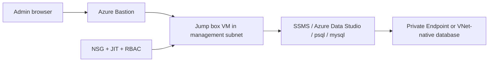

### 6.1 Azure Bastion setup

```bash
# Bastion requires a subnet named AzureBastionSubnet
az network vnet subnet create   --resource-group $RG   --vnet-name $VNET_NAME   --name AzureBastionSubnet   --address-prefixes 10.10.10.0/26

az network public-ip create   --resource-group $RG   --name pip-bastion-prod   --sku Standard   --allocation-method Static

az network bastion create   --resource-group $RG   --name bastion-prod   --public-ip-address pip-bastion-prod   --vnet-name $VNET_NAME   --location $LOCATION
```

### 6.2 Jump box VM guidance

- Place the jump box in a locked-down management subnet with NSGs, Just-In-Time access, Defender protections, and no public IP.
- Harden the VM image with endpoint protection, logging, and admin workstation policies.
- Install only approved tools such as SSMS, Azure Data Studio, sqlcmd, psql, mysql client, or Mongo shell equivalents.
- Use managed identities, Key Vault, and Entra-auth-capable tooling where possible to avoid password sprawl.

### 6.3 Azure Data Studio / SSMS through Bastion

#### SSMS

- Use the server FQDN, not the Private Endpoint resource name.
- If public network access is disabled, verify DNS inside the jump box resolves to the private IP.
- Use Entra ID authentication or SQL auth from secure secret retrieval.

#### Azure Data Studio

- Useful for cross-platform administration and quick query validation.
- Can run from a Windows or Linux jump host.
- Supports extensions for notebooks and admin workflows.

#### sqlcmd / SqlPackage

- Ideal for scripted deployments and diagnostics.
- Embed in automation on secure management hosts.
- Validate outbound access to dependent services if using Entra auth.

### 🌍 Scenario: Production DBA administration path

**Situation:** The security team requires database administration to occur only from a controlled management plane and never from engineer laptops.

**Recommended approach:** Use Bastion to reach a hardened jump box VM, restrict the jump box with JIT and RBAC, and route all database tools through the private network.

**Validation checklist:**

- [ ] No public IP on jump host
- [ ] Bastion access scoped to admin group
- [ ] Session logging enabled where possible
- [ ] Admin tools updated and patched

## 7. Cosmos DB Connectivity

Azure Cosmos DB has distinct connectivity patterns because it supports multiple APIs, global distribution, consistency options, and data models. Private access design must reflect the chosen API and application behavior.

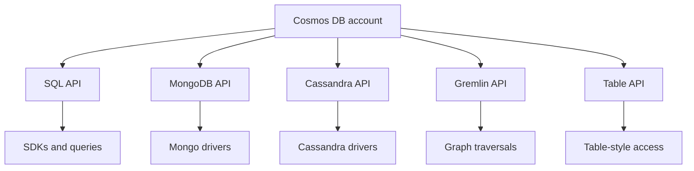

### 7.1 Account setup and configuration

```bash
az cosmosdb create   --name $COSMOS_ACCOUNT   --resource-group $RG   --locations regionName=$LOCATION failoverPriority=0 isZoneRedundant=False   --default-consistency-level Session   --enable-automatic-failover true
```

### 7.2 API types

#### SQL API

Native Cosmos DB document model with SQL-like query syntax and Azure SDK alignment.

- Check feature parity carefully during migration.
- Confirm the correct Private Link DNS zone for the API type.
- Benchmark client SDK retry behavior and connection pooling.

#### MongoDB API

Lets Mongo-compatible applications migrate with less code change.

- Check feature parity carefully during migration.
- Confirm the correct Private Link DNS zone for the API type.
- Benchmark client SDK retry behavior and connection pooling.

#### Cassandra API

Supports wide-column access patterns and Cassandra-compatible tooling.

- Check feature parity carefully during migration.
- Confirm the correct Private Link DNS zone for the API type.
- Benchmark client SDK retry behavior and connection pooling.

#### Gremlin API

Targets graph workloads such as relationships, recommendations, and traversal-heavy applications.

- Check feature parity carefully during migration.
- Confirm the correct Private Link DNS zone for the API type.
- Benchmark client SDK retry behavior and connection pooling.

#### Table API

Serves key-value style access patterns similar to Azure Table semantics.

- Check feature parity carefully during migration.
- Confirm the correct Private Link DNS zone for the API type.
- Benchmark client SDK retry behavior and connection pooling.

### 7.3 Connection methods and SDKs

#### .NET

Use `Azure.Cosmos` and prefer managed identities or securely stored keys where supported by the architecture.

```text
.NET endpoint example: https://cosmosprivprod01.documents.azure.com:443/
```

#### Java

Use the Cosmos async or sync SDK depending throughput and application threading model.

```text
Java endpoint example: https://cosmosprivprod01.documents.azure.com:443/
```

#### Python

Use the Azure Cosmos Python SDK for operational scripts and services; validate connection mode and retry settings.

```text
Python endpoint example: https://cosmosprivprod01.documents.azure.com:443/
```

#### Node.js

Use the JavaScript SDK with attention to region preferences, consistency, and retry strategies.

```text
Node.js endpoint example: https://cosmosprivprod01.documents.azure.com:443/
```

```bash
# Create a Private Endpoint for Cosmos DB SQL API
COSMOS_ID=$(az cosmosdb show --name $COSMOS_ACCOUNT --resource-group $RG --query id -o tsv)

az network private-endpoint create   --resource-group $RG   --name pe-cosmos-sql   --vnet-name $VNET_NAME   --subnet $PE_SUBNET   --private-connection-resource-id $COSMOS_ID   --group-id Sql   --connection-name pec-cosmos-sql
```

### 7.4 Consistency levels explained

| Consistency level | Read guarantees | Latency impact | Typical use case |
| --- | --- | --- | --- |
| Strong | Always the latest committed write globally within configured boundaries | Highest | Financial or critical control-plane reads |
| Bounded Staleness | Reads lag writes by a bounded number of versions or time interval | High | Apps needing predictable lag limits |
| Session | Monotonic reads/writes for a client session | Balanced | Most user-centric applications |
| Consistent Prefix | Reads never see out-of-order writes but may miss recent data | Lower | Feed processing and less strict ordering requirements |
| Eventual | No ordering guarantee for the latest data visibility | Lowest | Massively distributed read-heavy apps tolerant of lag |

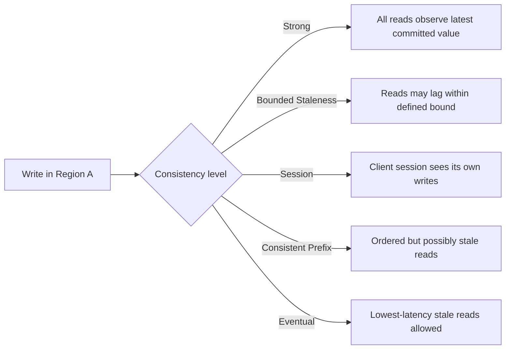

### 7.5 Cosmos DB private connectivity checklist

- [ ] Select the correct API and Private Link group ID.
- [ ] Configure the matching Private DNS zone and test from every consumer network.
- [ ] Review SDK preferred regions and connection mode behavior.
- [ ] Benchmark consistency, RU/s, and failover behavior with realistic access patterns.
- [ ] Disable public access if policy requires private-only consumption.

### 🌍 Scenario: Multi-region retail catalog

**Situation:** A retail platform uses Cosmos DB SQL API for globally distributed catalog reads and needs private access from AKS clusters in two regions and corporate reporting tools on-premises.

**Recommended approach:** Use Private Endpoints in each connectivity domain, align DNS forwarding, tune Session consistency for user-facing reads, and validate regional preferences in the SDK.

**Validation checklist:**

- [ ] Preferred regions configured in application
- [ ] Private DNS records present in both Azure regions
- [ ] On-premises resolvers forward Cosmos zones
- [ ] Failover test executed

## 8. Database Security Best Practices

Private connectivity is only one layer of security. A production-grade Azure database platform also needs identity control, encryption, threat detection, auditing, and policy enforcement.

### Azure AD / Microsoft Entra authentication

- Use Entra administrators for Azure SQL server or managed instance governance.
- Map application identities, groups, and managed identities to database users where supported.
- Reduce local password sprawl and centralize conditional access and MFA for human administration.

**Implementation notes:**

- Capture the design decision in the platform security baseline.
- Automate configuration wherever possible with policy or IaC.
- Continuously verify settings with alerts, compliance scans, and periodic access reviews.

### Managed Identity access

- Use system-assigned or user-assigned managed identities for applications hosted on Azure compute.
- Grant the identity only the database roles and Azure RBAC scopes it needs.
- Test token acquisition paths in private networks, especially when outbound proxies or custom DNS are involved.

**Implementation notes:**

- Capture the design decision in the platform security baseline.
- Automate configuration wherever possible with policy or IaC.
- Continuously verify settings with alerts, compliance scans, and periodic access reviews.

### Transparent Data Encryption (TDE)

- Keep at-rest encryption enabled for relational services.
- Consider customer-managed keys for stricter compliance requirements.
- Document key rotation ownership and outage implications.

**Implementation notes:**

- Capture the design decision in the platform security baseline.
- Automate configuration wherever possible with policy or IaC.
- Continuously verify settings with alerts, compliance scans, and periodic access reviews.

### Always Encrypted

- Use for highly sensitive columns where plaintext should not be visible to the database engine.
- Validate driver support, query limitations, and key management processes.
- Use secure enclaves when richer computation on encrypted columns is required and supported.

**Implementation notes:**

- Capture the design decision in the platform security baseline.
- Automate configuration wherever possible with policy or IaC.
- Continuously verify settings with alerts, compliance scans, and periodic access reviews.

### Dynamic Data Masking

- Mask sensitive fields for non-privileged users.
- Treat masking as a usability control, not a substitute for encryption or authorization.
- Review masking effectiveness in reporting and data export scenarios.

**Implementation notes:**

- Capture the design decision in the platform security baseline.
- Automate configuration wherever possible with policy or IaC.
- Continuously verify settings with alerts, compliance scans, and periodic access reviews.

### Advanced Threat Protection / Defender

- Enable Defender plans for exposure alerts, anomalous access detection, and vulnerability recommendations.
- Route findings into SOC workflows and incident management.
- Review false positives and approved exceptions regularly.

**Implementation notes:**

- Capture the design decision in the platform security baseline.
- Automate configuration wherever possible with policy or IaC.
- Continuously verify settings with alerts, compliance scans, and periodic access reviews.

### Auditing setup

- Send audit logs to Log Analytics, Event Hub, or Storage depending retention and compliance needs.
- Ensure logs from private-only databases are still collected and monitored.
- Define ownership for review frequency, alert thresholds, and evidence retention.

**Implementation notes:**

- Capture the design decision in the platform security baseline.
- Automate configuration wherever possible with policy or IaC.
- Continuously verify settings with alerts, compliance scans, and periodic access reviews.

```sql
-- Example: create a contained database user from Microsoft Entra identity in Azure SQL Database
CREATE USER [app-mi-prod] FROM EXTERNAL PROVIDER;
ALTER ROLE db_datareader ADD MEMBER [app-mi-prod];
ALTER ROLE db_datawriter ADD MEMBER [app-mi-prod];
```

```bash
# Example: enable SQL auditing to Log Analytics (conceptual command set)
WORKSPACE_ID=$(az monitor log-analytics workspace show --resource-group rg-monitoring-prod --workspace-name law-platform-prod --query id -o tsv)

az monitor diagnostic-settings create   --name sql-audit-to-law   --resource $(az sql server show --resource-group $RG --name $SQL_SERVER --query id -o tsv)   --workspace $WORKSPACE_ID   --logs '[{"category":"SQLSecurityAuditEvents","enabled":true}]'   --metrics '[{"category":"AllMetrics","enabled":true}]'
```

### 🌍 Scenario: Healthcare workload security baseline

**Situation:** A healthcare application stores regulated personal data and must prove encryption, least privilege, and monitored access over private networks.

**Recommended approach:** Combine Private Endpoints, Entra-based administration, TDE, selective Always Encrypted, auditing, Defender, and documented break-glass controls.

**Validation checklist:**

- [ ] Sensitive columns classified
- [ ] Audit retention meets policy
- [ ] Privileged accounts reviewed quarterly
- [ ] Private connectivity tested after every network change

## 9. Database Troubleshooting

When connectivity fails, teams often focus only on the database engine. In Azure private-access designs, many incidents are actually caused by DNS, routing, firewall, identity, or client-library behavior. Triage should move from name resolution to network path to authentication to database performance.

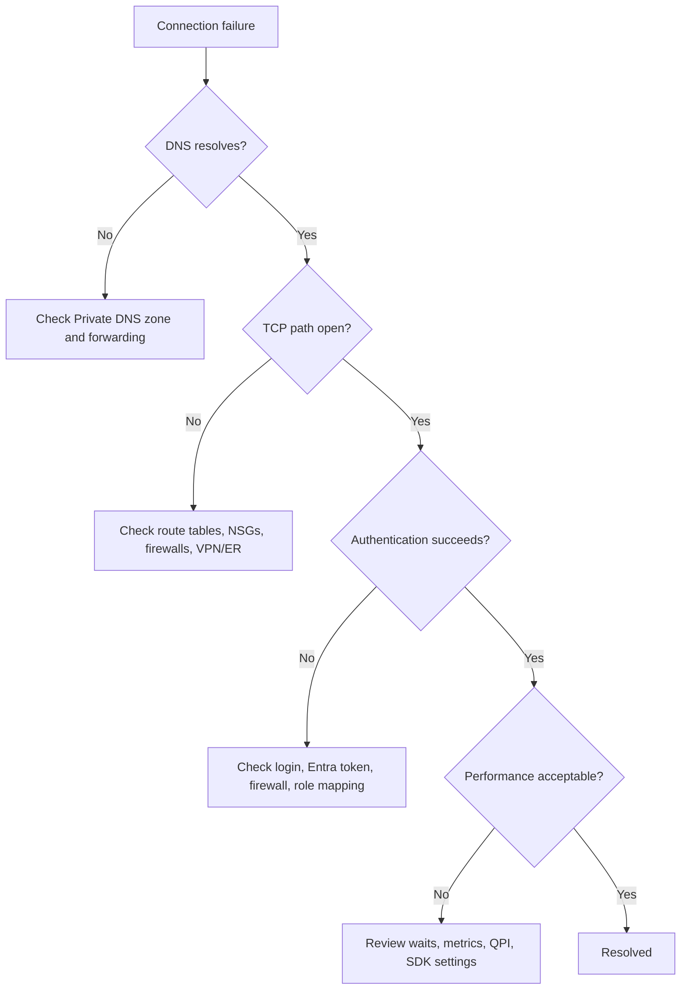

### 9.1 Common issues and fixes

| Symptom | Likely cause | Recommended fix |
| --- | --- | --- |
| Login timeout expired | DNS resolves publicly, Private Endpoint unreachable, NSG or firewall blocks 1433/engine path | Verify nslookup returns private IP, confirm route path, test TCP connectivity from the client network |
| Cannot open server requested by the login | Firewall or VNet rule mismatch, wrong server name, database user missing | Validate FQDN, check server firewall/VNet rules, verify contained user exists |
| AAD token failures | Managed identity not mapped or outbound dependencies blocked | Validate identity assignment, user creation from external provider, and token acquisition path |
| Slow queries after private cutover | Connection retries, DNS latency, app pool behavior, or unrelated query-plan regression | Measure end-to-end latency, compare query stats, inspect connection pooling and retry storms |
| Cosmos DB 429 responses | Throughput exhausted | Increase RU/s, enable autoscale, optimize partitioning and query efficiency |
| PostgreSQL SSL errors | Client TLS settings or hostname mismatch | Enforce correct CA chain, server hostname, and DNS resolution |
| Redis connection resets | TLS mismatch, SNAT or idle timeout issues, client library settings | Tune client timeouts, enable keepalive, confirm private DNS and network path |

### 9.2 Connection timeout issues

1. Run `nslookup` or `Resolve-DnsName` for the service FQDN from the exact client host or pod.
2. Verify the returned IP belongs to the Private Endpoint subnet when private-only access is intended.
3. Use `tcpping`, `Test-NetConnection`, or equivalent tools to confirm the TCP path.
4. Check NSGs, Azure Firewall, third-party firewalls, UDRs, and forced tunneling behavior.
5. For hybrid clients, validate VPN or ExpressRoute route propagation and MTU-related issues if packets appear to drop.

### 9.3 Authentication failures

- Confirm whether the client is using SQL authentication, Entra password, integrated Entra, or Managed Identity.
- Ensure the database user exists and has appropriate roles.
- Check token expiration, clock skew, and outbound dependencies when using identity-based auth.
- Verify Conditional Access or MFA policy expectations for human administrators.

### 9.4 Performance diagnostics

- Review Azure SQL metrics such as CPU percent, DTU percent, storage, and sessions.
- Use Query Performance Insight to identify top resource-consuming queries.
- Inspect wait statistics, query plans, missing indexes, and lock contention.
- Validate connection pooling and retry behavior in the application to avoid self-inflicted load.
- Measure latency from application subnet, jump box, and on-premises clients separately to isolate WAN effects.

### 9.5 Query Performance Insight

Query Performance Insight in Azure SQL helps identify long-running and high-resource queries over time. Use it alongside Query Store, application traces, and workload-specific benchmarks to decide whether the problem is query design, data growth, configuration sizing, or network behavior.

- Capture the time window of the incident before investigating historical trends.
- Compare normal and incident baselines rather than looking at a single slow query in isolation.
- If the issue started after a network cutover, validate both app retry behavior and actual database plan changes.

### 🛠️ Runbook: Azure SQL Database

**Primary endpoint example:** `sqlprivprod01.database.windows.net`

**Immediate triage steps:**

1. Resolve DNS.
2. Check Private Endpoint approval state.
3. Validate firewall/public access settings.
4. Test login with sqlcmd from jump host.
5. Review metrics and Query Store.

**Questions for the incident commander:**

- Did the issue start after a network, DNS, or certificate change?
- Is the problem isolated to one client network or all clients?
- Are private and public access paths both enabled, creating ambiguous behavior?
- Did workload volume or query patterns change before the incident?
- Are there correlated Azure Service Health or maintenance events?

**Evidence to collect:**

- DNS lookup output from affected client
- Connection test output with timestamps
- Relevant Azure metrics and activity logs
- Application error samples with correlation IDs
- Change records for network, DNS, identity, or database configuration

### 🛠️ Runbook: Azure SQL Managed Instance

**Primary endpoint example:** `mi-prod.123456789.database.windows.net`

**Immediate triage steps:**

1. Verify delegated subnet and NSG intent.
2. Check peering and route propagation.
3. Test from management VM.
4. Review service health events.
5. Inspect failover state.

**Questions for the incident commander:**

- Did the issue start after a network, DNS, or certificate change?
- Is the problem isolated to one client network or all clients?
- Are private and public access paths both enabled, creating ambiguous behavior?
- Did workload volume or query patterns change before the incident?
- Are there correlated Azure Service Health or maintenance events?

**Evidence to collect:**

- DNS lookup output from affected client
- Connection test output with timestamps
- Relevant Azure metrics and activity logs
- Application error samples with correlation IDs
- Change records for network, DNS, identity, or database configuration

### 🛠️ Runbook: Cosmos DB

**Primary endpoint example:** `cosmosprivprod01.documents.azure.com`

**Immediate triage steps:**

1. Check API-specific DNS zone.
2. Review RU consumption and throttling.
3. Validate SDK preferred regions.
4. Inspect Private Endpoint status.
5. Test failover/read path.

**Questions for the incident commander:**

- Did the issue start after a network, DNS, or certificate change?
- Is the problem isolated to one client network or all clients?
- Are private and public access paths both enabled, creating ambiguous behavior?
- Did workload volume or query patterns change before the incident?
- Are there correlated Azure Service Health or maintenance events?

**Evidence to collect:**

- DNS lookup output from affected client
- Connection test output with timestamps
- Relevant Azure metrics and activity logs
- Application error samples with correlation IDs
- Change records for network, DNS, identity, or database configuration

### 🛠️ Runbook: PostgreSQL Flexible Server

**Primary endpoint example:** `pgflexpriv01.postgres.database.azure.com`

**Immediate triage steps:**

1. Validate private access mode.
2. Check pg_hba-like service controls where applicable.
3. Confirm TLS config.
4. Test with psql from Linux host.
5. Review CPU/storage metrics.

**Questions for the incident commander:**

- Did the issue start after a network, DNS, or certificate change?
- Is the problem isolated to one client network or all clients?
- Are private and public access paths both enabled, creating ambiguous behavior?
- Did workload volume or query patterns change before the incident?
- Are there correlated Azure Service Health or maintenance events?

**Evidence to collect:**

- DNS lookup output from affected client
- Connection test output with timestamps
- Relevant Azure metrics and activity logs
- Application error samples with correlation IDs
- Change records for network, DNS, identity, or database configuration

### 🛠️ Runbook: MySQL Flexible Server

**Primary endpoint example:** `mysqlflexpriv01.mysql.database.azure.com`

**Immediate triage steps:**

1. Check DNS answer and private reachability.
2. Validate user privileges and SSL requirements.
3. Inspect slow query logs if enabled.
4. Review server parameters.
5. Check maintenance events.

**Questions for the incident commander:**

- Did the issue start after a network, DNS, or certificate change?
- Is the problem isolated to one client network or all clients?
- Are private and public access paths both enabled, creating ambiguous behavior?
- Did workload volume or query patterns change before the incident?
- Are there correlated Azure Service Health or maintenance events?

**Evidence to collect:**

- DNS lookup output from affected client
- Connection test output with timestamps
- Relevant Azure metrics and activity logs
- Application error samples with correlation IDs
- Change records for network, DNS, identity, or database configuration

### 🛠️ Runbook: Azure Cache for Redis

**Primary endpoint example:** `redisprivprod01.redis.cache.windows.net`

**Immediate triage steps:**

1. Confirm TLS 6380 connectivity.
2. Validate DNS and Private Endpoint.
3. Review client reconnect storms.
4. Inspect memory fragmentation and evictions.
5. Check cache patching or failover events.

**Questions for the incident commander:**

- Did the issue start after a network, DNS, or certificate change?
- Is the problem isolated to one client network or all clients?
- Are private and public access paths both enabled, creating ambiguous behavior?
- Did workload volume or query patterns change before the incident?
- Are there correlated Azure Service Health or maintenance events?

**Evidence to collect:**

- DNS lookup output from affected client
- Connection test output with timestamps
- Relevant Azure metrics and activity logs
- Application error samples with correlation IDs
- Change records for network, DNS, identity, or database configuration

## 📋 End-to-end validation matrix

### Design phase checks

- [ ] Private DNS zones linked correctly during **Design** phase.
- [ ] Public network access setting reviewed during **Design** phase.
- [ ] Identity model approved during **Design** phase.
- [ ] Connection strings and secret rotation documented during **Design** phase.
- [ ] Hybrid resolver path tested during **Design** phase.
- [ ] Monitoring and alerts enabled during **Design** phase.
- [ ] Backup and DR runbooks confirmed during **Design** phase.
- [ ] Incident response ownership assigned during **Design** phase.

### Build phase checks

- [ ] Private DNS zones linked correctly during **Build** phase.
- [ ] Public network access setting reviewed during **Build** phase.
- [ ] Identity model approved during **Build** phase.
- [ ] Connection strings and secret rotation documented during **Build** phase.
- [ ] Hybrid resolver path tested during **Build** phase.
- [ ] Monitoring and alerts enabled during **Build** phase.
- [ ] Backup and DR runbooks confirmed during **Build** phase.
- [ ] Incident response ownership assigned during **Build** phase.

### Test phase checks

- [ ] Private DNS zones linked correctly during **Test** phase.
- [ ] Public network access setting reviewed during **Test** phase.
- [ ] Identity model approved during **Test** phase.
- [ ] Connection strings and secret rotation documented during **Test** phase.
- [ ] Hybrid resolver path tested during **Test** phase.
- [ ] Monitoring and alerts enabled during **Test** phase.
- [ ] Backup and DR runbooks confirmed during **Test** phase.
- [ ] Incident response ownership assigned during **Test** phase.

### Go-live phase checks

- [ ] Private DNS zones linked correctly during **Go-live** phase.
- [ ] Public network access setting reviewed during **Go-live** phase.
- [ ] Identity model approved during **Go-live** phase.
- [ ] Connection strings and secret rotation documented during **Go-live** phase.
- [ ] Hybrid resolver path tested during **Go-live** phase.
- [ ] Monitoring and alerts enabled during **Go-live** phase.
- [ ] Backup and DR runbooks confirmed during **Go-live** phase.
- [ ] Incident response ownership assigned during **Go-live** phase.

### Operate phase checks

- [ ] Private DNS zones linked correctly during **Operate** phase.
- [ ] Public network access setting reviewed during **Operate** phase.
- [ ] Identity model approved during **Operate** phase.
- [ ] Connection strings and secret rotation documented during **Operate** phase.
- [ ] Hybrid resolver path tested during **Operate** phase.
- [ ] Monitoring and alerts enabled during **Operate** phase.
- [ ] Backup and DR runbooks confirmed during **Operate** phase.
- [ ] Incident response ownership assigned during **Operate** phase.

## ❓ Frequently asked questions

### Should I always disable public network access once a Private Endpoint exists?

Usually yes for production private-only designs, but only after you validate DNS, routing, administration tooling, and recovery procedures.

- Review the answer against your landing-zone standards.
- Validate in a non-production environment first.
- Keep diagrams and runbooks synchronized with the deployed state.

### Do Private Endpoints remove the need for firewalls?

No. You still need NSGs, route controls, identity controls, and service-specific security features. Private Endpoints reduce exposure; they do not replace layered security.

- Review the answer against your landing-zone standards.
- Validate in a non-production environment first.
- Keep diagrams and runbooks synchronized with the deployed state.

### Can one Private DNS zone be shared across subscriptions?

Yes, a centralized DNS subscription is common. Use virtual network links and RBAC carefully.

- Review the answer against your landing-zone standards.
- Validate in a non-production environment first.
- Keep diagrams and runbooks synchronized with the deployed state.

### Why does my application still resolve the public endpoint?

Usually because the Private DNS zone is missing, not linked, not forwarded, or cached results are stale on the client.

- Review the answer against your landing-zone standards.
- Validate in a non-production environment first.
- Keep diagrams and runbooks synchronized with the deployed state.

### Can on-premises clients use Service Endpoints?

Not in the same way Azure VNets can. On-premises clients typically require Private Endpoints plus hybrid routing and DNS.

- Review the answer against your landing-zone standards.
- Validate in a non-production environment first.
- Keep diagrams and runbooks synchronized with the deployed state.

### Do I need a separate Private Endpoint for every database?

For Azure SQL, the Private Endpoint targets the logical server. For some services or APIs, separate endpoints/subresources may be required.

- Review the answer against your landing-zone standards.
- Validate in a non-production environment first.
- Keep diagrams and runbooks synchronized with the deployed state.

### Is Bastion enough for database access?

Bastion gives secure VM access; you still need a properly configured jump host, tools, DNS, and database permissions.

- Review the answer against your landing-zone standards.
- Validate in a non-production environment first.
- Keep diagrams and runbooks synchronized with the deployed state.

### How do I monitor private connectivity issues?

Use Azure Monitor metrics, NSG flow logs where applicable, client logs, synthetic connectivity tests, and service-specific diagnostics.

- Review the answer against your landing-zone standards.
- Validate in a non-production environment first.
- Keep diagrams and runbooks synchronized with the deployed state.

### What is the biggest mistake in private database projects?

Treating DNS as an afterthought. Private connectivity fails most often because the name-resolution design is incomplete.

- Review the answer against your landing-zone standards.
- Validate in a non-production environment first.
- Keep diagrams and runbooks synchronized with the deployed state.

### How should I document the final design?

Capture service choice, network path, DNS zones, resolver flow, identity model, admin path, monitoring, and incident runbooks in one operational document set.

- Review the answer against your landing-zone standards.
- Validate in a non-production environment first.
- Keep diagrams and runbooks synchronized with the deployed state.

## 🧾 Final production readiness checklist

- [ ] Database service selected based on workload and connectivity requirements.
- [ ] Private or restricted network design approved.
- [ ] Private DNS and hybrid resolution validated.
- [ ] Public access configuration reviewed and minimized.
- [ ] Identity and secrets design implemented.
- [ ] Monitoring, logging, and alerting enabled.
- [ ] Bastion or jump-box administration path secured.
- [ ] Backup, restore, and DR procedures tested.
- [ ] Troubleshooting runbooks published.
- [ ] Ownership and support model documented.

## 📦 Deployment notes: Azure SQL Database

### Azure SQL Database note 1

This note summarizes an operational consideration for **Azure SQL Database** in private-access environments. Treat it as a review prompt during architecture workshops, change reviews, and production readiness gates.

- Validate DNS behavior for Azure SQL Database from application, management, and hybrid networks.
- Confirm logging, metrics, and alert rules for Azure SQL Database are routed to the central monitoring platform.
- Document the preferred admin path for Azure SQL Database, including Bastion, jump hosts, and emergency access.
- Benchmark application connection behavior against the chosen private networking pattern for Azure SQL Database.
- Review cost implications of the chosen tier, backup retention, HA mode, and private networking for Azure SQL Database.

**Review prompts:**

- What breaks if DNS forwarding stops working?
- How is production cutover validated without exposing the service publicly?
- Which team owns the incident if the network path fails?
- How quickly can a new environment be reproduced using IaC?
- What evidence proves the private-only design is functioning as intended?

### Azure SQL Database note 2

This note summarizes an operational consideration for **Azure SQL Database** in private-access environments. Treat it as a review prompt during architecture workshops, change reviews, and production readiness gates.

- Validate DNS behavior for Azure SQL Database from application, management, and hybrid networks.
- Confirm logging, metrics, and alert rules for Azure SQL Database are routed to the central monitoring platform.
- Document the preferred admin path for Azure SQL Database, including Bastion, jump hosts, and emergency access.
- Benchmark application connection behavior against the chosen private networking pattern for Azure SQL Database.
- Review cost implications of the chosen tier, backup retention, HA mode, and private networking for Azure SQL Database.

**Review prompts:**

- What breaks if DNS forwarding stops working?
- How is production cutover validated without exposing the service publicly?
- Which team owns the incident if the network path fails?
- How quickly can a new environment be reproduced using IaC?
- What evidence proves the private-only design is functioning as intended?

### Azure SQL Database note 3

This note summarizes an operational consideration for **Azure SQL Database** in private-access environments. Treat it as a review prompt during architecture workshops, change reviews, and production readiness gates.

- Validate DNS behavior for Azure SQL Database from application, management, and hybrid networks.
- Confirm logging, metrics, and alert rules for Azure SQL Database are routed to the central monitoring platform.
- Document the preferred admin path for Azure SQL Database, including Bastion, jump hosts, and emergency access.
- Benchmark application connection behavior against the chosen private networking pattern for Azure SQL Database.
- Review cost implications of the chosen tier, backup retention, HA mode, and private networking for Azure SQL Database.

**Review prompts:**

- What breaks if DNS forwarding stops working?
- How is production cutover validated without exposing the service publicly?
- Which team owns the incident if the network path fails?
- How quickly can a new environment be reproduced using IaC?
- What evidence proves the private-only design is functioning as intended?

### Azure SQL Database note 4

This note summarizes an operational consideration for **Azure SQL Database** in private-access environments. Treat it as a review prompt during architecture workshops, change reviews, and production readiness gates.

- Validate DNS behavior for Azure SQL Database from application, management, and hybrid networks.
- Confirm logging, metrics, and alert rules for Azure SQL Database are routed to the central monitoring platform.
- Document the preferred admin path for Azure SQL Database, including Bastion, jump hosts, and emergency access.
- Benchmark application connection behavior against the chosen private networking pattern for Azure SQL Database.
- Review cost implications of the chosen tier, backup retention, HA mode, and private networking for Azure SQL Database.

**Review prompts:**

- What breaks if DNS forwarding stops working?
- How is production cutover validated without exposing the service publicly?
- Which team owns the incident if the network path fails?
- How quickly can a new environment be reproduced using IaC?
- What evidence proves the private-only design is functioning as intended?

### Azure SQL Database note 5

This note summarizes an operational consideration for **Azure SQL Database** in private-access environments. Treat it as a review prompt during architecture workshops, change reviews, and production readiness gates.

- Validate DNS behavior for Azure SQL Database from application, management, and hybrid networks.
- Confirm logging, metrics, and alert rules for Azure SQL Database are routed to the central monitoring platform.
- Document the preferred admin path for Azure SQL Database, including Bastion, jump hosts, and emergency access.
- Benchmark application connection behavior against the chosen private networking pattern for Azure SQL Database.
- Review cost implications of the chosen tier, backup retention, HA mode, and private networking for Azure SQL Database.

**Review prompts:**

- What breaks if DNS forwarding stops working?
- How is production cutover validated without exposing the service publicly?
- Which team owns the incident if the network path fails?
- How quickly can a new environment be reproduced using IaC?
- What evidence proves the private-only design is functioning as intended?

### Azure SQL Database note 6

This note summarizes an operational consideration for **Azure SQL Database** in private-access environments. Treat it as a review prompt during architecture workshops, change reviews, and production readiness gates.

- Validate DNS behavior for Azure SQL Database from application, management, and hybrid networks.
- Confirm logging, metrics, and alert rules for Azure SQL Database are routed to the central monitoring platform.
- Document the preferred admin path for Azure SQL Database, including Bastion, jump hosts, and emergency access.
- Benchmark application connection behavior against the chosen private networking pattern for Azure SQL Database.
- Review cost implications of the chosen tier, backup retention, HA mode, and private networking for Azure SQL Database.

**Review prompts:**

- What breaks if DNS forwarding stops working?
- How is production cutover validated without exposing the service publicly?
- Which team owns the incident if the network path fails?
- How quickly can a new environment be reproduced using IaC?
- What evidence proves the private-only design is functioning as intended?

### Azure SQL Database note 7

This note summarizes an operational consideration for **Azure SQL Database** in private-access environments. Treat it as a review prompt during architecture workshops, change reviews, and production readiness gates.

- Validate DNS behavior for Azure SQL Database from application, management, and hybrid networks.
- Confirm logging, metrics, and alert rules for Azure SQL Database are routed to the central monitoring platform.
- Document the preferred admin path for Azure SQL Database, including Bastion, jump hosts, and emergency access.
- Benchmark application connection behavior against the chosen private networking pattern for Azure SQL Database.
- Review cost implications of the chosen tier, backup retention, HA mode, and private networking for Azure SQL Database.

**Review prompts:**

- What breaks if DNS forwarding stops working?
- How is production cutover validated without exposing the service publicly?
- Which team owns the incident if the network path fails?
- How quickly can a new environment be reproduced using IaC?
- What evidence proves the private-only design is functioning as intended?

### Azure SQL Database note 8

This note summarizes an operational consideration for **Azure SQL Database** in private-access environments. Treat it as a review prompt during architecture workshops, change reviews, and production readiness gates.

- Validate DNS behavior for Azure SQL Database from application, management, and hybrid networks.
- Confirm logging, metrics, and alert rules for Azure SQL Database are routed to the central monitoring platform.
- Document the preferred admin path for Azure SQL Database, including Bastion, jump hosts, and emergency access.
- Benchmark application connection behavior against the chosen private networking pattern for Azure SQL Database.
- Review cost implications of the chosen tier, backup retention, HA mode, and private networking for Azure SQL Database.

**Review prompts:**

- What breaks if DNS forwarding stops working?
- How is production cutover validated without exposing the service publicly?
- Which team owns the incident if the network path fails?
- How quickly can a new environment be reproduced using IaC?
- What evidence proves the private-only design is functioning as intended?

### Azure SQL Database note 9

This note summarizes an operational consideration for **Azure SQL Database** in private-access environments. Treat it as a review prompt during architecture workshops, change reviews, and production readiness gates.

- Validate DNS behavior for Azure SQL Database from application, management, and hybrid networks.
- Confirm logging, metrics, and alert rules for Azure SQL Database are routed to the central monitoring platform.
- Document the preferred admin path for Azure SQL Database, including Bastion, jump hosts, and emergency access.
- Benchmark application connection behavior against the chosen private networking pattern for Azure SQL Database.
- Review cost implications of the chosen tier, backup retention, HA mode, and private networking for Azure SQL Database.

**Review prompts:**

- What breaks if DNS forwarding stops working?
- How is production cutover validated without exposing the service publicly?
- Which team owns the incident if the network path fails?
- How quickly can a new environment be reproduced using IaC?
- What evidence proves the private-only design is functioning as intended?

### Azure SQL Database note 10

This note summarizes an operational consideration for **Azure SQL Database** in private-access environments. Treat it as a review prompt during architecture workshops, change reviews, and production readiness gates.

- Validate DNS behavior for Azure SQL Database from application, management, and hybrid networks.
- Confirm logging, metrics, and alert rules for Azure SQL Database are routed to the central monitoring platform.
- Document the preferred admin path for Azure SQL Database, including Bastion, jump hosts, and emergency access.
- Benchmark application connection behavior against the chosen private networking pattern for Azure SQL Database.
- Review cost implications of the chosen tier, backup retention, HA mode, and private networking for Azure SQL Database.

**Review prompts:**

- What breaks if DNS forwarding stops working?
- How is production cutover validated without exposing the service publicly?
- Which team owns the incident if the network path fails?
- How quickly can a new environment be reproduced using IaC?
- What evidence proves the private-only design is functioning as intended?

## 📦 Deployment notes: Azure SQL Managed Instance

### Azure SQL Managed Instance note 1

This note summarizes an operational consideration for **Azure SQL Managed Instance** in private-access environments. Treat it as a review prompt during architecture workshops, change reviews, and production readiness gates.

- Validate DNS behavior for Azure SQL Managed Instance from application, management, and hybrid networks.
- Confirm logging, metrics, and alert rules for Azure SQL Managed Instance are routed to the central monitoring platform.
- Document the preferred admin path for Azure SQL Managed Instance, including Bastion, jump hosts, and emergency access.
- Benchmark application connection behavior against the chosen private networking pattern for Azure SQL Managed Instance.
- Review cost implications of the chosen tier, backup retention, HA mode, and private networking for Azure SQL Managed Instance.

**Review prompts:**

- What breaks if DNS forwarding stops working?
- How is production cutover validated without exposing the service publicly?
- Which team owns the incident if the network path fails?
- How quickly can a new environment be reproduced using IaC?
- What evidence proves the private-only design is functioning as intended?

### Azure SQL Managed Instance note 2

This note summarizes an operational consideration for **Azure SQL Managed Instance** in private-access environments. Treat it as a review prompt during architecture workshops, change reviews, and production readiness gates.

- Validate DNS behavior for Azure SQL Managed Instance from application, management, and hybrid networks.
- Confirm logging, metrics, and alert rules for Azure SQL Managed Instance are routed to the central monitoring platform.
- Document the preferred admin path for Azure SQL Managed Instance, including Bastion, jump hosts, and emergency access.
- Benchmark application connection behavior against the chosen private networking pattern for Azure SQL Managed Instance.
- Review cost implications of the chosen tier, backup retention, HA mode, and private networking for Azure SQL Managed Instance.

**Review prompts:**

- What breaks if DNS forwarding stops working?
- How is production cutover validated without exposing the service publicly?
- Which team owns the incident if the network path fails?
- How quickly can a new environment be reproduced using IaC?
- What evidence proves the private-only design is functioning as intended?

### Azure SQL Managed Instance note 3

This note summarizes an operational consideration for **Azure SQL Managed Instance** in private-access environments. Treat it as a review prompt during architecture workshops, change reviews, and production readiness gates.

- Validate DNS behavior for Azure SQL Managed Instance from application, management, and hybrid networks.
- Confirm logging, metrics, and alert rules for Azure SQL Managed Instance are routed to the central monitoring platform.
- Document the preferred admin path for Azure SQL Managed Instance, including Bastion, jump hosts, and emergency access.
- Benchmark application connection behavior against the chosen private networking pattern for Azure SQL Managed Instance.
- Review cost implications of the chosen tier, backup retention, HA mode, and private networking for Azure SQL Managed Instance.

**Review prompts:**

- What breaks if DNS forwarding stops working?
- How is production cutover validated without exposing the service publicly?
- Which team owns the incident if the network path fails?
- How quickly can a new environment be reproduced using IaC?
- What evidence proves the private-only design is functioning as intended?

### Azure SQL Managed Instance note 4

This note summarizes an operational consideration for **Azure SQL Managed Instance** in private-access environments. Treat it as a review prompt during architecture workshops, change reviews, and production readiness gates.

- Validate DNS behavior for Azure SQL Managed Instance from application, management, and hybrid networks.
- Confirm logging, metrics, and alert rules for Azure SQL Managed Instance are routed to the central monitoring platform.
- Document the preferred admin path for Azure SQL Managed Instance, including Bastion, jump hosts, and emergency access.
- Benchmark application connection behavior against the chosen private networking pattern for Azure SQL Managed Instance.
- Review cost implications of the chosen tier, backup retention, HA mode, and private networking for Azure SQL Managed Instance.

**Review prompts:**

- What breaks if DNS forwarding stops working?
- How is production cutover validated without exposing the service publicly?
- Which team owns the incident if the network path fails?
- How quickly can a new environment be reproduced using IaC?
- What evidence proves the private-only design is functioning as intended?

### Azure SQL Managed Instance note 5

This note summarizes an operational consideration for **Azure SQL Managed Instance** in private-access environments. Treat it as a review prompt during architecture workshops, change reviews, and production readiness gates.

- Validate DNS behavior for Azure SQL Managed Instance from application, management, and hybrid networks.
- Confirm logging, metrics, and alert rules for Azure SQL Managed Instance are routed to the central monitoring platform.
- Document the preferred admin path for Azure SQL Managed Instance, including Bastion, jump hosts, and emergency access.
- Benchmark application connection behavior against the chosen private networking pattern for Azure SQL Managed Instance.
- Review cost implications of the chosen tier, backup retention, HA mode, and private networking for Azure SQL Managed Instance.

**Review prompts:**

- What breaks if DNS forwarding stops working?
- How is production cutover validated without exposing the service publicly?
- Which team owns the incident if the network path fails?
- How quickly can a new environment be reproduced using IaC?
- What evidence proves the private-only design is functioning as intended?

### Azure SQL Managed Instance note 6

This note summarizes an operational consideration for **Azure SQL Managed Instance** in private-access environments. Treat it as a review prompt during architecture workshops, change reviews, and production readiness gates.

- Validate DNS behavior for Azure SQL Managed Instance from application, management, and hybrid networks.
- Confirm logging, metrics, and alert rules for Azure SQL Managed Instance are routed to the central monitoring platform.
- Document the preferred admin path for Azure SQL Managed Instance, including Bastion, jump hosts, and emergency access.
- Benchmark application connection behavior against the chosen private networking pattern for Azure SQL Managed Instance.
- Review cost implications of the chosen tier, backup retention, HA mode, and private networking for Azure SQL Managed Instance.

**Review prompts:**

- What breaks if DNS forwarding stops working?
- How is production cutover validated without exposing the service publicly?
- Which team owns the incident if the network path fails?
- How quickly can a new environment be reproduced using IaC?
- What evidence proves the private-only design is functioning as intended?

### Azure SQL Managed Instance note 7

This note summarizes an operational consideration for **Azure SQL Managed Instance** in private-access environments. Treat it as a review prompt during architecture workshops, change reviews, and production readiness gates.

- Validate DNS behavior for Azure SQL Managed Instance from application, management, and hybrid networks.
- Confirm logging, metrics, and alert rules for Azure SQL Managed Instance are routed to the central monitoring platform.
- Document the preferred admin path for Azure SQL Managed Instance, including Bastion, jump hosts, and emergency access.
- Benchmark application connection behavior against the chosen private networking pattern for Azure SQL Managed Instance.
- Review cost implications of the chosen tier, backup retention, HA mode, and private networking for Azure SQL Managed Instance.

**Review prompts:**

- What breaks if DNS forwarding stops working?
- How is production cutover validated without exposing the service publicly?
- Which team owns the incident if the network path fails?
- How quickly can a new environment be reproduced using IaC?
- What evidence proves the private-only design is functioning as intended?

### Azure SQL Managed Instance note 8

This note summarizes an operational consideration for **Azure SQL Managed Instance** in private-access environments. Treat it as a review prompt during architecture workshops, change reviews, and production readiness gates.

- Validate DNS behavior for Azure SQL Managed Instance from application, management, and hybrid networks.
- Confirm logging, metrics, and alert rules for Azure SQL Managed Instance are routed to the central monitoring platform.
- Document the preferred admin path for Azure SQL Managed Instance, including Bastion, jump hosts, and emergency access.
- Benchmark application connection behavior against the chosen private networking pattern for Azure SQL Managed Instance.
- Review cost implications of the chosen tier, backup retention, HA mode, and private networking for Azure SQL Managed Instance.

**Review prompts:**

- What breaks if DNS forwarding stops working?
- How is production cutover validated without exposing the service publicly?
- Which team owns the incident if the network path fails?
- How quickly can a new environment be reproduced using IaC?
- What evidence proves the private-only design is functioning as intended?

### Azure SQL Managed Instance note 9

This note summarizes an operational consideration for **Azure SQL Managed Instance** in private-access environments. Treat it as a review prompt during architecture workshops, change reviews, and production readiness gates.

- Validate DNS behavior for Azure SQL Managed Instance from application, management, and hybrid networks.
- Confirm logging, metrics, and alert rules for Azure SQL Managed Instance are routed to the central monitoring platform.
- Document the preferred admin path for Azure SQL Managed Instance, including Bastion, jump hosts, and emergency access.
- Benchmark application connection behavior against the chosen private networking pattern for Azure SQL Managed Instance.
- Review cost implications of the chosen tier, backup retention, HA mode, and private networking for Azure SQL Managed Instance.

**Review prompts:**

- What breaks if DNS forwarding stops working?
- How is production cutover validated without exposing the service publicly?
- Which team owns the incident if the network path fails?
- How quickly can a new environment be reproduced using IaC?
- What evidence proves the private-only design is functioning as intended?

### Azure SQL Managed Instance note 10

This note summarizes an operational consideration for **Azure SQL Managed Instance** in private-access environments. Treat it as a review prompt during architecture workshops, change reviews, and production readiness gates.

- Validate DNS behavior for Azure SQL Managed Instance from application, management, and hybrid networks.
- Confirm logging, metrics, and alert rules for Azure SQL Managed Instance are routed to the central monitoring platform.
- Document the preferred admin path for Azure SQL Managed Instance, including Bastion, jump hosts, and emergency access.
- Benchmark application connection behavior against the chosen private networking pattern for Azure SQL Managed Instance.
- Review cost implications of the chosen tier, backup retention, HA mode, and private networking for Azure SQL Managed Instance.

**Review prompts:**

- What breaks if DNS forwarding stops working?
- How is production cutover validated without exposing the service publicly?
- Which team owns the incident if the network path fails?
- How quickly can a new environment be reproduced using IaC?
- What evidence proves the private-only design is functioning as intended?

## 📦 Deployment notes: Azure Cosmos DB

### Azure Cosmos DB note 1

This note summarizes an operational consideration for **Azure Cosmos DB** in private-access environments. Treat it as a review prompt during architecture workshops, change reviews, and production readiness gates.

- Validate DNS behavior for Azure Cosmos DB from application, management, and hybrid networks.
- Confirm logging, metrics, and alert rules for Azure Cosmos DB are routed to the central monitoring platform.
- Document the preferred admin path for Azure Cosmos DB, including Bastion, jump hosts, and emergency access.
- Benchmark application connection behavior against the chosen private networking pattern for Azure Cosmos DB.
- Review cost implications of the chosen tier, backup retention, HA mode, and private networking for Azure Cosmos DB.

**Review prompts:**

- What breaks if DNS forwarding stops working?
- How is production cutover validated without exposing the service publicly?
- Which team owns the incident if the network path fails?
- How quickly can a new environment be reproduced using IaC?
- What evidence proves the private-only design is functioning as intended?

### Azure Cosmos DB note 2

This note summarizes an operational consideration for **Azure Cosmos DB** in private-access environments. Treat it as a review prompt during architecture workshops, change reviews, and production readiness gates.

- Validate DNS behavior for Azure Cosmos DB from application, management, and hybrid networks.
- Confirm logging, metrics, and alert rules for Azure Cosmos DB are routed to the central monitoring platform.
- Document the preferred admin path for Azure Cosmos DB, including Bastion, jump hosts, and emergency access.
- Benchmark application connection behavior against the chosen private networking pattern for Azure Cosmos DB.
- Review cost implications of the chosen tier, backup retention, HA mode, and private networking for Azure Cosmos DB.

**Review prompts:**

- What breaks if DNS forwarding stops working?
- How is production cutover validated without exposing the service publicly?
- Which team owns the incident if the network path fails?
- How quickly can a new environment be reproduced using IaC?
- What evidence proves the private-only design is functioning as intended?

### Azure Cosmos DB note 3

This note summarizes an operational consideration for **Azure Cosmos DB** in private-access environments. Treat it as a review prompt during architecture workshops, change reviews, and production readiness gates.

- Validate DNS behavior for Azure Cosmos DB from application, management, and hybrid networks.
- Confirm logging, metrics, and alert rules for Azure Cosmos DB are routed to the central monitoring platform.
- Document the preferred admin path for Azure Cosmos DB, including Bastion, jump hosts, and emergency access.
- Benchmark application connection behavior against the chosen private networking pattern for Azure Cosmos DB.
- Review cost implications of the chosen tier, backup retention, HA mode, and private networking for Azure Cosmos DB.

**Review prompts:**

- What breaks if DNS forwarding stops working?
- How is production cutover validated without exposing the service publicly?
- Which team owns the incident if the network path fails?
- How quickly can a new environment be reproduced using IaC?
- What evidence proves the private-only design is functioning as intended?

### Azure Cosmos DB note 4

This note summarizes an operational consideration for **Azure Cosmos DB** in private-access environments. Treat it as a review prompt during architecture workshops, change reviews, and production readiness gates.

- Validate DNS behavior for Azure Cosmos DB from application, management, and hybrid networks.
- Confirm logging, metrics, and alert rules for Azure Cosmos DB are routed to the central monitoring platform.
- Document the preferred admin path for Azure Cosmos DB, including Bastion, jump hosts, and emergency access.
- Benchmark application connection behavior against the chosen private networking pattern for Azure Cosmos DB.
- Review cost implications of the chosen tier, backup retention, HA mode, and private networking for Azure Cosmos DB.

**Review prompts:**

- What breaks if DNS forwarding stops working?
- How is production cutover validated without exposing the service publicly?
- Which team owns the incident if the network path fails?
- How quickly can a new environment be reproduced using IaC?
- What evidence proves the private-only design is functioning as intended?

### Azure Cosmos DB note 5

This note summarizes an operational consideration for **Azure Cosmos DB** in private-access environments. Treat it as a review prompt during architecture workshops, change reviews, and production readiness gates.

- Validate DNS behavior for Azure Cosmos DB from application, management, and hybrid networks.
- Confirm logging, metrics, and alert rules for Azure Cosmos DB are routed to the central monitoring platform.
- Document the preferred admin path for Azure Cosmos DB, including Bastion, jump hosts, and emergency access.
- Benchmark application connection behavior against the chosen private networking pattern for Azure Cosmos DB.
- Review cost implications of the chosen tier, backup retention, HA mode, and private networking for Azure Cosmos DB.

**Review prompts:**

- What breaks if DNS forwarding stops working?
- How is production cutover validated without exposing the service publicly?
- Which team owns the incident if the network path fails?
- How quickly can a new environment be reproduced using IaC?
- What evidence proves the private-only design is functioning as intended?

### Azure Cosmos DB note 6

This note summarizes an operational consideration for **Azure Cosmos DB** in private-access environments. Treat it as a review prompt during architecture workshops, change reviews, and production readiness gates.

- Validate DNS behavior for Azure Cosmos DB from application, management, and hybrid networks.
- Confirm logging, metrics, and alert rules for Azure Cosmos DB are routed to the central monitoring platform.
- Document the preferred admin path for Azure Cosmos DB, including Bastion, jump hosts, and emergency access.
- Benchmark application connection behavior against the chosen private networking pattern for Azure Cosmos DB.
- Review cost implications of the chosen tier, backup retention, HA mode, and private networking for Azure Cosmos DB.

**Review prompts:**

- What breaks if DNS forwarding stops working?
- How is production cutover validated without exposing the service publicly?
- Which team owns the incident if the network path fails?
- How quickly can a new environment be reproduced using IaC?
- What evidence proves the private-only design is functioning as intended?

### Azure Cosmos DB note 7

This note summarizes an operational consideration for **Azure Cosmos DB** in private-access environments. Treat it as a review prompt during architecture workshops, change reviews, and production readiness gates.

- Validate DNS behavior for Azure Cosmos DB from application, management, and hybrid networks.
- Confirm logging, metrics, and alert rules for Azure Cosmos DB are routed to the central monitoring platform.
- Document the preferred admin path for Azure Cosmos DB, including Bastion, jump hosts, and emergency access.
- Benchmark application connection behavior against the chosen private networking pattern for Azure Cosmos DB.
- Review cost implications of the chosen tier, backup retention, HA mode, and private networking for Azure Cosmos DB.

**Review prompts:**

- What breaks if DNS forwarding stops working?
- How is production cutover validated without exposing the service publicly?
- Which team owns the incident if the network path fails?
- How quickly can a new environment be reproduced using IaC?
- What evidence proves the private-only design is functioning as intended?

### Azure Cosmos DB note 8

This note summarizes an operational consideration for **Azure Cosmos DB** in private-access environments. Treat it as a review prompt during architecture workshops, change reviews, and production readiness gates.

- Validate DNS behavior for Azure Cosmos DB from application, management, and hybrid networks.
- Confirm logging, metrics, and alert rules for Azure Cosmos DB are routed to the central monitoring platform.
- Document the preferred admin path for Azure Cosmos DB, including Bastion, jump hosts, and emergency access.
- Benchmark application connection behavior against the chosen private networking pattern for Azure Cosmos DB.
- Review cost implications of the chosen tier, backup retention, HA mode, and private networking for Azure Cosmos DB.

**Review prompts:**

- What breaks if DNS forwarding stops working?
- How is production cutover validated without exposing the service publicly?
- Which team owns the incident if the network path fails?
- How quickly can a new environment be reproduced using IaC?
- What evidence proves the private-only design is functioning as intended?

### Azure Cosmos DB note 9

This note summarizes an operational consideration for **Azure Cosmos DB** in private-access environments. Treat it as a review prompt during architecture workshops, change reviews, and production readiness gates.

- Validate DNS behavior for Azure Cosmos DB from application, management, and hybrid networks.
- Confirm logging, metrics, and alert rules for Azure Cosmos DB are routed to the central monitoring platform.
- Document the preferred admin path for Azure Cosmos DB, including Bastion, jump hosts, and emergency access.
- Benchmark application connection behavior against the chosen private networking pattern for Azure Cosmos DB.
- Review cost implications of the chosen tier, backup retention, HA mode, and private networking for Azure Cosmos DB.

**Review prompts:**

- What breaks if DNS forwarding stops working?
- How is production cutover validated without exposing the service publicly?
- Which team owns the incident if the network path fails?
- How quickly can a new environment be reproduced using IaC?
- What evidence proves the private-only design is functioning as intended?

### Azure Cosmos DB note 10

This note summarizes an operational consideration for **Azure Cosmos DB** in private-access environments. Treat it as a review prompt during architecture workshops, change reviews, and production readiness gates.

- Validate DNS behavior for Azure Cosmos DB from application, management, and hybrid networks.
- Confirm logging, metrics, and alert rules for Azure Cosmos DB are routed to the central monitoring platform.
- Document the preferred admin path for Azure Cosmos DB, including Bastion, jump hosts, and emergency access.
- Benchmark application connection behavior against the chosen private networking pattern for Azure Cosmos DB.
- Review cost implications of the chosen tier, backup retention, HA mode, and private networking for Azure Cosmos DB.

**Review prompts:**

- What breaks if DNS forwarding stops working?
- How is production cutover validated without exposing the service publicly?
- Which team owns the incident if the network path fails?
- How quickly can a new environment be reproduced using IaC?
- What evidence proves the private-only design is functioning as intended?

## 📦 Deployment notes: Azure Database for PostgreSQL

### Azure Database for PostgreSQL note 1

This note summarizes an operational consideration for **Azure Database for PostgreSQL** in private-access environments. Treat it as a review prompt during architecture workshops, change reviews, and production readiness gates.

- Validate DNS behavior for Azure Database for PostgreSQL from application, management, and hybrid networks.
- Confirm logging, metrics, and alert rules for Azure Database for PostgreSQL are routed to the central monitoring platform.
- Document the preferred admin path for Azure Database for PostgreSQL, including Bastion, jump hosts, and emergency access.
- Benchmark application connection behavior against the chosen private networking pattern for Azure Database for PostgreSQL.
- Review cost implications of the chosen tier, backup retention, HA mode, and private networking for Azure Database for PostgreSQL.

**Review prompts:**

- What breaks if DNS forwarding stops working?
- How is production cutover validated without exposing the service publicly?
- Which team owns the incident if the network path fails?
- How quickly can a new environment be reproduced using IaC?
- What evidence proves the private-only design is functioning as intended?

### Azure Database for PostgreSQL note 2

This note summarizes an operational consideration for **Azure Database for PostgreSQL** in private-access environments. Treat it as a review prompt during architecture workshops, change reviews, and production readiness gates.

- Validate DNS behavior for Azure Database for PostgreSQL from application, management, and hybrid networks.
- Confirm logging, metrics, and alert rules for Azure Database for PostgreSQL are routed to the central monitoring platform.
- Document the preferred admin path for Azure Database for PostgreSQL, including Bastion, jump hosts, and emergency access.
- Benchmark application connection behavior against the chosen private networking pattern for Azure Database for PostgreSQL.
- Review cost implications of the chosen tier, backup retention, HA mode, and private networking for Azure Database for PostgreSQL.

**Review prompts:**

- What breaks if DNS forwarding stops working?
- How is production cutover validated without exposing the service publicly?
- Which team owns the incident if the network path fails?
- How quickly can a new environment be reproduced using IaC?
- What evidence proves the private-only design is functioning as intended?

### Azure Database for PostgreSQL note 3

This note summarizes an operational consideration for **Azure Database for PostgreSQL** in private-access environments. Treat it as a review prompt during architecture workshops, change reviews, and production readiness gates.

- Validate DNS behavior for Azure Database for PostgreSQL from application, management, and hybrid networks.
- Confirm logging, metrics, and alert rules for Azure Database for PostgreSQL are routed to the central monitoring platform.
- Document the preferred admin path for Azure Database for PostgreSQL, including Bastion, jump hosts, and emergency access.
- Benchmark application connection behavior against the chosen private networking pattern for Azure Database for PostgreSQL.
- Review cost implications of the chosen tier, backup retention, HA mode, and private networking for Azure Database for PostgreSQL.

**Review prompts:**

- What breaks if DNS forwarding stops working?
- How is production cutover validated without exposing the service publicly?
- Which team owns the incident if the network path fails?
- How quickly can a new environment be reproduced using IaC?
- What evidence proves the private-only design is functioning as intended?

### Azure Database for PostgreSQL note 4

This note summarizes an operational consideration for **Azure Database for PostgreSQL** in private-access environments. Treat it as a review prompt during architecture workshops, change reviews, and production readiness gates.

- Validate DNS behavior for Azure Database for PostgreSQL from application, management, and hybrid networks.
- Confirm logging, metrics, and alert rules for Azure Database for PostgreSQL are routed to the central monitoring platform.
- Document the preferred admin path for Azure Database for PostgreSQL, including Bastion, jump hosts, and emergency access.
- Benchmark application connection behavior against the chosen private networking pattern for Azure Database for PostgreSQL.
- Review cost implications of the chosen tier, backup retention, HA mode, and private networking for Azure Database for PostgreSQL.

**Review prompts:**

- What breaks if DNS forwarding stops working?
- How is production cutover validated without exposing the service publicly?
- Which team owns the incident if the network path fails?
- How quickly can a new environment be reproduced using IaC?
- What evidence proves the private-only design is functioning as intended?

### Azure Database for PostgreSQL note 5

This note summarizes an operational consideration for **Azure Database for PostgreSQL** in private-access environments. Treat it as a review prompt during architecture workshops, change reviews, and production readiness gates.

- Validate DNS behavior for Azure Database for PostgreSQL from application, management, and hybrid networks.
- Confirm logging, metrics, and alert rules for Azure Database for PostgreSQL are routed to the central monitoring platform.
- Document the preferred admin path for Azure Database for PostgreSQL, including Bastion, jump hosts, and emergency access.
- Benchmark application connection behavior against the chosen private networking pattern for Azure Database for PostgreSQL.
- Review cost implications of the chosen tier, backup retention, HA mode, and private networking for Azure Database for PostgreSQL.

**Review prompts:**

- What breaks if DNS forwarding stops working?
- How is production cutover validated without exposing the service publicly?
- Which team owns the incident if the network path fails?
- How quickly can a new environment be reproduced using IaC?
- What evidence proves the private-only design is functioning as intended?

### Azure Database for PostgreSQL note 6

This note summarizes an operational consideration for **Azure Database for PostgreSQL** in private-access environments. Treat it as a review prompt during architecture workshops, change reviews, and production readiness gates.

- Validate DNS behavior for Azure Database for PostgreSQL from application, management, and hybrid networks.
- Confirm logging, metrics, and alert rules for Azure Database for PostgreSQL are routed to the central monitoring platform.
- Document the preferred admin path for Azure Database for PostgreSQL, including Bastion, jump hosts, and emergency access.
- Benchmark application connection behavior against the chosen private networking pattern for Azure Database for PostgreSQL.
- Review cost implications of the chosen tier, backup retention, HA mode, and private networking for Azure Database for PostgreSQL.

**Review prompts:**

- What breaks if DNS forwarding stops working?
- How is production cutover validated without exposing the service publicly?
- Which team owns the incident if the network path fails?
- How quickly can a new environment be reproduced using IaC?
- What evidence proves the private-only design is functioning as intended?

### Azure Database for PostgreSQL note 7

This note summarizes an operational consideration for **Azure Database for PostgreSQL** in private-access environments. Treat it as a review prompt during architecture workshops, change reviews, and production readiness gates.

- Validate DNS behavior for Azure Database for PostgreSQL from application, management, and hybrid networks.
- Confirm logging, metrics, and alert rules for Azure Database for PostgreSQL are routed to the central monitoring platform.
- Document the preferred admin path for Azure Database for PostgreSQL, including Bastion, jump hosts, and emergency access.
- Benchmark application connection behavior against the chosen private networking pattern for Azure Database for PostgreSQL.
- Review cost implications of the chosen tier, backup retention, HA mode, and private networking for Azure Database for PostgreSQL.

**Review prompts:**

- What breaks if DNS forwarding stops working?
- How is production cutover validated without exposing the service publicly?
- Which team owns the incident if the network path fails?
- How quickly can a new environment be reproduced using IaC?
- What evidence proves the private-only design is functioning as intended?

### Azure Database for PostgreSQL note 8

This note summarizes an operational consideration for **Azure Database for PostgreSQL** in private-access environments. Treat it as a review prompt during architecture workshops, change reviews, and production readiness gates.

- Validate DNS behavior for Azure Database for PostgreSQL from application, management, and hybrid networks.
- Confirm logging, metrics, and alert rules for Azure Database for PostgreSQL are routed to the central monitoring platform.
- Document the preferred admin path for Azure Database for PostgreSQL, including Bastion, jump hosts, and emergency access.
- Benchmark application connection behavior against the chosen private networking pattern for Azure Database for PostgreSQL.
- Review cost implications of the chosen tier, backup retention, HA mode, and private networking for Azure Database for PostgreSQL.

**Review prompts:**

- What breaks if DNS forwarding stops working?
- How is production cutover validated without exposing the service publicly?
- Which team owns the incident if the network path fails?
- How quickly can a new environment be reproduced using IaC?
- What evidence proves the private-only design is functioning as intended?

### Azure Database for PostgreSQL note 9

This note summarizes an operational consideration for **Azure Database for PostgreSQL** in private-access environments. Treat it as a review prompt during architecture workshops, change reviews, and production readiness gates.

- Validate DNS behavior for Azure Database for PostgreSQL from application, management, and hybrid networks.
- Confirm logging, metrics, and alert rules for Azure Database for PostgreSQL are routed to the central monitoring platform.
- Document the preferred admin path for Azure Database for PostgreSQL, including Bastion, jump hosts, and emergency access.
- Benchmark application connection behavior against the chosen private networking pattern for Azure Database for PostgreSQL.
- Review cost implications of the chosen tier, backup retention, HA mode, and private networking for Azure Database for PostgreSQL.

**Review prompts:**

- What breaks if DNS forwarding stops working?
- How is production cutover validated without exposing the service publicly?
- Which team owns the incident if the network path fails?
- How quickly can a new environment be reproduced using IaC?
- What evidence proves the private-only design is functioning as intended?

### Azure Database for PostgreSQL note 10

This note summarizes an operational consideration for **Azure Database for PostgreSQL** in private-access environments. Treat it as a review prompt during architecture workshops, change reviews, and production readiness gates.

- Validate DNS behavior for Azure Database for PostgreSQL from application, management, and hybrid networks.
- Confirm logging, metrics, and alert rules for Azure Database for PostgreSQL are routed to the central monitoring platform.
- Document the preferred admin path for Azure Database for PostgreSQL, including Bastion, jump hosts, and emergency access.
- Benchmark application connection behavior against the chosen private networking pattern for Azure Database for PostgreSQL.
- Review cost implications of the chosen tier, backup retention, HA mode, and private networking for Azure Database for PostgreSQL.

**Review prompts:**

- What breaks if DNS forwarding stops working?
- How is production cutover validated without exposing the service publicly?
- Which team owns the incident if the network path fails?
- How quickly can a new environment be reproduced using IaC?
- What evidence proves the private-only design is functioning as intended?

## 📦 Deployment notes: Azure Database for MySQL

### Azure Database for MySQL note 1

This note summarizes an operational consideration for **Azure Database for MySQL** in private-access environments. Treat it as a review prompt during architecture workshops, change reviews, and production readiness gates.

- Validate DNS behavior for Azure Database for MySQL from application, management, and hybrid networks.
- Confirm logging, metrics, and alert rules for Azure Database for MySQL are routed to the central monitoring platform.
- Document the preferred admin path for Azure Database for MySQL, including Bastion, jump hosts, and emergency access.
- Benchmark application connection behavior against the chosen private networking pattern for Azure Database for MySQL.
- Review cost implications of the chosen tier, backup retention, HA mode, and private networking for Azure Database for MySQL.

**Review prompts:**

- What breaks if DNS forwarding stops working?
- How is production cutover validated without exposing the service publicly?
- Which team owns the incident if the network path fails?
- How quickly can a new environment be reproduced using IaC?
- What evidence proves the private-only design is functioning as intended?

### Azure Database for MySQL note 2

This note summarizes an operational consideration for **Azure Database for MySQL** in private-access environments. Treat it as a review prompt during architecture workshops, change reviews, and production readiness gates.

- Validate DNS behavior for Azure Database for MySQL from application, management, and hybrid networks.
- Confirm logging, metrics, and alert rules for Azure Database for MySQL are routed to the central monitoring platform.
- Document the preferred admin path for Azure Database for MySQL, including Bastion, jump hosts, and emergency access.
- Benchmark application connection behavior against the chosen private networking pattern for Azure Database for MySQL.
- Review cost implications of the chosen tier, backup retention, HA mode, and private networking for Azure Database for MySQL.

**Review prompts:**

- What breaks if DNS forwarding stops working?
- How is production cutover validated without exposing the service publicly?
- Which team owns the incident if the network path fails?
- How quickly can a new environment be reproduced using IaC?
- What evidence proves the private-only design is functioning as intended?

### Azure Database for MySQL note 3

This note summarizes an operational consideration for **Azure Database for MySQL** in private-access environments. Treat it as a review prompt during architecture workshops, change reviews, and production readiness gates.

- Validate DNS behavior for Azure Database for MySQL from application, management, and hybrid networks.
- Confirm logging, metrics, and alert rules for Azure Database for MySQL are routed to the central monitoring platform.
- Document the preferred admin path for Azure Database for MySQL, including Bastion, jump hosts, and emergency access.
- Benchmark application connection behavior against the chosen private networking pattern for Azure Database for MySQL.
- Review cost implications of the chosen tier, backup retention, HA mode, and private networking for Azure Database for MySQL.

**Review prompts:**

- What breaks if DNS forwarding stops working?
- How is production cutover validated without exposing the service publicly?
- Which team owns the incident if the network path fails?
- How quickly can a new environment be reproduced using IaC?
- What evidence proves the private-only design is functioning as intended?

### Azure Database for MySQL note 4

This note summarizes an operational consideration for **Azure Database for MySQL** in private-access environments. Treat it as a review prompt during architecture workshops, change reviews, and production readiness gates.

- Validate DNS behavior for Azure Database for MySQL from application, management, and hybrid networks.
- Confirm logging, metrics, and alert rules for Azure Database for MySQL are routed to the central monitoring platform.
- Document the preferred admin path for Azure Database for MySQL, including Bastion, jump hosts, and emergency access.
- Benchmark application connection behavior against the chosen private networking pattern for Azure Database for MySQL.
- Review cost implications of the chosen tier, backup retention, HA mode, and private networking for Azure Database for MySQL.

**Review prompts:**

- What breaks if DNS forwarding stops working?
- How is production cutover validated without exposing the service publicly?
- Which team owns the incident if the network path fails?
- How quickly can a new environment be reproduced using IaC?
- What evidence proves the private-only design is functioning as intended?

### Azure Database for MySQL note 5

This note summarizes an operational consideration for **Azure Database for MySQL** in private-access environments. Treat it as a review prompt during architecture workshops, change reviews, and production readiness gates.

- Validate DNS behavior for Azure Database for MySQL from application, management, and hybrid networks.
- Confirm logging, metrics, and alert rules for Azure Database for MySQL are routed to the central monitoring platform.
- Document the preferred admin path for Azure Database for MySQL, including Bastion, jump hosts, and emergency access.
- Benchmark application connection behavior against the chosen private networking pattern for Azure Database for MySQL.
- Review cost implications of the chosen tier, backup retention, HA mode, and private networking for Azure Database for MySQL.

**Review prompts:**

- What breaks if DNS forwarding stops working?
- How is production cutover validated without exposing the service publicly?
- Which team owns the incident if the network path fails?
- How quickly can a new environment be reproduced using IaC?
- What evidence proves the private-only design is functioning as intended?

### Azure Database for MySQL note 6

This note summarizes an operational consideration for **Azure Database for MySQL** in private-access environments. Treat it as a review prompt during architecture workshops, change reviews, and production readiness gates.

- Validate DNS behavior for Azure Database for MySQL from application, management, and hybrid networks.
- Confirm logging, metrics, and alert rules for Azure Database for MySQL are routed to the central monitoring platform.
- Document the preferred admin path for Azure Database for MySQL, including Bastion, jump hosts, and emergency access.
- Benchmark application connection behavior against the chosen private networking pattern for Azure Database for MySQL.
- Review cost implications of the chosen tier, backup retention, HA mode, and private networking for Azure Database for MySQL.

**Review prompts:**

- What breaks if DNS forwarding stops working?
- How is production cutover validated without exposing the service publicly?
- Which team owns the incident if the network path fails?
- How quickly can a new environment be reproduced using IaC?
- What evidence proves the private-only design is functioning as intended?

### Azure Database for MySQL note 7

This note summarizes an operational consideration for **Azure Database for MySQL** in private-access environments. Treat it as a review prompt during architecture workshops, change reviews, and production readiness gates.

- Validate DNS behavior for Azure Database for MySQL from application, management, and hybrid networks.
- Confirm logging, metrics, and alert rules for Azure Database for MySQL are routed to the central monitoring platform.
- Document the preferred admin path for Azure Database for MySQL, including Bastion, jump hosts, and emergency access.
- Benchmark application connection behavior against the chosen private networking pattern for Azure Database for MySQL.
- Review cost implications of the chosen tier, backup retention, HA mode, and private networking for Azure Database for MySQL.

**Review prompts:**

- What breaks if DNS forwarding stops working?
- How is production cutover validated without exposing the service publicly?
- Which team owns the incident if the network path fails?
- How quickly can a new environment be reproduced using IaC?
- What evidence proves the private-only design is functioning as intended?

### Azure Database for MySQL note 8

This note summarizes an operational consideration for **Azure Database for MySQL** in private-access environments. Treat it as a review prompt during architecture workshops, change reviews, and production readiness gates.

- Validate DNS behavior for Azure Database for MySQL from application, management, and hybrid networks.
- Confirm logging, metrics, and alert rules for Azure Database for MySQL are routed to the central monitoring platform.
- Document the preferred admin path for Azure Database for MySQL, including Bastion, jump hosts, and emergency access.
- Benchmark application connection behavior against the chosen private networking pattern for Azure Database for MySQL.
- Review cost implications of the chosen tier, backup retention, HA mode, and private networking for Azure Database for MySQL.

**Review prompts:**

- What breaks if DNS forwarding stops working?
- How is production cutover validated without exposing the service publicly?
- Which team owns the incident if the network path fails?
- How quickly can a new environment be reproduced using IaC?
- What evidence proves the private-only design is functioning as intended?

### Azure Database for MySQL note 9

This note summarizes an operational consideration for **Azure Database for MySQL** in private-access environments. Treat it as a review prompt during architecture workshops, change reviews, and production readiness gates.

- Validate DNS behavior for Azure Database for MySQL from application, management, and hybrid networks.
- Confirm logging, metrics, and alert rules for Azure Database for MySQL are routed to the central monitoring platform.
- Document the preferred admin path for Azure Database for MySQL, including Bastion, jump hosts, and emergency access.
- Benchmark application connection behavior against the chosen private networking pattern for Azure Database for MySQL.
- Review cost implications of the chosen tier, backup retention, HA mode, and private networking for Azure Database for MySQL.

**Review prompts:**

- What breaks if DNS forwarding stops working?
- How is production cutover validated without exposing the service publicly?
- Which team owns the incident if the network path fails?
- How quickly can a new environment be reproduced using IaC?
- What evidence proves the private-only design is functioning as intended?

### Azure Database for MySQL note 10

This note summarizes an operational consideration for **Azure Database for MySQL** in private-access environments. Treat it as a review prompt during architecture workshops, change reviews, and production readiness gates.

- Validate DNS behavior for Azure Database for MySQL from application, management, and hybrid networks.
- Confirm logging, metrics, and alert rules for Azure Database for MySQL are routed to the central monitoring platform.
- Document the preferred admin path for Azure Database for MySQL, including Bastion, jump hosts, and emergency access.
- Benchmark application connection behavior against the chosen private networking pattern for Azure Database for MySQL.
- Review cost implications of the chosen tier, backup retention, HA mode, and private networking for Azure Database for MySQL.

**Review prompts:**

- What breaks if DNS forwarding stops working?
- How is production cutover validated without exposing the service publicly?
- Which team owns the incident if the network path fails?
- How quickly can a new environment be reproduced using IaC?
- What evidence proves the private-only design is functioning as intended?

## 📦 Deployment notes: Azure Cache for Redis

### Azure Cache for Redis note 1

This note summarizes an operational consideration for **Azure Cache for Redis** in private-access environments. Treat it as a review prompt during architecture workshops, change reviews, and production readiness gates.

- Validate DNS behavior for Azure Cache for Redis from application, management, and hybrid networks.
- Confirm logging, metrics, and alert rules for Azure Cache for Redis are routed to the central monitoring platform.
- Document the preferred admin path for Azure Cache for Redis, including Bastion, jump hosts, and emergency access.
- Benchmark application connection behavior against the chosen private networking pattern for Azure Cache for Redis.
- Review cost implications of the chosen tier, backup retention, HA mode, and private networking for Azure Cache for Redis.

**Review prompts:**

- What breaks if DNS forwarding stops working?
- How is production cutover validated without exposing the service publicly?
- Which team owns the incident if the network path fails?
- How quickly can a new environment be reproduced using IaC?
- What evidence proves the private-only design is functioning as intended?

### Azure Cache for Redis note 2

This note summarizes an operational consideration for **Azure Cache for Redis** in private-access environments. Treat it as a review prompt during architecture workshops, change reviews, and production readiness gates.

- Validate DNS behavior for Azure Cache for Redis from application, management, and hybrid networks.
- Confirm logging, metrics, and alert rules for Azure Cache for Redis are routed to the central monitoring platform.
- Document the preferred admin path for Azure Cache for Redis, including Bastion, jump hosts, and emergency access.
- Benchmark application connection behavior against the chosen private networking pattern for Azure Cache for Redis.
- Review cost implications of the chosen tier, backup retention, HA mode, and private networking for Azure Cache for Redis.

**Review prompts:**

- What breaks if DNS forwarding stops working?
- How is production cutover validated without exposing the service publicly?
- Which team owns the incident if the network path fails?
- How quickly can a new environment be reproduced using IaC?
- What evidence proves the private-only design is functioning as intended?

### Azure Cache for Redis note 3

This note summarizes an operational consideration for **Azure Cache for Redis** in private-access environments. Treat it as a review prompt during architecture workshops, change reviews, and production readiness gates.

- Validate DNS behavior for Azure Cache for Redis from application, management, and hybrid networks.
- Confirm logging, metrics, and alert rules for Azure Cache for Redis are routed to the central monitoring platform.
- Document the preferred admin path for Azure Cache for Redis, including Bastion, jump hosts, and emergency access.
- Benchmark application connection behavior against the chosen private networking pattern for Azure Cache for Redis.
- Review cost implications of the chosen tier, backup retention, HA mode, and private networking for Azure Cache for Redis.

**Review prompts:**

- What breaks if DNS forwarding stops working?
- How is production cutover validated without exposing the service publicly?
- Which team owns the incident if the network path fails?
- How quickly can a new environment be reproduced using IaC?
- What evidence proves the private-only design is functioning as intended?

### Azure Cache for Redis note 4

This note summarizes an operational consideration for **Azure Cache for Redis** in private-access environments. Treat it as a review prompt during architecture workshops, change reviews, and production readiness gates.

- Validate DNS behavior for Azure Cache for Redis from application, management, and hybrid networks.
- Confirm logging, metrics, and alert rules for Azure Cache for Redis are routed to the central monitoring platform.
- Document the preferred admin path for Azure Cache for Redis, including Bastion, jump hosts, and emergency access.
- Benchmark application connection behavior against the chosen private networking pattern for Azure Cache for Redis.
- Review cost implications of the chosen tier, backup retention, HA mode, and private networking for Azure Cache for Redis.

**Review prompts:**

- What breaks if DNS forwarding stops working?
- How is production cutover validated without exposing the service publicly?
- Which team owns the incident if the network path fails?
- How quickly can a new environment be reproduced using IaC?
- What evidence proves the private-only design is functioning as intended?

### Azure Cache for Redis note 5

This note summarizes an operational consideration for **Azure Cache for Redis** in private-access environments. Treat it as a review prompt during architecture workshops, change reviews, and production readiness gates.

- Validate DNS behavior for Azure Cache for Redis from application, management, and hybrid networks.
- Confirm logging, metrics, and alert rules for Azure Cache for Redis are routed to the central monitoring platform.
- Document the preferred admin path for Azure Cache for Redis, including Bastion, jump hosts, and emergency access.
- Benchmark application connection behavior against the chosen private networking pattern for Azure Cache for Redis.
- Review cost implications of the chosen tier, backup retention, HA mode, and private networking for Azure Cache for Redis.

**Review prompts:**

- What breaks if DNS forwarding stops working?
- How is production cutover validated without exposing the service publicly?
- Which team owns the incident if the network path fails?
- How quickly can a new environment be reproduced using IaC?
- What evidence proves the private-only design is functioning as intended?

### Azure Cache for Redis note 6

This note summarizes an operational consideration for **Azure Cache for Redis** in private-access environments. Treat it as a review prompt during architecture workshops, change reviews, and production readiness gates.

- Validate DNS behavior for Azure Cache for Redis from application, management, and hybrid networks.
- Confirm logging, metrics, and alert rules for Azure Cache for Redis are routed to the central monitoring platform.
- Document the preferred admin path for Azure Cache for Redis, including Bastion, jump hosts, and emergency access.
- Benchmark application connection behavior against the chosen private networking pattern for Azure Cache for Redis.
- Review cost implications of the chosen tier, backup retention, HA mode, and private networking for Azure Cache for Redis.

**Review prompts:**

- What breaks if DNS forwarding stops working?
- How is production cutover validated without exposing the service publicly?
- Which team owns the incident if the network path fails?
- How quickly can a new environment be reproduced using IaC?
- What evidence proves the private-only design is functioning as intended?

### Azure Cache for Redis note 7

This note summarizes an operational consideration for **Azure Cache for Redis** in private-access environments. Treat it as a review prompt during architecture workshops, change reviews, and production readiness gates.

- Validate DNS behavior for Azure Cache for Redis from application, management, and hybrid networks.
- Confirm logging, metrics, and alert rules for Azure Cache for Redis are routed to the central monitoring platform.
- Document the preferred admin path for Azure Cache for Redis, including Bastion, jump hosts, and emergency access.
- Benchmark application connection behavior against the chosen private networking pattern for Azure Cache for Redis.
- Review cost implications of the chosen tier, backup retention, HA mode, and private networking for Azure Cache for Redis.

**Review prompts:**

- What breaks if DNS forwarding stops working?
- How is production cutover validated without exposing the service publicly?
- Which team owns the incident if the network path fails?
- How quickly can a new environment be reproduced using IaC?
- What evidence proves the private-only design is functioning as intended?

### Azure Cache for Redis note 8

This note summarizes an operational consideration for **Azure Cache for Redis** in private-access environments. Treat it as a review prompt during architecture workshops, change reviews, and production readiness gates.

- Validate DNS behavior for Azure Cache for Redis from application, management, and hybrid networks.
- Confirm logging, metrics, and alert rules for Azure Cache for Redis are routed to the central monitoring platform.
- Document the preferred admin path for Azure Cache for Redis, including Bastion, jump hosts, and emergency access.
- Benchmark application connection behavior against the chosen private networking pattern for Azure Cache for Redis.
- Review cost implications of the chosen tier, backup retention, HA mode, and private networking for Azure Cache for Redis.

**Review prompts:**

- What breaks if DNS forwarding stops working?
- How is production cutover validated without exposing the service publicly?
- Which team owns the incident if the network path fails?
- How quickly can a new environment be reproduced using IaC?
- What evidence proves the private-only design is functioning as intended?

### Azure Cache for Redis note 9

This note summarizes an operational consideration for **Azure Cache for Redis** in private-access environments. Treat it as a review prompt during architecture workshops, change reviews, and production readiness gates.

- Validate DNS behavior for Azure Cache for Redis from application, management, and hybrid networks.
- Confirm logging, metrics, and alert rules for Azure Cache for Redis are routed to the central monitoring platform.
- Document the preferred admin path for Azure Cache for Redis, including Bastion, jump hosts, and emergency access.
- Benchmark application connection behavior against the chosen private networking pattern for Azure Cache for Redis.
- Review cost implications of the chosen tier, backup retention, HA mode, and private networking for Azure Cache for Redis.

**Review prompts:**

- What breaks if DNS forwarding stops working?
- How is production cutover validated without exposing the service publicly?
- Which team owns the incident if the network path fails?
- How quickly can a new environment be reproduced using IaC?
- What evidence proves the private-only design is functioning as intended?

### Azure Cache for Redis note 10

This note summarizes an operational consideration for **Azure Cache for Redis** in private-access environments. Treat it as a review prompt during architecture workshops, change reviews, and production readiness gates.

- Validate DNS behavior for Azure Cache for Redis from application, management, and hybrid networks.
- Confirm logging, metrics, and alert rules for Azure Cache for Redis are routed to the central monitoring platform.
- Document the preferred admin path for Azure Cache for Redis, including Bastion, jump hosts, and emergency access.
- Benchmark application connection behavior against the chosen private networking pattern for Azure Cache for Redis.
- Review cost implications of the chosen tier, backup retention, HA mode, and private networking for Azure Cache for Redis.

**Review prompts:**

- What breaks if DNS forwarding stops working?
- How is production cutover validated without exposing the service publicly?
- Which team owns the incident if the network path fails?
- How quickly can a new environment be reproduced using IaC?
- What evidence proves the private-only design is functioning as intended?

