# Azure IAM & Security

> **Screenshot Disclaimer:** Portal screenshots referenced in this guide are sourced from [Microsoft Learn](https://learn.microsoft.com/en-us/azure/) documentation. © Microsoft Corporation. All rights reserved. Used for educational reference only.

> Comprehensive Azure IAM, identity, governance, and security reference with Mermaid diagrams, Azure CLI examples, and operational best practices.

## Standalone Deep Dive

- [Identity and Governance Deep Dive](./identity-and-governance.md) — dedicated guide for Entra ID, Conditional Access, PIM, management groups, Azure Policy, Blueprints, and Azure Lighthouse.

All Mermaid diagrams in this guide use Azure-themed brand colors such as Azure blue `#0078D4`, light blue `#50E6FF`, purple `#5C2D91`, green `#107C10`, orange `#FF8C00`, red-orange `#D83B01`, and magenta `#B146C2`.

<!-- workflow-diagram:start -->
## Workflow Snapshot

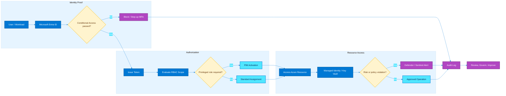

This identity workflow maps authentication, token issuance, RBAC evaluation, privileged access, and security monitoring across Azure environments.
<!-- workflow-diagram:end -->

## Table of Contents

- [Document Objectives](#document-objectives)
- [Core Security Principles](#core-security-principles)
- [Microsoft Entra ID (Azure AD)](#microsoft-entra-id-azure-ad)
- [Azure RBAC](#azure-rbac)
- [Managed Identities](#managed-identities)
- [Service Principals & App Registrations](#service-principals-app-registrations)
- [Conditional Access](#conditional-access)
- [Privileged Identity Management (PIM)](#privileged-identity-management-pim)
- [Azure Key Vault](#azure-key-vault)
- [Microsoft Defender for Cloud](#microsoft-defender-for-cloud)
- [Azure Policy](#azure-policy)
- [Azure Blueprints](#azure-blueprints)
- [Network Security](#network-security)
- [Azure Sentinel (Microsoft Sentinel)](#azure-sentinel-microsoft-sentinel)
- [Azure Information Protection](#azure-information-protection)
- [Identity Protection](#identity-protection)
- [Cross-Service Design Patterns](#cross-service-design-patterns)
- [Azure Security Operations Checklist](#azure-security-operations-checklist)
- [Glossary](#glossary)

---

## Document Objectives

This README is written as a practical Azure cloud engineer handbook for identity, access control, governance, secrets management, posture management, and security operations.

### What this document covers

- Identity foundations in Microsoft Entra ID.
- Authorization design using Azure RBAC and deny assignments.
- Workload authentication using managed identities and service principals.
- Adaptive access controls such as Conditional Access and Identity Protection.
- Privileged administration using PIM and reviews.
- Secret, key, and certificate protection with Key Vault and Managed HSM.
- Continuous governance with Azure Policy and Blueprints.
- Layered network defenses using NSGs, Azure Firewall, WAF, DDoS Protection, and Private Link.
- Threat detection, posture management, and incident response using Defender for Cloud and Microsoft Sentinel.
- Data-centric protection using sensitivity labels, encryption, and DLP-aligned controls.

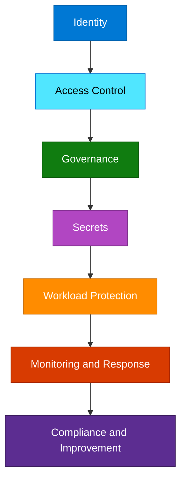

Use this guide to plan secure landing zones, standardize least privilege, protect privileged paths, and build repeatable cloud security baselines.

---

## Core Security Principles

### Recommended principles

- Verify explicitly using strong authentication and trusted signals.
- Use least privilege for people, services, automation, and workloads.
- Assume breach and design layered controls with fast detection.
- Prefer managed identities and federated credentials over stored secrets.
- Use management groups, policy, and templates to scale governance.
- Protect privileged access with just-in-time activation and approvals.
- Reduce public exposure by preferring private endpoints and segmentation.
- Collect logs centrally and automate response for high-confidence detections.
- Treat data as a first-class security boundary using labels and DLP.
- Continuously review assignments, exemptions, and exceptions.

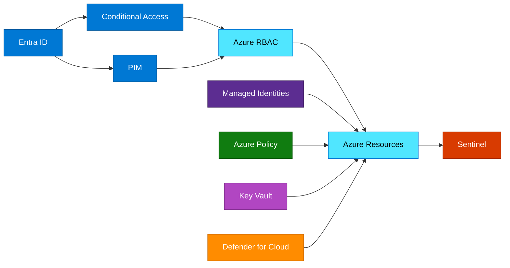

### Baseline implementation order

1. Establish tenant and identity hygiene.
2. Create management group and subscription governance hierarchy.
3. Assign least-privilege RBAC with groups.
4. Enable MFA, Conditional Access, and Identity Protection.
5. Adopt managed identities and centralize secrets in Key Vault.
6. Apply Azure Policy and, where used, Blueprints or equivalent landing zone packaging.
7. Enable Defender for Cloud and log collection.
8. Connect high-value telemetry to Microsoft Sentinel.
9. Review privileged access and compliance state continuously.

---

## Microsoft Entra ID (Azure AD)

Microsoft Entra ID is the identity plane for Azure and Microsoft cloud services. It provides tenant-level administration for users, groups, devices, applications, external identities, and identity governance controls.

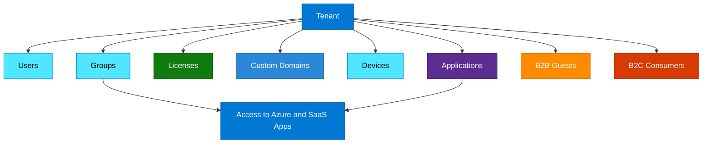

### Explanation

- A tenant is the primary security and administrative boundary for identity objects.
- Users can be cloud-only, synchronized from on-premises, guests, or emergency access accounts.
- Groups simplify access control, licensing, and policy targeting; dynamic groups automate membership.
- Licenses unlock advanced capabilities such as Conditional Access, PIM, and Identity Protection.
- Custom domains align sign-in names with business branding and email domains.
- B2B supports partner collaboration with guest access into your tenant.
- B2C or external identity scenarios support customer-facing authentication journeys.

```bash
# Tenant and account context
az login
az account show --output table
az account tenant list --output table

# User operations
az ad user list --output table
az ad user show --id user1@contoso.com
az ad user create   --display-name "Cloud Engineer 01"   --user-principal-name cloudengineer01@contoso.com   --password 'ChangeM3Now!'

# Group operations
az ad group list --output table
az ad group create   --display-name "rg-prod-contributors"   --mail-nickname "rg-prod-contributors"
az ad group member add   --group rg-prod-contributors   --member-id <user-object-id>

# Domain and guest operations via Microsoft Graph
az rest --method GET   --url 'https://graph.microsoft.com/v1.0/domains'
az rest --method POST   --url 'https://graph.microsoft.com/v1.0/invitations'   --headers 'Content-Type=application/json'   --body '{
    "invitedUserEmailAddress": "partner.user@example.com",
    "inviteRedirectUrl": "https://portal.azure.com",
    "sendInvitationMessage": true
  }'
```

### Security best practices

- Enable MFA for all users and use stronger factors for admins.
- Maintain at least two cloud-only emergency access accounts excluded from risky policy loops.
- Reduce Global Administrator count and use role-assignable groups.
- Separate day-to-day accounts from admin accounts.
- Review guest users, stale accounts, and unused groups regularly.
- Use group-based licensing and access management for scale.
- Validate custom domain DNS ownership carefully before UPN changes.
- Route sign-in and audit logs to Sentinel or a SIEM.
- Use admin units or delegated administration where scope reduction is needed.
- Block legacy protocols that bypass modern authentication controls.

### Deep-dive checklist

- Document tenant ownership and platform administration boundaries.
- Track synchronized identities and source-of-authority dependencies.
- Test B2B invitation redemption and cross-tenant access settings.
- Review group nesting and dynamic rule complexity.
- Confirm premium licensing for advanced security features.
- Validate custom domain verification and rollback procedure.
- Create emergency access monitoring alerts.
- Define naming standards for users, groups, and applications.
- Review sign-in log retention and export settings.
- Align external identity strategy with legal and privacy requirements.
- Separate workforce, partner, and customer identity use cases.
- Document lifecycle workflows for joiner, mover, and leaver events.

---

## Azure RBAC

Azure RBAC controls authorization to Azure Resource Manager scopes. It answers who can perform which action at which scope and under what inheritance path.

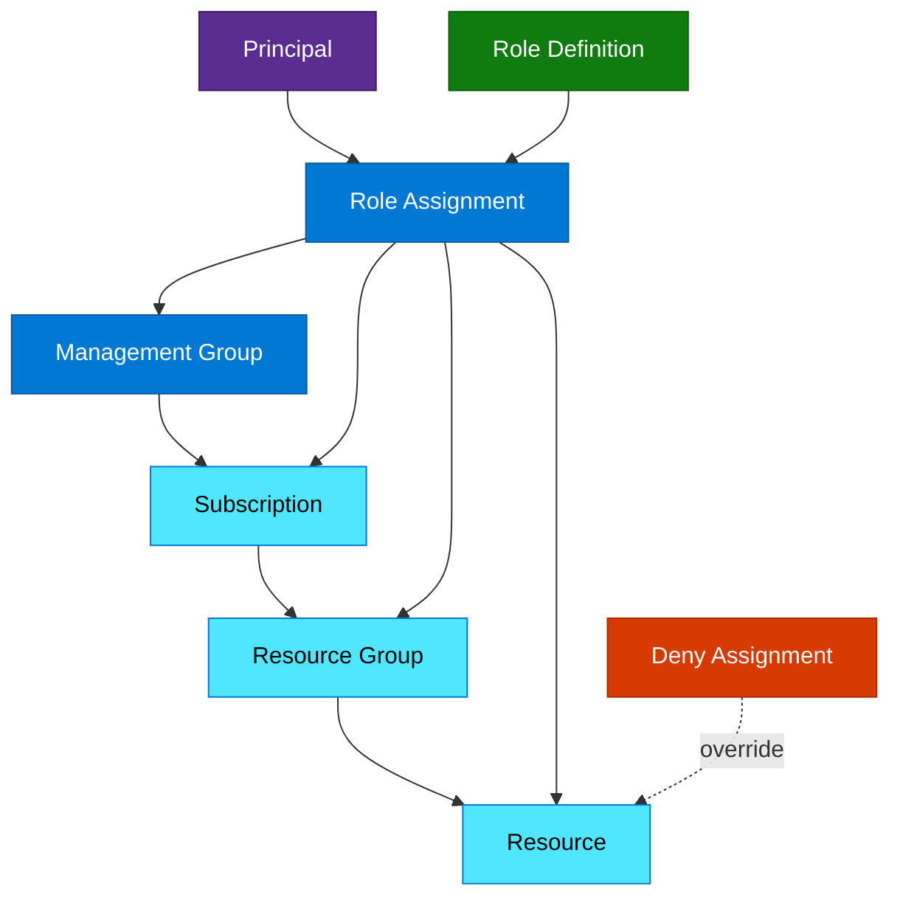

### Explanation

- Built-in roles such as Owner, Contributor, and Reader are the most common starting points.
- Owner includes role assignment permission and is therefore highly privileged.
- Contributor can manage resources but cannot generally assign access.
- Reader is view-only and suitable for support or audit scenarios.
- Custom roles allow least-privilege tailoring when built-in roles are too broad.
- Scope hierarchy flows from management group to subscription to resource group to resource.
- Deny assignments can explicitly block operations, even if an allow role exists through inheritance.

> 
>
> *Screenshot source: [Microsoft Learn — Assign Azure roles using the Azure portal - Azure RBAC](https://learn.microsoft.com/en-us/azure/role-based-access-control/role-assignments-portal). © Microsoft Corporation. Used for educational reference only.*

> **Portal View:** Navigate to `Azure Portal` → `Subscription` or `Resource group` → `Access control (IAM)` → `Add` → `Add role assignment`. The wizard shows role, member, and scope review steps that should map to your least-privilege design.
>
> *For the latest portal screenshots, see [Microsoft Learn — Assign Azure roles using the Azure portal - Azure RBAC](https://learn.microsoft.com/en-us/azure/role-based-access-control/role-assignments-portal).* 

### Step-by-step RBAC assignment pattern

1. Identify the correct **scope** first; most access should be assigned at resource group or resource level, not subscription-wide.
2. Assign access to an **Entra group** instead of directly to an individual wherever possible.
3. Choose the smallest built-in or custom role that satisfies the operational task.
4. Record the ticket, owner, and expiry or review date for privileged assignments.
5. Validate the effective access with a test user or `az role assignment list` before closing the change.

```bash
# Subscription context
az account set --subscription "Production-Subscription"

# Role definitions
az role definition list --output table
az role definition list --name Owner --output json

# Role assignments
az role assignment list   --scope /subscriptions/<subscription-id>   --output table
az role assignment create   --assignee user1@contoso.com   --role Reader   --scope /subscriptions/<subscription-id>/resourceGroups/rg-sec-prod
az role assignment create   --assignee <group-object-id>   --role Contributor   --scope /subscriptions/<subscription-id>
az role assignment delete   --assignee <principal-id>   --role Reader   --scope /subscriptions/<subscription-id>/resourceGroups/rg-sec-prod

# Custom roles
az role definition create --role-definition ./custom-role.json
az role definition update --role-definition ./custom-role.json
az role definition delete --name "Custom Support Operator"
```

```json
{
  "Name": "Storage Blob Reader Custom",
  "IsCustom": true,
  "Description": "Read blobs without broader storage administration.",
  "Actions": [
    "Microsoft.Storage/storageAccounts/read"
  ],
  "NotActions": [],
  "DataActions": [
    "Microsoft.Storage/storageAccounts/blobServices/containers/blobs/read"
  ],
  "NotDataActions": [],
  "AssignableScopes": [
    "/subscriptions/<subscription-id>"
  ]
}
```

### Security best practices

- Prefer group-based role assignments over direct user assignments.
- Use Owner sparingly and only where role assignment capability is required.
- Assign access at the narrowest practical scope.
- Use custom roles to shrink Contributor-level access where possible.
- Review inherited permissions from management groups and subscriptions.
- Audit role changes with activity logs and alerts.
- Use PIM for privileged RBAC roles.
- Review orphaned role assignments to deleted principals.
- Separate control plane and data plane privilege design.
- Document all exceptions and break-glass paths.

### Deep-dive checklist

- Map platform, application, support, and audit personas to roles.
- Define management group hierarchy aligned to governance boundaries.
- Create role assignment review cadence.
- Validate whether data actions are needed for storage, Key Vault, or SQL.
- Check deny assignments created by managed services or deployment stacks.
- Avoid subscription-wide Contributor for CI/CD unless justified.
- Track custom role JSON in version control.
- Test propagation expectations after RBAC changes.
- Use separate groups for production and nonproduction access.
- Document who can create custom roles.
- Define alerting on privileged role assignment changes.
- Correlate RBAC changes with ticketing or CAB process.

---

## Managed Identities

Managed identities provide Entra-backed service identities for Azure resources. They eliminate the need to store secrets for many Azure-native workloads.

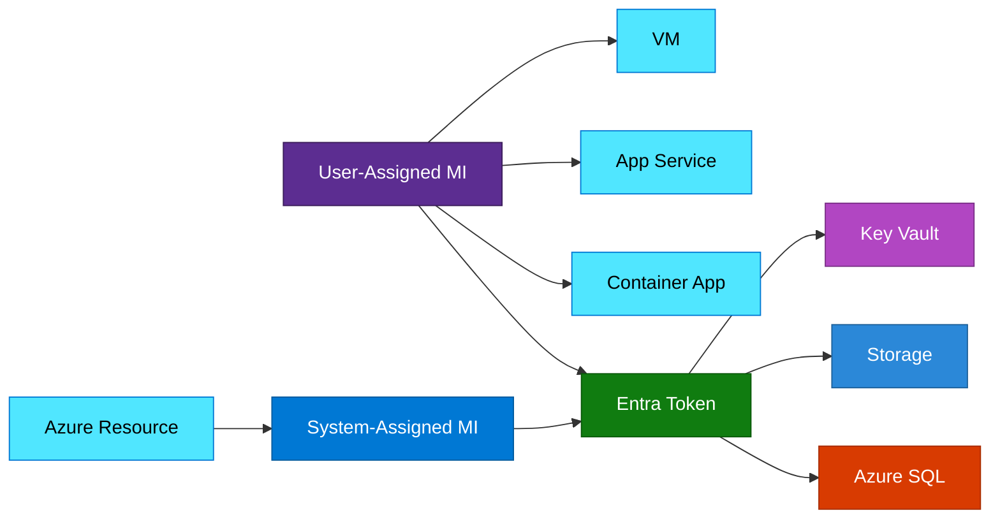

### Explanation

- System-assigned managed identities are tied to a single resource lifecycle.
- User-assigned managed identities are standalone resources that can be attached to multiple services.
- Many Azure compute and PaaS services support managed identities, including VMs, App Service, Functions, AKS-related patterns, and Container Apps.
- Managed identities commonly access Key Vault, Storage, SQL, and ARM APIs without embedded credentials.
- Access still requires correct RBAC or service-specific permission grants at the target resource.

```bash
# Create and view a user-assigned managed identity
az identity create   --name id-platform-shared   --resource-group rg-identity-prod   --location eastus
az identity show   --name id-platform-shared   --resource-group rg-identity-prod   --output json

# Enable system-assigned identities
az vm identity assign   --name vm-app-01   --resource-group rg-app-prod
az webapp identity assign   --name webapp-prod-01   --resource-group rg-app-prod

# Attach a user-assigned identity
az vm identity assign   --name vm-app-01   --resource-group rg-app-prod   --identities /subscriptions/<subscription-id>/resourceGroups/rg-identity-prod/providers/Microsoft.ManagedIdentity/userAssignedIdentities/id-platform-shared

# Grant access to Key Vault and Storage
az role assignment create   --assignee <managed-identity-principal-id>   --role "Key Vault Secrets User"   --scope /subscriptions/<subscription-id>/resourceGroups/rg-sec-prod/providers/Microsoft.KeyVault/vaults/kv-prod-01
az role assignment create   --assignee <managed-identity-principal-id>   --role "Storage Blob Data Reader"   --scope /subscriptions/<subscription-id>/resourceGroups/rg-data-prod/providers/Microsoft.Storage/storageAccounts/stprod001
```

### Security best practices

- Prefer managed identities over client secrets for Azure-hosted workloads.
- Use system-assigned identities for one-to-one workload trust.
- Use user-assigned identities only when shared lifecycle and trust are intentional.
- Grant only the minimum data plane permissions required.
- Keep Key Vault and storage behind private networking where possible.
- Monitor identity assignments and removals.
- Avoid sharing a single user-assigned identity across unrelated security boundaries.
- Document identity ownership and downstream permissions.
- Review unused user-assigned identities and detach them.
- Use different managed identities for runtime, deployment, and administration paths.

### Deep-dive checklist

- List which services in your platform support managed identity natively.
- Document which target services need RBAC vs service-specific authorization.
- Validate IMDS or workload token retrieval path in the chosen service.
- Test Key Vault secret retrieval with least privilege role only.
- Create SQL contained users for Entra-based database access where needed.
- Track user-assigned identity reuse to avoid blast radius growth.
- Monitor sign-in and token failures for workload identities.
- Separate dev, test, and prod identities.
- Align identities with application ownership boundaries.
- Audit role assignment growth attached to managed identities.
- Plan rotation-free designs around managed identities whenever possible.
- Review managed identity support and limitations per service SKU.

---

## Service Principals & App Registrations

App registrations define the application object in Entra ID, while service principals represent that application in a tenant for authentication and authorization.

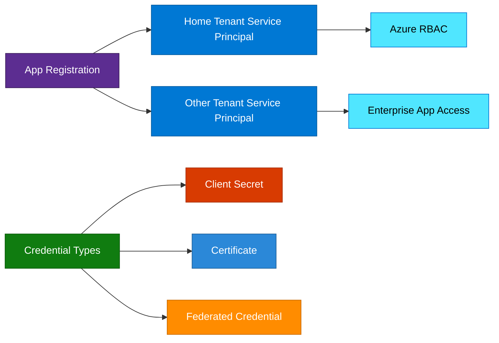

### Explanation

- The application object is the blueprint of the app registration.
- A service principal is the local tenant instance used for sign-in and access grants.
- Client secrets are simple but higher risk because they are shared text credentials.
- Certificates are stronger and better suited to enterprise automation.
- Federated credentials allow OIDC-based trust for platforms like GitHub Actions without storing secrets.
- Service principals are often used for automation, CI/CD, and external workloads that cannot use managed identities.

```bash
# Create a service principal with RBAC assignment
az ad sp create-for-rbac   --name sp-automation-prod   --role Reader   --scopes /subscriptions/<subscription-id>   --output json

# Create app and service principal separately
az ad app create --display-name app-platform-api-prod
az ad sp create --id <app-id>
az ad sp list --display-name sp-automation-prod --output table

# Rotate credentials
az ad sp credential reset   --id <app-id>   --append
az ad app credential reset   --id <app-id>   --cert "@server.pem"   --append

# Add federated credential using Graph
az rest --method POST   --url 'https://graph.microsoft.com/beta/applications/<application-object-id>/federatedIdentityCredentials'   --headers 'Content-Type=application/json'   --body '{
    "name": "github-main-branch",
    "issuer": "https://token.actions.githubusercontent.com",
    "subject": "repo:contoso/platform-repo:ref:refs/heads/main",
    "audiences": ["api://AzureADTokenExchange"]
  }'
```

### Security best practices

- Prefer managed identities when the workload runs in Azure.
- Prefer federated credentials over client secrets for CI/CD.
- Prefer certificates over client secrets when app credentials are required.
- Restrict who can create app registrations and enterprise apps.
- Scope service principal RBAC narrowly and avoid subscription-wide Contributor by default.
- Rotate secrets and certificates before expiration.
- Track ownership and purpose for every app registration.
- Review unused service principals and stale credentials.
- Monitor workload identity sign-ins and risky consent events.
- Separate deployment identities from runtime identities.

### Deep-dive checklist

- Define which teams can create or approve new app registrations.
- Inventory secrets, certificates, and federated credentials per application.
- Set expiration policies and alerting for credentials.
- Review app permissions and admin consent scope.
- Correlate pipeline repositories to federated credential entries.
- Disable or delete stale service principals.
- Document home tenant and multitenant exposure.
- Protect certificate private keys with approved storage and issuance paths.
- Avoid embedding credentials in source control or CI variables when federation is possible.
- Track privileged service principals in PIM-compatible operational review processes.
- Use least-privilege API permissions for Graph and other SaaS integrations.
- Implement break-glass recovery for critical automation identities.

---

## Conditional Access

Conditional Access is the policy engine that evaluates identity and session context to allow, challenge, or block access.

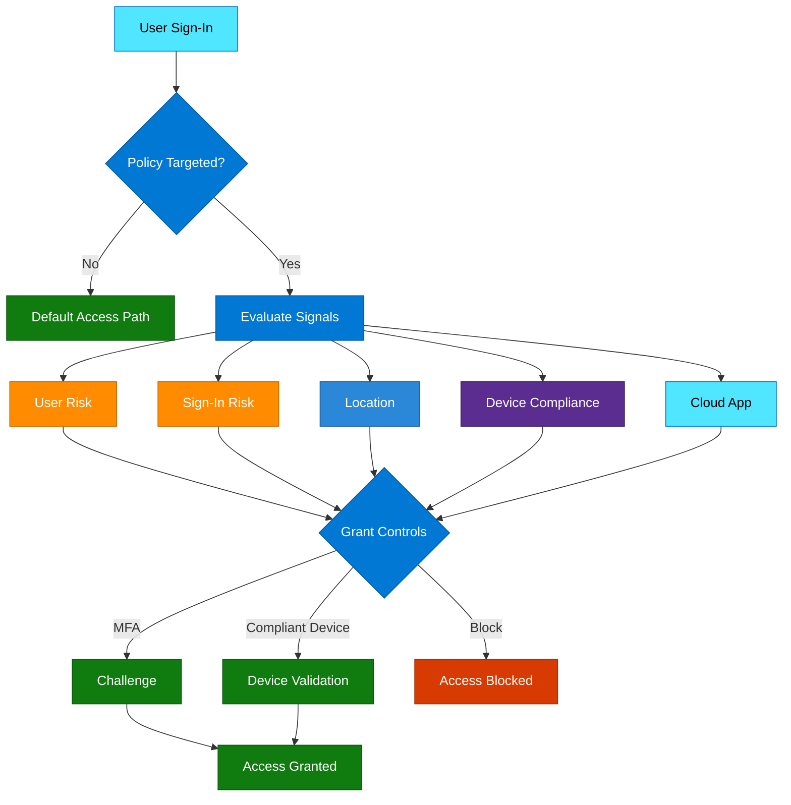

### Explanation

- Policies can target users, groups, roles, applications, locations, devices, platforms, and risk states.
- Signals include user risk, sign-in risk, location, device compliance, and application context.
- Grant controls include MFA, compliant device, password change, terms of use, or block.
- Named locations simplify repeated trusted or blocked IP and geography definitions.
- Conditional Access is most effective when designed in phases and monitored in report-only mode first.

> **Portal View:** Navigate to `Microsoft Entra admin center` → `Protection` → `Conditional Access` → `Policies`. The experience shows assignments, conditions, grant controls, session controls, and report-only state used during safe rollout.
>
> *For the latest portal screenshots, see [Microsoft Learn — Plan a Conditional Access deployment](https://learn.microsoft.com/en-us/entra/identity/conditional-access/plan-conditional-access).* 

> **Portal View:** Navigate to `Microsoft Entra admin center` → `Roles and administrators` or `Privileged Identity Management`. These blades show eligible assignments, approval requirements, MFA-on-activation, and access reviews for privileged identities.
>
> *For the latest portal screenshots, see [Microsoft Learn — What is Privileged Identity Management?](https://learn.microsoft.com/en-us/entra/id-governance/privileged-identity-management/pim-configure).* 

### Conditional Access rollout sequence

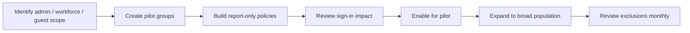

### Real-world rollout examples

| Scenario | Policy direction | Why |
| --- | --- | --- |
| Privileged admins | Require MFA and phishing-resistant auth, exclude break-glass | Protects the highest-value control plane paths |
| Finance SaaS access | Require compliant device or trusted session controls | Reduces data exfiltration risk for sensitive apps |
| External partner portal | Separate guest policy with limited exclusions | Prevents employee policy assumptions from breaking partner access |
| Legacy protocols discovered | Block after reporting period and remediation plan | Removes old auth paths without surprise outage |

```bash
# List Conditional Access policies
az rest --method GET   --url 'https://graph.microsoft.com/v1.0/identity/conditionalAccess/policies'

# Create a named location example
az rest --method POST   --url 'https://graph.microsoft.com/v1.0/identity/conditionalAccess/namedLocations'   --headers 'Content-Type=application/json'   --body '{
    "@odata.type": "#microsoft.graph.countryNamedLocation",
    "displayName": "Trusted Countries",
    "countriesAndRegions": ["US", "CA"],
    "includeUnknownCountriesAndRegions": false
  }'

# Create an MFA policy for admins in report-only mode
az rest --method POST   --url 'https://graph.microsoft.com/v1.0/identity/conditionalAccess/policies'   --headers 'Content-Type=application/json'   --body '{
    "displayName": "Require MFA for Azure Admins",
    "state": "enabledForReportingButNotEnforced",
    "conditions": {
      "users": {
        "includeRoles": ["62e90394-69f5-4237-9190-012177145e10"]
      },
      "applications": {
        "includeApplications": ["All"]
      }
    },
    "grantControls": {
      "operator": "OR",
      "builtInControls": ["mfa"]
    }
  }'
```

### Security best practices

- Deploy policies in report-only mode before enforcement.
- Exclude emergency access accounts from standard policy loops.
- Require MFA for all admins and privileged operations.
- Block legacy authentication.
- Use phishing-resistant authentication strengths where possible.
- Require compliant or managed devices for sensitive applications.
- Avoid overtrusting IP-based named locations alone.
- Review sign-in logs and policy impact during rollout.
- Pair Conditional Access with Identity Protection risk-based policies.
- Time-bound and document all policy exclusions.

### Deep-dive checklist

- Define break-glass exclusions before policy rollout.
- Inventory applications that still rely on legacy auth.
- Separate admin, workforce, partner, and high-risk app policies.
- Validate device compliance integration with Intune where applicable.
- Review sign-in failure analytics during pilot.
- Define named locations for trusted egress only when justified.
- Use staged rollout groups for new policy families.
- Evaluate session controls for browser-based access.
- Test policy interactions with guest users and B2B trust settings.
- Document emergency rollback steps.
- Map controls to regulatory access requirements.
- Review report-only results after each policy change.

---

## Privileged Identity Management (PIM)

PIM reduces standing privilege by making sensitive roles eligible and requiring activation controls such as MFA, justification, approvals, and short durations.

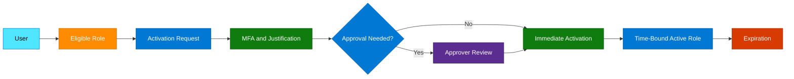

### Explanation

- Eligible assignments mean a user can activate a role when needed instead of holding it permanently.
- Active assignments mean the role is currently in effect.
- PIM supports just-in-time access for Entra roles and Azure RBAC roles.
- Approval workflows, justifications, and ticket references improve governance.
- Access reviews and notifications help clean up stale privileged assignments.

```bash
# Role management policy assignments
az rest --method GET   --url 'https://graph.microsoft.com/v1.0/policies/roleManagementPolicyAssignments'

# Eligible and active schedules
az rest --method GET   --url 'https://graph.microsoft.com/v1.0/roleManagement/directory/roleEligibilityScheduleInstances'
az rest --method GET   --url 'https://graph.microsoft.com/v1.0/roleManagement/directory/roleAssignmentScheduleInstances'

# Self-activate an eligible role example
az rest --method POST   --url 'https://graph.microsoft.com/v1.0/roleManagement/directory/roleAssignmentScheduleRequests'   --headers 'Content-Type=application/json'   --body '{
    "action": "selfActivate",
    "principalId": "<user-object-id>",
    "roleDefinitionId": "<role-definition-id>",
    "directoryScopeId": "/",
    "justification": "Production support incident",
    "scheduleInfo": {
      "startDateTime": "2025-01-15T10:00:00Z",
      "expiration": {
        "type": "afterDuration",
        "duration": "PT2H"
      }
    }
  }'
```

### Security best practices

- Make privileged access eligible instead of permanently active whenever possible.
- Require MFA and justification for activation.
- Require approvals for the highest-risk roles.
- Keep activation windows short.
- Review privileged assignments quarterly or more frequently.
- Protect approvers with strong authentication and separate admin accounts.
- Integrate PIM alerts with monitoring workflows.
- Track repeated or unusual activations.
- Use PIM for Azure RBAC and Entra roles, not just directory roles.
- Maintain documented emergency access and approver failure paths.

### Deep-dive checklist

- Categorize roles by risk and required activation duration.
- Define which roles require approval, ticket, or incident number.
- Schedule access reviews and define reviewers.
- Test notification and approval routing.
- Monitor failed or denied activation attempts.
- Document time zones and activation windows for global teams.
- Check which roles remain permanently active and justify them.
- Review group-based role activation patterns.
- Ensure break-glass access is outside normal approval loops but tightly monitored.
- Correlate activations with production changes or incidents.
- Retain audit records according to compliance requirements.
- Validate PIM coverage for both Azure and identity planes.

---

## Azure Key Vault

Azure Key Vault stores secrets, keys, and certificates, while Managed HSM offers dedicated HSM-backed key management for high-assurance cryptographic scenarios.

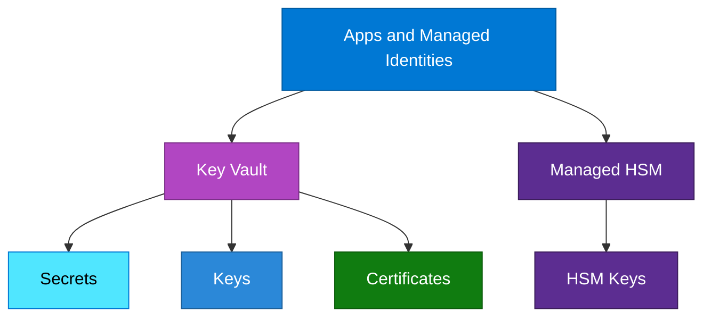

### Explanation

- Vaults store secrets, keys, and certificates in a centralized security boundary.
- Managed HSM is best for dedicated HSM-backed key management and strict compliance needs.
- Key Vault supports both legacy access policies and Azure RBAC for data-plane authorization.
- Soft delete and purge protection protect against accidental or malicious deletion.
- Rotation strategy should include secret expiration, key rotation, certificate renewal, and application testing.

```bash
# Create vault and managed HSM
az keyvault create   --name kv-prod-01   --resource-group rg-sec-prod   --location eastus   --enable-rbac-authorization true
az keyvault create   --hsm-name mhsm-prod-01   --resource-group rg-sec-prod   --location eastus

# Secrets, keys, certificates
az keyvault secret set   --vault-name kv-prod-01   --name DbPassword   --value 'SuperSecretValue123!'
az keyvault secret list --vault-name kv-prod-01 --output table
az keyvault key create   --vault-name kv-prod-01   --name cmk-storage-prod   --kty RSA-HSM
az keyvault certificate import   --vault-name kv-prod-01   --name webcert-prod   --file ./webcert.pfx

# Show settings and recover deleted object
az keyvault show --name kv-prod-01 --resource-group rg-sec-prod --output json
az keyvault secret recover --vault-name kv-prod-01 --name DbPassword
```

### Security best practices

- Prefer Azure RBAC for new Key Vault authorization designs.
- Enable soft delete and purge protection.
- Use private endpoints and firewall restrictions for sensitive vaults.
- Separate secret readers from secret administrators.
- Use Managed HSM for the strongest key assurance requirements.
- Rotate objects on defined schedules and alert before expiry.
- Enable and retain diagnostic logs for data-plane access.
- Avoid embedding secrets in code, pipelines, or app settings if Key Vault references work.
- Restrict purge and delete operations to very small admin sets.
- Test recovery and restore procedures regularly.

### Deep-dive checklist

- Decide whether each workload needs secrets, keys, certificates, or all three.
- Choose RBAC or legacy policies and document the rationale.
- Map each consuming app identity to a least-privilege vault role.
- Plan network isolation with private endpoints and DNS.
- Define deletion recovery and purge approval procedures.
- Track certificate renewal ownership and lead times.
- Review key rotation compatibility with downstream services.
- Audit data-plane logs for unusual secret reads.
- Use separate vaults for different sensitivity zones where needed.
- Validate cross-subscription and cross-region design constraints.
- Protect HSM admin access with PIM.
- Review backup and restore strategy for critical keys and objects.

---

## Microsoft Defender for Cloud

Microsoft Defender for Cloud combines cloud security posture management with workload protection across Azure, hybrid, and multicloud resources.

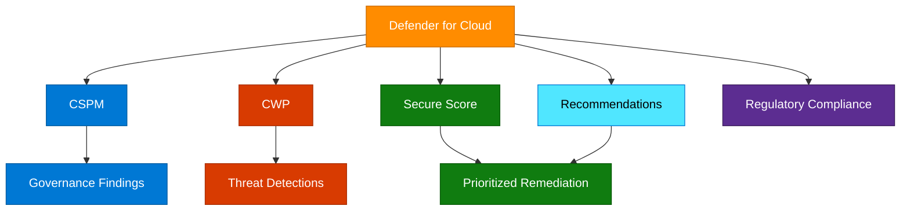

### Explanation

- CSPM continuously assesses configuration posture against best practices and standards.
- CWP adds service-specific detection and protection for servers, containers, SQL, storage, and other workloads.
- Secure Score helps prioritize improvement and measure posture change over time.
- Recommendations identify control gaps, while compliance dashboards map controls to standards.
- Defender for Cloud often relies on Azure Policy under the hood for assessment and compliance logic.

```bash
# Pricing tiers and plans
az security pricing list --output table
az security pricing create   --name VirtualMachines   --tier Standard

# Recommendations and score
az security assessment list --output table
az security secure-score-control list --output table
az security secure-score list --output table

# Compliance and alerts
az security regulatory-compliance-controls list --output table
az security alert list --output table
```

### Security best practices

- Enable Defender plans for the workloads you actually operate.
- Prioritize high-severity and high-confidence recommendations first.
- Use Secure Score trends rather than point-in-time score alone.
- Integrate alerts with Sentinel or ticketing workflows.
- Review exceptions and suppressed findings periodically.
- Align compliance dashboards with actual regulatory commitments.
- Tag and route recommendations to owning teams.
- Enable required data collection and agentless features where applicable.
- Investigate repeated workload detections quickly.
- Use Defender and Policy together rather than as separate programs.

### Deep-dive checklist

- Select which plans are enabled per subscription and environment.
- Define ownership for server, container, storage, and SQL findings.
- Review secure score controls with largest point impact.
- Track false positives and tune response workflows.
- Map recommendations to remediation playbooks.
- Check multicloud connectors and scope boundaries if used.
- Review cost impact per enabled plan.
- Validate alert routing into SIEM and SOAR tooling.
- Compare compliance gaps against audit timelines.
- Use governance meetings to review top recurring findings.
- Correlate Defender alerts with identity and network telemetry.
- Measure remediation aging and backlog.

---

## Azure Policy

Azure Policy enforces and audits standards on resources and subscriptions. It is a core governance mechanism for landing zones and continuous compliance.

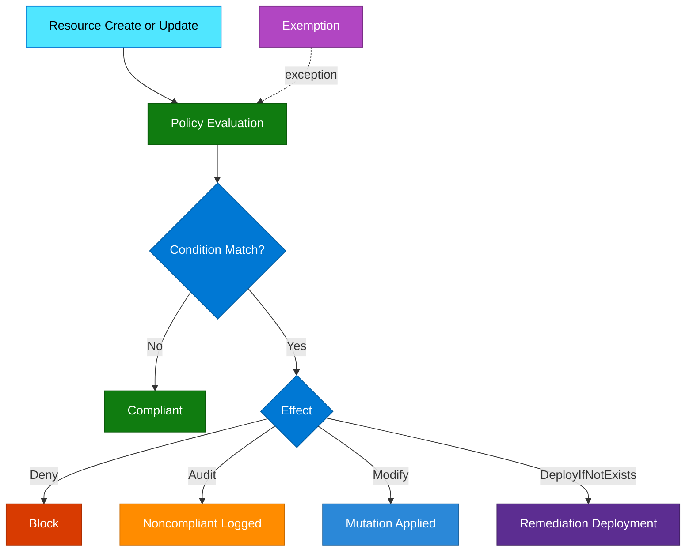

### Explanation

- Policy definitions contain evaluation logic.
- Initiatives bundle multiple related policy definitions.
- Assignments apply policies or initiatives at a scope such as management group or subscription.
- Effects such as deny, audit, modify, and deployIfNotExists determine enforcement behavior.
- Exemptions provide controlled exceptions with approval and expiration metadata.
- Compliance reporting shows which resources are compliant or drifting.

```bash
# Definitions and initiatives
az policy definition list --output table
az policy definition create   --name require-tags-prod   --display-name "Require CostCenter tag"   --description "Ensures CostCenter tag exists"   --rules ./policy-rule.json   --mode All
az policy set-definition create   --name security-baseline-initiative   --definitions ./initiative.json   --display-name "Security Baseline Initiative"

# Assignments and compliance
az policy assignment create   --name enforce-storage-https   --policy <policy-definition-id>   --scope /subscriptions/<subscription-id>
az policy assignment create   --name corp-security-baseline   --policy-set-definition security-baseline-initiative   --scope /providers/Microsoft.Management/managementGroups/<mg-id>
az policy state list --output table
az policy remediation create   --name remediate-storage-diagnostics   --policy-assignment enforce-storage-https
az policy exemption create   --name exempt-legacy-app   --policy-assignment corp-security-baseline   --scope /subscriptions/<subscription-id>/resourceGroups/rg-legacy-app   --exemption-category Waiver   --display-name "Legacy app waiver"
```

### Security best practices

- Assign baseline initiatives high in the hierarchy for consistency.
- Use deny for critical guardrails such as region or public exposure restrictions.
- Use modify and deployIfNotExists to automate compliant settings.
- Version-control custom policy definitions and initiatives.
- Time-limit exemptions and require business justification.
- Test custom policy in lower environments before production.
- Review compliance drift continuously and remediate aging items.
- Align policy with landing zone architecture and reference architectures.
- Combine policy with Defender for Cloud for posture visibility.
- Avoid policy sprawl without ownership and documentation.

### Deep-dive checklist

- Decide which controls belong at management group vs subscription scope.
- Bundle security controls into initiatives by platform domain.
- Create owner mapping for each policy family.
- Define exemption approval workflow and expiration handling.
- Use remediation tasks for deployIfNotExists or modify where applicable.
- Track noncompliance aging metrics.
- Review impact of deny policies on developer experience.
- Test policy effects on ARM, Bicep, Terraform, and portal workflows.
- Document required parameters and assignments.
- Monitor policy evaluation failures or alias changes.
- Use initiatives for regulatory mapping when practical.
- Correlate high-value policy drift with incident management.

---

## Azure Blueprints

Azure Blueprints package governance artifacts such as policy assignments, RBAC, templates, and resource groups into reusable subscription bootstrap definitions. Many organizations now combine or replace this with modern IaC and template-based landing zone patterns, but the conceptual model remains valuable.

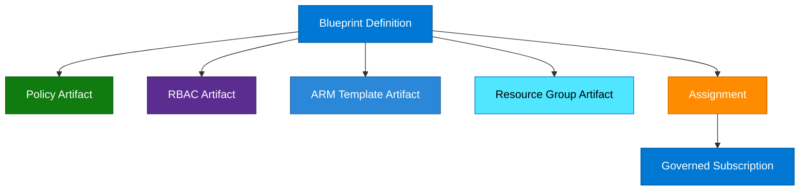

### Explanation

- A blueprint definition is a reusable governance package.
- Assignments apply a specific blueprint version to a subscription.
- Artifacts can include policy, RBAC assignments, ARM templates, and resource groups.
- Blueprints help standardize subscription provisioning in controlled environments.
- Even where Blueprints are not the preferred modern approach, the concepts overlap with landing zone packaging.

```bash
# Extension and listing
az extension add --name blueprint
az blueprint list --output table
az blueprint show --name corp-sec-baseline --output json

# Create and publish blueprint
az blueprint create   --name corp-sec-baseline   --management-group <mg-id>   --description "Governed subscription baseline"
az blueprint artifact list   --name corp-sec-baseline   --management-group <mg-id>   --output table
az blueprint publish   --name corp-sec-baseline   --management-group <mg-id>   --version v1.0

# Assign blueprint
az blueprint assignment create   --name corp-sec-baseline-assignment   --blueprint-version /providers/Microsoft.Management/managementGroups/<mg-id>/providers/Microsoft.Blueprint/blueprints/corp-sec-baseline/versions/v1.0   --subscription <subscription-id>   --location eastus
```

### Security best practices

- Treat blueprint definitions as code with version control.
- Use management groups to centralize blueprint governance.
- Minimize broad RBAC artifacts within blueprints.
- Test new versions before large-scale assignment rollout.
- Pair blueprint usage with Policy compliance monitoring.
- Document assignment ownership and rollback procedure.
- Avoid embedding secrets in templates or parameters.
- Keep artifact intent and parameterization clear to consumers.
- Review whether Template Specs, Bicep, Terraform, or policy-driven landing zones are now better fits.
- Align blueprint content to the same security baseline used elsewhere.

### Deep-dive checklist

- Inventory existing blueprint definitions and assignments.
- Identify whether blueprints are part of the current platform standard or legacy estate.
- Map artifacts to responsible engineering teams.
- Review versions deployed across subscriptions.
- Check whether blueprint-assigned RBAC is still appropriate.
- Confirm policy artifacts match current baseline standards.
- Review ARM template artifacts for deprecated resource types.
- Test assignment remediation and unassignment procedures.
- Document how blueprints integrate with CI/CD or change management.
- Evaluate migration path to modern landing zone tooling if needed.
- Protect blueprint administrators with PIM.
- Avoid unmanaged divergence between blueprint and actual deployed state.

---

## Network Security

Azure network security is layered. Identity, segmentation, filtering, inspection, private connectivity, and DDoS resilience work together rather than as isolated controls.

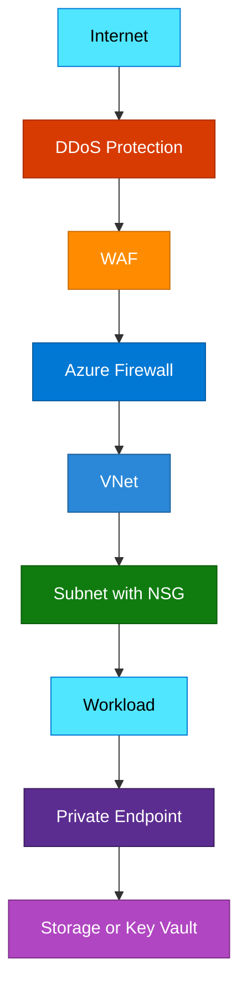

### Explanation

- NSGs provide stateful L3/L4 traffic filtering at subnet and NIC level.
- Azure Firewall centralizes egress and ingress rule enforcement with application and network rules.
- WAF protects HTTP/S applications from common web attacks at layer 7.
- DDoS Protection strengthens resilience of public endpoints against volumetric attacks.
- Private Link gives private IP-based access to PaaS services and reduces public exposure.

```bash
# NSG and rules
az network nsg create   --name nsg-app-prod   --resource-group rg-net-prod   --location eastus
az network nsg rule create   --resource-group rg-net-prod   --nsg-name nsg-app-prod   --name AllowHttpsInbound   --priority 100   --direction Inbound   --access Allow   --protocol Tcp   --source-address-prefixes Internet   --source-port-ranges '*'   --destination-address-prefixes '*'   --destination-port-ranges 443

# Azure Firewall and DDoS
az network firewall create   --name azfw-hub-prod   --resource-group rg-net-prod   --location eastus
az network firewall application-rule create   --firewall-name azfw-hub-prod   --resource-group rg-net-prod   --collection-name AllowMicrosoft   --name AllowPortal   --protocols Http=80 Https=443   --source-addresses 10.0.0.0/16   --target-fqdns portal.azure.com   --action Allow   --priority 200
az network ddos-protection create   --name ddos-prod   --resource-group rg-net-prod   --location eastus

# Private endpoint example
az network private-endpoint create   --name pe-kv-prod-01   --resource-group rg-net-prod   --vnet-name vnet-hub-prod   --subnet snet-private-endpoints   --private-connection-resource-id /subscriptions/<subscription-id>/resourceGroups/rg-sec-prod/providers/Microsoft.KeyVault/vaults/kv-prod-01   --group-id vault   --connection-name kv-prod-01-conn
```

### Security best practices

- Apply defense in depth across network and identity controls.
- Deny by default and allow only required flows.
- Use hub-and-spoke or equivalent segmentation for centralized inspection.
- Protect all internet-facing web apps with WAF.
- Protect high-value public endpoints with DDoS Network Protection.
- Use Private Link for sensitive PaaS services.
- Separate management, application, and data subnets.
- Collect NSG flow logs and firewall diagnostics.
- Review NSG rule sprawl and unused allows periodically.
- Send network security telemetry to Sentinel.

### Deep-dive checklist

- Map every ingress path to a specific control point.
- Review east-west movement restrictions between tiers.
- Validate firewall egress control for outbound internet access.
- Define standard NSG baselines for management and workload subnets.
- Tune WAF policies to reduce false positives without disabling protection broadly.
- Ensure private endpoint DNS resolution is correct across VNets and on-prem networks.
- Check whether PaaS public access can be disabled safely.
- Review DDoS plan coverage for all critical public IP resources.
- Correlate network and identity events for incident response.
- Avoid exposing admin ports publicly; prefer JIT or bastion patterns.
- Document emergency bypass or break-fix network procedures.
- Test disaster recovery network security parity across regions.

---

## Azure Sentinel (Microsoft Sentinel)

Microsoft Sentinel is a cloud-native SIEM and SOAR platform built on top of Log Analytics workspaces and Microsoft security integrations.

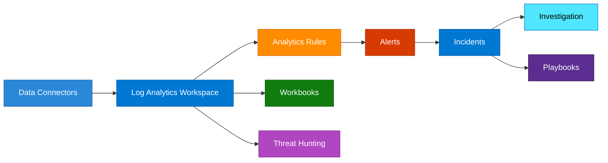

### Explanation

- Data connectors ingest logs from Azure, Entra, Defender, Microsoft 365, and third-party tools.
- Analytics rules generate alerts from detections and correlations.
- Incidents group related alerts for analyst workflow and case management.
- Playbooks provide SOAR automation using Logic Apps.
- Workbooks offer dashboards and operational reporting.
- Threat hunting uses KQL-driven queries to proactively find suspicious patterns.

```bash
# Sentinel extension
az extension add --name sentinel

# Rules and incidents
az sentinel alert-rule list   --resource-group rg-sec-ops   --workspace-name law-sec-prod   --output table
az sentinel incident list   --resource-group rg-sec-ops   --workspace-name law-sec-prod   --output table
az sentinel incident show   --resource-group rg-sec-ops   --workspace-name law-sec-prod   --incident-id <incident-id>

# Hunting and connectors
az sentinel hunting-query list   --resource-group rg-sec-ops   --workspace-name law-sec-prod   --output table
az rest --method GET   --url 'https://management.azure.com/subscriptions/<subscription-id>/resourceGroups/rg-sec-ops/providers/Microsoft.OperationalInsights/workspaces/law-sec-prod/providers/Microsoft.SecurityInsights/dataConnectors?api-version=2024-03-01'
```

### Security best practices

- Ingest identity, control plane, and network telemetry first.
- Use a clear workspace and retention strategy.
- Tune analytics to reduce false positives and noise.
- Automate repetitive response actions with playbooks.
- Protect Sentinel administrative access with PIM.
- Use entity mapping to improve investigations.
- Connect Defender for Cloud and Entra logs for richer context.
- Review ingestion cost and retention decisions regularly.
- Run purple-team tests to validate detections.
- Define incident severity and ownership processes.

### Deep-dive checklist

- Prioritize which connectors are mandatory on day one.
- Review analytic rules for duplicate or overlapping detections.
- Establish triage runbooks for common identity and cloud incidents.
- Define automation boundaries and human approval points.
- Map entity enrichment needs to detection quality.
- Track incident mean time to triage and close.
- Create workbooks for identity risk, admin activity, and public exposure.
- Define KQL standards and saved hunt libraries.
- Retain enough data for threat hunting and investigations.
- Review SOC access roles and segregation of duties.
- Align incident fields with ticketing integration.
- Validate region, residency, and compliance requirements for log storage.

---

## Azure Information Protection

Azure Information Protection capabilities, now commonly realized through Microsoft Purview Information Protection and sensitivity labels, protect data by classification, labeling, encryption, and policy-driven handling.

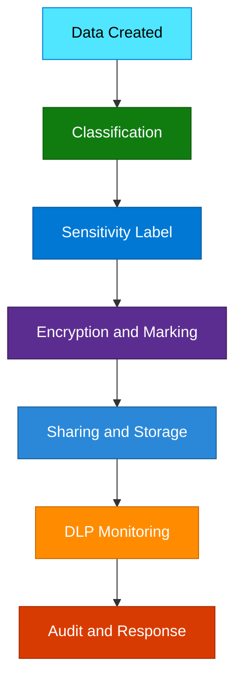

### Explanation

- Sensitivity labels classify and protect data based on business sensitivity.
- Labels can apply visual markings, encryption, and rights restrictions.
- Data classification may be manual, recommended, or automatic.
- Encryption can persist with the content to protect it after sharing.
- DLP complements labels by preventing risky movement or exposure of sensitive data.

```bash
# Session and tenant context
az login
az account show --output table

# Graph queries often used alongside information protection administration
az rest --method GET   --url 'https://graph.microsoft.com/v1.0/organization'
az rest --method GET   --url 'https://graph.microsoft.com/v1.0/subscribedSkus'
az rest --method GET   --url 'https://graph.microsoft.com/beta/security/informationProtection/sensitivityLabels'
```

### Security best practices

- Use a simple label taxonomy that users can understand.
- Auto-label highly sensitive data where confidence is high.
- Encrypt sensitive content by default.
- Align DLP with label taxonomy and handling requirements.
- Train users on when to apply or override labels.
- Review label adoption and false positives.
- Protect label administration with PIM and change control.
- Test external sharing and B2B experiences.
- Avoid label sprawl and overlapping policies.
- Integrate data protection signals with incident response.

### Deep-dive checklist

- Define classification terms with legal and privacy stakeholders.
- Align labels to actual business handling requirements.
- Select which labels use encryption and usage rights.
- Evaluate user experience in Office and line-of-business apps.
- Test DLP policies against common collaboration scenarios.
- Track label coverage for critical repositories and teams.
- Review licensing dependencies for advanced protection features.
- Plan migration from legacy AIP labels if applicable.
- Document admin ownership of labels, policies, and exceptions.
- Build dashboards for label adoption and data movement.
- Test external recipients and partner access outcomes.
- Create incident workflows for repeated DLP violations.

---

## Identity Protection

Identity Protection detects user and sign-in risk using threat intelligence and machine learning, then integrates with Conditional Access for automated response.

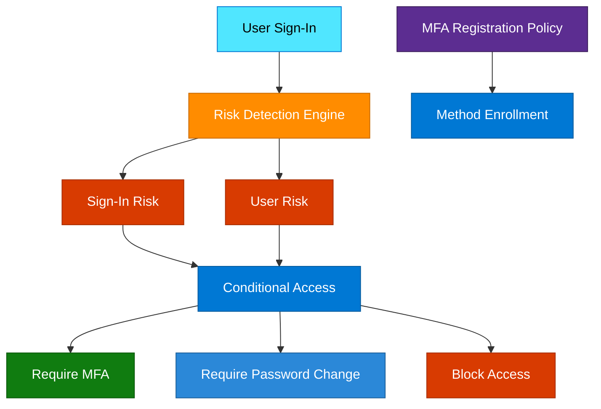

### Explanation

- User risk indicates likelihood the account is compromised.
- Sign-in risk indicates likelihood a specific authentication event is suspicious.
- Risk-based Conditional Access can require MFA, password change, or block access.
- MFA registration policy ensures users have enrolled approved authentication methods.
- Identity Protection is especially valuable for early detection of credential theft and anomalous sign-in patterns.

```bash
# Risky users and sign-ins
az rest --method GET   --url 'https://graph.microsoft.com/v1.0/identityProtection/riskyUsers'
az rest --method GET   --url 'https://graph.microsoft.com/v1.0/identityProtection/riskySignIns'

# MFA registration details
az rest --method GET   --url 'https://graph.microsoft.com/beta/reports/authenticationMethods/userRegistrationDetails'

# Risk response actions
az rest --method POST   --url 'https://graph.microsoft.com/v1.0/identityProtection/riskyUsers/dismiss'   --headers 'Content-Type=application/json'   --body '{"userIds": ["<user-object-id>"]}'
az rest --method POST   --url 'https://graph.microsoft.com/v1.0/identityProtection/riskyUsers/confirmCompromised'   --headers 'Content-Type=application/json'   --body '{"userIds": ["<user-object-id>"]}'
```

### Security best practices

- Require MFA registration for all users.
- Use risk-based Conditional Access policies with clear thresholds.
- Investigate risky users and risky sign-ins quickly.
- Automate password reset or session revocation for high user risk where appropriate.
- Use stronger controls for administrators than for standard users.
- Feed identity risk events into Sentinel for investigation and correlation.
- Review exclusions carefully and keep them minimal.
- Trend risky sign-in volume over time to detect campaigns.
- Educate help desk and response teams on identity risk workflows.
- Pair Identity Protection with phishing-resistant MFA adoption.

### Deep-dive checklist

- Define which risk levels trigger MFA, password reset, or block.
- Review how help desk validates user compromise reports.
- Create runbooks for token revocation and session invalidation.
- Track MFA registration completion rates.
- Measure investigation time for risky users.
- Correlate identity risk with endpoint and email detections.
- Review trusted locations or exclusions that might weaken risk controls.
- Document communication path for compromised admin accounts.
- Test password reset and re-registration journey.
- Review sign-in risk events by geography and application.
- Create dashboards for executive and SOC reporting.
- Validate licensing and role requirements for analysts.

---

## Cross-Service Design Patterns

Real Azure security architecture emerges from combining services, not from deploying them separately. The patterns below show how the major capabilities reinforce each other.

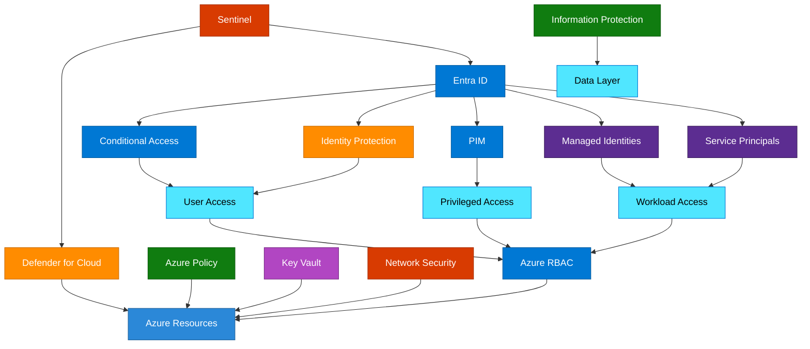

### Recommended reference pattern

1. Use Entra ID as the central identity control plane.
2. Apply Conditional Access and Identity Protection for user sign-ins.
3. Use PIM for privileged human access.
4. Use managed identities for Azure-native workloads and federated credentials for external CI/CD.
5. Authorize with group-based RBAC at the narrowest possible scope.
6. Store secrets, keys, and certificates in Key Vault or Managed HSM.
7. Enforce baseline controls with Azure Policy and, where applicable, Blueprints or modern landing zone tooling.
8. Protect network paths with segmentation, WAF, Firewall, DDoS, and Private Link.
9. Use Defender for Cloud for posture and workload signals.
10. Use Microsoft Sentinel for centralized detection, investigation, and automation.

### High-value integration examples

- Managed identities + Key Vault + Private Link for secretless, private workload authentication.
- Conditional Access + Identity Protection for risk-aware MFA and password reset.
- PIM + RBAC for just-in-time platform administration.
- Azure Policy + Defender for Cloud for continuous guardrails and posture visibility.
- Defender + Sentinel for unified alerting, hunting, and response.
- Sensitivity labels + DLP + Sentinel for data-centric detections and response.

---

## Azure Security Operations Checklist

### Daily checks

1. Review high-severity Defender for Cloud alerts.
2. Review risky users and risky sign-ins.
3. Review active PIM activations for privileged roles.
4. Review Sentinel incidents and automation outcomes.
5. Review failed Conditional Access patterns and suspicious geographic sign-ins.
6. Review critical Key Vault or secret access anomalies.
7. Review public exposure findings for storage, databases, and web apps.
8. Review privileged RBAC assignment changes.

### Weekly checks

1. Review Secure Score trend and top recommendations.
2. Review policy noncompliance aging and remediation progress.
3. Review WAF, firewall, and NSG rule changes.
4. Review app registrations, service principal credential expirations, and federated credential inventory.
5. Review guest users and external collaboration settings.
6. Review top Sentinel detections for tuning opportunities.
7. Review certificate and secret expiry schedules.
8. Review privileged group membership.

### Monthly checks

1. Perform access reviews for privileged roles and groups.
2. Audit Owner and Contributor assignments at broad scopes.
3. Validate emergency access account sign-in and monitoring.
4. Test key recovery, secret rotation, and incident runbooks.
5. Review exemption inventory for Azure Policy.
6. Validate DDoS, WAF, and private endpoint coverage for critical apps.
7. Review data labeling and DLP incident trends.
8. Report posture and identity risk metrics to stakeholders.

---

## Glossary

- **Tenant**: A Microsoft Entra directory boundary that stores identities and applications.
- **RBAC**: Role-Based Access Control for Azure Resource Manager authorization.
- **Scope**: The level at which access is granted: management group, subscription, resource group, or resource.
- **Deny assignment**: An explicit block on actions that can override inherited allow permissions.
- **Managed identity**: An Entra-backed workload identity managed by Azure.
- **System-assigned MI**: A managed identity tied to a single Azure resource lifecycle.
- **User-assigned MI**: A standalone managed identity that can be attached to multiple resources.
- **App registration**: The application object definition in Entra ID.
- **Service principal**: The tenant-local security principal for an application.
- **Conditional Access**: A policy engine that grants, challenges, or blocks access based on conditions.
- **PIM**: Privileged Identity Management for just-in-time and governed privileged access.
- **Key Vault**: Azure service for storing secrets, keys, and certificates.
- **Managed HSM**: Dedicated hardware-backed key management service.
- **Defender for Cloud**: Azure posture management and workload protection platform.
- **Secure Score**: A metric for prioritizing posture improvements.
- **Azure Policy**: A governance engine for enforcing and auditing standards.
- **Blueprint**: A package of governance artifacts for subscription provisioning.
- **NSG**: Network Security Group for stateful subnet or NIC filtering.
- **WAF**: Web Application Firewall for HTTP/S application protection.
- **Private Link**: Private IP-based connectivity to Azure PaaS services.
- **Sentinel**: Microsoft Sentinel, Azure SIEM and SOAR platform.
- **Sensitivity label**: A classification and protection label for data.
- **DLP**: Data Loss Prevention controls for sensitive data movement.
- **User risk**: Likelihood that a user identity is compromised.
- **Sign-in risk**: Likelihood that a specific sign-in attempt is suspicious.

This handbook is intentionally comprehensive. Adapt the examples, scopes, and policy targets to your tenant architecture, regulatory requirements, and landing zone standards.

---

## 📚 Official Documentation
- [Microsoft Entra ID](https://learn.microsoft.com/en-us/entra/fundamentals/whatis)
- [Azure RBAC](https://learn.microsoft.com/en-us/azure/role-based-access-control/)
- [Azure Key Vault](https://learn.microsoft.com/en-us/azure/key-vault/)
- [Microsoft Defender for Cloud](https://learn.microsoft.com/en-us/azure/defender-for-cloud/)
- [Azure Policy](https://learn.microsoft.com/en-us/azure/governance/policy/)
