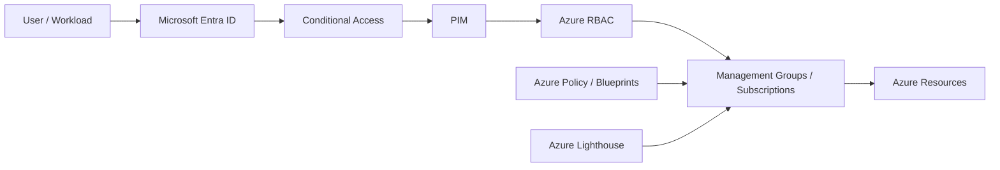
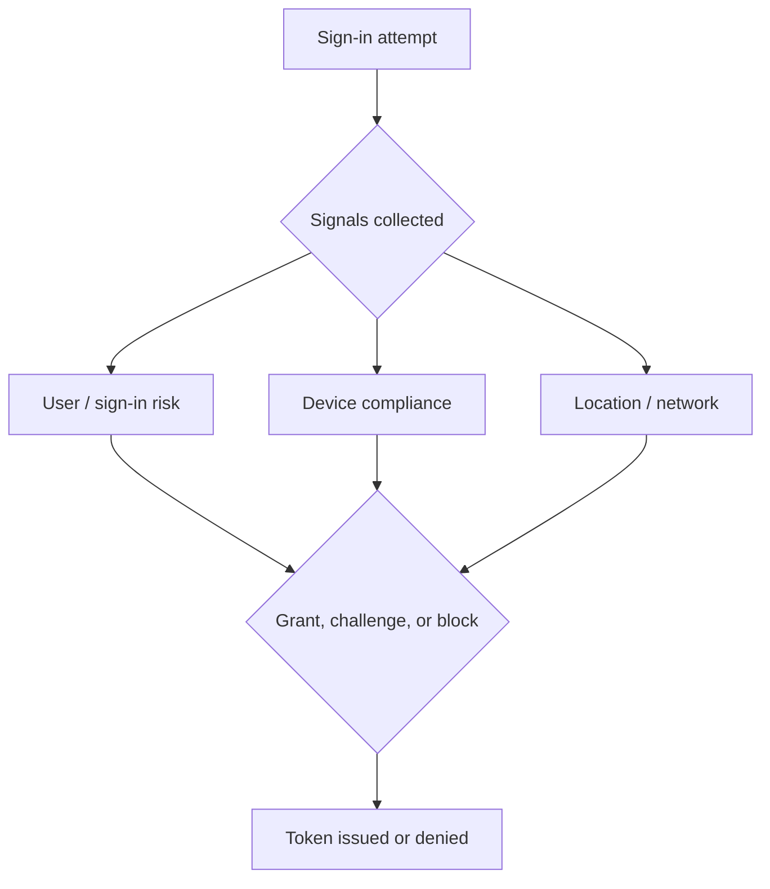
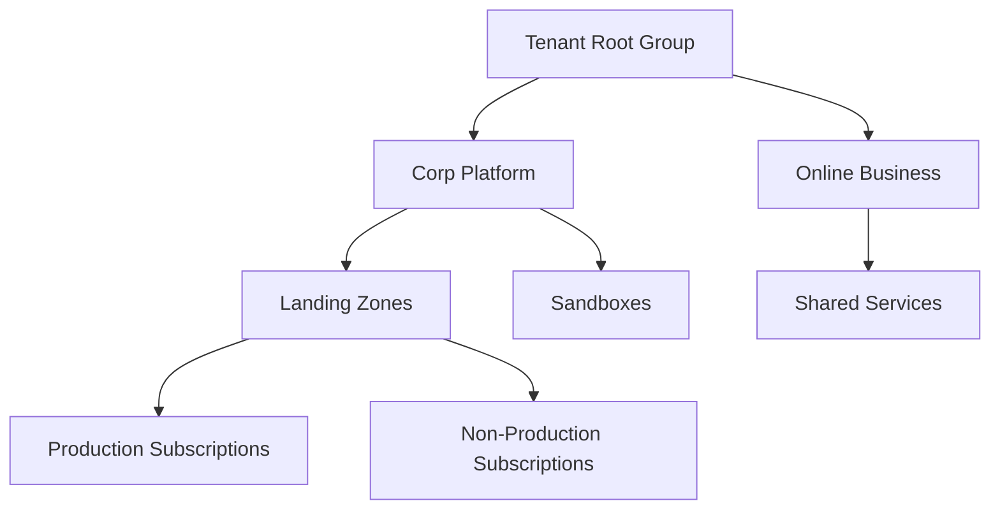
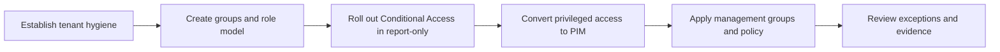

# Identity and Governance Deep Dive

> **Screenshot Disclaimer:** Portal screenshots referenced in this guide are sourced from [Microsoft Learn](https://learn.microsoft.com/en-us/azure/) documentation. © Microsoft Corporation. All rights reserved. Used for educational reference only.

> Comprehensive Microsoft Entra ID, Conditional Access, PIM, Azure Policy, Blueprints, management groups, and Azure Lighthouse guide for Azure platform governance.

## Table of Contents
- 1. [Identity and governance overview](#1-identity-and-governance-overview)
- 2. [Microsoft Entra ID deep dive](#2-microsoft-entra-id-deep-dive)
- 3. [Conditional Access policies](#3-conditional-access-policies)
- 4. [Privileged Identity Management](#4-privileged-identity-management)
- 5. [Azure Policy and Blueprints](#5-azure-policy-and-blueprints)
- 6. [Management groups hierarchy](#6-management-groups-hierarchy)
- 7. [Azure Lighthouse](#7-azure-lighthouse)
- 8. [Operating model](#8-operating-model)
- 9. [Implementation checklist](#9-implementation-checklist)
- 10. [Scenario library](#10-scenario-library)
- 11. [Glossary](#11-glossary)

---

## 1. Identity and Governance Overview

Identity and governance decisions define who can access Azure, under which conditions, with what level of privilege, and under which policy controls. Microsoft Entra ID, Conditional Access, PIM, Azure Policy, management groups, and Azure Lighthouse together create the operating model for scalable governance.

## 2. Microsoft Entra ID Deep Dive

> 
>
> *Screenshot source: [Microsoft Learn — Assign Azure roles using the Azure portal - Azure RBAC](https://learn.microsoft.com/en-us/azure/role-based-access-control/role-assignments-portal). © Microsoft Corporation. Used for educational reference only.*

> **Portal View:** Navigate to `Microsoft Entra admin center` → `Users`, `Groups`, or `Roles and administrators`. These blades show tenant identity objects, administrative role assignments, and governance controls that should align to landing-zone operating models.
>
> *For the latest portal screenshots, see [Microsoft Learn — Microsoft Entra admin center](https://learn.microsoft.com/en-us/entra/fundamentals/how-to-get-started-with-entra-admin-center).* 

> **Portal View:** Navigate to `Microsoft Entra admin center` → `Protection` → `Conditional Access` or `Identity Governance` → `Privileged Identity Management`. The pages show report-only policy rollout, eligible assignments, approval settings, and access reviews used to control privileged access.
>
> *For the latest portal screenshots, see [Microsoft Learn — Plan a Conditional Access deployment](https://learn.microsoft.com/en-us/entra/identity/conditional-access/plan-conditional-access) and [Microsoft Learn — What is Privileged Identity Management?](https://learn.microsoft.com/en-us/entra/id-governance/privileged-identity-management/pim-configure).* 

- Microsoft Entra ID is the identity system for users, groups, app registrations, service principals, devices, and managed identities.
- Use group-based assignment and ownership metadata to keep identity governance tractable at scale.
- Separate workforce, partner, break-glass, and workload identity patterns rather than treating all identities the same.
- Review app registrations, enterprise apps, and credential lifetime as part of the governance baseline.

| Object | Purpose | Governance note |
|---|---|---|
| User | Human identity for employees, partners, or guests | Protect with MFA, CA, and lifecycle review |
| Group | Entitlement container for access grants | Prefer groups over direct user assignments |
| App registration | Application identity definition | Track owners, redirect URIs, and credentials |
| Service principal | Tenant-local security principal for an application | Review permissions and credential lifetime |
| Managed identity | Azure-managed workload identity | Prefer over stored secrets when possible |

## 3. Conditional Access Policies

- Conditional Access evaluates signals such as user risk, sign-in risk, device compliance, location, and application target.
- Start with high-value protections such as MFA for admins and blocking legacy authentication.
- Use report-only mode before large rollouts so you can measure the blast radius.
- Track exclusions because unmanaged exceptions become long-term security debt.

### Recommended baseline policies
- Require MFA for privileged roles.
- Block legacy authentication.
- Protect sensitive apps with stronger controls.
- Apply risk-based remediation for high-risk sign-ins.
- Review guest access policies separately from employee access.

## 4. Privileged Identity Management

- PIM provides just-in-time activation, approvals, access reviews, and time-bound privileged assignments.
- Convert standing access to eligible access wherever practical.
- Require MFA, justification, and ticket references for sensitive role activation.
- Review activation history and emergency paths regularly.

## 5. Azure Policy and Blueprints

- Azure Policy audits or enforces configuration standards across subscriptions and resources.
- Use initiatives to package related policies such as security, diagnostics, tagging, and network exposure controls.
- Blueprints historically bundled policy, RBAC, and templates for subscription setup; many teams now use equivalent landing zone automation with IaC.
- Treat exemptions as time-bound exceptions with documented owner and rationale.

| Governance need | Azure Policy approach | Blueprint-era consideration |
|---|---|---|
| Tag enforcement | Append or deny missing tags | Bundle with landing zone defaults |
| Allowed regions | Deny non-approved regions | Assign at management group scope |
| Diagnostics | DeployIfNotExists settings | Standardize workspace and retention |
| Public exposure | Audit or deny risky exposure | Align with network baseline packages |

## 6. Management Groups Hierarchy

- Management groups provide inheritance boundaries for RBAC and Azure Policy across subscriptions.
- Keep the hierarchy understandable, but expressive enough to separate operating models and controls.
- Typical patterns include platform versus workload, prod versus non-prod, regulated versus standard, and sandbox separation.

## 7. Azure Lighthouse

- Azure Lighthouse enables cross-tenant delegated resource management.
- Use it for MSP operations, central governance teams, and acquisition scenarios that need cross-tenant control.
- Limit delegated roles carefully and review delegations just like native privileged access.

### Lighthouse workflow
1. Create a delegation definition at customer scope.
2. Map provider tenant groups to minimum required roles.
3. Operate resources from the provider tenant with customer audit visibility.
4. Retire delegations that are no longer needed.

## 8. Operating Model

- Identity team owns tenant authentication standards and lifecycle controls.
- Platform team owns management groups, landing zones, and baseline policies.
- Security team owns Conditional Access posture, PIM governance, and exception review.
- Application teams consume governed subscriptions and request justified exceptions.

## 9. Implementation Checklist

The original repeated checklist has been replaced with a practical rollout sequence that maps to how Azure platform teams usually implement identity and governance controls.

### Phase 1: Identity foundation

1. Create and monitor break-glass accounts with separate credentials and tested access paths.
2. Define naming standards for users, groups, app registrations, and administrative units.
3. Move direct user assignments to groups wherever possible.
4. Inventory app registrations, secrets, certificates, and federated credentials.
5. Confirm sign-in log retention, export, and alerting requirements.

### Phase 2: RBAC and privileged access

| Task | Good practice | Evidence to capture |
| --- | --- | --- |
| Role assignment | Use Entra groups at the narrowest practical Azure scope | Ticket, approver, scope, and review date |
| Privileged role | Convert standing assignments to PIM-eligible access | Activation policy, approval path, MFA requirement |
| Custom role | Version the JSON and review actions/data actions | Pull request, owner, and test result |
| Emergency access | Exclude from normal CA loops and monitor sign-ins | Alert rule and quarterly validation record |

### Phase 3: Conditional Access rollout

1. Pilot policies in **report-only** mode with a small administrative or IT cohort.
2. Create separate policies for admins, workforce users, guests, and workload-specific high-value apps.
3. Require MFA for privileged roles first, then block legacy authentication.
4. Review sign-in logs for policy failures, exclusions, unmanaged devices, and guest access impact.
5. Enforce in waves and retire temporary exclusions with an expiry date.

### Phase 4: Governance at scale

- Create the management group hierarchy before mass subscription onboarding.
- Assign baseline policy initiatives at the highest practical scope.
- Treat every exemption as temporary, with owner, reason, expiry, and compensating controls.
- Use Lighthouse only where cross-tenant operations are genuinely required.
- Review access reviews, role assignments, and policy exemptions on a recurring cadence.

### Operational scenarios and response notes

| Scenario | First action | Azure control to check | Success signal |
| --- | --- | --- | --- |
| New admin needs subscription access | Add to approved Entra group and activate via PIM | RBAC scope + PIM policy | Access works only during approved activation window |
| MFA rollout breaks a legacy script | Move automation to managed identity or federated credential | App registration / workload identity | Script succeeds without stored user password |
| Guest cannot access app | Review guest CA policy and cross-tenant trust settings | Conditional Access + External Identities | Guest sign-in succeeds with intended controls |
| Subscription fails compliance baseline | Review initiative assignment and exemptions | Management group + Azure Policy | Resource state returns to compliant after remediation |

### Monthly review checklist

- Review privileged role activations and permanent assignments.
- Audit Conditional Access exclusions and report-only policies still waiting for enforcement.
- Inspect stale app credentials and service principals with no recent use.
- Confirm policy exemptions still have business justification.
- Export evidence for high-risk role assignments, access reviews, and exception approvals.

## 10. Scenario Library

### New subscription onboarding
- Place the subscription in the correct management group, apply baseline initiatives, and delegate access via groups before workload deployment.
- Required evidence: owner approval, scope, audit trail, and expiry or rollback plan.

### Admin access review
- Review all privileged assignments and reduce standing privilege.
- Required evidence: owner approval, scope, audit trail, and expiry or rollback plan.

### External partner onboarding
- Use guest access or Azure Lighthouse based on operating model and scope access tightly.
- Required evidence: owner approval, scope, audit trail, and expiry or rollback plan.

### Conditional Access rollout
- Pilot report-only mode, measure impact, then enforce in phases.
- Required evidence: owner approval, scope, audit trail, and expiry or rollback plan.

### Policy exemption request
- Capture business justification, scope, owner, compensating controls, and expiry date.
- Required evidence: owner approval, scope, audit trail, and expiry or rollback plan.

## 11. Glossary

- **Microsoft Entra ID:** Identity and access platform formerly known as Azure AD.
- **Conditional Access:** Policy engine that evaluates signals before granting access.
- **PIM:** Privileged Identity Management for governed elevation.
- **Azure Policy:** Governance service for evaluating and enforcing standards.
- **Blueprint:** Historical packaging model for governance artifacts.
- **Management group:** Scope above subscriptions for policy and RBAC inheritance.
- **Azure Lighthouse:** Cross-tenant delegated resource management capability.
