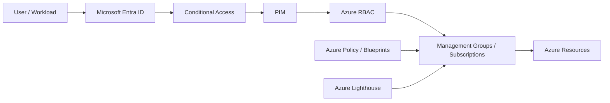
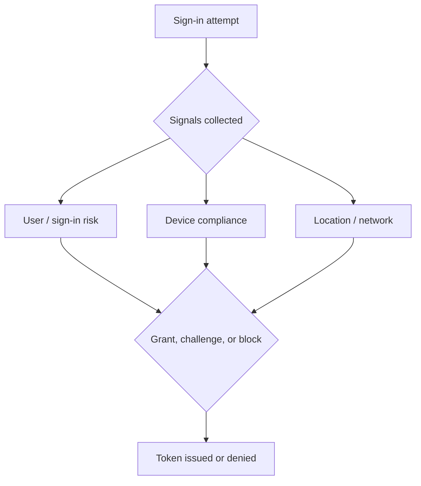
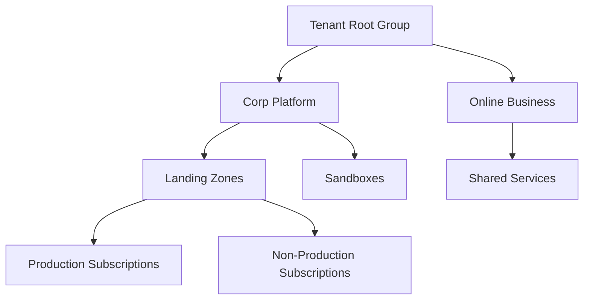

# Identity and Governance Deep Dive

> Comprehensive Microsoft Entra ID, Conditional Access, PIM, Azure Policy, Blueprints, management groups, and Azure Lighthouse guide for Azure platform governance.

## Table of Contents
- 1. [Identity and governance overview](#1-identity-and-governance-overview)
- 2. [Microsoft Entra ID deep dive](#2-microsoft-entra-id-deep-dive)
- 3. [Conditional Access policies](#3-conditional-access-policies)
- 4. [Privileged Identity Management](#4-privileged-identity-management)
- 5. [Azure Policy and Blueprints](#5-azure-policy-and-blueprints)
- 6. [Management groups hierarchy](#6-management-groups-hierarchy)
- 7. [Azure Lighthouse](#7-azure-lighthouse)
- 8. [Operating model](#8-operating-model)
- 9. [Implementation checklist](#9-implementation-checklist)
- 10. [Scenario library](#10-scenario-library)
- 11. [Glossary](#11-glossary)

---

## 1. Identity and Governance Overview

Identity and governance decisions define who can access Azure, under which conditions, with what level of privilege, and under which policy controls. Microsoft Entra ID, Conditional Access, PIM, Azure Policy, management groups, and Azure Lighthouse together create the operating model for scalable governance.

## 2. Microsoft Entra ID Deep Dive

- Microsoft Entra ID is the identity system for users, groups, app registrations, service principals, devices, and managed identities.
- Use group-based assignment and ownership metadata to keep identity governance tractable at scale.
- Separate workforce, partner, break-glass, and workload identity patterns rather than treating all identities the same.
- Review app registrations, enterprise apps, and credential lifetime as part of the governance baseline.

| Object | Purpose | Governance note |
|---|---|---|
| User | Human identity for employees, partners, or guests | Protect with MFA, CA, and lifecycle review |
| Group | Entitlement container for access grants | Prefer groups over direct user assignments |
| App registration | Application identity definition | Track owners, redirect URIs, and credentials |
| Service principal | Tenant-local security principal for an application | Review permissions and credential lifetime |
| Managed identity | Azure-managed workload identity | Prefer over stored secrets when possible |

## 3. Conditional Access Policies

- Conditional Access evaluates signals such as user risk, sign-in risk, device compliance, location, and application target.
- Start with high-value protections such as MFA for admins and blocking legacy authentication.
- Use report-only mode before large rollouts so you can measure the blast radius.
- Track exclusions because unmanaged exceptions become long-term security debt.

### Recommended baseline policies
- Require MFA for privileged roles.
- Block legacy authentication.
- Protect sensitive apps with stronger controls.
- Apply risk-based remediation for high-risk sign-ins.
- Review guest access policies separately from employee access.

## 4. Privileged Identity Management

- PIM provides just-in-time activation, approvals, access reviews, and time-bound privileged assignments.
- Convert standing access to eligible access wherever practical.
- Require MFA, justification, and ticket references for sensitive role activation.
- Review activation history and emergency paths regularly.

## 5. Azure Policy and Blueprints

- Azure Policy audits or enforces configuration standards across subscriptions and resources.
- Use initiatives to package related policies such as security, diagnostics, tagging, and network exposure controls.
- Blueprints historically bundled policy, RBAC, and templates for subscription setup; many teams now use equivalent landing zone automation with IaC.
- Treat exemptions as time-bound exceptions with documented owner and rationale.

| Governance need | Azure Policy approach | Blueprint-era consideration |
|---|---|---|
| Tag enforcement | Append or deny missing tags | Bundle with landing zone defaults |
| Allowed regions | Deny non-approved regions | Assign at management group scope |
| Diagnostics | DeployIfNotExists settings | Standardize workspace and retention |
| Public exposure | Audit or deny risky exposure | Align with network baseline packages |

## 6. Management Groups Hierarchy

- Management groups provide inheritance boundaries for RBAC and Azure Policy across subscriptions.
- Keep the hierarchy understandable, but expressive enough to separate operating models and controls.
- Typical patterns include platform versus workload, prod versus non-prod, regulated versus standard, and sandbox separation.

## 7. Azure Lighthouse

- Azure Lighthouse enables cross-tenant delegated resource management.
- Use it for MSP operations, central governance teams, and acquisition scenarios that need cross-tenant control.
- Limit delegated roles carefully and review delegations just like native privileged access.

### Lighthouse workflow
1. Create a delegation definition at customer scope.
2. Map provider tenant groups to minimum required roles.
3. Operate resources from the provider tenant with customer audit visibility.
4. Retire delegations that are no longer needed.

## 8. Operating Model

- Identity team owns tenant authentication standards and lifecycle controls.
- Platform team owns management groups, landing zones, and baseline policies.
- Security team owns Conditional Access posture, PIM governance, and exception review.
- Application teams consume governed subscriptions and request justified exceptions.

## 9. Implementation Checklist

### Identity foundation
- Check 1: Create break-glass accounts with strong monitoring. Review cycle 1.
- Check 2: Standardize group naming, ownership, and lifecycle review. Review cycle 1.
- Check 3: Review app registrations and external identities regularly. Review cycle 1.
- Check 4: Create break-glass accounts with strong monitoring. Review cycle 2.
- Check 5: Standardize group naming, ownership, and lifecycle review. Review cycle 2.
- Check 6: Review app registrations and external identities regularly. Review cycle 2.
- Check 7: Create break-glass accounts with strong monitoring. Review cycle 3.
- Check 8: Standardize group naming, ownership, and lifecycle review. Review cycle 3.
- Check 9: Review app registrations and external identities regularly. Review cycle 3.
- Check 10: Create break-glass accounts with strong monitoring. Review cycle 4.
- Check 11: Standardize group naming, ownership, and lifecycle review. Review cycle 4.
- Check 12: Review app registrations and external identities regularly. Review cycle 4.
- Check 13: Create break-glass accounts with strong monitoring. Review cycle 5.
- Check 14: Standardize group naming, ownership, and lifecycle review. Review cycle 5.
- Check 15: Review app registrations and external identities regularly. Review cycle 5.
- Check 16: Create break-glass accounts with strong monitoring. Review cycle 6.
- Check 17: Standardize group naming, ownership, and lifecycle review. Review cycle 6.
- Check 18: Review app registrations and external identities regularly. Review cycle 6.
- Check 19: Create break-glass accounts with strong monitoring. Review cycle 7.
- Check 20: Standardize group naming, ownership, and lifecycle review. Review cycle 7.
- Check 21: Review app registrations and external identities regularly. Review cycle 7.
- Check 22: Create break-glass accounts with strong monitoring. Review cycle 8.
- Check 23: Standardize group naming, ownership, and lifecycle review. Review cycle 8.
- Check 24: Review app registrations and external identities regularly. Review cycle 8.
- Check 25: Create break-glass accounts with strong monitoring. Review cycle 9.
- Check 26: Standardize group naming, ownership, and lifecycle review. Review cycle 9.
- Check 27: Review app registrations and external identities regularly. Review cycle 9.
- Check 28: Create break-glass accounts with strong monitoring. Review cycle 10.
- Check 29: Standardize group naming, ownership, and lifecycle review. Review cycle 10.
- Check 30: Review app registrations and external identities regularly. Review cycle 10.
- Check 31: Create break-glass accounts with strong monitoring. Review cycle 11.
- Check 32: Standardize group naming, ownership, and lifecycle review. Review cycle 11.
- Check 33: Review app registrations and external identities regularly. Review cycle 11.
- Check 34: Create break-glass accounts with strong monitoring. Review cycle 12.
- Check 35: Standardize group naming, ownership, and lifecycle review. Review cycle 12.
- Check 36: Review app registrations and external identities regularly. Review cycle 12.
- Check 37: Create break-glass accounts with strong monitoring. Review cycle 13.
- Check 38: Standardize group naming, ownership, and lifecycle review. Review cycle 13.
- Check 39: Review app registrations and external identities regularly. Review cycle 13.
- Check 40: Create break-glass accounts with strong monitoring. Review cycle 14.
- Check 41: Standardize group naming, ownership, and lifecycle review. Review cycle 14.
- Check 42: Review app registrations and external identities regularly. Review cycle 14.
- Check 43: Create break-glass accounts with strong monitoring. Review cycle 15.
- Check 44: Standardize group naming, ownership, and lifecycle review. Review cycle 15.
- Check 45: Review app registrations and external identities regularly. Review cycle 15.
- Check 46: Create break-glass accounts with strong monitoring. Review cycle 16.
- Check 47: Standardize group naming, ownership, and lifecycle review. Review cycle 16.
- Check 48: Review app registrations and external identities regularly. Review cycle 16.
- Check 49: Create break-glass accounts with strong monitoring. Review cycle 17.
- Check 50: Standardize group naming, ownership, and lifecycle review. Review cycle 17.
- Check 51: Review app registrations and external identities regularly. Review cycle 17.
- Check 52: Create break-glass accounts with strong monitoring. Review cycle 18.
- Check 53: Standardize group naming, ownership, and lifecycle review. Review cycle 18.
- Check 54: Review app registrations and external identities regularly. Review cycle 18.
- Check 55: Create break-glass accounts with strong monitoring. Review cycle 19.
- Check 56: Standardize group naming, ownership, and lifecycle review. Review cycle 19.
- Check 57: Review app registrations and external identities regularly. Review cycle 19.
- Check 58: Create break-glass accounts with strong monitoring. Review cycle 20.
- Check 59: Standardize group naming, ownership, and lifecycle review. Review cycle 20.
- Check 60: Review app registrations and external identities regularly. Review cycle 20.
- Check 61: Create break-glass accounts with strong monitoring. Review cycle 21.
- Check 62: Standardize group naming, ownership, and lifecycle review. Review cycle 21.
- Check 63: Review app registrations and external identities regularly. Review cycle 21.
- Check 64: Create break-glass accounts with strong monitoring. Review cycle 22.
- Check 65: Standardize group naming, ownership, and lifecycle review. Review cycle 22.
- Check 66: Review app registrations and external identities regularly. Review cycle 22.
- Check 67: Create break-glass accounts with strong monitoring. Review cycle 23.
- Check 68: Standardize group naming, ownership, and lifecycle review. Review cycle 23.
- Check 69: Review app registrations and external identities regularly. Review cycle 23.
- Check 70: Create break-glass accounts with strong monitoring. Review cycle 24.
- Check 71: Standardize group naming, ownership, and lifecycle review. Review cycle 24.
- Check 72: Review app registrations and external identities regularly. Review cycle 24.
- Check 73: Create break-glass accounts with strong monitoring. Review cycle 25.
- Check 74: Standardize group naming, ownership, and lifecycle review. Review cycle 25.
- Check 75: Review app registrations and external identities regularly. Review cycle 25.
- Check 76: Create break-glass accounts with strong monitoring. Review cycle 26.
- Check 77: Standardize group naming, ownership, and lifecycle review. Review cycle 26.
- Check 78: Review app registrations and external identities regularly. Review cycle 26.
- Check 79: Create break-glass accounts with strong monitoring. Review cycle 27.
- Check 80: Standardize group naming, ownership, and lifecycle review. Review cycle 27.
- Check 81: Review app registrations and external identities regularly. Review cycle 27.
- Check 82: Create break-glass accounts with strong monitoring. Review cycle 28.
- Check 83: Standardize group naming, ownership, and lifecycle review. Review cycle 28.
- Check 84: Review app registrations and external identities regularly. Review cycle 28.
- Check 85: Create break-glass accounts with strong monitoring. Review cycle 29.
- Check 86: Standardize group naming, ownership, and lifecycle review. Review cycle 29.
- Check 87: Review app registrations and external identities regularly. Review cycle 29.
- Check 88: Create break-glass accounts with strong monitoring. Review cycle 30.
- Check 89: Standardize group naming, ownership, and lifecycle review. Review cycle 30.
- Check 90: Review app registrations and external identities regularly. Review cycle 30.
- Check 91: Create break-glass accounts with strong monitoring. Review cycle 31.
- Check 92: Standardize group naming, ownership, and lifecycle review. Review cycle 31.
- Check 93: Review app registrations and external identities regularly. Review cycle 31.
- Check 94: Create break-glass accounts with strong monitoring. Review cycle 32.
- Check 95: Standardize group naming, ownership, and lifecycle review. Review cycle 32.
- Check 96: Review app registrations and external identities regularly. Review cycle 32.
- Check 97: Create break-glass accounts with strong monitoring. Review cycle 33.
- Check 98: Standardize group naming, ownership, and lifecycle review. Review cycle 33.
- Check 99: Review app registrations and external identities regularly. Review cycle 33.
- Check 100: Create break-glass accounts with strong monitoring. Review cycle 34.
- Check 101: Standardize group naming, ownership, and lifecycle review. Review cycle 34.
- Check 102: Review app registrations and external identities regularly. Review cycle 34.
- Check 103: Create break-glass accounts with strong monitoring. Review cycle 35.
- Check 104: Standardize group naming, ownership, and lifecycle review. Review cycle 35.
- Check 105: Review app registrations and external identities regularly. Review cycle 35.
- Check 106: Create break-glass accounts with strong monitoring. Review cycle 36.
- Check 107: Standardize group naming, ownership, and lifecycle review. Review cycle 36.
- Check 108: Review app registrations and external identities regularly. Review cycle 36.
- Check 109: Create break-glass accounts with strong monitoring. Review cycle 37.
- Check 110: Standardize group naming, ownership, and lifecycle review. Review cycle 37.
- Check 111: Review app registrations and external identities regularly. Review cycle 37.
- Check 112: Create break-glass accounts with strong monitoring. Review cycle 38.
- Check 113: Standardize group naming, ownership, and lifecycle review. Review cycle 38.
- Check 114: Review app registrations and external identities regularly. Review cycle 38.
- Check 115: Create break-glass accounts with strong monitoring. Review cycle 39.
- Check 116: Standardize group naming, ownership, and lifecycle review. Review cycle 39.
- Check 117: Review app registrations and external identities regularly. Review cycle 39.
- Check 118: Create break-glass accounts with strong monitoring. Review cycle 40.
- Check 119: Standardize group naming, ownership, and lifecycle review. Review cycle 40.
- Check 120: Review app registrations and external identities regularly. Review cycle 40.
- Check 121: Create break-glass accounts with strong monitoring. Review cycle 41.
- Check 122: Standardize group naming, ownership, and lifecycle review. Review cycle 41.
- Check 123: Review app registrations and external identities regularly. Review cycle 41.
- Check 124: Create break-glass accounts with strong monitoring. Review cycle 42.
- Check 125: Standardize group naming, ownership, and lifecycle review. Review cycle 42.
- Check 126: Review app registrations and external identities regularly. Review cycle 42.
- Check 127: Create break-glass accounts with strong monitoring. Review cycle 43.
- Check 128: Standardize group naming, ownership, and lifecycle review. Review cycle 43.
- Check 129: Review app registrations and external identities regularly. Review cycle 43.
- Check 130: Create break-glass accounts with strong monitoring. Review cycle 44.
- Check 131: Standardize group naming, ownership, and lifecycle review. Review cycle 44.
- Check 132: Review app registrations and external identities regularly. Review cycle 44.
- Check 133: Create break-glass accounts with strong monitoring. Review cycle 45.
- Check 134: Standardize group naming, ownership, and lifecycle review. Review cycle 45.
- Check 135: Review app registrations and external identities regularly. Review cycle 45.
- Check 136: Create break-glass accounts with strong monitoring. Review cycle 46.
- Check 137: Standardize group naming, ownership, and lifecycle review. Review cycle 46.
- Check 138: Review app registrations and external identities regularly. Review cycle 46.
- Check 139: Create break-glass accounts with strong monitoring. Review cycle 47.
- Check 140: Standardize group naming, ownership, and lifecycle review. Review cycle 47.
- Check 141: Review app registrations and external identities regularly. Review cycle 47.
- Check 142: Create break-glass accounts with strong monitoring. Review cycle 48.
- Check 143: Standardize group naming, ownership, and lifecycle review. Review cycle 48.
- Check 144: Review app registrations and external identities regularly. Review cycle 48.
- Check 145: Create break-glass accounts with strong monitoring. Review cycle 49.
- Check 146: Standardize group naming, ownership, and lifecycle review. Review cycle 49.
- Check 147: Review app registrations and external identities regularly. Review cycle 49.
- Check 148: Create break-glass accounts with strong monitoring. Review cycle 50.
- Check 149: Standardize group naming, ownership, and lifecycle review. Review cycle 50.
- Check 150: Review app registrations and external identities regularly. Review cycle 50.
- Check 151: Create break-glass accounts with strong monitoring. Review cycle 51.
- Check 152: Standardize group naming, ownership, and lifecycle review. Review cycle 51.
- Check 153: Review app registrations and external identities regularly. Review cycle 51.
- Check 154: Create break-glass accounts with strong monitoring. Review cycle 52.
- Check 155: Standardize group naming, ownership, and lifecycle review. Review cycle 52.
- Check 156: Review app registrations and external identities regularly. Review cycle 52.
- Check 157: Create break-glass accounts with strong monitoring. Review cycle 53.
- Check 158: Standardize group naming, ownership, and lifecycle review. Review cycle 53.
- Check 159: Review app registrations and external identities regularly. Review cycle 53.
- Check 160: Create break-glass accounts with strong monitoring. Review cycle 54.
- Check 161: Standardize group naming, ownership, and lifecycle review. Review cycle 54.
- Check 162: Review app registrations and external identities regularly. Review cycle 54.
- Check 163: Create break-glass accounts with strong monitoring. Review cycle 55.
- Check 164: Standardize group naming, ownership, and lifecycle review. Review cycle 55.
- Check 165: Review app registrations and external identities regularly. Review cycle 55.
- Check 166: Create break-glass accounts with strong monitoring. Review cycle 56.
- Check 167: Standardize group naming, ownership, and lifecycle review. Review cycle 56.
- Check 168: Review app registrations and external identities regularly. Review cycle 56.
- Check 169: Create break-glass accounts with strong monitoring. Review cycle 57.
- Check 170: Standardize group naming, ownership, and lifecycle review. Review cycle 57.
- Check 171: Review app registrations and external identities regularly. Review cycle 57.
- Check 172: Create break-glass accounts with strong monitoring. Review cycle 58.
- Check 173: Standardize group naming, ownership, and lifecycle review. Review cycle 58.
- Check 174: Review app registrations and external identities regularly. Review cycle 58.
- Check 175: Create break-glass accounts with strong monitoring. Review cycle 59.
- Check 176: Standardize group naming, ownership, and lifecycle review. Review cycle 59.
- Check 177: Review app registrations and external identities regularly. Review cycle 59.
- Check 178: Create break-glass accounts with strong monitoring. Review cycle 60.
- Check 179: Standardize group naming, ownership, and lifecycle review. Review cycle 60.
- Check 180: Review app registrations and external identities regularly. Review cycle 60.
- Check 181: Create break-glass accounts with strong monitoring. Review cycle 61.
- Check 182: Standardize group naming, ownership, and lifecycle review. Review cycle 61.
- Check 183: Review app registrations and external identities regularly. Review cycle 61.
- Check 184: Create break-glass accounts with strong monitoring. Review cycle 62.
- Check 185: Standardize group naming, ownership, and lifecycle review. Review cycle 62.
- Check 186: Review app registrations and external identities regularly. Review cycle 62.
- Check 187: Create break-glass accounts with strong monitoring. Review cycle 63.
- Check 188: Standardize group naming, ownership, and lifecycle review. Review cycle 63.
- Check 189: Review app registrations and external identities regularly. Review cycle 63.
- Check 190: Create break-glass accounts with strong monitoring. Review cycle 64.
- Check 191: Standardize group naming, ownership, and lifecycle review. Review cycle 64.
- Check 192: Review app registrations and external identities regularly. Review cycle 64.
- Check 193: Create break-glass accounts with strong monitoring. Review cycle 65.
- Check 194: Standardize group naming, ownership, and lifecycle review. Review cycle 65.
- Check 195: Review app registrations and external identities regularly. Review cycle 65.
- Check 196: Create break-glass accounts with strong monitoring. Review cycle 66.
- Check 197: Standardize group naming, ownership, and lifecycle review. Review cycle 66.
- Check 198: Review app registrations and external identities regularly. Review cycle 66.
- Check 199: Create break-glass accounts with strong monitoring. Review cycle 67.
- Check 200: Standardize group naming, ownership, and lifecycle review. Review cycle 67.
- Check 201: Review app registrations and external identities regularly. Review cycle 67.
- Check 202: Create break-glass accounts with strong monitoring. Review cycle 68.
- Check 203: Standardize group naming, ownership, and lifecycle review. Review cycle 68.
- Check 204: Review app registrations and external identities regularly. Review cycle 68.
- Check 205: Create break-glass accounts with strong monitoring. Review cycle 69.
- Check 206: Standardize group naming, ownership, and lifecycle review. Review cycle 69.
- Check 207: Review app registrations and external identities regularly. Review cycle 69.
- Check 208: Create break-glass accounts with strong monitoring. Review cycle 70.
- Check 209: Standardize group naming, ownership, and lifecycle review. Review cycle 70.
- Check 210: Review app registrations and external identities regularly. Review cycle 70.

### Conditional Access
- Check 211: Pilot policies in report-only mode before enforcement. Review cycle 1.
- Check 212: Protect administrative roles before broad population rollout. Review cycle 1.
- Check 213: Review and minimize exclusions continuously. Review cycle 1.
- Check 214: Pilot policies in report-only mode before enforcement. Review cycle 2.
- Check 215: Protect administrative roles before broad population rollout. Review cycle 2.
- Check 216: Review and minimize exclusions continuously. Review cycle 2.
- Check 217: Pilot policies in report-only mode before enforcement. Review cycle 3.
- Check 218: Protect administrative roles before broad population rollout. Review cycle 3.
- Check 219: Review and minimize exclusions continuously. Review cycle 3.
- Check 220: Pilot policies in report-only mode before enforcement. Review cycle 4.
- Check 221: Protect administrative roles before broad population rollout. Review cycle 4.
- Check 222: Review and minimize exclusions continuously. Review cycle 4.
- Check 223: Pilot policies in report-only mode before enforcement. Review cycle 5.
- Check 224: Protect administrative roles before broad population rollout. Review cycle 5.
- Check 225: Review and minimize exclusions continuously. Review cycle 5.
- Check 226: Pilot policies in report-only mode before enforcement. Review cycle 6.
- Check 227: Protect administrative roles before broad population rollout. Review cycle 6.
- Check 228: Review and minimize exclusions continuously. Review cycle 6.
- Check 229: Pilot policies in report-only mode before enforcement. Review cycle 7.
- Check 230: Protect administrative roles before broad population rollout. Review cycle 7.
- Check 231: Review and minimize exclusions continuously. Review cycle 7.
- Check 232: Pilot policies in report-only mode before enforcement. Review cycle 8.
- Check 233: Protect administrative roles before broad population rollout. Review cycle 8.
- Check 234: Review and minimize exclusions continuously. Review cycle 8.
- Check 235: Pilot policies in report-only mode before enforcement. Review cycle 9.
- Check 236: Protect administrative roles before broad population rollout. Review cycle 9.
- Check 237: Review and minimize exclusions continuously. Review cycle 9.
- Check 238: Pilot policies in report-only mode before enforcement. Review cycle 10.
- Check 239: Protect administrative roles before broad population rollout. Review cycle 10.
- Check 240: Review and minimize exclusions continuously. Review cycle 10.
- Check 241: Pilot policies in report-only mode before enforcement. Review cycle 11.
- Check 242: Protect administrative roles before broad population rollout. Review cycle 11.
- Check 243: Review and minimize exclusions continuously. Review cycle 11.
- Check 244: Pilot policies in report-only mode before enforcement. Review cycle 12.
- Check 245: Protect administrative roles before broad population rollout. Review cycle 12.
- Check 246: Review and minimize exclusions continuously. Review cycle 12.
- Check 247: Pilot policies in report-only mode before enforcement. Review cycle 13.
- Check 248: Protect administrative roles before broad population rollout. Review cycle 13.
- Check 249: Review and minimize exclusions continuously. Review cycle 13.
- Check 250: Pilot policies in report-only mode before enforcement. Review cycle 14.
- Check 251: Protect administrative roles before broad population rollout. Review cycle 14.
- Check 252: Review and minimize exclusions continuously. Review cycle 14.
- Check 253: Pilot policies in report-only mode before enforcement. Review cycle 15.
- Check 254: Protect administrative roles before broad population rollout. Review cycle 15.
- Check 255: Review and minimize exclusions continuously. Review cycle 15.
- Check 256: Pilot policies in report-only mode before enforcement. Review cycle 16.
- Check 257: Protect administrative roles before broad population rollout. Review cycle 16.
- Check 258: Review and minimize exclusions continuously. Review cycle 16.
- Check 259: Pilot policies in report-only mode before enforcement. Review cycle 17.
- Check 260: Protect administrative roles before broad population rollout. Review cycle 17.
- Check 261: Review and minimize exclusions continuously. Review cycle 17.
- Check 262: Pilot policies in report-only mode before enforcement. Review cycle 18.
- Check 263: Protect administrative roles before broad population rollout. Review cycle 18.
- Check 264: Review and minimize exclusions continuously. Review cycle 18.
- Check 265: Pilot policies in report-only mode before enforcement. Review cycle 19.
- Check 266: Protect administrative roles before broad population rollout. Review cycle 19.
- Check 267: Review and minimize exclusions continuously. Review cycle 19.
- Check 268: Pilot policies in report-only mode before enforcement. Review cycle 20.
- Check 269: Protect administrative roles before broad population rollout. Review cycle 20.
- Check 270: Review and minimize exclusions continuously. Review cycle 20.
- Check 271: Pilot policies in report-only mode before enforcement. Review cycle 21.
- Check 272: Protect administrative roles before broad population rollout. Review cycle 21.
- Check 273: Review and minimize exclusions continuously. Review cycle 21.
- Check 274: Pilot policies in report-only mode before enforcement. Review cycle 22.
- Check 275: Protect administrative roles before broad population rollout. Review cycle 22.
- Check 276: Review and minimize exclusions continuously. Review cycle 22.
- Check 277: Pilot policies in report-only mode before enforcement. Review cycle 23.
- Check 278: Protect administrative roles before broad population rollout. Review cycle 23.
- Check 279: Review and minimize exclusions continuously. Review cycle 23.
- Check 280: Pilot policies in report-only mode before enforcement. Review cycle 24.
- Check 281: Protect administrative roles before broad population rollout. Review cycle 24.
- Check 282: Review and minimize exclusions continuously. Review cycle 24.
- Check 283: Pilot policies in report-only mode before enforcement. Review cycle 25.
- Check 284: Protect administrative roles before broad population rollout. Review cycle 25.
- Check 285: Review and minimize exclusions continuously. Review cycle 25.
- Check 286: Pilot policies in report-only mode before enforcement. Review cycle 26.
- Check 287: Protect administrative roles before broad population rollout. Review cycle 26.
- Check 288: Review and minimize exclusions continuously. Review cycle 26.
- Check 289: Pilot policies in report-only mode before enforcement. Review cycle 27.
- Check 290: Protect administrative roles before broad population rollout. Review cycle 27.
- Check 291: Review and minimize exclusions continuously. Review cycle 27.
- Check 292: Pilot policies in report-only mode before enforcement. Review cycle 28.
- Check 293: Protect administrative roles before broad population rollout. Review cycle 28.
- Check 294: Review and minimize exclusions continuously. Review cycle 28.
- Check 295: Pilot policies in report-only mode before enforcement. Review cycle 29.
- Check 296: Protect administrative roles before broad population rollout. Review cycle 29.
- Check 297: Review and minimize exclusions continuously. Review cycle 29.
- Check 298: Pilot policies in report-only mode before enforcement. Review cycle 30.
- Check 299: Protect administrative roles before broad population rollout. Review cycle 30.
- Check 300: Review and minimize exclusions continuously. Review cycle 30.
- Check 301: Pilot policies in report-only mode before enforcement. Review cycle 31.
- Check 302: Protect administrative roles before broad population rollout. Review cycle 31.
- Check 303: Review and minimize exclusions continuously. Review cycle 31.
- Check 304: Pilot policies in report-only mode before enforcement. Review cycle 32.
- Check 305: Protect administrative roles before broad population rollout. Review cycle 32.
- Check 306: Review and minimize exclusions continuously. Review cycle 32.
- Check 307: Pilot policies in report-only mode before enforcement. Review cycle 33.
- Check 308: Protect administrative roles before broad population rollout. Review cycle 33.
- Check 309: Review and minimize exclusions continuously. Review cycle 33.
- Check 310: Pilot policies in report-only mode before enforcement. Review cycle 34.
- Check 311: Protect administrative roles before broad population rollout. Review cycle 34.
- Check 312: Review and minimize exclusions continuously. Review cycle 34.
- Check 313: Pilot policies in report-only mode before enforcement. Review cycle 35.
- Check 314: Protect administrative roles before broad population rollout. Review cycle 35.
- Check 315: Review and minimize exclusions continuously. Review cycle 35.
- Check 316: Pilot policies in report-only mode before enforcement. Review cycle 36.
- Check 317: Protect administrative roles before broad population rollout. Review cycle 36.
- Check 318: Review and minimize exclusions continuously. Review cycle 36.
- Check 319: Pilot policies in report-only mode before enforcement. Review cycle 37.
- Check 320: Protect administrative roles before broad population rollout. Review cycle 37.
- Check 321: Review and minimize exclusions continuously. Review cycle 37.
- Check 322: Pilot policies in report-only mode before enforcement. Review cycle 38.
- Check 323: Protect administrative roles before broad population rollout. Review cycle 38.
- Check 324: Review and minimize exclusions continuously. Review cycle 38.
- Check 325: Pilot policies in report-only mode before enforcement. Review cycle 39.
- Check 326: Protect administrative roles before broad population rollout. Review cycle 39.
- Check 327: Review and minimize exclusions continuously. Review cycle 39.
- Check 328: Pilot policies in report-only mode before enforcement. Review cycle 40.
- Check 329: Protect administrative roles before broad population rollout. Review cycle 40.
- Check 330: Review and minimize exclusions continuously. Review cycle 40.
- Check 331: Pilot policies in report-only mode before enforcement. Review cycle 41.
- Check 332: Protect administrative roles before broad population rollout. Review cycle 41.
- Check 333: Review and minimize exclusions continuously. Review cycle 41.
- Check 334: Pilot policies in report-only mode before enforcement. Review cycle 42.
- Check 335: Protect administrative roles before broad population rollout. Review cycle 42.
- Check 336: Review and minimize exclusions continuously. Review cycle 42.
- Check 337: Pilot policies in report-only mode before enforcement. Review cycle 43.
- Check 338: Protect administrative roles before broad population rollout. Review cycle 43.
- Check 339: Review and minimize exclusions continuously. Review cycle 43.
- Check 340: Pilot policies in report-only mode before enforcement. Review cycle 44.
- Check 341: Protect administrative roles before broad population rollout. Review cycle 44.
- Check 342: Review and minimize exclusions continuously. Review cycle 44.
- Check 343: Pilot policies in report-only mode before enforcement. Review cycle 45.
- Check 344: Protect administrative roles before broad population rollout. Review cycle 45.
- Check 345: Review and minimize exclusions continuously. Review cycle 45.
- Check 346: Pilot policies in report-only mode before enforcement. Review cycle 46.
- Check 347: Protect administrative roles before broad population rollout. Review cycle 46.
- Check 348: Review and minimize exclusions continuously. Review cycle 46.
- Check 349: Pilot policies in report-only mode before enforcement. Review cycle 47.
- Check 350: Protect administrative roles before broad population rollout. Review cycle 47.
- Check 351: Review and minimize exclusions continuously. Review cycle 47.
- Check 352: Pilot policies in report-only mode before enforcement. Review cycle 48.
- Check 353: Protect administrative roles before broad population rollout. Review cycle 48.
- Check 354: Review and minimize exclusions continuously. Review cycle 48.
- Check 355: Pilot policies in report-only mode before enforcement. Review cycle 49.
- Check 356: Protect administrative roles before broad population rollout. Review cycle 49.
- Check 357: Review and minimize exclusions continuously. Review cycle 49.
- Check 358: Pilot policies in report-only mode before enforcement. Review cycle 50.
- Check 359: Protect administrative roles before broad population rollout. Review cycle 50.
- Check 360: Review and minimize exclusions continuously. Review cycle 50.
- Check 361: Pilot policies in report-only mode before enforcement. Review cycle 51.
- Check 362: Protect administrative roles before broad population rollout. Review cycle 51.
- Check 363: Review and minimize exclusions continuously. Review cycle 51.
- Check 364: Pilot policies in report-only mode before enforcement. Review cycle 52.
- Check 365: Protect administrative roles before broad population rollout. Review cycle 52.
- Check 366: Review and minimize exclusions continuously. Review cycle 52.
- Check 367: Pilot policies in report-only mode before enforcement. Review cycle 53.
- Check 368: Protect administrative roles before broad population rollout. Review cycle 53.
- Check 369: Review and minimize exclusions continuously. Review cycle 53.
- Check 370: Pilot policies in report-only mode before enforcement. Review cycle 54.
- Check 371: Protect administrative roles before broad population rollout. Review cycle 54.
- Check 372: Review and minimize exclusions continuously. Review cycle 54.
- Check 373: Pilot policies in report-only mode before enforcement. Review cycle 55.
- Check 374: Protect administrative roles before broad population rollout. Review cycle 55.
- Check 375: Review and minimize exclusions continuously. Review cycle 55.
- Check 376: Pilot policies in report-only mode before enforcement. Review cycle 56.
- Check 377: Protect administrative roles before broad population rollout. Review cycle 56.
- Check 378: Review and minimize exclusions continuously. Review cycle 56.
- Check 379: Pilot policies in report-only mode before enforcement. Review cycle 57.
- Check 380: Protect administrative roles before broad population rollout. Review cycle 57.
- Check 381: Review and minimize exclusions continuously. Review cycle 57.
- Check 382: Pilot policies in report-only mode before enforcement. Review cycle 58.
- Check 383: Protect administrative roles before broad population rollout. Review cycle 58.
- Check 384: Review and minimize exclusions continuously. Review cycle 58.
- Check 385: Pilot policies in report-only mode before enforcement. Review cycle 59.
- Check 386: Protect administrative roles before broad population rollout. Review cycle 59.
- Check 387: Review and minimize exclusions continuously. Review cycle 59.
- Check 388: Pilot policies in report-only mode before enforcement. Review cycle 60.
- Check 389: Protect administrative roles before broad population rollout. Review cycle 60.
- Check 390: Review and minimize exclusions continuously. Review cycle 60.
- Check 391: Pilot policies in report-only mode before enforcement. Review cycle 61.
- Check 392: Protect administrative roles before broad population rollout. Review cycle 61.
- Check 393: Review and minimize exclusions continuously. Review cycle 61.
- Check 394: Pilot policies in report-only mode before enforcement. Review cycle 62.
- Check 395: Protect administrative roles before broad population rollout. Review cycle 62.
- Check 396: Review and minimize exclusions continuously. Review cycle 62.
- Check 397: Pilot policies in report-only mode before enforcement. Review cycle 63.
- Check 398: Protect administrative roles before broad population rollout. Review cycle 63.
- Check 399: Review and minimize exclusions continuously. Review cycle 63.
- Check 400: Pilot policies in report-only mode before enforcement. Review cycle 64.
- Check 401: Protect administrative roles before broad population rollout. Review cycle 64.
- Check 402: Review and minimize exclusions continuously. Review cycle 64.
- Check 403: Pilot policies in report-only mode before enforcement. Review cycle 65.
- Check 404: Protect administrative roles before broad population rollout. Review cycle 65.
- Check 405: Review and minimize exclusions continuously. Review cycle 65.
- Check 406: Pilot policies in report-only mode before enforcement. Review cycle 66.
- Check 407: Protect administrative roles before broad population rollout. Review cycle 66.
- Check 408: Review and minimize exclusions continuously. Review cycle 66.
- Check 409: Pilot policies in report-only mode before enforcement. Review cycle 67.
- Check 410: Protect administrative roles before broad population rollout. Review cycle 67.
- Check 411: Review and minimize exclusions continuously. Review cycle 67.
- Check 412: Pilot policies in report-only mode before enforcement. Review cycle 68.
- Check 413: Protect administrative roles before broad population rollout. Review cycle 68.
- Check 414: Review and minimize exclusions continuously. Review cycle 68.
- Check 415: Pilot policies in report-only mode before enforcement. Review cycle 69.
- Check 416: Protect administrative roles before broad population rollout. Review cycle 69.
- Check 417: Review and minimize exclusions continuously. Review cycle 69.
- Check 418: Pilot policies in report-only mode before enforcement. Review cycle 70.
- Check 419: Protect administrative roles before broad population rollout. Review cycle 70.
- Check 420: Review and minimize exclusions continuously. Review cycle 70.

### PIM
- Check 421: Convert permanent privilege to eligible access where possible. Review cycle 1.
- Check 422: Require approval and ticket references for sensitive roles. Review cycle 1.
- Check 423: Review activation logs and access reviews monthly. Review cycle 1.
- Check 424: Convert permanent privilege to eligible access where possible. Review cycle 2.
- Check 425: Require approval and ticket references for sensitive roles. Review cycle 2.
- Check 426: Review activation logs and access reviews monthly. Review cycle 2.
- Check 427: Convert permanent privilege to eligible access where possible. Review cycle 3.
- Check 428: Require approval and ticket references for sensitive roles. Review cycle 3.
- Check 429: Review activation logs and access reviews monthly. Review cycle 3.
- Check 430: Convert permanent privilege to eligible access where possible. Review cycle 4.
- Check 431: Require approval and ticket references for sensitive roles. Review cycle 4.
- Check 432: Review activation logs and access reviews monthly. Review cycle 4.
- Check 433: Convert permanent privilege to eligible access where possible. Review cycle 5.
- Check 434: Require approval and ticket references for sensitive roles. Review cycle 5.
- Check 435: Review activation logs and access reviews monthly. Review cycle 5.
- Check 436: Convert permanent privilege to eligible access where possible. Review cycle 6.
- Check 437: Require approval and ticket references for sensitive roles. Review cycle 6.
- Check 438: Review activation logs and access reviews monthly. Review cycle 6.
- Check 439: Convert permanent privilege to eligible access where possible. Review cycle 7.
- Check 440: Require approval and ticket references for sensitive roles. Review cycle 7.
- Check 441: Review activation logs and access reviews monthly. Review cycle 7.
- Check 442: Convert permanent privilege to eligible access where possible. Review cycle 8.
- Check 443: Require approval and ticket references for sensitive roles. Review cycle 8.
- Check 444: Review activation logs and access reviews monthly. Review cycle 8.
- Check 445: Convert permanent privilege to eligible access where possible. Review cycle 9.
- Check 446: Require approval and ticket references for sensitive roles. Review cycle 9.
- Check 447: Review activation logs and access reviews monthly. Review cycle 9.
- Check 448: Convert permanent privilege to eligible access where possible. Review cycle 10.
- Check 449: Require approval and ticket references for sensitive roles. Review cycle 10.
- Check 450: Review activation logs and access reviews monthly. Review cycle 10.
- Check 451: Convert permanent privilege to eligible access where possible. Review cycle 11.
- Check 452: Require approval and ticket references for sensitive roles. Review cycle 11.
- Check 453: Review activation logs and access reviews monthly. Review cycle 11.
- Check 454: Convert permanent privilege to eligible access where possible. Review cycle 12.
- Check 455: Require approval and ticket references for sensitive roles. Review cycle 12.
- Check 456: Review activation logs and access reviews monthly. Review cycle 12.
- Check 457: Convert permanent privilege to eligible access where possible. Review cycle 13.
- Check 458: Require approval and ticket references for sensitive roles. Review cycle 13.
- Check 459: Review activation logs and access reviews monthly. Review cycle 13.
- Check 460: Convert permanent privilege to eligible access where possible. Review cycle 14.
- Check 461: Require approval and ticket references for sensitive roles. Review cycle 14.
- Check 462: Review activation logs and access reviews monthly. Review cycle 14.
- Check 463: Convert permanent privilege to eligible access where possible. Review cycle 15.
- Check 464: Require approval and ticket references for sensitive roles. Review cycle 15.
- Check 465: Review activation logs and access reviews monthly. Review cycle 15.
- Check 466: Convert permanent privilege to eligible access where possible. Review cycle 16.
- Check 467: Require approval and ticket references for sensitive roles. Review cycle 16.
- Check 468: Review activation logs and access reviews monthly. Review cycle 16.
- Check 469: Convert permanent privilege to eligible access where possible. Review cycle 17.
- Check 470: Require approval and ticket references for sensitive roles. Review cycle 17.
- Check 471: Review activation logs and access reviews monthly. Review cycle 17.
- Check 472: Convert permanent privilege to eligible access where possible. Review cycle 18.
- Check 473: Require approval and ticket references for sensitive roles. Review cycle 18.
- Check 474: Review activation logs and access reviews monthly. Review cycle 18.
- Check 475: Convert permanent privilege to eligible access where possible. Review cycle 19.
- Check 476: Require approval and ticket references for sensitive roles. Review cycle 19.
- Check 477: Review activation logs and access reviews monthly. Review cycle 19.
- Check 478: Convert permanent privilege to eligible access where possible. Review cycle 20.
- Check 479: Require approval and ticket references for sensitive roles. Review cycle 20.
- Check 480: Review activation logs and access reviews monthly. Review cycle 20.
- Check 481: Convert permanent privilege to eligible access where possible. Review cycle 21.
- Check 482: Require approval and ticket references for sensitive roles. Review cycle 21.
- Check 483: Review activation logs and access reviews monthly. Review cycle 21.
- Check 484: Convert permanent privilege to eligible access where possible. Review cycle 22.
- Check 485: Require approval and ticket references for sensitive roles. Review cycle 22.
- Check 486: Review activation logs and access reviews monthly. Review cycle 22.
- Check 487: Convert permanent privilege to eligible access where possible. Review cycle 23.
- Check 488: Require approval and ticket references for sensitive roles. Review cycle 23.
- Check 489: Review activation logs and access reviews monthly. Review cycle 23.
- Check 490: Convert permanent privilege to eligible access where possible. Review cycle 24.
- Check 491: Require approval and ticket references for sensitive roles. Review cycle 24.
- Check 492: Review activation logs and access reviews monthly. Review cycle 24.
- Check 493: Convert permanent privilege to eligible access where possible. Review cycle 25.
- Check 494: Require approval and ticket references for sensitive roles. Review cycle 25.
- Check 495: Review activation logs and access reviews monthly. Review cycle 25.
- Check 496: Convert permanent privilege to eligible access where possible. Review cycle 26.
- Check 497: Require approval and ticket references for sensitive roles. Review cycle 26.
- Check 498: Review activation logs and access reviews monthly. Review cycle 26.
- Check 499: Convert permanent privilege to eligible access where possible. Review cycle 27.
- Check 500: Require approval and ticket references for sensitive roles. Review cycle 27.
- Check 501: Review activation logs and access reviews monthly. Review cycle 27.
- Check 502: Convert permanent privilege to eligible access where possible. Review cycle 28.
- Check 503: Require approval and ticket references for sensitive roles. Review cycle 28.
- Check 504: Review activation logs and access reviews monthly. Review cycle 28.
- Check 505: Convert permanent privilege to eligible access where possible. Review cycle 29.
- Check 506: Require approval and ticket references for sensitive roles. Review cycle 29.
- Check 507: Review activation logs and access reviews monthly. Review cycle 29.
- Check 508: Convert permanent privilege to eligible access where possible. Review cycle 30.
- Check 509: Require approval and ticket references for sensitive roles. Review cycle 30.
- Check 510: Review activation logs and access reviews monthly. Review cycle 30.
- Check 511: Convert permanent privilege to eligible access where possible. Review cycle 31.
- Check 512: Require approval and ticket references for sensitive roles. Review cycle 31.
- Check 513: Review activation logs and access reviews monthly. Review cycle 31.
- Check 514: Convert permanent privilege to eligible access where possible. Review cycle 32.
- Check 515: Require approval and ticket references for sensitive roles. Review cycle 32.
- Check 516: Review activation logs and access reviews monthly. Review cycle 32.
- Check 517: Convert permanent privilege to eligible access where possible. Review cycle 33.
- Check 518: Require approval and ticket references for sensitive roles. Review cycle 33.
- Check 519: Review activation logs and access reviews monthly. Review cycle 33.
- Check 520: Convert permanent privilege to eligible access where possible. Review cycle 34.
- Check 521: Require approval and ticket references for sensitive roles. Review cycle 34.
- Check 522: Review activation logs and access reviews monthly. Review cycle 34.
- Check 523: Convert permanent privilege to eligible access where possible. Review cycle 35.
- Check 524: Require approval and ticket references for sensitive roles. Review cycle 35.
- Check 525: Review activation logs and access reviews monthly. Review cycle 35.
- Check 526: Convert permanent privilege to eligible access where possible. Review cycle 36.
- Check 527: Require approval and ticket references for sensitive roles. Review cycle 36.
- Check 528: Review activation logs and access reviews monthly. Review cycle 36.
- Check 529: Convert permanent privilege to eligible access where possible. Review cycle 37.
- Check 530: Require approval and ticket references for sensitive roles. Review cycle 37.
- Check 531: Review activation logs and access reviews monthly. Review cycle 37.
- Check 532: Convert permanent privilege to eligible access where possible. Review cycle 38.
- Check 533: Require approval and ticket references for sensitive roles. Review cycle 38.
- Check 534: Review activation logs and access reviews monthly. Review cycle 38.
- Check 535: Convert permanent privilege to eligible access where possible. Review cycle 39.
- Check 536: Require approval and ticket references for sensitive roles. Review cycle 39.
- Check 537: Review activation logs and access reviews monthly. Review cycle 39.
- Check 538: Convert permanent privilege to eligible access where possible. Review cycle 40.
- Check 539: Require approval and ticket references for sensitive roles. Review cycle 40.
- Check 540: Review activation logs and access reviews monthly. Review cycle 40.
- Check 541: Convert permanent privilege to eligible access where possible. Review cycle 41.
- Check 542: Require approval and ticket references for sensitive roles. Review cycle 41.
- Check 543: Review activation logs and access reviews monthly. Review cycle 41.
- Check 544: Convert permanent privilege to eligible access where possible. Review cycle 42.
- Check 545: Require approval and ticket references for sensitive roles. Review cycle 42.
- Check 546: Review activation logs and access reviews monthly. Review cycle 42.
- Check 547: Convert permanent privilege to eligible access where possible. Review cycle 43.
- Check 548: Require approval and ticket references for sensitive roles. Review cycle 43.
- Check 549: Review activation logs and access reviews monthly. Review cycle 43.
- Check 550: Convert permanent privilege to eligible access where possible. Review cycle 44.
- Check 551: Require approval and ticket references for sensitive roles. Review cycle 44.
- Check 552: Review activation logs and access reviews monthly. Review cycle 44.
- Check 553: Convert permanent privilege to eligible access where possible. Review cycle 45.
- Check 554: Require approval and ticket references for sensitive roles. Review cycle 45.
- Check 555: Review activation logs and access reviews monthly. Review cycle 45.
- Check 556: Convert permanent privilege to eligible access where possible. Review cycle 46.
- Check 557: Require approval and ticket references for sensitive roles. Review cycle 46.
- Check 558: Review activation logs and access reviews monthly. Review cycle 46.
- Check 559: Convert permanent privilege to eligible access where possible. Review cycle 47.
- Check 560: Require approval and ticket references for sensitive roles. Review cycle 47.
- Check 561: Review activation logs and access reviews monthly. Review cycle 47.
- Check 562: Convert permanent privilege to eligible access where possible. Review cycle 48.
- Check 563: Require approval and ticket references for sensitive roles. Review cycle 48.
- Check 564: Review activation logs and access reviews monthly. Review cycle 48.
- Check 565: Convert permanent privilege to eligible access where possible. Review cycle 49.
- Check 566: Require approval and ticket references for sensitive roles. Review cycle 49.
- Check 567: Review activation logs and access reviews monthly. Review cycle 49.
- Check 568: Convert permanent privilege to eligible access where possible. Review cycle 50.
- Check 569: Require approval and ticket references for sensitive roles. Review cycle 50.
- Check 570: Review activation logs and access reviews monthly. Review cycle 50.
- Check 571: Convert permanent privilege to eligible access where possible. Review cycle 51.
- Check 572: Require approval and ticket references for sensitive roles. Review cycle 51.
- Check 573: Review activation logs and access reviews monthly. Review cycle 51.
- Check 574: Convert permanent privilege to eligible access where possible. Review cycle 52.
- Check 575: Require approval and ticket references for sensitive roles. Review cycle 52.
- Check 576: Review activation logs and access reviews monthly. Review cycle 52.
- Check 577: Convert permanent privilege to eligible access where possible. Review cycle 53.
- Check 578: Require approval and ticket references for sensitive roles. Review cycle 53.
- Check 579: Review activation logs and access reviews monthly. Review cycle 53.
- Check 580: Convert permanent privilege to eligible access where possible. Review cycle 54.
- Check 581: Require approval and ticket references for sensitive roles. Review cycle 54.
- Check 582: Review activation logs and access reviews monthly. Review cycle 54.
- Check 583: Convert permanent privilege to eligible access where possible. Review cycle 55.
- Check 584: Require approval and ticket references for sensitive roles. Review cycle 55.
- Check 585: Review activation logs and access reviews monthly. Review cycle 55.
- Check 586: Convert permanent privilege to eligible access where possible. Review cycle 56.
- Check 587: Require approval and ticket references for sensitive roles. Review cycle 56.
- Check 588: Review activation logs and access reviews monthly. Review cycle 56.
- Check 589: Convert permanent privilege to eligible access where possible. Review cycle 57.
- Check 590: Require approval and ticket references for sensitive roles. Review cycle 57.
- Check 591: Review activation logs and access reviews monthly. Review cycle 57.
- Check 592: Convert permanent privilege to eligible access where possible. Review cycle 58.
- Check 593: Require approval and ticket references for sensitive roles. Review cycle 58.
- Check 594: Review activation logs and access reviews monthly. Review cycle 58.
- Check 595: Convert permanent privilege to eligible access where possible. Review cycle 59.
- Check 596: Require approval and ticket references for sensitive roles. Review cycle 59.
- Check 597: Review activation logs and access reviews monthly. Review cycle 59.
- Check 598: Convert permanent privilege to eligible access where possible. Review cycle 60.
- Check 599: Require approval and ticket references for sensitive roles. Review cycle 60.
- Check 600: Review activation logs and access reviews monthly. Review cycle 60.
- Check 601: Convert permanent privilege to eligible access where possible. Review cycle 61.
- Check 602: Require approval and ticket references for sensitive roles. Review cycle 61.
- Check 603: Review activation logs and access reviews monthly. Review cycle 61.
- Check 604: Convert permanent privilege to eligible access where possible. Review cycle 62.
- Check 605: Require approval and ticket references for sensitive roles. Review cycle 62.
- Check 606: Review activation logs and access reviews monthly. Review cycle 62.
- Check 607: Convert permanent privilege to eligible access where possible. Review cycle 63.
- Check 608: Require approval and ticket references for sensitive roles. Review cycle 63.
- Check 609: Review activation logs and access reviews monthly. Review cycle 63.
- Check 610: Convert permanent privilege to eligible access where possible. Review cycle 64.
- Check 611: Require approval and ticket references for sensitive roles. Review cycle 64.
- Check 612: Review activation logs and access reviews monthly. Review cycle 64.
- Check 613: Convert permanent privilege to eligible access where possible. Review cycle 65.
- Check 614: Require approval and ticket references for sensitive roles. Review cycle 65.
- Check 615: Review activation logs and access reviews monthly. Review cycle 65.
- Check 616: Convert permanent privilege to eligible access where possible. Review cycle 66.
- Check 617: Require approval and ticket references for sensitive roles. Review cycle 66.
- Check 618: Review activation logs and access reviews monthly. Review cycle 66.
- Check 619: Convert permanent privilege to eligible access where possible. Review cycle 67.
- Check 620: Require approval and ticket references for sensitive roles. Review cycle 67.
- Check 621: Review activation logs and access reviews monthly. Review cycle 67.
- Check 622: Convert permanent privilege to eligible access where possible. Review cycle 68.
- Check 623: Require approval and ticket references for sensitive roles. Review cycle 68.
- Check 624: Review activation logs and access reviews monthly. Review cycle 68.
- Check 625: Convert permanent privilege to eligible access where possible. Review cycle 69.
- Check 626: Require approval and ticket references for sensitive roles. Review cycle 69.
- Check 627: Review activation logs and access reviews monthly. Review cycle 69.
- Check 628: Convert permanent privilege to eligible access where possible. Review cycle 70.
- Check 629: Require approval and ticket references for sensitive roles. Review cycle 70.
- Check 630: Review activation logs and access reviews monthly. Review cycle 70.

### Governance
- Check 631: Create the management group hierarchy before mass subscription onboarding. Review cycle 1.
- Check 632: Assign baseline policy initiatives at the highest sensible scope. Review cycle 1.
- Check 633: Track exemptions with owner, reason, and expiry date. Review cycle 1.
- Check 634: Create the management group hierarchy before mass subscription onboarding. Review cycle 2.
- Check 635: Assign baseline policy initiatives at the highest sensible scope. Review cycle 2.
- Check 636: Track exemptions with owner, reason, and expiry date. Review cycle 2.
- Check 637: Create the management group hierarchy before mass subscription onboarding. Review cycle 3.
- Check 638: Assign baseline policy initiatives at the highest sensible scope. Review cycle 3.
- Check 639: Track exemptions with owner, reason, and expiry date. Review cycle 3.
- Check 640: Create the management group hierarchy before mass subscription onboarding. Review cycle 4.
- Check 641: Assign baseline policy initiatives at the highest sensible scope. Review cycle 4.
- Check 642: Track exemptions with owner, reason, and expiry date. Review cycle 4.
- Check 643: Create the management group hierarchy before mass subscription onboarding. Review cycle 5.
- Check 644: Assign baseline policy initiatives at the highest sensible scope. Review cycle 5.
- Check 645: Track exemptions with owner, reason, and expiry date. Review cycle 5.
- Check 646: Create the management group hierarchy before mass subscription onboarding. Review cycle 6.
- Check 647: Assign baseline policy initiatives at the highest sensible scope. Review cycle 6.
- Check 648: Track exemptions with owner, reason, and expiry date. Review cycle 6.
- Check 649: Create the management group hierarchy before mass subscription onboarding. Review cycle 7.
- Check 650: Assign baseline policy initiatives at the highest sensible scope. Review cycle 7.
- Check 651: Track exemptions with owner, reason, and expiry date. Review cycle 7.
- Check 652: Create the management group hierarchy before mass subscription onboarding. Review cycle 8.
- Check 653: Assign baseline policy initiatives at the highest sensible scope. Review cycle 8.
- Check 654: Track exemptions with owner, reason, and expiry date. Review cycle 8.
- Check 655: Create the management group hierarchy before mass subscription onboarding. Review cycle 9.
- Check 656: Assign baseline policy initiatives at the highest sensible scope. Review cycle 9.
- Check 657: Track exemptions with owner, reason, and expiry date. Review cycle 9.
- Check 658: Create the management group hierarchy before mass subscription onboarding. Review cycle 10.
- Check 659: Assign baseline policy initiatives at the highest sensible scope. Review cycle 10.
- Check 660: Track exemptions with owner, reason, and expiry date. Review cycle 10.
- Check 661: Create the management group hierarchy before mass subscription onboarding. Review cycle 11.
- Check 662: Assign baseline policy initiatives at the highest sensible scope. Review cycle 11.
- Check 663: Track exemptions with owner, reason, and expiry date. Review cycle 11.
- Check 664: Create the management group hierarchy before mass subscription onboarding. Review cycle 12.
- Check 665: Assign baseline policy initiatives at the highest sensible scope. Review cycle 12.
- Check 666: Track exemptions with owner, reason, and expiry date. Review cycle 12.
- Check 667: Create the management group hierarchy before mass subscription onboarding. Review cycle 13.
- Check 668: Assign baseline policy initiatives at the highest sensible scope. Review cycle 13.
- Check 669: Track exemptions with owner, reason, and expiry date. Review cycle 13.
- Check 670: Create the management group hierarchy before mass subscription onboarding. Review cycle 14.
- Check 671: Assign baseline policy initiatives at the highest sensible scope. Review cycle 14.
- Check 672: Track exemptions with owner, reason, and expiry date. Review cycle 14.
- Check 673: Create the management group hierarchy before mass subscription onboarding. Review cycle 15.
- Check 674: Assign baseline policy initiatives at the highest sensible scope. Review cycle 15.
- Check 675: Track exemptions with owner, reason, and expiry date. Review cycle 15.
- Check 676: Create the management group hierarchy before mass subscription onboarding. Review cycle 16.
- Check 677: Assign baseline policy initiatives at the highest sensible scope. Review cycle 16.
- Check 678: Track exemptions with owner, reason, and expiry date. Review cycle 16.
- Check 679: Create the management group hierarchy before mass subscription onboarding. Review cycle 17.
- Check 680: Assign baseline policy initiatives at the highest sensible scope. Review cycle 17.
- Check 681: Track exemptions with owner, reason, and expiry date. Review cycle 17.
- Check 682: Create the management group hierarchy before mass subscription onboarding. Review cycle 18.
- Check 683: Assign baseline policy initiatives at the highest sensible scope. Review cycle 18.
- Check 684: Track exemptions with owner, reason, and expiry date. Review cycle 18.
- Check 685: Create the management group hierarchy before mass subscription onboarding. Review cycle 19.
- Check 686: Assign baseline policy initiatives at the highest sensible scope. Review cycle 19.
- Check 687: Track exemptions with owner, reason, and expiry date. Review cycle 19.
- Check 688: Create the management group hierarchy before mass subscription onboarding. Review cycle 20.
- Check 689: Assign baseline policy initiatives at the highest sensible scope. Review cycle 20.
- Check 690: Track exemptions with owner, reason, and expiry date. Review cycle 20.
- Check 691: Create the management group hierarchy before mass subscription onboarding. Review cycle 21.
- Check 692: Assign baseline policy initiatives at the highest sensible scope. Review cycle 21.
- Check 693: Track exemptions with owner, reason, and expiry date. Review cycle 21.
- Check 694: Create the management group hierarchy before mass subscription onboarding. Review cycle 22.
- Check 695: Assign baseline policy initiatives at the highest sensible scope. Review cycle 22.
- Check 696: Track exemptions with owner, reason, and expiry date. Review cycle 22.
- Check 697: Create the management group hierarchy before mass subscription onboarding. Review cycle 23.
- Check 698: Assign baseline policy initiatives at the highest sensible scope. Review cycle 23.
- Check 699: Track exemptions with owner, reason, and expiry date. Review cycle 23.
- Check 700: Create the management group hierarchy before mass subscription onboarding. Review cycle 24.
- Check 701: Assign baseline policy initiatives at the highest sensible scope. Review cycle 24.
- Check 702: Track exemptions with owner, reason, and expiry date. Review cycle 24.
- Check 703: Create the management group hierarchy before mass subscription onboarding. Review cycle 25.
- Check 704: Assign baseline policy initiatives at the highest sensible scope. Review cycle 25.
- Check 705: Track exemptions with owner, reason, and expiry date. Review cycle 25.
- Check 706: Create the management group hierarchy before mass subscription onboarding. Review cycle 26.
- Check 707: Assign baseline policy initiatives at the highest sensible scope. Review cycle 26.
- Check 708: Track exemptions with owner, reason, and expiry date. Review cycle 26.
- Check 709: Create the management group hierarchy before mass subscription onboarding. Review cycle 27.
- Check 710: Assign baseline policy initiatives at the highest sensible scope. Review cycle 27.
- Check 711: Track exemptions with owner, reason, and expiry date. Review cycle 27.
- Check 712: Create the management group hierarchy before mass subscription onboarding. Review cycle 28.
- Check 713: Assign baseline policy initiatives at the highest sensible scope. Review cycle 28.
- Check 714: Track exemptions with owner, reason, and expiry date. Review cycle 28.
- Check 715: Create the management group hierarchy before mass subscription onboarding. Review cycle 29.
- Check 716: Assign baseline policy initiatives at the highest sensible scope. Review cycle 29.
- Check 717: Track exemptions with owner, reason, and expiry date. Review cycle 29.
- Check 718: Create the management group hierarchy before mass subscription onboarding. Review cycle 30.
- Check 719: Assign baseline policy initiatives at the highest sensible scope. Review cycle 30.
- Check 720: Track exemptions with owner, reason, and expiry date. Review cycle 30.
- Check 721: Create the management group hierarchy before mass subscription onboarding. Review cycle 31.
- Check 722: Assign baseline policy initiatives at the highest sensible scope. Review cycle 31.
- Check 723: Track exemptions with owner, reason, and expiry date. Review cycle 31.
- Check 724: Create the management group hierarchy before mass subscription onboarding. Review cycle 32.
- Check 725: Assign baseline policy initiatives at the highest sensible scope. Review cycle 32.
- Check 726: Track exemptions with owner, reason, and expiry date. Review cycle 32.
- Check 727: Create the management group hierarchy before mass subscription onboarding. Review cycle 33.
- Check 728: Assign baseline policy initiatives at the highest sensible scope. Review cycle 33.
- Check 729: Track exemptions with owner, reason, and expiry date. Review cycle 33.
- Check 730: Create the management group hierarchy before mass subscription onboarding. Review cycle 34.
- Check 731: Assign baseline policy initiatives at the highest sensible scope. Review cycle 34.
- Check 732: Track exemptions with owner, reason, and expiry date. Review cycle 34.
- Check 733: Create the management group hierarchy before mass subscription onboarding. Review cycle 35.
- Check 734: Assign baseline policy initiatives at the highest sensible scope. Review cycle 35.
- Check 735: Track exemptions with owner, reason, and expiry date. Review cycle 35.
- Check 736: Create the management group hierarchy before mass subscription onboarding. Review cycle 36.
- Check 737: Assign baseline policy initiatives at the highest sensible scope. Review cycle 36.
- Check 738: Track exemptions with owner, reason, and expiry date. Review cycle 36.
- Check 739: Create the management group hierarchy before mass subscription onboarding. Review cycle 37.
- Check 740: Assign baseline policy initiatives at the highest sensible scope. Review cycle 37.
- Check 741: Track exemptions with owner, reason, and expiry date. Review cycle 37.
- Check 742: Create the management group hierarchy before mass subscription onboarding. Review cycle 38.
- Check 743: Assign baseline policy initiatives at the highest sensible scope. Review cycle 38.
- Check 744: Track exemptions with owner, reason, and expiry date. Review cycle 38.
- Check 745: Create the management group hierarchy before mass subscription onboarding. Review cycle 39.
- Check 746: Assign baseline policy initiatives at the highest sensible scope. Review cycle 39.
- Check 747: Track exemptions with owner, reason, and expiry date. Review cycle 39.
- Check 748: Create the management group hierarchy before mass subscription onboarding. Review cycle 40.
- Check 749: Assign baseline policy initiatives at the highest sensible scope. Review cycle 40.
- Check 750: Track exemptions with owner, reason, and expiry date. Review cycle 40.
- Check 751: Create the management group hierarchy before mass subscription onboarding. Review cycle 41.
- Check 752: Assign baseline policy initiatives at the highest sensible scope. Review cycle 41.
- Check 753: Track exemptions with owner, reason, and expiry date. Review cycle 41.
- Check 754: Create the management group hierarchy before mass subscription onboarding. Review cycle 42.
- Check 755: Assign baseline policy initiatives at the highest sensible scope. Review cycle 42.
- Check 756: Track exemptions with owner, reason, and expiry date. Review cycle 42.
- Check 757: Create the management group hierarchy before mass subscription onboarding. Review cycle 43.
- Check 758: Assign baseline policy initiatives at the highest sensible scope. Review cycle 43.
- Check 759: Track exemptions with owner, reason, and expiry date. Review cycle 43.
- Check 760: Create the management group hierarchy before mass subscription onboarding. Review cycle 44.
- Check 761: Assign baseline policy initiatives at the highest sensible scope. Review cycle 44.
- Check 762: Track exemptions with owner, reason, and expiry date. Review cycle 44.
- Check 763: Create the management group hierarchy before mass subscription onboarding. Review cycle 45.
- Check 764: Assign baseline policy initiatives at the highest sensible scope. Review cycle 45.
- Check 765: Track exemptions with owner, reason, and expiry date. Review cycle 45.
- Check 766: Create the management group hierarchy before mass subscription onboarding. Review cycle 46.
- Check 767: Assign baseline policy initiatives at the highest sensible scope. Review cycle 46.
- Check 768: Track exemptions with owner, reason, and expiry date. Review cycle 46.
- Check 769: Create the management group hierarchy before mass subscription onboarding. Review cycle 47.
- Check 770: Assign baseline policy initiatives at the highest sensible scope. Review cycle 47.
- Check 771: Track exemptions with owner, reason, and expiry date. Review cycle 47.
- Check 772: Create the management group hierarchy before mass subscription onboarding. Review cycle 48.
- Check 773: Assign baseline policy initiatives at the highest sensible scope. Review cycle 48.
- Check 774: Track exemptions with owner, reason, and expiry date. Review cycle 48.
- Check 775: Create the management group hierarchy before mass subscription onboarding. Review cycle 49.
- Check 776: Assign baseline policy initiatives at the highest sensible scope. Review cycle 49.
- Check 777: Track exemptions with owner, reason, and expiry date. Review cycle 49.
- Check 778: Create the management group hierarchy before mass subscription onboarding. Review cycle 50.
- Check 779: Assign baseline policy initiatives at the highest sensible scope. Review cycle 50.
- Check 780: Track exemptions with owner, reason, and expiry date. Review cycle 50.
- Check 781: Create the management group hierarchy before mass subscription onboarding. Review cycle 51.
- Check 782: Assign baseline policy initiatives at the highest sensible scope. Review cycle 51.
- Check 783: Track exemptions with owner, reason, and expiry date. Review cycle 51.
- Check 784: Create the management group hierarchy before mass subscription onboarding. Review cycle 52.
- Check 785: Assign baseline policy initiatives at the highest sensible scope. Review cycle 52.
- Check 786: Track exemptions with owner, reason, and expiry date. Review cycle 52.
- Check 787: Create the management group hierarchy before mass subscription onboarding. Review cycle 53.
- Check 788: Assign baseline policy initiatives at the highest sensible scope. Review cycle 53.
- Check 789: Track exemptions with owner, reason, and expiry date. Review cycle 53.
- Check 790: Create the management group hierarchy before mass subscription onboarding. Review cycle 54.
- Check 791: Assign baseline policy initiatives at the highest sensible scope. Review cycle 54.
- Check 792: Track exemptions with owner, reason, and expiry date. Review cycle 54.
- Check 793: Create the management group hierarchy before mass subscription onboarding. Review cycle 55.
- Check 794: Assign baseline policy initiatives at the highest sensible scope. Review cycle 55.
- Check 795: Track exemptions with owner, reason, and expiry date. Review cycle 55.
- Check 796: Create the management group hierarchy before mass subscription onboarding. Review cycle 56.
- Check 797: Assign baseline policy initiatives at the highest sensible scope. Review cycle 56.
- Check 798: Track exemptions with owner, reason, and expiry date. Review cycle 56.
- Check 799: Create the management group hierarchy before mass subscription onboarding. Review cycle 57.
- Check 800: Assign baseline policy initiatives at the highest sensible scope. Review cycle 57.
- Check 801: Track exemptions with owner, reason, and expiry date. Review cycle 57.
- Check 802: Create the management group hierarchy before mass subscription onboarding. Review cycle 58.
- Check 803: Assign baseline policy initiatives at the highest sensible scope. Review cycle 58.
- Check 804: Track exemptions with owner, reason, and expiry date. Review cycle 58.
- Check 805: Create the management group hierarchy before mass subscription onboarding. Review cycle 59.
- Check 806: Assign baseline policy initiatives at the highest sensible scope. Review cycle 59.
- Check 807: Track exemptions with owner, reason, and expiry date. Review cycle 59.
- Check 808: Create the management group hierarchy before mass subscription onboarding. Review cycle 60.
- Check 809: Assign baseline policy initiatives at the highest sensible scope. Review cycle 60.
- Check 810: Track exemptions with owner, reason, and expiry date. Review cycle 60.
- Check 811: Create the management group hierarchy before mass subscription onboarding. Review cycle 61.
- Check 812: Assign baseline policy initiatives at the highest sensible scope. Review cycle 61.
- Check 813: Track exemptions with owner, reason, and expiry date. Review cycle 61.
- Check 814: Create the management group hierarchy before mass subscription onboarding. Review cycle 62.
- Check 815: Assign baseline policy initiatives at the highest sensible scope. Review cycle 62.
- Check 816: Track exemptions with owner, reason, and expiry date. Review cycle 62.
- Check 817: Create the management group hierarchy before mass subscription onboarding. Review cycle 63.
- Check 818: Assign baseline policy initiatives at the highest sensible scope. Review cycle 63.
- Check 819: Track exemptions with owner, reason, and expiry date. Review cycle 63.
- Check 820: Create the management group hierarchy before mass subscription onboarding. Review cycle 64.
- Check 821: Assign baseline policy initiatives at the highest sensible scope. Review cycle 64.
- Check 822: Track exemptions with owner, reason, and expiry date. Review cycle 64.
- Check 823: Create the management group hierarchy before mass subscription onboarding. Review cycle 65.
- Check 824: Assign baseline policy initiatives at the highest sensible scope. Review cycle 65.
- Check 825: Track exemptions with owner, reason, and expiry date. Review cycle 65.
- Check 826: Create the management group hierarchy before mass subscription onboarding. Review cycle 66.
- Check 827: Assign baseline policy initiatives at the highest sensible scope. Review cycle 66.
- Check 828: Track exemptions with owner, reason, and expiry date. Review cycle 66.
- Check 829: Create the management group hierarchy before mass subscription onboarding. Review cycle 67.
- Check 830: Assign baseline policy initiatives at the highest sensible scope. Review cycle 67.
- Check 831: Track exemptions with owner, reason, and expiry date. Review cycle 67.
- Check 832: Create the management group hierarchy before mass subscription onboarding. Review cycle 68.
- Check 833: Assign baseline policy initiatives at the highest sensible scope. Review cycle 68.
- Check 834: Track exemptions with owner, reason, and expiry date. Review cycle 68.
- Check 835: Create the management group hierarchy before mass subscription onboarding. Review cycle 69.
- Check 836: Assign baseline policy initiatives at the highest sensible scope. Review cycle 69.
- Check 837: Track exemptions with owner, reason, and expiry date. Review cycle 69.
- Check 838: Create the management group hierarchy before mass subscription onboarding. Review cycle 70.
- Check 839: Assign baseline policy initiatives at the highest sensible scope. Review cycle 70.
- Check 840: Track exemptions with owner, reason, and expiry date. Review cycle 70.

## 10. Scenario Library

### New subscription onboarding
- Place the subscription in the correct management group, apply baseline initiatives, and delegate access via groups before workload deployment.
- Required evidence: owner approval, scope, audit trail, and expiry or rollback plan.

### Admin access review
- Review all privileged assignments and reduce standing privilege.
- Required evidence: owner approval, scope, audit trail, and expiry or rollback plan.

### External partner onboarding
- Use guest access or Azure Lighthouse based on operating model and scope access tightly.
- Required evidence: owner approval, scope, audit trail, and expiry or rollback plan.

### Conditional Access rollout
- Pilot report-only mode, measure impact, then enforce in phases.
- Required evidence: owner approval, scope, audit trail, and expiry or rollback plan.

### Policy exemption request
- Capture business justification, scope, owner, compensating controls, and expiry date.
- Required evidence: owner approval, scope, audit trail, and expiry or rollback plan.

## 11. Glossary

- **Microsoft Entra ID:** Identity and access platform formerly known as Azure AD.
- **Conditional Access:** Policy engine that evaluates signals before granting access.
- **PIM:** Privileged Identity Management for governed elevation.
- **Azure Policy:** Governance service for evaluating and enforcing standards.
- **Blueprint:** Historical packaging model for governance artifacts.
- **Management group:** Scope above subscriptions for policy and RBAC inheritance.
- **Azure Lighthouse:** Cross-tenant delegated resource management capability.
