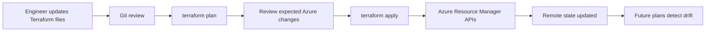
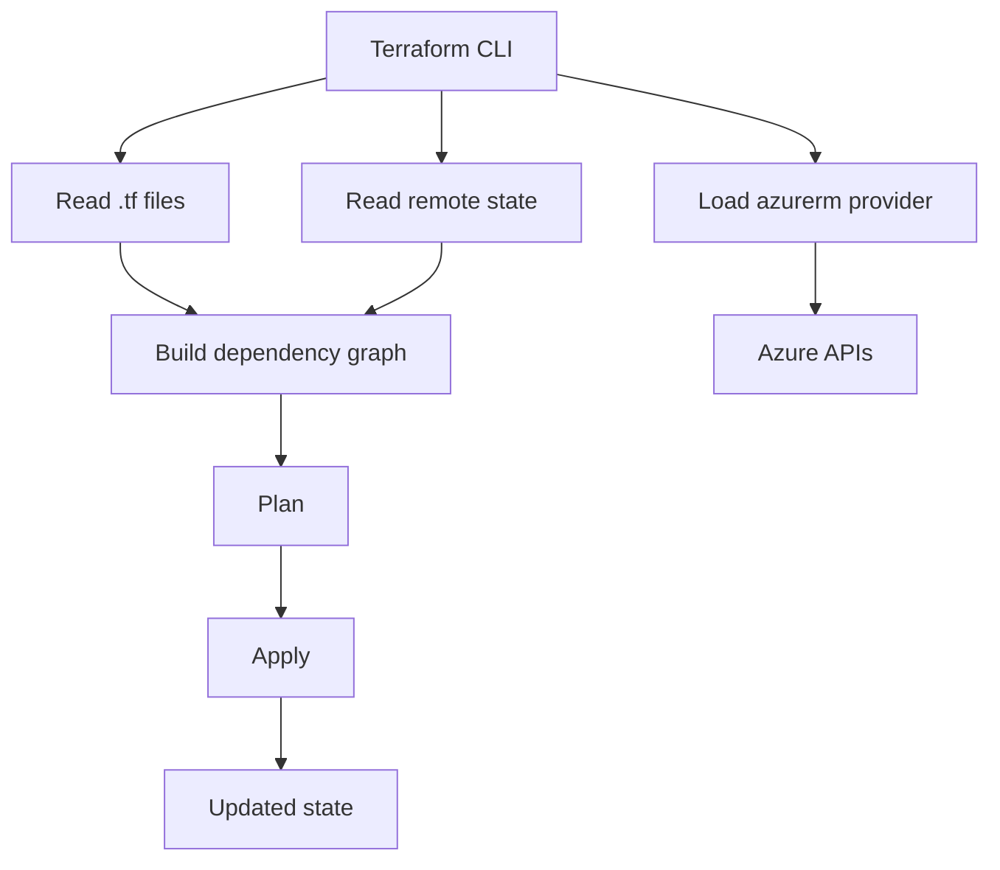
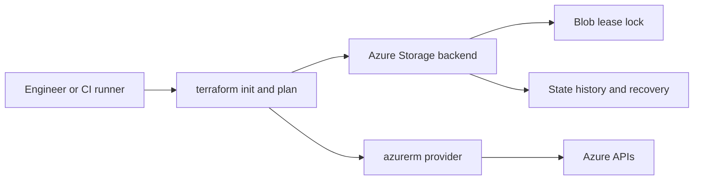
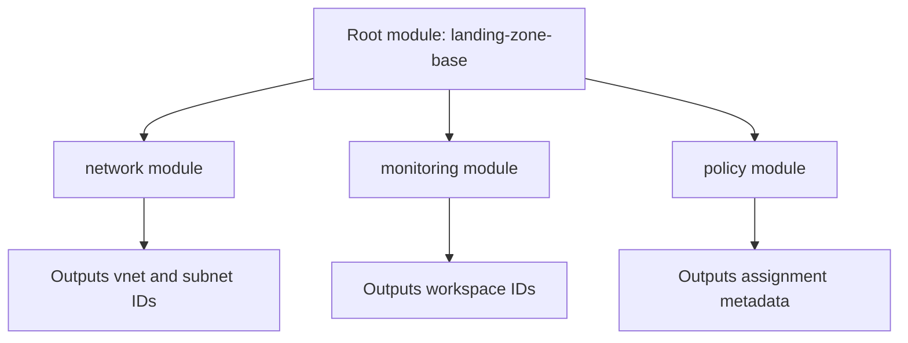
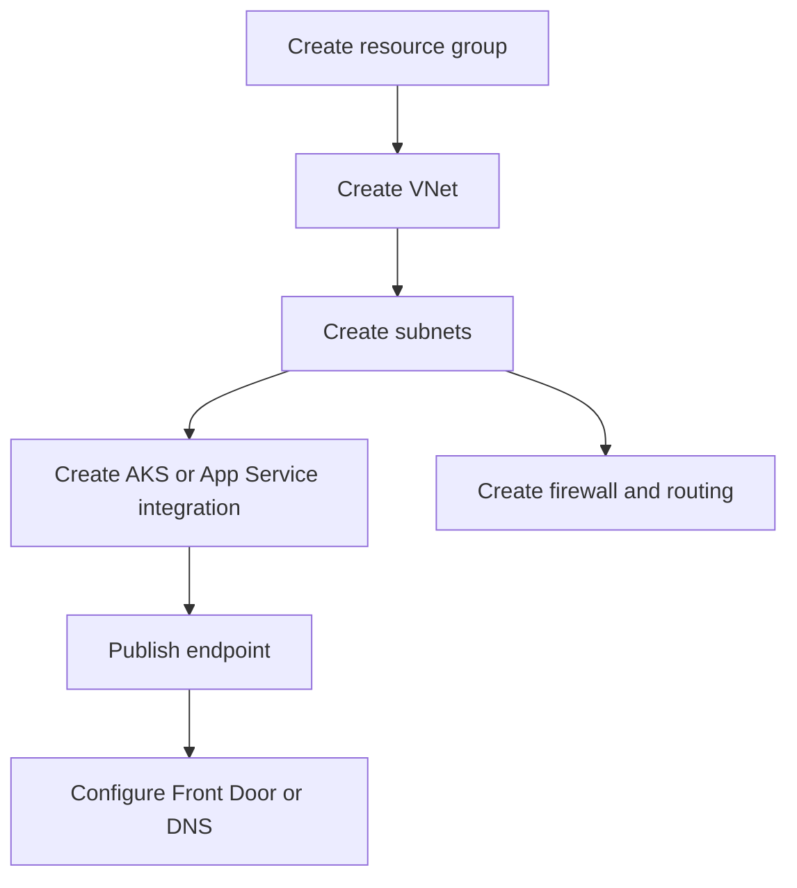
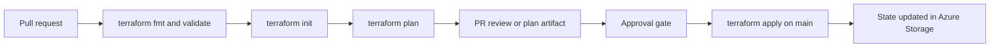

# Terraform on Azure — Complete Guide

This guide is a theory-first companion for the Terraform projects in this repository.
It explains what Terraform is doing on Azure, why the patterns were chosen, and how to reason about state, authentication, modularity, and lifecycle.
Use it while reading code, reviewing pull requests, or designing new infrastructure for Azure landing zones, networking, AKS, storage, databases, and disaster recovery.

The guide follows the same structure as the GCP Terraform guide, but every example here is Azure-specific.
That means `azurerm` provider behavior, Azure Resource Manager concepts, Azure Storage state backends, Azure identity models, and Azure service architecture trade-offs.
Where relevant, the guide maps concepts back to the ten Azure projects in `IaC-Deployments/` so you can connect theory to concrete implementations.

## 1. What is Infrastructure as Code (IaC)?

Infrastructure as Code is the practice of defining infrastructure in version-controlled files instead of manually creating it in a portal.
In Azure, that means describing resource groups, virtual networks, subnets, route tables, NSGs, Azure Firewall rules, AKS clusters, Front Door profiles, SQL databases, recovery services vaults, monitor resources, and policy assignments as code.

The key idea is that infrastructure becomes reviewable and repeatable.
Instead of asking which engineer clicked which setting in the Azure Portal, you review Git history and Terraform plans.
That changes infrastructure from an informal operational habit into an explicit engineering system.

Terraform is especially useful on Azure because many solutions span multiple scopes.
A single architecture may include management groups, subscriptions, resource groups, regional resources, global services such as Front Door, and identity objects in Microsoft Entra ID.
Without IaC, those boundaries are easy to configure inconsistently.

Terraform uses a declarative model.
You describe the desired end state, and Terraform calculates how to create, update, or replace resources through Azure Resource Manager APIs.
That is different from imperative shell scripts, where each API call must be sequenced manually.

| Approach | How it works on Azure | Strengths | Weaknesses |
| --- | --- | --- | --- |
| Azure Portal clicks | Engineer configures resources in the UI | Fast for learning and one-off experiments | Poor auditability and easy drift |
| Azure CLI / PowerShell | Imperative commands against ARM APIs | Good for bootstrap and diagnostics | Scripts become fragile at scale |
| ARM templates | Native JSON deployments through ARM | Strong native support and policy alignment | Verbose authoring experience |
| Bicep | Higher-level ARM authoring language | Excellent for Azure-only estates | Azure-specific, less multi-cloud portability |
| Terraform | Declarative, provider-driven desired state | Strong module ecosystem, multi-cloud, readable plans | Requires disciplined state and provider workflows |

In practice, mature Azure teams often use all of these tools together.
The Azure CLI is useful for initial bootstrap tasks.
Bicep is strong when a team is deeply committed to Azure-native tooling.
Terraform is especially compelling when you want shared module patterns, consistent workflows across clouds, or clearer composition across platform domains.

A helpful mental model is this.
ARM is the Azure deployment engine.
Bicep is a nicer language for ARM.
Terraform is an external control plane that manages Azure by maintaining its own dependency graph and state.
That extra statefulness is why Terraform can be so productive, but it also explains why backend design matters.



The ten Azure projects in this repository show why IaC matters.
A single VM pattern, a multi-region HA design, an AKS platform, a hub-and-spoke network, a SQL HA deployment, a Front Door application edge, a Data Lake storage baseline, a monitoring stack, a landing zone, and a disaster recovery topology all have many moving pieces.
Terraform turns those moving pieces into documented interfaces and controlled changes.

```text
$ az account show --query name -o tsv
Platform-Production-Subscription
$ terraform plan
Plan: 18 to add, 0 to change, 0 to destroy.
```

If you remember one sentence from this section, remember this.
IaC is not only automation.
It is the operating model that makes Azure infrastructure reviewable, reproducible, and safer to evolve.

## 2. Terraform Fundamentals

Terraform is built around providers, resources, data sources, variables, outputs, modules, and state.
On Azure, the main provider is `hashicorp/azurerm`.
It translates Terraform resource declarations into Azure Resource Manager API calls.

A Terraform run usually follows four commands.
`terraform init` installs providers and configures the backend.
`terraform plan` compares desired and actual state.
`terraform apply` executes the plan.
`terraform destroy` removes managed infrastructure.
In shared environments, destroy should be tightly controlled.

A typical workflow is simple.
Write configuration.
Initialize the working directory.
Generate a plan.
Review the plan.
Apply the reviewed changes.
Persist the new state remotely.

```hcl
terraform {
  required_version = ">= 1.6.0"
  required_providers {
    azurerm = {
      source  = "hashicorp/azurerm"
      version = "~> 4.0"
    }
  }
}

provider "azurerm" {
  features {}
  subscription_id = var.subscription_id
}

resource "azurerm_resource_group" "core" {
  name     = "rg-platform-prod-eastus"
  location = var.location
}

resource "azurerm_virtual_network" "hub" {
  name                = "vnet-hub-prod-eastus"
  location            = azurerm_resource_group.core.location
  resource_group_name = azurerm_resource_group.core.name
  address_space       = ["10.10.0.0/16"]
}
```

This small example already shows several fundamentals.
The Terraform block pins versions.
The provider block establishes the Azure target scope.
The resource group becomes the deployment boundary for regional resources.
The VNet depends on the resource group through attribute references, so Terraform builds the correct graph automatically.

Terraform is not a shell wrapper.
It is a stateful graph engine.
That means it remembers what it manages, computes dependencies, and decides whether changes can happen in place or require replacement.
That is powerful, but it also means careless state handling can cause serious problems.



Azure engineers should remember that Terraform resource names and Azure resource names are related but not identical concepts.
Terraform addresses are internal identifiers such as `azurerm_virtual_network.hub`.
Azure names are real platform names such as `vnet-hub-prod-eastus`.
You can refactor the Terraform address without renaming the Azure resource if you use moved blocks or careful state operations.

| Terraform object | Purpose on Azure | Example |
| --- | --- | --- |
| Provider | Connects Terraform to Azure APIs | `provider "azurerm"` |
| Resource | Manages an Azure object | `azurerm_linux_virtual_machine` |
| Data source | Reads an existing object | `data "azurerm_client_config"` |
| Variable | Parameterizes the configuration | `variable "subscription_id"` |
| Output | Publishes useful values | `output "vnet_id"` |
| Module | Packages a repeatable pattern | `module "hub_network"` |
| State | Records Terraform ownership | `azurerm` backend in Azure Storage |

An important Azure-specific detail is resource provider registration.
Many services rely on a subscription having the correct resource provider namespace registered.
For example, AKS uses `Microsoft.ContainerService`, and some network or DR features rely on additional namespaces.
The `azurerm` provider can register many providers automatically, but production teams should understand that subscription readiness is part of platform design.

```text
$ terraform init
Terraform has been successfully initialized!
$ terraform validate
Success! The configuration is valid.
$ terraform plan
Plan: 6 to add, 1 to change, 0 to destroy.
```

The output matters because it condenses a large configuration into a small, reviewable change statement.
When engineers review Terraform well, they are not reading every line equally.
They are asking which boundaries are changing, which replacements might be disruptive, and whether the state and credentials are correct for the intended Azure scope.

## 3. Provider Configuration

Provider configuration is where Terraform learns how to authenticate to Azure and which scopes to target.
In simple labs, the provider block is small.
In real platforms, it becomes part of the control-plane design because subscriptions, tenants, aliases, and authentication methods all affect safety.

The standard Azure provider is `hashicorp/azurerm`.
Some repositories also use `azuread` for Microsoft Entra ID objects, `azapi` for preview or less mature ARM surface area, or `random` and `time` for support logic.
This guide focuses on `azurerm` because it is the baseline for most infrastructure in this repository.

```hcl
terraform {
  required_providers {
    azurerm = {
      source  = "hashicorp/azurerm"
      version = "~> 4.0"
    }
  }
}

provider "azurerm" {
  features {}
  tenant_id       = var.tenant_id
  subscription_id = var.subscription_id
}

provider "azurerm" {
  alias           = "dr"
  features        = {}
  tenant_id       = var.tenant_id
  subscription_id = var.dr_subscription_id
}
```

Aliased providers matter on Azure because many architectures span multiple subscriptions.
A landing zone may separate hub networking, application workloads, monitoring, and disaster recovery into different subscriptions.
A disaster recovery project may need both the primary and secondary regions, or even two subscriptions with different RBAC boundaries.
Aliases make that intent explicit.

### Authentication method 1: Azure CLI session

For local development, the simplest experience is usually Azure CLI authentication.
If you have an active `az login` session and the correct subscription selected, the provider can often reuse that context.
This is convenient for learning and small experiments.
It is not the best production automation model.

```text
$ az login
$ az account set --subscription 00000000-1111-2222-3333-444444444444
$ az account show --query '{tenantId:tenantId, id:id, user:user.name}'
{
  "tenantId": "11111111-2222-3333-4444-555555555555",
  "id": "00000000-1111-2222-3333-444444444444",
  "user": "engineer@example.com"
}
```

CLI-based auth is useful for bootstrap and debugging.
It should not be your default for CI/CD because it is tied to a user identity and session state.

### Authentication method 2: Service Principal

Service Principals are a common non-human identity for Terraform.
They are straightforward and widely supported.
The main risk is long-lived client secrets or certificates if you do not manage them well.

```text
export ARM_CLIENT_ID="00000000-1111-2222-3333-444444444444"
export ARM_CLIENT_SECRET="<secret>"
export ARM_SUBSCRIPTION_ID="aaaaaaaa-bbbb-cccc-dddd-eeeeeeeeeeee"
export ARM_TENANT_ID="11111111-2222-3333-4444-555555555555"
```

When these variables are set, the provider can authenticate without explicit credentials in code.
That is the preferred pattern.
Never hard-code Service Principal secrets into Terraform files.
Never commit them to Git.

### Authentication method 3: Managed Identity

Managed Identity is usually a better runtime choice than a Service Principal secret when Terraform runs inside Azure.
A self-hosted runner, Azure VM, or automation environment can use a system-assigned or user-assigned managed identity.
That eliminates secret distribution.

```hcl
provider "azurerm" {
  features {}
  subscription_id = var.subscription_id
  use_msi         = true
}
```

The operational benefit is significant.
Identity becomes attached to the runtime, credential rotation is handled by Azure, and audit trails are cleaner.
The main requirement is correct role assignment on the managed identity.

### Authentication method 4: OIDC federation

For GitHub Actions and other modern CI systems, workload identity federation is typically better than storing a client secret.
The runner exchanges an OIDC token for Azure access.
That means the pipeline uses short-lived credentials instead of a static secret.

```hcl
provider "azurerm" {
  features {}
  subscription_id = var.subscription_id
  use_oidc        = true
  client_id       = var.federated_app_client_id
  tenant_id       = var.tenant_id
}
```

This is often the best option for repository-hosted automation.
It reduces secret sprawl and aligns with the same short-lived credential philosophy you would use in other clouds.

### Scope and RBAC design

Authentication answers who Terraform is.
Authorization answers what Terraform can change.
On Azure, least privilege is important because broad `Contributor` at the subscription root can give Terraform more power than intended.
Production designs often split permissions by domain.
A networking deployment identity may manage hub VNets and route tables.
An application identity may manage only a resource group.
A landing-zone identity may handle management groups, policy assignments, and role assignments.

```hcl
data "azurerm_client_config" "current" {}

output "current_object_id" {
  value = data.azurerm_client_config.current.object_id
}
```

`data.azurerm_client_config` is useful when you need the current tenant, client, or object identity to wire access control.
It is often cleaner than hard-coding identity metadata.

Version pinning matters here too.
The Azure provider evolves quickly.
Pin compatible versions, test upgrades deliberately, and do not let the provider change unexpectedly during critical production work.

## 4. Remote State Management

State is Terraform's memory.
Without it, Terraform would not know which Azure resources it already manages, which IDs correspond to which configuration blocks, or whether a planned update is safe.
That is why local state files are fine only for disposable personal experiments.
Team workflows need remote state.

On Azure, the standard backend is Azure Storage.
A dedicated storage account and blob container hold state files.
The backend gives you centralization, access control, blob leases for locking, and version history when soft delete or versioning is enabled.

```hcl
terraform {
  backend "azurerm" {
    resource_group_name  = "rg-tfstate-prod"
    storage_account_name = "sttfstateprod001"
    container_name       = "tfstate"
    key                  = "landing-zone-base/prod.tfstate"
    use_azuread_auth     = true
  }
}
```

The `key` should reflect a real architecture boundary.
Examples include `networking/prod.tfstate`, `aks-cluster/shared.tfstate`, or `disaster-recovery/eastus2.tfstate`.
If too many unrelated resources share one state file, plans become noisy and applies become risky.

A secure state storage design on Azure usually includes these controls.
A dedicated resource group.
A dedicated storage account.
Private network access where practical.
Encryption at rest.
Restricted RBAC.
State version retention and blob recovery features.

```text
$ az group create --name rg-tfstate-prod --location eastus
$ az storage account create \
    --name sttfstateprod001 \
    --resource-group rg-tfstate-prod \
    --location eastus \
    --sku Standard_LRS \
    --kind StorageV2 \
    --min-tls-version TLS1_2 \
    --allow-blob-public-access false
$ az storage container create \
    --name tfstate \
    --account-name sttfstateprod001 \
    --auth-mode login
$ terraform init -migrate-state
Successfully configured the backend "azurerm"!
```

If your team uses Azure AD authentication for the backend, make sure the deployment identity has the right data-plane role.
Typical choices include `Storage Blob Data Contributor` on the state container or storage account.
Control-plane access alone is not enough for blob operations.

```text
$ az role assignment create \
    --assignee 00000000-1111-2222-3333-444444444444 \
    --role "Storage Blob Data Contributor" \
    --scope /subscriptions/aaaaaaaa-bbbb-cccc-dddd-eeeeeeeeeeee/resourceGroups/rg-tfstate-prod/providers/Microsoft.Storage/storageAccounts/sttfstateprod001
```



Blob lease locking helps prevent concurrent writes to the same state file.
Even so, teams should still serialize applies to the same stack.
Backend locking reduces conflicts.
CI concurrency rules reduce them further.
You want both.

| State choice | When it is acceptable | Why it is limited |
| --- | --- | --- |
| Local state | Disposable lab or personal scratch work | Not shareable and easy to lose |
| Shared file on disk | Almost never | Poor integrity and access control |
| Azure Storage backend | Standard Azure team workflow | Requires bootstrap and RBAC setup |
| Separate state account per domain | High-regulation environments | Strong isolation but more overhead |

A good remote-state strategy avoids turning `terraform_remote_state` into an accidental coupling mechanism.
Use outputs across stacks only when the dependency is real and stable.
For many Azure designs, shared names, data sources, Key Vault references, or platform catalogs are cleaner than deep cross-state wiring.

```gitignore
.terraform/
*.tfstate
*.tfstate.*
crash.log
override.tf
override.tf.json
*_override.tf
*_override.tf.json
*.tfvars
*.tfvars.json
*.tfplan
```

Never commit state files.
Never commit plan artifacts broadly.
Never assume state is harmless because it does not contain a plaintext password.
State often reveals network topology, resource IDs, secrets metadata, IP addresses, and identity relationships.
Treat it as sensitive platform data.

## 5. Project Structure Best Practices

A good Terraform repository structure makes ownership, scope, and deployment boundaries obvious.
It tells a reviewer where reusable modules live, where deployable roots live, which environment is changing, and how state is split.
Project structure is therefore an operational decision, not a cosmetic one.

```text
terraform/
├── modules/
│   ├── network/
│   ├── aks/
│   ├── sql/
│   └── monitoring/
├── live/
│   ├── dev/
│   ├── prod/
│   └── shared/
└── bootstrap/
    └── remote-state/
```

This layout separates reusable implementation from deployable intent.
Modules express how a pattern works.
Root modules express what a specific environment should contain.
That separation is especially helpful in Azure because production often differs from non-production in more than variable values.
Subscriptions, policies, identity scopes, and DNS boundaries may all differ.

The project directories in this repository are a learning-oriented structure.
Each project demonstrates a complete Azure pattern.
A production platform may still adopt a `modules/` plus `live/` layout under each domain or repository.
The important principle is the same.
Keep state boundaries aligned with architecture boundaries.

| Structure decision | Recommended default | Why |
| --- | --- | --- |
| Reusable logic | `modules/` directory or registry modules | Keeps patterns consistent |
| Deployable stacks | Separate root module per environment or platform domain | Clear backend and blast radius |
| Provider config | Root module | Avoids hidden credentials in child modules |
| Secrets | External secret system or CI variables | Keeps Git clean |
| Subscription boundaries | Explicit in roots and aliases | Prevents accidental cross-subscription drift |

A common anti-pattern is a giant root module that provisions everything.
That may feel simple early on.
It scales poorly.
A networking change should not require reviewing the same state that also owns SQL failover groups, diagnostic settings, and application DNS records.
Smaller roots produce safer plans and clearer ownership.

In Azure, environment directories are usually easier to reason about than Terraform workspaces for long-lived stacks.
Production may need different backend keys, provider aliases, resource naming, and policy behavior.
Separate roots make those differences visible.
Hidden workspace context does not.

```hcl
module "hub_network" {
  source              = "../../modules/network"
  resource_group_name = var.resource_group_name
  location            = var.location
  address_space       = ["10.10.0.0/16"]
}
```

This composition pattern keeps the root focused on environment intent.
The module should not need to know whether it is serving `prod`, `nonprod`, or `dr` as business concepts.
It should implement a network pattern with clear inputs and outputs.

## 6. Modules

A Terraform module is a package of resources that implements a reusable pattern.
Good modules capture a real design decision.
On Azure, useful modules often represent VNets, subnets, hub firewalls, AKS clusters, Front Door profiles, App Service environments, SQL servers with failover settings, Data Lake storage accounts, or monitoring baselines.

Good modules have narrow interfaces and opinionated defaults.
If a simple VNet module exposes fifty switches, it is probably not a helpful abstraction.
If it hides every important choice, it becomes rigid.
The goal is to expose meaningful differences while keeping implementation details stable.

```hcl
variable "name" {
  type = string
}

variable "address_space" {
  type = list(string)
}

resource "azurerm_virtual_network" "this" {
  name                = var.name
  location            = var.location
  resource_group_name = var.resource_group_name
  address_space       = var.address_space
}

output "id" {
  value = azurerm_virtual_network.this.id
}
```

This module is intentionally small.
A larger production module may also create subnets, NSGs, route associations, diagnostics, and policy-friendly tags.
Even then, the module should still express one coherent pattern.



Registry modules are worth using when they fit your standards.
Azure Verified Modules are increasingly important in this space.
Examples include VNet, Key Vault, storage, and compute modules published under the Azure namespace.
You can also learn from Microsoft CAF enterprise-scale modules, even if you do not adopt them unchanged.

| Module source | Good use case on Azure | Example |
| --- | --- | --- |
| Local module | Team-specific patterns | `../../modules/hub-network` |
| Azure Verified Module | Standardized Azure resource implementations | `Azure/avm-res-network-virtualnetwork/azurerm` |
| Community registry module | Common patterns with good adoption | Evaluate maintenance and versioning carefully |
| Enterprise landing zone module | Large-scale policy and management-group estates | `Azure/terraform-azurerm-caf-enterprise-scale/azurerm` |

Choose modules the same way you choose libraries.
Inspect maintenance quality.
Pin versions.
Read inputs and outputs carefully.
Do not hide core architectural understanding behind a module boundary.
A good engineer still knows what the module is building.

## 7. Variables and Environments

Variables let you reuse Terraform across subscriptions, regions, environments, and deployment sizes.
In Azure repositories, common variables include subscription IDs, tenant IDs, locations, address spaces, SKU choices, DNS names, node pool sizes, allowed CIDRs, and common tags.

A useful rule is to keep stable platform intent in code and environment-specific values outside the module interface where appropriate.
For example, the fact that production AKS should be private may belong in module logic.
The specific node size, region, and DNS prefix belong in environment configuration.

```hcl
variable "location" {
  type = string
  validation {
    condition     = contains(["eastus", "centralus", "westeurope"], var.location)
    error_message = "Use an approved Azure region."
  }
}

variable "environment" {
  type = string
  validation {
    condition     = contains(["dev", "test", "prod", "dr"], var.environment)
    error_message = "Environment must be dev, test, prod, or dr."
  }
}

variable "common_tags" {
  type = map(string)
}
```

Validation blocks are cheap and valuable.
They turn bad assumptions into fast feedback.
If only approved regions or SKUs are allowed, encode that rule.
Terraform is not just for deployment.
It is also a place to express platform constraints.

```hcl
location    = "eastus"
environment = "prod"
common_tags = {
  environment = "prod"
  owner       = "platform"
  cost_center = "shared-services"
}
```

Sensitive variables need special care.
`sensitive = true` controls display behavior.
It does not prevent a value from existing in state if a resource stores it.
For live secrets, Azure Key Vault or another secure system is usually better than storing secret values directly in Terraform-managed attributes.

| Environment strategy | Recommended for Azure? | Notes |
| --- | --- | --- |
| Separate roots per environment | Yes | Explicit backend and subscription targeting |
| Terraform workspaces for long-lived envs | Usually no | Too much hidden context |
| One state for every environment | No | Large blast radius |
| One repo per environment | Sometimes | Strong isolation, more duplication |

```hcl
locals {
  name_prefix = "${var.environment}-${var.location}"
  tags        = merge(var.common_tags, { managed_by = "terraform" })
}
```

Locals are ideal for derived values that should not become part of the public interface.
A naming prefix, diagnostic category set, or default tag map often belongs in `locals`, not as additional variables.

## 8. Resource Dependencies and Lifecycle

Resource ordering matters in Azure.
An AKS cluster cannot attach to a subnet that does not exist.
A spoke VNet cannot peer with a hub VNet that has not been created.
A SQL failover group depends on primary and secondary servers.
A Front Door origin should not reference an application endpoint that is still unknown.

The preferred approach is implicit dependency.
If one resource references another resource attribute, Terraform creates the dependency edge automatically.
Explicit `depends_on` is still useful for operational prerequisites that are not captured by a direct attribute reference.

```hcl
resource "azurerm_resource_group" "app" {
  name     = "rg-app-prod-eastus"
  location = var.location
}

resource "azurerm_virtual_network" "app" {
  name                = "vnet-app-prod-eastus"
  location            = azurerm_resource_group.app.location
  resource_group_name = azurerm_resource_group.app.name
  address_space       = ["10.20.0.0/16"]
}

resource "azurerm_subnet" "aks" {
  name                 = "snet-aks"
  resource_group_name  = azurerm_resource_group.app.name
  virtual_network_name = azurerm_virtual_network.app.name
  address_prefixes     = ["10.20.1.0/24"]
}
```

Sometimes explicit dependency is justified.
For example, policy assignments, provider registrations, RBAC propagation, or private DNS readiness may need to settle before a later resource reliably succeeds.
Use `depends_on` deliberately, not everywhere.

```hcl
resource "azurerm_public_ip" "frontdoor_origin" {
  name                = "pip-web-prod"
  location            = azurerm_resource_group.app.location
  resource_group_name = azurerm_resource_group.app.name
  allocation_method   = "Static"
  sku                 = "Standard"

  lifecycle {
    prevent_destroy = true
  }
}
```

`prevent_destroy` is useful for resources whose deletion would be disruptive or painful to recover.
Examples include a shared static IP, a production Key Vault, a critical DNS zone, or the remote-state storage account.
Use it sparingly, but intentionally.

```hcl
resource "azurerm_linux_virtual_machine_scale_set" "web" {
  name                = "vmss-web-prod"
  location            = azurerm_resource_group.app.location
  resource_group_name = azurerm_resource_group.app.name
  sku                 = "Standard_D2s_v5"
  instances           = 2

  lifecycle {
    ignore_changes = [instances]
  }
}
```

`ignore_changes` is valuable only when another controller should own a field.
Autoscaling is a common example.
Every ignored field is one Terraform stops reconciling, so avoid it unless the ownership boundary is real.



Lifecycle settings should reflect operational intent.
If a resource is ephemeral, replacement is acceptable.
If it is shared network or identity infrastructure, replacement may create outage or governance risk.
Thinking about lifecycle early makes upgrades less surprising.

## 9. Cloud-Specific Patterns (10 explained)

The following ten patterns appear repeatedly in Azure Terraform because they align with how Azure is structured operationally.
Each one connects to a project in this repository.
Together they explain the architectural logic behind the project set.

| # | Project | Pattern | Main Azure rationale |
| --- | --- | --- | --- |
| 1 | `01-single-vm` | Small compute stack with explicit network and identity | Teaches the basic ARM resource graph |
| 2 | `02-multi-region-ha` | Active/standby or distributed regional design | Azure regions fail independently |
| 3 | `03-aks-cluster` | Managed Kubernetes with network, identity, and add-ons | AKS is easy to create and easy to misconfigure |
| 4 | `04-vnet-hub-spoke` | Centralized connectivity and security | Shared services and transit are common on Azure |
| 5 | `05-sql-database-ha` | Managed database resilience | Azure SQL HA features are service-driven |
| 6 | `06-app-service-frontdoor` | PaaS app behind global edge | Front Door provides global routing and WAF |
| 7 | `07-storage-data-lake` | Analytics-ready storage baseline | Data Lake Gen2 needs naming, ACL, and lifecycle discipline |
| 8 | `08-monitoring-stack` | Central observability | Azure Monitor is strongest when standardized |
| 9 | `09-landing-zone-base` | Governance-first foundation | Management groups, policy, and RBAC should be codified early |
| 10 | `10-disaster-recovery` | Planned failover and replication | DR is cheaper and safer when designed intentionally |

### Pattern 1: `01-single-vm`

The single VM project is the simplest useful Terraform pattern on Azure.
It usually includes a resource group, virtual network, subnet, NSG, NIC, public or private IP strategy, and a VM resource.
That sounds basic, but it teaches the most important habit.
Even a small server should have explicit networking, identity, and tagging.

The architecture rationale is clarity.
Azure makes it easy to create a VM quickly in the portal.
Terraform makes the surrounding decisions visible.
Why does the VM need a public IP?
Should it use a system-assigned managed identity?
Should the OS disk use customer-managed keys?
Should the NSG allow only Bastion or specific admin CIDRs?

Typical resources include `azurerm_linux_virtual_machine`, `azurerm_network_interface`, `azurerm_network_security_group`, and `azurerm_managed_disk` when data disks are required.
The project is a useful baseline for understanding provider auth, resource dependencies, and naming conventions.

### Pattern 2: `02-multi-region-ha`

The multi-region HA project explains why Azure region boundaries matter.
A single region outage, capacity issue, or control-plane failure can affect compute, data, and ingress in different ways.
Terraform helps you model primary and secondary regions explicitly.

Typical design decisions include paired regions, traffic distribution, replicated storage, database failover, and DNS or Front Door failover behavior.
The important lesson is not only redundancy.
It is that failover boundaries should be visible in code.
A provider alias or duplicated regional module is often clearer than hidden conditional logic.

In practice, Azure HA design usually combines regional duplication with a global entry point.
That may be Front Door for HTTP workloads, Traffic Manager for DNS-based routing, or a service-specific replication feature such as SQL failover groups or storage account redundancy.

### Pattern 3: `03-aks-cluster`

AKS is a common platform choice because it reduces Kubernetes control-plane management overhead.
It still requires careful infrastructure decisions.
Terraform is useful because AKS touches identity, subnet sizing, DNS, node pool design, logging, and ingress.

The architectural rationale is consistency.
Every cluster should encode clear defaults for private versus public API access, managed identities, network plugin choice, Azure Policy integration, diagnostics, and workload ingress.
A module can make those defaults repeatable.

This project typically includes virtual network integration, dedicated AKS subnets, managed identity bindings, node pools, Container Insights wiring, and possibly add-ons such as Key Vault CSI or Azure Policy.
Teams learn quickly that AKS is not just `azurerm_kubernetes_cluster`.
It is an ecosystem of dependent Azure choices.

### Pattern 4: `04-vnet-hub-spoke`

Hub-and-spoke is one of the most common Azure network patterns.
A central hub hosts shared connectivity and control services.
Spokes host application workloads.
Terraform is a good fit because peering, routing, firewall policy, DNS, and subnet boundaries all need to be explicit.

The rationale is separation of concerns.
Networking and security teams can own the hub.
Application teams can consume spoke connectivity without reinventing routing and inspection.
The pattern also supports future landing-zone growth better than a flat network.

Typical resources include VNets, subnets, peering objects, route tables, Azure Firewall, VPN Gateway or ExpressRoute placeholders, and private DNS links.
The Terraform graph makes it easier to understand which parts are shared and which parts are workload-specific.

### Pattern 5: `05-sql-database-ha`

Azure SQL Database and related managed data services offer HA features that are platform-driven rather than VM-driven.
That shifts the Terraform focus.
You are not building a database cluster manually.
You are configuring service tiers, backup retention, failover groups, networking, and observability.

The architecture rationale is managed resilience.
A good Terraform design makes HA choices explicit.
Which edition and SKU meet the workload target?
Is zone redundancy needed?
Should private endpoints be used?
Is a failover group required across regions?
These are business decisions with infrastructure consequences.

This project helps explain why Terraform should capture service-level behavior, not only raw resource creation.
On Azure, many HA features are arguments on managed resources, and reviewers need to understand their trade-offs.

### Pattern 6: `06-app-service-frontdoor`

This project shows a strong Azure PaaS pattern.
App Service handles web application hosting.
Front Door adds global routing, TLS termination, WAF, caching choices, and origin health behavior.
Terraform makes those relationships explicit.

The rationale is clean separation between application runtime and internet edge.
Teams can scale App Service independently while standardizing global entry and protection through Front Door.
This is particularly useful for multi-region web applications or centralized security requirements.

Typical resources include App Service Plans, Linux or Windows Web Apps, Front Door profiles, endpoints, origin groups, custom domains, and WAF policies.
The project teaches how PaaS and global network services fit together on Azure.

### Pattern 7: `07-storage-data-lake`

Azure Data Lake Storage Gen2 is more than a bucket equivalent.
It introduces hierarchical namespace behavior, analytics integration expectations, ACL considerations, lifecycle policies, and often private networking.
Terraform provides a disciplined way to encode those settings.

The architecture rationale is governance and scale.
Data platforms often fail when storage naming, container layout, retention rules, and access boundaries are improvised.
Terraform helps establish repeatable conventions for raw, curated, and analytics zones.

Typical resources include storage accounts with HNS enabled, filesystem or container definitions, private endpoints, RBAC assignments, diagnostic settings, lifecycle management policies, and customer-managed encryption choices.
This project is a good reminder that storage design is a platform topic, not just a developer convenience.

### Pattern 8: `08-monitoring-stack`

Monitoring is strongest when it is centralized and standardized.
On Azure, that often means Log Analytics workspaces, Application Insights, diagnostic settings, action groups, alerts, dashboards, and sometimes Azure Monitor workbooks.
Terraform is a natural fit because observability should be part of the platform baseline, not an afterthought.

The architecture rationale is consistency across workloads.
If each project configures diagnostics differently, operations become fragmented.
A Terraform monitoring pattern lets you define which signals are mandatory and where they should land.

This project is also important because many Azure resources do not emit useful diagnostics until you attach diagnostic settings explicitly.
Terraform makes that requirement visible and repeatable.

### Pattern 9: `09-landing-zone-base`

A landing zone is the governance and connectivity foundation for everything else.
On Azure, that usually includes management groups, subscriptions, policies, role assignments, shared connectivity, platform logging, naming standards, and security guardrails.
Terraform belongs here because these decisions should be versioned before application teams arrive.

The architectural rationale is control before scale.
If you wait to add policies, RBAC boundaries, and logging after dozens of subscriptions already exist, remediation becomes harder.
A landing-zone baseline makes new environments safer by default.

This project may reference modules similar in spirit to Microsoft Cloud Adoption Framework patterns.
Even if the implementation is smaller than enterprise-scale modules, the goal is the same.
Standardize the foundation so later projects inherit good defaults.

### Pattern 10: `10-disaster-recovery`

Disaster recovery is not the same as high availability.
HA reduces the impact of local failures.
DR addresses major outages, regional loss, corruption scenarios, and controlled recovery procedures.
Terraform helps by codifying the standby topology, replication relationships, and failover prerequisites.

The architectural rationale is preparedness.
Without codified DR, teams often discover during an incident that dependencies were undocumented.
Which region holds the warm standby resources?
Which private DNS zones need updates?
Which replicated storage accounts or SQL failover groups exist?
Terraform makes those dependencies visible before the incident.

Typical resources may include paired-region networks, vaults, replicated storage, secondary compute capacity definitions, database replication settings, traffic cutover mechanisms, and monitoring of readiness.
This project teaches that DR is a designed system, not an emergency improvisation.

## 10. CI/CD for Terraform

Terraform becomes much safer when plan and apply happen in a consistent pipeline.
CI/CD gives you version pinning, non-interactive execution, auditable logs, approval steps, and controlled credentials.
For Azure repositories on GitHub, a common pattern is GitHub Actions plus workload identity federation into Azure.

A standard pipeline has these stages.
Format and validate.
Initialize.
Plan.
Publish the plan or summary.
Apply only after review or protected-branch gating.
Serialize applies per state boundary.



```yaml
name: terraform-azure
on:
  pull_request:
    paths:
      - 'IaC-Deployments/**'
  push:
    branches: [main]
    paths:
      - 'IaC-Deployments/**'
jobs:
  plan:
    runs-on: ubuntu-latest
    permissions:
      contents: read
      id-token: write
      pull-requests: write
    steps:
      - uses: actions/checkout@v4
      - uses: azure/login@v2
        with:
          client-id: ${{ secrets.AZURE_CLIENT_ID }}
          tenant-id: ${{ secrets.AZURE_TENANT_ID }}
          subscription-id: ${{ secrets.AZURE_SUBSCRIPTION_ID }}
      - uses: hashicorp/setup-terraform@v3
        with:
          terraform_version: 1.8.5
      - run: terraform -chdir=IaC-Deployments/04-vnet-hub-spoke fmt -check
      - run: terraform -chdir=IaC-Deployments/04-vnet-hub-spoke init -input=false
      - run: terraform -chdir=IaC-Deployments/04-vnet-hub-spoke validate
      - run: terraform -chdir=IaC-Deployments/04-vnet-hub-spoke plan -input=false -out=tfplan
  apply:
    if: github.ref == 'refs/heads/main'
    needs: plan
    runs-on: ubuntu-latest
    concurrency: terraform-azure-hub-spoke
    permissions:
      contents: read
      id-token: write
    steps:
      - uses: actions/checkout@v4
      - uses: azure/login@v2
        with:
          client-id: ${{ secrets.AZURE_CLIENT_ID }}
          tenant-id: ${{ secrets.AZURE_TENANT_ID }}
          subscription-id: ${{ secrets.AZURE_SUBSCRIPTION_ID }}
      - uses: hashicorp/setup-terraform@v3
        with:
          terraform_version: 1.8.5
      - run: terraform -chdir=IaC-Deployments/04-vnet-hub-spoke init -input=false
      - run: terraform -chdir=IaC-Deployments/04-vnet-hub-spoke apply -input=false -auto-approve
```

Two design decisions are worth highlighting.
First, the workflow uses OIDC through `azure/login` instead of a long-lived client secret.
Second, the apply job uses a concurrency key so only one apply touches the same state boundary at a time.
Those decisions reduce both secret risk and state corruption risk.

```text
$ terraform validate
Success! The configuration is valid.
$ terraform plan -input=false
Plan: 4 to add, 0 to change, 0 to destroy.
```

If you store plan artifacts, remember they can contain sensitive data.
Retain them only as long as necessary.
Some teams prefer re-planning on apply after merge.
Others prefer applying the exact reviewed plan.
The right choice depends on your approval model and compliance requirements.

| CI/CD platform | Strengths for Terraform on Azure | Common reason to choose it |
| --- | --- | --- |
| GitHub Actions + OIDC | Good repo integration and short-lived credentials | Strong default for GitHub-hosted repos |
| Azure DevOps | Native Azure ecosystem fit | Existing enterprise standard |
| Jenkins or self-hosted runners | Highly customizable | Legacy integration needs |
| Terraform Cloud | Built-in Terraform workflows | Teams wanting hosted Terraform control plane |

## 11. Security Best Practices

Security in Terraform on Azure is mostly about identity, state, scope, and secrets.
The language itself is not the risky part.
Weak operational choices are.
A strong repository makes those choices visible and repeatable.

1. Never commit state, plan files, or secret-bearing `tfvars` files.
2. Prefer OIDC or Managed Identity over long-lived Service Principal secrets.
3. Grant deployment identities only the roles needed for their scope.
4. Separate identities for networking, platform, and application layers when ownership differs.
5. Use Key Vault or another secret system for runtime secrets.
6. Turn on logging, diagnostics, and tags so changes are attributable.
7. Protect critical shared resources with process and lifecycle controls.

A practical state-backend baseline includes a dedicated storage account, restricted network access, Azure AD auth, and `Storage Blob Data Contributor` only for the identities that need it.
Read access to state is sensitive.
Even without plaintext secrets, state can reveal IP ranges, hostnames, role bindings, and service endpoints.

```hcl
resource "azurerm_role_assignment" "tfstate_blob_access" {
  scope                = azurerm_storage_account.tfstate.id
  role_definition_name = "Storage Blob Data Contributor"
  principal_id         = var.terraform_principal_object_id
}
```

Secrets deserve special attention.
Terraform can create a Key Vault and the access policies or RBAC around it.
Terraform is usually a poor place to manage live secret values over time because those values may end up in state.
A better design is for Terraform to create the secure container and permissions, while a separate rotation process manages the payload.

```hcl
resource "azurerm_key_vault" "platform" {
  name                       = "kv-platform-prod-001"
  location                   = var.location
  resource_group_name        = var.resource_group_name
  tenant_id                  = var.tenant_id
  sku_name                   = "standard"
  purge_protection_enabled   = true
  soft_delete_retention_days = 90
}
```

On Azure, private endpoints, NSGs, Firewall rules, RBAC, and Policy assignments all contribute to the security posture of what Terraform creates.
That means security is not one section of the codebase.
It is encoded across many resources and module defaults.

## 12. Troubleshooting Common Issues

Even strong Terraform stacks encounter operational issues.
The key is to identify whether the problem comes from syntax, provider behavior, state, RBAC, ARM readiness, quota, or a service-specific platform dependency.
Azure troubleshooting often combines `terraform` output with `az` inspection.

| Symptom | Likely cause | First checks |
| --- | --- | --- |
| `403` or authorization failure | Missing RBAC or wrong subscription | Check identity, role assignment, and selected subscription |
| Backend auth failure | Missing blob data-plane permission | Confirm `Storage Blob Data Contributor` |
| Resource provider not registered | Subscription missing namespace registration | Check provider registration state |
| Resource already exists | Manual drift or naming collision | Import or rename |
| Unsupported argument | Provider version mismatch | Check provider docs and lock file |
| Long delays or timeouts | ARM propagation or service dependency | Retry after validating prerequisites |

### Issue 1: Authentication failures

Start by checking the active identity and scope.
For local work, `az account show` confirms the current subscription.
If Terraform is using environment variables, verify `ARM_SUBSCRIPTION_ID`, `ARM_TENANT_ID`, and client identity settings.
For OIDC, inspect the federated credential and trust configuration.

### Issue 2: Backend access failures

Many backend issues are not Terraform syntax problems.
They are Azure Storage RBAC problems.
If you can manage the storage account but cannot read or write the blob, the missing permission is often on the data plane.
Check blob-level access through Azure AD and confirm the backend exists in the expected subscription.

### Issue 3: Resource provider registration

Some Azure resources fail with confusing messages when the subscription has not registered the necessary provider namespace.
A quick check is:
`az provider show --namespace Microsoft.ContainerService --query registrationState -o tsv`.
If the provider is not registered, register it and allow propagation time.

### Issue 4: Existing resources and imports

If a VNet, storage account, or SQL server already exists because it was created manually, Terraform cannot automatically take ownership.
Use `terraform import`, then run `terraform plan` immediately.
The import establishes ownership.
The plan shows whether your configuration actually matches the real object.

### Issue 5: State drift

If Terraform wants to change something unexpectedly, compare state with the live resource.
Use `terraform state show <address>` and the matching `az resource show` or service-specific `az` command.
The real question is whether configuration should change to match reality, or reality should be corrected to match configuration.

### Issue 6: Regional and quota constraints

Azure quota limits and regional availability can block correct Terraform changes.
VM family quotas, public IP limits, AKS capacity limits, and zone support differences are common examples.
Terraform is often the messenger, not the cause.
Investigate the actual Azure service limit before changing the code blindly.

## 13. Cost Management

Terraform does not optimize Azure cost automatically.
It gives you a reliable place to encode cost-aware defaults.
On Azure, cost management usually starts with tags, resource sizing, autoscaling, PaaS versus IaaS choices, backup retention, log retention, storage tiering, and disciplined cleanup of ephemeral resources.

A simple but powerful control is tagging.
If resources are not tagged by environment, owner, workload, and cost center, later cost analysis becomes harder.
Terraform makes consistent tagging practical.

```hcl
resource "azurerm_linux_virtual_machine" "ops" {
  name                = "vm-ops-prod-01"
  resource_group_name = var.resource_group_name
  location            = var.location
  size                = "Standard_B2ms"
  tags                = merge(var.common_tags, { workload = "operations" })
}
```

Choosing `Standard_B2ms` instead of a much larger SKU is an architectural decision.
Terraform makes that decision reviewable.
The same is true for AKS node pools, App Service plans, SQL service tiers, and log retention settings.

```hcl
resource "azurerm_consumption_budget_resource_group" "platform" {
  name              = "budget-platform-prod"
  resource_group_id = azurerm_resource_group.core.id

  amount     = 2000
  time_grain = "Monthly"

  notification {
    enabled        = true
    threshold      = 80
    operator       = "EqualTo"
    contact_emails = ["platform-finops@example.com"]
  }
}
```

| Cost lever | Terraform pattern | Why it works |
| --- | --- | --- |
| Right sizing | Explicit VM and node sizes | Reviewers can challenge oversized defaults |
| Autoscaling | Intentional min/max settings | Reduces steady-state overprovisioning |
| PaaS preference | App Service or Azure SQL where appropriate | Lowers operational burden |
| Tags | Standardized tag maps | Better chargeback and reporting |
| Budgets | Azure consumption budget resources | Earlier visibility into spend |
| Lifecycle policies | Storage tiering and deletion rules | Prevents cold data from growing unmanaged |

Some Azure cost decisions are trade-offs rather than obvious savings.
Front Door, Azure Firewall, private endpoints, zone redundancy, and premium storage can cost more.
They may still be the right decision if they reduce risk, improve performance, or simplify operations.
Good cost management evaluates system value, not only resource count.

## 14. Official References

Use the provider registry when you need exact Terraform arguments, import formats, or lifecycle notes.
Use Microsoft documentation when you need Azure service behavior, limits, RBAC details, networking design, or security guidance.
The best Terraform engineers move comfortably between both.

| Topic | Official reference |
| --- | --- |
| Terraform language docs | https://developer.hashicorp.com/terraform/language |
| Terraform CLI docs | https://developer.hashicorp.com/terraform/cli |
| AzureRM provider docs | https://registry.terraform.io/providers/hashicorp/azurerm/latest/docs |
| AzureAD provider docs | https://registry.terraform.io/providers/hashicorp/azuread/latest/docs |
| Azure Storage backend docs | https://developer.hashicorp.com/terraform/language/settings/backends/azurerm |
| Azure authentication for Terraform | https://learn.microsoft.com/azure/developer/terraform/authenticate-to-azure |
| Azure Verified Modules | https://learn.microsoft.com/azure/azure-resource-manager/bicep/azure-verified-modules-overview |
| Azure landing zones | https://learn.microsoft.com/azure/cloud-adoption-framework/ready/landing-zone/ |
| Azure AKS docs | https://learn.microsoft.com/azure/aks/ |
| Azure Front Door docs | https://learn.microsoft.com/azure/frontdoor/ |
| Azure SQL docs | https://learn.microsoft.com/azure/azure-sql/ |
| Azure Monitor docs | https://learn.microsoft.com/azure/azure-monitor/ |
| Azure Storage docs | https://learn.microsoft.com/azure/storage/ |
| Azure disaster recovery docs | https://learn.microsoft.com/azure/site-recovery/ |

As you work through the ten Azure Terraform projects in this repository, keep asking four questions.
What is the desired state?
Which Azure boundary owns it?
How is state stored safely?
Why was this architecture chosen over the alternatives?
If you can answer those questions from the code, you are reading Terraform like a platform engineer.
