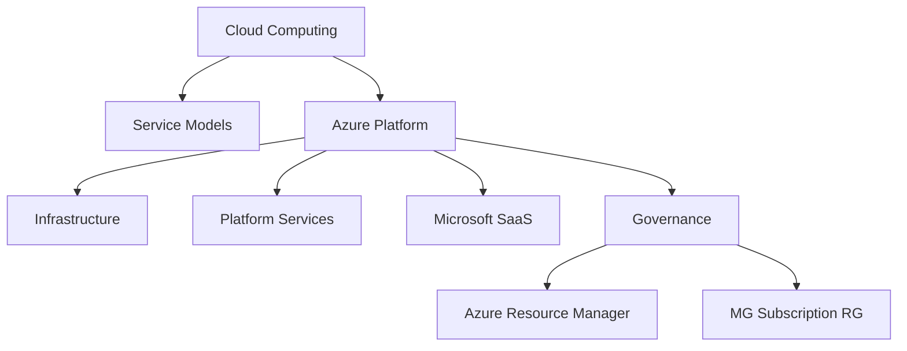
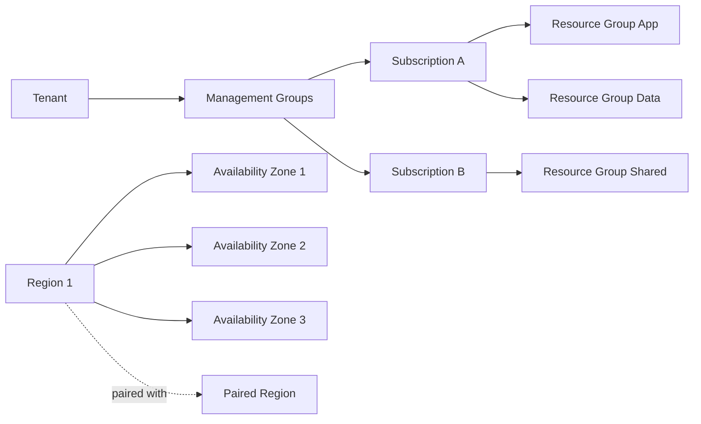

> **Screenshot Disclaimer:** Portal screenshots referenced in this guide are sourced from [Microsoft Learn](https://learn.microsoft.com/en-us/azure/) documentation. © Microsoft Corporation. All rights reserved. Used for educational reference only.

# 01 Azure Fundamentals Interview Q and A

This guide covers core cloud and Azure concepts that regularly appear in screening, administrator, associate, and architect interviews. The structure is optimized for quick review and spoken answers.

## How to use this guide

- Read the question first and try answering aloud.
- Compare your answer with the model answer.
- Memorize the key points, not the exact wording.
- Use the scenario and follow-up prompts to deepen your explanation.
- Validate features and limits in Microsoft Learn before interviews.

## Azure core concepts map



## Azure global infrastructure map



## Quick CLI warm-up

```bash
az account show --output table
az account management-group list --output table
az group list --output table
az provider list --query "[?registrationState=='Registered'].{Namespace:namespace}" --output table
```

Expected output:

- Active subscription, tenant, and environment.
- Management group names and ids if you have permissions.
- Resource groups in the active subscription.
- Registered resource providers like `Microsoft.Compute` and `Microsoft.Network`.

## Q and A

### Q1: What is cloud computing?

**Answer:**
Cloud computing is the on-demand delivery of compute, storage, networking, databases, and higher-level platform services over the internet with pay-as-you-go pricing and elastic scaling.

**Key Points:**
- Eliminates large upfront infrastructure purchases.
- Supports rapid provisioning and global reach.
- Converts many capital expenses into operational expenses.

**Example Scenario:**
"A startup launches a new app and needs to scale during a marketing event. Instead of buying servers, it uses Azure App Service and Azure SQL to scale up quickly."

**Follow-up Questions:**

**Q: What are the five characteristics of cloud computing?**
The five essential characteristics are on-demand self-service, broad network access, resource pooling, rapid elasticity, and measured service. In Azure, a team can provision Azure Virtual Machines or App Service on demand, access them over the network, scale them during peak load, and pay based on metered usage.

**Q: How does elasticity differ from scalability?**
Elasticity is the ability to automatically or quickly adjust capacity up and down as demand changes, while scalability is the broader ability to increase capacity by scaling up or out. For example, Azure Virtual Machine Scale Sets can elastically add instances during a traffic spike, while scaling Azure SQL Database to a higher tier is a scalability decision.

### Q2: What are the main cloud service models?

**Answer:**
The main cloud service models are IaaS, PaaS, and SaaS. IaaS gives you infrastructure building blocks, PaaS provides a managed application platform, and SaaS delivers a ready-to-use application.

**Key Points:**
- IaaS example: Azure Virtual Machines.
- PaaS example: Azure App Service.
- SaaS example: Microsoft 365.

**Example Scenario:**
"A team needing OS-level control may choose VMs, while a team focused only on application code may prefer App Service."

**Follow-up Questions:**

**Q: When would you choose IaaS over PaaS?**
I would choose IaaS when I need OS-level control, custom networking, special security agents, or support for a legacy application that does not fit a managed platform. A practical example is running a vendor application on Azure Virtual Machines because it requires specific Windows services and custom middleware.

**Q: What are tradeoffs of SaaS?**
SaaS reduces operational effort because the provider manages the application and platform, but it also limits deep customization and infrastructure control. For example, Microsoft 365 is quick to adopt, but the customer still has to manage identities, data governance, and integration requirements.

### Q3: What is the difference between public, private, and hybrid cloud?

**Answer:**
Public cloud uses provider-owned infrastructure shared across customers, private cloud is dedicated to one organization, and hybrid cloud combines on-premises and cloud services with identity, management, and network integration.

**Key Points:**
- Public cloud offers agility and global scale.
- Private cloud offers more direct control.
- Hybrid cloud is common during migrations or regulatory transitions.

**Example Scenario:**
"A bank keeps legacy systems on-premises but extends backup, analytics, and DR into Azure using hybrid connectivity."

**Follow-up Questions:**

**Q: How does Azure Arc support hybrid?**
Azure Arc extends Azure management to on-premises and multi-cloud servers and Kubernetes clusters so they appear in Azure for governance and operations. For example, an organization can use Azure Policy, Defender for Cloud, and Azure Monitor on AWS EC2 instances and on-premises servers through Arc.

**Q: When is private cloud still justified?**
Private cloud can still be justified when there are strict sovereignty, ultra-low-latency, legacy hardware, or isolation requirements that public cloud cannot meet cleanly. A common example is a manufacturing environment with specialized equipment and local control systems that must stay on-premises but still integrate with Azure for backup or monitoring.

### Q4: What is Azure?

**Answer:**
Microsoft Azure is Microsofts cloud platform that provides infrastructure, platform, data, AI, security, networking, and management services for building and operating workloads globally.

**Key Points:**
- Supports IaaS, PaaS, serverless, containers, and SaaS integration.
- Integrates closely with Microsoft Entra ID, Windows Server, SQL Server, and Microsoft 365.
- Offers strong enterprise governance, hybrid, and compliance capabilities.

**Example Scenario:**
"An enterprise uses Azure for web hosting, data analytics, backup, and disaster recovery while keeping identity integrated with Microsoft Entra ID."

**Follow-up Questions:**

**Q: What services are most commonly used in Azure?**
Commonly used Azure services include Azure Virtual Machines, Azure Storage, Virtual Network, Azure App Service, Azure SQL Database, Microsoft Entra ID, Azure Monitor, and Key Vault. A typical business application might use App Service for hosting, Azure SQL for data, Key Vault for secrets, and Azure Monitor for observability.

**Q: What differentiates Azure in hybrid scenarios?**
Azure is strong in hybrid because it integrates closely with Microsoft Entra ID, Azure Arc, ExpressRoute, and technologies like Azure Stack HCI. For example, a company can keep Windows Server workloads on-premises while using Arc and Entra ID to apply Azure-based governance and identity controls consistently.

### Q5: What are some key Azure service categories?

**Answer:**
Azure services are commonly grouped into compute, networking, storage, databases, identity, security, monitoring, analytics, and DevOps.

**Key Points:**
- Compute includes VMs, App Service, Functions, AKS.
- Networking includes VNet, Load Balancer, Application Gateway, Front Door.
- Security and identity include Entra ID, RBAC, Key Vault, Defender for Cloud.

**Example Scenario:**
"A production web app may use Front Door, App Service, Azure SQL, Key Vault, and Azure Monitor together."

**Follow-up Questions:**

**Q: Which services are PaaS vs IaaS?**
IaaS services include Azure Virtual Machines, Virtual Machine Scale Sets, and most core network components like VNets, while PaaS services include Azure App Service, Azure Functions, Azure SQL Database, and Cosmos DB. For example, a modern web app may use App Service and Azure SQL as PaaS, but a custom firewall appliance usually runs on IaaS VMs.

**Q: Which categories matter most for landing zones?**
The most important landing zone categories are identity, networking, governance, security, and management or monitoring. In practice, that means defining management groups and policy, building hub-and-spoke networking, standardizing RBAC, and sending logs to Azure Monitor or Log Analytics from day one.

### Q6: What is an Azure region?

**Answer:**
An Azure region is a geographical area containing one or more datacenters connected through a low-latency network. Regions are where Azure resources are deployed.

**Key Points:**
- Regions help meet latency, residency, and compliance requirements.
- Not all services are available in every region.
- Region choice affects cost, features, and DR planning.

**Example Scenario:**
"A company serving UK customers may deploy in UK South for lower latency and data residency alignment."

**Follow-up Questions:**

**Q: How do you select a region?**
I select a region based on latency, data residency, service availability, Availability Zone support, cost, and disaster recovery design. For example, a UK customer-facing app may use UK South to meet latency and residency expectations while validating that the needed VM sizes and platform services are available there.

**Q: What happens if a region does not support a required SKU?**
If a required SKU is unavailable, you either choose a nearby region, select an alternative supported SKU, or redesign around a different Azure service. For example, if a zonal VM family is not available in a region, you might switch to a supported VM family or deploy that workload in another approved region.

### Q7: What are Azure Availability Zones?

**Answer:**
Availability Zones are physically separate datacenters within an Azure region, each with independent power, cooling, and networking to improve fault isolation and resilience.

**Key Points:**
- Many supported regions provide three zones.
- Zonal resources are pinned to one zone.
- Zone-redundant services spread across zones automatically.

**Example Scenario:**
"A banking application needs 99.99% uptime. Deploy VMs across multiple zones behind a Standard Load Balancer and use zone-redundant managed disks where supported."

**Follow-up Questions:**

**Q: How do AZs differ from Availability Sets?**
Availability Zones are separate datacenters within a region, while Availability Sets are a logical way to spread VMs across fault and update domains within one datacenter environment. In practice, zones provide stronger failure isolation, so a production web tier is usually better deployed across zones behind a Standard Load Balancer when the region supports them.

**Q: Which services support zone redundancy?**
Zone redundancy is supported by a number of Azure services, including Azure SQL Database with zone-redundant high availability, Standard Load Balancer, zone-redundant storage options like ZRS, and services such as Application Gateway v2 in supported regions. A common example is deploying an app across zones with Azure SQL zone redundancy so a single datacenter failure does not take down the application.

### Q8: What is the difference between Availability Zones and Availability Sets?

**Answer:**
Availability Zones protect against datacenter-level failures within a region, while Availability Sets protect against host and rack-level failures within a single datacenter environment.

**Key Points:**
- Zones provide stronger isolation than Availability Sets.
- Availability Sets rely on fault domains and update domains.
- New high-availability designs usually prefer zones where available.

**Example Scenario:**
"If a region supports zones, use zones for production. Use Availability Sets only when zones are unavailable or unsupported for a workload."

**Follow-up Questions:**

**Q: How do update domains work?**
Update domains are groups of VMs in an Availability Set that Azure reboots in sequence during planned maintenance, rather than all at once. For example, if domain controllers are placed in the same Availability Set, Azure updates one update domain at a time so the service can stay online.

**Q: Can VMSS span zones?**
Yes, Virtual Machine Scale Sets can be deployed across multiple Availability Zones in supported regions, or pinned to a specific zone for zonal placement. A common design is a VMSS web tier spread across three zones behind a Standard Load Balancer to improve both scale and resiliency.

### Q9: What are region pairs in Azure?

**Answer:**
Region pairs are predefined Azure regional pairings within the same geography that help support disaster recovery priorities, platform updates, and data residency expectations.

**Key Points:**
- Some services use paired regions for geo-replication.
- Planned platform updates are typically staggered between paired regions.
- Region pairs help inform DR design, but you are not forced to use them for every workload.

**Example Scenario:**
"A workload in East US may use West US or a paired option for backup and recovery based on business requirements and service support."

**Follow-up Questions:**

**Q: Are region pairs always the best DR target?**
No, region pairs are useful guidance, but the best disaster recovery target depends on latency, compliance, service availability, and business recovery requirements. For example, a workload might choose two regions with Availability Zone support and lower user latency even if one of them is not the default paired choice.

**Q: How do region pairs relate to GRS storage?**
Geo-redundant storage options such as GRS and RA-GRS replicate data to a secondary region that Azure chooses as part of its paired-region design. A practical example is a storage account using RA-GRS so data remains available from the secondary region if the primary region has a major outage.

### Q10: How do you explain Azure global infrastructure in an interview?

**Answer:**
Azure global infrastructure is built from geographies, regions, availability zones, edge locations, and global networking. I explain it by starting from business needs: low latency, compliance, fault tolerance, and disaster recovery.

**Key Points:**
- Geography addresses residency and compliance boundaries.
- Region addresses deployment location.
- Availability Zones address intra-region high availability.

**Example Scenario:**
"For a global SaaS product, I would place front-end entry using Front Door, deploy apps in multiple regions, and replicate data based on service capabilities."

**Follow-up Questions:**

**Q: Which Azure services are global?**
Examples of global Azure services include Azure Front Door, Traffic Manager, Microsoft Entra ID, Azure DNS, and parts of Azure CDN. For instance, Front Door can route users to the closest healthy application endpoint worldwide instead of being tied to a single Azure region.

**Q: What is the role of Microsofts backbone network?**
Microsofts backbone network carries traffic between Azure regions and edge locations over Microsoft's private global infrastructure, which improves reliability and often reduces latency compared to relying only on the public internet. For example, Azure Front Door and ExpressRoute use that backbone to move traffic efficiently between users, edge points, and backend services.

### Q11: What is Azure Resource Manager?

**Answer:**
Azure Resource Manager, or ARM, is the management plane for Azure. It provides a consistent deployment and management layer for resources through the portal, CLI, PowerShell, REST APIs, ARM templates, and Bicep.

**Key Points:**
- Deploys resources declaratively and idempotently.
- Handles authentication, authorization, and policy enforcement.
- Organizes resources by scope and provider.

**Example Scenario:**
"A team deploys a full environment using Bicep templates through ARM so that networks, compute, and monitoring are created consistently."

**Follow-up Questions:**

**Q: What is the difference between control plane and data plane?**
The control plane manages Azure resources themselves, while the data plane accesses the contents or operations inside those resources. For example, ARM can create a storage account through the control plane, but reading blobs requires data plane permissions such as Storage Blob Data Reader.

**Q: How does ARM handle dependencies?**
ARM builds a dependency graph and creates resources in the right order by using explicit `dependsOn` statements and implicit references between resources. A practical example is creating a virtual network before deploying a NIC and VM that reference it.

### Q12: How does ARM deployment work?

**Answer:**
ARM evaluates a template or requested operation, checks permissions and policy, resolves dependencies, communicates with resource providers, and then creates or updates resources in the target scope.

**Key Points:**
- Templates are declarative, not imperative.
- Incremental deployments keep existing resources unless explicitly changed.
- Validation can occur before execution.

**Example Scenario:**
"During deployment, a storage account must exist before a private endpoint can connect, so ARM resolves the dependency graph automatically."

**Follow-up Questions:**

**Q: What is incremental vs complete mode?**
Incremental mode adds or updates the resources defined in the template and leaves other resources at that scope alone, while complete mode can remove resources not defined in the template. Most teams prefer incremental for day-to-day deployments, and reserve complete mode for tightly controlled rebuild scenarios such as a dedicated resource group.

**Q: Why is Bicep preferred over raw JSON ARM in many teams?**
Bicep is usually preferred because it is easier to read, supports modules and reusable code, and provides better authoring features than raw ARM JSON. For example, a team can build a reusable Bicep module for VNets or Key Vault and deploy it consistently across environments with less template complexity.

### Q13: What is a resource provider?

**Answer:**
A resource provider is a service namespace that exposes Azure resource types, such as `Microsoft.Compute` for VMs or `Microsoft.Network` for VNets.

**Key Points:**
- Providers must be registered in a subscription.
- Each provider owns specific resource APIs.
- Registration is usually automatic for common services but should be verified in automation.

**Example Scenario:**
"If `Microsoft.ContainerService` is not registered, AKS deployment requests may fail until the provider is enabled."

**Follow-up Questions:**

**Q: How do you check provider registration?**
You can check provider registration in the Azure portal under the subscription's Resource providers blade or with Azure CLI commands like `az provider show -n Microsoft.ContainerService`. In practice, automation pipelines often verify that namespaces such as `Microsoft.Compute` or `Microsoft.Network` are registered before deployment.

**Q: Why do some providers require explicit registration?**
Some providers require explicit registration so Azure can enable the namespace and features for that subscription before resources are created. A practical example is registering `Microsoft.ContainerService` before deploying AKS if the subscription has never used that provider.

### Q14: What is the Azure hierarchy of management groups, subscriptions, resource groups, and resources?

**Answer:**
Azure uses a layered hierarchy. Management groups sit at the top for governance, subscriptions provide billing and quota boundaries, resource groups organize related resources, and resources are the actual services you deploy.

**Key Points:**
- Governance inheritance flows downward.
- RBAC and Policy can be applied at multiple scopes.
- Resource groups are not security boundaries but are logical containers.

**Example Scenario:**
"An enterprise uses management groups for platform governance, separate subscriptions for production and nonproduction, and resource groups per application tier."

**Follow-up Questions:**

**Q: Where should budgets be applied?**
Budgets should be applied at the scope where financial accountability exists, most commonly the subscription, resource group, or management group. For example, a company might set a monthly budget on a production subscription and a separate budget on a project resource group to alert both platform and application owners.

**Q: What scope is best for shared policy?**
Shared policy is usually best assigned at the management group level so multiple subscriptions inherit the same governance controls consistently. A good example is applying an initiative at the Production management group to enforce allowed regions, required tags, and diagnostic settings across every production subscription.

### Q15: What is a management group?

**Answer:**
A management group is a governance scope above subscriptions that lets organizations apply policies, RBAC assignments, and structure across multiple subscriptions.

**Key Points:**
- Useful for enterprises with many subscriptions.
- Often maps to business units, environments, or platform layers.
- Common in landing zone designs.

**Example Scenario:**
"A company creates management groups for Platform, Production, NonProduction, and Sandbox to standardize policy inheritance."

**Follow-up Questions:**

**Q: How many levels of management groups are supported?**
Azure supports up to six levels of management groups beneath the root management group, not counting subscriptions or resource groups. That is usually enough to model structures like platform, production, nonproduction, and business-unit-specific branches without making the hierarchy overly complex.

**Q: What policies are commonly assigned at this level?**
Common management group policies include allowed locations, approved VM SKUs, required tags, restrictions on public IPs, and mandatory diagnostic settings. For example, a production management group may deny unsupported regions and require all resources to send logs to a central Log Analytics workspace.

### Q16: What is an Azure subscription?

**Answer:**
An Azure subscription is a billing, quota, and access boundary where Azure resources are deployed and consumed.

**Key Points:**
- Subscriptions isolate spend and service quotas.
- Many enterprises use separate subscriptions by environment or workload.
- Access can be scoped to the subscription or lower levels.

**Example Scenario:**
"A production subscription is separated from development so budgets, permissions, and policy can be controlled independently."

**Follow-up Questions:**

**Q: Can a subscription move between management groups?**
Yes, a subscription can be moved between management groups if you have the right permissions and understand the policy and RBAC impact of the move. For example, moving a sandbox subscription under a production management group could immediately apply stricter Azure Policy assignments and access controls.

**Q: What are common reasons to create multiple subscriptions?**
Organizations create multiple subscriptions to separate billing, quotas, environments, ownership, and governance boundaries. A common example is keeping production and development in separate subscriptions so cost controls, access, and service limits are easier to manage independently.

### Q17: What is a resource group?

**Answer:**
A resource group is a logical container for Azure resources that share a lifecycle, ownership model, or deployment boundary.

**Key Points:**
- Resources in a group can span services but generally stay in one subscription.
- Deleting a resource group deletes all resources inside it.
- Tags, RBAC, and locks are often applied at this level.

**Example Scenario:**
"A web application may have one resource group for compute and networking and another for shared monitoring resources."

**Follow-up Questions:**

**Q: Can resources in one group be in different regions?**
Yes, resources inside one resource group can be deployed to different regions even though the resource group itself has metadata stored in one location. In practice, though, teams usually keep related resources close together unless there is a clear reason, such as pairing a regional app with geo-redundant supporting services.

**Q: What are good resource group design practices?**
Good design practices are to group resources by shared lifecycle, ownership, environment, and deployment boundary rather than by resource type alone. For example, an application might use one resource group for its app tier and another shared resource group for centralized monitoring components like Log Analytics and Application Insights.

### Q18: How do tags help in Azure?

**Answer:**
Tags are name-value metadata pairs used to organize, report, automate, and govern Azure resources.

**Key Points:**
- Common tags include owner, costCenter, environment, and application.
- Tags improve cost allocation and automation targeting.
- Azure Policy can enforce required tags.

**Example Scenario:**
"Finance teams use tags to show monthly spend by business unit and environment."

**Follow-up Questions:**

**Q: Which resources do not inherit tags automatically?**
Most Azure resources do not automatically inherit tags from their resource group unless you enforce that behavior with Azure Policy or automation. For example, a VM's managed disks or a private endpoint may need separate tag remediation if the environment expects tags like `costCenter` or `owner` everywhere.

**Q: How do you remediate missing tags?**
The standard way to remediate missing tags is with Azure Policy using `modify` or `deployIfNotExists`, followed by a remediation task to update existing resources. A practical example is enforcing inheritance of the `environment` tag from the resource group to older storage accounts that were deployed before policy was assigned.

### Q19: What are resource locks?

**Answer:**
Resource locks prevent accidental changes. `CanNotDelete` blocks deletion, and `ReadOnly` blocks modifications and deletions.

**Key Points:**
- Useful for critical shared resources.
- Locks apply at subscription, resource group, or resource scope.
- RBAC does not override a lock for normal operations.

**Example Scenario:**
"A shared Log Analytics workspace receives a delete lock to prevent accidental removal."

**Follow-up Questions:**

**Q: What breaks if a ReadOnly lock is applied broadly?**
A broad ReadOnly lock can block many normal write operations, including scaling, configuration changes, secret rotation, and some monitoring updates. For example, if a ReadOnly lock is placed on a resource group, an App Service deployment or NSG rule update in that group may fail even though the resources are still running.

**Q: How do locks interact with automation?**
Locks apply to automation too, so a pipeline or runbook with Contributor access still cannot modify a locked resource unless the lock is removed or scoped differently. A practical example is an IaC deployment failing against a shared resource group because a delete or ReadOnly lock protects the central Log Analytics workspace.

### Q20: What is the shared responsibility model in Azure?

**Answer:**
The shared responsibility model means Microsoft secures the cloud infrastructure, while customers remain responsible for identities, data, configurations, applications, and many network and operating system decisions depending on the service model.

**Key Points:**
- Customer responsibility is highest in IaaS.
- Platform responsibility increases in PaaS and SaaS.
- Misconfiguration is still a customer risk in all models.

**Example Scenario:**
"Microsoft secures the physical datacenter, but a customer must still secure NSG rules, secrets, and database access settings."

**Follow-up Questions:**

**Q: How does the model change for SaaS?**
In SaaS, the provider manages much more of the stack, including the application platform and most underlying infrastructure, while the customer focuses on identities, data, access, and configuration. For example, with Microsoft 365, Microsoft operates the service, but the customer still must enforce MFA, retention, and least-privilege access through Microsoft Entra ID and related controls.

**Q: Where do patching responsibilities sit in App Service vs VMs?**
With Azure App Service, Microsoft patches the underlying platform and OS components, while the customer remains responsible for application code, frameworks, and configuration choices. With Azure Virtual Machines, the customer owns guest OS patching and often uses Azure Update Manager to schedule and track updates.

### Q21: What are Azure pricing models?

**Answer:**
Azure pricing includes pay-as-you-go, reserved capacity, spot pricing for some compute, savings options, and service-specific pricing dimensions such as transactions, storage, and data transfer.

**Key Points:**
- Pay-as-you-go offers flexibility.
- Reserved Instances reduce cost for predictable usage.
- Spot VMs are low cost but can be evicted.

**Example Scenario:**
"A steady-state production SQL workload may justify reserved compute, while a test rendering farm may use Spot VMs."

**Follow-up Questions:**

**Q: When is reserved capacity risky?**
Reserved capacity becomes risky when workload demand is uncertain or the architecture is likely to change before the reservation term ends. For example, if a team plans to migrate always-on VMs to AKS or App Service within a year, buying long-term VM reservations too early can leave unused committed spend.

**Q: Which workloads fit Spot VMs?**
Spot VMs fit interruptible, fault-tolerant workloads such as batch processing, rendering, CI runners, and scale-out test jobs. A practical example is using Azure Batch or an AKS spot node pool for queue-based processing where failed work can simply be retried.

### Q22: What are Reserved Instances and Savings Plans?

**Answer:**
Reserved Instances commit to one or three years for specific resource types, while Azure savings plans provide more flexible compute discounting across eligible services based on an hourly spend commitment.

**Key Points:**
- Best for predictable, long-running workloads.
- Lower cost than pure pay-as-you-go.
- Need utilization planning to avoid waste.

**Example Scenario:**
"A company running many production VMs 24x7 purchases reservations after rightsizing and usage analysis."

**Follow-up Questions:**

**Q: How do reservations differ from savings plans?**
Reservations usually target a specific resource type, region, and SKU family, while Azure savings plans apply a discounted rate across eligible compute usage based on an hourly spend commitment. For example, a stable fleet of one VM family may fit reservations best, while mixed usage across VMs, Functions Premium, and App Service can benefit from a savings plan.

**Q: Can reservations be exchanged or canceled?**
Scope changes are straightforward, but exchanges and cancellations depend on the reservation type and Microsoft's current commerce policy, with cancellation typically subject to refund limits. A practical example is adjusting reservation scope from one subscription to shared scope, while handling larger changes through the reservation management process in Azure.

### Q23: What are Spot VMs?

**Answer:**
Spot VMs provide unused Azure compute capacity at reduced prices, but Azure can evict them when capacity is needed back.

**Key Points:**
- Best for fault-tolerant, interruptible workloads.
- Not ideal for critical stateful production systems.
- Eviction policy and max price can be configured.

**Example Scenario:**
"Batch processing, CI runners, or test jobs can use Spot VMs to cut cost significantly."

**Follow-up Questions:**

**Q: What workloads should avoid Spot?**
Spot should be avoided for stateful, customer-facing, hard-deadline, or single-instance production workloads because eviction can happen with little notice. For example, a primary SQL Server VM or a line-of-business application that cannot tolerate interruption should stay on regular pay-as-you-go or reserved compute.

**Q: How do you architect around eviction?**
You architect around eviction by making jobs idempotent, using queues and checkpoints, and mixing Spot with regular capacity in services like AKS or Virtual Machine Scale Sets. A practical example is pulling work from Azure Queue Storage so a Spot VM can be evicted and another worker can safely retry the unfinished job.

### Q24: What is an Azure SLA?

**Answer:**
An Azure SLA, or Service Level Agreement, is a Microsoft commitment about availability or connectivity for a service under specific deployment conditions.

**Key Points:**
- SLA usually depends on architecture choices.
- Single-instance deployments may have no SLA or a lower SLA.
- Multi-zone or multi-instance design often improves SLA.

**Example Scenario:**
"Two VMs behind a Standard Load Balancer generally provide a higher SLA than a single VM."

**Follow-up Questions:**

**Q: Why does architecture affect SLA?**
Architecture affects SLA because Microsoft publishes availability commitments based on how a service is deployed, and redundancy usually increases that commitment. For example, one VM is a single point of failure, but two VMs spread across zones behind a Standard Load Balancer align to a stronger availability target.

**Q: How do you compare SLA and actual resilience?**
SLA is a contractual uptime commitment, while actual resilience includes failover design, dependency health, operational readiness, backups, and recovery testing. For example, an app can have a strong App Service SLA but still recover poorly if its database failover, secret rotation, or DNS cutover process has never been tested.

### Q25: How do you calculate composite SLA?

**Answer:**
Composite SLA is calculated by multiplying the decimal availability of each dependent component, then converting back to a percentage.

**Key Points:**
- Example: 99.95 percent x 99.99 percent = 99.94 percent approximate composite SLA.
- More dependencies can reduce overall composite SLA.
- Architectures should remove single points of failure.

**Example Scenario:**
"If App Service is 99.95 percent and Azure SQL is 99.99 percent, the combined theoretical SLA is about 99.94 percent if both must be available."

**Follow-up Questions:**

**Q: Does higher SLA always mean better DR?**
No, a higher SLA does not automatically mean better disaster recovery because SLA focuses on service availability, not full regional recovery or data protection. For example, a zone-redundant app in one region may have a high SLA but still have weak DR if it lacks cross-region replication and a tested failover plan.

**Q: What design changes improve composite SLA?**
Composite SLA improves when you remove serial dependencies, add redundancy, and use resilient managed services across zones or regions where needed. A practical example is placing Azure Front Door in front of two App Service deployments and pairing that with Azure SQL failover capabilities instead of relying on one regional stack.

### Q26: What are Azure support plans?

**Answer:**
Azure support plans provide different levels of technical support, response times, advisory services, and billing support depending on business need.

**Key Points:**
- Developer, Standard, ProDirect, and enterprise support variants may apply.
- Production-critical environments usually require stronger support coverage.
- Severity and response time matter for incident management.

**Example Scenario:**
"A regulated enterprise with global production workloads chooses an advanced support plan for faster response and advisory help."

**Follow-up Questions:**

**Q: What incidents justify a higher support tier?**
A higher support tier is justified for revenue-impacting outages, regulated production systems, complex hybrid networking issues, or mission-critical incidents where response time matters. For example, an enterprise running global e-commerce on Azure with ExpressRoute and multi-region services usually needs faster escalation than a small dev-only environment.

**Q: How do support plans affect operational readiness?**
Support plans improve operational readiness by providing faster response targets, clearer escalation paths, and access to architectural guidance for critical workloads. In practice, that means a team can resolve Azure platform issues faster and prepare better for incidents involving services like Azure SQL, networking, or identity.

### Q27: What is Azure Arc?

**Answer:**
Azure Arc extends Azure management and governance to on-premises, multi-cloud, and edge resources so they can be inventoried, governed, and managed using Azure tools.

**Key Points:**
- Supports servers, Kubernetes clusters, and some data services.
- Helps standardize governance outside native Azure.
- Useful for hybrid and multi-cloud operating models.

**Example Scenario:**
"An organization manages on-premises Windows and Linux servers with Azure Policy, tagging, and Defender through Azure Arc."

**Follow-up Questions:**

**Q: What are common Azure Arc use cases?**
Common Azure Arc use cases include governing on-premises and multi-cloud servers, managing Kubernetes clusters, applying Azure Policy, onboarding Defender for Cloud, and centralizing monitoring. For example, an operations team can connect branch-office Linux servers through Arc and manage policy, inventory, and updates from Azure.

**Q: Does Arc move workloads into Azure?**
No, Azure Arc does not move workloads into Azure by itself; it extends Azure management to resources that stay where they are. A practical example is keeping a SQL workload on-premises while using Arc to bring governance, inventory, and monitoring into the Azure control plane.

### Q28: What is Azure Policy?

**Answer:**
Azure Policy is a governance service that evaluates resources for compliance against defined rules and can deny, audit, append, deploy, or remediate configurations.

**Key Points:**
- Enforces standards at scale.
- Often used for tag requirements, allowed SKUs, location restrictions, and security baselines.
- Different from RBAC because it governs configuration, not who can act.

**Example Scenario:**
"A policy denies public IP creation in production subscriptions and audits unapproved VM sizes."

**Follow-up Questions:**

**Q: What is a policy initiative?**
A policy initiative is a grouped collection of Azure Policy definitions that are assigned together as one governance package. For example, a landing zone initiative might combine required tags, allowed regions, diagnostic settings, and restrictions on public IP creation.

**Q: How do remediation tasks work?**
Remediation tasks apply policy-driven fixes to existing noncompliant resources, usually with `modify` or `deployIfNotExists` effects and a managed identity. A practical example is assigning a tag policy and then running remediation so older storage accounts inherit the missing `environment` tag.

### Q29: What is the difference between the control plane and data plane?

**Answer:**
The control plane manages the resource itself, like creating a storage account or VM. The data plane interacts with the data inside the service, like uploading blobs or reading secrets.

**Key Points:**
- ARM operates on the control plane.
- Service-specific permissions often govern data plane access.
- Security design should address both planes.

**Example Scenario:**
"A user may have permission to manage a Key Vault resource but still lack permission to read secrets from the vault."

**Follow-up Questions:**

**Q: How is this visible in storage or Key Vault?**
In Azure Storage or Key Vault, someone can have permission to manage the resource without automatically having permission to read the data inside it. For example, a user may create a storage account through ARM but still need a data role like Storage Blob Data Reader, or manage a Key Vault resource but need Key Vault Secrets User to read secrets.

**Q: Why is this distinction important in RBAC design?**
This distinction is important because it lets you separate platform administration from data access and enforce least privilege more precisely. A common example is allowing a platform team to manage Key Vault networking and diagnostics while only the application's managed identity can retrieve the production secrets.

### Q30: What are Azure availability concepts interviewers expect you to know?

**Answer:**
Interviewers typically expect you to explain high availability within a region, disaster recovery across regions, fault domains, update domains, load balancing, backups, replication, and the difference between SLA, SLO, RPO, and RTO.

**Key Points:**
- HA keeps services running during local failures.
- DR restores service after larger failures.
- RPO and RTO guide backup and failover design.

**Example Scenario:**
"A payroll system may require near-zero RPO but can tolerate a 30-minute RTO, leading to geo-replication and documented failover procedures."

**Follow-up Questions:**

**Q: What is the difference between backup and replication?**
Backup creates recoverable restore points for earlier states, while replication keeps another copy of current data or workloads available for continuity and failover. For example, Azure Backup helps recover from accidental deletion or corruption, while geo-replication on a database helps keep a secondary copy ready in another region.

**Q: How do RPO and RTO influence cost?**
Lower RPO and RTO targets usually increase cost because they require more frequent replication, faster failover, and more standby capacity. For example, near-real-time replication with Azure Site Recovery or active geo-replication for Azure SQL costs more than relying only on nightly backups and manual restore steps.

### Q31: What is Azure Advisor?

**Answer:**
Azure Advisor is a recommendation service that analyzes deployed resources and suggests improvements for reliability, security, performance, operational excellence, and cost.

**Key Points:**
- Useful for interview examples on optimization.
- Can recommend rightsizing, high availability, and security improvements.
- Does not replace architecture review.

**Example Scenario:**
"Advisor flags underutilized VMs and suggests smaller SKUs to reduce monthly spend."

**Follow-up Questions:**

**Q: How does Advisor differ from Defender for Cloud?**
Azure Advisor focuses on optimization recommendations across reliability, performance, cost, operations, and security, while Defender for Cloud is centered on security posture management and threat protection. For example, Advisor might recommend rightsizing an underused VM, while Defender for Cloud flags exposed management ports or missing endpoint protection.

**Q: Can Advisor recommendations be automated?**
Yes, Advisor recommendations can be integrated with automation through APIs, Azure Monitor, Logic Apps, or runbooks to trigger workflows. A practical example is creating an alert or ticket when Advisor identifies underutilized VMs so the operations team can review and downsize them.

### Q32: What is Azure Service Health?

**Answer:**
Azure Service Health provides personalized information about Azure incidents, planned maintenance, and health advisories that may affect your subscriptions and regions.

**Key Points:**
- Different from generic public status pages.
- Helps incident communication and impact assessment.
- Can trigger alerts and action groups.

**Example Scenario:**
"During a regional issue, operations teams use Service Health to confirm platform impact before escalating application-level incident actions."

**Follow-up Questions:**

**Q: How is Service Health different from Resource Health?**
Service Health shows subscription- and region-scoped Azure platform incidents, planned maintenance, and advisories, while Resource Health reports the status of a specific resource. For example, Service Health may report an Azure SQL issue in a region, while Resource Health helps determine whether one particular VM or App Service instance is affected.

**Q: Can Service Health integrate with alerts?**
Yes, Service Health can integrate with Azure Monitor action groups to send email, SMS, webhook, ITSM, or collaboration notifications. A common example is routing planned maintenance alerts for a production region into Teams or ServiceNow so operations can respond early.

### Q33: What is Azure Resource Health?

**Answer:**
Azure Resource Health shows whether a specific Azure resource, like a VM or App Service, is available and whether issues are caused by the Azure platform or customer configuration.

**Key Points:**
- Helps narrow root cause faster.
- Useful when a single resource fails but the platform is healthy overall.
- Appears in the portal and through APIs for some services.

**Example Scenario:**
"A VM becomes unavailable. Resource Health indicates host-level platform maintenance rather than a guest OS issue."

**Follow-up Questions:**

**Q: How would you combine this with Activity Log?**
I would use Resource Health to see whether Azure reports a platform issue, then correlate that timing with Azure Activity Log events such as deployments, stop-start actions, or configuration changes. For example, if a VM becomes unhealthy right after an NSG or disk change in Activity Log, the issue is more likely customer-induced than a platform outage.

**Q: Which incidents still require guest OS troubleshooting?**
Incidents like application crashes, full disks, failed services, bad OS patches, or broken agents still require guest OS troubleshooting even if the Azure platform is healthy. In practice, teams use RDP or SSH, Serial Console, boot diagnostics, and VM insights to diagnose those problems inside the VM.

### Q34: Why is governance important in Azure from day one?

**Answer:**
Governance is important because cloud environments scale quickly. Without naming standards, tags, policies, RBAC boundaries, and subscription strategy, cost, security, and operations become difficult to control.

**Key Points:**
- Governance reduces rework later.
- It supports compliance and cost management.
- Landing zones operationalize governance.

**Example Scenario:**
"A company that onboarded teams without policy later had to remediate public IPs, missing tags, and inconsistent logging across dozens of subscriptions."

**Follow-up Questions:**

**Q: What are the first governance controls you would implement?**
I would start with management group structure, RBAC, naming and tagging standards, allowed regions and SKUs, diagnostic logging, and budgets. For example, an early Azure Policy set can require tags, block public IPs in production, and send platform logs to a central Log Analytics workspace.

**Q: How do management groups support governance?**
Management groups support governance by providing a higher scope where Azure Policy and RBAC can be assigned once and inherited by many subscriptions. A practical example is applying production security baselines at a Production management group so every new subscription automatically receives the same controls.

### Q35: What is Azure Marketplace?

**Answer:**
Azure Marketplace is a catalog of Microsoft and third-party solutions, images, and services that can be deployed into Azure subscriptions.

**Key Points:**
- Includes VM images, SaaS offers, and partner solutions.
- Procurement and governance should review licensing and support boundaries.
- Many enterprises restrict Marketplace usage with policy.

**Example Scenario:**
"A security team approves a third-party firewall image from Marketplace for a hub network, but only after licensing and architecture review."

**Follow-up Questions:**

**Q: What governance risks come with Marketplace usage?**
Marketplace usage can introduce licensing surprises, unsupported architectures, insecure images, uncontrolled spend, and unclear support boundaries. For example, a team might deploy an unapproved third-party appliance image that opens unnecessary ports and creates recurring charges outside normal platform standards.

**Q: How do you restrict unapproved offers?**
You can restrict unapproved offers with Azure Policy, RBAC, and Private Marketplace controls so only reviewed images and services are available for deployment. A practical example is allowing only approved publishers and image SKUs while blocking direct deployment of unvetted Marketplace offers.

### Q36: How would you summarize Azure for a nontechnical interviewer?

**Answer:**
Azure is Microsofts cloud platform that lets organizations run applications, store data, secure identities, automate deployments, and recover from failures without owning all the physical infrastructure themselves.

**Key Points:**
- It helps teams move faster.
- It supports global scale.
- It includes strong enterprise integration.

**Example Scenario:**
"A retailer can run e-commerce applications globally, analyze sales data, and protect user identities using managed Azure services."

**Follow-up Questions:**

**Q: What business benefits come from Azure adoption?**
Azure adoption can improve delivery speed, scalability, resilience, and access to managed services without large upfront infrastructure spending. For example, a company can launch an application in multiple regions, use Azure DevOps or GitHub Actions for deployment, and scale demand quickly with App Service or AKS.

**Q: What risks should still be managed by the customer?**
Customers still have to manage identity security, data protection, cost control, compliance, application vulnerabilities, and disaster recovery design. A practical example is using Microsoft Entra ID, Key Vault, Azure Policy, and budgets correctly, because Azure does not automatically fix overprivileged access or poor application architecture.

## Revision cheat sheet

| Topic | One-line memory aid |
|---|---|
| Region | Deployment location |
| Availability Zone | Separate datacenter in one region |
| Region Pair | Paired geography choice for resilience |
| Management Group | Governance above subscriptions |
| Subscription | Billing and quota boundary |
| Resource Group | Lifecycle container |
| ARM | Control plane management layer |
| Policy | Configuration guardrail |
| RBAC | Access control |
| Azure Arc | Hybrid and multi-cloud management |

## Portal navigation references

- `Azure Portal` → `Subscriptions` → `Resource providers`
- `Azure Portal` → `Management groups`
- `Azure Portal` → `Resource groups`
- `Azure Portal` → `Advisor`
- `Azure Portal` → `Service Health`
- `Azure Portal` → `Resource Health`

## Official Microsoft References

- [Azure fundamentals](https://learn.microsoft.com/training/paths/microsoft-azure-fundamentals-describe-cloud-concepts/)
- [Azure regions and availability zones](https://learn.microsoft.com/azure/reliability/regions-list)
- [What is Azure Resource Manager](https://learn.microsoft.com/azure/azure-resource-manager/management/overview)
- [Management groups](https://learn.microsoft.com/azure/governance/management-groups/overview)
- [Azure pricing](https://azure.microsoft.com/pricing/)
- [Service Level Agreements](https://azure.microsoft.com/support/legal/sla/)
- [Azure support plans](https://azure.microsoft.com/support/plans/)
- [Azure Arc overview](https://learn.microsoft.com/azure/azure-arc/overview)
