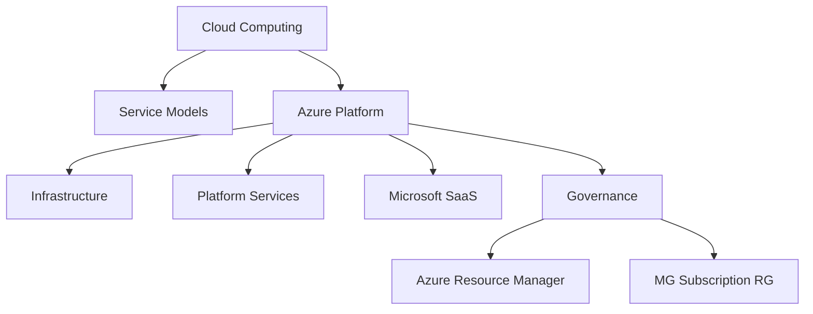
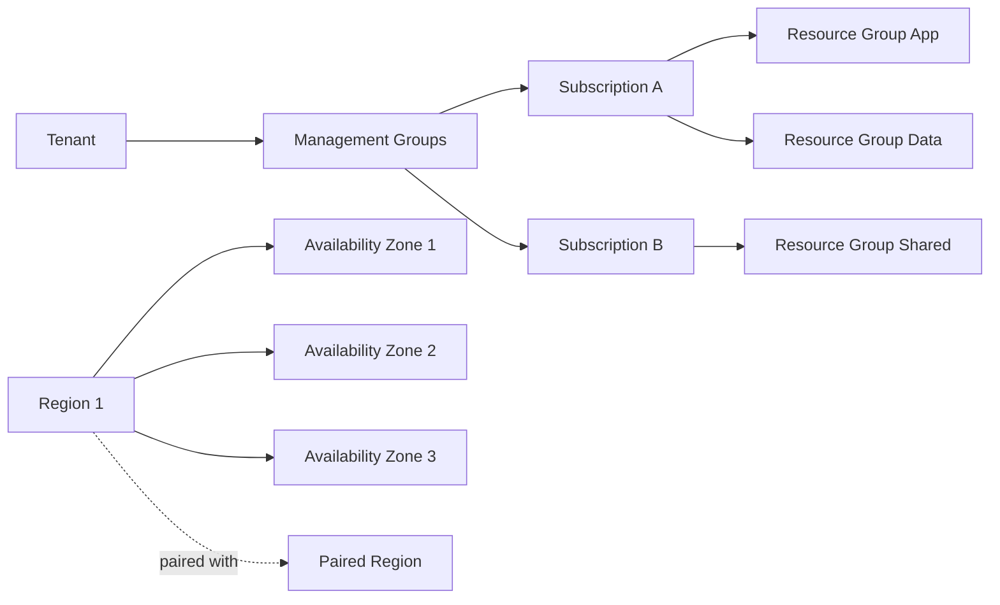

> **Screenshot Disclaimer:** Portal screenshots referenced in this guide are sourced from [Microsoft Learn](https://learn.microsoft.com/en-us/azure/) documentation. © Microsoft Corporation. All rights reserved. Used for educational reference only.

# 01 Azure Fundamentals Interview Q and A

This guide covers core cloud and Azure concepts that regularly appear in screening, administrator, associate, and architect interviews. The structure is optimized for quick review and spoken answers.

## How to use this guide

- Read the question first and try answering aloud.
- Compare your answer with the model answer.
- Memorize the key points, not the exact wording.
- Use the scenario and follow-up prompts to deepen your explanation.
- Validate features and limits in Microsoft Learn before interviews.

## Azure core concepts map



## Azure global infrastructure map



## Quick CLI warm-up

```bash
az account show --output table
az account management-group list --output table
az group list --output table
az provider list --query "[?registrationState=='Registered'].{Namespace:namespace}" --output table
```

Expected output:

- Active subscription, tenant, and environment.
- Management group names and ids if you have permissions.
- Resource groups in the active subscription.
- Registered resource providers like `Microsoft.Compute` and `Microsoft.Network`.

## Q and A

### Q: What is cloud computing?

**Answer:**
Cloud computing is the on-demand delivery of compute, storage, networking, databases, and higher-level platform services over the internet with pay-as-you-go pricing and elastic scaling.

**Key Points:**
- Eliminates large upfront infrastructure purchases.
- Supports rapid provisioning and global reach.
- Converts many capital expenses into operational expenses.

**Example Scenario:**
"A startup launches a new app and needs to scale during a marketing event. Instead of buying servers, it uses Azure App Service and Azure SQL to scale up quickly."

**Follow-up Questions:**
- What are the five characteristics of cloud computing?
- How does elasticity differ from scalability?

### Q: What are the main cloud service models?

**Answer:**
The main cloud service models are IaaS, PaaS, and SaaS. IaaS gives you infrastructure building blocks, PaaS provides a managed application platform, and SaaS delivers a ready-to-use application.

**Key Points:**
- IaaS example: Azure Virtual Machines.
- PaaS example: Azure App Service.
- SaaS example: Microsoft 365.

**Example Scenario:**
"A team needing OS-level control may choose VMs, while a team focused only on application code may prefer App Service."

**Follow-up Questions:**
- When would you choose IaaS over PaaS?
- What are tradeoffs of SaaS?

### Q: What is the difference between public, private, and hybrid cloud?

**Answer:**
Public cloud uses provider-owned infrastructure shared across customers, private cloud is dedicated to one organization, and hybrid cloud combines on-premises and cloud services with identity, management, and network integration.

**Key Points:**
- Public cloud offers agility and global scale.
- Private cloud offers more direct control.
- Hybrid cloud is common during migrations or regulatory transitions.

**Example Scenario:**
"A bank keeps legacy systems on-premises but extends backup, analytics, and DR into Azure using hybrid connectivity."

**Follow-up Questions:**
- How does Azure Arc support hybrid?
- When is private cloud still justified?

### Q: What is Azure?

**Answer:**
Microsoft Azure is Microsofts cloud platform that provides infrastructure, platform, data, AI, security, networking, and management services for building and operating workloads globally.

**Key Points:**
- Supports IaaS, PaaS, serverless, containers, and SaaS integration.
- Integrates closely with Microsoft Entra ID, Windows Server, SQL Server, and Microsoft 365.
- Offers strong enterprise governance, hybrid, and compliance capabilities.

**Example Scenario:**
"An enterprise uses Azure for web hosting, data analytics, backup, and disaster recovery while keeping identity integrated with Microsoft Entra ID."

**Follow-up Questions:**
- What services are most commonly used in Azure?
- What differentiates Azure in hybrid scenarios?

### Q: What are some key Azure service categories?

**Answer:**
Azure services are commonly grouped into compute, networking, storage, databases, identity, security, monitoring, analytics, and DevOps.

**Key Points:**
- Compute includes VMs, App Service, Functions, AKS.
- Networking includes VNet, Load Balancer, Application Gateway, Front Door.
- Security and identity include Entra ID, RBAC, Key Vault, Defender for Cloud.

**Example Scenario:**
"A production web app may use Front Door, App Service, Azure SQL, Key Vault, and Azure Monitor together."

**Follow-up Questions:**
- Which services are PaaS vs IaaS?
- Which categories matter most for landing zones?

### Q: What is an Azure region?

**Answer:**
An Azure region is a geographical area containing one or more datacenters connected through a low-latency network. Regions are where Azure resources are deployed.

**Key Points:**
- Regions help meet latency, residency, and compliance requirements.
- Not all services are available in every region.
- Region choice affects cost, features, and DR planning.

**Example Scenario:**
"A company serving UK customers may deploy in UK South for lower latency and data residency alignment."

**Follow-up Questions:**
- How do you select a region?
- What happens if a region does not support a required SKU?

### Q: What are Azure Availability Zones?

**Answer:**
Availability Zones are physically separate datacenters within an Azure region, each with independent power, cooling, and networking to improve fault isolation and resilience.

**Key Points:**
- Many supported regions provide three zones.
- Zonal resources are pinned to one zone.
- Zone-redundant services spread across zones automatically.

**Example Scenario:**
"A banking application needs 99.99% uptime. Deploy VMs across multiple zones behind a Standard Load Balancer and use zone-redundant managed disks where supported."

**Follow-up Questions:**
- How do AZs differ from Availability Sets?
- Which services support zone redundancy?

### Q: What is the difference between Availability Zones and Availability Sets?

**Answer:**
Availability Zones protect against datacenter-level failures within a region, while Availability Sets protect against host and rack-level failures within a single datacenter environment.

**Key Points:**
- Zones provide stronger isolation than Availability Sets.
- Availability Sets rely on fault domains and update domains.
- New high-availability designs usually prefer zones where available.

**Example Scenario:**
"If a region supports zones, use zones for production. Use Availability Sets only when zones are unavailable or unsupported for a workload."

**Follow-up Questions:**
- How do update domains work?
- Can VMSS span zones?

### Q: What are region pairs in Azure?

**Answer:**
Region pairs are predefined Azure regional pairings within the same geography that help support disaster recovery priorities, platform updates, and data residency expectations.

**Key Points:**
- Some services use paired regions for geo-replication.
- Planned platform updates are typically staggered between paired regions.
- Region pairs help inform DR design, but you are not forced to use them for every workload.

**Example Scenario:**
"A workload in East US may use West US or a paired option for backup and recovery based on business requirements and service support."

**Follow-up Questions:**
- Are region pairs always the best DR target?
- How do region pairs relate to GRS storage?

### Q: How do you explain Azure global infrastructure in an interview?

**Answer:**
Azure global infrastructure is built from geographies, regions, availability zones, edge locations, and global networking. I explain it by starting from business needs: low latency, compliance, fault tolerance, and disaster recovery.

**Key Points:**
- Geography addresses residency and compliance boundaries.
- Region addresses deployment location.
- Availability Zones address intra-region high availability.

**Example Scenario:**
"For a global SaaS product, I would place front-end entry using Front Door, deploy apps in multiple regions, and replicate data based on service capabilities."

**Follow-up Questions:**
- Which Azure services are global?
- What is the role of Microsofts backbone network?

### Q: What is Azure Resource Manager?

**Answer:**
Azure Resource Manager, or ARM, is the management plane for Azure. It provides a consistent deployment and management layer for resources through the portal, CLI, PowerShell, REST APIs, ARM templates, and Bicep.

**Key Points:**
- Deploys resources declaratively and idempotently.
- Handles authentication, authorization, and policy enforcement.
- Organizes resources by scope and provider.

**Example Scenario:**
"A team deploys a full environment using Bicep templates through ARM so that networks, compute, and monitoring are created consistently."

**Follow-up Questions:**
- What is the difference between control plane and data plane?
- How does ARM handle dependencies?

### Q: How does ARM deployment work?

**Answer:**
ARM evaluates a template or requested operation, checks permissions and policy, resolves dependencies, communicates with resource providers, and then creates or updates resources in the target scope.

**Key Points:**
- Templates are declarative, not imperative.
- Incremental deployments keep existing resources unless explicitly changed.
- Validation can occur before execution.

**Example Scenario:**
"During deployment, a storage account must exist before a private endpoint can connect, so ARM resolves the dependency graph automatically."

**Follow-up Questions:**
- What is incremental vs complete mode?
- Why is Bicep preferred over raw JSON ARM in many teams?

### Q: What is a resource provider?

**Answer:**
A resource provider is a service namespace that exposes Azure resource types, such as `Microsoft.Compute` for VMs or `Microsoft.Network` for VNets.

**Key Points:**
- Providers must be registered in a subscription.
- Each provider owns specific resource APIs.
- Registration is usually automatic for common services but should be verified in automation.

**Example Scenario:**
"If `Microsoft.ContainerService` is not registered, AKS deployment requests may fail until the provider is enabled."

**Follow-up Questions:**
- How do you check provider registration?
- Why do some providers require explicit registration?

### Q: What is the Azure hierarchy of management groups, subscriptions, resource groups, and resources?

**Answer:**
Azure uses a layered hierarchy. Management groups sit at the top for governance, subscriptions provide billing and quota boundaries, resource groups organize related resources, and resources are the actual services you deploy.

**Key Points:**
- Governance inheritance flows downward.
- RBAC and Policy can be applied at multiple scopes.
- Resource groups are not security boundaries but are logical containers.

**Example Scenario:**
"An enterprise uses management groups for platform governance, separate subscriptions for production and nonproduction, and resource groups per application tier."

**Follow-up Questions:**
- Where should budgets be applied?
- What scope is best for shared policy?

### Q: What is a management group?

**Answer:**
A management group is a governance scope above subscriptions that lets organizations apply policies, RBAC assignments, and structure across multiple subscriptions.

**Key Points:**
- Useful for enterprises with many subscriptions.
- Often maps to business units, environments, or platform layers.
- Common in landing zone designs.

**Example Scenario:**
"A company creates management groups for Platform, Production, NonProduction, and Sandbox to standardize policy inheritance."

**Follow-up Questions:**
- How many levels of management groups are supported?
- What policies are commonly assigned at this level?

### Q: What is an Azure subscription?

**Answer:**
An Azure subscription is a billing, quota, and access boundary where Azure resources are deployed and consumed.

**Key Points:**
- Subscriptions isolate spend and service quotas.
- Many enterprises use separate subscriptions by environment or workload.
- Access can be scoped to the subscription or lower levels.

**Example Scenario:**
"A production subscription is separated from development so budgets, permissions, and policy can be controlled independently."

**Follow-up Questions:**
- Can a subscription move between management groups?
- What are common reasons to create multiple subscriptions?

### Q: What is a resource group?

**Answer:**
A resource group is a logical container for Azure resources that share a lifecycle, ownership model, or deployment boundary.

**Key Points:**
- Resources in a group can span services but generally stay in one subscription.
- Deleting a resource group deletes all resources inside it.
- Tags, RBAC, and locks are often applied at this level.

**Example Scenario:**
"A web application may have one resource group for compute and networking and another for shared monitoring resources."

**Follow-up Questions:**
- Can resources in one group be in different regions?
- What are good resource group design practices?

### Q: How do tags help in Azure?

**Answer:**
Tags are name-value metadata pairs used to organize, report, automate, and govern Azure resources.

**Key Points:**
- Common tags include owner, costCenter, environment, and application.
- Tags improve cost allocation and automation targeting.
- Azure Policy can enforce required tags.

**Example Scenario:**
"Finance teams use tags to show monthly spend by business unit and environment."

**Follow-up Questions:**
- Which resources do not inherit tags automatically?
- How do you remediate missing tags?

### Q: What are resource locks?

**Answer:**
Resource locks prevent accidental changes. `CanNotDelete` blocks deletion, and `ReadOnly` blocks modifications and deletions.

**Key Points:**
- Useful for critical shared resources.
- Locks apply at subscription, resource group, or resource scope.
- RBAC does not override a lock for normal operations.

**Example Scenario:**
"A shared Log Analytics workspace receives a delete lock to prevent accidental removal."

**Follow-up Questions:**
- What breaks if a ReadOnly lock is applied broadly?
- How do locks interact with automation?

### Q: What is the shared responsibility model in Azure?

**Answer:**
The shared responsibility model means Microsoft secures the cloud infrastructure, while customers remain responsible for identities, data, configurations, applications, and many network and operating system decisions depending on the service model.

**Key Points:**
- Customer responsibility is highest in IaaS.
- Platform responsibility increases in PaaS and SaaS.
- Misconfiguration is still a customer risk in all models.

**Example Scenario:**
"Microsoft secures the physical datacenter, but a customer must still secure NSG rules, secrets, and database access settings."

**Follow-up Questions:**
- How does the model change for SaaS?
- Where do patching responsibilities sit in App Service vs VMs?

### Q: What are Azure pricing models?

**Answer:**
Azure pricing includes pay-as-you-go, reserved capacity, spot pricing for some compute, savings options, and service-specific pricing dimensions such as transactions, storage, and data transfer.

**Key Points:**
- Pay-as-you-go offers flexibility.
- Reserved Instances reduce cost for predictable usage.
- Spot VMs are low cost but can be evicted.

**Example Scenario:**
"A steady-state production SQL workload may justify reserved compute, while a test rendering farm may use Spot VMs."

**Follow-up Questions:**
- When is reserved capacity risky?
- Which workloads fit Spot VMs?

### Q: What are Reserved Instances and Savings Plans?

**Answer:**
Reserved Instances commit to one or three years for specific resource types, while Azure savings plans provide more flexible compute discounting across eligible services based on an hourly spend commitment.

**Key Points:**
- Best for predictable, long-running workloads.
- Lower cost than pure pay-as-you-go.
- Need utilization planning to avoid waste.

**Example Scenario:**
"A company running many production VMs 24x7 purchases reservations after rightsizing and usage analysis."

**Follow-up Questions:**
- How do reservations differ from savings plans?
- Can reservations be exchanged or canceled?

### Q: What are Spot VMs?

**Answer:**
Spot VMs provide unused Azure compute capacity at reduced prices, but Azure can evict them when capacity is needed back.

**Key Points:**
- Best for fault-tolerant, interruptible workloads.
- Not ideal for critical stateful production systems.
- Eviction policy and max price can be configured.

**Example Scenario:**
"Batch processing, CI runners, or test jobs can use Spot VMs to cut cost significantly."

**Follow-up Questions:**
- What workloads should avoid Spot?
- How do you architect around eviction?

### Q: What is an Azure SLA?

**Answer:**
An Azure SLA, or Service Level Agreement, is a Microsoft commitment about availability or connectivity for a service under specific deployment conditions.

**Key Points:**
- SLA usually depends on architecture choices.
- Single-instance deployments may have no SLA or a lower SLA.
- Multi-zone or multi-instance design often improves SLA.

**Example Scenario:**
"Two VMs behind a Standard Load Balancer generally provide a higher SLA than a single VM."

**Follow-up Questions:**
- Why does architecture affect SLA?
- How do you compare SLA and actual resilience?

### Q: How do you calculate composite SLA?

**Answer:**
Composite SLA is calculated by multiplying the decimal availability of each dependent component, then converting back to a percentage.

**Key Points:**
- Example: 99.95 percent x 99.99 percent = 99.94 percent approximate composite SLA.
- More dependencies can reduce overall composite SLA.
- Architectures should remove single points of failure.

**Example Scenario:**
"If App Service is 99.95 percent and Azure SQL is 99.99 percent, the combined theoretical SLA is about 99.94 percent if both must be available."

**Follow-up Questions:**
- Does higher SLA always mean better DR?
- What design changes improve composite SLA?

### Q: What are Azure support plans?

**Answer:**
Azure support plans provide different levels of technical support, response times, advisory services, and billing support depending on business need.

**Key Points:**
- Developer, Standard, ProDirect, and enterprise support variants may apply.
- Production-critical environments usually require stronger support coverage.
- Severity and response time matter for incident management.

**Example Scenario:**
"A regulated enterprise with global production workloads chooses an advanced support plan for faster response and advisory help."

**Follow-up Questions:**
- What incidents justify a higher support tier?
- How do support plans affect operational readiness?

### Q: What is Azure Arc?

**Answer:**
Azure Arc extends Azure management and governance to on-premises, multi-cloud, and edge resources so they can be inventoried, governed, and managed using Azure tools.

**Key Points:**
- Supports servers, Kubernetes clusters, and some data services.
- Helps standardize governance outside native Azure.
- Useful for hybrid and multi-cloud operating models.

**Example Scenario:**
"An organization manages on-premises Windows and Linux servers with Azure Policy, tagging, and Defender through Azure Arc."

**Follow-up Questions:**
- What are common Azure Arc use cases?
- Does Arc move workloads into Azure?

### Q: What is Azure Policy?

**Answer:**
Azure Policy is a governance service that evaluates resources for compliance against defined rules and can deny, audit, append, deploy, or remediate configurations.

**Key Points:**
- Enforces standards at scale.
- Often used for tag requirements, allowed SKUs, location restrictions, and security baselines.
- Different from RBAC because it governs configuration, not who can act.

**Example Scenario:**
"A policy denies public IP creation in production subscriptions and audits unapproved VM sizes."

**Follow-up Questions:**
- What is a policy initiative?
- How do remediation tasks work?

### Q: What is the difference between the control plane and data plane?

**Answer:**
The control plane manages the resource itself, like creating a storage account or VM. The data plane interacts with the data inside the service, like uploading blobs or reading secrets.

**Key Points:**
- ARM operates on the control plane.
- Service-specific permissions often govern data plane access.
- Security design should address both planes.

**Example Scenario:**
"A user may have permission to manage a Key Vault resource but still lack permission to read secrets from the vault."

**Follow-up Questions:**
- How is this visible in storage or Key Vault?
- Why is this distinction important in RBAC design?

### Q: What are Azure availability concepts interviewers expect you to know?

**Answer:**
Interviewers typically expect you to explain high availability within a region, disaster recovery across regions, fault domains, update domains, load balancing, backups, replication, and the difference between SLA, SLO, RPO, and RTO.

**Key Points:**
- HA keeps services running during local failures.
- DR restores service after larger failures.
- RPO and RTO guide backup and failover design.

**Example Scenario:**
"A payroll system may require near-zero RPO but can tolerate a 30-minute RTO, leading to geo-replication and documented failover procedures."

**Follow-up Questions:**
- What is the difference between backup and replication?
- How do RPO and RTO influence cost?

### Q: What is Azure Advisor?

**Answer:**
Azure Advisor is a recommendation service that analyzes deployed resources and suggests improvements for reliability, security, performance, operational excellence, and cost.

**Key Points:**
- Useful for interview examples on optimization.
- Can recommend rightsizing, high availability, and security improvements.
- Does not replace architecture review.

**Example Scenario:**
"Advisor flags underutilized VMs and suggests smaller SKUs to reduce monthly spend."

**Follow-up Questions:**
- How does Advisor differ from Defender for Cloud?
- Can Advisor recommendations be automated?

### Q: What is Azure Service Health?

**Answer:**
Azure Service Health provides personalized information about Azure incidents, planned maintenance, and health advisories that may affect your subscriptions and regions.

**Key Points:**
- Different from generic public status pages.
- Helps incident communication and impact assessment.
- Can trigger alerts and action groups.

**Example Scenario:**
"During a regional issue, operations teams use Service Health to confirm platform impact before escalating application-level incident actions."

**Follow-up Questions:**
- How is Service Health different from Resource Health?
- Can Service Health integrate with alerts?

### Q: What is Azure Resource Health?

**Answer:**
Azure Resource Health shows whether a specific Azure resource, like a VM or App Service, is available and whether issues are caused by the Azure platform or customer configuration.

**Key Points:**
- Helps narrow root cause faster.
- Useful when a single resource fails but the platform is healthy overall.
- Appears in the portal and through APIs for some services.

**Example Scenario:**
"A VM becomes unavailable. Resource Health indicates host-level platform maintenance rather than a guest OS issue."

**Follow-up Questions:**
- How would you combine this with Activity Log?
- Which incidents still require guest OS troubleshooting?

### Q: Why is governance important in Azure from day one?

**Answer:**
Governance is important because cloud environments scale quickly. Without naming standards, tags, policies, RBAC boundaries, and subscription strategy, cost, security, and operations become difficult to control.

**Key Points:**
- Governance reduces rework later.
- It supports compliance and cost management.
- Landing zones operationalize governance.

**Example Scenario:**
"A company that onboarded teams without policy later had to remediate public IPs, missing tags, and inconsistent logging across dozens of subscriptions."

**Follow-up Questions:**
- What are the first governance controls you would implement?
- How do management groups support governance?

### Q: What is Azure Marketplace?

**Answer:**
Azure Marketplace is a catalog of Microsoft and third-party solutions, images, and services that can be deployed into Azure subscriptions.

**Key Points:**
- Includes VM images, SaaS offers, and partner solutions.
- Procurement and governance should review licensing and support boundaries.
- Many enterprises restrict Marketplace usage with policy.

**Example Scenario:**
"A security team approves a third-party firewall image from Marketplace for a hub network, but only after licensing and architecture review."

**Follow-up Questions:**
- What governance risks come with Marketplace usage?
- How do you restrict unapproved offers?

### Q: How would you summarize Azure for a nontechnical interviewer?

**Answer:**
Azure is Microsofts cloud platform that lets organizations run applications, store data, secure identities, automate deployments, and recover from failures without owning all the physical infrastructure themselves.

**Key Points:**
- It helps teams move faster.
- It supports global scale.
- It includes strong enterprise integration.

**Example Scenario:**
"A retailer can run e-commerce applications globally, analyze sales data, and protect user identities using managed Azure services."

**Follow-up Questions:**
- What business benefits come from Azure adoption?
- What risks should still be managed by the customer?

## Revision cheat sheet

| Topic | One-line memory aid |
|---|---|
| Region | Deployment location |
| Availability Zone | Separate datacenter in one region |
| Region Pair | Paired geography choice for resilience |
| Management Group | Governance above subscriptions |
| Subscription | Billing and quota boundary |
| Resource Group | Lifecycle container |
| ARM | Control plane management layer |
| Policy | Configuration guardrail |
| RBAC | Access control |
| Azure Arc | Hybrid and multi-cloud management |

## Portal navigation references

- `Azure Portal` → `Subscriptions` → `Resource providers`
- `Azure Portal` → `Management groups`
- `Azure Portal` → `Resource groups`
- `Azure Portal` → `Advisor`
- `Azure Portal` → `Service Health`
- `Azure Portal` → `Resource Health`

## Official Microsoft References

- [Azure fundamentals](https://learn.microsoft.com/training/paths/microsoft-azure-fundamentals-describe-cloud-concepts/)
- [Azure regions and availability zones](https://learn.microsoft.com/azure/reliability/regions-list)
- [What is Azure Resource Manager](https://learn.microsoft.com/azure/azure-resource-manager/management/overview)
- [Management groups](https://learn.microsoft.com/azure/governance/management-groups/overview)
- [Azure pricing](https://azure.microsoft.com/pricing/)
- [Service Level Agreements](https://azure.microsoft.com/support/legal/sla/)
- [Azure support plans](https://azure.microsoft.com/support/plans/)
- [Azure Arc overview](https://learn.microsoft.com/azure/azure-arc/overview)
