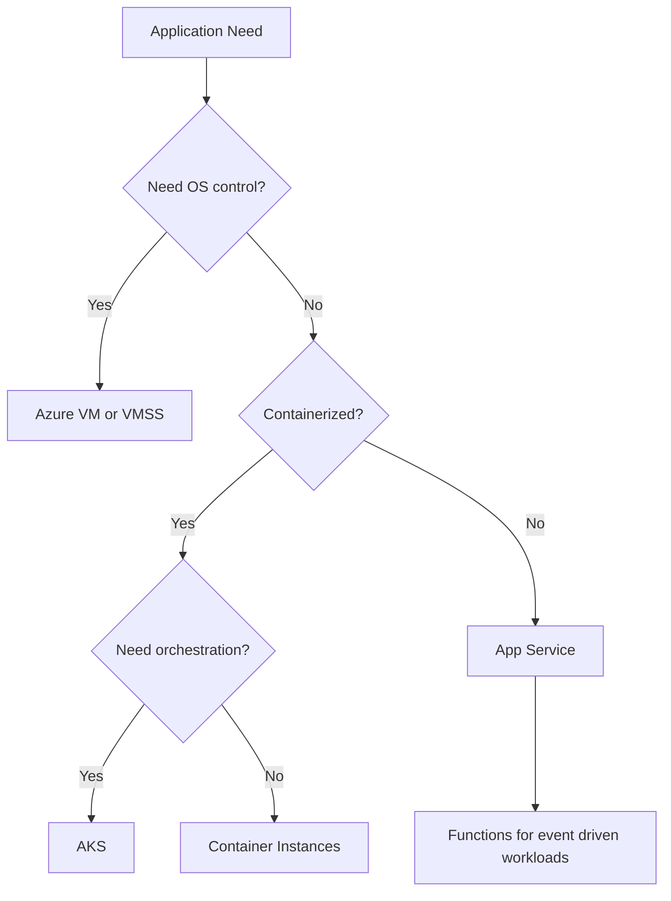
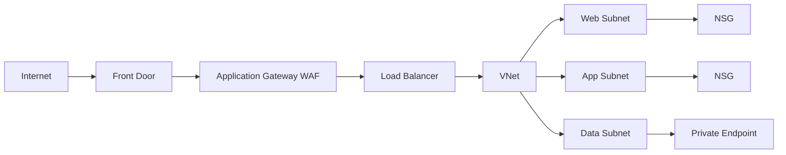
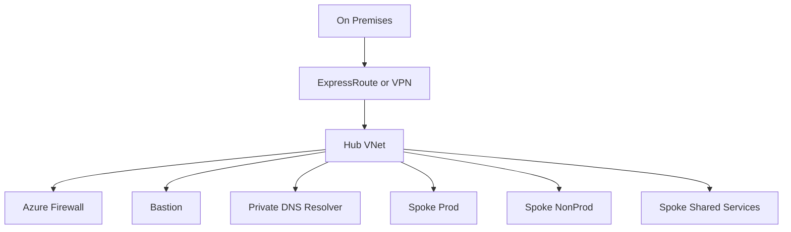

> **Screenshot Disclaimer:** Portal screenshots referenced in this guide are sourced from [Microsoft Learn](https://learn.microsoft.com/en-us/azure/) documentation. © Microsoft Corporation. All rights reserved. Used for educational reference only.

# 02 Compute and Networking Interview Q and A

This guide combines Azure compute and networking because many interview questions cross both domains. Compute choices affect network design, and network architecture often drives service selection.

## Study strategy

- First compare service purpose and operating model.
- Then compare network exposure, security, scaling, and cost.
- Finally practice troubleshooting questions that tie platform and network layers together.

## Compute decision map



## Networking building blocks



## Hub and spoke topology



## Compute Q and A

### Q1: What are common Azure VM size families and when would you use them?

**Answer:**
Azure VM size families are optimized for different workload profiles. B-series is burstable, D-series is general purpose, E-series is memory optimized, F-series is compute optimized, and N-series provides GPU capability.

**Key Points:**
- B-series fits dev, test, and low steady-state workloads with occasional spikes.
- D-series is common for balanced application servers.
- E-series suits databases, caches, and memory-heavy apps.
- F-series is useful for CPU-intensive workloads.
- N-series targets AI, rendering, and graphics workloads.

**Example Scenario:**
"A lightweight jump box may run on B-series, while a memory-heavy reporting engine fits E-series."

**Follow-up Questions:**

**Q: How do you right-size VMs?**
Start with workload baselines, then compare Azure Monitor metrics such as CPU percentage, memory utilization, disk latency, and network throughput against the VM's SKU limits. I usually begin with a conservative D-series or E-series size, run performance testing, and scale up or down based on actual demand. For example, a web API that averages low CPU but high memory pressure may move from D-series to E-series instead of just adding more vCPUs.

**Q: What metrics matter most when selecting a size?**
The most important metrics are CPU utilization, available memory, disk IOPS and latency, and network throughput because Azure VM performance is capped at the SKU level. Azure Monitor, VM Insights, and guest OS counters help confirm whether the bottleneck is compute, memory, storage, or network. For example, if CPU is only 35 percent but disk queue and latency spike during peak hours, the better fix may be a faster disk tier rather than a larger VM.

### Q2: How do burstable B-series VMs work?

**Answer:**
B-series VMs accrue CPU credits during low usage and consume those credits during bursts. They are cost-effective for workloads with low average utilization and occasional spikes.

**Key Points:**
- Good for small business apps, domain controllers, or lab systems.
- Poor fit for sustained high CPU workloads.
- Monitor credit balance to avoid throttling.

**Example Scenario:**
"A small internal wiki server with occasional daytime usage fits B-series well."

**Follow-up Questions:**

**Q: What happens when credits run out?**
When a B-series VM exhausts its CPU credits, Azure limits it back to the guaranteed baseline CPU performance for that SKU. The VM keeps running, but burst performance disappears and response times can degrade quickly on busy workloads. A practical example is a B2s application server that handles fine during quiet periods but slows sharply during sustained report generation once credits are depleted.

**Q: How do you detect CPU throttling?**
You detect throttling by watching Azure Monitor metrics for CPU credits remaining, CPU credits consumed, and sustained high CPU with falling application performance. VM Insights and guest OS performance counters can also show the workload demanding more CPU than the B-series baseline can provide. For example, if credits trend to zero every afternoon and request latency rises at the same time, that is a strong sign the VM is being throttled.

### Q3: What is the difference between D-series and E-series VMs?

**Answer:**
D-series offers a balanced CPU-to-memory ratio for general workloads, while E-series provides more memory per vCPU and is better for memory-intensive applications.

**Key Points:**
- D-series is common for app servers.
- E-series is common for in-memory apps and some databases.
- Always compare performance testing, not just memory ratio.

**Example Scenario:**
"A .NET API server may fit D-series, but an in-memory analytics component may need E-series."

**Follow-up Questions:**

**Q: Which monitoring counters guide the choice?**
I look at CPU percentage, memory available or committed bytes, disk read and write latency, disk queue depth, and network bytes in and out to decide between D-series and E-series. Azure Monitor and VM Insights are useful because they combine platform metrics with guest-level signals. For example, a cache node showing low CPU but constant memory pressure and paging is a better fit for E-series.

**Q: How do disk and network limits factor in?**
Disk throughput, IOPS, and NIC bandwidth limits are tied to the VM size, so a VM can become storage-bound or network-bound even if CPU and memory look fine. When selecting a SKU, I validate both the compute profile and the published Azure limits for attached Premium SSD or Ultra Disk performance and expected network throughput. A common example is a database VM that needs a larger size mainly to unlock higher disk bandwidth, not more cores.

### Q4: When would you choose F-series or N-series?

**Answer:**
Choose F-series for high CPU performance needs such as build workers or scientific compute. Choose N-series when GPU acceleration is required for machine learning, rendering, or graphics-intensive workloads.

**Key Points:**
- F-series optimizes compute density.
- N-series costs more because GPU resources are expensive.
- Licensing and regional capacity may affect availability.

**Example Scenario:**
"A video rendering farm may require N-series, while a code compilation farm might use F-series."

**Follow-up Questions:**

**Q: How do you handle regional GPU shortages?**
If N-series capacity is constrained, I check alternate Azure regions, request quota increases early, and design deployments so batch workloads can fail over where GPU SKUs are available. Azure Capacity Reservations may also help for predictable demand, especially for long-running AI training environments. For example, a team training models in East US can keep a secondary deployment template ready for South Central US when GPU inventory is tight.

**Q: What are cost controls for GPU workloads?**
Cost control usually means shutting down idle GPU VMs, scheduling usage windows, using Spot VMs for fault-tolerant jobs, and selecting the smallest N-series size that meets CUDA or rendering requirements. I also separate experimentation from production so expensive clusters are not left running continuously. For example, nightly ML training can run on Spot N-series nodes in AKS or VM Scale Sets while production inference stays on a smaller always-on pool.

### Q5: What are the main VM storage options?

**Answer:**
Azure VMs commonly use managed disks for OS and data storage, with disk types like Standard HDD, Standard SSD, Premium SSD, and Ultra Disk based on performance needs.

**Key Points:**
- Premium SSD is common for production workloads.
- Ultra Disk supports very high IOPS and throughput.
- Managed disks simplify operations compared with unmanaged storage.

**Example Scenario:**
"A production SQL VM may use Premium SSD or Ultra Disk for transactional performance."

**Follow-up Questions:**

**Q: How do you monitor disk bottlenecks?**
I monitor Azure VM disk metrics such as IOPS, throughput, read and write latency, plus guest OS counters like disk queue length to see whether the workload is hitting storage limits. Azure Monitor and VM Insights make it easier to correlate disk pressure with application slowdowns. For example, if a SQL VM shows rising Premium SSD latency during peak transactions, I would evaluate disk striping, caching settings, or a move to Ultra Disk.

**Q: When is ephemeral OS disk useful?**
Ephemeral OS disks are useful for stateless or easily recreated workloads because the OS disk lives on the host and offers faster provisioning with no managed disk storage cost for the OS volume. They are common in VM Scale Sets for web tiers, build agents, or AKS node pools where instances can be replaced rather than repaired. For example, a stateless API pool can boot faster with ephemeral OS disks because each node is rebuilt from image during scale-out.

### Q6: What is the difference between Availability Sets and VM Scale Sets?

**Answer:**
Availability Sets improve resilience for a fixed number of VMs by spreading them across fault and update domains, while VM Scale Sets manage a group of identical VMs with scaling and orchestration features.

**Key Points:**
- Availability Sets are simpler and older.
- VMSS supports autoscale and uniform instance management.
- VMSS can also span Availability Zones.

**Example Scenario:**
"A stateless web tier needing autoscale should use VMSS rather than manually managed VMs in an Availability Set."

**Follow-up Questions:**

**Q: Can VMSS use custom images?**
Yes, VM Scale Sets can deploy from custom images stored in Azure Compute Gallery, which is the preferred approach for standardized golden images. That lets teams bake in agents, hardening, and application prerequisites before scaling out. For example, a VMSS web tier can launch from a gallery image that already includes IIS configuration, monitoring agents, and security baselines.

**Q: What workloads still fit Availability Sets?**
Availability Sets still fit small, mostly static workloads that need resilience but do not need autoscaling or highly automated lifecycle management. They are often acceptable for legacy line-of-business apps, domain controllers, or clustered software with manual scaling patterns. For example, two fixed application servers behind a Load Balancer may stay in an Availability Set when the architecture is stable and scale-out is not required.

### Q7: When would you choose VM Scale Sets?

**Answer:**
Choose VM Scale Sets for large pools of similar VMs that need consistent configuration, autoscaling, rolling updates, and load-balanced traffic distribution.

**Key Points:**
- Great for stateless web or API tiers.
- Integrates with autoscale rules and load balancers.
- Supports orchestration for patching and updates.

**Example Scenario:**
"An e-commerce API tier scales out automatically during holiday traffic using VMSS and autoscale rules based on CPU and queue depth."

**Follow-up Questions:**

**Q: How do rolling upgrades work in VMSS?**
Rolling upgrades update VMSS instances in batches so only part of the fleet is changed at one time, which reduces outage risk. Azure can combine this with health probes and upgrade policies so unhealthy new instances do not continue replacing healthy ones. For example, a ten-instance API scale set might update two instances at a time behind Azure Load Balancer while health checks confirm each batch is ready.

**Q: How do you handle stateful workloads?**
Stateful workloads need careful design because VMSS works best when instances are disposable, so I externalize session state to services like Azure Cache for Redis, Azure SQL, or Cosmos DB whenever possible. If the workload truly needs node-local state, I use orchestration modes, data replication, or a different platform such as Availability Zones with managed disks. A practical example is moving web session state into Redis so the VMSS tier can scale and heal safely.

### Q8: What is Azure App Service and when should you use it?

**Answer:**
Azure App Service is a managed platform for hosting web apps, APIs, and background apps without managing the underlying operating system and patching infrastructure.

**Key Points:**
- Supports .NET, Node.js, Java, Python, PHP, and containers.
- Includes deployment slots, autoscaling, and built-in integration with App Insights.
- Best for web workloads where platform abstraction is preferred.

**Example Scenario:**
"A line-of-business API is deployed to App Service because the team wants easy deployment slots and minimal VM management."

**Follow-up Questions:**

**Q: What are App Service plans?**
An App Service plan defines the compute tier, pricing, scaling characteristics, and underlying VM resources used by one or more App Service apps. Plans range from shared and basic tiers to Premium tiers with autoscale, VNet integration, and better performance isolation. For example, multiple internal APIs can share one Premium v3 App Service plan to balance cost while still supporting staging slots and autoscale.

**Q: How does App Service compare with AKS?**
App Service is simpler and more managed, while AKS gives much deeper control over containers, networking, scaling behavior, and platform add-ons. I choose App Service for standard web apps and APIs where the team wants fast delivery, and AKS when the platform needs Kubernetes features like sidecars, custom ingress, or service mesh. For example, a single customer portal fits App Service well, but a multi-service platform with dozens of containerized workloads often justifies AKS.

### Q9: How do you compare App Service, AKS, and Azure Container Instances?

**Answer:**
App Service is best for managed web hosting, AKS is best for orchestrated container platforms at scale, and ACI is best for simple or short-lived container execution without cluster management.

**Key Points:**
- App Service is easiest for standard web apps.
- AKS offers the most flexibility and operational complexity.
- ACI is excellent for burst, job, or isolated container runs.

**Example Scenario:**
"A startup with a simple web API may choose App Service first. A platform team standardizing microservices across many services may move to AKS."

**Follow-up Questions:**

**Q: What are the tradeoffs in cost and operations?**
App Service usually has the lowest operational overhead, AKS has the highest flexibility but also the most platform work, and ACI is easy to consume for isolated jobs but can become expensive for always-on patterns. The right choice depends on whether you value managed simplicity or fine-grained control over networking, orchestration, and deployment behavior. For example, a small team may prefer App Service to avoid cluster operations, while a platform engineering team may accept AKS overhead for standardizing many microservices.

**Q: When would Azure Container Apps fit better?**
Azure Container Apps fits best when you want container-based deployment and scale-to-zero behavior without managing Kubernetes directly. It is especially good for microservices, background processors, and event-driven APIs that need Dapr, revisions, or KEDA-style scaling with much less operational effort than AKS. For example, a queue-driven image processor can run well on Container Apps and scale out automatically as Service Bus messages accumulate.

### Q10: What is AKS and when is it a good choice?

**Answer:**
Azure Kubernetes Service is a managed Kubernetes platform for running containerized applications that need orchestration, service discovery, scaling, rolling deployments, and advanced platform patterns.

**Key Points:**
- Good for microservices and container platform standardization.
- Requires stronger operational maturity than App Service.
- Works well with GitOps, ACR, and managed identity.

**Example Scenario:**
"A company running many containerized services with blue-green releases and service mesh requirements chooses AKS."

**Follow-up Questions:**

**Q: What are major AKS operational tasks?**
Major AKS tasks include node pool lifecycle management, Kubernetes version upgrades, ingress and certificate management, monitoring with Azure Monitor or Container Insights, identity and secret handling, and network policy or CNI configuration. Teams also need strong practices for image security, autoscaling, backup, and GitOps-based deployments. For example, an AKS platform team may regularly rotate node pools, patch ingress controllers, and validate managed identity access to Azure Key Vault.

**Q: When is AKS too much complexity?**
AKS is too much complexity when the application does not truly need Kubernetes features and the team lacks the operational maturity to manage cluster health, networking, and upgrades. If you only have one or two simple web APIs, App Service or Azure Container Apps often deliver faster with less risk. For example, using AKS for a single internal website can create unnecessary overhead around ingress, observability, and node maintenance.

### Q11: What are Azure Container Instances best suited for?

**Answer:**
Azure Container Instances are best for simple, isolated, or short-lived container workloads that do not need full orchestration.

**Key Points:**
- Fast to start.
- Good for event-driven batch jobs or ad hoc tasks.
- Not designed for complex microservice orchestration.

**Example Scenario:**
"A nightly ETL job can run as an ACI task triggered by automation without maintaining a cluster."

**Follow-up Questions:**

**Q: How does ACI compare with Functions?**
ACI runs full containers, so it is better when you need custom runtimes, packaged dependencies, or longer-running processes, while Azure Functions is better for event-driven code with serverless triggers and bindings. Functions is usually more productive for lightweight automation, but ACI gives more control over the runtime image. For example, a Python script with native libraries may run more cleanly in ACI, while a simple blob-triggered workflow is usually easier in Functions.

**Q: What are ACI networking limitations?**
ACI networking is more limited than AKS because you do not get the same depth of service discovery, ingress control, or advanced east-west networking options. Integration with VNets is supported, but designs needing complex internal routing, service mesh, or many interdependent services usually outgrow ACI. For example, running one container group for a private batch worker is straightforward, but building a full multi-service application fabric is not.

### Q12: What are Azure Functions and how do they work?

**Answer:**
Azure Functions is a serverless compute service that runs code in response to triggers such as HTTP requests, timers, queues, blobs, events, or service bus messages.

**Key Points:**
- Ideal for event-driven automation and lightweight APIs.
- Bindings simplify input and output integration.
- Consumption plans can scale automatically.

**Example Scenario:**
"A file uploaded to Blob Storage triggers a Function that validates metadata and publishes a message for downstream processing."

**Follow-up Questions:**

**Q: What are bindings?**
Bindings are Azure Functions abstractions that connect a function to services like Blob Storage, Service Bus, Cosmos DB, or Event Hubs without requiring a lot of plumbing code. They can provide input data to the function or send output automatically after execution. For example, an Event Hub-triggered function can read events and write processed results to Blob Storage through an output binding.

**Q: What causes cold start?**
Cold start happens when Azure has to allocate a new Functions host and initialize your code before the first request can run, which is most noticeable on the Consumption plan. The delay is affected by language runtime, package size, dependency loading, VNet integration, and application startup logic. For example, a .NET function with many assemblies and Key Vault lookups during startup will usually cold start slower than a lightweight HTTP function.

### Q13: What are triggers and bindings in Azure Functions?

**Answer:**
A trigger defines what starts the function, while bindings provide declarative ways to connect to input and output sources such as queues, blobs, Cosmos DB, or Event Hubs.

**Key Points:**
- One trigger per function.
- Multiple input and output bindings are possible.
- Reduces boilerplate code for integrations.

**Example Scenario:**
"An HTTP-triggered function reads a query parameter and writes an output message to a Service Bus queue using an output binding."

**Follow-up Questions:**

**Q: When should you avoid too many bindings?**
You should avoid too many bindings when they make the function hard to understand, tightly coupled to many services, or difficult to test and troubleshoot. In those cases, explicit SDK calls can give clearer control, better error handling, and easier observability. For example, a function touching several queues, blobs, and databases may be simpler to maintain if critical write paths are handled directly in code.

**Q: How do you secure connection settings?**
The best practice is to store secrets in Azure Key Vault and let the Function App access them through managed identity rather than embedding credentials in app settings. I also limit network access with private endpoints or VNet integration when the backing service supports it. For example, a Function can read a Service Bus connection secret from Key Vault while the vault itself is restricted to the function's private network path.

### Q14: What is cold start in Azure Functions?

**Answer:**
Cold start is the delay experienced when a function app instance is not already warm and Azure must allocate resources before running the code.

**Key Points:**
- More noticeable in Consumption plan.
- Can be reduced with Premium plan, optimized startup, and careful dependencies.
- Important for latency-sensitive APIs.

**Example Scenario:**
"A customer-facing HTTP function with strict response targets may use Premium plan to avoid cold-start impact."

**Follow-up Questions:**

**Q: What affects cold start duration?**
Cold start duration is influenced by hosting plan, runtime, package size, dependency initialization, and whether the Function App uses VNet integration or heavy startup configuration. Premium plans and pre-warmed instances reduce the delay, while large dependency trees and synchronous startup work increase it. For example, Java functions with large frameworks often need more startup tuning than smaller Node.js handlers.

**Q: How do you measure it?**
I measure cold start by using Application Insights to compare first-request latency after idle periods and by reviewing request, dependency, and startup traces. Controlled tests that let the app go idle and then invoke it again are useful for separating cold starts from normal execution time. For example, a team can schedule probe calls and analyze the first call after inactivity to quantify whether Premium plan adoption is justified.

### Q15: What is the difference between Custom Script Extension and cloud-init?

**Answer:**
Custom Script Extension runs scripts on Azure VMs after deployment using the Azure guest agent, while cloud-init is a Linux-native initialization system used during first boot to configure the machine.

**Key Points:**
- cloud-init is preferred for initial Linux VM provisioning.
- Custom Script Extension works for post-deployment tasks and both Windows and Linux scenarios.
- Overusing either for full configuration management can become fragile.

**Example Scenario:**
"A Linux VM uses cloud-init to install packages on first boot, while a later app patch uses Custom Script Extension."

**Follow-up Questions:**

**Q: How do you troubleshoot extension failures?**
I start with the VM's Extensions and applications blade, Activity Log, and instance view to confirm whether the extension failed during download, execution, or reporting. Then I review guest logs such as waagent logs on Linux or the extension-specific logs on Windows to find script errors, permissions issues, or network reachability problems. For example, a Custom Script Extension often fails because the VM cannot reach the script package in Storage or because the script is not idempotent.

**Q: When should you use configuration management tools instead?**
Use tools like Ansible, Chef, Puppet, or DSC when configuration needs to be repeatable, versioned, and maintained across many servers over time. Extensions and cloud-init are good for bootstrap tasks, but they become brittle if you keep layering ongoing state management into one-off scripts. For example, patching registry settings on hundreds of Windows VMs is a better fit for DSC than for repeated Custom Script Extension runs.

### Q16: What VM troubleshooting tools should you know?

**Answer:**
Key VM troubleshooting tools include Boot Diagnostics, Serial Console, Run Command, VM instance view, Activity Log, Resource Health, and guest OS logs.

**Key Points:**
- Boot Diagnostics helps with startup problems.
- Serial Console helps when network access fails.
- Run Command enables in-guest command execution without direct login.

**Example Scenario:**
"If a VM is unreachable over RDP or SSH, use Boot Diagnostics and Serial Console before deciding whether the issue is network, OS, or extension-related."

**Follow-up Questions:**

**Q: What permissions are needed for Serial Console?**
Serial Console access requires the right Azure RBAC permissions on the VM and supporting boot diagnostics access so the console channel can be established. In practice, teams often grant VM Contributor or a more tailored role plus least-privilege access to the diagnostic storage path if customer-managed storage is used. For example, an operations engineer may be able to restart a VM but still fail to open Serial Console if they do not have the required portal and VM access rights.

**Q: How do you use Run Command safely?**
Use Run Command for targeted diagnostics or recovery tasks, not as a general administration shortcut, and keep every command logged, reviewed, and idempotent. I restrict it with RBAC, avoid embedding secrets in command text, and prefer read-only checks before making system changes. For example, using Run Command to inspect service status on a broken VM is reasonable, but pushing ad hoc production configuration changes through it is risky.

### Q17: How do you use Boot Diagnostics?

**Answer:**
Boot Diagnostics captures console output and screenshots during startup, allowing you to inspect VM boot behavior even if remote access is unavailable.

**Key Points:**
- Useful for kernel panic, boot loop, and startup driver issues.
- Accessible from the VM blade in the portal.
- Can also store logs in a storage account for analysis.

**Example Scenario:**
"A Windows VM fails after patching. Boot Diagnostics shows startup repair messages that help narrow the root cause."

**Follow-up Questions:**

**Q: What if Boot Diagnostics is disabled?**
If Boot Diagnostics is disabled, you lose console screenshots and boot log visibility until it is enabled, which makes startup failures harder to diagnose. I would enable it as part of the VM standard, then fall back to Serial Console, Run Command, or recovery steps like attaching the OS disk to another VM if the machine is already unhealthy. For example, enabling Boot Diagnostics up front can save time when a kernel update leaves a Linux VM stuck during boot.

**Q: How is it different from Serial Console?**
Boot Diagnostics is mainly for passive visibility into startup behavior, while Serial Console gives you an interactive text console for supported troubleshooting tasks. One shows what happened during boot, and the other can let you log in or repair the system when network access is broken. For example, Boot Diagnostics may reveal a boot loop, and Serial Console can then be used to disable the bad service or repair the configuration.

### Q18: What is Azure Bastion?

**Answer:**
Azure Bastion is a managed service that provides secure RDP and SSH access to VMs over TLS through the Azure portal without exposing public IP addresses on the target VMs.

**Key Points:**
- Reduces attack surface.
- Fits Zero Trust and locked-down subnet designs.
- Requires a dedicated `AzureBastionSubnet`.

**Example Scenario:**
"Production VMs in a private subnet are accessed by admins through Azure Bastion instead of public IP addresses."

**Follow-up Questions:**

**Q: How does Bastion compare with a jump box?**
Azure Bastion is a managed access service, while a jump box is a VM you must patch, secure, monitor, and expose appropriately. Bastion reduces operational overhead and avoids public IPs on target VMs, which aligns better with Zero Trust designs. For example, instead of maintaining a hardened admin VM in every environment, a team can use one Bastion deployment per hub VNet for browser-based RDP and SSH access.

**Q: What are Bastion pricing considerations?**
Bastion pricing depends on the SKU and the fact that it is an always-on managed service, so it can cost more than a small jump box for very light usage but often saves labor and security risk. I weigh that cost against patching effort, public IP exposure, and the value of centralized secure access. For example, production environments with strict audit and no-public-IP requirements usually justify Bastion more easily than small dev subscriptions.

### Q19: What is Azure Spot for compute operations strategy?

**Answer:**
Azure Spot is a cost optimization strategy for fault-tolerant workloads where eviction is acceptable, often combined with standard instances for baseline capacity.

**Key Points:**
- Works well for batch and CI jobs.
- Needs eviction-aware design.
- Capacity varies by region and time.

**Example Scenario:**
"A rendering farm runs 70 percent of nodes on Spot and keeps 30 percent standard instances for guaranteed baseline throughput."

**Follow-up Questions:**

**Q: How would you queue work before eviction?**
I would decouple the workload with a durable queue such as Azure Queue Storage, Service Bus, or Batch so workers can checkpoint progress and another node can resume after eviction. The application should save partial state externally and treat Spot instances as disposable compute. For example, a rendering farm can pull jobs from Service Bus, write progress to Blob Storage, and safely requeue unfinished work when Azure sends the eviction notice.

**Q: What workloads must stay on standard instances?**
Anything that requires guaranteed availability, strict latency, or durable in-memory state should stay on standard instances rather than Spot. Production databases, customer-facing APIs with hard SLAs, and domain controllers are common examples because eviction would create unacceptable risk. A practical pattern is keeping baseline AKS nodes or VMSS capacity on standard VMs while overflow batch workers use Spot.

## Networking Q and A

### Q20: What is an Azure Virtual Network?

**Answer:**
A Virtual Network, or VNet, is the fundamental private networking boundary in Azure. It lets Azure resources communicate securely with each other, with the internet, and with on-premises networks.

**Key Points:**
- Similar to a logical private network in Azure.
- Contains one or more subnets.
- Supports routing, security, DNS, and connectivity services.

**Example Scenario:**
"A three-tier app uses one VNet with separate web, app, and data subnets to isolate traffic and apply targeted controls."

**Follow-up Questions:**

**Q: How do address spaces work?**
A VNet address space defines the private IP ranges available for subnets, and those ranges should be planned to avoid overlap with on-premises networks or other VNets. Azure lets you add multiple CIDR blocks to a VNet, but subnet ranges must fit within the overall address space. For example, a hub VNet might use 10.0.0.0/16 and split that into web, app, data, AzureBastionSubnet, and AzureFirewallSubnet segments.

**Q: Can resources in different VNets communicate?**
Yes, resources in different VNets can communicate if you connect the VNets through peering, VPN Gateway, ExpressRoute, or another approved path and allow the traffic with routing and NSG rules. Without connectivity and proper DNS, they remain isolated administrative boundaries. For example, a spoke app server can reach a hub-hosted Azure Firewall or Private DNS Resolver once VNet peering is established and traffic is permitted.

### Q21: What is a subnet and why is subnetting important?

**Answer:**
A subnet is a segmented IP range inside a VNet. Subnetting helps separate workloads, control traffic, assign policies, and reserve dedicated areas for services like Azure Firewall or Bastion.

**Key Points:**
- Improves organization and security segmentation.
- Supports route and NSG boundaries.
- Required for many managed services.

**Example Scenario:**
"A company places web servers in one subnet, application servers in another, and private endpoints in a dedicated subnet."

**Follow-up Questions:**

**Q: Which services need their own subnet?**
Services such as Azure Bastion, Azure Firewall, VPN Gateway, ExpressRoute Gateway, and many delegated PaaS integrations require dedicated subnets with specific names or sizing rules. Private endpoints are also commonly placed in their own subnet for cleaner policy and DNS design, even when not strictly required. For example, Azure Bastion must use a dedicated `AzureBastionSubnet`, and Azure Firewall must use `AzureFirewallSubnet`.

**Q: How do subnet delegations work?**
Subnet delegation tells Azure that a subnet is reserved for a specific service so that service can create and manage network interfaces or policies within it. This is common with services like Azure Container Apps environments or delegated App Service integration scenarios. For example, delegating a subnet to `Microsoft.Web/serverFarms` enables App Service VNet integration behavior that would not work on a generic subnet.

### Q22: What is an NSG?

**Answer:**
A Network Security Group is a stateful packet filtering service that controls inbound and outbound traffic using allow and deny rules based on source, destination, port, and protocol.

**Key Points:**
- Can be applied at subnet or NIC level.
- Lower-numbered rules are evaluated first.
- Stateful behavior means return traffic is automatically allowed for established connections.

**Example Scenario:**
"Only HTTPS from Application Gateway is allowed to the web subnet, and only SQL traffic from the app subnet is allowed to the data tier."

**Follow-up Questions:**

**Q: What are default NSG rules?**
Default NSG rules include allows for VNet inbound and outbound traffic, allows for Azure Load Balancer health probes, and denies for internet inbound and most broad outbound cases at lower priority precedence. You cannot delete them, but you can override them with higher-priority custom rules. For example, a custom deny from a web subnet to a data subnet will beat the default allow within the VNet if its priority number is lower.

**Q: How do NIC and subnet NSGs interact?**
If NSGs exist at both the subnet and NIC, Azure evaluates the effective rules from both scopes and traffic must be allowed through each applicable layer. A deny at either layer blocks the flow even if the other scope has an allow. For example, an SSH allow on the NIC does not help if the subnet NSG still has a higher-priority inbound deny on port 22.

### Q23: What is an Application Security Group?

**Answer:**
An Application Security Group, or ASG, lets you group VM network interfaces logically and reference that group in NSG rules instead of maintaining many IP addresses manually.

**Key Points:**
- Simplifies NSG rule management.
- Useful for dynamic application tiers.
- Works well in medium and large VM environments.

**Example Scenario:**
"An NSG rule allows the `asg-web` group to talk to the `asg-app` group on port 443 without hard-coding private IPs."

**Follow-up Questions:**

**Q: Do ASGs work across VNets?**
ASGs are intended for grouping NICs within the same virtual network, so they are not a cross-VNet abstraction for writing one rule across separate VNets. If you need segmentation across multiple VNets, you usually combine peering, NSGs, Azure Firewall, or other centralized controls instead. For example, an `asg-web` and `asg-app` pattern works well inside one spoke VNet but does not replace hub-and-spoke policy controls.

**Q: How do ASGs help with automation?**
ASGs help automation because deployment code can attach NICs to logical groups and NSG rules can stay stable even when IP addresses change. That reduces manual rule maintenance in ARM, Bicep, or Terraform-driven environments. For example, an autoscaled VMSS can add instances to a web ASG automatically, and existing NSG rules continue working without editing address prefixes.

### Q24: How do you explain VNet, subnet, NSG, and ASG together?

**Answer:**
The VNet is the overall network, subnets divide it into segments, NSGs filter traffic at subnet or NIC boundaries, and ASGs let you write cleaner NSG rules based on application groupings.

**Key Points:**
- Think of VNet as the container.
- Subnets define segments.
- NSGs define traffic policy.
- ASGs simplify rule targeting.

**Example Scenario:**
"In a multi-tier app, the web subnet allows 443 inbound from an Application Gateway, while app subnet rules reference ASGs to permit only app-to-data traffic."

**Follow-up Questions:**

**Q: When should you use subnet NSGs vs NIC NSGs?**
I use subnet NSGs for broad, shared policy boundaries and NIC NSGs only when a specific VM needs an exception or extra control. Subnet-level rules are easier to govern and scale, while NIC-level rules can become hard to track if overused. For example, an app subnet may allow only HTTPS from Application Gateway, while one admin VM NIC gets an extra restricted management rule.

**Q: How do UDRs fit into this model?**
UDRs control where traffic goes, while NSGs control whether traffic is allowed, so both are needed for full network policy. In hub-and-spoke designs, UDRs often steer traffic to Azure Firewall or an NVA and NSGs then restrict which flows are permitted. For example, a spoke subnet can use a default route to the hub firewall and still rely on NSGs to allow only approved ports to the data tier.

### Q25: What is VNet peering?

**Answer:**
VNet peering connects two Azure VNets over the Microsoft backbone so resources can communicate privately with low latency without using gateways.

**Key Points:**
- Can be regional or global depending on support.
- Traffic stays on Microsofts network.
- Peered VNets remain separate administrative boundaries.

**Example Scenario:**
"A shared services VNet is peered with multiple application VNets so workloads can use central DNS and monitoring services."

**Follow-up Questions:**

**Q: What settings must be enabled for gateway transit?**
For gateway transit, the hub VNet peering must allow gateway transit and the spoke VNet peering must use remote gateways. This lets the spoke consume the hub's VPN Gateway or ExpressRoute Gateway without deploying its own. For example, several spoke VNets can share one hub ExpressRoute gateway when those peering settings are configured correctly.

**Q: Why might peering still fail?**
Peering can fail because of overlapping address spaces, missing reciprocal configuration, DNS problems, NSG denies, or UDRs that send traffic somewhere unexpected. Even when the peering status shows connected, effective connectivity can still break at the route or policy layer. For example, two peered VNets may still be unable to communicate if a subnet NSG denies the traffic or if a default route forces packets to a firewall with no return path.

### Q26: How do you compare VNet peering, VPN Gateway, and ExpressRoute?

**Answer:**
VNet peering connects Azure VNets privately, VPN Gateway connects Azure and other networks over encrypted internet tunnels, and ExpressRoute provides private dedicated connectivity through a network provider.

**Key Points:**
- Peering is simplest for Azure-to-Azure connectivity.
- VPN is cost-effective for many hybrid cases.
- ExpressRoute suits high-throughput, low-latency, or compliance-sensitive connectivity.

**Comparison Table:**

| Option | Best use case | Network path | Relative cost |
|---|---|---|---|
| VNet Peering | Azure VNet to Azure VNet | Microsoft backbone | Low to medium |
| VPN Gateway | On-premises to Azure over internet | Encrypted public internet | Medium |
| ExpressRoute | Private enterprise connectivity | Dedicated private circuit | High |

**Example Scenario:**
"A branch office may use site-to-site VPN initially, then move to ExpressRoute as throughput and reliability requirements grow."

**Follow-up Questions:**

**Q: What is gateway transit?**
Gateway transit is the ability for a VNet, usually a spoke, to use the VPN Gateway or ExpressRoute Gateway deployed in another peered VNet, usually the hub. It reduces cost and simplifies hybrid networking because you do not need a separate gateway in every spoke. For example, a central hub can host the only ExpressRoute gateway while multiple application spokes inherit that path through peering.

**Q: Can you combine ExpressRoute and VPN?**
Yes, Azure can use ExpressRoute and VPN together in the same overall hybrid design, often with BGP and route preference controlling normal and backup paths. A common pattern is ExpressRoute for primary private connectivity and site-to-site VPN for resilience or branch locations that are not on the private circuit. For example, headquarters may use ExpressRoute while a smaller branch keeps a VPN tunnel as backup connectivity to Azure.

### Q27: What is Azure Load Balancer?

**Answer:**
Azure Load Balancer is a Layer 4 service that distributes TCP and UDP traffic across healthy backend instances based on frontend IP, port, and protocol information.

**Key Points:**
- Works well for non-HTTP workloads and internal load balancing.
- Uses health probes to detect backend status.
- Comes in public and internal variants.

**Example Scenario:**
"A pair of NVAs behind an internal Load Balancer handle east-west traffic in a hub VNet."

**Follow-up Questions:**

**Q: What is the difference between Standard and Basic Load Balancer?**
Standard Load Balancer is the recommended option because it supports availability zones, better scale, richer features, and a more secure default posture than Basic Load Balancer. Basic is legacy and lacks many production capabilities, so I avoid it for new designs. For example, a zone-redundant application or VM Scale Set backend should use Standard Load Balancer, not Basic.

**Q: How do health probes work?**
Health probes periodically check backend instances on a defined protocol and port, and Azure Load Balancer sends traffic only to instances that pass. Probes can be TCP, HTTP, or HTTPS depending on the scenario. For example, if a web server stops answering the probe path, the Load Balancer removes it from rotation until it becomes healthy again.

### Q28: What is Azure Application Gateway?

**Answer:**
Azure Application Gateway is a Layer 7 web traffic load balancer that supports HTTP and HTTPS routing, path-based routing, TLS termination, session affinity, and optional Web Application Firewall.

**Key Points:**
- Understands HTTP headers and URLs.
- Supports WAF for web protection.
- Often used regionally in front of web applications.

**Example Scenario:**
"A web platform routes `/api` to one backend pool and `/app` to another using path-based rules on Application Gateway."

**Follow-up Questions:**

**Q: What causes 502 errors?**
A 502 from Application Gateway usually means the gateway could not successfully reach or validate the backend, often because of unhealthy probes, TLS mismatches, DNS issues, or backend timeouts. I check backend health, listener settings, probe configuration, and NSG or routing paths first. For example, an HTTPS backend with the wrong host header or certificate trust chain can cause repeated 502 responses even though the app is running.

**Q: How does App Gateway differ from Front Door?**
Application Gateway is a regional Layer 7 load balancer inside your Azure region, while Front Door is a global edge service that routes users to the best healthy regional backend. App Gateway is often used for regional ingress and WAF close to the application, while Front Door handles global entry, acceleration, and failover. For example, a multinational web app may use Front Door globally and App Gateway inside each region.

### Q29: What is Azure Front Door?

**Answer:**
Azure Front Door is a global Layer 7 entry service for web applications that provides global load balancing, acceleration, TLS offload, health-based routing, and web application firewall capabilities at the edge.

**Key Points:**
- Best for global internet-facing applications.
- Can route users to the nearest healthy backend region.
- Adds caching and acceleration benefits.

**Example Scenario:**
"A multinational application deploys apps in Europe and the US, and Front Door routes users to the closest healthy region."

**Follow-up Questions:**

**Q: When would you use Front Door with App Gateway?**
I use Front Door with Application Gateway when I need global entry and failover plus regional Layer 7 controls such as private backend integration, path routing, or a regional WAF policy. Front Door handles the worldwide edge and chooses the healthy region, while App Gateway enforces region-specific web routing. For example, a two-region application may use Front Door to direct users to East US or West Europe and an App Gateway in each region to route `/api` and `/app` differently.

**Q: How does Front Door help with regional failover?**
Front Door continuously health-checks regional backends and stops sending users to a failed region when probes fail. Because it is a proxy-based edge service, failover is typically faster and more controlled than DNS-only approaches. For example, if an App Service in Central US becomes unhealthy, Front Door can redirect new traffic to a healthy deployment in East US without waiting for DNS caches to expire.

### Q30: What is Azure Traffic Manager?

**Answer:**
Azure Traffic Manager is a DNS-based global traffic distribution service that directs clients to endpoints based on routing methods like priority, weighted, performance, geographic, or multi-value.

**Key Points:**
- Operates at DNS layer, not as a reverse proxy.
- Useful for non-HTTP and some cross-cloud or external endpoint scenarios.
- Failover depends on DNS behavior and client caching.

**Example Scenario:**
"A company uses Traffic Manager to route users to region-specific public endpoints hosted across multiple clouds."

**Follow-up Questions:**

**Q: How does Traffic Manager differ from Front Door?**
Traffic Manager is DNS-based and chooses an endpoint before the client connects, while Front Door is a reverse proxy at the Microsoft edge that can inspect and route HTTP or HTTPS traffic directly. That makes Front Door better for modern global web apps, while Traffic Manager remains useful for non-HTTP endpoints or multi-cloud DNS routing. For example, a public API usually benefits from Front Door, but globally distributing SMTP or external endpoints may still fit Traffic Manager.

**Q: What are DNS TTL considerations?**
With Traffic Manager, DNS TTL affects how quickly clients learn about endpoint changes because many resolvers cache answers until the TTL expires. Lower TTLs can improve failover responsiveness but increase DNS query volume and still do not guarantee instant cutover because some clients cache aggressively. For example, a one-minute TTL can help disaster recovery, but you still design for some clients to keep using an old endpoint briefly.

### Q31: How do you compare Load Balancer, Application Gateway, Front Door, and Traffic Manager?

**Answer:**
Load Balancer is Layer 4 regional traffic distribution, Application Gateway is Layer 7 regional web routing, Front Door is Layer 7 global edge routing, and Traffic Manager is DNS-based global endpoint selection.

**Key Points:**
- Choose based on protocol layer and scope.
- Global web apps usually start with Front Door.
- Internal TCP workloads often use Load Balancer.

**Example Scenario:**
"A global web app may use Front Door globally, App Gateway regionally, and an internal Load Balancer for backend services."

**Follow-up Questions:**

**Q: When is chaining these services justified?**
Chaining is justified when different layers solve different problems, such as Front Door for global routing, Application Gateway for regional web policy, and Load Balancer for internal TCP distribution. I only chain when each hop adds clear value because extra layers increase cost and troubleshooting complexity. For example, a global web platform may use Front Door at the edge, App Gateway per region, and an internal Load Balancer behind the web tier.

**Q: Which one provides WAF?**
Azure Web Application Firewall is available with Application Gateway and Azure Front Door, not with Azure Load Balancer or Traffic Manager. I choose Application Gateway WAF for regional ingress and Front Door WAF for global edge protection. For example, an internet-facing application can block common OWASP attacks at Front Door before traffic ever reaches the regional backend.

### Q32: What is Azure DNS?

**Answer:**
Azure DNS hosts public DNS zones in Azure, while Azure Private DNS provides name resolution for private resources within and across linked VNets.

**Key Points:**
- Public zones resolve internet-facing names.
- Private zones resolve internal names like private endpoints.
- DNS design is critical for hybrid connectivity and Private Link.

**Example Scenario:**
"A storage account private endpoint uses a Private DNS zone so VMs resolve the storage FQDN to a private IP instead of the public endpoint."

**Follow-up Questions:**

**Q: How do Private DNS zone links work?**
A Private DNS zone link associates a Private DNS zone with one or more VNets so resources in those VNets can resolve private records, including private endpoint names. The link does not create connectivity by itself, but it enables name resolution over the connected network path. For example, linking `privatelink.database.windows.net` to a spoke VNet lets a VM resolve an Azure SQL private endpoint to its private IP.

**Q: What breaks if DNS is not configured for private endpoints?**
If DNS is wrong, clients often resolve the service's public endpoint instead of the private endpoint, which can cause connection failures or bypass the intended private path. This is one of the most common Private Link issues in Azure. For example, a VM trying to reach a Storage account over Private Endpoint may fail because it still resolves the public FQDN and public network access is disabled.

### Q33: What is Network Watcher?

**Answer:**
Network Watcher is Azures network diagnostics service that provides tools such as IP flow verify, next hop, effective security rules, packet capture, connection troubleshoot, and topology views.

**Key Points:**
- Essential for network troubleshooting interviews.
- Helps identify route, NSG, and connectivity issues.
- Supports both operational and design validation.

**Example Scenario:**
"A VM cannot reach a database. IP flow verify shows NSG denial, and next hop confirms traffic is being forced to Azure Firewall."

**Follow-up Questions:**

**Q: Which tool would you use first for NSG diagnosis?**
I usually start with effective security rules or IP flow verify in Azure Network Watcher because they quickly show whether the traffic is allowed or denied and which rule matched. That is faster than scanning multiple NSGs manually when subnet and NIC rules both apply. For example, if SSH to a Linux VM fails, IP flow verify can immediately show a subnet-level deny on port 22.

**Q: How does connection troubleshoot help?**
Connection troubleshoot tests end-to-end connectivity between source and destination and helps identify whether the failure is caused by DNS, routing, NSGs, or the application listener. It is especially useful when the problem is broader than a single rule evaluation. For example, it can show that a VM reaches the target subnet but cannot complete a TCP connection to Azure SQL because a firewall or listener issue remains.

### Q34: What does IP flow verify do?

**Answer:**
IP flow verify checks whether a packet to or from a VM would be allowed or denied based on effective NSG rules and identifies the matching rule.

**Key Points:**
- Great for pinpointing NSG rule conflicts.
- Evaluates source, destination, port, and protocol.
- Faster than guessing from rule lists manually.

**Example Scenario:**
"A Linux VM cannot receive SSH. IP flow verify reveals an inbound deny rule at the subnet NSG."

**Follow-up Questions:**

**Q: Does it test route tables too?**
No, IP flow verify is focused on NSG allow or deny decisions and does not evaluate the effective route path the way Next Hop does. I use both tools together when I need to separate policy problems from routing problems. For example, if IP flow verify says allow but the VM still cannot reach the target, Next Hop is the next check to confirm a UDR is not steering traffic incorrectly.

**Q: What information do you need before using it?**
You need the VM, traffic direction, protocol, source and destination IPs, and the relevant port numbers so Azure can simulate the exact packet flow. Accurate values matter because NSG decisions can change by subnet, source, destination, and port. For example, testing TCP 443 from an app VM to a database private endpoint gives a much more useful answer than checking a generic allow on the wrong port.

### Q35: What does Next Hop show?

**Answer:**
Next Hop shows where Azure will send traffic from a VM to a destination IP, helping diagnose routing issues involving system routes, user-defined routes, or virtual appliances.

**Key Points:**
- Useful for UDR and forced tunneling issues.
- Can reveal routes to internet, VNet, gateway, or appliance.
- Helps validate hub-and-spoke routing design.

**Example Scenario:**
"A VM cannot reach the internet because a UDR sends 0.0.0.0/0 to a firewall that has no outbound rule. Next Hop confirms the path."

**Follow-up Questions:**

**Q: How do UDRs override system routes?**
Azure chooses the most specific route, and when prefix lengths are equal a user-defined route generally takes precedence over the default system route for that subnet. This lets you force traffic toward a virtual appliance, gateway, or custom path. For example, a UDR for `0.0.0.0/0` can override the normal internet route and send all outbound traffic from a spoke subnet to Azure Firewall.

**Q: What is a blackhole route?**
A blackhole route is a route that causes traffic to be dropped because the next hop is invalid, unavailable, or explicitly set to `None`. In Azure, blackholing is often accidental and shows up when a UDR or peering design sends traffic to a path that cannot actually forward it. For example, a subnet route pointing to a missing virtual appliance can silently break outbound connectivity.

### Q36: What is the difference between Private Endpoints and Service Endpoints?

**Answer:**
Private Endpoints assign a private IP from your VNet to a supported Azure PaaS resource, while Service Endpoints extend your VNet identity to the Azure service over the Azure backbone without placing the service inside your IP space.

**Key Points:**
- Private Endpoints are more private and preferred for sensitive workloads.
- Service Endpoints are simpler but still expose the service publicly unless other controls are applied.
- Private DNS is commonly required for Private Endpoints.

**Example Scenario:**
"A highly regulated workload uses Private Endpoints for Azure SQL and Storage so traffic never uses the public endpoint."

**Follow-up Questions:**

**Q: When are Service Endpoints still acceptable?**
Service Endpoints are still acceptable when you want simple, low-cost VNet-based access control to Azure PaaS services and do not need the full isolation of Private Link. They work well for internal workloads reaching services like Azure Storage or Azure SQL over the Microsoft backbone while still using the public endpoint. For example, a non-regulated application may use Service Endpoints plus firewall restrictions to allow only a specific subnet to access a Storage account.

**Q: How do NSGs interact with private endpoint subnets?**
Private endpoints place a private IP in your subnet, so NSG behavior must be designed carefully around that traffic pattern and the service guidance for the endpoint subnet. The main operational dependency is usually DNS and routing, but NSGs can still affect client traffic reaching the private IP. For example, if a subnet hosting clients denies outbound 443 to the private endpoint address, access to an Azure SQL private endpoint will fail even though the endpoint exists.

### Q37: What is a User Defined Route?

**Answer:**
A User Defined Route, or UDR, is a custom route you apply to a subnet so traffic follows a chosen path such as a virtual appliance, virtual network gateway, or specific destination override.

**Key Points:**
- Used for forced tunneling and inspection patterns.
- Common in hub-and-spoke designs.
- Must be tested carefully to avoid asymmetric routing.

**Example Scenario:**
"An enterprise sends outbound internet traffic from spokes to a hub firewall using a default route UDR."

**Follow-up Questions:**

**Q: What is forced tunneling?**
Forced tunneling sends internet-bound traffic from Azure workloads through a central inspection path, such as Azure Firewall, an NVA, or on-premises security infrastructure, instead of using direct internet egress. It is mainly used to centralize logging, filtering, and compliance controls. For example, a regulated enterprise may route all spoke subnet outbound traffic through a hub firewall before it reaches the internet.

**Q: How do you avoid routing loops?**
I avoid routing loops by validating effective routes end to end, making sure return paths are symmetrical where required, and preventing firewalls or gateways from sending traffic back to the same subnet through conflicting UDRs. Network Watcher Next Hop and effective route views are very useful here. For example, if a spoke routes to the hub firewall, the hub must also know how to return traffic to that spoke instead of forwarding it back into the same inspection path.

### Q38: What is forced tunneling?

**Answer:**
Forced tunneling is a routing pattern where internet-bound traffic from workloads is directed through a central inspection point such as Azure Firewall, an NVA, or on-premises security stack instead of going directly out to the internet.

**Key Points:**
- Improves central security visibility and policy enforcement.
- Requires careful route and SNAT planning.
- Can break service dependencies if not designed correctly.

**Example Scenario:**
"All production spokes send default-route traffic to a hub Azure Firewall for egress filtering and logging."

**Follow-up Questions:**

**Q: Which Azure services need special route exceptions?**
Services with control-plane dependencies or platform-managed endpoints may need route exceptions or service-tag-based design so forced tunneling does not break them. Common examples include identity, monitoring, package repositories, and Azure platform services used by VM agents, Kubernetes nodes, or PaaS integrations. For example, an AKS cluster or VM extension workflow can fail if outbound paths to required Azure endpoints are forced through a firewall without the necessary rules.

**Q: How do you troubleshoot broken outbound traffic after forced tunneling?**
I start with effective routes and Next Hop to confirm traffic is reaching the intended firewall or gateway, then I check firewall rules, SNAT behavior, and return routing. After that, I validate DNS resolution and test specific destinations with Connection Troubleshoot or packet capture if needed. For example, if VMs lose internet access after a new `0.0.0.0/0` UDR, the root cause is often a missing egress rule or missing return path on the hub firewall.

### Q39: How do you compare Azure Firewall, NSG, and third-party NVAs?

**Answer:**
NSGs provide basic distributed packet filtering, Azure Firewall provides centralized managed firewall capabilities with application and network rules, and third-party NVAs provide specialized features but add operational overhead.

**Key Points:**
- NSGs are not a full firewall replacement.
- Azure Firewall is managed and integrates well with Azure routing and policy.
- NVAs may be needed for advanced vendor-specific controls.

**Example Scenario:**
"A regulated enterprise may use NSGs for local segmentation and Azure Firewall in the hub for central egress control, DNAT, and logging."

**Follow-up Questions:**

**Q: When would you choose Azure Firewall Premium?**
I choose Azure Firewall Premium when the design needs advanced capabilities such as TLS inspection, IDPS, or stronger protection for east-west and outbound traffic. It is a good fit for regulated environments that need managed firewall features without operating third-party appliances. For example, a financial services hub VNet may use Firewall Premium to inspect encrypted outbound traffic and enforce stricter threat protection controls.

**Q: What are NVA scaling considerations?**
NVAs require planning for throughput, session limits, high availability, autoscaling patterns, and how traffic is balanced across instances. Unlike Azure Firewall, you also own image lifecycle, patching, and vendor-specific clustering behavior. For example, two firewall NVAs behind a Standard Load Balancer may still bottleneck if the chosen VM size cannot handle the expected encrypted traffic volume.

### Q40: What is a hub-spoke topology and why is it common?

**Answer:**
A hub-spoke topology uses a central hub VNet for shared services such as firewalls, gateways, and DNS, while spoke VNets host workloads and peer back to the hub.

**Key Points:**
- Promotes central control and reuse.
- Scales well across many application teams.
- Common in landing zone architectures.

**Example Scenario:**
"A platform team places Azure Firewall, Bastion, and ExpressRoute in the hub and connects multiple application spokes for production and nonproduction."

**Follow-up Questions:**

**Q: What are common hub bottlenecks?**
Common hub bottlenecks include firewall throughput, gateway bandwidth, DNS forwarding capacity, and overly centralized routing that sends too much east-west traffic through one inspection point. Poor subnet sizing and too many shared services in one hub can also create operational friction. For example, a hub Azure Firewall sized for branch traffic may become a choke point once multiple production spokes start sending all outbound traffic through it.

**Q: When might Virtual WAN be a better fit?**
Azure Virtual WAN is a better fit when you need large-scale branch connectivity, many global sites, or simplified managed transit across regions without building every hub component yourself. It can reduce the complexity of manually operating hub gateways, routing, and branch integration. For example, an enterprise with dozens of branch offices and worldwide Azure presence may standardize on Virtual WAN instead of custom hub-and-spoke networking in each region.

### Q41: How do you troubleshoot NSG blocking issues?

**Answer:**
Start by validating the source and destination path, then check effective NSG rules, use IP flow verify, confirm whether the NSG is applied at subnet or NIC, and ensure return traffic is allowed in the expected stateful flow.

**Key Points:**
- Effective rules are better than reading one rule list in isolation.
- Remember multiple NSGs may apply.
- Also confirm route and host firewall settings.

**Example Scenario:**
"RDP is blocked despite an allow rule at NIC level because a subnet-level deny rule takes precedence in the effective result."

**Follow-up Questions:**

**Q: Which CLI commands help most?**
The most useful commands are usually `az network watcher test-ip-flow`, `az network watcher show-next-hop`, `az network nic list-effective-nsg`, and `az network nic show-effective-route-table`. Together they show whether traffic is denied, where it is routed, and which NSG or route is actually in effect. For example, I can confirm that RDP is denied by an effective NSG and also see whether a UDR is sending the same VM's traffic to Azure Firewall.

**Q: How do host firewalls complicate diagnosis?**
Host firewalls such as Windows Defender Firewall or `iptables` can block traffic even when Azure NSGs and routes are correct, which makes the issue look like a network problem at first. That is why I always separate platform checks from guest OS checks during troubleshooting. For example, IP flow verify may show allow for TCP 3389, but RDP still fails because the Windows firewall rule was disabled inside the VM.

### Q42: What portal navigation and screenshot references should you remember?

**Answer:**
Interviewers may appreciate practical familiarity with the portal. Know the major navigation paths and be able to reference Microsoft Learn screenshots when documenting or teaching.

**Key Points:**
- NSG rules: `Azure Portal` → `Network security groups` → select NSG → `Inbound security rules`.
- Effective rules: `Azure Portal` → `Virtual machine` → `Networking` → `Network settings`.
- Network Watcher tools: `Azure Portal` → `Network Watcher` → `IP flow verify`, `Next hop`, `Connection troubleshoot`.
- NSG flow screenshot reference base: `https://learn.microsoft.com/en-us/azure/virtual-network/media/`.

**Example Scenario:**
"In documentation, include the path to `Virtual machine` → `Networking` so an interviewer sees you know both CLI and portal workflows."

**Follow-up Questions:**

**Q: Which screenshots are safe to embed from Microsoft Learn?**
Use screenshots only when licensing and attribution are clear, and keep the Microsoft Learn source citation exactly as documented by your team or organization. In most cases, linking to Learn pages or recreating your own screenshots from your Azure environment is safer than copying many vendor images directly. For example, a training guide can reference the official Learn article for Network Watcher and include a brief citation instead of embedding a large set of portal images.

**Q: How do you keep portal instructions current?**
I keep portal instructions current by anchoring them to service names and workflow intent, then validating them periodically against the latest Azure portal and Microsoft Learn documentation. Where possible, I pair portal paths with Azure CLI or ARM terminology so minor UI changes do not make the guidance obsolete. For example, documenting both `Network Watcher` → `IP flow verify` and the matching `az network watcher test-ip-flow` command makes the instructions more durable.

## Useful CLI commands

```bash
az vm list-skus --location eastus --resource-type virtualMachines --output table
az vm get-instance-view --resource-group myRG --name myVM --output json
az network nsg list --output table
az network watcher test-ip-flow --resource-group myRG --vm myVM --direction Inbound --protocol TCP --local 10.0.1.4:22 --remote 203.0.113.10:51515
az network watcher show-next-hop --resource-group myRG --vm myVM --source-ip 10.0.1.4 --dest-ip 8.8.8.8
az network vnet peering list --resource-group hub-rg --vnet-name hub-vnet --output table
```

Expected output:

- VM SKU listing shows available families and regional restrictions.
- Instance view returns provisioning state and power state.
- NSG listing shows names and associated resource groups.
- IP flow verify returns `Allow` or `Deny` with the matched rule.
- Next hop shows the effective route target.
- VNet peering list shows status like `Connected` or `Initiated`.

## Official Microsoft References

- [Azure virtual machines sizes overview](https://learn.microsoft.com/azure/virtual-machines/sizes/overview)
- [Azure virtual machine scale sets overview](https://learn.microsoft.com/azure/virtual-machine-scale-sets/overview)
- [App Service overview](https://learn.microsoft.com/azure/app-service/overview)
- [Azure Kubernetes Service documentation](https://learn.microsoft.com/azure/aks/)
- [Azure Functions overview](https://learn.microsoft.com/azure/azure-functions/functions-overview)
- [Virtual Network documentation](https://learn.microsoft.com/azure/virtual-network/)
- [Network security groups overview](https://learn.microsoft.com/azure/virtual-network/network-security-groups-overview)
- [Private Endpoint overview](https://learn.microsoft.com/azure/private-link/private-endpoint-overview)
- [Azure Load Balancer documentation](https://learn.microsoft.com/azure/load-balancer/load-balancer-overview)
- [Application Gateway documentation](https://learn.microsoft.com/azure/application-gateway/overview)
- [Azure Front Door documentation](https://learn.microsoft.com/azure/frontdoor/standard-premium/overview)
- [Network Watcher documentation](https://learn.microsoft.com/azure/network-watcher/)
