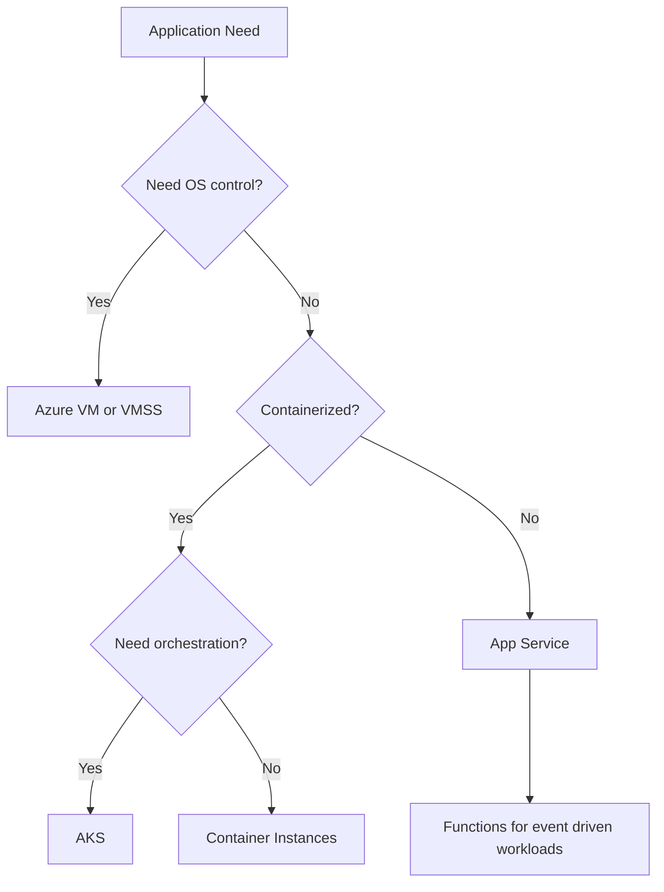
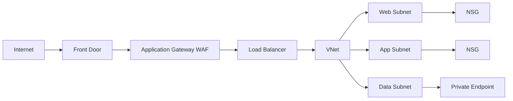
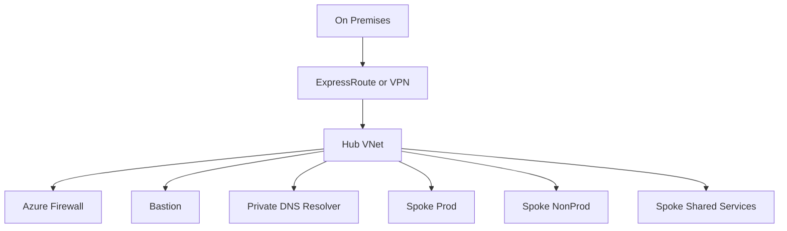

> **Screenshot Disclaimer:** Portal screenshots referenced in this guide are sourced from [Microsoft Learn](https://learn.microsoft.com/en-us/azure/) documentation. © Microsoft Corporation. All rights reserved. Used for educational reference only.

# 02 Compute and Networking Interview Q and A

This guide combines Azure compute and networking because many interview questions cross both domains. Compute choices affect network design, and network architecture often drives service selection.

## Study strategy

- First compare service purpose and operating model.
- Then compare network exposure, security, scaling, and cost.
- Finally practice troubleshooting questions that tie platform and network layers together.

## Compute decision map



## Networking building blocks



## Hub and spoke topology



## Compute Q and A

### Q: What are common Azure VM size families and when would you use them?

**Answer:**
Azure VM size families are optimized for different workload profiles. B-series is burstable, D-series is general purpose, E-series is memory optimized, F-series is compute optimized, and N-series provides GPU capability.

**Key Points:**
- B-series fits dev, test, and low steady-state workloads with occasional spikes.
- D-series is common for balanced application servers.
- E-series suits databases, caches, and memory-heavy apps.
- F-series is useful for CPU-intensive workloads.
- N-series targets AI, rendering, and graphics workloads.

**Example Scenario:**
"A lightweight jump box may run on B-series, while a memory-heavy reporting engine fits E-series."

**Follow-up Questions:**
- How do you right-size VMs?
- What metrics matter most when selecting a size?

### Q: How do burstable B-series VMs work?

**Answer:**
B-series VMs accrue CPU credits during low usage and consume those credits during bursts. They are cost-effective for workloads with low average utilization and occasional spikes.

**Key Points:**
- Good for small business apps, domain controllers, or lab systems.
- Poor fit for sustained high CPU workloads.
- Monitor credit balance to avoid throttling.

**Example Scenario:**
"A small internal wiki server with occasional daytime usage fits B-series well."

**Follow-up Questions:**
- What happens when credits run out?
- How do you detect CPU throttling?

### Q: What is the difference between D-series and E-series VMs?

**Answer:**
D-series offers a balanced CPU-to-memory ratio for general workloads, while E-series provides more memory per vCPU and is better for memory-intensive applications.

**Key Points:**
- D-series is common for app servers.
- E-series is common for in-memory apps and some databases.
- Always compare performance testing, not just memory ratio.

**Example Scenario:**
"A .NET API server may fit D-series, but an in-memory analytics component may need E-series."

**Follow-up Questions:**
- Which monitoring counters guide the choice?
- How do disk and network limits factor in?

### Q: When would you choose F-series or N-series?

**Answer:**
Choose F-series for high CPU performance needs such as build workers or scientific compute. Choose N-series when GPU acceleration is required for machine learning, rendering, or graphics-intensive workloads.

**Key Points:**
- F-series optimizes compute density.
- N-series costs more because GPU resources are expensive.
- Licensing and regional capacity may affect availability.

**Example Scenario:**
"A video rendering farm may require N-series, while a code compilation farm might use F-series."

**Follow-up Questions:**
- How do you handle regional GPU shortages?
- What are cost controls for GPU workloads?

### Q: What are the main VM storage options?

**Answer:**
Azure VMs commonly use managed disks for OS and data storage, with disk types like Standard HDD, Standard SSD, Premium SSD, and Ultra Disk based on performance needs.

**Key Points:**
- Premium SSD is common for production workloads.
- Ultra Disk supports very high IOPS and throughput.
- Managed disks simplify operations compared with unmanaged storage.

**Example Scenario:**
"A production SQL VM may use Premium SSD or Ultra Disk for transactional performance."

**Follow-up Questions:**
- How do you monitor disk bottlenecks?
- When is ephemeral OS disk useful?

### Q: What is the difference between Availability Sets and VM Scale Sets?

**Answer:**
Availability Sets improve resilience for a fixed number of VMs by spreading them across fault and update domains, while VM Scale Sets manage a group of identical VMs with scaling and orchestration features.

**Key Points:**
- Availability Sets are simpler and older.
- VMSS supports autoscale and uniform instance management.
- VMSS can also span Availability Zones.

**Example Scenario:**
"A stateless web tier needing autoscale should use VMSS rather than manually managed VMs in an Availability Set."

**Follow-up Questions:**
- Can VMSS use custom images?
- What workloads still fit Availability Sets?

### Q: When would you choose VM Scale Sets?

**Answer:**
Choose VM Scale Sets for large pools of similar VMs that need consistent configuration, autoscaling, rolling updates, and load-balanced traffic distribution.

**Key Points:**
- Great for stateless web or API tiers.
- Integrates with autoscale rules and load balancers.
- Supports orchestration for patching and updates.

**Example Scenario:**
"An e-commerce API tier scales out automatically during holiday traffic using VMSS and autoscale rules based on CPU and queue depth."

**Follow-up Questions:**
- How do rolling upgrades work in VMSS?
- How do you handle stateful workloads?

### Q: What is Azure App Service and when should you use it?

**Answer:**
Azure App Service is a managed platform for hosting web apps, APIs, and background apps without managing the underlying operating system and patching infrastructure.

**Key Points:**
- Supports .NET, Node.js, Java, Python, PHP, and containers.
- Includes deployment slots, autoscaling, and built-in integration with App Insights.
- Best for web workloads where platform abstraction is preferred.

**Example Scenario:**
"A line-of-business API is deployed to App Service because the team wants easy deployment slots and minimal VM management."

**Follow-up Questions:**
- What are App Service plans?
- How does App Service compare with AKS?

### Q: How do you compare App Service, AKS, and Azure Container Instances?

**Answer:**
App Service is best for managed web hosting, AKS is best for orchestrated container platforms at scale, and ACI is best for simple or short-lived container execution without cluster management.

**Key Points:**
- App Service is easiest for standard web apps.
- AKS offers the most flexibility and operational complexity.
- ACI is excellent for burst, job, or isolated container runs.

**Example Scenario:**
"A startup with a simple web API may choose App Service first. A platform team standardizing microservices across many services may move to AKS."

**Follow-up Questions:**
- What are the tradeoffs in cost and operations?
- When would Azure Container Apps fit better?

### Q: What is AKS and when is it a good choice?

**Answer:**
Azure Kubernetes Service is a managed Kubernetes platform for running containerized applications that need orchestration, service discovery, scaling, rolling deployments, and advanced platform patterns.

**Key Points:**
- Good for microservices and container platform standardization.
- Requires stronger operational maturity than App Service.
- Works well with GitOps, ACR, and managed identity.

**Example Scenario:**
"A company running many containerized services with blue-green releases and service mesh requirements chooses AKS."

**Follow-up Questions:**
- What are major AKS operational tasks?
- When is AKS too much complexity?

### Q: What are Azure Container Instances best suited for?

**Answer:**
Azure Container Instances are best for simple, isolated, or short-lived container workloads that do not need full orchestration.

**Key Points:**
- Fast to start.
- Good for event-driven batch jobs or ad hoc tasks.
- Not designed for complex microservice orchestration.

**Example Scenario:**
"A nightly ETL job can run as an ACI task triggered by automation without maintaining a cluster."

**Follow-up Questions:**
- How does ACI compare with Functions?
- What are ACI networking limitations?

### Q: What are Azure Functions and how do they work?

**Answer:**
Azure Functions is a serverless compute service that runs code in response to triggers such as HTTP requests, timers, queues, blobs, events, or service bus messages.

**Key Points:**
- Ideal for event-driven automation and lightweight APIs.
- Bindings simplify input and output integration.
- Consumption plans can scale automatically.

**Example Scenario:**
"A file uploaded to Blob Storage triggers a Function that validates metadata and publishes a message for downstream processing."

**Follow-up Questions:**
- What are bindings?
- What causes cold start?

### Q: What are triggers and bindings in Azure Functions?

**Answer:**
A trigger defines what starts the function, while bindings provide declarative ways to connect to input and output sources such as queues, blobs, Cosmos DB, or Event Hubs.

**Key Points:**
- One trigger per function.
- Multiple input and output bindings are possible.
- Reduces boilerplate code for integrations.

**Example Scenario:**
"An HTTP-triggered function reads a query parameter and writes an output message to a Service Bus queue using an output binding."

**Follow-up Questions:**
- When should you avoid too many bindings?
- How do you secure connection settings?

### Q: What is cold start in Azure Functions?

**Answer:**
Cold start is the delay experienced when a function app instance is not already warm and Azure must allocate resources before running the code.

**Key Points:**
- More noticeable in Consumption plan.
- Can be reduced with Premium plan, optimized startup, and careful dependencies.
- Important for latency-sensitive APIs.

**Example Scenario:**
"A customer-facing HTTP function with strict response targets may use Premium plan to avoid cold-start impact."

**Follow-up Questions:**
- What affects cold start duration?
- How do you measure it?

### Q: What is the difference between Custom Script Extension and cloud-init?

**Answer:**
Custom Script Extension runs scripts on Azure VMs after deployment using the Azure guest agent, while cloud-init is a Linux-native initialization system used during first boot to configure the machine.

**Key Points:**
- cloud-init is preferred for initial Linux VM provisioning.
- Custom Script Extension works for post-deployment tasks and both Windows and Linux scenarios.
- Overusing either for full configuration management can become fragile.

**Example Scenario:**
"A Linux VM uses cloud-init to install packages on first boot, while a later app patch uses Custom Script Extension."

**Follow-up Questions:**
- How do you troubleshoot extension failures?
- When should you use configuration management tools instead?

### Q: What VM troubleshooting tools should you know?

**Answer:**
Key VM troubleshooting tools include Boot Diagnostics, Serial Console, Run Command, VM instance view, Activity Log, Resource Health, and guest OS logs.

**Key Points:**
- Boot Diagnostics helps with startup problems.
- Serial Console helps when network access fails.
- Run Command enables in-guest command execution without direct login.

**Example Scenario:**
"If a VM is unreachable over RDP or SSH, use Boot Diagnostics and Serial Console before deciding whether the issue is network, OS, or extension-related."

**Follow-up Questions:**
- What permissions are needed for Serial Console?
- How do you use Run Command safely?

### Q: How do you use Boot Diagnostics?

**Answer:**
Boot Diagnostics captures console output and screenshots during startup, allowing you to inspect VM boot behavior even if remote access is unavailable.

**Key Points:**
- Useful for kernel panic, boot loop, and startup driver issues.
- Accessible from the VM blade in the portal.
- Can also store logs in a storage account for analysis.

**Example Scenario:**
"A Windows VM fails after patching. Boot Diagnostics shows startup repair messages that help narrow the root cause."

**Follow-up Questions:**
- What if Boot Diagnostics is disabled?
- How is it different from Serial Console?

### Q: What is Azure Bastion?

**Answer:**
Azure Bastion is a managed service that provides secure RDP and SSH access to VMs over TLS through the Azure portal without exposing public IP addresses on the target VMs.

**Key Points:**
- Reduces attack surface.
- Fits Zero Trust and locked-down subnet designs.
- Requires a dedicated `AzureBastionSubnet`.

**Example Scenario:**
"Production VMs in a private subnet are accessed by admins through Azure Bastion instead of public IP addresses."

**Follow-up Questions:**
- How does Bastion compare with a jump box?
- What are Bastion pricing considerations?

### Q: What is Azure Spot for compute operations strategy?

**Answer:**
Azure Spot is a cost optimization strategy for fault-tolerant workloads where eviction is acceptable, often combined with standard instances for baseline capacity.

**Key Points:**
- Works well for batch and CI jobs.
- Needs eviction-aware design.
- Capacity varies by region and time.

**Example Scenario:**
"A rendering farm runs 70 percent of nodes on Spot and keeps 30 percent standard instances for guaranteed baseline throughput."

**Follow-up Questions:**
- How would you queue work before eviction?
- What workloads must stay on standard instances?

## Networking Q and A

### Q: What is an Azure Virtual Network?

**Answer:**
A Virtual Network, or VNet, is the fundamental private networking boundary in Azure. It lets Azure resources communicate securely with each other, with the internet, and with on-premises networks.

**Key Points:**
- Similar to a logical private network in Azure.
- Contains one or more subnets.
- Supports routing, security, DNS, and connectivity services.

**Example Scenario:**
"A three-tier app uses one VNet with separate web, app, and data subnets to isolate traffic and apply targeted controls."

**Follow-up Questions:**
- How do address spaces work?
- Can resources in different VNets communicate?

### Q: What is a subnet and why is subnetting important?

**Answer:**
A subnet is a segmented IP range inside a VNet. Subnetting helps separate workloads, control traffic, assign policies, and reserve dedicated areas for services like Azure Firewall or Bastion.

**Key Points:**
- Improves organization and security segmentation.
- Supports route and NSG boundaries.
- Required for many managed services.

**Example Scenario:**
"A company places web servers in one subnet, application servers in another, and private endpoints in a dedicated subnet."

**Follow-up Questions:**
- Which services need their own subnet?
- How do subnet delegations work?

### Q: What is an NSG?

**Answer:**
A Network Security Group is a stateful packet filtering service that controls inbound and outbound traffic using allow and deny rules based on source, destination, port, and protocol.

**Key Points:**
- Can be applied at subnet or NIC level.
- Lower-numbered rules are evaluated first.
- Stateful behavior means return traffic is automatically allowed for established connections.

**Example Scenario:**
"Only HTTPS from Application Gateway is allowed to the web subnet, and only SQL traffic from the app subnet is allowed to the data tier."

**Follow-up Questions:**
- What are default NSG rules?
- How do NIC and subnet NSGs interact?

### Q: What is an Application Security Group?

**Answer:**
An Application Security Group, or ASG, lets you group VM network interfaces logically and reference that group in NSG rules instead of maintaining many IP addresses manually.

**Key Points:**
- Simplifies NSG rule management.
- Useful for dynamic application tiers.
- Works well in medium and large VM environments.

**Example Scenario:**
"An NSG rule allows the `asg-web` group to talk to the `asg-app` group on port 443 without hard-coding private IPs."

**Follow-up Questions:**
- Do ASGs work across VNets?
- How do ASGs help with automation?

### Q: How do you explain VNet, subnet, NSG, and ASG together?

**Answer:**
The VNet is the overall network, subnets divide it into segments, NSGs filter traffic at subnet or NIC boundaries, and ASGs let you write cleaner NSG rules based on application groupings.

**Key Points:**
- Think of VNet as the container.
- Subnets define segments.
- NSGs define traffic policy.
- ASGs simplify rule targeting.

**Example Scenario:**
"In a multi-tier app, the web subnet allows 443 inbound from an Application Gateway, while app subnet rules reference ASGs to permit only app-to-data traffic."

**Follow-up Questions:**
- When should you use subnet NSGs vs NIC NSGs?
- How do UDRs fit into this model?

### Q: What is VNet peering?

**Answer:**
VNet peering connects two Azure VNets over the Microsoft backbone so resources can communicate privately with low latency without using gateways.

**Key Points:**
- Can be regional or global depending on support.
- Traffic stays on Microsofts network.
- Peered VNets remain separate administrative boundaries.

**Example Scenario:**
"A shared services VNet is peered with multiple application VNets so workloads can use central DNS and monitoring services."

**Follow-up Questions:**
- What settings must be enabled for gateway transit?
- Why might peering still fail?

### Q: How do you compare VNet peering, VPN Gateway, and ExpressRoute?

**Answer:**
VNet peering connects Azure VNets privately, VPN Gateway connects Azure and other networks over encrypted internet tunnels, and ExpressRoute provides private dedicated connectivity through a network provider.

**Key Points:**
- Peering is simplest for Azure-to-Azure connectivity.
- VPN is cost-effective for many hybrid cases.
- ExpressRoute suits high-throughput, low-latency, or compliance-sensitive connectivity.

**Comparison Table:**

| Option | Best use case | Network path | Relative cost |
|---|---|---|---|
| VNet Peering | Azure VNet to Azure VNet | Microsoft backbone | Low to medium |
| VPN Gateway | On-premises to Azure over internet | Encrypted public internet | Medium |
| ExpressRoute | Private enterprise connectivity | Dedicated private circuit | High |

**Example Scenario:**
"A branch office may use site-to-site VPN initially, then move to ExpressRoute as throughput and reliability requirements grow."

**Follow-up Questions:**
- What is gateway transit?
- Can you combine ExpressRoute and VPN?

### Q: What is Azure Load Balancer?

**Answer:**
Azure Load Balancer is a Layer 4 service that distributes TCP and UDP traffic across healthy backend instances based on frontend IP, port, and protocol information.

**Key Points:**
- Works well for non-HTTP workloads and internal load balancing.
- Uses health probes to detect backend status.
- Comes in public and internal variants.

**Example Scenario:**
"A pair of NVAs behind an internal Load Balancer handle east-west traffic in a hub VNet."

**Follow-up Questions:**
- What is the difference between Standard and Basic Load Balancer?
- How do health probes work?

### Q: What is Azure Application Gateway?

**Answer:**
Azure Application Gateway is a Layer 7 web traffic load balancer that supports HTTP and HTTPS routing, path-based routing, TLS termination, session affinity, and optional Web Application Firewall.

**Key Points:**
- Understands HTTP headers and URLs.
- Supports WAF for web protection.
- Often used regionally in front of web applications.

**Example Scenario:**
"A web platform routes `/api` to one backend pool and `/app` to another using path-based rules on Application Gateway."

**Follow-up Questions:**
- What causes 502 errors?
- How does App Gateway differ from Front Door?

### Q: What is Azure Front Door?

**Answer:**
Azure Front Door is a global Layer 7 entry service for web applications that provides global load balancing, acceleration, TLS offload, health-based routing, and web application firewall capabilities at the edge.

**Key Points:**
- Best for global internet-facing applications.
- Can route users to the nearest healthy backend region.
- Adds caching and acceleration benefits.

**Example Scenario:**
"A multinational application deploys apps in Europe and the US, and Front Door routes users to the closest healthy region."

**Follow-up Questions:**
- When would you use Front Door with App Gateway?
- How does Front Door help with regional failover?

### Q: What is Azure Traffic Manager?

**Answer:**
Azure Traffic Manager is a DNS-based global traffic distribution service that directs clients to endpoints based on routing methods like priority, weighted, performance, geographic, or multi-value.

**Key Points:**
- Operates at DNS layer, not as a reverse proxy.
- Useful for non-HTTP and some cross-cloud or external endpoint scenarios.
- Failover depends on DNS behavior and client caching.

**Example Scenario:**
"A company uses Traffic Manager to route users to region-specific public endpoints hosted across multiple clouds."

**Follow-up Questions:**
- How does Traffic Manager differ from Front Door?
- What are DNS TTL considerations?

### Q: How do you compare Load Balancer, Application Gateway, Front Door, and Traffic Manager?

**Answer:**
Load Balancer is Layer 4 regional traffic distribution, Application Gateway is Layer 7 regional web routing, Front Door is Layer 7 global edge routing, and Traffic Manager is DNS-based global endpoint selection.

**Key Points:**
- Choose based on protocol layer and scope.
- Global web apps usually start with Front Door.
- Internal TCP workloads often use Load Balancer.

**Example Scenario:**
"A global web app may use Front Door globally, App Gateway regionally, and an internal Load Balancer for backend services."

**Follow-up Questions:**
- When is chaining these services justified?
- Which one provides WAF?

### Q: What is Azure DNS?

**Answer:**
Azure DNS hosts public DNS zones in Azure, while Azure Private DNS provides name resolution for private resources within and across linked VNets.

**Key Points:**
- Public zones resolve internet-facing names.
- Private zones resolve internal names like private endpoints.
- DNS design is critical for hybrid connectivity and Private Link.

**Example Scenario:**
"A storage account private endpoint uses a Private DNS zone so VMs resolve the storage FQDN to a private IP instead of the public endpoint."

**Follow-up Questions:**
- How do Private DNS zone links work?
- What breaks if DNS is not configured for private endpoints?

### Q: What is Network Watcher?

**Answer:**
Network Watcher is Azures network diagnostics service that provides tools such as IP flow verify, next hop, effective security rules, packet capture, connection troubleshoot, and topology views.

**Key Points:**
- Essential for network troubleshooting interviews.
- Helps identify route, NSG, and connectivity issues.
- Supports both operational and design validation.

**Example Scenario:**
"A VM cannot reach a database. IP flow verify shows NSG denial, and next hop confirms traffic is being forced to Azure Firewall."

**Follow-up Questions:**
- Which tool would you use first for NSG diagnosis?
- How does connection troubleshoot help?

### Q: What does IP flow verify do?

**Answer:**
IP flow verify checks whether a packet to or from a VM would be allowed or denied based on effective NSG rules and identifies the matching rule.

**Key Points:**
- Great for pinpointing NSG rule conflicts.
- Evaluates source, destination, port, and protocol.
- Faster than guessing from rule lists manually.

**Example Scenario:**
"A Linux VM cannot receive SSH. IP flow verify reveals an inbound deny rule at the subnet NSG."

**Follow-up Questions:**
- Does it test route tables too?
- What information do you need before using it?

### Q: What does Next Hop show?

**Answer:**
Next Hop shows where Azure will send traffic from a VM to a destination IP, helping diagnose routing issues involving system routes, user-defined routes, or virtual appliances.

**Key Points:**
- Useful for UDR and forced tunneling issues.
- Can reveal routes to internet, VNet, gateway, or appliance.
- Helps validate hub-and-spoke routing design.

**Example Scenario:**
"A VM cannot reach the internet because a UDR sends 0.0.0.0/0 to a firewall that has no outbound rule. Next Hop confirms the path."

**Follow-up Questions:**
- How do UDRs override system routes?
- What is a blackhole route?

### Q: What is the difference between Private Endpoints and Service Endpoints?

**Answer:**
Private Endpoints assign a private IP from your VNet to a supported Azure PaaS resource, while Service Endpoints extend your VNet identity to the Azure service over the Azure backbone without placing the service inside your IP space.

**Key Points:**
- Private Endpoints are more private and preferred for sensitive workloads.
- Service Endpoints are simpler but still expose the service publicly unless other controls are applied.
- Private DNS is commonly required for Private Endpoints.

**Example Scenario:**
"A highly regulated workload uses Private Endpoints for Azure SQL and Storage so traffic never uses the public endpoint."

**Follow-up Questions:**
- When are Service Endpoints still acceptable?
- How do NSGs interact with private endpoint subnets?

### Q: What is a User Defined Route?

**Answer:**
A User Defined Route, or UDR, is a custom route you apply to a subnet so traffic follows a chosen path such as a virtual appliance, virtual network gateway, or specific destination override.

**Key Points:**
- Used for forced tunneling and inspection patterns.
- Common in hub-and-spoke designs.
- Must be tested carefully to avoid asymmetric routing.

**Example Scenario:**
"An enterprise sends outbound internet traffic from spokes to a hub firewall using a default route UDR."

**Follow-up Questions:**
- What is forced tunneling?
- How do you avoid routing loops?

### Q: What is forced tunneling?

**Answer:**
Forced tunneling is a routing pattern where internet-bound traffic from workloads is directed through a central inspection point such as Azure Firewall, an NVA, or on-premises security stack instead of going directly out to the internet.

**Key Points:**
- Improves central security visibility and policy enforcement.
- Requires careful route and SNAT planning.
- Can break service dependencies if not designed correctly.

**Example Scenario:**
"All production spokes send default-route traffic to a hub Azure Firewall for egress filtering and logging."

**Follow-up Questions:**
- Which Azure services need special route exceptions?
- How do you troubleshoot broken outbound traffic after forced tunneling?

### Q: How do you compare Azure Firewall, NSG, and third-party NVAs?

**Answer:**
NSGs provide basic distributed packet filtering, Azure Firewall provides centralized managed firewall capabilities with application and network rules, and third-party NVAs provide specialized features but add operational overhead.

**Key Points:**
- NSGs are not a full firewall replacement.
- Azure Firewall is managed and integrates well with Azure routing and policy.
- NVAs may be needed for advanced vendor-specific controls.

**Example Scenario:**
"A regulated enterprise may use NSGs for local segmentation and Azure Firewall in the hub for central egress control, DNAT, and logging."

**Follow-up Questions:**
- When would you choose Azure Firewall Premium?
- What are NVA scaling considerations?

### Q: What is a hub-spoke topology and why is it common?

**Answer:**
A hub-spoke topology uses a central hub VNet for shared services such as firewalls, gateways, and DNS, while spoke VNets host workloads and peer back to the hub.

**Key Points:**
- Promotes central control and reuse.
- Scales well across many application teams.
- Common in landing zone architectures.

**Example Scenario:**
"A platform team places Azure Firewall, Bastion, and ExpressRoute in the hub and connects multiple application spokes for production and nonproduction."

**Follow-up Questions:**
- What are common hub bottlenecks?
- When might Virtual WAN be a better fit?

### Q: How do you troubleshoot NSG blocking issues?

**Answer:**
Start by validating the source and destination path, then check effective NSG rules, use IP flow verify, confirm whether the NSG is applied at subnet or NIC, and ensure return traffic is allowed in the expected stateful flow.

**Key Points:**
- Effective rules are better than reading one rule list in isolation.
- Remember multiple NSGs may apply.
- Also confirm route and host firewall settings.

**Example Scenario:**
"RDP is blocked despite an allow rule at NIC level because a subnet-level deny rule takes precedence in the effective result."

**Follow-up Questions:**
- Which CLI commands help most?
- How do host firewalls complicate diagnosis?

### Q: What portal navigation and screenshot references should you remember?

**Answer:**
Interviewers may appreciate practical familiarity with the portal. Know the major navigation paths and be able to reference Microsoft Learn screenshots when documenting or teaching.

**Key Points:**
- NSG rules: `Azure Portal` → `Network security groups` → select NSG → `Inbound security rules`.
- Effective rules: `Azure Portal` → `Virtual machine` → `Networking` → `Network settings`.
- Network Watcher tools: `Azure Portal` → `Network Watcher` → `IP flow verify`, `Next hop`, `Connection troubleshoot`.
- NSG flow screenshot reference base: `https://learn.microsoft.com/en-us/azure/virtual-network/media/`.

**Example Scenario:**
"In documentation, include the path to `Virtual machine` → `Networking` so an interviewer sees you know both CLI and portal workflows."

**Follow-up Questions:**
- Which screenshots are safe to embed from Microsoft Learn?
- How do you keep portal instructions current?

## Useful CLI commands

```bash
az vm list-skus --location eastus --resource-type virtualMachines --output table
az vm get-instance-view --resource-group myRG --name myVM --output json
az network nsg list --output table
az network watcher test-ip-flow --resource-group myRG --vm myVM --direction Inbound --protocol TCP --local 10.0.1.4:22 --remote 203.0.113.10:51515
az network watcher show-next-hop --resource-group myRG --vm myVM --source-ip 10.0.1.4 --dest-ip 8.8.8.8
az network vnet peering list --resource-group hub-rg --vnet-name hub-vnet --output table
```

Expected output:

- VM SKU listing shows available families and regional restrictions.
- Instance view returns provisioning state and power state.
- NSG listing shows names and associated resource groups.
- IP flow verify returns `Allow` or `Deny` with the matched rule.
- Next hop shows the effective route target.
- VNet peering list shows status like `Connected` or `Initiated`.

## Official Microsoft References

- [Azure virtual machines sizes overview](https://learn.microsoft.com/azure/virtual-machines/sizes/overview)
- [Azure virtual machine scale sets overview](https://learn.microsoft.com/azure/virtual-machine-scale-sets/overview)
- [App Service overview](https://learn.microsoft.com/azure/app-service/overview)
- [Azure Kubernetes Service documentation](https://learn.microsoft.com/azure/aks/)
- [Azure Functions overview](https://learn.microsoft.com/azure/azure-functions/functions-overview)
- [Virtual Network documentation](https://learn.microsoft.com/azure/virtual-network/)
- [Network security groups overview](https://learn.microsoft.com/azure/virtual-network/network-security-groups-overview)
- [Private Endpoint overview](https://learn.microsoft.com/azure/private-link/private-endpoint-overview)
- [Azure Load Balancer documentation](https://learn.microsoft.com/azure/load-balancer/load-balancer-overview)
- [Application Gateway documentation](https://learn.microsoft.com/azure/application-gateway/overview)
- [Azure Front Door documentation](https://learn.microsoft.com/azure/frontdoor/standard-premium/overview)
- [Network Watcher documentation](https://learn.microsoft.com/azure/network-watcher/)
