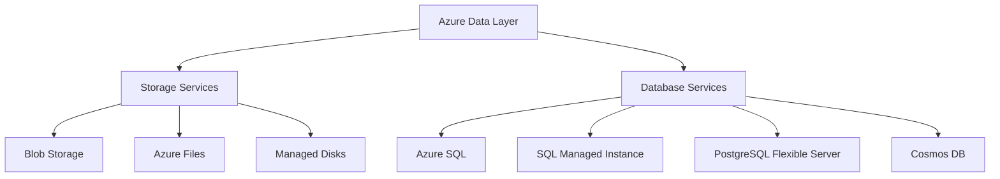
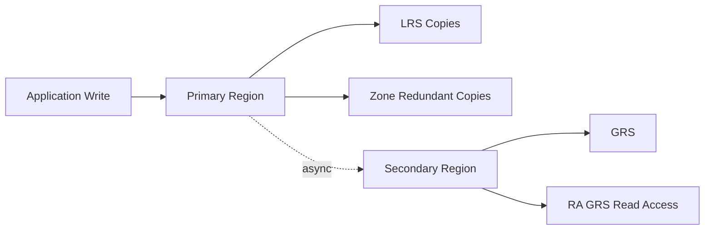

> **Screenshot Disclaimer:** Portal screenshots referenced in this guide are sourced from [Microsoft Learn](https://learn.microsoft.com/en-us/azure/) documentation. © Microsoft Corporation. All rights reserved. Used for educational reference only.

# 03 Storage and Database Interview Q and A

Storage and database questions test whether you understand durability, performance, security, and data service tradeoffs. Strong answers explain both technical differences and business impact.

## Data services overview



## Redundancy and continuity map



## Storage Q and A

### Q: What are Azure storage account types?

**Answer:**
Azure storage accounts provide the namespace and billing boundary for storage services. Common account types include general-purpose v2, premium block blob, premium file shares, and premium page blob for specialized workloads.

**Key Points:**
- General-purpose v2 is the default recommendation for most workloads.
- Premium options target predictable high-performance scenarios.
- Features like hierarchical namespace, SFTP, and NFS depend on account type and region.

**Example Scenario:**
"A modern application storing blobs, queues, and tables typically uses a GPv2 account, while a high-throughput file workload may need Premium Files."

**Follow-up Questions:**
- What is the difference between GPv1 and GPv2?
- Which features require Data Lake Gen2?

### Q: What do LRS, ZRS, GRS, RA-GRS, and GZRS mean?

**Answer:**
These are redundancy models for Azure Storage. LRS keeps multiple copies in one datacenter, ZRS spreads copies across zones in one region, GRS replicates asynchronously to another region, RA-GRS adds read access to the secondary region, and GZRS combines zone redundancy in the primary region with geo-replication to a secondary region.

**Key Points:**
- Higher resilience usually means higher cost.
- Geo-replication is asynchronous, so RPO is not zero.
- Availability and durability requirements should drive the choice.

**Example Scenario:**
"A compliance archive may use GZRS for strong durability and regional resilience, while a local scratch workload may use LRS to save money."

**Follow-up Questions:**
- When is ZRS better than GRS?
- What is the failover behavior for GRS accounts?

### Q: How do you choose between LRS and ZRS?

**Answer:**
Choose LRS for lower-cost workloads where single-datacenter durability is enough, and choose ZRS when you need resilience against zonal failure within a region and the service supports it.

**Key Points:**
- ZRS improves regional high availability.
- LRS is often sufficient for noncritical or replicated application data.
- Service support and regional availability matter.

**Example Scenario:**
"A production application needing strong in-region resilience may use ZRS for storage backing its web content."

**Follow-up Questions:**
- Does ZRS replace cross-region DR?
- Which storage services support ZRS?

### Q: What are blob storage access tiers?

**Answer:**
Blob Storage access tiers are Hot, Cool, Cold, and Archive. They optimize cost based on how frequently data is accessed and how quickly it must be retrieved.

**Key Points:**
- Hot is for frequent access.
- Cool is for infrequent access with lower storage cost but higher access charges.
- Cold is for rarely accessed data with longer minimum retention.
- Archive has the lowest storage cost but requires rehydration before access.

**Example Scenario:**
"Recent logs stay in Hot tier for analytics, monthly reports move to Cool, and long-term compliance records move to Archive."

**Follow-up Questions:**
- What are rehydration implications?
- How do lifecycle rules help with tiering?

### Q: What are the cost implications of blob tiers?

**Answer:**
Hot tier has higher storage cost but lower access cost, while Cool, Cold, and Archive progressively lower storage cost and generally increase access cost, retrieval latency, and minimum retention expectations.

**Key Points:**
- Cost optimization depends on access pattern, not just storage size.
- Archive retrieval can take hours.
- Frequent reads from Cool or Archive can become expensive.

**Example Scenario:**
"Putting active application media in Cool tier would reduce storage price but increase total monthly cost because users access it continuously."

**Follow-up Questions:**
- How do early deletion charges work?
- Which monitoring metrics reveal wrong tier choices?

### Q: When do you use Azure Files vs Blob vs Managed Disks?

**Answer:**
Use Azure Files for shared file shares over SMB or NFS, Blob for object storage and unstructured data, and Managed Disks for VM-attached block storage.

**Key Points:**
- Azure Files supports lift-and-shift file share use cases.
- Blob is ideal for backups, media, logs, and data lake patterns.
- Managed Disks are required for VM OS and data disks.

**Example Scenario:**
"A legacy application expecting a network share uses Azure Files, while application uploads land in Blob Storage and database VMs use managed disks."

**Follow-up Questions:**
- When is Azure NetApp Files a better fit?
- Can Azure Files integrate with AD authentication?

### Q: What is Azure Data Lake Storage Gen2?

**Answer:**
Azure Data Lake Storage Gen2 is Blob Storage with hierarchical namespace enabled, adding file-system semantics that support analytics workloads and fine-grained directory-level operations.

**Key Points:**
- Optimized for big data and analytics tools.
- Works with Hadoop-compatible workloads.
- Useful for data lake architecture with folders and ACLs.

**Example Scenario:**
"A data engineering team stores curated parquet data in ADLS Gen2 for downstream processing by Synapse and Databricks."

**Follow-up Questions:**
- What changes when hierarchical namespace is enabled?
- How do ACLs differ from RBAC?

### Q: What is the difference between SAS tokens, RBAC, and access keys?

**Answer:**
Access keys provide broad account-level access, SAS tokens delegate limited permissions for a limited time, and RBAC uses Azure identities and role assignments to authorize access through Microsoft Entra.

**Key Points:**
- RBAC is best for identity-based enterprise access.
- SAS is good for time-bound delegated access.
- Access keys are powerful and should be tightly controlled or avoided when possible.

**Example Scenario:**
"A partner uploads files for one week using a write-only SAS token instead of receiving the storage account key."

**Follow-up Questions:**
- What is a user delegation SAS?
- How do you rotate access keys safely?

### Q: When should you avoid storage account access keys?

**Answer:**
Avoid access keys when identity-based access can meet the requirement, because access keys grant broad authority and are harder to audit and rotate than role-based access.

**Key Points:**
- Keys can bypass granular least-privilege controls.
- Shared secrets are operationally risky.
- Microsoft increasingly recommends identity-first patterns.

**Example Scenario:**
"An application running on App Service uses managed identity to access blobs instead of storing an account key in configuration."

**Follow-up Questions:**
- How do you migrate from key-based to identity-based access?
- What services still require keys in edge cases?

### Q: What is AzCopy and when do you use it?

**Answer:**
AzCopy is a command-line data transfer utility optimized for copying data to, from, and between Azure Storage services.

**Key Points:**
- Efficient for bulk transfers and automation.
- Supports resume and parallel transfer features.
- Common for migration and large upload jobs.

**Example Scenario:**
"A team migrates terabytes of media files to Blob Storage using AzCopy and a SAS token for secure bulk upload."

**Follow-up Questions:**
- How does AzCopy compare with Storage Explorer?
- What options help optimize large transfers?

### Q: How do you compare AzCopy, Storage Explorer, and portal upload?

**Answer:**
AzCopy is best for automated and bulk transfers, Storage Explorer is best for interactive management and ad hoc operations, and portal upload is best for small manual tasks or demos.

**Key Points:**
- Portal is least suited for large-scale movement.
- Storage Explorer gives a GUI for administrators.
- AzCopy is typically fastest and most scriptable.

**Example Scenario:**
"An admin manually checks one blob using the portal, browses folders in Storage Explorer, and uses AzCopy for the actual migration."

**Follow-up Questions:**
- Which tool is best for CI automation?
- How do you secure these transfers?

### Q: What are lifecycle management policies?

**Answer:**
Lifecycle management policies automatically transition or delete blobs based on age, access time, or other conditions to optimize cost and retention.

**Key Points:**
- Commonly used to move old data from Hot to Cool or Archive.
- Helps enforce retention and cleanup rules.
- Must align with recovery and compliance requirements.

**Example Scenario:**
"Application logs older than 30 days move to Cool tier, then to Archive after 180 days, and are deleted after two years."

**Follow-up Questions:**
- How do you test lifecycle policies safely?
- What happens to snapshots and versions?

### Q: What is immutable storage and WORM?

**Answer:**
Immutable storage uses Write Once Read Many controls to prevent modification or deletion of data for a defined retention period or under legal hold, supporting compliance and ransomware resilience.

**Key Points:**
- Important for regulated industries.
- Prevents accidental or malicious tampering.
- Must be planned carefully because it restricts cleanup.

**Example Scenario:**
"A financial services firm uses immutable blob storage for audit records to satisfy retention requirements."

**Follow-up Questions:**
- What is the difference between time-based retention and legal hold?
- How does immutable storage affect operations?

### Q: Why use private endpoints for storage?

**Answer:**
Private endpoints place a private IP for the storage service into your VNet so clients access it privately without traversing the public internet.

**Key Points:**
- Reduces public exposure.
- Pairs well with disabling public network access.
- Requires proper DNS design using Private DNS zones.

**Example Scenario:**
"A production app accesses Blob Storage only through a private endpoint from its application subnet, and the public endpoint is disabled."

**Follow-up Questions:**
- What DNS records are needed?
- How does this differ from service endpoints?

### Q: What is blob versioning and soft delete?

**Answer:**
Blob versioning keeps previous versions of objects, while soft delete allows recovery of deleted blobs or containers for a retention period.

**Key Points:**
- Helps recover from accidental deletion or overwrite.
- Supports ransomware recovery patterns.
- Can increase storage cost over time.

**Example Scenario:**
"After an application bug overwrites images, the team restores a prior blob version instead of rebuilding the data manually."

**Follow-up Questions:**
- How do versioning and lifecycle policies interact?
- When should container soft delete be enabled?

### Q: What is Azure Backup vs storage replication?

**Answer:**
Storage replication provides durability and availability of the storage platform, while backup preserves recoverable point-in-time copies of data for restoration after deletion, corruption, or logical error.

**Key Points:**
- Replication is not the same as backup.
- Backup is needed for accidental deletion and corruption recovery.
- Interviewers like hearing both durability and recoverability.

**Example Scenario:**
"GRS will replicate deleted data states too, so a backup policy is still required for true recovery."

**Follow-up Questions:**
- Why is geo-replication not enough?
- What workloads need both backup and replication?

## Database Q and A

### Q: How do you compare Azure SQL Database, SQL Managed Instance, and SQL Server on Azure VM?

**Answer:**
Azure SQL Database is a fully managed PaaS database for modern applications, SQL Managed Instance offers broader SQL Server compatibility with near-instance features in a managed model, and SQL Server on Azure VM provides full OS and SQL Server control in an IaaS model.

**Comparison Table:**

| Option | Best fit | Management model | Key tradeoff |
|---|---|---|---|
| Azure SQL Database | Cloud-native apps | Fully managed PaaS | Less instance-level feature parity |
| SQL Managed Instance | Lift-and-shift with high compatibility | Managed PaaS | More expensive and network requirements |
| SQL on Azure VM | Full control or legacy dependencies | IaaS | Highest operational overhead |

**Example Scenario:**
"A vendor app needing SQL Agent and cross-database features may fit SQL MI, while a new SaaS application may fit Azure SQL Database."

**Follow-up Questions:**
- Which SQL Server features push you toward MI or VM?
- How do patching responsibilities differ?

### Q: When should you choose Azure SQL Database?

**Answer:**
Choose Azure SQL Database for modern applications that want relational database capabilities with minimal infrastructure management, built-in HA, backups, and scaling options.

**Key Points:**
- Great for cloud-native design.
- Reduces patching and maintenance burden.
- Works well with serverless and elastic pools in some patterns.

**Example Scenario:**
"A SaaS API backend chooses Azure SQL Database because the team wants automatic backups, patching, and easy scaling."

**Follow-up Questions:**
- What is serverless SQL Database?
- When would elastic pools help?

### Q: When is SQL Managed Instance the best fit?

**Answer:**
SQL Managed Instance is best when you need broad SQL Server compatibility such as SQL Agent, linked server dependencies, or easier lift-and-shift from on-premises environments while still using a managed service.

**Key Points:**
- Strong fit for migrations.
- Runs in a dedicated VNet context.
- Helps reduce refactoring effort.

**Example Scenario:**
"A company moving many legacy databases with SQL Server Agent jobs chooses SQL MI to minimize application change."

**Follow-up Questions:**
- What are networking requirements for MI?
- How do failover groups work with MI?

### Q: When would you still choose SQL Server on Azure VM?

**Answer:**
Choose SQL on Azure VM when you need full OS-level control, unsupported features in PaaS, third-party agents, or highly customized SQL Server configurations.

**Key Points:**
- Highest flexibility.
- Highest operational burden.
- Often used for legacy dependencies or vendor constraints.

**Example Scenario:**
"A third-party product requiring OS-level customization and custom SQL extensions stays on SQL Server in an Azure VM."

**Follow-up Questions:**
- What are the backup and patching responsibilities?
- How would you design HA for SQL on VMs?

### Q: What is Cosmos DB and why is it different?

**Answer:**
Azure Cosmos DB is a globally distributed, multi-model NoSQL database service with tunable consistency, low-latency global reads and writes, and automatic partitioning.

**Key Points:**
- Supports document, key-value, graph, and some compatible APIs.
- Designed for planet-scale, low-latency applications.
- Requires careful partition-key planning.

**Example Scenario:**
"A globally distributed e-commerce platform uses Cosmos DB to serve user carts with low latency in multiple regions."

**Follow-up Questions:**
- What is RU/s?
- Why is partition key selection critical?

### Q: What are the Cosmos DB consistency levels?

**Answer:**
Cosmos DB provides Strong, Bounded Staleness, Session, Consistent Prefix, and Eventual consistency, letting you balance correctness and latency.

**Key Points:**
- Strong gives highest consistency with more latency tradeoff.
- Session is commonly used for user-centric applications.
- Eventual maximizes availability and performance but allows more staleness.

**Example Scenario:**
"A user profile service often uses Session consistency so a user sees their own writes quickly without paying for Strong consistency everywhere."

**Follow-up Questions:**
- When is Strong consistency required?
- How does consistency affect RU consumption and latency?

### Q: How do you explain the tradeoff from Strong to Eventual consistency?

**Answer:**
As you move from Strong toward Eventual consistency, you typically gain lower latency and better global performance flexibility, but you accept more potential read staleness and weaker ordering guarantees.

**Key Points:**
- Strong maximizes correctness.
- Eventual maximizes distribution flexibility.
- Session is a practical middle ground for many apps.

**Example Scenario:**
"An analytics feed can tolerate Eventual consistency, but payment state tracking may require stronger guarantees."

**Follow-up Questions:**
- Which workloads match Session or Bounded Staleness?
- How do you justify the chosen consistency in an interview?

### Q: What is Azure Database for PostgreSQL Flexible Server?

**Answer:**
Azure Database for PostgreSQL Flexible Server is a managed PostgreSQL service offering automated management with configurable maintenance, high availability options, backups, and private networking support.

**Key Points:**
- Good for open-source relational workloads.
- Supports zone-redundant HA in supported regions.
- Offers more control than older single server models.

**Example Scenario:**
"A microservices team using PostgreSQL chooses Flexible Server for private networking, managed backups, and reduced operational overhead."

**Follow-up Questions:**
- How does Flexible Server differ from Single Server?
- What are HA options?

### Q: What about Azure Database for MySQL Flexible Server?

**Answer:**
Azure Database for MySQL Flexible Server is the managed MySQL equivalent for applications that need open-source relational database capability with Azure-managed operations.

**Key Points:**
- Supports backup, HA, and private access patterns.
- Good for web and application workloads using MySQL.
- Check engine version support and feature parity during migration.

**Example Scenario:**
"A PHP application stack moves from self-managed MySQL to Flexible Server to reduce patching effort and improve backup consistency."

**Follow-up Questions:**
- What migration tools are available?
- How do maintenance windows work?

### Q: What is DTU vs vCore pricing in Azure SQL?

**Answer:**
DTU is a bundled performance model combining compute, memory, and IO into one unit, while vCore provides a more transparent model based on CPU, memory, and storage characteristics.

**Key Points:**
- DTU is simpler for small or legacy sizing decisions.
- vCore is more flexible and better aligned with on-prem planning.
- vCore often fits enterprise performance planning and reservations.

**Example Scenario:**
"A team migrating from on-prem SQL often prefers vCore because it maps more clearly to CPU and memory expectations."

**Follow-up Questions:**
- When would you still see DTU in the field?
- How do reservations work for vCore models?

### Q: What are read replicas and when are they useful?

**Answer:**
Read replicas are secondary database instances used to offload read traffic, analytics, or reporting from the primary instance.

**Key Points:**
- Improve scale for read-heavy workloads.
- Replica lag must be understood.
- Use cases vary by service.

**Example Scenario:**
"A reporting dashboard reads from a replica instead of impacting the primary transactional database."

**Follow-up Questions:**
- Are replicas synchronous or asynchronous?
- What workloads should avoid replicas for read-after-write consistency?

### Q: What is active geo-replication and failover groups in Azure SQL?

**Answer:**
Active geo-replication creates readable secondary databases in other regions, while failover groups add a management layer for groups of databases and coordinated failover with listener endpoints.

**Key Points:**
- Useful for DR and global read scaling.
- Failover groups simplify application connection patterns.
- Replication is asynchronous.

**Example Scenario:**
"A mission-critical SaaS platform uses Azure SQL failover groups so applications can reconnect to a listener after regional failover."

**Follow-up Questions:**
- What is the expected RPO?
- How do you test failover?

### Q: What is Azure Database Migration Service and when do you use it?

**Answer:**
Azure Database Migration Service, or DMS, helps migrate databases from on-premises or other cloud environments into Azure database platforms with online or offline migration options depending on source and target.

**Key Points:**
- Common in SQL, PostgreSQL, and MySQL migrations.
- Supports assessment-driven migration plans.
- Often used with Azure Migrate for discovery and readiness analysis.

**Example Scenario:**
"A company assesses SQL workloads with Azure Migrate, chooses SQL MI for compatibility, and uses DMS for cutover with minimal downtime."

**Follow-up Questions:**
- What prechecks should be run before migration?
- How do you plan rollback?

### Q: How does Azure Migrate complement DMS?

**Answer:**
Azure Migrate helps discover, assess, and plan migration readiness, while DMS executes the actual database movement for supported scenarios.

**Key Points:**
- Azure Migrate informs target service choice.
- DMS performs migration execution.
- Both belong in a structured migration workflow.

**Example Scenario:**
"Azure Migrate reveals deprecated SQL features, leading the team to choose SQL on VM rather than Azure SQL Database for the first phase."

**Follow-up Questions:**
- What outputs from assessment matter most?
- How do you validate performance after migration?

### Q: How do you troubleshoot Azure SQL connection timeouts?

**Answer:**
Check firewall rules, private endpoint DNS resolution, NSG and route paths, server status, connection string correctness, TLS requirements, and whether the client is using the right fully qualified domain name.

**Key Points:**
- Connectivity issues are often network or name-resolution related.
- PaaS services still require control over firewall and private DNS.
- Monitoring should include failed connection metrics and diagnostic logs.

**Example Scenario:**
"An application in a private subnet times out because its Private DNS zone is missing a virtual network link, so the SQL FQDN resolves to the public endpoint."

**Follow-up Questions:**
- How do you validate private DNS resolution?
- What logs help isolate client vs server issues?

### Q: What connection troubleshooting steps apply to PostgreSQL and MySQL Flexible Server?

**Answer:**
Validate server state, firewall and private access configuration, DNS resolution, TLS settings, VNet routing, client driver support, and server maintenance status.

**Key Points:**
- Private networking often introduces DNS issues.
- Incorrect TLS modes can cause handshake failures.
- Metrics and server logs help identify saturation.

**Example Scenario:**
"A PostgreSQL app fails after moving to private access because the application subnet cannot resolve the private FQDN through the linked zone."

**Follow-up Questions:**
- What is the role of delegated subnets?
- How do you check server parameter mismatches?

### Q: How would you explain backup and restore in Azure database interviews?

**Answer:**
I explain that managed Azure database services provide automated backups, retention settings, and point-in-time restore, while DR features like geo-replication or failover groups address larger outage scenarios.

**Key Points:**
- Backup and HA solve different problems.
- Retention affects compliance and recovery windows.
- Restore testing is as important as backup configuration.

**Example Scenario:**
"A developer accidentally deletes critical rows. Point-in-time restore recovers to a new database, while geo-replication remains a DR feature for regional outages."

**Follow-up Questions:**
- Why is PITR different from geo-replication?
- How often should restores be tested?

## CLI examples

```bash
az storage account list --output table
az storage account show --name mystorageacct --resource-group myRG --query "{sku:sku.name, kind:kind, publicNetworkAccess:publicNetworkAccess}"
az storage blob service-properties show --account-name mystorageacct --output json
az sql server list --output table
az sql db list --resource-group myRG --server myserver --output table
az postgres flexible-server list --output table
```

Expected output:

- Storage account list shows account names, kinds, and locations.
- Storage account show returns redundancy SKU and network access state.
- Blob service properties return versioning and delete retention settings.
- SQL and PostgreSQL listings show database names, sku names, and status.

## Portal navigation and screenshot notes

- `Azure Portal` → `Storage accounts` → `Data management` → `Lifecycle management`
- `Azure Portal` → `Storage accounts` → `Networking` → `Private endpoint connections`
- `Azure Portal` → `Storage accounts` → `Data protection`
- `Azure Portal` → `SQL servers` → `Networking`
- `Azure Portal` → `Azure Database for PostgreSQL flexible servers` → `Connection security`
- Use Microsoft Learn images where available for storage redundancy, private endpoint, and SQL networking concepts.

## Official Microsoft References

- [Azure Storage documentation](https://learn.microsoft.com/azure/storage/)
- [Storage redundancy](https://learn.microsoft.com/azure/storage/common/storage-redundancy)
- [Blob access tiers](https://learn.microsoft.com/azure/storage/blobs/access-tiers-overview)
- [Azure Files documentation](https://learn.microsoft.com/azure/storage/files/)
- [Shared access signatures](https://learn.microsoft.com/azure/storage/common/storage-sas-overview)
- [Immutable storage for Azure Blob Storage](https://learn.microsoft.com/azure/storage/blobs/immutable-storage-overview)
- [Azure SQL documentation](https://learn.microsoft.com/azure/azure-sql/)
- [Azure Cosmos DB consistency levels](https://learn.microsoft.com/azure/cosmos-db/consistency-levels)
- [Azure Database for PostgreSQL Flexible Server](https://learn.microsoft.com/azure/postgresql/flexible-server/)
- [Azure Database Migration Service](https://learn.microsoft.com/azure/dms/)
- [Azure Migrate documentation](https://learn.microsoft.com/azure/migrate/)
