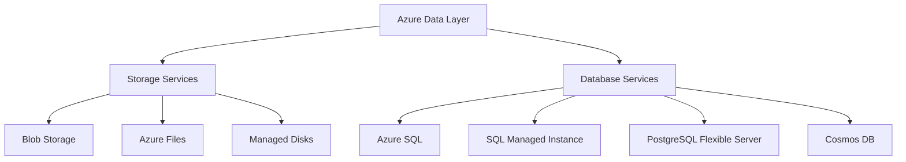
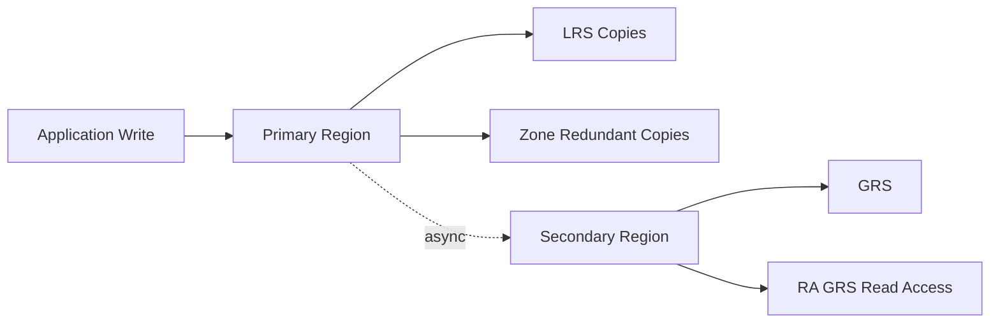

> **Screenshot Disclaimer:** Portal screenshots referenced in this guide are sourced from [Microsoft Learn](https://learn.microsoft.com/en-us/azure/) documentation. © Microsoft Corporation. All rights reserved. Used for educational reference only.

# 03 Storage and Database Interview Q and A

Storage and database questions test whether you understand durability, performance, security, and data service tradeoffs. Strong answers explain both technical differences and business impact.

## Data services overview



## Redundancy and continuity map



## Storage Q and A

### Q: What are Azure storage account types?

**Answer:**
Azure storage accounts provide the namespace and billing boundary for storage services. Common account types include general-purpose v2, premium block blob, premium file shares, and premium page blob for specialized workloads.

**Key Points:**
- General-purpose v2 is the default recommendation for most workloads.
- Premium options target predictable high-performance scenarios.
- Features like hierarchical namespace, SFTP, and NFS depend on account type and region.

**Example Scenario:**
"A modern application storing blobs, queues, and tables typically uses a GPv2 account, while a high-throughput file workload may need Premium Files."

**Follow-up Questions:**

**Q: What is the difference between GPv1 and GPv2?**
GPv2 is the modern Azure Storage account type and supports the latest capabilities such as access tiers, lifecycle management, and most new Blob and Azure Files features. GPv1 is an older general-purpose model with fewer storage features and less flexible pricing. In practice, teams usually upgrade legacy GPv1 accounts to GPv2 before enabling policies like automatic Hot-to-Cool tiering.

**Q: Which features require Data Lake Gen2?**
Features tied to Azure Data Lake Storage Gen2 require hierarchical namespace to be enabled on the storage account. That includes directory-level operations, POSIX-style ACLs, and the dfs endpoint used by analytics tools such as Azure Databricks and Synapse. A common example is a parquet-based data lake where engineers need folder ACLs and atomic directory renames.

### Q: What do LRS, ZRS, GRS, RA-GRS, and GZRS mean?

**Answer:**
These are redundancy models for Azure Storage. LRS keeps multiple copies in one datacenter, ZRS spreads copies across zones in one region, GRS replicates asynchronously to another region, RA-GRS adds read access to the secondary region, and GZRS combines zone redundancy in the primary region with geo-replication to a secondary region.

**Key Points:**
- Higher resilience usually means higher cost.
- Geo-replication is asynchronous, so RPO is not zero.
- Availability and durability requirements should drive the choice.

**Example Scenario:**
"A compliance archive may use GZRS for strong durability and regional resilience, while a local scratch workload may use LRS to save money."

**Follow-up Questions:**

**Q: When is ZRS better than GRS?**
ZRS is better when the main requirement is high availability inside one Azure region, because it keeps data synchronously replicated across availability zones. It avoids the write lag and failover complexity of cross-region replication while still protecting against a zonal outage. For example, a production web app serving content from Blob Storage may prefer ZRS so the app stays available during a single-zone failure.

**Q: What is the failover behavior for GRS accounts?**
GRS replicates data asynchronously to the paired region, so the secondary copy is for disaster recovery rather than immediate active use. During a failover, the secondary region is promoted to become the new primary endpoint, but recent writes may be lost because replication is not synchronous. In an interview, I would mention RA-GRS if read access to the secondary region is also needed before failover.

### Q: How do you choose between LRS and ZRS?

**Answer:**
Choose LRS for lower-cost workloads where single-datacenter durability is enough, and choose ZRS when you need resilience against zonal failure within a region and the service supports it.

**Key Points:**
- ZRS improves regional high availability.
- LRS is often sufficient for noncritical or replicated application data.
- Service support and regional availability matter.

**Example Scenario:**
"A production application needing strong in-region resilience may use ZRS for storage backing its web content."

**Follow-up Questions:**

**Q: Does ZRS replace cross-region DR?**
No, ZRS only protects within a single Azure region by spreading copies across availability zones. If the entire region is unavailable, you still need a cross-region strategy such as GRS or GZRS, plus application failover planning. A common pattern is ZRS for in-region resilience and backups or geo-replication for regional disaster recovery.

**Q: Which storage services support ZRS?**
ZRS support depends on the Azure service and region, so I always verify the current support matrix before designing. Blob Storage in GPv2 accounts commonly supports ZRS, Azure Files supports it in selected regions, and some managed disk SKUs such as Premium SSD or Standard SSD also offer zone-redundant options. In practice, I would confirm both the workload type and target region before promising ZRS.

### Q: What are blob storage access tiers?

**Answer:**
Blob Storage access tiers are Hot, Cool, Cold, and Archive. They optimize cost based on how frequently data is accessed and how quickly it must be retrieved.

**Key Points:**
- Hot is for frequent access.
- Cool is for infrequent access with lower storage cost but higher access charges.
- Cold is for rarely accessed data with longer minimum retention.
- Archive has the lowest storage cost but requires rehydration before access.

**Example Scenario:**
"Recent logs stay in Hot tier for analytics, monthly reports move to Cool, and long-term compliance records move to Archive."

**Follow-up Questions:**

**Q: What are rehydration implications?**
Archive blobs cannot be read immediately, so they must be rehydrated back to Hot or Cool before use. That process can take hours depending on the priority selected, and it also adds retrieval cost. A practical example is a compliance team restoring archived documents overnight instead of expecting instant download during business hours.

**Q: How do lifecycle rules help with tiering?**
Lifecycle management rules automatically move blobs between Hot, Cool, Cold, and Archive tiers based on age, last access time, or blob index tags. This reduces manual work and keeps storage cost aligned with actual usage patterns. For example, an Azure Storage policy can keep logs in Hot for 30 days, move them to Cool for 90 days, and then archive them for long-term retention.

### Q: What are the cost implications of blob tiers?

**Answer:**
Hot tier has higher storage cost but lower access cost, while Cool, Cold, and Archive progressively lower storage cost and generally increase access cost, retrieval latency, and minimum retention expectations.

**Key Points:**
- Cost optimization depends on access pattern, not just storage size.
- Archive retrieval can take hours.
- Frequent reads from Cool or Archive can become expensive.

**Example Scenario:**
"Putting active application media in Cool tier would reduce storage price but increase total monthly cost because users access it continuously."

**Follow-up Questions:**

**Q: How do early deletion charges work?**
Azure charges a minimum retention period for colder tiers, so deleting or moving data too soon can trigger early deletion fees. For example, Cool typically assumes 30 days, Cold 90 days, and Archive 180 days, so removing a blob earlier means you still pay for the unused portion. That is why short-lived data usually should not be pushed into Archive just to reduce storage cost.

**Q: Which monitoring metrics reveal wrong tier choices?**
I look at Azure Monitor metrics such as transaction count, egress, retrieval latency, and capacity by tier to see whether access patterns match the selected tier. If Cool or Archive data shows frequent reads, high transaction charges, or repeated rehydration, the tier choice is probably too cold. Storage Insights is useful here because it shows when a supposedly archival dataset is behaving like active content.

### Q: When do you use Azure Files vs Blob vs Managed Disks?

**Answer:**
Use Azure Files for shared file shares over SMB or NFS, Blob for object storage and unstructured data, and Managed Disks for VM-attached block storage.

**Key Points:**
- Azure Files supports lift-and-shift file share use cases.
- Blob is ideal for backups, media, logs, and data lake patterns.
- Managed Disks are required for VM OS and data disks.

**Example Scenario:**
"A legacy application expecting a network share uses Azure Files, while application uploads land in Blob Storage and database VMs use managed disks."

**Follow-up Questions:**

**Q: When is Azure NetApp Files a better fit?**
Azure NetApp Files is a better fit when the workload needs very high throughput, low latency, or advanced enterprise NFS and SMB capabilities that go beyond typical Azure Files use cases. It is common for SAP HANA, HPC, EDA, or large-scale lift-and-shift applications with strict performance targets. In an interview, I would say Azure Files is simpler and cheaper for standard shares, while Azure NetApp Files is for premium performance-sensitive workloads.

**Q: Can Azure Files integrate with AD authentication?**
Yes, Azure Files can use identity-based authentication with AD DS, Microsoft Entra Domain Services, and Microsoft Entra Kerberos for supported scenarios. That allows users to mount SMB shares with their enterprise identities instead of embedding storage keys. A practical example is a hybrid file-share migration where Windows users keep using their existing domain accounts and NTFS-style permissions.

### Q: What is Azure Data Lake Storage Gen2?

**Answer:**
Azure Data Lake Storage Gen2 is Blob Storage with hierarchical namespace enabled, adding file-system semantics that support analytics workloads and fine-grained directory-level operations.

**Key Points:**
- Optimized for big data and analytics tools.
- Works with Hadoop-compatible workloads.
- Useful for data lake architecture with folders and ACLs.

**Example Scenario:**
"A data engineering team stores curated parquet data in ADLS Gen2 for downstream processing by Synapse and Databricks."

**Follow-up Questions:**

**Q: What changes when hierarchical namespace is enabled?**
When hierarchical namespace is enabled, Blob Storage behaves more like a file system, with real directories instead of just flat blob name prefixes. Azure Data Lake Storage Gen2 then supports atomic directory rename and delete operations, the dfs endpoint, and file-level ACLs for analytics workloads. A common example is a Spark job that renames a finished output folder efficiently instead of copying thousands of objects.

**Q: How do ACLs differ from RBAC?**
RBAC controls who can access the storage account or container through Azure role assignments such as Storage Blob Data Reader or Contributor. ACLs are POSIX-style permissions applied inside ADLS Gen2 at the directory or file level, so they provide finer-grained data access. In practice, an engineer might use RBAC to grant a data team access to the lake and ACLs to restrict one folder to finance users only.

### Q: What is the difference between SAS tokens, RBAC, and access keys?

**Answer:**
Access keys provide broad account-level access, SAS tokens delegate limited permissions for a limited time, and RBAC uses Azure identities and role assignments to authorize access through Microsoft Entra.

**Key Points:**
- RBAC is best for identity-based enterprise access.
- SAS is good for time-bound delegated access.
- Access keys are powerful and should be tightly controlled or avoided when possible.

**Example Scenario:**
"A partner uploads files for one week using a write-only SAS token instead of receiving the storage account key."

**Follow-up Questions:**

**Q: What is a user delegation SAS?**
A user delegation SAS is a SAS token for Blob Storage or Data Lake workloads that is signed with a user delegation key obtained through Microsoft Entra authentication instead of the storage account key. It is more secure because it avoids broad shared secrets and ties access to identity-based control. For example, an API running on Azure App Service with managed identity can generate short-lived upload SAS tokens without ever storing account keys.

**Q: How do you rotate access keys safely?**
Azure Storage gives you two account keys so you can rotate them without downtime. The safe pattern is to move applications to key2, regenerate key1, update anything still using key1, then regenerate key2 later. I usually pair that with Azure Key Vault so applications read the current key from a central secret store instead of hard-coded configuration.

### Q: When should you avoid storage account access keys?

**Answer:**
Avoid access keys when identity-based access can meet the requirement, because access keys grant broad authority and are harder to audit and rotate than role-based access.

**Key Points:**
- Keys can bypass granular least-privilege controls.
- Shared secrets are operationally risky.
- Microsoft increasingly recommends identity-first patterns.

**Example Scenario:**
"An application running on App Service uses managed identity to access blobs instead of storing an account key in configuration."

**Follow-up Questions:**

**Q: How do you migrate from key-based to identity-based access?**
I start by finding every application or script that uses a storage connection string or account key, then I assign a managed identity or service principal and grant the minimum Azure RBAC role it needs. After that, I update the code to use Microsoft Entra authentication through SDKs such as DefaultAzureCredential and test the workflow before disabling shared key access where possible. A common example is moving an App Service from a Blob connection string to its system-assigned managed identity with the Storage Blob Data Contributor role.

**Q: What services still require keys in edge cases?**
Some legacy tools, older SDKs, and certain integration patterns still rely on account keys or SAS instead of full identity-based access. Azure Files SMB access can also use storage keys when identity-based options are not available for the client environment. In practice, I call these exceptions out clearly and isolate them with Key Vault, short rotation intervals, and network restrictions such as private endpoints.

### Q: What is AzCopy and when do you use it?

**Answer:**
AzCopy is a command-line data transfer utility optimized for copying data to, from, and between Azure Storage services.

**Key Points:**
- Efficient for bulk transfers and automation.
- Supports resume and parallel transfer features.
- Common for migration and large upload jobs.

**Example Scenario:**
"A team migrates terabytes of media files to Blob Storage using AzCopy and a SAS token for secure bulk upload."

**Follow-up Questions:**

**Q: How does AzCopy compare with Storage Explorer?**
AzCopy is a high-performance command-line tool designed for bulk and automated transfers, while Azure Storage Explorer is a GUI tool for browsing and managing data interactively. AzCopy is usually faster and easier to script in migration or DevOps workflows, whereas Storage Explorer is better for administrators verifying files or permissions manually. A practical example is using Storage Explorer to inspect a container and AzCopy to move 10 TB of blobs overnight.

**Q: What options help optimize large transfers?**
For large transfers, I use AzCopy features such as parallelism, recursive copy, sync mode, resume capability, and the right authentication method like SAS or Microsoft Entra ID. Running the copy from an Azure VM in the same region as the storage account also reduces latency and improves throughput. I also validate options like overwrite behavior and checksums so performance tuning does not compromise data integrity.

### Q: How do you compare AzCopy, Storage Explorer, and portal upload?

**Answer:**
AzCopy is best for automated and bulk transfers, Storage Explorer is best for interactive management and ad hoc operations, and portal upload is best for small manual tasks or demos.

**Key Points:**
- Portal is least suited for large-scale movement.
- Storage Explorer gives a GUI for administrators.
- AzCopy is typically fastest and most scriptable.

**Example Scenario:**
"An admin manually checks one blob using the portal, browses folders in Storage Explorer, and uses AzCopy for the actual migration."

**Follow-up Questions:**

**Q: Which tool is best for CI automation?**
AzCopy is usually the best fit for CI automation because it is non-interactive, scriptable, and optimized for large storage operations. It works well in GitHub Actions or Azure DevOps pipelines where you need repeatable uploads, downloads, or sync jobs. For example, a release pipeline can publish static website artifacts to Blob Storage using AzCopy and a managed identity or short-lived SAS.

**Q: How do you secure these transfers?**
I secure transfers by preferring Microsoft Entra authentication or tightly scoped short-lived SAS tokens instead of long-lived account keys. I also enforce HTTPS, restrict storage firewalls to known networks, and use private endpoints for sensitive workloads. In practice, secrets should come from Azure Key Vault or the pipeline secret store, not from scripts or checked-in config files.

### Q: What are lifecycle management policies?

**Answer:**
Lifecycle management policies automatically transition or delete blobs based on age, access time, or other conditions to optimize cost and retention.

**Key Points:**
- Commonly used to move old data from Hot to Cool or Archive.
- Helps enforce retention and cleanup rules.
- Must align with recovery and compliance requirements.

**Example Scenario:**
"Application logs older than 30 days move to Cool tier, then to Archive after 180 days, and are deleted after two years."

**Follow-up Questions:**

**Q: How do you test lifecycle policies safely?**
I test lifecycle policies in a non-production storage account or by targeting a limited prefix or blob index tag so only a small sample is affected. Because lifecycle rules do not have a true dry-run mode, I start with short retention values on test data and review the resulting blob state through Azure Monitor and Storage Explorer. A practical example is applying a rule only to a test container of logs before rolling the same policy to the production containers.

**Q: What happens to snapshots and versions?**
Snapshots and previous versions are evaluated separately from the current blob, so lifecycle policies need explicit rules if you want them cleaned up or tiered. If you enable versioning without matching lifecycle rules, old versions can accumulate and increase storage cost. In practice, I often pair blob versioning with a rule that deletes versions older than a defined number of days.

### Q: What is immutable storage and WORM?

**Answer:**
Immutable storage uses Write Once Read Many controls to prevent modification or deletion of data for a defined retention period or under legal hold, supporting compliance and ransomware resilience.

**Key Points:**
- Important for regulated industries.
- Prevents accidental or malicious tampering.
- Must be planned carefully because it restricts cleanup.

**Example Scenario:**
"A financial services firm uses immutable blob storage for audit records to satisfy retention requirements."

**Follow-up Questions:**

**Q: What is the difference between time-based retention and legal hold?**
Time-based retention locks data for a defined number of days or years, and the protection expires automatically when that retention period ends. A legal hold is indefinite and remains in place until an authorized user removes it, which is useful for investigations or litigation. For example, audit logs might have a seven-year immutable retention policy, while records under an active legal case stay locked under legal hold.

**Q: How does immutable storage affect operations?**
Immutable storage prevents overwrite and deletion during the retention period, so applications that rewrite files in place or depend on cleanup jobs may fail unless the design is adjusted. It also changes operational processes such as retention planning, capacity management, and incident response because data cannot simply be removed. A common approach is to use dedicated containers for compliance data and keep mutable application data in separate containers.

### Q: Why use private endpoints for storage?

**Answer:**
Private endpoints place a private IP for the storage service into your VNet so clients access it privately without traversing the public internet.

**Key Points:**
- Reduces public exposure.
- Pairs well with disabling public network access.
- Requires proper DNS design using Private DNS zones.

**Example Scenario:**
"A production app accesses Blob Storage only through a private endpoint from its application subnet, and the public endpoint is disabled."

**Follow-up Questions:**

**Q: What DNS records are needed?**
Private endpoints for storage usually require the matching private DNS zone, such as privatelink.blob.core.windows.net or privatelink.dfs.core.windows.net, linked to the client virtual network. Azure then creates or updates the A record so the storage account name resolves to the private IP of the endpoint. In practice, I verify this with nslookup from the application subnet before declaring the private endpoint setup complete.

**Q: How does this differ from service endpoints?**
Service endpoints keep the storage service on its public endpoint and secure access by extending the VNet identity to that Azure service. Private endpoints instead assign a private IP in your VNet and route traffic over Azure Private Link, which gives stronger isolation and simpler exfiltration control. A typical interview example is using service endpoints for basic subnet restriction but private endpoints for regulated workloads that must avoid public exposure entirely.

### Q: What is blob versioning and soft delete?

**Answer:**
Blob versioning keeps previous versions of objects, while soft delete allows recovery of deleted blobs or containers for a retention period.

**Key Points:**
- Helps recover from accidental deletion or overwrite.
- Supports ransomware recovery patterns.
- Can increase storage cost over time.

**Example Scenario:**
"After an application bug overwrites images, the team restores a prior blob version instead of rebuilding the data manually."

**Follow-up Questions:**

**Q: How do versioning and lifecycle policies interact?**
Versioning protects previous blob states, while lifecycle policies control how long those versions are kept or whether they are deleted or tiered later. If you turn on versioning without a lifecycle rule, old versions can grow quickly and create unnecessary storage cost. A practical pattern is to keep current blobs in Hot tier but automatically delete previous versions after 30 or 90 days.

**Q: When should container soft delete be enabled?**
Container soft delete should be enabled when you want recovery from accidental deletion of an entire container by an admin, script, or automation job. It is especially valuable in shared storage accounts where many teams or pipelines operate on the same environment. I would pair it with blob soft delete and versioning for stronger recovery across both container-level and object-level mistakes.

### Q: What is Azure Backup vs storage replication?

**Answer:**
Storage replication provides durability and availability of the storage platform, while backup preserves recoverable point-in-time copies of data for restoration after deletion, corruption, or logical error.

**Key Points:**
- Replication is not the same as backup.
- Backup is needed for accidental deletion and corruption recovery.
- Interviewers like hearing both durability and recoverability.

**Example Scenario:**
"GRS will replicate deleted data states too, so a backup policy is still required for true recovery."

**Follow-up Questions:**

**Q: Why is geo-replication not enough?**
Geo-replication protects availability during a regional outage, but it does not protect you from logical corruption, accidental deletion, or ransomware-driven changes because those changes can also replicate. Backup gives you recovery points you can restore from, which replication alone does not provide. For example, deleting the wrong data in Azure Files can be replicated to the secondary region, but a backup or snapshot can still recover the earlier state.

**Q: What workloads need both backup and replication?**
Mission-critical workloads usually need both when they require disaster recovery and point-in-time recovery. Examples include Azure Files shares holding business documents, VM disks supporting production applications, or databases where regional continuity and rollback from user error are both important. In an interview, I would explain replication as availability protection and backup as recoverability protection.

## Database Q and A

### Q: How do you compare Azure SQL Database, SQL Managed Instance, and SQL Server on Azure VM?

**Answer:**
Azure SQL Database is a fully managed PaaS database for modern applications, SQL Managed Instance offers broader SQL Server compatibility with near-instance features in a managed model, and SQL Server on Azure VM provides full OS and SQL Server control in an IaaS model.

**Comparison Table:**

| Option | Best fit | Management model | Key tradeoff |
|---|---|---|---|
| Azure SQL Database | Cloud-native apps | Fully managed PaaS | Less instance-level feature parity |
| SQL Managed Instance | Lift-and-shift with high compatibility | Managed PaaS | More expensive and network requirements |
| SQL on Azure VM | Full control or legacy dependencies | IaaS | Highest operational overhead |

**Example Scenario:**
"A vendor app needing SQL Agent and cross-database features may fit SQL MI, while a new SaaS application may fit Azure SQL Database."

**Follow-up Questions:**

**Q: Which SQL Server features push you toward MI or VM?**
Azure SQL Managed Instance is the better fit when you need near-full SQL Server compatibility features such as SQL Agent, cross-database queries, linked server scenarios, or easier lift-and-shift from on-premises. I would move to SQL Server on Azure VM when the workload needs OS-level control, unsupported instance customization, or components like SSIS, SSRS, or special third-party agents. A practical example is choosing Managed Instance for a legacy line-of-business app but choosing a VM for a tightly customized vendor installation.

**Q: How do patching responsibilities differ?**
With Azure SQL Database and Managed Instance, Microsoft handles most engine patching, OS maintenance, and much of the platform availability work. On SQL Server in Azure VM, the customer still owns the guest OS, SQL configuration, and maintenance process, even if the SQL IaaS Agent extension helps automate backups or patch scheduling. In interviews, I summarize this as PaaS reduces operational burden, while IaaS gives maximum control with more responsibility.

### Q: When should you choose Azure SQL Database?

**Answer:**
Choose Azure SQL Database for modern applications that want relational database capabilities with minimal infrastructure management, built-in HA, backups, and scaling options.

**Key Points:**
- Great for cloud-native design.
- Reduces patching and maintenance burden.
- Works well with serverless and elastic pools in some patterns.

**Example Scenario:**
"A SaaS API backend chooses Azure SQL Database because the team wants automatic backups, patching, and easy scaling."

**Follow-up Questions:**

**Q: What is serverless SQL Database?**
Serverless Azure SQL Database is a single-database deployment option where compute can automatically scale within configured limits and even auto-pause during inactivity. That makes it cost-effective for intermittent or unpredictable workloads that do not need dedicated compute all day. A common example is a dev, test, or lightly used departmental database that is busy during business hours but mostly idle overnight.

**Q: When would elastic pools help?**
Elastic pools help when many Azure SQL Databases have variable usage patterns and can share a common compute budget more efficiently than sizing each one for peak demand. They are common in SaaS applications where each tenant has its own database but tenant activity spikes at different times. In practice, elastic pools reduce cost while still isolating tenant data at the database level.

### Q: When is SQL Managed Instance the best fit?

**Answer:**
SQL Managed Instance is best when you need broad SQL Server compatibility such as SQL Agent, linked server dependencies, or easier lift-and-shift from on-premises environments while still using a managed service.

**Key Points:**
- Strong fit for migrations.
- Runs in a dedicated VNet context.
- Helps reduce refactoring effort.

**Example Scenario:**
"A company moving many legacy databases with SQL Server Agent jobs chooses SQL MI to minimize application change."

**Follow-up Questions:**

**Q: What are networking requirements for MI?**
Azure SQL Managed Instance must be deployed into its own delegated subnet inside an Azure virtual network, and you need to plan NSGs, route tables, DNS, and connectivity from application networks. Because MI is designed for private access patterns, hybrid connectivity through VPN or ExpressRoute is common. A practical example is placing MI in a hub-and-spoke VNet design and allowing application subnets to reach it over peering.

**Q: How do failover groups work with MI?**
Failover groups let you pair a primary and secondary Managed Instance across Azure regions and expose listener endpoints for read-write and optional read-only traffic. Replication is asynchronous, so they support disaster recovery rather than zero-data-loss clustering. In an interview, I would say the app should connect through the failover group listener so regional failover requires minimal connection-string changes.

### Q: When would you still choose SQL Server on Azure VM?

**Answer:**
Choose SQL on Azure VM when you need full OS-level control, unsupported features in PaaS, third-party agents, or highly customized SQL Server configurations.

**Key Points:**
- Highest flexibility.
- Highest operational burden.
- Often used for legacy dependencies or vendor constraints.

**Example Scenario:**
"A third-party product requiring OS-level customization and custom SQL extensions stays on SQL Server in an Azure VM."

**Follow-up Questions:**

**Q: What are the backup and patching responsibilities?**
For SQL Server on Azure VM, the customer owns the backup and patching strategy because it is still an IaaS deployment. Azure can help with tooling such as Azure Backup and the SQL IaaS Agent extension, but you still decide maintenance windows, retention, testing, and rollback procedures. A good interview answer is that SQL on VM gives the most control, so it also carries the most operational responsibility.

**Q: How would you design HA for SQL on VMs?**
I would typically use SQL Server Always On Availability Groups or Failover Cluster Instances, combined with availability zones or availability sets depending on the region and storage design. The design also needs quorum planning, a load balancer or listener, and resilient storage such as Premium SSD or Ultra Disk where appropriate. For example, a two-node AG spread across zones can provide strong in-region resilience for a business-critical SQL workload.

### Q: What is Cosmos DB and why is it different?

**Answer:**
Azure Cosmos DB is a globally distributed, multi-model NoSQL database service with tunable consistency, low-latency global reads and writes, and automatic partitioning.

**Key Points:**
- Supports document, key-value, graph, and some compatible APIs.
- Designed for planet-scale, low-latency applications.
- Requires careful partition-key planning.

**Example Scenario:**
"A globally distributed e-commerce platform uses Cosmos DB to serve user carts with low latency in multiple regions."

**Follow-up Questions:**

**Q: What is RU/s?**
RU/s stands for request units per second, which is the abstract throughput currency Azure Cosmos DB uses for reads, writes, and queries. The RU cost depends on factors such as item size, indexing, query complexity, and the selected consistency level. A practical example is a simple point read costing very little RU, while a cross-partition query over a large container consumes much more.

**Q: Why is partition key selection critical?**
The partition key determines how Azure Cosmos DB distributes both data and throughput, so a poor choice can create hot partitions and throttle performance. A good key has high cardinality and spreads requests evenly across logical partitions. For example, using a highly skewed value like country might overload one partition, while a better choice such as customerId or deviceId often distributes traffic more evenly.

### Q: What are the Cosmos DB consistency levels?

**Answer:**
Cosmos DB provides Strong, Bounded Staleness, Session, Consistent Prefix, and Eventual consistency, letting you balance correctness and latency.

**Key Points:**
- Strong gives highest consistency with more latency tradeoff.
- Session is commonly used for user-centric applications.
- Eventual maximizes availability and performance but allows more staleness.

**Example Scenario:**
"A user profile service often uses Session consistency so a user sees their own writes quickly without paying for Strong consistency everywhere."

**Follow-up Questions:**

**Q: When is Strong consistency required?**
Strong consistency is required when the application cannot tolerate stale reads after a write, such as account balance checks, inventory reservation, or certain financial workflows. It guarantees that a read returns the latest committed write, but you accept tradeoffs in latency and multi-region flexibility. In an interview, I would use it sparingly and only when the business rule truly demands immediate correctness.

**Q: How does consistency affect RU consumption and latency?**
Stronger consistency levels generally increase read latency and can raise the effective cost of distributed access patterns because Azure Cosmos DB does more coordination to guarantee freshness. Weaker levels such as Session or Eventual usually provide better performance and user experience at global scale. A practical example is choosing Session consistency for a shopping cart so the user sees their own updates quickly without paying the penalty of Strong consistency everywhere.

### Q: How do you explain the tradeoff from Strong to Eventual consistency?

**Answer:**
As you move from Strong toward Eventual consistency, you typically gain lower latency and better global performance flexibility, but you accept more potential read staleness and weaker ordering guarantees.

**Key Points:**
- Strong maximizes correctness.
- Eventual maximizes distribution flexibility.
- Session is a practical middle ground for many apps.

**Example Scenario:**
"An analytics feed can tolerate Eventual consistency, but payment state tracking may require stronger guarantees."

**Follow-up Questions:**

**Q: Which workloads match Session or Bounded Staleness?**
Session consistency fits user-centric workloads where users should immediately see their own writes, such as shopping carts, profile updates, or order submission flows. Bounded Staleness fits globally distributed workloads that can tolerate a controlled lag, such as dashboards, product catalogs, or status reporting. In practice, Session is the common default for many Cosmos DB applications because it balances correctness and performance well.

**Q: How do you justify the chosen consistency in an interview?**
I justify consistency by tying it to business tolerance for stale reads, user experience, and cost or latency tradeoffs. Instead of naming a level in isolation, I explain what happens if a user reads right after a write and whether that is acceptable. For example, I would pick Session for an e-commerce cart because the customer must see their own updates without paying the global latency cost of Strong consistency.

### Q: What is Azure Database for PostgreSQL Flexible Server?

**Answer:**
Azure Database for PostgreSQL Flexible Server is a managed PostgreSQL service offering automated management with configurable maintenance, high availability options, backups, and private networking support.

**Key Points:**
- Good for open-source relational workloads.
- Supports zone-redundant HA in supported regions.
- Offers more control than older single server models.

**Example Scenario:**
"A microservices team using PostgreSQL chooses Flexible Server for private networking, managed backups, and reduced operational overhead."

**Follow-up Questions:**

**Q: How does Flexible Server differ from Single Server?**
Flexible Server is the newer Azure Database for PostgreSQL deployment model and gives more control over maintenance windows, networking, cost optimization, and availability features than Single Server. It supports capabilities such as zone-redundant high availability, stop and start for cost savings, and tighter VNet integration. In interviews, I usually mention that Single Server is the older model, while Flexible Server is the recommended platform for new deployments.

**Q: What are HA options?**
Azure Database for PostgreSQL Flexible Server offers high availability options such as same-zone HA and zone-redundant HA, depending on the region. These use a standby server to improve resilience and reduce downtime during failures or maintenance. A practical design is zone-redundant HA for a production app that needs protection from a single-zone outage.

### Q: What about Azure Database for MySQL Flexible Server?

**Answer:**
Azure Database for MySQL Flexible Server is the managed MySQL equivalent for applications that need open-source relational database capability with Azure-managed operations.

**Key Points:**
- Supports backup, HA, and private access patterns.
- Good for web and application workloads using MySQL.
- Check engine version support and feature parity during migration.

**Example Scenario:**
"A PHP application stack moves from self-managed MySQL to Flexible Server to reduce patching effort and improve backup consistency."

**Follow-up Questions:**

**Q: What migration tools are available?**
For Azure Database for MySQL Flexible Server, common migration tools include Azure Database Migration Service, mysqldump, mydumper, and replication-based migration approaches. The right choice depends on database size, downtime tolerance, and whether you need offline or near-online cutover. For example, DMS is a strong option when moving a production MySQL workload with minimal downtime requirements.

**Q: How do maintenance windows work?**
Flexible Server lets you define a preferred maintenance window so routine platform maintenance happens at a predictable time. That helps reduce business impact, although emergency security maintenance can still occur outside the chosen window when necessary. A practical example is setting the window for a low-traffic weekend period for a customer-facing MySQL application.

### Q: What is DTU vs vCore pricing in Azure SQL?

**Answer:**
DTU is a bundled performance model combining compute, memory, and IO into one unit, while vCore provides a more transparent model based on CPU, memory, and storage characteristics.

**Key Points:**
- DTU is simpler for small or legacy sizing decisions.
- vCore is more flexible and better aligned with on-prem planning.
- vCore often fits enterprise performance planning and reservations.

**Example Scenario:**
"A team migrating from on-prem SQL often prefers vCore because it maps more clearly to CPU and memory expectations."

**Follow-up Questions:**

**Q: When would you still see DTU in the field?**
DTU-based Azure SQL Database is still common in older environments, inherited applications, or smaller workloads that were sized before vCore became the preferred model. You may also see it in vendor guidance or interview questions because many teams still support legacy estates. In practice, I explain DTU so I can read existing environments, but I usually recommend vCore for new sizing and cost transparency.

**Q: How do reservations work for vCore models?**
With vCore-based Azure SQL offerings, you can buy reserved capacity for one or three years to reduce compute cost when the workload is steady. The reservation applies to eligible SQL compute usage within the chosen scope, such as a subscription or shared scope, instead of being tied to one exact database forever. A practical example is reserving capacity for a stable production Managed Instance that runs continuously all year.

### Q: What are read replicas and when are they useful?

**Answer:**
Read replicas are secondary database instances used to offload read traffic, analytics, or reporting from the primary instance.

**Key Points:**
- Improve scale for read-heavy workloads.
- Replica lag must be understood.
- Use cases vary by service.

**Example Scenario:**
"A reporting dashboard reads from a replica instead of impacting the primary transactional database."

**Follow-up Questions:**

**Q: Are replicas synchronous or asynchronous?**
In Azure managed database services, read replicas are generally asynchronous, which means some replication lag is normal. That makes them excellent for scale-out reads, analytics, and reporting, but not for strict zero-lag guarantees. In an interview, I would explicitly say to expect eventual propagation rather than immediate consistency on the replica.

**Q: What workloads should avoid replicas for read-after-write consistency?**
Workloads that require immediate visibility of the latest write should avoid serving those reads from replicas. Examples include payment balances, inventory reservations, authentication state, or order confirmation flows where stale data could cause incorrect behavior. In those cases, writes and critical follow-up reads should stay on the primary database.

### Q: What is active geo-replication and failover groups in Azure SQL?

**Answer:**
Active geo-replication creates readable secondary databases in other regions, while failover groups add a management layer for groups of databases and coordinated failover with listener endpoints.

**Key Points:**
- Useful for DR and global read scaling.
- Failover groups simplify application connection patterns.
- Replication is asynchronous.

**Example Scenario:**
"A mission-critical SaaS platform uses Azure SQL failover groups so applications can reconnect to a listener after regional failover."

**Follow-up Questions:**

**Q: What is the expected RPO?**
For Azure SQL active geo-replication and failover groups, the recovery point objective is typically low but not zero because replication is asynchronous. In normal conditions the lag is often seconds, but it can increase under heavy write load or network issues. I would explain this clearly in an interview so the listener understands geo-replication improves continuity but does not guarantee zero data loss.

**Q: How do you test failover?**
I test failover in non-production first or during a controlled maintenance window by initiating a planned failover and validating application behavior end to end. That includes checking listener endpoints, DNS resolution, retry logic, connection strings, and data consistency after the switch. A solid example is failing over an Azure SQL failover group, running smoke tests, and then documenting recovery time and application observations.

### Q: What is Azure Database Migration Service and when do you use it?

**Answer:**
Azure Database Migration Service, or DMS, helps migrate databases from on-premises or other cloud environments into Azure database platforms with online or offline migration options depending on source and target.

**Key Points:**
- Common in SQL, PostgreSQL, and MySQL migrations.
- Supports assessment-driven migration plans.
- Often used with Azure Migrate for discovery and readiness analysis.

**Example Scenario:**
"A company assesses SQL workloads with Azure Migrate, chooses SQL MI for compatibility, and uses DMS for cutover with minimal downtime."

**Follow-up Questions:**

**Q: What prechecks should be run before migration?**
Before migration, I run compatibility and readiness assessments, verify unsupported features, confirm network connectivity, check firewall rules, and baseline performance on the source system. I also validate backup health, downtime assumptions, authentication paths, and target sizing. For example, before using Azure Database Migration Service, I want proof that the target Azure SQL or PostgreSQL service can support the source workload and schema.

**Q: How do you plan rollback?**
Rollback planning starts by keeping the source system intact until the cutover is fully validated and defining a clear go or no-go decision point. For low-downtime migrations, I often keep replication running until application testing is complete so I can redirect traffic back if needed. In practice, rollback also means restoring the old connection strings, validating data divergence risk, and communicating the fallback window to stakeholders.

### Q: How does Azure Migrate complement DMS?

**Answer:**
Azure Migrate helps discover, assess, and plan migration readiness, while DMS executes the actual database movement for supported scenarios.

**Key Points:**
- Azure Migrate informs target service choice.
- DMS performs migration execution.
- Both belong in a structured migration workflow.

**Example Scenario:**
"Azure Migrate reveals deprecated SQL features, leading the team to choose SQL on VM rather than Azure SQL Database for the first phase."

**Follow-up Questions:**

**Q: What outputs from assessment matter most?**
The most important assessment outputs are compatibility issues, unsupported features, performance baselines, dependency mapping, and target sizing recommendations. Those tell you whether the workload is migration-ready and which Azure service or SKU is a realistic fit. A practical example is using Azure Migrate findings to see that a SQL workload depends on SQL Agent jobs and linked servers, which may push the design toward Managed Instance instead of Azure SQL Database.

**Q: How do you validate performance after migration?**
After migration, I compare the target environment against the pre-migration baseline using query response times, CPU, memory, IOPS, waits, and user transaction behavior. I also use platform-specific tools such as Query Store for Azure SQL or engine metrics for PostgreSQL and MySQL to confirm the workload behaves as expected. A good practice is to run representative business transactions, not just connectivity tests, before calling the migration complete.

### Q: How do you troubleshoot Azure SQL connection timeouts?

**Answer:**
Check firewall rules, private endpoint DNS resolution, NSG and route paths, server status, connection string correctness, TLS requirements, and whether the client is using the right fully qualified domain name.

**Key Points:**
- Connectivity issues are often network or name-resolution related.
- PaaS services still require control over firewall and private DNS.
- Monitoring should include failed connection metrics and diagnostic logs.

**Example Scenario:**
"An application in a private subnet times out because its Private DNS zone is missing a virtual network link, so the SQL FQDN resolves to the public endpoint."

**Follow-up Questions:**

**Q: How do you validate private DNS resolution?**
I validate private DNS resolution by testing from the same network path as the client, using tools such as nslookup or dig against the Azure SQL server name. The result should resolve to the private endpoint IP or the expected privatelink FQDN chain, not a public address. In practice, I test from the application VM or App Service integration subnet because that is where resolution really matters.

**Q: What logs help isolate client vs server issues?**
I combine client-side error logs and connection retry traces with Azure-side telemetry such as Azure SQL diagnostic logs, Azure Monitor metrics, NSG flow logs, and firewall audit information. This helps separate DNS or network path problems from authentication, timeout, or database engine issues. A practical example is seeing successful TCP flows in NSG logs but repeated login failures in Azure SQL logs, which points to credentials rather than connectivity.

### Q: What connection troubleshooting steps apply to PostgreSQL and MySQL Flexible Server?

**Answer:**
Validate server state, firewall and private access configuration, DNS resolution, TLS settings, VNet routing, client driver support, and server maintenance status.

**Key Points:**
- Private networking often introduces DNS issues.
- Incorrect TLS modes can cause handshake failures.
- Metrics and server logs help identify saturation.

**Example Scenario:**
"A PostgreSQL app fails after moving to private access because the application subnet cannot resolve the private FQDN through the linked zone."

**Follow-up Questions:**

**Q: What is the role of delegated subnets?**
Delegated subnets let Azure manage the network integration required by services such as PostgreSQL Flexible Server and MySQL Flexible Server when private access is used. The subnet delegation reserves that subnet for the service and allows Azure to place and manage the service resources correctly. In practice, missing or misconfigured delegation is a common reason private deployment or connectivity fails.

**Q: How do you check server parameter mismatches?**
I compare engine parameters on the source and target systems by using the Azure portal, Azure CLI, or SQL commands to review settings that affect connectivity and behavior. Important examples include SSL requirements, time zone, collation, max connections, character set, and PostgreSQL or MySQL tuning parameters. During troubleshooting, I look for a setting that changed between environments and would explain why the application works on one server but not the other.

### Q: How would you explain backup and restore in Azure database interviews?

**Answer:**
I explain that managed Azure database services provide automated backups, retention settings, and point-in-time restore, while DR features like geo-replication or failover groups address larger outage scenarios.

**Key Points:**
- Backup and HA solve different problems.
- Retention affects compliance and recovery windows.
- Restore testing is as important as backup configuration.

**Example Scenario:**
"A developer accidentally deletes critical rows. Point-in-time restore recovers to a new database, while geo-replication remains a DR feature for regional outages."

**Follow-up Questions:**

**Q: Why is PITR different from geo-replication?**
Point-in-time restore uses backups to recreate the database at an earlier moment, which makes it ideal for recovering from user mistakes, bad deployments, or logical corruption. Geo-replication creates a secondary copy for disaster recovery and high availability, but it does not let you rewind to an exact earlier time. A simple interview example is dropping a table by mistake: PITR helps recover the lost data, while geo-replication may already contain the same mistake.

**Q: How often should restores be tested?**
Restores should be tested regularly, not just assumed to work because backups exist. A common standard is at least quarterly, plus after major architecture, retention, or application changes, with documented recovery time and validation steps. In practice, I treat restore drills as proof that the backup strategy meets the real RTO and RPO requirements.

## CLI examples

```bash
az storage account list --output table
az storage account show --name mystorageacct --resource-group myRG --query "{sku:sku.name, kind:kind, publicNetworkAccess:publicNetworkAccess}"
az storage blob service-properties show --account-name mystorageacct --output json
az sql server list --output table
az sql db list --resource-group myRG --server myserver --output table
az postgres flexible-server list --output table
```

Expected output:

- Storage account list shows account names, kinds, and locations.
- Storage account show returns redundancy SKU and network access state.
- Blob service properties return versioning and delete retention settings.
- SQL and PostgreSQL listings show database names, sku names, and status.

## Portal navigation and screenshot notes

- `Azure Portal` → `Storage accounts` → `Data management` → `Lifecycle management`
- `Azure Portal` → `Storage accounts` → `Networking` → `Private endpoint connections`
- `Azure Portal` → `Storage accounts` → `Data protection`
- `Azure Portal` → `SQL servers` → `Networking`
- `Azure Portal` → `Azure Database for PostgreSQL flexible servers` → `Connection security`
- Use Microsoft Learn images where available for storage redundancy, private endpoint, and SQL networking concepts.

## Official Microsoft References

- [Azure Storage documentation](https://learn.microsoft.com/azure/storage/)
- [Storage redundancy](https://learn.microsoft.com/azure/storage/common/storage-redundancy)
- [Blob access tiers](https://learn.microsoft.com/azure/storage/blobs/access-tiers-overview)
- [Azure Files documentation](https://learn.microsoft.com/azure/storage/files/)
- [Shared access signatures](https://learn.microsoft.com/azure/storage/common/storage-sas-overview)
- [Immutable storage for Azure Blob Storage](https://learn.microsoft.com/azure/storage/blobs/immutable-storage-overview)
- [Azure SQL documentation](https://learn.microsoft.com/azure/azure-sql/)
- [Azure Cosmos DB consistency levels](https://learn.microsoft.com/azure/cosmos-db/consistency-levels)
- [Azure Database for PostgreSQL Flexible Server](https://learn.microsoft.com/azure/postgresql/flexible-server/)
- [Azure Database Migration Service](https://learn.microsoft.com/azure/dms/)
- [Azure Migrate documentation](https://learn.microsoft.com/azure/migrate/)
