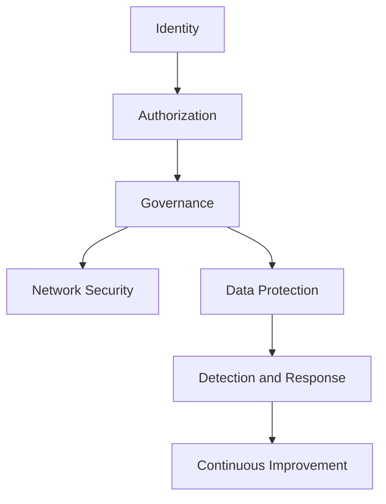
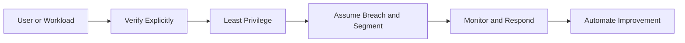

> **Screenshot Disclaimer:** Portal screenshots referenced in this guide are sourced from [Microsoft Learn](https://learn.microsoft.com/en-us/azure/) documentation. © Microsoft Corporation. All rights reserved. Used for educational reference only.

# 04 Security and Identity Interview Q and A

Security interviews often test whether you can separate identity, authorization, governance, detection, and network protection. Strong Azure answers connect these layers instead of treating them as isolated tools.

## Security layers overview



## Zero Trust in Azure



## IAM and security Q and A

### Q: What is Microsoft Entra ID?

**Answer:**
Microsoft Entra ID, formerly Azure Active Directory, is Microsofts cloud identity and access management service for users, groups, applications, devices, and workload identities.

**Key Points:**
- Provides authentication and authorization services.
- Integrates with Microsoft 365, Azure, SaaS apps, and custom applications.
- Central to single sign-on, conditional access, and identity governance.

**Example Scenario:**
"A company uses Entra ID for employee login, Azure portal access, and federated access to third-party SaaS applications."

**Follow-up Questions:**
- What is the difference between Entra ID and Active Directory Domain Services?
- How does federation fit in?

### Q: What are the differences between Entra ID Free, P1, and P2?

**Answer:**
Free provides core identity features, P1 adds advanced identity management such as Conditional Access and self-service group capabilities, and P2 adds identity protection, risk-based policies, and Privileged Identity Management.

**Key Points:**
- P1 is common for enterprise access control baselines.
- P2 is often required for mature security programs.
- Feature needs should be mapped to compliance and risk goals.

**Example Scenario:**
"An enterprise enabling MFA and Conditional Access across all employees often needs P1, while just-in-time privileged access needs P2."

**Follow-up Questions:**
- Which features require P2 specifically?
- How does licensing affect design decisions?

### Q: What is Azure RBAC?

**Answer:**
Azure Role-Based Access Control is the authorization system that determines who can perform management actions on Azure resources at different scopes.

**Key Points:**
- Uses security principal, role definition, and scope.
- Built-in and custom roles are supported.
- Inheritance flows from parent scope to child scope.

**Example Scenario:**
"A platform engineer is granted Contributor on one subscription while a support analyst gets Reader on the production resource group only."

**Follow-up Questions:**
- How does RBAC differ from Entra directory roles?
- What is the difference between control-plane and data-plane roles?

### Q: What is the RBAC scope hierarchy?

**Answer:**
RBAC scopes follow the Azure hierarchy: management group, subscription, resource group, and resource. Permissions assigned at a higher scope inherit downward.

**Key Points:**
- Broader scope means wider blast radius.
- Least privilege often means assigning the smallest workable scope.
- Scope design is as important as role choice.

**Example Scenario:**
"An ops engineer receives VM Operator permissions only on a specific resource group instead of the full subscription."

**Follow-up Questions:**
- When is management-group scope appropriate?
- What are the risks of subscription-wide Contributor?

### Q: What are common built-in Azure roles?

**Answer:**
Common built-in roles include Owner, Contributor, Reader, User Access Administrator, Virtual Machine Contributor, Network Contributor, and Key Vault Secrets User.

**Key Points:**
- Owner includes access management capability.
- Contributor can manage resources but not role assignments.
- Reader is view-only and helpful for audit or support visibility.

**Example Scenario:**
"Developers often receive Contributor on dev resource groups, while security teams may get Reader at subscription scope and targeted specialized roles elsewhere."

**Follow-up Questions:**
- Why is Owner risky?
- Which role can assign RBAC permissions?

### Q: When should you create a custom role?

**Answer:**
Create a custom role when built-in roles grant too much or too little access and you need a precise least-privilege permission set for repeatable operational use.

**Key Points:**
- Start with built-in roles where possible.
- Custom roles require maintenance and careful testing.
- Scope them narrowly when first introduced.

**Example Scenario:**
"A deployment team needs permission to restart VMs and read diagnostics but should not create new networking resources, so a custom role is created."

**Follow-up Questions:**
- How do you validate custom roles safely?
- What are common mistakes in custom role definitions?

### Q: What is the difference between RBAC and Azure Policy?

**Answer:**
RBAC controls who can perform actions, while Azure Policy governs whether resource configurations comply with organizational rules.

**Key Points:**
- RBAC is authorization.
- Policy is governance and compliance.
- They are complementary, not interchangeable.

**Example Scenario:**
"RBAC may allow an engineer to create a storage account, but Policy can still deny the deployment if public network access is disallowed."

**Follow-up Questions:**
- Can Policy replace RBAC?
- What is a policy initiative?

### Q: What is a managed identity?

**Answer:**
A managed identity is an automatically managed identity in Microsoft Entra used by Azure resources to authenticate to supported services without storing credentials in code or configuration.

**Key Points:**
- Removes the need for secrets in many scenarios.
- Can be granted RBAC permissions like a service principal.
- Supports system-assigned and user-assigned types.

**Example Scenario:**
"An App Service uses managed identity to read secrets from Key Vault and upload logs to Blob Storage."

**Follow-up Questions:**
- When would you use system-assigned vs user-assigned?
- How do you troubleshoot managed identity token failures?

### Q: What is the difference between system-assigned and user-assigned managed identity?

**Answer:**
A system-assigned identity is tied to the lifecycle of one Azure resource, while a user-assigned identity is a standalone Azure resource that can be attached to multiple services.

**Key Points:**
- System-assigned is simpler for one-to-one relationships.
- User-assigned is useful for reuse and identity continuity across deployments.
- Both support token-based authentication.

**Example Scenario:**
"A shared deployment identity used by several Function Apps is created as user-assigned so the permissions remain stable even if one app is redeployed."

**Follow-up Questions:**
- Which type simplifies access rotation?
- How do you choose in a platform standard?

### Q: What is Conditional Access?

**Answer:**
Conditional Access is a Microsoft Entra policy engine that evaluates signals such as user, device, location, application, and risk to enforce access controls like MFA, compliant device, or blocked access.

**Key Points:**
- A core Zero Trust control.
- Commonly enforces MFA and device posture.
- Should be tested carefully to avoid lockouts.

**Example Scenario:**
"Admins signing into Azure from outside trusted locations must use phishing-resistant MFA on compliant devices."

**Follow-up Questions:**
- What should be excluded from a baseline policy?
- How do report-only mode and break-glass accounts help?

### Q: How would you explain Conditional Access with a scenario?

**Answer:**
I explain it as policy-based access decisions. For example, if a user signs in to the Azure portal from an unmanaged device in a risky location, Conditional Access can require MFA or block access entirely.

**Key Points:**
- Policies evaluate signals before granting access.
- Different controls can apply to different apps and users.
- Requires careful emergency access planning.

**Example Scenario:**
"A finance admin can access payroll apps only from compliant devices and must complete MFA if outside corporate offices."

**Follow-up Questions:**
- What is Continuous Access Evaluation?
- How do sign-in logs help tune policies?

### Q: What is Privileged Identity Management?

**Answer:**
Privileged Identity Management, or PIM, provides just-in-time and time-bound activation for privileged roles, reducing standing access and improving auditability.

**Key Points:**
- Supports approval workflows and MFA on activation.
- Reduces risk of overprivileged accounts.
- Usually requires Entra ID P2 licensing.

**Example Scenario:**
"Instead of permanent Global Administrator access, an identity engineer activates the role in PIM for one hour when needed."

**Follow-up Questions:**
- What is eligible vs active assignment?
- How does PIM support least privilege?

### Q: What is Azure Key Vault?

**Answer:**
Azure Key Vault is a managed service for storing and controlling access to secrets, cryptographic keys, and certificates.

**Key Points:**
- Helps centralize secret management.
- Supports RBAC and access policy models depending on configuration and service mode.
- Often paired with managed identities and private endpoints.

**Example Scenario:**
"A web application reads its database password from Key Vault at startup using managed identity rather than storing the secret in app settings."

**Follow-up Questions:**
- What is the difference between secrets, keys, and certificates?
- How do soft delete and purge protection help?

### Q: What is the difference between Key Vault secrets, keys, and certificates?

**Answer:**
Secrets store sensitive values like passwords or connection strings, keys support cryptographic operations such as encryption and signing, and certificates manage X.509 certificates often used for TLS and application authentication.

**Key Points:**
- Choose the object type based on the use case.
- Certificates can include lifecycle management.
- HSM-backed keys are available for stricter security needs.

**Example Scenario:**
"A team stores an API token as a secret, uses a key for signing operations, and manages an application certificate through Key Vault."

**Follow-up Questions:**
- What is a managed HSM?
- How do certificate renewals integrate with apps?

### Q: Why are soft delete and purge protection important for Key Vault?

**Answer:**
Soft delete allows recovery of deleted vault objects or vaults within a retention window, while purge protection prevents immediate permanent deletion, which is important for resilience against malicious or accidental deletion.

**Key Points:**
- Strong protection against ransomware-style operations.
- Often required by security baselines.
- Should be enabled early in vault lifecycle.

**Example Scenario:**
"An admin accidentally deletes a secret used by production. Soft delete enables recovery without recreating the value manually."

**Follow-up Questions:**
- Can purge protection be disabled later?
- How does this affect automation cleanup?

### Q: What is Microsoft Defender for Cloud?

**Answer:**
Microsoft Defender for Cloud is a cloud security posture management and workload protection platform for Azure and other environments that provides secure score, recommendations, regulatory insights, and threat protection add-ons.

**Key Points:**
- Secure Score helps prioritize posture improvements.
- Recommendations identify misconfigurations and risks.
- Defender plans add workload-specific protection.

**Example Scenario:**
"Defender flags storage accounts without private access controls and recommends enabling vulnerability scanning on SQL workloads."

**Follow-up Questions:**
- What is the difference between Secure Score and real-time detection?
- Which plans add workload protection?

### Q: What is Secure Score?

**Answer:**
Secure Score is a measurement in Defender for Cloud showing how many recommended security controls are implemented relative to the services and resources in scope.

**Key Points:**
- Good for posture tracking and prioritization.
- Higher is generally better but context matters.
- Not every recommendation applies equally to every workload.

**Example Scenario:**
"A platform team improves Secure Score by enforcing MFA, enabling endpoint protection, and closing public management ports."

**Follow-up Questions:**
- Should teams chase 100 percent Secure Score?
- How do exemptions affect interpretation?

### Q: What is Microsoft Sentinel and how does it differ from Defender?

**Answer:**
Microsoft Sentinel is a cloud-native SIEM and SOAR platform focused on collecting logs, detecting threats, and orchestrating response, while Defender provides posture management and workload-specific protection. They are complementary services.

**Key Points:**
- Sentinel centralizes analytics and incident workflows.
- Defender generates security recommendations and alerts for protected workloads.
- Many environments feed Defender alerts into Sentinel.

**Example Scenario:**
"Security operations correlates Entra sign-in anomalies, firewall logs, and Defender alerts in Sentinel to investigate a suspicious campaign."

**Follow-up Questions:**
- What data sources feed Sentinel?
- When does a smaller organization skip Sentinel initially?

### Q: What is Zero Trust architecture in Azure?

**Answer:**
Zero Trust in Azure means verifying identities and device posture explicitly, granting least-privilege access, segmenting networks and applications, assuming breach, and continuously monitoring for suspicious behavior.

**Key Points:**
- Identity, network, device, data, and monitoring all matter.
- Private endpoints and managed identity support Zero Trust patterns.
- MFA, PIM, Conditional Access, and segmentation are major controls.

**Example Scenario:**
"A production app uses private endpoints, managed identity, Key Vault, NSGs, Azure Firewall, and strict Conditional Access for admins."

**Follow-up Questions:**
- How do you explain Zero Trust simply?
- What are the first controls to implement?

### Q: How do NSG, Azure Firewall, DDoS Protection, and WAF fit together?

**Answer:**
NSGs provide local packet filtering, Azure Firewall centralizes advanced network and application rule enforcement, DDoS Protection helps mitigate volumetric network attacks, and WAF protects HTTP and HTTPS applications from common web exploits.

**Key Points:**
- Each solves a different layer of risk.
- They should be layered rather than treated as replacements.
- Architecture should align protection to traffic path and exposure.

**Example Scenario:**
"An internet-facing application uses Front Door WAF, Application Gateway WAF regionally, DDoS Protection for the VNet, Azure Firewall for egress control, and NSGs for subnet filtering."

**Follow-up Questions:**
- When do you need WAF at multiple layers?
- What is DDoS Network Protection vs Basic?

### Q: What is Azure Policy and how is it used in security?

**Answer:**
Azure Policy enforces or audits configuration standards such as allowed locations, tag requirements, private access mandates, encryption settings, and forbidden public IP creation.

**Key Points:**
- Supports deny, audit, append, deploy-if-not-exists, and modify effects.
- Essential for preventing drift at scale.
- Security baselines often rely on policy initiatives.

**Example Scenario:**
"A policy initiative denies storage accounts without minimum TLS version and audits subscriptions missing Defender for Cloud coverage."

**Follow-up Questions:**
- What is `deployIfNotExists`?
- How do remediation tasks work?

### Q: What is the difference between Azure Blueprints, ARM templates, Bicep, and Terraform?

**Answer:**
ARM templates and Bicep define Azure resources declaratively, Terraform is a cross-cloud IaC tool with its own state model, and Azure Blueprints historically packaged governance artifacts like policies and role assignments, though many teams now prefer landing-zone automation and policy-driven approaches instead of relying on Blueprints for new patterns.

**Key Points:**
- Bicep is a cleaner authoring language for ARM.
- Terraform is popular for multi-cloud and modular workflows.
- Governance artifacts should be versioned and automated consistently.

**Example Scenario:**
"A company uses Terraform for cross-cloud networking but Bicep for Azure-native platform modules where direct ARM alignment is preferred."

**Follow-up Questions:**
- Why has Bicep gained popularity?
- What are the operational tradeoffs of Terraform state?

### Q: How do you compare RBAC, Policy, and locks in one answer?

**Answer:**
RBAC controls who can act, Policy controls what is allowed or required, and resource locks protect critical resources from accidental deletion or modification.

**Key Points:**
- Three different control types.
- Together they reduce both malicious and accidental risk.
- Interviewers often like concise comparisons.

**Example Scenario:**
"A shared Key Vault has restricted RBAC, policies enforcing private access, and a delete lock to prevent accidental removal."

**Follow-up Questions:**
- Which control stops accidental deletion best?
- How do they interact during automation?

### Q: What is data-plane vs control-plane authorization in security interviews?

**Answer:**
Control-plane authorization manages the resource itself through Azure management APIs, while data-plane authorization controls access to the contents of the service, such as secrets in Key Vault or blobs in Storage.

**Key Points:**
- A user may manage a service without being able to access its data.
- Security reviews must consider both planes.
- Common interview example is Key Vault or Storage.

**Example Scenario:**
"An engineer has Contributor on a storage account but lacks Blob Data Reader, so they can manage the account but not read blobs."

**Follow-up Questions:**
- Why does this distinction matter for least privilege?
- Which services commonly expose both planes?

### Q: What are service principals and when are they used?

**Answer:**
A service principal is an application identity in Microsoft Entra used by automation, applications, or external systems to access Azure resources programmatically.

**Key Points:**
- Historically common in CI/CD pipelines.
- Managed identities are preferred when automation runs inside Azure.
- Credentials must be rotated and protected carefully.

**Example Scenario:**
"An external GitHub Actions workflow may use an Entra application or workload identity federation instead of a long-lived client secret."

**Follow-up Questions:**
- How does workload identity federation improve security?
- When are service principals still necessary?

### Q: How do you secure secrets in CI/CD pipelines?

**Answer:**
Use managed identity or workload identity federation when possible, store secrets in Key Vault rather than plain pipeline variables, restrict access with least privilege, and enable secret masking and auditing.

**Key Points:**
- Avoid hard-coded secrets in repos.
- Prefer short-lived tokens over static credentials.
- Review pipeline permissions and variable scopes.

**Example Scenario:**
"A deployment pipeline retrieves a Key Vault secret at runtime through a service connection with least privilege and no stored password in the repository."

**Follow-up Questions:**
- How do you rotate secrets without downtime?
- What logs should be reviewed after a suspected leak?

### Q: How do you answer a question about secure Azure landing zones?

**Answer:**
I start with management group hierarchy, subscription segmentation, baseline RBAC, PIM, mandatory logging, Azure Policy initiatives, central networking, private access patterns, Key Vault, Defender for Cloud, and incident visibility through Monitor and Sentinel.

**Key Points:**
- Security starts before workload deployment.
- Central guardrails reduce drift.
- Identity and network controls must be designed together.

**Example Scenario:**
"A new enterprise tenant starts with platform subscriptions for identity, connectivity, and management, then enforces policies before app teams receive workload subscriptions."

**Follow-up Questions:**
- What goes in the connectivity subscription?
- Which policies belong at management-group scope?

## Portal and screenshot references

- RBAC assignment screenshot: `https://learn.microsoft.com/en-us/azure/role-based-access-control/media/role-assignments-portal/add-role-assignment-page.png`
- `Azure Portal` → `Microsoft Entra ID` → `Conditional Access`
- `Azure Portal` → `Privileged Identity Management`
- `Azure Portal` → `Key vaults` → `Access control (IAM)` or `Access policies`
- `Azure Portal` → `Microsoft Defender for Cloud`
- `Azure Portal` → `Microsoft Sentinel`
- `Azure Portal` → `Azure Policy` → `Assignments` → `Compliance`

## Useful CLI commands

```bash
az role assignment list --scope /subscriptions/<subscriptionId> --output table
az ad sp list --display-name my-app --output table
az keyvault list --output table
az keyvault secret list --vault-name myVault --output table
az policy assignment list --output table
az security pricing list --output table
```

Expected output:

- Role assignments show assignee, role, and scope.
- Service principal listing shows app ids and object ids.
- Key Vault commands list vaults and visible secrets.
- Policy assignments show names, scopes, and enforcement state.
- Security pricing list shows Defender plan tiers per resource type.

## Official Microsoft References

- [Microsoft Entra documentation](https://learn.microsoft.com/entra/)
- [Azure RBAC overview](https://learn.microsoft.com/azure/role-based-access-control/overview)
- [Managed identities for Azure resources](https://learn.microsoft.com/azure/active-directory/managed-identities-azure-resources/overview)
- [Conditional Access overview](https://learn.microsoft.com/entra/identity/conditional-access/overview)
- [Privileged Identity Management](https://learn.microsoft.com/entra/id-governance/privileged-identity-management/pim-configure)
- [Azure Key Vault documentation](https://learn.microsoft.com/azure/key-vault/general/overview)
- [Azure Policy documentation](https://learn.microsoft.com/azure/governance/policy/overview)
- [Defender for Cloud documentation](https://learn.microsoft.com/azure/defender-for-cloud/)
- [Microsoft Sentinel documentation](https://learn.microsoft.com/azure/sentinel/)
- [Zero Trust guidance for Azure](https://learn.microsoft.com/security/zero-trust/azure-infrastructure-overview)
