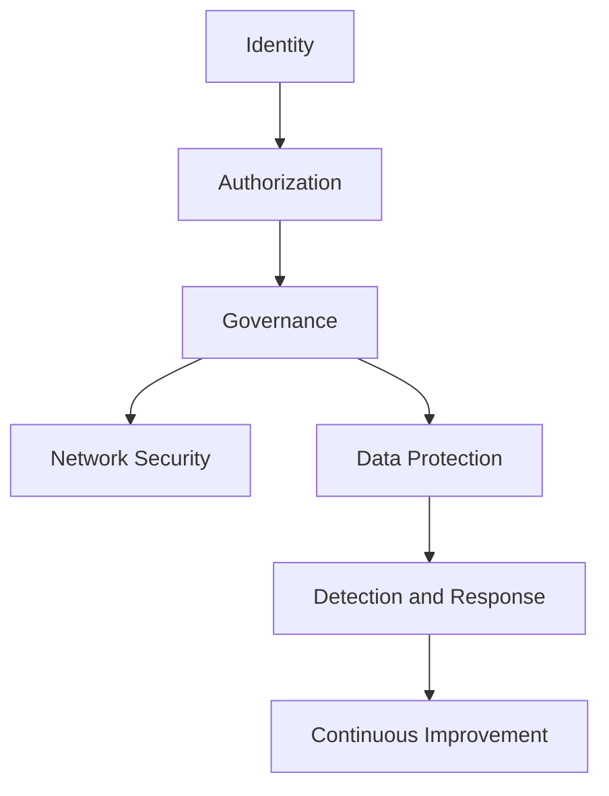
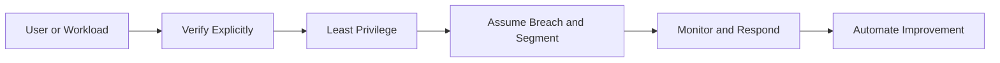

> **Screenshot Disclaimer:** Portal screenshots referenced in this guide are sourced from [Microsoft Learn](https://learn.microsoft.com/en-us/azure/) documentation. © Microsoft Corporation. All rights reserved. Used for educational reference only.

# 04 Security and Identity Interview Q and A

Security interviews often test whether you can separate identity, authorization, governance, detection, and network protection. Strong Azure answers connect these layers instead of treating them as isolated tools.

## Security layers overview



## Zero Trust in Azure



## IAM and security Q and A

### Q: What is Microsoft Entra ID?

**Answer:**
Microsoft Entra ID, formerly Azure Active Directory, is Microsofts cloud identity and access management service for users, groups, applications, devices, and workload identities.

**Key Points:**
- Provides authentication and authorization services.
- Integrates with Microsoft 365, Azure, SaaS apps, and custom applications.
- Central to single sign-on, conditional access, and identity governance.

**Example Scenario:**
"A company uses Entra ID for employee login, Azure portal access, and federated access to third-party SaaS applications."

**Follow-up Questions:**

**Q: What is the difference between Entra ID and Active Directory Domain Services?**
Microsoft Entra ID is a cloud identity provider for authentication, SSO, Conditional Access, and SaaS access. Active Directory Domain Services is traditional domain infrastructure for domain join, Group Policy, Kerberos, and LDAP. A common real-world pattern is using Entra ID for Microsoft 365 and Azure access, while AD DS still supports legacy Windows servers and on-prem applications.

**Q: How does federation fit in?**
Federation lets Entra ID trust another identity provider, such as AD FS or a partner IdP, using protocols like SAML or WS-Fed. It allows users to authenticate with their home credentials while still accessing Azure or Microsoft 365 resources. In interviews, a good example is a merger or B2B scenario where partner users need access without creating separate passwords in your tenant.

### Q: What are the differences between Entra ID Free, P1, and P2?

**Answer:**
Free provides core identity features, P1 adds advanced identity management such as Conditional Access and self-service group capabilities, and P2 adds identity protection, risk-based policies, and Privileged Identity Management.

**Key Points:**
- P1 is common for enterprise access control baselines.
- P2 is often required for mature security programs.
- Feature needs should be mapped to compliance and risk goals.

**Example Scenario:**
"An enterprise enabling MFA and Conditional Access across all employees often needs P1, while just-in-time privileged access needs P2."

**Follow-up Questions:**

**Q: Which features require P2 specifically?**
Entra ID P2 is typically required for Privileged Identity Management, Identity Protection, risk-based Conditional Access, and advanced governance features such as access reviews. Those capabilities matter when you want just-in-time admin access or automated response to risky sign-ins. For example, if you want global admins to be eligible instead of permanently active, that is a P2 design.

**Q: How does licensing affect design decisions?**
Licensing changes what controls are realistic, so architecture should match the tenant’s actual SKU instead of assuming premium features exist. If a customer only has Free or P1, you may rely more on standard MFA and group-based controls rather than PIM or risk-based policies. In interviews, that shows you balance security design with cost and operational constraints.

### Q: What is Azure RBAC?

**Answer:**
Azure Role-Based Access Control is the authorization system that determines who can perform management actions on Azure resources at different scopes.

**Key Points:**
- Uses security principal, role definition, and scope.
- Built-in and custom roles are supported.
- Inheritance flows from parent scope to child scope.

**Example Scenario:**
"A platform engineer is granted Contributor on one subscription while a support analyst gets Reader on the production resource group only."

**Follow-up Questions:**

**Q: How does RBAC differ from Entra directory roles?**
Azure RBAC controls access to Azure resources through Azure Resource Manager scopes such as management group, subscription, resource group, and resource. Entra directory roles control tenant-level identity administration, such as User Administrator or Global Administrator, inside Microsoft Entra ID. A practical example is that a Storage Account Contributor role does not let you reset user passwords, and a User Administrator role does not let you create VMs.

**Q: What is the difference between control-plane and data-plane roles?**
Control-plane roles manage the resource itself through ARM, such as creating a storage account or changing networking settings. Data-plane roles govern access to the actual content inside the service, such as Storage Blob Data Reader for blobs or Key Vault Secrets User for secrets. This matters in production because an engineer may need to manage a vault resource without being allowed to read the secrets stored in it.

### Q: What is the RBAC scope hierarchy?

**Answer:**
RBAC scopes follow the Azure hierarchy: management group, subscription, resource group, and resource. Permissions assigned at a higher scope inherit downward.

**Key Points:**
- Broader scope means wider blast radius.
- Least privilege often means assigning the smallest workable scope.
- Scope design is as important as role choice.

**Example Scenario:**
"An ops engineer receives VM Operator permissions only on a specific resource group instead of the full subscription."

**Follow-up Questions:**

**Q: When is management-group scope appropriate?**
Management-group scope is appropriate when you need consistent governance across many subscriptions, such as applying Reader access for an audit team or assigning policies centrally. It reduces duplication and prevents drift when new subscriptions are created under the same hierarchy. A common enterprise example is assigning a security operations group read access at the platform management group instead of repeating assignments per subscription.

**Q: What are the risks of subscription-wide Contributor?**
Subscription-wide Contributor gives broad create, modify, and delete permissions across nearly all resources in that subscription. That creates a large blast radius because one mistake or compromised identity can affect networking, compute, and platform services at once. In real environments, it is safer to scope Contributor to a specific resource group or app landing zone unless there is a strong operational reason not to.

### Q: What are common built-in Azure roles?

**Answer:**
Common built-in roles include Owner, Contributor, Reader, User Access Administrator, Virtual Machine Contributor, Network Contributor, and Key Vault Secrets User.

**Key Points:**
- Owner includes access management capability.
- Contributor can manage resources but not role assignments.
- Reader is view-only and helpful for audit or support visibility.

**Example Scenario:**
"Developers often receive Contributor on dev resource groups, while security teams may get Reader at subscription scope and targeted specialized roles elsewhere."

**Follow-up Questions:**

**Q: Why is Owner risky?**
Owner is risky because it combines full resource management with the ability to grant access to other identities. If an Owner account is misused, the attacker can both change infrastructure and persist by creating new role assignments. In practice, Owner should be limited to a small platform-admin group protected by MFA, Conditional Access, and ideally PIM.

**Q: Which role can assign RBAC permissions?**
Both Owner and User Access Administrator can create role assignments in Azure RBAC. The difference is that User Access Administrator manages access without broad resource control, so it is often a safer choice for access-management teams. For example, an IAM team can use User Access Administrator to grant Storage Blob Data Reader without also being able to delete the storage account.

### Q: When should you create a custom role?

**Answer:**
Create a custom role when built-in roles grant too much or too little access and you need a precise least-privilege permission set for repeatable operational use.

**Key Points:**
- Start with built-in roles where possible.
- Custom roles require maintenance and careful testing.
- Scope them narrowly when first introduced.

**Example Scenario:**
"A deployment team needs permission to restart VMs and read diagnostics but should not create new networking resources, so a custom role is created."

**Follow-up Questions:**

**Q: How do you validate custom roles safely?**
Validate custom roles in a nonproduction subscription or a test resource group, then assign them to a test identity before broad rollout. Use commands like `az role definition create --role-definition @role.json`, `az role definition list --name "Role Name"`, and a test `az role assignment create` to confirm only the intended actions work. A good interview example is verifying that an operations team can restart VMs but cannot delete them.

**Q: What are common mistakes in custom role definitions?**
Common mistakes include using overly broad wildcards in `Actions`, forgetting `DataActions` for data-plane access, and setting `AssignableScopes` too widely. Teams also sometimes assume a custom role can deny actions, but RBAC is allow-based and deny assignments are handled differently. In production, those mistakes usually show up as either excessive privilege or confusing access-denied errors.

### Q: What is the difference between RBAC and Azure Policy?

**Answer:**
RBAC controls who can perform actions, while Azure Policy governs whether resource configurations comply with organizational rules.

**Key Points:**
- RBAC is authorization.
- Policy is governance and compliance.
- They are complementary, not interchangeable.

**Example Scenario:**
"RBAC may allow an engineer to create a storage account, but Policy can still deny the deployment if public network access is disallowed."

**Follow-up Questions:**

**Q: Can Policy replace RBAC?**
No, Azure Policy cannot replace RBAC because they solve different problems. RBAC answers who can do something, while Policy answers what is allowed or required for the resource configuration. A real example is using RBAC to let a team deploy VMs, while Policy still enforces allowed regions, required tags, and disk encryption.

**Q: What is a policy initiative?**
A policy initiative is a grouped set of policy definitions assigned together as one package. It is useful for applying a control framework such as Azure Security Benchmark or an internal landing-zone baseline across many subscriptions. In practice, initiatives simplify reporting because you can track compliance for the whole bundle instead of separate policies one by one.

### Q: What is a managed identity?

**Answer:**
A managed identity is an automatically managed identity in Microsoft Entra used by Azure resources to authenticate to supported services without storing credentials in code or configuration.

**Key Points:**
- Removes the need for secrets in many scenarios.
- Can be granted RBAC permissions like a service principal.
- Supports system-assigned and user-assigned types.

**Example Scenario:**
"An App Service uses managed identity to read secrets from Key Vault and upload logs to Blob Storage."

**Follow-up Questions:**

**Q: When would you use system-assigned vs user-assigned?**
Use system-assigned managed identity when the identity belongs only to one resource and should disappear when that resource is deleted. Use user-assigned managed identity when multiple resources need the same identity or when you want to preserve access during redeployments. A common example is giving several Azure Functions the same user-assigned identity to access one Key Vault without recreating RBAC assignments each time.

**Q: How do you troubleshoot managed identity token failures?**
First confirm the identity is enabled and the workload can reach the Instance Metadata Service endpoint at `http://169.254.169.254/metadata/identity/oauth2/token`. Then verify the correct audience or resource URI and check that RBAC or Key Vault access allows the identity to do the requested action. In real incidents, failures are often caused by missing role assignments, the wrong tenant, or requesting a token for the wrong service.

### Q: What is the difference between system-assigned and user-assigned managed identity?

**Answer:**
A system-assigned identity is tied to the lifecycle of one Azure resource, while a user-assigned identity is a standalone Azure resource that can be attached to multiple services.

**Key Points:**
- System-assigned is simpler for one-to-one relationships.
- User-assigned is useful for reuse and identity continuity across deployments.
- Both support token-based authentication.

**Example Scenario:**
"A shared deployment identity used by several Function Apps is created as user-assigned so the permissions remain stable even if one app is redeployed."

**Follow-up Questions:**

**Q: Which type simplifies access rotation?**
Managed identities in general remove secret rotation because Azure handles the credential lifecycle automatically. If you need permission continuity across redeployments, user-assigned identities are simpler because you can move the same identity to a new resource without re-granting access. For single-resource workloads, system-assigned identities are often simpler operationally because cleanup is automatic.

**Q: How do you choose in a platform standard?**
A strong platform standard is to default to system-assigned identities unless there is a clear reuse requirement. You make user-assigned the exception for shared access patterns, such as multiple App Services reading the same Key Vault or accessing the same Storage account. That keeps identity sprawl lower while still supporting reusable platform components.

### Q: What is Conditional Access?

**Answer:**
Conditional Access is a Microsoft Entra policy engine that evaluates signals such as user, device, location, application, and risk to enforce access controls like MFA, compliant device, or blocked access.

**Key Points:**
- A core Zero Trust control.
- Commonly enforces MFA and device posture.
- Should be tested carefully to avoid lockouts.

**Example Scenario:**
"Admins signing into Azure from outside trusted locations must use phishing-resistant MFA on compliant devices."

**Follow-up Questions:**

**Q: What should be excluded from a baseline policy?**
Baseline Conditional Access policies should usually exclude emergency break-glass accounts and sometimes tightly controlled service identities that cannot satisfy interactive controls. Exclusions must be minimal and documented, because every exclusion creates a potential bypass. A practical example is excluding two cloud-only emergency admin accounts stored offline so you can still recover access during an outage.

**Q: How do report-only mode and break-glass accounts help?**
Report-only mode lets you evaluate the impact of a Conditional Access policy before enforcing it, using Entra sign-in logs to see who would have been blocked. Break-glass accounts provide a last-resort path if MFA, federation, or Conditional Access fails. Together they reduce the chance of locking out administrators while still moving toward stronger controls.

### Q: How would you explain Conditional Access with a scenario?

**Answer:**
I explain it as policy-based access decisions. For example, if a user signs in to the Azure portal from an unmanaged device in a risky location, Conditional Access can require MFA or block access entirely.

**Key Points:**
- Policies evaluate signals before granting access.
- Different controls can apply to different apps and users.
- Requires careful emergency access planning.

**Example Scenario:**
"A finance admin can access payroll apps only from compliant devices and must complete MFA if outside corporate offices."

**Follow-up Questions:**

**Q: What is Continuous Access Evaluation?**
Continuous Access Evaluation lets Entra ID re-evaluate some access decisions in near real time instead of waiting for token expiry. Events like account disablement, password reset, or risky-user changes can force applications to challenge the user again sooner. That is valuable in incidents because access can be reduced faster than with a long-lived token alone.

**Q: How do sign-in logs help tune policies?**
Entra sign-in logs show which Conditional Access policies applied, whether access was granted or blocked, and what signals triggered the decision. They help you spot false positives such as trusted users being blocked from a legitimate country or device state not being detected as expected. In practice, teams use these logs during pilot rollout to refine exclusions and avoid unnecessary user friction.

### Q: What is Privileged Identity Management?

**Answer:**
Privileged Identity Management, or PIM, provides just-in-time and time-bound activation for privileged roles, reducing standing access and improving auditability.

**Key Points:**
- Supports approval workflows and MFA on activation.
- Reduces risk of overprivileged accounts.
- Usually requires Entra ID P2 licensing.

**Example Scenario:**
"Instead of permanent Global Administrator access, an identity engineer activates the role in PIM for one hour when needed."

**Follow-up Questions:**

**Q: What is eligible vs active assignment?**
In Privileged Identity Management, an eligible assignment means the user can activate the role when needed, while an active assignment means the role is already in effect. Activation can require MFA, justification, approval, and a time limit. A common example is making subscription Owner eligible for cloud admins instead of leaving it permanently active.

**Q: How does PIM support least privilege?**
PIM supports least privilege by reducing standing admin access and giving elevated rights only for a short approved window. It also adds audit trails and access reviews so privileged access is easier to monitor and remove when no longer needed. In interviews, that is a strong example of balancing operational needs with security controls.

### Q: What is Azure Key Vault?

**Answer:**
Azure Key Vault is a managed service for storing and controlling access to secrets, cryptographic keys, and certificates.

**Key Points:**
- Helps centralize secret management.
- Supports RBAC and access policy models depending on configuration and service mode.
- Often paired with managed identities and private endpoints.

**Example Scenario:**
"A web application reads its database password from Key Vault at startup using managed identity rather than storing the secret in app settings."

**Follow-up Questions:**

**Q: What is the difference between secrets, keys, and certificates?**
In Azure Key Vault, secrets store sensitive values like passwords or connection strings, keys are used for cryptographic operations such as encrypt, decrypt, sign, or verify, and certificates manage X.509 certificates plus their private keys. Choosing the right object type matters because applications and permissions differ by object. For example, an app may read a secret for a third-party API token, while a signing service uses a key that the app never exports.

**Q: How do soft delete and purge protection help?**
Soft delete keeps deleted vault objects recoverable for a retention period, which protects against accidental deletion or malicious removal. Purge protection prevents permanent deletion during that window, even by privileged users, so attackers cannot easily erase evidence or destroy secrets immediately. In production, those features are critical for recovering a deleted key or certificate without rebuilding the entire trust chain.

### Q: What is the difference between Key Vault secrets, keys, and certificates?

**Answer:**
Secrets store sensitive values like passwords or connection strings, keys support cryptographic operations such as encryption and signing, and certificates manage X.509 certificates often used for TLS and application authentication.

**Key Points:**
- Choose the object type based on the use case.
- Certificates can include lifecycle management.
- HSM-backed keys are available for stricter security needs.

**Example Scenario:**
"A team stores an API token as a secret, uses a key for signing operations, and manages an application certificate through Key Vault."

**Follow-up Questions:**

**Q: What is a managed HSM?**
Azure Managed HSM is a dedicated, standards-focused service for protecting cryptographic keys in hardware security modules with stronger separation and enterprise control. It is used when organizations need FIPS 140-2 Level 3 validated key protection, central key custody, or regulated signing workloads. A typical example is protecting code-signing or payment-related keys where a standard multi-tenant Key Vault is not the preferred design.

**Q: How do certificate renewals integrate with apps?**
Key Vault certificates can be renewed manually or through integrated issuers, and applications can fetch the latest version through Key Vault references or SDK calls. App Service, Application Gateway, and some ingress patterns can pull renewed certificates from Key Vault to reduce manual rotation work. In real operations, the key is making the app trust versioned secrets or automated sync so certificate renewal does not become a deployment outage.

### Q: Why are soft delete and purge protection important for Key Vault?

**Answer:**
Soft delete allows recovery of deleted vault objects or vaults within a retention window, while purge protection prevents immediate permanent deletion, which is important for resilience against malicious or accidental deletion.

**Key Points:**
- Strong protection against ransomware-style operations.
- Often required by security baselines.
- Should be enabled early in vault lifecycle.

**Example Scenario:**
"An admin accidentally deletes a secret used by production. Soft delete enables recovery without recreating the value manually."

**Follow-up Questions:**

**Q: Can purge protection be disabled later?**
No, once purge protection is enabled on Azure Key Vault, you cannot turn it off. That immutability is intentional because the feature is meant to defend against privileged misuse as well as accidents. In interviews, mention that you should decide carefully before rollout, especially in automation-heavy environments.

**Q: How does this affect automation cleanup?**
Automation cannot permanently purge the vault or its objects until the retention period expires, so cleanup workflows must account for delayed deletion. This especially matters in ephemeral environments where engineers expect instant teardown and name reuse. A practical design is using unique naming and shorter allowed retention settings where policy permits, rather than assuming immediate recreation will work.

### Q: What is Microsoft Defender for Cloud?

**Answer:**
Microsoft Defender for Cloud is a cloud security posture management and workload protection platform for Azure and other environments that provides secure score, recommendations, regulatory insights, and threat protection add-ons.

**Key Points:**
- Secure Score helps prioritize posture improvements.
- Recommendations identify misconfigurations and risks.
- Defender plans add workload-specific protection.

**Example Scenario:**
"Defender flags storage accounts without private access controls and recommends enabling vulnerability scanning on SQL workloads."

**Follow-up Questions:**

**Q: What is the difference between Secure Score and real-time detection?**
Secure Score is a posture metric that measures how well your environment aligns with recommended security controls over time. Real-time detection comes from alerting and threat analytics, such as Defender for Cloud or Microsoft Sentinel identifying active suspicious activity. In practice, Secure Score helps prioritize hardening, while detections help you respond to attacks already happening.

**Q: Which plans add workload protection?**
Workload protection is added through specific Microsoft Defender for Cloud plans such as Defender for Servers, Storage, SQL, Containers, and Key Vault. These plans extend beyond posture recommendations and enable deeper threat detection, agentless findings, or workload-specific alerts. For example, Defender for Servers can surface suspicious processes and vulnerability findings on Azure and hybrid machines.

### Q: What is Secure Score?

**Answer:**
Secure Score is a measurement in Defender for Cloud showing how many recommended security controls are implemented relative to the services and resources in scope.

**Key Points:**
- Good for posture tracking and prioritization.
- Higher is generally better but context matters.
- Not every recommendation applies equally to every workload.

**Example Scenario:**
"A platform team improves Secure Score by enforcing MFA, enabling endpoint protection, and closing public management ports."

**Follow-up Questions:**

**Q: Should teams chase 100 percent Secure Score?**
No, teams should use Secure Score as a prioritization tool, not as a vanity target. Some recommendations may not fit the architecture, risk appetite, or compensating controls already in place. A stronger interview answer is to improve the score where it meaningfully reduces risk, especially for internet-facing, identity, and privileged-access exposures.

**Q: How do exemptions affect interpretation?**
Exemptions should be documented and risk-accepted so stakeholders understand why a recommendation is intentionally not implemented. Without that context, the score can look worse than the actual control environment or mask repeated exceptions. In real governance reviews, exemption reporting is just as important as the percentage itself.

### Q: What is Microsoft Sentinel and how does it differ from Defender?

**Answer:**
Microsoft Sentinel is a cloud-native SIEM and SOAR platform focused on collecting logs, detecting threats, and orchestrating response, while Defender provides posture management and workload-specific protection. They are complementary services.

**Key Points:**
- Sentinel centralizes analytics and incident workflows.
- Defender generates security recommendations and alerts for protected workloads.
- Many environments feed Defender alerts into Sentinel.

**Example Scenario:**
"Security operations correlates Entra sign-in anomalies, firewall logs, and Defender alerts in Sentinel to investigate a suspicious campaign."

**Follow-up Questions:**

**Q: What data sources feed Sentinel?**
Microsoft Sentinel can ingest Azure Activity Logs, Entra sign-in logs, Microsoft 365 audit data, Defender alerts, Syslog, Common Event Format connectors, and logs from third-party firewalls or clouds. The value comes from correlating these sources in one Log Analytics workspace using KQL and analytics rules. A practical example is combining Entra risky sign-ins with Defender endpoint alerts to identify a likely compromised user and device.

**Q: When does a smaller organization skip Sentinel initially?**
A smaller organization may postpone Sentinel if it lacks 24x7 response capability, KQL skills, or enough log volume to justify the cost. In that case, starting with Microsoft Defender products, Azure Monitor alerts, and core logging can be more practical. The key interview point is that SIEM value depends on people and process, not just turning on the platform.

### Q: What is Zero Trust architecture in Azure?

**Answer:**
Zero Trust in Azure means verifying identities and device posture explicitly, granting least-privilege access, segmenting networks and applications, assuming breach, and continuously monitoring for suspicious behavior.

**Key Points:**
- Identity, network, device, data, and monitoring all matter.
- Private endpoints and managed identity support Zero Trust patterns.
- MFA, PIM, Conditional Access, and segmentation are major controls.

**Example Scenario:**
"A production app uses private endpoints, managed identity, Key Vault, NSGs, Azure Firewall, and strict Conditional Access for admins."

**Follow-up Questions:**

**Q: How do you explain Zero Trust simply?**
Zero Trust means never assuming a user, device, or workload is safe just because it is inside the network. You verify explicitly, grant least privilege, and assume breach so every access request is continuously evaluated. A simple example is requiring MFA and compliant-device checks even when employees connect from corporate locations.

**Q: What are the first controls to implement?**
The first controls are usually MFA, Conditional Access, privileged access controls like PIM, and centralized logging. After that, teams add network segmentation, managed identities, and stronger workload hardening. In interviews, starting with identity is a strong answer because most modern attacks target credentials first.

### Q: How do NSG, Azure Firewall, DDoS Protection, and WAF fit together?

**Answer:**
NSGs provide local packet filtering, Azure Firewall centralizes advanced network and application rule enforcement, DDoS Protection helps mitigate volumetric network attacks, and WAF protects HTTP and HTTPS applications from common web exploits.

**Key Points:**
- Each solves a different layer of risk.
- They should be layered rather than treated as replacements.
- Architecture should align protection to traffic path and exposure.

**Example Scenario:**
"An internet-facing application uses Front Door WAF, Application Gateway WAF regionally, DDoS Protection for the VNet, Azure Firewall for egress control, and NSGs for subnet filtering."

**Follow-up Questions:**

**Q: When do you need WAF at multiple layers?**
You may need WAF at multiple layers when traffic enters through different application paths, such as Azure Front Door globally and Application Gateway regionally. The edge WAF filters internet threats early, while the regional WAF can enforce app-specific protections closer to the workload. A real example is a multi-region public app using Front Door for global routing and App Gateway WAF for per-region ingress rules.

**Q: What is DDoS Network Protection vs Basic?**
DDoS Basic is automatically available on Azure and provides baseline platform-level protection for common network attacks. DDoS Network Protection is a paid service that adds enhanced mitigation, telemetry, rapid response support, and protection plans across virtual networks. In interviews, say Basic is default platform coverage, while Network Protection is the customer-managed option for business-critical public workloads.

### Q: What is Azure Policy and how is it used in security?

**Answer:**
Azure Policy enforces or audits configuration standards such as allowed locations, tag requirements, private access mandates, encryption settings, and forbidden public IP creation.

**Key Points:**
- Supports deny, audit, append, deploy-if-not-exists, and modify effects.
- Essential for preventing drift at scale.
- Security baselines often rely on policy initiatives.

**Example Scenario:**
"A policy initiative denies storage accounts without minimum TLS version and audits subscriptions missing Defender for Cloud coverage."

**Follow-up Questions:**

**Q: What is `deployIfNotExists`?**
`deployIfNotExists` is an Azure Policy effect that checks whether a required related resource or setting exists and deploys it if missing. It is commonly used to enable diagnostic settings, install extensions, or configure security agents after a resource is created. A typical landing-zone example is automatically deploying diagnostic settings to send logs to a Log Analytics workspace.

**Q: How do remediation tasks work?**
Remediation tasks apply a policy assignment’s corrective action to existing noncompliant resources, usually through a managed identity created for the policy assignment. They are important because policy evaluation alone does not always fix resources that were deployed before the policy existed. In practice, teams assign the policy, grant the identity the needed permissions, and then launch remediation to bring the estate into compliance.

### Q: What is the difference between Azure Blueprints, ARM templates, Bicep, and Terraform?

**Answer:**
ARM templates and Bicep define Azure resources declaratively, Terraform is a cross-cloud IaC tool with its own state model, and Azure Blueprints historically packaged governance artifacts like policies and role assignments, though many teams now prefer landing-zone automation and policy-driven approaches instead of relying on Blueprints for new patterns.

**Key Points:**
- Bicep is a cleaner authoring language for ARM.
- Terraform is popular for multi-cloud and modular workflows.
- Governance artifacts should be versioned and automated consistently.

**Example Scenario:**
"A company uses Terraform for cross-cloud networking but Bicep for Azure-native platform modules where direct ARM alignment is preferred."

**Follow-up Questions:**

**Q: Why has Bicep gained popularity?**
Bicep is popular because it is much easier to read and maintain than raw ARM JSON while still compiling natively to ARM deployments. It supports modules, cleaner syntax, and strong alignment with Azure features as they are released. A practical example is platform teams standardizing landing-zone modules in Bicep so application teams can reuse them with less template complexity.

**Q: What are the operational tradeoffs of Terraform state?**
Terraform state is powerful because it tracks resource mappings, but it becomes an operational dependency that must be secured, backed up, and locked correctly. Remote state in Azure Storage typically needs RBAC, encryption, versioning, and state locking discipline to avoid drift or corruption. In real-world teams, poor state management can be a bigger risk than the Terraform code itself.

### Q: How do you compare RBAC, Policy, and locks in one answer?

**Answer:**
RBAC controls who can act, Policy controls what is allowed or required, and resource locks protect critical resources from accidental deletion or modification.

**Key Points:**
- Three different control types.
- Together they reduce both malicious and accidental risk.
- Interviewers often like concise comparisons.

**Example Scenario:**
"A shared Key Vault has restricted RBAC, policies enforcing private access, and a delete lock to prevent accidental removal."

**Follow-up Questions:**

**Q: Which control stops accidental deletion best?**
Resource locks are the strongest direct control against accidental deletion because a `CanNotDelete` or `ReadOnly` lock blocks the operation even if the user has RBAC permission. RBAC limits who can act, and Policy governs allowed configurations, but locks are the explicit safeguard against delete mistakes. A classic example is placing a delete lock on a production resource group or shared networking components.

**Q: How do they interact during automation?**
Automation must satisfy all three layers: the pipeline identity needs RBAC permission, the deployment must comply with Policy, and locks must not block intended changes. This means infrastructure pipelines sometimes need a controlled process to remove and reapply locks during approved maintenance. In interviews, that shows you understand governance controls can affect delivery workflows, not just human administrators.

### Q: What is data-plane vs control-plane authorization in security interviews?

**Answer:**
Control-plane authorization manages the resource itself through Azure management APIs, while data-plane authorization controls access to the contents of the service, such as secrets in Key Vault or blobs in Storage.

**Key Points:**
- A user may manage a service without being able to access its data.
- Security reviews must consider both planes.
- Common interview example is Key Vault or Storage.

**Example Scenario:**
"An engineer has Contributor on a storage account but lacks Blob Data Reader, so they can manage the account but not read blobs."

**Follow-up Questions:**

**Q: Why does this distinction matter for least privilege?**
The control-plane versus data-plane distinction matters because many teams need to manage a resource without accessing the sensitive data inside it. If you give only management permissions but forget separate data roles, you can reduce exposure substantially. For example, an operations team might manage a Storage account or Key Vault configuration while only a workload identity gets Blob Data Reader or Secrets User access.

**Q: Which services commonly expose both planes?**
Azure Storage, Azure Key Vault, Azure SQL, and Azure Event Hubs are common examples where management and data access are separated. You can create or configure the resource through ARM, but reading blobs, secrets, database data, or event streams often requires different data-plane permissions. That distinction is frequently tested in interviews because it directly affects secure access design.

### Q: What are service principals and when are they used?

**Answer:**
A service principal is an application identity in Microsoft Entra used by automation, applications, or external systems to access Azure resources programmatically.

**Key Points:**
- Historically common in CI/CD pipelines.
- Managed identities are preferred when automation runs inside Azure.
- Credentials must be rotated and protected carefully.

**Example Scenario:**
"An external GitHub Actions workflow may use an Entra application or workload identity federation instead of a long-lived client secret."

**Follow-up Questions:**

**Q: How does workload identity federation improve security?**
Workload identity federation lets external systems such as GitHub Actions or Azure DevOps exchange an OIDC token for Azure access instead of storing a long-lived client secret. That removes secret rotation pain and reduces the chance of credential leakage from pipeline variables or repositories. A practical example is configuring a federated credential on an Entra application and using `azure/login` in GitHub Actions with no stored password.

**Q: When are service principals still necessary?**
Service principals are still necessary when an application needs its own identity in Entra ID or when a tool cannot yet use managed identity or federation. They are common for third-party integrations, legacy automation, or cross-platform systems running outside Azure. The interview-ready point is not to avoid service principals entirely, but to prefer secretless options first and harden the remaining ones.

### Q: How do you secure secrets in CI/CD pipelines?

**Answer:**
Use managed identity or workload identity federation when possible, store secrets in Key Vault rather than plain pipeline variables, restrict access with least privilege, and enable secret masking and auditing.

**Key Points:**
- Avoid hard-coded secrets in repos.
- Prefer short-lived tokens over static credentials.
- Review pipeline permissions and variable scopes.

**Example Scenario:**
"A deployment pipeline retrieves a Key Vault secret at runtime through a service connection with least privilege and no stored password in the repository."

**Follow-up Questions:**

**Q: How do you rotate secrets without downtime?**
Use versioned secrets in Azure Key Vault and update consumers to trust the new version before disabling the old one. Where possible, design for overlapping credentials, such as dual database passwords or certificate rollover windows, so both old and new values work temporarily. A common pattern is updating an App Service through a Key Vault reference, validating the app, and then retiring the old secret version.

**Q: What logs should be reviewed after a suspected leak?**
Review Entra sign-in logs, service principal sign-in activity, Azure Activity Logs, and Key Vault diagnostic logs to see who accessed or used the credential. You should also check workload-specific logs such as Storage, SQL, or application telemetry for unusual actions performed with that secret. In real incident response, the goal is to determine both exposure and misuse, not just rotate the credential blindly.

### Q: How do you answer a question about secure Azure landing zones?

**Answer:**
I start with management group hierarchy, subscription segmentation, baseline RBAC, PIM, mandatory logging, Azure Policy initiatives, central networking, private access patterns, Key Vault, Defender for Cloud, and incident visibility through Monitor and Sentinel.

**Key Points:**
- Security starts before workload deployment.
- Central guardrails reduce drift.
- Identity and network controls must be designed together.

**Example Scenario:**
"A new enterprise tenant starts with platform subscriptions for identity, connectivity, and management, then enforces policies before app teams receive workload subscriptions."

**Follow-up Questions:**

**Q: What goes in the connectivity subscription?**
The connectivity subscription usually hosts shared networking services such as hub virtual networks, Azure Firewall, VPN or ExpressRoute gateways, private DNS, and sometimes DDoS protection plans. The goal is to separate shared platform networking from application subscriptions for clearer ownership and safer change control. A landing-zone example is putting the hub-and-spoke core network in connectivity while app teams deploy only spoke resources in their own subscriptions.

**Q: Which policies belong at management-group scope?**
Policies that should apply consistently across many subscriptions belong at management-group scope, such as allowed locations, required tags, diagnostic settings, and security baselines. This is also the right place for guardrails that define landing-zone standards before new subscriptions are onboarded. In practice, platform teams assign broad governance at the management group and use lower scopes only for justified exceptions.

## Portal and screenshot references

- RBAC assignment screenshot: `https://learn.microsoft.com/en-us/azure/role-based-access-control/media/role-assignments-portal/add-role-assignment-page.png`
- `Azure Portal` → `Microsoft Entra ID` → `Conditional Access`
- `Azure Portal` → `Privileged Identity Management`
- `Azure Portal` → `Key vaults` → `Access control (IAM)` or `Access policies`
- `Azure Portal` → `Microsoft Defender for Cloud`
- `Azure Portal` → `Microsoft Sentinel`
- `Azure Portal` → `Azure Policy` → `Assignments` → `Compliance`

## Useful CLI commands

```bash
az role assignment list --scope /subscriptions/<subscriptionId> --output table
az ad sp list --display-name my-app --output table
az keyvault list --output table
az keyvault secret list --vault-name myVault --output table
az policy assignment list --output table
az security pricing list --output table
```

Expected output:

- Role assignments show assignee, role, and scope.
- Service principal listing shows app ids and object ids.
- Key Vault commands list vaults and visible secrets.
- Policy assignments show names, scopes, and enforcement state.
- Security pricing list shows Defender plan tiers per resource type.

## Official Microsoft References

- [Microsoft Entra documentation](https://learn.microsoft.com/entra/)
- [Azure RBAC overview](https://learn.microsoft.com/azure/role-based-access-control/overview)
- [Managed identities for Azure resources](https://learn.microsoft.com/azure/active-directory/managed-identities-azure-resources/overview)
- [Conditional Access overview](https://learn.microsoft.com/entra/identity/conditional-access/overview)
- [Privileged Identity Management](https://learn.microsoft.com/entra/id-governance/privileged-identity-management/pim-configure)
- [Azure Key Vault documentation](https://learn.microsoft.com/azure/key-vault/general/overview)
- [Azure Policy documentation](https://learn.microsoft.com/azure/governance/policy/overview)
- [Defender for Cloud documentation](https://learn.microsoft.com/azure/defender-for-cloud/)
- [Microsoft Sentinel documentation](https://learn.microsoft.com/azure/sentinel/)
- [Zero Trust guidance for Azure](https://learn.microsoft.com/security/zero-trust/azure-infrastructure-overview)
