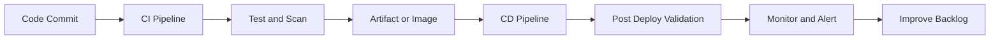
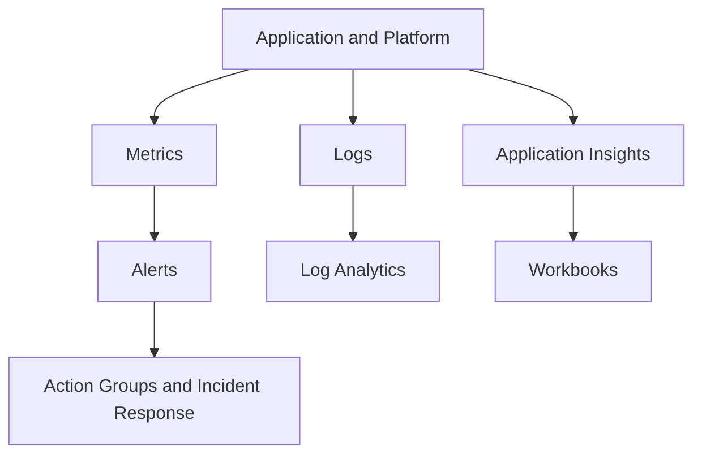

> **Screenshot Disclaimer:** Portal screenshots referenced in this guide are sourced from [Microsoft Learn](https://learn.microsoft.com/en-us/azure/) documentation. © Microsoft Corporation. All rights reserved. Used for educational reference only.

# 05 DevOps and Monitoring Interview Q and A

DevOps and monitoring questions assess whether you can automate delivery, reduce deployment risk, and operate workloads with evidence. Good answers connect CI/CD, IaC, observability, and incident response.

## Delivery pipeline view



## Observability loop



## DevOps Q and A

### Q1: What is CI/CD?

**Answer:**
CI/CD stands for Continuous Integration and Continuous Delivery or Continuous Deployment. CI focuses on building and validating every code change, while CD focuses on safely delivering those changes into target environments.

**Key Points:**
- CI improves feedback speed and code quality.
- CD improves release consistency and repeatability.
- Pipelines should include testing, security, and rollback planning.

**Example Scenario:**
"Every pull request triggers tests and linting, then a merged change automatically deploys to dev and waits for approval before production."

**Follow-up Questions:**

**Q: What is the difference between delivery and deployment?**
Continuous delivery means the code is always in a releasable state and can be deployed on demand. Continuous deployment goes one step further by automatically releasing every validated change to production. A practical example is a team that auto-deploys to staging after CI, but requires a manual approval before production, which is delivery but not full deployment.

**Q: How do you prevent broken releases?**
Prevent broken releases by combining automated tests, environment approvals, health checks, and progressive rollout strategies like canary or blue-green. In Azure DevOps or GitHub Actions, that usually means gating production on unit tests, security scans, and deployment validation steps. Real teams also keep a rollback path ready, because prevention is strongest when paired with fast recovery.

### Q2: How do you compare Azure DevOps and GitHub Actions?

**Answer:**
Azure DevOps provides an integrated suite with Boards, Repos, Pipelines, Test Plans, and Artifacts, while GitHub Actions is workflow automation tightly integrated with GitHub repositories and ecosystem events.

**Key Points:**
- Azure DevOps is strong for enterprises already using Boards and classic release governance.
- GitHub Actions is strong for repository-centric automation and GitHub-native developer workflows.
- Both support Azure deployments and YAML pipelines.

**Comparison Table:**

| Area | Azure DevOps | GitHub Actions |
|---|---|---|
| Best fit | Enterprise ALM suite | GitHub-centric automation |
| Work tracking | Built-in Boards | Usually external or GitHub Issues |
| Package feeds | Azure Artifacts | GitHub Packages or external |
| Pipeline model | YAML and legacy classic options | YAML workflows |

**Example Scenario:**
"A company using Azure Boards end to end may prefer Azure DevOps, while a product team already standardized on GitHub may prefer Actions."

**Follow-up Questions:**

**Q: Which is easier for self-hosted runners?**
Azure DevOps is often easier for organizations already invested in its agent pools, deployment jobs, and environment approvals, especially in private enterprise networks. GitHub Actions self-hosted runners are lightweight and flexible, but larger governance models may need more setup around runner groups and permissions. A good interview answer is that the easier option depends on the platform your teams already standardize on.

**Q: How do service connections differ?**
Azure DevOps uses explicit service connections to represent external credentials and permissions for Azure, Kubernetes, Docker registries, and other targets. GitHub Actions usually authenticates through repository or environment secrets, or preferably OIDC federation with actions like `azure/login`. In practice, Azure DevOps centralizes connection objects in the platform, while GitHub Actions keeps more of the auth logic inside the workflow definition.

### Q3: What are stages, jobs, and steps in YAML pipelines?

**Answer:**
A stage is a major phase like build or deploy, a job is a unit of work running on an agent or server, and steps are the individual tasks or scripts executed inside a job.

**Key Points:**
- Stages often map to environments or major lifecycle gates.
- Jobs can run in parallel.
- Steps are the smallest executable units.

**Example Scenario:**
"A pipeline has a Build stage, a Test stage, and a Deploy stage. The Test stage runs unit and integration jobs in parallel."

**Follow-up Questions:**

**Q: What is a deployment job?**
A deployment job is a pipeline job type designed for deploying to a target environment with built-in tracking, approvals, and deployment history. In Azure DevOps, deployment jobs work well with environments so you can see what version went where and when. A common example is a production deployment job that requires approval and records the release against the prod environment.

**Q: How do dependencies between stages work?**
Stage dependencies control execution order so later stages only run when earlier ones succeed or meet defined conditions. In YAML, you typically use `dependsOn` and conditions such as `succeeded()` to govern flow. For example, a `DeployProd` stage should depend on `DeployTest` and `SecurityScan` so production only starts after both validations pass.

### Q4: What are service connections in Azure DevOps?

**Answer:**
Service connections are secure pipeline integrations that let Azure DevOps authenticate to external services such as Azure subscriptions, container registries, or Kubernetes clusters.

**Key Points:**
- Often use service principals or workload identity patterns.
- Should be scoped minimally.
- Need governance because pipelines can become highly privileged.

**Example Scenario:**
"A production deployment stage uses a service connection scoped only to one resource group instead of the full subscription."

**Follow-up Questions:**

**Q: How do you rotate credentials?**
Rotate credentials by using short lifetimes, storing them in Azure Key Vault, updating the consuming pipeline or app, and then retiring the old value after validation. For service principals, that may mean creating a new secret or certificate, updating the service connection, and confirming the pipeline still authenticates before deleting the old credential. Mature teams automate reminders and use overlapping validity so rotation does not break deployments.

**Q: How can managed identity or federation reduce secret usage?**
Managed identity and workload identity federation remove the need to store long-lived secrets in pipelines. Managed identity works for workloads running in Azure, while federation lets external systems like GitHub Actions exchange an OIDC token for Azure access. In practice, this reduces secret leakage risk and eliminates much of the manual credential rotation burden.

### Q5: How can managed identity help in pipelines?

**Answer:**
Managed identity helps when build or deployment automation runs on Azure-hosted compute such as self-hosted agents in Azure VMs, AKS, or container apps, allowing the agent to authenticate to Azure services without stored secrets.

**Key Points:**
- Good for self-hosted agents in Azure.
- Reduces secret management burden.
- Still requires carefully scoped RBAC.

**Example Scenario:**
"A self-hosted agent in an Azure VM uses system-assigned managed identity to pull secrets from Key Vault and deploy Bicep templates."

**Follow-up Questions:**

**Q: What if the pipeline runs outside Azure?**
If the pipeline runs outside Azure, it usually cannot use a managed identity because managed identities are bound to Azure-hosted resources. In that case, use an Entra application with a certificate or, preferably, workload identity federation if the CI platform supports OIDC. A common example is GitHub-hosted runners authenticating to Azure without storing a client secret.

**Q: How does this compare with workload identity federation?**
Workload identity federation is generally better than a traditional service principal secret because it uses short-lived token exchange instead of static credentials. It provides the same app identity concept, but with less secret management and lower leakage risk. In interviews, say managed identity is best inside Azure, federation is best outside Azure when supported.

### Q6: What are common deployment strategies?

**Answer:**
Common deployment strategies include blue-green, canary, and rolling deployment. Each aims to reduce release risk with different tradeoffs in capacity, complexity, and rollback speed.

**Key Points:**
- Blue-green swaps traffic between old and new environments.
- Canary exposes a small percentage of users to the new version first.
- Rolling replaces instances gradually.

**Example Scenario:**
"A customer-facing API uses canary release to send 10 percent of traffic to the new version while monitoring error rates."

**Follow-up Questions:**

**Q: Which strategy gives fastest rollback?**
Blue-green usually gives the fastest rollback because traffic can be switched back to the previous environment almost immediately. That makes it attractive for high-availability applications where downtime or long repair windows are unacceptable. A common Azure example is swapping traffic back to the old App Service slot or backend pool if the new release fails health checks.

**Q: Which strategy needs the most duplicate capacity?**
Blue-green typically needs the most duplicate capacity because you maintain two full environments at the same time. Canary and rolling approaches usually consume less extra infrastructure because only part of the workload is updated at once. In interviews, this is a good tradeoff to mention: faster rollback usually costs more infrastructure.

### Q7: How do you explain blue-green deployment in Azure?

**Answer:**
Blue-green deployment runs two parallel environments, one live and one staging. After validation, traffic shifts to the new environment. In Azure App Service, deployment slots are a common implementation.

**Key Points:**
- Fast rollback by swapping back.
- Useful for web applications.
- Requires careful data compatibility planning.

**Example Scenario:**
"A production web app uses App Service deployment slots. After smoke tests in staging, the slot is swapped into production."

**Follow-up Questions:**

**Q: What slot settings should be sticky?**
Sticky slot settings usually include environment-specific values such as connection strings, app settings with secrets, custom domain bindings, and certificates that should stay with the slot. In Azure App Service, you mark them as deployment slot settings so they do not swap during a slot swap. That prevents production secrets or endpoints from accidentally moving into staging.

**Q: How do database changes complicate blue-green?**
Database changes complicate blue-green because both old and new application versions may need to work against the same schema during the transition. That means migrations should be backward compatible, or you need an expand-and-contract approach. A practical example is adding a nullable column first, deploying the new app, and only later removing the old column dependency.

### Q8: What is canary deployment?

**Answer:**
Canary deployment releases a new version to a small subset of users or instances first, then gradually expands if telemetry remains healthy.

**Key Points:**
- Reduces blast radius.
- Requires strong observability.
- Often used in AKS, Front Door, or service mesh patterns.

**Example Scenario:**
"A new microservice version receives 5 percent of traffic for 30 minutes while the team watches latency and error budgets."

**Follow-up Questions:**

**Q: What metrics drive rollback?**
Rollback should be driven by service health indicators such as error rate, latency, availability, saturation, and sometimes business KPIs like checkout success rate. Azure Monitor, Application Insights, and platform probes can all feed those decisions. For example, if the canary version shows a sustained spike in 5xx responses compared with baseline, the release should stop or roll back.

**Q: How do you automate traffic progression?**
Automate traffic progression by increasing exposure in controlled steps based on health checks and alert thresholds. This can be done with App Service traffic splitting, Front Door routing weights, AKS progressive delivery tools, or pipeline gates that pause between increments. A solid interview answer is to move from 5 percent to 25 percent to 100 percent only when telemetry stays healthy at each step.

### Q9: What is rolling deployment?

**Answer:**
Rolling deployment updates instances in batches until all instances run the new version, maintaining availability while gradually replacing capacity.

**Key Points:**
- Good for VMSS and Kubernetes updates.
- Requires health checks.
- Slower rollback than blue-green but cheaper in extra capacity.

**Example Scenario:**
"A VM Scale Set web tier updates 20 percent of instances at a time using health probes to confirm readiness."

**Follow-up Questions:**

**Q: What happens if one batch fails?**
In a rolling deployment, the rollout should pause when one batch fails so the problem does not spread to the remaining instances. The failed batch is investigated, and depending on the platform, traffic can be drained or the updated instances can be replaced with the previous version. In AKS or VM scale scenarios, this limits the blast radius to a subset of nodes.

**Q: How do max surge settings affect rollout?**
Max surge controls how many extra instances or nodes can be added temporarily during the rollout, which affects speed, availability, and capacity cost. A higher surge usually makes upgrades faster and safer for availability because new capacity comes online before old capacity is removed. In practice, teams tune max surge based on traffic patterns and whether the app can tolerate reduced capacity during updates.

### Q10: How do you compare ARM templates, Bicep, and Terraform for IaC?

**Answer:**
ARM templates are native JSON definitions for Azure resources, Bicep is a more readable Azure-native language that compiles to ARM, and Terraform is a cross-platform IaC tool using provider plugins and state.

**Comparison Table:**

| Tool | Strength | Tradeoff |
|---|---|---|
| ARM | Native support and full control | Verbose JSON |
| Bicep | Cleaner syntax and Azure-native workflow | Primarily Azure focused |
| Terraform | Multi-cloud and large module ecosystem | External state management complexity |

**Example Scenario:**
"An Azure-only platform team often prefers Bicep, while a multi-cloud enterprise may standardize on Terraform."

**Follow-up Questions:**

**Q: Why is Bicep often easier to maintain than ARM JSON?**
Bicep is easier to maintain because it has cleaner syntax, supports modules, and removes much of the verbosity and nesting found in ARM JSON. It still deploys through ARM, so you keep native Azure integration while making templates more readable. A real example is reusing a Bicep module for standard VNets or Key Vaults instead of copying long JSON blocks between repositories.

**Q: What governance risks exist with Terraform state?**
Terraform state can expose sensitive values and becomes a critical control point for change integrity, so it must be protected carefully. If remote state in Azure Storage is not secured with RBAC, encryption, locking, and restricted access, teams can suffer drift, accidental overwrite, or secret exposure. In interviews, mention that Terraform governance is not only about the code but also about who can read and modify the state.

### Q11: What is GitOps?

**Answer:**
GitOps is an operating model where the desired system state is stored declaratively in Git, and automation continuously reconciles the runtime environment to match that source of truth.

**Key Points:**
- Strong fit for Kubernetes platforms.
- Improves auditability and rollback discipline.
- Requires branch and repository governance.

**Example Scenario:**
"An AKS cluster uses Flux to reconcile manifests from a Git repository so production changes happen only through pull requests."

**Follow-up Questions:**

**Q: How does GitOps differ from push-based deployment?**
In GitOps, the desired state lives in Git and an agent such as Flux continuously pulls and reconciles that state into the environment. Push-based deployment sends changes directly from the pipeline to the target platform at release time. A practical Azure example is AKS with Flux pulling manifests from Git instead of a pipeline running `kubectl apply`.

**Q: What risks remain if Git becomes the source of truth?**
Git as the source of truth still creates risk if repository permissions, branch protections, reviews, or secret handling are weak. A bad or malicious commit can still be deployed automatically if the controls around Git are poor. In interviews, mention that GitOps improves traceability, but it does not remove the need for strong repo governance and environment policy.

### Q12: What is Azure Container Registry?

**Answer:**
Azure Container Registry, or ACR, is a managed private registry for storing and managing container images and OCI artifacts used by AKS, App Service, and other container platforms.

**Key Points:**
- Supports geo-replication, webhooks, and tasks.
- Integrates with AKS and managed identities.
- Image scanning and signing should be part of the wider supply-chain strategy.

**Example Scenario:**
"A platform team stores signed application images in ACR and allows AKS to pull them using managed identity."

**Follow-up Questions:**

**Q: What are ACR Tasks?**
ACR Tasks are Azure Container Registry automation features that build, test, or patch container images in the registry. They support quick tasks, scheduled builds, source-triggered builds, and base-image update triggers. A useful real-world example is automatically rebuilding an app image when the upstream base image receives security fixes.

**Q: How do you secure image pull access?**
Secure image pull access by using managed identities or tightly scoped service principals instead of broad admin credentials on the registry. In AKS, `AcrPull` on the cluster identity is the common pattern, while App Service or Container Apps can also use managed identity to pull images. The interview-ready message is to disable the ACR admin account unless there is a very specific legacy need.

### Q13: How do you build, push, and scan images in Azure?

**Answer:**
Images can be built in CI or with ACR Tasks, pushed to ACR using authenticated workflows, scanned with integrated or external security tooling, and promoted across environments using tags or immutable digests.

**Key Points:**
- Prefer immutable digests for deployments.
- Scan before release promotion.
- Enforce pull permissions with least privilege.

**Example Scenario:**
"A pipeline builds an image, runs unit tests and vulnerability scanning, pushes to ACR, and deploys only if severity thresholds pass."

**Follow-up Questions:**

**Q: Why are mutable tags risky?**
Mutable tags like `latest` are risky because the same tag can point to different image contents over time, which hurts traceability and reproducibility. That makes rollbacks and incident investigations much harder because you cannot be sure what actually ran in production. A safer pattern is deploying immutable digests or versioned tags such as `1.4.7`.

**Q: How do you handle base image patching?**
Handle base image patching by rebuilding application images whenever the base image is updated, then re-running tests and vulnerability scans before promotion. ACR Tasks can help automate that flow with base-image triggers. In practice, this keeps dependencies current without manually editing every Dockerfile for each security patch.

### Q14: What are common CI/CD pipeline interview best practices?

**Answer:**
Best practices include fast feedback, branch protection, secretless or low-secret authentication, automated testing, artifact immutability, environment approvals, deployment validation, and rollback planning.

**Key Points:**
- Pipelines should be reproducible and source controlled.
- Quality gates should happen early.
- Production deployments should be observable and auditable.

**Example Scenario:**
"A release pipeline blocks production if security scans fail or if post-deploy health checks exceed the error threshold."

**Follow-up Questions:**

**Q: What tests belong in CI vs CD?**
CI should run fast, high-signal checks such as linting, unit tests, SAST, dependency scans, and basic build validation on every commit. CD should add slower or environment-aware checks such as integration tests, smoke tests, deployment validation, and post-deploy health checks. A good interview example is unit tests in pull requests and canary smoke tests after deployment to staging or production.

**Q: How do you keep pipelines fast and secure?**
Keep pipelines fast by caching dependencies, parallelizing independent jobs, and only running expensive stages when needed. Keep them secure by using least-privilege identities, secretless auth such as OIDC or managed identity, signed artifacts, and gated promotions. Strong teams optimize both speed and trust, rather than sacrificing one for the other.

## Monitoring Q and A

### Q15: What is Azure Monitor?

**Answer:**
Azure Monitor is the primary Azure observability platform for collecting, analyzing, and acting on metrics, logs, traces, and events from Azure resources, applications, and some hybrid sources.

**Key Points:**
- Covers metrics, logs, alerts, dashboards, and workbooks.
- Integrates with Log Analytics and Application Insights.
- Central to incident detection and operational visibility.

**Example Scenario:**
"A production environment sends platform metrics and diagnostic logs to Azure Monitor, where alerts notify the on-call team."

**Follow-up Questions:**

**Q: What is the difference between metrics and logs?**
Metrics are lightweight numeric time-series values optimized for near real-time alerting and trending, such as CPU percentage or request count. Logs are richer event records with more context, better suited for investigation and KQL analysis in Log Analytics. In practice, teams alert quickly on metrics, then pivot into logs to understand why the issue happened.

**Q: How does Azure Monitor integrate with Defender or Service Health?**
Azure Monitor can surface signals from Microsoft Defender products and Azure Service Health through alerts, workbooks, and centralized operational workflows. Service Health helps detect platform incidents or planned maintenance, while Defender adds security findings and threat context. A useful real-world pattern is sending both operational and security alerts into the same action groups or incident process.

### Q16: What is a Log Analytics workspace?

**Answer:**
A Log Analytics workspace is the central data store and query environment for Azure Monitor logs, where data is collected and queried using Kusto Query Language, or KQL.

**Key Points:**
- Many services send diagnostics here.
- Retention affects cost and investigation depth.
- Workspaces can be shared across many resources.

**Example Scenario:**
"Application, NSG flow, and VM logs all land in one workspace to support centralized correlation during incidents."

**Follow-up Questions:**

**Q: How do you structure workspaces at enterprise scale?**
At enterprise scale, workspace design usually balances central visibility with data residency, access boundaries, and cost management. Many organizations use a small number of regional or business-unit workspaces rather than one per resource, then control access with RBAC and table-level strategies where needed. A common landing-zone model is separate workspaces for production and nonproduction, with Sentinel connected only to the higher-value security workspace.

**Q: What are workspace cost drivers?**
The biggest workspace cost drivers are ingestion volume, data retention length, and high-cardinality verbose logs from services like firewalls, containers, and diagnostics. Query frequency and certain analytics features can also add cost depending on the design. In practice, teams control spend by filtering unnecessary diagnostic categories and setting different retention by table or workload importance.

### Q17: What is Application Insights?

**Answer:**
Application Insights is an application performance monitoring service that tracks request rates, response times, failures, dependencies, exceptions, user behavior, and availability for supported applications.

**Key Points:**
- Strong fit for web apps, APIs, and distributed services.
- Integrates with code instrumentation and OpenTelemetry approaches.
- Helps connect customer impact to technical telemetry.

**Example Scenario:**
"A .NET API uses Application Insights to trace slow SQL dependencies and identify failing endpoints after a release."

**Follow-up Questions:**

**Q: What is the difference between App Insights and Log Analytics?**
Application Insights is application performance monitoring focused on requests, dependencies, exceptions, traces, and user-impact telemetry. Log Analytics is the broader analytics platform and query store behind Azure Monitor, capable of analyzing many Azure and non-Azure data sources with KQL. A common example is using App Insights for app latency and failure analysis, then correlating that with infrastructure or security logs in Log Analytics.

**Q: How do distributed traces help microservices troubleshooting?**
Distributed traces follow a single transaction across multiple services, making it easier to see where latency or failure actually started. Instead of guessing which service is at fault, you can trace the call chain and identify the slow dependency or failing downstream API. In microservices environments, that is often the fastest way to separate an application bug from a network or database bottleneck.

### Q18: What are availability tests in Application Insights?

**Answer:**
Availability tests are synthetic checks that periodically call an endpoint or application path to validate uptime, latency, and basic functionality from one or more locations.

**Key Points:**
- Helpful for external health validation.
- Often combined with alert rules.
- Should represent realistic but stable checks.

**Example Scenario:**
"A checkout endpoint is tested every five minutes from multiple regions to detect internet-facing availability issues quickly."

**Follow-up Questions:**

**Q: What makes a good availability test?**
A good availability test validates the user-critical path, not just whether a server responds to ping. In Application Insights, that often means testing a login page, API health endpoint, or checkout flow from multiple locations with realistic success criteria. The best tests are lightweight enough to run frequently but meaningful enough to catch real customer impact.

**Q: How do you avoid false positives?**
Avoid false positives by testing from multiple regions, tuning failure thresholds, and excluding expected maintenance windows or transient startup behavior. You should also align alert rules with consecutive failures rather than a single missed probe. In practice, a test that requires failures from several locations before paging is much more reliable than one noisy single-region probe.

### Q19: What are the major Azure Monitor alert types?

**Answer:**
Major alert types include metric alerts, log alerts, activity log alerts, and service health alerts.

**Key Points:**
- Metric alerts are near real-time and numeric.
- Log alerts use KQL and support richer conditions.
- Activity log alerts watch subscription events like service health or administrative changes.

**Example Scenario:**
"CPU saturation on VMs uses metric alerts, while repeated failed sign-ins or custom app exceptions use log alerts."

**Follow-up Questions:**

**Q: When is dynamic threshold alerting useful?**
Dynamic threshold alerting is useful when a metric has natural daily or weekly patterns and a fixed threshold would either miss problems or create noise. Azure Monitor can learn the baseline and alert on unusual deviations instead of a hardcoded number. A common example is transaction volume that drops unexpectedly overnight relative to its normal behavior for that hour.

**Q: Which alert type detects resource deletion events?**
Activity Log alerts are the right alert type for control-plane events such as resource deletion, policy assignment changes, or role assignment updates. They monitor Azure platform operations rather than application performance metrics. In a real environment, teams often create Activity Log alerts for deletion of production resource groups or changes to critical networking resources.

### Q20: What are diagnostic settings?

**Answer:**
Diagnostic settings control where Azure resource logs and metrics are sent, such as Log Analytics workspaces, storage accounts, event hubs, or partner solutions.

**Key Points:**
- Critical for centralized logging.
- Can be enforced with policy.
- Destination choice affects retention, cost, and integration.

**Example Scenario:**
"All Key Vault audit logs and Application Gateway access logs are sent to a centralized Log Analytics workspace and long-term archive storage."

**Follow-up Questions:**

**Q: Why are diagnostic settings often missed?**
Diagnostic settings are often missed because teams deploy the resource but forget the separate step required to send platform logs and metrics to a destination. Many Azure services do not emit the needed operational or security logs anywhere until diagnostic settings are configured. That is why mature landing zones enforce them with Policy or `deployIfNotExists` remediation.

**Q: Which destinations are best for SIEM integration?**
For SIEM integration, Log Analytics is usually the best Azure-native destination because it supports KQL, Sentinel, and broad connector coverage. Event Hubs is also common when logs need to stream to an external SIEM such as Splunk or QRadar. In interviews, a strong answer is that the destination depends on whether Azure itself or another platform is doing the security analytics.

### Q21: What are action groups?

**Answer:**
Action groups are reusable notification and automation targets for alerts, such as email, SMS, webhook, Logic App, Azure Function, or ITSM integration.

**Key Points:**
- Promote consistency across alerts.
- Can trigger human or automated response.
- Should be tested periodically.

**Example Scenario:**
"Critical production alerts send email and Teams notifications to the on-call group and invoke a webhook to open an incident automatically."

**Follow-up Questions:**

**Q: How do you reduce alert fatigue?**
Reduce alert fatigue by removing low-value alerts, deduplicating noisy signals, tuning thresholds, and focusing pages on symptoms that require action. It also helps to route informational alerts to dashboards or tickets instead of waking people up. A real-world improvement is consolidating many per-resource CPU alerts into one service-level alert with better context.

**Q: Which actions are best for Sev1 incidents?**
For Sev1 incidents, action groups should trigger fast human response channels such as phone, SMS, pager, Teams, or an ITSM incident integration. Automation can also run an Azure Automation runbook or Logic App, but only for well-tested first-response tasks. The interview-ready answer is that Sev1 actions should prioritize immediate visibility, escalation, and clear ownership.

### Q22: What is the difference between Workbooks and Dashboards?

**Answer:**
Workbooks are rich interactive reporting experiences built on logs, metrics, and parameters, while Azure Dashboards are portal views that pin visual tiles from different sources.

**Key Points:**
- Workbooks are more flexible for deep analysis.
- Dashboards are better for quick operational overviews.
- Workbooks are usually stronger for engineering investigations.

**Example Scenario:**
"An SRE team uses a workbook showing API latency, deployment versions, and regional health, while executives view a lighter dashboard."

**Follow-up Questions:**

**Q: Which is better for KQL-driven drill-down?**
Workbooks are better for KQL-driven drill-down because they are designed for interactive analysis, parameters, visualizations, and linked investigations. Azure Dashboards are lighter-weight summary views, but they are not as strong for deep operational analysis. A practical example is building a workbook that lets an engineer pivot from failed requests to dependency latency to affected regions in one screen.

**Q: How do you share them securely?**
Share workbooks and dashboards securely by granting Azure RBAC access only to the right users or groups and avoiding exposure of sensitive data to broad readers. Where possible, separate prod and nonprod views and use least-privilege workspace permissions underneath the visual layer. In practice, secure sharing is not just about the workbook object but also about who can query the underlying Log Analytics data.

### Q23: What are useful KQL examples to know?

**Answer:**
KQL is the query language used in Log Analytics and Application Insights. Interviewers often appreciate practical examples more than theory alone.

**Key Points:**
- Use `where`, `summarize`, `order by`, `project`, and `join` regularly.
- Time filters are essential.
- Good KQL examples show troubleshooting value.

**KQL Examples:**

```kusto
// 1. Top failing requests in App Insights
requests
| where timestamp > ago(1h)
| where success == false
| summarize failures = count() by name, resultCode
| order by failures desc
```

```kusto
// 2. VM heartbeat gaps
Heartbeat
| where TimeGenerated > ago(1h)
| summarize LastSeen = max(TimeGenerated) by Computer
| extend MinutesSinceSeen = datetime_diff('minute', now(), LastSeen) * -1
| order by MinutesSinceSeen desc
```

```kusto
// 3. NSG denies by destination port
AzureDiagnostics
| where TimeGenerated > ago(24h)
| where Category == "NetworkSecurityGroupFlowEvent"
| where action_s == "D"
| summarize Denies = count() by destPort_s
| order by Denies desc
```

```kusto
// 4. Azure Activity failed operations
AzureActivity
| where TimeGenerated > ago(24h)
| where ActivityStatusValue == "Failure"
| project TimeGenerated, OperationNameValue, ResourceGroup, Caller, ActivitySubstatusValue
| order by TimeGenerated desc
```

```kusto
// 5. High latency dependencies
dependencies
| where timestamp > ago(1h)
| summarize AvgDurationMs = avg(duration) by target, type
| order by AvgDurationMs desc
```

**Example Scenario:**
"During an incident, the team correlates failed requests, dependency latency, and Azure Activity operations in one workspace."

**Follow-up Questions:**

**Q: What tables appear only with certain data sources?**
Many Log Analytics tables exist only when the related connector or diagnostic source is enabled, such as `SigninLogs` for Entra ID, `SecurityEvent` for Windows security logs, or `AzureDiagnostics` for resource diagnostics. That means missing data is often a collection problem, not a query problem. In interviews, it is good to mention that table availability depends on onboarding the right Azure Monitor agent, diagnostic settings, or Microsoft service connector.

**Q: How do you control KQL cost and performance?**
Control KQL cost and performance by filtering early, limiting time ranges, projecting only needed columns, and summarizing instead of returning raw high-volume data. Use ingestion-time filtering carefully, and avoid querying huge tables broadly when a narrower scope will do. A practical example is starting with `where TimeGenerated > ago(1h)` and `project` before expensive joins.

### Q24: How do you reduce monitoring cost?

**Answer:**
Reduce monitoring cost by collecting only useful logs, tuning retention, using sampling where appropriate, filtering noisy telemetry, selecting the right alert frequency, and sending archival data to cheaper storage when possible.

**Key Points:**
- More data is not always better.
- High-volume diagnostics can be expensive.
- Observability design should be intentional.

**Example Scenario:**
"A team lowers App Insights cost by sampling verbose traces in development and shortening retention for low-value debug logs."

**Follow-up Questions:**

**Q: What logs should never be dropped carelessly?**
Identity, audit, security, and control-plane logs should never be dropped carelessly because they are essential for investigations and compliance. Examples include Entra sign-in logs, Azure Activity Logs, Key Vault access logs, firewall logs, and privileged access events. If cost is a concern, reduce less critical verbosity first rather than removing the evidence you need during an incident.

**Q: How do you explain the cost-risk tradeoff?**
The cost-risk tradeoff means not every log has equal value, so you keep the data that materially improves detection, response, and compliance and trim the rest. Cheaper logging that omits critical identity or security records can become very expensive during an outage or breach. In interviews, frame it as optimizing logging, not blindly minimizing it.

### Q25: How would you design centralized logging in Azure?

**Answer:**
I would define one or more Log Analytics workspaces by security and operational boundary, send diagnostic settings from critical resources, standardize naming and retention, use workbooks and alerts, and integrate with Sentinel or archival storage where needed.

**Key Points:**
- Workspace strategy matters early.
- Diagnostic settings should be automated.
- Access to logs must also follow least privilege.

**Example Scenario:**
"A landing zone deploys a central monitoring subscription with shared workspaces, action groups, and policy to enforce diagnostics on new resources."

**Follow-up Questions:**

**Q: Should every environment share one workspace?**
No, every environment does not need to share one workspace. The decision should balance centralized operations against separation needs such as access control, data residency, chargeback, and noise isolation. A common pattern is one or a few production workspaces and separate nonproduction workspaces so engineers can investigate safely without broad prod log access.

**Q: How do you separate prod and nonprod data?**
The cleanest separation is usually using different Log Analytics workspaces for production and nonproduction. If a shared workspace is unavoidable, use strict RBAC, naming standards, and query scoping, though that is weaker than physical separation. In real environments, separate workspaces make retention, Sentinel onboarding, and access reviews much easier to govern.

## Useful CLI commands

```bash
az pipelines list --output table
az acr list --output table
az monitor metrics list --resource /subscriptions/<sub>/resourceGroups/<rg>/providers/Microsoft.Compute/virtualMachines/<vm> --metric Percentage CPU --interval PT1M
az monitor log-analytics workspace list --output table
az monitor app-insights component show --app myappinsights --resource-group myRG --output table
az monitor diagnostic-settings list --resource /subscriptions/<sub>/resourceGroups/<rg>/providers/Microsoft.KeyVault/vaults/<vault>
```

Expected output:

- Pipeline listing shows pipeline names and folder paths.
- ACR list shows registries and SKUs.
- Metrics command returns CPU datapoints for the target resource.
- Log Analytics workspaces list names and regions.
- Application Insights command returns the component app id and connection information.
- Diagnostic settings list shows destinations configured for the resource.

## Portal navigation notes

- `Azure Portal` → `Monitor` → `Alerts`
- `Azure Portal` → `Monitor` → `Logs`
- `Azure Portal` → `Monitor` → `Workbooks`
- `Azure Portal` → `Application Insights` → `Failures`, `Performance`, `Availability`
- `Azure DevOps` → `Pipelines` → `Pipelines` or `Environments`
- `Azure Portal` → `Container registries` → `Repositories`

## Official Microsoft References

- [Azure DevOps documentation](https://learn.microsoft.com/azure/devops/)
- [GitHub Actions documentation](https://docs.github.com/actions)
- [Bicep documentation](https://learn.microsoft.com/azure/azure-resource-manager/bicep/)
- [Terraform on Azure](https://learn.microsoft.com/azure/developer/terraform/)
- [Azure Container Registry documentation](https://learn.microsoft.com/azure/container-registry/)
- [Azure Monitor documentation](https://learn.microsoft.com/azure/azure-monitor/)
- [Log Analytics and KQL](https://learn.microsoft.com/azure/azure-monitor/logs/log-query-overview)
- [Application Insights overview](https://learn.microsoft.com/azure/azure-monitor/app/app-insights-overview)
- [Create and manage alerts](https://learn.microsoft.com/azure/azure-monitor/alerts/alerts-overview)
- [Diagnostic settings](https://learn.microsoft.com/azure/azure-monitor/essentials/diagnostic-settings)
