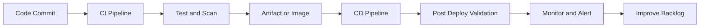
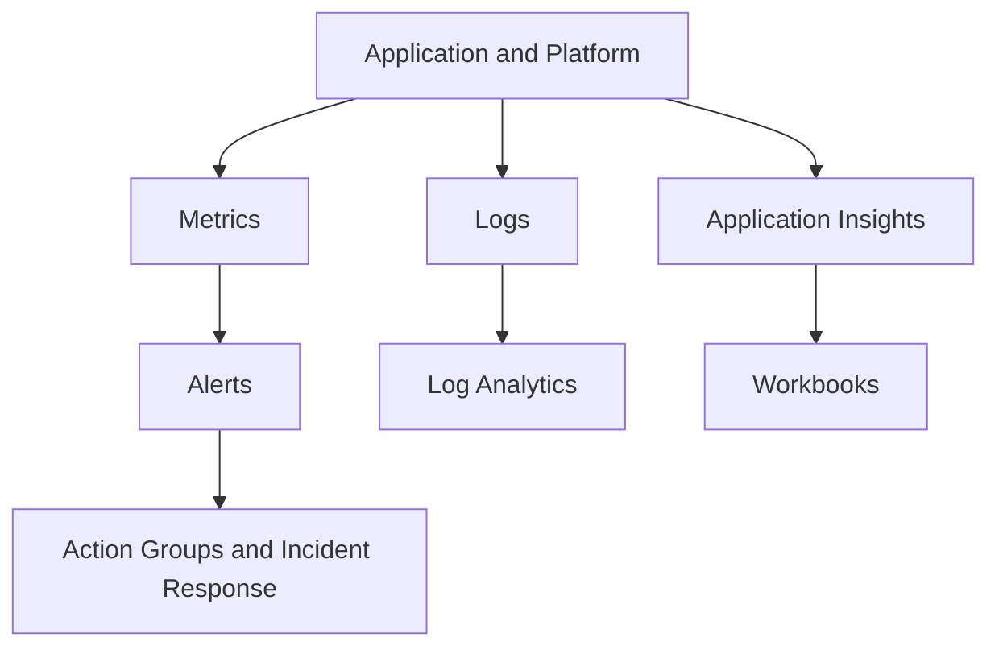

> **Screenshot Disclaimer:** Portal screenshots referenced in this guide are sourced from [Microsoft Learn](https://learn.microsoft.com/en-us/azure/) documentation. © Microsoft Corporation. All rights reserved. Used for educational reference only.

# 05 DevOps and Monitoring Interview Q and A

DevOps and monitoring questions assess whether you can automate delivery, reduce deployment risk, and operate workloads with evidence. Good answers connect CI/CD, IaC, observability, and incident response.

## Delivery pipeline view



## Observability loop



## DevOps Q and A

### Q: What is CI/CD?

**Answer:**
CI/CD stands for Continuous Integration and Continuous Delivery or Continuous Deployment. CI focuses on building and validating every code change, while CD focuses on safely delivering those changes into target environments.

**Key Points:**
- CI improves feedback speed and code quality.
- CD improves release consistency and repeatability.
- Pipelines should include testing, security, and rollback planning.

**Example Scenario:**
"Every pull request triggers tests and linting, then a merged change automatically deploys to dev and waits for approval before production."

**Follow-up Questions:**
- What is the difference between delivery and deployment?
- How do you prevent broken releases?

### Q: How do you compare Azure DevOps and GitHub Actions?

**Answer:**
Azure DevOps provides an integrated suite with Boards, Repos, Pipelines, Test Plans, and Artifacts, while GitHub Actions is workflow automation tightly integrated with GitHub repositories and ecosystem events.

**Key Points:**
- Azure DevOps is strong for enterprises already using Boards and classic release governance.
- GitHub Actions is strong for repository-centric automation and GitHub-native developer workflows.
- Both support Azure deployments and YAML pipelines.

**Comparison Table:**

| Area | Azure DevOps | GitHub Actions |
|---|---|---|
| Best fit | Enterprise ALM suite | GitHub-centric automation |
| Work tracking | Built-in Boards | Usually external or GitHub Issues |
| Package feeds | Azure Artifacts | GitHub Packages or external |
| Pipeline model | YAML and legacy classic options | YAML workflows |

**Example Scenario:**
"A company using Azure Boards end to end may prefer Azure DevOps, while a product team already standardized on GitHub may prefer Actions."

**Follow-up Questions:**
- Which is easier for self-hosted runners?
- How do service connections differ?

### Q: What are stages, jobs, and steps in YAML pipelines?

**Answer:**
A stage is a major phase like build or deploy, a job is a unit of work running on an agent or server, and steps are the individual tasks or scripts executed inside a job.

**Key Points:**
- Stages often map to environments or major lifecycle gates.
- Jobs can run in parallel.
- Steps are the smallest executable units.

**Example Scenario:**
"A pipeline has a Build stage, a Test stage, and a Deploy stage. The Test stage runs unit and integration jobs in parallel."

**Follow-up Questions:**
- What is a deployment job?
- How do dependencies between stages work?

### Q: What are service connections in Azure DevOps?

**Answer:**
Service connections are secure pipeline integrations that let Azure DevOps authenticate to external services such as Azure subscriptions, container registries, or Kubernetes clusters.

**Key Points:**
- Often use service principals or workload identity patterns.
- Should be scoped minimally.
- Need governance because pipelines can become highly privileged.

**Example Scenario:**
"A production deployment stage uses a service connection scoped only to one resource group instead of the full subscription."

**Follow-up Questions:**
- How do you rotate credentials?
- How can managed identity or federation reduce secret usage?

### Q: How can managed identity help in pipelines?

**Answer:**
Managed identity helps when build or deployment automation runs on Azure-hosted compute such as self-hosted agents in Azure VMs, AKS, or container apps, allowing the agent to authenticate to Azure services without stored secrets.

**Key Points:**
- Good for self-hosted agents in Azure.
- Reduces secret management burden.
- Still requires carefully scoped RBAC.

**Example Scenario:**
"A self-hosted agent in an Azure VM uses system-assigned managed identity to pull secrets from Key Vault and deploy Bicep templates."

**Follow-up Questions:**
- What if the pipeline runs outside Azure?
- How does this compare with workload identity federation?

### Q: What are common deployment strategies?

**Answer:**
Common deployment strategies include blue-green, canary, and rolling deployment. Each aims to reduce release risk with different tradeoffs in capacity, complexity, and rollback speed.

**Key Points:**
- Blue-green swaps traffic between old and new environments.
- Canary exposes a small percentage of users to the new version first.
- Rolling replaces instances gradually.

**Example Scenario:**
"A customer-facing API uses canary release to send 10 percent of traffic to the new version while monitoring error rates."

**Follow-up Questions:**
- Which strategy gives fastest rollback?
- Which strategy needs the most duplicate capacity?

### Q: How do you explain blue-green deployment in Azure?

**Answer:**
Blue-green deployment runs two parallel environments, one live and one staging. After validation, traffic shifts to the new environment. In Azure App Service, deployment slots are a common implementation.

**Key Points:**
- Fast rollback by swapping back.
- Useful for web applications.
- Requires careful data compatibility planning.

**Example Scenario:**
"A production web app uses App Service deployment slots. After smoke tests in staging, the slot is swapped into production."

**Follow-up Questions:**
- What slot settings should be sticky?
- How do database changes complicate blue-green?

### Q: What is canary deployment?

**Answer:**
Canary deployment releases a new version to a small subset of users or instances first, then gradually expands if telemetry remains healthy.

**Key Points:**
- Reduces blast radius.
- Requires strong observability.
- Often used in AKS, Front Door, or service mesh patterns.

**Example Scenario:**
"A new microservice version receives 5 percent of traffic for 30 minutes while the team watches latency and error budgets."

**Follow-up Questions:**
- What metrics drive rollback?
- How do you automate traffic progression?

### Q: What is rolling deployment?

**Answer:**
Rolling deployment updates instances in batches until all instances run the new version, maintaining availability while gradually replacing capacity.

**Key Points:**
- Good for VMSS and Kubernetes updates.
- Requires health checks.
- Slower rollback than blue-green but cheaper in extra capacity.

**Example Scenario:**
"A VM Scale Set web tier updates 20 percent of instances at a time using health probes to confirm readiness."

**Follow-up Questions:**
- What happens if one batch fails?
- How do max surge settings affect rollout?

### Q: How do you compare ARM templates, Bicep, and Terraform for IaC?

**Answer:**
ARM templates are native JSON definitions for Azure resources, Bicep is a more readable Azure-native language that compiles to ARM, and Terraform is a cross-platform IaC tool using provider plugins and state.

**Comparison Table:**

| Tool | Strength | Tradeoff |
|---|---|---|
| ARM | Native support and full control | Verbose JSON |
| Bicep | Cleaner syntax and Azure-native workflow | Primarily Azure focused |
| Terraform | Multi-cloud and large module ecosystem | External state management complexity |

**Example Scenario:**
"An Azure-only platform team often prefers Bicep, while a multi-cloud enterprise may standardize on Terraform."

**Follow-up Questions:**
- Why is Bicep often easier to maintain than ARM JSON?
- What governance risks exist with Terraform state?

### Q: What is GitOps?

**Answer:**
GitOps is an operating model where the desired system state is stored declaratively in Git, and automation continuously reconciles the runtime environment to match that source of truth.

**Key Points:**
- Strong fit for Kubernetes platforms.
- Improves auditability and rollback discipline.
- Requires branch and repository governance.

**Example Scenario:**
"An AKS cluster uses Flux to reconcile manifests from a Git repository so production changes happen only through pull requests."

**Follow-up Questions:**
- How does GitOps differ from push-based deployment?
- What risks remain if Git becomes the source of truth?

### Q: What is Azure Container Registry?

**Answer:**
Azure Container Registry, or ACR, is a managed private registry for storing and managing container images and OCI artifacts used by AKS, App Service, and other container platforms.

**Key Points:**
- Supports geo-replication, webhooks, and tasks.
- Integrates with AKS and managed identities.
- Image scanning and signing should be part of the wider supply-chain strategy.

**Example Scenario:**
"A platform team stores signed application images in ACR and allows AKS to pull them using managed identity."

**Follow-up Questions:**
- What are ACR Tasks?
- How do you secure image pull access?

### Q: How do you build, push, and scan images in Azure?

**Answer:**
Images can be built in CI or with ACR Tasks, pushed to ACR using authenticated workflows, scanned with integrated or external security tooling, and promoted across environments using tags or immutable digests.

**Key Points:**
- Prefer immutable digests for deployments.
- Scan before release promotion.
- Enforce pull permissions with least privilege.

**Example Scenario:**
"A pipeline builds an image, runs unit tests and vulnerability scanning, pushes to ACR, and deploys only if severity thresholds pass."

**Follow-up Questions:**
- Why are mutable tags risky?
- How do you handle base image patching?

### Q: What are common CI/CD pipeline interview best practices?

**Answer:**
Best practices include fast feedback, branch protection, secretless or low-secret authentication, automated testing, artifact immutability, environment approvals, deployment validation, and rollback planning.

**Key Points:**
- Pipelines should be reproducible and source controlled.
- Quality gates should happen early.
- Production deployments should be observable and auditable.

**Example Scenario:**
"A release pipeline blocks production if security scans fail or if post-deploy health checks exceed the error threshold."

**Follow-up Questions:**
- What tests belong in CI vs CD?
- How do you keep pipelines fast and secure?

## Monitoring Q and A

### Q: What is Azure Monitor?

**Answer:**
Azure Monitor is the primary Azure observability platform for collecting, analyzing, and acting on metrics, logs, traces, and events from Azure resources, applications, and some hybrid sources.

**Key Points:**
- Covers metrics, logs, alerts, dashboards, and workbooks.
- Integrates with Log Analytics and Application Insights.
- Central to incident detection and operational visibility.

**Example Scenario:**
"A production environment sends platform metrics and diagnostic logs to Azure Monitor, where alerts notify the on-call team."

**Follow-up Questions:**
- What is the difference between metrics and logs?
- How does Azure Monitor integrate with Defender or Service Health?

### Q: What is a Log Analytics workspace?

**Answer:**
A Log Analytics workspace is the central data store and query environment for Azure Monitor logs, where data is collected and queried using Kusto Query Language, or KQL.

**Key Points:**
- Many services send diagnostics here.
- Retention affects cost and investigation depth.
- Workspaces can be shared across many resources.

**Example Scenario:**
"Application, NSG flow, and VM logs all land in one workspace to support centralized correlation during incidents."

**Follow-up Questions:**
- How do you structure workspaces at enterprise scale?
- What are workspace cost drivers?

### Q: What is Application Insights?

**Answer:**
Application Insights is an application performance monitoring service that tracks request rates, response times, failures, dependencies, exceptions, user behavior, and availability for supported applications.

**Key Points:**
- Strong fit for web apps, APIs, and distributed services.
- Integrates with code instrumentation and OpenTelemetry approaches.
- Helps connect customer impact to technical telemetry.

**Example Scenario:**
"A .NET API uses Application Insights to trace slow SQL dependencies and identify failing endpoints after a release."

**Follow-up Questions:**
- What is the difference between App Insights and Log Analytics?
- How do distributed traces help microservices troubleshooting?

### Q: What are availability tests in Application Insights?

**Answer:**
Availability tests are synthetic checks that periodically call an endpoint or application path to validate uptime, latency, and basic functionality from one or more locations.

**Key Points:**
- Helpful for external health validation.
- Often combined with alert rules.
- Should represent realistic but stable checks.

**Example Scenario:**
"A checkout endpoint is tested every five minutes from multiple regions to detect internet-facing availability issues quickly."

**Follow-up Questions:**
- What makes a good availability test?
- How do you avoid false positives?

### Q: What are the major Azure Monitor alert types?

**Answer:**
Major alert types include metric alerts, log alerts, activity log alerts, and service health alerts.

**Key Points:**
- Metric alerts are near real-time and numeric.
- Log alerts use KQL and support richer conditions.
- Activity log alerts watch subscription events like service health or administrative changes.

**Example Scenario:**
"CPU saturation on VMs uses metric alerts, while repeated failed sign-ins or custom app exceptions use log alerts."

**Follow-up Questions:**
- When is dynamic threshold alerting useful?
- Which alert type detects resource deletion events?

### Q: What are diagnostic settings?

**Answer:**
Diagnostic settings control where Azure resource logs and metrics are sent, such as Log Analytics workspaces, storage accounts, event hubs, or partner solutions.

**Key Points:**
- Critical for centralized logging.
- Can be enforced with policy.
- Destination choice affects retention, cost, and integration.

**Example Scenario:**
"All Key Vault audit logs and Application Gateway access logs are sent to a centralized Log Analytics workspace and long-term archive storage."

**Follow-up Questions:**
- Why are diagnostic settings often missed?
- Which destinations are best for SIEM integration?

### Q: What are action groups?

**Answer:**
Action groups are reusable notification and automation targets for alerts, such as email, SMS, webhook, Logic App, Azure Function, or ITSM integration.

**Key Points:**
- Promote consistency across alerts.
- Can trigger human or automated response.
- Should be tested periodically.

**Example Scenario:**
"Critical production alerts send email and Teams notifications to the on-call group and invoke a webhook to open an incident automatically."

**Follow-up Questions:**
- How do you reduce alert fatigue?
- Which actions are best for Sev1 incidents?

### Q: What is the difference between Workbooks and Dashboards?

**Answer:**
Workbooks are rich interactive reporting experiences built on logs, metrics, and parameters, while Azure Dashboards are portal views that pin visual tiles from different sources.

**Key Points:**
- Workbooks are more flexible for deep analysis.
- Dashboards are better for quick operational overviews.
- Workbooks are usually stronger for engineering investigations.

**Example Scenario:**
"An SRE team uses a workbook showing API latency, deployment versions, and regional health, while executives view a lighter dashboard."

**Follow-up Questions:**
- Which is better for KQL-driven drill-down?
- How do you share them securely?

### Q: What are useful KQL examples to know?

**Answer:**
KQL is the query language used in Log Analytics and Application Insights. Interviewers often appreciate practical examples more than theory alone.

**Key Points:**
- Use `where`, `summarize`, `order by`, `project`, and `join` regularly.
- Time filters are essential.
- Good KQL examples show troubleshooting value.

**KQL Examples:**

```kusto
// 1. Top failing requests in App Insights
requests
| where timestamp > ago(1h)
| where success == false
| summarize failures = count() by name, resultCode
| order by failures desc
```

```kusto
// 2. VM heartbeat gaps
Heartbeat
| where TimeGenerated > ago(1h)
| summarize LastSeen = max(TimeGenerated) by Computer
| extend MinutesSinceSeen = datetime_diff('minute', now(), LastSeen) * -1
| order by MinutesSinceSeen desc
```

```kusto
// 3. NSG denies by destination port
AzureDiagnostics
| where TimeGenerated > ago(24h)
| where Category == "NetworkSecurityGroupFlowEvent"
| where action_s == "D"
| summarize Denies = count() by destPort_s
| order by Denies desc
```

```kusto
// 4. Azure Activity failed operations
AzureActivity
| where TimeGenerated > ago(24h)
| where ActivityStatusValue == "Failure"
| project TimeGenerated, OperationNameValue, ResourceGroup, Caller, ActivitySubstatusValue
| order by TimeGenerated desc
```

```kusto
// 5. High latency dependencies
dependencies
| where timestamp > ago(1h)
| summarize AvgDurationMs = avg(duration) by target, type
| order by AvgDurationMs desc
```

**Example Scenario:**
"During an incident, the team correlates failed requests, dependency latency, and Azure Activity operations in one workspace."

**Follow-up Questions:**
- What tables appear only with certain data sources?
- How do you control KQL cost and performance?

### Q: How do you reduce monitoring cost?

**Answer:**
Reduce monitoring cost by collecting only useful logs, tuning retention, using sampling where appropriate, filtering noisy telemetry, selecting the right alert frequency, and sending archival data to cheaper storage when possible.

**Key Points:**
- More data is not always better.
- High-volume diagnostics can be expensive.
- Observability design should be intentional.

**Example Scenario:**
"A team lowers App Insights cost by sampling verbose traces in development and shortening retention for low-value debug logs."

**Follow-up Questions:**
- What logs should never be dropped carelessly?
- How do you explain the cost-risk tradeoff?

### Q: How would you design centralized logging in Azure?

**Answer:**
I would define one or more Log Analytics workspaces by security and operational boundary, send diagnostic settings from critical resources, standardize naming and retention, use workbooks and alerts, and integrate with Sentinel or archival storage where needed.

**Key Points:**
- Workspace strategy matters early.
- Diagnostic settings should be automated.
- Access to logs must also follow least privilege.

**Example Scenario:**
"A landing zone deploys a central monitoring subscription with shared workspaces, action groups, and policy to enforce diagnostics on new resources."

**Follow-up Questions:**
- Should every environment share one workspace?
- How do you separate prod and nonprod data?

## Useful CLI commands

```bash
az pipelines list --output table
az acr list --output table
az monitor metrics list --resource /subscriptions/<sub>/resourceGroups/<rg>/providers/Microsoft.Compute/virtualMachines/<vm> --metric Percentage CPU --interval PT1M
az monitor log-analytics workspace list --output table
az monitor app-insights component show --app myappinsights --resource-group myRG --output table
az monitor diagnostic-settings list --resource /subscriptions/<sub>/resourceGroups/<rg>/providers/Microsoft.KeyVault/vaults/<vault>
```

Expected output:

- Pipeline listing shows pipeline names and folder paths.
- ACR list shows registries and SKUs.
- Metrics command returns CPU datapoints for the target resource.
- Log Analytics workspaces list names and regions.
- Application Insights command returns the component app id and connection information.
- Diagnostic settings list shows destinations configured for the resource.

## Portal navigation notes

- `Azure Portal` → `Monitor` → `Alerts`
- `Azure Portal` → `Monitor` → `Logs`
- `Azure Portal` → `Monitor` → `Workbooks`
- `Azure Portal` → `Application Insights` → `Failures`, `Performance`, `Availability`
- `Azure DevOps` → `Pipelines` → `Pipelines` or `Environments`
- `Azure Portal` → `Container registries` → `Repositories`

## Official Microsoft References

- [Azure DevOps documentation](https://learn.microsoft.com/azure/devops/)
- [GitHub Actions documentation](https://docs.github.com/actions)
- [Bicep documentation](https://learn.microsoft.com/azure/azure-resource-manager/bicep/)
- [Terraform on Azure](https://learn.microsoft.com/azure/developer/terraform/)
- [Azure Container Registry documentation](https://learn.microsoft.com/azure/container-registry/)
- [Azure Monitor documentation](https://learn.microsoft.com/azure/azure-monitor/)
- [Log Analytics and KQL](https://learn.microsoft.com/azure/azure-monitor/logs/log-query-overview)
- [Application Insights overview](https://learn.microsoft.com/azure/azure-monitor/app/app-insights-overview)
- [Create and manage alerts](https://learn.microsoft.com/azure/azure-monitor/alerts/alerts-overview)
- [Diagnostic settings](https://learn.microsoft.com/azure/azure-monitor/essentials/diagnostic-settings)
