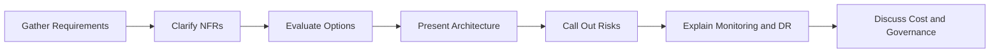
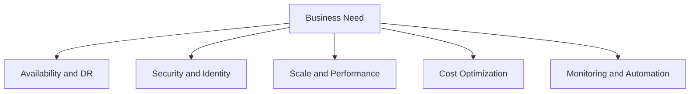
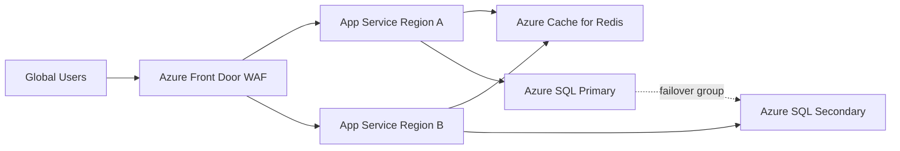
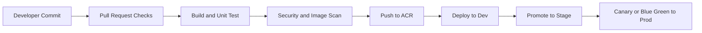

> **Screenshot Disclaimer:** Portal screenshots referenced in this guide are sourced from [Microsoft Learn](https://learn.microsoft.com/en-us/azure/) documentation. © Microsoft Corporation. All rights reserved. Used for educational reference only.

# 06 Scenario Based Azure Interview Q and A

Scenario rounds test whether you can translate requirements into architecture, governance, operations, and tradeoffs. The most effective answers start with assumptions, identify constraints, present a reference architecture, and explain why each choice was made.

## Scenario response framework



## Architecture review checklist



## 1. Design a highly available web application

**Problem Statement:**
A customer-facing web application must support global users, 99.99 percent availability, autoscaling, and resilient data access with minimal manual operations.

**Recommended Solution:**
Use Azure Front Door for global entry, regional Azure App Service deployments in at least two regions, Azure SQL with failover groups or geo-replication, Azure Cache for Redis, Key Vault, and Azure Monitor.



**Key Decisions:**
- Front Door improves global routing and regional failover.
- App Service reduces infrastructure overhead and supports autoscale.
- SQL failover group supports DR and listener-based reconnect.
- Redis reduces database pressure and improves performance.
- Key Vault centralizes secret management.

**Tradeoffs:**
- Multi-region increases cost and operational complexity.
- Session state should not remain in local memory.
- Database schema changes must be region-safe.

**Interview Closeout:**
Mention health probes, deployment slots, synthetic tests, alerting, and defined RTO/RPO.

## 2. Migrate on-premises SQL Server to Azure

**Problem Statement:**
An enterprise needs to migrate a business-critical on-premises SQL Server with minimal downtime and limited application refactoring.

**Recommended Solution:**
Assess with Azure Migrate, choose Azure SQL Database, SQL Managed Instance, or SQL on VM based on compatibility, use DMS for migration, validate performance, then cut over with rollback planning.

**Step-by-step Architecture Thinking:**
- Assess dependencies, unsupported features, and SQL Agent usage.
- If application change must be minimal, favor SQL MI.
- If full OS and SQL control is required, use SQL on VM.
- If app is cloud-ready, use Azure SQL Database.

**Key Decisions:**
- Azure Migrate first for readiness.
- DMS for execution.
- Private connectivity and DNS before cutover.
- Performance testing with representative load.

**Post-migration Validation:**
- Compare row counts and object counts.
- Run smoke and regression tests.
- Check latency, CPU, waits, and connection stability.
- Validate backups, alerts, and DR posture.

## 3. Secure a multi-tier application

**Problem Statement:**
A three-tier application must be secured end to end with minimal public exposure and separation between web, app, and data tiers.

**Recommended Solution:**
Use segmented subnets, NSGs, private endpoints for PaaS services, Key Vault, managed identities, WAF, DDoS Protection, and centralized logging.

**Reference Architecture:**
- Front Door or App Gateway WAF for ingress.
- Web tier in isolated subnet.
- App tier in separate subnet with no direct internet exposure.
- Data tier via private endpoints or private databases.
- Azure Firewall for controlled egress.

**Key Decisions:**
- Least privilege between tiers.
- No embedded credentials.
- Central policy enforcing TLS and private access.
- Defender and Monitor enabled from day one.

**Interview Closeout:**
Mention secret rotation, break-glass accounts, and incident response telemetry.

## 4. Design a disaster recovery solution

**Problem Statement:**
A regulated workload requires documented RPO and RTO targets, tested failover, and regional resilience.

**Recommended Solution:**
Define workload-level RPO/RTO, use Azure Site Recovery for VMs, geo-redundant storage where appropriate, database-specific geo-replication, and a failover runbook with failback procedures.

**Key Decisions:**
- Match technology to workload type, not one tool for everything.
- Replication does not replace backup.
- DNS, identity, and network dependencies must be included.

**Failover Procedure Summary:**
1. Detect regional outage.
2. Confirm impact and invoke incident process.
3. Start workload failover using ASR or service-native failover.
4. Validate app, data, and identity dependencies.
5. Communicate status and monitor recovery.
6. Plan failback after primary stability returns.

**Interview Closeout:**
State that DR must be tested, documented, and measured against RPO/RTO.

## 5. Cost optimization for a growing startup

**Problem Statement:**
A startup has rising Azure spend and needs to reduce costs without compromising growth and customer experience.

**Recommended Solution:**
Right-size VMs, evaluate Reserved Instances or Savings Plans for steady workloads, use Spot where interruption is acceptable, enable autoscaling, apply budgets and tags, and review Azure Advisor recommendations.

**Key Decisions:**
- Separate production baseline from burst capacity.
- Clean up idle resources and orphaned disks.
- Use PaaS where operations cost exceeds IaaS flexibility benefit.
- Review data retention and monitoring volume.

**Interview Closeout:**
Explain that cost optimization is continuous and requires engineering, finance, and governance alignment.

## 6. Set up a landing zone for an enterprise

**Problem Statement:**
A company wants a repeatable platform foundation before onboarding multiple application teams and subscriptions.

**Recommended Solution:**
Design a management group hierarchy, create platform subscriptions for connectivity, identity, and management, enforce Azure Policy, centralize logging, define hub-spoke networking, and automate subscription onboarding with IaC.

**Key Decisions:**
- Governance first, workloads second.
- Standard naming, tags, RBAC, PIM, and diagnostics.
- Separate sandbox from production landing zones.
- Central network services reduce duplication.

**Interview Closeout:**
Mention Cloud Adoption Framework alignment, policy exemptions, and platform operating model ownership.

## 7. Troubleshoot VM connectivity issues

**Problem Statement:**
A business-critical VM is running but unreachable over RDP or SSH, and the application team needs restoration quickly.

**Recommended Solution:**
Check VM power and provisioning state, effective NSG rules, UDRs, NIC configuration, host firewall, boot diagnostics, serial console, and Azure Bastion path if available.

**Key Decisions:**
- Separate network path issues from guest OS issues.
- Use Network Watcher before changing rules blindly.
- Validate return path as well as inbound access.

**Interview Closeout:**
Explain that structured troubleshooting reduces outage time and avoids risky trial-and-error changes.

## 8. Design hybrid network connectivity from on-premises to Azure

**Problem Statement:**
An enterprise needs secure connectivity from datacenters to Azure with predictable routing and room to scale.

**Recommended Solution:**
Use site-to-site VPN for initial connectivity or ExpressRoute for higher throughput and private connectivity, centralize in a hub network, add route control, private DNS integration, and firewall inspection where needed.

**Key Decisions:**
- VPN for speed and lower cost.
- ExpressRoute for predictable enterprise connectivity.
- DNS and route planning are as important as tunnels.
- Use gateway transit or Virtual WAN where scale demands it.

**Interview Closeout:**
Mention BGP, route advertisement, failover planning, and hybrid identity dependencies.

## 9. Implement Zero Trust architecture

**Problem Statement:**
A security team wants to reduce implicit trust and improve protection for identities, administration, applications, and data.

**Recommended Solution:**
Enforce MFA and Conditional Access, use PIM for privileged roles, eliminate public management access, adopt private endpoints, segment networks, use managed identity and Key Vault, and centralize detection with Defender and Sentinel.

**Key Decisions:**
- Identity is the first control plane.
- Private access reduces attack surface.
- Monitoring and response are mandatory, not optional.
- Policies enforce the baseline continuously.

**Interview Closeout:**
Summarize as verify explicitly, use least privilege, assume breach.

## 10. Choose a container orchestration strategy

**Problem Statement:**
A team has containerized applications but is unsure whether to use AKS, ACI, or App Service for Containers.

**Recommended Solution:**
Use App Service for straightforward web containers, ACI for simple one-off or burst workloads, and AKS when microservices orchestration, service discovery, and advanced scaling are required.

**Decision Criteria:**
- Operational maturity.
- Number of services.
- Need for Kubernetes ecosystem features.
- Deployment complexity and release frequency.

**Interview Closeout:**
State that AKS is powerful but not automatically the right answer for every container workload.

## 11. Implement centralized logging

**Problem Statement:**
The organization needs unified observability across subscriptions and teams for troubleshooting, compliance, and security operations.

**Recommended Solution:**
Deploy central Log Analytics workspaces, configure diagnostic settings through policy, standardize retention, build workbooks and alerts, and integrate with Sentinel or archival storage.

**Key Decisions:**
- Workspace strategy should reflect security and operational boundaries.
- Log volume and retention must balance cost and value.
- Access to logs needs RBAC and separation of duties.

**Interview Closeout:**
Mention KQL, action groups, and incident response workflows.

## 12. Design database high availability

**Problem Statement:**
A business-critical application requires minimal downtime and fast recovery for its database tier.

**Recommended Solution:**
Choose service-native HA such as Azure SQL built-in redundancy, SQL MI high availability, PostgreSQL zone-redundant deployment, or Always On for SQL on VMs where necessary. Pair HA with backups and DR.

**Key Decisions:**
- HA and DR are different requirements.
- Read replicas are not always failover replicas.
- Database architecture must match application behavior and consistency needs.

**Interview Closeout:**
Clarify expected failover behavior, replication mode, and application reconnect strategy.

## 13. Build a serverless event-driven architecture

**Problem Statement:**
A company wants to process events from uploads and business actions without running dedicated servers.

**Recommended Solution:**
Use Event Grid, Service Bus, or Event Hubs as event backbone, Azure Functions for processing, Storage or Cosmos DB for state, Key Vault for secrets, and Monitor/App Insights for telemetry.

**Key Decisions:**
- Event Grid for reactive eventing.
- Service Bus for reliable enterprise messaging.
- Functions for code-driven handlers.
- Idempotency and retries are critical.

**Interview Closeout:**
Mention poison message handling, dead-letter queues, and cold-start considerations.

## 14. Govern a multi-subscription environment

**Problem Statement:**
An organization is scaling to many subscriptions and wants control without slowing teams down.

**Recommended Solution:**
Use management groups, standardized RBAC, policy initiatives, budgets, tagging, shared platform services, and automated subscription vending.

**Key Decisions:**
- Separate prod, nonprod, and sandbox.
- Apply policy at the highest sensible scope.
- Centralize visibility while preserving team autonomy.
- Use landing zones as the onboarding model.

**Interview Closeout:**
Explain governance as an enabler of speed through safe standardization.

## 15. Create a CI/CD pipeline for microservices

**Problem Statement:**
A platform team needs repeatable build and deployment pipelines for many microservices with independent releases and shared controls.

**Recommended Solution:**
Use repo or mono-repo pipelines with templates, build container images, run tests and security scans, publish to ACR, deploy to AKS or App Service, and validate through telemetry before promotion.



**Key Decisions:**
- Shared templates improve consistency.
- Per-service autonomy improves release velocity.
- Observability gates reduce risky deployments.
- Secrets should come from Key Vault or federated identity patterns.

**Interview Closeout:**
Mention environment approvals, rollback plan, and supply-chain security controls.

## Final scenario tips

- Always restate assumptions.
- Separate functional from nonfunctional requirements.
- Mention monitoring, security, cost, and automation in every architecture answer.
- Clarify tradeoffs instead of claiming one perfect design.
- End with validation, failover testing, and operational ownership.

## Scenario answer checklist

| Question type | What to say first | What to say in the middle | What to close with |
|---|---|---|---|
| HA design | SLA, regions, scale needs | Entry, app, data, cache, monitoring | DR test and rollback |
| Migration | Source assessment and compatibility | Target choice and cutover plan | Validation and rollback |
| Security | Identity, network, data exposure | Controls and enforcement | Logging and incident response |
| Governance | Scope, ownership, standards | Policy, RBAC, monitoring | Onboarding and exceptions |
| Cost | Usage patterns and baseline | Rightsizing and automation | Budget and review loop |

## Sample architecture validation commands

```bash
az account show --output table
az network front-door profile list --output table
az webapp list --output table
az sql server list --output table
az monitor autoscale list --output table
az monitor action-group list --output table
```

Expected output:

- Active subscription and tenant context.
- Front Door profiles deployed in the subscription.
- App Service apps with resource groups and regions.
- SQL server names and locations.
- Autoscale settings tied to workloads.
- Action groups available for scenario alerting and incident routing.

## Sample portal walkthrough prompts

- `Azure Portal` → `Front Door and CDN profiles` → origin groups and routes.
- `Azure Portal` → `App Services` → `Deployment slots`.
- `Azure Portal` → `SQL databases` → `Failover groups`.
- `Azure Portal` → `Management groups` → policy inheritance for landing zones.
- `Azure Portal` → `Monitor` → `Alerts`, `Workbooks`, and `Action groups`.

## Official Microsoft References

- [Azure architecture center](https://learn.microsoft.com/azure/architecture/)
- [Azure Well-Architected Framework](https://learn.microsoft.com/azure/well-architected/)
- [Cloud Adoption Framework](https://learn.microsoft.com/azure/cloud-adoption-framework/)
- [Azure migration and modernization center](https://learn.microsoft.com/azure/cloud-adoption-framework/migrate/)
- [Azure reliability documentation](https://learn.microsoft.com/azure/reliability/)
- [Azure security documentation](https://learn.microsoft.com/azure/security/)
- [Azure networking documentation](https://learn.microsoft.com/azure/networking/)
- [Azure database documentation](https://learn.microsoft.com/azure/databases/)
